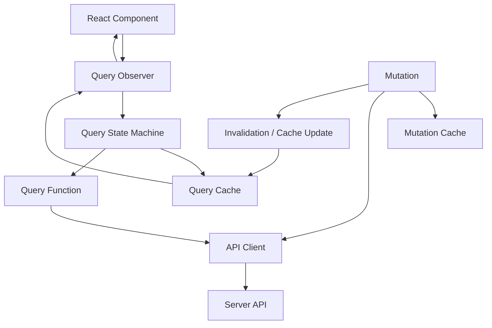
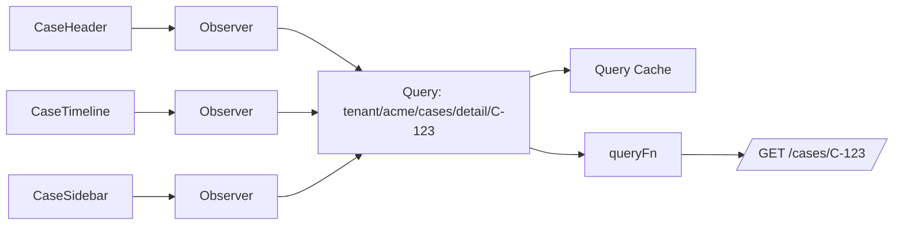
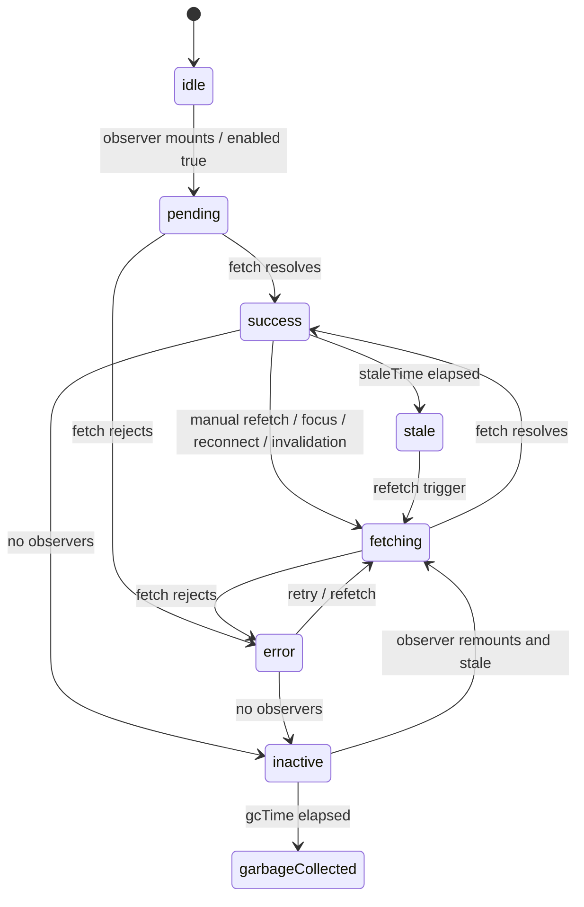
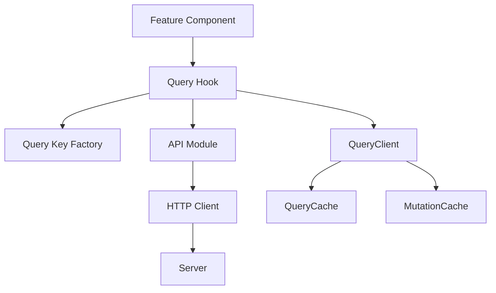
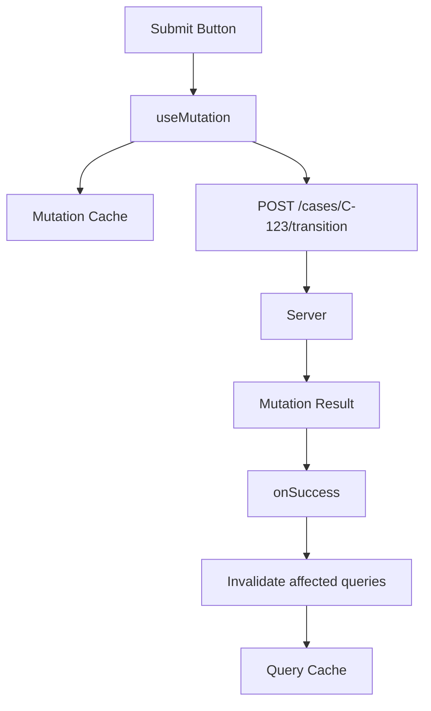

# Part 025 — Query Client Architecture

> Target mental model: **a query client is not a hook helper. It is a client-side server-state kernel.** It owns a cache, observes networked resources, coordinates background refetch, tracks mutations, and exposes a controlled interface between React rendering and remote truth.

A mature React app does not merely "call APIs".

It maintains a local, temporary, lossy, observable replica of remote server state.

That replica must answer hard questions:

- which resource is this data for?
- who is allowed to see it?
- how fresh is it?
- who is currently observing it?
- can this request be deduplicated?
- should this stale data still be rendered?
- what should happen after a mutation?
- what should happen when the browser regains focus?
- what should happen when the user logs out?
- what should happen when one tab changes data used by another tab?
- where do errors become UI state, telemetry, or retry policy?

If every component answers these questions independently, your app becomes a distributed system with no coordinator.

A query client is that coordinator.

This part uses **TanStack Query v5** as the concrete implementation because it exposes the right primitives: `QueryClient`, `QueryCache`, `MutationCache`, query observers, mutations, invalidation, default options, focus/reconnect behavior, hydration, and cache subscriptions. The architecture applies even if you build your own server-state layer.

---

## 1. The Problem a Query Client Solves

Without a query client, each component tends to do this:

```tsx
function CaseHeader({ caseId }: { caseId: string }) {
  const [data, setData] = useState<CaseDto | null>(null)
  const [loading, setLoading] = useState(false)
  const [error, setError] = useState<unknown>(null)

  useEffect(() => {
    let ignore = false
    setLoading(true)

    fetch(`/api/cases/${caseId}`)
      .then((r) => r.json())
      .then((json) => {
        if (!ignore) setData(json)
      })
      .catch((err) => {
        if (!ignore) setError(err)
      })
      .finally(() => {
        if (!ignore) setLoading(false)
      })

    return () => {
      ignore = true
    }
  }, [caseId])

  // render...
}
```

This looks local and simple.

It hides global problems:

- another component may fetch the same case;
- route navigation may need the same data earlier;
- a mutation may need to invalidate the case;
- focus regain may need refetch;
- stale data may be acceptable in one screen but dangerous in another;
- error handling becomes inconsistent;
- cancellation is incomplete;
- user logout may leave private data in memory;
- performance instrumentation is scattered;
- retries may accidentally hammer the backend.

A query client replaces scattered component lifecycle with an explicit server-state lifecycle.



The hook is only the visible tip.

The real value is the architecture underneath.

---

## 2. Core Runtime Objects

At production scale, think in these layers:

| Layer | Responsibility | Example |
|---|---|---|
| API client | HTTP execution, parsing, error envelope, auth transport, tracing | `api.getCase(id, { signal })` |
| Query function | Bind resource identity to API client execution | `queryFn: ({ signal }) => api.getCase(id, { signal })` |
| Query key | Stable cache address for a remote representation | `['case', tenantId, caseId]` |
| Query cache | Stores query state, data, timestamps, observers, status | `queryClient.getQueryCache()` |
| Query client | Public control plane over query/mutation cache | `invalidateQueries`, `setQueryData` |
| Query observer | Connects React component to query state | `useQuery(...)` |
| Mutation cache | Tracks mutation execution and global mutation callbacks | `queryClient.getMutationCache()` |
| Policy layer | Default retry, stale time, GC, refetch triggers | `defaultOptions` |
| App boundary | Provides a stable client instance to React | `QueryClientProvider` |

The mistake is to treat `useQuery` as the architecture.

The architecture is the contract between all these layers.

---

## 3. QueryClient Is a Process-Scoped Server-State Kernel

A `QueryClient` should usually be created once per application runtime boundary.

```tsx
import { QueryClient, QueryClientProvider } from '@tanstack/react-query'

const queryClient = new QueryClient()

export function AppRoot() {
  return (
    <QueryClientProvider client={queryClient}>
      <App />
    </QueryClientProvider>
  )
}
```

Do not create it inside a frequently rendered component.

Bad:

```tsx
function AppRoot() {
  const queryClient = new QueryClient()

  return (
    <QueryClientProvider client={queryClient}>
      <App />
    </QueryClientProvider>
  )
}
```

Why this is bad:

- every render can create a new cache;
- queries lose previous state;
- deduplication breaks;
- mutations lose global lifecycle;
- DevTools become confusing;
- hydration can mismatch;
- memory usage becomes unpredictable.

A query client is closer to a database connection pool than a local variable.

It should have deliberate lifetime.

---

## 4. The Query Client Boundary

The query client should not be a dumping ground for every piece of app state.

It should own **server state replicas**.

It should not own:

- local input text;
- modal open/close state;
- unsaved form draft as canonical state;
- drag state;
- wizard step index;
- ephemeral UI selections unless backed by URL or server;
- secrets;
- long-lived identity tokens;
- authorization decisions that must be revalidated server-side.

It can cache:

- resource DTOs;
- list pages;
- lookup/reference data;
- permission summaries returned by server;
- feature flag snapshots;
- computed server projections;
- mutation result payloads if intentionally stored.

The clean boundary is this:

> If the server is the source of truth and the client needs a replica, it belongs in server-state cache.

---

## 5. Query Key + Query Function = Resource Observer

A query is not just a function.

A query is the pair:

```txt
query = queryKey + queryFn + policy
```

Example:

```tsx
export const caseKeys = {
  all: (tenantId: string) => ['tenant', tenantId, 'cases'] as const,
  detail: (tenantId: string, caseId: string) =>
    ['tenant', tenantId, 'cases', 'detail', caseId] as const,
}

export function useCaseDetail(tenantId: string, caseId: string) {
  return useQuery({
    queryKey: caseKeys.detail(tenantId, caseId),
    queryFn: ({ signal }) =>
      caseApi.getCaseDetail({ tenantId, caseId, signal }),
  })
}
```

Important invariant:

> Every variable that changes the returned representation must be present in the query key.

This includes:

- tenant;
- user scope, when response is user-specific;
- resource ID;
- filters;
- sort;
- pagination cursor;
- locale, if representation changes;
- permission mode, if response shape changes;
- feature flag version, if representation changes;
- API version, if multiple versions coexist.

Do not hide representation-changing variables inside `queryFn` closures without putting them in the key.

Bad:

```tsx
function useCases(filters: CaseFilters) {
  return useQuery({
    queryKey: ['cases'],
    queryFn: () => caseApi.searchCases(filters),
  })
}
```

Good:

```tsx
function useCases(filters: CaseFilters) {
  const normalized = normalizeCaseFilters(filters)

  return useQuery({
    queryKey: ['cases', 'search', normalized],
    queryFn: ({ signal }) => caseApi.searchCases({ filters: normalized, signal }),
  })
}
```

A query key is the address of a cached representation.

The query function is how to refresh that representation.

---

## 6. Observer Model: Why Multiple Components Do Not Need Multiple Requests

A query cache allows multiple observers to subscribe to the same query.



If the query key is identical, the query client can share cached state and coordinate fetches.

The UI gets consistency:

- all observers see the same data version;
- refetch status is shared;
- error status is shared;
- invalidation targets the same cache record;
- deduplication becomes natural;
- mutation updates can patch one cache location.

This is why query-key design is not naming style.

It is distributed state addressing.

---

## 7. Query State Machine

A query is a state machine with data, status, fetch status, timestamps, and observers.

Simplified:



Do not flatten this into:

```ts
const loading = true | false
```

A production query state distinguishes:

- no data and first fetch pending;
- data exists and background refetch is pending;
- data exists and background refetch failed;
- data is stale but visible;
- query is disabled;
- query is inactive;
- query has been invalidated;
- query has been garbage collected.

Those states produce different UI and operational behavior.

---

## 8. QueryClient Default Options Are Architecture Policy

A common bad setup:

```ts
const queryClient = new QueryClient()
```

This uses library defaults.

That may be okay for a prototype.

In a serious application, defaults are part of your engineering policy.

Example:

```ts
import { QueryClient } from '@tanstack/react-query'

export function createAppQueryClient() {
  return new QueryClient({
    defaultOptions: {
      queries: {
        staleTime: 30_000,
        gcTime: 10 * 60_000,
        retry: (failureCount, error) => {
          if (isHttpStatus(error, 400, 401, 403, 404, 409, 422)) return false
          return failureCount < 2
        },
        retryDelay: (attemptIndex) =>
          Math.min(1_000 * 2 ** attemptIndex, 10_000),
        refetchOnWindowFocus: true,
        refetchOnReconnect: true,
      },
      mutations: {
        retry: false,
      },
    },
  })
}
```

The exact numbers are not universal.

The important point is that defaults encode decisions:

- how stale is acceptable by default?
- how long can inactive data remain in memory?
- which failures are retryable?
- should focus regain refetch stale data?
- should reconnect refetch stale data?
- should mutations retry automatically?

You want these decisions visible during review.

---

## 9. Separate API Client From Query Client

Do not put HTTP details directly inside components.

Bad:

```tsx
useQuery({
  queryKey: ['case', caseId],
  queryFn: async () => {
    const response = await fetch(`/api/cases/${caseId}`)
    if (!response.ok) throw new Error('Failed')
    return response.json()
  },
})
```

Better:

```ts
// api/case-api.ts
export async function getCaseDetail(input: {
  tenantId: string
  caseId: string
  signal?: AbortSignal
}): Promise<CaseDetailDto> {
  return http.get(`/tenants/${input.tenantId}/cases/${input.caseId}`, {
    signal: input.signal,
    schema: CaseDetailSchema,
  })
}
```

```tsx
// queries/use-case-detail.ts
export function useCaseDetail(tenantId: string, caseId: string) {
  return useQuery({
    queryKey: caseKeys.detail(tenantId, caseId),
    queryFn: ({ signal }) =>
      getCaseDetail({ tenantId, caseId, signal }),
  })
}
```

Why:

- the API client owns transport correctness;
- the query layer owns server-state lifecycle;
- the component owns rendering decisions;
- tests can isolate each layer;
- future API style changes are localized;
- observability is not scattered.

---

## 10. Query Function Contract

A production query function should be:

- deterministic for the same query key and auth context;
- side-effect free from a business perspective;
- abort-aware;
- typed;
- parse-safe;
- error-envelope aware;
- traceable;
- independent from component-local state except through explicit parameters.

Recommended shape:

```ts
type QueryFnInput = {
  tenantId: string
  caseId: string
  signal?: AbortSignal
}

async function fetchCaseDetail(input: QueryFnInput): Promise<CaseDetailDto> {
  return http.request({
    method: 'GET',
    path: `/tenants/${input.tenantId}/cases/${input.caseId}`,
    signal: input.signal,
    responseSchema: CaseDetailSchema,
    operationName: 'case.detail.get',
  })
}
```

Avoid:

```ts
async function fetchCaseDetail() {
  const caseId = window.location.pathname.split('/').at(-1)
  const token = localStorage.getItem('token')
  return fetch(`/api/cases/${caseId}?token=${token}`).then((r) => r.json())
}
```

That function has hidden inputs.

Hidden inputs break cache identity.

---

## 11. Cancellation: QueryClient Must Cooperate With Fetch

TanStack Query can pass an `AbortSignal` to the query function.

Use it.

```ts
export function useCaseTimeline(tenantId: string, caseId: string) {
  return useQuery({
    queryKey: ['tenant', tenantId, 'cases', caseId, 'timeline'],
    queryFn: ({ signal }) =>
      timelineApi.getTimeline({ tenantId, caseId, signal }),
  })
}
```

Then pass it to `fetch`:

```ts
async function getTimeline(input: {
  tenantId: string
  caseId: string
  signal?: AbortSignal
}) {
  return http.get(`/tenants/${input.tenantId}/cases/${input.caseId}/timeline`, {
    signal: input.signal,
  })
}
```

Cancellation is not only performance.

It protects correctness:

- abandoned navigations should not keep consuming bandwidth;
- obsolete searches should not overwrite newer results;
- hidden tabs should avoid unnecessary work when possible;
- SSR request cancellation should stop wasted backend calls;
- tests become deterministic.

But cancellation is not rollback.

If the server already processed a request, aborting the browser request only stops the client from waiting for the result.

---

## 12. QueryCache and MutationCache as Event Sources

The query client can expose cache-level events.

Use this carefully.

Good uses:

- telemetry;
- debugging;
- audit-safe error reporting;
- global toast policy for selected errors;
- logout cache clearing;
- dev-only cache inspection;
- app-level metrics.

Bad uses:

- hidden business logic;
- cross-resource coupling;
- global side effects that components cannot predict;
- toasts for every query error;
- analytics containing PII payloads.

Example setup:

```ts
import {
  MutationCache,
  QueryCache,
  QueryClient,
} from '@tanstack/react-query'

export function createAppQueryClient() {
  return new QueryClient({
    queryCache: new QueryCache({
      onError: (error, query) => {
        reportQueryError({
          error,
          queryHash: query.queryHash,
          meta: query.meta,
        })
      },
    }),
    mutationCache: new MutationCache({
      onError: (error, variables, context, mutation) => {
        reportMutationError({
          error,
          mutationKey: mutation.options.mutationKey,
          meta: mutation.meta,
        })
      },
    }),
  })
}
```

Design rule:

> Cache-level callbacks should observe and coordinate. They should not become an invisible application service layer.

---

## 13. QueryClient Placement in Application Architecture

A good folder boundary:

```txt
src/
  app/
    AppRoot.tsx
    query-client.ts
  api/
    http-client.ts
    case-api.ts
    timeline-api.ts
  queries/
    case-keys.ts
    use-case-detail.ts
    use-case-timeline.ts
    use-case-search.ts
  features/
    cases/
      CaseDetailPage.tsx
      CaseHeader.tsx
      CaseTimeline.tsx
```

The component imports query hooks, not raw HTTP endpoints.

```tsx
function CaseDetailPage({ tenantId, caseId }: Props) {
  const caseQuery = useCaseDetail(tenantId, caseId)
  const timelineQuery = useCaseTimeline(tenantId, caseId)

  // render state composition
}
```

This gives you layers:



Each layer has one job.

That is how the system remains evolvable.

---

## 14. Query Options Factories

Large apps should avoid repeating query options inline.

Use query option factories.

```ts
export const caseQueries = {
  detail: (tenantId: string, caseId: string) => ({
    queryKey: caseKeys.detail(tenantId, caseId),
    queryFn: ({ signal }: { signal: AbortSignal }) =>
      caseApi.getCaseDetail({ tenantId, caseId, signal }),
    staleTime: 30_000,
    meta: {
      resource: 'case',
      operation: 'case.detail.get',
      pii: 'low',
    },
  }),

  timeline: (tenantId: string, caseId: string) => ({
    queryKey: caseKeys.timeline(tenantId, caseId),
    queryFn: ({ signal }: { signal: AbortSignal }) =>
      caseApi.getTimeline({ tenantId, caseId, signal }),
    staleTime: 10_000,
    meta: {
      resource: 'case-timeline',
      operation: 'case.timeline.list',
      pii: 'medium',
    },
  }),
}
```

Then:

```tsx
function useCaseDetail(tenantId: string, caseId: string) {
  return useQuery(caseQueries.detail(tenantId, caseId))
}
```

Benefits:

- route loaders can prefetch using the same options;
- components use the same cache address;
- tests can reuse query options;
- invalidation can target known keys;
- metadata becomes consistent;
- stale-time policy is colocated with resource semantics.

---

## 15. Metadata as Operational Context

`meta` is underrated.

It lets you attach operational context without changing the data payload.

Example:

```ts
useQuery({
  queryKey: caseKeys.detail(tenantId, caseId),
  queryFn: ({ signal }) => caseApi.getCaseDetail({ tenantId, caseId, signal }),
  meta: {
    operationName: 'case.detail.get',
    resourceType: 'case',
    ownerTeam: 'case-management',
    containsPii: true,
    errorSurface: 'page',
  },
})
```

Useful for:

- error reporting;
- RUM event tags;
- internal dashboards;
- security review;
- suppressing global toasts for expected errors;
- deciding whether payload data may be logged;
- debugging cache behavior by operation name.

Do not store secrets in metadata.

Do not store large objects in metadata.

---

## 16. Multi-Tenant and Multi-User QueryClient Strategy

The most dangerous cache bug is cross-principal data leakage.

If response data depends on tenant or user, scope the cache.

Minimum:

```ts
const caseKeys = {
  detail: (tenantId: string, caseId: string) =>
    ['tenant', tenantId, 'cases', 'detail', caseId] as const,
}
```

On logout:

```ts
async function logout() {
  await authApi.logout()
  queryClient.clear()
  redirectToLogin()
}
```

On tenant switch:

```ts
async function switchTenant(nextTenantId: string) {
  queryClient.clear()
  tenantStore.setTenantId(nextTenantId)
  navigate(`/tenants/${nextTenantId}`)
}
```

Alternative for highly isolated apps:

```tsx
<QueryClientProvider key={sessionId} client={queryClientForSession}>
  <App />
</QueryClientProvider>
```

Trade-off:

| Strategy | Pros | Cons |
|---|---|---|
| Include tenant/user in keys | Efficient, targeted invalidation possible | Requires discipline everywhere |
| Clear cache on principal switch | Safer, simple | Loses reusable reference data |
| New QueryClient per session | Strong isolation | More lifecycle complexity |
| Persist cache across sessions | Faster reload | High security review burden |

For regulated systems, default to safety.

Private server state should not survive logout unless there is a reviewed, encrypted, explicit persistence policy.

---

## 17. MutationCache Is Not Just `useMutation`

Queries observe server state.

Mutations change server state.

The mutation cache tracks mutation executions separately from query cache entries.



Do not treat mutation success as automatically updating every query.

You must define impact.

Example:

```ts
const transitionCase = useMutation({
  mutationKey: ['case', 'transition'],
  mutationFn: caseApi.transitionCase,
  onSuccess: (_result, variables) => {
    queryClient.invalidateQueries({
      queryKey: caseKeys.detail(variables.tenantId, variables.caseId),
    })
    queryClient.invalidateQueries({
      queryKey: caseKeys.timeline(variables.tenantId, variables.caseId),
    })
    queryClient.invalidateQueries({
      queryKey: caseKeys.lists(variables.tenantId),
    })
  },
})
```

The mutation is a command.

Invalidation is the consistency protocol.

---

## 18. Invalidation Is an Architectural API

Invalidation should be designed, not scattered.

Bad:

```tsx
onSuccess: () => {
  queryClient.invalidateQueries()
}
```

This creates a thundering herd from the client.

Better:

```ts
export function invalidateCaseAfterTransition(input: {
  queryClient: QueryClient
  tenantId: string
  caseId: string
}) {
  input.queryClient.invalidateQueries({
    queryKey: caseKeys.detail(input.tenantId, input.caseId),
  })

  input.queryClient.invalidateQueries({
    queryKey: caseKeys.timeline(input.tenantId, input.caseId),
  })

  input.queryClient.invalidateQueries({
    queryKey: caseKeys.lists(input.tenantId),
    exact: false,
  })
}
```

Then mutation code calls the named policy:

```ts
onSuccess: (_data, variables) => {
  invalidateCaseAfterTransition({
    queryClient,
    tenantId: variables.tenantId,
    caseId: variables.caseId,
  })
}
```

This makes consistency reviewable.

Ask during code review:

- what resources did this mutation change?
- which query keys represent those resources?
- should we patch cache directly or invalidate?
- should list queries refetch now or later?
- is optimistic UI safe?
- are there external subscribers or other tabs?

---

## 19. Direct Cache Update vs Invalidation

There are two common post-mutation strategies.

### Strategy A: Invalidate and refetch

```ts
queryClient.invalidateQueries({
  queryKey: caseKeys.detail(tenantId, caseId),
})
```

Use when:

- server computes derived fields;
- authorization may change;
- multiple aggregates are affected;
- result payload is partial;
- business rules are complex;
- correctness matters more than avoiding one request.

### Strategy B: Patch cache directly

```ts
queryClient.setQueryData(
  caseKeys.detail(tenantId, caseId),
  (old: CaseDetailDto | undefined) => {
    if (!old) return old
    return {
      ...old,
      title: newTitle,
      updatedAt: result.updatedAt,
    }
  },
)
```

Use when:

- mutation result is authoritative;
- changed fields are local and known;
- server returns the updated resource;
- latency hiding matters;
- patch logic is simple and tested.

Do not patch cache with imagined server results unless it is intentionally optimistic and rollback-safe.

---

## 20. QueryClient and Route Loaders

Modern React apps often fetch at route level.

A query client still helps.

Route loader:

```ts
export async function caseDetailLoader({ params }: LoaderArgs) {
  const tenantId = requireTenantId(params)
  const caseId = requireCaseId(params)

  await queryClient.ensureQueryData(
    caseQueries.detail(tenantId, caseId),
  )

  return { tenantId, caseId }
}
```

Component:

```tsx
function CaseDetailRoute() {
  const { tenantId, caseId } = useLoaderData() as LoaderData
  const caseQuery = useQuery(caseQueries.detail(tenantId, caseId))

  return <CaseDetailView data={caseQuery.data} />
}
```

The loader ensures data before route render.

The component observes the same cache entry.

No duplicate architecture.

---

## 21. SSR, Hydration, and QueryClient Lifetime

Server rendering changes the lifetime model.

Browser app:

```txt
one QueryClient per browser app session
```

Server request:

```txt
one QueryClient per HTTP request
```

Never reuse a server-side query client across users.

Bad:

```ts
// server module singleton: unsafe for SSR
const queryClient = new QueryClient()
```

Good:

```ts
export async function renderRequest(request: Request) {
  const queryClient = new QueryClient()

  await queryClient.prefetchQuery(...)

  const dehydratedState = dehydrate(queryClient)

  return renderHtml({ dehydratedState })
}
```

Why:

- SSR data may contain private user state;
- concurrent requests may overlap;
- cache entries may leak between users;
- auth context differs per request;
- tenant context differs per request.

On the browser, hydrate into a stable client.

---

## 22. Cross-Tab and Persistence Are Advanced Boundaries

A single `QueryClient` lives in one JavaScript runtime.

It does not automatically coordinate every browser tab.

If you add persistence or broadcast synchronization, you are changing the consistency model.

Ask:

- can cached data be stored on disk?
- does it contain PII?
- should logout in one tab clear another tab?
- should mutation in one tab invalidate another tab?
- what is the maximum acceptable stale window?
- what happens when two tabs edit the same resource?

Cross-tab sync can improve UX.

It can also create subtle security and ordering bugs.

Treat it as architecture, not a plugin checkbox.

---

## 23. DevTools Are Part of the Engineering Workflow

A server-state cache is invisible unless you inspect it.

During development, inspect:

- query keys;
- stale/fresh status;
- active/inactive observers;
- fetch status;
- dataUpdatedAt;
- invalidation events;
- retry behavior;
- garbage collection timing;
- mutation state;
- query waterfalls.

The main debugging question is not:

> “Why did the component render?”

It is:

> “Which cache entry changed, why, and who observed it?”

That is a different debugging posture.

---

## 24. Error Boundary Strategy

Query errors have several possible surfaces:

- inline field error;
- empty-state error;
- page-level error;
- toast;
- modal;
- route error boundary;
- global incident banner;
- silent telemetry-only event.

Do not use one global rule for all query errors.

A failed optional widget should not crash a case detail page.

A failed primary case detail query may need a page-level error.

A failed background refresh with existing data may need a subtle stale warning.

Use metadata and local UI state composition.

```tsx
function CaseDetailPage({ tenantId, caseId }: Props) {
  const query = useCaseDetail(tenantId, caseId)

  if (query.isPending) return <PageSkeleton />

  if (query.isError && !query.data) {
    return <PageError error={query.error} />
  }

  return (
    <CaseDetailView
      caseDetail={query.data}
      refreshing={query.isFetching}
      refreshError={query.isError ? query.error : null}
    />
  )
}
```

The existence of data changes the error surface.

---

## 25. Production Query Client Template

A serious baseline:

```ts
import {
  MutationCache,
  QueryCache,
  QueryClient,
} from '@tanstack/react-query'

export function createAppQueryClient() {
  return new QueryClient({
    queryCache: new QueryCache({
      onError: (error, query) => {
        telemetry.capture('query.error', {
          queryHash: query.queryHash,
          operationName: query.meta?.operationName,
          containsPii: query.meta?.containsPii,
          error: serializeSafeError(error),
        })
      },
    }),

    mutationCache: new MutationCache({
      onError: (error, variables, context, mutation) => {
        telemetry.capture('mutation.error', {
          mutationKey: mutation.options.mutationKey,
          operationName: mutation.meta?.operationName,
          error: serializeSafeError(error),
        })
      },
    }),

    defaultOptions: {
      queries: {
        staleTime: 30_000,
        gcTime: 10 * 60_000,
        retry: (failureCount, error) => {
          if (isAbortError(error)) return false
          if (isHttpStatus(error, 400, 401, 403, 404, 409, 422)) return false
          return failureCount < 2
        },
        retryDelay: (attempt) => Math.min(1_000 * 2 ** attempt, 10_000),
        refetchOnWindowFocus: true,
        refetchOnReconnect: true,
      },
      mutations: {
        retry: false,
      },
    },
  })
}
```

This is not the only valid policy.

It is a template for making policy explicit.

---

## 26. Architecture Checklist

Before approving a query client setup, check:

- Is `QueryClient` created with stable lifetime?
- Is there a clear API client layer below query hooks?
- Do query functions accept `signal`?
- Are query keys stable, serializable, and complete?
- Are tenant/user scopes present in keys or isolated by cache lifecycle?
- Are default retry rules safe for mutations and non-idempotent operations?
- Are `staleTime` and `gcTime` intentional?
- Is global error reporting PII-safe?
- Are mutation invalidation policies named and reviewable?
- Is logout clearing private server state?
- Are route loaders and component queries sharing the same options?
- Is SSR using per-request query clients?
- Are DevTools available in development?
- Is cache persistence explicitly reviewed before use?

---

## 27. Common Failure Modes

| Failure | Root Cause | Fix |
|---|---|---|
| Data leaks after logout | Cache not cleared | `queryClient.clear()` on logout/session switch |
| Duplicate requests | Query keys differ for same representation | Centralize key factories |
| Wrong data rendered | Missing variable in query key | Include every representation-changing input |
| Refetch storm | Broad invalidation or low stale time everywhere | Target invalidation and classify resource freshness |
| Retry storm | Retrying deterministic 4xx/domain errors | Retry only transient failures |
| Memory growth | Long `gcTime` with many large inactive queries | Tune `gcTime`, avoid caching huge payloads |
| Stale privileged view | Permission/user scope missing from key | Add security scope or clear on auth change |
| Background error destroys page | UI treats any error as fatal | Distinguish initial error from refresh error |
| SSR data leak | Shared server QueryClient | Create per-request QueryClient |
| Uncancelled requests | Query function ignores `signal` | Pass `signal` to API client/fetch |

---

## 28. The Mental Model to Keep

A query client is a local database for remote truth, but it is not the source of truth.

It is a replica manager.

It has:

- addresses: query keys;
- records: query cache entries;
- readers: observers;
- writers: mutations and cache updates;
- freshness policy: stale time and invalidation;
- residency policy: garbage collection;
- synchronization triggers: focus, reconnect, intervals, manual refetch;
- operational hooks: telemetry and DevTools;
- security boundaries: user, tenant, session.

When you design it this way, React client-server communication stops being a pile of effects.

It becomes a controlled data plane.

---

## References

- TanStack Query documentation — QueryClient, QueryCache, MutationCache, QueryClientProvider, Important Defaults, useQuery.
- React documentation — rendering and external system synchronization.
- MDN Fetch API documentation — `fetch`, `AbortSignal`, response parsing, and browser runtime behavior.
