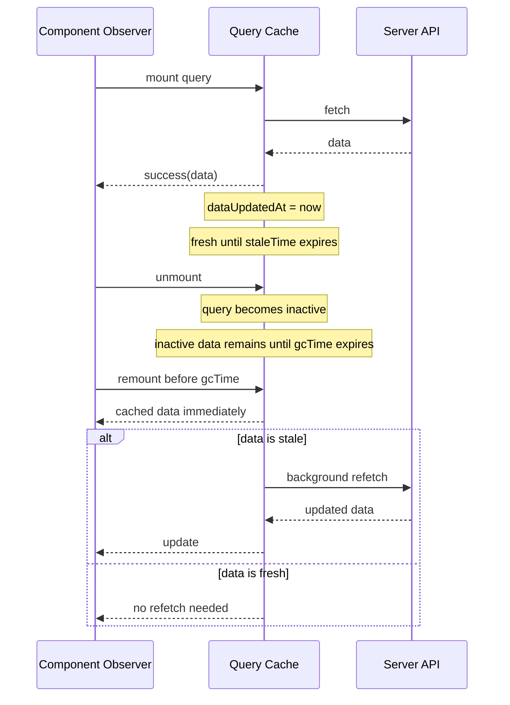
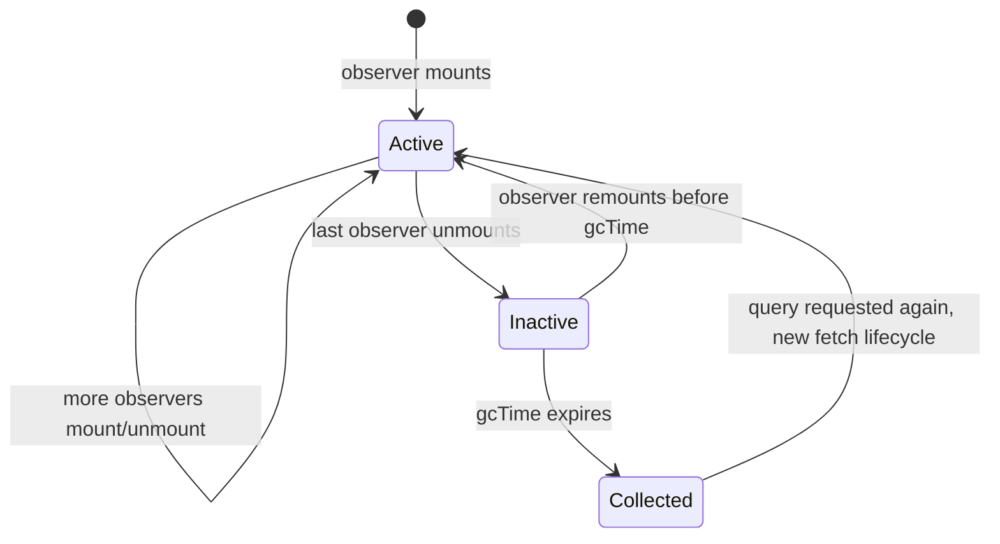
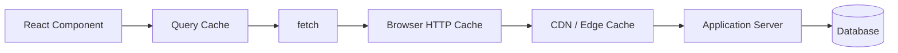
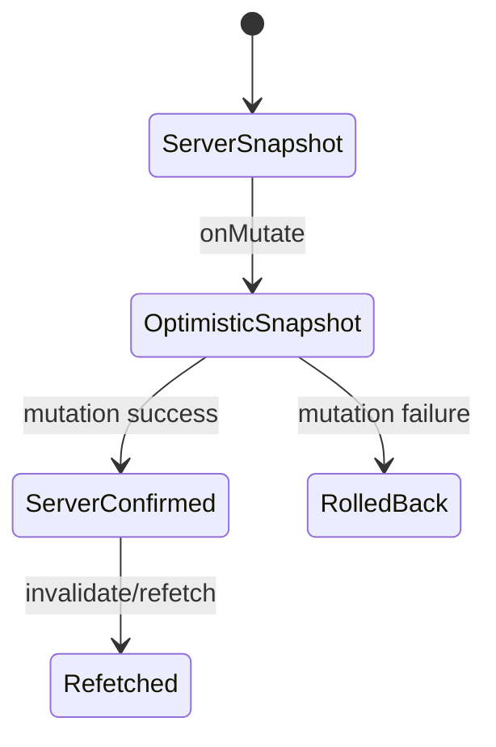

# Part 026 — Cache Lifetime, Stale Time, and GC

> Target mental model: **freshness and memory residency are different knobs.** `staleTime` answers “is this data fresh enough to trust without refetching?” `gcTime` answers “how long may unused cached data stay in memory?” Confusing them creates either stale UX or wasteful traffic.

Most developers first misunderstand cache lifetime because they ask one vague question:

> “How long is this cached?”

That is not one question.

It is at least four questions:

1. **Freshness:** how long can the cached value be considered fresh?
2. **Visibility:** can stale data still be rendered?
3. **Refetch trigger:** when should the client attempt to refresh?
4. **Residency:** how long should inactive data remain in memory?

A server-state cache must separate these dimensions.

Otherwise every performance fix becomes a correctness bug, and every correctness fix becomes a traffic spike.

---

## 1. The Four Lifetimes of Server State

A query cache entry has multiple clocks.



The clocks:

| Concept | Meaning | Controlled by |
|---|---|---|
| Freshness | Whether data is considered fresh or stale | `staleTime` |
| Activity | Whether at least one observer is mounted | React component/query observer lifecycle |
| Residency | How long inactive cache entry remains before GC | `gcTime` |
| Validity | Whether data is explicitly marked stale regardless of age | invalidation |

These are separate.

---

## 2. `staleTime` Is Not Cache Duration

`staleTime` is a freshness window.

During the freshness window, the client can reuse cached data without automatically refetching for normal stale-trigger events.

When the freshness window expires, data becomes stale.

Stale does not mean deleted.

Stale means:

> “This data may still be useful to render, but the client is allowed or encouraged to refresh it under configured triggers.”

Example:

```ts
useQuery({
  queryKey: ['case', caseId],
  queryFn: fetchCase,
  staleTime: 60_000,
})
```

This says:

> For 60 seconds after a successful fetch, treat this representation as fresh.

It does **not** say:

> Delete this data after 60 seconds.

Deletion/residency is `gcTime`.

---

## 3. `gcTime` Is Not Freshness

`gcTime` controls inactive cache retention.

A query becomes inactive when it has no observers.

If it remains inactive past `gcTime`, it can be garbage collected.

```ts
useQuery({
  queryKey: ['case', caseId],
  queryFn: fetchCase,
  staleTime: 30_000,
  gcTime: 5 * 60_000,
})
```

This says:

- data is fresh for 30 seconds after update;
- if no component observes it, keep it in memory for up to 5 minutes;
- if a component remounts during that 5-minute window, it can get cached data immediately;
- if data is stale on remount, a background refetch may happen depending on policy.

`gcTime` is a memory and navigation-performance knob.

It is not a correctness knob.

---

## 4. Active vs Inactive Queries

A query is **active** when at least one observer is mounted.

A query is **inactive** when it remains in cache but no mounted observer currently uses it.



This matters for navigation.

Example:

1. User opens case detail.
2. Data is fetched and cached.
3. User navigates to comments page.
4. Case detail query becomes inactive.
5. User navigates back within `gcTime`.
6. Cached data renders immediately.
7. If stale, background refresh starts.

This creates a fast back-navigation experience without pretending the data is permanently fresh.

---

## 5. Default Behavior Must Be Understood Before Customized

TanStack Query's important defaults are intentionally conservative for freshness:

- cached query data is considered stale by default unless configured with `staleTime`;
- stale queries may refetch in the background when new observers mount, the window is refocused, or the network reconnects;
- inactive queries are garbage collected after a default window unless `gcTime` is configured;
- failed queries are retried by default unless retry policy is changed.

That default makes demos feel correct.

Production apps usually need resource-specific policy.

The mistake is to globally disable refetch triggers because they were surprising.

Better:

- understand why they fired;
- tune stale windows by resource type;
- disable only where the product semantics require it;
- instrument before optimizing.

---

## 6. Fresh, Stale, Invalidated, and Collected

These words are different.

| State | Meaning | Can render data? | Should refetch? |
|---|---|---:|---:|
| Fresh | Within `staleTime` and not invalidated | Yes | Usually no |
| Stale | Freshness window elapsed | Yes, if data exists | Often yes on trigger |
| Invalidated | Explicitly marked stale by app | Yes, if data exists | Yes, when observed/refetched |
| Inactive | No observers | Not currently rendered | Maybe later |
| Collected | Removed from cache | No | New request needed |

A cache entry can be stale and still valuable.

A cache entry can be invalidated and still rendered while refresh is pending.

A cache entry can be inactive but still in memory.

A cache entry can be fresh but still wrong if your key omitted representation-changing inputs.

Freshness policy cannot fix bad identity.

---

## 7. Timeline Example

Assume:

```ts
staleTime = 30 seconds
gcTime = 5 minutes
```

Timeline:

```txt
T+00s: query fetches case detail successfully
T+10s: component unmounts; query becomes inactive
T+25s: component remounts; cached data is fresh; no refetch
T+35s: component still mounted; data is now stale
T+40s: window refocuses; stale query refetches
T+41s: updated data arrives; fresh again
T+60s: component unmounts
T+06m: query still inactive after gcTime; cache entry collected
T+07m: component remounts; no cached data; hard loading state
```

The UX difference between T+25s and T+07m is intentional.

At T+25s the user sees immediate data.

At T+07m the app must fetch again because the inactive cache record was removed.

---

## 8. Resource Freshness Classes

Do not choose one stale time for everything.

Classify resources.

| Resource Type | Examples | Suggested `staleTime` posture |
|---|---|---|
| Highly volatile operational data | live SLA counters, queue length, current lock owner | low `staleTime`, polling/SSE maybe better |
| User-visible business object | case detail, customer profile, order detail | short to medium; invalidate after mutations |
| Append-heavy timeline | audit log, comments, activity feed | medium; invalidate append area after mutation |
| Reference data | countries, violation types, static dropdowns | long; versioned invalidation |
| Permission summary | allowed actions for current resource | short; invalidate after workflow/auth context changes |
| Feature flags | remote config snapshot | depends on rollout needs; usually short/medium |
| Search results | filtered lists, typeahead results | short; key must include filters |
| Immutable artifact metadata | file checksum, released document version | long or infinite if content-addressed |

The right question is:

> What is the maximum stale age that does not mislead the user or violate the business process?

Not:

> What number makes requests fewer?

---

## 9. Stale Time Decision Framework

Use this checklist.

### 9.1 How costly is stale data?

If stale data can cause wrong action, use short freshness and strong invalidation.

Examples:

- showing an action button the user can no longer execute;
- showing a case in the wrong workflow state;
- displaying outdated payment status;
- rendering a stale lock owner;
- approving based on outdated risk score.

### 9.2 How costly is refetch?

If refetch is cheap, lower `staleTime` may be acceptable.

If refetch is expensive, consider:

- aggregate endpoints;
- ETag/conditional requests;
- longer `staleTime`;
- explicit invalidation;
- realtime updates;
- server-side caching.

### 9.3 Who changes the data?

If only the current user changes it, mutation invalidation may be enough.

If many users or systems change it, stale time alone is weak.

Consider:

- focus refetch;
- polling;
- WebSocket/SSE;
- version checks;
- conflict detection;
- audit/event stream.

### 9.4 Does the backend expose version or timestamp?

Freshness is better when the client can display or compare version information.

Fields such as these help:

```ts
type CaseDetailDto = {
  id: string
  status: string
  version: number
  updatedAt: string
  serverTime: string
}
```

Versioning helps detect stale writes.

Timestamps help explain stale reads.

---

## 10. Suggested Freshness Policy Table

These are starting points, not universal truth.

| Data | Example | `staleTime` | Notes |
|---|---|---:|---|
| Case detail in active workflow | `/cases/:id` | 15s–60s | Invalidate after transitions/comments/assignment changes |
| Static lookup | violation types | 1h–24h | Better if versioned by release/config version |
| User profile menu | current user summary | 5m–30m | Clear on logout; refetch on session refresh |
| Permissions for resource | allowed actions | 5s–30s | Short; stale permissions are risky |
| Search result page | filtered cases | 0s–30s | Include full filters in key |
| Notification count | unread count | 0s–10s | Poll or realtime if important |
| Immutable document version | signed metadata for version `v42` | Infinity | Only if immutable by identity |
| Feature flags | flag snapshot | 30s–5m | Depends on rollout requirements |

A top engineer does not memorize numbers.

They define the business stale budget.

---

## 11. `Infinity` and `'static'` Are Sharp Tools

Some cache systems allow effectively infinite freshness.

This can be valid for immutable representations.

Example:

```ts
useQuery({
  queryKey: ['documents', documentId, 'version', versionId],
  queryFn: fetchDocumentVersion,
  staleTime: Infinity,
})
```

This is safe if `versionId` identifies immutable content.

It is dangerous if used for mutable resources:

```ts
useQuery({
  queryKey: ['case', caseId],
  queryFn: fetchCase,
  staleTime: Infinity,
})
```

A mutable case with infinite freshness means the UI may never refetch unless explicitly invalidated.

That is only safe if invalidation is comprehensive.

For `'static'`-style behavior, be even more careful: it can prevent refetch even when invalidated depending on the library semantics.

Use these modes only when identity includes immutability.

Content-addressed data is a good candidate.

Mutable operational data is not.

---

## 12. Invalidation Overrides Time

Time-based freshness is passive.

Invalidation is explicit.

After a mutation, you usually know that some cached representations are no longer trustworthy.

```ts
await queryClient.invalidateQueries({
  queryKey: caseKeys.detail(tenantId, caseId),
})
```

Invalidation says:

> Regardless of `staleTime`, mark this query stale.

Then, depending on whether it is observed and configured, it may refetch.

Use invalidation for causal changes.

Use `staleTime` for age-based confidence.

Do not use tiny `staleTime` as a substitute for missing invalidation.

That creates unnecessary traffic and still leaves consistency gaps.

---

## 13. Manual Refetch Is Not a Cache Policy

A common smell:

```tsx
const query = useQuery({
  queryKey: ['case', caseId],
  queryFn: fetchCase,
  enabled: false,
})

useEffect(() => {
  query.refetch()
}, [caseId])
```

This bypasses the declarative cache lifecycle.

Manual refetch is appropriate for:

- refresh buttons;
- retry actions;
- explicit user-driven reload;
- disabled queries waiting for form submission;
- rare imperative integration points.

It should not be your default data loading model.

Default should be:

```tsx
useQuery({
  queryKey: ['case', caseId],
  queryFn: fetchCase,
  enabled: Boolean(caseId),
  staleTime: 30_000,
})
```

The cache engine can then manage observers, stale triggers, retries, and dedupe.

---

## 14. Background Refetch UX

When stale data refetches, the UI should not always show a full-page spinner.

Distinguish:

- initial pending with no data;
- background fetching with existing data;
- background error with existing data.

Example:

```tsx
function CaseDetailPanel({ caseId }: { caseId: string }) {
  const query = useCaseDetail(caseId)

  if (query.isPending) return <CaseSkeleton />

  if (query.isError && !query.data) {
    return <CaseLoadError error={query.error} />
  }

  return (
    <section aria-busy={query.isFetching}>
      {query.isFetching && <SmallRefreshIndicator />}
      {query.isError && query.data && (
        <StaleWarning error={query.error} />
      )}
      <CaseDetail data={query.data} />
    </section>
  )
}
```

The user should not lose useful data just because a background refresh failed.

---

## 15. HTTP Cache vs Query Cache

There are multiple caches in play.



Each cache answers different questions.

| Cache | Layer | Main concern |
|---|---|---|
| Query cache | Application memory | React server-state lifecycle and rendering |
| Browser HTTP cache | Browser network stack | HTTP response reuse/revalidation |
| CDN cache | Edge/network | Shared response acceleration |
| Server cache | Backend | Computation/database load |
| Database cache | Storage engine | Query/page efficiency |

Do not confuse `staleTime` with `Cache-Control: max-age`.

`staleTime` controls app-level freshness behavior.

HTTP cache headers control network-level response caching and validation.

They can cooperate, but they are not the same policy.

---

## 16. Conditional Requests and Freshness

For expensive resources, backend support can reduce refetch cost.

With ETag:

```http
GET /api/cases/C-123 HTTP/1.1
If-None-Match: "case-C-123-v17"
```

Server can return:

```http
HTTP/1.1 304 Not Modified
ETag: "case-C-123-v17"
```

This still involves a request, but can avoid sending the full payload.

Client query cache still controls whether to attempt refetch.

HTTP validation controls how expensive the refetch is.

For large resources, both matter.

---

## 17. Memory Pressure and `gcTime`

Long `gcTime` improves navigation reuse.

It also keeps data in memory.

Memory risk grows with:

- large lists;
- infinite queries;
- file metadata trees;
- search result permutations;
- tenant switches;
- long-lived single-page sessions;
- background tabs left open for days;
- persisted caches;
- unbounded filters in query keys.

Example danger:

```ts
useQuery({
  queryKey: ['case-search', filters],
  queryFn: searchCases,
  gcTime: 60 * 60_000,
})
```

If `filters` changes frequently, you can retain many inactive search results for an hour.

Better:

```ts
useQuery({
  queryKey: ['case-search', normalizeFilters(filters)],
  queryFn: searchCases,
  staleTime: 10_000,
  gcTime: 2 * 60_000,
})
```

For high-cardinality queries, keep `gcTime` modest.

---

## 18. Cache Cardinality

Cache cardinality is the number of distinct entries your key design can create.

Low cardinality:

```txt
['current-user']
['lookup', 'countries']
['feature-flags']
```

High cardinality:

```txt
['case-search', { q, filters, sort, page }]
['case', caseId]
['timeline', caseId, cursor]
['attachment-preview', fileId]
```

High-cardinality queries need stricter controls:

- normalized keys;
- shorter `gcTime`;
- pagination/infinite-query limits;
- search debounce;
- minimum search length;
- careful prefetch;
- cache clearing on tenant/session switch.

Cache lifetime policy without cardinality awareness is incomplete.

---

## 19. Stale Time and Refetch Triggers

Stale data may refetch when certain triggers occur.

Common triggers:

- component mounts;
- window/tab regains focus;
- network reconnects;
- configured interval ticks;
- manual `refetch()`;
- explicit invalidation;
- route loader prefetch/ensure;
- app-specific event such as tenant switch.

The important subtlety:

> Triggers usually matter most when data is stale.

If data is still fresh, a mount/focus event may not fetch.

This is why increasing `staleTime` reduces surprising background requests.

But increasing it also increases tolerated stale age.

---

## 20. Window Focus Refetch

Focus refetch is often misunderstood.

The browser tab may be inactive for minutes or hours.

When the user returns, stale data may need refresh.

That behavior is often correct.

Disable it only when:

- data is immutable;
- another realtime channel maintains freshness;
- refetch is harmful or expensive;
- the screen has explicit refresh semantics;
- the resource has a long business freshness window.

Example:

```ts
useQuery({
  queryKey: ['lookup', 'violation-types'],
  queryFn: fetchViolationTypes,
  staleTime: 24 * 60 * 60_000,
  refetchOnWindowFocus: false,
})
```

But for workflow state:

```ts
useQuery({
  queryKey: ['case', caseId],
  queryFn: fetchCase,
  staleTime: 15_000,
  refetchOnWindowFocus: true,
})
```

The choice should reflect business volatility.

---

## 21. Reconnect Refetch

When the network reconnects, stale data may need synchronization.

This matters for:

- mobile users;
- laptops sleeping/waking;
- flaky VPN;
- offline-first queues;
- background tabs;
- field enforcement workflows.

Use reconnect refetch for resources where the user might act after reconnection.

Do not rely on it as the only sync mechanism for offline writes.

Offline mutations need their own queue, idempotency, and conflict model.

---

## 22. Polling Is Not a Stale Time Replacement

Polling answers:

> “Should I actively refresh on an interval while observed?”

`staleTime` answers:

> “How long should the last successful value be considered fresh?”

They can be used together.

Example:

```ts
useQuery({
  queryKey: ['case', caseId, 'sla'],
  queryFn: fetchSlaStatus,
  staleTime: 5_000,
  refetchInterval: 10_000,
})
```

For high-frequency updates, consider SSE/WebSocket instead of aggressive polling.

Polling every second across thousands of clients is a backend load generator.

---

## 23. Initial Data and Freshness

Sometimes you have initial data from route loader, SSR, parent query, or embedded payload.

The question is:

> When was this data updated?

If you provide initial data without accurate updated time, the cache may treat it with the wrong freshness.

Prefer providing update timestamps when supported.

Conceptually:

```ts
useQuery({
  queryKey: ['case', caseId],
  queryFn: fetchCase,
  initialData: loaderData.case,
  initialDataUpdatedAt: loaderData.fetchedAt,
  staleTime: 30_000,
})
```

The exact API depends on your stack, but the invariant is stable:

> Hydrated or seeded data needs a timestamp if freshness matters.

Without it, the cache cannot reason accurately.

---

## 24. Placeholder Data Is Not Fresh Data

Placeholder data is a rendering strategy.

It is not proof that the server representation has been fetched.

Use placeholder data for:

- maintaining layout stability;
- showing previous page while next page loads;
- avoiding empty flashes;
- skeleton-like approximations.

Do not use placeholder data as if it were authoritative.

```tsx
useQuery({
  queryKey: ['cases', filters, page],
  queryFn: fetchCases,
  placeholderData: (previousData) => previousData,
})
```

This can improve pagination UX.

But UI must avoid implying that previous page data is the new page's verified result.

Labels like “updating…” matter.

---

## 25. Cache Lifetime and Security

Cache lifetime is a security topic.

Private server data in memory can outlive the visible screen.

On logout:

```ts
queryClient.clear()
```

On role/permission context change:

```ts
queryClient.invalidateQueries()
// or clear if the previous principal's data must not remain visible
```

On tenant switch:

```ts
queryClient.clear()
```

Do not rely on `gcTime` to eventually remove sensitive data.

Eventually is not a security boundary.

Explicitly clear private caches on principal changes.

---

## 26. Cache Lifetime and Authorization

Authorization-sensitive data has two dimensions:

1. the data itself;
2. the permission to see or act on it.

Example:

```ts
useQuery({
  queryKey: ['tenant', tenantId, 'case', caseId, 'permissions'],
  queryFn: fetchCasePermissions,
  staleTime: 10_000,
})
```

Do not use long freshness windows for action permissions unless the server revalidates every mutation anyway.

It should.

Client permission data is for UX.

Server permission checks are for authority.

A stale client can hide or show buttons incorrectly, but it must not be able to force the server to accept an unauthorized mutation.

---

## 27. Cache Lifetime and Optimistic UI

Optimistic updates temporarily create client-side future state.

Freshness rules still apply, but optimistic state adds another layer.



After optimistic success, decide:

- is mutation result authoritative enough to patch cache?
- should query be invalidated to fetch server-computed fields?
- should staleTime reset based on mutation response time?
- do list queries need update or invalidation?

Do not let optimistic state live forever without reconciliation.

---

## 28. Cache Lifetime and Large Lists

Large lists are hard because they are expensive and often stale quickly.

Bad pattern:

```ts
useQuery({
  queryKey: ['cases'],
  queryFn: fetchAllCases,
  staleTime: 10 * 60_000,
})
```

Problems:

- huge payload;
- broad invalidation;
- stale result across filters;
- memory pressure;
- slow parsing;
- poor authorization boundaries.

Better:

```ts
useQuery({
  queryKey: ['cases', 'search', normalizedFilters, cursor],
  queryFn: fetchCaseSearchPage,
  staleTime: 15_000,
  gcTime: 2 * 60_000,
})
```

Then combine with:

- server pagination;
- cursor-based APIs;
- specific invalidation after mutation;
- list summaries separate from detail records;
- conditional requests if supported;
- route-level prefetch for likely next page.

---

## 29. Cache Lifetime Policy as Code

Avoid random numbers inline.

Define policy names.

```ts
export const queryPolicy = {
  volatile: {
    staleTime: 5_000,
    gcTime: 60_000,
  },
  interactive: {
    staleTime: 30_000,
    gcTime: 5 * 60_000,
  },
  reference: {
    staleTime: 6 * 60 * 60_000,
    gcTime: 24 * 60 * 60_000,
  },
  immutable: {
    staleTime: Infinity,
    gcTime: 60 * 60_000,
  },
} as const
```

Use them intentionally:

```ts
useQuery({
  queryKey: caseKeys.detail(tenantId, caseId),
  queryFn: fetchCaseDetail,
  ...queryPolicy.interactive,
})
```

This makes code review clearer.

The reviewer can ask:

> Is this resource really reference data?

That is better than debating `300000` milliseconds.

---

## 30. Domain-Specific Policy Example

For a regulatory case-management app:

```ts
export const regulatoryQueryPolicy = {
  caseDetail: {
    staleTime: 15_000,
    gcTime: 5 * 60_000,
    refetchOnWindowFocus: true,
    refetchOnReconnect: true,
  },

  caseTimeline: {
    staleTime: 10_000,
    gcTime: 5 * 60_000,
    refetchOnWindowFocus: true,
  },

  actionPermissions: {
    staleTime: 5_000,
    gcTime: 60_000,
    refetchOnWindowFocus: true,
  },

  referenceData: {
    staleTime: 6 * 60 * 60_000,
    gcTime: 24 * 60 * 60_000,
    refetchOnWindowFocus: false,
  },

  searchResults: {
    staleTime: 10_000,
    gcTime: 2 * 60_000,
  },
}
```

Why these differ:

- case detail drives user action;
- timeline changes as collaborators act;
- permissions can change with workflow state;
- reference data changes rarely;
- search has high cardinality.

This is how cache policy becomes business-aware.

---

## 31. Observability for Cache Lifetime

You cannot tune what you cannot see.

Track:

- request count per route;
- cache hit before network;
- background refetch count;
- refetch cause if available;
- query key cardinality;
- stale age when rendered;
- time since `dataUpdatedAt`;
- inactive cache size;
- garbage collection behavior;
- memory usage approximation;
- broad invalidation frequency;
- retry frequency.

Useful debug log shape:

```ts
type QueryTelemetryEvent = {
  event: 'query.fetch' | 'query.error' | 'query.success'
  operationName: string
  queryHash: string
  stale: boolean
  observerCount: number
  dataAgeMs?: number
  routeId?: string
  refetchCause?: 'mount' | 'focus' | 'reconnect' | 'manual' | 'invalidation'
}
```

Do not log payloads by default.

Log metadata.

---

## 32. Testing Cache Lifetime

Test the policy, not just the component.

Useful cases:

- remount within stale time should not refetch;
- remount after stale time should render cached data and refetch;
- inactive query should be collected after `gcTime`;
- invalidation should mark fresh query stale;
- logout should clear private queries;
- mutation should invalidate affected keys only;
- focus refetch should happen only when stale;
- background refetch error should not remove existing data;
- high-cardinality search should not retain entries too long.

Use fake timers where appropriate.

But do not overfit tests to library internals.

Test your intended contract.

---

## 33. Anti-Patterns

### 33.1 Global `staleTime: Infinity`

This usually hides network traffic but creates stale product behavior.

Use only with explicit invalidation maturity or immutable resources.

### 33.2 Global `staleTime: 0` forever

This is safe-ish but noisy.

It can create too many background refetches, especially with focus events and frequent remounts.

### 33.3 Using `gcTime` to solve freshness

Increasing `gcTime` does not make data fresh.

It only keeps inactive data in memory.

### 33.4 Using small `staleTime` instead of mutation invalidation

This increases traffic and still leaves gaps immediately after mutation.

### 33.5 Forgetting security scope

A perfect stale policy cannot fix a query key that leaks tenant/user-specific data.

### 33.6 Full-page spinner on background refetch

This punishes users for a healthy cache refresh.

### 33.7 Persisting private cache casually

Persistence changes the security model.

Review it like local storage of sensitive data.

---

## 34. Review Checklist

For every query type, answer:

- What remote representation does this query cache?
- Is the query key complete?
- Is data user-specific or tenant-specific?
- How stale can it be before UX becomes misleading?
- How stale can it be before the business process becomes unsafe?
- What events causally invalidate it?
- What should happen on focus?
- What should happen on reconnect?
- How expensive is refetch?
- How large is the payload?
- How many distinct cache entries can this query create?
- How long should inactive data remain?
- Should data survive logout, tenant switch, or role change?
- Does this data need polling or realtime updates instead?
- How will stale/background error be shown?

If these questions are unanswered, the cache policy is accidental.

---

## 35. The Mental Model to Keep

A query cache is a living replica of server state.

`staleTime` controls confidence.

`gcTime` controls residency.

Invalidation controls causal correctness.

Refetch triggers control synchronization opportunities.

Query keys control identity.

Security boundaries control who may see cached data.

Performance tuning is not about blindly increasing cache duration.

It is about aligning freshness, memory, correctness, and user trust.

That is the difference between “using React Query” and designing a real server-state system.

---

## References

- TanStack Query documentation — Important Defaults, Caching Examples, `useQuery`, `QueryClient`, query invalidation, and cache lifecycle.
- HTTP Semantics RFC 9110 — caching and validation concepts at the protocol layer.
- MDN documentation — HTTP caching, Fetch API, and browser network behavior.
