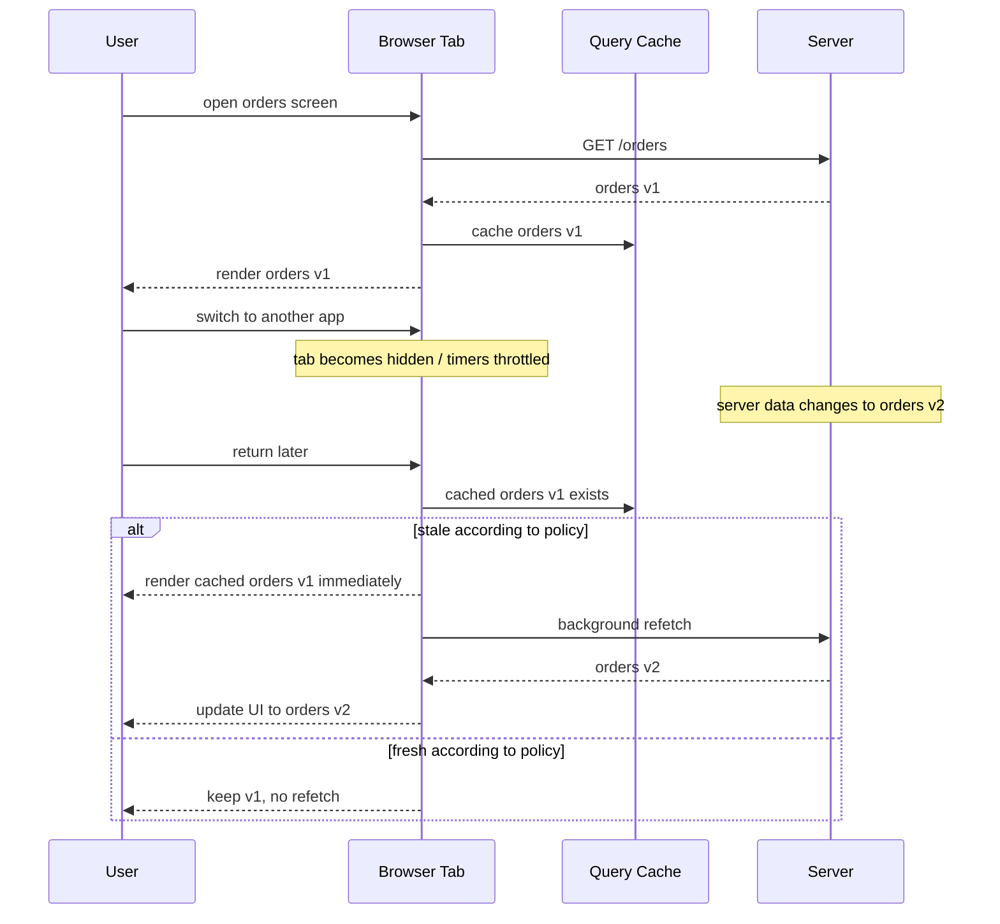
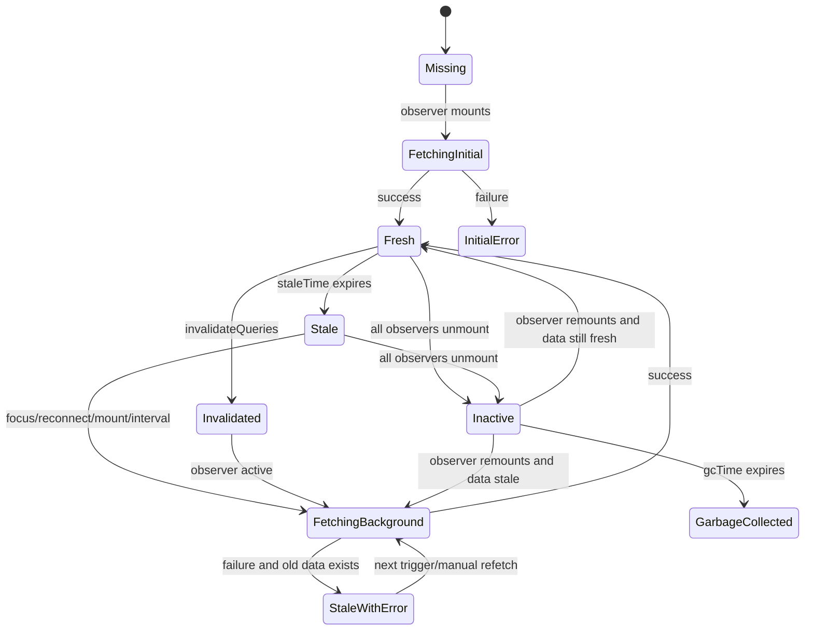
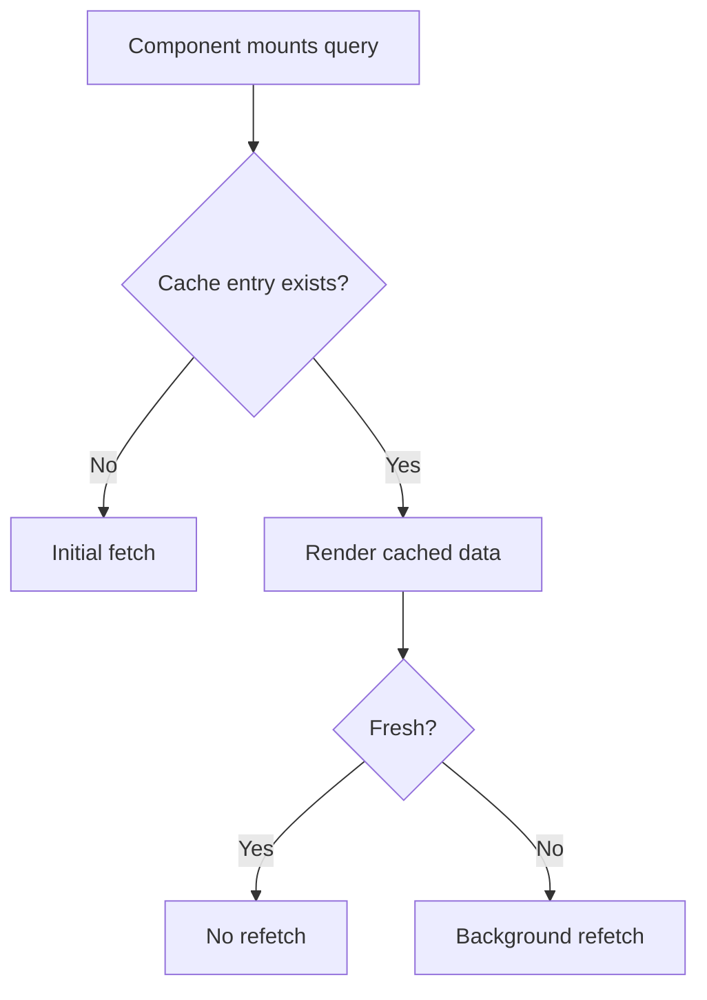
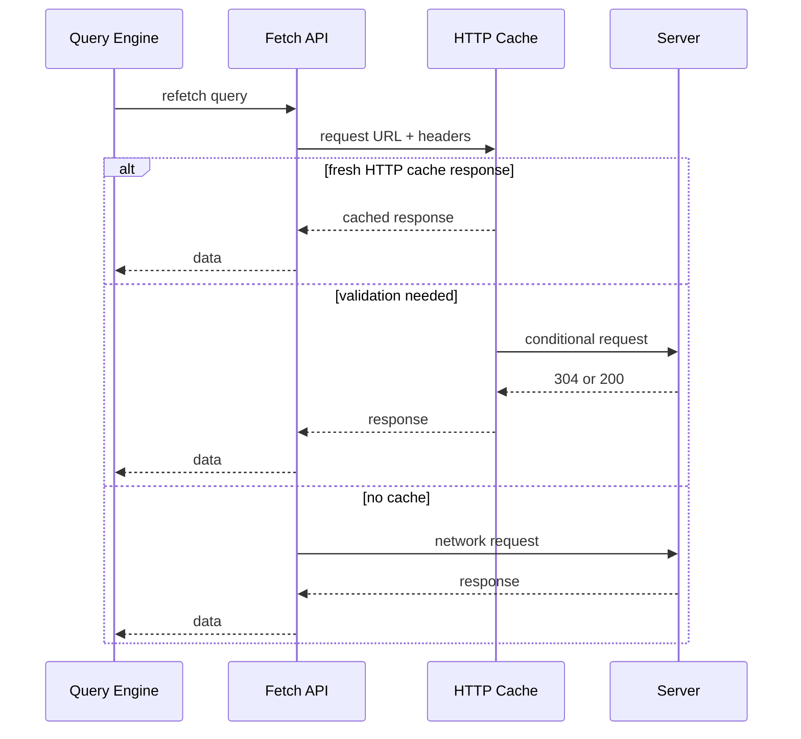

# Part 027 — Background Refetching and Focus Revalidation

> Target mental model: **background refetching is a freshness protocol.** It is not “fetch again because the component rendered again.” It is the client admitting: “my cached replica may be stale; I will keep rendering usable data while I verify whether the source of truth changed.”

A beginner thinks remote data has two states:

```txt
loading -> success
```

A production React application lives in a richer world:

```txt
no data -> fetching -> fresh data -> stale data -> background fetching -> updated data
                                            \-> background failure while stale data remains usable
```

That difference is not cosmetic.

It changes what the UI renders, how much traffic the app sends, what the user can trust, how failures are reported, and whether a tab returning from sleep melts your backend.

This part focuses on TanStack Query style server-state systems, but the underlying ideas apply to any React client-server communication layer.

---

## 1. The Core Problem: A Browser Tab Is Not a Continuous Session

A React app running in a browser tab is often paused, hidden, resumed, disconnected, reconnected, throttled, navigated away from, restored from memory, or reopened after the backend changed.

The user sees one screen.

The system sees discontinuities:



The key decision is not “should we cache?”

The key decision is:

> When the user resumes interaction, is the cached representation fresh enough to continue, or must the client revalidate it?

---

## 2. Freshness Is a Policy, Not a Feeling

A cache entry can be:

| Cache condition | Meaning | UX implication |
|---|---|---|
| Missing | No usable data exists | show initial loading or skeleton |
| Fresh | Cached data is still within freshness window | render directly, no refetch required |
| Stale | Data may be outdated | render cached data, refetch in background when triggered |
| Invalidated | Caller has explicitly marked it not trusted | refetch when observed or according to policy |
| Fetching | Request is currently in-flight | decide whether initial loading or background indicator |
| Paused | Query wants to fetch but network policy blocks it | show offline/stale state if useful |
| Error with data | Refresh failed, but old data exists | keep stale data, surface non-blocking warning |
| Error without data | Initial fetch failed | show blocking error state |

This is why a production remote-state model cannot be represented well by only:

```ts
const [loading, setLoading] = useState(false)
const [error, setError] = useState(null)
const [data, setData] = useState(null)
```

You need to know whether the app is loading for the first time or quietly verifying data it already has.

---

## 3. Background Refetching in TanStack Query Terms

TanStack Query has a useful split:

```txt
status      -> do we have data / did the query succeed / did it fail?
fetchStatus -> is a fetch currently running / paused / idle?
```

This distinction allows a UI to say:

```tsx
if (query.isPending) return <FullPageSkeleton />
if (query.isError) return <BlockingError error={query.error} />

return (
  <OrdersView
    orders={query.data}
    subtlyRefreshing={query.isFetching}
  />
)
```

This is fundamentally different from:

```tsx
if (query.isFetching) return <FullPageSkeleton />
```

That second version destroys useful UI on every background refetch.

The invariant:

> Initial fetch may block rendering. Background refetch should usually preserve the last usable representation.

---

## 4. Default Refetch Triggers

A server-state system commonly refetches stale queries when one of these happens:

| Trigger | Why it exists | Risk |
|---|---|---|
| New observer mounts | user navigates to a screen using the query | repeated navigation may cause traffic |
| Window focus | user returns after time passed elsewhere | focus storms across many queries |
| Network reconnect | stale data may need verification after offline period | reconnect thundering herd |
| Refetch interval | domain needs periodic freshness | polling load / battery cost |
| Manual invalidation | mutation or event says data changed | overbroad invalidation |
| Manual refetch | user explicitly requests refresh | duplicate requests if uncontrolled |

These triggers should not be treated as “library magic.”

They are policy hooks for freshness.

---

## 5. The Revalidation State Machine



Important details:

1. A query can have data and still be stale.
2. A query can be stale and still renderable.
3. A query can fail a background refetch and still have valid last-known data.
4. A query can be invalidated even if its `staleTime` has not expired.
5. Garbage collection is about memory residency, not freshness.

---

## 6. `staleTime` Controls Whether Triggers Actually Refetch

A focus event is not enough by itself.

A reconnect event is not enough by itself.

A mount event is not enough by itself.

For most policies, the query must be stale.

```tsx
useQuery({
  queryKey: ['account-summary', accountId],
  queryFn: ({ signal }) => api.getAccountSummary(accountId, { signal }),
  staleTime: 60_000,
})
```

With this policy:

- remount after 10 seconds: cached data is fresh, no background refetch
- refocus after 20 seconds: cached data is fresh, no background refetch
- reconnect after 70 seconds: cached data is stale, background refetch may run

`staleTime` is the first line of defense against accidental refetch storms.

---

## 7. Choosing `staleTime` by Domain Volatility

Do not set `staleTime` by habit.

Set it by domain truth.

| Domain | Typical volatility | Suggested direction |
|---|---:|---|
| Feature flags | low to medium | minutes, plus explicit refresh on bootstrap |
| User profile | low | minutes or longer |
| Permission snapshot | medium, security-sensitive | short or event-driven; never rely solely on stale data for enforcement |
| Product catalog | medium | seconds to minutes, depending on business |
| Notification count | high | short, realtime, or polling |
| Trading/market data | very high | realtime/streaming, not casual focus refetch |
| Case management queue | medium-high | short stale time, background refresh, explicit “last updated” |
| Audit log | append-only | cacheable pages; newest page may be short-lived |
| Reference data | low | long stale time; versioned invalidation |

The product question:

> What is the cost of showing an outdated value for this resource for N seconds?

The platform question:

> What is the cost of all active clients revalidating this resource every N seconds?

Good policy balances both.

---

## 8. Focus Revalidation Is a Resume Protocol

A browser focus event means:

> The user may be about to act on data that was cached before the app was backgrounded.

It does not mean:

> Refetch every query immediately no matter what.

Good focus revalidation has guardrails:

```tsx
useQuery({
  queryKey: ['case', caseId],
  queryFn: ({ signal }) => api.getCase(caseId, { signal }),
  staleTime: 30_000,
  refetchOnWindowFocus: true,
})
```

For volatile work queues, focus refetch is often useful.

```tsx
useQuery({
  queryKey: ['countries'],
  queryFn: ({ signal }) => api.getCountries({ signal }),
  staleTime: 24 * 60 * 60 * 1000,
  refetchOnWindowFocus: false,
})
```

For reference data, focus refetch is usually wasteful.

The real policy is not “enable or disable focus refetch globally.”

The real policy is resource-specific.

---

## 9. Reconnect Revalidation Is Different from Focus Revalidation

A reconnect event says:

> A query wanted fresh data, but the network may have been unavailable.

It is usually more justified than focus refetch for data that users may continue editing after offline periods.

```tsx
useQuery({
  queryKey: ['draft-validation-rules', tenantId],
  queryFn: ({ signal }) => api.getValidationRules(tenantId, { signal }),
  staleTime: 5 * 60_000,
  refetchOnReconnect: true,
})
```

However, reconnect can also create a herd:

```txt
office Wi-Fi returns
-> thousands of tabs reconnect
-> every stale query fires
-> backend spike
```

Guardrails:

- use realistic `staleTime`
- avoid broad active query sets
- avoid mounting hidden heavyweight queries
- scope invalidation precisely
- prefer push/realtime for truly volatile data
- use backend rate limits and cache headers
- show stale data gracefully during delayed refresh

---

## 10. Mount Revalidation and Navigation

When a component using a query mounts, the cache may already contain data.

Possible outcomes:



This is why navigation can feel instant while still staying fresh.

But it also creates a common bug:

```tsx
useQuery({
  queryKey: ['search-results'],
  queryFn: () => api.search(currentFilters),
})
```

The query key does not include `currentFilters`.

Now navigation or remount reuses the wrong cache entry.

Correct:

```tsx
useQuery({
  queryKey: ['search-results', normalizeFilters(currentFilters)],
  queryFn: ({ signal }) => api.search(currentFilters, { signal }),
})
```

Background refetch cannot fix bad identity.

It only refreshes the cache address you gave it.

---

## 11. Background Indicators: Do Not Punish the User for Freshness

A production UI should distinguish:

| Condition | UI pattern |
|---|---|
| No data + fetching | full skeleton / blocking loading |
| Data exists + fetching | subtle refresh indicator |
| Data exists + refetch failed | non-blocking stale warning |
| Data exists + manually refreshing | spinner in refresh button |
| Data stale because offline | offline badge + last updated |
| Data fresh | no noise |

Example:

```tsx
function CaseSummaryPanel({ caseId }: { caseId: string }) {
  const query = useCaseSummary(caseId)

  if (query.isPending) {
    return <CaseSummarySkeleton />
  }

  if (query.isError) {
    return <BlockingPanelError error={query.error} />
  }

  return (
    <section aria-busy={query.isFetching ? 'true' : 'false'}>
      <PanelHeader
        title="Case Summary"
        rightSlot={
          query.isFetching ? <SmallRefreshingLabel /> : null
        }
      />
      <CaseSummary data={query.data} />
      {query.isRefetchError ? (
        <InlineWarning>
          Could not refresh. Showing last known data.
        </InlineWarning>
      ) : null}
    </section>
  )
}
```

The invariant:

> A background refetch should rarely erase already-useful data.

---

## 12. `isPending`, `isFetching`, `isRefetching`, and Product Meaning

A simplified interpretation:

| Flag | Meaning | Common UI |
|---|---|---|
| `isPending` | query has no resolved data yet | skeleton or first-load placeholder |
| `isFetching` | query function is currently running | background indicator if data exists |
| `isRefetching` | fetching again after initial success | subtle refresh signal |
| `isError` | query currently failed | blocking if no data, warning if data exists |
| `isStale` | cached data is not fresh by policy | optional “last updated” or no visible signal |
| `dataUpdatedAt` | timestamp of last success | “updated 2 minutes ago” |

Do not leak every flag into UI.

Map flags into product states.

```ts
type RemotePanelState<T> =
  | { kind: 'initial-loading' }
  | { kind: 'initial-error'; error: unknown }
  | { kind: 'ready'; data: T; refreshing: boolean; stale: boolean; refreshError: boolean }

function toPanelState<T>(query: UseQueryResult<T>): RemotePanelState<T> {
  if (query.isPending) return { kind: 'initial-loading' }

  if (query.isError && !query.data) {
    return { kind: 'initial-error', error: query.error }
  }

  return {
    kind: 'ready',
    data: query.data as T,
    refreshing: query.isFetching,
    stale: query.isStale,
    refreshError: query.isRefetchError,
  }
}
```

This prevents component trees from becoming a pile of ad-hoc query flags.

---

## 13. Manual Invalidation Is an Explicit Freshness Event

A mutation usually changes server truth.

Therefore, the client must decide which cached replicas are no longer trustworthy.

```tsx
function useCloseCase() {
  const queryClient = useQueryClient()

  return useMutation({
    mutationFn: api.closeCase,
    onSuccess: (_, variables) => {
      queryClient.invalidateQueries({
        queryKey: ['case', variables.caseId],
      })

      queryClient.invalidateQueries({
        queryKey: ['case-list'],
      })
    },
  })
}
```

Invalidation is not “delete all cache.”

Invalidation means:

> The existing representation may be wrong. Revalidate active observers and mark inactive entries stale.

Bad invalidation:

```tsx
queryClient.invalidateQueries()
```

This is a backend traffic generator disguised as correctness.

Better invalidation:

```tsx
queryClient.invalidateQueries({ queryKey: caseKeys.detail(caseId) })
queryClient.invalidateQueries({ queryKey: caseKeys.lists() })
```

Best invalidation also understands domain impact:

```tsx
queryClient.invalidateQueries({ queryKey: caseKeys.detail(caseId) })
queryClient.invalidateQueries({ queryKey: caseKeys.queue(queueId) })
queryClient.invalidateQueries({ queryKey: metricsKeys.caseCounters(tenantId) })
```

The mutation should know what it invalidates.

The UI component should not guess.

---

## 14. Background Refetch vs Optimistic Update

After a mutation, there are three common strategies:

| Strategy | Description | Use when |
|---|---|---|
| Invalidate only | mark affected queries stale; refetch source of truth | mutation response is small or derived data complex |
| Update cache from response | write returned canonical representation into cache | response contains complete updated entity |
| Optimistic update + rollback + revalidate | update UI before server confirms | latency matters and operation is reversible |

Example: update cache from canonical response.

```tsx
function useRenameCase() {
  const queryClient = useQueryClient()

  return useMutation({
    mutationFn: api.renameCase,
    onSuccess: (updatedCase) => {
      queryClient.setQueryData(
        caseKeys.detail(updatedCase.id),
        updatedCase,
      )

      queryClient.invalidateQueries({
        queryKey: caseKeys.lists(),
      })
    },
  })
}
```

Do not blindly refetch everything if the server already returned the canonical resource.

Do not blindly trust optimistic state if server-side rules can alter the result.

---

## 15. Refetch Interval Is Polling, Not Freshness Magic

`refetchInterval` is useful, but it is expensive if treated casually.

```tsx
useQuery({
  queryKey: ['job-status', jobId],
  queryFn: ({ signal }) => api.getJobStatus(jobId, { signal }),
  refetchInterval: (query) => {
    const status = query.state.data?.status
    return status === 'running' || status === 'queued' ? 2_000 : false
  },
})
```

Good polling has an exit condition.

Bad polling:

```tsx
useQuery({
  queryKey: ['dashboard'],
  queryFn: api.getDashboard,
  refetchInterval: 1000,
})
```

Questions before adding polling:

1. Is the data actually volatile?
2. Is stale data harmful?
3. Is realtime available?
4. Does polling stop when terminal state is reached?
5. Does polling run in background tabs?
6. Can the backend handle all clients polling at this cadence?
7. Do responses use caching or ETags?
8. Is there jitter to avoid synchronization?

TanStack Query gives a mechanism.

You still own the distributed-system cost.

---

## 16. `refetchIntervalInBackground` Is a Dangerous Knob

Most apps should not continuously poll hidden tabs.

Hidden tabs may be throttled by browsers anyway, and background polling consumes network, battery, and backend capacity for UI the user is not seeing.

Use background polling only when the product semantics justify it:

- active call/meeting state
- upload/process completion where notification matters
- critical monitoring console
- collaborative editing presence
- security/session validity in high-risk flows

Even then, prefer event-driven channels where appropriate.

---

## 17. Avoiding Focus Storms

Imagine a dashboard with 40 active stale queries.

The user returns to the tab.

Naive result:

```txt
focus event -> 40 requests immediately
```

Problems:

- backend spike
- browser connection contention
- API gateway rate limits
- duplicate data dependencies
- flickering refresh indicators
- noisy telemetry

Mitigations:

### 17.1 Increase `staleTime` for low-volatility resources

```tsx
useQuery({
  queryKey: ['reference-data', tenantId],
  queryFn: api.getReferenceData,
  staleTime: 30 * 60_000,
})
```

### 17.2 Disable focus refetch for immutable/versioned data

```tsx
useQuery({
  queryKey: ['schema-version', version],
  queryFn: api.getSchema,
  staleTime: Infinity,
  refetchOnWindowFocus: false,
})
```

### 17.3 Collapse endpoints at the right boundary

If a screen always needs 10 small resources together, consider a BFF aggregate endpoint.

```txt
Before:
GET /case/1
GET /case/1/owner
GET /case/1/risk
GET /case/1/tasks
GET /case/1/sla

After:
GET /case-workspace/1
```

Do not use client concurrency to compensate for poor read-model shape.

### 17.4 Scope mounted queries

Do not keep hidden tabs/panels mounted if they own heavyweight queries.

```tsx
{activeTab === 'audit' ? <AuditTrailTab caseId={caseId} /> : null}
```

### 17.5 Use precise invalidation

Overbroad invalidation turns every focus event into a full-screen refetch.

---

## 18. Focus Manager Customization

Some environments need custom focus semantics:

- embedded apps
- Electron
- React Native equivalent runtime
- kiosk displays
- custom visibility model
- iframes
- test environments

A query engine may allow overriding how focus is detected.

Conceptually:

```tsx
import { focusManager } from '@tanstack/react-query'

focusManager.setEventListener((handleFocus) => {
  const onVisibilityChange = () => {
    if (document.visibilityState === 'visible') {
      handleFocus(true)
    }
  }

  document.addEventListener('visibilitychange', onVisibilityChange)

  return () => {
    document.removeEventListener('visibilitychange', onVisibilityChange)
  }
})
```

Do not customize this because you dislike defaults.

Customize it only when the runtime focus model is genuinely different.

---

## 19. Network Manager and Offline-Aware Revalidation

The browser's online/offline signal is imperfect.

It may tell you whether the device has a network interface, not whether your API is reachable.

Still, it is useful as one signal.

A production offline-aware app distinguishes:

| Condition | Meaning |
|---|---|
| Browser offline | network likely unavailable |
| API unreachable | backend or path unavailable |
| Query paused | query wants to fetch but policy says wait |
| Stale data available | user can continue read-only or limited work |
| Mutation queued | write intent must be replayed safely later |

For read queries:

```tsx
useQuery({
  queryKey: ['case', caseId],
  queryFn: ({ signal }) => api.getCase(caseId, { signal }),
  networkMode: 'online',
})
```

For special local-first flows, you may need different behavior, but that belongs to offline-first architecture, not casual fetching.

---

## 20. Refetching and HTTP Cache Are Different Layers

A query refetch asks the browser/application to make a request.

HTTP cache may still decide whether that request reaches the network.



Application cache and HTTP cache answer different questions:

| Layer | Owns | Example |
|---|---|---|
| Query cache | React server-state lifecycle | stale, fetching, observers, invalidation |
| HTTP cache | protocol-level response reuse | `Cache-Control`, `ETag`, `304` |
| CDN cache | shared edge response reuse | public catalog API |
| Browser memory/disk cache | browser-controlled object reuse | static assets, cacheable GET responses |

Do not assume `queryClient.invalidateQueries()` bypasses HTTP caching.

Do not assume `cache: 'no-store'` replaces application invalidation.

---

## 21. Revalidation Contract with Backend

Frontend freshness depends on backend support.

A good backend provides:

- stable resource identity
- meaningful `updatedAt` or version fields
- conditional request support where useful
- idempotent reads
- predictable error format
- rate limit headers
- permission-aware responses
- cache headers for shared/public resources
- `Retry-After` for overload or rate limiting

A weak backend forces the frontend into guessing.

Guessing creates either stale UX or wasteful polling.

---

## 22. Last-Updated UI

For operational systems, a stale view should often be explicit.

```tsx
function LastUpdated({ timestamp }: { timestamp: number }) {
  return (
    <span title={new Date(timestamp).toISOString()}>
      Updated {formatDistanceToNow(timestamp)} ago
    </span>
  )
}
```

Use this for:

- queues
- dashboards
- regulatory case views
- financial summaries
- job status
- monitoring pages

Avoid it for:

- static reference labels
- tiny embedded widgets where it creates noise
- forms where the key risk is write conflict, not read freshness

---

## 23. Background Refetch Error Semantics

A failed initial fetch and failed background refetch are not the same product state.

```tsx
function ResourcePanel({ query }: { query: UseQueryResult<Resource> }) {
  if (query.isPending) return <Skeleton />

  if (query.isError && !query.data) {
    return <BlockingError error={query.error} />
  }

  return (
    <>
      <ResourceView data={query.data!} />
      {query.isRefetchError ? (
        <InlineWarning>
          Refresh failed. The data shown may be out of date.
        </InlineWarning>
      ) : null}
    </>
  )
}
```

The old data is not automatically wrong.

It is last-known-good.

That distinction matters for UX and incident handling.

---

## 24. Background Refetch and Authorization Changes

Authorization-sensitive resources need special care.

Suppose the user had access to a case, then access was revoked while the tab was hidden.

On focus revalidation:

```txt
GET /cases/123 -> 403
```

Possible UI policy:

- remove the sensitive cached data immediately
- show access revoked state
- invalidate related lists
- avoid keeping forbidden data in visible UI

Example:

```tsx
function handleQueryError(error: unknown, queryClient: QueryClient, caseId: string) {
  if (isForbidden(error)) {
    queryClient.removeQueries({ queryKey: caseKeys.detail(caseId) })
    queryClient.invalidateQueries({ queryKey: caseKeys.lists() })
  }
}
```

Do not treat 403 background refetch failure like a harmless transient network error.

Security-sensitive errors can change cache retention policy.

---

## 25. Revalidation and Multi-Tab Behavior

Multiple tabs can each hold a query cache.

Without coordination:

```txt
Tab A focus -> refetch
Tab B focus -> refetch
Tab C focus -> refetch
```

Options:

1. Accept it if traffic is small.
2. Use reasonable `staleTime`.
3. Use HTTP caching and conditional requests.
4. Use BroadcastChannel-based cache synchronization where appropriate.
5. Use a service worker or shared worker for specific high-value coordination.
6. Move volatile sync to realtime infrastructure.

Do not solve multi-tab behavior prematurely.

But do not ignore it for high-traffic internal tools where users keep many tabs open.

---

## 26. A Policy Helper

Centralize policy by resource class.

```ts
export const queryPolicies = {
  reference: {
    staleTime: 30 * 60_000,
    gcTime: 60 * 60_000,
    refetchOnWindowFocus: false,
    refetchOnReconnect: true,
  },
  workspace: {
    staleTime: 30_000,
    gcTime: 10 * 60_000,
    refetchOnWindowFocus: true,
    refetchOnReconnect: true,
  },
  liveJob: {
    staleTime: 0,
    gcTime: 5 * 60_000,
    refetchOnWindowFocus: true,
    refetchOnReconnect: true,
    refetchInterval: 2_000,
  },
} as const
```

Usage:

```tsx
export function useCaseWorkspace(caseId: string) {
  return useQuery({
    queryKey: caseKeys.workspace(caseId),
    queryFn: ({ signal }) => api.getCaseWorkspace(caseId, { signal }),
    ...queryPolicies.workspace,
  })
}
```

This makes review possible.

Random `staleTime` values scattered across components are not architecture.

---

## 27. Observability: Know Why a Request Happened

A production fetch client should record a cause.

```ts
type RefetchCause =
  | 'initial-mount'
  | 'window-focus'
  | 'network-reconnect'
  | 'manual-refetch'
  | 'mutation-invalidation'
  | 'polling-interval'
  | 'route-prefetch'

interface QueryFetchTelemetry {
  queryKeyHash: string
  resource: string
  cause: RefetchCause
  hadCachedData: boolean
  wasStale: boolean
  durationMs: number
  result: 'success' | 'error' | 'aborted'
  statusCode?: number
}
```

Without cause, every traffic investigation starts with:

> “Why did the frontend call this endpoint so many times?”

With cause, you can identify:

- focus storms
- invalidation storms
- polling mistakes
- retries due to server instability
- repeated mount/unmount thrashing
- missing `staleTime`
- bad query key cardinality

---

## 28. Testing Background Refetch

Test policy, not implementation trivia.

### 28.1 Does stale data render while refetching?

```tsx
it('keeps old data visible during background refresh', async () => {
  const server = createControlledServer()

  server.respond('/cases/1', { id: '1', title: 'Old' })
  render(<CasePage caseId="1" />)
  expect(await screen.findByText('Old')).toBeInTheDocument()

  server.deferNext('/cases/1')
  triggerWindowFocus()

  expect(screen.getByText('Old')).toBeInTheDocument()
  expect(screen.getByText(/refreshing/i)).toBeInTheDocument()
})
```

### 28.2 Does focus avoid refetch while fresh?

```tsx
it('does not refetch on focus while data is fresh', async () => {
  const calls = trackApiCalls()

  render(<ReferenceDataPanel />)
  await screen.findByText('Indonesia')

  triggerWindowFocus()

  expect(calls.to('/countries')).toHaveLength(1)
})
```

### 28.3 Does background error preserve last-known-good data?

```tsx
it('shows non-blocking refresh error with existing data', async () => {
  server.respond('/cases/1', { id: '1', title: 'Old' })
  render(<CasePage caseId="1" />)
  await screen.findByText('Old')

  server.failNext('/cases/1', 503)
  triggerWindowFocus()

  expect(await screen.findByText(/could not refresh/i)).toBeInTheDocument()
  expect(screen.getByText('Old')).toBeInTheDocument()
})
```

---

## 29. Common Failure Modes

| Failure mode | Cause | Fix |
|---|---|---|
| Full-screen spinner on every focus | UI treats `isFetching` as initial loading | distinguish initial load from background refetch |
| Backend spike on tab focus | many stale active queries refetch together | tune `staleTime`, reduce mounted queries, aggregate endpoints |
| Stale data after mutation | mutation does not invalidate affected queries | encode invalidation in mutation hook |
| Refetch does not update right UI | query key missing resource parameters | fix cache identity |
| Excessive polling | `refetchInterval` without exit condition | domain-specific interval function |
| Hidden tab traffic | background interval enabled casually | disable or use event-driven sync |
| Security data remains after 403 | background authz error treated as transient | remove sensitive cache on access revocation |
| Refresh error destroys data | error state replaces last-known-good | preserve data and show non-blocking warning |
| Multi-tab duplicate refetch | independent caches per tab | tolerate, cache at HTTP layer, or coordinate selectively |
| Random `staleTime` values | no policy taxonomy | centralize query policy by resource class |

---

## 30. Design Review Checklist

For each query, answer:

1. What resource does this query represent?
2. What is the query key identity?
3. How volatile is the data?
4. What is the cost of showing data that is 10 seconds old? 1 minute old? 10 minutes old?
5. What is the cost of revalidating this data on every focus?
6. Should stale data remain visible during refresh?
7. What UI indicates background refresh?
8. What happens if background refresh fails?
9. Should focus refetch be enabled?
10. Should reconnect refetch be enabled?
11. Is polling needed, and what stops it?
12. What mutation invalidates this query?
13. Does a 401/403/404 background response require special cache cleanup?
14. Can this endpoint be cached by HTTP/CDN?
15. Can multiple active tabs create duplicate traffic?
16. What telemetry tells us why a refetch happened?

---

## 31. The Production Rule

The rule is simple but often ignored:

> Background refetching is valuable only when it improves trust without making the system unstable.

A strong React app does not refetch because it is nervous.

It refetches because its freshness policy says a cached replica has crossed a boundary where revalidation is worth the cost.

That is the difference between accidental network traffic and deliberate client-server communication.
