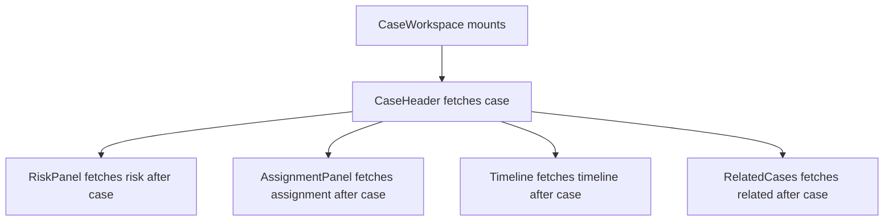
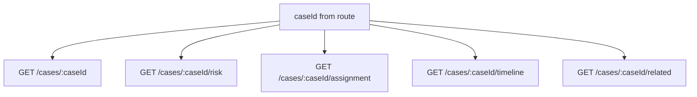
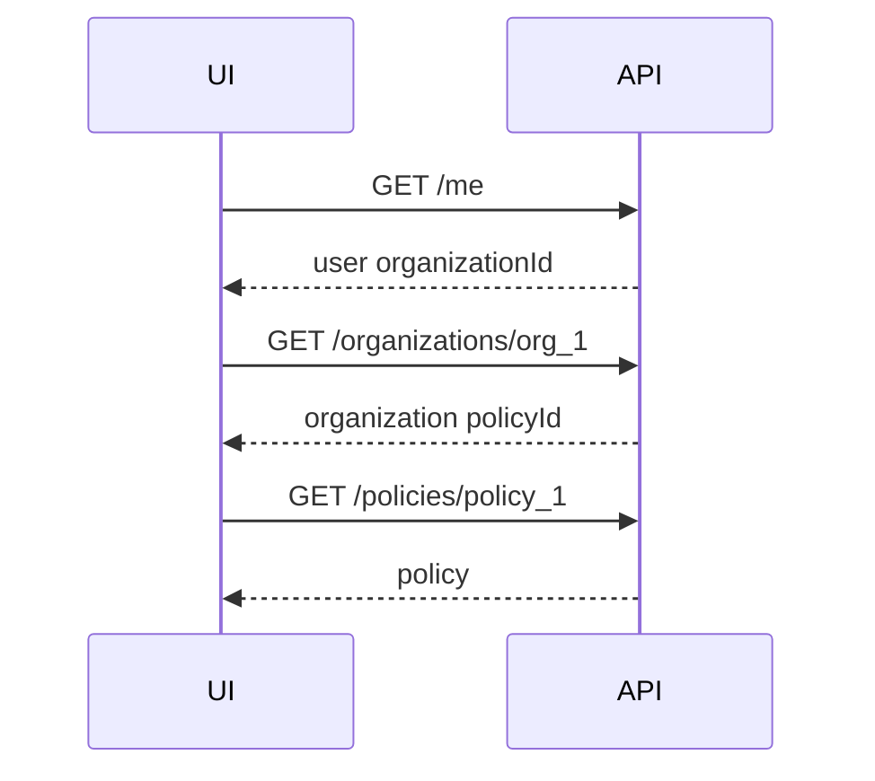
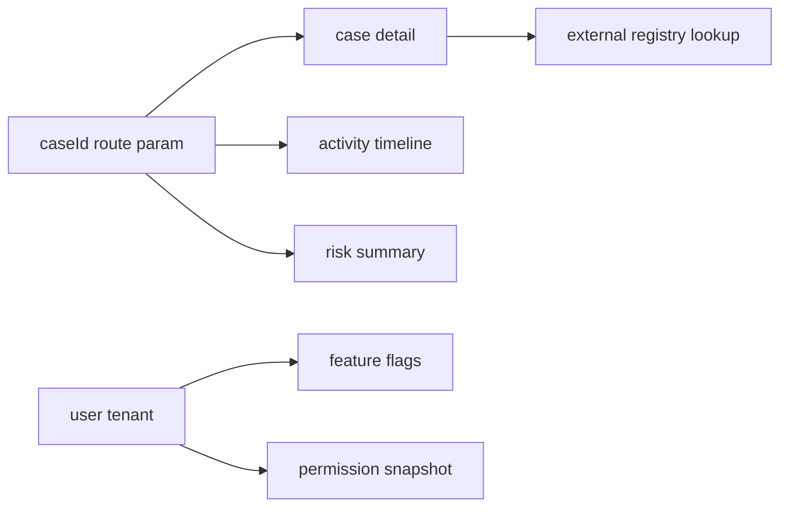
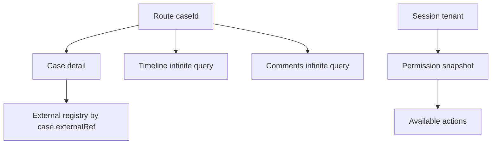

# Part 028 — Dependent, Parallel, and Infinite Queries

> Target mental model: **a screen is a data dependency graph.** Parallel queries are independent edges. Dependent queries are ordered edges. Infinite queries are repeated edges over a cursor. Bad React client-server communication usually comes from modeling this graph accidentally.

When a screen loads, the browser does not care that your JSX looks nested.

It only sees network work:

```txt
request A
request B
request C
request D
```

The question is whether those requests are independent, ordered, repeated, avoidable, or wrongly split.

This part gives you a practical way to design query graphs instead of sprinkling `useQuery` calls until the UI seems to work.

---

## 1. Start with the Dependency Graph, Not Components

A React component tree is not automatically the correct data-fetching graph.

Consider a case workspace:

```txt
CaseWorkspace
├─ CaseHeader
├─ RiskPanel
├─ AssignmentPanel
├─ ActivityTimeline
└─ RelatedCases
```

Naive component ownership creates:



But maybe only the `caseId` is needed by all of them.

Then the true graph is:



That graph is parallel.

If you accidentally make it dependent, you create latency without adding correctness.

---

## 2. Three Query Shapes

| Shape | Meaning | Example |
|---|---|---|
| Parallel query | query can start without waiting for another query result | case detail + timeline by route `caseId` |
| Dependent query | query needs data from previous query | user -> organization by `user.organizationId` |
| Infinite query | same logical resource fetched page by page | activity feed cursor pagination |

These shapes are not library features first.

They are distributed dataflow shapes.

The library only provides ergonomic tools.

---

## 3. Parallel Queries

Parallel queries should start as early as possible when their inputs are already known.

```tsx
function CaseWorkspace({ caseId }: { caseId: string }) {
  const caseQuery = useCase(caseId)
  const riskQuery = useCaseRisk(caseId)
  const timelineQuery = useCaseTimeline(caseId)
  const relatedQuery = useRelatedCases(caseId)

  return (
    <WorkspaceLayout>
      <CaseHeader query={caseQuery} />
      <RiskPanel query={riskQuery} />
      <Timeline query={timelineQuery} />
      <RelatedCases query={relatedQuery} />
    </WorkspaceLayout>
  )
}
```

Each hook can start during the same render pass.

The waterfall is avoided because no query waits for another query's data.

---

## 4. Parallel Does Not Mean “Always Many Requests”

Parallel requests are useful when resources are independently cacheable, independently authorized, independently volatile, or reused across screens.

But a screen with 20 parallel requests may still be badly designed.

Ask:

1. Are these resources reused separately elsewhere?
2. Do they have different freshness policies?
3. Do they have different authorization rules?
4. Can some be lazy-loaded after the primary content?
5. Is backend aggregation cheaper?
6. Are we creating frontend N+1?
7. Are the requests competing for the same backend dependencies?

Sometimes the best graph is not:

```txt
20 parallel browser requests
```

It is:

```txt
1 route-level aggregate read model + 3 lazy detail queries
```

---

## 5. Parallel Query Failure Composition

Parallel queries do not have to share one error state.

```tsx
function CaseWorkspace({ caseId }: { caseId: string }) {
  const caseQuery = useCase(caseId)
  const riskQuery = useCaseRisk(caseId)
  const timelineQuery = useCaseTimeline(caseId)

  if (caseQuery.isPending) return <CaseWorkspaceSkeleton />
  if (caseQuery.isError) return <BlockingCaseError error={caseQuery.error} />

  return (
    <>
      <CaseHeader case={caseQuery.data} />
      <RiskPanel query={riskQuery} />
      <Timeline query={timelineQuery} />
    </>
  )
}
```

The case itself may be blocking.

Risk and timeline may be panel-local.

Do not turn every parallel query into full-page failure.

---

## 6. Static Parallel Queries vs Dynamic Parallel Queries

Static parallel queries are known at compile time:

```tsx
const caseQuery = useCase(caseId)
const riskQuery = useCaseRisk(caseId)
const timelineQuery = useTimeline(caseId)
```

Dynamic parallel queries depend on an array:

```tsx
function AssigneeAvatars({ userIds }: { userIds: string[] }) {
  const queries = useQueries({
    queries: userIds.map((userId) => ({
      queryKey: userKeys.avatar(userId),
      queryFn: ({ signal }) => api.getUserAvatar(userId, { signal }),
      staleTime: 10 * 60_000,
    })),
  })

  return <AvatarList queries={queries} />
}
```

Dynamic queries need stricter review.

The array length is now a network multiplier.

---

## 7. The Frontend N+1 Problem

Frontend N+1 is the client version of a classic backend smell:

```txt
GET /cases
GET /users/1
GET /users/2
GET /users/3
GET /users/4
...
```

This often happens when list items fetch their own related data.

```tsx
function CaseRow({ row }: { row: CaseListItem }) {
  const assignee = useUser(row.assigneeId)
  return <Row row={row} assignee={assignee.data} />
}
```

Better options:

### Option A: Include needed display data in list response

```json
{
  "items": [
    {
      "id": "case_1",
      "title": "Missing document",
      "assignee": {
        "id": "user_1",
        "displayName": "Nadia"
      }
    }
  ]
}
```

### Option B: Batch related resources

```txt
GET /users?ids=user_1,user_2,user_3
```

### Option C: Prefetch related details on hover/open

```tsx
function CaseRow({ row }: { row: CaseListItem }) {
  const queryClient = useQueryClient()

  return (
    <button
      onMouseEnter={() => {
        queryClient.prefetchQuery({
          queryKey: userKeys.detail(row.assigneeId),
          queryFn: ({ signal }) => api.getUser(row.assigneeId, { signal }),
          staleTime: 5 * 60_000,
        })
      }}
    >
      {row.title}
    </button>
  )
}
```

The point is not “never use dynamic queries.”

The point is to recognize when component composition has accidentally become request fan-out.

---

## 8. Dependent Queries

A dependent query should wait because it lacks a real input.

Example:

```tsx
function OrganizationSettings() {
  const currentUser = useCurrentUser()

  const organization = useQuery({
    queryKey: ['organization', currentUser.data?.organizationId],
    queryFn: ({ signal }) =>
      api.getOrganization(currentUser.data!.organizationId, { signal }),
    enabled: Boolean(currentUser.data?.organizationId),
  })

  // ...
}
```

The organization query depends on `currentUser.data.organizationId`.

Until that exists, the query cannot be addressed correctly.

---

## 9. Real Dependency vs Accidental Dependency

A real dependency:

```txt
GET /me -> organizationId
GET /organizations/:organizationId
```

An accidental dependency:

```txt
GET /cases/:caseId -> returns caseId we already had from route
GET /cases/:caseId/timeline
```

If the route already gives `caseId`, timeline should not wait for case detail.

A quick test:

> Could the second query's URL and authorization context be built before the first query returns?

If yes, it is probably not dependent.

---

## 10. Dependent Query State Semantics

Dependent queries have an important UX state:

```txt
not enabled yet
```

That is not the same as loading from the network.

```tsx
function OrganizationPanel() {
  const user = useCurrentUser()
  const organizationId = user.data?.organizationId

  const organization = useQuery({
    queryKey: ['organization', organizationId],
    queryFn: ({ signal }) => api.getOrganization(organizationId!, { signal }),
    enabled: Boolean(organizationId),
  })

  if (user.isPending) return <Skeleton />
  if (!organizationId) return <NoOrganizationState />
  if (organization.isPending) return <Skeleton />

  return <OrganizationView data={organization.data} />
}
```

If a query is disabled because a required input is missing, the UI should often explain the missing input rather than show a spinner forever.

---

## 11. Dependency Chains Are Latency Chains

Every dependent edge adds at least one round trip.



If each request takes 150 ms, the happy path is at least 450 ms before rendering policy-dependent UI.

That may be correct.

But if these dependencies are stable and always needed, better shapes may exist:

```txt
GET /bootstrap-context
```

or:

```txt
GET /organization-workspace
```

A dependent query is a correctness tool, not a performance strategy.

---

## 12. How to Break Accidental Waterfalls

### 12.1 Promote known inputs

Instead of deriving `caseId` from fetched case:

```tsx
const caseQuery = useCase(caseId)
const timelineQuery = useTimeline(caseQuery.data?.id, {
  enabled: Boolean(caseQuery.data?.id),
})
```

Use the route input:

```tsx
const caseQuery = useCase(caseId)
const timelineQuery = useTimeline(caseId)
```

### 12.2 Fetch aggregate route model

```tsx
const workspace = useQuery({
  queryKey: ['case-workspace', caseId],
  queryFn: ({ signal }) => api.getCaseWorkspace(caseId, { signal }),
})
```

### 12.3 Prefetch downstream queries

```tsx
await queryClient.prefetchQuery({
  queryKey: caseKeys.detail(caseId),
  queryFn: ({ signal }) => api.getCase(caseId, { signal }),
})

await Promise.all([
  queryClient.prefetchQuery({
    queryKey: caseKeys.timeline(caseId),
    queryFn: ({ signal }) => api.getTimeline(caseId, { signal }),
  }),
  queryClient.prefetchQuery({
    queryKey: caseKeys.risk(caseId),
    queryFn: ({ signal }) => api.getRisk(caseId, { signal }),
  }),
])
```

### 12.4 Move stable dependency resolution to bootstrap

If every page needs tenant context, do not make every page discover tenant context independently.

---

## 13. Query Graph Review

Represent the screen as a graph:

```txt
route params
session context
feature flags
search params
form state
```

Then map remote resources:



Now classify each edge:

| Edge | Type | Reason |
|---|---|---|
| route `caseId` -> case detail | parallel root | route already has ID |
| route `caseId` -> timeline | parallel root | route already has ID |
| route `caseId` -> risk | parallel root | route already has ID |
| session -> flags | bootstrap/root | app-wide context |
| case detail -> external registry lookup | dependent | registry key comes from case response |

This review reveals performance bugs before implementation.

---

## 14. Infinite Queries

An infinite query models one logical collection loaded in pages.

Examples:

- activity timeline
- audit log
- notification feed
- search results
- chat history
- transaction list
- event stream history

The data shape is not simply:

```ts
T[]
```

It is closer to:

```ts
interface InfiniteData<TPage, TPageParam> {
  pages: TPage[]
  pageParams: TPageParam[]
}
```

Each page has the response data for that request, and each page param records how that page was addressed.

---

## 15. Cursor-Based Infinite Query

Prefer cursor/keyset pagination for mutable feeds.

```tsx
type ActivityPage = {
  items: ActivityItem[]
  nextCursor: string | null
}

function useActivityFeed(caseId: string) {
  return useInfiniteQuery({
    queryKey: ['case-activity', caseId],
    initialPageParam: null as string | null,
    queryFn: ({ pageParam, signal }) =>
      api.getCaseActivity(caseId, {
        cursor: pageParam,
        limit: 50,
        signal,
      }),
    getNextPageParam: (lastPage) => lastPage.nextCursor,
  })
}
```

Flatten for rendering:

```tsx
const items = query.data?.pages.flatMap((page) => page.items) ?? []
```

Do not store the flattened array as separate state unless you have a specific reason.

The query cache already owns the server-state representation.

---

## 16. Offset Pagination vs Cursor Pagination

| Pagination | Address | Works best for | Risk |
|---|---|---|---|
| Offset | `page=3&limit=50` | stable sorted tables | duplicates/skips when collection changes |
| Cursor | `cursor=abc` | feeds and mutable collections | cursor contract must be stable |
| Keyset | `afterId=123` or `createdAt<...` | ordered large datasets | requires indexed sort keys |
| Time window | `from/to` timestamps | logs/metrics | clock and boundary complexity |

For infinite scroll, offset pagination often looks simple but fails under concurrent inserts/deletes.

A feed is not a spreadsheet.

---

## 17. Infinite Query UI Contract

A useful infinite query UI distinguishes:

| State | Meaning | UI |
|---|---|---|
| Initial loading | first page loading | skeleton |
| Initial error | first page failed | blocking error |
| Empty success | first page loaded with zero items | empty state |
| Has pages | some pages loaded | list |
| Fetching next page | more page loading | bottom spinner |
| Next page error | existing pages usable, next page failed | retry row |
| No next page | end reached | end marker or nothing |
| Refreshing first page | collection revalidating | subtle top refresh |

Example:

```tsx
function ActivityFeed({ caseId }: { caseId: string }) {
  const query = useActivityFeed(caseId)

  if (query.isPending) return <FeedSkeleton />
  if (query.isError) return <FeedInitialError error={query.error} />

  const items = query.data.pages.flatMap((page) => page.items)

  if (items.length === 0) return <EmptyFeed />

  return (
    <section aria-busy={query.isFetching ? 'true' : 'false'}>
      {items.map((item) => (
        <ActivityRow key={item.id} item={item} />
      ))}

      {query.hasNextPage ? (
        <button
          type="button"
          disabled={query.isFetchingNextPage}
          onClick={() => query.fetchNextPage()}
        >
          {query.isFetchingNextPage ? 'Loading...' : 'Load more'}
        </button>
      ) : (
        <EndOfFeed />
      )}
    </section>
  )
}
```

---

## 18. Guard Against Duplicate `fetchNextPage`

Infinite scroll can trigger repeatedly when an intersection observer fires multiple times.

Guard it:

```tsx
function onSentinelVisible() {
  if (!query.hasNextPage) return
  if (query.isFetchingNextPage) return

  query.fetchNextPage()
}
```

A stronger version:

```tsx
useEffect(() => {
  if (!sentinelVisible) return
  if (!query.hasNextPage) return
  if (query.isFetchingNextPage) return

  query.fetchNextPage()
}, [sentinelVisible, query.hasNextPage, query.isFetchingNextPage, query.fetchNextPage])
```

Do not let the viewport create unbounded concurrency.

---

## 19. Page Size Is a Product and Infrastructure Decision

Small page size:

- faster first response
- more requests
- more pagination overhead
- more chance of duplicate fetchNextPage triggers

Large page size:

- fewer requests
- slower first response
- more memory
- more DOM/rendering cost
- more expensive retry on failure

Choose page size based on:

- row payload size
- interaction pattern
- backend index cost
- mobile network constraints
- expected scroll depth
- virtualization strategy
- observability data

Do not default every list to 10 or 100 by habit.

---

## 20. Infinite Query Memory Pressure

Infinite queries can grow without bound.

Symptoms:

- memory increase after long scrolling
- slow renders
- expensive re-renders after refetch
- huge persisted cache
- slow hydration
- mobile tab crashes

Mitigations:

1. Use virtualization for large DOM lists.
2. Use `maxPages` if appropriate.
3. Limit page size.
4. Avoid storing heavyweight nested data in feed items.
5. Prefer detail fetch on item open.
6. Clear query cache when leaving high-volume screens if data is not reusable.
7. Do not persist infinite query pages casually.

Example:

```tsx
useInfiniteQuery({
  queryKey: ['audit-log', caseId],
  initialPageParam: null as string | null,
  queryFn: ({ pageParam, signal }) =>
    api.getAuditLog(caseId, { cursor: pageParam, signal }),
  getNextPageParam: (lastPage) => lastPage.nextCursor,
  maxPages: 5,
})
```

Memory policy is part of client-server communication.

The payload does not disappear after it crosses the network.

---

## 21. Refetching Infinite Queries

Refetching an infinite query is not the same as fetching one resource.

Potential questions:

1. Should all loaded pages refetch?
2. Should only the first page refresh?
3. What if item order changed?
4. What if an item moved from page 3 to page 1?
5. What if a previously loaded cursor is no longer valid?
6. What if permissions changed for items already loaded?

For append-only audit logs, older pages may be stable.

For mutable feeds, earlier pages may shift.

The API contract must define this.

---

## 22. Search Results: Infinite Query with Filter Identity

Search infinite queries must include filters in the query key.

```tsx
function useCaseSearch(filters: CaseSearchFilters) {
  const normalized = normalizeCaseSearchFilters(filters)

  return useInfiniteQuery({
    queryKey: ['case-search', normalized],
    initialPageParam: null as string | null,
    queryFn: ({ pageParam, signal }) =>
      api.searchCases({
        ...normalized,
        cursor: pageParam,
        signal,
      }),
    getNextPageParam: (lastPage) => lastPage.nextCursor,
  })
}
```

Bad key:

```tsx
queryKey: ['case-search']
```

That mixes unrelated search result sets.

The more dynamic the resource, the more important cache addressing becomes.

---

## 23. Dependent Infinite Query

Sometimes an infinite query depends on prior data.

```tsx
function OrganizationActivity() {
  const me = useCurrentUser()
  const organizationId = me.data?.organizationId

  const activity = useInfiniteQuery({
    queryKey: ['organization-activity', organizationId],
    initialPageParam: null as string | null,
    queryFn: ({ pageParam, signal }) =>
      api.getOrganizationActivity(organizationId!, {
        cursor: pageParam,
        signal,
      }),
    getNextPageParam: (lastPage) => lastPage.nextCursor,
    enabled: Boolean(organizationId),
  })

  // ...
}
```

Again, the important question is whether `organizationId` truly must be fetched first.

If it is already in the session token or bootstrap context, the dependency may be accidental.

---

## 24. Parallel + Dependent Mixed Graph

Real screens often mix shapes.



Implementation:

```tsx
function CaseWorkspace({ caseId }: { caseId: string }) {
  const session = useSessionContext()
  const caseQuery = useCase(caseId)
  const timeline = useCaseTimeline(caseId)
  const comments = useCaseComments(caseId)
  const permissions = useCasePermissions(session.tenantId, caseId)

  const externalRef = caseQuery.data?.externalRef
  const registry = useQuery({
    queryKey: ['external-registry', externalRef],
    queryFn: ({ signal }) => api.getExternalRegistry(externalRef!, { signal }),
    enabled: Boolean(externalRef),
  })

  return (
    <Workspace
      caseQuery={caseQuery}
      timeline={timeline}
      comments={comments}
      permissions={permissions}
      registry={registry}
    />
  )
}
```

This is acceptable if `externalRef` is unknown until case detail returns.

---

## 25. Suspense Changes Failure Timing, Not the Graph

With Suspense, query ordering still matters.

If a component suspends before sibling queries are created, you may accidentally serialize work.

This is why colocated Suspense fetching needs careful boundary placement or framework support.

Conceptually:

```txt
Render Parent
  Child A suspends before Child B renders
  Child B query is not started yet
```

That can create a waterfall.

For many screens, route-level loaders or prefetching are cleaner because they start the graph before component rendering gets blocked.

---

## 26. Aggregate Endpoint vs Query Composition

Do not worship either side.

### Many client-composed queries are good when:

- resources are reused independently
- cache policies differ
- panels load independently
- permissions differ
- failure can be isolated
- backend already has efficient endpoints

### Aggregate endpoint is good when:

- data is always needed together
- backend can optimize joins/read models
- frontend is doing N+1
- first meaningful paint depends on all resources
- network latency dominates
- authorization is easier server-side
- the response is a real product read model

Aggregate endpoint smell:

```txt
GET /everything-for-this-page-because-we-did-not-model-resources
```

Client composition smell:

```txt
GET 40 tiny resources because every component fetches alone
```

The right boundary is discovered by graph shape, latency budget, reuse, volatility, and ownership.

---

## 27. Data Requirement Design Template

Before implementing a screen, write:

```md
## Screen: Case Workspace

### Root inputs
- tenantId: session
- userId: session
- caseId: route param
- tab: query param

### Blocking data
- case detail: required for header and permissions context
- permission snapshot: required before action buttons

### Non-blocking data
- activity timeline
- comments
- related cases
- risk history

### Parallel queries
- case detail by caseId
- timeline by caseId
- comments by caseId
- related cases by caseId

### Dependent queries
- external registry lookup by case.externalRef

### Infinite queries
- timeline cursor feed
- comments cursor feed

### Aggregate candidates
- case workspace summary endpoint for first paint

### Invalidated by mutations
- close case -> case detail, queues, metrics, timeline
- add comment -> comments, timeline
- reassign case -> case detail, queues, assignment panel
```

This turns data fetching into architecture instead of component side effects.

---

## 28. Error Boundaries by Query Criticality

For a mixed graph:

| Query | Criticality | Failure UI |
|---|---|---|
| Case detail | blocking | full page error |
| Permissions | blocking for actions | disable actions + explain |
| Timeline | panel-level | panel error |
| Comments | panel-level | panel error |
| Related cases | optional | quiet error or retry card |
| External registry | enrichment | degraded state |

Do not let optional enrichment crash the workspace.

Do not let missing permission data accidentally enable actions.

---

## 29. Query Graph and Authorization

Authorization affects query shape.

Examples:

- A list may include only resources user can see.
- Detail query may return 403 after list query returns item due to race or policy change.
- A permission snapshot may be needed before rendering mutation buttons.
- Some related panels may be hidden rather than fetched.
- Some endpoints may return redacted fields.

Implementation:

```tsx
const permissions = useCasePermissions(caseId)

const financials = useQuery({
  queryKey: ['case-financials', caseId],
  queryFn: ({ signal }) => api.getCaseFinancials(caseId, { signal }),
  enabled: permissions.data?.canViewFinancials === true,
})
```

But be careful:

> Hiding a client query is not authorization enforcement. The server must enforce access.

Client gating avoids unnecessary calls and improves UX.

It is not a security boundary.

---

## 30. Cancellation in Query Graphs

When a route parameter changes, old queries should be cancelled or ignored.

```tsx
function useCase(caseId: string) {
  return useQuery({
    queryKey: ['case', caseId],
    queryFn: ({ signal }) => api.getCase(caseId, { signal }),
  })
}
```

The `signal` must reach the fetch layer.

```ts
async function getCase(caseId: string, options: { signal?: AbortSignal }) {
  return http.get<Case>(`/api/cases/${caseId}`, {
    signal: options.signal,
  })
}
```

Otherwise changing `caseId` may leave old requests running and wasting bandwidth.

Cancellation does not replace correct query key identity.

It complements it.

---

## 31. Testing Query Graphs

### 31.1 Test no accidental waterfall

Use controlled handlers to assert both requests start before either resolves.

```tsx
it('starts case and timeline queries in parallel', async () => {
  const calls: string[] = []

  server.use(
    http.get('/cases/1', async () => {
      calls.push('case-start')
      await delay(100)
      calls.push('case-end')
      return json(caseFixture)
    }),
    http.get('/cases/1/timeline', async () => {
      calls.push('timeline-start')
      await delay(100)
      calls.push('timeline-end')
      return json(timelineFixture)
    }),
  )

  render(<CaseWorkspace caseId="1" />)

  await waitFor(() => {
    expect(calls).toContain('case-start')
    expect(calls).toContain('timeline-start')
  })

  expect(calls.indexOf('timeline-start')).toBeLessThan(calls.indexOf('case-end'))
})
```

### 31.2 Test dependent query waits for real input

```tsx
it('does not fetch organization until organizationId exists', async () => {
  render(<OrganizationSettings />)

  expect(apiCalls.to('/organizations')).toHaveLength(0)

  await screen.findByText('Acme Ltd')

  expect(apiCalls.to('/organizations/org_1')).toHaveLength(1)
})
```

### 31.3 Test infinite query next-page guard

```tsx
it('does not request next page twice while already fetching', async () => {
  render(<ActivityFeed caseId="1" />)

  await screen.findByText('First item')

  fireEvent.click(screen.getByRole('button', { name: /load more/i }))
  fireEvent.click(screen.getByRole('button', { name: /loading/i }))

  expect(apiCalls.to('/cases/1/activity?cursor=next')).toHaveLength(1)
})
```

---

## 32. Observability for Query Graphs

Track query graph health:

```ts
interface QueryGraphTelemetry {
  screen: string
  route: string
  queryKeyHash: string
  resource: string
  startMs: number
  endMs: number
  parentQueryKeyHash?: string
  dependencyType: 'root' | 'parallel' | 'dependent' | 'infinite-page'
  pageParam?: unknown
  result: 'success' | 'error' | 'aborted'
  statusCode?: number
}
```

Useful derived metrics:

- requests per screen load
- max dependency depth
- first meaningful data time
- page fetch latency
- duplicate query count
- top query-key cardinality
- query fan-out per list size
- background vs initial traffic ratio

You cannot optimize what you only see as “the frontend is slow.”

---

## 33. Common Failure Modes

| Failure mode | Cause | Fix |
|---|---|---|
| Slow screen despite fast APIs | accidental dependent waterfall | graph review; start independent queries in parallel |
| Backend overwhelmed by list page | frontend N+1 dynamic queries | include display data, batch endpoint, prefetch selectively |
| Spinner forever | disabled dependent query missing input not modeled | render missing-input state |
| Wrong search results shown | filters missing from query key | include normalized filters in key |
| Infinite scroll duplicate pages | repeated sentinel trigger | guard `hasNextPage` and `isFetchingNextPage` |
| Infinite query memory growth | unbounded pages | virtualization, `maxPages`, page size, cache cleanup |
| Full page error from optional panel | no criticality model | panel-level error boundary |
| Query waits for data it already has | deriving route input from parent response | promote known inputs |
| Refetch shifts feed confusingly | mutable feed with weak pagination contract | cursor/keyset pagination; define refresh semantics |
| Actions shown before permission data | permission query treated as optional enrichment | block or disable actions until permission known |

---

## 34. Design Review Checklist

For every screen:

1. What are the root inputs?
2. Which queries can start immediately?
3. Which queries truly depend on another response?
4. What is the maximum network dependency depth?
5. What query is blocking for first meaningful paint?
6. What query is optional enrichment?
7. Which queries should be panel-level failures?
8. Are list rows causing frontend N+1?
9. Should related resources be batched or embedded?
10. Do query keys include all resource identity parameters?
11. Do query keys exclude non-identity execution options?
12. Are infinite query filters included in the key?
13. Is pagination cursor-based for mutable feeds?
14. Can infinite query pages grow without bound?
15. Do next-page requests have duplicate guards?
16. Does authorization change which queries run?
17. Is client gating being mistaken for server enforcement?
18. Are old route queries cancelled when inputs change?
19. Is there telemetry for query graph depth and fan-out?
20. Would a BFF/read-model endpoint reduce accidental complexity?

---

## 35. The Production Rule

A strong React application does not ask:

> “Where can I put this `useQuery`?”

It asks:

> “What is the data graph of this user journey, which edges are independent, which edges are ordered, and which edges repeat over a cursor?”

Once that graph is clear, the implementation becomes straightforward.

Parallel queries preserve latency.

Dependent queries preserve correctness.

Infinite queries preserve scalable navigation through large collections.

The skill is knowing which one you are actually building.
