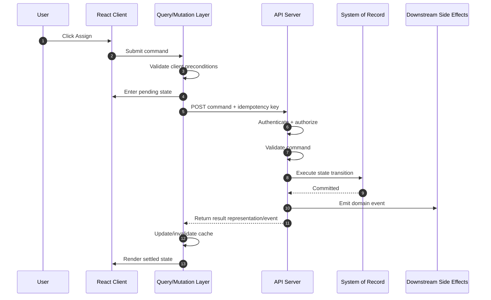
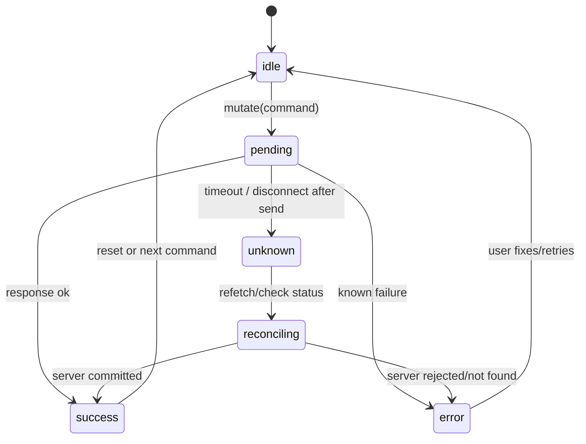
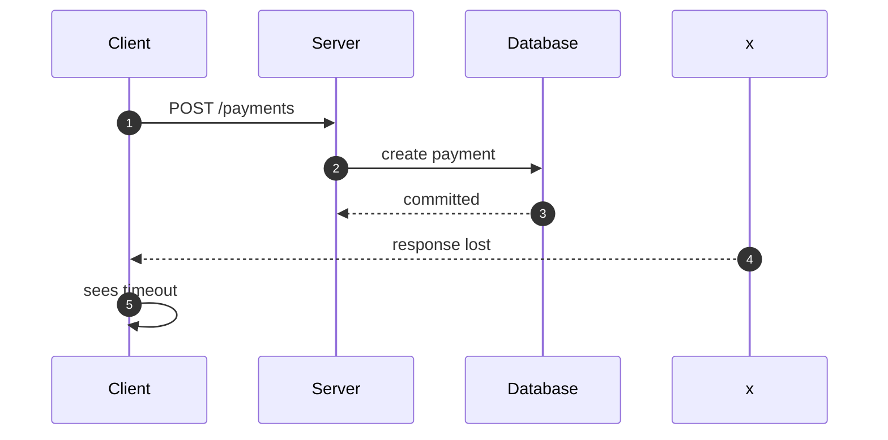
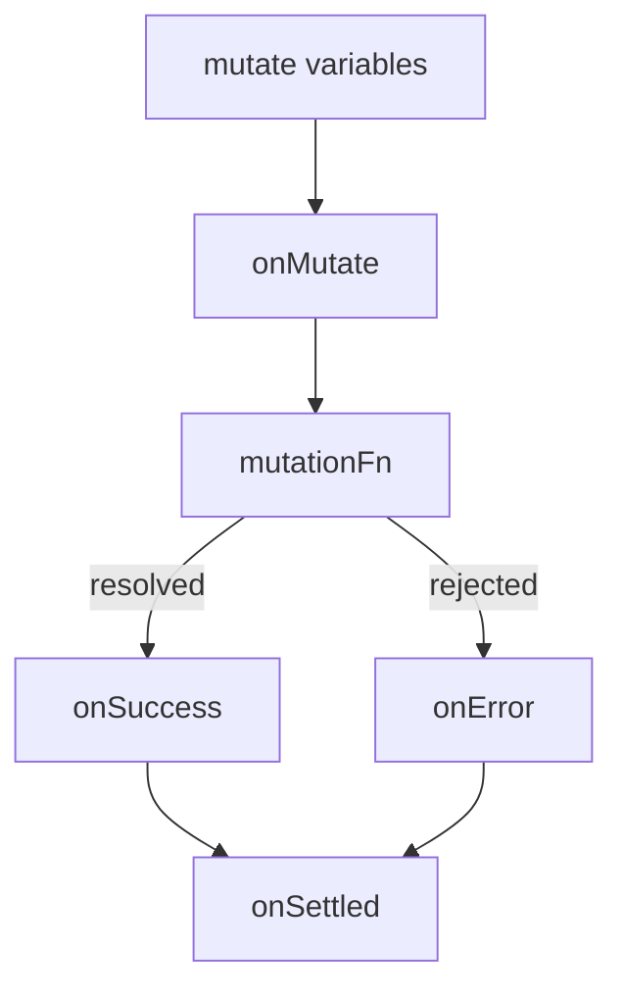
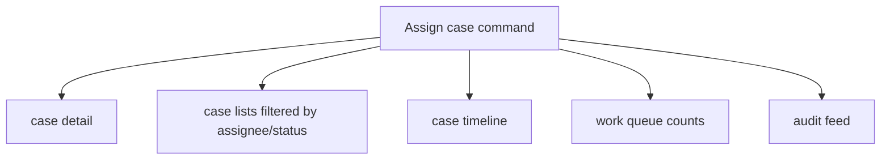
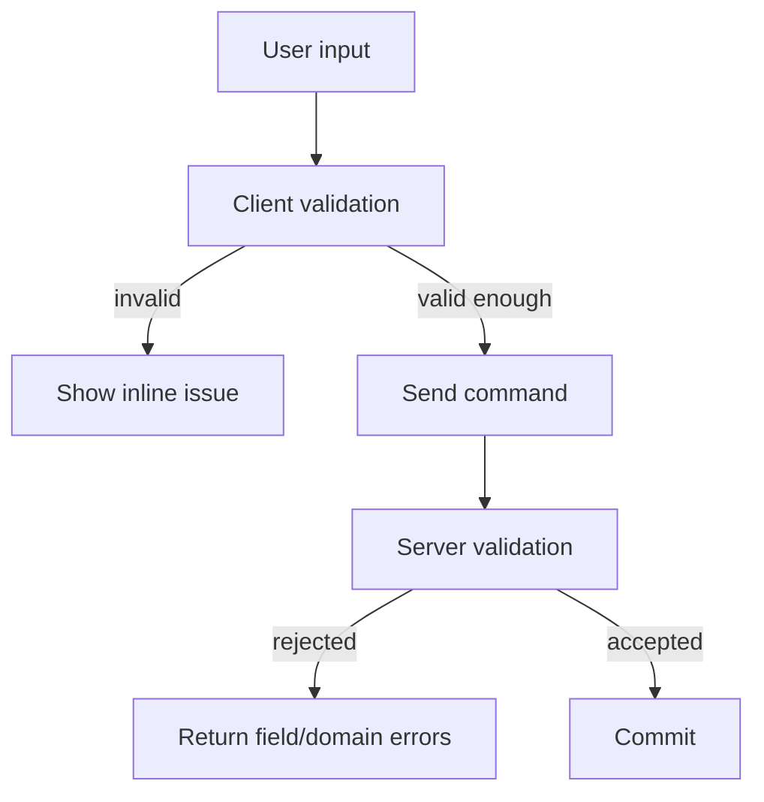
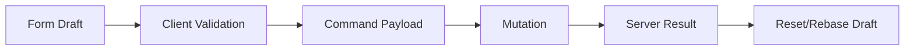
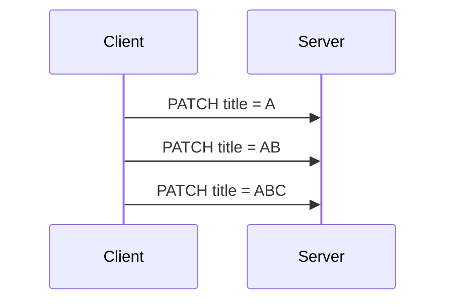

# Part 029 — Mutation Lifecycle and Side Effects

> Target mental model: **a mutation is a command crossing a trust boundary.** It is not a local setter. It has intent, validation, transport, authorization, execution, ambiguity, reconciliation, and side effects.

Queries ask: "What is the current representation?"

Mutations say: "Change the system."

That difference is enormous.

A query can fail and the user still has the previous screen. A mutation can fail after the server already performed the change. A query can often be retried safely. A mutation can create duplicate orders, duplicate payments, duplicated comments, broken workflow transitions, or invalid audit history if retried blindly.

This part builds the production mental model for mutation lifecycle in React applications.

---

## 1. Mutation Is Not `setState`

A local state update is synchronous ownership over local memory:

```tsx
setDraft((draft) => ({ ...draft, title: nextTitle }))
```

A mutation is a command to a remote authority:

```tsx
await api.cases.assign(caseId, { assigneeId })
```

Those operations look similar in UI code, but they have different semantics.

| Concern | Local state update | Server mutation |
|---|---|---|
| Authority | Current browser tab | Server-side system of record |
| Failure | Usually programmer bug | Network, authorization, validation, conflict, timeout, server failure |
| Ordering | React scheduling + event order | Network order + server order + concurrency control |
| Visibility | Current component/app | Other users, tabs, services, audit logs |
| Reversibility | Usually easy | Often impossible or domain-specific |
| Retry | Usually irrelevant | Dangerous unless idempotent |
| Observability | DevTools/local logs | Request IDs, traces, audit records |

Production rule:

> Treat mutation as **distributed state transition**, not as a function call.

---

## 2. Command vs Representation

A common mistake is to send server representations back as mutation payloads.

Bad shape:

```http
PUT /cases/C-100
Content-Type: application/json

{
  "id": "C-100",
  "status": "OPEN",
  "assignee": {
    "id": "U-9",
    "name": "Ari"
  },
  "riskScore": 82,
  "createdAt": "2026-07-01T10:00:00Z",
  "updatedAt": "2026-07-07T06:00:00Z"
}
```

This couples client payloads to server representation. The client may accidentally overwrite fields it does not own.

Better shape:

```http
POST /cases/C-100/commands/assign
Idempotency-Key: 01J2Z7R4N0EXAMPLE
Content-Type: application/json

{
  "assigneeId": "U-9",
  "reason": "Manual triage assignment"
}
```

The first payload says: "Here is what I think the case should look like."

The second says: "Please execute this intent."

In rich systems, mutations are better modeled as commands:

```ts
type AssignCaseCommand = {
  caseId: string;
  assigneeId: string;
  reason: string;
  clientRequestId: string;
};
```

A command should describe intent, not leak every internal field.

---

## 3. Mutation Lifecycle Overview

A mutation has a lifecycle independent of React rendering.



The important point: the UI sees only a simplified subset.



Most tutorials model mutation as `idle -> loading -> success/error`.

Production systems need at least one more state: **unknown outcome**.

---

## 4. The Unknown Outcome Problem

This is the hardest mutation failure mode:

1. Browser sends request.
2. Server receives request.
3. Server commits change.
4. Network connection dies before response reaches browser.
5. Browser sees timeout/network error.

What happened?

The client cannot know from transport alone.



If the client blindly retries a non-idempotent command, it may create a duplicate. If it tells the user "failed", it may lie.

Production rule:

> After a mutation request has left the browser, timeout does not prove failure. It proves only that the client did not observe the final result.

### Practical handling

For low-risk operations:

```txt
Show: "We could not confirm the update. Refreshing status..."
Refetch affected resources.
```

For high-risk operations:

```txt
Use idempotency keys.
Expose command status endpoint.
Do not retry blindly.
```

For workflow systems:

```txt
Record client command id.
Return transition id / audit id.
Let client reconcile by command id.
```

---

## 5. Mutation Categories

Not every mutation deserves the same machinery.

| Category | Example | Risk | Client behavior |
|---|---|---:|---|
| Local preference persisted remotely | Change theme | Low | Optimistic, retry okay with last-write-wins |
| Content edit | Rename dashboard | Medium | Optimistic with rollback/refetch |
| Workflow transition | Approve case | High | Confirm state, idempotency, conflict handling |
| Money/legal action | Submit payment, issue penalty | Critical | Explicit confirmation, idempotency, status reconciliation, audit |
| Destructive operation | Delete record | High | Undo window or explicit confirmation; robust refetch |
| Bulk mutation | Assign 500 records | High | Background job, progress, partial result model |

Do not over-engineer every `POST`. Do not under-engineer irreversible commands.

The risk is not the HTTP method. The risk is the domain consequence.

---

## 6. Mutation Function Boundary

A mutation function should hide transport mechanics but expose domain semantics.

Bad:

```ts
async function submit(url: string, body: unknown) {
  return fetch(url, {
    method: 'POST',
    body: JSON.stringify(body),
  });
}
```

Better:

```ts
type AssignCaseInput = {
  caseId: string;
  assigneeId: string;
  reason: string;
  idempotencyKey: string;
};

type AssignCaseResult = {
  caseId: string;
  assigneeId: string;
  version: number;
  auditId: string;
};

async function assignCase(input: AssignCaseInput, signal?: AbortSignal) {
  return apiClient.post<AssignCaseResult>(
    `/cases/${input.caseId}/commands/assign`,
    {
      body: {
        assigneeId: input.assigneeId,
        reason: input.reason,
      },
      headers: {
        'Idempotency-Key': input.idempotencyKey,
      },
      signal,
    }
  );
}
```

A production mutation function should decide:

- endpoint
- method
- payload shape
- idempotency header
- response parsing
- error mapping
- runtime validation
- observability metadata

It should not decide UI behavior. That belongs to the mutation hook or caller.

---

## 7. Mutation with TanStack Query

TanStack Query gives a mutation state machine, callback lifecycle, retry control, and integration with query cache.

```tsx
import { useMutation, useQueryClient } from '@tanstack/react-query';

function useAssignCaseMutation() {
  const queryClient = useQueryClient();

  return useMutation({
    mutationFn: assignCase,
    retry: false,
    onSuccess: (result, variables) => {
      queryClient.invalidateQueries({ queryKey: ['case', variables.caseId] });
      queryClient.invalidateQueries({ queryKey: ['case-assignment', variables.caseId] });
    },
  });
}
```

Usage:

```tsx
function AssignButton({ caseId, assigneeId }: Props) {
  const assignCase = useAssignCaseMutation();

  return (
    <button
      disabled={assignCase.isPending}
      onClick={() =>
        assignCase.mutate({
          caseId,
          assigneeId,
          reason: 'Manual triage assignment',
          idempotencyKey: crypto.randomUUID(),
        })
      }
    >
      {assignCase.isPending ? 'Assigning…' : 'Assign'}
    </button>
  );
}
```

This is the baseline. It is not yet enough for every production case.

---

## 8. The Mutation Callback Lifecycle

A typical lifecycle:

```ts
useMutation({
  mutationFn,
  onMutate: async (variables) => {
    // before mutation function executes
    // often used for optimistic updates
  },
  onSuccess: (data, variables, context) => {
    // server confirmed success
  },
  onError: (error, variables, context) => {
    // mutation failed from the client's perspective
  },
  onSettled: (data, error, variables, context) => {
    // success or error
  },
});
```

The order matters.



Production interpretation:

| Callback | Purpose | Dangerous use |
|---|---|---|
| `onMutate` | Prepare optimistic branch, cancel conflicting queries, snapshot rollback data | Irreversible side effect |
| `mutationFn` | Perform the command | UI toast logic, cache manipulation |
| `onSuccess` | Reconcile confirmed result | Assuming every related query is automatically correct |
| `onError` | Rollback, classify error, display recovery path | Blindly show "failed" for unknown outcomes |
| `onSettled` | Cleanup, invalidate, telemetry | Duplicating logic from success/error without reason |

Keep network command and UI side effects separate.

---

## 9. Side Effects: Classify Before Implementing

A mutation can trigger many side effects:

```txt
show spinner
show toast
disable form
optimistically update cache
append timeline item
invalidate queries
navigate to another route
close modal
emit analytics event
write audit log server-side
send email server-side
publish event server-side
```

Do not put all of them into `onSuccess` without classification.

### Client-local side effects

Examples:

- disable button
- close modal
- show toast
- navigate
- update local draft state

These affect only current UI.

### Client cache side effects

Examples:

- update query cache
- invalidate query
- remove stale list item
- insert optimistic row

These affect future reads inside the app.

### Server-side side effects

Examples:

- audit log
- notification
- workflow transition
- event publication
- search index update

These must not be assumed complete just because client cache changed.

Production rule:

> Client optimistic state may improve perceived responsiveness, but it must never be confused with server-side side effect completion.

---

## 10. Disable, Debounce, Deduplicate, or Idempotency?

Double-submit is common.

```tsx
<button onClick={() => mutation.mutate(input)}>Submit</button>
```

A fast double-click may issue two commands.

Options:

| Technique | Protects against | Does not protect against |
|---|---|---|
| Disable while pending | Same visible button double-click | Retry, refresh, second tab, duplicate network send |
| Debounce | Rapid repeated UI events | Real duplicate intent, retry ambiguity |
| Client dedupe | Same in-flight command in one runtime | New tab/session, server retry ambiguity |
| Idempotency key | Duplicate delivery of same logical command | Two truly different commands |
| Server concurrency check | Stale state transition | Duplicate accepted if command is valid twice |

Use layers.

For important mutation:

```tsx
const idempotencyKeyRef = useRef<string | null>(null);

function submit() {
  idempotencyKeyRef.current ??= crypto.randomUUID();

  mutation.mutate({
    ...input,
    idempotencyKey: idempotencyKeyRef.current,
  });
}
```

Reset the key only after a known final result:

```ts
onSuccess: () => {
  idempotencyKeyRef.current = null;
},
onError: (error) => {
  if (isKnownRejected(error)) {
    idempotencyKeyRef.current = null;
  }
  // keep key for unknown outcome reconciliation/retry
},
```

This is not just a frontend pattern. The server must store and honor the idempotency key.

---

## 11. Retry Policy for Mutations

For queries, retry is often acceptable.

For mutations, retry must be deliberate.

Bad default:

```ts
useMutation({
  mutationFn: submitPayment,
  retry: 3,
});
```

Better:

```ts
useMutation({
  mutationFn: submitPayment,
  retry: (failureCount, error) => {
    if (!isTransientTransportError(error)) return false;
    if (!error.requestWasDefinitelyNotSent) return false;
    return failureCount < 1;
  },
});
```

For most workflow and financial operations:

```ts
retry: false
```

Then handle recovery explicitly:

```txt
We could not confirm whether the payment was submitted.
Check status before trying again.
```

### Idempotent command retry

If the server supports idempotency keys:

```ts
useMutation({
  mutationFn: submitWithIdempotencyKey,
  retry: (failureCount, error) => {
    return isTransientError(error) && failureCount < 2;
  },
});
```

But even then, keep a deadline. An idempotent retry loop can still overload the system.

---

## 12. Mutation Result Design

A mutation should return enough data to reconcile UI.

Weak result:

```json
{ "success": true }
```

This forces refetch for everything.

Better result:

```json
{
  "caseId": "C-100",
  "version": 42,
  "status": "ASSIGNED",
  "assigneeId": "U-9",
  "auditId": "AUD-991",
  "updatedAt": "2026-07-07T08:20:00Z"
}
```

Best result depends on domain:

```ts
type MutationResult<T> = {
  entity: T;
  version: number;
  changedFields?: string[];
  events?: Array<{
    type: string;
    id: string;
    occurredAt: string;
  }>;
};
```

The response must support one of these reconciliation strategies:

1. directly update affected cache entries
2. invalidate affected cache entries
3. navigate to canonical representation
4. poll command/job status
5. display partial success/failure result

A `success: true` response is often an API smell.

---

## 13. Invalidation After Mutation

After a confirmed mutation, cached representations may be stale.

```tsx
onSuccess: (_, variables) => {
  queryClient.invalidateQueries({ queryKey: ['cases'] });
  queryClient.invalidateQueries({ queryKey: ['case', variables.caseId] });
}
```

This is safe but often too broad.

Better:

```tsx
onSuccess: (updatedCase, variables) => {
  queryClient.setQueryData(['case', variables.caseId], updatedCase);

  queryClient.invalidateQueries({
    queryKey: ['cases', 'list'],
    exact: false,
  });

  queryClient.invalidateQueries({
    queryKey: ['case-timeline', variables.caseId],
  });
}
```

Think in affected representations:



Not every representation needs exact immediate update. Some need invalidation. Some can stay stale until focus or next route entry.

### Update vs invalidate

| Strategy | Use when | Risk |
|---|---|---|
| `setQueryData` | Response contains canonical representation | Incorrect manual merge |
| `invalidateQueries` | Many representations affected, refetch affordable | Extra network traffic, temporary stale UI |
| `removeQueries` | Data no longer accessible/safe | Over-aggressive cache loss |
| `refetchQueries` | Must refresh immediately | Waterfall/load spike |
| `setQueriesData` | Need patch across matching queries | Hard to reason with list filters |

Default to invalidation when correctness matters more than immediate smoothness. Use direct cache update when the server response is rich and the affected cache entry is well-scoped.

---

## 14. Mutation State Is Not Just Button Loading

TanStack Query mutation state is often used like this:

```tsx
<button disabled={mutation.isPending}>Save</button>
```

That is useful but incomplete.

A production UI usually needs:

```ts
type SaveState =
  | { tag: 'idle' }
  | { tag: 'client-invalid'; issues: string[] }
  | { tag: 'pending'; startedAt: number }
  | { tag: 'unknown-outcome'; requestId: string }
  | { tag: 'rejected'; message: string; recoverable: boolean }
  | { tag: 'confirmed'; version: number };
```

Map mutation state to product state deliberately:

```tsx
function SaveBanner({ mutation }: { mutation: SaveMutation }) {
  if (mutation.isPending) {
    return <StatusBanner tone="info">Saving changes…</StatusBanner>;
  }

  if (mutation.isError) {
    if (isConflictError(mutation.error)) {
      return <StatusBanner tone="warning">This record changed. Review latest data.</StatusBanner>;
    }

    if (isUnknownOutcome(mutation.error)) {
      return <StatusBanner tone="warning">We could not confirm the save. Checking status…</StatusBanner>;
    }

    return <StatusBanner tone="danger">Save failed. Fix the issue and retry.</StatusBanner>;
  }

  if (mutation.isSuccess) {
    return <StatusBanner tone="success">Saved.</StatusBanner>;
  }

  return null;
}
```

The UI should expose what the system knows, not hide uncertainty behind generic error text.

---

## 15. Concurrency and Version Preconditions

Many mutation bugs are actually stale write bugs.

Example:

1. User opens case version 10.
2. Another user assigns the case, version becomes 11.
3. First user submits transition based on version 10.
4. Server must decide whether this is allowed.

Client payload should carry precondition:

```ts
type ApproveCaseCommand = {
  caseId: string;
  expectedVersion: number;
  comment: string;
};
```

HTTP can express this through headers:

```http
PATCH /cases/C-100
If-Match: "v10"
Content-Type: application/json

{
  "status": "APPROVED"
}
```

Or through domain payload:

```json
{
  "expectedVersion": 10,
  "transition": "APPROVE",
  "comment": "Evidence complete"
}
```

Client handling:

```ts
onError: (error, variables) => {
  if (isConflict(error)) {
    queryClient.invalidateQueries({ queryKey: ['case', variables.caseId] });
    openConflictResolutionDialog();
    return;
  }

  showError(error);
}
```

A stale write is not a generic failure. It needs a merge, refresh, or explicit user decision.

---

## 16. Client Validation vs Server Validation

Client validation improves feedback. Server validation owns truth.



Client validation should catch:

- missing required fields
- obvious format errors
- local length constraints
- impossible UI combinations

Server validation must catch:

- authorization
- workflow legality
- cross-entity constraints
- uniqueness
- version conflicts
- policy rules
- business invariants

Design error shape so the client can render useful messages:

```ts
type ValidationProblem = {
  type: 'validation_error';
  title: string;
  status: 422;
  fieldErrors: Record<string, string[]>;
  domainErrors: Array<{
    code: string;
    message: string;
    path?: string;
  }>;
};
```

Do not squeeze all failures into toast text.

---

## 17. Mutation and Navigation

Navigation after mutation is a side effect with ordering risk.

Bad:

```tsx
const mutation = useMutation({ mutationFn: createCase });

function submit(input: CreateCaseInput) {
  mutation.mutate(input);
  navigate('/cases');
}
```

This navigates before success.

Better:

```tsx
const mutation = useMutation({
  mutationFn: createCase,
  onSuccess: (created) => {
    navigate(`/cases/${created.id}`);
  },
});
```

But for optimistic creation, maybe you need temporary route state:

```tsx
onMutate: (input) => {
  const tempId = `tmp_${crypto.randomUUID()}`;
  navigate(`/cases/${tempId}`);
  return { tempId };
},
onSuccess: (created, _variables, context) => {
  replace(`/cases/${created.id}`);
},
onError: (_error, _variables, context) => {
  replace('/cases/new');
  removeTemporaryCase(context.tempId);
},
```

Navigation changes the lifetime of components. If mutation callbacks update unmounted local state, you have a bug. Prefer query cache and router state for cross-route effects.

---

## 18. Mutation and Forms

Forms contain draft state. Mutation submits command state.

Do not bind every keystroke directly to server mutation unless the product truly needs autosave.



Pattern:

```tsx
function CaseEditForm({ caseId }: Props) {
  const { data: current } = useCase(caseId);
  const form = useForm({ defaultValues: toDraft(current) });
  const save = useSaveCaseMutation();

  function onSubmit(values: CaseDraft) {
    save.mutate({
      caseId,
      expectedVersion: current.version,
      patch: diff(toDraft(current), values),
      idempotencyKey: crypto.randomUUID(),
    });
  }

  return <Form form={form} onSubmit={onSubmit} />;
}
```

Important distinction:

- form draft is local client state
- server entity is query state
- mutation command is transport state
- saved result is canonical server state

Mixing them creates dirty form bugs.

---

## 19. Bulk Mutation

Bulk mutation is not "loop over IDs and call mutate".

Bad:

```ts
selectedIds.forEach((id) => assignCase.mutate({ caseId: id, assigneeId }));
```

This causes:

- uncontrolled concurrency
- partial failures hidden behind many independent mutations
- duplicated toasts
- overloaded API
- impossible rollback story
- confusing progress state

Better API:

```http
POST /cases/bulk-commands/assign
Content-Type: application/json

{
  "caseIds": ["C-1", "C-2", "C-3"],
  "assigneeId": "U-9",
  "clientRequestId": "01J2Z..."
}
```

Result:

```ts
type BulkAssignResult = {
  accepted: Array<{ caseId: string; version: number }>;
  rejected: Array<{
    caseId: string;
    code: string;
    message: string;
  }>;
};
```

For large bulk operations, create a job:

```http
POST /bulk-jobs/case-assignment

HTTP/1.1 202 Accepted
Location: /bulk-jobs/J-100
```

Then poll or subscribe to progress.

The frontend should model partial success explicitly.

---

## 20. Mutation Observability

Every production mutation should be traceable.

At minimum, collect:

```ts
type MutationTelemetry = {
  operation: string;
  method: string;
  routePattern: string;
  requestId?: string;
  idempotencyKey?: string;
  entityType?: string;
  entityId?: string;
  startedAt: number;
  durationMs?: number;
  outcome: 'success' | 'known_error' | 'unknown_outcome';
  httpStatus?: number;
  errorCode?: string;
  retryCount?: number;
};
```

Do not log full payloads by default. Mutation payloads often contain PII or sensitive policy data.

### Useful questions during incidents

- Did the browser send duplicate commands?
- Did the user retry after timeout?
- Did idempotency key change between retries?
- Did the server commit but response fail?
- Did invalidation happen after success?
- Did the UI show success before commit?
- Did two tabs submit conflicting commands?
- Did optimistic UI hide a server rejection?

Instrumentation should answer these without reading user screenshots.

---

## 21. Mutation Hook Design

A reusable mutation hook should encode policy.

```ts
export function useApproveCaseMutation() {
  const queryClient = useQueryClient();

  return useMutation({
    mutationKey: ['case-command', 'approve'],
    mutationFn: approveCase,
    retry: false,
    onSuccess: (result, variables) => {
      queryClient.setQueryData(['case', variables.caseId], result.case);
      queryClient.invalidateQueries({ queryKey: ['case-timeline', variables.caseId] });
      queryClient.invalidateQueries({ queryKey: ['case-work-queue'] });
    },
    onError: (error, variables) => {
      if (isConflict(error)) {
        queryClient.invalidateQueries({ queryKey: ['case', variables.caseId] });
      }
    },
  });
}
```

The component should not know all affected caches.

Component:

```tsx
function ApproveCaseButton({ caseId, version }: Props) {
  const approve = useApproveCaseMutation();

  return (
    <button
      disabled={approve.isPending}
      onClick={() =>
        approve.mutate({
          caseId,
          expectedVersion: version,
          idempotencyKey: crypto.randomUUID(),
        })
      }
    >
      Approve
    </button>
  );
}
```

The component owns user intent. The mutation hook owns server-state side effects.

---

## 22. Avoid Global Mutation Side Effects by Default

Global mutation listeners are tempting:

```ts
mutationCache.subscribe((event) => {
  if (event.type === 'success') {
    toast.success('Saved');
  }
});
```

This quickly becomes noisy and incorrect.

Global side effects are reasonable for:

- telemetry
- generic auth expiration handling
- global network/offline indicators
- debugging tools

They are dangerous for:

- domain toasts
- navigation
- cache invalidation
- modal closing
- permission-specific UI

Domain mutation side effects should live near domain hooks.

---

## 23. Mutation Queueing

Some operations must be serialized.

Example: autosave patches for the same document.



If responses arrive out of order, stale data may win.

Options:

1. debounce and send only latest
2. serialize writes per entity
3. include version preconditions
4. use server merge semantics
5. use operation log/CRDT-like model for collaborative domains

Simple per-entity queue:

```ts
const queues = new Map<string, Promise<unknown>>();

export function enqueueByKey<T>(key: string, task: () => Promise<T>): Promise<T> {
  const previous = queues.get(key) ?? Promise.resolve();

  const next = previous
    .catch(() => undefined)
    .then(task)
    .finally(() => {
      if (queues.get(key) === next) {
        queues.delete(key);
      }
    });

  queues.set(key, next);
  return next;
}
```

Use carefully. Queues can hide slow writes and create stale user expectations.

---

## 24. Mutation Cancellation Is Not Undo

You can abort a fetch request:

```ts
const controller = new AbortController();
fetch('/cases/C-100/commands/assign', {
  method: 'POST',
  signal: controller.signal,
});
controller.abort();
```

But aborting the client request does not guarantee server execution stopped.

For mutations:

```txt
Abort means: the client stopped waiting or sending.
It does not mean: the command had no effect.
```

If the product needs undo, design undo as a domain command:

```http
POST /cases/C-100/commands/unassign
```

or a reversible workflow transition:

```http
POST /cases/C-100/commands/reopen
```

Do not sell transport cancellation as business undo.

---

## 25. Side Effect Placement Matrix

| Side effect | Recommended location |
|---|---|
| Disable submit button | Component from mutation state |
| Inline validation error | Form layer + server error mapper |
| Toast success | Domain mutation hook or calling screen |
| Cache update | Domain mutation hook |
| Query invalidation | Domain mutation hook |
| Navigation after create | Calling screen or route action handler |
| Audit log | Server |
| Notification/email | Server/domain event |
| Analytics | Mutation wrapper or domain hook |
| Idempotency key generation | Command factory/calling intent boundary |
| Retry policy | Mutation hook/API client policy |
| Conflict dialog | Calling screen/domain UI |

The principle:

> Put side effects at the narrowest layer that has enough context to do them correctly.

---

## 26. A Production Mutation Template

```ts
type CommandResult<T> = {
  data: T;
  version?: number;
  auditId?: string;
};

type CommandInput<TPayload> = TPayload & {
  idempotencyKey: string;
};

function useCommandMutation<TPayload, TResult>(config: {
  mutationKey: readonly unknown[];
  command: (input: CommandInput<TPayload>) => Promise<CommandResult<TResult>>;
  affectedQueries: (result: CommandResult<TResult>, input: CommandInput<TPayload>) => Array<readonly unknown[]>;
}) {
  const queryClient = useQueryClient();

  return useMutation({
    mutationKey: config.mutationKey,
    mutationFn: config.command,
    retry: false,
    onSuccess: async (result, input) => {
      for (const queryKey of config.affectedQueries(result, input)) {
        await queryClient.invalidateQueries({ queryKey });
      }
    },
    onError: (error, input) => {
      reportMutationError({
        operation: config.mutationKey.join('.'),
        error,
        idempotencyKey: input.idempotencyKey,
      });
    },
  });
}
```

Domain hook:

```ts
export function useAssignCase() {
  return useCommandMutation({
    mutationKey: ['case-command', 'assign'],
    command: assignCase,
    affectedQueries: (_result, input) => [
      ['case', input.caseId],
      ['case-timeline', input.caseId],
      ['case-work-queue'],
    ],
  });
}
```

This is still a template, not a universal abstraction. If the mutation has complex optimistic logic, partial success, or command status reconciliation, write a dedicated hook.

---

## 27. Mutation Testing

Test mutation behavior at three levels.

### API client contract

```ts
it('sends idempotency key and command payload', async () => {
  server.use(
    http.post('/cases/:id/commands/assign', async ({ request, params }) => {
      expect(request.headers.get('Idempotency-Key')).toBeTruthy();
      expect(params.id).toBe('C-100');

      const body = await request.json();
      expect(body).toEqual({
        assigneeId: 'U-9',
        reason: 'Manual triage assignment',
      });

      return HttpResponse.json({
        caseId: 'C-100',
        assigneeId: 'U-9',
        version: 11,
        auditId: 'AUD-1',
      });
    })
  );
});
```

### Hook cache behavior

```ts
it('invalidates affected queries after assignment succeeds', async () => {
  const queryClient = createTestQueryClient();
  const invalidateSpy = vi.spyOn(queryClient, 'invalidateQueries');

  const { result } = renderHook(() => useAssignCaseMutation(), {
    wrapper: createQueryWrapper(queryClient),
  });

  await act(async () => {
    await result.current.mutateAsync({
      caseId: 'C-100',
      assigneeId: 'U-9',
      reason: 'test',
      idempotencyKey: 'idem-1',
    });
  });

  expect(invalidateSpy).toHaveBeenCalledWith({ queryKey: ['case', 'C-100'] });
});
```

### UI behavior

```tsx
it('disables submit while mutation is pending', async () => {
  render(<AssignButton caseId="C-100" assigneeId="U-9" />);

  await user.click(screen.getByRole('button', { name: /assign/i }));

  expect(screen.getByRole('button', { name: /assigning/i })).toBeDisabled();
});
```

Also test:

- double-click
- timeout after send
- 409 conflict
- 422 validation problem
- 403 forbidden
- server success with stale cache
- optimistic rollback
- navigation after success

---

## 28. Common Failure Modes

### Failure: success toast before commit

Cause:

```tsx
onClick={() => {
  mutation.mutate(input);
  toast.success('Saved');
}}
```

Fix:

```tsx
onSuccess: () => toast.success('Saved')
```

### Failure: blind retry creates duplicates

Cause:

```ts
useMutation({ mutationFn: createPayment, retry: 3 })
```

Fix:

```ts
useMutation({ mutationFn: createPayment, retry: false })
```

plus idempotency/status reconciliation.

### Failure: broad invalidation causes storm

Cause:

```ts
queryClient.invalidateQueries()
```

Fix: target affected query keys.

### Failure: cache updated but filtered list wrong

Cause:

```ts
queryClient.setQueryData(['cases', 'list'], append(updatedCase))
```

without respecting list filters.

Fix: invalidate filtered lists, or use a carefully tested list patch function that removes/inserts based on filter membership.

### Failure: stale write overwrites newer data

Cause: missing version precondition.

Fix: `expectedVersion`, ETag/`If-Match`, server conflict response.

### Failure: cancellation treated as undo

Cause: user closes modal, request aborted, UI assumes no change happened.

Fix: model unknown outcome and reconcile.

---

## 29. Review Checklist

Before approving a mutation implementation, ask:

- What is the command intent?
- What entity or aggregate owns the state transition?
- Is the operation idempotent?
- Is there an idempotency key for duplicate delivery?
- What happens if the request times out after the server commits?
- Does the payload include a stale-write precondition when needed?
- What cache entries are affected?
- Are we updating cache, invalidating, or both?
- Is the mutation retry policy safe?
- Are validation errors rendered as field/domain errors?
- Is `onSuccess` the only place that displays confirmed success?
- Does the UI distinguish rejected vs unknown outcome?
- Does the server response contain enough data to reconcile?
- Are sensitive payloads excluded from logs?
- Is there an audit/request ID to trace the command?
- Have double-submit and multi-tab cases been considered?

---

## 30. Key Takeaways

A production mutation is not an HTTP call with a spinner.

It is a distributed command lifecycle.

The key invariants:

1. **Command is intent, not representation dump.**
2. **Timeout after send creates unknown outcome.**
3. **Retry mutation only when semantics are safe.**
4. **Idempotency belongs to server and client together.**
5. **Cache invalidation is part of mutation correctness.**
6. **Optimistic UI is a branch, not truth.**
7. **Side effects need ownership.**
8. **Stale-write protection is domain correctness.**

The next part goes deeper into optimistic UI: how to make the app feel instant without lying to the user or corrupting the cache.
