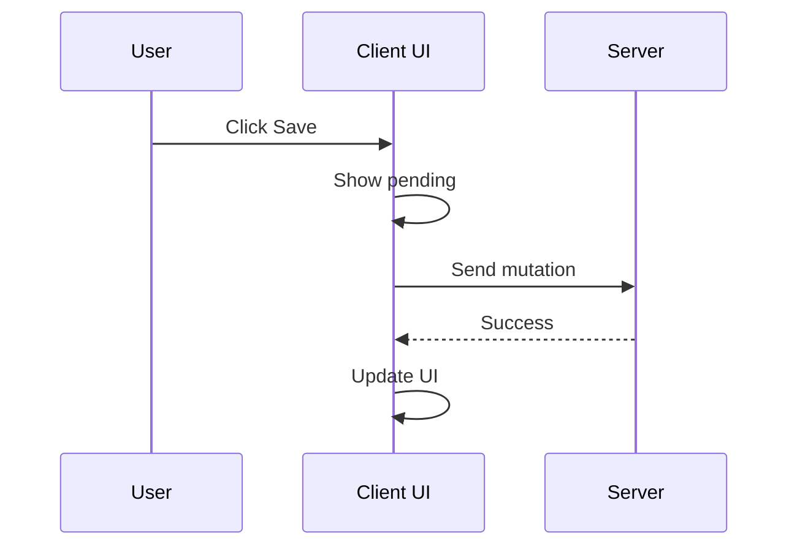
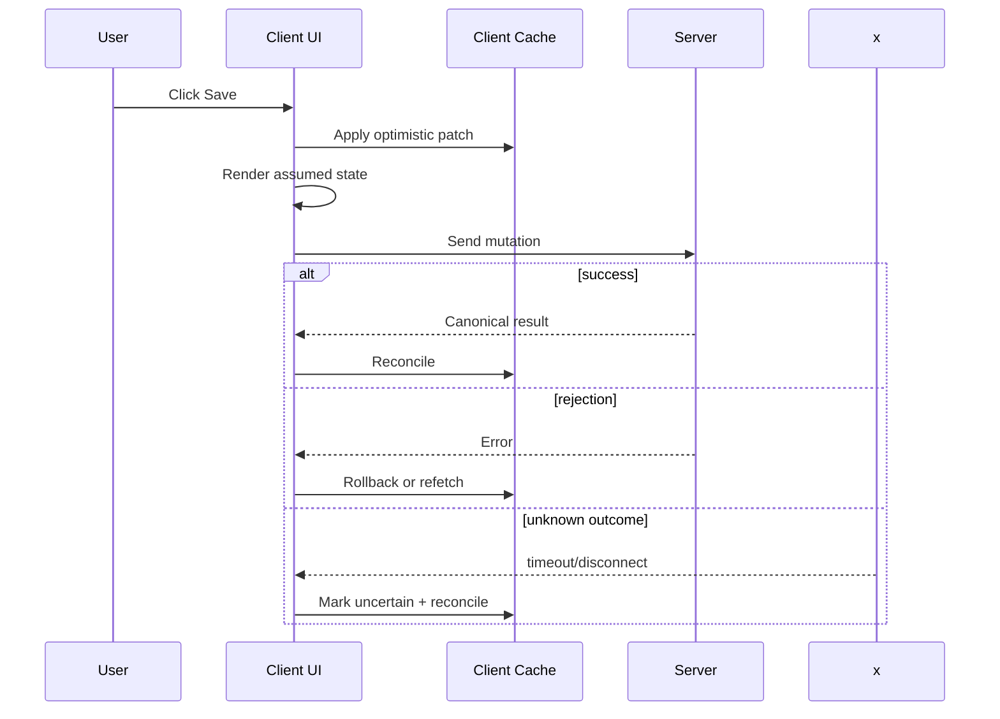
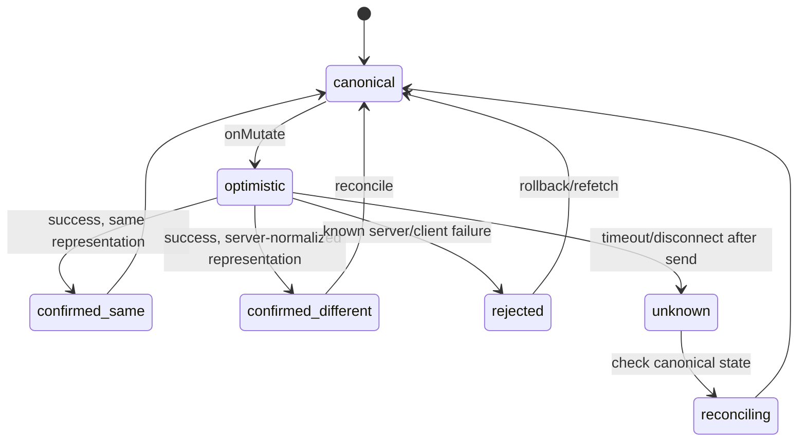
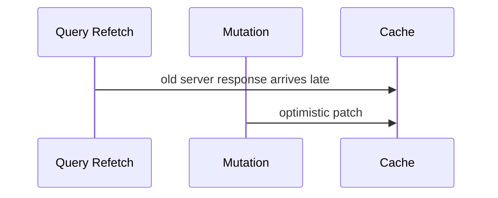
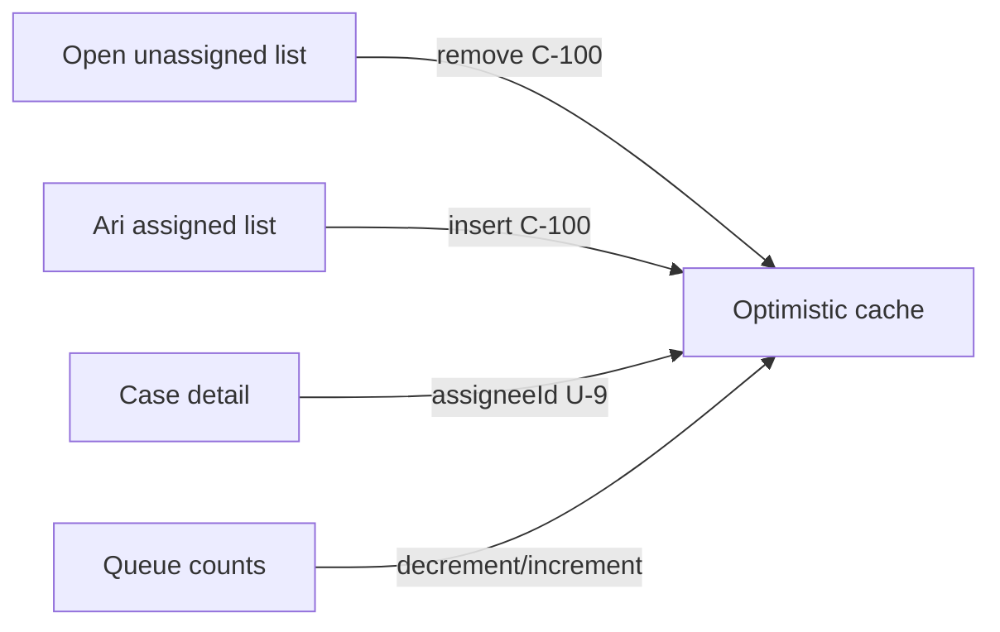
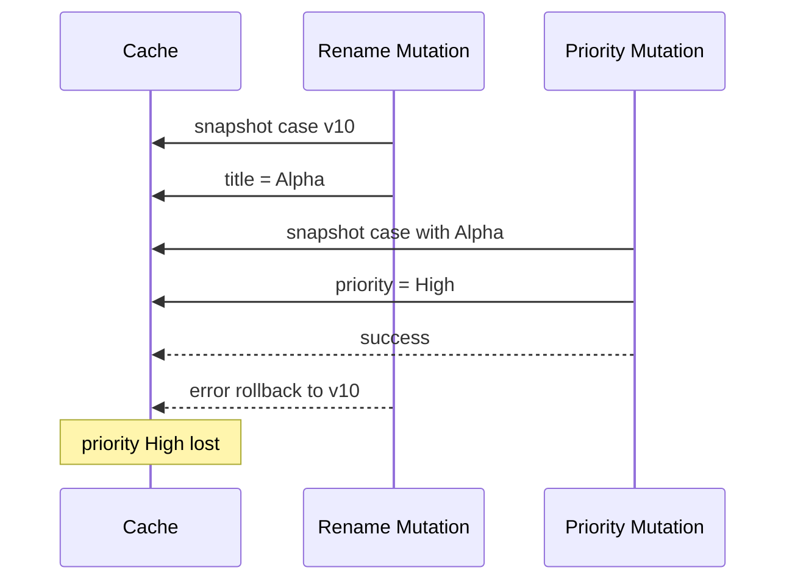
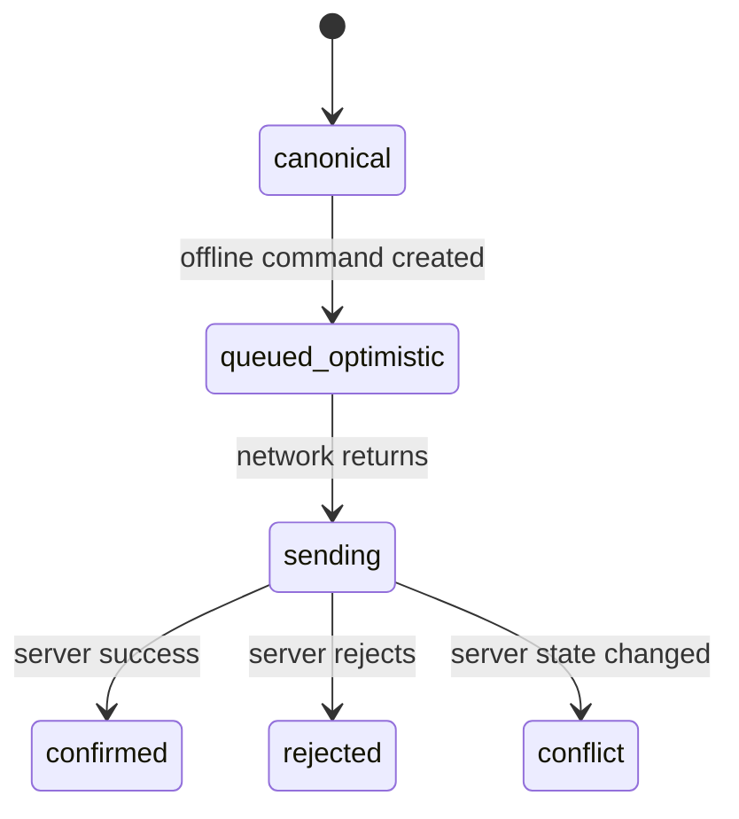

# Part 030 — Optimistic UI and Rollback Design

> Target mental model: **optimistic UI creates a temporary branch of server state.** A rollback is not "set loading false". It is branch reconciliation after the server accepts, rejects, conflicts, or becomes unknowable.

Optimistic UI is seductive because it makes an app feel instant.

The danger is that it can also make the app confidently wrong.

A mature optimistic design answers:

- What exactly did we assume?
- Which cache entries did we modify?
- How do we undo the assumption?
- What happens if the server accepts with a different representation?
- What happens if the server rejects?
- What happens if outcome is unknown?
- What happens if another mutation touches the same data concurrently?

This part builds optimistic UI from first principles.

---

## 1. What Optimistic UI Actually Is

Without optimistic UI:



With optimistic UI:



The key difference:

> The UI updates before the authority confirms.

That means you temporarily fork reality.

---

## 2. Optimism Is a Spectrum

Not all optimistic UI modifies the same layer.

| Pattern | What changes immediately | Example | Risk |
|---|---|---|---:|
| Pending affordance | Button/text only | "Saving…" | Low |
| Local optimistic state | Current component only | add pending comment row | Low-medium |
| Query cache optimistic patch | Shared server-state cache | update list/detail immediately | Medium-high |
| Route/navigation optimism | Move user to assumed route | create record then navigate to temp ID | High |
| Cross-entity optimism | Multiple caches change together | assign case changes queue, detail, counters | High |
| Irreversible-domain optimism | Show legal/payment action as done before commit | submit penalty/payment | Critical |

Production rule:

> The more places an optimistic assumption touches, the stronger your rollback and reconciliation design must be.

---

## 3. When Not to Use Optimistic UI

Optimistic UI is not always a virtue.

Avoid or limit optimism when:

- action is legally/financially irreversible
- user must know exact server result
- server-side policy is complex and likely to reject
- operation has high concurrency/conflict probability
- operation triggers important external side effects
- rollback would be confusing or harmful
- mutation result may differ significantly from requested change

Examples:

| Mutation | Optimistic? | Better behavior |
|---|---:|---|
| Like/unlike | Usually yes | Immediate toggle + rollback/refetch |
| Rename label | Usually yes | Update text + rollback on validation error |
| Assign case | Maybe | Optimistic if policy simple; otherwise pending state |
| Approve enforcement decision | Usually no | Pending confirmation, then canonical transition |
| Submit payment | No | Explicit processing + status reconciliation |
| Delete record | Maybe | Optimistic hide with undo or soft-delete pattern |

A top engineer does not blindly optimize perceived speed. They optimize user trust under failure.

---

## 4. The Four Outcomes

Every optimistic mutation must handle four outcomes.



### Outcome 1: confirmed same

The server accepted exactly what the client assumed.

```txt
Optimistic patch remains valid.
Maybe replace temporary metadata.
```

### Outcome 2: confirmed different

The server accepted but normalized/enriched the result.

```txt
Client assumed title: "  hello  "
Server saved title: "hello"
```

Reconcile with server result.

### Outcome 3: rejected

The server did not commit.

```txt
Rollback, show validation/conflict/authorization error.
```

### Outcome 4: unknown

The client does not know whether commit happened.

```txt
Do not blindly rollback as if server rejected.
Refetch/check command status.
```

This last state is what separates production optimistic UI from demo optimistic UI.

---

## 5. Optimistic UI with Local Component State

The safest optimism is local.

Example: pending comment row.

```tsx
type Comment = {
  id: string;
  body: string;
  authorName: string;
  status?: 'pending' | 'failed';
};

function CommentBox({ caseId }: Props) {
  const [optimisticComments, setOptimisticComments] = useState<Comment[]>([]);
  const addComment = useAddCommentMutation();

  function submit(body: string) {
    const tempId = `tmp_${crypto.randomUUID()}`;

    setOptimisticComments((comments) => [
      ...comments,
      {
        id: tempId,
        body,
        authorName: 'You',
        status: 'pending',
      },
    ]);

    addComment.mutate(
      { caseId, body, idempotencyKey: crypto.randomUUID() },
      {
        onSuccess: () => {
          setOptimisticComments((comments) =>
            comments.filter((comment) => comment.id !== tempId)
          );
        },
        onError: () => {
          setOptimisticComments((comments) =>
            comments.map((comment) =>
              comment.id === tempId ? { ...comment, status: 'failed' } : comment
            )
          );
        },
      }
    );
  }
}
```

This does not mutate shared cache. It is easier to reason about.

Use local optimism when:

- optimistic item is only visible on one screen
- rollback does not need to affect many components
- server result will be fetched or appended later

---

## 6. Optimistic UI with React `useOptimistic`

React's `useOptimistic` is useful for local optimistic branches.

```tsx
import { useOptimistic } from 'react';

type Message = {
  id: string;
  text: string;
  sending?: boolean;
};

function Thread({ messages, sendMessage }: Props) {
  const [optimisticMessages, addOptimisticMessage] = useOptimistic(
    messages,
    (current: Message[], text: string) => [
      ...current,
      {
        id: `tmp_${crypto.randomUUID()}`,
        text,
        sending: true,
      },
    ]
  );

  async function formAction(formData: FormData) {
    const text = String(formData.get('message') ?? '');
    addOptimisticMessage(text);
    await sendMessage(text);
  }

  return (
    <>
      <MessageList messages={optimisticMessages} />
      <form action={formAction}>{/* ... */}</form>
    </>
  );
}
```

Use this for UI-local optimism. For shared server-state cache optimism, TanStack Query's `onMutate` pattern is often more appropriate because it can snapshot and patch cache entries.

---

## 7. Optimistic UI with TanStack Query Cache

The classic pattern:

```tsx
function useRenameCaseMutation() {
  const queryClient = useQueryClient();

  return useMutation({
    mutationFn: renameCase,
    onMutate: async (variables) => {
      await queryClient.cancelQueries({ queryKey: ['case', variables.caseId] });

      const previousCase = queryClient.getQueryData<Case>(['case', variables.caseId]);

      queryClient.setQueryData<Case>(['case', variables.caseId], (current) => {
        if (!current) return current;
        return {
          ...current,
          title: variables.title,
          optimistic: true,
        };
      });

      return { previousCase };
    },
    onError: (_error, variables, context) => {
      queryClient.setQueryData(['case', variables.caseId], context?.previousCase);
    },
    onSuccess: (serverCase, variables) => {
      queryClient.setQueryData(['case', variables.caseId], serverCase);
    },
    onSettled: (_data, _error, variables) => {
      queryClient.invalidateQueries({ queryKey: ['case', variables.caseId] });
    },
  });
}
```

Core steps:

1. cancel conflicting refetches
2. snapshot previous cache state
3. apply optimistic patch
4. return rollback context
5. on error, rollback or refetch
6. on success, reconcile with canonical result
7. on settled, optionally invalidate

The snapshot is your rollback anchor.

---

## 8. Why Cancel Queries Before Optimistic Patch?

Suppose a background refetch is in flight.



If the old refetch completes after the optimistic patch, it may overwrite optimistic state.

Better ordering:

```ts
await queryClient.cancelQueries({ queryKey: ['case', caseId] });
```

Then patch.

This does not solve every race, but it removes the most obvious one: stale query response clobbering your optimistic branch.

---

## 9. Snapshot Granularity

The easiest rollback is full snapshot:

```ts
const previous = queryClient.getQueryData(['case', caseId]);
```

Then restore:

```ts
queryClient.setQueryData(['case', caseId], previous);
```

This works for small, scoped cache entries.

For many cache entries, full snapshot becomes heavy.

Example assign case affects:

- case detail
- case list by status
- case list by assignee
- work queue count
- timeline

You may need a rollback bundle:

```ts
type AssignRollback = {
  detail?: Case;
  lists: Array<[queryKey: readonly unknown[], data: CaseList | undefined]>;
  queueCounts?: WorkQueueCounts;
};
```

Collect matching queries:

```ts
const lists = queryClient
  .getQueriesData<CaseList>({ queryKey: ['cases', 'list'] })
  .map(([queryKey, data]) => [queryKey, data] as const);
```

Rollback:

```ts
for (const [queryKey, data] of context.lists) {
  queryClient.setQueryData(queryKey, data);
}
```

But be careful: broad snapshot/restore may overwrite newer successful changes from another mutation.

---

## 10. Patch-Based Rollback

Instead of full snapshot, store inverse operation.

```ts
type Rollback = () => void;

onMutate: async (variables): Promise<{ rollback: Rollback }> => {
  const previous = queryClient.getQueryData<Case>(['case', variables.caseId]);

  queryClient.setQueryData<Case>(['case', variables.caseId], (current) =>
    current ? { ...current, title: variables.title } : current
  );

  return {
    rollback: () => {
      queryClient.setQueryData(['case', variables.caseId], previous);
    },
  };
},
onError: (_error, _variables, context) => {
  context?.rollback();
},
```

For list operations:

```ts
type ListRollback = {
  removeTempItem: () => void;
};
```

Inverse operations are smaller, but harder to prove correct under concurrency.

---

## 11. Temporary IDs

Optimistic creation needs an identity before the server returns canonical ID.

```ts
type Todo = {
  id: string;
  text: string;
  status: 'pending' | 'confirmed' | 'failed';
};
```

Create temp ID:

```ts
const tempId = `tmp_${crypto.randomUUID()}`;
```

Patch list:

```ts
queryClient.setQueryData<Todo[]>(['todos'], (todos = []) => [
  ...todos,
  { id: tempId, text: variables.text, status: 'pending' },
]);
```

On success, replace temp ID with server ID:

```ts
onSuccess: (created, variables, context) => {
  queryClient.setQueryData<Todo[]>(['todos'], (todos = []) =>
    todos.map((todo) =>
      todo.id === context.tempId
        ? { ...created, status: 'confirmed' }
        : todo
    )
  );
},
```

On error, remove or mark failed:

```ts
onError: (_error, _variables, context) => {
  queryClient.setQueryData<Todo[]>(['todos'], (todos = []) =>
    todos.map((todo) =>
      todo.id === context.tempId
        ? { ...todo, status: 'failed' }
        : todo
    )
  );
},
```

Remove vs mark failed is a product decision.

- remove: less clutter, but user may wonder what happened
- mark failed: honest and recoverable, but needs UI design

---

## 12. Optimistic List Update Is Harder Than Detail Update

Detail update:

```ts
['case', caseId]
```

One known cache entry.

List update:

```ts
['cases', 'list', { status: 'OPEN', assigneeId: 'U-9', sort: 'priority' }]
['cases', 'list', { status: 'ASSIGNED', assigneeId: 'U-9', sort: 'updatedAt' }]
['cases', 'list', { status: 'OPEN', assigneeId: 'U-3', sort: 'sla' }]
```

One mutation may remove an item from one filtered list and insert it into another.

Example: assigning a case changes its queue membership.



If you cannot prove the list patch, prefer invalidation.

```ts
onSuccess: (_result, variables) => {
  queryClient.invalidateQueries({ queryKey: ['cases', 'list'] });
  queryClient.invalidateQueries({ queryKey: ['case', variables.caseId] });
}
```

Optimistic detail + list invalidation is often a good compromise.

---

## 13. Filter-Aware List Patching

If you do patch lists, encode filter logic in one place.

```ts
type CaseListFilter = {
  status?: CaseStatus;
  assigneeId?: string;
  search?: string;
};

function caseMatchesFilter(item: CaseSummary, filter: CaseListFilter) {
  if (filter.status && item.status !== filter.status) return false;
  if (filter.assigneeId && item.assigneeId !== filter.assigneeId) return false;
  if (filter.search && !item.title.toLowerCase().includes(filter.search.toLowerCase())) {
    return false;
  }
  return true;
}
```

Patch all matching list queries:

```ts
function patchCaseInLists(queryClient: QueryClient, updated: CaseSummary) {
  queryClient.setQueriesData<CaseList>(
    { queryKey: ['cases', 'list'] },
    (list) => {
      if (!list) return list;

      const nextItems = list.items
        .map((item) => (item.id === updated.id ? updated : item))
        .filter((item) => caseMatchesFilter(item, list.filter));

      const alreadyPresent = nextItems.some((item) => item.id === updated.id);

      if (!alreadyPresent && caseMatchesFilter(updated, list.filter)) {
        return {
          ...list,
          items: insertBySort(nextItems, updated, list.sort),
        };
      }

      return {
        ...list,
        items: nextItems,
      };
    }
  );
}
```

This looks serious because it is serious. If your filter/sort logic is complex, cache patching becomes frontend data-engineering.

---

## 14. Cross-Cache Optimistic Transaction

For a multi-cache optimistic patch, treat it like a mini transaction.

```ts
type CacheSnapshot = Array<{
  queryKey: readonly unknown[];
  data: unknown;
}>;

function snapshotQueries(queryClient: QueryClient, queryKey: readonly unknown[]): CacheSnapshot {
  return queryClient.getQueriesData({ queryKey }).map(([key, data]) => ({
    queryKey: key,
    data,
  }));
}

function restoreSnapshot(queryClient: QueryClient, snapshot: CacheSnapshot) {
  for (const { queryKey, data } of snapshot) {
    queryClient.setQueryData(queryKey, data);
  }
}
```

Use:

```ts
onMutate: async (variables) => {
  await queryClient.cancelQueries({ queryKey: ['case', variables.caseId] });
  await queryClient.cancelQueries({ queryKey: ['cases', 'list'] });

  const snapshot = [
    ...snapshotQueries(queryClient, ['case', variables.caseId]),
    ...snapshotQueries(queryClient, ['cases', 'list']),
    ...snapshotQueries(queryClient, ['case-work-queue']),
  ];

  applyOptimisticAssignment(queryClient, variables);

  return { snapshot };
},
onError: (_error, _variables, context) => {
  if (context?.snapshot) {
    restoreSnapshot(queryClient, context.snapshot);
  }
},
```

This gives atomic rollback inside the client cache. It does not give distributed transaction with the server.

---

## 15. Concurrent Optimistic Mutations

What if two optimistic mutations touch the same record?

Example:

```txt
M1: rename case title to "Alpha"
M2: change priority to "High"
```

If M1 fails and rollback restores full previous case, it may erase M2's successful optimistic patch.



Solutions:

### Option A: Invalidate instead of full rollback

```ts
onError: (_error, variables) => {
  queryClient.invalidateQueries({ queryKey: ['case', variables.caseId] });
}
```

Less smooth, safer under concurrency.

### Option B: Field-level inverse patch

```ts
rollback: () => {
  queryClient.setQueryData<Case>(['case', caseId], (current) =>
    current ? { ...current, title: previousTitle } : current
  );
}
```

Does not erase priority.

### Option C: Serialize mutations per entity

Use queueing when order matters.

### Option D: Version-aware reconciliation

Server response includes version; client ignores stale responses.

```ts
function applyIfNewer(current: Case | undefined, next: Case) {
  if (!current) return next;
  return next.version >= current.version ? next : current;
}
```

There is no universal fix. Choose based on domain risk.

---

## 16. Rollback vs Refetch

Rollback restores local snapshot. Refetch asks authority.

| Strategy | Pros | Cons |
|---|---|---|
| Rollback | Fast, no network dependency | Can be wrong under concurrency |
| Refetch | Canonical, simple | Slower, may fail, may flicker |
| Rollback then refetch | Immediate recovery + eventual correctness | More state transitions |
| Mark uncertain then reconcile | Honest for unknown outcome | More product complexity |

For simple optimistic rename:

```ts
onError: (_error, variables, context) => {
  queryClient.setQueryData(['case', variables.caseId], context.previousCase);
}
```

For complex workflow transition:

```ts
onError: (_error, variables) => {
  queryClient.invalidateQueries({ queryKey: ['case', variables.caseId] });
  queryClient.invalidateQueries({ queryKey: ['cases', 'list'] });
}
```

For unknown outcome:

```ts
onError: (error, variables, context) => {
  if (isUnknownOutcome(error)) {
    markMutationUncertain(variables.idempotencyKey);
    queryClient.invalidateQueries({ queryKey: ['case', variables.caseId] });
    return;
  }

  context?.rollback?.();
}
```

Do not treat unknown as rejected.

---

## 17. Optimistic Delete

Optimistic delete is usually hide-first.

```ts
onMutate: async ({ id }) => {
  await queryClient.cancelQueries({ queryKey: ['todos'] });

  const previousTodos = queryClient.getQueryData<Todo[]>(['todos']);

  queryClient.setQueryData<Todo[]>(['todos'], (todos = []) =>
    todos.filter((todo) => todo.id !== id)
  );

  return { previousTodos };
},
onError: (_error, _variables, context) => {
  queryClient.setQueryData(['todos'], context?.previousTodos);
},
onSettled: () => {
  queryClient.invalidateQueries({ queryKey: ['todos'] });
},
```

But ask:

- Is delete reversible?
- Does user need undo?
- Does delete affect counters/lists/detail routes?
- What happens if the user is currently on deleted detail route?
- What if server rejects due to permission or retention policy?

For destructive actions, an undo model is often better than immediate hard delete.

```txt
Client hides item.
Server performs soft-delete.
User has 10 seconds to undo.
Hard purge happens later or never.
```

Undo is a domain operation, not a rollback of a failed request.

---

## 18. Optimistic Reorder

Reordering is a common optimistic operation.

```ts
queryClient.setQueryData<Item[]>(['board', boardId, 'items'], (items = []) =>
  reorder(items, fromIndex, toIndex)
);
```

Server payload should not rely only on array indices if concurrent edits are possible.

Better command:

```ts
type MoveCardCommand = {
  cardId: string;
  fromColumnId: string;
  toColumnId: string;
  beforeCardId?: string;
  afterCardId?: string;
  expectedBoardVersion: number;
  idempotencyKey: string;
};
```

On success, reconcile with canonical order returned by server:

```ts
onSuccess: (board) => {
  queryClient.setQueryData(['board', board.id], board);
}
```

If server rejects due to conflict, refetch and show conflict state. Reorder optimism without conflict handling creates ghost order bugs.

---

## 19. Optimistic Counters

Counters look easy:

```ts
likes + 1
```

But counters are often shared high-concurrency state.

For simple like button:

```ts
queryClient.setQueryData<Post>(['post', postId], (post) =>
  post
    ? {
        ...post,
        likedByMe: true,
        likeCount: post.likeCount + 1,
      }
    : post
);
```

On success, prefer server count:

```ts
onSuccess: (serverPost) => {
  queryClient.setQueryData(['post', serverPost.id], serverPost);
}
```

On error, inverse patch:

```ts
likedByMe: false,
likeCount: Math.max(0, post.likeCount - 1)
```

But if multiple like/unlike toggles happen quickly, simple plus/minus may break. Use latest intent collapse:

```txt
User toggles like on/off/on quickly.
Send final desired state, not every click as independent truth.
```

---

## 20. Optimistic Toggle

Toggle is deceptively dangerous because repeated operations invert state.

Bad command:

```http
POST /posts/P-1/toggle-like
```

If duplicated, final state may be wrong.

Better command:

```http
PUT /posts/P-1/like
```

or

```http
DELETE /posts/P-1/like
```

or payload:

```json
{ "liked": true }
```

Optimistic UI should express desired final state, not ambiguous toggle action.

```ts
type SetLikeInput = {
  postId: string;
  liked: boolean;
  idempotencyKey: string;
};
```

Patch:

```ts
function applyLike(post: Post, liked: boolean): Post {
  if (post.likedByMe === liked) return post;

  return {
    ...post,
    likedByMe: liked,
    likeCount: post.likeCount + (liked ? 1 : -1),
  };
}
```

This is safer than toggle semantics.

---

## 21. Server Result Reconciliation

Never assume the server will return exactly what you sent.

Reasons server result may differ:

- normalization
- permission-based field omission
- server-generated ID
- server timestamp
- derived status
- workflow side effect
- policy rule
- concurrent update
- sanitization
- rounding
- default values

Always prefer canonical server result when available.

```ts
onSuccess: (serverCase, variables) => {
  queryClient.setQueryData(['case', variables.caseId], serverCase);
}
```

If the mutation result is partial:

```ts
onSuccess: (patch, variables) => {
  queryClient.setQueryData<Case>(['case', variables.caseId], (current) =>
    current ? { ...current, ...patch } : current
  );

  queryClient.invalidateQueries({ queryKey: ['case', variables.caseId] });
}
```

Patch now, refetch soon.

---

## 22. Optimistic UI and Authorization

Permission can change between page load and mutation.

Optimistic UI should not assume authorization is stable forever.

Example:

```txt
User sees Assign button.
Admin revokes permission.
User clicks Assign.
Client optimistically updates assignment.
Server returns 403.
```

Handling:

```ts
onError: (error, variables, context) => {
  if (isForbidden(error)) {
    context?.rollback?.();
    queryClient.invalidateQueries({ queryKey: ['case', variables.caseId] });
    queryClient.invalidateQueries({ queryKey: ['viewer-permissions'] });
    showPermissionChangedMessage();
    return;
  }

  context?.rollback?.();
}
```

Authorization-sensitive optimism should be conservative.

---

## 23. Unknown Outcome with Optimistic UI

The hardest case:

```txt
Optimistic patch applied.
Request times out after send.
Server may or may not have committed.
```

Naive rollback may be wrong.

Naive success may be wrong.

Better UI state:

```ts
type OptimisticMarker = {
  optimistic: true;
  confirmation: 'pending' | 'uncertain';
  idempotencyKey: string;
};
```

On unknown outcome:

```ts
onError: (error, variables, context) => {
  if (isUnknownOutcome(error)) {
    markCaseUncertain(variables.caseId, variables.idempotencyKey);
    queryClient.invalidateQueries({ queryKey: ['case', variables.caseId] });
    return;
  }

  context?.rollback?.();
}
```

UI:

```tsx
{caseData.optimistic?.confirmation === 'uncertain' && (
  <InlineWarning>
    We could not confirm this change. Checking latest status…
  </InlineWarning>
)}
```

If server supports command status:

```http
GET /commands/by-idempotency-key/01J2Z...
```

or:

```http
GET /cases/C-100/events?clientRequestId=01J2Z...
```

The best rollback design may be no immediate rollback at all. It may be reconciliation.

---

## 24. Optimistic UI and Offline Mode

Offline optimism is stronger: the command has not even reached the server yet.



You need a durable queue if optimism survives reload.

Queued mutation record:

```ts
type QueuedMutation = {
  id: string;
  operation: 'rename-case';
  variables: unknown;
  createdAt: number;
  idempotencyKey: string;
  entityKey: readonly unknown[];
  status: 'queued' | 'sending' | 'failed' | 'conflict';
};
```

Offline-first optimistic UI is not just a TanStack Query option. It is a product and data consistency model.

For critical workflow systems, offline mutation often needs explicit scope limits.

---

## 25. Optimistic UI Accessibility

Optimistic changes must be perceivable.

Bad:

```txt
User clicks Save.
Button silently changes.
If failure happens, row jumps back.
```

Better:

```tsx
<div role="status" aria-live="polite">
  {mutation.isPending ? 'Saving changes…' : null}
</div>
```

For optimistic list item:

```tsx
<li aria-busy={comment.status === 'pending'}>
  <span>{comment.body}</span>
  {comment.status === 'pending' && <span>Sending…</span>}
  {comment.status === 'failed' && <button>Retry</button>}
</li>
```

Make temporary/failed/uncertain state visible enough without overwhelming the user.

---

## 26. UX Honesty Patterns

Optimistic UI should be fast and honest.

### Good labels

```txt
Saving…
Saved
Sending…
Retry
Could not confirm
Needs review
Conflict detected
```

### Risky labels

```txt
Done
Approved
Paid
Deleted forever
```

before server confirmation.

For low-risk actions, optimistic confirmation is fine.

For high-risk actions, prefer:

```txt
Submitting…
Processing…
Submitted for processing
Confirmed
```

Do not make irreversible claims before authority confirms.

---

## 27. A Production Optimistic Rename Example

API:

```ts
type RenameCaseInput = {
  caseId: string;
  title: string;
  expectedVersion: number;
  idempotencyKey: string;
};

type Case = {
  id: string;
  title: string;
  status: string;
  version: number;
  updatedAt: string;
};
```

Hook:

```ts
export function useRenameCaseMutation() {
  const queryClient = useQueryClient();

  return useMutation({
    mutationKey: ['case-command', 'rename'],
    mutationFn: renameCase,
    retry: false,
    onMutate: async (variables) => {
      await queryClient.cancelQueries({ queryKey: ['case', variables.caseId] });

      const previous = queryClient.getQueryData<Case>(['case', variables.caseId]);

      queryClient.setQueryData<Case>(['case', variables.caseId], (current) => {
        if (!current) return current;

        return {
          ...current,
          title: variables.title,
          optimistic: {
            operation: 'rename',
            confirmation: 'pending',
          },
        } as Case;
      });

      return {
        previous,
        rollback: () => {
          queryClient.setQueryData(['case', variables.caseId], previous);
        },
      };
    },
    onSuccess: (serverCase, variables) => {
      queryClient.setQueryData(['case', variables.caseId], serverCase);
      queryClient.invalidateQueries({ queryKey: ['cases', 'list'] });
    },
    onError: (error, variables, context) => {
      if (isUnknownOutcome(error)) {
        queryClient.setQueryData<Case>(['case', variables.caseId], (current) => {
          if (!current) return current;
          return {
            ...current,
            optimistic: {
              operation: 'rename',
              confirmation: 'uncertain',
            },
          } as Case;
        });
        queryClient.invalidateQueries({ queryKey: ['case', variables.caseId] });
        return;
      }

      context?.rollback();

      if (isConflict(error)) {
        queryClient.invalidateQueries({ queryKey: ['case', variables.caseId] });
      }
    },
    onSettled: (_data, _error, variables) => {
      queryClient.invalidateQueries({ queryKey: ['case', variables.caseId] });
    },
  });
}
```

Component:

```tsx
function RenameCaseForm({ caseData }: { caseData: Case }) {
  const rename = useRenameCaseMutation();

  function submit(title: string) {
    rename.mutate({
      caseId: caseData.id,
      title,
      expectedVersion: caseData.version,
      idempotencyKey: crypto.randomUUID(),
    });
  }

  return (
    <form onSubmit={/* submit */ undefined}>
      {/* fields */}
      <button disabled={rename.isPending}>Rename</button>
      {rename.isError && <MutationErrorMessage error={rename.error} />}
    </form>
  );
}
```

This example is intentionally more explicit than a blog snippet. Production optimism needs visible policy.

---

## 28. A Production Optimistic Create Example

Create item with temp ID.

```ts
export function useCreateCommentMutation(caseId: string) {
  const queryClient = useQueryClient();

  return useMutation({
    mutationKey: ['comment-command', 'create', caseId],
    mutationFn: createComment,
    retry: false,
    onMutate: async (variables) => {
      await queryClient.cancelQueries({ queryKey: ['case-comments', caseId] });

      const tempId = `tmp_${crypto.randomUUID()}`;
      const previous = queryClient.getQueryData<Comment[]>(['case-comments', caseId]);

      const optimisticComment: Comment = {
        id: tempId,
        body: variables.body,
        authorName: 'You',
        createdAt: new Date().toISOString(),
        status: 'pending',
      };

      queryClient.setQueryData<Comment[]>(['case-comments', caseId], (comments = []) => [
        ...comments,
        optimisticComment,
      ]);

      return { tempId, previous };
    },
    onSuccess: (created, _variables, context) => {
      queryClient.setQueryData<Comment[]>(['case-comments', caseId], (comments = []) =>
        comments.map((comment) =>
          comment.id === context.tempId ? created : comment
        )
      );
    },
    onError: (_error, _variables, context) => {
      queryClient.setQueryData<Comment[]>(['case-comments', caseId], (comments = []) =>
        comments.map((comment) =>
          comment.id === context?.tempId
            ? { ...comment, status: 'failed' }
            : comment
        )
      );
    },
    onSettled: () => {
      queryClient.invalidateQueries({ queryKey: ['case-comments', caseId] });
    },
  });
}
```

Why mark failed instead of restoring previous?

Because comments are user-authored. If sending failed, preserving the text allows retry. Losing the text is worse than visual clutter.

---

## 29. Testing Optimistic UI

Test the branch, not just the final state.

### Test optimistic patch before server response

```tsx
it('shows optimistic title before server confirms', async () => {
  const deferred = createDeferred<Case>();

  server.use(
    http.post('/cases/:id/commands/rename', () => deferred.promise)
  );

  render(<CaseTitleEditor caseId="C-100" />);

  await user.clear(screen.getByLabelText(/title/i));
  await user.type(screen.getByLabelText(/title/i), 'New Title');
  await user.click(screen.getByRole('button', { name: /rename/i }));

  expect(screen.getByText('New Title')).toBeInTheDocument();
  expect(screen.getByText(/saving/i)).toBeInTheDocument();

  deferred.resolve(
    HttpResponse.json({
      id: 'C-100',
      title: 'New Title',
      version: 11,
      updatedAt: '2026-07-07T10:00:00Z',
    })
  );
});
```

### Test rollback

```tsx
it('rolls back title when server rejects rename', async () => {
  server.use(
    http.post('/cases/:id/commands/rename', () =>
      HttpResponse.json(
        { code: 'VALIDATION_ERROR', message: 'Title is invalid' },
        { status: 422 }
      )
    )
  );

  render(<CaseTitleEditor caseId="C-100" />);

  await userSubmitRename('Invalid !!!');

  expect(await screen.findByText('Original Title')).toBeInTheDocument();
  expect(screen.getByText(/title is invalid/i)).toBeInTheDocument();
});
```

### Test unknown outcome

```tsx
it('marks optimistic change uncertain on timeout after send', async () => {
  server.use(
    http.post('/cases/:id/commands/rename', () =>
      Promise.reject(new Error('network timeout after send'))
    )
  );

  render(<CaseTitleEditor caseId="C-100" />);

  await userSubmitRename('New Title');

  expect(await screen.findByText(/could not confirm/i)).toBeInTheDocument();
});
```

Also test:

- success returns normalized value
- concurrent optimistic mutations
- list filter membership changes
- permission rejection
- conflict response
- temp ID replacement
- retry of failed optimistic item
- route unmount during pending mutation

---

## 30. Observability for Optimistic UI

Optimistic bugs are hard to reproduce because the UI may already have hidden the evidence.

Log structured events:

```ts
type OptimisticEvent = {
  operation: string;
  entityType: string;
  entityId?: string;
  idempotencyKey: string;
  optimisticPatchId: string;
  cacheKeysTouched: string[];
  startedAt: number;
  outcome?: 'confirmed' | 'rolled_back' | 'refetched' | 'uncertain';
  durationMs?: number;
  errorCode?: string;
};
```

Avoid logging full payload unless explicitly safe.

Useful metrics:

- optimistic success rate
- rollback rate
- unknown outcome rate
- conflict rate
- time spent in optimistic pending state
- temp item failure rate
- cache patch error count

High rollback rate is a product signal. It means your UI is too optimistic for the domain or the server rejects too often.

---

## 31. Optimistic Design Checklist

Before approving optimistic UI, ask:

- What user intent are we assuming will succeed?
- What is the exact optimistic patch?
- Which query keys are touched?
- Is the optimistic patch local or shared cache?
- What snapshot or inverse operation enables rollback?
- Does rollback preserve newer successful changes?
- What if the server accepts with different data?
- What if the server rejects with validation error?
- What if the server rejects with authorization error?
- What if the server returns conflict?
- What if the client cannot confirm outcome?
- Are temp IDs replaced correctly?
- Are filtered/sorted lists patched correctly?
- Is destructive optimism reversible or at least honest?
- Is accessibility state announced?
- Are rollback/uncertain events observable?
- Is this domain safe for optimism at all?

---

## 32. Common Failure Modes

### Failure: rollback erases another mutation

Cause: full snapshot restore under concurrent mutation.

Fix: field-level rollback, invalidation, or per-entity serialization.

### Failure: optimistic list violates filter

Cause: item patched in place without checking list filter.

Fix: central filter-aware list patch or invalidate lists.

### Failure: temp item duplicated

Cause: on success append server item instead of replacing temp item.

Fix: carry temp ID in context and replace.

### Failure: server normalization ignored

Cause: leaving optimistic data after success.

Fix: reconcile with canonical server response.

### Failure: rollback on unknown outcome lies

Cause: treating timeout as rejection.

Fix: mark uncertain and reconcile.

### Failure: optimistic authorization leak

Cause: showing state user is not authorized to see after server rejection.

Fix: rollback immediately on 403 and invalidate permission-sensitive caches.

### Failure: optimism hides real validation complexity

Cause: UI assumes operation likely succeeds, but server frequently rejects.

Fix: add better client precheck, reduce optimism, or expose policy constraints earlier.

---

## 33. Final Mental Model

Optimistic UI is a controlled lie told for user experience.

A good system makes that lie:

- small
- reversible
- observable
- honest under uncertainty
- reconciled with authority
- safe under concurrency

The invariant is simple:

> Optimistic state may be rendered before confirmation, but canonical state must eventually come from the server or a validated reconciliation protocol.

The next part moves from individual mutation behavior to cache invalidation as a consistency protocol: how a React app decides which old representations are no longer trustworthy after a write.
