# Part 031 — Cache Invalidation as a Consistency Protocol

> Target mental model: **invalidation is not a UI refresh trick. It is the protocol by which the client admits that one or more cached representations may no longer be trustworthy.**

After a mutation succeeds, the client has a problem.

The server changed.

The client cache may still contain old representations of that server state.

You can ignore the problem, and the UI becomes stale. You can invalidate everything, and the app becomes noisy, slow, and expensive. The engineering target is the middle: invalidate the smallest useful set of representations, at the right time, with the right refetch behavior, while preserving user trust.

This part is about that middle.

---

## 1. Why Invalidation Exists

A query cache is a collection of local replicas.

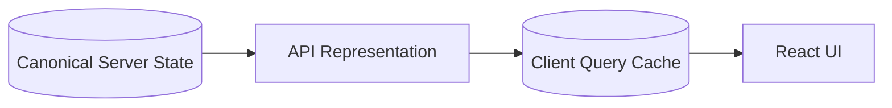

A mutation changes the canonical state.

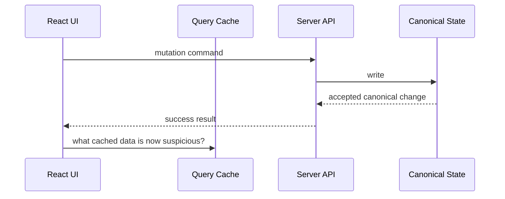

The last line is invalidation.

Invalidation does not mean:

- delete all cache
- always refetch immediately
- always replace with mutation response
- always show loading again
- always solve consistency automatically

Invalidation means:

> Mark cached representations as no longer guaranteed fresh because some known event may have changed the data they depend on.

In TanStack Query terms, `invalidateQueries` marks matching queries stale and active matching queries are refetched in the background by default.

That is a useful primitive.

It is not a full design.

---

## 2. The Core Invariant

The invalidation invariant:

> Every mutation must define the cached representations whose correctness may have been affected.

Not every affected representation must be refetched immediately.

But every affected representation must have an intentional consistency policy.

That policy can be:

- update directly from mutation response
- invalidate and refetch active queries
- invalidate without immediate refetch
- remove sensitive cache
- leave untouched because stale tolerance is acceptable
- defer reconciliation until route revisit
- reconcile through realtime event

The problem is not stale data itself.

The problem is **unowned stale data**.

---

## 3. Invalidation Is a Consistency Protocol

Treat invalidation as a protocol with participants.

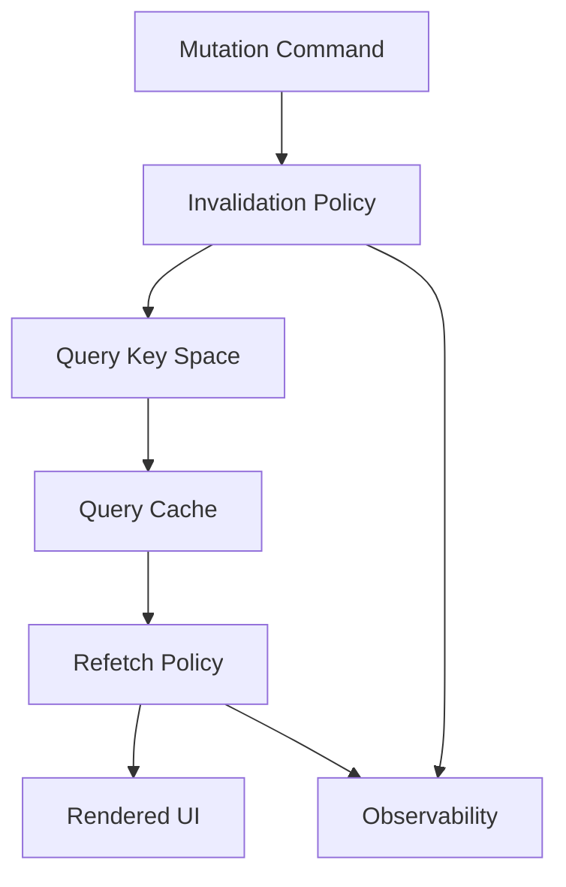

A protocol answers:

1. Which event happened?
2. Which resources may have changed?
3. Which query keys represent those resources?
4. Which cache entries should be patched, invalidated, removed, or ignored?
5. Which active views should refetch now?
6. Which inactive views can wait?
7. What does the user see during the consistency window?
8. What is logged if the policy misbehaves?

If these questions are scattered across components, invalidation becomes folklore.

If they are centralized near domain mutations, invalidation becomes architecture.

---

## 4. Query Cache Contains Representations, Not Tables

A common mistake is to think:

> Mutation changed `tasks`, so invalidate `['tasks']`.

That can be right, but it is incomplete.

The cache does not contain a database table. It contains **representations**.

Examples:

```ts
['tasks', 'list', { status: 'open', assigneeId: 'u1' }]
['tasks', 'list', { status: 'closed', assigneeId: 'u1' }]
['tasks', 'detail', 't42']
['projects', 'detail', 'p9']
['projects', 'activity', 'p9']
['dashboard', 'workload', { teamId: 'alpha' }]
['search', 'global', { q: 'late invoice' }]
```

A single mutation can affect many representations.

```ts
await updateTaskStatus({ taskId: 't42', status: 'closed' })
```

Potential impact:

- task detail changes
- open task list may remove item
- closed task list may add item
- project progress may change
- dashboard count may change
- activity feed may include event
- saved search result may change
- notification badge may change

Invalidation starts by understanding representation dependency.

---

## 5. Representation Dependency Graph

Think in terms of a dependency graph.

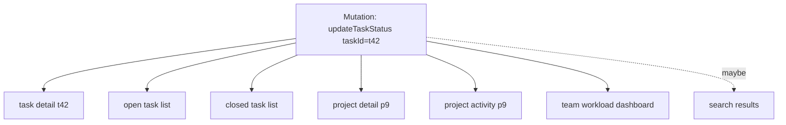

Not every edge has equal confidence.

Some edges are exact:

- update task `t42` affects detail `t42`

Some edges are parameter-dependent:

- update status affects lists filtered by status

Some edges are aggregate-dependent:

- update task affects dashboard counts

Some edges are opaque:

- search results depend on backend ranking and indexing

Different edges deserve different policies.

---

## 6. Four Consistency Actions

For a changed server resource, a client cache can usually do one of four things.

### 6.1 Patch

Apply known canonical data directly.

```ts
queryClient.setQueryData(taskKeys.detail(task.id), task)
```

Use when:

- mutation response contains authoritative representation
- target query is exact
- patch logic is simple and safe

Risk:

- patching derived lists incorrectly
- assuming server representation from client input
- losing fields not returned by mutation

### 6.2 Invalidate

Mark related queries stale and optionally refetch.

```ts
queryClient.invalidateQueries({ queryKey: taskKeys.lists() })
```

Use when:

- many cached variants may be affected
- server owns derivation
- list filtering/sorting is complex
- mutation response is insufficient

Risk:

- over-refetching
- flicker
- backend load spikes
- hidden stale data if inactive queries are not revisited

### 6.3 Remove

Delete cached data.

```ts
queryClient.removeQueries({ queryKey: taskKeys.privateScope(userId) })
```

Use when:

- user logs out
- tenant changes
- permission scope changes
- cached data is no longer safe to retain
- entity was deleted and detail should not remain visible

Risk:

- losing useful last-known-good data
- causing unnecessary cold loads

### 6.4 Ignore

Do nothing intentionally.

Use when:

- stale tolerance is high
- query naturally refetches soon
- cache is non-critical
- change is not visible in current product surface

Risk:

- becoming accidental policy
- stale user decisions
- confusing cross-screen behavior

The difference between a professional cache design and a messy one is not that the professional one always invalidates more.

It is that every choice is explicit.

---

## 7. The Mutation Impact Matrix

For each mutation, maintain an impact matrix.

Example domain: case management.

| Mutation | Direct Entity | Lists | Aggregates | Activity | Permission Scope | Recommended Policy |
|---|---|---|---|---|---|---|
| Create case | Case | case lists | dashboard counts | activity feed | no | set detail, invalidate lists + aggregates |
| Update case title | Case | search/list display | maybe none | activity feed | no | patch detail, invalidate matching lists |
| Change case status | Case | status-filtered lists | SLA counters | activity feed | no | patch detail, invalidate case lists + SLA aggregates |
| Assign officer | Case | assignee-filtered lists | workload | activity feed | maybe | patch detail, invalidate lists + workload |
| Close case | Case | open/closed lists | dashboard | activity feed | maybe | patch detail, invalidate broad case collections |
| Delete case | Case | all case lists | dashboard | activity feed | yes | remove detail, invalidate lists + aggregates |
| Change access policy | Permission | all scoped resources | maybe all | audit | yes | remove or reset user/tenant scoped caches |

This is not bureaucracy.

It is the minimum map needed to avoid random stale state.

---

## 8. Query Key Factories Enable Safe Invalidation

Poor query keys make invalidation impossible.

```ts
// Weak
['data']
['task']
['list']
```

Strong query key factory:

```ts
type TaskListFilter = {
  tenantId: string
  projectId?: string
  status?: 'open' | 'closed'
  assigneeId?: string
  q?: string
}

export const taskKeys = {
  all: (tenantId: string) => ['tenant', tenantId, 'tasks'] as const,
  lists: (tenantId: string) => [...taskKeys.all(tenantId), 'list'] as const,
  list: (tenantId: string, filter: TaskListFilter) =>
    [...taskKeys.lists(tenantId), normalizeTaskFilter(filter)] as const,
  details: (tenantId: string) => [...taskKeys.all(tenantId), 'detail'] as const,
  detail: (tenantId: string, taskId: string) =>
    [...taskKeys.details(tenantId), taskId] as const,
}
```

Now invalidation has levels.

```ts
// Exact detail
queryClient.invalidateQueries({ queryKey: taskKeys.detail(tenantId, taskId) })

// All task lists in tenant
queryClient.invalidateQueries({ queryKey: taskKeys.lists(tenantId) })

// All task cache in tenant
queryClient.invalidateQueries({ queryKey: taskKeys.all(tenantId) })
```

The hierarchy is a consistency boundary.

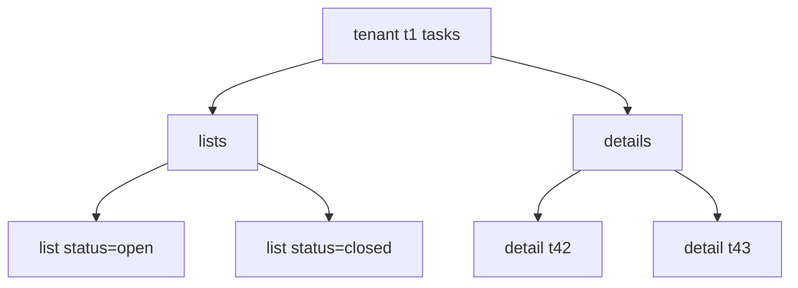

Good query keys are not for aesthetics.

They are the address space for cache consistency.

---

## 9. Exact Invalidation vs Prefix Invalidation

Exact invalidation:

```ts
queryClient.invalidateQueries({
  queryKey: taskKeys.detail(tenantId, taskId),
  exact: true,
})
```

Prefix invalidation:

```ts
queryClient.invalidateQueries({
  queryKey: taskKeys.lists(tenantId),
})
```

Predicate invalidation:

```ts
queryClient.invalidateQueries({
  predicate: (query) => {
    const key = query.queryKey
    return isTaskListKey(key) && listFilterContainsTask(key, task)
  },
})
```

Decision rule:

| Need | Use |
|---|---|
| One known entity | exact detail key |
| All lists for resource | prefix list key |
| Filter-dependent subset | predicate or structured filter matching |
| Permission/tenant reset | broad scoped key or remove |
| Unknown backend-derived dependency | invalidate broader collection |

Predicate invalidation is powerful but dangerous.

Keep it centralized and tested.

---

## 10. Patch Detail, Invalidate Lists

A reliable default for many CRUD apps:

> Patch exact detail from canonical mutation response; invalidate lists and aggregates.

Example:

```ts
function useUpdateTask() {
  const queryClient = useQueryClient()

  return useMutation({
    mutationFn: api.tasks.update,
    onSuccess: (updatedTask, variables) => {
      const { tenantId } = variables

      queryClient.setQueryData(
        taskKeys.detail(tenantId, updatedTask.id),
        updatedTask,
      )

      queryClient.invalidateQueries({
        queryKey: taskKeys.lists(tenantId),
      })

      queryClient.invalidateQueries({
        queryKey: dashboardKeys.workload(tenantId),
      })
    },
  })
}
```

Why this works:

- detail identity is exact
- mutation response is canonical
- list membership/sorting/filtering may be complex
- aggregates are server-owned derivations

This is usually better than hand-patching every list.

---

## 11. When Direct List Patching Is Worth It

Direct list patching is justified when:

- list semantics are simple
- the user expects instant local continuity
- network cost is high
- refetch would cause visible jump
- mutation response contains enough information
- filter/sort logic is deterministic and shared

Example: update task title without changing membership.

```ts
function patchTaskInList(old: TaskListPage | undefined, updated: Task) {
  if (!old) return old

  return {
    ...old,
    items: old.items.map((item) =>
      item.id === updated.id ? { ...item, title: updated.title } : item,
    ),
  }
}

queryClient.setQueriesData(
  { queryKey: taskKeys.lists(tenantId) },
  (old) => patchTaskInList(old as TaskListPage | undefined, updatedTask),
)
```

But this breaks if status, assignee, ordering, permission, or computed fields change.

For complex lists, prefer invalidation.

---

## 12. Filter-Aware List Patching

If you must patch lists where membership can change, encode the list predicate.

```ts
function belongsToTaskList(task: Task, filter: TaskListFilter) {
  if (filter.status && task.status !== filter.status) return false
  if (filter.assigneeId && task.assigneeId !== filter.assigneeId) return false
  if (filter.projectId && task.projectId !== filter.projectId) return false
  if (filter.q && !task.title.toLowerCase().includes(filter.q.toLowerCase())) return false
  return true
}
```

Patch algorithm:

```ts
function reconcileTaskList(
  old: TaskListPage | undefined,
  filter: TaskListFilter,
  task: Task,
): TaskListPage | undefined {
  if (!old) return old

  const exists = old.items.some((item) => item.id === task.id)
  const belongs = belongsToTaskList(task, filter)

  if (exists && belongs) {
    return {
      ...old,
      items: old.items.map((item) => (item.id === task.id ? task : item)),
    }
  }

  if (exists && !belongs) {
    return {
      ...old,
      items: old.items.filter((item) => item.id !== task.id),
    }
  }

  if (!exists && belongs) {
    return {
      ...old,
      items: insertTaskUsingKnownSort(old.items, task),
    }
  }

  return old
}
```

This is already non-trivial.

If the server owns ranking, sorting, search relevance, or permission filtering, do not pretend the client can reconstruct it.

Invalidate.

---

## 13. Refetch Type Matters

Invalidation and refetch are related but not identical.

Potential choices:

- mark stale and refetch active queries
- mark stale only
- refetch all matching queries including inactive
- refetch no queries now
- cancel first, then patch, then invalidate

For active user-facing screens, background refetch is often right.

For inactive routes, marking stale is often enough.

For critical global counters, immediate refetch may be needed.

For expensive reports, defer refetch until user opens the report.

Design by product consequence.

```ts
await queryClient.invalidateQueries({
  queryKey: reportKeys.all(tenantId),
  refetchType: 'none',
})
```

The policy says:

> Reports are no longer guaranteed fresh, but we will not spend network budget until someone observes them.

---

## 14. Invalidation Timing

Common timings:

| Timing | When | Risk |
|---|---|---|
| `onMutate` | before request | may invalidate for a mutation that fails |
| `onSuccess` | after accepted write | normal default |
| `onError` | after rejection | rollback or refetch damaged optimistic state |
| `onSettled` | after either success/error | cleanup/final reconciliation |
| after navigation | route-specific consistency |
| after realtime event | server-driven consistency |

Default rule:

> Invalidate server-derived caches in `onSuccess`, not before.

Optimistic UI may patch in `onMutate`, but canonical invalidation usually waits for success.

Example:

```ts
useMutation({
  mutationFn: api.tasks.close,
  onMutate: async ({ tenantId, taskId }) => {
    await queryClient.cancelQueries({ queryKey: taskKeys.detail(tenantId, taskId) })
    const previous = queryClient.getQueryData(taskKeys.detail(tenantId, taskId))
    queryClient.setQueryData(taskKeys.detail(tenantId, taskId), optimisticClose)
    return { previous }
  },
  onError: (_error, variables, context) => {
    queryClient.setQueryData(
      taskKeys.detail(variables.tenantId, variables.taskId),
      context?.previous,
    )
  },
  onSuccess: (_result, variables) => {
    queryClient.invalidateQueries({ queryKey: taskKeys.all(variables.tenantId) })
  },
})
```

---

## 15. Cancel Before Optimistic Patch

When a query is in flight, it can overwrite your optimistic patch with stale response data.

Bad sequence:

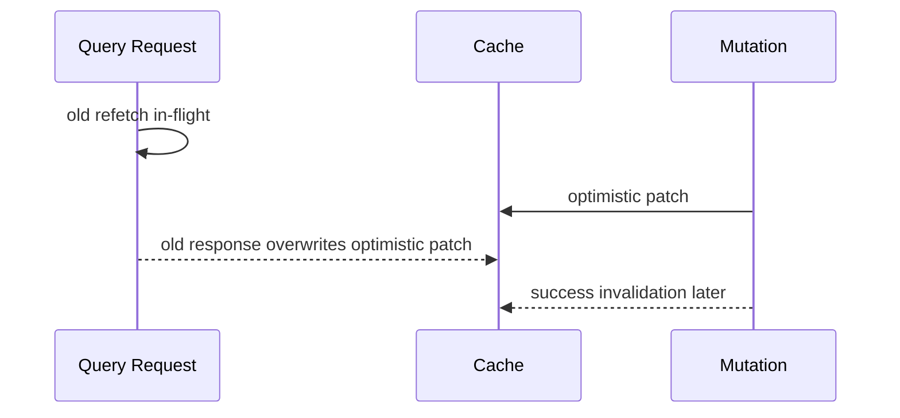

Better sequence:

```ts
await queryClient.cancelQueries({
  queryKey: taskKeys.detail(tenantId, taskId),
})

const previous = queryClient.getQueryData(taskKeys.detail(tenantId, taskId))

queryClient.setQueryData(taskKeys.detail(tenantId, taskId), optimisticTask)
```

Cancellation is not just bandwidth optimization.

It is write-order protection inside the client cache.

---

## 16. Invalidation and Optimistic UI

Optimistic update and invalidation are complementary.

Optimistic update gives immediate local continuity.

Invalidation reconciles with authority.

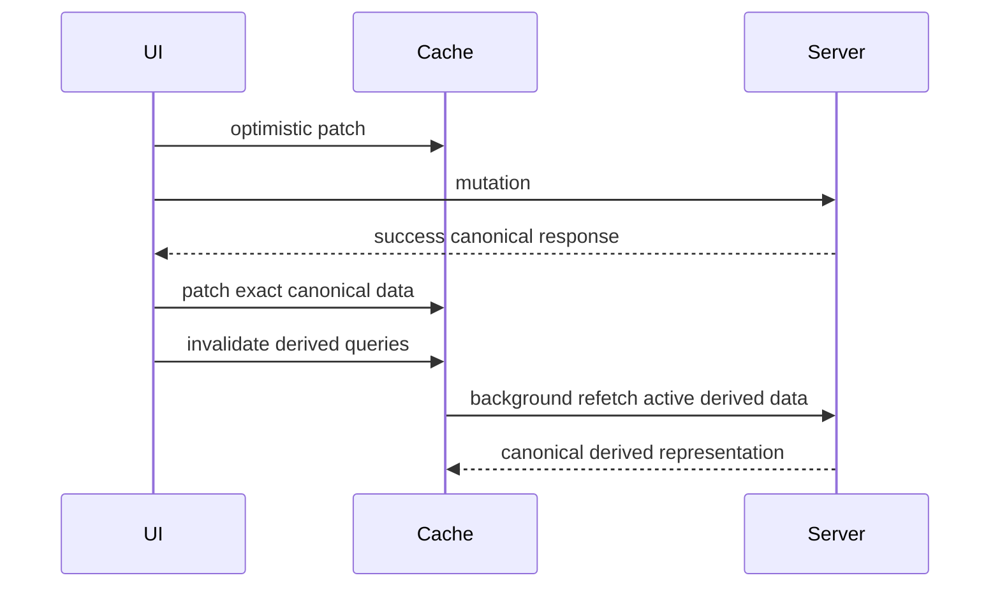

The final refetch is not waste.

It catches server-side rules the client did not replicate.

Examples:

- calculated totals
- status transitions
- server normalization
- permission filtering
- workflow timestamps
- SLA recalculation
- audit/event generation

---

## 17. Mutation Response as a Mini Event

A mutation response can include enough information to drive invalidation.

Example:

```ts
type MutationImpact = {
  changedEntities: Array<
    | { type: 'task'; id: string }
    | { type: 'project'; id: string }
    | { type: 'dashboard'; scope: 'team'; teamId: string }
  >
  invalidationHints: Array<
    | { type: 'taskLists'; tenantId: string }
    | { type: 'projectActivity'; projectId: string }
  >
}

type UpdateTaskResponse = {
  task: Task
  impact: MutationImpact
}
```

Client handler:

```ts
function applyMutationImpact(queryClient: QueryClient, impact: MutationImpact) {
  for (const hint of impact.invalidationHints) {
    switch (hint.type) {
      case 'taskLists':
        queryClient.invalidateQueries({ queryKey: taskKeys.lists(hint.tenantId) })
        break
      case 'projectActivity':
        queryClient.invalidateQueries({ queryKey: projectKeys.activity(hint.projectId) })
        break
    }
  }
}
```

This pattern is useful for large systems.

It moves part of the dependency knowledge to the backend, where domain impact may be better understood.

But do not overdo it.

The server should not know every frontend query key.

It can expose domain impact. The frontend maps domain impact to cache keys.

---

## 18. Domain Events vs Query Keys

Do not leak query keys into backend contracts.

Bad response:

```json
{
  "invalidateQueryKeys": [
    ["tenant", "t1", "tasks", "list"],
    ["tenant", "t1", "dashboard", "workload"]
  ]
}
```

Better response:

```json
{
  "events": [
    { "type": "TASK_STATUS_CHANGED", "taskId": "t42", "projectId": "p9" },
    { "type": "TEAM_WORKLOAD_CHANGED", "teamId": "alpha" }
  ]
}
```

Frontend mapping:

```ts
function invalidateFromDomainEvent(event: DomainEvent) {
  switch (event.type) {
    case 'TASK_STATUS_CHANGED':
      queryClient.invalidateQueries({ queryKey: taskKeys.detail(currentTenantId, event.taskId) })
      queryClient.invalidateQueries({ queryKey: taskKeys.lists(currentTenantId) })
      queryClient.invalidateQueries({ queryKey: projectKeys.detail(event.projectId) })
      break
    case 'TEAM_WORKLOAD_CHANGED':
      queryClient.invalidateQueries({ queryKey: dashboardKeys.workload(event.teamId) })
      break
  }
}
```

This preserves boundaries:

- backend speaks domain
- frontend owns cache structure
- contracts remain stable across UI refactors

---

## 19. Invalidation for Create

Create is deceptively hard.

Create affects:

- new detail resource
- list membership
- aggregate counters
- activity feed
- search indexes
- permission-scoped visibility

Default policy:

```ts
useMutation({
  mutationFn: api.tasks.create,
  onSuccess: (created, variables) => {
    queryClient.setQueryData(
      taskKeys.detail(variables.tenantId, created.id),
      created,
    )

    queryClient.invalidateQueries({
      queryKey: taskKeys.lists(variables.tenantId),
    })

    queryClient.invalidateQueries({
      queryKey: projectKeys.detail(created.projectId),
    })
  },
})
```

Do not blindly append to every list.

The new task might not belong to:

- current filter
- current search query
- current sort page
- current permission scope
- current cursor window

If the current list is simple and local creation is expected, patch the specific visible list and still invalidate broader lists.

---

## 20. Invalidation for Update

Update is easier if fields are classified.

| Field Type | Example | Policy |
|---|---|---|
| Display-only | title, description | patch detail + patch simple lists |
| Membership-changing | status, assignee, project | patch detail + invalidate lists |
| Aggregate-impacting | estimate, priority, status | invalidate dashboards/counters |
| Permission-impacting | visibility, owner, team | remove/invalidate scoped caches |
| Workflow-impacting | state transition | invalidate detail, lists, timeline, actions |

For workflow-heavy domains, mutation policy belongs next to the command.

```ts
const caseMutationPolicies = {
  changeStatus(queryClient, result, variables) {
    queryClient.setQueryData(caseKeys.detail(variables.tenantId, result.case.id), result.case)
    queryClient.invalidateQueries({ queryKey: caseKeys.lists(variables.tenantId) })
    queryClient.invalidateQueries({ queryKey: slaKeys.all(variables.tenantId) })
    queryClient.invalidateQueries({ queryKey: auditKeys.case(result.case.id) })
  },
}
```

---

## 21. Invalidation for Delete

Delete is not just update with missing data.

Potential policies:

- remove detail query
- remove entity from simple lists
- invalidate all lists
- invalidate aggregates
- redirect away from deleted detail route
- handle 404 on active observers
- clean optimistic temp entities

Example:

```ts
useMutation({
  mutationFn: api.tasks.delete,
  onSuccess: (_result, variables) => {
    queryClient.removeQueries({
      queryKey: taskKeys.detail(variables.tenantId, variables.taskId),
      exact: true,
    })

    queryClient.invalidateQueries({
      queryKey: taskKeys.lists(variables.tenantId),
    })

    queryClient.invalidateQueries({
      queryKey: dashboardKeys.all(variables.tenantId),
    })
  },
})
```

Do not leave deleted detail data visible unless the product intentionally supports undo.

If undo exists, model it explicitly as a reversible command or tombstone state.

---

## 22. Invalidation for Permission Changes

Permission changes are cache security events.

Example mutations:

- change case visibility
- add/remove team member
- change role
- transfer ownership
- revoke access
- switch tenant
- logout

These can invalidate the assumption that cached data is safe to show.

Policy should be stricter.

```ts
async function handlePermissionScopeChanged(tenantId: string) {
  await queryClient.cancelQueries({ queryKey: ['tenant', tenantId] })

  queryClient.removeQueries({ queryKey: ['tenant', tenantId] })

  await queryClient.invalidateQueries({
    queryKey: sessionKeys.current(),
  })
}
```

In permission-sensitive systems, stale data is not just incorrect.

It can be a data leak.

Rule:

> If authorization scope changes, prefer remove/reset over stale background refetch for sensitive data.

---

## 23. Tenant and User Scope

Tenant/user scope must appear in query keys.

Bad:

```ts
['cases', 'list', filter]
```

Good:

```ts
['tenant', tenantId, 'user', userId, 'cases', 'list', filter]
```

Whether `userId` belongs in every key depends on the API contract.

If two users in the same tenant can receive different representations for the same endpoint, include user or permission scope.

Examples:

- row-level authorization
- personalized filters
- role-dependent fields
- jurisdiction boundaries
- feature flags affecting representation

Invalidation cannot fix a cache key that merged data from different authorities.

---

## 24. Invalidation and Normalized Cache

TanStack Query is not primarily a normalized entity cache.

That is a feature, not a bug.

Server-state caches usually store query results by query key.

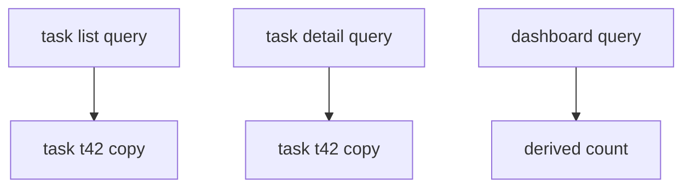

The same task may appear in multiple cached results.

Invalidation strategy must account for this.

Options:

1. Patch exact detail only, invalidate lists.
2. Use `setQueriesData` to patch all matching list queries.
3. Use normalized client cache or GraphQL client for entity-level consistency.
4. Use realtime events to reconcile impacted queries.
5. Use shorter stale times for high-change surfaces.

Do not assume one `setQueryData` updates every representation.

---

## 25. Invalidation and Aggregates

Aggregates are where under-invalidation hides.

Examples:

- unread count
- dashboard totals
- workload summary
- SLA breach count
- notification badge
- project progress
- compliance score

A mutation that changes one entity can affect many aggregates.

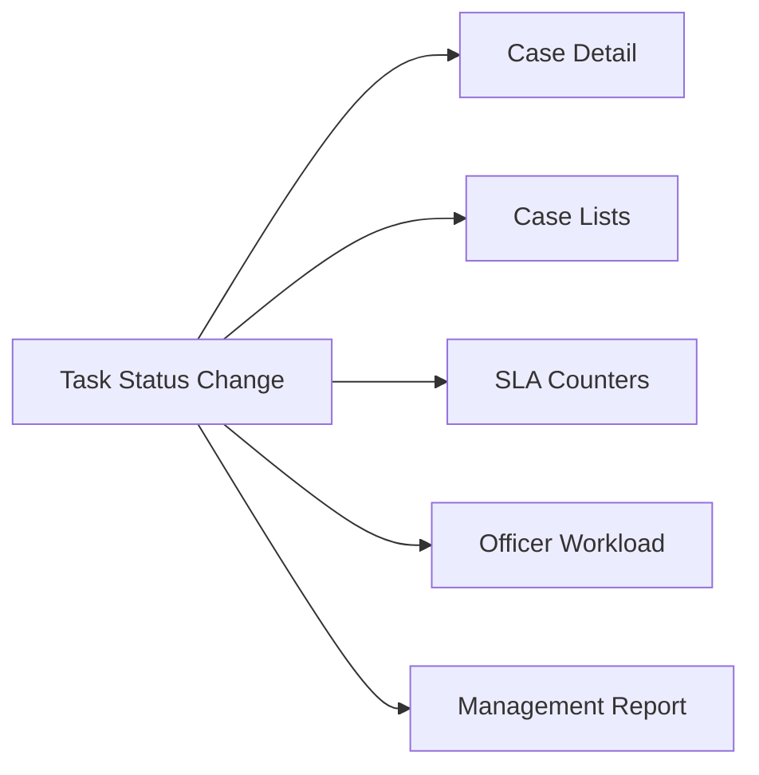

Aggregate invalidation policies should be explicit because aggregate bugs are rarely caught by component tests.

Example:

```ts
const invalidation = {
  taskStatusChanged(queryClient: QueryClient, input: { tenantId: string; projectId: string }) {
    queryClient.invalidateQueries({ queryKey: taskKeys.lists(input.tenantId) })
    queryClient.invalidateQueries({ queryKey: projectKeys.detail(input.projectId) })
    queryClient.invalidateQueries({ queryKey: dashboardKeys.all(input.tenantId) })
    queryClient.invalidateQueries({ queryKey: slaKeys.all(input.tenantId) })
  },
}
```

---

## 26. Invalidation and Infinite Queries

Infinite queries add complexity.

A resource can exist on one page, multiple pages, no loaded page, or a page boundary that changed due to sorting.

Policies:

| Mutation | Simple Patch? | Better Default |
|---|---:|---|
| edit display field | often yes | patch loaded pages |
| change sort key | risky | invalidate infinite query |
| create item | risky | prepend only for simple newest-first feed |
| delete item | maybe | remove from loaded pages + invalidate |
| change filter field | risky | invalidate |

Patch loaded pages:

```ts
queryClient.setQueryData(
  taskKeys.infiniteList(tenantId, filter),
  (old: InfiniteData<TaskPage> | undefined) => {
    if (!old) return old

    return {
      ...old,
      pages: old.pages.map((page) => ({
        ...page,
        items: page.items.map((item) =>
          item.id === updated.id ? updated : item,
        ),
      })),
    }
  },
)
```

But if the update changes ordering, the safe policy is invalidation.

Cursor pagination is server-owned.

---

## 27. Invalidation and Search

Search is usually opaque.

Client does not know ranking, stemming, permission filtering, synonym expansion, index delay, or backend scoring.

For search results:

- avoid complex local patching
- invalidate search collections if mutation affects searchable fields
- accept eventual consistency if backend index is async
- show saved/updated feedback separate from search result freshness
- refetch current search if visible and relevant

Example:

```ts
if (changedFields.some((field) => SEARCH_INDEXED_TASK_FIELDS.has(field))) {
  queryClient.invalidateQueries({ queryKey: searchKeys.all(tenantId) })
}
```

Search invalidation is often coarse.

That is acceptable if intentional.

---

## 28. Invalidation and Realtime Events

When server pushes events, invalidation can be server-driven.

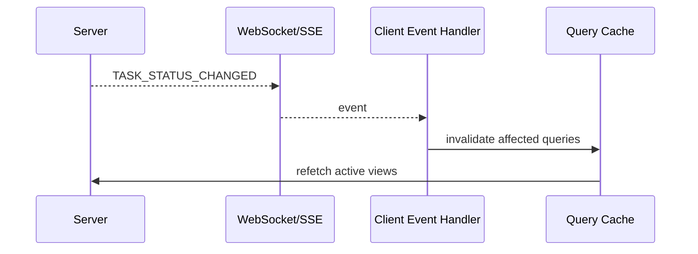

Event handler:

```ts
function onServerEvent(event: DomainEvent) {
  switch (event.type) {
    case 'TASK_UPDATED':
      queryClient.invalidateQueries({ queryKey: taskKeys.detail(event.tenantId, event.taskId) })
      queryClient.invalidateQueries({ queryKey: taskKeys.lists(event.tenantId) })
      break
    case 'PERMISSION_REVOKED':
      queryClient.removeQueries({ queryKey: ['tenant', event.tenantId] })
      break
  }
}
```

Realtime does not remove the need for cache design.

It increases the need for it.

Every incoming event must map to cache impact.

---

## 29. Invalidation Storms

A storm happens when many events trigger many refetches.

Causes:

- invalidating broad keys after every small event
- polling plus realtime both refetching
- focus refetch during bulk mutation
- multiple components invalidating same key independently
- mutation loop invalidates active queries that trigger more mutations

Symptoms:

- backend traffic spikes
- UI flickers
- DevTools waterfall gets noisy
- cache constantly stale
- mobile battery/network suffers

Mitigations:

### Batch invalidations

```ts
const pendingInvalidations = new Set<string>()

function scheduleInvalidation(key: readonly unknown[]) {
  pendingInvalidations.add(JSON.stringify(key))
  queueMicrotask(flushInvalidations)
}

function flushInvalidations() {
  for (const raw of pendingInvalidations) {
    queryClient.invalidateQueries({ queryKey: JSON.parse(raw) })
  }
  pendingInvalidations.clear()
}
```

### Debounce event-driven invalidation

```ts
const invalidateTaskLists = debounce((tenantId: string) => {
  queryClient.invalidateQueries({ queryKey: taskKeys.lists(tenantId) })
}, 250)
```

### Use stale marking without immediate refetch

```ts
queryClient.invalidateQueries({
  queryKey: reportKeys.all(tenantId),
  refetchType: 'none',
})
```

### Aggregate events server-side

Instead of pushing 500 task-updated events, push one:

```json
{ "type": "TASK_COLLECTION_CHANGED", "tenantId": "t1" }
```

---

## 30. Invalidation and Backend Load

Frontend invalidation is backend load generation.

Every invalidation policy has operational cost.

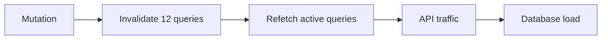

Review questions:

- How many active queries can this mutation invalidate?
- How many users can perform it at once?
- Does focus refetch overlap with mutation invalidation?
- Does realtime event also invalidate the same query?
- Are queries cheap or expensive?
- Are reports cached server-side?
- Is there request deduplication?
- Is there retry on refetch failure?

Frontend cache policies are part of system capacity design.

---

## 31. Invalidation and User Experience

Invalidation can harm UX if it causes visible reset.

Bad UX:

- table jumps to top
- selected row disappears suddenly
- form resets
- page shows full skeleton after background refresh
- optimistic result flickers back and forth
- user loses context

Better UX:

- preserve previous data during refetch
- show subtle refreshing indicator
- patch exact visible row
- keep selection by stable ID
- separate initial loading from background refreshing
- avoid full-screen skeleton for refetch

Remote-state UI should distinguish:

```ts
type QueryUxState =
  | { kind: 'initial-loading' }
  | { kind: 'success'; refreshing: boolean; stale: boolean }
  | { kind: 'initial-error'; error: unknown }
  | { kind: 'refresh-error'; data: unknown; error: unknown }
```

Invalidation should rarely make a successful screen feel like it lost all data.

---

## 32. Invalidation and Forms

Forms need special treatment because a user may be editing a draft while server state changes.

Do not overwrite dirty form fields just because a detail query refetched.

Policy:

- query data initializes form draft
- form draft is owned locally once dirty
- background refetch may update non-dirty fields or show conflict banner
- successful save reconciles form with canonical response

Example:

```ts
if (form.isDirty && query.dataUpdatedAt > form.initializedFromDataUpdatedAt) {
  showRemoteChangeBanner()
}
```

Invalidation of detail data should not erase user input.

This is an ownership issue, not a library issue.

---

## 33. Invalidation and Navigation

After mutation, navigation may be the consistency boundary.

Example create:

```ts
const mutation = useMutation({
  mutationFn: api.tasks.create,
  onSuccess: (task, variables) => {
    queryClient.setQueryData(taskKeys.detail(variables.tenantId, task.id), task)
    queryClient.invalidateQueries({ queryKey: taskKeys.lists(variables.tenantId) })
    navigate(`/tasks/${task.id}`)
  },
})
```

Example delete:

```ts
const mutation = useMutation({
  mutationFn: api.tasks.delete,
  onSuccess: (_result, variables) => {
    queryClient.removeQueries({ queryKey: taskKeys.detail(variables.tenantId, variables.taskId) })
    queryClient.invalidateQueries({ queryKey: taskKeys.lists(variables.tenantId) })
    navigate('/tasks')
  },
})
```

Navigation should not be used to hide cache inconsistency.

But it can define which view needs immediate canonical data.

---

## 34. Invalidation and Error Recovery

When invalidation refetch fails, the mutation may still have succeeded.

Example:

1. User updates task successfully.
2. Client invalidates task list.
3. Background refetch fails due to network.
4. UI still has old list.

Do not show “save failed” if the save succeeded.

Show:

- “Saved. Latest list could not be refreshed.”
- stale indicator
- retry refresh button
- local patch if safe

Mutation success and post-mutation refresh failure are different facts.

Model them separately.

---

## 35. Invalidation and Unknown Mutation Outcome

If a mutation times out, outcome may be unknown.

Do not blindly rollback and invalidate as if the server rejected.

Possible policy:

```ts
onError: (error, variables, context) => {
  if (isUnknownOutcome(error)) {
    markEntityAsUncertain(variables.taskId)
    queryClient.invalidateQueries({ queryKey: taskKeys.detail(variables.tenantId, variables.taskId) })
    queryClient.invalidateQueries({ queryKey: taskKeys.lists(variables.tenantId) })
    return
  }

  rollback(context)
}
```

Unknown outcome is especially important for non-idempotent commands.

The invalidation policy should help converge to truth, not pretend certainty.

---

## 36. Invalidation Registry

For medium-large apps, avoid scattering invalidation logic inside every component.

Create a domain invalidation registry.

```ts
export const taskInvalidation = {
  created(queryClient: QueryClient, input: { tenantId: string; task: Task }) {
    queryClient.setQueryData(taskKeys.detail(input.tenantId, input.task.id), input.task)
    queryClient.invalidateQueries({ queryKey: taskKeys.lists(input.tenantId) })
    queryClient.invalidateQueries({ queryKey: dashboardKeys.all(input.tenantId) })
  },

  updated(queryClient: QueryClient, input: { tenantId: string; task: Task; changedFields: string[] }) {
    queryClient.setQueryData(taskKeys.detail(input.tenantId, input.task.id), input.task)

    if (input.changedFields.some(isTaskListMembershipField)) {
      queryClient.invalidateQueries({ queryKey: taskKeys.lists(input.tenantId) })
    }

    if (input.changedFields.some(isAggregateField)) {
      queryClient.invalidateQueries({ queryKey: dashboardKeys.all(input.tenantId) })
    }
  },

  deleted(queryClient: QueryClient, input: { tenantId: string; taskId: string }) {
    queryClient.removeQueries({ queryKey: taskKeys.detail(input.tenantId, input.taskId), exact: true })
    queryClient.invalidateQueries({ queryKey: taskKeys.lists(input.tenantId) })
    queryClient.invalidateQueries({ queryKey: dashboardKeys.all(input.tenantId) })
  },
}
```

Mutation hook:

```ts
export function useUpdateTask() {
  const queryClient = useQueryClient()

  return useMutation({
    mutationFn: api.tasks.update,
    onSuccess: (result, variables) => {
      taskInvalidation.updated(queryClient, {
        tenantId: variables.tenantId,
        task: result.task,
        changedFields: result.changedFields,
      })
    },
  })
}
```

This makes invalidation reviewable.

---

## 37. Testing Invalidation

Test invalidation as behavior.

### Test exact detail patch

```ts
it('updates task detail cache after successful mutation', async () => {
  queryClient.setQueryData(taskKeys.detail('t1', 'task1'), oldTask)

  taskInvalidation.updated(queryClient, {
    tenantId: 't1',
    task: { ...oldTask, title: 'New title' },
    changedFields: ['title'],
  })

  expect(queryClient.getQueryData(taskKeys.detail('t1', 'task1'))).toMatchObject({
    title: 'New title',
  })
})
```

### Test list invalidation

```ts
it('invalidates task lists when status changes', () => {
  const spy = vi.spyOn(queryClient, 'invalidateQueries')

  taskInvalidation.updated(queryClient, {
    tenantId: 't1',
    task: closedTask,
    changedFields: ['status'],
  })

  expect(spy).toHaveBeenCalledWith({ queryKey: taskKeys.lists('t1') })
})
```

### Test tenant isolation

```ts
it('does not invalidate another tenant', () => {
  taskInvalidation.deleted(queryClient, {
    tenantId: 'tenant-a',
    taskId: 'task1',
  })

  expect(queryClient.getQueryData(taskKeys.list('tenant-b', {}))).toBeDefined()
})
```

### Test permission reset removes data

```ts
it('removes tenant-scoped queries after permission scope changes', () => {
  handlePermissionScopeChanged('tenant-a')

  expect(queryClient.getQueriesData({ queryKey: ['tenant', 'tenant-a'] })).toHaveLength(0)
})
```

Tests protect architecture from accidental stale behavior.

---

## 38. Observability for Invalidation

Log invalidation decisions in development and production diagnostics.

```ts
type InvalidationEvent = {
  mutation: string
  tenantId?: string
  changedFields?: string[]
  patchedKeys: string[]
  invalidatedKeys: string[]
  removedKeys: string[]
  refetchType?: string
  reason: string
}
```

Example:

```ts
emitInvalidationEvent({
  mutation: 'task.update',
  tenantId,
  changedFields,
  patchedKeys: [serializeKey(taskKeys.detail(tenantId, task.id))],
  invalidatedKeys: [serializeKey(taskKeys.lists(tenantId))],
  removedKeys: [],
  reason: 'status affects list membership',
})
```

Useful production questions:

- Which mutation caused this refetch storm?
- Why did dashboard remain stale?
- Did we invalidate another tenant?
- Did permission revocation remove cached data?
- How often do refetches fail after successful mutations?
- Which queries are invalidated most frequently?

Without observability, invalidation bugs become user anecdotes.

---

## 39. Review Checklist

For every mutation, ask:

- What canonical entity changed?
- What derived representations may be stale?
- What query keys represent those views?
- Which exact cache entries can be safely patched?
- Which lists must be invalidated instead of patched?
- Which aggregates are affected?
- Does the mutation affect search results?
- Does it affect permission scope?
- Does it affect another tenant/user scope?
- What happens to active queries?
- What happens to inactive queries?
- Could this create a refetch storm?
- Does optimistic update cancel in-flight queries first?
- Does rollback preserve newer changes?
- Does mutation success differ from refresh success?
- Are invalidation decisions tested?
- Are invalidation decisions observable?

---

## 40. Common Failure Modes

### Failure: stale list after detail mutation

Cause: detail patched, lists not invalidated.

Fix: classify field changes and invalidate list keys for membership/display changes.

### Failure: refetch storm after bulk update

Cause: each item mutation invalidates broad list keys independently.

Fix: batch mutation, debounce invalidation, or invalidate once after bulk completes.

### Failure: user sees another tenant's data

Cause: tenant scope missing from query key.

Fix: include authority scope in key and remove scoped cache on tenant switch.

### Failure: rollback overwrites refetched canonical data

Cause: stale optimistic context restored after later refetch.

Fix: compare version/update time or cancel/refetch ordering carefully.

### Failure: search results remain wrong

Cause: mutation changed indexed field but search cache was not invalidated.

Fix: map searchable fields to search invalidation.

### Failure: invalidation hides save failure

Cause: mutation error and refetch error are collapsed into one UI state.

Fix: model mutation result and refresh result separately.

### Failure: permission revocation leaves sensitive detail visible

Cause: invalidated instead of removed.

Fix: remove cache for authorization scope changes.

---

## 41. Final Mental Model

Cache invalidation is consistency design in miniature.

A React app with remote data is not just rendering JSON. It is maintaining local replicas of server-owned facts.

When a command changes server facts, the client must decide which replicas remain trustworthy.

The mature approach is:

1. Query keys encode resource identity and authority scope.
2. Mutations define domain impact.
3. Exact canonical data may be patched.
4. Derived representations are invalidated.
5. Sensitive scope changes remove cache.
6. Refetch policy is based on product and operational cost.
7. Invalidation decisions are centralized, tested, and observable.

The invariant:

> A mutation is not complete on the client until its cache consistency policy has run.

The next part studies the other side of this system: query cache failure modes. We will look at how caches go wrong even when individual queries and mutations seem correct.
