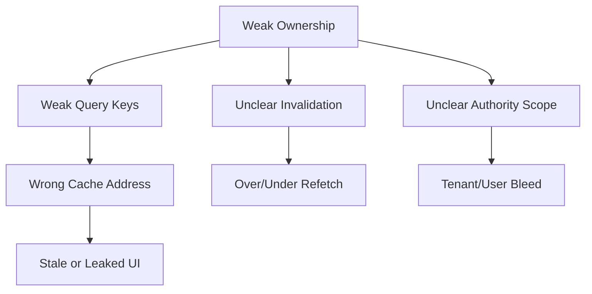
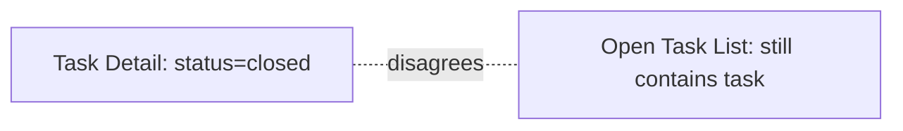
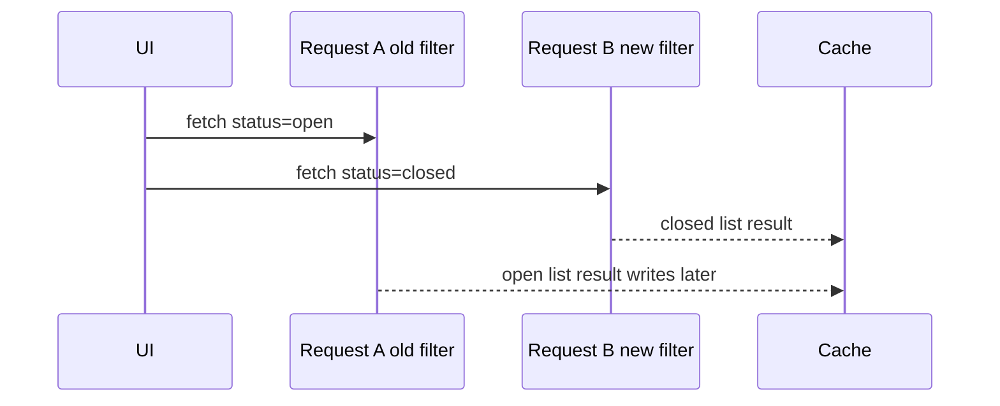
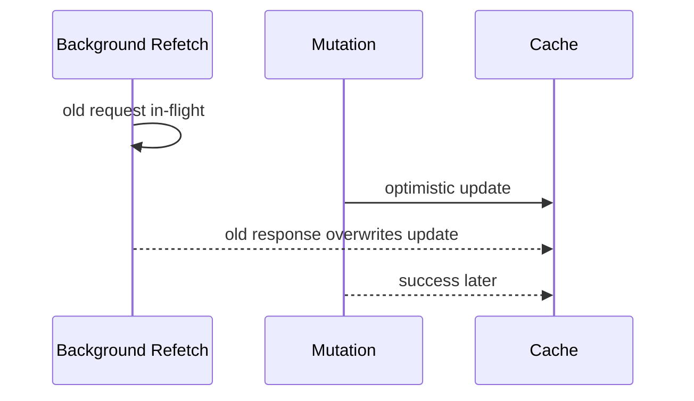
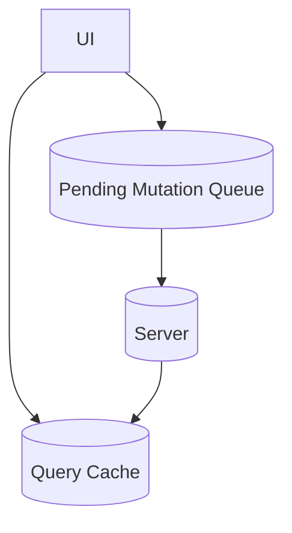

# Part 032 — Query Cache Failure Modes

> Target mental model: **a query cache is a distributed-systems component embedded in the browser.** It can be stale, poisoned, over-broad, under-scoped, memory-heavy, race-prone, and operationally noisy.

A query cache makes React apps fast and resilient.

It also creates failure modes that do not exist in a naive `fetch → setState` component.

The failures are subtle because the UI often looks correct during happy path testing.

This part builds a failure model so you can review, debug, and harden production server-state caches.

---

## 1. Cache Failure Is Usually an Ownership Failure

A query cache stores client-side replicas of server data.

The cache must know:

- what the data represents
- who the authority is
- how fresh it is
- who can see it
- what mutation can affect it
- when it should be removed
- how to recover after error

When these are implicit, bugs appear.



Most query cache failures are not caused by TanStack Query, SWR, Apollo, Relay, or custom cache internals.

They are caused by incorrect application-level modeling.

---

## 2. Failure Taxonomy

Query cache failures cluster into categories.

| Category | Symptom | Root Cause |
|---|---|---|
| Identity failure | wrong data reused | weak query key |
| Freshness failure | stale data trusted too long | wrong `staleTime` / invalidation |
| Scope failure | user/tenant data leak | missing authority dimension |
| Consistency failure | detail/list disagree | missing impact mapping |
| Race failure | older response wins | in-flight response ordering |
| Mutation failure | optimistic state stuck | rollback/reconcile bug |
| Memory failure | cache grows unbounded | high-cardinality keys / long `gcTime` |
| Refetch storm | backend spike / flicker | broad invalidation / focus/poll overlap |
| Error masking | user sees success but data is wrong | mutation and refetch errors collapsed |
| Hydration failure | SSR/client mismatch | mismatched keys or stale dehydrated data |
| Persistence failure | old session data restored | unsafe persisted cache |
| Observability failure | impossible to diagnose | no event trail |

The rest of this part walks through these failure modes as reviewable patterns.

---

## 3. Identity Failure: Query Key Collision

A collision happens when two different representations share the same key.

Bad:

```ts
useQuery({
  queryKey: ['tasks'],
  queryFn: () => api.tasks.list({ status, assigneeId }),
})
```

Two screens:

```ts
// Screen A
status = 'open'
assigneeId = 'u1'

// Screen B
status = 'closed'
assigneeId = 'u2'
```

Both use:

```ts
['tasks']
```

Result:

- wrong list reused
- invalidation too broad or too narrow
- flickering between screens
- bug appears only after navigation order changes

Fix:

```ts
useQuery({
  queryKey: taskKeys.list(tenantId, { status, assigneeId }),
  queryFn: () => api.tasks.list({ tenantId, status, assigneeId }),
})
```

Invariant:

> If the query function input changes the server response, it must be represented in the query key, unless intentionally excluded by design.

---

## 4. Identity Failure: Query Key Fragmentation

Fragmentation is the opposite problem.

The same representation gets multiple different keys.

Example:

```ts
['tasks', { status: 'open', assigneeId: undefined }]
['tasks', { assigneeId: undefined, status: 'open' }]
['tasks', { status: 'open' }]
['tasks', { status: 'open', page: 1 }]
['tasks', { status: 'open', page: '1' }]
```

Symptoms:

- duplicate network requests
- invalidation misses some entries
- memory grows
- DevTools shows many near-identical queries
- refetch updates one screen but not another

Fix with normalization:

```ts
function normalizeTaskFilter(filter: TaskListFilter): NormalizedTaskListFilter {
  return {
    status: filter.status ?? 'all',
    assigneeId: filter.assigneeId ?? null,
    q: filter.q?.trim() || null,
    page: Number(filter.page ?? 1),
  }
}
```

Key factory:

```ts
const taskKeys = {
  list: (tenantId: string, filter: TaskListFilter) =>
    ['tenant', tenantId, 'tasks', 'list', normalizeTaskFilter(filter)] as const,
}
```

Do not let each component invent its own key shape.

---

## 5. Scope Failure: Tenant/User Bleed

Tenant bleed happens when cached data from one authority scope is reused in another.

Bad:

```ts
['cases', 'detail', caseId]
```

If `caseId` is only unique inside tenant, this can leak data.

Better:

```ts
['tenant', tenantId, 'cases', 'detail', caseId]
```

But tenant may not be enough.

If representation depends on user permissions:

```ts
['tenant', tenantId, 'principal', principalScopeHash, 'cases', 'detail', caseId]
```

`principalScopeHash` can represent:

- user ID
- role version
- permission revision
- jurisdiction set
- feature flag variant

Decision rule:

> Include every authority dimension that can change response visibility or shape.

This matters more in regulatory, case management, finance, healthcare, enterprise SaaS, and admin systems.

---

## 6. Scope Failure: Logout Leaves Data Behind

If logout only clears auth token, cache may still render private data.

Bad:

```ts
await logout()
navigate('/login')
```

Better:

```ts
await logout()
queryClient.clear()
navigate('/login')
```

For multi-tenant apps, tenant switch may require scoped removal:

```ts
function switchTenant(fromTenantId: string, toTenantId: string) {
  queryClient.removeQueries({ queryKey: ['tenant', fromTenantId] })
  setCurrentTenant(toTenantId)
}
```

Rule:

> Authentication and authorization boundary transitions are cache lifecycle events.

---

## 7. Freshness Failure: Wrong `staleTime`

`staleTime` expresses how long the client may treat cached data as fresh.

Wrong `staleTime` causes two opposite failures.

### Too short

Symptoms:

- excessive background refetch
- flicker
- backend load
- mobile network waste
- focus/refocus feels noisy

### Too long

Symptoms:

- user acts on stale data
- detail/list disagreement lasts too long
- permission-sensitive data remains trusted
- dashboard is misleading

Policy examples:

```ts
const queryPolicies = {
  referenceData: {
    staleTime: 60 * 60 * 1000,
  },
  dashboard: {
    staleTime: 30 * 1000,
  },
  permissions: {
    staleTime: 0,
  },
  caseDetail: {
    staleTime: 15 * 1000,
  },
}
```

Do not choose `staleTime` by vibe.

Choose it by change frequency, consequence of staleness, and refetch cost.

---

## 8. Freshness Failure: Invalidating Too Little

Under-invalidation means stale data remains trusted after known writes.

Example:

```ts
onSuccess: (updatedCase) => {
  queryClient.setQueryData(caseKeys.detail(tenantId, updatedCase.id), updatedCase)
}
```

Missing:

- lists
- dashboard counters
- SLA summaries
- activity feed
- search

Symptoms:

- detail page shows updated status
- list still shows old status
- dashboard count wrong
- user refresh fixes it

Fix:

```ts
caseInvalidation.statusChanged(queryClient, {
  tenantId,
  caseId: updatedCase.id,
  projectId: updatedCase.projectId,
  changedFields: ['status'],
})
```

Under-invalidation is an impact modeling bug.

---

## 9. Freshness Failure: Invalidating Too Much

Over-invalidation means every mutation makes too much cached data stale.

Bad:

```ts
queryClient.invalidateQueries()
```

Symptoms:

- global network storm
- UI flicker across unrelated screens
- accidental reload feeling
- expensive reports refetch after tiny edits
- backend cost increases with frontend usage

Better:

```ts
queryClient.invalidateQueries({ queryKey: taskKeys.lists(tenantId) })
queryClient.invalidateQueries({ queryKey: dashboardKeys.workload(tenantId) })
```

Best:

```ts
taskInvalidation.updated(queryClient, {
  tenantId,
  task: result.task,
  changedFields: result.changedFields,
})
```

Over-invalidation is often a symptom of weak query key hierarchy.

---

## 10. Consistency Failure: Detail and List Diverge

This is one of the most common bugs.



Causes:

- detail patched but list not invalidated
- list patched but wrong filter logic
- stale list has long `staleTime`
- query keys fragmented
- background refetch failed silently

Mitigation pattern:

```ts
onSuccess: (task, variables) => {
  queryClient.setQueryData(taskKeys.detail(variables.tenantId, task.id), task)
  queryClient.invalidateQueries({ queryKey: taskKeys.lists(variables.tenantId) })
}
```

If the detail and list must be strongly consistent in the visible screen, use a shared source or compose both from the same query response.

---

## 11. Race Failure: Older Response Wins

Sequence:



This specific failure should be prevented by correct query keys.

If both requests use different keys, they do not overwrite each other.

If they share weak key `['tasks']`, older response can poison current view.

Key design is race protection.

---

## 12. Race Failure: Refetch Overwrites Optimistic Patch

Sequence:



Mitigation:

```ts
onMutate: async (variables) => {
  await queryClient.cancelQueries({ queryKey: taskKeys.detail(variables.tenantId, variables.taskId) })

  const previous = queryClient.getQueryData(taskKeys.detail(variables.tenantId, variables.taskId))

  queryClient.setQueryData(taskKeys.detail(variables.tenantId, variables.taskId), (old) =>
    old ? { ...old, status: 'closed' } : old,
  )

  return { previous }
}
```

Consuming the query function's `signal` matters.

If the fetch ignores cancellation, the old response may still resolve.

---

## 13. Race Failure: Concurrent Mutations

Example:

- User edits title.
- Autosave sends mutation A.
- User edits title again.
- Autosave sends mutation B.
- Server accepts B first.
- Server accepts A later.

If the client blindly patches on every success, older result can overwrite newer intent.

Mitigations:

- per-entity mutation serialization
- client revision number
- server version / ETag
- last-write-wins only if domain allows it
- conflict response
- compare submitted draft version before patching

Example:

```ts
let localRevision = 0

function saveTitle(title: string) {
  const revision = ++localRevision

  mutation.mutate(
    { title, revision },
    {
      onSuccess: (result, variables) => {
        if (variables.revision !== localRevision) return
        queryClient.setQueryData(taskKeys.detail(tenantId, result.id), result)
      },
    },
  )
}
```

This is not enough for multi-user concurrency, but it protects local ordering.

---

## 14. Mutation Failure: Optimistic State Stuck

Symptoms:

- item remains checked after server rejected
- temp item remains forever
- delete hides item even though delete failed
- UI says saved but data reverted later

Causes:

- no rollback context
- rollback failed because snapshot missing
- error classification wrong
- unknown outcome treated as success
- invalidation refetch failed

Rollback context should be explicit.

```ts
type CloseTaskRollback = {
  previousTask?: Task
  previousLists: Array<[readonly unknown[], TaskListPage | undefined]>
}
```

But snapshot restore is not always safe under concurrent mutation.

For high-concurrency surfaces, prefer invalidation/refetch or operation-specific inverse patches.

---

## 15. Mutation Failure: Unknown Outcome Treated as Rejection

A timeout does not prove the server rejected the write.

Bad:

```ts
onError: () => rollback()
```

Better:

```ts
onError: (error, variables, context) => {
  if (isUnknownOutcome(error)) {
    markAsUncertain(variables.clientMutationId)
    queryClient.invalidateQueries({ queryKey: taskKeys.detail(variables.tenantId, variables.taskId) })
    return
  }

  rollback(context)
}
```

This matters for:

- payment
- submission
- case closure
- enforcement action
- irreversible workflow transition
- one-time side effects

A cache should help converge to truth, not invent certainty.

---

## 16. Error Failure: HTTP Error Cached as Data

Bad API client:

```ts
async function getTask(id: string) {
  const response = await fetch(`/api/tasks/${id}`)
  return response.json()
}
```

If server returns `404` with JSON body, this function returns it as successful data.

Query cache now stores an error payload as if it were `Task`.

Better:

```ts
async function getTask(id: string) {
  const response = await fetch(`/api/tasks/${id}`)
  const body = await parseJsonSafely(response)

  if (!response.ok) {
    throw createHttpError(response, body)
  }

  return taskSchema.parse(body)
}
```

Cache quality depends on API client correctness.

A query cache cannot compensate for a client that lies about errors.

---

## 17. Error Failure: Contract Drift Poisoning

Server changes response shape.

Client cache stores unexpected data.

UI fails later in unrelated component.

Symptoms:

- `Cannot read property x of undefined`
- corrupted table rows
- impossible UI states
- error appears far from network boundary

Mitigation:

```ts
const taskSchema = z.object({
  id: z.string(),
  title: z.string(),
  status: z.enum(['open', 'closed']),
  updatedAt: z.string(),
})

async function fetchTask(id: string) {
  const raw = await http.get(`/tasks/${id}`)
  return taskSchema.parse(raw)
}
```

If runtime validation fails, throw a contract error before data enters cache.

Invariant:

> Invalid server data should not be cached as valid domain data.

---

## 18. Memory Failure: High-Cardinality Query Keys

High-cardinality inputs create many cache entries.

Examples:

- search-as-you-type query for every keystroke
- cursor for every feed position
- timestamp in query key
- raw unsorted filter object
- random request ID in key
- full text editor content in key

Bad:

```ts
['search', searchInput]
```

For every character typed.

Better:

```ts
const debounced = useDebouncedValue(searchInput.trim(), 300)

useQuery({
  queryKey: searchKeys.global(tenantId, { q: debounced }),
  queryFn: () => api.search({ q: debounced }),
  enabled: debounced.length >= 2,
  gcTime: 60_000,
})
```

Rules:

- debounce high-cardinality queries
- normalize filter values
- avoid volatile values in keys
- keep `gcTime` short for search/autocomplete
- disable queries until input is meaningful

---

## 19. Memory Failure: Cache Retains Sensitive Data Too Long

Long cache residency can be a privacy issue.

Examples:

- investigation records
- financial documents
- patient data
- enforcement notes
- internal comments
- role-restricted fields

Mitigations:

```ts
useQuery({
  queryKey: caseKeys.detail(tenantId, caseId),
  queryFn: () => api.cases.get(caseId),
  staleTime: 0,
  gcTime: 60_000,
})
```

On scope change:

```ts
queryClient.removeQueries({ queryKey: ['tenant', tenantId] })
```

On logout:

```ts
queryClient.clear()
```

Performance cache and privacy cache are different design spaces.

---

## 20. Refetch Storm Failure

Refetch storm scenario:

1. User opens dashboard with 20 active queries.
2. Window focus triggers refetch.
3. Realtime event invalidates broad tenant key.
4. Mutation success invalidates dashboard again.
5. Failed requests retry.

Result:

- dozens of overlapping requests
- UI flicker
- backend load spike
- poor mobile experience

Mitigation options:

```ts
const queryClient = new QueryClient({
  defaultOptions: {
    queries: {
      refetchOnWindowFocus: false,
      retry: (failureCount, error) => shouldRetry(error) && failureCount < 2,
    },
  },
})
```

But do not globally disable useful freshness behavior without domain policy.

Better:

- tune per query family
- batch invalidations
- dedupe server events
- avoid broad invalidation
- use `staleTime` for stable data
- monitor refetch volume

---

## 21. Retry Failure: Amplifying an Incident

Default retries are helpful for transient failure.

They are harmful when:

- server returns validation error
- server returns authorization error
- rate limit is active
- endpoint is overloaded
- mutation is non-idempotent
- request body cannot be safely replayed

Retry policy should classify errors.

```ts
function shouldRetry(error: unknown) {
  if (isAbortError(error)) return false
  if (isValidationError(error)) return false
  if (isAuthError(error)) return false
  if (isRateLimitError(error)) return false
  if (isHttpError(error) && error.status >= 500) return true
  if (isNetworkError(error)) return true
  return false
}
```

Query cache reliability includes not making outages worse.

---

## 22. Retry Failure: Mutation Replay Without Idempotency

A failed mutation retry can duplicate side effects.

Examples:

- create payment
- submit report
- send notification
- create enforcement action
- upload final document

For non-idempotent commands, use idempotency keys.

```ts
const idempotencyKey = crypto.randomUUID()

await api.cases.submit({
  caseId,
  idempotencyKey,
})
```

Cache policy:

- do not auto-retry unsafe mutation without idempotency
- mark unknown outcome separately
- reconcile by idempotency key or operation ID

This is client-server communication, not just frontend convenience.

---

## 23. Hydration Failure: Server and Client Keys Differ

In SSR/RSC/framework data flows, data may be prefetched server-side and hydrated client-side.

If query keys differ, the client misses hydrated cache and refetches.

Bad:

```ts
// Server
['task', 42]

// Client
['task', '42']
```

Symptoms:

- duplicate fetch on page load
- hydration flicker
- server-rendered content replaced
- inconsistent `staleTime`

Fix:

- shared query key factory
- shared filter normalization
- shared route param parsing
- consistent tenant/user scope
- consistent `dehydrate/hydrate` boundaries

Query key factories are more important in SSR apps, not less.

---

## 24. Hydration Failure: Dehydrated Data Too Old

Server-rendered data may already be stale by the time the browser hydrates.

Questions:

- When was data fetched?
- What `staleTime` applies on client?
- Should client refetch immediately after hydration?
- Is stale content acceptable for first paint?
- Does permission scope remain valid?

Policy example:

```ts
useQuery({
  queryKey: taskKeys.detail(tenantId, taskId),
  queryFn: () => api.tasks.get({ tenantId, taskId }),
  staleTime: 10_000,
})
```

For high-risk data, immediate revalidation may be correct.

For mostly stable content, avoid refetching instantly and destroying SSR benefit.

---

## 25. Persistence Failure: Restoring Unsafe Cache

Persisted query cache is useful for offline or fast startup.

It is dangerous if authority scope changes.

Failure:

- User A logs out.
- User B logs in on same browser.
- Persisted cache restores User A's data.

Mitigation:

- persist per user/tenant scope
- include auth session version
- clear persisted cache on logout
- blacklist sensitive query families
- set max age
- validate persisted schema version

Example metadata:

```ts
type PersistedCacheEnvelope = {
  appVersion: string
  schemaVersion: number
  userId: string
  tenantId: string
  savedAt: number
  cache: unknown
}
```

Before restore:

```ts
if (envelope.userId !== currentUserId || envelope.tenantId !== currentTenantId) {
  discardPersistedCache()
}
```

---

## 26. Offline Failure: Queue and Cache Diverge

Offline-first apps add another replica: pending mutation queue.



Failure modes:

- optimistic cache says mutation happened
- queue fails later
- user edits same entity again
- server rejects due to stale version
- app restarts and loses rollback context

Mitigations:

- persist mutation queue with operation IDs
- store base version for each offline operation
- show pending/unsynced state
- reconcile after reconnect
- avoid irreversible optimism offline
- invalidate affected queries after replay

Offline cache is a distributed system.

Treat it like one.

---

## 27. Structural Sharing Failure

Structural sharing preserves object references when data is equal, reducing re-renders.

But application code can accidentally break expectations.

Bad:

```ts
queryClient.setQueryData(taskKeys.detail(tenantId, taskId), (old: Task | undefined) => {
  if (!old) return old
  old.title = 'New title'
  return old
})
```

This mutates cached data in place.

Symptoms:

- components do not re-render correctly
- DevTools confusing
- rollback snapshots corrupted
- previous data references change unexpectedly

Fix:

```ts
queryClient.setQueryData(taskKeys.detail(tenantId, taskId), (old: Task | undefined) => {
  if (!old) return old
  return { ...old, title: 'New title' }
})
```

Never mutate query cache data in place.

---

## 28. Derived State Failure

Copying query data into local state creates divergence.

Bad:

```ts
const { data } = useQuery(taskQueryOptions(taskId))
const [task, setTask] = useState(data)
```

Problems:

- `data` arrives after initial render
- background refetch does not update local copy
- mutation patches query cache but local state remains stale
- form draft and server state get confused

Better:

- derive display directly from query data
- use form state only for editable draft
- explicitly initialize form from query once
- track dirty fields

```ts
const { data: task } = useQuery(taskQueryOptions(taskId))

const displayTitle = task?.title ?? ''
```

For forms:

```ts
const form = useForm({ values: task })
```

But guard dirty behavior carefully.

---

## 29. Placeholder Failure

`placeholderData` can make UI look populated before real data arrives.

Failure:

- placeholder is treated as canonical
- user acts on placeholder-only fields
- wrong detail appears briefly
- stale previous entity shown as new entity

Policy:

- visually distinguish placeholder/previous data if necessary
- avoid using placeholder for permission-sensitive detail
- disable destructive actions until canonical data arrives
- use stable IDs to avoid wrong-entity actions

Example:

```ts
const query = useQuery({
  queryKey: taskKeys.detail(tenantId, taskId),
  queryFn: () => api.tasks.get({ tenantId, taskId }),
  placeholderData: (previous) => previous?.id === taskId ? previous : undefined,
})
```

Never let previous entity data masquerade as a different entity.

---

## 30. Select Failure

`select` transforms data for a component.

Failure modes:

- expensive select runs often
- select hides fields needed for invalidation
- select throws because contract drifted
- select creates unstable references
- multiple components duplicate transformation inconsistently

Bad:

```ts
useQuery({
  queryKey: taskKeys.list(tenantId, filter),
  queryFn: fetchTasks,
  select: (data) => data.items.map((task) => ({ label: task.title, value: task.id })),
})
```

This may be fine for small lists, but for large or shared transformations, use memoized domain selectors or server-provided view models.

Rule:

> `select` should not become a hidden business logic layer.

---

## 31. Disabled Query Failure

`enabled: false` is sometimes used to avoid premature fetch.

Failure:

- query never fetches
- invalidation does not trigger expected fetch because query remains disabled
- UI waits forever
- parameter readiness is modeled incorrectly

Better:

```ts
const ready = Boolean(tenantId && taskId)

useQuery({
  queryKey: ready ? taskKeys.detail(tenantId, taskId) : taskKeys.disabledDetail(),
  queryFn: () => api.tasks.get({ tenantId: tenantId!, taskId: taskId! }),
  enabled: ready,
})
```

Also consider splitting component boundaries so the query only exists after required inputs exist.

A disabled query is not just paused network. It changes lifecycle behavior.

---

## 32. Query Function Closure Failure

Query function uses variables not encoded in key.

Bad:

```ts
function useTasks(status: TaskStatus) {
  return useQuery({
    queryKey: ['tasks'],
    queryFn: () => api.tasks.list({ status }),
  })
}
```

The query function closes over `status`, but key does not include it.

Fix:

```ts
function useTasks(status: TaskStatus) {
  return useQuery({
    queryKey: taskKeys.list(tenantId, { status }),
    queryFn: ({ signal }) => api.tasks.list({ tenantId, status, signal }),
  })
}
```

Review rule:

> Every variable captured by `queryFn` that affects response must be represented in the query key.

---

## 33. Cancellation Failure

TanStack Query can pass `AbortSignal` to query functions.

But cancellation only works if your API client consumes it.

Bad:

```ts
async function fetchTask(taskId: string) {
  return http.get(`/tasks/${taskId}`)
}
```

Better:

```ts
async function fetchTask(taskId: string, signal?: AbortSignal) {
  return http.get(`/tasks/${taskId}`, { signal })
}

useQuery({
  queryKey: taskKeys.detail(tenantId, taskId),
  queryFn: ({ signal }) => fetchTask(taskId, signal),
})
```

Without cancellation:

- unused requests consume bandwidth
- old responses may still attempt cache writes
- component transitions waste work
- optimistic patch ordering is harder

Cancellation is part of cache correctness.

---

## 34. Global Defaults Failure

Global defaults are attractive.

```ts
new QueryClient({
  defaultOptions: {
    queries: {
      staleTime: 5 * 60 * 1000,
      retry: 3,
      refetchOnWindowFocus: false,
    },
  },
})
```

But one global policy rarely fits all query families.

Reference data, dashboards, permission checks, feeds, detail pages, reports, and search have different behavior.

Better:

```ts
const policies = {
  reference: { staleTime: 60 * 60 * 1000, gcTime: 24 * 60 * 60 * 1000 },
  dashboard: { staleTime: 30_000, gcTime: 5 * 60_000 },
  search: { staleTime: 0, gcTime: 60_000, retry: false },
  permissions: { staleTime: 0, gcTime: 0, retry: false },
}
```

Use query option factories:

```ts
function taskDetailQueryOptions(tenantId: string, taskId: string) {
  return queryOptions({
    queryKey: taskKeys.detail(tenantId, taskId),
    queryFn: ({ signal }) => api.tasks.get({ tenantId, taskId, signal }),
    staleTime: policies.dashboard.staleTime,
  })
}
```

Defaults should be safe baseline, not hidden architecture.

---

## 35. DevTools-Only Confidence Failure

React Query DevTools can show query state, but they do not prove domain correctness.

A query can be:

- successful but wrong scope
- fresh but semantically stale
- invalidated but not refetched
- cached under fragmented keys
- patched with non-canonical data
- structurally shared incorrectly

Use DevTools as inspection, not proof.

Production confidence needs:

- query key review
- mutation impact matrix
- contract validation
- invalidation tests
- cache lifecycle tests
- telemetry
- user-visible stale indicators

---

## 36. Production Diagnostics

When debugging a cache bug, capture:

```ts
type QueryDiagnostic = {
  queryHash: string
  queryKey: unknown[]
  status: string
  fetchStatus: string
  dataUpdatedAt: number
  errorUpdatedAt: number
  isInvalidated?: boolean
  observerCount?: number
  failureCount?: number
  tenantId?: string
  userId?: string
}
```

Useful logs:

- query created
- query fetched
- query failed
- query invalidated
- query removed
- mutation started
- mutation succeeded
- mutation failed
- optimistic patch applied
- rollback applied
- permission scope changed
- cache cleared

Do not log sensitive payloads.

Log keys, scopes, timings, status, and reasons.

---

## 37. Debugging Playbook

When user says “data is stale”, ask in order:

1. What exact screen and entity?
2. What query key owns that data?
3. Does the key include all input and authority scope?
4. Is there another near-duplicate key?
5. When was data updated?
6. Is the query fresh or stale?
7. Which mutation should have affected it?
8. Did that mutation run invalidation?
9. Did refetch happen?
10. Did refetch fail?
11. Did a later old response overwrite newer data?
12. Was data copied into local component state?
13. Is persisted/hydrated cache involved?
14. Did permission/tenant scope change?
15. Can the server reproduce the same representation?

This order prevents random guessing.

---

## 38. Cache Review Checklist

For each query:

- Does the key include every response-shaping parameter?
- Does the key include tenant/user/permission scope when needed?
- Are filters normalized?
- Is cardinality controlled?
- Is `staleTime` chosen by domain consequence?
- Is `gcTime` safe for memory/privacy?
- Does query function consume `signal`?
- Does API client throw for HTTP errors?
- Is response validated before caching?
- Are placeholder/previous data states safe?
- Is local derived state avoided?
- Is SSR/hydration key consistent?

For each mutation:

- Is optimistic patch reversible?
- Are in-flight queries cancelled before optimistic patch?
- Are affected details patched?
- Are affected lists invalidated?
- Are affected aggregates invalidated?
- Are permission-sensitive caches removed?
- Is unknown outcome modeled separately?
- Is retry safe/idempotent?
- Are invalidations tested?
- Are invalidations observable?

For global cache lifecycle:

- Is cache cleared on logout?
- Is tenant switch safe?
- Is persisted cache scoped?
- Are sensitive query families excluded or short-lived?
- Are refetch storms monitored?
- Are query defaults domain-aware?

---

## 39. Cache Hardening Patterns

### Pattern: Query Option Factories

```ts
export function taskDetailOptions(tenantId: string, taskId: string) {
  return queryOptions({
    queryKey: taskKeys.detail(tenantId, taskId),
    queryFn: ({ signal }) => api.tasks.get({ tenantId, taskId, signal }),
    staleTime: 15_000,
    gcTime: 5 * 60_000,
  })
}
```

Keeps key, function, and policy together.

### Pattern: Domain Invalidation Modules

```ts
export const taskCache = {
  created,
  updated,
  deleted,
  statusChanged,
  permissionChanged,
}
```

Keeps mutation impact reviewable.

### Pattern: Authority-Scoped Keys

```ts
['tenant', tenantId, 'principal', principalScopeHash, 'tasks', ...]
```

Prevents cross-principal cache reuse.

### Pattern: Contract-Validated API Boundary

```ts
return taskSchema.parse(await http.get('/task'))
```

Prevents corrupted payloads from entering cache.

### Pattern: Cache Lifecycle on Session Events

```ts
sessionEvents.on('logout', () => queryClient.clear())
sessionEvents.on('tenantChanged', ({ oldTenantId }) => {
  queryClient.removeQueries({ queryKey: ['tenant', oldTenantId] })
})
```

Treats auth/session changes as cache events.

### Pattern: Refetch Budget

```ts
retry: (count, error) => shouldRetry(error) && count < 2
```

Avoids incident amplification.

---

## 40. Common Smells

### Smell: `queryKey: ['data']`

There is no resource identity.

### Smell: query function uses route params not in key

Closure bug waiting to happen.

### Smell: `invalidateQueries()` after every mutation

No impact model.

### Smell: cache not cleared on logout

Private data lifecycle bug.

### Smell: long `staleTime` for permission-sensitive data

Security and correctness risk.

### Smell: component copies query data into local state

Divergence risk.

### Smell: optimistic update without cancellation

Race with in-flight refetch.

### Smell: persisted cache without user/tenant envelope

Cross-session leak risk.

### Smell: `retry: true` for all mutations

Side-effect duplication risk.

### Smell: no invalidation tests

Consistency is unverified.

---

## 41. Final Mental Model

A query cache is not a magic data layer.

It is a local, lossy, policy-driven replica system.

Its correctness depends on:

- identity
- freshness
- authority scope
- lifecycle
- invalidation
- mutation reconciliation
- cancellation
- memory policy
- persistence safety
- observability

The invariant:

> A cache entry is only as correct as its key, contract, freshness policy, authority scope, and invalidation path.

Part 031 showed how to design invalidation as a consistency protocol.

This part showed how that protocol fails.

Together, they close Phase 4: server-state engines and query architecture. The next phase moves to route-level data, forms, navigation, and framework data APIs.
