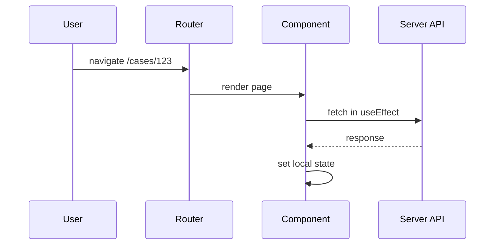
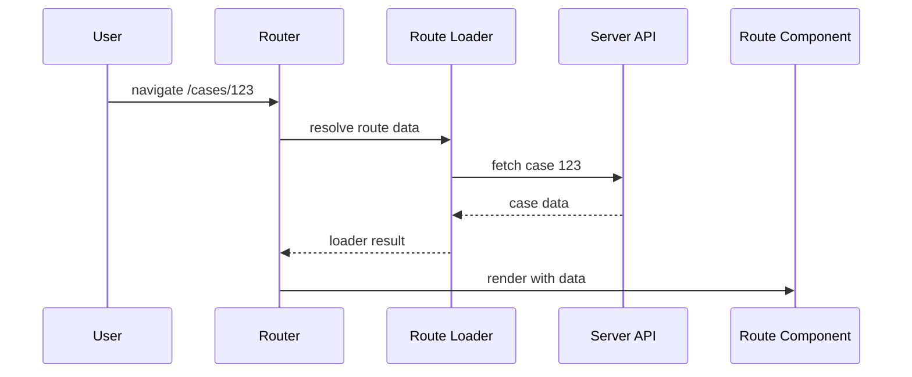
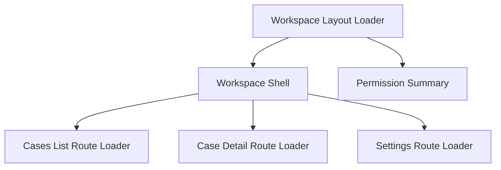
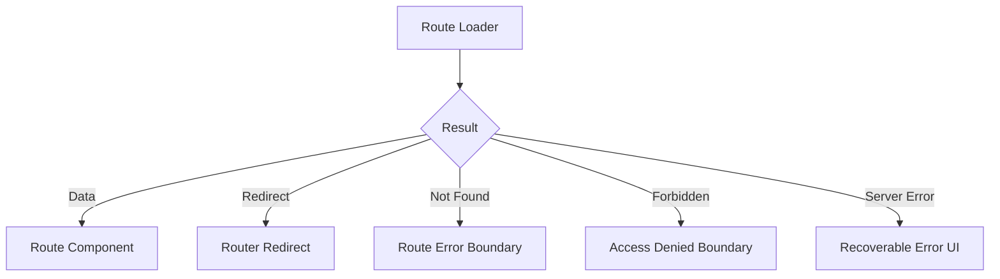
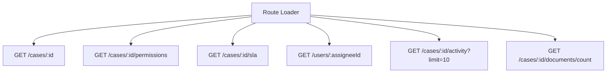
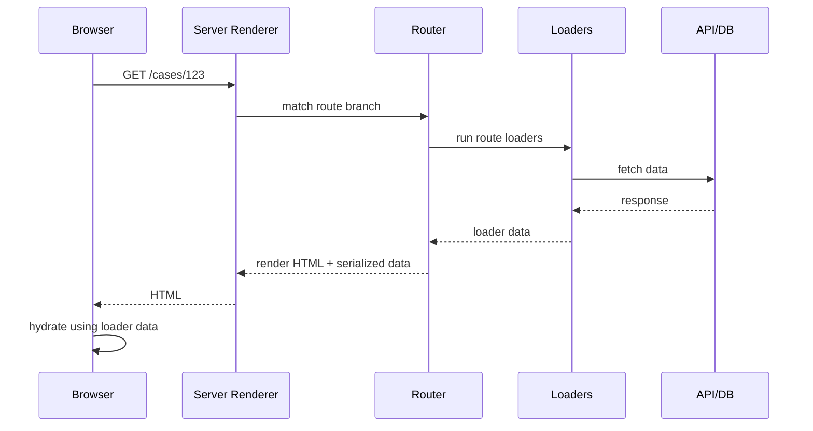
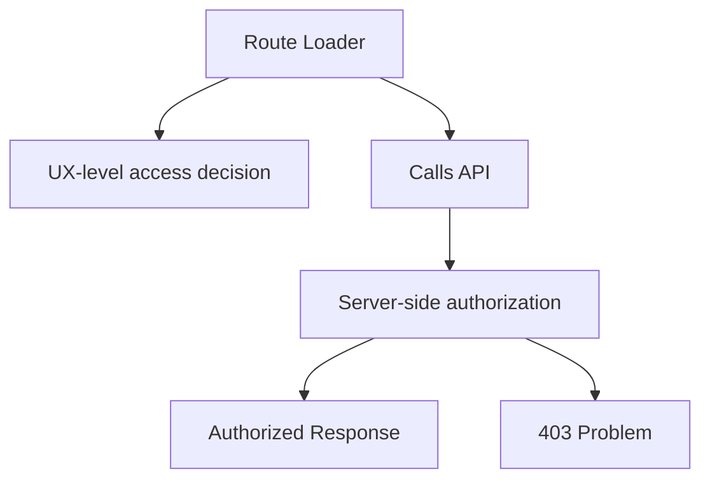
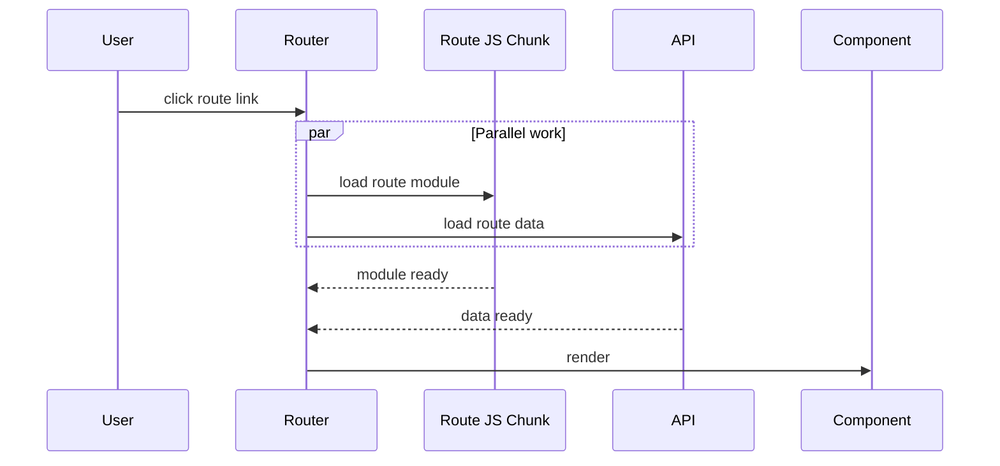

# Part 033 — Route-Level Data Loading

> Target mental model: **a route is not just a URL-to-component mapping. In a production React app, a route is an I/O boundary with identity, authority, data dependencies, navigation state, error handling, and cache policy.**

Most React apps start like this:

```tsx
function CaseDetailPage() {
  const { caseId } = useParams()
  const [data, setData] = useState<CaseDetail | null>(null)
  const [loading, setLoading] = useState(true)

  useEffect(() => {
    fetch(`/api/cases/${caseId}`)
      .then((r) => r.json())
      .then(setData)
      .finally(() => setLoading(false))
  }, [caseId])

  if (loading) return <Spinner />
  return <CaseDetailView data={data} />
}
```

This works until the app has:

- nested layouts
- route transitions
- URL search parameters
- redirects
- authorization failures
- parallel data requirements
- SSR or streaming
- mutation revalidation
- prefetching
- scroll restoration
- error boundaries
- code splitting
- query cache integration

At that point, fetching inside page components becomes a local workaround for a route-level problem.

This part builds the production mental model for route-level data loading.

---

## 1. Why Route-Level Data Loading Exists

A route transition is already a client-server communication event.

When the user goes from:

```txt
/cases?status=open
```

to:

```txt
/cases/CASE-123/activity?tab=timeline
```

several things change:

- path parameters
- search parameters
- selected layout branch
- data requirements
- authorization requirements
- pending UI state
- scroll behavior
- error boundary scope
- preload opportunities
- mutation invalidation scope

If the data requirement belongs to the route, putting it inside a component effect means you split one lifecycle into two disconnected lifecycles:



The route says: “show `/cases/123`.”

The component says: “after I render, maybe fetch case 123.”

That creates a gap.

Route-level loading closes the gap:



The route owns the navigation-time data requirement.

---

## 2. The Core Distinction

There are three common places to fetch data in React applications.

| Location | Good For | Bad For |
|---|---|---|
| Component effect | local side effects, widget-only data, non-critical enhancement | route-critical data, SSR, avoiding waterfalls |
| Query hook | shared server state, cache, background revalidation, mutations | route redirects, navigation ownership, initial route blocking |
| Route loader | route-critical data, redirects, error boundary routing, SSR, URL-owned data | highly interactive widget-only data, realtime streams, local transient state |

The wrong question is:

> Should I use route loaders or React Query?

The better question is:

> Which lifecycle owns this data requirement?

A route loader owns data needed to decide what route UI should render.

A query cache owns reusable server-state replicas with freshness and invalidation policies.

A component owns local interaction state.

These can cooperate.

They should not impersonate each other.

---

## 3. Route Data Is URL-Addressed Data

A route loader should usually be a function of:

- route params
- search params
- request headers/cookies when server-side
- current principal/session
- route-level feature flags
- tenant or workspace scope
- locale
- versioned API contract

A URL is not just navigation state. It is part of the data address.

```txt
/cases/CASE-123?tab=activity&from=2026-07-01&to=2026-07-07
```

Possible data requirements:

```txt
case detail       -> CASE-123
activity timeline -> CASE-123 + date range
selected tab      -> activity
permissions       -> current principal + CASE-123
breadcrumbs       -> CASE-123 + tenant
```

This means a route loader should parse and normalize URL input deliberately.

Bad:

```ts
export async function loader({ request }: LoaderArgs) {
  const url = new URL(request.url)
  return api.cases.search(Object.fromEntries(url.searchParams))
}
```

Better:

```ts
const DEFAULT_PAGE_SIZE = 50

function parseCaseSearchParams(url: URL): CaseSearchInput {
  const status = url.searchParams.get('status') ?? 'open'
  const q = url.searchParams.get('q')?.trim() || null
  const page = Number(url.searchParams.get('page') ?? 1)
  const pageSize = Number(url.searchParams.get('pageSize') ?? DEFAULT_PAGE_SIZE)

  return {
    status: parseCaseStatus(status),
    q,
    page: Number.isFinite(page) && page > 0 ? page : 1,
    pageSize: Math.min(Math.max(pageSize, 1), 100),
  }
}

export async function loader({ request }: LoaderArgs) {
  const url = new URL(request.url)
  const input = parseCaseSearchParams(url)

  return api.cases.search(input)
}
```

Invariant:

> Route loaders should treat URL input as untrusted external input, not as already-valid React state.

---

## 4. Route Loader as an I/O Boundary

A route loader is a boundary between:

- browser navigation
- server/API communication
- route rendering
- error routing
- redirect behavior
- data serialization

The loader must not be treated as a random helper function.

A production route loader should make these decisions explicit:

| Decision | Question |
|---|---|
| Identity | What URL/params identify the resource? |
| Authority | Who may load this route? |
| Transport | Which API/client/server function is called? |
| Deadline | How long should navigation wait? |
| Cancellation | What happens if user navigates away? |
| Error | Which boundary handles failure? |
| Redirect | Is the current URL canonical? |
| Serialization | Can the result cross the route-data boundary? |
| Revalidation | When should this data reload? |
| Cache | Is this data also represented in app cache? |

A loader is a small orchestration layer.

It should not become a domain service.

---

## 5. Minimal Route Loader Shape

The exact API differs by framework and router mode, but the conceptual shape is stable:

```ts
export async function loader({ params, request }: LoaderArgs) {
  const caseId = requireParam(params.caseId, 'caseId')
  const url = new URL(request.url)

  const tab = url.searchParams.get('tab') ?? 'summary'

  const caseDetail = await api.cases.getDetail({ caseId })

  return {
    caseId,
    tab,
    caseDetail,
  }
}
```

Route component:

```tsx
export default function CaseDetailRoute({ loaderData }: Route.ComponentProps) {
  const { caseDetail, tab } = loaderData

  return <CaseDetailScreen caseDetail={caseDetail} selectedTab={tab} />
}
```

In data-router style APIs, the component may read loader data through a hook:

```tsx
function CaseDetailRoute() {
  const data = useLoaderData() as Awaited<ReturnType<typeof loader>>
  return <CaseDetailScreen caseDetail={data.caseDetail} selectedTab={data.tab} />
}
```

The important idea is not the syntax.

The important idea is this:

> The route resolves route-critical data before the route component commits to its normal rendering path.

---

## 6. Route-Level Loading Is Not Automatically Better

Route loaders are powerful, but they are not a universal replacement for query hooks.

Bad route-loader usage:

```ts
export async function loader() {
  return {
    notifications: await api.notifications.list(),
    featureHints: await api.hints.list(),
    ads: await api.ads.list(),
    recentComments: await api.comments.recent(),
    unrelatedWidgetData: await api.widgets.all(),
  }
}
```

This blocks route rendering on data that may not be route-critical.

A better split:

```txt
Route loader:
- case detail
- permission summary
- canonical redirect decision

Query hooks after render:
- notifications
- non-critical widget data
- lazy tab data
- background suggestions
```

Rule:

> Route loaders should load data needed to decide and render the route’s primary state. They should not become “load everything before paint” buckets.

---

## 7. Route-Critical Data

Data is route-critical when the route cannot be correctly rendered without it.

Examples:

| Route | Route-Critical Data |
|---|---|
| `/cases/:caseId` | case existence, primary case detail, permission summary |
| `/orders/:orderId/payment` | order payment status, allowed payment methods |
| `/admin/users/:userId` | user detail, admin permission decision |
| `/reports/:reportId` | report metadata, report access, initial report view |
| `/workspaces/:workspaceId/settings` | workspace identity, role/permission scope |

Not route-critical:

- notification badge
- chat unread count
- non-selected tab data
- optional recommendation panel
- below-the-fold chart details
- telemetry enrichment
- hover preview

The loader is on the critical path.

Do not put non-critical work on the critical path by accident.

---

## 8. Nested Routes and Data Ownership

Nested routes let layout and child route each own their data.

Example route tree:

```txt
/workspaces/:workspaceId
  ├─ cases
  │   ├─ index
  │   └─ :caseId
  └─ settings
```

Ownership:

| Route | Owns |
|---|---|
| `/workspaces/:workspaceId` layout | workspace shell, membership, navigation permissions |
| `/workspaces/:workspaceId/cases` | list filters, case list summary |
| `/workspaces/:workspaceId/cases/:caseId` | selected case detail |
| `/workspaces/:workspaceId/settings` | settings data and admin guard |

Diagram:



The parent route should not usually load all possible child data.

Bad:

```ts
// Workspace layout loader
return {
  workspace: await api.workspaces.get(workspaceId),
  allCases: await api.cases.list(workspaceId),
  allSettings: await api.settings.get(workspaceId),
  allAuditEvents: await api.audit.list(workspaceId),
}
```

Better:

```txt
Parent layout loads shared shell data.
Child routes load child-specific data.
```

This avoids:

- overfetching
- high latency
- permission leakage
- child-route coupling
- stale unrelated data

---

## 9. Loader Dependency: Parent and Child

A common mistake is assuming the child loader should call the parent loader result.

That couples execution order.

Better: extract shared server/API logic into a common function.

Bad:

```ts
// Conceptual anti-pattern
export async function childLoader(args) {
  const parentData = await parentLoader(args)
  return api.cases.list({ workspaceId: parentData.workspace.id })
}
```

Better:

```ts
async function requireWorkspaceContext(args: LoaderArgs) {
  const workspaceId = requireParam(args.params.workspaceId, 'workspaceId')
  const membership = await api.workspaces.getMembership({ workspaceId })

  if (!membership.canRead) {
    throw forbiddenProblem('You cannot access this workspace')
  }

  return { workspaceId, membership }
}

export async function workspaceLayoutLoader(args: LoaderArgs) {
  const { workspaceId, membership } = await requireWorkspaceContext(args)
  const workspace = await api.workspaces.get({ workspaceId })

  return { workspace, membership }
}

export async function casesLoader(args: LoaderArgs) {
  const { workspaceId } = await requireWorkspaceContext(args)
  const filter = parseCaseFilter(new URL(args.request.url))

  return api.cases.search({ workspaceId, filter })
}
```

The shared function owns authorization and context resolution.

The route loaders remain independently executable.

---

## 10. Route-Level Redirects

A redirect is not a rendering concern.

It is route resolution.

Examples:

| Situation | Redirect |
|---|---|
| missing canonical slug | `/cases/123` → `/cases/CASE-123-payment-dispute` |
| unauthenticated user | `/admin` → `/login?redirectTo=/admin` |
| completed wizard step | `/checkout/shipping` → `/checkout/payment` |
| deprecated route | `/old-reports/1` → `/reports/1` |
| default child route | `/settings` → `/settings/profile` |

Bad:

```tsx
function AdminPage() {
  const { user, loading } = useCurrentUser()

  useEffect(() => {
    if (!loading && !user) navigate('/login')
  }, [loading, user])

  return <AdminScreen />
}
```

Problems:

- protected UI may flash
- server rendering becomes awkward
- data fetch may happen before redirect
- redirect is delayed until after render/effect

Better:

```ts
export async function loader({ request }: LoaderArgs) {
  const session = await auth.getSession(request)

  if (!session) {
    const url = new URL(request.url)
    throw redirect(`/login?redirectTo=${encodeURIComponent(url.pathname + url.search)}`)
  }

  return { principal: session.principal }
}
```

Invariant:

> If the route should not render, decide that before rendering the route.

---

## 11. Error Boundaries as Route Failure Boundaries

Route-level loading works best when errors are scoped to route boundaries.

Failure examples:

| Failure | Boundary |
|---|---|
| workspace not found | workspace layout boundary |
| case not found | case detail boundary |
| comments panel failed | comments child boundary or query-level UI |
| permission denied | route boundary with access-denied UI |
| API unavailable | route boundary or global outage shell |

Diagram:



Do not collapse all route failures into a single generic error page.

A user should know the difference between:

- “this case does not exist”
- “you do not have access”
- “the server is unavailable”
- “your session expired”
- “the URL is invalid”

The route boundary is where those distinctions become user experience.

---

## 12. Loader Error Envelope

Use a structured error envelope.

Example domain error:

```ts
type RouteProblem = {
  type: string
  title: string
  status: number
  detail?: string
  instance?: string
  code?: string
  traceId?: string
  retryable?: boolean
}
```

Throwing or returning depends on router/framework convention, but the model is stable:

```ts
function routeProblem(problem: RouteProblem): Response {
  return new Response(JSON.stringify(problem), {
    status: problem.status,
    headers: {
      'content-type': 'application/problem+json',
    },
  })
}

export async function loader({ params }: LoaderArgs) {
  const caseId = requireParam(params.caseId, 'caseId')

  const result = await api.cases.getDetail({ caseId })

  if (result.status === 404) {
    throw routeProblem({
      type: 'https://example.com/problems/case-not-found',
      title: 'Case not found',
      status: 404,
      code: 'CASE_NOT_FOUND',
      traceId: result.traceId,
    })
  }

  return result.data
}
```

Error boundary:

```tsx
export function ErrorBoundary() {
  const error = useRouteError()
  const problem = toRouteProblem(error)

  if (problem.status === 404) {
    return <NotFound title="Case not found" traceId={problem.traceId} />
  }

  if (problem.status === 403) {
    return <AccessDenied traceId={problem.traceId} />
  }

  return <RouteCrashed problem={problem} />
}
```

The UI is only as good as the error taxonomy.

---

## 13. Loader Data Serialization Boundary

Route data crosses a serialization boundary.

Do not assume arbitrary runtime objects survive intact.

Risky loader return:

```ts
return {
  case: new CaseAggregate(...),
  permissions: new Set(['read', 'comment']),
  createdAt: new Date(),
  compute: () => {},
  dbClient,
}
```

Prefer explicit transport DTO:

```ts
type CaseDetailLoaderData = {
  case: {
    id: string
    title: string
    status: 'open' | 'closed'
    createdAt: string
  }
  permissions: {
    canRead: boolean
    canComment: boolean
    canClose: boolean
  }
}
```

Even if a framework supports richer serialization than JSON, design route data as a contract.

Do not leak domain objects into UI boundaries.

---

## 14. Loader Data Should Be Boring

Good loader data is boring:

- plain object
- normalized input
- stable shape
- explicit nullability
- version-tolerant fields
- no functions
- no secrets
- no raw backend error object
- no framework-only internals

Example:

```ts
type CaseDetailRouteData = {
  case: {
    id: string
    reference: string
    title: string
    status: CaseStatus
    priority: CasePriority
    updatedAt: string
  }
  assignee: {
    id: string
    displayName: string
  } | null
  permissions: {
    canComment: boolean
    canEscalate: boolean
    canClose: boolean
  }
  links: {
    activity: string
    documents: string
    audit: string | null
  }
}
```

Boring data is reviewable.

Reviewable data is governable.

---

## 15. Loader and Query Cache Integration

Route loaders and query caches can cooperate in several patterns.

### Pattern A: Loader Returns Data Directly

Use when the data is route-owned and not widely reused.

```ts
export async function loader({ params }: LoaderArgs) {
  return api.cases.getDetail({ caseId: requireParam(params.caseId, 'caseId') })
}
```

Component:

```tsx
function CaseRoute() {
  const data = useLoaderData() as CaseDetailRouteData
  return <CaseDetailScreen data={data} />
}
```

### Pattern B: Loader Warms Query Cache

Use when the same resource should participate in query cache lifecycle.

```ts
export async function loader({ params, context }: LoaderArgs) {
  const caseId = requireParam(params.caseId, 'caseId')
  const queryClient = context.queryClient

  await queryClient.ensureQueryData({
    queryKey: caseKeys.detail(caseId),
    queryFn: () => api.cases.getDetail({ caseId }),
  })

  return { caseId }
}
```

Component:

```tsx
function CaseRoute() {
  const { caseId } = useLoaderData() as { caseId: string }

  const query = useQuery({
    queryKey: caseKeys.detail(caseId),
    queryFn: () => api.cases.getDetail({ caseId }),
  })

  return <CaseDetailScreen data={query.data} />
}
```

### Pattern C: Loader Reads Query Cache If Fresh

Use with caution.

The loader can avoid duplicate work if the cache already has valid data, but freshness and scope must be strict.

```ts
export async function loader({ params, context }: LoaderArgs) {
  const caseId = requireParam(params.caseId, 'caseId')
  const key = caseKeys.detail(caseId)

  const cached = context.queryClient.getQueryData<CaseDetail>(key)

  if (cached && isFreshEnough(cached)) {
    return { caseId, source: 'cache' }
  }

  await context.queryClient.ensureQueryData({
    queryKey: key,
    queryFn: () => api.cases.getDetail({ caseId }),
  })

  return { caseId, source: 'network' }
}
```

The harder the freshness policy, the more careful you need to be.

---

## 16. Avoid Double Caching Without a Plan

Bad:

```tsx
function CaseRoute() {
  const loaderData = useLoaderData() as CaseDetail

  const query = useQuery({
    queryKey: ['case', loaderData.id],
    queryFn: () => api.cases.getDetail({ caseId: loaderData.id }),
    initialData: loaderData,
  })

  const [caseState, setCaseState] = useState(query.data)

  return <CaseEditor value={caseState} onChange={setCaseState} />
}
```

Now there are three representations:

- loader data
- query cache data
- component state copy

This may be legitimate for form draft editing, but dangerous if accidental.

Better:

```txt
Route loader: identifies route and blocks rendering until primary data exists.
Query cache: owns server-state replica and revalidation.
Form state: owns user draft only.
```

Do not copy server state into local state unless creating an intentional draft.

---

## 17. Loader Cancellation

A route navigation can be superseded.

User quickly navigates:

```txt
/cases/1 -> /cases/2 -> /cases/3
```

The route data system should cancel or ignore obsolete requests.

A loader-aware API client should accept a signal:

```ts
export async function loader({ params, request }: LoaderArgs) {
  const caseId = requireParam(params.caseId, 'caseId')

  return api.cases.getDetail(
    { caseId },
    { signal: request.signal },
  )
}
```

Fetch client:

```ts
async function http<T>(input: string, options: HttpOptions = {}): Promise<T> {
  const response = await fetch(input, {
    ...options,
    signal: options.signal,
  })

  return parseResponse<T>(response)
}
```

Invariant:

> Every route-critical network call should be cancellable or safely ignorable.

Cancellation is not just a performance optimization.

It prevents stale route results from committing after the user has moved on.

---

## 18. Deadline and Timeout for Route Loading

Navigation cannot wait forever.

Route loaders need deadline policy.

Example:

```ts
function withTimeout(parentSignal: AbortSignal, ms: number): AbortSignal {
  const timeoutSignal = AbortSignal.timeout(ms)
  return AbortSignal.any([parentSignal, timeoutSignal])
}

export async function loader({ params, request }: LoaderArgs) {
  const signal = withTimeout(request.signal, 8_000)
  const caseId = requireParam(params.caseId, 'caseId')

  return api.cases.getDetail({ caseId }, { signal })
}
```

Timeout policy should depend on route class:

| Route Type | Deadline Guidance |
|---|---|
| Shell route | short; should not block too long |
| Detail route | moderate; primary data critical |
| Report generation | avoid blocking; use job/status route |
| Search route | short; user can refine/retry |
| Admin export | use background job, not route loader |

If a route load can take 30 seconds, it probably should not be a route load.

---

## 19. Route Loader Waterfalls

A route loader can still create waterfalls.

Bad:

```ts
export async function loader({ params }: LoaderArgs) {
  const caseDetail = await api.cases.getDetail({ caseId: params.caseId })
  const assignee = await api.users.get({ userId: caseDetail.assigneeId })
  const activity = await api.activity.list({ caseId: caseDetail.id })
  const documents = await api.documents.list({ caseId: caseDetail.id })

  return { caseDetail, assignee, activity, documents }
}
```

If `activity` and `documents` only need `caseId`, run them in parallel:

```ts
export async function loader({ params }: LoaderArgs) {
  const caseId = requireParam(params.caseId, 'caseId')

  const [caseDetail, activity, documents] = await Promise.all([
    api.cases.getDetail({ caseId }),
    api.activity.list({ caseId, limit: 20 }),
    api.documents.list({ caseId, limit: 20 }),
  ])

  const assignee = caseDetail.assigneeId
    ? await api.users.get({ userId: caseDetail.assigneeId })
    : null

  return { caseDetail, assignee, activity, documents }
}
```

Better still, if the route always needs the assignee display name, make the API endpoint return it.

```ts
api.cases.getDetail({
  caseId,
  include: ['assigneeSummary', 'activityPreview', 'documentSummary'],
})
```

The frontend should not compensate forever for poor aggregate boundaries.

---

## 20. Loader as Aggregate Boundary

Sometimes route-level data implies a backend aggregate endpoint.

Example screen:

```txt
Case Detail Page
- case summary
- assignee summary
- SLA status
- permission summary
- activity preview
- document count
- next allowed actions
```

Naive frontend:



Backend-for-frontend shape:

```txt
GET /ui/case-detail/:caseId
```

Returns:

```ts
type CaseDetailViewModel = {
  case: CaseSummary
  assignee: UserSummary | null
  sla: SlaSummary
  permissions: CasePermissionSummary
  activityPreview: ActivityEvent[]
  documentSummary: { count: number; latestUploadedAt: string | null }
  actions: CaseActionAvailability[]
}
```

Do not automatically create BFF endpoints for everything.

Use them when:

- multiple resources are always needed together
- permission logic is cross-resource
- frontend creates N+1 calls
- latency budget is being missed
- partial consistency must be controlled
- API composition leaks backend topology

---

## 21. URL Canonicalization

Route loaders are good places to canonicalize invalid or non-canonical URLs.

Example:

```txt
/cases?page=-1&status=OPEN
```

Canonical:

```txt
/cases?page=1&status=open
```

Loader:

```ts
export async function loader({ request }: LoaderArgs) {
  const url = new URL(request.url)
  const input = parseCaseFilter(url)
  const canonical = buildCaseSearchUrl(input)

  if (url.pathname + url.search !== canonical) {
    throw redirect(canonical)
  }

  return api.cases.search(input)
}
```

Canonicalization prevents one logical resource from being represented by many URL forms.

That helps:

- caching
- sharing links
- analytics
- debugging
- canonical SEO in public pages
- query key design

---

## 22. Search Params Are Data Contract

Search params are often treated casually.

They should be treated as route input contract.

Bad:

```tsx
const [searchParams] = useSearchParams()
const status = searchParams.get('status')!
```

Better:

```ts
type CaseListRouteInput = {
  status: 'open' | 'closed' | 'all'
  page: number
  q: string | null
  sort: 'updated-desc' | 'created-desc' | 'priority-desc'
}

function parseCaseListInput(url: URL): CaseListRouteInput {
  return {
    status: parseEnum(url.searchParams.get('status'), ['open', 'closed', 'all'], 'open'),
    page: parsePositiveInt(url.searchParams.get('page'), 1),
    q: normalizeSearchText(url.searchParams.get('q')),
    sort: parseEnum(url.searchParams.get('sort'), ['updated-desc', 'created-desc', 'priority-desc'], 'updated-desc'),
  }
}
```

The route owns the parsed input.

Components should receive already-normalized values.

---

## 23. Loader Result as View Model

Should a loader return API DTOs directly or route view models?

It depends.

### Direct DTO is acceptable when:

- API is already shaped for the UI
- contract is stable
- permission filtering is already done
- component owns presentation mapping
- route is simple

### View model is better when:

- API requires composition
- multiple API shapes are involved
- UI needs derived availability flags
- route has complex permission behavior
- backend DTO leaks internal fields
- data needs redaction or normalization

Example:

```ts
function toCaseDetailViewModel(input: {
  case: CaseDto
  permissions: PermissionDto
  workflow: WorkflowDto
}): CaseDetailRouteData {
  return {
    case: {
      id: input.case.id,
      reference: input.case.reference,
      title: input.case.title,
      status: input.case.status,
      updatedAt: input.case.updatedAt,
    },
    actions: {
      canComment: input.permissions.allowed.includes('case.comment'),
      canEscalate:
        input.permissions.allowed.includes('case.escalate') &&
        input.workflow.availableTransitions.includes('ESCALATE'),
      canClose:
        input.permissions.allowed.includes('case.close') &&
        input.workflow.availableTransitions.includes('CLOSE'),
    },
  }
}
```

The loader is allowed to adapt server data into route data.

But avoid hiding domain decisions in random presentation code.

---

## 24. SSR and Hydration

Route loaders are SSR-friendly because the route system can resolve data before or during server rendering.

Conceptual SSR pipeline:



Hydration failure risks:

| Risk | Cause |
|---|---|
| data mismatch | server and client parse URL differently |
| user leak | serialized data not scoped to session |
| stale hydrate | data too old but marked fresh |
| double fetch | cache not hydrated consistently |
| non-serializable data | loader returned runtime objects |
| secret exposure | server-only values serialized into HTML |

SSR makes route data more powerful.

It also makes serialization and security more serious.

---

## 25. Security Boundary

Route loaders are not security by themselves.

A client-side loader can improve UX, but backend authorization remains mandatory.

Bad assumption:

> “The loader checks permission, so the API is safe.”

Correct model:



The loader may:

- redirect unauthenticated users
- hide inaccessible route branches
- shape access-denied UI
- avoid unnecessary requests
- include permission summary in route data

The server must:

- authenticate request
- authorize resource access
- enforce tenant isolation
- redact fields
- audit sensitive access
- reject invalid mutation attempts

Never trust client route logic as enforcement.

---

## 26. Loader and Sensitive Data

Do not return data just because “the page might need it later.”

Bad:

```ts
return {
  case: await api.cases.getInternalDetail({ caseId }),
  allPermissions: await api.debug.permissions({ caseId }),
  rawAuditTrail: await api.audit.raw({ caseId }),
}
```

Better:

```ts
return {
  case: redactCaseForPrincipal(caseDetail, principal),
  permissions: summarizeCasePermissions(permissionDecision),
}
```

Route data may end up in:

- hydrated HTML
- browser memory
- logs
- DevTools
- error reports
- persisted cache if integrated incorrectly

Only send what the route needs.

---

## 27. Loader Revalidation

Route data can become stale.

Revalidation may happen after:

- navigation to the same route with changed params/search
- form/action submission
- explicit revalidator call
- focus/reconnect depending on framework integration
- mutation invalidation through query cache
- manual refresh

Revalidation must be intentional.

Example decision table:

| Change | Revalidate? | Why |
|---|---:|---|
| `page` search param changed | yes | list identity changed |
| `modal=open` changed | maybe no | presentation state only |
| mutation updated current case | yes | route data stale |
| mutation updated unrelated notification | no | not route-owned |
| auth principal changed | yes and clear caches | authority scope changed |
| locale changed | yes if localized data | representation changed |

A good route system lets you decide when route data should reload.

The application must still define the policy.

---

## 28. `shouldRevalidate` Style Policy

Some frameworks expose a `shouldRevalidate` hook or equivalent.

Conceptual implementation:

```ts
export function shouldRevalidate(args: ShouldRevalidateArgs) {
  const current = new URL(args.currentUrl)
  const next = new URL(args.nextUrl)

  if (current.pathname !== next.pathname) return true

  const currentInput = parseCaseListInput(current)
  const nextInput = parseCaseListInput(next)

  return !deepEqual(currentInput, nextInput)
}
```

Use this to avoid reloads for presentation-only search params.

Example:

```txt
/cases?status=open&page=1&panel=filters
/cases?status=open&page=1&panel=closed
```

If `panel` does not affect server data, it should not revalidate the list.

But be careful.

A missed revalidation is worse than a minor extra request when correctness matters.

---

## 29. Route Prefetching

Route-level data makes prefetching easier.

Possible triggers:

- link hover
- link visible in viewport
- likely next route
- wizard next step
- search result row hover
- route module preload
- idle time preload

Prefetch target:

```txt
route code + route data + maybe query cache entry
```

Do not prefetch indiscriminately.

Prefetch is speculative load.

It consumes:

- bandwidth
- server capacity
- auth-sensitive access logs
- cache memory
- battery

Prefetch policy:

| Route | Prefetch? |
|---|---|
| dashboard shell | maybe on app boot |
| case detail on row hover | yes, if cheap |
| huge report | no; prefetch metadata only |
| admin sensitive audit | no, unless explicit intent |
| next wizard step | yes, if predictable |

Route-level data enables prefetch.

It does not remove the need for cost control.

---

## 30. Code Splitting and Data Splitting

A classic SPA waterfall:

```txt
click link
→ download route JS
→ render component
→ useEffect fetch data
→ render data
```

Better:

```txt
click link
→ router knows route
→ load route module and data in parallel
→ render route
```

Diagram:



This is one of the strongest reasons to use route-level data APIs.

They let the app schedule data and code together.

---

## 31. Route Loader Testing

Route loaders are easier to test than effect-based fetching because they are functions.

Example:

```ts
describe('case detail loader', () => {
  it('loads case detail for valid route', async () => {
    const request = new Request('https://app.test/cases/CASE-123')

    api.cases.getDetail.mockResolvedValue({
      id: 'CASE-123',
      title: 'Payment dispute',
    })

    const result = await loader({
      request,
      params: { caseId: 'CASE-123' },
      context: testContext(),
    })

    expect(result).toMatchObject({
      id: 'CASE-123',
      title: 'Payment dispute',
    })
  })

  it('throws not found response for missing case', async () => {
    api.cases.getDetail.mockRejectedValue(apiNotFound('CASE_NOT_FOUND'))

    await expect(
      loader({
        request: new Request('https://app.test/cases/NOPE'),
        params: { caseId: 'NOPE' },
        context: testContext(),
      }),
    ).rejects.toMatchObject({ status: 404 })
  })
})
```

Test cases should cover:

- params missing
- search params invalid
- canonical redirect
- unauthenticated redirect
- forbidden
- not found
- server error
- timeout
- cancellation
- serialization shape
- revalidation policy
- cache warming

Route loader tests should look like API boundary tests, not component tests.

---

## 32. Observability for Route Loading

Route loaders need observability because they sit on the user-visible navigation path.

Track:

| Signal | Why |
|---|---|
| route id | which route is slow/failing |
| URL pattern | avoid raw sensitive URL logging |
| params hash | correlate without leaking identifiers |
| duration | user-perceived navigation latency |
| outcome | success/redirect/error/abort |
| status code | error taxonomy |
| request count | route composition cost |
| bytes | payload size |
| cache source | loader/network/query-cache/hydrated |
| trace id | backend correlation |

Example:

```ts
export async function observedLoader<T>(
  routeId: string,
  fn: () => Promise<T>,
): Promise<T> {
  const start = performance.now()

  try {
    const result = await fn()
    routeTelemetry.emit({
      routeId,
      outcome: 'success',
      durationMs: performance.now() - start,
    })
    return result
  } catch (error) {
    routeTelemetry.emit({
      routeId,
      outcome: classifyRouteOutcome(error),
      durationMs: performance.now() - start,
      status: getStatus(error),
      traceId: getTraceId(error),
    })
    throw error
  }
}
```

Do not log full URLs with sensitive search params.

Use route patterns and redacted input summaries.

---

## 33. Route Loader Anti-Patterns

### Anti-pattern: loader as god endpoint

```ts
export async function loader() {
  return loadEverythingForTheApp()
}
```

This makes every route transition expensive.

### Anti-pattern: no input parsing

```ts
const page = Number(new URL(request.url).searchParams.get('page'))
```

`NaN` is now part of your API call.

### Anti-pattern: loader returns raw backend shape

Backend internals leak into UI.

### Anti-pattern: route protection in component effect only

Unauthorized UI can flash and wrong requests can run.

### Anti-pattern: loader ignores cancellation

Obsolete requests waste resources and can race.

### Anti-pattern: copying loader data into state

Now there are two sources of truth.

### Anti-pattern: loading every tab before rendering

Selected route becomes slow because unselected UI is expensive.

### Anti-pattern: no route error boundary

Every route failure becomes global failure.

---

## 34. Practical Decision Framework

Use route loader when:

- the data is required to render the route’s primary content
- the URL directly identifies the data
- redirect/not-found/forbidden must be decided before render
- SSR/hydration matters
- data and route module should load in parallel
- error should be scoped to the route
- mutation should trigger route revalidation

Use query hook when:

- data is shared across multiple components
- background refetch matters
- stale-while-revalidate UX is acceptable
- data is not required to decide route rendering
- widget can load independently
- realtime/infinite/list behavior is cache-heavy

Use component effect when:

- synchronizing with external browser API
- firing analytics after render
- enhancing a widget non-critically
- integrating imperative library
- handling local side effect unrelated to route data

Use server component/server function when:

- framework owns server/client boundary
- data should never reach client as fetch logic
- server-only dependency is required
- streaming and partial render are first-class

The mature architecture uses all of them deliberately.

---

## 35. Route Data Review Checklist

Before approving a route loader, ask:

- Does this data belong to the route lifecycle?
- Are params and search params parsed and normalized?
- Is the loader result serializable and redacted?
- Does the loader enforce UX-level auth/redirect decisions?
- Does the backend still enforce authorization?
- Are non-critical widgets excluded from the critical path?
- Are independent API calls parallelized?
- Should this be an aggregate endpoint instead?
- Is cancellation wired into the API client?
- Is there a route-specific error boundary?
- Are 401/403/404/409/5xx handled differently?
- Is route revalidation policy explicit?
- Does it interact safely with query cache?
- Does SSR/hydration expose anything sensitive?
- Are route load duration and outcomes observable?

If these questions are not answerable, the loader is not production-ready.

---

## 36. Final Mental Model

Route-level data loading is not a syntax upgrade over `useEffect`.

It is a different ownership model.

A route loader says:

> “For this URL and principal, resolve the data, redirect, or error required to enter this route.”

That makes it the correct home for:

- route-critical data
- URL-driven data
- canonical redirects
- not-found decisions
- access-denied routing
- SSR hydration data
- route-scoped error handling
- navigation-aware cancellation
- route revalidation

Do not move all fetching into loaders.

Move route-owned fetching into loaders.

Part 034 continues this idea by focusing on loaders, actions, and fetchers as a complete route data mutation model.
