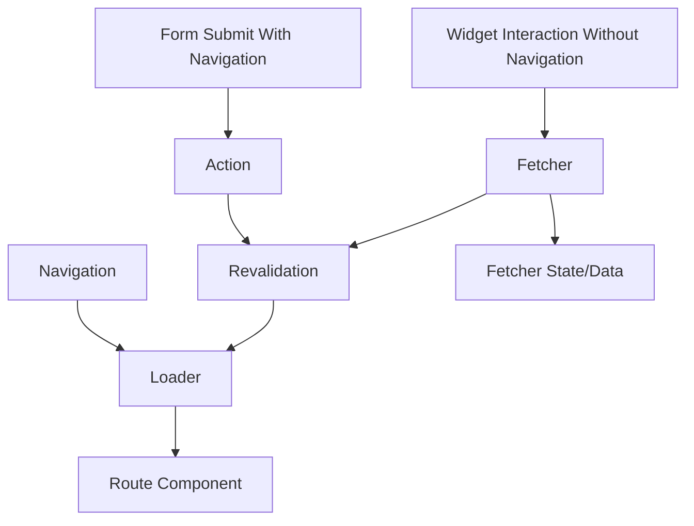
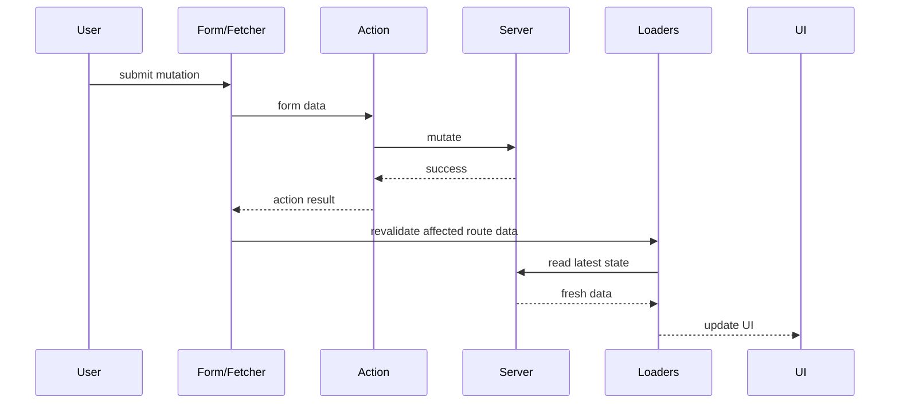
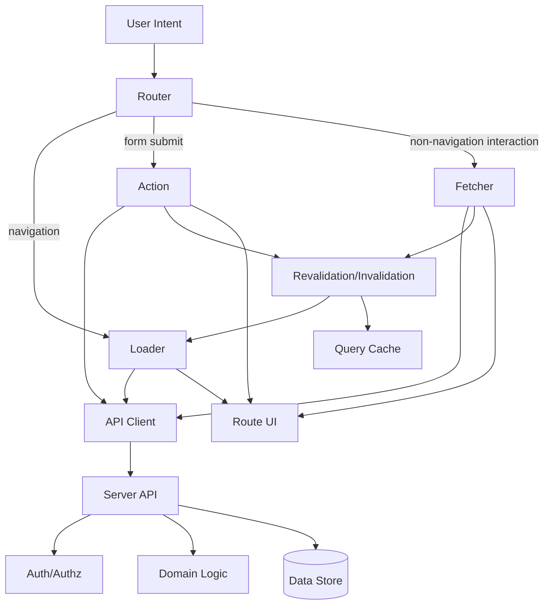

# Part 034 — Loaders, Actions, and Fetchers

> Target mental model: **loaders read route data, actions mutate route-owned state, and fetchers perform loader/action interactions without navigation. Together they form a navigation-aware client-server protocol.**

Part 033 focused on route-level data loading.

This part adds the mutation side.

In a mature React app, route communication is not only:

```txt
GET data for this page
```

It is also:

```txt
submit form
validate input
mutate server state
show pending state
handle conflict
redirect or stay
revalidate affected data
preserve user intent
avoid duplicate side effects
```

Loaders, actions, and fetchers give this lifecycle a structure.

---

## 1. The Three Primitives

Conceptually:

| Primitive | Primary Job | Navigation? | Typical HTTP Shape |
|---|---|---:|---|
| Loader | read data for route | yes | GET-like |
| Action | mutate data for route | often yes | POST/PUT/PATCH/DELETE-like |
| Fetcher | interact with loader/action without navigation | no | GET or mutation |

These primitives separate three different lifecycles.



The design goal is not “more APIs.”

The design goal is ownership.

---

## 2. Loader: Read Model Boundary

A loader answers:

> “For this URL, principal, and route branch, what data is required to render or reject this route?”

Example:

```ts
export async function loader({ params, request }: LoaderArgs) {
  const caseId = requireParam(params.caseId, 'caseId')
  const url = new URL(request.url)
  const tab = parseCaseTab(url.searchParams.get('tab'))

  const [caseDetail, permissions] = await Promise.all([
    api.cases.getDetail({ caseId }, { signal: request.signal }),
    api.cases.getPermissions({ caseId }, { signal: request.signal }),
  ])

  return {
    case: caseDetail,
    permissions: toPermissionSummary(permissions),
    selectedTab: tab,
  }
}
```

The loader should not mutate server state.

It should not fire tracking events that must happen exactly once.

It should not perform irreversible side effects.

Reason:

- loaders can rerun
- loaders can be cancelled
- loaders can be prefetched
- loaders can run during SSR
- loaders can revalidate after actions

Read lifecycle must remain safe to repeat.

---

## 3. Action: Mutation Boundary

An action answers:

> “A user submitted an intent to change server state. Validate it, execute it, and return the next route-level outcome.”

Example:

```ts
export async function action({ request, params }: ActionArgs) {
  const caseId = requireParam(params.caseId, 'caseId')
  const formData = await request.formData()

  const input = parseAddCommentForm(formData)

  if (!input.ok) {
    return validationProblem(input.errors)
  }

  const result = await api.comments.create({
    caseId,
    body: input.value.body,
    idempotencyKey: input.value.idempotencyKey,
  })

  if (result.kind === 'forbidden') {
    throw forbiddenProblem('You cannot comment on this case')
  }

  if (result.kind === 'conflict') {
    return conflictProblem(result.problem)
  }

  return {
    ok: true,
    commentId: result.comment.id,
  }
}
```

The action is a command handler at the route boundary.

It should have stricter rules than a loader.

---

## 4. Action Is Not “POST in a Component”

A component-level mutation often looks like:

```tsx
async function handleSubmit() {
  setSaving(true)

  try {
    await api.comments.create({ caseId, body })
    await refetchCase()
    toast.success('Comment added')
  } catch (error) {
    setError(error)
  } finally {
    setSaving(false)
  }
}
```

This works, but the component now owns:

- form serialization
- validation mapping
- pending state
- duplicate submit prevention
- mutation request
- error taxonomy
- redirect behavior
- revalidation
- stale data recovery
- accessibility announcements
- optimistic/rollback state

An action lets the route system own mutation lifecycle.

The component becomes a declaration of intent:

```tsx
<Form method="post">
  <textarea name="body" />
  <input type="hidden" name="idempotencyKey" value={idempotencyKey} />
  <button type="submit">Add comment</button>
</Form>
```

The route action handles the command.

---

## 5. Form Submission as Protocol

HTML forms are an underrated client-server protocol.

A form submission has:

- method
- action URL
- field names
- encoding type
- submitter button
- pending state
- validation errors
- success outcome
- redirect outcome

In route data APIs, forms can become progressive mutation surfaces.

Example:

```tsx
<Form method="post" action="/cases/CASE-123/comments">
  <label htmlFor="comment">Comment</label>
  <textarea id="comment" name="body" required />
  <button name="intent" value="add-comment" type="submit">
    Add comment
  </button>
</Form>
```

Action:

```ts
export async function action({ request, params }: ActionArgs) {
  const formData = await request.formData()
  const intent = formData.get('intent')

  if (intent === 'add-comment') {
    return addCommentAction({ request, params, formData })
  }

  throw badRequestProblem('Unknown form intent')
}
```

A route action can multiplex multiple form intents, but do this sparingly.

If action logic becomes a switchboard with ten commands, split routes or extract command handlers.

---

## 6. Action Result Taxonomy

An action can produce several outcomes.

| Outcome | Meaning | UI Behavior |
|---|---|---|
| success data | mutation succeeded, stay on route | show result/revalidate |
| redirect | mutation succeeded and route changes | navigate |
| validation error | user input invalid | show field errors |
| domain conflict | valid input, business rule failed | show domain message |
| forbidden | user cannot perform action | access-denied state |
| not found | target resource disappeared | not-found boundary |
| server failure | backend failed | retry/error state |
| unknown outcome | request timed out after possible commit | reconcile via idempotency/status |

Do not collapse these into:

```ts
{ ok: boolean; message: string }
```

That shape is too weak for production.

Better:

```ts
type AddCommentActionData =
  | {
      kind: 'success'
      commentId: string
    }
  | {
      kind: 'validation-error'
      fields: {
        body?: string
      }
    }
  | {
      kind: 'domain-error'
      code: 'CASE_CLOSED' | 'COMMENT_TOO_LONG' | 'DUPLICATE_COMMENT'
      message: string
    }
```

Make action results discriminated.

The UI should not parse human text to decide behavior.

---

## 7. Validation Boundary

Validation happens at multiple layers.

| Layer | Role |
|---|---|
| HTML constraints | immediate browser-level affordance |
| client validation | fast feedback, formatting, obvious constraints |
| action validation | authoritative route input validation |
| backend validation | final domain/security enforcement |
| database constraints | integrity backstop |

Example parser:

```ts
type ParseResult<T> =
  | { ok: true; value: T }
  | { ok: false; errors: Record<string, string> }

function parseAddCommentForm(formData: FormData): ParseResult<AddCommentInput> {
  const body = String(formData.get('body') ?? '').trim()
  const idempotencyKey = String(formData.get('idempotencyKey') ?? '')

  const errors: Record<string, string> = {}

  if (!body) errors.body = 'Comment is required.'
  if (body.length > 4_000) errors.body = 'Comment is too long.'
  if (!isUuid(idempotencyKey)) errors.form = 'Invalid submission token.'

  if (Object.keys(errors).length > 0) {
    return { ok: false, errors }
  }

  return {
    ok: true,
    value: { body, idempotencyKey },
  }
}
```

Action:

```ts
const parsed = parseAddCommentForm(formData)

if (!parsed.ok) {
  return {
    kind: 'validation-error',
    fields: parsed.errors,
  } satisfies AddCommentActionData
}
```

Route action validation must assume the client is hostile.

Even if the UI prevents invalid input, the action must validate again.

---

## 8. Pending State

Pending state is not a single boolean.

For route data APIs, pending can mean:

| State | Example |
|---|---|
| navigation loading | user clicked a route link |
| navigation submitting | form submit will navigate |
| fetcher loading | widget loading without navigation |
| fetcher submitting | widget mutation without navigation |
| revalidating | existing route data refreshing after action |
| optimistic pending | UI patched before server confirms |

Bad:

```tsx
const [loading, setLoading] = useState(false)
```

Better mental model:

```ts
type PendingScope =
  | { kind: 'idle' }
  | { kind: 'navigation-loading'; to: string }
  | { kind: 'navigation-submitting'; formAction: string; formMethod: string }
  | { kind: 'fetcher-loading'; key: string }
  | { kind: 'fetcher-submitting'; key: string; intent: string }
  | { kind: 'revalidating'; routeIds: string[] }
```

The UI should disable only the relevant controls.

Do not freeze the entire page for a small fetcher submission unless the mutation truly affects the entire route.

---

## 9. Navigation Submit vs Fetcher Submit

A form can submit with navigation or without navigation.

Use navigation submission when:

- success should go to another route
- mutation is the main route intent
- URL should represent the result
- browser back/forward behavior matters
- progressive enhancement matters strongly

Use fetcher submission when:

- mutation is local to a widget
- the URL should not change
- multiple independent interactions can happen concurrently
- user should stay on the current page
- route data may revalidate after mutation

Examples:

| Interaction | Better Primitive |
|---|---|
| login form | action with redirect |
| checkout next step | action with redirect |
| add comment inline | fetcher submit |
| toggle star | fetcher submit |
| delete row in table | fetcher submit, maybe redirect if current detail deleted |
| save settings page | action or fetcher depending UX |
| search form changing URL | navigation GET/form or search params |

Primitive choice is UX semantics, not just technical preference.

---

## 10. Fetcher: Non-Navigation Communication

A fetcher interacts with loaders/actions without causing navigation.

Use cases:

- inline comment submission
- autocomplete resource load
- row-level delete
- like/star toggle
- modal form
- dependent select options
- background validation
- drawer details
- side panel resource load

Conceptual example:

```tsx
function AddCommentBox({ caseId }: { caseId: string }) {
  const fetcher = useFetcher<AddCommentActionData>()
  const idempotencyKey = useStableIdempotencyKey()

  const isSubmitting = fetcher.state === 'submitting'
  const validation =
    fetcher.data?.kind === 'validation-error' ? fetcher.data.fields : {}

  return (
    <fetcher.Form method="post" action={`/cases/${caseId}/comments`}>
      <textarea name="body" aria-invalid={Boolean(validation.body)} />
      {validation.body ? <FieldError>{validation.body}</FieldError> : null}
      <input type="hidden" name="idempotencyKey" value={idempotencyKey} />
      <button disabled={isSubmitting} type="submit">
        {isSubmitting ? 'Adding…' : 'Add comment'}
      </button>
    </fetcher.Form>
  )
}
```

The route does not change.

The server state changes.

Affected loaders may revalidate depending on framework policy and application configuration.

---

## 11. Fetcher State Is Local to the Interaction

A fetcher has its own lifecycle.

This prevents one small widget from hijacking global navigation pending state.

Example page:

```txt
Case Detail Page
- route is idle
- comments fetcher is submitting
- document upload fetcher is idle
- assignment fetcher is loading assignee options
- activity query is refetching
```

Do not use one global `isSaving` for the entire route unless the mutation blocks the entire route.

Design pending state with scope.

```tsx
const isCommentSubmitting = commentFetcher.state === 'submitting'
const isAssigning = assignFetcher.state === 'submitting'
const isRouteNavigating = navigation.state === 'loading'
```

Scoped pending state reduces false blocking.

---

## 12. Fetcher Data Lifetime

Fetcher data can outlive the submit moment.

This is useful for validation errors.

It can also become stale.

Example bug:

1. user submits invalid comment
2. fetcher returns validation error
3. user navigates to another case in same layout
4. same component instance remains mounted
5. old validation error still shows

Fix patterns:

- key fetcher/component by resource id
- reset local draft on resource change
- clear fetcher result after success
- derive displayed errors from matching submission context

Example:

```tsx
function CommentPanel({ caseId }: { caseId: string }) {
  return <AddCommentBox key={caseId} caseId={caseId} />
}
```

Or include context in action result:

```ts
return {
  kind: 'validation-error',
  caseId,
  fields,
}
```

Then UI checks:

```tsx
const validation =
  fetcher.data?.kind === 'validation-error' && fetcher.data.caseId === caseId
    ? fetcher.data.fields
    : {}
```

State must be scoped to the resource it describes.

---

## 13. Revalidation After Actions

After a mutation succeeds, read data may be stale.

Route data APIs commonly revalidate loaders after actions.

Conceptual flow:



This turns mutation completion into a consistency event.

But automatic revalidation can be too broad.

If every action revalidates every route loader, the app can create refetch storms.

You still need impact modeling.

---

## 14. Mutation Impact Model

For each action, define affected route data.

Example:

| Action | Affected Data |
|---|---|
| add comment | case detail comments preview, activity timeline, comment count |
| close case | case detail, case list status counts, user task queue |
| assign case | case detail, assignee workload, case list row |
| upload document | document list, document count, activity timeline |
| update title | case detail, case list row, breadcrumbs/search index eventually |

Route action can return an impact hint:

```ts
type ActionImpact = {
  resources: Array<
    | { type: 'case'; id: string }
    | { type: 'case-list'; workspaceId: string }
    | { type: 'activity'; caseId: string }
  >
}
```

Then integration layer can decide:

- revalidate current route
- invalidate query keys
- patch visible data
- do nothing until next navigation
- refresh only specific fetchers

Do not rely on “submit means reload everything” as a long-term consistency strategy.

---

## 15. Actions and Query Cache

If your app uses a query cache, actions and query invalidation must cooperate.

Pattern:

```ts
export async function action({ request, params, context }: ActionArgs) {
  const caseId = requireParam(params.caseId, 'caseId')
  const formData = await request.formData()
  const input = parseCloseCaseForm(formData)

  if (!input.ok) return validationError(input.errors)

  await api.cases.close({
    caseId,
    reason: input.value.reason,
    idempotencyKey: input.value.idempotencyKey,
  })

  context.queryClient.invalidateQueries({
    queryKey: caseKeys.detail(caseId),
  })

  context.queryClient.invalidateQueries({
    queryKey: caseKeys.lists(),
  })

  return { kind: 'success' }
}
```

But be careful in SSR/server contexts.

A server-side action cannot directly mutate a browser-resident query cache unless the framework bridges that through hydration/revalidation.

Think in terms of consistency signals, not shared memory.

---

## 16. Idempotency for Actions

Actions often represent side effects.

A user can double click.

The browser can retry.

The request can timeout after the server commits.

The user can resubmit after back navigation.

Use idempotency keys for non-idempotent commands.

Form:

```tsx
function CloseCaseForm({ caseId }: { caseId: string }) {
  const idempotencyKey = useStableIdempotencyKey()

  return (
    <Form method="post" action={`/cases/${caseId}/close`}>
      <textarea name="reason" required />
      <input type="hidden" name="idempotencyKey" value={idempotencyKey} />
      <button type="submit">Close case</button>
    </Form>
  )
}
```

Action:

```ts
await api.cases.close({
  caseId,
  reason,
  idempotencyKey,
})
```

Server invariant:

```txt
Same idempotency key + same command identity => same result or safe duplicate response.
```

Client-side disabling is useful UX.

It is not correctness.

---

## 17. Duplicate Submit Control

Layered defense:

| Layer | Purpose |
|---|---|
| disable submit button while submitting | prevents common accidental double click |
| idempotency key | prevents duplicate server side effect |
| server command uniqueness | protects against malicious/replayed requests |
| post-success redirect | prevents refresh-resubmit pattern |
| optimistic lock/version | prevents stale update overwrite |

Example button:

```tsx
<button disabled={fetcher.state === 'submitting'} type="submit">
  {fetcher.state === 'submitting' ? 'Saving…' : 'Save'}
</button>
```

This is not enough.

A malicious or broken client can still submit multiple requests.

The server must enforce command semantics.

---

## 18. Unknown Outcome

The hardest mutation failure is unknown outcome.

Example:

```txt
Client sends close case action.
Server commits close.
Response is lost.
Client sees timeout.
```

The client does not know whether the mutation happened.

Bad UX:

```txt
“Failed to close case. Try again.”
```

If the user retries without idempotency, the server may duplicate or reject unexpectedly.

Better model:

```txt
“We could not confirm whether the case was closed. Refreshing status…”
```

Then reconcile:

```ts
if (isUnknownOutcome(error)) {
  await revalidateCaseStatus(caseId)
  return {
    kind: 'unknown-outcome',
    message: 'We are checking the latest case status.',
  }
}
```

Idempotency key lets retry become safe:

```ts
await api.cases.close({ caseId, reason, idempotencyKey })
```

Same command can be retried without repeating the side effect.

---

## 19. Conflict Handling

Actions should model conflicts explicitly.

Example:

- user opened case at version 7
- another user closed it at version 8
- current user submits “assign case” based on version 7

Form includes expected version:

```tsx
<input type="hidden" name="expectedVersion" value={caseVersion} />
```

Action:

```ts
const result = await api.cases.assign({
  caseId,
  assigneeId,
  expectedVersion,
})

if (result.kind === 'version-conflict') {
  return {
    kind: 'conflict',
    latestVersion: result.latestVersion,
    message: 'This case changed while you were editing.',
  }
}
```

UI:

```tsx
if (actionData?.kind === 'conflict') {
  return (
    <ConflictBanner>
      This case changed while you were editing. Review the latest data before saving again.
    </ConflictBanner>
  )
}
```

Conflict is not a generic error.

It is a consistency event.

---

## 20. Redirect After Action

Use redirect after actions when the mutation changes route state.

Examples:

| Mutation | Redirect |
|---|---|
| create case | `/cases/new` → `/cases/:caseId` |
| delete current case | `/cases/:caseId` → `/cases` |
| complete wizard step | `/wizard/step-1` → `/wizard/step-2` |
| login | `/login` → original destination |
| logout | current route → `/login` or public home |

Example:

```ts
export async function action({ request }: ActionArgs) {
  const formData = await request.formData()
  const input = parseCreateCaseForm(formData)

  if (!input.ok) return validationError(input.errors)

  const created = await api.cases.create(input.value)

  throw redirect(`/cases/${created.id}`)
}
```

Redirect after successful POST also reduces refresh-resubmit problems.

This is the old web pattern, still useful in modern React.

---

## 21. Multiple Intents in One Route

A settings page may have multiple forms:

```txt
- update profile
- change email
- rotate API key
- delete account
```

Option A: one route action with intent switch.

```tsx
<button name="intent" value="update-profile">Save profile</button>
<button name="intent" value="rotate-api-key">Rotate API key</button>
```

Action:

```ts
const intent = formData.get('intent')

switch (intent) {
  case 'update-profile':
    return updateProfile(formData)
  case 'rotate-api-key':
    return rotateApiKey(formData)
  default:
    throw badRequestProblem('Unknown intent')
}
```

Option B: separate resource routes/actions.

```txt
/settings/profile
/settings/security/api-keys/rotate
/settings/account/delete
```

Prefer separate action boundaries when:

- authorization differs
- validation differs heavily
- audit requirements differ
- risk level differs
- success redirect differs
- testing becomes noisy

Do not let `intent` become a mini RPC router hidden inside one route.

---

## 22. Fetcher for Row-Level Mutation

Example case list row:

```tsx
function AssignToMeButton({ caseId }: { caseId: string }) {
  const fetcher = useFetcher<AssignActionData>()
  const idempotencyKey = useStableIdempotencyKey()

  return (
    <fetcher.Form method="post" action={`/cases/${caseId}/assign`}>
      <input type="hidden" name="assignee" value="me" />
      <input type="hidden" name="idempotencyKey" value={idempotencyKey} />
      <button disabled={fetcher.state === 'submitting'}>
        {fetcher.state === 'submitting' ? 'Assigning…' : 'Assign to me'}
      </button>
    </fetcher.Form>
  )
}
```

This avoids navigating away from the list.

After success:

- current row may patch optimistically
- list loader may revalidate
- related detail cache may invalidate
- workload count may refetch

Use row-level pending state, not page-level pending state.

---

## 23. Fetcher for Autocomplete

Fetchers can load data without navigation.

```tsx
function AssigneeCombobox() {
  const fetcher = useFetcher<UserSearchResult[]>()
  const [q, setQ] = useState('')

  useEffect(() => {
    if (q.trim().length < 2) return

    const params = new URLSearchParams({ q })
    fetcher.load(`/users/search?${params}`)
  }, [q])

  return (
    <Combobox
      value={q}
      onChange={setQ}
      loading={fetcher.state === 'loading'}
      options={fetcher.data ?? []}
    />
  )
}
```

But autocomplete has hazards:

- race between old/new search
- too many requests
- privacy-sensitive query logging
- stale result after resource scope changes
- no cancellation/debounce

Better:

```tsx
const debouncedQ = useDebouncedValue(q, 250)

useEffect(() => {
  if (debouncedQ.trim().length < 2) return

  fetcher.load(`/users/search?${new URLSearchParams({ q: debouncedQ })}`)
}, [debouncedQ])
```

And server endpoint should enforce:

- minimum query length
- rate limit
- tenant scope
- result limit
- redaction

---

## 24. Optimistic UI with Fetchers

Fetcher submissions expose submitted form data while pending in many router models.

This enables optimistic UI.

Conceptual example:

```tsx
function StarButton({ caseId, starred }: Props) {
  const fetcher = useFetcher<ToggleStarActionData>()

  const optimisticStarred =
    fetcher.state === 'submitting'
      ? fetcher.formData?.get('starred') === 'true'
      : starred

  return (
    <fetcher.Form method="post" action={`/cases/${caseId}/star`}>
      <input type="hidden" name="starred" value={String(!optimisticStarred)} />
      <button aria-pressed={optimisticStarred}>
        {optimisticStarred ? 'Starred' : 'Star'}
      </button>
    </fetcher.Form>
  )
}
```

This is safe only if:

- rollback state is clear
- action failure is visible
- duplicate submissions are handled
- server truth eventually wins
- action semantics are idempotent or effectively idempotent

Optimism without reconciliation is lying.

---

## 25. Fetcher Concurrency

Fetchers allow multiple concurrent interactions.

This is useful.

It is also dangerous.

Example:

```txt
User toggles star rapidly:
false -> true -> false -> true
```

Possible server response order:

```txt
request 1 completes last
request 4 completes first
```

If the UI applies responses naively, old state may win.

Mitigations:

- model toggle as setting target state, not “invert”
- include client sequence number
- disable while submitting if order matters
- use idempotent PUT/PATCH semantic
- revalidate final server state

Bad command:

```txt
POST /cases/:id/toggle-star
```

Better command:

```txt
PUT /cases/:id/star
{ "starred": true }
```

The better command is convergent.

It expresses target state.

---

## 26. Loader/Action Resource Design

Avoid designing actions as arbitrary button endpoints.

Weak:

```txt
POST /doThing
POST /caseAction
POST /submit
```

Better:

```txt
POST /cases/:caseId/comments
PATCH /cases/:caseId/assignment
POST /cases/:caseId/close-requests
DELETE /cases/:caseId/documents/:documentId
PUT /cases/:caseId/star
```

For route modules, this often maps to resource routes:

```txt
/cases/:caseId/comments       action: create comment
/cases/:caseId/assignment    action: update assignee
/cases/:caseId/star          action: set star state
```

Names matter because they encode domain semantics.

A good action URL tells reviewers what state can change.

---

## 27. Progressive Enhancement

Form-based actions can work closer to the grain of the web.

A form with method/action has a meaningful submission path even before custom JavaScript behavior is layered on.

This matters for:

- resilience
- accessibility
- browser behavior
- less custom client state
- simpler pending state
- server-rendered fallback

But progressive enhancement is not automatic.

You still need:

- valid HTML form structure
- server-side validation
- redirect after success when appropriate
- accessible error summaries
- no JS-only secret fields
- CSRF protection if cookie-authenticated

React route actions should not make forms less web-like.

They should make web forms easier to compose in React.

---

## 28. CSRF and Action Forms

If authentication uses cookies, unsafe methods need CSRF protection.

Route actions do not remove this need.

Typical pattern:

Loader returns a CSRF token:

```ts
export async function loader({ request }: LoaderArgs) {
  const csrfToken = await csrf.issueToken(request)
  return { csrfToken }
}
```

Form includes it:

```tsx
<input type="hidden" name="csrfToken" value={loaderData.csrfToken} />
```

Action validates it:

```ts
const csrfToken = String(formData.get('csrfToken') ?? '')

if (!(await csrf.verify(request, csrfToken))) {
  throw forbiddenProblem('Invalid CSRF token')
}
```

Do not confuse idempotency key with CSRF token.

| Token | Purpose |
|---|---|
| CSRF token | prove request came from legitimate page/session context |
| Idempotency key | deduplicate/reconcile repeated command attempts |

They solve different problems.

---

## 29. File Uploads Through Actions

Actions can handle file upload flows, but be careful with size and runtime constraints.

Small upload conceptual form:

```tsx
<Form method="post" encType="multipart/form-data">
  <input type="file" name="document" required />
  <button type="submit">Upload</button>
</Form>
```

Action:

```ts
export async function action({ request, params }: ActionArgs) {
  const formData = await request.formData()
  const file = formData.get('document')

  if (!(file instanceof File)) {
    return validationError({ document: 'Document is required.' })
  }

  if (file.size > MAX_UPLOAD_SIZE) {
    return validationError({ document: 'Document is too large.' })
  }

  return api.documents.upload({
    caseId: requireParam(params.caseId, 'caseId'),
    file,
  })
}
```

For large files, prefer signed upload URLs or multipart upload protocols.

Do not route huge binary streams through a general SSR/action runtime unless that runtime is designed for it.

---

## 30. Side Effects and Exactly-Once Illusion

Actions are not exactly-once by default.

Distributed systems do not give you exactly-once side effects simply because the code is in an action.

Sources of duplicate command:

- double click
- browser retry
- user refresh
- back/forward resubmit
- network timeout and manual retry
- multiple tabs
- malicious client

Action design must assume at-least-once attempts.

Server command handling should be:

- idempotent where possible
- duplicate aware where necessary
- version checked for stale writes
- auditable
- traceable

Frontend actions improve lifecycle.

They do not eliminate distributed-systems reality.

---

## 31. Action Audit Metadata

Regulated workflows often need auditability.

An action is a good place to assemble command metadata.

```ts
type CommandEnvelope<T> = {
  commandId: string
  idempotencyKey: string
  actorId: string
  tenantId: string
  resource: {
    type: string
    id: string
  }
  userIntent: string
  submittedAt: string
  payload: T
}
```

Action:

```ts
const command: CommandEnvelope<CloseCasePayload> = {
  commandId: crypto.randomUUID(),
  idempotencyKey,
  actorId: principal.id,
  tenantId: principal.tenantId,
  resource: { type: 'case', id: caseId },
  userIntent: 'close-case',
  submittedAt: new Date().toISOString(),
  payload: { reason },
}

await api.commands.submit(command)
```

Do not let audit requirements be an afterthought hidden inside UI event handlers.

Actions are a better command boundary.

---

## 32. Action Error Boundary vs Inline Errors

Not all action errors should go to route error boundary.

Inline action data:

- validation error
- domain rejection user can fix
- conflict user can resolve
- duplicate benign result

Route error boundary:

- route target not found
- forbidden route-level access
- corrupted input
- unexpected server failure
- unhandled exception

Example:

```ts
if (!parsed.ok) {
  return { kind: 'validation-error', fields: parsed.errors }
}

if (result.kind === 'case-closed') {
  return {
    kind: 'domain-error',
    code: 'CASE_CLOSED',
    message: 'This case is already closed.',
  }
}

if (result.kind === 'forbidden') {
  throw forbiddenProblem('You cannot update this case')
}
```

The distinction is recoverability.

If the user can fix it in the form, return action data.

If the route is no longer valid, throw to boundary or redirect.

---

## 33. Multiple Tabs and Actions

A user can have the same route open in multiple tabs.

Scenario:

1. tab A opens case detail at version 10
2. tab B closes case, version 11
3. tab A submits “assign case” with expected version 10
4. server rejects with conflict

Action response:

```ts
return {
  kind: 'conflict',
  code: 'STALE_CASE_VERSION',
  latestVersion: 11,
  message: 'This case changed in another tab or by another user.',
}
```

UI response:

- show conflict banner
- revalidate route data
- preserve user input if possible
- ask user to review latest state

Do not hide multi-tab conflicts behind generic “save failed.”

---

## 34. Actions and Accessibility

Mutation lifecycle must be perceivable.

Use:

- disabled controls only when appropriate
- `aria-busy` for affected region
- status region for success/pending
- alert region for validation summary
- focus management after validation failure
- no silent optimistic failure

Example:

```tsx
{fetcher.state === 'submitting' ? (
  <p role="status">Adding comment…</p>
) : null}

{fetcher.data?.kind === 'validation-error' ? (
  <div role="alert" tabIndex={-1} ref={errorSummaryRef}>
    Please fix the highlighted fields.
  </div>
) : null}
```

After validation error:

```tsx
useEffect(() => {
  if (fetcher.data?.kind === 'validation-error') {
    errorSummaryRef.current?.focus()
  }
}, [fetcher.data])
```

Network state is part of UX.

Accessibility must be designed into that state.

---

## 35. Testing Loaders, Actions, and Fetchers

Test each level separately.

### Loader tests

- parses URL correctly
- loads required data
- redirects unauthorized user
- throws 404 for missing resource
- passes cancellation signal
- returns serializable shape

### Action tests

- parses form data
- validates fields
- enforces CSRF/idempotency
- calls correct command
- returns validation data
- redirects after success
- handles conflict
- handles unknown outcome

### Fetcher/component tests

- submits correct form data
- shows scoped pending state
- displays validation error
- does not navigate
- clears stale fetcher data when resource changes
- handles optimistic failure

Example action test:

```ts
it('returns validation errors for empty comment', async () => {
  const body = new FormData()
  body.set('body', '')
  body.set('idempotencyKey', crypto.randomUUID())

  const request = new Request('https://app.test/cases/CASE-123/comments', {
    method: 'POST',
    body,
  })

  const result = await action({
    request,
    params: { caseId: 'CASE-123' },
    context: testContext(),
  })

  expect(result).toEqual({
    kind: 'validation-error',
    fields: { body: 'Comment is required.' },
  })
})
```

Test the protocol, not only the button.

---

## 36. Observability

Actions and fetchers need command observability.

Track:

| Signal | Why |
|---|---|
| route id | where command originated |
| action id | which mutation ran |
| intent | user-level command |
| idempotency key hash | duplicate/retry correlation |
| duration | slow mutation diagnosis |
| outcome | success/validation/conflict/error/unknown |
| status code | server behavior |
| revalidation count | post-action refetch cost |
| trace id | backend correlation |
| resource type/id hash | impact correlation |

Example:

```ts
async function observedAction<T>(
  actionId: string,
  fn: () => Promise<T>,
): Promise<T> {
  const start = performance.now()

  try {
    const result = await fn()
    actionTelemetry.emit({
      actionId,
      outcome: classifyActionResult(result),
      durationMs: performance.now() - start,
    })
    return result
  } catch (error) {
    actionTelemetry.emit({
      actionId,
      outcome: classifyThrownActionError(error),
      durationMs: performance.now() - start,
      traceId: getTraceId(error),
    })
    throw error
  }
}
```

Do not log raw form data.

Redact user-generated text, secrets, tokens, and PII.

---

## 37. Production Failure Modes

| Failure | Symptom | Prevention |
|---|---|---|
| duplicate submit | duplicate comments/orders | idempotency key + server dedupe |
| stale action result | validation from old resource shown | key fetcher by resource or scope result |
| over-revalidation | many requests after one action | mutation impact model |
| under-revalidation | UI remains stale after mutation | explicit affected data map |
| conflict hidden | user overwrites newer state | version/ETag/expected revision |
| unknown outcome mishandled | user retries unsafe command | reconcile with idempotency/status |
| action too broad | giant switch statement | split resource routes/actions |
| loader mutates state | prefetch causes side effect | keep loaders read-only |
| fetcher race | old response wins | target-state commands + sequence/revalidation |
| insecure form | CSRF/token leakage | CSRF validation + redaction |
| inaccessible pending | screen reader cannot perceive state | status/alert/focus management |

The dangerous bugs are not syntax bugs.

They are lifecycle bugs.

---

## 38. Design Rules

1. Loaders read. Actions mutate.
2. Loader data is route-critical read data, not everything.
3. Actions validate untrusted form input.
4. Mutation commands need idempotency if side effects are non-idempotent.
5. Validation errors should be structured action data.
6. Route-invalid failures should go to boundary or redirect.
7. Fetchers are for non-navigation interactions.
8. Pending state must be scoped to the interaction.
9. Revalidation must follow an impact model.
10. Optimistic UI must reconcile with server truth.
11. CSRF and authorization are still required.
12. Server-side enforcement is mandatory.
13. Do not log raw form data.
14. Test loaders/actions as protocol boundaries.
15. Observe route/action duration and outcome.

These rules keep route data APIs from becoming a hidden RPC mess.

---

## 39. Route Communication Architecture

A mature route communication stack looks like this:



The important point is not that every app must use exactly this stack.

The important point is that each communication path has a lifecycle and owner.

---

## 40. Final Mental Model

Loaders, actions, and fetchers are not just convenience APIs.

They are a protocol layer between React UI and server state.

Loaders answer:

> “What must be read to enter or render this route?”

Actions answer:

> “What command did the user submit, and what is the next route-level outcome?”

Fetchers answer:

> “What server interaction should happen without changing the current route?”

The production skill is not memorizing the APIs.

The production skill is choosing the correct lifecycle owner:

- navigation-owned read → loader
- route-owned command → action
- widget-owned non-navigation interaction → fetcher
- shared server-state replica → query cache
- local draft/interaction → component state

Part 035 continues with URL as state, query params, and navigation: the discipline required when the URL itself becomes a durable client-server contract.
