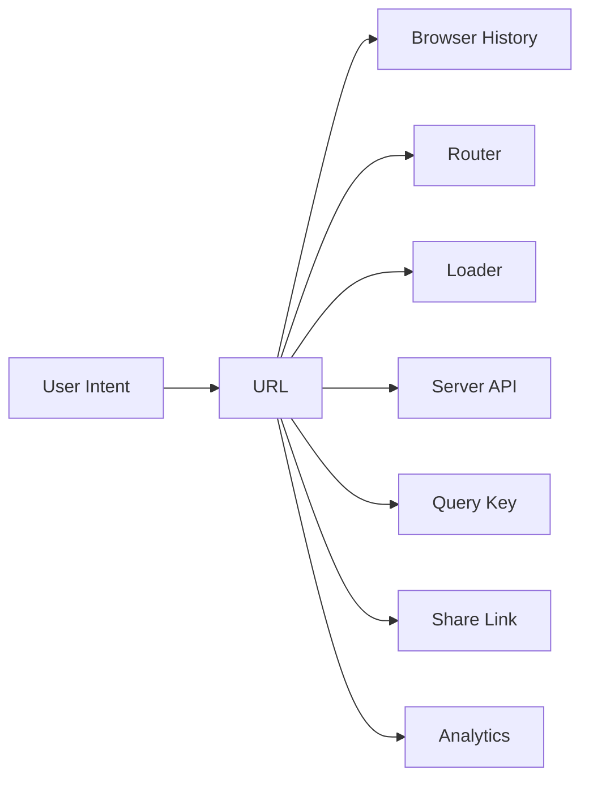
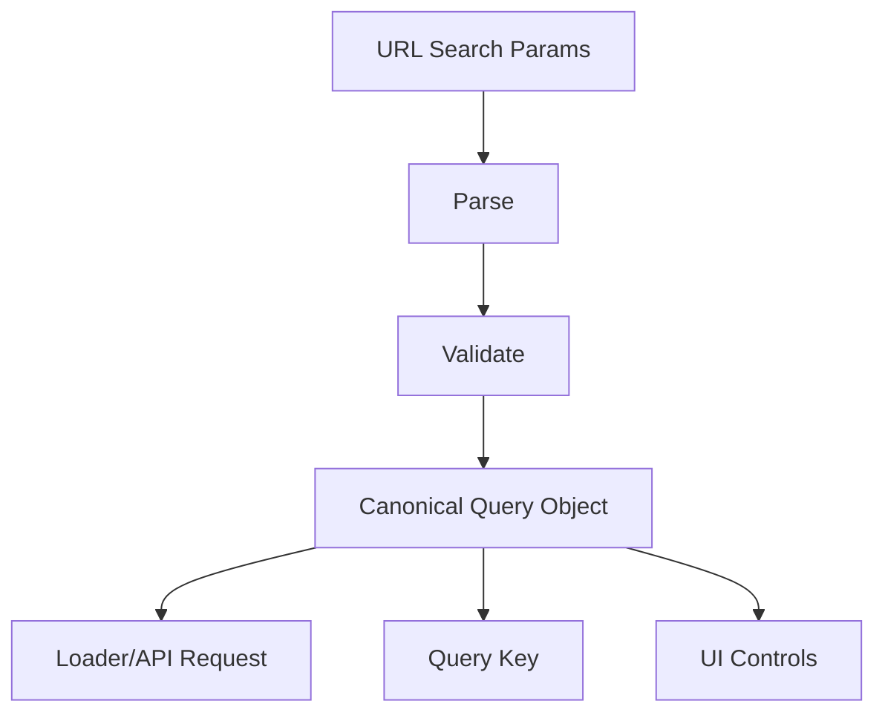
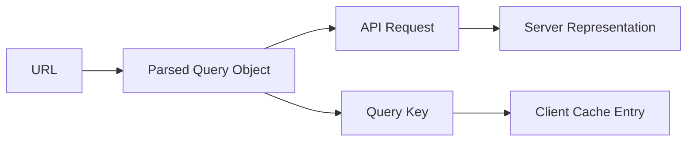
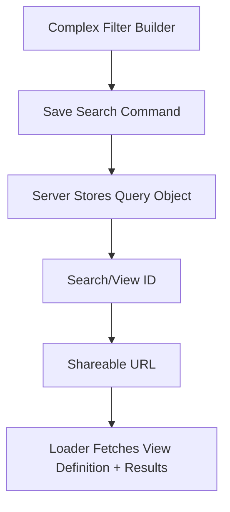

# Part 035 — URL as State, Query Params, and Navigation

> Target mental model: **the URL is not just an address. In a React application, it is a durable client-server state container with browser semantics, cache semantics, navigation semantics, and product semantics.**

Part 034 introduced loaders, actions, and fetchers.

This part focuses on the most underrated communication boundary in React apps: the URL.

Most engineers treat the URL as a routing detail.

Production systems treat it as a protocol.

A URL can answer:

```txt
What resource is the user looking at?
What representation of that resource is requested?
What filters, sort, page, tab, and view mode are active?
Can this state survive reload?
Can this state be shared?
Can this state be cached?
Can this state be restored from history?
Can the server reproduce the same screen?
```

That is not UI decoration.

That is client-server communication.

---

## 1. The URL Is a State Boundary

There are many places to store state in a React app.

| Location | Durable on reload? | Shareable? | Server visible? | Best For |
|---|---:|---:|---:|---|
| Component state | no | no | no | temporary UI interaction |
| Context/store | usually no | no | no | app-local state |
| Query cache | maybe | no by default | no | server-state replica |
| Local storage | yes | no | no | user/device preference |
| URL | yes | yes | yes | navigable state |
| Server session | yes | indirectly | yes | server-owned state |

The URL is special because it crosses boundaries.



A well-designed URL is a compact representation of user intent.

A poorly-designed URL is invisible global state.

---

## 2. The Core Rule

Use the URL for state when the answer to at least one of these questions is yes:

1. Should a reload preserve it?
2. Should a link preserve it?
3. Should the Back button understand it?
4. Should server rendering know it?
5. Should API/query cache identity include it?
6. Should analytics/debugging see it?
7. Would losing it surprise the user?

Examples that usually belong in the URL:

| State | URL? | Reason |
|---|---:|---|
| resource id | yes | identity |
| tab with distinct view | often | navigable sub-view |
| table filter | yes | representation selector |
| search keyword | yes | shareable query |
| sort order | yes | representation selector |
| page/cursor | yes | list position |
| selected row in master-detail | often | meaningful navigation |
| modal open | sometimes | if linkable or back-button relevant |
| input draft text before search commit | usually no | transient draft |
| dropdown open | no | ephemeral UI |
| hover state | no | ephemeral UI |
| auth token | never | secret |
| PII-sensitive raw value | usually no | privacy/logging risk |

The URL should hold **committed navigable state**, not every temporary keystroke.

---

## 3. URL Parts as Different State Types

A URL is not one bucket.

Each part has a different meaning.

```txt
https://app.example.com/cases/CASE-123/events?status=open&sort=-createdAt&page=2#timeline
└────┬────┘ └───────┬──────┘ └───────┬────────┘ └─────────────────────┬────────────────────┘ └───┬────┘
 scheme        host              path                         search/query                 hash
```

For React client-server communication:

| Part | Meaning | Example | Should Affect Data Fetch? |
|---|---|---|---:|
| Scheme/host | origin/security boundary | `https://app.example.com` | yes, indirectly |
| Path | resource identity / route | `/cases/CASE-123` | yes |
| Search params | representation controls | `?status=open&sort=-createdAt` | often yes |
| Hash | document fragment / client-only anchor | `#timeline` | usually no server fetch |
| Navigation state | router ephemeral state | `{ from: "list" }` | no durable fetch |

The path says **what**.

The query string says **which representation**.

The hash says **where inside the document**.

Router navigation state says **temporary transition context**.

Do not mix these roles casually.

---

## 4. Path Params Are Resource Identity

A path parameter should normally identify a resource or route shape.

Good:

```txt
/cases/CASE-123
/users/U-42/settings
/organizations/ORG-9/projects/PROJ-2
```

Weak:

```txt
/cases?caseId=CASE-123
/page?screen=case-detail&id=CASE-123
/app?route=cases&id=CASE-123
```

A resource identity is not a filter.

It is the primary object the page is about.

```tsx
import { useParams } from "react-router";

export function CaseRoute() {
  const { caseId } = useParams();

  if (!caseId) {
    throw new Error("Route invariant violated: caseId is required");
  }

  return <CaseScreen caseId={caseId} />;
}
```

At the loader level:

```tsx
export async function loader({ params, request }: LoaderFunctionArgs) {
  const caseId = params.caseId;

  if (!caseId) {
    throw new Response("Missing case id", { status: 400 });
  }

  return api.cases.getCase({ caseId, signal: request.signal });
}
```

Path param invariant:

```txt
If changing the value means the user is looking at a different primary resource,
it probably belongs in the path.
```

---

## 5. Search Params Are Representation Controls

Search params should describe the requested representation of a resource collection or screen.

```txt
/cases?status=open&assignee=me&sort=-createdAt&page=2
```

This means:

```txt
Give me the cases collection,
filtered by status=open,
assigned to me,
sorted newest first,
on page 2.
```

That is a fetch contract.



A mature app never lets arbitrary `URLSearchParams` leak everywhere.

It converts raw URL strings into a typed query object.

---

## 6. Raw URLSearchParams Are Not Domain State

`URLSearchParams` gives you strings.

Your app needs domain values.

Bad:

```tsx
const [searchParams] = useSearchParams();

const page = Number(searchParams.get("page"));
const status = searchParams.get("status");
const showArchived = searchParams.get("archived") === "true";

const query = useQuery({
  queryKey: ["cases", page, status, showArchived],
  queryFn: () => api.cases.search({ page, status, showArchived })
});
```

This spreads parsing rules through components.

Better:

```tsx
type CaseListQuery = {
  status: "open" | "closed" | "all";
  assignee: "me" | "all";
  sort: "createdAt.desc" | "createdAt.asc" | "priority.desc";
  page: number;
  archived: boolean;
};

const DEFAULT_CASE_LIST_QUERY: CaseListQuery = {
  status: "open",
  assignee: "all",
  sort: "createdAt.desc",
  page: 1,
  archived: false
};

function parseCaseListQuery(search: string): CaseListQuery {
  const params = new URLSearchParams(search);

  const status = parseEnum(params.get("status"), ["open", "closed", "all"], "open");
  const assignee = parseEnum(params.get("assignee"), ["me", "all"], "all");
  const sort = parseEnum(
    params.get("sort"),
    ["createdAt.desc", "createdAt.asc", "priority.desc"],
    "createdAt.desc"
  );

  return {
    status,
    assignee,
    sort,
    page: parsePositiveInt(params.get("page"), 1),
    archived: params.get("archived") === "true"
  };
}

function parseEnum<T extends string>(
  value: string | null,
  allowed: readonly T[],
  fallback: T
): T {
  return value && allowed.includes(value as T) ? (value as T) : fallback;
}

function parsePositiveInt(value: string | null, fallback: number): number {
  if (!value) return fallback;
  const parsed = Number(value);
  return Number.isInteger(parsed) && parsed > 0 ? parsed : fallback;
}
```

The component consumes typed state:

```tsx
function CaseListRoute() {
  const location = useLocation();
  const query = parseCaseListQuery(location.search);

  return <CaseList query={query} />;
}
```

The app should have one parser per URL-owned domain state.

---

## 7. Serialization Must Be Canonical

Parsing is only half of the problem.

You also need stable serialization.

Bad serialization creates cache fragmentation:

```txt
/cases?status=open&page=1
/cases?page=1&status=open
/cases?status=open
/cases?status=open&page=01
/cases?status=OPEN&page=1
```

These may represent the same state.

If your app treats them as different states, you get:

- duplicate cache entries
- confusing history entries
- inconsistent analytics
- duplicate server requests
- broken share links
- unstable tests

Canonicalization gives one URL per logical state.

```tsx
function serializeCaseListQuery(query: CaseListQuery): string {
  const params = new URLSearchParams();

  if (query.status !== DEFAULT_CASE_LIST_QUERY.status) {
    params.set("status", query.status);
  }

  if (query.assignee !== DEFAULT_CASE_LIST_QUERY.assignee) {
    params.set("assignee", query.assignee);
  }

  if (query.sort !== DEFAULT_CASE_LIST_QUERY.sort) {
    params.set("sort", query.sort);
  }

  if (query.page !== DEFAULT_CASE_LIST_QUERY.page) {
    params.set("page", String(query.page));
  }

  if (query.archived !== DEFAULT_CASE_LIST_QUERY.archived) {
    params.set("archived", "true");
  }

  params.sort();
  const output = params.toString();
  return output ? `?${output}` : "";
}
```

Important design choice:

```txt
Default values should often be omitted from the URL.
```

That keeps URLs short and canonical.

But there are exceptions.

If a default value changes over time, omitting it may change the meaning of old links.

Example:

```txt
/cases?sort=-createdAt
```

is more stable than:

```txt
/cases
```

if product might later change default sort.

Canonicalization is a product contract.

---

## 8. Use Search Params Through a Domain Adapter

React Router exposes `useSearchParams`.

Use it, but do not let every component manipulate raw strings.

```tsx
import { useMemo } from "react";
import { useSearchParams } from "react-router";

export function useCaseListUrlState() {
  const [searchParams, setSearchParams] = useSearchParams();

  const query = useMemo(() => {
    return parseCaseListQuery(searchParams.toString());
  }, [searchParams]);

  function updateQuery(patch: Partial<CaseListQuery>, options?: { replace?: boolean }) {
    const next: CaseListQuery = {
      ...query,
      ...patch
    };

    const nextSearch = serializeCaseListQuery(next);
    setSearchParams(new URLSearchParams(nextSearch), {
      replace: options?.replace ?? false
    });
  }

  return { query, updateQuery };
}
```

But this version has a subtle bug.

`new URLSearchParams(nextSearch)` accepts strings with or without `?`, but clarity matters.

Better:

```tsx
function toSearchParams(search: string): URLSearchParams {
  return new URLSearchParams(search.startsWith("?") ? search.slice(1) : search);
}

export function useCaseListUrlState() {
  const [searchParams, setSearchParams] = useSearchParams();

  const query = useMemo(() => {
    return parseCaseListQuery(searchParams.toString());
  }, [searchParams]);

  function updateQuery(patch: Partial<CaseListQuery>, options?: { replace?: boolean }) {
    const next = normalizeCaseListQuery({ ...query, ...patch });
    setSearchParams(toSearchParams(serializeCaseListQuery(next)), {
      replace: options?.replace ?? false
    });
  }

  return { query, updateQuery };
}
```

This hook gives UI components a domain API:

```tsx
function CaseFilters() {
  const { query, updateQuery } = useCaseListUrlState();

  return (
    <select
      value={query.status}
      onChange={(event) => {
        updateQuery({ status: event.target.value as CaseListQuery["status"], page: 1 });
      }}
    >
      <option value="open">Open</option>
      <option value="closed">Closed</option>
      <option value="all">All</option>
    </select>
  );
}
```

The UI never needs to know how `status` is serialized.

---

## 9. Updating Filters Should Reset Pagination

A common production bug:

```txt
User is on /cases?status=open&page=8.
User changes status=closed.
App navigates to /cases?status=closed&page=8.
Closed cases have only 1 page.
User sees empty result.
```

The URL is technically valid but semantically wrong.

Rule:

```txt
When a query parameter changes the result set identity,
reset pagination/cursor unless the user explicitly changed pagination.
```

Implementation:

```tsx
function updateFilter(patch: Partial<Pick<CaseListQuery, "status" | "assignee" | "archived">>) {
  updateQuery({ ...patch, page: 1 });
}

function updateSort(sort: CaseListQuery["sort"]) {
  updateQuery({ sort, page: 1 });
}

function updatePage(page: number) {
  updateQuery({ page });
}
```

Do not make pagination independent of filters.

It is derived from the result set.

---

## 10. Push vs Replace Is Product Semantics

Changing search params creates navigation.

But not all navigation should create a new history entry.

| Interaction | History Behavior | Why |
|---|---|---|
| Submit search form | push | user committed a new view |
| Click pagination | push | back should return to previous page |
| Change tab | push or replace | depends if tab is navigable |
| Type in debounced search box | replace while typing, push on commit | avoid 20 history entries |
| Toggle dense layout preference | replace or local storage | usually not meaningful history |
| Apply filter chip | push | meaningful committed state |
| Remove typo from query param canonicalization | replace | cleanup, not user action |

Example:

```tsx
function SearchBox() {
  const { query, updateQuery } = useCaseListUrlState();
  const [draft, setDraft] = useState(query.keyword ?? "");

  useEffect(() => {
    setDraft(query.keyword ?? "");
  }, [query.keyword]);

  return (
    <form
      onSubmit={(event) => {
        event.preventDefault();
        updateQuery({ keyword: draft.trim(), page: 1 }, { replace: false });
      }}
    >
      <input
        value={draft}
        onChange={(event) => setDraft(event.target.value)}
        placeholder="Search cases"
      />
      <button type="submit">Search</button>
    </form>
  );
}
```

For live search:

```tsx
function LiveSearchBox() {
  const { query, updateQuery } = useCaseListUrlState();
  const [draft, setDraft] = useState(query.keyword ?? "");

  useEffect(() => {
    const handle = window.setTimeout(() => {
      updateQuery({ keyword: draft.trim(), page: 1 }, { replace: true });
    }, 300);

    return () => window.clearTimeout(handle);
  }, [draft]);

  return <input value={draft} onChange={(event) => setDraft(event.target.value)} />;
}
```

But be careful.

This effect closes over `updateQuery`, which closes over `query`.

A safer implementation uses functional URL update or a stable adapter.

---

## 11. Avoid Naive Debounced URL Updates

This looks harmless:

```tsx
useEffect(() => {
  const handle = setTimeout(() => {
    updateQuery({ keyword: draft });
  }, 300);

  return () => clearTimeout(handle);
}, [draft]);
```

The problem is not debounce itself.

The problem is mixed ownership.

During the debounce window:

- the input draft is local
- the URL still contains old keyword
- loaders/query cache still use old keyword
- user might press Back
- route might change
- filter might change elsewhere

A robust model separates draft and committed state.

```tsx
type SearchDraftState = {
  draft: string;
  committed: string;
};
```

For critical search screens, prefer an explicit commit:

```tsx
<form onSubmit={commitSearch}>
  <input value={draft} onChange={updateDraft} />
  <button type="submit">Search</button>
</form>
```

For low-risk autosuggest, use live update with `replace: true`, cancellation, and clear pending status.

---

## 12. URL State Should Feed Query Keys

If URL params affect fetched data, they must affect cache identity.

Bad:

```tsx
useQuery({
  queryKey: ["cases"],
  queryFn: () => api.cases.search(query)
});
```

This creates cache collision.

Good:

```tsx
function caseListQueryKey(query: CaseListQuery) {
  return [
    "cases",
    "list",
    {
      status: query.status,
      assignee: query.assignee,
      sort: query.sort,
      page: query.page,
      archived: query.archived
    }
  ] as const;
}

function useCases(query: CaseListQuery) {
  return useQuery({
    queryKey: caseListQueryKey(query),
    queryFn: ({ signal }) => api.cases.search(query, { signal })
  });
}
```

The URL and the query key should agree on identity.



If the API request changes but the query key does not, the cache lies.

If the query key changes but the API request does not, the cache fragments.

---

## 13. Loader Integration

Route loaders should parse URL params at the boundary.

```tsx
export async function loader({ request }: LoaderFunctionArgs) {
  const url = new URL(request.url);
  const query = parseCaseListQuery(url.search);

  return api.cases.search(query, {
    signal: request.signal
  });
}
```

But if the route component and loader both parse query params separately, they can drift.

Use the same parser.

```tsx
// case-list-url-state.ts
export type CaseListQuery = { /* ... */ };
export function parseCaseListQuery(search: string): CaseListQuery { /* ... */ }
export function serializeCaseListQuery(query: CaseListQuery): string { /* ... */ }
export function normalizeCaseListQuery(query: CaseListQuery): CaseListQuery { /* ... */ }
```

Then:

```tsx
export async function loader({ request }: LoaderFunctionArgs) {
  const url = new URL(request.url);
  const query = parseCaseListQuery(url.search);
  const canonicalSearch = serializeCaseListQuery(query);

  if (canonicalSearch !== url.search) {
    throw redirect(`${url.pathname}${canonicalSearch}`, 301);
  }

  return api.cases.search(query, { signal: request.signal });
}
```

Canonical redirect prevents duplicate server-rendered pages and duplicate analytics.

For app-only screens, use `replace` instead of permanent redirect if SEO is irrelevant.

---

## 14. Canonicalization Should Not Surprise Users

This is good:

```txt
/cases?page=abc
→ /cases
```

This is questionable:

```txt
/cases?status=closed
→ /cases
```

because the user requested a real filter.

Canonicalization should clean invalid or redundant state.

It should not erase meaningful state unless the user lacks permission or the state is impossible.

When query params are invalid:

| Invalid Input | Response |
|---|---|
| `page=abc` | normalize to default page |
| `page=-1` | normalize to default page |
| `status=hacked` | normalize or show 400 depending domain |
| unknown param | ignore or preserve depending integration |
| duplicate scalar param | choose first/last with documented rule |
| forbidden filter | 403 or remove with explanation |

For regulated systems, silently ignoring invalid filters can be dangerous.

A user might think a filter is applied when it is not.

Prefer visible correction for high-risk filters.

---

## 15. Repeated Params vs Comma-Separated Params

Multi-value filters need a convention.

Option A: repeated params.

```txt
/cases?status=open&status=pending
```

Option B: comma-separated.

```txt
/cases?status=open,pending
```

Option C: indexed params.

```txt
/cases?status[0]=open&status[1]=pending
```

For browser-native `URLSearchParams`, repeated params are natural:

```tsx
const statuses = params.getAll("status");
```

Serializer:

```tsx
type Status = "open" | "pending" | "closed";

type CaseListQuery = {
  statuses: Status[];
};

function serializeStatuses(statuses: Status[], params: URLSearchParams) {
  for (const status of [...new Set(statuses)].sort()) {
    params.append("status", status);
  }
}
```

The `.sort()` is important.

These two should be the same state:

```txt
?status=open&status=pending
?status=pending&status=open
```

For arrays where order matters, do not sort.

But most filters are sets, not lists.

---

## 16. Unknown Params: Preserve or Drop?

Suppose your screen receives:

```txt
/cases?status=open&utm_source=newsletter
```

Should your `setSearchParams` preserve `utm_source`?

There is no universal answer.

| Param Type | Preserve? | Reason |
|---|---:|---|
| known app filter | yes | app state |
| tracking param | maybe | analytics attribution |
| unknown third-party param | usually yes during minor updates | avoid breaking integrations |
| invalid app param | no or normalize | prevent ambiguity |
| sensitive param | no | security |

A domain adapter can preserve unknown params explicitly:

```tsx
type ParsedUrlState<T> = {
  known: T;
  passthrough: URLSearchParams;
};

function parseCaseListUrl(search: string): ParsedUrlState<CaseListQuery> {
  const params = new URLSearchParams(search);
  const passthrough = new URLSearchParams(params);

  for (const key of ["status", "assignee", "sort", "page", "archived"]) {
    passthrough.delete(key);
  }

  return {
    known: parseCaseListQuery(search),
    passthrough
  };
}
```

Then serialize:

```tsx
function serializeWithPassthrough(query: CaseListQuery, passthrough: URLSearchParams) {
  const params = new URLSearchParams(passthrough);
  const appParams = toSearchParams(serializeCaseListQuery(query));

  for (const [key, value] of appParams) {
    params.append(key, value);
  }

  params.sort();
  const output = params.toString();
  return output ? `?${output}` : "";
}
```

But be cautious.

Preserving unknown params can preserve garbage forever.

---

## 17. URL State and Server API Contract

The frontend URL does not need to match backend query parameters exactly.

Frontend URL:

```txt
/cases?status=open&sort=createdAt.desc&page=2
```

Backend API:

```txt
GET /api/cases?filter.status=OPEN&orderBy=created_at&direction=desc&offset=50&limit=50
```

The adapter maps product-facing URL state to API-facing request state.

```tsx
function toCaseSearchRequest(query: CaseListQuery): CaseSearchRequest {
  return {
    status: query.status === "all" ? undefined : query.status.toUpperCase(),
    orderBy: mapSort(query.sort).field,
    direction: mapSort(query.sort).direction,
    offset: (query.page - 1) * PAGE_SIZE,
    limit: PAGE_SIZE,
    includeArchived: query.archived
  };
}
```

Do not expose backend implementation details in the product URL unless you intend to support them as public contract.

Bad:

```txt
/cases?db_col=created_at&dir=desc&offset=50
```

Good:

```txt
/cases?sort=createdAt.desc&page=2
```

The URL is user-facing API.

Treat it with compatibility discipline.

---

## 18. Navigation State Is Not URL State

React Router navigation can carry ephemeral state.

```tsx
navigate(`/cases/${caseId}`, {
  state: { from: "case-list", returnSearch: location.search }
});
```

This is useful for transition context.

But it is not durable.

It does not survive:

- copy link
- hard reload
- opening in a new tab
- server rendering
- external navigation

Use navigation state for enhancement, not correctness.

Bad:

```tsx
navigate(`/cases/${caseId}`, {
  state: { caseSummary }
});
```

Then detail page assumes `caseSummary` exists.

Good:

```tsx
navigate(`/cases/${caseId}`, {
  state: { returnTo: `${location.pathname}${location.search}` }
});
```

Then detail page still loads canonical data by ID.

---

## 19. Return Navigation: URL Beats History Guessing

Common pattern:

```tsx
<button onClick={() => navigate(-1)}>Back</button>
```

This is often wrong.

If the user opened the detail page directly, `navigate(-1)` may send them outside the app.

Better:

```tsx
const location = useLocation();
const returnTo = location.state?.returnTo ?? "/cases";

<Link to={returnTo}>Back to cases</Link>
```

Even better for shareable flows:

```txt
/cases/CASE-123?returnTo=/cases%3Fstatus%3Dopen
```

But putting return URLs in query params has security implications.

Validate same-origin internal paths only.

```tsx
function safeInternalReturnTo(value: string | null): string | null {
  if (!value) return null;
  if (!value.startsWith("/")) return null;
  if (value.startsWith("//")) return null;
  return value;
}
```

Do not allow open redirects.

---

## 20. URL State and Authorization

A URL can request data the user is not allowed to see.

```txt
/cases?assignee=someone-else
/cases?tenant=TENANT-B
/reports?scope=all
```

Client-side hiding is not authorization.

Server/API must enforce authorization.

The client should also avoid generating impossible or forbidden URLs.

```tsx
function visibleAssigneeOptions(user: CurrentUser): AssigneeFilter[] {
  if (user.permissions.includes("cases:view-all")) {
    return ["all", "me", "team"];
  }

  return ["me"];
}
```

But loaders must still validate.

```tsx
export async function loader({ request }: LoaderFunctionArgs) {
  const url = new URL(request.url);
  const query = parseCaseListQuery(url.search);

  if (query.assignee === "all" && !canViewAllCases(await getCurrentUser(request))) {
    throw new Response("Forbidden", { status: 403 });
  }

  return api.cases.search(query, { signal: request.signal });
}
```

URL state is user input.

Treat it as hostile.

---

## 21. URL State and Privacy

URLs leak.

They can appear in:

- browser history
- server logs
- proxy logs
- analytics
- screenshots
- copied links
- support tickets
- Referer headers
- observability traces

Do not put secrets in URLs.

Usually avoid putting sensitive PII in URLs.

Bad:

```txt
/customers?email=alice@example.com
/cases?nationalId=1234567890
/reports?token=eyJhbGciOi...
```

Safer alternatives:

| Need | Safer Pattern |
|---|---|
| search by sensitive value | POST search command with server-side search session id |
| access private file | short-lived signed URL with strict scope, no broad token |
| preserve large filter | saved view id |
| complex investigation query | server-side query object keyed by id |
| invite/auth token | one-time token with minimal logging and redirect cleanup |

Example saved view:

```txt
/cases/views/VIEW-123
```

The URL contains an identifier, not the sensitive predicate.

---

## 22. Large Query State Should Become a Resource

Some filters outgrow query params.

Symptoms:

- URL becomes unreadable
- browser/proxy length limits become a concern
- filters contain nested boolean logic
- filters contain sensitive data
- filter state should be named, shared, audited, or versioned

Move from query string to resource.

```txt
/cases?status=open&assignee=me&page=2
```

is fine.

```txt
/cases?query=%7B%22and%22%3A%5B%7B...very large JSON...%7D%5D%7D
```

is not.

Better:

```txt
/cases/searches/SEARCH-123
/cases/views/V-2026-07-enforcement-risk
```

Then the server owns the complex query object.



This is especially important in regulatory/case management systems.

A saved view can be audited, versioned, permissioned, and reproduced.

---

## 23. The URL Should Not Mirror Every Store Field

A common overcorrection:

```txt
Everything must be in the URL.
```

No.

The URL should hold navigable state.

Do not encode:

- every expanded accordion
- every input draft
- every hover/selection interaction
- every cache hint
- every component flag
- every internal wizard step if not navigable

Bad:

```txt
/cases?panel1=open&panel2=closed&rowHover=123&draftName=abc&isDropdownOpen=true
```

The URL should be stable enough for humans, support, logs, and servers.

If it looks like a serialized Redux store, something is wrong.

---

## 24. Master-Detail URL Design

Consider a cases page with list and detail.

Option A:

```txt
/cases?status=open
/cases/CASE-123
```

Option B:

```txt
/cases?status=open&selected=CASE-123
```

Option C:

```txt
/cases/CASE-123?status=open
```

Trade-off:

| Design | Good For | Risk |
|---|---|---|
| separate list/detail path | simple mental model | loses list context unless return state preserved |
| selected id in query | split-pane workspace | selected resource becomes secondary |
| detail path with list query preserved | detail with return context | detail URL polluted with list params |

For split-pane apps, query-selected detail may be correct:

```txt
/cases?status=open&selected=CASE-123
```

For document-like detail pages, path identity is usually better:

```txt
/cases/CASE-123
```

Do not choose based only on route convenience.

Choose based on product semantics.

---

## 25. Tabs: Path or Query Param?

Tabs are tricky.

Some tabs are just presentation.

Some tabs are navigable sub-resources.

Presentation tab:

```txt
/cases/CASE-123?tab=summary
```

Sub-resource tab:

```txt
/cases/CASE-123/events
/cases/CASE-123/documents
/cases/CASE-123/decisions
```

Decision rule:

```txt
If the tab has independent data loading, permissions, deep links, or error boundaries,
make it a nested route.
```

Use query param when tab is lightweight view mode.

Use path when tab is a real sub-screen.

---

## 26. Cursor Pagination in URLs

Offset/page pagination is easy:

```txt
/cases?page=3
```

Cursor pagination is harder:

```txt
/cases?after=eyJjcmVhdGVkQXQiOiIyMDI2LTA3LTA3..."
```

Cursor URLs are often opaque.

Trade-offs:

| Pagination | URL Friendly | Stable Under Inserts | Human Readable |
|---|---:|---:|---:|
| page number | yes | no | yes |
| offset | yes | no | yes |
| cursor | partly | yes | no |

For user-facing administrative screens, page number is often acceptable.

For feeds and high-write lists, cursor is safer.

Cursor URL model:

```tsx
type CaseListQuery = {
  status: "open" | "closed" | "all";
  after?: string;
  before?: string;
};
```

But changing filters must clear cursors:

```tsx
function updateStatus(status: CaseListQuery["status"]) {
  updateQuery({ status, after: undefined, before: undefined });
}
```

A cursor only means something within a specific result set.

---

## 27. Sorting Must Be Explicit and Stable

Sorting is a contract between client and server.

Bad:

```txt
/cases?sort=newest
```

What is newest?

- created time?
- received time?
- updated time?
- event time?
- imported time?

Better:

```txt
/cases?sort=createdAt.desc
/cases?sort=priority.desc
/cases?sort=dueDate.asc
```

The API can map these to backend fields.

Also require stable tiebreakers server-side.

```sql
ORDER BY created_at DESC, id DESC
```

Otherwise pagination can duplicate or skip records.

The URL may not expose the tiebreaker, but the server contract must include it.

---

## 28. Query Param Versioning

URLs are long-lived.

People bookmark them.

Support tickets include them.

Emails contain them.

If a query param changes meaning, you need compatibility.

Old:

```txt
/cases?sort=-createdAt
```

New:

```txt
/cases?sort=createdAt.desc
```

Parser can support both:

```tsx
function parseSort(value: string | null): CaseListQuery["sort"] {
  switch (value) {
    case "-createdAt":
    case "createdAt.desc":
      return "createdAt.desc";
    case "createdAt":
    case "createdAt.asc":
      return "createdAt.asc";
    case "priority.desc":
      return "priority.desc";
    default:
      return DEFAULT_CASE_LIST_QUERY.sort;
  }
}
```

Serializer emits only the new canonical format.

This gives migration without breaking old links.

---

## 29. URL and Analytics

URL state shapes analytics.

A page view for:

```txt
/cases?status=open&page=1
```

is different from:

```txt
/cases?status=closed&page=1
```

But excessive URL noise pollutes analytics.

Canonicalization helps.

Also consider redaction.

Analytics event:

```ts
type CaseListViewedEvent = {
  page: "case-list";
  status: "open" | "closed" | "all";
  sort: string;
  pageNumber: number;
  hasKeyword: boolean;
};
```

Do not blindly send raw query strings.

```tsx
analytics.track("Case List Viewed", {
  status: query.status,
  sort: query.sort,
  pageNumber: query.page,
  hasKeyword: Boolean(query.keyword)
});
```

The same applies to logs and traces.

---

## 30. URL State and Accessibility

URL changes can update content without full page reload.

Screen readers need meaningful feedback.

When filters change and results reload:

```tsx
function CaseResultsStatus({ query, result }: Props) {
  return (
    <div role="status" aria-live="polite">
      Showing {result.total} cases for status {query.status}
    </div>
  );
}
```

For pending navigation:

```tsx
function CaseListPendingIndicator() {
  const navigation = useNavigation();
  const isLoading = navigation.state === "loading";

  return (
    <section aria-busy={isLoading}>
      {isLoading ? <p role="status">Updating results…</p> : null}
      <Outlet />
    </section>
  );
}
```

Changing URL state is changing screen state.

Make it perceivable.

---

## 31. End-to-End Example: Case List URL State

File layout:

```txt
routes/
  cases/
    route.tsx
    case-list-url-state.ts
    case-list-api.ts
    case-list-components.tsx
```

Domain URL module:

```tsx
export type CaseListQuery = {
  status: "open" | "closed" | "all";
  assignee: "me" | "all";
  sort: "createdAt.desc" | "createdAt.asc" | "priority.desc";
  page: number;
  keyword?: string;
};

export const DEFAULT_CASE_LIST_QUERY: CaseListQuery = {
  status: "open",
  assignee: "all",
  sort: "createdAt.desc",
  page: 1
};

export function parseCaseListQuery(search: string): CaseListQuery {
  const params = new URLSearchParams(search);

  const keyword = params.get("q")?.trim() || undefined;

  return normalizeCaseListQuery({
    status: parseEnum(params.get("status"), ["open", "closed", "all"], "open"),
    assignee: parseEnum(params.get("assignee"), ["me", "all"], "all"),
    sort: parseSort(params.get("sort")),
    page: parsePositiveInt(params.get("page"), 1),
    keyword
  });
}

export function normalizeCaseListQuery(query: CaseListQuery): CaseListQuery {
  return {
    ...query,
    page: Math.max(1, Math.floor(query.page || 1)),
    keyword: query.keyword?.trim() || undefined
  };
}

export function serializeCaseListQuery(input: CaseListQuery): string {
  const query = normalizeCaseListQuery(input);
  const params = new URLSearchParams();

  if (query.status !== "open") params.set("status", query.status);
  if (query.assignee !== "all") params.set("assignee", query.assignee);
  if (query.sort !== "createdAt.desc") params.set("sort", query.sort);
  if (query.page !== 1) params.set("page", String(query.page));
  if (query.keyword) params.set("q", query.keyword);

  params.sort();
  const value = params.toString();
  return value ? `?${value}` : "";
}
```

Route loader:

```tsx
export async function loader({ request }: LoaderFunctionArgs) {
  const url = new URL(request.url);
  const query = parseCaseListQuery(url.search);
  const canonicalSearch = serializeCaseListQuery(query);

  if (canonicalSearch !== url.search) {
    throw redirect(`${url.pathname}${canonicalSearch}`);
  }

  return api.cases.search(toCaseSearchRequest(query), {
    signal: request.signal
  });
}
```

Component:

```tsx
export default function CaseListRoute() {
  const data = useLoaderData<typeof loader>();
  const [searchParams, setSearchParams] = useSearchParams();

  const query = useMemo(
    () => parseCaseListQuery(searchParams.toString()),
    [searchParams]
  );

  function setQuery(patch: Partial<CaseListQuery>, options?: { replace?: boolean }) {
    const next = normalizeCaseListQuery({ ...query, ...patch });
    setSearchParams(toSearchParams(serializeCaseListQuery(next)), {
      replace: options?.replace ?? false
    });
  }

  return (
    <main>
      <CaseFilters
        query={query}
        onStatusChange={(status) => setQuery({ status, page: 1 })}
        onAssigneeChange={(assignee) => setQuery({ assignee, page: 1 })}
        onSortChange={(sort) => setQuery({ sort, page: 1 })}
      />

      <CaseTable cases={data.items} />

      <Pagination
        page={query.page}
        totalPages={data.totalPages}
        onPageChange={(page) => setQuery({ page })}
      />
    </main>
  );
}
```

This keeps URL parsing out of leaf components.

---

## 32. Testing URL State

Test parser and serializer without React.

```tsx
describe("case list url state", () => {
  it("parses defaults", () => {
    expect(parseCaseListQuery("")).toEqual({
      status: "open",
      assignee: "all",
      sort: "createdAt.desc",
      page: 1
    });
  });

  it("normalizes invalid page", () => {
    expect(parseCaseListQuery("?page=-10").page).toBe(1);
    expect(parseCaseListQuery("?page=abc").page).toBe(1);
  });

  it("serializes canonically", () => {
    expect(
      serializeCaseListQuery({
        status: "open",
        assignee: "all",
        sort: "createdAt.desc",
        page: 1
      })
    ).toBe("");
  });

  it("round trips meaningful state", () => {
    const input: CaseListQuery = {
      status: "closed",
      assignee: "me",
      sort: "priority.desc",
      page: 2,
      keyword: "late filing"
    };

    expect(parseCaseListQuery(serializeCaseListQuery(input))).toEqual(input);
  });
});
```

Test navigation behavior separately.

```tsx
it("resets page when status changes", async () => {
  renderWithRouter(<CaseListRoute />, {
    initialEntries: ["/cases?status=open&page=8"]
  });

  await user.selectOptions(screen.getByLabelText("Status"), "closed");

  expect(window.location.search).toBe("?status=closed");
});
```

Do not rely only on visual tests.

URL state is protocol state.

---

## 33. Common Failure Modes

### Failure Mode 1: Hidden State Not in URL

User filters a list.

Then they copy link to teammate.

Teammate sees default list.

Root cause:

```txt
Filter state stored only in component/store.
```

Fix:

```txt
Committed filters belong in URL.
```

---

### Failure Mode 2: Sensitive State in URL

User searches by national ID.

The full ID appears in server logs and analytics.

Root cause:

```txt
URL used as general-purpose storage.
```

Fix:

```txt
Use POST search/session resource or redacted query.
```

---

### Failure Mode 3: Cache Collision

`/cases?status=open` and `/cases?status=closed` show same cached data.

Root cause:

```txt
Query key ignored URL params.
```

Fix:

```txt
Parsed URL query object must be part of cache identity.
```

---

### Failure Mode 4: Cache Fragmentation

The same logical state creates many cache entries.

Root cause:

```txt
No canonical serialization.
```

Fix:

```txt
Normalize and serialize with stable defaults/order.
```

---

### Failure Mode 5: Back Button Becomes Useless

Typing search creates one history entry per character.

Root cause:

```txt
Every draft change uses push navigation.
```

Fix:

```txt
Use local draft + explicit commit, or replace during debounce.
```

---

### Failure Mode 6: Invalid Filters Silently Disappear

User opens a link with forbidden or unknown filter.

App silently drops it and shows broader results.

Root cause:

```txt
Parser uses defaults without user-visible correction.
```

Fix:

```txt
For high-risk filters, show correction or reject with clear error.
```

---

## 34. Production Checklist

Before shipping URL-driven state, ask:

- Is every URL param owned by one parser/serializer module?
- Are defaults explicit?
- Are invalid values handled intentionally?
- Are sensitive values excluded or redacted?
- Is serialization canonical?
- Do query keys match parsed URL state?
- Do loaders and components share the same parser?
- Do filter changes reset pagination/cursors?
- Is push vs replace chosen intentionally?
- Does Back button behave like product expects?
- Are unknown params preserved or dropped intentionally?
- Are old param formats supported if links exist?
- Are server APIs protected against hostile URL input?
- Are analytics/logs redacted?
- Are parser/serializer round-trip tests present?

---

## 35. The Practical Heuristic

When designing React client-server communication, ask:

```txt
If I send this link to another engineer,
should they see the same screen state?
```

If yes, the state probably belongs in the URL.

Then ask:

```txt
If this URL appears in logs,
would that be safe?
```

If no, the state needs a safer representation.

This tension is the real design work.

---

## 36. Final Mental Model

A URL is a small, durable command to reconstruct a screen.

It is not just a string.

It is:

- resource identity
- representation selector
- browser history entry
- server loader input
- cache key ingredient
- shareable product state
- analytics dimension
- security/privacy surface

In simple apps, URLs route pages.

In mature apps, URLs encode stable intent.

That is why URL design belongs in client-server communication.

