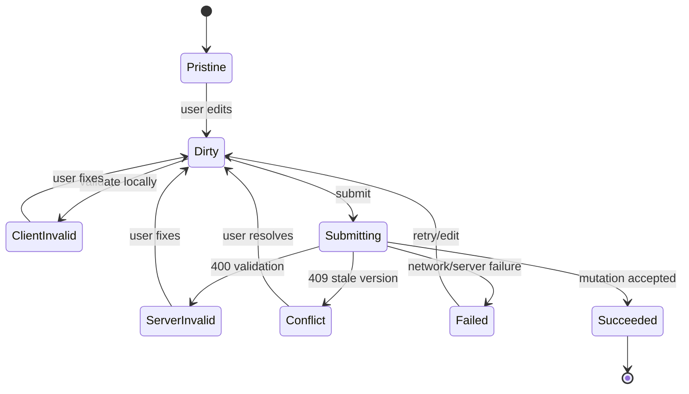
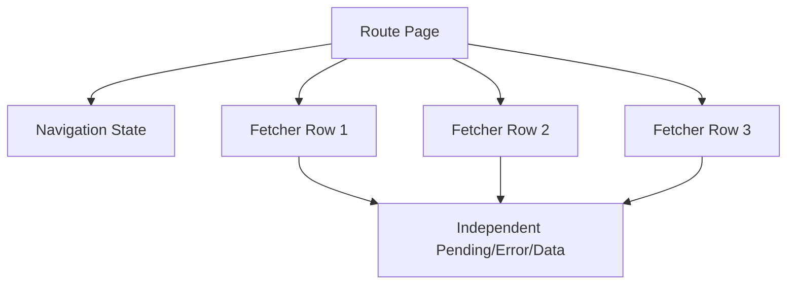
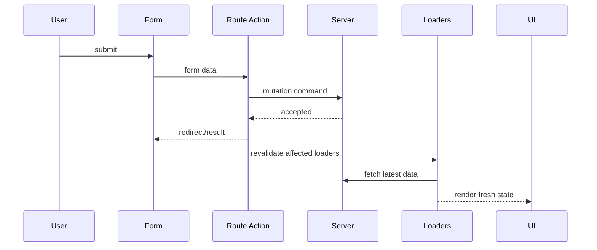
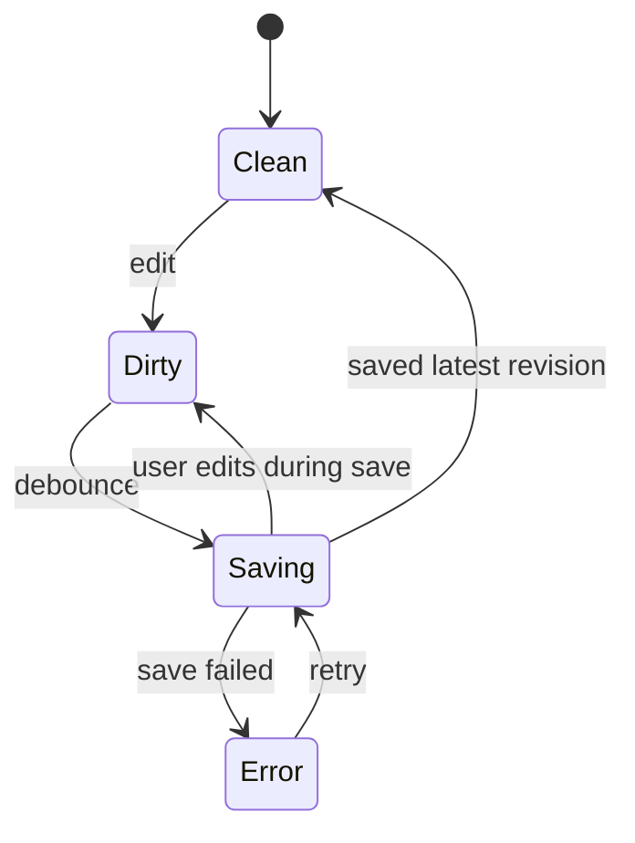
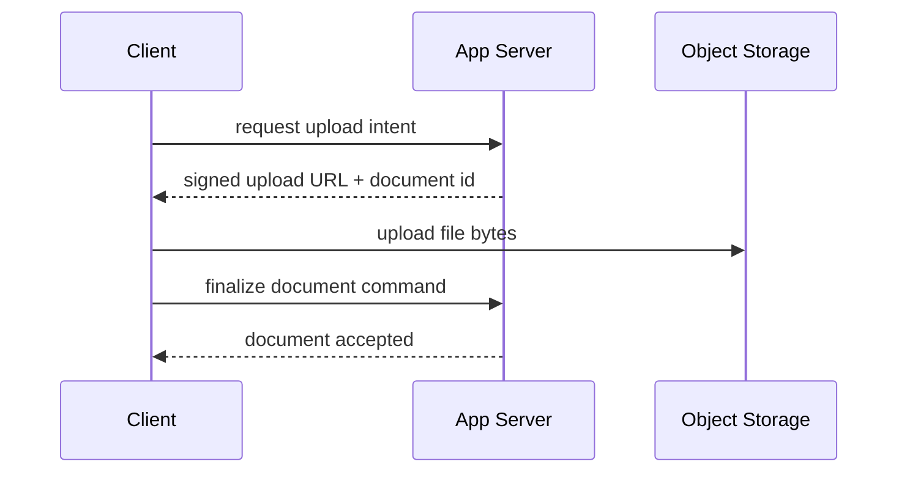

# Part 036 — Form Submission Without Spaghetti State

> Target mental model: **a form is not just a collection of inputs. It is a command boundary between local user intent and server-owned state.**

Part 035 treated the URL as durable navigation state.

This part treats forms as structured mutation communication.

Most React form bugs happen because engineers model submission as:

```txt
read input values → call API → set some state
```

That is too small.

A production form has a lifecycle:

```txt
initial data
local draft
client constraint validation
submission intent
transport encoding
server validation
mutation execution
conflict detection
response mapping
cache/loader revalidation
success navigation or inline result
error recovery
```

If this lifecycle is not explicit, it spreads into state variables:

```tsx
const [name, setName] = useState("");
const [email, setEmail] = useState("");
const [errors, setErrors] = useState({});
const [serverErrors, setServerErrors] = useState({});
const [isSubmitting, setIsSubmitting] = useState(false);
const [isSuccess, setIsSuccess] = useState(false);
const [isDirty, setIsDirty] = useState(false);
const [lastSubmitted, setLastSubmitted] = useState(null);
const [conflict, setConflict] = useState(null);
```

That is not architecture.

That is state debris.

---

## 1. The Form Lifecycle

A form submission is a command.



The command may be rejected before it reaches domain mutation.

It may reach the server but fail validation.

It may mutate successfully but the client may not receive the response.

It may succeed and require revalidation of route data.

A good form architecture has a place for each state.

---

## 2. Native Form Semantics Are a Feature

HTML forms already define a client-server protocol:

- inputs contribute name/value pairs
- buttons can be submitters
- forms have methods and actions
- browsers can encode data
- file inputs work through multipart form data
- disabled controls are not submitted
- validation attributes can block submission
- pressing Enter submits the form
- password managers understand fields
- accessibility tools understand form controls

React should not erase this protocol unless there is a strong reason.

A mature React form often starts with native semantics, then enhances.

```tsx
<form method="post" action="/cases">
  <label>
    Title
    <input name="title" required minLength={3} />
  </label>

  <label>
    Priority
    <select name="priority" defaultValue="normal">
      <option value="low">Low</option>
      <option value="normal">Normal</option>
      <option value="high">High</option>
    </select>
  </label>

  <button type="submit">Create case</button>
</form>
```

This is not outdated.

It is the baseline protocol.

---

## 3. React Router Form as Progressive Enhancement

React Router's `<Form>` keeps form semantics but routes submission through actions and navigation state.

```tsx
import { Form, useActionData, useNavigation } from "react-router";

export async function action({ request }: ActionFunctionArgs) {
  const formData = await request.formData();

  const title = String(formData.get("title") ?? "").trim();

  if (title.length < 3) {
    return {
      ok: false,
      fieldErrors: {
        title: "Title must be at least 3 characters."
      }
    };
  }

  const created = await api.cases.create({ title }, { signal: request.signal });

  return redirect(`/cases/${created.id}`);
}

export default function NewCaseRoute() {
  const actionData = useActionData<typeof action>();
  const navigation = useNavigation();
  const isSubmitting = navigation.state === "submitting";

  return (
    <Form method="post" aria-busy={isSubmitting}>
      <label>
        Title
        <input
          name="title"
          required
          minLength={3}
          aria-invalid={Boolean(actionData?.fieldErrors?.title)}
          aria-describedby="title-error"
        />
      </label>

      {actionData?.fieldErrors?.title ? (
        <p id="title-error" role="alert">
          {actionData.fieldErrors.title}
        </p>
      ) : null}

      <button type="submit" disabled={isSubmitting}>
        {isSubmitting ? "Creating…" : "Create case"}
      </button>
    </Form>
  );
}
```

Notice what disappeared:

- no manual `fetch`
- no manual `preventDefault`
- no local `isSubmitting` flag
- no manual redirect after success
- no ad hoc revalidation logic

The route action owns the command.

The router owns submission lifecycle.

The component owns presentation.

---

## 4. The Anti-Pattern: Form as Random Component State

Bad pattern:

```tsx
function NewCaseForm() {
  const [title, setTitle] = useState("");
  const [priority, setPriority] = useState("normal");
  const [errors, setErrors] = useState<Record<string, string>>({});
  const [isSubmitting, setIsSubmitting] = useState(false);

  async function submit() {
    setIsSubmitting(true);
    setErrors({});

    try {
      const created = await api.cases.create({ title, priority });
      navigate(`/cases/${created.id}`);
    } catch (error) {
      setErrors(toErrors(error));
    } finally {
      setIsSubmitting(false);
    }
  }

  return <>{/* many controlled inputs */}</>;
}
```

This is not always wrong.

But it is often over-owned by the component.

The component now owns:

- input draft
- validation mapping
- network command
- pending state
- error taxonomy
- redirect
- cache invalidation
- double-submit control
- retry behavior

That coupling grows badly.

Better architecture separates responsibilities.

---

## 5. Ownership Model for Forms

| Concern | Typical Owner |
|---|---|
| Input draft | DOM or local component/form library |
| Client constraints | HTML attributes + optional client validation |
| Domain validation | server/action |
| Mutation execution | action/API command |
| Pending navigation/submission | router/query mutation state |
| Server field errors | action result |
| Success redirect | action/server/router |
| Cache revalidation | router/query layer |
| Conflict resolution | route/action + domain UI |
| Idempotency | client command id + server enforcement |

The component should not own everything.

It should render the form state produced by the communication layer.

---

## 6. Controlled vs Uncontrolled Is Not a Religion

Controlled input:

```tsx
<input value={title} onChange={(event) => setTitle(event.target.value)} />
```

Uncontrolled input:

```tsx
<input name="title" defaultValue={initialTitle} />
```

Controlled forms are useful when:

- input affects immediate UI logic
- field values drive derived previews
- complex custom widgets require explicit state
- form library manages validation and dirtiness
- autosave needs precise change tracking

Uncontrolled/native forms are useful when:

- values are only needed on submit
- form is large and simple
- you want less rerender pressure
- progressive enhancement matters
- browser autofill/password managers should work naturally
- React Router actions handle submission

Production rule:

```txt
Control the fields whose draft state matters before submit.
Let the DOM own fields that only matter at submit.
```

Do not turn every input into controlled state by default.

---

## 7. FormData Is a Command Payload

`FormData` represents submitted name/value pairs.

```tsx
export async function action({ request }: ActionFunctionArgs) {
  const formData = await request.formData();

  const command = parseCreateCaseForm(formData);

  if (!command.ok) {
    return command.error;
  }

  const result = await api.cases.create(command.value, {
    signal: request.signal
  });

  return redirect(`/cases/${result.id}`);
}
```

Parser:

```tsx
type CreateCaseCommand = {
  title: string;
  priority: "low" | "normal" | "high";
  description?: string;
};

type ParseResult<T> =
  | { ok: true; value: T }
  | { ok: false; error: FormErrorResponse };

type FormErrorResponse = {
  ok: false;
  fieldErrors: Record<string, string>;
  formError?: string;
  values?: Record<string, string>;
};

function parseCreateCaseForm(formData: FormData): ParseResult<CreateCaseCommand> {
  const title = String(formData.get("title") ?? "").trim();
  const priority = String(formData.get("priority") ?? "normal");
  const description = String(formData.get("description") ?? "").trim();

  const fieldErrors: Record<string, string> = {};

  if (title.length < 3) {
    fieldErrors.title = "Title must be at least 3 characters.";
  }

  if (!["low", "normal", "high"].includes(priority)) {
    fieldErrors.priority = "Priority is invalid.";
  }

  if (Object.keys(fieldErrors).length > 0) {
    return {
      ok: false,
      error: {
        ok: false,
        fieldErrors,
        values: {
          title,
          priority,
          description
        }
      }
    };
  }

  return {
    ok: true,
    value: {
      title,
      priority: priority as CreateCaseCommand["priority"],
      description: description || undefined
    }
  };
}
```

The parser is a boundary.

Do not let raw `FormData` leak into domain services.

---

## 8. Preserve Values After Server Validation Errors

If the server rejects a form, the user should not lose their input.

With uncontrolled fields, send values back in action data.

```tsx
export default function NewCaseRoute() {
  const actionData = useActionData<typeof action>();

  return (
    <Form method="post">
      <input
        name="title"
        defaultValue={actionData?.values?.title ?? ""}
        aria-invalid={Boolean(actionData?.fieldErrors?.title)}
      />

      <select
        name="priority"
        defaultValue={actionData?.values?.priority ?? "normal"}
      >
        <option value="low">Low</option>
        <option value="normal">Normal</option>
        <option value="high">High</option>
      </select>

      <textarea
        name="description"
        defaultValue={actionData?.values?.description ?? ""}
      />
    </Form>
  );
}
```

But note a subtlety.

`defaultValue` is read at mount.

If the same component instance stays mounted and `actionData` changes, uncontrolled inputs may not update the way you expect.

Common strategies:

1. Use controlled values for fields that must be reset by server result.
2. Key the form by a submission/result version.
3. Use React Router's navigation/action lifecycle and avoid replacing values unnecessarily.
4. Use a form library when complex controlled behavior is required.

Uncontrolled is not “no state.”

It means the DOM owns the current draft.

---

## 9. Server Validation Is the Source of Truth

Client validation improves feedback.

Server validation enforces correctness.

Client checks can be bypassed.

Server validation cannot be optional.

```tsx
function validateCreateCase(command: CreateCaseCommand, user: CurrentUser): DomainValidationResult {
  const errors: Record<string, string> = {};

  if (!command.title.trim()) {
    errors.title = "Title is required.";
  }

  if (command.priority === "high" && !user.permissions.includes("cases:create-high-priority")) {
    errors.priority = "You are not allowed to create high-priority cases.";
  }

  return Object.keys(errors).length
    ? { ok: false, fieldErrors: errors }
    : { ok: true };
}
```

Do not put authorization-sensitive validation only in the browser.

The browser can guide.

The server decides.

---

## 10. Field Errors vs Form Errors

Separate field errors from form-level errors.

```ts
type ActionResult =
  | {
      ok: false;
      kind: "validation";
      fieldErrors: Record<string, string>;
      formError?: string;
      values: Record<string, string>;
    }
  | {
      ok: false;
      kind: "conflict";
      message: string;
      latestVersion: CaseVersion;
    }
  | {
      ok: false;
      kind: "server";
      message: string;
    };
```

Field error:

```txt
title must be at least 3 characters
```

Form error:

```txt
This case cannot be submitted because the enforcement period is closed.
```

Conflict error:

```txt
This case was updated by another user. Review the latest version before saving.
```

Do not squeeze every error into `errors[field]`.

---

## 11. Pending State Belongs to the Submission Lifecycle

Manual pending state is easy to get wrong.

```tsx
const [isSubmitting, setIsSubmitting] = useState(false);
```

If navigation aborts, action redirects, component unmounts, or duplicate submit occurs, local flags can become stale.

React Router gives navigation state.

```tsx
function SubmitButton() {
  const navigation = useNavigation();
  const isSubmitting = navigation.state === "submitting";

  return (
    <button type="submit" disabled={isSubmitting}>
      {isSubmitting ? "Saving…" : "Save"}
    </button>
  );
}
```

But be precise.

`useNavigation()` represents global navigation/submission.

If a page has multiple independent form widgets, use fetchers.

---

## 12. useFetcher for Non-Navigation Mutations

Some forms should not navigate.

Examples:

- inline status update
- favorite/star button
- autosave widget
- row-level action
- invite email check
- dependent dropdown
- background calculation

Use fetcher.

```tsx
function AssignCaseButton({ caseId, userId }: Props) {
  const fetcher = useFetcher();
  const isSubmitting = fetcher.state !== "idle";

  return (
    <fetcher.Form method="post" action={`/cases/${caseId}/assign`}>
      <input type="hidden" name="userId" value={userId} />
      <button type="submit" disabled={isSubmitting}>
        {isSubmitting ? "Assigning…" : "Assign"}
      </button>
    </fetcher.Form>
  );
}
```

Fetcher owns its own state.

That matters when there are many concurrent interactions on one screen.



Do not use one global `isSubmitting` for ten independent row actions.

---

## 13. Form Submission and Revalidation

A successful mutation usually changes server state.

The UI needs fresh data.

Route actions integrate naturally with revalidation.

Lifecycle:



This avoids manual cache patching for many route-owned workflows.

But not every mutation should blindly revalidate everything.

For high-volume pages, define scope.

```tsx
export function shouldRevalidate({ formAction, defaultShouldRevalidate }: ShouldRevalidateFunctionArgs) {
  if (formAction?.endsWith("/mark-viewed")) {
    return false;
  }

  return defaultShouldRevalidate;
}
```

Use this carefully.

Skipping revalidation can make UI stale.

---

## 14. Redirect After Successful POST

For create/update forms, redirect after success is usually cleaner than rendering success inline.

```tsx
export async function action({ request }: ActionFunctionArgs) {
  const formData = await request.formData();
  const command = parseCreateCaseFormOrThrow(formData);
  const created = await api.cases.create(command, { signal: request.signal });

  throw redirect(`/cases/${created.id}`);
}
```

This implements a form of POST/Redirect/GET.

Benefits:

- reload does not resubmit form
- URL reflects the resulting resource
- success state is represented by navigation
- detail loader fetches canonical server state

Inline success is better for:

- settings forms staying on same page
- profile update confirmation
- non-navigation widgets
- autosave
- bulk actions where user remains in workflow

Choose based on workflow.

---

## 15. Double Submit Control

Disabling the submit button helps but is not sufficient.

Users can:

- double-click before disabled state renders
- resubmit from keyboard
- retry after timeout
- refresh during POST
- submit from another tab

Client-side control:

```tsx
<button type="submit" disabled={isSubmitting}>
  Save
</button>
```

Server-side control:

```tsx
<input type="hidden" name="idempotencyKey" value={idempotencyKey} />
```

```tsx
export async function action({ request }: ActionFunctionArgs) {
  const formData = await request.formData();
  const idempotencyKey = String(formData.get("idempotencyKey") ?? "");

  return api.cases.create(command, {
    idempotencyKey,
    signal: request.signal
  });
}
```

Generate the key per command intent, not per render.

```tsx
function useStableIdempotencyKey() {
  const ref = useRef<string | null>(null);

  if (ref.current === null) {
    ref.current = crypto.randomUUID();
  }

  return ref.current;
}
```

After success or meaningful edit, generate a new key.

Idempotency must be enforced by the server.

---

## 16. Unknown Outcome After Submit

The hardest form failure:

```txt
Client submitted mutation.
Network failed before response arrived.
Did the server commit it?
```

This is not a normal validation error.

The outcome is unknown.

Bad UI:

```txt
Failed. Try again.
```

If the user retries, they may duplicate side effects.

Better UI:

```txt
We could not confirm whether the save completed. Checking latest state…
```

Then:

- revalidate detail/list
- check by idempotency key if available
- show recovery action
- avoid blind duplicate command

Action-level model:

```ts
type SubmitOutcome =
  | { kind: "accepted"; resourceId: string }
  | { kind: "rejected"; errors: FieldErrors }
  | { kind: "unknown"; idempotencyKey: string };
```

This distinction matters in payments, enforcement actions, notifications, approvals, and case lifecycle transitions.

---

## 17. Conflict Detection

Forms often edit server records that can change concurrently.

Use version fields.

```tsx
<Form method="post">
  <input type="hidden" name="version" value={caseRecord.version} />
  <input name="title" defaultValue={caseRecord.title} />
  <button type="submit">Save</button>
</Form>
```

Server/action:

```tsx
export async function action({ params, request }: ActionFunctionArgs) {
  const formData = await request.formData();

  const command = {
    caseId: params.caseId!,
    title: String(formData.get("title") ?? ""),
    expectedVersion: String(formData.get("version") ?? "")
  };

  const result = await api.cases.update(command, { signal: request.signal });

  if (result.kind === "conflict") {
    return {
      ok: false,
      kind: "conflict",
      message: "This case was updated by someone else.",
      latest: result.latest
    };
  }

  return redirect(`/cases/${params.caseId}`);
}
```

UI:

```tsx
{actionData?.kind === "conflict" ? (
  <ConflictPanel latest={actionData.latest} />
) : null}
```

Do not overwrite server state silently.

---

## 18. Field-Level Autosave

Autosave is not just repeated submit.

It needs ordering, cancellation, idempotency, and conflict control.

Naive autosave:

```tsx
useEffect(() => {
  api.saveDraft(values);
}, [values]);
```

Problems:

- saves every keystroke
- older response can arrive after newer response
- network errors are invisible
- conflicts are ignored
- server is overloaded
- user cannot tell if draft is saved

Better model:



Fetcher-based autosave:

```tsx
function TitleAutosave({ caseId, initialTitle, version }: Props) {
  const fetcher = useFetcher();
  const [title, setTitle] = useState(initialTitle);

  useEffect(() => {
    if (title === initialTitle) return;

    const handle = window.setTimeout(() => {
      const formData = new FormData();
      formData.set("title", title);
      formData.set("version", version);

      fetcher.submit(formData, {
        method: "post",
        action: `/cases/${caseId}/title`
      });
    }, 600);

    return () => window.clearTimeout(handle);
  }, [title, initialTitle, version, caseId]);

  return (
    <label>
      Title
      <input value={title} onChange={(event) => setTitle(event.target.value)} />
      <span role="status">
        {fetcher.state === "submitting" ? "Saving…" : ""}
      </span>
    </label>
  );
}
```

For serious autosave, also include client sequence numbers.

```tsx
type AutosaveCommand = {
  value: string;
  clientSequence: number;
  expectedVersion: string;
};
```

Ignore stale acknowledgements on the client.

Reject stale versions on the server.

---

## 19. Submitter Buttons Are Part of the Command

A form can have multiple submit buttons.

```tsx
<Form method="post">
  <textarea name="comment" />

  <button type="submit" name="intent" value="save-draft">
    Save draft
  </button>

  <button type="submit" name="intent" value="submit-review">
    Submit for review
  </button>
</Form>
```

Action:

```tsx
export async function action({ request }: ActionFunctionArgs) {
  const formData = await request.formData();
  const intent = String(formData.get("intent") ?? "");

  switch (intent) {
    case "save-draft":
      return saveDraft(formData, request.signal);
    case "submit-review":
      return submitForReview(formData, request.signal);
    default:
      return { ok: false, formError: "Unknown action." };
  }
}
```

This is better than separate click handlers mutating hidden component state.

The submitted button is part of the payload.

---

## 20. Multipart and File Uploads

File inputs are always special.

```tsx
<Form method="post" encType="multipart/form-data">
  <input name="document" type="file" required />
  <input name="caseId" type="hidden" value={caseId} />
  <button type="submit">Upload</button>
</Form>
```

Action:

```tsx
export async function action({ request }: ActionFunctionArgs) {
  const formData = await request.formData();
  const file = formData.get("document");

  if (!(file instanceof File)) {
    return {
      ok: false,
      fieldErrors: {
        document: "Document is required."
      }
    };
  }

  if (file.size > MAX_UPLOAD_BYTES) {
    return {
      ok: false,
      fieldErrors: {
        document: "Document is too large."
      }
    };
  }

  await api.documents.upload({ file }, { signal: request.signal });

  return redirect("../documents");
}
```

For very large files, direct browser-to-object-storage upload may be better:



That pattern belongs to a later file-handling series, but the important form principle remains:

```txt
File upload is a multi-step command, not just a field value.
```

---

## 21. Complex Forms Need a Form State Machine

A settings form is simple.

A regulatory case transition form is not.

Example:

```txt
Draft Notice → Validate Parties → Attach Evidence → Legal Review → Submit Decision
```

This should not be one component with 40 state variables.

Model it.

```ts
type TransitionFormState =
  | { tag: "editing"; draft: DraftValues; errors: FieldErrors }
  | { tag: "validating"; draft: DraftValues }
  | { tag: "ready"; draft: DraftValues; preview: DecisionPreview }
  | { tag: "submitting"; draft: DraftValues; idempotencyKey: string }
  | { tag: "conflict"; draft: DraftValues; latest: CaseSnapshot }
  | { tag: "failed"; draft: DraftValues; message: string };
```

Then transitions are explicit.

```ts
function reducer(state: TransitionFormState, event: Event): TransitionFormState {
  switch (state.tag) {
    case "editing":
      if (event.type === "SUBMIT") {
        return { tag: "validating", draft: state.draft };
      }
      return state;
    case "validating":
      if (event.type === "VALID") {
        return { tag: "ready", draft: state.draft, preview: event.preview };
      }
      if (event.type === "INVALID") {
        return { tag: "editing", draft: state.draft, errors: event.errors };
      }
      return state;
    default:
      return state;
  }
}
```

Do this for complex workflows.

Do not do this for every contact form.

---

## 22. Spaghetti State Smells

You likely have form spaghetti when:

- submit handler is longer than the form schema
- every input has duplicated error wiring
- client and server validation messages drift
- success requires manual cache updates in many places
- component decides redirect and invalidation and API payload
- loading state gets stuck after navigation
- duplicate submit creates duplicate records
- server validation clears user inputs
- conflicts overwrite silently
- back button loses form context unexpectedly
- hidden inputs are used to smuggle uncontrolled application state
- tests require mocking five internal `useState` calls

These are architecture smells, not cosmetic code smells.

---

## 23. Pattern: Form Boundary Module

Create a module per non-trivial form.

```txt
case-create-form/
  schema.ts
  parse-form-data.ts
  action.ts
  component.tsx
  errors.ts
  idempotency.ts
  tests.ts
```

`schema.ts`:

```ts
export type CreateCaseCommand = {
  title: string;
  priority: "low" | "normal" | "high";
  description?: string;
};
```

`parse-form-data.ts`:

```ts
export function parseCreateCaseFormData(formData: FormData): ParseResult<CreateCaseCommand> {
  // normalize strings, validate enum, return field errors
}
```

`action.ts`:

```ts
export async function createCaseAction({ request }: ActionFunctionArgs) {
  const formData = await request.formData();
  const parsed = parseCreateCaseFormData(formData);

  if (!parsed.ok) return parsed.error;

  const result = await createCaseCommand(parsed.value, {
    signal: request.signal
  });

  return redirect(`/cases/${result.id}`);
}
```

`component.tsx`:

```tsx
export function CreateCaseForm() {
  const actionData = useActionData<typeof createCaseAction>();
  const navigation = useNavigation();

  return <Form method="post">{/* render */}</Form>;
}
```

This makes the form a boundary, not scattered component logic.

---

## 24. Mapping API Errors to Form Errors

Your API may return Problem Details or another structured error.

Map it once.

```ts
type ApiProblem = {
  type: string;
  title: string;
  status: number;
  detail?: string;
  errors?: Record<string, string[]>;
};

function problemToFormError(problem: ApiProblem): ActionResult {
  if (problem.status === 400 && problem.errors) {
    return {
      ok: false,
      kind: "validation",
      fieldErrors: Object.fromEntries(
        Object.entries(problem.errors).map(([field, messages]) => [field, messages[0] ?? "Invalid value"])
      ),
      values: {}
    };
  }

  if (problem.status === 409) {
    return {
      ok: false,
      kind: "conflict",
      message: problem.detail ?? "The record changed while you were editing."
    };
  }

  return {
    ok: false,
    kind: "server",
    message: problem.detail ?? "Something went wrong."
  };
}
```

Do not make every form component parse API errors differently.

---

## 25. Accessibility Requirements

A form communicates with humans too.

Minimum requirements:

- every input has a label
- invalid fields set `aria-invalid`
- error text is associated with the input via `aria-describedby`
- form-level errors use `role="alert"` or focus management
- pending state is announced when long enough to matter
- disabled buttons do not hide the only explanation
- success/redirect is understandable

Example field:

```tsx
<label htmlFor="title">Title</label>
<input
  id="title"
  name="title"
  aria-invalid={Boolean(errors.title)}
  aria-describedby={errors.title ? "title-error" : undefined}
/>
{errors.title ? (
  <p id="title-error" role="alert">
    {errors.title}
  </p>
) : null}
```

Do not render errors only as red borders.

---

## 26. Security Boundary

Every form is hostile input.

Client must not assume:

- hidden fields are trustworthy
- select values are constrained
- disabled fields cannot be sent
- HTML validation ran
- user can only submit visible controls
- CSRF protections are automatic
- action URLs cannot be called directly

Server must enforce:

- authentication
- authorization
- CSRF/session policy
- validation
- idempotency when required
- rate limits
- business invariants
- audit logging

Hidden field example:

```tsx
<input type="hidden" name="role" value="admin" />
```

This value is user-controlled.

Never trust it.

---

## 27. Auditability for Important Forms

For case management, enforcement, finance, and approval flows, form submission should produce an auditable command.

Audit envelope:

```ts
type CommandAuditEnvelope<T> = {
  commandName: string;
  commandId: string;
  actorId: string;
  tenantId: string;
  submittedAt: string;
  idempotencyKey?: string;
  expectedVersion?: string;
  payload: T;
  source: {
    route: string;
    userAgent?: string;
    correlationId: string;
  };
};
```

The React form does not own audit persistence.

But it can supply command intent and correlation identifiers.

Never rely on frontend audit events alone for regulatory facts.

Server-side command handling is the defensible source.

---

## 28. Testing Form Submission

Test the parser separately.

```ts
it("validates missing title", () => {
  const formData = new FormData();
  formData.set("priority", "normal");

  const result = parseCreateCaseForm(formData);

  expect(result.ok).toBe(false);
  if (!result.ok) {
    expect(result.error.fieldErrors.title).toBeDefined();
  }
});
```

Test action behavior.

```ts
it("redirects after successful create", async () => {
  const formData = new FormData();
  formData.set("title", "Late filing review");
  formData.set("priority", "normal");

  const request = new Request("https://app.example.com/cases/new", {
    method: "POST",
    body: formData
  });

  await expect(action({ request, params: {}, context: {} })).rejects.toMatchObject({
    status: 302
  });
});
```

Test UI behavior.

```tsx
it("shows server field errors", async () => {
  renderWithRouter(<NewCaseRoute />, {
    actionResult: {
      ok: false,
      fieldErrors: { title: "Title is required." },
      values: { title: "" }
    }
  });

  expect(screen.getByRole("alert")).toHaveTextContent("Title is required");
});
```

Test duplicate submit behavior for critical commands.

---

## 29. Decision Framework

Use route action + `<Form>` when:

- submission is route-level
- success often redirects or revalidates route data
- native form semantics fit
- progressive enhancement matters
- you want router pending/error lifecycle

Use `fetcher.Form` when:

- mutation should not navigate
- multiple widgets submit independently
- row-level actions need independent pending states
- autosave or inline update is needed

Use query mutation when:

- data ownership is primarily query cache
- the app is not using data routers for this boundary
- optimistic cache update is central
- mutation is not tied to route action semantics

Use a form library when:

- client-side validation is complex
- fields are dynamic/nested
- touched/dirty state is important
- custom controls need controlled state
- multi-step draft behavior is complex

These are not mutually exclusive.

A form library can submit to a route action.

A fetcher can coexist with query cache invalidation.

A route action can call the same domain command used by an API client.

The key is explicit ownership.

---

## 30. Production Checklist

Before shipping a form, ask:

- What command does this form submit?
- Who owns draft state?
- Who owns validation?
- Are server field errors mapped consistently?
- Are user values preserved after validation failure?
- Is pending state owned by router/query lifecycle instead of ad hoc flags?
- Can duplicate submit create duplicate side effects?
- Is idempotency needed?
- What happens if the mutation outcome is unknown?
- What happens if the server record changed during editing?
- Does success redirect or stay inline intentionally?
- Which data is revalidated after success?
- Are hidden fields treated as untrusted?
- Is CSRF/session policy handled?
- Are file uploads handled with correct encoding and limits?
- Are errors accessible?
- Are important commands auditable?
- Are parser/action/component tests present?

---

## 31. Final Mental Model

A React form is not a bag of `useState`.

It is a client-server command interface.

Good form architecture separates:

```txt
Draft ownership
Validation ownership
Submission ownership
Mutation ownership
Revalidation ownership
Error ownership
Recovery ownership
```

When those concerns are explicit, forms become predictable.

When they are mixed, forms become spaghetti.

The mature pattern is simple:

```txt
Let native form semantics carry input.
Let route actions or mutation boundaries carry commands.
Let server validation enforce truth.
Let router/query lifecycle carry pending and revalidation.
Let components render the current communication state.
```

That is form submission without spaghetti state.

