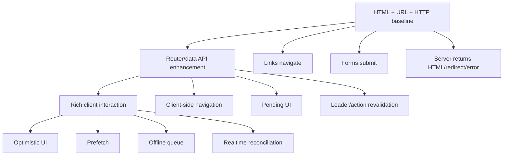
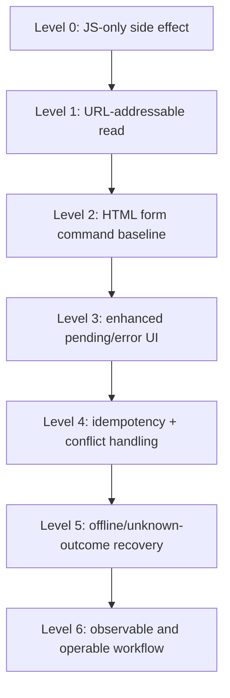
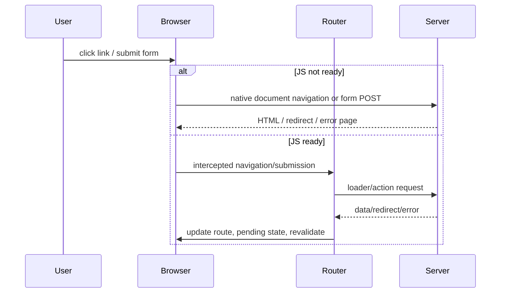
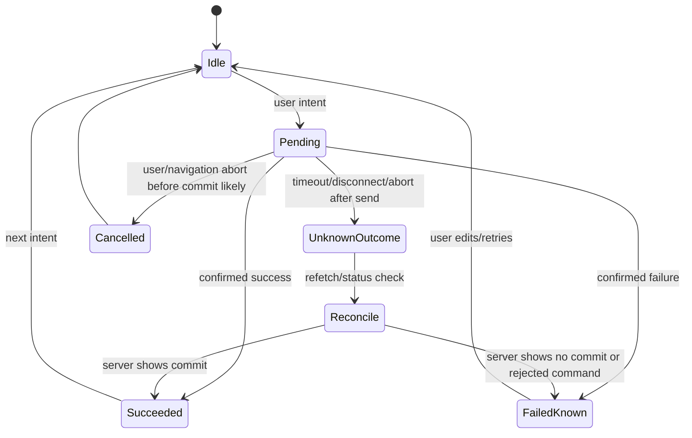

# Part 037 — Progressive Enhancement and Network Resilience

> Target mental model: **a resilient React app is not a JavaScript machine that happens to use URLs. It is a web application whose core communication paths survive imperfect JavaScript, imperfect networks, and imperfect users.**

Part 036 treated form submission as a command lifecycle.

This part expands that lifecycle into a more brutal production question:

```txt
What still works when JavaScript is slow, hydration is delayed, the network is unstable,
the user double-clicks, the tab sleeps, the device goes offline, or the request result is unknown?
```

Progressive enhancement is often misunderstood as a nostalgic idea from pre-SPA days.

That is too shallow.

For modern React client-server communication, progressive enhancement is a **resilience architecture**.

It means:

1. core routes are addressable by URL,
2. core reads can be represented by server responses,
3. core writes can be represented by HTTP form submissions,
4. JavaScript enhances speed and interactivity,
5. the app has a recovery path when enhancement fails.

The deeper rule:

```txt
The browser is not only a render target.
The browser is already a distributed systems runtime.
```

It has navigation, history, caching, cancellation, connection pooling, form encoding, redirects, cookies, back/forward cache, service workers, storage, focus/reconnect events, and accessibility semantics.

A top-level React engineer does not fight these primitives by default.

They compose with them.

---

## 1. What Progressive Enhancement Means in This Series

Progressive enhancement has three layers.



Layer 1 is not optional for important workflows.

Layer 2 improves perceived performance and state continuity.

Layer 3 adds product sophistication.

The bug appears when teams build Layer 3 while Layer 1 is broken.

Examples:

```txt
Click handler with fetch() but no form fallback.
Route modal that cannot be deep-linked.
Mutation result only stored in local state.
Error page only exists as a toast.
Refresh loses the user's path or intent.
```

That is not advanced.

It is fragile.

---

## 2. The Baseline Contract

A baseline web route should answer this:

```txt
Can a user arrive at this URL, reload it, share it, submit the primary form,
and recover from an error without relying on hidden in-memory state?
```

For non-trivial products, the answer should usually be yes.

This does not mean every micro-interaction must work without JavaScript.

It means the **business-critical communication path** has a durable representation.

| Workflow | Baseline representation | Enhanced representation |
|---|---|---|
| Read details page | `GET /cases/123` | client navigation + loader cache |
| Search list | `GET /cases?status=open&q=late` | debounced search params + loader/query |
| Create record | `POST /cases` | enhanced form action + pending UI |
| Update field | `POST /cases/123/edit` or `PATCH` endpoint | fetcher/action + optimistic field |
| Delete record | `POST /cases/123/delete` | action + confirmation + rollback/revalidation |
| Upload file | multipart form | enhanced upload progress if needed |
| Auth-protected read | redirect/login/error boundary | route guard + revalidation |
| Conflict | server-rendered conflict page | inline conflict resolution UI |

A resilient React app uses JavaScript to make these paths better, not to make them possible.

---

## 3. Why React Apps Become Fragile

Fragility usually enters through invisible state.

```tsx
<button onClick={async () => {
  await api.approveCase(caseId);
  setApproved(true);
  toast.success("Approved");
}}>
  Approve
</button>
```

This works in the best case.

It fails under many ordinary conditions:

1. user double-clicks,
2. request times out after the server commits,
3. tab closes after submit,
4. user refreshes before local state updates,
5. toast disappears but data is stale,
6. button is unavailable to non-JS baseline,
7. error is not addressable or recoverable,
8. audit requirement needs request identity,
9. retry duplicates the mutation,
10. accessibility feedback is missing.

The resilient shape is different:

```tsx
<Form method="post" action={`/cases/${caseId}/approve`}>
  <input type="hidden" name="idempotencyKey" value={idempotencyKey} />
  <button type="submit">Approve</button>
</Form>
```

Then enhancement can add:

```txt
pending button state
optimistic label
loader revalidation
idempotency key
conflict handling
structured error display
analytics event
```

The form is the durable command boundary.

The enhancement is additive.

---

## 4. The Resilience Ladder

Use this ladder when reviewing a feature.



### Level 0 — JavaScript-only side effect

Everything depends on runtime JS.

Acceptable for:

```txt
tooltip
local dropdown
UI-only filter
non-critical personalization
```

Dangerous for:

```txt
payment
approval
case escalation
file submission
legal acknowledgement
data correction
identity/security changes
```

### Level 1 — URL-addressable read

The current read model is recoverable by URL.

```txt
/cases/123
/cases?status=open&assignee=me
/reports/monthly?period=2026-07
```

A reload must not destroy the user's essential place.

### Level 2 — HTML form command baseline

The mutation has a server-addressable command path.

```html
<form method="post" action="/cases/123/approve">
  <button type="submit">Approve</button>
</form>
```

Even when JavaScript is delayed, the browser can submit.

### Level 3 — Enhanced pending/error UI

React intercepts navigation/form behavior and adds:

```txt
pending state
field-level errors
optimistic draft preservation
scroll/focus management
revalidation without full reload
```

### Level 4 — Idempotency + conflict handling

The command becomes safe under retry, double submit, and unknown result.

```txt
Idempotency-Key
If-Match / version
duplicate command detection
conflict response
```

### Level 5 — Offline/unknown-outcome recovery

The user can recover when the network does not provide a clean result.

```txt
"We could not confirm whether this succeeded. Refresh status."
"This change is queued and will sync when online."
"This item was already approved by another user."
```

### Level 6 — Observable and operable workflow

Support can answer:

```txt
What did the user try to do?
Did the browser send the request?
Did the server receive it?
Was it committed?
Was the UI revalidated?
What correlation ID ties these events together?
```

This is the difference between a nice demo and a production system.

---

## 5. The Navigation Baseline

A link should be a link unless it is not navigation.

Bad:

```tsx
<div onClick={() => navigate(`/cases/${caseId}`)}>
  Open case
</div>
```

Better:

```tsx
<Link to={`/cases/${caseId}`}>Open case</Link>
```

Baseline HTML equivalent:

```html
<a href="/cases/123">Open case</a>
```

The link gives the platform:

1. open in new tab,
2. copy link,
3. long press on mobile,
4. browser history,
5. crawler/support tooling visibility,
6. prefetch hooks,
7. keyboard accessibility,
8. progressive fallback.

A route change is not merely `setScreen("details")`.

It is a communication boundary:

```txt
user intent → URL → route match → data load → render → history entry
```

---

## 6. React Router Progressive Enhancement Model

A modern data router can enhance native web behavior.

Baseline:

```html
<a href="/projects/42">Open project</a>
<form method="post" action="/projects/42/archive">
  <button>Archive</button>
</form>
```

Enhanced:

```tsx
<Link to="/projects/42">Open project</Link>

<Form method="post" action="/projects/42/archive">
  <button>Archive</button>
</Form>
```

When JavaScript is available, the router can intercept and handle these client-side.

The architecture becomes:



The important invariant:

```txt
The server endpoint must remain meaningful.
The client enhancement may improve the path but must not be the only path.
```

---

## 7. Progressive Enhancement for Forms

A form should degrade to a valid server command.

```tsx
<Form method="post" action="/cases/new">
  <label>
    Title
    <input name="title" required minLength={3} />
  </label>

  <label>
    Priority
    <select name="priority" defaultValue="normal">
      <option value="low">Low</option>
      <option value="normal">Normal</option>
      <option value="high">High</option>
    </select>
  </label>

  <button type="submit">Create case</button>
</Form>
```

Server action shape:

```ts
export async function action({ request }: ActionFunctionArgs) {
  const form = await request.formData();

  const input = {
    title: String(form.get("title") ?? ""),
    priority: String(form.get("priority") ?? "normal"),
  };

  const validation = validateCreateCase(input);
  if (!validation.ok) {
    return data({ errors: validation.errors }, { status: 400 });
  }

  const created = await createCase(input);
  return redirect(`/cases/${created.id}`);
}
```

Enhanced UI shape:

```tsx
function NewCasePage() {
  const actionData = useActionData<typeof action>();
  const navigation = useNavigation();
  const isSubmitting = navigation.state === "submitting";

  return (
    <Form method="post">
      <label>
        Title
        <input
          name="title"
          required
          minLength={3}
          aria-invalid={Boolean(actionData?.errors?.title)}
        />
      </label>
      {actionData?.errors?.title ? (
        <p role="alert">{actionData.errors.title}</p>
      ) : null}

      <button disabled={isSubmitting}>
        {isSubmitting ? "Creating..." : "Create case"}
      </button>
    </Form>
  );
}
```

The structure is resilient because:

1. form fields have names,
2. server can parse the command,
3. validation exists server-side,
4. redirect expresses success,
5. error response is structured,
6. enhanced UI reads the same action result,
7. reload does not erase the resource identity.

---

## 8. The Network Resilience State Machine

Every important request should fit this state machine.



The critical state is `UnknownOutcome`.

Most frontend code only models:

```txt
loading → success | error
```

That is insufficient for mutation commands.

A timeout after request send does not prove failure.

A disconnected tab does not prove rollback.

An aborted fetch does not prove the server stopped processing.

For important writes, the client must distinguish:

| State | Meaning | UI response |
|---|---|---|
| pending | request in flight | disable duplicate command, show pending |
| confirmed success | server committed | redirect/revalidate/show success |
| confirmed failure | server rejected | show errors, allow correction |
| unknown outcome | client lost confirmation | reconcile status before retry |
| cancelled before send | user/navigation stopped local operation | usually no error |

This is where idempotency keys matter.

---

## 9. Unknown Outcome Design

Bad UI:

```txt
Something went wrong. Try again.
```

This is dangerous for commands like:

```txt
transfer money
submit legal filing
approve enforcement action
send notification
create external ticket
upload evidence
```

Better UI:

```txt
We could not confirm whether the approval completed.
Checking the latest case status...
```

Then reconcile:

```ts
async function approveCase(caseId: string) {
  const idempotencyKey = crypto.randomUUID();

  try {
    await api.post(`/cases/${caseId}/approve`, {
      headers: { "Idempotency-Key": idempotencyKey },
      timeoutMs: 8_000,
    });

    await queryClient.invalidateQueries({ queryKey: caseKeys.detail(caseId) });
  } catch (error) {
    if (isTimeoutLike(error) || isNetworkUnknown(error)) {
      const latest = await api.get(`/cases/${caseId}`);

      if (latest.status === "approved") {
        return { state: "confirmed-after-reconcile" };
      }

      return {
        state: "unknown",
        idempotencyKey,
        message: "Could not confirm approval. Please check before retrying.",
      };
    }

    throw error;
  }
}
```

Even better: expose command status.

```txt
POST /cases/123/approve
Idempotency-Key: abc

202 Accepted
Location: /commands/abc
```

Then:

```txt
GET /commands/abc → pending | succeeded | rejected | duplicate
```

That pattern moves ambiguity out of the UI.

---

## 10. Resilient Form Submission Pattern

A production form command should carry a client-generated command identity.

```tsx
function ApproveCaseForm({ caseId }: { caseId: string }) {
  const [key] = React.useState(() => crypto.randomUUID());

  return (
    <Form method="post" action={`/cases/${caseId}/approve`}>
      <input type="hidden" name="idempotencyKey" value={key} />
      <button type="submit">Approve</button>
    </Form>
  );
}
```

Server:

```ts
export async function action({ request, params }: ActionFunctionArgs) {
  const form = await request.formData();
  const idempotencyKey = String(form.get("idempotencyKey") ?? "");

  if (!idempotencyKey) {
    return data(
      { formError: "Missing command identity. Please reload and try again." },
      { status: 400 },
    );
  }

  const result = await approveCaseOnce({
    caseId: params.caseId!,
    idempotencyKey,
    actorId: await requireUserId(request),
  });

  if (result.kind === "already-applied") {
    return redirect(`/cases/${params.caseId}`);
  }

  if (result.kind === "conflict") {
    return data({ conflict: result.conflict }, { status: 409 });
  }

  return redirect(`/cases/${params.caseId}`);
}
```

Notice the contract:

```txt
The client can retry with the same idempotency key.
The server can deduplicate.
The UI can recover.
Support can trace the command.
```

---

## 11. Slow JavaScript Is a Real Failure Mode

Do not only test with local development speed.

In production, JavaScript can be delayed by:

1. large bundles,
2. slow CPU,
3. extension interference,
4. network congestion,
5. failed chunk load,
6. CDN issue,
7. hydration error,
8. browser memory pressure,
9. service worker bug,
10. enterprise proxy rewriting/caching behavior.

If your primary path requires JavaScript before doing anything useful, the app is brittle.

This is especially damaging for:

```txt
login callback
password reset
account verification
checkout
submit report
approve workflow
upload evidence
regulatory deadline submission
```

A progressive baseline gives the user a path even before React is fully alive.

---

## 12. Chunk Load Failure

Modern React apps often code-split.

That means a route may need:

```txt
HTML shell
entry JS
route JS chunk
CSS chunk
loader data
image/font resources
```

A chunk load failure can happen because:

1. deployment replaced assets while user has old HTML,
2. CDN cache is inconsistent,
3. user resumes an old tab,
4. service worker cached stale manifest,
5. network failed mid-download.

Resilient behavior:

```tsx
function ChunkErrorBoundary({ error }: { error: unknown }) {
  if (isChunkLoadError(error)) {
    return (
      <section role="alert">
        <h1>Update required</h1>
        <p>This page needs the latest application files.</p>
        <button onClick={() => window.location.reload()}>Reload</button>
      </section>
    );
  }

  throw error;
}
```

But for critical form flows, a full document fallback is even better.

If the route chunk fails, the server-rendered route or native form path should still be able to complete the core action.

---

## 13. Offline and Reconnect Behavior

The browser can tell you whether it believes it is online, but this is not a reliable proof that your backend is reachable.

Treat online/offline events as hints.

```tsx
function useOnlineHint() {
  const [online, setOnline] = React.useState(() => navigator.onLine);

  React.useEffect(() => {
    const onOnline = () => setOnline(true);
    const onOffline = () => setOnline(false);

    window.addEventListener("online", onOnline);
    window.addEventListener("offline", onOffline);

    return () => {
      window.removeEventListener("online", onOnline);
      window.removeEventListener("offline", onOffline);
    };
  }, []);

  return online;
}
```

Use it for messaging:

```tsx
function NetworkBanner() {
  const online = useOnlineHint();

  if (online) return null;

  return (
    <div role="status">
      You appear to be offline. Some actions may wait until connection returns.
    </div>
  );
}
```

Do not use it as sole correctness condition.

This is wrong:

```ts
if (navigator.onLine) {
  await submitImportantCommand();
}
```

The network can still fail.

Better:

```txt
try command
classify result
queue only when policy allows
reconcile on reconnect
```

---

## 14. Offline Queue Decision Framework

Do not queue every mutation.

Offline queueing is a product and consistency decision.

| Command type | Queue offline? | Why |
|---|---:|---|
| save local note draft | yes | local ownership, low conflict |
| add comment | maybe | needs ordering and identity |
| approve case | usually no | authorization/context may change |
| submit legal report | maybe | only with explicit receipt/reconcile protocol |
| delete record | usually no | high conflict/destructive |
| upload evidence | maybe | needs resumable upload and integrity |
| send notification | usually no | duplicate/external side effect risk |

Queue only when you can answer:

```txt
What is the command identity?
What state was it based on?
Can it be applied later safely?
What if permissions change?
What if the entity changes?
What if the user logs out?
How is conflict surfaced?
How is success reconciled?
How is audit preserved?
```

Offline queueing without these answers is deferred corruption.

---

## 15. A Minimal Offline Queue Shape

For low-risk commands:

```ts
type QueuedCommand = {
  id: string;
  type: "draft-note.save";
  createdAt: string;
  baseVersion?: string;
  payload: unknown;
  attempts: number;
};
```

Queue:

```ts
async function enqueue(command: Omit<QueuedCommand, "attempts" | "createdAt">) {
  const record: QueuedCommand = {
    ...command,
    attempts: 0,
    createdAt: new Date().toISOString(),
  };

  await localForage.setItem(`command:${record.id}`, record);
}
```

Replay:

```ts
async function replayCommand(command: QueuedCommand) {
  try {
    await api.post("/draft-notes/sync", {
      body: JSON.stringify(command.payload),
      headers: {
        "Content-Type": "application/json",
        "Idempotency-Key": command.id,
      },
    });

    await removeQueuedCommand(command.id);
  } catch (error) {
    if (isConflict(error)) {
      await markNeedsUserResolution(command.id, error);
      return;
    }

    if (isRetryable(error)) {
      await updateAttempts(command.id, command.attempts + 1);
      return;
    }

    await markFailed(command.id, error);
  }
}
```

This queue is still incomplete for high-risk domains, but it shows the key invariant:

```txt
Offline commands must be identity-bearing, retry-safe, and reconcilable.
```

---

## 16. Preventing Duplicate Submits

Duplicate submit is not solved by disabling a button.

Disabling helps UX.

It does not solve correctness.

Reasons:

1. double-click can happen before state updates,
2. user can reload and resubmit,
3. browser can retry after connection issue,
4. mobile taps can duplicate,
5. malicious/automated clients can send duplicates,
6. multiple tabs can submit same command,
7. reverse proxies can retry idempotent-looking requests.

Client:

```tsx
function SubmitButton() {
  const navigation = useNavigation();
  const submitting = navigation.state === "submitting";

  return (
    <button disabled={submitting}>
      {submitting ? "Submitting..." : "Submit"}
    </button>
  );
}
```

Server:

```txt
unique(actor_id, idempotency_key)
command ledger
transactional deduplication
safe duplicate response
```

The server remains the correctness boundary.

The client improves interaction.

---

## 17. Redirects Are Resilience Tools

After a successful mutation, redirect to the canonical resource.

Bad:

```txt
POST /cases
200 { id: "123", message: "created" }
```

Then client local state decides where to go.

Better:

```txt
POST /cases
303 See Other
Location: /cases/123
```

The redirect expresses:

```txt
The command created/changed state.
The canonical read model is here.
The browser can recover with URL/history.
Reload will not resubmit the POST.
```

In enhanced clients, the router can handle redirects without a full document reload.

But the semantic remains useful even without enhancement.

---

## 18. Error Pages Are Communication Surfaces

A production error boundary is not just:

```txt
Something went wrong.
```

It should encode the recovery model.

Examples:

### 404

```txt
This case does not exist or you no longer have access.
Return to case list.
```

### 409

```txt
This case changed while you were editing.
Review latest version before submitting again.
```

### 422

```txt
Some fields need correction.
Field-level details are below.
```

### 429

```txt
Too many attempts.
Try again after the indicated time.
```

### 503

```txt
Service temporarily unavailable.
Your command was not confirmed. Check status before retrying.
```

Resilience is not only avoiding failures.

It is giving the user a correct next step when failure happens.

---

## 19. Designing for Reload

The reload test is simple:

```txt
After every important interaction, hit Reload.
Does the app still make sense?
```

Common failures:

1. selected item disappears because it lived only in component state,
2. successful mutation is lost because redirect did not happen,
3. form draft disappears without warning,
4. error result disappears and user cannot recover,
5. list filter resets because it was not in URL,
6. optimistic item appears but canonical server data disagrees,
7. modal route closes because modal was not addressable.

The fix is not always “put everything in URL”.

The fix is to classify state:

| State | Durable representation |
|---|---|
| navigation location | URL |
| server-owned resource | loader/query response |
| local incomplete draft | form fields/local storage if needed |
| submitted command | server command ledger/idempotency key |
| validation result | action response or server page |
| success result | redirect/canonical resource |
| transient UI hint | component state |

---

## 20. Back/Forward Cache and Resume

Browsers may preserve page state in the back/forward cache.

This can make an old page appear instantly when the user presses Back.

That is good for UX, but it creates consistency questions:

```txt
Is the old data still acceptable?
Should we revalidate on pageshow?
Was a pending form submission completed elsewhere?
Did permissions change?
```

Pattern:

```tsx
function usePageShowRevalidation(revalidate: () => void) {
  React.useEffect(() => {
    const onPageShow = (event: PageTransitionEvent) => {
      if (event.persisted) {
        revalidate();
      }
    };

    window.addEventListener("pageshow", onPageShow);
    return () => window.removeEventListener("pageshow", onPageShow);
  }, [revalidate]);
}
```

Do not blindly revalidate everything.

Use resource sensitivity:

```txt
high-risk workflow → revalidate on resume
low-risk static page → keep cache
expensive dashboard → stale-while-revalidate
```

---

## 21. Service Workers: Powerful, Dangerous Boundary

A service worker can intercept network requests.

That means it can improve resilience:

```txt
offline shell
asset cache
background sync
request fallback
response caching
```

It can also break correctness:

```txt
stale API response
cached auth-sensitive data
old app shell with new API contract
duplicate replay
stuck update
opaque failure source
```

Do not add service worker caching to API calls casually.

For client-server communication, classify routes:

| Request | Service worker strategy |
|---|---|
| versioned JS/CSS assets | cache-first with revisioning |
| public static images | cache-first/stale-while-revalidate |
| authenticated API GET | usually network-first or no SW cache |
| mutation POST/PATCH/DELETE | usually pass-through; queue only by explicit policy |
| app shell | careful update strategy |
| signed URL downloads | avoid persistent cache unless allowed |

A service worker is effectively a programmable proxy.

Treat it with the same suspicion as any proxy in a distributed system.

---

## 22. Hydration Mismatch and Partial Interactivity

A server-rendered page can be visible before React hydrates.

During that time:

1. links work natively,
2. forms submit natively,
3. interactive JS-only widgets do not work,
4. some enhanced handlers are unavailable,
5. user can interact before React is ready.

This is exactly why baseline semantics matter.

Bad:

```tsx
<button onClick={() => save()}>Save</button>
```

Before hydration, this button does nothing.

Better:

```tsx
<Form method="post" action="/settings/profile">
  <button type="submit">Save</button>
</Form>
```

Before hydration, it submits.

After hydration, it gains pending UI and client-side revalidation.

---

## 23. Designing Critical Workflows

For every critical workflow, write the communication contract explicitly.

Example: approval workflow.

```txt
Workflow: approve enforcement case
Canonical resource: /cases/:id
Command endpoint: POST /cases/:id/approve
Command identity: idempotencyKey
Base version: case.version
Success: redirect /cases/:id
Conflict: 409 with latest version summary
Unknown outcome: GET /cases/:id and/or GET /commands/:idempotencyKey
Duplicate handling: same idempotency key returns previous result
Baseline: HTML form submit works
Enhanced: pending UI, disabled button, revalidation
Audit: correlation ID + actor ID + command ID
```

This turns “button calls API” into an operable protocol.

---

## 24. Resilient Action Result Envelope

For enhanced action responses, use typed outcomes.

```ts
type ActionResult<TSuccess, TFieldErrors = Record<string, string>> =
  | {
      ok: true;
      result: TSuccess;
    }
  | {
      ok: false;
      kind: "validation";
      fieldErrors: TFieldErrors;
      formError?: string;
    }
  | {
      ok: false;
      kind: "conflict";
      conflictId: string;
      latestVersion: string;
      message: string;
    }
  | {
      ok: false;
      kind: "unknown-outcome";
      commandId: string;
      message: string;
    }
  | {
      ok: false;
      kind: "rate-limited";
      retryAfterSeconds?: number;
      message: string;
    };
```

The UI can then avoid vague handling:

```tsx
function ActionError({ result }: { result?: ActionResult<unknown> }) {
  if (!result || result.ok) return null;

  switch (result.kind) {
    case "validation":
      return <p role="alert">Please correct the highlighted fields.</p>;
    case "conflict":
      return <p role="alert">{result.message}</p>;
    case "unknown-outcome":
      return <p role="alert">{result.message}</p>;
    case "rate-limited":
      return <p role="alert">{result.message}</p>;
  }
}
```

Typed action results make recovery paths reviewable.

---

## 25. Network-Aware UX Without Lying

Do not show certainty the system does not have.

Bad:

```txt
Saved!
```

when the client only wrote to local cache.

Better:

```txt
Saving...
Saved on this device.
Syncing...
Saved to server.
Could not confirm server save.
```

For regulatory or financial systems, wording is part of correctness.

The UI should distinguish:

| Message | Meaning |
|---|---|
| Saving | command started |
| Saved locally | local durability only |
| Submitted | browser sent request, not necessarily committed |
| Confirmed | server acknowledged committed state |
| Pending review | server accepted but async workflow not complete |
| Could not confirm | outcome unknown |

A polished lie is worse than a rough truth.

---

## 26. Timeout UX Policy

Timeouts are not always errors.

A read timeout means:

```txt
The client did not receive data in time.
```

A mutation timeout means:

```txt
The client did not receive confirmation in time.
The server may or may not have committed.
```

So the UI policy should differ.

### Read timeout

```txt
Could not load this data. Retry.
```

### Mutation timeout

```txt
We could not confirm whether the change completed. Checking latest status...
```

### Async command timeout

```txt
The request was accepted but processing is still running. Track progress here.
```

Designing these states prevents dangerous duplicate operations.

---

## 27. Accessibility as Resilience

A resilient app communicates state to assistive technology.

For pending regions:

```tsx
<section aria-busy={isLoading}>
  <CaseDetails />
</section>
```

For non-disruptive updates:

```tsx
<p role="status">Saving...</p>
```

For errors requiring attention:

```tsx
<p role="alert">Title is required.</p>
```

For field errors:

```tsx
<label htmlFor="title">Title</label>
<input
  id="title"
  name="title"
  aria-invalid={Boolean(errors.title)}
  aria-describedby={errors.title ? "title-error" : undefined}
/>
{errors.title ? <p id="title-error">{errors.title}</p> : null}
```

Network resilience is not only packets.

It includes whether every user can perceive the system state.

---

## 28. Testing Progressive Resilience

You cannot claim resilience if you only test happy-path JavaScript.

Test matrix:

| Scenario | Expected result |
|---|---|
| JS disabled for critical form | native submit succeeds or clear fallback |
| slow JS/hydration | links/forms still meaningful |
| route chunk fails | reload/update path available |
| network offline during read | read error with retry |
| network offline during mutation | unknown/queued policy shown correctly |
| double submit | single server-side command effect |
| reload after success | canonical resource visible |
| back after mutation | data revalidates if sensitive |
| 409 response | conflict UI, not generic toast |
| 429 response | retry-after respected |
| 503 during command | no false success |
| user closes tab mid-submit | server command id can reconcile |

Manual checks are not enough.

Use controlled network simulation.

With Playwright:

```ts
test("approve action is deduplicated on double submit", async ({ page }) => {
  await page.goto("/cases/123");

  await Promise.all([
    page.getByRole("button", { name: "Approve" }).click(),
    page.getByRole("button", { name: "Approve" }).click(),
  ]);

  await expect(page.getByText("Approved")).toBeVisible();

  // Then assert server fixture/spy saw one committed command.
});
```

With MSW:

```ts
http.post("/cases/:id/approve", async ({ request }) => {
  const key = request.headers.get("Idempotency-Key");
  if (!key) return HttpResponse.json({ error: "missing key" }, { status: 400 });

  await delay(5_000);
  return HttpResponse.json({ ok: true });
});
```

Test delay, abort, retry, duplicate, and conflict.

---

## 29. Observability for Resilient Flows

Log communication events by workflow, not random request lines.

Client event envelope:

```ts
type ClientCommunicationEvent = {
  event: string;
  workflow: string;
  route: string;
  commandId?: string;
  resourceId?: string;
  method?: string;
  status?: number;
  durationMs?: number;
  outcome:
    | "started"
    | "confirmed-success"
    | "confirmed-failure"
    | "unknown-outcome"
    | "cancelled"
    | "queued"
    | "reconciled";
  correlationId?: string;
};
```

Useful events:

```txt
case.approve.started
case.approve.submitted
case.approve.timeout_unknown
case.approve.reconcile.started
case.approve.reconcile.confirmed
case.approve.conflict
case.approve.duplicate_suppressed
case.approve.failed_validation
case.approve.redirected
```

You are not logging for curiosity.

You are logging so support and engineering can reconstruct the user journey.

---

## 30. Architecture Review Checklist

For each route/workflow, ask:

### URL and navigation

- Is the primary read addressable by URL?
- Does reload preserve essential context?
- Does Back/Forward produce coherent state?
- Are filters/pagination encoded consistently?

### Form/action baseline

- Is the primary mutation a real form/action or only a click handler?
- Can the server parse the command without hidden client memory?
- Does success redirect to a canonical resource?
- Does failure produce structured recovery information?

### Network behavior

- What happens on timeout?
- What happens on abort?
- What happens on duplicate submit?
- What happens when outcome is unknown?
- What happens after reconnect?

### Consistency

- Is there an idempotency key?
- Is there a base version or conflict detector?
- What cache/loader data is revalidated?
- Can stale UI claim false success?

### Security and privacy

- Are secrets excluded from URL and local persistence?
- Are queued commands safe across logout/user switch?
- Are authz-sensitive reads revalidated on resume?

### Operability

- Is there a command ID or correlation ID?
- Can support determine whether the command committed?
- Are failure modes visible in telemetry?

---

## 31. Common Smells

### Smell 1 — Button-as-command with no form semantics

```tsx
<button onClick={save}>Save</button>
```

For critical commands, prefer a form/action boundary.

### Smell 2 — Toast-only success

```txt
Saved!
```

But reload shows stale data.

Success should align with canonical server state.

### Smell 3 — Retry without idempotency

```txt
Network error. Try again.
```

For mutation, this can duplicate side effects.

### Smell 4 — Offline queue by default

```txt
Just store all POSTs in IndexedDB and replay later.
```

This is unsafe for authorization-sensitive or destructive workflows.

### Smell 5 — Local state as the only command record

```txt
Submitted commands disappear on reload.
```

Use server command ledger for important workflows.

### Smell 6 — Disabled button as correctness

```txt
Button disabled, so duplicate submit solved.
```

No. Correctness belongs server-side.

### Smell 7 — Generic error catch-all

```tsx
catch {
  toast.error("Something went wrong");
}
```

This hides conflict, rate limit, validation, unknown outcome, and auth problems.

---

## 32. Summary

Progressive enhancement is not a styling preference.

It is a communication architecture.

A resilient React client-server workflow has:

1. URL-addressable reads,
2. form/action-based commands where appropriate,
3. JavaScript enhancement for speed and interaction,
4. explicit pending/success/failure/unknown states,
5. idempotency for retry/double-submit safety,
6. conflict detection for stale writes,
7. recovery after reload, reconnect, and chunk failure,
8. accessible status communication,
9. observability tied to workflow and command identity.

The central invariant:

```txt
JavaScript should enhance the communication path, not be the only reason the communication path exists.
```

In the next part, we focus on performance-oriented communication: prefetching, preloading, and navigation performance.

---

## References

- React Router — Progressive Enhancement: https://reactrouter.com/explanation/progressive-enhancement
- React Router — `<Form>`: https://reactrouter.com/api/components/Form
- React Router — Actions: https://reactrouter.com/start/framework/actions
- React Router — `useFetcher`: https://reactrouter.com/api/hooks/useFetcher
- MDN — Fetch API: https://developer.mozilla.org/en-US/docs/Web/API/Fetch_API
- MDN — Online and offline events: https://developer.mozilla.org/en-US/docs/Web/API/Navigator/onLine
- MDN — Page lifecycle events: https://developer.mozilla.org/en-US/docs/Web/API/Window/pageshow_event
- MDN — ARIA `aria-busy`: https://developer.mozilla.org/en-US/docs/Web/Accessibility/ARIA/Reference/Attributes/aria-busy
