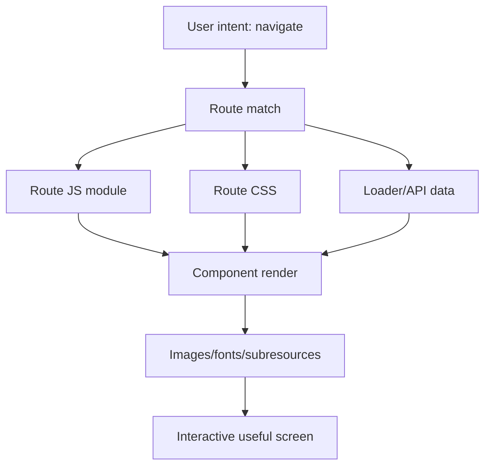
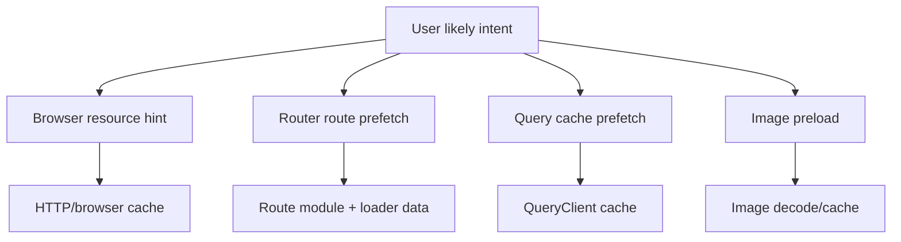
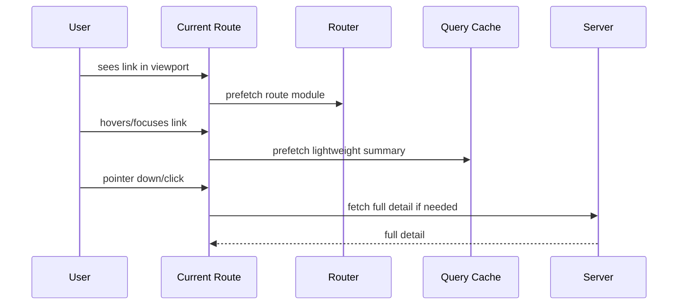

# Part 038 — Prefetching, Preloading, and Navigation Performance

> Target mental model: **navigation performance is not one request becoming faster. It is a dependency graph starting earlier, doing less unnecessary work, and avoiding serial waits.**

Part 037 treated progressive enhancement as resilience architecture.

This part treats prefetching and preloading as **latency-shaping tools**.

The mistake is to see prefetch as magic:

```txt
make page faster by fetching before user clicks
```

That is only the surface.

The deeper model:

```txt
A navigation is a graph of resources.
Some are required now.
Some are likely required soon.
Some are expensive to discover late.
Some are unsafe to fetch early.
Some should never be prefetched.
```

React engineers must reason about:

1. route module loading,
2. loader/API data,
3. images and fonts,
4. connection setup,
5. cache policy,
6. auth/tenant scope,
7. user intent prediction,
8. bandwidth contention,
9. privacy leakage,
10. stale data risk.

Prefetching is not always good.

Bad prefetching competes with critical work, burns mobile data, warms the wrong cache, leaks intent, and increases backend load.

Good prefetching removes waterfalls without lying about freshness.

---

## 1. Navigation as a Dependency Graph

A route transition is not a single operation.



A slow navigation may be slow because:

1. route JS is discovered after click,
2. loader data starts after route JS loads,
3. API requires another dependent API call,
4. image URL is discovered after data arrives,
5. font is discovered after CSS arrives,
6. connection setup begins too late,
7. authentication refresh blocks all requests,
8. cache key changed accidentally,
9. CDN cannot reuse cached response,
10. hydration blocks interactivity.

Prefetching and preloading attack **discovery time** and **serial dependency**.

---

## 2. Terminology: Preconnect, DNS Prefetch, Preload, Prefetch

These terms are often mixed.

They are not the same.

| Mechanism | Goal | When to use |
|---|---|---|
| `dns-prefetch` | resolve domain early | low-cost hint for possible third-party origin |
| `preconnect` | open connection early | high-confidence origin soon needed |
| `preload` | fetch required current-page resource early | critical resource needed very soon |
| `prefetch` | fetch likely future navigation resource | next page likely needed |
| route prefetch | fetch route module/data before navigation | app-level next-route prediction |
| query prefetch | warm server-state cache | likely data needed soon |
| image preload | prioritize hero/critical image | image needed above fold |

Mental distinction:

```txt
preconnect warms the pipe
preload fetches now-needed resources
prefetch fetches future-likely resources
query/route prefetch warms application caches
```

---

## 3. Resource Hint Layer

Browser resource hints are declarative instructions in HTML.

```html
<link rel="preconnect" href="https://api.example.com" />
<link rel="dns-prefetch" href="https://cdn.example.com" />
<link rel="preload" as="font" href="/fonts/inter.woff2" type="font/woff2" crossorigin />
<link rel="prefetch" href="/assets/routes-case-detail.js" />
```

These hints work below React.

They can improve performance even before application JavaScript runs.

But each has different risk.

### `preconnect`

Use when you are highly confident the origin is needed.

```html
<link rel="preconnect" href="https://api.example.com" crossorigin />
```

This can reduce DNS/TCP/TLS/QUIC setup cost.

But too many preconnects waste sockets and compete for resources.

### `preload`

Use for resources needed on the current page that would otherwise be discovered late.

```html
<link
  rel="preload"
  as="image"
  href="/hero/case-dashboard.avif"
  fetchpriority="high"
/>
```

Bad preload is worse than no preload.

If you preload a non-critical resource, you may steal bandwidth from the real critical path.

### `prefetch`

Use for likely future navigation resources.

```html
<link rel="prefetch" href="/reports/monthly" />
```

But be careful:

1. user may never navigate there,
2. data may go stale,
3. prefetch may reveal user intent,
4. authenticated responses may be unsafe to cache broadly,
5. backend load may increase.

---

## 4. Application-Level Prefetch Layer

React apps have additional caches above the browser:

```txt
route module cache
loader data cache
query cache
GraphQL normalized cache
image cache
service worker cache
CDN/browser HTTP cache
```

A browser `link rel="prefetch"` may warm one layer.

A router/query prefetch may warm another.

Do not assume they are equivalent.



The right strategy depends on what the next screen needs.

---

## 5. React Router Link Prefetch

React Router supports link-level prefetch behavior.

Conceptually:

```tsx
<Link to="/cases/123" prefetch="intent">
  Open case
</Link>
```

The common modes are:

```txt
none      → do not prefetch
intent    → prefetch when user shows intent, such as hover/focus
default/render → prefetch when rendered, depending on router mode/version
viewport  → prefetch when link enters viewport, useful for mobile lists
```

Use intent-based prefetch for links where hover/focus is a strong signal.

Use viewport prefetch cautiously for feeds/lists.

Use render prefetch only when the next route is extremely likely and cheap.

Bad:

```tsx
{cases.map((caseItem) => (
  <Link
    key={caseItem.id}
    to={`/cases/${caseItem.id}`}
    prefetch="render"
  >
    {caseItem.title}
  </Link>
))}
```

This can prefetch hundreds of detail pages.

Better:

```tsx
{cases.map((caseItem) => (
  <Link
    key={caseItem.id}
    to={`/cases/${caseItem.id}`}
    prefetch="intent"
  >
    {caseItem.title}
  </Link>
))}
```

For mobile where hover does not exist, use viewport selectively:

```tsx
<Link to={`/cases/${featuredCase.id}`} prefetch="viewport">
  Continue latest case
</Link>
```

Do not apply viewport prefetch to every row in an infinite list.

---

## 6. Query Prefetch with TanStack Query

Application data prefetch is explicit cache warming.

```ts
const caseKeys = {
  detail: (id: string) => ["case", "detail", id] as const,
};

function usePrefetchCase(id: string) {
  const queryClient = useQueryClient();

  return () => {
    queryClient.prefetchQuery({
      queryKey: caseKeys.detail(id),
      queryFn: ({ signal }) => api.getCase(id, { signal }),
      staleTime: 30_000,
    });
  };
}
```

Use it on intent:

```tsx
function CaseLink({ id, title }: { id: string; title: string }) {
  const prefetch = usePrefetchCase(id);

  return (
    <Link
      to={`/cases/${id}`}
      onMouseEnter={prefetch}
      onFocus={prefetch}
    >
      {title}
    </Link>
  );
}
```

The detail page then reads from the same key:

```tsx
function CaseDetail({ id }: { id: string }) {
  const query = useQuery({
    queryKey: caseKeys.detail(id),
    queryFn: ({ signal }) => api.getCase(id, { signal }),
    staleTime: 30_000,
  });

  return <CaseView data={query.data} />;
}
```

The invariant:

```txt
Prefetch key and render key must be identical.
```

If they differ, you warmed the wrong cache.

---

## 7. Loader Prefetch vs Query Prefetch

A route loader prefetch is better when:

1. data is owned by the route,
2. navigation must block on it,
3. SSR/hydration should receive it,
4. errors/redirects are route-level,
5. the URL fully defines input.

A query prefetch is better when:

1. data is shared across screens,
2. cache reuse matters outside one route,
3. background refetch policy matters,
4. component composition owns data fragments,
5. mutation invalidation targets query keys.

Decision table:

| Need | Prefer |
|---|---|
| route redirect if not found | loader |
| authz redirect | loader |
| shared entity cache | query |
| detail page above-fold required data | loader or query with SSR bridge |
| hover warm entity card | query prefetch |
| next route module + data | router prefetch |
| infinite list next page | query prefetch/infinite query |

Do not duplicate fetching in both layers without a bridge.

Bad:

```txt
Router loader fetches /cases/123.
Component query fetches /cases/123 again with different cache key.
```

Better:

```txt
Loader ensures route decision.
Query cache is hydrated/seeded with loader data.
Component uses same query identity.
```

---

## 8. Seed Query Cache from Loader Data

Example pattern:

```ts
export async function loader({ params }: LoaderFunctionArgs) {
  const caseRecord = await api.getCase(params.caseId!);
  return data({ caseRecord });
}
```

Route:

```tsx
function CaseRoute() {
  const { caseRecord } = useLoaderData<typeof loader>();
  const queryClient = useQueryClient();

  React.useEffect(() => {
    queryClient.setQueryData(caseKeys.detail(caseRecord.id), caseRecord);
  }, [queryClient, caseRecord]);

  return <CaseDetail id={caseRecord.id} initial={caseRecord} />;
}
```

Then query:

```tsx
function CaseDetail({ id, initial }: { id: string; initial: CaseRecord }) {
  const query = useQuery({
    queryKey: caseKeys.detail(id),
    queryFn: ({ signal }) => api.getCase(id, { signal }),
    initialData: initial,
    staleTime: 15_000,
  });

  return <CaseView data={query.data} />;
}
```

This avoids double fetch while preserving query cache behavior.

But beware:

```txt
initialData has a timestamp policy.
If it is already old, mark it stale or refetch.
```

---

## 9. Prefetch Budget

Prefetching consumes resources.

Create a budget.

```ts
type PrefetchPolicy = {
  maxConcurrent: number;
  maxPerScreen: number;
  maxBytesHint?: number;
  minConfidence: "low" | "medium" | "high";
  allowOnMobileData: boolean;
  requireUserIntent: boolean;
};
```

Example policy:

```ts
const defaultPrefetchPolicy: PrefetchPolicy = {
  maxConcurrent: 2,
  maxPerScreen: 5,
  minConfidence: "medium",
  allowOnMobileData: false,
  requireUserIntent: true,
};
```

Check effective connection when available:

```ts
function shouldPrefetch() {
  const connection = (navigator as any).connection;

  if (connection?.saveData) return false;
  if (["slow-2g", "2g"].includes(connection?.effectiveType)) return false;

  return true;
}
```

This API is not universal, so treat it as a hint.

Do not make correctness depend on it.

---

## 10. Intent Signals

Not all signals are equal.

| Signal | Confidence | Notes |
|---|---:|---|
| hover | medium | desktop only, can be accidental |
| focus | medium/high | keyboard intent |
| pointer down | high | very late but useful |
| viewport | low/medium | useful for small curated lists |
| typed search result highlight | high | user likely to open |
| recent history | medium | may reflect backtracking |
| explicit “next” button | high | safe candidate |
| route render | low/high depending context | dangerous in large lists |

A good strategy uses different prefetch depth per signal.

```txt
viewport → prefetch route module only
hover/focus → prefetch route module + lightweight data
pointerdown → start high-priority data immediately
explicit next → prefetch full next page
```

---

## 11. Multi-Stage Prefetch

For heavy screens, use staged prefetch.



This avoids spending full data cost for weak signals.

Example:

```ts
type PrefetchDepth = "module" | "summary" | "full";

function prefetchCase(id: string, depth: PrefetchDepth) {
  if (depth === "summary") {
    return queryClient.prefetchQuery({
      queryKey: caseKeys.summary(id),
      queryFn: ({ signal }) => api.getCaseSummary(id, { signal }),
      staleTime: 60_000,
    });
  }

  if (depth === "full") {
    return queryClient.prefetchQuery({
      queryKey: caseKeys.detail(id),
      queryFn: ({ signal }) => api.getCase(id, { signal }),
      staleTime: 15_000,
    });
  }
}
```

---

## 12. Avoiding Prefetch Stampedes

Large lists can create stampedes.

Bad:

```tsx
{items.map((item) => (
  <CaseCard
    key={item.id}
    onVisible={() => prefetchCase(item.id)}
  />
))}
```

If 50 cards enter viewport, 50 prefetches start.

Control concurrency:

```ts
class PrefetchQueue {
  private running = 0;
  private queue: Array<() => Promise<void>> = [];

  constructor(private readonly maxConcurrent: number) {}

  add(task: () => Promise<void>) {
    this.queue.push(task);
    void this.drain();
  }

  private async drain() {
    if (this.running >= this.maxConcurrent) return;

    const task = this.queue.shift();
    if (!task) return;

    this.running += 1;
    try {
      await task();
    } finally {
      this.running -= 1;
      void this.drain();
    }
  }
}
```

Use dedupe:

```ts
const prefetched = new Set<string>();

function prefetchOnce(key: string, task: () => Promise<void>) {
  if (prefetched.has(key)) return;
  prefetched.add(key);
  prefetchQueue.add(task);
}
```

But remember: query libraries usually dedupe by query key already.

Your queue is for policy and bandwidth control.

---

## 13. Prefetch Cancellation

Prefetch should often be cancellable.

If the user's intent disappears, cancel weak prefetch work.

```ts
function createIntentPrefetch<T>(fn: (signal: AbortSignal) => Promise<T>) {
  let controller: AbortController | null = null;

  return {
    start() {
      controller?.abort();
      controller = new AbortController();
      return fn(controller.signal).catch((error) => {
        if (error instanceof DOMException && error.name === "AbortError") return;
        throw error;
      });
    },
    cancel() {
      controller?.abort();
      controller = null;
    },
  };
}
```

Use with hover:

```tsx
function PrefetchingLink({ to, id, children }: Props) {
  const prefetch = React.useMemo(
    () =>
      createIntentPrefetch((signal) =>
        api.getCase(id, { signal }).then((data) => {
          queryClient.setQueryData(caseKeys.detail(id), data);
        }),
      ),
    [id],
  );

  return (
    <Link
      to={to}
      onMouseEnter={() => void prefetch.start()}
      onMouseLeave={() => prefetch.cancel()}
      onFocus={() => void prefetch.start()}
    >
      {children}
    </Link>
  );
}
```

Caution:

```txt
Canceling client prefetch does not guarantee the server stopped work.
For GET reads this is usually acceptable.
For writes, do not pre-execute mutation.
```

---

## 14. Never Prefetch Unsafe Mutations

Do not prefetch mutation endpoints.

This sounds obvious but appears in real systems as:

```txt
GET /email/send-preview?actuallySends=true
GET /case/123/mark-read
GET /audit/export/start
```

A prefetcher, crawler, browser optimization, link scanner, or security product may trigger GET requests.

GET must be safe.

If visiting a URL mutates server state, prefetch becomes dangerous.

Correct split:

```txt
GET /cases/123/delete-confirmation   → safe read
POST /cases/123/delete               → mutation command
```

Then prefetch the confirmation page if appropriate.

Never pre-execute the command.

---

## 15. Cache Freshness and Prefetch Staleness

Prefetched data can be stale by the time user navigates.

Policy options:

| Policy | Behavior | Use case |
|---|---|---|
| fresh window | use prefetched data for N seconds | detail pages, moderate freshness |
| stale-while-revalidate | show prefetched data, refetch in background | dashboards/cards |
| navigation-blocking revalidate | verify before render | security-sensitive workflow |
| no data prefetch | only prefetch code | highly volatile/secure data |

Example:

```ts
queryClient.prefetchQuery({
  queryKey: caseKeys.detail(id),
  queryFn: ({ signal }) => api.getCase(id, { signal }),
  staleTime: 10_000,
});
```

This means:

```txt
If user navigates within 10 seconds, use data as fresh.
After that, it becomes stale according to query policy.
```

Do not set long stale windows because prefetch “feels fast”.

Correctness still matters.

---

## 16. Security and Privacy of Prefetch

Prefetch can leak information.

Examples:

1. prefetching `/cases/high-risk-investigation` reveals interest in logs,
2. third-party origin preconnect reveals potential next action,
3. search result prefetch leaks highlighted sensitive entity,
4. shared device cache stores sensitive resources,
5. browser extension observes prefetched URLs,
6. backend analytics receives events for pages never opened.

Guidelines:

```txt
Do not prefetch highly sensitive routes by default.
Avoid third-party preconnect unless needed.
Do not include secrets in URLs.
Do not treat prefetch as user view.
Separate analytics: prefetched ≠ visited.
Respect Save-Data and low-bandwidth hints.
```

For sensitive apps, prefetch route code but not sensitive data.

```txt
module prefetch: okay
entity detail data prefetch: maybe not
mutation prefetch: never
```

---

## 17. Prefetch and Authorization Scope

Cache identity must include authorization-relevant scope.

Bad:

```ts
["case", id]
```

if different tenants/users can see different representations.

Better:

```ts
["tenant", tenantId, "user", userId, "case", id]
```

Or at least clear cache on tenant/user switch.

Prefetch makes auth leakage easier because it fetches data before explicit navigation.

Rules:

1. never reuse prefetched authenticated data across user/tenant boundaries,
2. clear query cache on logout,
3. avoid persistent cache for sensitive prefetched data,
4. revalidate sensitive data on focus/resume,
5. ensure server enforces authorization on every request.

Client cache partitioning is a safety layer.

Server authorization is still the boundary.

---

## 18. Preloading Critical Images

Images often dominate perceived navigation performance.

If the next route has a critical hero image, data prefetch alone may not help.

You may need to warm the image too.

```tsx
function preloadImage(src: string) {
  const link = document.createElement("link");
  link.rel = "preload";
  link.as = "image";
  link.href = src;
  document.head.appendChild(link);
}
```

But dynamic image preload should be controlled.

Bad:

```ts
items.forEach((item) => preloadImage(item.largeImageUrl));
```

Better:

```txt
preload only likely next hero image
use responsive image metadata
avoid preloading below-the-fold images
use correct dimensions to prevent layout shift
```

For current-page critical image, prefer server-rendered `<link rel="preload" as="image">` in the document head.

---

## 19. Font Preloading

Fonts can block text rendering or cause layout shift.

For critical fonts:

```html
<link
  rel="preload"
  href="/fonts/inter-var.woff2"
  as="font"
  type="font/woff2"
  crossorigin
/>
```

But do not preload every font weight.

Rules:

1. preload only critical font files,
2. use `font-display` intentionally,
3. avoid excessive weights/styles,
4. include `crossorigin` when required,
5. measure layout shift and render delay.

A bad font preload can delay more important resources.

---

## 20. Connection Warming for API Origins

If your API is on a different origin:

```html
<link rel="preconnect" href="https://api.example.com" crossorigin />
```

This can reduce first API request latency.

But it only helps if:

1. origin is actually needed soon,
2. browser honors it,
3. connection is not already open,
4. the cost of warming does not compete with critical resources.

For many apps, same-origin API via reverse proxy simplifies this:

```txt
https://app.example.com/api/*
```

Benefits:

1. fewer CORS issues,
2. shared connection,
3. simpler cookie policy,
4. easier CDN/proxy control.

But same-origin is not automatically faster if backend routing/proxy is poorly configured.

Measure.

---

## 21. Waterfall Elimination Patterns

### Pattern 1 — Move data requirement to route boundary

Bad:

```txt
render route shell → render child → child fetches data
```

Better:

```txt
route matched → loader fetches data → render with data
```

### Pattern 2 — Parallelize independent requests

Bad:

```ts
const profile = await getProfile();
const permissions = await getPermissions();
const notifications = await getNotifications();
```

Better:

```ts
const [profile, permissions, notifications] = await Promise.all([
  getProfile(),
  getPermissions(),
  getNotifications(),
]);
```

### Pattern 3 — Collapse frontend N+1

Bad:

```txt
GET /cases
GET /cases/1/summary
GET /cases/2/summary
GET /cases/3/summary
...
```

Better:

```txt
GET /cases?include=summary
```

or:

```txt
POST /case-summaries/batch
```

### Pattern 4 — Prefetch next page cursor

```ts
function usePrefetchNextPage(query: InfiniteData<CasePage> | undefined) {
  const queryClient = useQueryClient();
  const nextCursor = query?.pages.at(-1)?.nextCursor;

  React.useEffect(() => {
    if (!nextCursor) return;

    void queryClient.prefetchQuery({
      queryKey: caseKeys.page(nextCursor),
      queryFn: ({ signal }) => api.getCases({ cursor: nextCursor, signal }),
      staleTime: 20_000,
    });
  }, [queryClient, nextCursor]);
}
```

Use this only when the user is likely to continue.

---

## 22. Prefetching Search Results

Search pages are tempting to over-prefetch.

Bad:

```txt
prefetch detail for every result on every keystroke
```

Better:

```txt
prefetch only focused/highlighted result
prefetch after debounce
cancel on query change
limit concurrency
use short staleTime
```

Example:

```tsx
function SearchResult({ result, active }: Props) {
  const queryClient = useQueryClient();

  React.useEffect(() => {
    if (!active) return;

    const controller = new AbortController();

    void queryClient.prefetchQuery({
      queryKey: caseKeys.detail(result.id),
      queryFn: () => api.getCase(result.id, { signal: controller.signal }),
      staleTime: 10_000,
    });

    return () => controller.abort();
  }, [active, result.id, queryClient]);

  return <Link to={`/cases/${result.id}`}>{result.title}</Link>;
}
```

Search prefetch policy should be conservative because search intent changes quickly.

---

## 23. Measuring Navigation Performance

Do not rely on “feels faster”.

Measure:

```txt
navigation start
route match time
route module loaded
loader/request started
first byte received
data parsed
render committed
largest content rendered
interactive controls ready
```

Client marks:

```ts
performance.mark("case-detail:navigation-start");

await prefetchCase(id);
performance.mark("case-detail:data-ready");

performance.measure(
  "case-detail:data-prefetch-duration",
  "case-detail:navigation-start",
  "case-detail:data-ready",
);
```

Use `PerformanceObserver` for resource timing:

```ts
const observer = new PerformanceObserver((list) => {
  for (const entry of list.getEntriesByType("resource")) {
    if (entry.name.includes("/api/cases/")) {
      console.log({
        name: entry.name,
        duration: entry.duration,
        transferSize: (entry as PerformanceResourceTiming).transferSize,
      });
    }
  }
});

observer.observe({ entryTypes: ["resource"] });
```

In production, sample and send aggregate metrics.

Do not log sensitive URLs or query strings carelessly.

---

## 24. Prefetch Telemetry

Track whether prefetch helps.

```ts
type PrefetchEvent = {
  route: string;
  resource: string;
  trigger: "hover" | "focus" | "viewport" | "render" | "explicit-next";
  startedAt: number;
  completed: boolean;
  used: boolean;
  cancelled: boolean;
  bytes?: number;
  ageWhenUsedMs?: number;
};
```

Important metrics:

| Metric | Meaning |
|---|---|
| prefetch hit rate | prefetched resource later used |
| prefetch waste rate | prefetched resource never used |
| age when used | staleness risk |
| bytes wasted | bandwidth cost |
| backend prefetch load | server cost |
| navigation delta | actual user benefit |
| cancellation rate | weak intent signal quality |

If prefetch hit rate is low and bytes are high, remove or narrow it.

---

## 25. Prefetch and Backend Load

Frontend prefetch is backend traffic.

Backend teams may see:

```txt
more GET requests
lower cache hit ratio
higher p95 under traffic peaks
analytics noise
rate limit pressure
DB read amplification
```

Coordinate policies:

1. use cacheable endpoints,
2. shape prefetch traffic with concurrency limits,
3. use CDN for public/static resources,
4. mark prefetch requests if useful,
5. do not prefetch high-cost reports,
6. avoid prefetch under high server load,
7. use summary endpoints for weak signals.

Optional request header:

```txt
Purpose: prefetch
```

or modern equivalents where supported by platform/proxies.

But do not rely on custom headers if they trigger CORS preflight unnecessarily.

For same-origin app APIs, custom headers are simpler.

For cross-origin APIs, be careful.

---

## 26. HTTP Cache-Friendly Prefetch

Prefetch is more useful when HTTP caching is well-designed.

For stable public resources:

```txt
Cache-Control: public, max-age=31536000, immutable
```

For user-specific moderately fresh reads:

```txt
Cache-Control: private, max-age=30
ETag: "case-123-v42"
```

For sensitive non-cacheable data:

```txt
Cache-Control: no-store
```

For revalidation:

```txt
ETag: "abc"
If-None-Match: "abc"
304 Not Modified
```

Application cache and HTTP cache should not fight.

If query cache says “fresh for 60 seconds” but HTTP response says “no-store because sensitive”, ask why.

Maybe query memory cache is acceptable but persistent/browser cache is not.

Maybe both should be short.

Document the boundary.

---

## 27. Route Module vs Data Prefetch

Sometimes only route module prefetch is safe.

Example:

```txt
/cases/:id contains sensitive details.
```

Policy:

```txt
prefetch JS module on intent
fetch sensitive data only after explicit navigation
```

This still helps because route code is ready when user clicks.

For less sensitive data:

```txt
prefetch module + summary data on hover
fetch full data on navigation
```

For highly likely safe next page:

```txt
prefetch module + full data + critical image
```

Use increasing depth with increasing confidence.

---

## 28. Predictive Prefetching

Predictive prefetching uses behavior patterns.

Examples:

```txt
after list page, user often opens first case
after step 1, user usually goes to step 2
after saving draft, user often previews
```

Be careful.

Prediction creates hidden product behavior.

It should be:

1. measurable,
2. bounded,
3. privacy-reviewed,
4. disabled on constrained networks,
5. cheap to remove,
6. safe under wrong predictions.

A good predictive prefetch target:

```txt
high probability
low cost
safe content
high latency saving
cacheable
```

A bad target:

```txt
low probability
large payload
sensitive data
non-cacheable
expensive DB query
```

---

## 29. Preloading in Server-Rendered React

Server-rendered React can emit preload hints early.

The value is discovery speed.

If the server knows the critical resources before the client does, it should tell the browser early.

Example head output:

```html
<head>
  <link rel="preconnect" href="https://api.example.com" crossorigin />
  <link rel="preload" href="/assets/case-route.js" as="script" />
  <link rel="preload" href="/fonts/inter-var.woff2" as="font" type="font/woff2" crossorigin />
</head>
```

But modern bundlers/frameworks usually manage module preload.

Do not manually fight the framework unless measurement shows a gap.

Manual hints should be intentional and audited.

---

## 30. HTTP/2, HTTP/3, and Multiplexing Reality

HTTP/2 and HTTP/3 reduce some costs of multiple requests.

They do not remove all costs.

Still expensive:

1. request scheduling,
2. server CPU,
3. database work,
4. response parsing,
5. main-thread render,
6. cache fragmentation,
7. authorization checks,
8. backend fan-out,
9. mobile radio/battery cost.

Do not use multiplexing as an excuse for frontend N+1.

A hundred small requests can still be worse than one well-designed aggregate response.

The right abstraction is not:

```txt
fewer requests always
```

It is:

```txt
minimize critical path and total waste while preserving cacheability and ownership
```

---

## 31. Production Decision Matrix

| Situation | Strategy |
|---|---|
| User hovers detail link | route/data prefetch with short stale window |
| Mobile list with top 3 likely items | viewport prefetch summary only |
| Wizard next step | prefetch next route/module/data after current step valid |
| Large report | do not prefetch; show explicit prepare/load |
| Sensitive case detail | prefetch module only, data on navigation |
| Public docs page | aggressive prefetch okay |
| Save-data enabled | disable speculative prefetch |
| Slow connection | preconnect only or no prefetch |
| Search result active item | cancelable short-lived prefetch |
| Infinite list next cursor | prefetch next page near bottom |
| High backend load | reduce/disable prefetch remotely |

A mature system can make prefetch policy remotely configurable.

---

## 32. Feature Flagging Prefetch

Prefetch should be easy to turn off.

```ts
type RemotePerfConfig = {
  prefetchEnabled: boolean;
  routePrefetchMode: "none" | "intent" | "viewport";
  queryPrefetchEnabled: boolean;
  maxConcurrentPrefetches: number;
};
```

Usage:

```tsx
function SmartLink({ to, children }: { to: string; children: React.ReactNode }) {
  const config = usePerfConfig();

  return (
    <Link
      to={to}
      prefetch={config.prefetchEnabled ? config.routePrefetchMode : "none"}
    >
      {children}
    </Link>
  );
}
```

Why:

1. backend incident mitigation,
2. bad release rollback,
3. mobile traffic protection,
4. experiment measurement,
5. tenant-specific policy.

Treat performance behavior as operable configuration.

---

## 33. Testing Prefetch Behavior

Test not only that prefetch happens.

Test that it does not happen when unsafe.

Test cases:

| Scenario | Expectation |
|---|---|
| hover case link | detail prefetch starts |
| mouse leaves quickly | weak prefetch cancels if policy says so |
| Save-Data enabled | prefetch disabled |
| tenant switch | old prefetched data not visible |
| sensitive route | module prefetch only |
| infinite list viewport | only bounded number prefetched |
| mutation endpoint | never prefetched |
| prefetched data stale | revalidation happens |
| backend 429 | prefetch backs off |
| chunk failure | reload/update path available |

Example with route mocking:

```ts
test("does not prefetch sensitive data on link hover", async ({ page }) => {
  const requests: string[] = [];

  page.on("request", (request) => {
    requests.push(request.url());
  });

  await page.goto("/cases");
  await page.getByRole("link", { name: /high risk case/i }).hover();

  expect(requests.some((url) => url.includes("/api/cases/high-risk"))).toBe(false);
});
```

---

## 34. Debugging Navigation Slowness

Use this sequence.

### Step 1 — Identify critical path

```txt
Which resources must complete before useful render?
```

### Step 2 — Check discovery

```txt
Were critical resources discovered late?
```

### Step 3 — Check serialization

```txt
Are independent requests happening sequentially?
```

### Step 4 — Check cache identity

```txt
Did prefetch warm the same key used by render?
```

### Step 5 — Check stale policy

```txt
Was prefetched data considered stale immediately?
```

### Step 6 — Check backend cost

```txt
Is the endpoint slow even when started early?
```

### Step 7 — Check render cost

```txt
Is data ready but React render/main thread is slow?
```

### Step 8 — Check resource contention

```txt
Did prefetch compete with current-page critical resources?
```

Navigation performance is a system problem.

Do not stop at network timing.

---

## 35. Common Smells

### Smell 1 — Prefetch everything in sight

```tsx
<Link prefetch="render" />
```

inside a 200-row table.

### Smell 2 — Prefetch key mismatch

```txt
prefetch: ["case", id]
render: ["tenant", tenantId, "case", id]
```

### Smell 3 — Long stale time for volatile data

```ts
staleTime: 10 * 60 * 1000
```

on approval status that can change from another user.

### Smell 4 — Sensitive data prefetch

Prefetching data the user has not intentionally opened.

### Smell 5 — Mutation hidden behind GET

Unsafe endpoint becomes prefetchable.

### Smell 6 — No measurement

Prefetch exists because it “should be faster”, but hit rate and waste are unknown.

### Smell 7 — Backend surprise

Frontend silently doubles backend read traffic.

### Smell 8 — Manual hints fighting the framework

Duplicate preload/modulepreload causing wasted requests.

---

## 36. Implementation Playbook

For a new route:

1. draw the navigation dependency graph,
2. mark critical resources,
3. mark late-discovered resources,
4. decide route loader vs query ownership,
5. define cache key identity,
6. set freshness policy,
7. choose prefetch trigger,
8. choose prefetch depth,
9. define cancellation/backoff,
10. restrict by network/user/privacy policy,
11. instrument hit/waste/navigation delta,
12. add remote kill switch if high-impact.

Example policy:

```ts
type RoutePerformancePolicy = {
  route: string;
  modulePrefetch: "none" | "intent" | "viewport" | "render";
  dataPrefetch: "none" | "summary" | "full";
  staleTimeMs: number;
  sensitive: boolean;
  maxConcurrent: number;
};

const caseDetailPolicy: RoutePerformancePolicy = {
  route: "/cases/:id",
  modulePrefetch: "intent",
  dataPrefetch: "summary",
  staleTimeMs: 15_000,
  sensitive: true,
  maxConcurrent: 2,
};
```

---

## 37. Summary

Prefetching and preloading are not decorations.

They are scheduling decisions.

A production React app should distinguish:

1. browser resource hints,
2. route module prefetch,
3. loader/data prefetch,
4. query cache warming,
5. image/font preload,
6. connection warming,
7. current-page critical resources,
8. future-navigation likely resources.

The strongest invariant:

```txt
Start likely critical work earlier, but never make correctness, privacy, or backend stability worse.
```

Performance work is not only making the next page fast.

It is making the whole system faster under real constraints.

This completes Phase 5.

In the next phase, we cross into React Server Components, Server Functions, SSR, hydration, and streaming.

---

## References

- React Router — `Link` prefetch: https://reactrouter.com/api/components/Link
- React Router — Progressive Enhancement: https://reactrouter.com/explanation/progressive-enhancement
- TanStack Query — Prefetching: https://tanstack.com/query/latest/docs/framework/react/guides/prefetching
- TanStack Query — Query Keys: https://tanstack.com/query/latest/docs/framework/react/guides/query-keys
- MDN — `rel="preload"`: https://developer.mozilla.org/en-US/docs/Web/HTML/Reference/Attributes/rel/preload
- MDN — `rel="prefetch"`: https://developer.mozilla.org/en-US/docs/Web/HTML/Reference/Attributes/rel/prefetch
- MDN — Resource Timing API: https://developer.mozilla.org/en-US/docs/Web/API/PerformanceResourceTiming
- web.dev — Resource hints: https://web.dev/learn/performance/resource-hints
