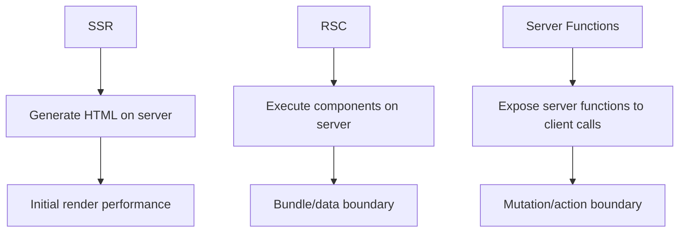
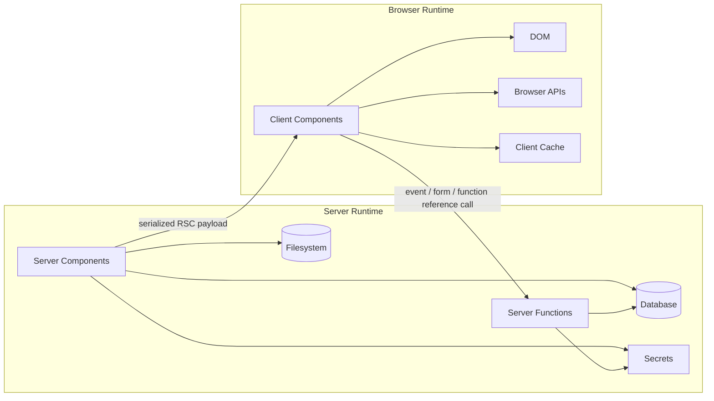
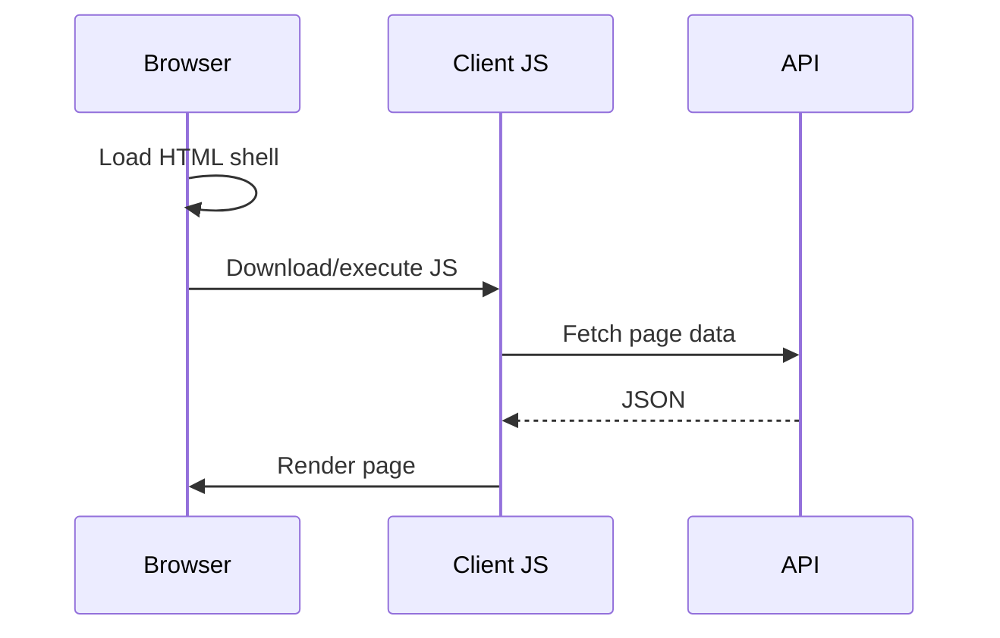
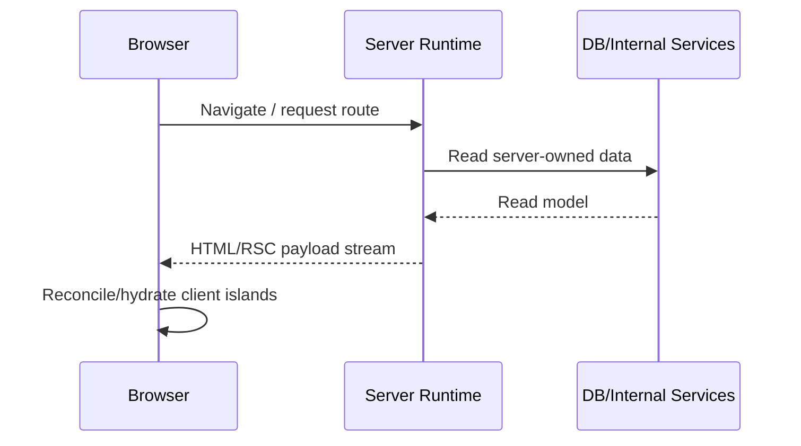
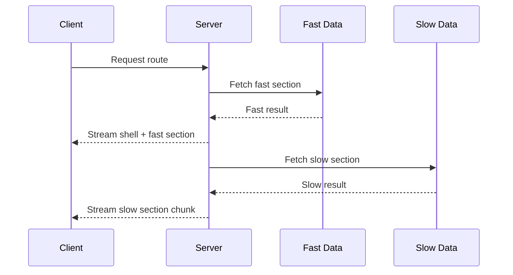

# Part 039 — React Server Components Boundary

> Target mental model: **React Server Components move part of your component tree into a server execution environment. They do not erase the client-server boundary; they make the boundary more explicit, more powerful, and easier to misuse.**

Part 038 closed Phase 5 by treating navigation performance as a graph scheduling problem.

Phase 6 starts with a bigger shift: React can now express UI whose component execution happens on the server and whose result is consumed by the client as a serialized React payload.

That sounds simple.

It is not.

The failure mode is to think:

```txt
Server Component = normal component, but faster
```

A better model:

```txt
Server Component = server-side computation that returns a serializable UI description.
Client Component = browser-side computation that owns interactivity and browser effects.
The boundary between them is a protocol boundary.
```

Once you see the boundary as a protocol, many rules become obvious:

1. server code can read databases and secrets;
2. client code can use browser APIs and interactive hooks;
3. data crossing the boundary must be serializable;
4. module references crossing the boundary must be understood by the bundler/framework;
5. authorization must still happen on the server;
6. client interaction still requires client JavaScript;
7. streaming changes timing, not ownership;
8. server execution does not automatically make APIs safe.

This part is about the boundary.

Not Next.js routing.

Not framework-specific file conventions.

The goal is to build the runtime model you need to design React client-server communication without cargo-culting `"use client"` and `"use server"`.

---

## 1. The Three Different Things People Confuse

When people say “server-side React”, they often mix three different concepts.

### 1.1 Server-Side Rendering

SSR renders React to HTML on the server.

```txt
React tree --> HTML string/stream --> browser DOM --> hydrate client app
```

SSR is about **initial HTML generation**.

The browser still receives client JavaScript for the interactive tree.

### 1.2 React Server Components

React Server Components execute selected components in a server environment.

```txt
Server Component execution --> serialized React payload --> client reconciles tree
```

RSC is about **where component code runs** and **what gets serialized to the client**.

A Server Component is not shipped to the browser as component code.

### 1.3 Server Functions / Actions

Server Functions are functions that run on the server but can be referenced from client code.

```txt
client calls function reference --> network request --> server executes function --> serialized result
```

Server Functions are about **client-triggered server execution**.

They are not Server Components.

They often appear together, but they are different primitives.



The most important distinction:

| Concept | Runs on server? | Sends component code to browser? | Main purpose |
|---|---:|---:|---|
| SSR | Yes | Usually yes for hydration | Fast initial HTML |
| Server Component | Yes | No for that component code | Server-owned UI/data composition |
| Client Component | No | Yes | Browser interactivity |
| Server Function | Yes | Function implementation no, reference yes | Server-side action callable from client |

---

## 2. The Runtime Topology

A modern RSC-capable React app has at least two execution environments.



The server environment can do things the browser must not:

1. access private databases;
2. read secrets;
3. call internal services;
4. perform privileged authorization checks;
5. use server-only libraries;
6. keep implementation details out of the client bundle.

The browser environment can do things the server cannot:

1. respond to clicks immediately;
2. use `useState`, `useReducer`, and event handlers;
3. access DOM and layout;
4. use browser-only APIs;
5. maintain per-tab ephemeral state;
6. subscribe to browser lifecycle events.

The boundary is not a stylistic preference.

It is a hard runtime separation.

---

## 3. Server Components Are Server-Executed UI Builders

A Server Component is best understood as an async server-side UI builder.

```tsx
// Server Component
export default async function InvoicePage({ invoiceId }: { invoiceId: string }) {
  const invoice = await invoiceRepository.getById(invoiceId);

  return (
    <main>
      <h1>Invoice {invoice.number}</h1>
      <InvoiceSummary invoice={invoice} />
    </main>
  );
}
```

The important thing is not the syntax.

The important thing is the execution location.

The component can await server data because it runs before the client receives the result.

But the component cannot own browser interactivity:

```tsx
// Wrong as a Server Component
export default function Counter() {
  const [count, setCount] = useState(0);
  return <button onClick={() => setCount(count + 1)}>{count}</button>;
}
```

Interactive behavior belongs in a Client Component.

```tsx
'use client';

import { useState } from 'react';

export function CounterButton() {
  const [count, setCount] = useState(0);
  return <button onClick={() => setCount(count + 1)}>{count}</button>;
}
```

Then the Server Component can compose the Client Component.

```tsx
import { CounterButton } from './CounterButton';

export default async function Page() {
  const initialCount = await getInitialCount();

  return (
    <section>
      <h1>Dashboard</h1>
      <CounterButton initialCount={initialCount} />
    </section>
  );
}
```

The Server Component builds the server-owned part.

The Client Component owns the interactive part.

---

## 4. `"use client"` Marks a Client Module Boundary

The `"use client"` directive is not a runtime call.

It is a source directive consumed by the framework/bundler.

```tsx
'use client';

import { useState } from 'react';
import { formatCurrency } from './formatCurrency';

export function PriceEditor() {
  const [value, setValue] = useState('');
  return <input value={value} onChange={(e) => setValue(e.target.value)} />;
}
```

Once a module is marked with `"use client"`, that module and its transitive dependencies become part of the client module graph.

That means this import can be dangerous:

```tsx
'use client';

import { calculatePrice } from '../domain/pricing';
```

If `calculatePrice` imports server-only code, secrets, Node APIs, or heavy dependencies, you have a boundary violation.

The rule:

```txt
A client module must only import code that is safe and intended to execute in the browser.
```

### 4.1 `"use client"` Is Viral Downward

```mermaid
flowchart TD
  A[Page.server.tsx] --> B[ProductDetails.server.tsx]
  A --> C[PriceEditor.client.tsx<br/>"use client"]
  C --> D[formatCurrency.ts]
  C --> E[Button.tsx]
  E --> F[icons.ts]

  C:::client
  D:::client
  E:::client
  F:::client

  classDef client fill:#ffe6a3,stroke:#946200,color:#222;
```

If `PriceEditor.client.tsx` imports `formatCurrency.ts`, `formatCurrency.ts` is client code for that import path.

A module can sometimes be evaluated in different environments depending on who imports it, but once it is inside the client graph, it must be browser-safe.

### 4.2 Prefer Small Client Islands

Bad boundary:

```tsx
'use client';

export default function WholePage() {
  // everything below ships to the client
}
```

Better boundary:

```tsx
// Server Component
export default async function ProductPage({ id }: { id: string }) {
  const product = await getProduct(id);

  return (
    <main>
      <ProductReadModel product={product} />
      <AddToCartButton productId={product.id} />
    </main>
  );
}
```

Only `AddToCartButton` needs browser interactivity.

Keep the rest server-owned.

---

## 5. There Is No `"use server"` for Server Components

This is a common misunderstanding.

```tsx
'use server'; // not how you mark a Server Component

export default function Page() {
  return <h1>Hello</h1>;
}
```

Server Components are server by default in RSC-capable frameworks unless they are inside a client module graph.

`"use server"` marks **Server Functions**, not Server Components.

This distinction matters because the security model is different.

A Server Component is executed as part of rendering.

A Server Function is callable from the client through a network request.

That means a Server Function is effectively an endpoint.

Part 040 covers that in depth.

---

## 6. What Crosses the RSC Boundary

In classic client-side React, component data crosses the network through JSON APIs.

In RSC, UI description and serialized values cross through the React Server Component payload.

Conceptually:

```txt
Server Component execution output
  -> serialized component tree description
  -> references to Client Component modules
  -> serializable props for Client Components
  -> streamed chunks when available
```

Do not rely on the exact wire format for application logic.

Treat it as React/framework protocol.

What matters for architecture is the boundary contract:

| Thing | Can cross? | Notes |
|---|---:|---|
| string/number/boolean/null | Yes | Serializable primitives |
| plain object/array of serializable values | Yes | Must remain data, not behavior |
| Date-like values | Framework-dependent serialization rules | Normalize deliberately |
| function implementation | No | Except Server Function reference mechanism |
| class instance with methods | No / avoid | Loses behavior or fails serialization |
| database connection | No | Server-only resource |
| secret | Must not | Boundary leak |
| event handler | No from Server to Client | Event handlers require Client Components |
| Client Component reference | Yes through bundler protocol | Client module reference, not code execution on server |

The practical rule:

```txt
Pass DTOs across the Server Component -> Client Component boundary.
Do not pass domain objects with behavior.
```

---

## 7. Boundary Serialization Is a Design Constraint

Assume you have a rich domain object:

```ts
class Invoice {
  constructor(
    public id: string,
    public totalCents: number,
    public status: 'draft' | 'issued' | 'paid',
  ) {}

  canBeCancelled() {
    return this.status === 'draft' || this.status === 'issued';
  }
}
```

Do not pass that class instance into a Client Component.

Create an explicit view model.

```ts
export type InvoiceView = {
  id: string;
  totalCents: number;
  status: 'draft' | 'issued' | 'paid';
  canCancel: boolean;
};

export function toInvoiceView(invoice: Invoice): InvoiceView {
  return {
    id: invoice.id,
    totalCents: invoice.totalCents,
    status: invoice.status,
    canCancel: invoice.canBeCancelled(),
  };
}
```

Then pass only the view model.

```tsx
export default async function InvoicePage({ id }: { id: string }) {
  const invoice = await invoiceRepository.getById(id);
  return <InvoiceClientPanel invoice={toInvoiceView(invoice)} />;
}
```

This is not boilerplate.

It is boundary hygiene.

A view model gives you:

1. serialization safety;
2. stable client contract;
3. permission-filtered data;
4. no accidental method leakage;
5. testable boundary output;
6. compatibility with streaming and caching.

---

## 8. Server Components Do Not Remove API Design

A dangerous conclusion:

```txt
If Server Components can query the database, we no longer need API boundaries.
```

That is wrong.

You may not need a public JSON endpoint for the same read model, but you still need a boundary contract.

The contract just moved from:

```txt
GET /api/invoices/:id -> JSON
```

to:

```txt
Server Component -> Client Component props / rendered output
```

You still need to decide:

1. who owns authorization;
2. what fields are allowed to leave the server;
3. what shape the client receives;
4. how loading and errors are represented;
5. how stale data is handled;
6. how mutations revalidate the view;
7. how observability correlates render work with user experience.

The server-client boundary remains.

Only the mechanism changes.

---

## 9. Data Ownership in Server Components

Server Components are strongest when the server owns the read model.

Good candidates:

1. product pages;
2. dashboards with server-assembled read models;
3. documentation pages;
4. CMS content;
5. account pages with permission-filtered data;
6. reports where data is expensive to compute and not highly interactive;
7. route shells that prepare data for client islands.

Poor candidates:

1. highly interactive editors;
2. local draft-heavy workflows;
3. drag-and-drop boards requiring immediate local interaction;
4. live collaborative surfaces with frequent client-originated updates;
5. canvas-heavy UI;
6. stateful widgets dominated by browser APIs.

A practical split:

```txt
Server Component:
  - assemble initial read model
  - enforce authz
  - reduce overfetching
  - keep heavy dependencies server-side
  - render non-interactive structure

Client Component:
  - own events
  - own local draft state
  - own browser API integration
  - own optimistic interaction
  - subscribe to realtime/browser lifecycle
```

---

## 10. Example: Server-Owned Read Model + Client-Owned Command Surface

```tsx
// app/invoices/[id]/page.tsx
import { InvoiceCommandPanel } from './InvoiceCommandPanel';
import { getInvoicePage } from '@/server/invoices/getInvoicePage';

export default async function InvoicePage({ params }: { params: { id: string } }) {
  const page = await getInvoicePage(params.id);

  return (
    <main>
      <header>
        <h1>Invoice {page.invoice.number}</h1>
        <p>{page.invoice.statusLabel}</p>
      </header>

      <section>
        <h2>Lines</h2>
        <ul>
          {page.lines.map((line) => (
            <li key={line.id}>{line.description} — {line.amountLabel}</li>
          ))}
        </ul>
      </section>

      <InvoiceCommandPanel
        invoiceId={page.invoice.id}
        allowedCommands={page.allowedCommands}
      />
    </main>
  );
}
```

```tsx
// app/invoices/[id]/InvoiceCommandPanel.tsx
'use client';

export function InvoiceCommandPanel({
  invoiceId,
  allowedCommands,
}: {
  invoiceId: string;
  allowedCommands: Array<'issue' | 'cancel' | 'pay'>;
}) {
  return (
    <div>
      {allowedCommands.includes('issue') && <button>Issue</button>}
      {allowedCommands.includes('cancel') && <button>Cancel</button>}
      {allowedCommands.includes('pay') && <button>Pay</button>}
    </div>
  );
}
```

Notice the boundary.

The client receives:

1. an invoice ID;
2. a list of allowed command names;
3. no raw permission graph;
4. no database object;
5. no server secret;
6. no implementation detail.

The server still must authorize every command when it is executed.

The UI permission is convenience, not security.

---

## 11. Server Components and Authorization

Server Components can improve authorization hygiene because data fetching can happen in server-only code.

But they can also hide authorization mistakes.

Bad:

```tsx
export default async function AdminPanel() {
  const users = await db.user.findMany();
  return <UserTable users={users} />;
}
```

Better:

```tsx
export default async function AdminPanel({ viewer }: { viewer: Viewer }) {
  await requirePermission(viewer, 'user.read.all');

  const users = await userReadModel.listForAdmin(viewer.tenantId);
  return <UserTable users={users.map(toUserRow)} />;
}
```

Rules:

1. authorize before reading sensitive data;
2. scope every query by tenant/account/org;
3. map data to permission-filtered DTOs;
4. never rely on hidden client code for security;
5. treat Client Component props as exposed to the browser;
6. log denied render attempts as security-relevant events.

Server Components are not a permission system.

They are a safer place to enforce one.

---

## 12. Server Components and Secrets

A server-only module may read secrets.

```ts
// server/payments.ts
export async function getPaymentConfig() {
  return {
    providerAccountId: process.env.PAYMENT_ACCOUNT_ID!,
    secretKey: process.env.PAYMENT_SECRET_KEY!,
  };
}
```

But the return value from a Server Component can still leak secrets if you pass it down.

Bad:

```tsx
const config = await getPaymentConfig();
return <PaymentWidget config={config} />;
```

Better:

```tsx
const publishableConfig = await getPublishablePaymentConfig();
return <PaymentWidget accountId={publishableConfig.accountId} />;
```

Boundary rule:

```txt
Server-only access does not mean server-only output.
Every value passed to a Client Component must be treated as public to that browser session.
```

---

## 13. Boundary Placement Heuristics

A boundary should be placed where ownership changes.

Not where file organization feels convenient.

### 13.1 Put the Boundary Low When Only a Small Piece Is Interactive

```tsx
export default async function ArticlePage() {
  const article = await getArticle();

  return (
    <article>
      <MarkdownBody source={article.body} />
      <LikeButton articleId={article.id} />
    </article>
  );
}
```

Only `LikeButton` needs client execution.

### 13.2 Put the Boundary Higher When Interaction Owns the Whole Surface

```tsx
export default async function EditorPage({ id }: { id: string }) {
  const initialDraft = await getDraft(id);
  return <RichEditor initialDraft={initialDraft} />;
}
```

A rich editor may own browser events, selection, keyboard shortcuts, autosave, undo stack, and local draft state.

Forcing tiny client islands inside it can make design worse.

### 13.3 Put Server Work Behind the Boundary When It Requires Privilege

```tsx
export default async function BillingPage() {
  const billing = await getBillingReadModelForViewer();
  return <BillingSummary billing={billing} />;
}
```

The read model belongs server-side because it needs authorization, sensitive filtering, and internal service calls.

---

## 14. Boundary Decision Matrix

| Requirement | Prefer Server Component | Prefer Client Component |
|---|---:|---:|
| Reads database directly | Yes | No |
| Needs secret/internal token | Yes | No |
| Uses `useState`/event handlers | No | Yes |
| Uses DOM measurements | No | Yes |
| Large server-only dependency | Yes | No |
| Highly interactive local draft | Usually no | Yes |
| SEO/static content | Often yes | Sometimes |
| User-specific permission-filtered read model | Often yes | Client receives filtered output |
| Realtime subscription | Initial render yes | Subscription client-side |
| Needs browser storage | No | Yes |

The more a component is about **read model assembly**, the more it belongs server-side.

The more a component is about **interaction lifecycle**, the more it belongs client-side.

---

## 15. Data Fetching in Server Components

Server Components let you colocate server data reads with server-rendered UI.

```tsx
export default async function CustomerSummary({ customerId }: { customerId: string }) {
  const customer = await customerRepository.getSummary(customerId);

  return (
    <section>
      <h2>{customer.name}</h2>
      <p>{customer.segment}</p>
    </section>
  );
}
```

This reduces client waterfalls because the browser does not need to first download JavaScript, render, then discover the fetch.

But it can create server waterfalls.

Bad:

```tsx
async function OrderList({ customerId }: { customerId: string }) {
  const orders = await getOrders(customerId);

  return (
    <ul>
      {orders.map((order) => (
        <OrderRow key={order.id} orderId={order.id} />
      ))}
    </ul>
  );
}

async function OrderRow({ orderId }: { orderId: string }) {
  const order = await getOrder(orderId);
  return <li>{order.number}</li>;
}
```

This can become server-side N+1.

Better:

```tsx
async function OrderList({ customerId }: { customerId: string }) {
  const orders = await getOrderRowsForCustomer(customerId);

  return (
    <ul>
      {orders.map((order) => (
        <li key={order.id}>{order.number}</li>
      ))}
    </ul>
  );
}
```

RSC does not remove data modeling.

It moves part of the modeling to the server render graph.

---

## 16. Server Render Graph vs Client Fetch Graph

Before RSC:



With RSC:



The client waterfall can shrink.

But the server graph becomes more important.

You must still ask:

1. are server fetches parallelized;
2. are repeated reads deduped;
3. are per-user caches scoped safely;
4. are errors isolated by boundary;
5. are slow subtrees streamed;
6. are expensive reads moved out of hot render paths;
7. are permission checks done before data access.

---

## 17. Streaming Changes Timing, Not Semantics

RSC-capable frameworks can stream parts of the response.

Streaming is useful when:

1. shell can render before slow data;
2. above-the-fold content is fast;
3. below-the-fold content can arrive later;
4. independent subtrees have different latency;
5. fallback UI is meaningful.

Streaming does not change who owns data.

It changes when bytes arrive.



Bad streaming:

```txt
stream random skeletons without product meaning
```

Good streaming:

```txt
stream stable layout and critical decision context first;
stream slow, independent, non-blocking sections later
```

---

## 18. Error Boundaries and RSC

A Server Component can fail during server render.

Failure can happen because:

1. database is unavailable;
2. authorization denies access;
3. input parameter is invalid;
4. internal service times out;
5. serialization fails;
6. a child server subtree throws.

Design errors as boundaries.

```tsx
export default async function Page({ params }: { params: { id: string } }) {
  const invoice = await getInvoiceOrThrow(params.id);
  return <InvoiceView invoice={invoice} />;
}
```

Then isolate rendering failures at route/subtree level.

```txt
critical page shell
  -> invoice summary boundary
  -> activity feed boundary
  -> recommendations boundary
```

A dashboard should not become blank because an optional recommendation widget failed.

Part 043 goes deeper into streaming and partial data.

The key here:

```txt
Server execution introduces server failure into the render path.
Treat render failure like API failure.
```

---

## 19. Client Component Props Are an API

This code is a contract:

```tsx
<ProductActions
  productId={product.id}
  canBuy={permissions.canBuy}
  stockLabel={product.stockLabel}
/>
```

It deserves the same care as an API response.

Ask:

1. is `productId` stable;
2. can `canBuy` become stale;
3. is `stockLabel` locale-specific;
4. should the client know raw stock count;
5. what happens if user clicks after permission changes;
6. how does mutation refresh the server-rendered view;
7. can this prop leak tenant data;
8. does the prop shape force client rework when backend changes.

A good Client Component prop contract is narrow.

Bad:

```tsx
<ProductActions product={fullProductFromDatabase} viewer={fullViewerObject} />
```

Better:

```tsx
<ProductActions
  productId={product.id}
  commands={['add-to-cart', 'save']}
  displayPrice={product.displayPrice}
/>
```

---

## 20. Server Components and Client Cache

Do Server Components replace React Query, SWR, Apollo, or a client cache?

Not universally.

They solve different problems.

RSC is strong for:

1. initial server-owned read model;
2. route-level composition;
3. reducing client bundle/data waterfalls;
4. server-only data access;
5. streaming UI from server.

Client cache remains useful for:

1. highly interactive refetching;
2. background freshness;
3. optimistic updates;
4. infinite scrolling;
5. polling/realtime integration;
6. tab-local state preservation;
7. client-only workflows after initial render.

A common hybrid:

```txt
Server Component:
  render initial route read model

Client Component:
  hydrate or seed query cache for interactive sections
  own mutations and optimistic state
  invalidate/refetch after commands
```

Avoid duplicate ownership.

Bad:

```txt
same invoice read model owned by RSC output, React Query cache, Zustand store, and local state
```

Better:

```txt
RSC owns initial page shell;
query cache owns interactive activity feed refresh;
local state owns form draft.
```

---

## 21. Mutations From a Server Component World

A Server Component cannot handle a click directly.

Clicks happen in the browser.

The common mutation paths are:

1. Client Component calls JSON/RPC API;
2. Client Component submits a form/action;
3. Client Component calls a Server Function reference;
4. route action handles mutation and revalidates route data;
5. realtime event updates client after server mutation.

The important point:

```txt
Server Components are read/render primitives.
Mutations still need an action boundary.
```

That action boundary needs:

1. validation;
2. authorization;
3. idempotency when necessary;
4. conflict detection;
5. audit logging;
6. revalidation;
7. client pending/error state.

Part 040 handles Server Functions and Actions as that boundary.

---

## 22. Naming Conventions That Prevent Boundary Bugs

Use file/module naming to make boundary visible.

Examples:

```txt
InvoicePage.server.tsx
InvoiceCommandPanel.client.tsx
invoice.read-model.server.ts
invoice.actions.server.ts
invoice.dto.ts
formatCurrency.shared.ts
```

The suffixes are not universal React requirements.

They are design aids.

The goal is to prevent accidental imports.

A simple convention:

| Suffix | Meaning |
|---|---|
| `.server.ts` | Must never enter browser bundle |
| `.client.tsx` | Browser-safe, may use hooks/events/DOM |
| `.shared.ts` | Safe in both runtimes |
| `.dto.ts` | Serializable boundary types |
| `.schema.ts` | Runtime validation schema |

Then enforce with lint/build rules where possible.

---

## 23. The Shared Module Trap

A “shared” module often becomes a dumping ground.

Bad:

```ts
// shared/domain.ts
import { db } from '../server/db';

export function formatInvoice(invoice: Invoice) {
  return `${invoice.number}`;
}

export async function getInvoice(id: string) {
  return db.invoice.findUnique({ where: { id } });
}
```

If a Client Component imports `formatInvoice`, bundling may discover server-only imports.

Better:

```txt
invoice.format.shared.ts      // pure formatting only
invoice.repository.server.ts  // database only
invoice.dto.ts                // serializable shapes
invoice.policy.server.ts      // permission checks
```

Shared code must be boring.

Pure functions.

No secret reads.

No filesystem.

No database.

No Node-only APIs.

No hidden global mutable state.

---

## 24. RSC and Bundle Size

A Server Component's implementation does not need to ship to the client as browser-executed component code.

This can reduce bundle size when you keep heavy code server-side.

Good:

```tsx
// Server Component
import { expensiveMarkdownRenderer } from '@/server/markdown';

export default async function ArticleBody({ id }: { id: string }) {
  const article = await getArticle(id);
  const html = await expensiveMarkdownRenderer(article.markdown);

  return <div dangerouslySetInnerHTML={{ __html: html }} />;
}
```

Bad:

```tsx
'use client';

import { expensiveMarkdownRenderer } from '@/server/markdown';
```

The second version likely pulls expensive or invalid server dependencies toward the browser.

Boundary placement directly affects bundle size.

But do not optimize bundle size at the cost of broken interaction ownership.

A rich editor needs client code.

A rendered article body usually does not.

---

## 25. RSC and Backend Load

RSC can reduce browser requests.

It can also increase server render work.

Watch for:

1. repeated DB reads per component;
2. expensive render-time computations;
3. low cache hit rate;
4. per-request duplication;
5. N+1 service calls;
6. slow authorization checks repeated in child components;
7. high cardinality per-user render cache;
8. streaming many tiny chunks with overhead;
9. server actions causing broad revalidation storms.

A strong RSC architecture treats server render as a backend workload.

It needs:

1. deadlines;
2. batching;
3. caching;
4. tracing;
5. circuit breakers for optional panels;
6. query planning;
7. explicit dependency graphs;
8. load tests.

React did not make backend performance disappear.

It moved more frontend-owned reads into backend render paths.

---

## 26. Observability for RSC Boundary

You need traces that show:

```txt
navigation request
  -> server render
    -> authz check
    -> read model fetches
    -> component subtree render
    -> stream chunks
  -> client hydration/reconciliation
  -> client island interaction
```

At minimum, capture:

1. route ID;
2. viewer/tenant scope without leaking PII;
3. render duration;
4. slow server data dependency;
5. number of server data calls;
6. streamed chunk timing;
7. serialization failures;
8. client hydration errors;
9. client island bundle size;
10. mutation-to-revalidation latency.

Boundary bugs are hard to debug if traces stop at “HTTP 200”.

An RSC response can be HTTP-successful but UI-broken.

---

## 27. Testing Server/Client Boundaries

Test the boundary at multiple levels.

### 27.1 Server Read Model Test

```ts
it('returns only fields allowed for invoice viewer', async () => {
  const viewer = viewerWithPermission('invoice.read');
  const page = await getInvoicePage({ viewer, invoiceId: 'inv_123' });

  expect(page.invoice).toEqual({
    id: 'inv_123',
    number: 'INV-123',
    statusLabel: 'Issued',
  });

  expect(page).not.toHaveProperty('internalRiskScore');
});
```

### 27.2 Serialization Test

```ts
import { expectSerializable } from './test/serialization';

it('invoice page model is serializable', async () => {
  const model = await getInvoicePageModel(testInput);
  expectSerializable(model);
});
```

### 27.3 Client Island Test

```tsx
it('disables unavailable commands', () => {
  render(<InvoiceCommandPanel invoiceId="inv_1" allowedCommands={['pay']} />);

  expect(screen.getByRole('button', { name: /pay/i })).toBeEnabled();
  expect(screen.queryByRole('button', { name: /cancel/i })).not.toBeInTheDocument();
});
```

### 27.4 Import Boundary Test

Use lint/build rules to prevent `.client.tsx` from importing `.server.ts`.

```txt
client module import graph must not include server-only module
```

This is not optional in large teams.

One bad import can move secret-bearing or Node-only code toward the wrong runtime.

---

## 28. Failure Mode Catalog

### 28.1 Accidental Whole-Page Clientification

Symptom:

```txt
large bundle, lost server-only benefits, more client waterfalls
```

Cause:

```txt
"use client" placed too high
```

Fix:

```txt
move interactivity into smaller client islands
```

### 28.2 Server-Only Import in Client Graph

Symptom:

```txt
build failure, runtime failure, secret exposure risk
```

Cause:

```txt
client module imports shared module that imports server dependency
```

Fix:

```txt
split shared/server modules; enforce lint rules
```

### 28.3 Non-Serializable Prop

Symptom:

```txt
serialization error, hydration mismatch, missing behavior
```

Cause:

```txt
passing class instance/function/db object to Client Component
```

Fix:

```txt
map to explicit DTO/view model
```

### 28.4 Hidden Authorization Leak

Symptom:

```txt
client receives fields it should not know
```

Cause:

```txt
server read model returns raw entity
```

Fix:

```txt
authorize, scope, project, redact
```

### 28.5 Server Render N+1

Symptom:

```txt
route is slow under load despite fewer browser requests
```

Cause:

```txt
nested Server Components each fetch independently
```

Fix:

```txt
batch, preload, aggregate, cache per request
```

### 28.6 Duplicate State Ownership

Symptom:

```txt
RSC output says one thing, client cache says another
```

Cause:

```txt
same read model owned by multiple layers
```

Fix:

```txt
assign ownership: RSC initial shell, query cache interactive refresh, local form draft
```

---

## 29. Production Boundary Checklist

Before introducing RSC into a production workflow, answer these questions.

### Runtime Boundary

- Which modules are server-only?
- Which modules are client-only?
- Which modules are truly shared?
- Is the import graph enforced?
- Are client islands as small as they can be without hurting interaction design?

### Data Boundary

- What exact data crosses into Client Components?
- Is every prop serializable?
- Are raw domain/database objects blocked?
- Are secrets impossible to serialize accidentally?
- Are DTOs versionable?

### Authorization Boundary

- Is authorization done before data access?
- Is every query scoped by tenant/account/org?
- Are UI permissions treated as hints, not enforcement?
- Are denied render attempts observable?

### Performance Boundary

- Are server data dependencies batched?
- Are optional slow panels isolated?
- Are server render waterfalls traced?
- Are client island bundle sizes monitored?
- Does streaming improve meaningful UX, or just show skeleton noise?

### Mutation Boundary

- What handles commands?
- How is server-rendered data revalidated?
- How are unknown mutation outcomes handled?
- Does the client have a clear pending/error state?

---

## 30. Summary

React Server Components change the topology of React client-server communication.

They let component execution happen on the server.

They let server-owned read models be composed closer to UI structure.

They can reduce client bundle size and client-side fetch waterfalls.

But they do not eliminate boundaries.

They introduce new ones:

1. server module graph vs client module graph;
2. serialized UI payload vs executable browser code;
3. server-owned read model vs client-owned interaction;
4. render-time data access vs command-time mutation;
5. permission-filtered DTOs vs raw domain objects;
6. server render workload vs browser runtime workload.

The key invariant:

```txt
A Server Component may run on the server, but anything it passes to a Client Component has crossed into the browser trust boundary.
```

That one sentence prevents most RSC architecture mistakes.

Part 040 builds on this by treating Server Functions and Actions as explicit client-triggered server execution boundaries.

---

## References

- React Docs — Server Components: https://react.dev/reference/rsc/server-components
- React Docs — `"use client"`: https://react.dev/reference/rsc/use-client
- React Docs — Directives: https://react.dev/reference/rsc/directives
- React Docs — Server Functions: https://react.dev/reference/rsc/server-functions
- React Docs — `use`: https://react.dev/reference/react/use
- React DOM — `hydrateRoot`: https://react.dev/reference/react-dom/client/hydrateRoot
