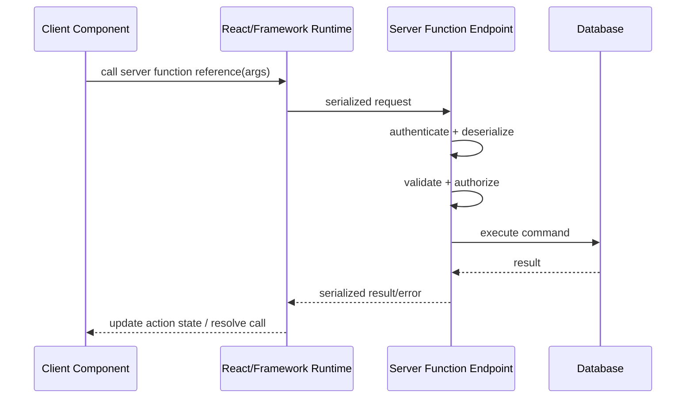
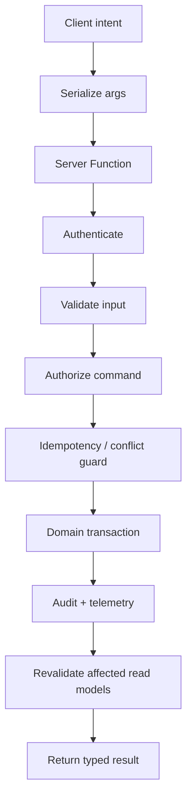

# Part 040 — Server Functions and Actions

> Target mental model: **a Server Function is not “just a function”. From the browser’s point of view, it is a remote command endpoint disguised as a function reference.**

Part 039 built the React Server Components boundary:

```txt
Server Component = server-executed UI/data composition
Client Component = browser-executed interactivity
```

Now we handle the other side:

```txt
How does a Client Component ask the server to do something?
```

Classic answer:

```txt
fetch('/api/...')
```

RSC-era answer:

```txt
call a Server Function / submit an Action
```

That is a powerful abstraction.

It is also dangerous if misunderstood.

A Server Function may look like this:

```tsx
await updateInvoice(invoiceId, input);
```

But operationally it behaves closer to this:

```txt
serialize arguments
send network request
authenticate session
authorize command
validate input
execute server code
commit side effect
serialize return value
send response
update client UI
revalidate server-rendered data
```

The syntax is function-like.

The semantics are distributed systems semantics.

---

## 1. What `"use server"` Actually Means

`"use server"` marks server-side functions that can be called from client-side code through framework support.

It does not mark a component as a Server Component.

Server Components have no `"use server"` directive.

The directive is for Server Functions.

```ts
// actions.ts
'use server';

export async function createInvoice(formData: FormData) {
  // runs on the server
}
```

Or inline, depending on framework support:

```tsx
export default function Page() {
  async function createInvoice(formData: FormData) {
    'use server';
    // runs on the server
  }

  return <form action={createInvoice}>...</form>;
}
```

The important model:

```txt
The client receives a reference.
The server keeps the implementation.
Calling the reference from the client sends a request to the server.
```



From architecture perspective, a Server Function is an endpoint with a generated protocol wrapper.

Treat it with the same seriousness as a public API route.

---

## 2. Server Functions vs Server Components

| Dimension | Server Component | Server Function |
|---|---|---|
| Runs on server | Yes | Yes |
| Main job | Produce UI/read model | Execute callable server logic |
| Triggered by | Render/navigation | Client call/form/action |
| Can be imported by client | No as implementation | Yes as reference through framework |
| Can access DB/secrets | Yes | Yes |
| Can mutate data | Avoid in render path | Yes, often primary purpose |
| Needs validation/authz | Yes for data reads | Yes, strongly |
| Serializable boundary | Props/render payload | Args/return value |
| Failure shape | Render error/boundary | Action result/error/pending state |

The short version:

```txt
Server Components are read/render boundaries.
Server Functions are command/execution boundaries.
```

Do not mix them casually.

---

## 3. Why Server Functions Exist

Without Server Functions, a Client Component usually does this:

```tsx
await api.post('/invoices', payload);
```

With Server Functions, the client may do this:

```tsx
await createInvoice(payload);
```

The benefit is not that HTTP disappeared.

The benefit is that the framework can coordinate:

1. function reference generation;
2. form submission integration;
3. progressive enhancement;
4. pending state hooks;
5. serialization;
6. server-rendered data revalidation;
7. co-location of command code with route/server code;
8. reduced manual endpoint boilerplate.

But the network still exists.

This means every server function still needs:

1. input validation;
2. authentication;
3. authorization;
4. idempotency where required;
5. domain transaction boundaries;
6. conflict handling;
7. audit logging;
8. observability;
9. safe output shape;
10. rate/abuse controls.

Server Functions improve ergonomics.

They do not weaken production requirements.

---

## 4. The Argument and Return Value Boundary

Calling a Server Function from the client sends serialized arguments.

Returning from a Server Function sends a serialized result.

That creates a contract.

Bad:

```ts
'use server';

export async function updateInvoice(invoice: InvoiceDomainObject) {
  await invoice.save();
  return invoice;
}
```

Problems:

1. client cannot safely construct domain object;
2. class behavior cannot cross boundary cleanly;
3. raw entity may leak fields;
4. return shape is unstable;
5. authorization is unclear.

Better:

```ts
'use server';

export type UpdateInvoiceInput = {
  invoiceId: string;
  expectedVersion: number;
  patch: {
    dueDate?: string;
    memo?: string;
  };
};

export type UpdateInvoiceResult =
  | { ok: true; invoiceId: string; version: number }
  | { ok: false; code: 'VALIDATION_ERROR'; fieldErrors: Record<string, string> }
  | { ok: false; code: 'CONFLICT'; currentVersion: number }
  | { ok: false; code: 'FORBIDDEN' };

export async function updateInvoice(input: UpdateInvoiceInput): Promise<UpdateInvoiceResult> {
  const viewer = await requireViewer();
  const parsed = parseUpdateInvoiceInput(input);

  if (!parsed.ok) {
    return { ok: false, code: 'VALIDATION_ERROR', fieldErrors: parsed.fieldErrors };
  }

  const decision = await authorize(viewer, 'invoice.update', parsed.value.invoiceId);
  if (!decision.allowed) {
    return { ok: false, code: 'FORBIDDEN' };
  }

  const result = await invoiceService.update(viewer, parsed.value);

  if (result.type === 'conflict') {
    return { ok: false, code: 'CONFLICT', currentVersion: result.currentVersion };
  }

  return { ok: true, invoiceId: result.invoiceId, version: result.version };
}
```

This makes the boundary explicit.

It gives the client a finite set of outcomes.

---

## 5. Server Functions as Command Handlers

A production Server Function should look more like a command handler than a random utility.

```txt
Server Function
  -> authenticate
  -> parse/validate
  -> authorize
  -> normalize command
  -> enforce idempotency/conflict rules
  -> execute domain transaction
  -> audit
  -> revalidate/invalidate
  -> return narrow result
```



This is almost identical to a robust API endpoint.

That is the point.

The syntax changed.

The invariants did not.

---

## 6. Forms Are the Natural Action Boundary

Server Functions pair naturally with forms.

```tsx
// actions.ts
'use server';

export async function createProject(formData: FormData) {
  const name = String(formData.get('name') ?? '').trim();

  if (!name) {
    return { ok: false, fieldErrors: { name: 'Name is required' } };
  }

  const viewer = await requireViewer();
  const project = await projectService.create({ viewer, name });

  return { ok: true, projectId: project.id };
}
```

```tsx
// CreateProjectForm.tsx
'use client';

import { useActionState } from 'react';
import { createProject } from './actions';

const initialState = { ok: false as const, fieldErrors: {} as Record<string, string> };

export function CreateProjectForm() {
  const [state, formAction, pending] = useActionState(createProject, initialState);

  return (
    <form action={formAction}>
      <label>
        Name
        <input name="name" aria-invalid={Boolean(state.fieldErrors?.name)} />
      </label>
      {state.fieldErrors?.name && <p role="alert">{state.fieldErrors.name}</p>}
      <button disabled={pending}>{pending ? 'Creating...' : 'Create project'}</button>
    </form>
  );
}
```

The form is not a detail.

It gives you:

1. a native submission model;
2. progressive enhancement potential;
3. `FormData` as boundary input;
4. pending state;
5. accessible error display;
6. retry/recovery behavior;
7. a clear command lifecycle.

---

## 7. `useActionState` Is State Around a Command

`useActionState` lets a component update local UI state based on an action result.

The model:

```txt
previous action state + submitted input -> action -> next action state
```

It is not a replacement for all form libraries.

It is not a global server-state cache.

It is useful when:

1. result state belongs to the form/interaction;
2. server validation returns field/form errors;
3. pending state should be local;
4. action result should drive UI;
5. command does not require complex client-only draft management.

It is less sufficient when:

1. form has complex client-side validation UX;
2. draft state spans many widgets;
3. offline editing is required;
4. autosave conflict resolution is rich;
5. optimistic UI spans many caches.

Use it as an action-state primitive, not as an architecture by itself.

---

## 8. `useFormStatus` Is Scoped to a Form

A submit button often needs to know whether the current form is pending.

```tsx
'use client';

import { useFormStatus } from 'react-dom';

export function SubmitButton() {
  const status = useFormStatus();

  return (
    <button disabled={status.pending}>
      {status.pending ? 'Saving...' : 'Save'}
    </button>
  );
}
```

Then:

```tsx
<form action={saveInvoice}>
  <input name="memo" />
  <SubmitButton />
</form>
```

The important rule:

```txt
Form status is contextual.
The button must be rendered inside the form whose status it reads.
```

This avoids global pending flags.

It also prevents one form submission from disabling unrelated surfaces.

---

## 9. Validation Belongs on the Server

Client validation is useful.

Server validation is mandatory.

A Server Function is callable by a client.

That client may be:

1. your UI;
2. a stale browser tab;
3. a modified script;
4. a malicious actor;
5. an old deployed client bundle;
6. a bot replaying requests.

Therefore:

```txt
Never trust Server Function arguments.
```

A good validation pipeline:

```ts
function parseCreateProject(formData: FormData) {
  const raw = {
    name: formData.get('name'),
    visibility: formData.get('visibility'),
  };

  const fieldErrors: Record<string, string> = {};

  const name = typeof raw.name === 'string' ? raw.name.trim() : '';
  if (name.length < 3) {
    fieldErrors.name = 'Name must be at least 3 characters.';
  }

  const visibility = raw.visibility === 'private' || raw.visibility === 'team'
    ? raw.visibility
    : 'private';

  if (Object.keys(fieldErrors).length > 0) {
    return { ok: false as const, fieldErrors };
  }

  return { ok: true as const, value: { name, visibility } };
}
```

Keep validation output user-safe.

Bad:

```txt
SQL constraint violation: projects_org_id_name_key
```

Better:

```txt
A project with this name already exists in this workspace.
```

---

## 10. Authorization Must Be Rechecked Inside the Server Function

Do not rely on what the Server Component rendered.

Bad:

```tsx
{canDelete && <DeleteButton invoiceId={invoice.id} />}
```

Then:

```ts
'use server';

export async function deleteInvoice(invoiceId: string) {
  await db.invoice.delete({ where: { id: invoiceId } });
}
```

This is broken.

The button visibility is not security.

Correct:

```ts
'use server';

export async function deleteInvoice(invoiceId: string) {
  const viewer = await requireViewer();

  await requirePermission(viewer, 'invoice.delete', invoiceId);

  await invoiceService.delete({ viewer, invoiceId });

  return { ok: true };
}
```

Permission can change between render and click.

The client can call references directly.

The user can have multiple tabs.

The only authoritative check is server-side at command time.

---

## 11. Treat Server Function References as Public Capabilities

A Server Function implementation is not shipped to the client.

But a callable reference can exist in the browser.

That means the callable surface must be safe.

Do not expose overly broad functions:

```ts
'use server';

export async function adminExecute(sql: string) {
  return db.raw(sql);
}
```

Absurd example, but the shape appears in real systems as:

```ts
export async function updateAnyModel(modelName: string, id: string, patch: unknown) {}
```

Prefer command-specific functions:

```ts
export async function renameProject(input: RenameProjectInput) {}
export async function archiveProject(input: ArchiveProjectInput) {}
export async function inviteProjectMember(input: InviteMemberInput) {}
```

Each command should have:

1. narrow input;
2. narrow permission;
3. narrow transaction;
4. narrow audit event;
5. narrow output.

Broad server functions are hidden admin APIs.

---

## 12. Idempotency and Unknown Outcomes

A user submits a form.

The browser sends the request.

The server commits the transaction.

The response is lost.

What does the client know?

```txt
nothing definitive
```

This is the unknown outcome problem.

Server Functions do not remove it.

For high-value mutations, include idempotency.

```tsx
<form action={createPayment}>
  <input type="hidden" name="idempotencyKey" value={idempotencyKey} />
  <input name="amount" />
  <SubmitButton />
</form>
```

```ts
'use server';

export async function createPayment(formData: FormData) {
  const viewer = await requireViewer();
  const input = parsePaymentForm(formData);

  return await idempotency.run({
    scope: `payment:${viewer.tenantId}:${viewer.userId}`,
    key: input.idempotencyKey,
    execute: async () => {
      await requirePermission(viewer, 'payment.create');
      const payment = await paymentService.create(input);
      return { ok: true as const, paymentId: payment.id };
    },
  });
}
```

Use idempotency for:

1. payments;
2. orders;
3. account creation;
4. invite sending;
5. external API calls;
6. destructive commands;
7. commands users may retry after timeout.

A retry without idempotency can duplicate side effects.

---

## 13. Conflict Detection

Server Functions often mutate stale data.

Example:

1. user renders invoice version 7;
2. another user updates invoice to version 8;
3. first user submits edit based on version 7;
4. server must detect stale write.

Input:

```ts
type UpdateInvoiceInput = {
  invoiceId: string;
  expectedVersion: number;
  patch: {
    memo: string;
  };
};
```

Server:

```ts
const result = await invoiceService.updateIfVersionMatches({
  invoiceId: input.invoiceId,
  expectedVersion: input.expectedVersion,
  patch: input.patch,
});

if (result.type === 'conflict') {
  return {
    ok: false,
    code: 'CONFLICT',
    currentVersion: result.currentVersion,
    message: 'This invoice changed while you were editing.',
  };
}
```

Client:

```tsx
{state.code === 'CONFLICT' && (
  <p role="alert">
    This invoice changed while you were editing. Reload and review the latest version.
  </p>
)}
```

Do not overwrite blindly.

Server Functions make mutation easy.

They do not make mutation safe.

---

## 14. Revalidation After Server Functions

After a mutation, server-rendered data may be stale.

You need a revalidation strategy.

Possible approaches:

1. framework route revalidation;
2. redirect after successful action;
3. refresh current route;
4. invalidate client query cache;
5. patch local client state;
6. receive realtime event;
7. return updated view model.

The right strategy depends on ownership.

```txt
If route Server Component owns the read model:
  revalidate/refresh route after mutation.

If React Query owns the interactive list:
  invalidate/update query cache after mutation.

If local form owns draft only:
  reset draft after successful mutation.
```

Avoid duplicating all strategies at once.

Bad:

```txt
server action returns full object
+ route refresh
+ query invalidate
+ local store patch
+ websocket echo
```

This creates state fights.

Pick the owner and update that owner.

---

## 15. Return Shapes: Throw vs Return Result

A Server Function can fail in different ways.

Not every failure should be thrown.

Use return values for expected business outcomes:

1. validation error;
2. conflict;
3. forbidden command that maps to UI state;
4. duplicate idempotency key;
5. domain rule violation.

Use exceptions for unexpected failures:

1. database unavailable;
2. invariant violation;
3. dependency timeout;
4. serialization failure;
5. bug.

Pattern:

```ts
type ActionResult<T> =
  | { ok: true; data: T }
  | { ok: false; code: 'VALIDATION_ERROR'; fieldErrors: Record<string, string> }
  | { ok: false; code: 'FORBIDDEN' }
  | { ok: false; code: 'CONFLICT'; message: string };
```

Then:

```ts
export async function renameProject(input: RenameProjectInput): Promise<ActionResult<{ projectId: string }>> {
  const viewer = await requireViewer();
  const parsed = parseRenameProject(input);

  if (!parsed.ok) {
    return { ok: false, code: 'VALIDATION_ERROR', fieldErrors: parsed.fieldErrors };
  }

  const allowed = await canRenameProject(viewer, parsed.value.projectId);
  if (!allowed) {
    return { ok: false, code: 'FORBIDDEN' };
  }

  const result = await projectService.rename(viewer, parsed.value);

  if (result.type === 'conflict') {
    return { ok: false, code: 'CONFLICT', message: 'Project changed. Reload and try again.' };
  }

  return { ok: true, data: { projectId: result.projectId } };
}
```

A finite result union makes the client deterministic.

---

## 16. Server Function Security Checklist

A Server Function is a remotely invokable server entry point.

Checklist:

- Does it authenticate the viewer?
- Does it authorize the specific command and resource?
- Does it validate all arguments server-side?
- Does it scope by tenant/account/org?
- Does it avoid trusting client-provided user IDs?
- Does it prevent mass assignment?
- Does it enforce rate/abuse limits when needed?
- Does it use CSRF protection where the framework/browser model requires it?
- Does it avoid returning secrets/internal fields?
- Does it log security-relevant denials?
- Does it avoid broad generic command surfaces?
- Does it include idempotency for duplicate-sensitive side effects?
- Does it handle stale writes/conflicts?

Bad Server Functions become invisible API vulnerabilities.

Good Server Functions are explicit command handlers.

---

## 17. Mass Assignment Risk

Mass assignment happens when the client sends arbitrary fields and the server blindly applies them.

Bad:

```ts
'use server';

export async function updateUser(userId: string, patch: Record<string, unknown>) {
  await db.user.update({ where: { id: userId }, data: patch });
}
```

A malicious client may send:

```json
{
  "role": "admin",
  "tenantId": "other-tenant",
  "emailVerified": true
}
```

Better:

```ts
const allowedPatch = {
  displayName: input.displayName,
  timezone: input.timezone,
};

await db.user.update({
  where: { id: viewer.userId, tenantId: viewer.tenantId },
  data: allowedPatch,
});
```

Rules:

1. whitelist fields;
2. ignore or reject unknown fields;
3. never accept server-owned fields from client;
4. derive tenant/user from session;
5. use command-specific input types.

---

## 18. File Uploads and Server Functions

Forms can carry file inputs through `FormData`.

But file uploads need special care.

Questions:

1. maximum size;
2. allowed MIME types;
3. content sniffing;
4. virus/malware scanning;
5. storage location;
6. signed URL vs server proxy;
7. resumability;
8. idempotency;
9. orphan cleanup;
10. audit trail.

For small uploads, an action may receive `FormData` directly.

For large uploads, a better pattern is often:

```txt
Client -> Server Function: request upload session
Server Function -> returns signed upload URL/session
Client -> object storage directly
Client -> Server Function: finalize upload metadata
Server -> validate object and commit record
```

Do not push large binary transfer through a Server Function just because the API is ergonomic.

Pick the transport that matches the workload.

---

## 19. Server Functions and Optimistic UI

You can still do optimistic UI.

But treat the action as the authority.

Example:

```tsx
'use client';

import { useOptimistic, useTransition } from 'react';
import { toggleTodo } from './actions';

export function TodoItem({ todo }: { todo: { id: string; done: boolean; title: string } }) {
  const [optimisticDone, setOptimisticDone] = useOptimistic(todo.done);
  const [pending, startTransition] = useTransition();

  return (
    <button
      aria-pressed={optimisticDone}
      disabled={pending}
      onClick={() => {
        const next = !optimisticDone;
        setOptimisticDone(next);

        startTransition(async () => {
          const result = await toggleTodo({ todoId: todo.id, done: next });
          if (!result.ok) {
            setOptimisticDone(todo.done);
          }
        });
      }}
    >
      {optimisticDone ? 'Done' : 'Open'} — {todo.title}
    </button>
  );
}
```

Optimism must answer:

1. what is the optimistic patch;
2. what is rollback;
3. what if action response is lost;
4. what if action succeeds but revalidation is slow;
5. what if another tab changes the same resource;
6. what if server rejects due to permission change.

Optimistic UI is not less complex because the server code is nearby.

---

## 20. Calling Server Functions Outside Forms

Server Functions can be called imperatively from client code where supported.

```tsx
'use client';

import { archiveProject } from './actions';

export function ArchiveButton({ projectId }: { projectId: string }) {
  const [pending, setPending] = useState(false);
  const [error, setError] = useState<string | null>(null);

  async function onArchive() {
    setPending(true);
    setError(null);

    try {
      const result = await archiveProject({ projectId });
      if (!result.ok) {
        setError(result.message ?? 'Could not archive project.');
      }
    } finally {
      setPending(false);
    }
  }

  return (
    <button disabled={pending} onClick={onArchive}>
      {pending ? 'Archiving...' : 'Archive'}
    </button>
  );
}
```

This is useful for:

1. command buttons;
2. menu actions;
3. drag-and-drop commit;
4. inline toggles;
5. imperative workflows.

But forms remain better for form-shaped input because they provide native semantics and progressive enhancement.

---

## 21. Progressive Enhancement

Server Actions can integrate with HTML forms.

That matters because a form has a baseline behavior.

Progressive enhancement means:

```txt
The interaction can still make sense with less JavaScript,
then becomes smoother when React is active.
```

This does not mean every complex app must fully work without JavaScript.

It means you should respect the web platform where possible:

1. use real `<form>` elements;
2. use named controls;
3. use real buttons;
4. avoid click-only div commands;
5. return meaningful errors;
6. use redirects after successful create/update when appropriate;
7. preserve accessibility and browser recovery behavior.

The deeper point:

```txt
A server action attached to a form is easier to reason about than a random event handler with hidden network behavior.
```

---

## 22. Server Functions and React Query

Should a Server Function replace React Query mutations?

Not necessarily.

You can combine them.

```tsx
'use client';

import { useMutation, useQueryClient } from '@tanstack/react-query';
import { renameProject } from './actions';

export function RenameProjectButton({ projectId }: { projectId: string }) {
  const queryClient = useQueryClient();

  const mutation = useMutation({
    mutationFn: renameProject,
    onSuccess: (result) => {
      if (result.ok) {
        queryClient.invalidateQueries({ queryKey: ['projects', 'detail', projectId] });
      }
    },
  });

  return (
    <button onClick={() => mutation.mutate({ projectId, name: 'New name' })}>
      Rename
    </button>
  );
}
```

Use this when React Query owns the client-side read model.

Do not add React Query merely because every mutation used to be a React Query mutation.

Decision:

| Read model owner | Mutation integration |
|---|---|
| Server Component route | Server action + route revalidation/refresh |
| React Query cache | Server function inside `useMutation` + query invalidation |
| Local form only | `useActionState` return state |
| Realtime store | Server command + realtime reconciliation |

Ownership decides integration.

---

## 23. Transaction Boundaries

A Server Function should not contain a long informal sequence of side effects without a transaction model.

Bad:

```ts
await createOrder(input);
await chargeCard(input);
await sendEmail(input);
await writeAudit(input);
```

What happens if email fails?

What happens if charge succeeds but order commit fails?

Use explicit boundaries.

Example:

```txt
transaction:
  - create order
  - record payment intent
  - write audit event

outbox:
  - send confirmation email
  - notify fulfillment service
```

Server Function:

```ts
export async function placeOrder(input: PlaceOrderInput) {
  const viewer = await requireViewer();
  const command = parsePlaceOrder(input);
  await requirePermission(viewer, 'order.create');

  const result = await orderService.placeOrder({ viewer, command });

  return {
    ok: true,
    orderId: result.orderId,
    status: result.status,
  };
}
```

Keep orchestration inside domain/application services.

Keep Server Functions as boundary adapters.

---

## 24. Avoid Business Logic in Client Components

Bad:

```tsx
if (invoice.status === 'issued' && user.role === 'finance') {
  await approveInvoice(invoice.id);
}
```

The client may decide what button to show.

The server decides what command is allowed.

Better:

```tsx
{commands.includes('approve') && <ApproveButton invoiceId={invoice.id} />}
```

Then:

```ts
export async function approveInvoice(input: { invoiceId: string }) {
  const viewer = await requireViewer();
  return invoiceWorkflow.approve({ viewer, invoiceId: input.invoiceId });
}
```

Put real workflow rules server-side.

Expose only affordances to the client.

---

## 25. Abuse and Rate Limits

Server Functions can be called repeatedly.

Buttons can be spammed.

Bots can call endpoints.

Users can open many tabs.

Client disabling is not enough.

Use server-side controls where relevant:

1. rate limit per user/IP/session/resource;
2. idempotency key;
3. duplicate command detection;
4. lock or version check;
5. queue for expensive operations;
6. CAPTCHA or step-up verification for abuse-prone actions;
7. audit anomalous attempts.

Example:

```ts
await rateLimit.enforce({
  key: `invite:${viewer.tenantId}:${viewer.userId}`,
  limit: 20,
  window: '1h',
});
```

Server Functions are convenient.

Convenience increases call volume.

Design for it.

---

## 26. Observability

Instrument Server Functions as API endpoints.

Capture:

1. action name;
2. route/screen where invoked;
3. viewer/tenant scope without leaking PII;
4. input size/classification;
5. validation failure count;
6. authorization denial count;
7. domain result code;
8. duration;
9. dependency calls;
10. idempotency hit/miss;
11. conflict rate;
12. revalidation latency;
13. client pending duration;
14. thrown error correlation ID.

Do not log raw form data blindly.

Sanitize.

```ts
logger.info('invoice.update.requested', {
  invoiceId: input.invoiceId,
  tenantId: viewer.tenantId,
  actorId: viewer.userId,
  fields: Object.keys(input.patch),
});
```

Good observability lets you answer:

```txt
Did users fail because validation is confusing,
permissions changed,
the backend is slow,
or revalidation is stale?
```

---

## 27. Testing Server Functions

Test them like application service boundaries.

### 27.1 Validation Test

```ts
it('returns field error for missing name', async () => {
  const result = await createProject(formData({ name: '' }));

  expect(result).toEqual({
    ok: false,
    fieldErrors: { name: 'Name is required' },
  });
});
```

### 27.2 Authorization Test

```ts
it('denies project rename without permission', async () => {
  asViewer(withoutPermission('project.rename'));

  const result = await renameProject({ projectId: 'p1', name: 'New' });

  expect(result).toMatchObject({ ok: false, code: 'FORBIDDEN' });
});
```

### 27.3 Idempotency Test

```ts
it('does not create duplicate payment for same idempotency key', async () => {
  const first = await createPayment(paymentInput({ idempotencyKey: 'k1' }));
  const second = await createPayment(paymentInput({ idempotencyKey: 'k1' }));

  expect(first).toEqual(second);
  expect(await paymentRepository.count()).toBe(1);
});
```

### 27.4 Conflict Test

```ts
it('returns conflict when expected version is stale', async () => {
  await invoiceRepository.save({ id: 'i1', version: 8 });

  const result = await updateInvoice({
    invoiceId: 'i1',
    expectedVersion: 7,
    patch: { memo: 'new memo' },
  });

  expect(result).toMatchObject({ ok: false, code: 'CONFLICT' });
});
```

### 27.5 Client Integration Test

```tsx
it('shows pending and validation error', async () => {
  render(<CreateProjectForm />);

  await user.click(screen.getByRole('button', { name: /create/i }));

  expect(await screen.findByRole('alert')).toHaveTextContent(/name is required/i);
});
```

Do not only test happy paths.

Actions are where production state changes.

---

## 28. Failure Mode Catalog

### 28.1 Treating Server Function as Local Function

Symptom:

```txt
no pending state, no retry plan, no error shape, no timeout thinking
```

Fix:

```txt
treat call as remote command
```

### 28.2 Client-Side Authorization Assumption

Symptom:

```txt
hidden button prevents honest users only; attacker still calls action
```

Fix:

```txt
server-side authorization inside every function
```

### 28.3 Raw Entity Return

Symptom:

```txt
leaked fields, unstable client contract, serialization errors
```

Fix:

```txt
return narrow DTO/result union
```

### 28.4 Duplicate Side Effect

Symptom:

```txt
double orders, duplicate invites, repeated payment attempts
```

Fix:

```txt
idempotency key + server-side duplicate handling
```

### 28.5 Lost Response Unknown Outcome

Symptom:

```txt
user retries after timeout and creates inconsistent state
```

Fix:

```txt
idempotency + status lookup + user-safe recovery
```

### 28.6 Over-Broad Action

Symptom:

```txt
one generic action becomes a hidden admin API
```

Fix:

```txt
narrow command-specific functions
```

### 28.7 Revalidation Storm

Symptom:

```txt
one mutation causes too many server re-renders/refetches
```

Fix:

```txt
map command to affected read models precisely
```

### 28.8 State Ownership Fight

Symptom:

```txt
server refresh overwrites optimistic cache; query cache reverts route data
```

Fix:

```txt
choose one owner for each read model
```

---

## 29. Design Pattern: Action Adapter + Application Service

Do not put all business logic in the Server Function file.

Use a thin boundary adapter.

```ts
// invoice.actions.server.ts
'use server';

import { updateInvoiceCommand } from '@/server/invoices/updateInvoiceCommand';

export async function updateInvoiceAction(formData: FormData) {
  const viewer = await requireViewer();
  const input = parseUpdateInvoiceForm(formData);

  if (!input.ok) {
    return { ok: false, code: 'VALIDATION_ERROR', fieldErrors: input.fieldErrors };
  }

  return updateInvoiceCommand({ viewer, input: input.value });
}
```

```ts
// updateInvoiceCommand.ts
export async function updateInvoiceCommand({ viewer, input }: CommandContext<UpdateInvoiceInput>) {
  await requirePermission(viewer, 'invoice.update', input.invoiceId);

  return invoiceTransaction.run(async (tx) => {
    const updated = await tx.invoice.updateIfVersionMatches(input);
    await tx.audit.write({ actorId: viewer.userId, type: 'invoice.updated', invoiceId: input.invoiceId });
    return { ok: true as const, invoiceId: updated.id, version: updated.version };
  });
}
```

Benefits:

1. Server Function remains framework-facing adapter;
2. application service is testable without React;
3. domain logic is not coupled to `FormData`;
4. CLI/jobs/API routes can reuse command logic;
5. authorization is centralized per command.

---

## 30. Design Pattern: Result Union for Forms

A stable form action result:

```ts
export type FormActionResult<TSuccess = unknown> =
  | { status: 'idle' }
  | { status: 'success'; data: TSuccess; message?: string }
  | { status: 'validation_error'; fieldErrors: Record<string, string>; formError?: string }
  | { status: 'forbidden'; message: string }
  | { status: 'conflict'; message: string; currentVersion?: number };
```

Then every form can render deterministically:

```tsx
function FormError({ state }: { state: FormActionResult }) {
  if (state.status === 'forbidden') {
    return <p role="alert">{state.message}</p>;
  }

  if (state.status === 'conflict') {
    return <p role="alert">{state.message}</p>;
  }

  if (state.status === 'validation_error' && state.formError) {
    return <p role="alert">{state.formError}</p>;
  }

  return null;
}
```

A finite result type prevents random UI branches.

---

## 31. Decision Framework: Server Function, Route Action, or API Route?

| Need | Good fit |
|---|---|
| Form mutation in RSC-capable route | Server Action / Server Function |
| Mutation tightly coupled to route revalidation | Route action / Server Function |
| Public API consumed by mobile/third parties | Explicit API route/OpenAPI/GraphQL |
| Webhook receiver | API route |
| Large upload/download | Signed URL or dedicated endpoint |
| Long-running job start | Server Function or API route returning job ID |
| Realtime command | API/WebSocket protocol, not only Server Function |
| Shared backend contract across clients | Explicit API contract |
| Browser-only local draft update | Client state, no server call yet |

Server Functions are excellent for app-internal web commands.

They are not a universal replacement for explicit APIs.

---

## 32. Production Review Checklist

Before shipping a Server Function/Action:

### Boundary

- Is the function command-specific?
- Are args/return values serializable?
- Is the return shape a finite union?
- Does it avoid raw entity output?

### Security

- Does it authenticate inside the function?
- Does it authorize the exact resource/action?
- Does it derive actor/tenant from session, not input?
- Does it whitelist mutable fields?
- Does it avoid leaking secrets/internal errors?

### Consistency

- Does it need idempotency?
- Does it need optimistic concurrency/version checks?
- Does it handle duplicate submit?
- Does it define unknown outcome recovery?

### UX

- Is pending state visible?
- Are validation errors field-specific?
- Are conflict/forbidden states clear?
- Is success recovery clear?
- Does it preserve accessibility?

### Data Freshness

- Who owns the affected read model?
- Does it revalidate or invalidate precisely?
- Does it avoid revalidation storms?
- Does optimistic UI reconcile with server truth?

### Operations

- Is it traced/logged?
- Are expected failures counted?
- Are abuse controls needed?
- Are slow dependencies guarded?
- Are audit events written for regulated commands?

---

## 33. Summary

Server Functions and Actions are one of the most important additions to modern React client-server communication.

They let client UI call server-side code without hand-writing every endpoint.

They integrate naturally with forms and action state.

They can reduce boilerplate and improve route revalidation workflows.

But they do not make distributed systems disappear.

A Server Function is a remote command boundary.

That means it must handle:

1. serialization;
2. authentication;
3. authorization;
4. validation;
5. idempotency;
6. conflict detection;
7. transaction boundaries;
8. audit logging;
9. revalidation;
10. pending/error UX;
11. observability;
12. abuse control.

The syntax is pleasant.

The responsibility is serious.

The core invariant:

```txt
Every Server Function callable from the client must be designed like a production API endpoint, even when it looks like a local function import.
```

Part 041 continues by going deeper into serialization boundaries and non-serializable state.

---

## References

- React Docs — Server Functions: https://react.dev/reference/rsc/server-functions
- React Docs — `"use server"`: https://react.dev/reference/rsc/use-server
- React Docs — Directives: https://react.dev/reference/rsc/directives
- React Docs — `useActionState`: https://react.dev/reference/react/useActionState
- React DOM Docs — `useFormStatus`: https://react.dev/reference/react-dom/hooks/useFormStatus
- React DOM Docs — `<form>`: https://react.dev/reference/react-dom/components/form
- HTTP Semantics RFC 9110: https://www.rfc-editor.org/rfc/rfc9110.html
