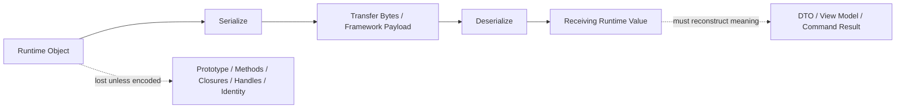
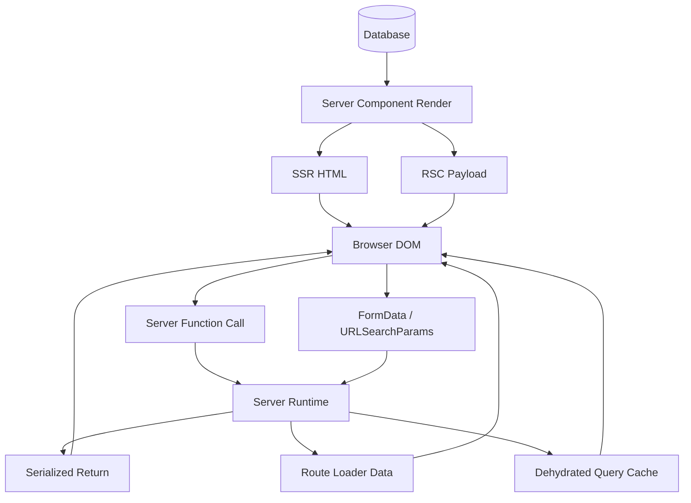
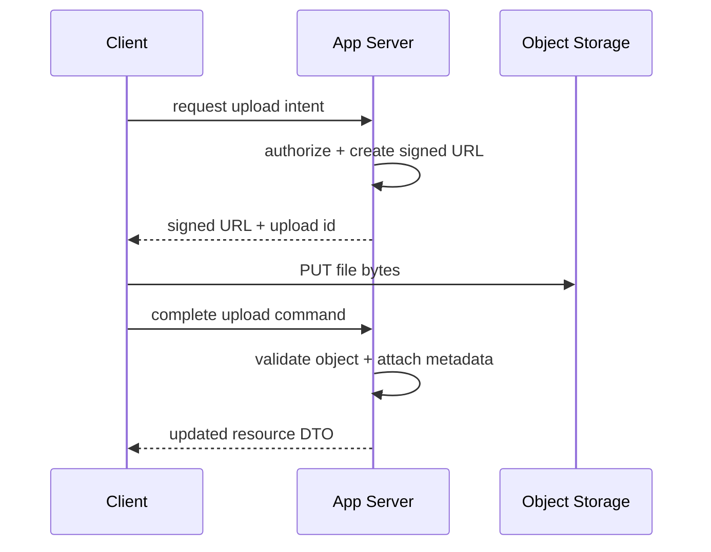
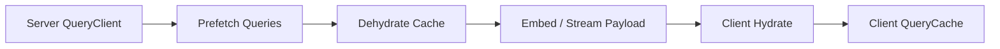
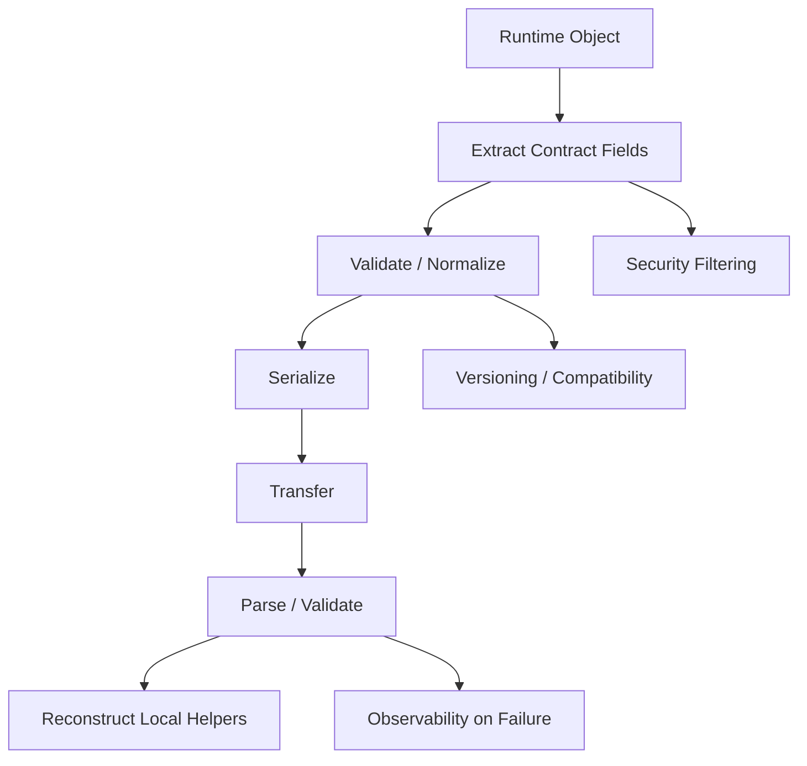

# Part 041 — Serialization Boundaries and Non-Serializable State

> Target mental model: **serialization is not a utility detail. Serialization is the protocol boundary where runtime objects are reduced into transferable values.**

Part 039 introduced React Server Components as a server/client execution boundary.

Part 040 introduced Server Functions as a client-triggered server execution boundary.

Both abstractions feel smooth when the values are simple:

```tsx
<UserCard user={{ id: 'u_123', name: 'Ari' }} />
```

But production systems rarely move only simple objects.

They move:

- dates,
- money,
- permissions,
- errors,
- cursors,
- partial resources,
- validation results,
- optimistic drafts,
- encrypted identifiers,
- file metadata,
- server function references,
- dehydrated cache entries,
- and sometimes accidental runtime objects that should never cross the boundary.

This part is about the point where many React client-server systems break:

```txt
The value exists in one runtime,
but the receiving runtime cannot faithfully reconstruct its meaning.
```

That is the real serialization problem.

Not "how do I call `JSON.stringify`?"

The real question is:

```txt
What is the smallest stable representation of this domain fact
that another runtime can safely interpret?
```

---

## 1. The Core Boundary

A JavaScript object in memory is not merely data.

It may contain:

- prototype identity,
- methods,
- closures,
- symbols,
- private fields,
- mutable references,
- references to browser APIs,
- references to server APIs,
- database handles,
- file descriptors,
- request objects,
- response objects,
- abort signals,
- streams,
- class instances,
- or cyclic references.

A network boundary cannot move that runtime context.

It can only move a representation.



The important invariant:

> After serialization, the receiver should not need hidden runtime context to understand the value.

Bad representation:

```ts
class Money {
  constructor(private cents: number, private currency: string) {}

  format(locale: string) {
    return new Intl.NumberFormat(locale, {
      style: 'currency',
      currency: this.currency,
    }).format(this.cents / 100);
  }
}

return new Money(1299, 'USD');
```

Better representation:

```ts
type MoneyDTO = {
  amountMinor: number;
  currency: 'USD' | 'EUR' | 'IDR';
};

return {
  amountMinor: 1299,
  currency: 'USD',
} satisfies MoneyDTO;
```

The receiver can format it.

The wire does not need to carry the class.

---

## 2. Serialization Boundaries in Modern React Apps

Serialization appears in more places than developers usually count.



Common boundaries:

| Boundary | Sender | Receiver | What crosses |
|---|---|---|---|
| Server Component to Client Component | server | browser | serializable props / component elements |
| Server Function arguments | browser | server | serializable arguments, often `FormData` or plain values |
| Server Function return value | server | browser | serializable command result |
| SSR HTML | server | browser | HTML text stream |
| Hydration bootstrap | server | browser | scripts, identifiers, initial data, framework payload |
| Route loader data | server | browser | serialized route data |
| Query dehydration | server | browser | serialized cache snapshot |
| URL state | browser/server | browser/server | path/search params as strings |
| Form submission | browser | server | form fields/files encoded by browser |
| Error boundary payload | server/client | client UI | structured error or fallback result |

A top-tier engineer does not treat these as separate accidents.

They are all instances of one rule:

```txt
Do not export runtime objects across execution boundaries.
Export stable representations.
```

---

## 3. React's RSC Serialization Rule

React's RSC boundary allows Server Components to pass data to Client Components only if that data is serializable by React's supported model.

This is stricter than "anything JavaScript can hold" and different from plain JSON.

At the time of writing, React documents serializable values for Server Component props such as:

- primitives,
- globally registered symbols,
- iterables containing serializable values,
- `Date`,
- plain objects with serializable properties,
- Server Functions,
- and Client or Server Component elements.

But unsupported values include things such as arbitrary functions, class instances, and runtime-only objects.

Do not memorize this as a trivia table.

Use the deeper rule:

```txt
Can this value be understood without the originating runtime?
```

Example failure:

```tsx
// Server Component
import UserMenu from './UserMenu';

export default async function Header() {
  const session = await getSession();

  return (
    <UserMenu
      session={session}
      onLogout={() => logout()} // ❌ normal function crossing to Client Component
    />
  );
}
```

Better:

```tsx
// actions.ts
'use server';

export async function logoutAction() {
  await logoutCurrentSession();
}
```

```tsx
// Server Component
import UserMenu from './UserMenu';
import { logoutAction } from './actions';

export default async function Header() {
  const session = await getSessionDTO();

  return <UserMenu session={session} logoutAction={logoutAction} />;
}
```

```tsx
// UserMenu.tsx
'use client';

export function UserMenu({
  session,
  logoutAction,
}: {
  session: SessionDTO;
  logoutAction: () => Promise<void>;
}) {
  return (
    <form action={logoutAction}>
      <button>Log out</button>
    </form>
  );
}
```

The normal closure cannot cross.

A Server Function reference can cross because the framework turns it into a remote callable reference.

---

## 4. The Dangerous Difference Between JSON-Serializable and React-Serializable

Many engineers say:

```txt
Make it JSON-serializable.
```

That advice is useful but incomplete.

There are multiple serialization models:

| Model | Used by | Typical support |
|---|---|---|
| JSON | REST APIs, script bootstrap, many loaders | strings, numbers, booleans, null, arrays, plain objects |
| Form encoding | HTML forms | strings, files, repeated field names |
| Structured clone | `postMessage`, workers, IndexedDB-like transfer | many built-ins, but not functions/DOM nodes |
| React RSC serialization | RSC payload / Server Functions | React-supported serializable values |
| Framework custom serializers | router/cache hydration | depends on framework |

Do not assume support from one model transfers to another.

Example:

```ts
const value = {
  createdAt: new Date(),
  ids: new Set(['a', 'b']),
  amount: 10n,
};
```

Plain JSON is problematic:

```ts
JSON.stringify(value);
// Date becomes a string through toJSON
// Set becomes {}
// BigInt throws unless converted
```

React's Server Function serialization may support some of these values.

Your REST API probably should not rely on that.

Production rule:

> At public API boundaries, prefer explicit DTOs over runtime-specific serializer magic.

---

## 5. Boundary Types You Should Use Deliberately

### 5.1 DTO: Data Transfer Object

A DTO is not an anemic domain object.

A DTO is a contract artifact.

```ts
type InvoiceDTO = {
  id: string;
  number: string;
  status: 'draft' | 'issued' | 'paid' | 'void';
  total: {
    amountMinor: number;
    currency: string;
  };
  issuedAt: string | null;
  version: number;
};
```

A good DTO has:

- stable field names,
- explicit nullability,
- no methods,
- no hidden lazy-loaded fields,
- no ORM objects,
- no authorization-unsafe fields,
- no view-only formatting unless intentionally view-modelled,
- and enough version/concurrency metadata for safe updates.

### 5.2 View Model

A view model is a DTO shaped for a screen.

```ts
type InvoiceDetailView = {
  invoice: InvoiceDTO;
  permissions: {
    canEdit: boolean;
    canVoid: boolean;
    canSendReminder: boolean;
  };
  timeline: Array<{
    id: string;
    type: 'created' | 'issued' | 'payment_received' | 'voided';
    at: string;
    actorName: string;
  }>;
};
```

Use a view model when the client would otherwise need many calls or domain-specific joining logic.

### 5.3 Command Input

A command input is not the same as a resource DTO.

```ts
type UpdateInvoiceCommand = {
  invoiceId: string;
  expectedVersion: number;
  patch: {
    dueDate?: string | null;
    notes?: string | null;
  };
  idempotencyKey: string;
};
```

Good command input is explicit about:

- target resource,
- expected version,
- patch semantics,
- null vs absent,
- idempotency,
- and validation boundary.

### 5.4 Command Result

Do not return arbitrary server objects after a mutation.

Return a result contract.

```ts
type UpdateInvoiceResult =
  | {
      ok: true;
      invoice: InvoiceDTO;
      invalidated: Array<QueryAddress>;
    }
  | {
      ok: false;
      code: 'VALIDATION_FAILED';
      fieldErrors: Record<string, string[]>;
    }
  | {
      ok: false;
      code: 'VERSION_CONFLICT';
      current: InvoiceDTO;
    };
```

This protects UI code from guessing.

---

## 6. Non-Serializable State: What It Means

Non-serializable does not mean "bad".

It means:

```txt
This value belongs to a runtime, not to the network contract.
```

Examples:

| Value | Why it is non-contract state | What to transfer instead |
|---|---|---|
| DOM node | browser runtime object | element id, selector intent, or no transfer |
| Event object | browser event lifecycle | extracted field values |
| Function closure | captures runtime environment | command name / Server Function reference / event descriptor |
| Class instance | prototype/method behavior lost | plain DTO + client-side helper |
| ORM entity | server persistence object | DTO with allowed fields |
| DB connection | server process resource | never transfer |
| `AbortController` | request lifecycle controller | timeout/deadline value or no transfer |
| `ReadableStream` | active data flow | stream endpoint or explicit streaming protocol |
| `Error` object | stack/prototype/security issues | structured error envelope |
| `Map`/`Set` in JSON API | not represented naturally in JSON | arrays or record objects |
| Cyclic graph | cannot be represented by plain JSON | normalized graph or ids |
| `File` metadata plus file bytes | browser blob resource | multipart upload or signed URL flow |

A strong design does not try to force these values through serialization.

It splits them:

```txt
runtime state stays local
portable representation crosses boundary
receiver reconstructs local runtime helpers if needed
```

---

## 7. Dates: The Classic Footgun

Dates look easy.

They are not.

Bad:

```ts
type TaskDTO = {
  dueAt: Date;
};
```

Why risky?

Because the receiving side must know:

- timezone semantics,
- whether it is an instant or a local date,
- whether midnight means user-local midnight or server timezone midnight,
- whether formatting is locale-specific,
- whether sorting compares instants or calendar dates.

Better:

```ts
type TaskDTO = {
  dueAt: string; // ISO instant, e.g. 2026-07-07T10:30:00.000Z
};
```

For calendar-only dates:

```ts
type LeaveRequestDTO = {
  startDate: string; // YYYY-MM-DD, no time zone conversion
  endDate: string;   // YYYY-MM-DD
};
```

For display:

```ts
function parseInstant(value: string): Date {
  const date = new Date(value);

  if (Number.isNaN(date.getTime())) {
    throw new Error(`Invalid instant: ${value}`);
  }

  return date;
}
```

Mental model:

```txt
An instant is not a calendar date.
A calendar date is not a local datetime.
A local datetime is not a timezone-aware instant.
```

Encode the semantic type, not merely a string.

---

## 8. Money and Precision

Bad:

```ts
type PriceDTO = {
  amount: number; // 19.99
};
```

This may be acceptable for display-only data, but risky for business operations.

Better:

```ts
type MoneyDTO = {
  amountMinor: number;
  currency: 'IDR' | 'USD' | 'EUR';
};
```

For large values:

```ts
type MoneyDTO = {
  amountMinor: string; // arbitrary precision integer encoded as decimal string
  currency: string;
};
```

Do not let serialization silently define your financial model.

---

## 9. Enums and Unknown Values

Bad:

```ts
type CaseStatus = 'open' | 'closed';
```

This looks type-safe but is brittle if the server later adds:

```txt
under_review
escalated
archived
```

Better UI handling:

```ts
type KnownCaseStatus = 'open' | 'closed' | 'under_review' | 'escalated';

type CaseStatus = KnownCaseStatus | 'unknown';

function parseCaseStatus(raw: string): CaseStatus {
  switch (raw) {
    case 'open':
    case 'closed':
    case 'under_review':
    case 'escalated':
      return raw;
    default:
      return 'unknown';
  }
}
```

For domain-critical state machines, unknown values should not always degrade silently.

Use two policies:

| Context | Unknown enum behavior |
|---|---|
| Read-only list badge | show "Unknown" and report telemetry |
| Dangerous mutation | block action and force refetch/app update |
| Regulatory/enforcement flow | fail closed unless product explicitly supports fallback |
| Analytics label | bucket as unknown |

Serialization design is also change-management design.

---

## 10. `undefined`, `null`, and Absence

One of the most expensive contract bugs is confusing:

```txt
field absent
field present with null
field present with undefined
field present with empty string
field present with empty array
```

For APIs, prefer explicit semantics:

```ts
type UpdateProfilePatch = {
  displayName?: string;       // absent = do not change
  avatarUrl?: string | null;  // null = remove avatar
};
```

Never rely on accidental JSON behavior:

```ts
JSON.stringify({ a: undefined, b: null });
// {"b":null}
```

If the API distinguishes absence and null, test that distinction.

```ts
function toUpdateProfileBody(input: UpdateProfilePatch) {
  const body: Record<string, unknown> = {};

  if ('displayName' in input) body.displayName = input.displayName;
  if ('avatarUrl' in input) body.avatarUrl = input.avatarUrl;

  return body;
}
```

---

## 11. Error Serialization

Bad:

```ts
return { ok: false, error: new Error('Invalid amount') };
```

Problems:

- stack traces may leak internals,
- prototype is not a stable contract,
- nested causes may be cyclic,
- message may be unsuitable for users,
- and clients cannot reliably branch on free text.

Better:

```ts
type Problem = {
  type: string;
  title: string;
  status: number;
  code: string;
  detail?: string;
  traceId?: string;
  fieldErrors?: Record<string, string[]>;
};
```

Then normalize server and client handling:

```ts
export class AppError extends Error {
  constructor(readonly problem: Problem) {
    super(problem.title);
  }
}
```

Across the boundary, transfer the `Problem`.

Inside the runtime, reconstruct an `AppError` if needed.

---

## 12. Authorization and Serialization

Authorization bugs often hide inside serialization.

Bad server code:

```ts
const user = await db.user.findUnique({
  where: { id },
  include: {
    salary: true,
    disciplinaryNotes: true,
    internalRiskScore: true,
  },
});

return user;
```

Even if the UI does not render sensitive fields, the data may still be shipped.

Good server code:

```ts
function toEmployeeCardDTO(user: Employee, viewer: Viewer): EmployeeCardDTO {
  return {
    id: user.id,
    name: user.name,
    title: user.title,
    avatarUrl: user.avatarUrl,
    canMessage: can(viewer, 'message', user),
  };
}
```

The serialization boundary is a data minimization boundary.

```txt
Do not serialize what the client is not allowed to know.
```

This matters even more with Server Components because engineers may falsely assume:

```txt
It ran on the server, so it is safe.
```

Server execution is not enough.

The question is:

```txt
What did the server serialize into the client-visible payload?
```

---

## 13. ORM Entities Must Not Cross

An ORM entity is not a DTO.

Bad:

```ts
export async function getInvoice(id: string) {
  return prisma.invoice.findUnique({
    where: { id },
    include: { customer: true, auditEvents: true },
  });
}
```

Problems:

- accidental field exposure,
- unstable relation shape,
- database naming leaks into UI,
- decimal/date/json types may serialize unexpectedly,
- authorization is not encoded,
- future schema changes break UI,
- and UI starts depending on persistence structure.

Better:

```ts
export async function getInvoiceDTO(id: string, viewer: Viewer): Promise<InvoiceDTO> {
  const invoice = await prisma.invoice.findUniqueOrThrow({
    where: { id },
    include: {
      customer: true,
    },
  });

  authorize(viewer, 'invoice.read', invoice);

  return {
    id: invoice.id,
    number: invoice.number,
    status: invoice.status,
    customer: {
      id: invoice.customer.id,
      name: invoice.customer.displayName,
    },
    total: {
      amountMinor: invoice.totalMinor,
      currency: invoice.currency,
    },
    issuedAt: invoice.issuedAt?.toISOString() ?? null,
    version: invoice.version,
  };
}
```

The DTO mapper is not boilerplate.

It is the explicit boundary between persistence model and client contract.

---

## 14. Class Instances: Convert to Capabilities or Data

Suppose you have:

```ts
class CaseWorkflow {
  constructor(private caseRecord: CaseRecord) {}

  canEscalate(viewer: Viewer) {
    return this.caseRecord.status === 'open' && viewer.role === 'manager';
  }

  nextActions(viewer: Viewer) {
    // complex logic
  }
}
```

Do not pass `CaseWorkflow` to the client.

Instead pass:

```ts
type CaseWorkflowView = {
  caseId: string;
  status: string;
  availableActions: Array<{
    type: 'assign' | 'escalate' | 'close';
    label: string;
    disabledReason?: string;
  }>;
};
```

This is not losing richness.

It is moving runtime behavior into server-owned policy and transferring the result.

For client-side behavior, reconstruct a client helper:

```ts
function getPrimaryAction(view: CaseWorkflowView) {
  return view.availableActions.find((action) => !action.disabledReason) ?? null;
}
```

The server owns policy.

The client owns interaction.

---

## 15. Cyclic Graphs and Normalization

Plain tree-shaped payloads are easy.

Domain models are often graphs.

Example:

```txt
Case -> Parties -> Cases -> Parties
```

If you serialize naively, you get:

- cycles,
- huge payloads,
- duplicated objects,
- stale nested copies,
- and inconsistent UI updates.

Better:

```ts
type CaseGraphDTO = {
  entities: {
    cases: Record<string, CaseDTO>;
    parties: Record<string, PartyDTO>;
  };
  result: {
    caseId: string;
    partyIds: string[];
  };
};
```

Or return screen-specific tree with explicit truncation:

```ts
type CaseDetailDTO = {
  id: string;
  title: string;
  parties: Array<{
    id: string;
    name: string;
    role: string;
  }>;
  relatedCasesPreview: Array<{
    id: string;
    title: string;
  }>;
  hasMoreRelatedCases: boolean;
};
```

Pick one deliberately.

Do not accidentally ship the graph.

---

## 16. File, Blob, and Stream Boundaries

Files are not ordinary JSON data.

Common mistake:

```ts
await updateProfile({
  name,
  avatarFile, // ❌ not a normal DTO field
});
```

Better patterns:

### Pattern A: Multipart command

```tsx
<form action={updateProfileAction} encType="multipart/form-data">
  <input name="displayName" />
  <input name="avatar" type="file" />
  <button>Save</button>
</form>
```

Server Function receives `FormData` if the framework supports that path.

### Pattern B: Signed upload URL



Use signed URL flow when files are large, uploads need progress, or app servers should not proxy file bytes.

The serialized app-level DTO should carry metadata:

```ts
type FileAttachmentDTO = {
  id: string;
  filename: string;
  contentType: string;
  sizeBytes: number;
  downloadUrl: string;
  expiresAt: string;
};
```

Not the raw file object.

---

## 17. Server Function Argument Design

Do not expose your internal function signature as the public command contract.

Bad:

```ts
'use server';

export async function updateCase(caseRecord: CaseRecord, user: User, patch: any) {
  // ...
}
```

Good:

```ts
'use server';

export async function updateCaseAction(input: UpdateCaseInput): Promise<UpdateCaseResult> {
  const viewer = await requireViewer();
  const command = parseUpdateCaseInput(input);

  return updateCaseUseCase(viewer, command);
}
```

Where:

```ts
type UpdateCaseInput = {
  caseId: string;
  expectedVersion: number;
  patch: {
    title?: string;
    priority?: 'low' | 'normal' | 'high';
  };
  idempotencyKey: string;
};
```

This preserves:

- validation,
- authorization,
- auditability,
- replay safety,
- version conflict handling,
- and forward-compatible command evolution.

---

## 18. Runtime Validation at the Boundary

TypeScript does not validate incoming runtime data.

Server Function arguments are client-controlled.

API responses can drift.

Dehydrated cache can be stale.

Local persisted cache can be from an old app version.

So boundary parsing matters.

Example with a schema-like parser:

```ts
type ParseResult<T> =
  | { ok: true; value: T }
  | { ok: false; issues: Array<{ path: string; message: string }> };

function parseUpdateCaseInput(raw: unknown): ParseResult<UpdateCaseInput> {
  // Use Zod, Valibot, ArkType, Effect Schema, io-ts, or your internal parser.
  // The point here is boundary validation, not the library.
  return validateUpdateCaseInput(raw);
}
```

Server Function:

```ts
'use server';

export async function updateCaseAction(raw: unknown): Promise<UpdateCaseResult> {
  const parsed = parseUpdateCaseInput(raw);

  if (!parsed.ok) {
    return {
      ok: false,
      code: 'VALIDATION_FAILED',
      fieldErrors: toFieldErrors(parsed.issues),
    };
  }

  const viewer = await requireViewer();
  return updateCase(viewer, parsed.value);
}
```

Client-side API response validation:

```ts
async function getCase(id: string): Promise<CaseDTO> {
  const json = await api.get(`/cases/${id}`).json();
  return parseCaseDTO(json);
}
```

In production-grade systems, validation is not paranoia.

It is a controlled failure mode.

---

## 19. Serialization and Cache Dehydration

Server-state caches often support dehydration/hydration.

That means:

```txt
server query cache snapshot -> serialized bootstrap payload -> client query cache
```



Do not put arbitrary values in query data if you plan to dehydrate it.

Bad:

```ts
queryClient.setQueryData(['invoice', id], new InvoiceModel(raw));
```

Better:

```ts
queryClient.setQueryData(['invoice', id], invoiceDTO);
```

If the client wants helper methods, wrap at usage site:

```ts
function useInvoiceModel(id: string) {
  const query = useInvoice(id);

  return {
    ...query,
    model: query.data ? createInvoiceViewModel(query.data) : undefined,
  };
}
```

The cache stores portable facts.

The component can derive runtime helpers.

---

## 20. Serialization and Persisted Cache

Persisted cache is even more dangerous than SSR dehydration.

Because it can outlive:

- a deployment,
- a schema change,
- a login session,
- a tenant switch,
- a permission change,
- a feature flag rollout,
- or a data retention policy update.

Persisted cache needs a versioned envelope:

```ts
type PersistedCacheEnvelope = {
  schemaVersion: 3;
  appBuildId: string;
  userId: string;
  tenantId: string;
  createdAt: string;
  expiresAt: string;
  payload: unknown;
};
```

On hydration:

```ts
function shouldRestoreCache(envelope: PersistedCacheEnvelope, session: SessionDTO) {
  if (envelope.schemaVersion !== 3) return false;
  if (envelope.userId !== session.userId) return false;
  if (envelope.tenantId !== session.tenantId) return false;
  if (Date.parse(envelope.expiresAt) < Date.now()) return false;

  return true;
}
```

Never restore persisted cache blindly.

---

## 21. Hydration Mismatch as Serialization Mismatch

Hydration mismatch is often discussed as a rendering bug.

Many hydration mismatches are serialization bugs.

Example:

```tsx
export function Clock({ now }: { now: Date }) {
  return <span>{now.toLocaleString()}</span>;
}
```

If server and client format differently due to timezone/locale, the initial server HTML and client render may differ.

Better:

```tsx
export function Clock({ iso, formatted }: { iso: string; formatted: string }) {
  return <time dateTime={iso}>{formatted}</time>;
}
```

Or intentionally render client-only after hydration:

```tsx
'use client';

export function ClientLocalTime({ iso }: { iso: string }) {
  const [text, setText] = useState<string | null>(null);

  useEffect(() => {
    setText(new Intl.DateTimeFormat(undefined, {
      dateStyle: 'medium',
      timeStyle: 'short',
    }).format(new Date(iso)));
  }, [iso]);

  return <time dateTime={iso}>{text ?? '—'}</time>;
}
```

The key is not the code.

The key is deciding:

```txt
Is the first paint server-owned or client-localized?
```

---

## 22. Designing a Serialization Firewall

For production systems, create explicit modules that mark boundaries.

```txt
/domain
  case.ts              // domain logic, may use classes internally
/server
  caseRepository.ts    // database/ORM
  casePolicy.ts        // authorization
  caseMapper.ts        // domain -> DTO/view model
  caseActions.ts       // Server Functions / route actions
/client
  caseApi.ts           // fetch client / generated client
  caseQueries.ts       // query keys/hooks
  caseViewModel.ts     // client-side helpers
/shared
  caseContracts.ts     // DTO/input/result types + parsers
```

Boundary mappers:

```ts
export function toCaseDetailDTO(
  record: CaseRecord,
  viewer: Viewer,
): CaseDetailDTO {
  return {
    id: record.id,
    title: record.title,
    status: record.status,
    priority: record.priority,
    version: record.version,
    createdAt: record.createdAt.toISOString(),
    permissions: {
      canEdit: can(viewer, 'case.edit', record),
      canClose: can(viewer, 'case.close', record),
    },
  };
}
```

Runtime assert:

```ts
export function assertSerializableDTO(value: unknown): void {
  // In real systems, use a contract schema or a stricter internal test helper.
  JSON.stringify(value);
}
```

Test:

```ts
it('serializes case detail DTO without runtime leakage', () => {
  const dto = toCaseDetailDTO(makeCaseRecord(), makeViewer());

  expect(() => assertSerializableDTO(dto)).not.toThrow();
  expect(dto).not.toHaveProperty('internalRiskScore');
});
```

This catches accidental ORM leakage early.

---

## 23. Boundary Type Branding

You can prevent many mistakes with type branding.

```ts
type Brand<T, Name extends string> = T & { readonly __brand: Name };

export type ISOInstant = Brand<string, 'ISOInstant'>;
export type CalendarDate = Brand<string, 'CalendarDate'>;
export type IdempotencyKey = Brand<string, 'IdempotencyKey'>;
```

Constructors:

```ts
export function toISOInstant(date: Date): ISOInstant {
  return date.toISOString() as ISOInstant;
}

export function parseISOInstant(value: string): ISOInstant {
  const time = Date.parse(value);

  if (Number.isNaN(time)) {
    throw new Error(`Invalid ISO instant: ${value}`);
  }

  return value as ISOInstant;
}
```

DTO:

```ts
type AuditEventDTO = {
  id: string;
  at: ISOInstant;
  actorId: string;
  action: string;
};
```

This does not make runtime validation disappear.

It makes accidental misuse harder.

---

## 24. Security: Never Trust Serialized Input

Every value sent from client to server is attacker-controlled.

This includes:

- Server Function arguments,
- form fields,
- hidden inputs,
- URL params,
- query params,
- JSON body,
- file metadata,
- idempotency keys,
- expected versions,
- and resource ids.

Bad:

```ts
'use server';

export async function approveCase(input: { caseId: string; approverId: string }) {
  await db.case.update({
    where: { id: input.caseId },
    data: { approvedBy: input.approverId },
  });
}
```

Good:

```ts
'use server';

export async function approveCase(input: { caseId: string; expectedVersion: number }) {
  const viewer = await requireViewer();
  const parsed = parseApproveCaseInput(input);
  const record = await loadCase(parsed.caseId);

  authorize(viewer, 'case.approve', record);

  return approveCaseUseCase({
    viewerId: viewer.id,
    caseId: parsed.caseId,
    expectedVersion: parsed.expectedVersion,
  });
}
```

The client may request.

The server decides.

---

## 25. Operational Failure Modes

### 25.1 Class instance lost methods

Symptom:

```txt
TypeError: invoice.formatTotal is not a function
```

Cause:

```txt
Server returned class instance; client received plain object or unsupported payload.
```

Fix:

```txt
Return DTO; reconstruct helper client-side if needed.
```

### 25.2 Date displayed incorrectly

Symptom:

```txt
Due date shifts by one day for users in some timezone.
```

Cause:

```txt
Calendar date encoded as datetime instant.
```

Fix:

```txt
Represent date-only values as YYYY-MM-DD and avoid timezone conversion.
```

### 25.3 Sensitive fields leaked

Symptom:

```txt
Internal field visible in network payload even though UI hides it.
```

Cause:

```txt
ORM entity serialized directly.
```

Fix:

```txt
Use authorization-aware DTO mapper and contract tests.
```

### 25.4 Persisted cache cross-user leak

Symptom:

```txt
After logout/login, user sees previous user's cached data.
```

Cause:

```txt
Persisted cache not scoped by user/tenant/session.
```

Fix:

```txt
Version, scope, expire, and clear persisted cache on auth boundary changes.
```

### 25.5 Mutation result cannot drive UI

Symptom:

```txt
Client receives generic success but does not know what to update.
```

Cause:

```txt
Command result lacks canonical updated resource or invalidation hints.
```

Fix:

```txt
Return explicit command result with updated DTO and conflict/error variants.
```

---

## 26. Review Checklist

Use this checklist during API/RSC/Server Function review.

### Values

- [ ] Are all boundary values representable without runtime context?
- [ ] Are dates semantically encoded as instant/date/local datetime?
- [ ] Are money and decimal values precision-safe?
- [ ] Are enums resilient to unknown future values where appropriate?
- [ ] Are `null`, `undefined`, and absence intentionally modeled?
- [ ] Are cyclic graphs normalized or intentionally truncated?

### Security

- [ ] Are Server Function arguments treated as untrusted input?
- [ ] Is authorization performed server-side using authenticated viewer context?
- [ ] Are sensitive fields excluded before serialization?
- [ ] Are error payloads sanitized?
- [ ] Is cache hydration scoped by user/tenant/session?

### Stability

- [ ] Are DTOs separate from ORM/domain objects?
- [ ] Is there runtime validation at external boundaries?
- [ ] Are command inputs and command results explicit?
- [ ] Are persisted payloads versioned?
- [ ] Are hydration-sensitive fields deterministic?

### Observability

- [ ] Are serialization failures logged with trace id?
- [ ] Are contract parse failures counted?
- [ ] Are unknown enum values observable?
- [ ] Are cache restore rejections measurable?
- [ ] Are payload sizes tracked?

---

## 27. The Build-From-Scratch Model

A good serializer boundary has four steps:



In code:

```ts
// Server side
const record = await loadRecord(id);
const dto = toDTO(record, viewer);
const safe = parseDTO(dto); // yes, validate your own mapper in tests or critical paths
return safe;
```

```ts
// Client side
const dto = parseDTO(await response.json());
const view = createClientViewModel(dto);
```

The separation is deliberate:

```txt
domain object -> DTO -> serialized value -> DTO -> local view model
```

Not:

```txt
domain object magically appears in the browser
```

---

## 28. Practical Rule Set

Use these rules until they become instinct:

1. **Never pass ORM entities across the boundary.**
2. **Never pass class instances as public contracts.**
3. **Never trust Server Function arguments.**
4. **Do not serialize secrets just because code runs on the server.**
5. **Represent dates by semantic type.**
6. **Represent money by minor units or decimal strings.**
7. **Encode command results as discriminated unions.**
8. **Version persisted payloads.**
9. **Scope cache snapshots by user and tenant.**
10. **Treat hydration mismatch as a contract bug until proven otherwise.**

---

## 29. What This Enables

Once serialization boundaries are explicit, later architecture gets easier:

- SSR data transfer becomes predictable.
- Hydration mismatch becomes debuggable.
- Query cache hydration becomes safe.
- Server Functions become command contracts.
- Route loaders become screen contracts.
- OpenAPI/GraphQL clients become boundary validators.
- Realtime patches can reuse DTO semantics.
- Offline queues can store command inputs safely.
- Audit logs can record stable command facts.

Serialization is not a side quest.

It is the narrow waist of client-server architecture.

---

## 30. References

- React docs: `'use client'` directive and serializable props — https://react.dev/reference/rsc/use-client
- React docs: `'use server'` directive, Server Function security, and serializable arguments — https://react.dev/reference/rsc/use-server
- React docs: Server Functions — https://react.dev/reference/rsc/server-functions
- React docs: `hydrateRoot` — https://react.dev/reference/react-dom/client/hydrateRoot
- MDN: `JSON.stringify()` — https://developer.mozilla.org/en-US/docs/Web/JavaScript/Reference/Global_Objects/JSON/stringify
- MDN: Structured clone algorithm — https://developer.mozilla.org/en-US/docs/Web/API/Web_Workers_API/Structured_clone_algorithm
- MDN: `structuredClone()` — https://developer.mozilla.org/en-US/docs/Web/API/Window/structuredClone
- RFC 9457: Problem Details for HTTP APIs — https://www.rfc-editor.org/rfc/rfc9457.html

---

## 31. Closing Mental Model

The wrong question:

```txt
Can I somehow serialize this object?
```

The right question:

```txt
What stable fact should the other runtime know?
```

That one shift prevents an enormous class of RSC, SSR, cache, mutation, and security failures.

In the next part, we move from value serialization to the initial page lifecycle:

```txt
server render -> HTML/data transfer -> browser parse -> hydration -> interactive app
```
