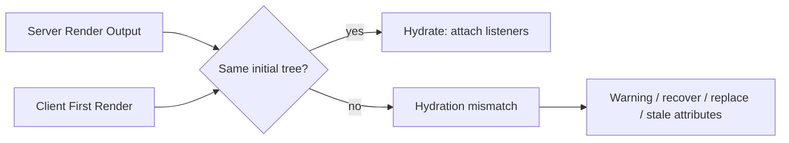
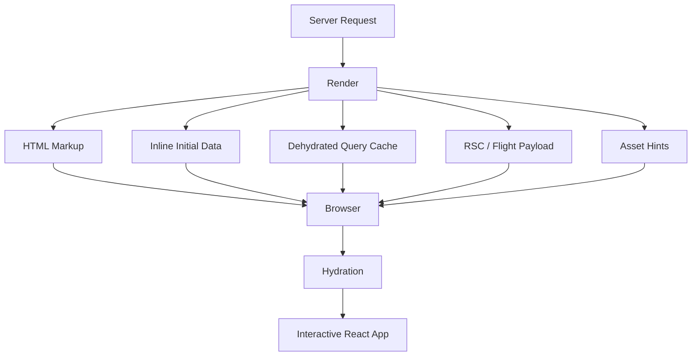
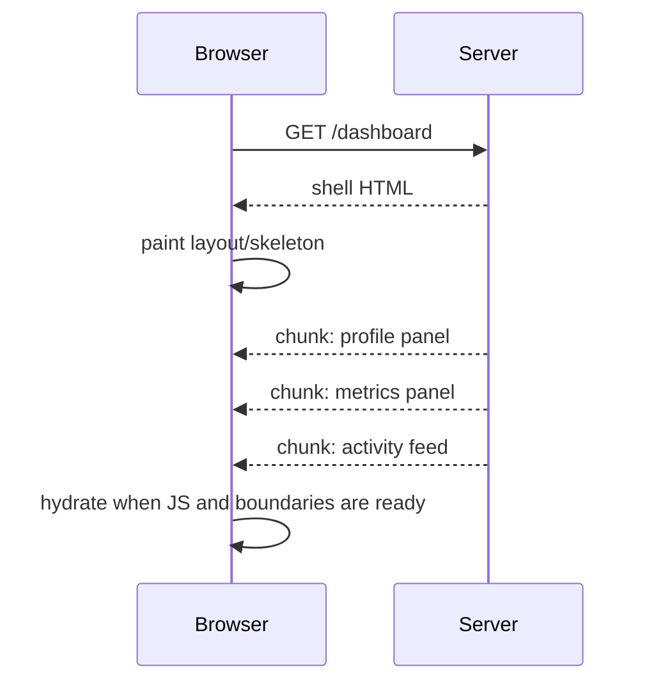
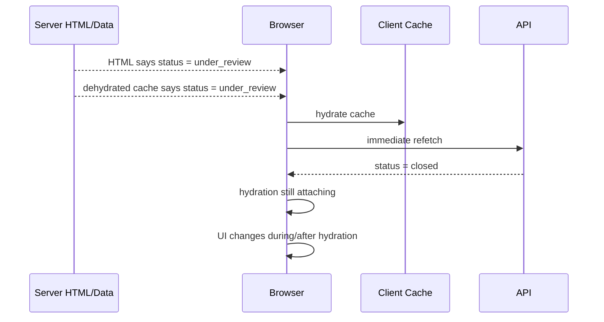
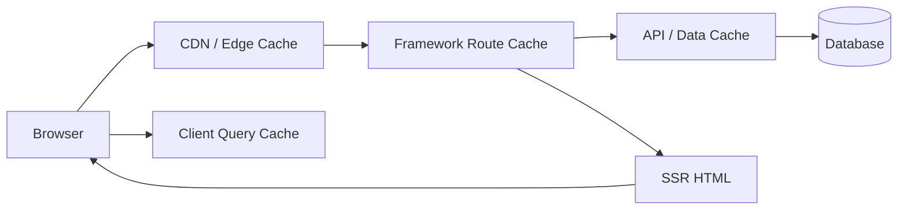

# Part 042 — SSR, Hydration, and Data Transfer

> Target mental model: **SSR is not just rendering HTML on the server. SSR is a boot protocol that transfers UI, data, script references, identity assumptions, and hydration invariants into the browser.**

A client-rendered React app usually starts like this:

```txt
HTML shell -> JS bundle -> fetch data -> render UI
```

A server-rendered React app starts differently:

```txt
request -> server render -> HTML response -> browser paint -> JS loads -> hydration -> interactivity
```

That difference changes the entire client-server communication model.

In CSR, the first meaningful UI often depends on client-side data fetching.

In SSR, the first meaningful UI is already in the HTTP response.

But SSR creates a new challenge:

```txt
The server already rendered something.
The client must attach to it without disagreeing.
```

That attach phase is hydration.

Hydration is not a cosmetic implementation detail.

It is a correctness boundary.

---

## 1. The Initial Page Load Is a Protocol

Think of the first page load as a protocol with ordered messages.

```mermaid
sequenceDiagram
  participant U as User
  participant B as Browser
  participant S as Server
  participant DB as Data Sources

  U->>B: navigate to URL
  B->>S: GET /cases/123
  S->>DB: load required data
  DB-->>S: records
  S->>S: render React tree
  S-->>B: HTML stream + bootstrap scripts + data payloads
  B->>B: parse HTML
  B->>B: paint non-interactive UI
  B->>S: request JS/CSS chunks
  S-->>B: assets
  B->>B: execute JS
  B->>B: hydrate existing DOM
  B->>B: attach event handlers
  U->>B: interact with hydrated UI
```



Each step can fail independently.

A production-ready SSR architecture knows what happens when:

- data is slow,
- server render crashes,
- HTML shell succeeds but nested content fails,
- JS bundle fails to load,
- hydration mismatches,
- user clicks before hydration completes,
- route data is stale by the time the page becomes interactive,
- cache hydration includes data from the wrong user,
- CSP blocks inline bootstrap data,
- or streaming sends the shell before the final status is known.

---

## 2. SSR, RSC, SSG, ISR, CSR: Do Not Confuse the Terms

These terms overlap but are not identical.

| Term | Meaning | Communication shape |
|---|---|---|
| CSR | Browser renders after JS loads | HTML shell + JS + API calls |
| SSR | Server renders HTML per request | Request produces HTML, then hydration |
| SSG | HTML generated at build time | Static HTML + hydration/revalidation strategy |
| ISR / revalidation | Static output regenerated after time/event | CDN/static cache + background/server regeneration |
| RSC | Components execute on server and send component payload | RSC payload + Client Component islands |
| Streaming SSR | Server sends HTML progressively | HTML chunks over time |
| Hydration | Client attaches React to server HTML | client render must match server output |

A framework may combine them.

Example screen:

```txt
Product page:
  static shell from CDN
  server-rendered product detail
  RSC reviews summary
  client component cart button
  query cache hydration for recommendations
  client-side realtime inventory badge
```

Do not reduce this to one label.

Ask:

```txt
Which part renders where?
Which data crosses where?
Which part hydrates?
Which cache owns freshness after hydration?
```

---

## 3. The Hydration Invariant

Hydration starts from a strict premise:

```txt
The DOM produced by the server should match what the client renders initially.
```

If the client renders different content during hydration, React may warn in development, recover in some cases, or discard/re-render in others depending on the mismatch and framework behavior.

Treat mismatches as bugs.

Not because every mismatch instantly breaks the app.

Because mismatches mean your boot protocol is nondeterministic.



Common causes:

| Cause | Example |
|---|---|
| Time | `new Date()` during render |
| Randomness | `Math.random()` during render |
| Browser-only data | `window.innerWidth` during initial render |
| Locale/timezone difference | server formats date differently from client |
| Auth/session race | server sees user A, client cache has user B |
| Feature flag drift | server and client evaluate different flags |
| Invalid HTML nesting | browser reparses HTML differently |
| Non-deterministic ids | ids differ without stable prefix |
| Data refetched before hydration | client first render uses newer/different data |
| Environment branches | `typeof window !== 'undefined'` changes rendered markup |

---

## 4. SSR Data Transfer Patterns

There are several ways data reaches the hydrated app.



Major patterns:

| Pattern | What transfers | When useful |
|---|---|---|
| HTML-only SSR | rendered markup | mostly static/read-only initial UI |
| Inline JSON data | initial props/bootstrap state | simple route data |
| Query cache dehydration | server-state cache snapshot | apps using query cache on client |
| RSC payload | server component tree instructions | RSC-capable frameworks |
| Script/module bootstrap | asset references and hydration entry | all hydrated SSR apps |
| Resource hints | preload/prefetch links | performance optimization |
| Cookie/session context | implicit request context | auth/session-sensitive rendering |

Do not mix them accidentally.

Have a boot design.

---

## 5. HTML Is Data Transfer

HTML is often treated as "not data".

That is wrong.

HTML transfers:

- text content,
- document structure,
- links,
- form actions,
- accessibility tree hints,
- image references,
- preload hints,
- script references,
- initial UI state,
- and sometimes embedded data.

Example:

```html
<article data-case-id="case_123">
  <h1>Appeal Review</h1>
  <span data-status="under_review">Under review</span>
</article>
```

Even if no JSON is embedded, the client receives state through HTML.

This matters because:

```txt
If HTML says status = under_review,
but hydrated client cache says status = closed,
your UI has a boot-time consistency conflict.
```

---

## 6. The Minimal SSR Pipeline

A simplified Node server render:

```tsx
import { renderToPipeableStream } from 'react-dom/server';

app.get('/cases/:id', async (req, res) => {
  let didError = false;

  const stream = renderToPipeableStream(
    <App url={req.url} />,
    {
      bootstrapScripts: ['/assets/client.js'],
      onShellReady() {
        res.statusCode = didError ? 500 : 200;
        res.setHeader('content-type', 'text/html');
        stream.pipe(res);
      },
      onError(error) {
        didError = true;
        logServerRenderError(error);
      },
    },
  );

  setTimeout(() => stream.abort(), 10_000);
});
```

Client hydration:

```tsx
import { hydrateRoot } from 'react-dom/client';
import { App } from './App';

hydrateRoot(document, <App />);
```

This is the essential loop:

```txt
server: render HTML
client: hydrate same tree
```

Frameworks hide this.

They do not remove it.

---

## 7. Streaming SSR Changes the Failure Model

Without streaming:

```txt
server waits for full render -> sends complete HTML
```

With streaming:

```txt
server sends shell early -> fills content as data resolves
```



This improves perceived performance when used well.

It also introduces edge cases:

- status code must often be decided before all data resolves,
- errors after shell flush need in-page fallback, not HTTP status change,
- late chunks may arrive after user navigation,
- partial UI may be visible while not interactive,
- observability must track shell time and all-ready time separately,
- and crawlers/static generation may prefer waiting for all content.

Production question:

```txt
Which part of the screen is allowed to stream late?
```

Do not stream critical authorization or compliance banners late if the user can act before seeing them.

---

## 8. Shell, Critical Data, and Deferred Data

Split page data into categories.

| Category | Example | Should block shell? |
|---|---|---|
| Routing identity | case id, tenant context | yes |
| Auth/session | viewer identity, role | usually yes |
| Critical authorization | can user view this page | yes |
| Primary resource | invoice detail title/status | often yes |
| Secondary widgets | recommendations, recent activity | no |
| Analytics-only data | experiment metadata | no |
| Non-critical counts | notification badge | no |
| Large below-fold lists | comments, audit events | no, if UI can show fallback |

A useful model:

```txt
Block on correctness.
Stream/defer for completeness.
Refetch for freshness.
```

Example:

```tsx
export async function CasePage({ id }: { id: string }) {
  const viewer = await requireViewer();
  const caseSummary = await getCaseSummaryOrDeny(id, viewer);

  return (
    <CaseLayout summary={caseSummary}>
      <Suspense fallback={<TimelineSkeleton />}>
        <Timeline caseId={id} />
      </Suspense>
    </CaseLayout>
  );
}
```

The primary authorization and summary block.

The timeline can stream.

---

## 9. Bootstrapping Initial Data Safely

A classic SSR pattern embeds JSON into HTML:

```html
<script id="__INITIAL_DATA__" type="application/json">
  {"case":{"id":"case_123","title":"Appeal Review"}}
</script>
```

Client reads it:

```ts
const el = document.getElementById('__INITIAL_DATA__');
const initialData = el?.textContent ? JSON.parse(el.textContent) : null;
```

This is simple but has security and correctness requirements.

### 9.1 Escape safely

Do not inject raw JSON into HTML without escaping dangerous sequences.

Problem examples:

- `</script>` inside data,
- Unicode line separators in old contexts,
- user-controlled strings,
- HTML entity confusion,
- CSP nonce requirements.

Use framework-provided serializers or well-reviewed escaping utilities.

### 9.2 Version the shape

```ts
type InitialDataEnvelope = {
  schemaVersion: 1;
  requestId: string;
  routeId: string;
  userId: string | null;
  tenantId: string | null;
  generatedAt: string;
  data: unknown;
};
```

### 9.3 Parse and validate

```ts
function readInitialData(): InitialDataEnvelope | null {
  const el = document.getElementById('__INITIAL_DATA__');
  if (!el?.textContent) return null;

  return parseInitialDataEnvelope(JSON.parse(el.textContent));
}
```

The server should not assume it can write anything.

The client should not assume it can trust everything.

---

## 10. Query Cache Hydration

When using a server-state cache, SSR often becomes:

```txt
create server query client
prefetch queries
render app
serialize dehydrated cache
hydrate client query client
```

```tsx
// Server-side pseudocode
const queryClient = new QueryClient();

await queryClient.prefetchQuery({
  queryKey: caseKeys.detail(caseId, viewer.scope),
  queryFn: () => getCaseDetail(caseId, viewer),
});

const dehydratedState = dehydrate(queryClient);

return render(
  <HydrationBoundary state={dehydratedState}>
    <CasePage caseId={caseId} />
  </HydrationBoundary>,
);
```

Client:

```tsx
const queryClient = new QueryClient();

hydrateRoot(
  document,
  <QueryClientProvider client={queryClient}>
    <HydrationBoundary state={window.__DEHYDRATED_STATE__}>
      <App />
    </HydrationBoundary>
  </QueryClientProvider>,
);
```

Key rules:

- Use per-request query clients on the server.
- Do not share cache between users.
- Include tenant/user/permission scope in query keys where data differs.
- Do not hydrate sensitive data that the client should not have.
- Set `staleTime` deliberately to avoid immediate refetch waterfalls.
- Validate or version persisted/dehydrated data if it can outlive a deploy.
- Clear cache on logout/session boundary.

---

## 11. Per-Request Isolation

Server rendering must not use global mutable state for request-specific data.

Bad:

```ts
// ❌ global singleton used across SSR requests
export const queryClient = new QueryClient();
```

Good:

```ts
export function createRequestContext(req: Request) {
  return {
    requestId: getRequestId(req),
    viewer: getViewer(req),
    queryClient: new QueryClient(),
  };
}
```

Why?

Because SSR servers handle concurrent users.

A global cache can cause:

- user A data rendered for user B,
- tenant leakage,
- request header leakage,
- feature flag mismatch,
- or authorization bypass through cached response reuse.

Invariant:

```txt
Any state derived from request identity must be scoped to that request or explicitly keyed by identity.
```

---

## 12. Hydration and Query Staleness

A common surprise:

```txt
The server prefetched data.
Then the client immediately refetched it during hydration.
```

Why?

Because the client considered the hydrated query stale.

If your default `staleTime` is zero, a query may be stale immediately.

For SSR, choose policy intentionally:

```ts
const queryClient = new QueryClient({
  defaultOptions: {
    queries: {
      staleTime: 30_000,
      gcTime: 5 * 60_000,
      refetchOnWindowFocus: true,
    },
  },
});
```

This says:

```txt
Trust server-rendered data briefly.
Refetch later when freshness events occur.
```

For highly volatile data:

```ts
const inventoryQuery = useQuery({
  queryKey: ['inventory', sku],
  queryFn: getInventory,
  staleTime: 0,
  refetchInterval: 10_000,
});
```

Do not use one global freshness rule for all data.

---

## 13. The Hydration Race

Hydration creates a race between:

- server-rendered markup,
- initial embedded data,
- client cache restoration,
- client-side refetch,
- route navigation,
- and user interaction.



This can be valid.

But it must be controlled.

Decisions:

| Problem | Strategy |
|---|---|
| Avoid mismatch | use hydrated data for first client render |
| Avoid stale UI | refetch after hydration / focus / interval |
| Avoid jarring update | transition refreshed state |
| Avoid unsafe action | disable critical actions until fresh enough |
| Avoid duplicate fetch | set SSR-aware `staleTime` |

---

## 14. User Interaction Before Hydration

SSR can show UI before JavaScript is ready.

That is good.

But buttons may not work yet.

Forms and links can work if progressively enhanced.

Patterns:

| Element | Before hydration | Good design |
|---|---|---|
| Link | browser navigation works | use real `<a href>` |
| Form | native submission works | use real `<form method action>` where possible |
| Button with JS handler | inert until hydration | avoid for critical first interactions or show disabled state |
| Toggle/dropdown | inert | use simple fallback or hydrate early |
| Search input | can type but no JS behavior | server-submittable fallback or delay feature |

Do not build first-screen critical actions as JavaScript-only unless you accept inert time.

---

## 15. Avoiding Hydration Mismatches

### 15.1 No nondeterminism in initial render

Bad:

```tsx
function RequestIdBadge() {
  return <span>{Math.random()}</span>;
}
```

Better:

```tsx
function RequestIdBadge({ requestId }: { requestId: string }) {
  return <span>{requestId}</span>;
}
```

### 15.2 Do not read browser-only state during first render

Bad:

```tsx
function Sidebar() {
  const isMobile = window.innerWidth < 768;
  return isMobile ? <MobileSidebar /> : <DesktopSidebar />;
}
```

Better:

```tsx
function SidebarShell() {
  return (
    <aside className="sidebar">
      <SidebarContent />
    </aside>
  );
}
```

Let CSS handle responsive layout when possible.

If behavior truly depends on browser state, render stable fallback first and adjust after hydration.

### 15.3 Keep feature flags consistent

Bad:

```tsx
const enabled = clientFlagSdk.isEnabled('new-case-ui');
```

If server and client evaluate different flag state, markup differs.

Better:

```tsx
<App initialFlags={serverEvaluatedFlags} />
```

Then refresh flags after hydration if needed.

### 15.4 Use stable id strategy

If using generated ids, ensure server and client use the same React root identifier prefix when multiple roots are present.

---

## 16. Data Transfer Security

SSR data transfer is a security boundary.

### 16.1 Do not embed secrets

Bad:

```html
<script>
  window.__BOOT__ = {
    databaseUrl: "postgres://...",
    internalApiToken: "..."
  };
</script>
```

This sounds absurd.

Production leaks often look less obvious:

```ts
return {
  user,
  featureFlags,
  internalPolicyTrace,
  debugContext,
};
```

If it is in HTML, a client can read it.

If it is in an RSC payload, assume a client can inspect it.

### 16.2 Escape embedded data

Any user-controlled string embedded into HTML must be escaped according to context.

### 16.3 Scope by request identity

Never cache SSR HTML with user-specific data under a public cache key.

Bad cache header for user-specific page:

```http
Cache-Control: public, max-age=600
```

Better:

```http
Cache-Control: private, no-store
```

Or split:

```txt
public shell + private data island
```

### 16.4 CSP and nonces

If your SSR pipeline emits scripts, align with Content Security Policy.

React server rendering APIs can emit bootstrap scripts; frameworks often manage nonce propagation.

Do not bolt on CSP after the render architecture is finished.

---

## 17. HTTP Caching and SSR

SSR pages sit at the intersection of:

- browser cache,
- CDN cache,
- framework route cache,
- fetch cache,
- RSC cache,
- query cache,
- and application domain cache.



For each SSR route, define:

| Question | Example answer |
|---|---|
| Is HTML user-specific? | yes, private |
| Is data tenant-specific? | yes, tenant key required |
| Can CDN cache it? | only anonymous variant |
| Can browser cache it? | maybe with short private max-age |
| Can client query cache it? | yes, with `staleTime` 30s |
| What invalidates it? | mutation, focus, webhook rebuild, tag revalidation |

Caching without identity modeling is a data leak waiting to happen.

---

## 18. SSR Error Handling

SSR has several error points.

| Failure point | Example | Good response |
|---|---|---|
| Before shell | auth failure, route not found | HTTP redirect/401/403/404 |
| During primary data load | DB unavailable | error page with 500 status |
| After shell streamed | secondary widget fails | Suspense/error fallback inside page |
| Client bundle load fails | CDN issue | HTML remains readable; links/forms degrade |
| Hydration fails | mismatch/runtime error | recover if possible, report telemetry |
| Client refetch fails | API error after hydration | show stale data + refresh error |

Streaming makes this trickier because once the shell is sent, the HTTP status may already be committed.

So critical errors should be discovered before shell flush.

```txt
Check authorization before streaming interactive shell.
Load route identity before streaming page frame.
Defer only non-critical content.
```

---

## 19. Observability for SSR and Hydration

Measure the pipeline.

Not just API latency.

Server-side:

- request id,
- route id,
- user/tenant scope hash,
- server render start/end,
- shell ready time,
- all ready time,
- data dependency timings,
- stream aborts,
- render errors,
- payload size,
- cache hit/miss,
- status code before shell,
- errors after shell.

Client-side:

- navigation start,
- first byte,
- first contentful paint,
- largest contentful paint,
- bundle load time,
- hydration start/end if instrumented,
- recoverable hydration errors,
- query hydration success/failure,
- immediate refetch count,
- mismatch warnings in development/test,
- time to first interactive action.

Example reporting:

```ts
hydrateRoot(document, <App />, {
  onRecoverableError(error, errorInfo) {
    reportHydrationRecoverableError({
      message: error.message,
      cause: error.cause,
      componentStack: errorInfo.componentStack,
      route: window.location.pathname,
    });
  },
});
```

Do not wait for users to report "the page flickers".

Instrument the boot path.

---

## 20. Testing SSR/Hydration

### 20.1 Snapshot server output selectively

Do not snapshot the entire HTML forever.

Snapshot stable critical regions.

```ts
expect(html).toContain('<h1>Appeal Review</h1>');
expect(html).not.toContain('internalRiskScore');
```

### 20.2 Hydration mismatch tests

In integration tests, fail on hydration warnings.

```ts
const errors: string[] = [];
const originalError = console.error;

beforeEach(() => {
  console.error = (...args) => {
    errors.push(args.join(' '));
    originalError(...args);
  };
});

afterEach(() => {
  console.error = originalError;
  expect(errors).not.toEqual(
    expect.arrayContaining([expect.stringContaining('hydration')]),
  );
});
```

### 20.3 Test with JS disabled

For progressive enhancement paths:

- links should navigate,
- forms should submit,
- primary content should be readable,
- critical errors should be visible,
- auth redirects should work.

### 20.4 Test slow bundles

Simulate:

- slow JavaScript,
- delayed hydration,
- user clicks before hydration,
- secondary chunk failure,
- API unavailable during immediate refetch.

Hydration bugs rarely appear in the happy path.

---

## 21. Performance Model

SSR can improve first paint.

It can also make things worse if misused.

Costs:

- server CPU,
- server memory,
- cache complexity,
- duplicated data fetch between server and client,
- hydration JavaScript cost,
- serialization payload size,
- HTML size,
- framework payload size,
- waterfall from server render dependencies,
- edge runtime limitations,
- and operational complexity.

Benefits:

- earlier meaningful HTML,
- better crawlability for content pages,
- progressive streaming,
- less client-side fetching before first paint,
- possible bundle reduction with RSC,
- progressive enhancement with forms/links,
- improved slow-device experience when hydration work is controlled.

Decision rule:

```txt
SSR helps when server-rendered HTML reduces critical path more than hydration and server-render cost add to it.
```

Do not SSR everything blindly.

---

## 22. Architecture Patterns

### 22.1 Content-first SSR

Use when:

- marketing/content/docs/product pages,
- SEO matters,
- primary content changes moderately,
- interactivity is secondary.

Pattern:

```txt
server/static HTML
small client islands
limited hydrated state
aggressive CDN cache if anonymous
```

### 22.2 App-shell with hydrated server state

Use when:

- authenticated dashboard,
- critical first screen needs data,
- client remains interactive afterward.

Pattern:

```txt
per-request SSR
prefetch query cache
hydrate client cache
short staleTime
private/no-store HTML
```

### 22.3 RSC-first composition

Use when:

- data access is server-heavy,
- bundle size matters,
- many components are non-interactive,
- framework supports RSC well.

Pattern:

```txt
Server Components fetch/compose
Client Components only for interaction
Server Functions for commands
streaming boundaries for non-critical content
```

### 22.4 Hybrid route strategy

Use when:

- app has mixed public/private pages,
- some routes are static,
- some are dynamic,
- some require realtime.

Pattern:

```txt
choose render/cache strategy per route
not per entire app
```

---

## 23. Failure Modes

### 23.1 Hydration mismatch from time

Symptom:

```txt
Server shows 10:00:00; client shows 10:00:01.
```

Fix:

```txt
Pass fixed timestamp from server or render client-only dynamic time after hydration.
```

### 23.2 Immediate refetch flicker

Symptom:

```txt
Page renders data, then instantly skeletons/refetches.
```

Fix:

```txt
Hydrate query cache and use SSR-aware staleTime / keep previous data behavior.
```

### 23.3 User-specific HTML cached publicly

Symptom:

```txt
One user sees another user's SSR page.
```

Fix:

```txt
Correct Cache-Control, CDN keying, private rendering, and user/tenant scope isolation.
```

### 23.4 Global server cache leak

Symptom:

```txt
Concurrent SSR requests share data unexpectedly.
```

Fix:

```txt
Per-request context and no mutable singleton for request-derived data.
```

### 23.5 Page visible but not usable

Symptom:

```txt
User clicks CTA before hydration; nothing happens.
```

Fix:

```txt
Use real links/forms, hydrate critical islands early, or visually indicate pending interactivity.
```

### 23.6 Server render waterfall

Symptom:

```txt
SSR response slower than CSR because server waits sequentially for all data.
```

Fix:

```txt
Parallelize critical loads, aggregate on backend, defer non-critical data, stream boundaries.
```

### 23.7 Boot payload too large

Symptom:

```txt
HTML arrives fast but parse/execution/hydration slow.
```

Fix:

```txt
Minimize embedded data, avoid duplicating same data in HTML + JSON + RSC payload, paginate large lists.
```

---

## 24. SSR Production Checklist

### Route strategy

- [ ] Is this route CSR, SSR, SSG, RSC, streaming, or hybrid?
- [ ] Which data blocks shell?
- [ ] Which data can stream/defer?
- [ ] Which data refetches after hydration?
- [ ] What is the fallback if JS fails?

### Hydration correctness

- [ ] Does client first render match server output?
- [ ] Are time/random/browser-only values isolated?
- [ ] Are feature flags consistent for first render?
- [ ] Are generated ids stable?
- [ ] Are hydration warnings treated as bugs in CI/dev?

### Data transfer

- [ ] Is initial data escaped safely?
- [ ] Is data envelope versioned?
- [ ] Is sensitive data excluded?
- [ ] Is cache hydration scoped by user/tenant/session?
- [ ] Is `staleTime` SSR-aware?

### Security/cache

- [ ] Are cache headers correct for public vs private content?
- [ ] Are CDN keys identity-safe?
- [ ] Are CSP nonces propagated?
- [ ] Are Server Function/form mutations still validated and authorized server-side?

### Observability

- [ ] Do you measure shell ready time?
- [ ] Do you measure all-ready time?
- [ ] Do you capture recoverable hydration errors?
- [ ] Do you track SSR payload size?
- [ ] Do you track immediate refetches after hydration?

---

## 25. A Practical SSR Boot Design

Here is a concrete design for an authenticated case detail page.

### Server pipeline

```txt
1. Parse route params.
2. Resolve session/viewer.
3. Authorize page access.
4. Create per-request context.
5. Prefetch primary case detail into request-scoped query client.
6. Render shell with primary data.
7. Stream secondary timeline/audit widgets behind Suspense.
8. Serialize dehydrated query cache with user/tenant envelope.
9. Emit bootstrap scripts with CSP nonce.
10. Log shell ready/all ready timings.
```

### Client pipeline

```txt
1. Parse initial dehydrated state.
2. Validate envelope scope and schema version.
3. Create client query client.
4. Hydrate cache.
5. hydrateRoot using same route tree.
6. Avoid immediate refetch for primary data for short staleTime.
7. Enable focus/reconnect revalidation.
8. Report hydration recoverable errors.
9. Clear cache on logout/tenant switch.
```

### Code sketch

```tsx
// server/renderCaseRoute.tsx
export async function renderCaseRoute(req: Request, params: { caseId: string }) {
  const ctx = await createRequestContext(req);
  const caseId = parseCaseId(params.caseId);

  await authorizeCaseRead(ctx.viewer, caseId);

  await ctx.queryClient.prefetchQuery({
    queryKey: caseKeys.detail({
      caseId,
      viewerScope: ctx.viewer.scopeKey,
    }),
    queryFn: () => getCaseDetailDTO(caseId, ctx.viewer),
  });

  const dehydrated = createScopedDehydratedState(ctx);

  return renderAppToStream({
    url: req.url,
    requestId: ctx.requestId,
    dehydrated,
    nonce: ctx.cspNonce,
  });
}
```

```tsx
// client/boot.tsx
const boot = readAndValidateBootEnvelope({
  expectedSchemaVersion: 3,
});

const queryClient = createClientQueryClient({
  viewerScope: boot.viewerScope,
});

hydrateRoot(
  document,
  <QueryClientProvider client={queryClient}>
    <HydrationBoundary state={boot.dehydratedState}>
      <App />
    </HydrationBoundary>
  </QueryClientProvider>,
  {
    onRecoverableError(error, info) {
      reportHydrationError(error, info, boot.requestId);
    },
  },
);
```

This is not framework-specific.

The framework will change the API shape.

The protocol responsibilities remain.

---

## 26. Mental Compression

SSR/hydration is easiest to reason about with five invariants:

1. **Server HTML is an initial state transfer.**
2. **Hydration requires deterministic first render.**
3. **Request-specific data must be request-scoped.**
4. **Hydrated caches must be identity-safe and freshness-aware.**
5. **Streaming improves perceived latency only when correctness-critical data is not deferred.**

When debugging SSR, ask:

```txt
What did the server render?
What did the client render first?
What data did each side use?
What cache/payload supplied that data?
What changed before hydration completed?
```

That sequence usually reveals the bug.

---

## 27. References

- React docs: `hydrateRoot` — https://react.dev/reference/react-dom/client/hydrateRoot
- React docs: `renderToPipeableStream` — https://react.dev/reference/react-dom/server/renderToPipeableStream
- React docs: `renderToReadableStream` — https://react.dev/reference/react-dom/server/renderToReadableStream
- React docs: Server Components — https://react.dev/reference/rsc/server-components
- React docs: Server Functions — https://react.dev/reference/rsc/server-functions
- React docs: `'use client'` directive — https://react.dev/reference/rsc/use-client
- TanStack Query docs: SSR and hydration — https://tanstack.com/query/latest/docs/framework/react/guides/ssr
- MDN: Content Security Policy — https://developer.mozilla.org/en-US/docs/Web/HTTP/CSP
- MDN: Cache-Control — https://developer.mozilla.org/en-US/docs/Web/HTTP/Headers/Cache-Control
- web.dev: Rendering on the Web — https://web.dev/articles/rendering-on-the-web

---

## 28. Closing Mental Model

SSR is not "server renders, client continues".

SSR is:

```txt
server produces a first version of the UI
server transfers enough data and scripts for the browser to resume ownership
client verifies that its first render agrees
client then takes over interactivity and freshness
```

The handoff is where most bugs live.

In the next part, we go one level deeper into streaming rendering and partial data:

```txt
how to intentionally send incomplete UI without creating incomplete correctness
```
