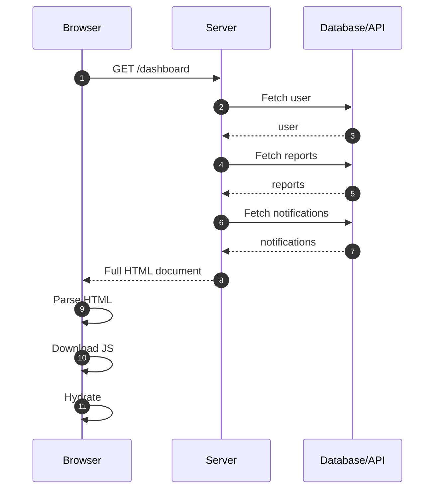
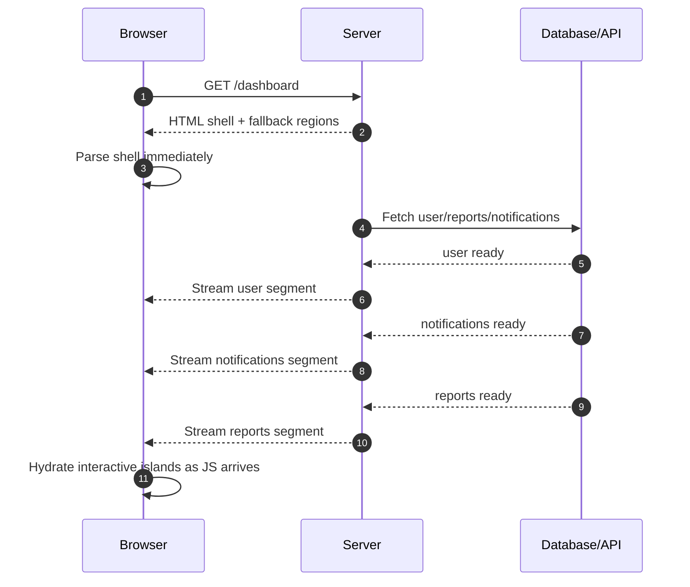
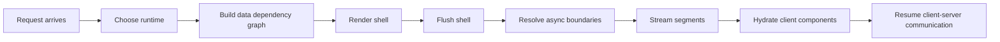
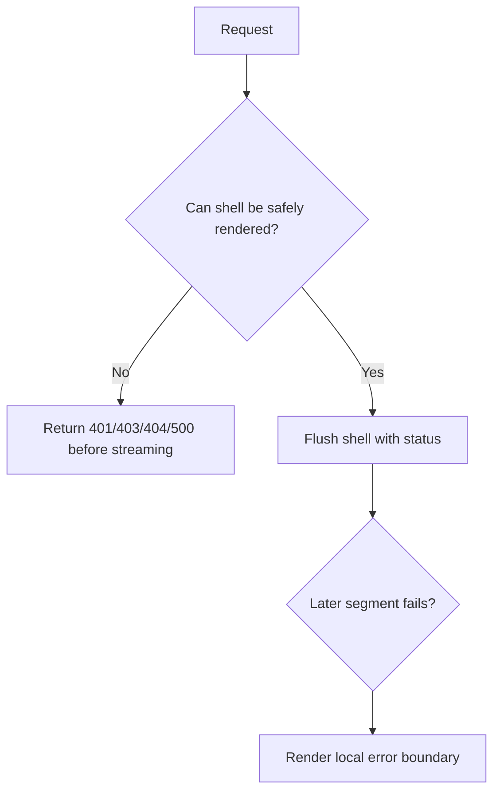
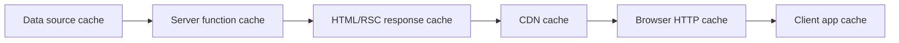
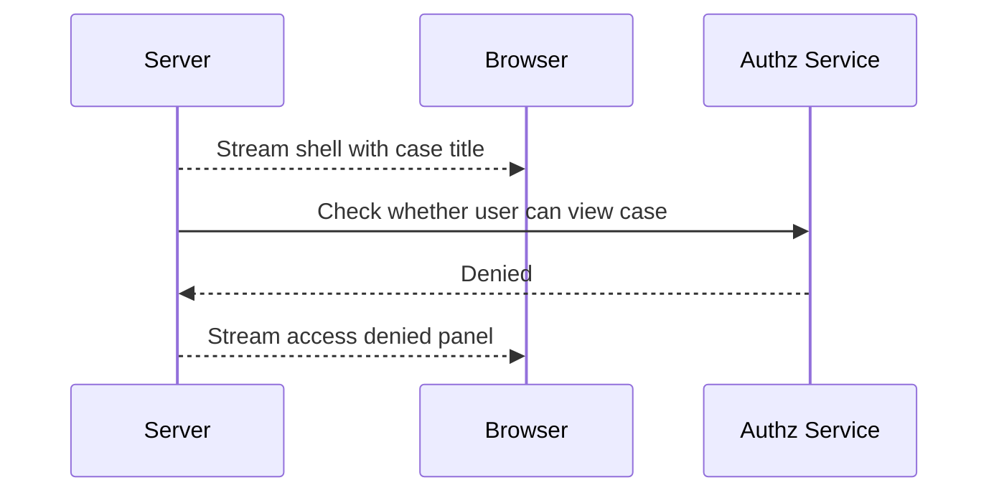
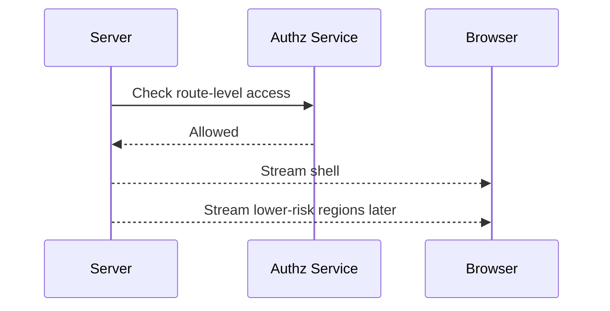
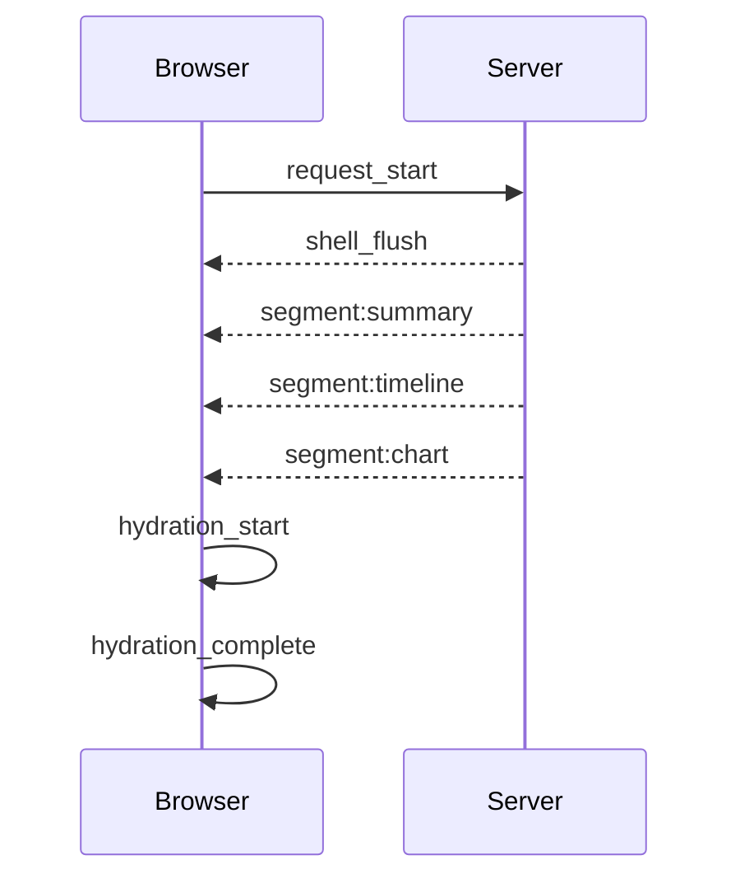

# Part 043 — Streaming Rendering and Partial Data

Streaming rendering is not a nicer loading spinner.

It is a different communication protocol between server and browser. Instead of the server saying:

> “Wait until everything is complete, then I will send the page.”

it says:

> “Here is the shell now. Here are more UI segments as their data becomes available. Hydrate what can be made interactive. Keep moving.”

That one change affects latency, cacheability, error handling, HTTP headers, server runtime choice, Suspense placement, data ownership, and observability.

This part builds the mental model you need before touching framework-specific APIs.

---

## 1. The Core Problem

Classic SSR behaves like this:



The user sees nothing until the slowest server dependency finishes.

Streaming changes the shape:



The goal is not merely earlier bytes. The goal is earlier **useful structure**.

A streamed page can still be bad if it streams irrelevant skeletons, blocks critical data behind the wrong boundary, or sends chunks that the browser cannot meaningfully display.

---

## 2. Streaming Is a Pipeline, Not a Flag

A production streaming architecture has several stages:



Each stage has a different failure mode.

| Stage | Question | Common Failure |
|---|---|---|
| Runtime selection | Can this environment stream and access needed APIs? | Edge chosen for code needing Node APIs |
| Dependency graph | Which data blocks the shell? | Everything awaited before render |
| Shell render | What can be safely shown early? | Empty page with full-page spinner |
| Flush | Can bytes reach the browser early? | Proxy/CDN buffering defeats streaming |
| Segment stream | What resolves independently? | Suspense boundary too coarse |
| Hydration | What becomes interactive first? | Critical client JS too large |
| Resume | What does client fetch after hydration? | Duplicate request after SSR/RSC data transfer |

Streaming starts as architecture. API calls are just one part of it.

---

## 3. Shell, Segment, Boundary

Three terms matter.

### Shell

The shell is the earliest safe HTML structure.

It usually contains:

- document layout
- navigation frame
- route frame
- stable metadata
- critical CSS links
- fallback UI for slower regions
- bootstrap scripts

The shell should not require slow, non-critical data.

Bad shell:

```tsx
export default async function Page() {
  const user = await loadUser();
  const reports = await loadReports();
  const auditLog = await loadAuditLog();

  return <Dashboard user={user} reports={reports} auditLog={auditLog} />;
}
```

Everything blocks the first meaningful byte.

Better shape:

```tsx
import { Suspense } from "react";

export default async function Page() {
  const user = await loadUser();

  return (
    <DashboardShell user={user}>
      <Suspense fallback={<ReportsSkeleton />}>
        <ReportsPanel />
      </Suspense>
      <Suspense fallback={<AuditLogSkeleton />}>
        <AuditLogPanel />
      </Suspense>
    </DashboardShell>
  );
}
```

The user identity may be shell-critical. Reports and audit logs may not be.

### Segment

A segment is a later part of the UI that can be delivered after the shell.

A segment needs:

- stable location in the DOM
- a fallback to replace
- a data dependency that can resolve independently
- error behavior that does not collapse the whole page

### Boundary

A boundary decides where waiting is allowed.

In React, Suspense boundaries are the main primitive for this. They let one region wait while the rest of the tree can continue rendering.

A boundary is a product decision, not only a technical wrapper.

Ask:

- Can the user understand the screen without this data?
- Can the user act safely before this data arrives?
- Can this region fail independently?
- Should stale data be shown instead of fallback?
- Does this boundary create layout shift?
- Does it split the page in a way users can perceive?

---

## 4. Blocking Data vs Deferrable Data

Not all data deserves the same position in the pipeline.

| Data Type | Example | Blocks Shell? | Reason |
|---|---|---:|---|
| Routing identity | tenant slug, case id | Usually yes | Determines what page means |
| Authorization decision | can view case | Usually yes | Prevents leaking shell/details |
| Primary heading | case title, customer name | Often yes | Gives context |
| Secondary metrics | chart cards | Often no | Can stream later |
| Long tables | audit events, activity feed | No | Expensive and scroll-dependent |
| Recommendations | related items | No | Non-critical |
| User-specific decoration | avatar, counters | Depends | Small but personalization-sensitive |

The mistake is to classify data by endpoint name.

Classify by **user-perceived dependency** and **safety**.

A page can show without comments. It cannot safely show without knowing whether the current user may see the page.

---

## 5. Partial Data Taxonomy

Partial data is not one thing.

| Kind | Meaning | UI Strategy |
|---|---|---|
| Structural partial | Layout is known, content is pending | Skeleton/placeholder |
| Field partial | Object exists but some fields missing | Explicit unknown/hidden field state |
| Collection partial | First page exists, more pages pending | Paginated/infinite UI |
| Permission partial | Data exists but fields hidden | Redaction, not skeleton |
| Error partial | One region failed | Local error boundary/retry |
| Stale partial | Old data shown while new data loads | Background refresh indicator |
| Progressive partial | Streamed chunks append/replace regions | Stable placeholder slots |

Do not treat all partiality as loading.

A redacted value is not loading. A stale value is not empty. A failed region is not an empty result.

---

## 6. React Streaming SSR Primitives

React exposes two important server rendering APIs:

- `renderToPipeableStream` for Node.js streams
- `renderToReadableStream` for Web Streams environments

In many frameworks you do not call these directly, but you still need the model because framework behavior is built on similar boundaries.

### Node-style streaming

```tsx
import { renderToPipeableStream } from "react-dom/server";
import App from "./App";

export function handleRequest(req, res) {
  let didError = false;

  const { pipe, abort } = renderToPipeableStream(<App url={req.url} />, {
    bootstrapScripts: ["/assets/client.js"],

    onShellReady() {
      res.statusCode = didError ? 500 : 200;
      res.setHeader("content-type", "text/html");
      pipe(res);
    },

    onShellError(error) {
      res.statusCode = 500;
      res.setHeader("content-type", "text/html");
      res.end("<h1>Something went wrong</h1>");
    },

    onError(error) {
      didError = true;
      console.error(error);
    },
  });

  setTimeout(() => abort(), 10_000);
}
```

Important properties:

- `onShellReady` means the shell can be streamed.
- `onShellError` means the shell itself failed.
- `onError` can happen for errors inside later boundaries.
- `abort()` prevents the server from spending unbounded time rendering a broken or slow tree.

### Web Streams style

```tsx
import { renderToReadableStream } from "react-dom/server";
import App from "./App";

export async function handleRequest(request: Request): Promise<Response> {
  const stream = await renderToReadableStream(<App url={request.url} />, {
    bootstrapScripts: ["/assets/client.js"],
    onError(error) {
      console.error(error);
    },
  });

  return new Response(stream, {
    headers: {
      "content-type": "text/html; charset=utf-8",
    },
  });
}
```

This shape matters for Edge-like runtimes because Web Streams are often the common denominator.

---

## 7. Suspense as Backpressure Boundary

Suspense does two things in streaming architecture:

1. It says where rendering may pause.
2. It lets the renderer continue with the rest of the tree.

```tsx
<Suspense fallback={<CaseSummarySkeleton />}>
  <CaseSummary caseId={caseId} />
</Suspense>

<Suspense fallback={<TimelineSkeleton />}>
  <CaseTimeline caseId={caseId} />
</Suspense>
```

This creates two independently resolving regions.

But there is a cost.

Too few boundaries:

```tsx
<Suspense fallback={<WholePageSkeleton />}>
  <CaseSummary />
  <CaseTimeline />
  <RelatedCases />
</Suspense>
```

One slow region delays all useful content.

Too many boundaries:

```tsx
<Suspense fallback={<TinySkeleton />}>
  <FieldA />
</Suspense>
<Suspense fallback={<TinySkeleton />}>
  <FieldB />
</Suspense>
<Suspense fallback={<TinySkeleton />}>
  <FieldC />
</Suspense>
```

The page flickers, layout becomes unstable, and the server emits many small chunks.

Good boundaries align with user-perceived regions:

- header
- primary entity summary
- task list
- activity feed
- side panel
- recommendation card
- expensive chart

---

## 8. Streaming Does Not Remove Waterfalls Automatically

This still waterfalls:

```tsx
async function ReportsPanel() {
  const account = await loadAccount();
  const reports = await loadReports(account.id);
  const charts = await loadCharts(reports.map((r) => r.id));

  return <Reports reports={reports} charts={charts} />;
}
```

Streaming may make the shell appear earlier, but the panel itself still waits serially.

Better:

```tsx
async function ReportsPanel() {
  const account = await loadAccount();

  const reportsPromise = loadReports(account.id);
  const permissionsPromise = loadReportPermissions(account.id);

  const [reports, permissions] = await Promise.all([
    reportsPromise,
    permissionsPromise,
  ]);

  return <Reports reports={reports} permissions={permissions} />;
}
```

Even better, if the parent already knows `accountId`, do not rediscover it inside the child.

```tsx
function ReportsBoundary({ accountId }: { accountId: string }) {
  return (
    <Suspense fallback={<ReportsSkeleton />}>
      <ReportsPanel accountId={accountId} />
    </Suspense>
  );
}
```

Streaming helps with **render blocking**. It does not fix a badly shaped data graph.

---

## 9. Promise Passing Across Server/Client Boundary

With modern React Server Components, a server can create a Promise and pass it into a Client Component that reads it with `use`.

Conceptual shape:

```tsx
// Server Component
import CommentsClient from "./CommentsClient";

export default async function PostPage({ postId }: { postId: string }) {
  const post = await loadPost(postId);
  const commentsPromise = loadComments(post.id);

  return (
    <article>
      <h1>{post.title}</h1>
      <CommentsClient commentsPromise={commentsPromise} />
    </article>
  );
}
```

```tsx
// Client Component
"use client";

import { use } from "react";

export function CommentsClient({ commentsPromise }) {
  const comments = use(commentsPromise);

  return <CommentsList comments={comments} />;
}
```

This is powerful because it lets the server start the work early while the client reads the result inside a Suspense boundary.

But it is also dangerous if abused.

Guardrails:

- pass promises only when they represent stable, serializable results
- keep error behavior explicit with boundaries
- do not pass promises that depend on client-only state
- do not use this as a generic event/mutation protocol
- do not leak authorization-sensitive timing or data shape

---

## 10. Status Codes in Streaming Responses

In non-streaming SSR, you can wait until all data resolves before choosing a status code.

In streaming, once the shell has been flushed, headers and status are usually committed.

That creates a constraint:



This means shell-critical decisions should happen before streaming:

- authentication required
- tenant exists
- route exists
- user can view page
- canonical redirect
- major not found decisions

After shell flush, region-level failures should usually become UI-level failures, not response-level failures.

Bad design:

- flush shell before knowing whether the user may view the entity
- later discover 403
- replace body with forbidden UI while HTTP status remains 200
- accidentally expose page structure or entity existence

Correct design:

- perform authorization and entity existence checks before shell flush when they affect route legitimacy
- stream non-critical regions afterward

---

## 11. Error Boundaries in Streaming

Streaming requires local failure containment.

```tsx
<CasePageShell>
  <Suspense fallback={<SummarySkeleton />}>
    <SummaryRegion />
  </Suspense>

  <ErrorBoundary fallback={<TimelineError />}> 
    <Suspense fallback={<TimelineSkeleton />}>
      <TimelineRegion />
    </Suspense>
  </ErrorBoundary>
</CasePageShell>
```

Without containment, one failing region can collapse a whole response.

Design each streamed region with:

- fallback state
- error state
- retry affordance
- observability metadata
- redaction behavior
- layout size reservation

Error UI should tell the truth:

- “Timeline failed to load” is better than empty timeline.
- “You do not have access to this panel” is better than spinner forever.
- “Showing cached result” is better than pretending freshness.

---

## 12. Streaming and HTTP Intermediaries

Your app may stream correctly, but the user still receives a buffered response.

Common buffering points:

- reverse proxy
- CDN
- serverless platform adapter
- compression middleware
- application performance monitoring wrapper
- corporate proxy
- browser heuristics

Production checklist:

- verify chunk arrival in real browser DevTools
- test through the same CDN path used by production
- test with compression enabled
- avoid middleware that buffers full body before sending
- verify first byte and first meaningful chunk separately
- measure region completion, not only TTFB

A low TTFB does not prove useful streaming. It may only mean the server sent an early empty chunk.

---

## 13. Caching with Streaming

Streaming complicates cache thinking.

There are several cache layers:



A streamed response can contain data with mixed freshness requirements.

Example:

- shell: public, cacheable for 5 minutes
- user nav: private, user-specific
- notifications: private, frequently changing
- marketing panel: public, cacheable for hours

Do not cache the whole streamed document as if it has one uniform policy unless that is actually true.

Common safe pattern:

- cache data fetches or segments with explicit scope
- keep personalized full-page response private
- use CDN cache for public route assets and public data
- use client/server-state cache for personalized dynamic data
- keep authz-sensitive data outside shared caches

---

## 14. Streaming and Client Fetch Duplication

A classic bug:

1. Server renders page and fetches data.
2. Browser hydrates.
3. Client query library immediately refetches the same data.
4. User pays twice.
5. Backend gets unnecessary load.
6. UI may flicker from streamed data to loading or stale replacement.

Better options:

- hydrate query cache from server result
- set appropriate `staleTime`
- mark server data with timestamp
- align route loader identity and query key identity
- avoid component effect refetch on mount when SSR/RSC already provided data

Conceptual integration:

```tsx
const queryClient = new QueryClient();

await queryClient.prefetchQuery({
  queryKey: caseKeys.detail(caseId),
  queryFn: () => api.cases.get(caseId),
});

const dehydratedState = dehydrate(queryClient);

return <App dehydratedState={dehydratedState} />;
```

Client:

```tsx
<HydrationBoundary state={dehydratedState}>
  <CasePage />
</HydrationBoundary>
```

Streaming and hydration should cooperate. They should not race.

---

## 15. Partial Data and Authorization

Partial rendering is dangerous when authorization is incomplete.

Bad sequence:



The case title already leaked.

Correct sequence:



Rule:

> Stream after authorization decisions that affect visibility.

Field-level permissions can be handled regionally, but route-level legitimacy must usually be known before shell flush.

---

## 16. Streaming Large Collections

Do not confuse HTML streaming with data pagination.

If a table has 50,000 rows, streaming the full HTML table is not a good solution.

Use the right tool:

| Problem | Better Tool |
|---|---|
| Slow secondary UI region | Suspense/streaming segment |
| Huge list | Pagination/infinite query/windowing |
| Live feed | SSE/WebSocket/polling |
| Large file | Blob/stream download |
| Expensive chart | deferred region + cache |
| Above-the-fold content | shell-critical SSR/RSC |

Streaming improves time-to-first-useful-structure. It does not remove the need for data modeling.

---

## 17. Designing Fallbacks

A fallback is part of the protocol.

Poor fallback:

```tsx
<Suspense fallback={<div>Loading...</div>}>
  <RevenueChart />
</Suspense>
```

Better fallback:

```tsx
<Suspense
  fallback={
    <section aria-busy="true" aria-label="Revenue chart loading">
      <ChartSkeleton height={280} />
    </section>
  }
>
  <RevenueChart />
</Suspense>
```

Fallback requirements:

- preserve layout dimensions
- communicate loading state accessibly
- avoid pretending data exists
- avoid blocking unrelated actions
- match the eventual region shape
- use stale data instead when that is better than skeleton

For business workflows, stale-but-labeled data often beats skeletons.

Example:

```tsx
function CaseRiskPanel({ risk, isRefreshing }) {
  return (
    <section aria-busy={isRefreshing}>
      <RiskScore value={risk.score} />
      {isRefreshing && <small>Refreshing risk score...</small>}
    </section>
  );
}
```

---

## 18. Observability for Streaming

Normal request logs are insufficient.

You need timing by stage:



Track:

- request start
- shell ready
- shell flushed
- first meaningful segment
- each Suspense region completed
- region errors
- stream aborts
- client hydration start/end
- duplicate client fetches after hydration
- server timeout abort
- user navigation away during stream

Server log shape:

```ts
type StreamRenderEvent = {
  requestId: string;
  routeId: string;
  userScope: "anonymous" | "authenticated";
  event:
    | "request_start"
    | "shell_ready"
    | "shell_error"
    | "shell_flush"
    | "segment_resolved"
    | "segment_error"
    | "stream_abort"
    | "request_end";
  segment?: string;
  elapsedMs: number;
  errorClass?: string;
};
```

If you cannot answer “which region delayed this page?”, you do not have streaming observability.

---

## 19. Testing Streaming Behavior

Do not only snapshot final HTML.

Test:

- shell renders before slow region resolves
- route-level auth failure returns correct status before stream
- region failure is contained by local error UI
- abort cancels slow render
- duplicate client refetch does not happen after hydration
- CDN/proxy path does not buffer full response
- fallback layout does not shift badly
- streamed HTML is valid when chunks arrive incrementally

Conceptual test with controlled promises:

```tsx
test("streams shell before reports resolve", async () => {
  const reports = deferred<Report[]>();

  renderServer(<Dashboard reportsPromise={reports.promise} />);

  await expectShellToContain("Dashboard");
  await expectShellToContain("Loading reports");

  reports.resolve([{ id: "r1", title: "Quarterly" }]);

  await expectStreamToContain("Quarterly");
});
```

In production systems, complement unit tests with integration tests through the real HTTP adapter.

---

## 20. Failure Modes

| Failure | Symptom | Root Cause | Fix |
|---|---|---|---|
| Fake streaming | TTFB low, content appears all at once | Proxy/CDN buffers | Test real delivery path |
| Full-page blocking | Shell delayed by slow data | Awaiting too much before render | Move non-critical work behind boundaries |
| Skeleton soup | Too many tiny boundaries | Boundary not aligned to UX region | Group by meaningful sections |
| Status code lie | 200 page for denied/not found entity | Streamed before route-level decision | Resolve auth/entity before shell flush |
| Region collapse | One panel error kills page | Missing local error boundary | Contain errors per region |
| Duplicate fetch | Hydration refetches streamed data | Cache not hydrated or staleTime wrong | Align server data transfer and query cache |
| Layout shift | Segments replace fallbacks with different size | Bad skeleton dimensions | Reserve region size |
| Stream leak | Server keeps rendering after client leaves | Missing abort propagation | Wire request abort to render/data abort |
| Secret leak | Server-only data serialized to client | Bad DTO boundary | Explicit view model mapping |

---

## 21. Review Checklist

Before shipping streaming rendering:

- Which data is shell-critical?
- Which decisions must complete before status/header commit?
- Where are Suspense boundaries placed?
- What is the fallback for each boundary?
- What is the local error UI for each boundary?
- Can slow data be fetched in parallel?
- Does the CDN/proxy preserve streaming?
- Are duplicate client fetches avoided after hydration?
- Are authorization decisions done before sensitive data is streamed?
- Are stream aborts wired to data cancellation?
- Are stream events observable per region?
- Does the page still work under slow JS/hydration?

---

## 22. The Practical Rule

Use streaming when a route has:

- meaningful shell content available early
- non-critical slow regions
- independent failure boundaries
- real user value from progressive reveal
- infrastructure that actually delivers chunks

Do not use streaming as a bandage for:

- bad data modeling
- frontend N+1
- missing cache
- unsafe authorization
- oversized client JavaScript
- slow database queries that should be fixed directly

Streaming is a latency orchestration tool. It is not a correctness substitute.

---

## References

- React `renderToReadableStream`: https://react.dev/reference/react-dom/server/renderToReadableStream
- React `renderToPipeableStream`: https://react.dev/reference/react-dom/server/renderToPipeableStream
- React Server Components: https://react.dev/reference/rsc/server-components
- React Suspense: https://react.dev/reference/react/Suspense
- React `use`: https://react.dev/reference/react/use
- Web Streams API: https://developer.mozilla.org/en-US/docs/Web/API/Streams_API
