# Part 044 — Edge Runtime vs Node Runtime

“Run it at the edge” sounds like a performance upgrade.

Sometimes it is.

Sometimes it moves your code farther from the database, removes APIs your code needs, breaks library compatibility, weakens observability, and gives you a faster failing system.

The runtime decision is not cosmetic. It changes the client-server communication contract.

This part gives you a decision framework.

---

## 1. The Runtime Is Part of the Architecture

React client-server communication can involve multiple server-side execution points:

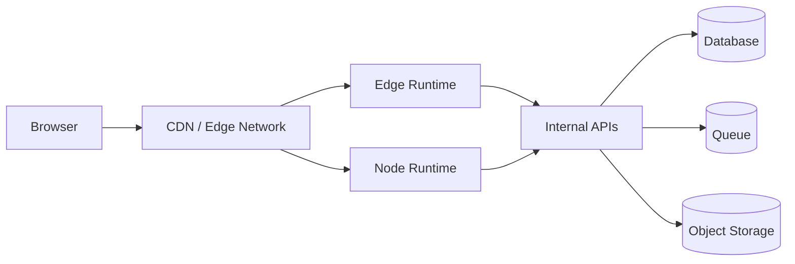

The question is not:

> Which runtime is faster?

The better question is:

> Where should this computation execute so that latency, correctness, data access, security, and operability are all acceptable?

A runtime decision affects:

- which APIs are available
- where secrets live
- how network connections behave
- how streaming works
- how caching works
- how long computation may run
- how packages are bundled
- how errors are observed
- how close code is to users vs data

---

## 2. Mental Model: User Gravity vs Data Gravity

Edge runtime optimizes for proximity to users.

Node runtime often optimizes for capability and proximity to backend systems.

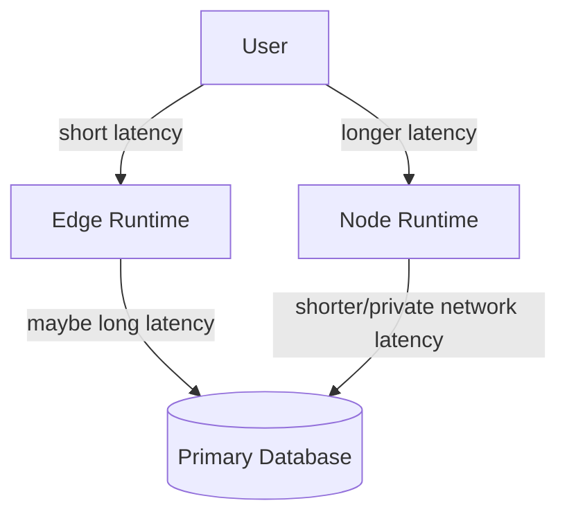

If the operation mostly depends on the user request and lightweight logic, edge can help.

If the operation depends on a centralized database, heavy SDKs, private network access, long CPU work, or connection pooling, Node is often safer.

The fastest location is not necessarily closest to the browser. It is closest to the bottleneck.

---

## 3. Typical Runtime Capabilities

Exact capabilities depend on platform, but the pattern is stable.

| Capability | Edge Runtime | Node Runtime |
|---|---|---|
| Startup | Usually very fast | Usually fast but heavier |
| Web APIs | Strong | Available increasingly, plus Node APIs |
| Node built-ins | Limited/partial/unavailable | Full Node.js API surface |
| Native modules | Usually unsupported | Usually supported depending platform |
| File system | Usually unavailable/limited | Often available, sometimes ephemeral |
| TCP sockets | Often restricted | Usually available |
| Long-running work | Poor fit | Better fit |
| Database drivers | Often constrained | Better support |
| Connection pooling | Harder/limited | Better support |
| CPU-heavy work | Poor fit | Better fit |
| Streaming | Often Web Streams | Node streams and/or Web Streams |
| Bundle size constraints | Stricter | More forgiving |
| Observability agents | More limited | More mature |

Do not memorize this table as universal law. Treat it as the default suspicion.

Always verify your deployment platform.

---

## 4. What Edge Runtime Is Good At

Edge is useful when the work is:

- close to the user
- small
- stateless
- latency-sensitive
- cache-oriented
- based on Web APIs
- not dependent on heavyweight Node libraries
- not dependent on long database transactions

Examples:

| Use Case | Why Edge Fits |
|---|---|
| Redirects/rewrites | Simple, latency-sensitive request shaping |
| Locale/geo routing | Decision based on request metadata |
| A/B assignment | Small stateless decision, cookie/header update |
| Auth gate at route edge | Reject obvious unauthenticated traffic early |
| Static/dynamic cache selection | Close to CDN behavior |
| Lightweight personalization | Header/cookie based, no heavy DB dependency |
| Signed URL verification | Small crypto operation if runtime supports it |
| HTML shell for globally distributed content | User-proximity matters |

Edge works best when it avoids expensive origin trips.

If every edge request still calls a central database before responding, edge may only add another hop.

---

## 5. What Node Runtime Is Good At

Node is usually better when the work needs:

- mature library ecosystem
- database drivers
- connection pooling
- private network access
- long-running requests
- background-ish server work
- file processing
- streaming uploads/downloads with existing SDKs
- complex observability agents
- large dependency graph
- native modules
- server-side rendering with broad package compatibility

Examples:

| Use Case | Why Node Fits |
|---|---|
| Complex RSC render with DB access | Library/database compatibility |
| Server Functions with transactions | Connection + transaction support |
| Report generation | CPU/time/file handling |
| Multipart upload orchestration | SDK compatibility |
| Payment/webhook handling | Stable server capability and observability |
| Admin dashboards hitting internal APIs | Data gravity near backend |
| Queue publishing | SDK/network access |
| Audit-heavy mutation | Transaction + logging + tracing |

Node is not “old”. It is often the correct place for capability-heavy work.

---

## 6. Runtime Decision Matrix

Use this matrix before choosing runtime.

| Question | Choose Edge When | Choose Node When |
|---|---|---|
| Where is the bottleneck? | User/network latency | Database/backend work |
| Is logic stateless? | Yes | No, transaction/session heavy |
| Does it need Node APIs? | No | Yes |
| Does it need DB connection pooling? | No or HTTP API only | Yes |
| Does it need native packages? | No | Yes |
| Is response cacheable? | Often | Maybe, but less edge-specific |
| Is work CPU-heavy? | No | More likely |
| Is observability mature? | Platform supports enough | Full tracing/logging needed |
| Is failure blast radius acceptable? | Small/simple logic | Complex domain logic |
| Does it stream? | Web Stream friendly | Node/Web Stream friendly |

A good architecture often uses both.

Example:

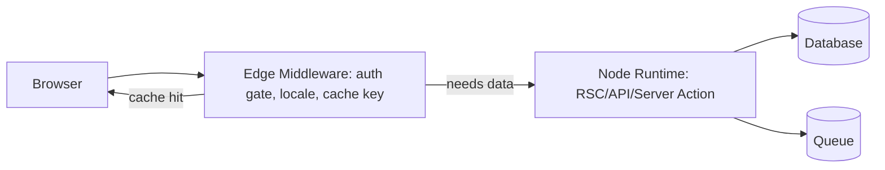

Edge handles cheap request shaping. Node handles domain work.

---

## 7. React SSR and Streaming Runtime Choice

React has separate server streaming APIs for different stream models:

- Node stream model: `renderToPipeableStream`
- Web Streams model: `renderToReadableStream`

Runtime choice affects which one the framework or adapter uses.

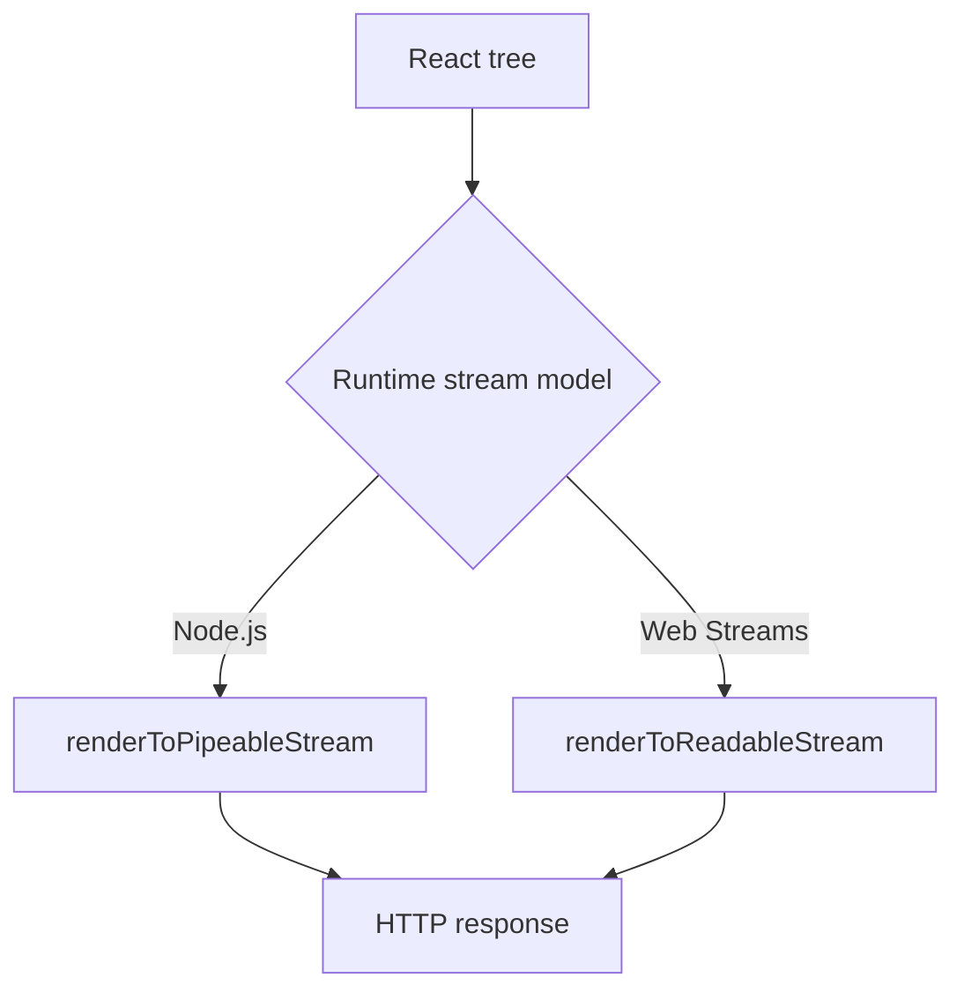

When evaluating a runtime for SSR/RSC, ask:

- Does the runtime support the streaming primitive your framework uses?
- Does the platform buffer streams before delivery?
- Can you abort rendering when the client disconnects?
- Can server data fetches be cancelled?
- Can errors be logged before/after shell flush?
- Does compression preserve streaming behavior?
- Does the CDN path preserve chunking?

A runtime can support streams in theory and still fail your actual production path.

---

## 8. Server Components Runtime Concerns

Server Components execute on the server side. They may access server-only resources, but only inside the runtime that supports those resources.

Edge concern:

```tsx
// This may fail in edge-like environments if the db driver needs Node APIs.
import { db } from "@/server/postgres-node-driver";

export default async function CasePage({ caseId }) {
  const row = await db.case.findUnique({ id: caseId });
  return <CaseView row={row} />;
}
```

Better options:

- run this route on Node
- access the database through an HTTP internal API designed for edge
- use a database driver/platform that explicitly supports the edge runtime
- cache public/read-mostly data closer to the edge

Do not put database access at the edge just because the component is a Server Component.

---

## 9. Server Functions and Runtime Choice

Server Functions/Actions are remote command boundaries.

A command often needs:

- authentication
- authorization
- validation
- transaction
- idempotency check
- audit write
- domain mutation
- event publication
- cache invalidation

That usually favors Node unless your platform explicitly supports those operations at edge safely.

Example decision:

| Action | Suggested Runtime | Reason |
|---|---|---|
| Toggle theme preference cookie | Edge or Node | Small, local, low risk |
| Submit enforcement decision | Node | Transaction, audit, authorization, idempotency |
| Generate signed upload URL | Either | Depends on crypto/SDK support |
| Create invoice | Node | Payment SDK, audit, retries |
| Search public docs | Edge if index/cache nearby | User latency matters |

Rule:

> The more domain-critical the mutation, the less you should choose edge by default.

---

## 10. Data Access Patterns

### Pattern A — Edge only

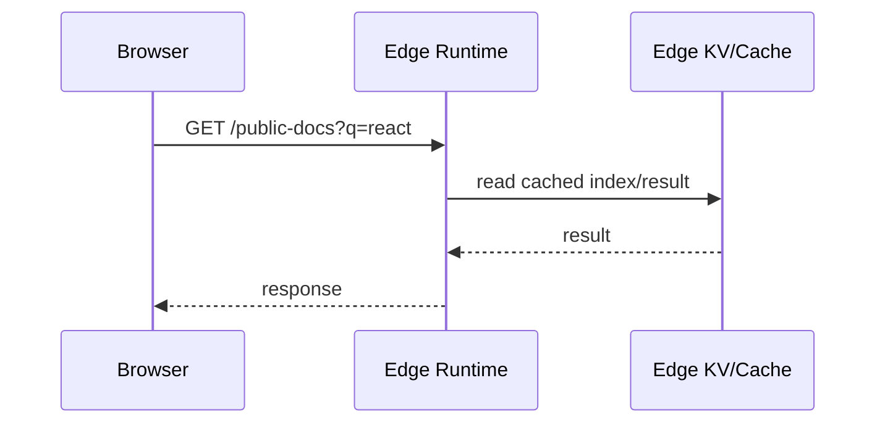

Good for:

- cache-backed reads
- public data
- low write complexity
- geographically distributed access

### Pattern B — Edge as gate, Node as origin

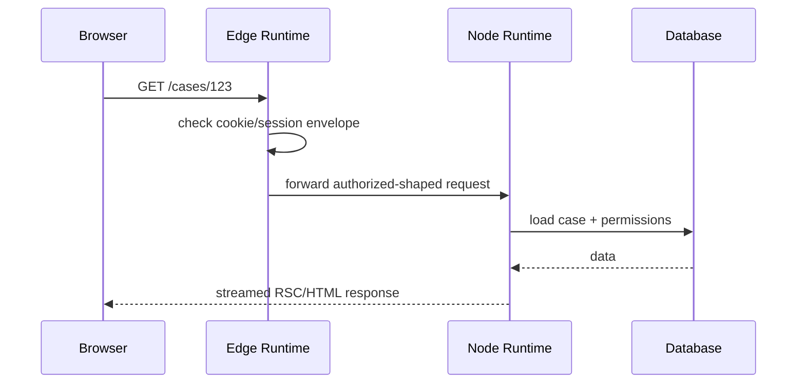

Good for:

- route filtering
- locale/tenant routing
- cache key shaping
- origin protection

### Pattern C — Node only

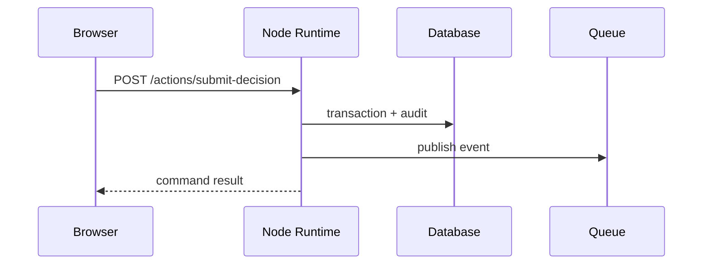

Good for:

- serious mutations
- transactions
- auditability
- complex SDKs
- internal network access

---

## 11. Connection Management

This is where edge decisions often fail.

A traditional Node service may keep database connections warm and pooled.

Edge isolates often do not behave like long-lived server processes. Even when some reuse exists, you should not assume stable process-level connection pooling.

Risk signs:

- direct Postgres/MySQL driver from every edge region
- too many short-lived DB connections
- no transaction support in edge-friendly HTTP database API
- high cross-region latency to primary DB
- connection storms during traffic spike

Safer options:

- use Node runtime near the database
- use an HTTP data API designed for distributed runtimes
- use read replicas where consistency allows
- cache read-heavy public data
- keep writes centralized
- avoid edge fan-out to many internal services

Data gravity beats wishful latency optimization.

---

## 12. Secrets and Environment Boundary

Never assume the same secret model across runtimes.

Questions:

- Are secrets available at build time or request time?
- Are they regionally replicated?
- How quickly can they rotate?
- Are they accessible to edge functions?
- Are logs redacted consistently?
- Are secret-dependent errors observable without leaking values?
- Can the runtime perform required cryptography?

Bad pattern:

```ts
const dbUrl = process.env.DATABASE_URL!;
```

This is fine in many Node contexts, but not universally safe across edge environments.

Better pattern:

```ts
export type RuntimeEnv = {
  getSecret(name: "SESSION_SIGNING_KEY" | "INTERNAL_API_TOKEN"): string;
  runtime: "edge" | "node";
};
```

Keep environment access behind a small runtime adapter so code does not silently assume Node.

---

## 13. Package Compatibility

A package can fail at edge because it uses:

- `fs`
- `net`
- `tls`
- `child_process`
- native bindings
- dynamic `require`
- Node Buffer assumptions
- process-level globals
- unsupported crypto APIs
- large transitive dependencies

This matters for React server code because importing a module can be enough to break a route.

Bad boundary:

```ts
// shared/domain/index.ts
export * from "./pure-validation";
export * from "./node-only-pdf-generator";
export * from "./postgres-repository";
```

An edge route importing `pure-validation` may accidentally pull node-only code through a barrel file.

Better boundary:

```txt
/server
  /node
    postgresRepository.ts
    pdfGenerator.ts
  /edge
    cookieSession.ts
    geoRouting.ts
  /shared
    validation.ts
    dto.ts
    errorTypes.ts
```

Make runtime boundaries visible in the module graph.

---

## 14. Caching Architecture

Edge runtime and CDN cache can be powerful, but only when cache scope is correct.

| Data | Cache at Edge? | Notes |
|---|---:|---|
| Public marketing content | Yes | Strong fit |
| Public docs/search index | Often | Use invalidation/versioning |
| Personalized dashboard HTML | Usually no shared cache | Private/user-specific |
| Session validation result | Maybe short-lived/private | Be careful with revocation |
| Tenant config | Maybe | Include tenant/version in key |
| Authorization decision | Rarely shared | User/resource/action scoped |
| Mutation result | No shared cache | Command semantics |

Cache key must include all dimensions that affect representation:

- path
- query params
- locale
- tenant
- auth state
- user segment if personalized
- feature flags
- content version
- permission version when relevant

Wrong edge cache is worse than no edge cache.

---

## 15. Latency Budget Example

Suppose a user in Singapore accesses a React dashboard.

Option A: Node runtime in us-east, database in us-east.

```txt
Browser Singapore -> Node us-east -> DB us-east -> Browser Singapore
```

Option B: Edge runtime in Singapore, database in us-east.

```txt
Browser Singapore -> Edge Singapore -> DB us-east -> Edge Singapore -> Browser Singapore
```

If the page must hit the database synchronously, Option B may not improve much because the edge still waits on us-east data.

Option C: Edge runtime in Singapore, cached public/tenant config at edge, Node only for private data.

```txt
Browser -> Edge: shell/config/cache
Browser -> Node/API: private data as needed
```

This can improve perceived latency if the early response is useful and private data loads progressively.

Optimize the path, not the brand name of the runtime.

---

## 16. Runtime-Specific Error Handling

Edge errors can be harder to debug because:

- logs are distributed
- stack traces may be transformed by bundling
- platform limits may terminate execution
- observability agents may be limited
- region-specific failures are harder to reproduce
- Node-only dependency failures may appear at build/deploy time or request time

Minimum error envelope:

```ts
type RuntimeErrorEvent = {
  requestId: string;
  runtime: "edge" | "node";
  region?: string;
  routeId: string;
  operation: string;
  errorClass: string;
  elapsedMs: number;
  coldStart?: boolean;
  upstream?: string;
};
```

Log the runtime explicitly. Otherwise you will debug a distributed bug as if it ran in one place.

---

## 17. Abort and Disconnect Handling

Runtime choice changes cancellation mechanics.

For request-driven work:

- if browser disconnects, server should stop unnecessary work
- if render times out, data fetches should be aborted
- if edge forwards to origin, origin should receive a useful deadline
- if Node starts a mutation, aborting the HTTP request must not corrupt the domain operation

Conceptual deadline propagation:

```ts
export async function withDeadline<T>(
  operation: string,
  ms: number,
  fn: (signal: AbortSignal) => Promise<T>,
): Promise<T> {
  const signal = AbortSignal.timeout(ms);

  try {
    return await fn(signal);
  } catch (error) {
    if (signal.aborted) {
      throw new Error(`${operation} exceeded ${ms}ms deadline`);
    }
    throw error;
  }
}
```

Do not equate transport abort with domain rollback.

For reads, abort usually means “stop work.”

For mutations, abort often means “client no longer waits, but server may still complete.” Use idempotency keys and status lookup for serious commands.

---

## 18. Runtime-Aware API Client

A shared API client should avoid assuming browser, edge, or Node globals.

Poor client:

```ts
export async function apiGet(path: string) {
  return fetch(process.env.API_ORIGIN + path, {
    headers: {
      Authorization: `Bearer ${localStorage.getItem("token")}`,
    },
  });
}
```

This fails across runtimes:

- `localStorage` is browser-only
- `process.env` is Node-ish/platform-specific
- auth source differs by runtime
- internal origin differs by deployment location

Better shape:

```ts
export type ApiRuntimeContext = {
  origin: string;
  getAuthHeader(): string | undefined;
  fetchImpl: typeof fetch;
  runtime: "browser" | "edge" | "node";
};

export function createApiClient(ctx: ApiRuntimeContext) {
  return {
    async get<T>(path: string, signal?: AbortSignal): Promise<T> {
      const auth = ctx.getAuthHeader();

      const res = await ctx.fetchImpl(`${ctx.origin}${path}`, {
        method: "GET",
        signal,
        headers: auth ? { Authorization: auth } : undefined,
      });

      if (!res.ok) {
        throw new Error(`API ${res.status}`);
      }

      return res.json() as Promise<T>;
    },
  };
}
```

Inject runtime dependencies. Do not smuggle them through globals.

---

## 19. Edge as Policy Layer, Not Domain Layer

A robust pattern is to keep edge logic narrow.

Good edge responsibilities:

- normalize URL
- redirect/canonicalize
- choose locale
- choose tenant from host/path
- reject obviously invalid requests
- add request ID
- shape cache key
- serve cached public response
- forward to origin with deadline

Risky edge responsibilities:

- perform complex authorization with many resource dependencies
- execute multi-step domain transactions
- call many internal services
- generate large reports
- process files
- own critical audit behavior
- implement complex retry orchestration

Edge is excellent as an acceleration and policy layer. It is not automatically the best domain execution layer.

---

## 20. Deployment Topologies

### Topology 1 — Simple Node SSR

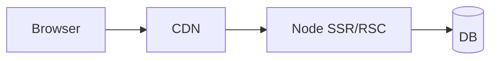

Best when:

- team wants operational simplicity
- backend is centralized
- SSR/RSC needs database drivers
- edge benefit is unclear

### Topology 2 — Edge middleware + Node app

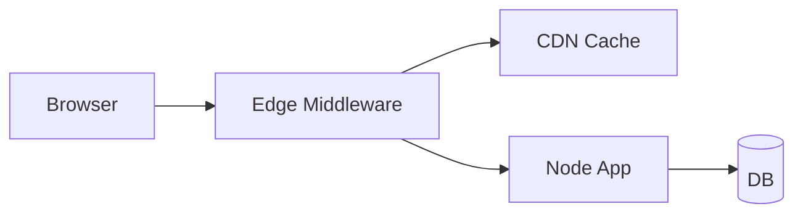

Best when:

- edge handles routing/cache/auth gate
- Node handles data/domain/rendering
- incremental adoption is preferred

### Topology 3 — Edge-rendered app with edge-compatible data

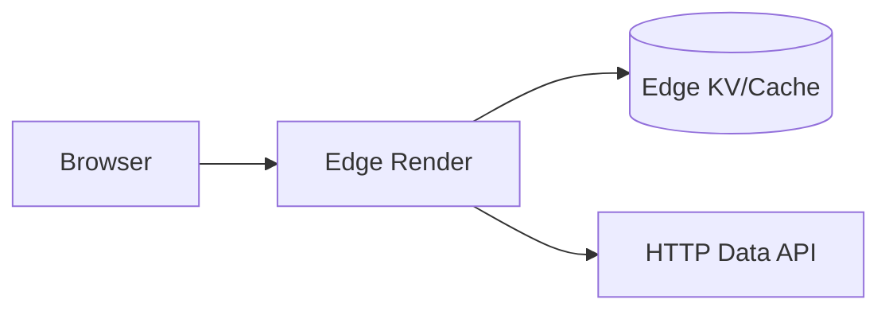

Best when:

- data layer is designed for distributed access
- routes are lightweight
- public or semi-public content dominates
- low latency across geography matters

### Topology 4 — Hybrid by route

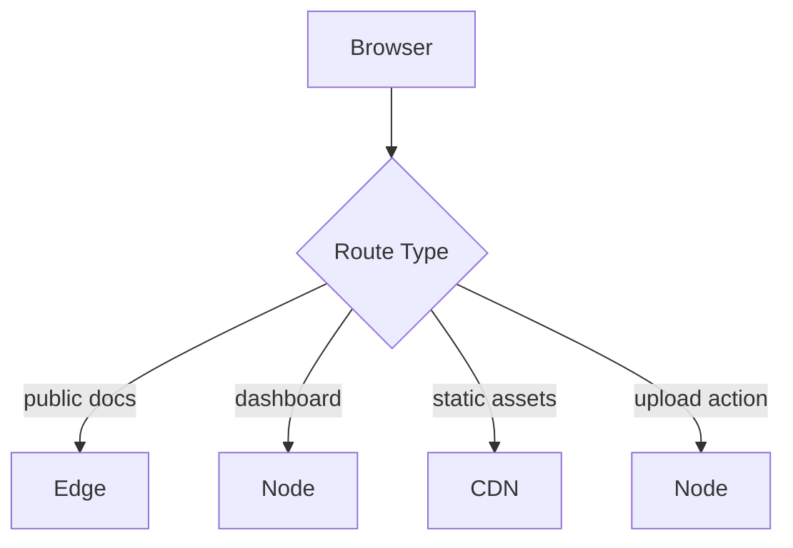

Best when:

- different routes have different constraints
- platform supports per-route runtime selection
- team can manage runtime boundaries clearly

Hybrid is often the mature answer.

---

## 21. Testing Runtime Assumptions

Unit tests rarely catch runtime mismatch.

Test categories:

| Test | Purpose |
|---|---|
| Bundle/runtime test | Detect Node-only imports in edge bundles |
| Integration test in deployed runtime | Verify actual APIs and limits |
| Stream delivery test | Detect buffering in platform/CDN |
| Regional smoke test | Catch region-specific config/secrets issues |
| Dependency compatibility test | Catch unsupported native/builtin APIs |
| Deadline test | Verify abort/timeouts propagate |
| Cache key test | Prevent shared-cache personalization leaks |
| Observability test | Ensure logs/traces include runtime/region |

Add runtime checks where failure would be expensive:

```ts
export function assertRuntime(expected: "edge" | "node", actual: string) {
  if (actual !== expected) {
    throw new Error(`Expected ${expected} runtime, got ${actual}`);
  }
}
```

Do not rely only on documentation. Deploy a minimal probe.

---

## 22. Runtime Failure Modes

| Failure | Symptom | Root Cause | Fix |
|---|---|---|---|
| Node package in edge route | Build/runtime crash | Transitive import uses Node API | Split module graph by runtime |
| Slower edge page | Higher p95 despite edge | Edge calls central DB | Move data access to Node/cache/replica |
| DB connection storm | Database max connections hit | Edge isolates create many connections | Use HTTP data API, Node origin, pooling proxy |
| Stream not streaming | Content appears all at once | CDN/platform buffering | Test delivery path; adjust adapter/proxy |
| Secret missing in region | Runtime-only failures | Secret not replicated/exposed | Standardize secret provisioning |
| Weak observability | Cannot debug regional failures | Runtime logs not correlated | Include request ID/runtime/region |
| Cache leak | User sees another user's data | Wrong edge cache key | Mark private, vary correctly, avoid shared cache |
| Mutation ambiguity | Client disconnects during action | Treating abort as rollback | Use idempotency/status endpoint |
| Cold dependency import | High startup latency | Heavy SDK in edge function | Move to Node or reduce bundle |
| Inconsistent crypto behavior | Signature mismatch | Runtime API differences | Use tested cross-runtime crypto adapter |

---

## 23. Decision Playbook

Use Edge when most are true:

- response is public or safely cache-scoped
- logic is lightweight and stateless
- code uses Web APIs cleanly
- data is already near edge or cache-backed
- no heavy Node packages are needed
- latency to user dominates
- platform observability is sufficient
- failure mode is simple and contained

Use Node when any are true:

- critical domain mutation
- transaction/audit required
- direct database driver needed
- large SDK/native dependency needed
- CPU/file processing needed
- long-running operation
- complex SSR/RSC dependency graph
- mature tracing/agent support required
- data gravity is near backend

Use both when:

- edge can cheaply reject/route/cache
- Node should own domain correctness
- routes have different latency/capability profiles
- public content and private workflows coexist

---

## 24. The Practical Rule

Edge runtime is a placement optimization.

Node runtime is a capability environment.

Do not choose edge because it sounds modern. Choose it when the operation becomes simpler, faster, and still correct at the edge.

Do not choose Node because it is familiar. Choose it when the operation needs capability, consistency, and operational maturity.

For serious React client-server systems, the best architecture is usually not “edge or node.”

It is:

> Put each communication boundary where its constraints are easiest to satisfy.

---

## References

- React `renderToPipeableStream`: https://react.dev/reference/react-dom/server/renderToPipeableStream
- React `renderToReadableStream`: https://react.dev/reference/react-dom/server/renderToReadableStream
- React Server Components: https://react.dev/reference/rsc/server-components
- Next.js Edge Runtime API Reference: https://nextjs.org/docs/app/api-reference/edge
- Cloudflare Workers Runtime APIs: https://developers.cloudflare.com/workers/runtime-apis/
- Cloudflare Workers Node.js compatibility: https://developers.cloudflare.com/workers/runtime-apis/nodejs/
