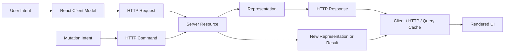

# Part 045 — REST from the React Side

REST sering diajarkan dari sisi backend: controller, route, resource, repository. Dari sisi React, masalahnya berbeda. React app bukan pemilik resource. React app adalah **consumer of representations** dan **issuer of commands** lewat protokol HTTP.

Kalau React engineer hanya berpikir “endpoint mana yang harus dipanggil?”, desain client akan cepat berubah menjadi:

- `api.ts` berisi ratusan function tipis tanpa invariant;
- komponen yang tahu terlalu banyak path backend;
- query key yang tidak stabil;
- mutation yang tidak aman untuk retry;
- UI state yang bingung membedakan 404, empty list, 403, dan validation error;
- invalidation yang terlalu kasar atau terlalu sempit;
- caching yang melawan HTTP dan CDN, bukan memanfaatkannya.

REST dari sisi React harus dipahami sebagai **contracted state transfer**.

React tidak mengambil “object server”. React mengambil **representasi** dari resource pada waktu tertentu, dengan permission tertentu, dalam format tertentu, melalui request tertentu, lalu menampilkannya sebagai UI state.



## 1. REST Is Not “JSON over HTTP”

JSON over HTTP berarti kita memakai HTTP sebagai tunnel. REST berarti kita memakai HTTP semantics sebagai bagian dari aplikasi.

Perbedaannya terlihat dari cara client mengambil keputusan.

| Question | JSON-over-HTTP Thinking | REST/HTTP-Aware Thinking |
|---|---|---|
| Apakah request aman untuk retry? | “Tergantung endpoint.” | Lihat method, idempotency, dan idempotency key. |
| Apakah response bisa dicache? | “Tergantung library.” | Lihat method, status, `Cache-Control`, validators, dan `Vary`. |
| Apakah mutation berhasil? | “Kalau JSON `{ success: true }`.” | Lihat status code, command result, conflict, validation, dan unknown outcome. |
| Apakah resource tidak ada? | “Response null.” | Bedakan `404`, `403`, empty collection, dan soft-deleted representation. |
| Apakah client boleh update local cache? | “Bisa asal object-nya sama.” | Harus tahu resource identity, representation identity, version, dan affected queries. |

REST yang baik membuat browser, CDN, observability, security middleware, contract tooling, dan React cache bekerja dengan bahasa yang sama: HTTP.

## 2. The React-Side Definition of a Resource

Dari sisi React, resource adalah **sesuatu yang punya stable identity dan bisa direpresentasikan lewat network**.

Contoh resource:

```txt
/cases/CASE-123
/cases/CASE-123/assignments
/officers/OFC-9
/search/cases?status=open&assignee=me
/reports/monthly/2026-07
```

Namun tidak semua resource sama.

| Resource Type | Example | React Concern |
|---|---|---|
| Entity resource | `/cases/{id}` | detail query, version, permission, stale data |
| Collection resource | `/cases` | filter, sorting, pagination, cache key explosion |
| Subresource | `/cases/{id}/documents` | parent identity, permission inheritance |
| Computed resource | `/dashboard/summary` | freshness, aggregation latency, partial failure |
| Search resource | `/cases/search?...` | canonical params, high-cardinality cache |
| Command resource/action endpoint | `/cases/{id}/transitions` | mutation semantics, idempotency, audit |

The mistake is treating every URL as merely an endpoint. For React, URL design directly affects:

- query key structure;
- cache invalidation targeting;
- route composition;
- prefetchability;
- error boundary placement;
- authorization-aware UI;
- observability dimensions.

## 3. Representation Is Not the Domain Object

A REST response body is a **representation**, not the backend domain model.

A backend `Case` aggregate may contain internal workflow state, audit history, assignment rules, calculated deadlines, enforcement actions, and permission-sensitive fields. A React `CaseDetailDTO` should contain what this screen is allowed and needs to render.

```ts
type CaseDetailView = {
  id: string;
  referenceNo: string;
  status: "draft" | "under_review" | "escalated" | "closed";
  title: string;
  assignee: null | {
    id: string;
    displayName: string;
  };
  version: number;
  availableActions: Array<{
    code: "submit" | "escalate" | "close";
    label: string;
    destructive?: boolean;
  }>;
};
```

Notice the representation includes `availableActions`. That is not “REST violation”. It is often the correct representation for a permission-aware UI. React should not recreate server authorization logic. It should render server-provided affordances and still expect the server to enforce the final decision.

A mature representation answers:

1. What can the user see?
2. What can the user do next?
3. What version of the resource is this?
4. How fresh is this representation?
5. What follow-up resources are addressable?
6. How should the client recover from conflict or validation failure?

## 4. REST Method Semantics from the React Side

HTTP methods are not naming conventions. They are execution semantics.

| Method | Client Meaning | Retry Implication | Typical React Usage |
|---|---|---|---|
| `GET` | Fetch representation | Safe/idempotent by intent | query/loaders/prefetch |
| `HEAD` | Fetch metadata only | Safe/idempotent by intent | existence/version checks, lightweight cache validation |
| `POST` | Submit to resource/process | Not inherently idempotent | create, command, search when body is complex |
| `PUT` | Replace resource state | Idempotent by intent | full update when representation is complete |
| `PATCH` | Partially modify resource | Not automatically idempotent | partial updates, JSON Patch, merge patch |
| `DELETE` | Remove resource | Idempotent by intent, but response may vary | destructive mutation |

Important: **idempotent does not mean harmless**. `DELETE /cases/123` can be idempotent because repeating it has the same intended final effect, but it is still destructive.

React consequences:

- `GET` can be prefetched and retried more freely.
- `POST` mutations need explicit duplicate-submit protection.
- `PUT` requires confidence that the client has full replaceable state.
- `PATCH` requires a patch contract, not arbitrary partial object spreading.
- `DELETE` should be UI-confirmed and conflict-aware.

## 5. Status Codes Are UI State Inputs

A production React client should not collapse all non-2xx responses into `throw new Error("Request failed")`.

Status codes are part of the UI contract.

| Status | React Interpretation |
|---|---|
| `200 OK` | Representation returned. |
| `201 Created` | Resource created; use `Location` and/or response body. |
| `202 Accepted` | Command accepted but not complete; UI needs polling, SSE, or job status. |
| `204 No Content` | Mutation/read succeeded without body; parser must not expect JSON. |
| `304 Not Modified` | Cached representation still valid; HTTP cache may handle before JS sees it. |
| `400 Bad Request` | Malformed request or syntactic issue; usually developer/client bug. |
| `401 Unauthorized` | Authentication required/expired. |
| `403 Forbidden` | Authenticated but not allowed; do not blindly redirect to login. |
| `404 Not Found` | Resource absent or hidden; UI must decide not-found boundary. |
| `409 Conflict` | Version/business conflict; user may need refresh/merge/choose. |
| `412 Precondition Failed` | Conditional request failed; stale client version. |
| `422 Unprocessable Content` | Semantic validation errors; map to form fields/domain messages. |
| `429 Too Many Requests` | Rate limit; respect `Retry-After` if provided. |
| `500` | Server fault; retry only when safe and policy allows. |
| `502/503/504` | Gateway/availability/deadline failure; retry/read fallback may be appropriate. |

A clean React API layer converts status into typed outcomes.

```ts
type ApiResult<T> =
  | { ok: true; status: number; data: T; headers: Headers }
  | { ok: false; kind: "auth_required"; status: 401 }
  | { ok: false; kind: "forbidden"; status: 403; problem?: ProblemDetails }
  | { ok: false; kind: "not_found"; status: 404; problem?: ProblemDetails }
  | { ok: false; kind: "conflict"; status: 409 | 412; problem?: ProblemDetails }
  | { ok: false; kind: "validation"; status: 422; problem: ValidationProblem }
  | { ok: false; kind: "rate_limited"; status: 429; retryAfterMs?: number }
  | { ok: false; kind: "server"; status: number; problem?: ProblemDetails }
  | { ok: false; kind: "network"; error: Error }
  | { ok: false; kind: "timeout"; error: Error }
  | { ok: false; kind: "aborted"; reason?: unknown };
```

Do not force component authors to interpret raw HTTP every time. Centralize interpretation, but preserve enough detail for domain UI.

## 6. Error Body Should Be a Contract

For REST APIs, a mature error response is structured. A common shape is Problem Details.

```json
{
  "type": "https://api.example.com/problems/validation-error",
  "title": "Validation failed",
  "status": 422,
  "detail": "One or more fields are invalid.",
  "instance": "/cases/CASE-123/transitions/submit/requests/REQ-9",
  "errors": {
    "reason": ["Reason is required before escalation."],
    "deadline": ["Deadline must be in the future."]
  },
  "traceId": "00-a1b2c3..."
}
```

React usage:

```ts
function mapProblemToFormErrors(problem: ValidationProblem): FormErrors {
  return {
    form: problem.detail,
    fields: Object.fromEntries(
      Object.entries(problem.errors ?? {}).map(([field, messages]) => [
        field,
        messages[0] ?? "Invalid value",
      ]),
    ),
  };
}
```

Bad API design returns this instead:

```json
{ "success": false, "message": "Something went wrong" }
```

That shape cannot drive reliable UI. It is not localizable, not field-addressable, not traceable, and not good for retries or audit.

## 7. URL Design Drives Query Key Design

React cache identity should mirror resource identity, not implementation detail.

Bad:

```ts
useQuery({
  queryKey: ["getCase", id, token, Math.random()],
  queryFn: () => fetch(`/api/v2/internal/case-detail?id=${id}`),
});
```

Better:

```ts
const caseKeys = {
  all: ["cases"] as const,
  detail: (caseId: string) => ["cases", "detail", caseId] as const,
  documents: (caseId: string) => ["cases", "detail", caseId, "documents"] as const,
  list: (params: CaseListParams) => ["cases", "list", canonicalizeCaseListParams(params)] as const,
};
```

The React-side URL/query-key invariant:

> Two UI reads that should share a representation must share a stable cache address. Two reads that can produce different representations must not share a cache address.

That includes:

- tenant;
- authenticated user scope;
- locale;
- feature flag representation differences;
- permission-sensitive fields;
- query params;
- API version;
- representation variant.

## 8. Collection Resources: Filtering, Sorting, Pagination

Collections are where React REST clients often decay.

A list screen is not just `GET /cases`. It is a parameterized resource representation.

```txt
GET /cases?status=open&assignee=me&sort=-updatedAt&page[size]=25&page[cursor]=eyJ...
```

React must canonicalize params.

```ts
type CaseListParams = {
  status?: "open" | "closed" | "escalated";
  assignee?: "me" | string;
  sort?: "updatedAt_desc" | "priority_desc";
  cursor?: string;
  pageSize?: number;
};

function canonicalizeCaseListParams(params: CaseListParams) {
  return {
    status: params.status ?? "open",
    assignee: params.assignee ?? "me",
    sort: params.sort ?? "updatedAt_desc",
    pageSize: params.pageSize ?? 25,
    cursor: params.cursor ?? null,
  };
}
```

Without canonicalization, these become different cache entries even if semantically identical:

```txt
/cases?status=open&assignee=me
/cases?assignee=me&status=open
/cases?status=open&assignee=me&pageSize=25
```

### Offset vs Cursor

| Pagination | Strength | Weakness | React Concern |
|---|---|---|---|
| Offset | Simple, page number UX | unstable under inserts/deletes, expensive for deep pages | good for admin tables when consistency is acceptable |
| Cursor | stable continuation, scalable | harder arbitrary page jumps | good for feeds, event logs, large lists |
| Keyset | efficient ordered traversal | requires deterministic sort/index | good for large ordered collections |

For cursor pagination, never treat `page=2` as equivalent to cursor. Cursor is an opaque continuation token. React should not parse it.

## 9. Search: GET or POST?

Simple search belongs naturally in `GET` because it is safe, bookmarkable, shareable, and cacheable.

```txt
GET /cases?status=open&assignee=me&sort=-priority
```

Complex search may require `POST` if:

- filter body is too large;
- query DSL is complex;
- criteria contains sensitive data unsuitable for URL/logs;
- server creates a search job;
- search needs a stable server-side result set.

Examples:

```http
POST /case-searches
Content-Type: application/json

{
  "filters": {
    "jurisdictions": ["A", "B", "C"],
    "riskScore": { "gte": 80 },
    "text": "suspected repeated breach"
  },
  "sort": [{ "field": "riskScore", "direction": "desc" }]
}
```

Response:

```http
201 Created
Location: /case-searches/SRCH-123
```

Then:

```http
GET /case-searches/SRCH-123/results?page[size]=50
```

That pattern makes search state addressable and auditable. It also avoids a giant one-off command endpoint with no lifecycle.

## 10. Mutations: REST Commands vs CRUD Illusion

CRUD language breaks down for real workflows.

For a regulatory case workflow, “submit for review”, “escalate”, “assign”, “approve enforcement action”, and “request additional evidence” are commands. They are not simple CRUD updates.

Weak design:

```http
PATCH /cases/CASE-123
Content-Type: application/json

{ "status": "escalated" }
```

This hides business semantics. It invites invalid client-side state transitions.

Better command design:

```http
POST /cases/CASE-123/transitions/escalate
Idempotency-Key: 9b79f4f3-cf1d-4e92-8321-6bb28a5d8a42
Content-Type: application/json
If-Match: "case-version-17"

{
  "reason": "Repeated non-compliance across two inspections",
  "evidenceDocumentIds": ["DOC-1", "DOC-2"]
}
```

Possible responses:

```http
200 OK
Content-Type: application/json
ETag: "case-version-18"

{ "case": { ... }, "transitionId": "TRN-99" }
```

```http
409 Conflict
Content-Type: application/problem+json

{
  "type": "https://api.example.com/problems/invalid-transition",
  "title": "Case cannot be escalated from the current state",
  "status": 409,
  "detail": "The case was closed by another officer.",
  "currentStatus": "closed"
}
```

React consequence:

- The UI sends command intent, not arbitrary state mutation.
- Server remains workflow authority.
- Client can show domain-specific conflict messages.
- Audit has command semantics.
- Invalidation can target affected resources.

## 11. Conditional Requests and Concurrency

For editable resources, React should know what version it edited.

The common flow:

```http
GET /cases/CASE-123
```

Response:

```http
200 OK
ETag: "case-version-17"

{ "id": "CASE-123", "version": 17, ... }
```

Mutation:

```http
PATCH /cases/CASE-123
If-Match: "case-version-17"
Content-Type: application/json

{ "title": "Updated title" }
```

If another user already changed the case:

```http
412 Precondition Failed
Content-Type: application/problem+json

{
  "type": "https://api.example.com/problems/stale-resource-version",
  "title": "The case has changed",
  "status": 412,
  "detail": "Refresh the case before saving your changes.",
  "currentVersion": 18
}
```

React should treat this as **conflict state**, not generic error.

```tsx
if (save.error?.kind === "conflict") {
  return (
    <ConflictBanner
      title="This case changed while you were editing"
      actionLabel="Review latest version"
      onAction={() => queryClient.invalidateQueries({ queryKey: caseKeys.detail(caseId) })}
    />
  );
}
```

## 12. REST API Module Shape in React

Avoid letting components construct URLs. Build a domain API module that exposes resource-oriented operations.

```ts
// cases.api.ts
export type CaseId = string;

export const casesApi = {
  getCase(client: ApiClient, caseId: CaseId, options?: RequestOptions) {
    return client.get<CaseDetailView>(`/cases/${encodeURIComponent(caseId)}`, options);
  },

  listCases(client: ApiClient, params: CaseListParams, options?: RequestOptions) {
    return client.get<CaseListPage>(`/cases?${toCaseListSearchParams(params)}`, options);
  },

  escalateCase(
    client: ApiClient,
    caseId: CaseId,
    command: EscalateCaseCommand,
    options: RequestOptions & { idempotencyKey: string; ifMatch?: string },
  ) {
    return client.post<EscalateCaseResult>(
      `/cases/${encodeURIComponent(caseId)}/transitions/escalate`,
      command,
      {
        ...options,
        headers: {
          ...options.headers,
          "Idempotency-Key": options.idempotencyKey,
          ...(options.ifMatch ? { "If-Match": options.ifMatch } : {}),
        },
      },
    );
  },
};
```

Then hooks compose resource identity and API calls:

```ts
export function useCase(caseId: CaseId) {
  const client = useApiClient();

  return useQuery({
    queryKey: caseKeys.detail(caseId),
    queryFn: ({ signal }) => casesApi.getCase(client, caseId, { signal }),
    staleTime: 30_000,
  });
}

export function useEscalateCase(caseId: CaseId) {
  const client = useApiClient();
  const queryClient = useQueryClient();

  return useMutation({
    mutationFn: (input: { command: EscalateCaseCommand; ifMatch?: string }) =>
      casesApi.escalateCase(client, caseId, input.command, {
        idempotencyKey: crypto.randomUUID(),
        ifMatch: input.ifMatch,
      }),
    onSuccess: result => {
      queryClient.setQueryData(caseKeys.detail(caseId), result.case);
      queryClient.invalidateQueries({ queryKey: caseKeys.list({ status: "open" }) });
    },
  });
}
```

The component now uses domain language:

```tsx
function EscalateButton({ caseId, versionTag }: { caseId: string; versionTag?: string }) {
  const escalate = useEscalateCase(caseId);

  return (
    <button
      disabled={escalate.isPending}
      onClick={() =>
        escalate.mutate({
          ifMatch: versionTag,
          command: {
            reason: "Repeated non-compliance",
            evidenceDocumentIds: [],
          },
        })
      }
    >
      {escalate.isPending ? "Escalating…" : "Escalate"}
    </button>
  );
}
```

## 13. Hypermedia: Useful, But Be Practical

Pure REST often emphasizes hypermedia controls: the response includes links/actions that describe what the client can do next.

Example:

```json
{
  "id": "CASE-123",
  "status": "under_review",
  "links": {
    "self": { "href": "/cases/CASE-123" },
    "documents": { "href": "/cases/CASE-123/documents" }
  },
  "actions": {
    "escalate": {
      "method": "POST",
      "href": "/cases/CASE-123/transitions/escalate",
      "fields": ["reason", "evidenceDocumentIds"]
    }
  }
}
```

In many internal systems, fully generic hypermedia clients are unnecessary. But **server-provided affordances** are extremely useful.

A practical middle ground:

- Keep typed client modules and stable contracts.
- Include `availableActions` or `links` in representations where permission/workflow decisions matter.
- Do not let the frontend infer workflow transitions from status strings alone.
- Treat links/actions as server-side truth for visibility, not as replacement for server authorization.

## 14. REST and React Router

Route boundaries map naturally to resource boundaries.

```txt
/cases                  -> collection resource
/cases/:caseId          -> entity detail resource
/cases/:caseId/documents -> subresource collection
```

Loader example:

```ts
export async function caseDetailLoader({ params, request }: LoaderFunctionArgs) {
  const client = createApiClientFromRequest(request);
  const caseId = requireParam(params.caseId, "caseId");

  const result = await casesApi.getCase(client, caseId, {
    signal: request.signal,
  });

  if (result.ok) return result.data;

  if (result.kind === "not_found") {
    throw new Response("Case not found", { status: 404 });
  }

  if (result.kind === "forbidden") {
    throw new Response("Forbidden", { status: 403 });
  }

  throw result;
}
```

The invariant:

> Route loaders should convert resource-level failure into route-level boundaries. Components should not implement routing error policy manually.

## 15. REST and React Query

React Query does not replace HTTP semantics. It coordinates client-side server-state lifecycle.

REST + React Query mapping:

| REST Concept | React Query Concept |
|---|---|
| Resource identity | Query key |
| GET representation | Query function |
| Cache freshness | `staleTime`, invalidation, HTTP cache headers |
| Mutation command | `useMutation` |
| Affected resource graph | invalidation/patch plan |
| ETag/version | conflict handling and optimistic rollback guard |
| 404/403/409/422 | typed error state |

Good REST makes React Query easier. Bad REST forces React Query to hide backend ambiguity.

## 16. REST Testing Strategy from the React Side

You need three testing layers.

### Layer 1 — API Module Unit Tests

Test URL construction, headers, body encoding, and status mapping.

```ts
it("sends If-Match and Idempotency-Key when escalating a case", async () => {
  const fetchMock = createFetchMock({ status: 200, body: { case: fakeCase(), transitionId: "T1" } });
  const client = createApiClient({ fetch: fetchMock });

  await casesApi.escalateCase(client, "CASE-1", { reason: "x", evidenceDocumentIds: [] }, {
    idempotencyKey: "idem-1",
    ifMatch: '"case-version-7"',
  });

  expect(fetchMock.lastRequest.headers.get("Idempotency-Key")).toBe("idem-1");
  expect(fetchMock.lastRequest.headers.get("If-Match")).toBe('"case-version-7"');
});
```

### Layer 2 — Contract Tests

Use OpenAPI/JSON Schema/handler fixtures to ensure response shape matches what React expects.

Contract tests should check:

- required fields;
- enum values;
- error body shape;
- pagination metadata;
- version/ETag presence for editable resources;
- compatibility across additive changes.

### Layer 3 — UI Network Behavior Tests

Use MSW or equivalent handler-level mocking.

Test:

- loading → success;
- 404 route boundary;
- 403 forbidden UI;
- 422 field mapping;
- 409 conflict recovery;
- duplicate submit guard;
- slow response cancellation;
- stale response ignored after route change.

## 17. REST Anti-Patterns in React Apps

### Anti-Pattern 1 — Endpoint Function Dump

```ts
export const getCase = id => fetch(`/api/case/${id}`).then(r => r.json());
export const updateCase = body => fetch(`/api/case`, { method: "POST", body: JSON.stringify(body) });
export const saveStuff = x => fetch(`/api/do-stuff`, { method: "POST", body: JSON.stringify(x) });
```

Problem: no resource model, no type boundary, no error handling, no cache identity.

### Anti-Pattern 2 — UI Infers Backend Workflow

```ts
const canEscalate = case.status === "under_review" && user.role === "manager";
```

Problem: stale authorization logic in frontend. Prefer server-provided affordances.

### Anti-Pattern 3 — Null Means Everything

```json
{ "case": null }
```

Does that mean not found, forbidden, deleted, filtered, hidden, or not loaded? Use HTTP status and typed error/problem details.

### Anti-Pattern 4 — PUT with Partial Object

```http
PUT /cases/CASE-1

{ "title": "New title" }
```

If `PUT` is used as replace, partial bodies are dangerous. Use `PATCH` with a patch contract or send full replacement representation.

### Anti-Pattern 5 — POST for Every Read

```http
POST /getCase
POST /listCases
POST /getOfficer
```

This disables natural cacheability, bookmarkability, prefetch semantics, and method-level reasoning.

## 18. Production Checklist

Before approving a REST integration in React, ask:

1. Does every read have stable resource identity?
2. Does query key identity match representation identity?
3. Are URL params canonicalized?
4. Are status codes mapped to useful UI states?
5. Are validation errors field-addressable?
6. Are domain conflicts represented distinctly from server failures?
7. Are mutation commands explicit, not arbitrary state patches?
8. Are unsafe mutations protected against duplicate submit?
9. Are retry policies method-aware and idempotency-aware?
10. Does editable resource flow use version/ETag or equivalent?
11. Does server provide affordances for permission/workflow-sensitive actions?
12. Does the API module hide path construction from components?
13. Does the error envelope preserve trace/correlation IDs?
14. Are collection params canonicalized and bounded?
15. Are contract tests in place for success and error responses?

## 19. The Core Mental Model

REST from the React side is not about “calling endpoints”.

It is about maintaining a disciplined mapping:

```txt
User intent
  -> resource identity / command identity
  -> HTTP semantics
  -> representation or problem response
  -> cache/update policy
  -> UI state
```

Once this mapping is explicit, React code becomes simpler:

- components render domain state;
- hooks coordinate query/mutation lifecycle;
- API modules own HTTP details;
- server owns canonical state and permissions;
- status codes and headers carry actual meaning;
- cache invalidation becomes targeted;
- production bugs become diagnosable.

That is the React-side value of REST.

## References

- RFC 9110 — HTTP Semantics: https://www.rfc-editor.org/rfc/rfc9110.html
- RFC 9111 — HTTP Caching: https://www.rfc-editor.org/rfc/rfc9111.html
- MDN — HTTP response status codes: https://developer.mozilla.org/en-US/docs/Web/HTTP/Reference/Status
- MDN — ETag: https://developer.mozilla.org/en-US/docs/Web/HTTP/Reference/Headers/ETag
- OpenAPI Specification: https://swagger.io/specification/
