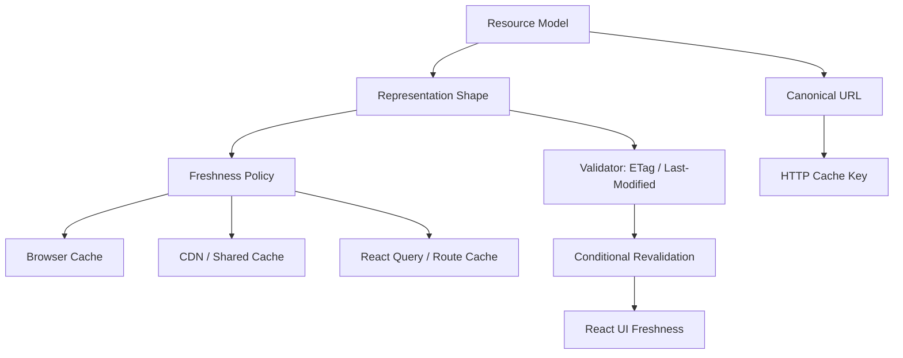
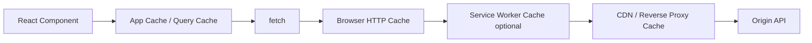

# Part 046 — Resource Modeling and HTTP Cacheability

Caching is not a frontend trick. Caching is a consequence of correct resource modeling.

If the API does not expose stable resource identities, stable representations, correct validators, and explicit freshness policy, React developers compensate with fragile app-cache heuristics:

- `staleTime` guessed by screen;
- manual invalidation everywhere;
- duplicate query keys;
- stale user/tenant data leaks;
- unnecessary refetch storms;
- CDN disabled because “data is dynamic”;
- browser cache bypassed because every API response uses `no-store`.

The deeper point:

> HTTP cacheability starts before headers. It starts when we decide what a resource is.

A React engineer does not need to design the whole backend API alone, but must be able to detect when API shape makes correct client behavior impossible.



## 1. Resource Identity vs Representation Identity

A resource is a conceptual target. A representation is what the server returns for a request.

```txt
Resource:        /cases/CASE-123
Representation:  JSON case detail for current user, tenant, locale, fields, and API version
```

The same resource can have multiple representations.

Examples:

```txt
/cases/CASE-123
/cases/CASE-123?include=documents
/cases/CASE-123?view=summary
/cases/CASE-123 with Accept-Language: id-ID
/cases/CASE-123 with Authorization: user A
/cases/CASE-123 with Authorization: user B
```

React cache identity must account for representation differences that affect rendered data.

HTTP cache identity must also account for request dimensions using URL and `Vary`.

## 2. Cacheability Requires Stable Meaning

A response is cacheable only when reuse is safe under a defined policy.

Not everything must be cached. But everything should have an intentional cache policy.

| Resource | Suggested Policy | Reason |
|---|---|---|
| Static app assets | `public, max-age=31536000, immutable` | content-hashed asset URL changes on deploy |
| Public reference data | `public, max-age=3600, stale-while-revalidate=...` | many users, low sensitivity |
| User profile `/me` | `private, max-age=60` or revalidate | user-specific |
| Permission-sensitive case detail | `private, no-cache` with validators | reusable only after validation |
| Highly sensitive data | `no-store` | do not store in browser/shared cache |
| Mutation response | usually not shared-cacheable | may update app cache directly |
| Search with sensitive query | usually `private` or `no-store` | URL/log/privacy risk |

Important distinction:

```http
Cache-Control: no-cache
```

does not mean “do not store”. It means a stored response must be validated before reuse.

```http
Cache-Control: no-store
```

means do not store the response.

That difference matters for React apps with sensitive regulatory data.

## 3. Canonical URLs

Two URLs that mean the same representation should be canonicalized. Otherwise cache fragments.

Bad:

```txt
/cases?status=open&assignee=me
/cases?assignee=me&status=open
/cases?status=open&assignee=me&pageSize=25
/cases?status=OPEN&assignee=me
```

Better: define canonical serialization.

```ts
function canonicalSearchParams(input: Record<string, string | number | boolean | null | undefined>) {
  const params = new URLSearchParams();

  Object.entries(input)
    .filter(([, value]) => value !== undefined && value !== null && value !== "")
    .sort(([a], [b]) => a.localeCompare(b))
    .forEach(([key, value]) => {
      params.set(key, String(value));
    });

  return params.toString();
}

const url = `/cases?${canonicalSearchParams({
  assignee: "me",
  status: "open",
  pageSize: 25,
})}`;
```

Canonicalization must include defaults carefully.

If server default `pageSize=25`, the client should consistently include it or consistently omit it. Do not mix.

## 4. HTTP Cache Layers

A React app may be affected by multiple cache layers.



Each layer has a different job.

| Layer | Owns | Good For | Dangerous When |
|---|---|---|---|
| React Query / app cache | UI server-state lifecycle | dedupe, refetch, optimistic update | identity ignores user/tenant/params |
| Browser HTTP cache | HTTP freshness/validation | assets, GET representations | API sends wrong `Cache-Control` |
| Service Worker cache | offline/custom strategy | static app shell, offline docs | caches auth-sensitive data incorrectly |
| CDN/shared cache | cross-user reuse | public/reference data | response varies by auth but marked public |
| Origin cache | backend optimization | expensive read models | invalidation not tied to write model |

Do not confuse them. `queryClient.invalidateQueries()` does not purge CDN cache. `Cache-Control` does not update React Query cache state. They are related but not equivalent.

## 5. Freshness: `max-age`, `no-cache`, `no-store`

`Cache-Control` controls reuse behavior.

Common response patterns:

### Public immutable asset

```http
Cache-Control: public, max-age=31536000, immutable
```

Use only when URL is content-hashed.

### Public reference data

```http
Cache-Control: public, max-age=3600
ETag: "countries-v44"
```

Good for things like country lists, public taxonomy, static help metadata.

### Private user-specific data with validation

```http
Cache-Control: private, no-cache
ETag: "user-123-profile-v9"
```

Browser may store but must revalidate before reuse.

### Sensitive data

```http
Cache-Control: no-store
```

Use for high-sensitivity data, secrets, tokens, or data that must not be persisted.

### Dynamic but tolerates short reuse

```http
Cache-Control: private, max-age=30
ETag: "case-123-v18"
```

Useful when short-lived staleness is acceptable and UX benefits from fewer round-trips.

## 6. Validators: ETag and Last-Modified

A validator lets the client ask: “Is my representation still current?”

ETag response:

```http
HTTP/1.1 200 OK
ETag: "case-123-v18"
Cache-Control: private, no-cache
Content-Type: application/json

{ "id": "CASE-123", "version": 18, ... }
```

Conditional request:

```http
GET /cases/CASE-123
If-None-Match: "case-123-v18"
```

If unchanged:

```http
HTTP/1.1 304 Not Modified
ETag: "case-123-v18"
```

If changed:

```http
HTTP/1.1 200 OK
ETag: "case-123-v19"

{ "id": "CASE-123", "version": 19, ... }
```

React usually does not manually handle `304` when the browser HTTP cache is active; the browser may satisfy `fetch` with the cached body after revalidation. But React engineers still need to understand the mechanism because it affects apparent network timing and backend load.

## 7. Strong vs Weak Validators

ETags can be strong or weak.

```http
ETag: "case-123-v19"
ETag: W/"case-123-summary-v19"
```

Practical guidance:

- Use strong validators for concurrency control with `If-Match`.
- Weak validators are often enough for cache revalidation when byte-for-byte equality is not required.
- Do not use timestamps alone for high-concurrency writes unless precision and ordering are guaranteed.
- Do not expose sensitive internal revision IDs if they reveal information.

For editable resources, prefer an explicit domain version in the representation plus validator headers.

```ts
type EditableCase = {
  id: string;
  version: number;
  etag: string; // optional mirror if API chooses to expose it in body too
  title: string;
};
```

## 8. `Vary`: Cache Key Expansion

`Vary` says which request headers affect the response representation.

Example:

```http
Vary: Accept-Language
```

This means the cache must treat different `Accept-Language` values as different variants.

Common `Vary` dimensions:

| Header | Meaning |
|---|---|
| `Accept` | representation media type differs |
| `Accept-Language` | locale differs |
| `Accept-Encoding` | compression differs |
| `Authorization` | dangerous for shared cache; usually avoid public caching |
| custom feature headers | representation may differ by feature flag/tenant |

React query keys must mirror equivalent representation-affecting dimensions.

If language changes UI data from server:

```ts
const caseKeys = {
  detail: (caseId: string, locale: string) => ["cases", "detail", caseId, { locale }] as const,
};
```

If the cache key omits locale but server representation includes localized labels, users may see wrong-language cached data.

## 9. App Cache vs HTTP Cache Freshness

React Query `staleTime` and HTTP `max-age` are not the same, but they should not fight each other.

| HTTP Cache | React Query |
|---|---|
| Stores HTTP responses according to headers | Stores parsed server state according to query key |
| Works below `fetch` | Works above API client |
| Uses URL/header cache key | Uses application-defined query key |
| Handles validators and `304` | Handles observers, stale state, background refetch |
| Can be shared by browser mechanisms | Scoped to JS runtime unless persisted |

A coherent policy:

```ts
useQuery({
  queryKey: referenceDataKeys.countries(),
  queryFn: ({ signal }) => referenceApi.listCountries(client, { signal }),
  staleTime: 60 * 60 * 1000,
  gcTime: 24 * 60 * 60 * 1000,
});
```

Server:

```http
Cache-Control: public, max-age=3600
ETag: "countries-v44"
```

For sensitive case details:

```ts
useQuery({
  queryKey: caseKeys.detail(caseId, userScope),
  queryFn: ({ signal }) => casesApi.getCase(client, caseId, { signal }),
  staleTime: 15_000,
  gcTime: 5 * 60_000,
});
```

Server:

```http
Cache-Control: private, no-cache
ETag: "case-123-v18"
```

This lets the browser revalidate efficiently while React Query controls UI lifecycle.

## 10. Cacheability and Authorization

Authenticated does not automatically mean uncacheable. But it does mean cache policy must be precise.

Dangerous:

```http
Cache-Control: public, max-age=600
```

on a user-specific response.

Safer:

```http
Cache-Control: private, max-age=60
Vary: Authorization
```

Often better:

```http
Cache-Control: private, no-cache
ETag: "user-specific-representation-v12"
```

For highly sensitive data:

```http
Cache-Control: no-store
```

React-side rule:

> If a representation depends on identity, tenant, role, permission, locale, feature flag, or confidentiality level, the cache key and cache headers must reflect that dependency.

This applies to both HTTP cache and React Query cache.

Bad query key:

```ts
["case", caseId]
```

Better for permission-sensitive multi-tenant data:

```ts
["tenant", tenantId, "user", userId, "cases", "detail", caseId]
```

Sometimes you do not need `userId` if response is tenant-scoped and identical for all authorized users. But that must be a contract, not a guess.

## 11. Resource Modeling for Cache-Friendly APIs

Cache-friendly API design tends to follow a few principles.

### Principle 1 — Separate Stable Reference Data from Volatile Transactional Data

Bad:

```json
{
  "case": { ... },
  "countries": [...],
  "violationTypes": [...],
  "currentUser": { ... },
  "systemConfig": { ... }
}
```

One volatile case update invalidates everything.

Better:

```txt
GET /cases/CASE-123
GET /reference/countries
GET /reference/violation-types
GET /me
GET /system/client-config
```

Now each resource gets its own cache policy.

### Principle 2 — Do Not Hide Resource Identity Behind Generic Endpoints

Bad:

```http
POST /api/query

{ "type": "caseDetail", "id": "CASE-123" }
```

This makes HTTP cache, observability, and invalidation worse.

Better:

```http
GET /cases/CASE-123
```

### Principle 3 — Use Projection Resources When Needed

Do not overload one resource with every possible view.

```txt
GET /cases/CASE-123/summary
GET /cases/CASE-123/detail
GET /cases/CASE-123/timeline
GET /cases/CASE-123/print-view
```

Projection resources can have different cache policies and payload sizes.

### Principle 4 — Keep Collection Pages Stable

Cursor pages should be treated as page resources.

```txt
GET /cases?status=open&page[size]=25&page[cursor]=abc
```

The response should include navigation metadata:

```json
{
  "items": [ ... ],
  "page": {
    "nextCursor": "def",
    "hasMore": true
  }
}
```

Do not make the client infer pagination from array length alone unless that is explicitly the contract.

## 12. Conditional Mutation with `If-Match`

Validators are not only for GET caching. They also protect writes.

```http
PATCH /cases/CASE-123
If-Match: "case-123-v18"
Content-Type: application/merge-patch+json

{ "title": "Updated title" }
```

If stale:

```http
412 Precondition Failed
Content-Type: application/problem+json

{
  "type": "https://api.example.com/problems/precondition-failed",
  "title": "Resource changed",
  "status": 412,
  "detail": "The case has changed since you opened it."
}
```

React consequence:

```ts
function useUpdateCase(caseId: string) {
  const client = useApiClient();
  const queryClient = useQueryClient();

  return useMutation({
    mutationFn: async (input: { patch: Partial<CaseEdit>; etag: string }) =>
      casesApi.patchCase(client, caseId, input.patch, {
        headers: { "If-Match": input.etag },
      }),

    onSuccess: updated => {
      queryClient.setQueryData(caseKeys.detail(caseId), updated);
    },

    onError: error => {
      if (isPreconditionFailed(error)) {
        queryClient.invalidateQueries({ queryKey: caseKeys.detail(caseId) });
      }
    },
  });
}
```

This is better than blind last-write-wins.

## 13. Cache Invalidation After Mutation

A mutation changes server state. Caches must then be made coherent.

There are four common strategies.

### Strategy 1 — Patch Known Representation

```ts
queryClient.setQueryData(caseKeys.detail(caseId), updatedCase);
```

Good when mutation response returns complete updated representation.

### Strategy 2 — Invalidate Affected Queries

```ts
queryClient.invalidateQueries({ queryKey: caseKeys.detail(caseId) });
queryClient.invalidateQueries({ queryKey: caseKeys.lists() });
```

Good when affected representations are numerous or hard to patch safely.

### Strategy 3 — Remove Sensitive Data

```ts
queryClient.removeQueries({ queryKey: caseKeys.all });
```

Good on logout, tenant switch, permission downgrade.

### Strategy 4 — Server Event Reconciliation

```ts
onEvent("case.updated", event => {
  queryClient.invalidateQueries({ queryKey: caseKeys.detail(event.caseId) });
});
```

Good for realtime systems, but requires ordering/version strategy.

HTTP cache and CDN invalidation may need separate mechanisms. App cache invalidation does not purge shared caches.

## 14. Cache-Control Recipes for React Systems

These are starting points, not universal laws.

### Content-hashed JS/CSS Assets

```http
Cache-Control: public, max-age=31536000, immutable
```

Requirement: filename contains content hash.

### HTML Document for SPA Shell

```http
Cache-Control: no-cache
```

Requirement: browser can store but must validate, so deployments update promptly.

### Public Reference Data

```http
Cache-Control: public, max-age=3600
ETag: "ref-v12"
```

Requirement: safe across users.

### User-Specific API Read

```http
Cache-Control: private, no-cache
ETag: "user-123-resource-v9"
```

Requirement: browser revalidates before reuse.

### Sensitive Case Record

```http
Cache-Control: no-store
```

Requirement: no storage. Use when confidentiality dominates performance.

### Long-Running Job Status

```http
Cache-Control: no-store
```

or short TTL:

```http
Cache-Control: private, max-age=2
```

Requirement: avoid stale status if user expects live progress.

## 15. Fetch Cache Modes

`fetch` has a `cache` option, but do not use it as a substitute for server headers.

```ts
await fetch("/reference/countries", { cache: "default" });
await fetch("/reference/countries", { cache: "reload" });
await fetch("/reference/countries", { cache: "no-store" });
```

Practical guidance:

- Prefer correct server `Cache-Control` headers.
- Use `cache: "no-store"` only when the request should bypass storage intentionally.
- Avoid sprinkling `cache: "reload"` everywhere; it hides server policy bugs.
- For framework/RSC contexts, understand the framework's server fetch cache separately from browser fetch.

## 16. Designing React Query Keys from Resource Models

Example resource map:

```txt
/cases
/cases/{caseId}
/cases/{caseId}/documents
/cases/{caseId}/timeline
/reference/violation-types
/me
```

Query key factory:

```ts
export const keys = {
  cases: {
    root: ["cases"] as const,
    list: (scope: UserScope, params: CaseListParams) =>
      ["cases", "list", scope.tenantId, scope.userId, canonicalCaseListParams(params)] as const,
    detail: (scope: UserScope, caseId: string) =>
      ["cases", "detail", scope.tenantId, scope.userId, caseId] as const,
    documents: (scope: UserScope, caseId: string) =>
      ["cases", "detail", scope.tenantId, scope.userId, caseId, "documents"] as const,
    timeline: (scope: UserScope, caseId: string) =>
      ["cases", "detail", scope.tenantId, scope.userId, caseId, "timeline"] as const,
  },

  reference: {
    violationTypes: (locale: string) => ["reference", "violation-types", locale] as const,
  },

  me: (scope: UserScope) => ["me", scope.userId, scope.tenantId] as const,
};
```

This mirrors resource and representation identity.

## 17. Cacheability Failure Modes

### Failure Mode 1 — User Data Marked Public

Symptom: user A sees user B data through shared cache.

Cause:

```http
Cache-Control: public, max-age=600
```

on authenticated representation.

Fix: use `private`, `no-cache`, `no-store`, or redesign to separate public/private data.

### Failure Mode 2 — Missing `Vary`

Symptom: wrong locale, wrong representation variant, wrong feature output.

Cause: response depends on header but cache key does not.

Fix: include `Vary` and mirror dimension in app cache key.

### Failure Mode 3 — Query Key Ignores Scope

Symptom: after tenant switch, old tenant data appears.

Cause:

```ts
["cases", caseId]
```

Fix:

```ts
["tenant", tenantId, "cases", caseId]
```

and clear cache on tenant/user changes.

### Failure Mode 4 — Everything Is `no-store`

Symptom: slow app, high backend load, impossible prefetch benefit.

Cause: fear-based cache policy.

Fix: classify resources by sensitivity and volatility. Cache public/reference data aggressively; validate private data; reserve `no-store` for truly sensitive data.

### Failure Mode 5 — Long `max-age` Without Invalidation Strategy

Symptom: users see stale config/reference data after backend changes.

Fix: content/versioned URLs, ETags, short TTL, or explicit purge strategy.

### Failure Mode 6 — App Cache and HTTP Cache Fight

Symptom: React Query refetches frequently but browser serves cached old data.

Cause: app-level freshness shorter than HTTP freshness.

Fix: align `staleTime` with `Cache-Control`, or use validation headers correctly.

## 18. Observability for Cache Behavior

Cache bugs are hard because the absence of a request can be the point.

Instrument:

- query key;
- URL;
- cache policy classification;
- response status;
- `Cache-Control`;
- `ETag` presence;
- age of app-cache data;
- whether data came from initial SSR hydration;
- invalidation reason;
- user/tenant scope hash, not raw PII;
- refetch trigger: mount, focus, reconnect, mutation, manual, route.

Example event:

```ts
telemetry.emit("server_state.read", {
  resource: "case.detail",
  queryKeyHash,
  caseId,
  tenantHash,
  source: "query_cache",
  ageMs: Date.now() - dataUpdatedAt,
  stale: isStale,
});
```

For HTTP cache visibility, browser DevTools network panel helps, but production RUM needs explicit app-cache telemetry because JS often cannot observe all lower-level cache decisions directly.

## 19. Testing Cacheability

### Test Header Contracts

```ts
it("case detail is private and revalidated", async () => {
  const res = await apiTestClient.get("/cases/CASE-123").asUser("officer-a");

  expect(res.headers["cache-control"]).toContain("private");
  expect(res.headers["cache-control"]).toContain("no-cache");
  expect(res.headers["etag"]).toBeDefined();
});
```

### Test Scope Separation

```ts
it("query keys include tenant scope", () => {
  expect(keys.cases.detail({ tenantId: "T1", userId: "U1" }, "CASE-1"))
    .not.toEqual(keys.cases.detail({ tenantId: "T2", userId: "U1" }, "CASE-1"));
});
```

### Test Conditional Save Failure

```ts
it("shows conflict UI when If-Match fails", async () => {
  server.use(
    http.patch("/cases/CASE-123", () =>
      HttpResponse.json(
        {
          type: "https://api.example.com/problems/precondition-failed",
          title: "Resource changed",
          status: 412,
          detail: "The case has changed since you opened it.",
        },
        { status: 412 },
      ),
    ),
  );

  render(<CaseEditPage caseId="CASE-123" />);
  await user.click(screen.getByRole("button", { name: /save/i }));

  expect(await screen.findByText(/case has changed/i)).toBeInTheDocument();
});
```

## 20. Review Checklist

For every resource-backed React screen, review:

1. What is the canonical resource URL?
2. Is the representation user/tenant/locale/permission specific?
3. Does the query key include every representation-changing dimension?
4. Does the API provide `Cache-Control` intentionally?
5. Is `no-store` used only when storage is unacceptable?
6. Are validators provided for reusable dynamic data?
7. Are editable resources protected with `If-Match` or equivalent?
8. Are collection params canonicalized?
9. Are public/reference resources separated from private transactional data?
10. Are mutation responses sufficient to patch app cache safely?
11. If not, is invalidation targeted and documented?
12. Does logout/tenant switch clear app cache and sensitive persisted data?
13. Does shared cache ever see user-specific data?
14. Does `Vary` match representation-changing request headers?
15. Are cache behaviors observable in production?

## 21. The Core Mental Model

Resource modeling is not backend decoration. It determines whether React can communicate with the server efficiently and safely.

The chain is:

```txt
Resource identity
  -> canonical URL
  -> representation dimensions
  -> HTTP cache key / Vary
  -> freshness policy
  -> validator strategy
  -> React query key
  -> invalidation plan
  -> UI freshness behavior
```

When this chain is explicit, caching becomes a design tool.

When it is implicit, caching becomes superstition: random `staleTime`, random `no-store`, random invalidation, and random stale bugs.

For top-tier React systems, cacheability is not something added later. It is part of the resource contract from the start.

## References

- RFC 9110 — HTTP Semantics: https://www.rfc-editor.org/rfc/rfc9110.html
- RFC 9111 — HTTP Caching: https://www.rfc-editor.org/rfc/rfc9111.html
- MDN — HTTP caching: https://developer.mozilla.org/en-US/docs/Web/HTTP/Guides/Caching
- MDN — Cache-Control: https://developer.mozilla.org/en-US/docs/Web/HTTP/Reference/Headers/Cache-Control
- MDN — ETag: https://developer.mozilla.org/en-US/docs/Web/HTTP/Reference/Headers/ETag
