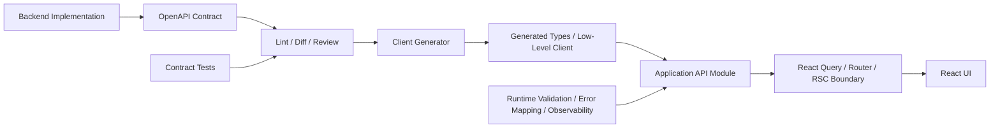
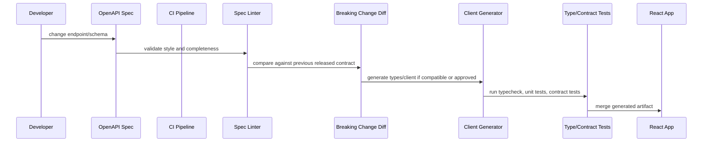
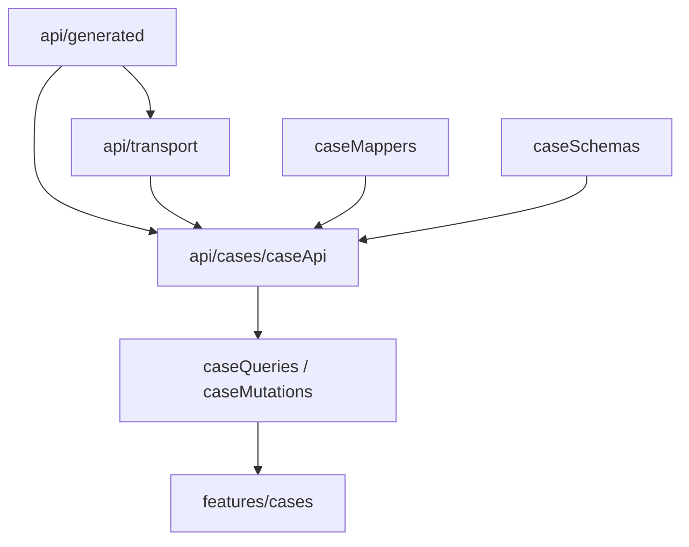

# Part 047 — OpenAPI Contract-First Client Generation

A React app talks to a backend through a contract, even when the team does not write one down.

When the contract is implicit, every frontend engineer reverse-engineers it from network logs, backend code, Slack messages, stale examples, or trial and error. That may work for one endpoint. It collapses when a product has many screens, many teams, multiple deploy cadences, multiple API consumers, and compliance-sensitive behavior.

OpenAPI gives us a way to make HTTP API behavior inspectable, versioned, reviewed, generated, tested, and governed.

But the strongest teams do **not** treat OpenAPI as “Swagger documentation”. They treat it as a **source of integration truth**.

The core idea:

> Contract-first client generation means React code imports a typed, policy-wrapped client derived from the API contract, not hand-written assumptions about request and response shapes.

This part focuses on usage and implementation from the React side.

We will not build a backend OpenAPI generator. We will learn how to consume, govern, generate, wrap, test, and operationalize OpenAPI so the React codebase becomes safer and faster to change.

## 1. Mental Model: Contract, Generator, Client, Boundary

OpenAPI is not the client. OpenAPI is the API description.

A generator is not the contract. A generator is a compiler from contract to code artifacts.

Generated code is not the application boundary. Generated code is usually too low-level, too mechanical, and too leaky to be imported everywhere.

The production boundary should look like this:



The invariant:

> React components should depend on domain-level API modules, not raw generated endpoint calls.

Why?

Because generated clients understand paths and schemas. Your application needs more:

- request deadlines;
- cancellation;
- auth/tenant header policy;
- trace IDs;
- idempotency keys;
- domain error mapping;
- Problem Details parsing;
- runtime validation for untrusted data;
- query-key identity;
- cache invalidation impact;
- upload/download policy;
- observability events;
- migration/deprecation handling.

Generated code is a tool. The boundary is an architectural decision.

## 2. What OpenAPI Actually Describes

A good OpenAPI document describes an HTTP interface in a machine-readable format:

- paths;
- operations;
- methods;
- parameters;
- request bodies;
- response bodies;
- status codes;
- headers;
- authentication/security schemes;
- reusable schemas;
- examples;
- tags;
- deprecation;
- external docs;
- callbacks/webhooks in some designs;
- media types;
- server URLs.

Minimal example:

```yaml
openapi: 3.1.0
info:
  title: Case Management API
  version: 2026.07.0
servers:
  - url: https://api.example.com
paths:
  /cases/{caseId}:
    get:
      operationId: getCaseById
      tags: [Cases]
      parameters:
        - name: caseId
          in: path
          required: true
          schema:
            type: string
      responses:
        '200':
          description: Case detail
          content:
            application/json:
              schema:
                $ref: '#/components/schemas/CaseDetail'
        '404':
          description: Case not found
          content:
            application/problem+json:
              schema:
                $ref: '#/components/schemas/Problem'
components:
  schemas:
    CaseDetail:
      type: object
      required: [id, status, title]
      properties:
        id:
          type: string
        status:
          type: string
          enum: [draft, submitted, under_review, closed]
        title:
          type: string
    Problem:
      type: object
      required: [type, title, status]
      properties:
        type:
          type: string
          format: uri
        title:
          type: string
        status:
          type: integer
        detail:
          type: string
        instance:
          type: string
```

A generator can turn this into TypeScript types and client functions.

But the more important question is: can this contract support safe React behavior?

A React-grade OpenAPI contract needs to answer:

- Is this operation safe, idempotent, retryable, or command-like?
- What status codes can the UI intentionally handle?
- What error shape is returned?
- Which response headers matter?
- Which fields are nullable?
- Which fields are optional because of projection, permission, rollout, or partial failure?
- Is pagination cursor-based or offset-based?
- Does the endpoint support conditional requests?
- Does the mutation require idempotency keys?
- Which operations invalidate which query keys?
- Which response is tenant/user scoped and must never be persisted across sessions?

OpenAPI can describe much of this directly. Some of it requires conventions or extensions.

## 3. Contract-First vs Code-First vs Doc-After

There are three common flows.

### 3.1 Doc-After

The backend is implemented first. Documentation is written later.

```txt
Code exists -> someone writes docs -> frontend reads docs -> bugs reveal drift
```

This is the weakest model. The documentation is often stale and incomplete.

Symptoms:

- frontend must test endpoints manually;
- status codes are undocumented;
- error shape differs per endpoint;
- examples are manually maintained;
- breaking changes are discovered in QA or production;
- generated clients are not trusted.

### 3.2 Code-First

The backend code generates OpenAPI from annotations, routes, or schemas.

```txt
Backend code -> generated OpenAPI -> generated frontend client
```

This is common and practical. It works well when the backend framework and schema discipline are mature.

Risk:

- contract reflects implementation accidents;
- undocumented business semantics stay invisible;
- generated operation names may be unstable;
- response variants may be incomplete;
- changes are reviewed as code, not consumer impact.

### 3.3 Contract-First

The contract is designed and reviewed before or alongside implementation.

```txt
Contract proposal -> consumer review -> backend implementation -> generated client -> tests
```

This is strongest for multi-team systems.

Advantages:

- frontend can build against mock server or MSW handlers;
- breaking changes are caught before backend deploy;
- operation names are stable;
- error taxonomy is explicit;
- domain language becomes shared;
- generated client becomes trusted;
- CI can enforce compatibility.

Contract-first does not require a waterfall process. It means the contract is a first-class artifact.

## 4. The OpenAPI Client Generation Pipeline

A production pipeline should be deterministic.



Minimum pipeline:

```txt
1. Validate OpenAPI syntax.
2. Lint style and completeness.
3. Diff against last accepted contract.
4. Generate TypeScript artifacts.
5. Run typecheck.
6. Run unit tests using generated types.
7. Run MSW/contract tests for important flows.
8. Publish artifact or commit generated code.
```

High-maturity pipeline:

```txt
1. Contract PR includes human review from API owner + consumer owner.
2. Breaking change detector classifies compatibility.
3. Generated client package is versioned.
4. Frontend consumes pinned contract/client version.
5. Consumer-driven tests verify critical operations.
6. Runtime telemetry reports contract parse failures.
7. Deprecation/removal lifecycle is enforced.
```

## 5. OperationId Governance

`operationId` is not cosmetic.

It often becomes the generated function name.

Bad:

```yaml
operationId: casesGet
operationId: getUsingGET_12
operationId: controllerFindOne
operationId: list
```

Good:

```yaml
operationId: listCases
operationId: getCaseById
operationId: createCase
operationId: submitCase
operationId: uploadCaseAttachment
operationId: downloadCaseAttachment
```

Rules:

- unique across the entire API;
- stable across non-breaking changes;
- verb + domain noun;
- aligned with product language;
- not tied to backend controller names;
- not overloaded;
- not generated from unstable framework internals.

Why it matters in React:

```ts
// Stable and readable
api.cases.getCaseById({ caseId })

// Unstable and implementation-leaky
api.caseControllerGetOneUsingGET({ id })
```

When operation IDs churn, generated clients churn. When generated clients churn, code review becomes noisy and trust drops.

## 6. Schema Governance: Optional, Nullable, Missing, and Unknown

Most integration bugs hide in schema semantics.

These are not the same:

```ts
type A = { name?: string }        // may be missing
type B = { name: string | null }  // present but can be null
type C = { name?: string | null } // may be missing or null
type D = { name: string }         // must be present and non-null string
```

OpenAPI contracts must be clear about:

- required fields;
- nullable fields;
- optional fields;
- default values;
- read-only fields;
- write-only fields;
- deprecated fields;
- enums and unknown future enum values;
- arrays that may be empty;
- maps with additional properties;
- date/time formats;
- decimals and money;
- integer limits;
- binary payloads;
- polymorphic shapes.

### 6.1 Optional Field Anti-Pattern

Bad contract:

```yaml
CaseDetail:
  type: object
  properties:
    id:
      type: string
    title:
      type: string
    status:
      type: string
```

This makes all fields optional in many generated clients.

Better:

```yaml
CaseDetail:
  type: object
  required: [id, title, status]
  properties:
    id:
      type: string
    title:
      type: string
    status:
      type: string
```

A missing `required` list can silently weaken frontend type safety.

### 6.2 Enum Compatibility

Closed enum:

```yaml
status:
  type: string
  enum: [draft, submitted, under_review, closed]
```

This is convenient for UI exhaustiveness.

But if backend can add a new status before frontend deploys, the client needs a safe unknown path.

Application-level pattern:

```ts
type KnownCaseStatus = 'draft' | 'submitted' | 'under_review' | 'closed'
type CaseStatus = KnownCaseStatus | 'unknown'

function normalizeCaseStatus(value: string): CaseStatus {
  switch (value) {
    case 'draft':
    case 'submitted':
    case 'under_review':
    case 'closed':
      return value
    default:
      return 'unknown'
  }
}
```

This is not always necessary, but for externally versioned APIs it prevents total UI failure when a new enum value appears.

## 7. Response Contract: Status Codes Are Part of the Type

An endpoint does not return one response. It returns a response set.

Example:

```yaml
responses:
  '200':
    description: Case detail
    content:
      application/json:
        schema:
          $ref: '#/components/schemas/CaseDetail'
  '304':
    description: Not modified
  '401':
    description: Not authenticated
    content:
      application/problem+json:
        schema:
          $ref: '#/components/schemas/Problem'
  '403':
    description: Not authorized
    content:
      application/problem+json:
        schema:
          $ref: '#/components/schemas/Problem'
  '404':
    description: Case not found
    content:
      application/problem+json:
        schema:
          $ref: '#/components/schemas/Problem'
  '409':
    description: Version conflict
    content:
      application/problem+json:
        schema:
          $ref: '#/components/schemas/Problem'
```

A React client should not collapse this into:

```ts
Promise<CaseDetail>
```

That hides the actual state machine.

A better application wrapper returns or throws typed categories:

```ts
type ApiResult<T> =
  | { ok: true; status: number; data: T; headers: Headers }
  | { ok: false; status: 400 | 401 | 403 | 404 | 409 | 422 | 429 | 500 | 503; problem: ApiProblem; headers: Headers }
```

Or it throws a custom `ApiError` consumed by React Query/Error Boundaries.

The decision depends on style. The invariant is the same:

> Status-code semantics must survive the generated-client boundary.

## 8. Error Contract: Use One Shape

If every endpoint invents a different error response, React code becomes defensive soup.

Bad:

```json
{ "message": "Invalid" }
```

```json
{ "error": "invalid_request", "fields": { "title": "Required" } }
```

```json
{ "success": false, "payload": null, "reason": "bad title" }
```

Better:

```json
{
  "type": "https://api.example.com/problems/validation-error",
  "title": "Validation failed",
  "status": 422,
  "detail": "One or more fields are invalid.",
  "instance": "/cases/draft-123/submission-attempts/abc",
  "errors": {
    "title": ["Title is required."],
    "deadline": ["Deadline must be in the future."]
  },
  "traceId": "01J2..."
}
```

Model it in OpenAPI:

```yaml
Problem:
  type: object
  required: [type, title, status]
  properties:
    type:
      type: string
      format: uri
    title:
      type: string
    status:
      type: integer
    detail:
      type: string
    instance:
      type: string
    traceId:
      type: string
    errors:
      type: object
      additionalProperties:
        type: array
        items:
          type: string
```

React benefits:

- consistent toast mapping;
- consistent field error mapping;
- consistent auth/session handling;
- consistent observability correlation;
- fewer one-off endpoint adapters;
- better test fixtures.

## 9. Parameters: Path, Query, Header, Cookie

OpenAPI distinguishes parameter locations:

```yaml
parameters:
  - name: caseId
    in: path
    required: true
    schema:
      type: string
  - name: pageSize
    in: query
    required: false
    schema:
      type: integer
      minimum: 1
      maximum: 100
  - name: If-Match
    in: header
    required: false
    schema:
      type: string
```

React rules:

- path params identify resource identity;
- query params identify representation or collection view;
- headers usually identify protocol metadata, not UI state;
- cookies should be treated as ambient credential state;
- request bodies should represent commands or complex filters only when query params are insufficient.

Do not hide important cache identity in headers unless you intentionally configure `Vary` and app query keys.

Example:

```txt
GET /cases?status=open&sort=deadline&pageSize=50
```

This is easy to map to URL state and query key.

```txt
GET /cases
X-Filter: eyJzdGF0dXMiOiJvcGVuIn0=
```

This is harder to cache, inspect, share, debug, and test.

## 10. Generated Client Shapes

Different tools generate different artifacts.

Common styles:

### 10.1 Type-Only Generation

A tool generates only TypeScript types from OpenAPI.

```ts
import type { paths, components } from './generated/schema'

type CaseDetail = components['schemas']['CaseDetail']
```

You write your own fetch layer around those types.

Pros:

- minimal runtime;
- flexible architecture;
- easy to integrate with custom fetch client;
- generated artifacts are readable.

Cons:

- you must map operation types yourself;
- fewer batteries included;
- more internal conventions required.

### 10.2 Typed Fetch Client

A tool generates or provides a typed fetch client.

```ts
const { data, error } = await client.GET('/cases/{caseId}', {
  params: {
    path: { caseId },
  },
})
```

Pros:

- good type inference;
- no hand-written URL construction;
- small abstraction;
- easy to wrap.

Cons:

- path strings may leak into app code unless wrapped;
- error model may need normalization;
- runtime validation is not guaranteed unless added separately.

### 10.3 Full SDK Generation

A tool generates API classes/functions per operation.

```ts
const api = new CasesApi(configuration)
const response = await api.getCaseById({ caseId })
```

Pros:

- familiar SDK shape;
- fewer path strings;
- often supports auth/config hooks;
- useful for multi-language ecosystems.

Cons:

- generated code can be large;
- abstractions may not match React Query/Router ergonomics;
- harder to customize transport behavior cleanly;
- generator upgrades can produce big diffs.

### 10.4 Framework Hook Generation

A tool generates React Query or SWR hooks directly.

```ts
const query = useGetCaseById(caseId)
```

Pros:

- fast adoption;
- less hand-written boilerplate;
- query keys often generated;
- useful for CRUD-heavy apps.

Cons:

- generated hooks can leak API shape into UI;
- invalidation policy may remain shallow;
- domain error mapping still needed;
- hard to enforce product-specific loading/error semantics.

Recommendation for high-complexity systems:

> Generate low-level types/client, then write thin domain API modules and query factories by hand for important workflows.

For commodity CRUD, generated hooks can be acceptable.

## 11. Recommended React Architecture

A scalable folder layout:

```txt
src/
  api/
    generated/
      schema.ts
      client.ts
    transport/
      fetchClient.ts
      apiError.ts
      problem.ts
      runtimeValidation.ts
    cases/
      caseApi.ts
      caseQueries.ts
      caseMutations.ts
      caseMappers.ts
      caseSchemas.ts
    users/
      userApi.ts
      userQueries.ts
  features/
    cases/
      routes/
      components/
      forms/
```

Dependency direction:



Important rule:

> Feature components should not import generated OpenAPI types directly unless the generated type is already the stable domain view model.

Why?

Backend DTOs often contain transport concerns:

- internal IDs;
- nullable legacy fields;
- broad enums;
- fields gated by permissions;
- inconsistent date strings;
- audit metadata;
- backend naming conventions;
- API-version compatibility fields.

The UI usually wants a normalized view model.

## 12. Generated Types vs Domain Types

Do not assume generated response type equals UI model.

Generated DTO:

```ts
type CaseDetailDto = {
  id: string
  title: string | null
  status: 'DRAFT' | 'SUBMITTED' | 'UNDER_REVIEW' | 'CLOSED'
  due_date: string | null
  assigned_user?: {
    id: string
    display_name: string
  } | null
}
```

Domain view model:

```ts
type CaseDetail = {
  id: CaseId
  title: string
  status: CaseStatus
  dueDate: Date | null
  assignee: {
    id: UserId
    displayName: string
  } | null
}
```

Mapper:

```ts
function mapCaseDetail(dto: CaseDetailDto): CaseDetail {
  return {
    id: asCaseId(dto.id),
    title: dto.title ?? '(Untitled case)',
    status: mapCaseStatus(dto.status),
    dueDate: dto.due_date ? new Date(dto.due_date) : null,
    assignee: dto.assigned_user
      ? {
          id: asUserId(dto.assigned_user.id),
          displayName: dto.assigned_user.display_name,
        }
      : null,
  }
}
```

This mapper is not busywork. It is the boundary where:

- null policy becomes explicit;
- naming becomes frontend-native;
- date parsing is centralized;
- unknown enum behavior is controlled;
- backward compatibility is handled once;
- UI code becomes simpler.

## 13. Type-Only OpenAPI Example

Assume generated types:

```ts
// src/api/generated/schema.ts
export interface paths {
  '/cases/{caseId}': {
    get: {
      parameters: {
        path: {
          caseId: string
        }
      }
      responses: {
        200: {
          content: {
            'application/json': components['schemas']['CaseDetail']
          }
        }
        404: {
          content: {
            'application/problem+json': components['schemas']['Problem']
          }
        }
      }
    }
  }
}
```

A low-level typed client may expose path/method calls.

Domain API wrapper:

```ts
import createClient from 'openapi-fetch'
import type { paths } from '../generated/schema'
import { mapCaseDetail } from './caseMappers'
import { assertOkOrThrow } from '../transport/apiError'

const client = createClient<paths>({
  baseUrl: '/api',
})

export async function getCaseById(input: {
  caseId: string
  signal?: AbortSignal
}) {
  const response = await client.GET('/cases/{caseId}', {
    params: {
      path: {
        caseId: input.caseId,
      },
    },
    signal: input.signal,
  })

  const data = assertOkOrThrow(response)
  return mapCaseDetail(data)
}
```

Then React Query factory:

```ts
import { queryOptions } from '@tanstack/react-query'
import { getCaseById } from './caseApi'

export const caseQueries = {
  detail: (caseId: string) =>
    queryOptions({
      queryKey: ['cases', 'detail', { caseId }],
      queryFn: ({ signal }) => getCaseById({ caseId, signal }),
      staleTime: 30_000,
    }),
}
```

UI:

```tsx
function CaseHeader({ caseId }: { caseId: string }) {
  const query = useQuery(caseQueries.detail(caseId))

  if (query.isPending) return <HeaderSkeleton />
  if (query.isError) return <HeaderError error={query.error} />

  return <h1>{query.data.title}</h1>
}
```

The UI never sees raw path strings, raw generated response unions, or transport-specific error shapes.

## 14. Runtime Validation: The Contract Is Not Runtime Enforcement

Generated TypeScript types do not validate server responses at runtime.

This code is unsafe if the server returns unexpected data:

```ts
const data = (await response.json()) as CaseDetailDto
```

The cast is a promise to the compiler. It is not a check.

For internal systems, teams often decide generated types are enough because backend and frontend share CI. That can be fine when:

- contract tests are strong;
- backend deploy is controlled;
- API is not externally consumed;
- no untrusted gateway transforms payloads;
- failures are low-risk.

For high-risk boundaries, add runtime validation:

```ts
import { z } from 'zod'

const CaseDetailDtoSchema = z.object({
  id: z.string(),
  title: z.string().nullable(),
  status: z.enum(['DRAFT', 'SUBMITTED', 'UNDER_REVIEW', 'CLOSED']),
  due_date: z.string().nullable(),
})

async function parseCaseDetailResponse(value: unknown) {
  return CaseDetailDtoSchema.parse(value)
}
```

Runtime validation belongs at boundaries:

- external API responses;
- critical money/compliance data;
- persisted cache rehydration;
- localStorage/sessionStorage reads;
- postMessage/multi-tab messages;
- feature flag payloads;
- server-rendered bootstrap data;
- generated client upgrades.

Do not validate everything blindly on every render. Validate when untrusted data crosses into trusted application state.

## 15. CI Gates for Contract Quality

A generated client is only as good as the contract.

Add gates.

### 15.1 Syntax Validation

Reject invalid OpenAPI files.

```txt
openapi lint/validate
```

### 15.2 Style Linting

Reject incomplete or inconsistent specs.

Rules worth enforcing:

```txt
- every operation has operationId
- every operation has tags
- every operation has summary/description
- every path parameter is declared
- every 4xx/5xx response uses Problem schema
- every mutation declares 400/401/403/409/422 where relevant
- every paginated list has documented pagination shape
- every deprecated operation has replacement guidance
- no anonymous inline schemas for important domain entities
- no unbounded arrays for large collections
- no ambiguous nullable/optional fields
- no generic object response without schema
```

### 15.3 Breaking Change Diff

Compare against the last released contract.

Potential breaking changes:

```txt
- remove path
- remove method
- rename operationId
- remove response field
- make optional field required
- narrow enum without fallback
- change field type
- remove status code response
- change error schema
- change auth requirement
- change pagination model
```

Potential compatible changes:

```txt
- add optional response field
- add new endpoint
- add new optional query parameter
- add documented 202 response if old 200 behavior still works
- add response header
```

Be careful: adding enum values can be breaking for exhaustive clients.

### 15.4 Generated Code Check

CI should fail if the generated client is stale.

```txt
1. run generation
2. check git diff
3. fail if generated files changed but were not committed
```

Or publish generated artifacts from CI and consume them as packages.

### 15.5 Typecheck Consumer

The frontend should typecheck against the generated client in CI.

This catches:

- renamed fields;
- removed operations;
- changed nullability;
- changed request bodies;
- incompatible response types.

### 15.6 Contract Tests

Use generated schema and MSW/mock server to verify critical flows.

Do not only test happy path. Test:

- validation error;
- 401 session expiration;
- 403 permission denial;
- 404 missing resource;
- 409 version conflict;
- 429 rate limit;
- 500 server error;
- malformed response if runtime validation is enabled;
- slow response and cancellation.

## 16. Versioning Strategy

Avoid versioning everything too early, but have a plan.

Common strategies:

### 16.1 Single Rolling Contract

One contract evolves with compatibility rules.

Works when frontend and backend deploy together or close together.

Risk: older frontend clients may break if backend removes fields too early.

### 16.2 URL Versioning

```txt
/api/v1/cases
/api/v2/cases
```

Simple to route. Can become coarse-grained and duplicate-heavy.

### 16.3 Media-Type Versioning

```txt
Accept: application/vnd.example.case-detail.v2+json
```

More protocol-oriented. Harder for simple frontend tooling and caches.

### 16.4 Operation-Level Compatibility

Keep URL stable. Add fields/endpoints. Deprecate and remove by lifecycle.

Often best for internal web apps.

Policy example:

```txt
- additive changes allowed anytime
- breaking changes require new operation or deprecation period
- deprecated field remains for 90 days minimum
- generated client warns on deprecated operations
- frontend migration PR must land before removal
```

## 17. Pagination Contract

Pagination must be standardized.

Bad:

```yaml
/cases:
  get:
    parameters:
      - name: page
      - name: limit
```

Without response metadata, React cannot know next-page behavior.

Better cursor model:

```yaml
CaseListResponse:
  type: object
  required: [items, pageInfo]
  properties:
    items:
      type: array
      items:
        $ref: '#/components/schemas/CaseSummary'
    pageInfo:
      type: object
      required: [hasNextPage]
      properties:
        hasNextPage:
          type: boolean
        endCursor:
          type: string
          nullable: true
```

React Query infinite query mapping:

```ts
export const caseQueries = {
  listInfinite: (filter: CaseFilter) =>
    infiniteQueryOptions({
      queryKey: ['cases', 'list', filter],
      initialPageParam: null as string | null,
      queryFn: ({ pageParam, signal }) =>
        listCases({ filter, cursor: pageParam, signal }),
      getNextPageParam: (page) =>
        page.pageInfo.hasNextPage ? page.pageInfo.endCursor : undefined,
    }),
}
```

Contract rule:

> A list response must carry enough metadata for the client to know whether and how to request the next slice.

## 18. Mutation Contract

Mutations are commands. Commands need explicit semantics.

Good mutation contract includes:

- command request body;
- success response;
- validation error response;
- conflict response;
- idempotency key behavior where needed;
- authorization behavior;
- audit/trace correlation;
- concurrency token if applicable;
- status code semantics;
- side-effect description.

Example:

```yaml
/cases/{caseId}/submit:
  post:
    operationId: submitCase
    parameters:
      - name: caseId
        in: path
        required: true
        schema:
          type: string
      - name: Idempotency-Key
        in: header
        required: true
        schema:
          type: string
      - name: If-Match
        in: header
        required: true
        schema:
          type: string
    requestBody:
      required: true
      content:
        application/json:
          schema:
            type: object
            required: [comment]
            properties:
              comment:
                type: string
                maxLength: 1000
    responses:
      '200':
        description: Case submitted
        content:
          application/json:
            schema:
              $ref: '#/components/schemas/CaseDetail'
      '409':
        description: Version conflict
        content:
          application/problem+json:
            schema:
              $ref: '#/components/schemas/Problem'
      '422':
        description: Validation failed
        content:
          application/problem+json:
            schema:
              $ref: '#/components/schemas/Problem'
```

React mutation wrapper:

```ts
export async function submitCase(input: {
  caseId: string
  comment: string
  version: string
  idempotencyKey: string
  signal?: AbortSignal
}) {
  const response = await client.POST('/cases/{caseId}/submit', {
    params: {
      path: { caseId: input.caseId },
      header: {
        'If-Match': input.version,
        'Idempotency-Key': input.idempotencyKey,
      },
    },
    body: {
      comment: input.comment,
    },
    signal: input.signal,
  })

  const data = assertOkOrThrow(response)
  return mapCaseDetail(data)
}
```

This is the difference between “send POST” and “execute a recoverable command”.

## 19. Handling Generated Code in Git

There are two common approaches.

### 19.1 Commit Generated Code

Pros:

- easy local development;
- diffs are visible;
- no special package publishing;
- works well for monorepos.

Cons:

- noisy PRs;
- merge conflicts;
- generator upgrades produce large diffs.

### 19.2 Publish Generated Client Package

Pros:

- clear versioning;
- multiple consumers can pin versions;
- cleaner frontend repository;
- useful across apps.

Cons:

- package release workflow needed;
- local contract iteration slower;
- dependency updates must be coordinated.

Rule of thumb:

```txt
Single frontend + single backend monorepo -> commit generated code is fine.
Multiple frontends/microservices/external consumers -> publish versioned contract/client package.
```

## 20. API Client Boundary With Transport Policy

Generated code should usually delegate to a custom transport.

Transport responsibilities:

```txt
- base URL resolution
- auth/credentials configuration
- tenant/workspace header
- correlation ID / request ID
- timeout and cancellation
- retry policy for safe operations
- body parsing
- Problem Details parsing
- response header extraction
- telemetry
- redaction
```

Example transport wrapper:

```ts
type TransportInput = {
  method: string
  url: string
  headers?: Record<string, string>
  body?: unknown
  signal?: AbortSignal
  timeoutMs?: number
}

export async function apiTransport(input: TransportInput) {
  const controller = new AbortController()
  const timeout = setTimeout(() => controller.abort('timeout'), input.timeoutMs ?? 15_000)

  const signal = input.signal
    ? AbortSignal.any([input.signal, controller.signal])
    : controller.signal

  try {
    const response = await fetch(input.url, {
      method: input.method,
      headers: {
        Accept: 'application/json',
        'Content-Type': 'application/json',
        'X-Request-Id': crypto.randomUUID(),
        ...input.headers,
      },
      body: input.body == null ? undefined : JSON.stringify(input.body),
      signal,
      credentials: 'include',
    })

    return response
  } finally {
    clearTimeout(timeout)
  }
}
```

In real code, prefer a previously built production fetch client from Part 016 and connect generated clients to it.

## 21. Generated Hooks: Useful but Dangerous

Generated React Query hooks can be productive:

```ts
const query = useGetCaseById(caseId)
```

But there are risks:

- query keys may not include tenant/user scope;
- staleTime may be generic;
- errors may not map to domain UI states;
- invalidation may be endpoint-centric, not domain-impact-centric;
- generated hook names can churn with operation IDs;
- UI imports backend DTOs directly;
- product workflows become hard to review.

Safer compromise:

```ts
// generated low-level call
getCaseByIdRaw(...)

// app-owned query factory
caseQueries.detail(caseId)

// app-owned hook if desired
useCaseDetail(caseId)
```

Example:

```ts
export function useCaseDetail(caseId: string) {
  return useQuery(caseQueries.detail(caseId))
}
```

This gives the team control over cache policy, error mapping, and view-model mapping.

## 22. Contract Drift

Contract drift means the spec and real server behavior differ.

Drift types:

```txt
Spec says field required, server omits it.
Spec says 200, server returns 204.
Spec says application/json, server returns text/plain.
Spec says Problem Details, server returns HTML error page.
Spec says enum has four values, server returns a fifth.
Spec says pagination cursor nullable, server omits pageInfo.
Spec says endpoint is safe, backend mutates state.
```

Drift is worse than no contract because it creates false confidence.

Controls:

- backend contract tests generated from spec;
- consumer tests with real/staged API;
- schema validation at critical frontend boundaries;
- mock responses generated from spec but manually curated for edge cases;
- production telemetry for parse failures and unexpected status codes;
- canary deploy with contract checks;
- API gateway response validation for high-risk endpoints.

## 23. Mocking From OpenAPI

Generated mocks are useful for speed, but dangerous if treated as truth.

Good use cases:

- early UI development;
- Storybook scenarios;
- MSW handlers;
- deterministic tests;
- contract review with product/design;
- failure-state exploration.

Weaknesses:

- generated fake data may satisfy schema but violate domain invariants;
- examples often cover happy path only;
- business rules are not represented by JSON schema alone;
- backend behavior around conflicts, auth, and side effects may be absent.

Recommended pattern:

```txt
Generated mock base + curated scenario fixtures
```

Example fixtures:

```txt
caseDetail.active.json
caseDetail.closed.json
caseDetail.noPermission.json
caseDetail.versionConflict.problem.json
caseList.empty.json
caseList.large.json
caseList.partialPermission.json
```

## 24. Dealing With Large Specs

Large OpenAPI specs can become slow and noisy.

Techniques:

- split by bounded context;
- use tags consistently;
- generate per-domain clients;
- avoid importing entire schema into every module;
- ensure generated output is tree-shakeable;
- avoid giant barrel exports when they harm build performance;
- pin generator versions;
- keep generated code out of hot code review unless needed;
- use project references if TypeScript typechecking becomes slow.

Bad:

```ts
import { EverythingApi } from '@/api/generated'
```

Better:

```ts
import type { components, paths } from '@/api/generated/cases'
```

Or generate per service:

```txt
api/generated/cases
api/generated/users
api/generated/files
api/generated/audit
```

## 25. Security and Privacy in OpenAPI Contracts

The contract must not leak secrets.

Do not put real tokens, real user data, or sensitive production examples in public specs.

Example policy:

```txt
- examples must be synthetic
- no real IDs from production
- no production bearer tokens
- no secrets in server URLs
- no internal-only endpoints in public contract
- security schemes must be explicit
- sensitive fields must be documented and reviewed
```

Security schemes example:

```yaml
components:
  securitySchemes:
    cookieAuth:
      type: apiKey
      in: cookie
      name: session
security:
  - cookieAuth: []
```

React benefit:

- generated clients can be configured correctly;
- auth requirements are visible;
- endpoint-specific anonymous access is explicit;
- review can catch accidental public exposure.

## 26. Contract Extensions for Frontend Policy

OpenAPI allows extensions with `x-` fields.

Use them carefully.

Example:

```yaml
/cases/{caseId}/submit:
  post:
    operationId: submitCase
    x-idempotency-required: true
    x-cache-invalidates:
      - cases.detail
      - cases.list
    x-audit-event: case.submitted
```

This can power tooling:

- generate invalidation hints;
- lint mutation safety;
- require idempotency key headers;
- map operations to audit events;
- generate docs for product flows.

Warning:

> Extensions should document policy; they should not become an unreviewed second API language.

If an extension becomes critical, write clear governance around it.

## 27. Migration Strategy for an Existing React App

You do not need to rewrite everything.

Incremental path:

```txt
1. Pick one high-change domain.
2. Obtain or write OpenAPI contract for its endpoints.
3. Generate types only.
4. Wrap one endpoint with domain API module.
5. Add React Query factory.
6. Add contract test + MSW fixture.
7. Replace direct fetch calls in one route.
8. Add CI generated-code freshness check.
9. Expand to mutations.
10. Introduce breaking-change diff once contract stabilizes.
```

Do not start by generating hooks for the whole company API and importing them everywhere.

Start where contract friction is already causing pain.

## 28. Review Checklist

Use this when reviewing an OpenAPI-backed React integration.

```txt
Contract quality:
[ ] operationId is stable, unique, domain-readable
[ ] required/nullable/optional fields are explicit
[ ] important responses are documented, not just 200
[ ] errors use standard Problem shape
[ ] pagination shape is standardized
[ ] mutation conflict/idempotency behavior is documented
[ ] auth/security scheme is explicit
[ ] examples are synthetic and useful
[ ] deprecated fields/operations have migration guidance

Generation:
[ ] generator version is pinned
[ ] generated output is deterministic
[ ] generated code freshness is checked in CI
[ ] generated types are not blindly treated as domain models
[ ] generated low-level client is wrapped

React integration:
[ ] query keys match resource/representation identity
[ ] staleTime and invalidation are domain-owned
[ ] cancellation signal reaches fetch
[ ] status codes map to intentional UI states
[ ] runtime validation exists for high-risk boundaries
[ ] MSW/contract tests cover non-happy paths
[ ] telemetry captures unexpected status/parse failures
```

## 29. Common Failure Modes

### 29.1 Generated Client Everywhere

Every component imports generated functions directly.

Result:

- no consistent error mapping;
- no query-key discipline;
- no domain mappers;
- hard-to-change transport policy;
- backend DTOs leak into UI.

Fix:

```txt
Generated client -> domain API module -> query/mutation factory -> UI
```

### 29.2 Spec Valid but Semantically Weak

The spec passes validation but omits status codes, field requiredness, and error details.

Fix:

- add lint rules;
- define style guide;
- review from consumer perspective;
- write scenario fixtures.

### 29.3 Type Safety Without Runtime Trust Boundary

The frontend trusts generated types across unstable external boundaries.

Fix:

- validate high-risk responses;
- instrument parse failures;
- contract-test staging API;
- treat generated types as compile-time assistance, not proof.

### 29.4 Breaking Change Hidden as Refactor

Backend renames fields, operation IDs, or enum values as internal cleanup.

Fix:

- breaking-change diff;
- deprecation policy;
- consumer-owner approval;
- generated client typecheck in frontend CI.

### 29.5 Endpoint-Centric Invalidation

Generated mutation hook invalidates only its own operation.

Fix:

- define domain impact matrix;
- route invalidation through query factories;
- use application-owned mutation wrappers.

## 30. Build-From-Scratch Exercise: Minimal Contract-Aware Client

Create a tiny domain wrapper around generated types.

```ts
type Problem = {
  type: string
  title: string
  status: number
  detail?: string
  traceId?: string
}

type ApiErrorKind =
  | 'network'
  | 'http'
  | 'validation'
  | 'auth'
  | 'authorization'
  | 'notFound'
  | 'conflict'
  | 'rateLimit'
  | 'server'
  | 'contract'

class ApiError extends Error {
  constructor(
    message: string,
    readonly kind: ApiErrorKind,
    readonly status?: number,
    readonly problem?: Problem,
  ) {
    super(message)
  }
}

async function readProblem(response: Response): Promise<Problem | undefined> {
  const contentType = response.headers.get('content-type') ?? ''
  if (!contentType.includes('application/problem+json')) return undefined
  return response.json().catch(() => undefined)
}

async function assertResponse<T>(response: Response, parse: (value: unknown) => T): Promise<T> {
  if (!response.ok) {
    const problem = await readProblem(response)
    const kind = mapStatusToKind(response.status)
    throw new ApiError(problem?.title ?? response.statusText, kind, response.status, problem)
  }

  const value = await response.json()

  try {
    return parse(value)
  } catch {
    throw new ApiError('Response did not match API contract', 'contract', response.status)
  }
}
```

This tiny layer gives you:

- status mapping;
- Problem Details parsing;
- runtime contract guard;
- one place to add telemetry;
- one error type for React Query and Error Boundaries.

Then attach generated endpoint calls behind domain functions.

## 31. Sources and Further Reading

- OpenAPI Specification v3.2.0: `https://spec.openapis.org/oas/v3.2.0.html`
- OpenAPI Initiative announcement for OpenAPI 3.2: `https://www.openapis.org/blog/2025/09/23/announcing-openapi-v3-2`
- openapi-typescript documentation: `https://openapi-ts.dev/`
- openapi-fetch documentation: `https://openapi-ts.dev/openapi-fetch/`
- Orval documentation: `https://orval.dev/`
- Orval Fetch Client guide: `https://orval.dev/docs/guides/fetch-client`
- OpenAPI Generator TypeScript Fetch generator: `https://openapi-generator.tech/docs/generators/typescript-fetch/`
- RFC 9110 HTTP Semantics: `https://www.rfc-editor.org/rfc/rfc9110.html`
- RFC 9457 Problem Details for HTTP APIs: `https://www.rfc-editor.org/rfc/rfc9457.html`

## 32. Key Takeaways

- OpenAPI is the integration contract, not just documentation.
- Generated clients are useful but should usually be wrapped by app-owned API modules.
- `operationId`, schema requiredness, error shape, pagination, and mutation semantics directly affect React architecture.
- Generated TypeScript types improve compile-time safety but do not validate runtime payloads.
- Contract-first works when backed by CI gates: validation, linting, diffing, generation, typecheck, and contract tests.
- High-quality React client-server communication depends on stable contract governance, not just better fetch wrappers.
