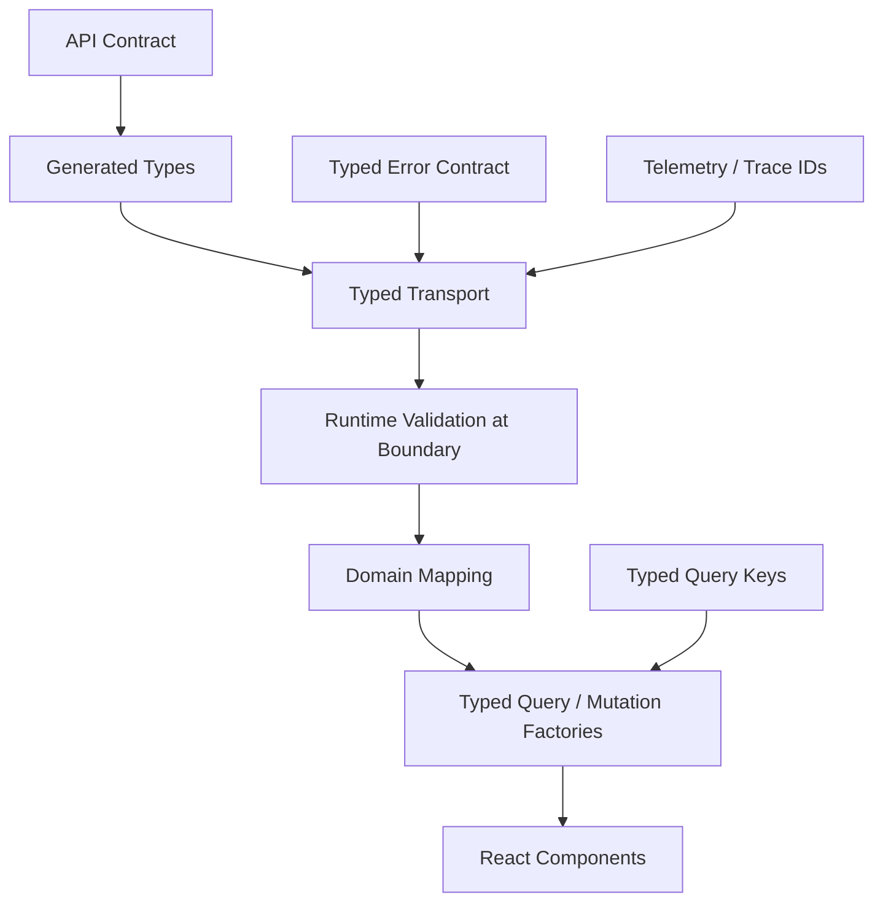
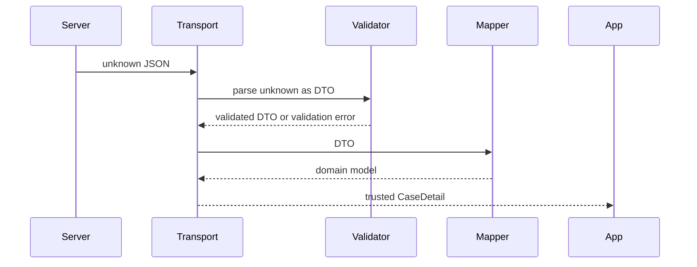

# Part 048 — Type-Safe API Clients

A type-safe API client is not a wrapper around `fetch` with generics.

This is fake safety:

```ts
async function getJson<T>(url: string): Promise<T> {
  const response = await fetch(url)
  return response.json() as Promise<T>
}
```

The compiler is quiet. Runtime is not safer.

The deeper goal is:

> Make illegal client-server interactions difficult to write, make contract drift visible, and keep untrusted data from silently entering trusted application state.

Type safety in React client-server communication has layers:



If any layer is missing, the app can still work. But the failure mode changes.

This part is about designing those layers intentionally.

## 1. What Type Safety Can and Cannot Prove

TypeScript can help prove that your code is internally consistent.

It cannot prove that the server actually returned the shape your code expects.

Type annotations are erased when TypeScript is emitted as JavaScript. Runtime data arriving from the network is `unknown` until checked or trusted by policy.

Therefore:

```ts
const user = await response.json() as User
```

means:

```txt
Developer says: trust me, this unknown JSON is User.
Compiler says: okay.
Runtime says: I did not check anything.
```

A production type-safe API client must distinguish:

| Layer | Example | Safety Kind |
|---|---|---|
| Contract type | OpenAPI-generated `CaseDetailDto` | compile-time schema alignment |
| Transport type | `client.GET('/cases/{caseId}', ...)` | compile-time path/method/params safety |
| Runtime validation | `CaseDetailSchema.parse(json)` | runtime payload checking |
| Domain mapping | `mapCaseDetail(dto)` | app invariant normalization |
| Query factory | `caseQueries.detail(caseId)` | cache identity and result inference |
| UI props | `<CaseHeader case={case} />` | component-level correctness |

The best systems combine compile-time and runtime safety where each has leverage.

## 2. The Naive Generic Fetch Trap

Common helper:

```ts
export async function apiGet<T>(url: string): Promise<T> {
  const response = await fetch(url)
  if (!response.ok) throw new Error(response.statusText)
  return response.json() as Promise<T>
}
```

Usage:

```ts
const user = await apiGet<User>('/api/cases/123')
```

This compiles even though the endpoint returns a case, not a user.

The generic is chosen by the caller. The function has no relationship between URL and response type.

This is not type-safe. It is caller-selected type assertion.

Better:

```ts
const caseDetail = await api.cases.getCaseById({ caseId: 'CASE-123' })
```

The caller does not choose the return type. The operation defines it.

Type-safe clients move type selection from call site fantasy to contract-defined operation identity.

## 3. Source of Truth Options

Type-safe API clients need a source of truth.

Common options:

| Source | Strength | Weakness |
|---|---|---|
| OpenAPI | good for HTTP APIs, language-agnostic, generator ecosystem | contract can drift if not tested |
| GraphQL schema | excellent operation/result typing, selection-set driven | different runtime/cache model |
| tRPC/router types | end-to-end TypeScript inference | TypeScript ecosystem coupling |
| Shared DTO package | simple in monorepo | can hide HTTP/status/error semantics |
| Runtime schema first | validation and type inference from same schema | requires discipline and tooling |
| Manual types | flexible | easy to drift |

For React REST APIs, OpenAPI plus generated TypeScript plus app-owned wrapper is a strong baseline.

But the architectural invariant is independent of tool:

> The type of an API result should be derived from the operation contract, not manually supplied by each caller.

## 4. Type-Safe Client Boundary Shape

A good application API client exposes operations, not transport details.

Bad component usage:

```tsx
const response = await fetch(`/api/cases/${caseId}?include=documents`, {
  headers: {
    Authorization: `Bearer ${token}`,
  },
})
const json = await response.json() as any
```

Better component usage:

```tsx
const query = useQuery(caseQueries.detail({ caseId, includeDocuments: true }))
```

Domain API:

```ts
export async function getCaseDetail(input: {
  caseId: CaseId
  includeDocuments?: boolean
  signal?: AbortSignal
}): Promise<CaseDetail> {
  const dto = await caseTransport.getCaseById({
    caseId: input.caseId,
    query: {
      include: input.includeDocuments ? ['documents'] : undefined,
    },
    signal: input.signal,
  })

  return mapCaseDetail(dto)
}
```

The boundary hides:

- URL construction;
- headers;
- credential mode;
- generated DTO quirks;
- parsing;
- error mapping;
- date conversion;
- unknown enum handling.

The boundary exposes:

- domain input;
- domain output;
- cancellability;
- typed errors;
- stable query factories.

## 5. Result Style: Throwing Errors vs Returning Result Objects

There are two valid styles.

### 5.1 Throwing API Errors

```ts
export async function getCaseDetail(input: GetCaseInput): Promise<CaseDetail> {
  const response = await request(...)
  if (!response.ok) throw await ApiError.fromResponse(response)
  return parseAndMapCase(await response.json())
}
```

React Query integration is natural:

```ts
const query = useQuery({
  queryKey: ['cases', 'detail', caseId],
  queryFn: ({ signal }) => getCaseDetail({ caseId, signal }),
})

if (query.isError && isApiError(query.error, 'notFound')) {
  return <CaseNotFound />
}
```

Pros:

- aligns with Promise failure semantics;
- works well with React Query;
- keeps success path clean;
- integrates with Error Boundaries.

Cons:

- errors can be missed if code assumes all failures throw same type;
- validation errors for forms may be easier as values.

### 5.2 Returning Explicit Result Objects

```ts
type Result<T, E> =
  | { ok: true; value: T }
  | { ok: false; error: E }

export async function submitCase(input: SubmitCaseInput): Promise<Result<CaseDetail, SubmitCaseError>> {
  const response = await request(...)

  if (response.status === 422) {
    return { ok: false, error: await parseValidationError(response) }
  }

  if (!response.ok) {
    return { ok: false, error: await parseApiError(response) }
  }

  return { ok: true, value: parseAndMapCase(await response.json()) }
}
```

Pros:

- excellent for form validation;
- exhaustiveness is explicit;
- no hidden control flow.

Cons:

- more verbose;
- must not be ignored;
- less idiomatic for query read operations.

Practical recommendation:

```txt
Queries: throw typed ApiError.
Form mutations: return typed action result for expected validation failures, throw for infrastructure failures.
Command mutations in React Query: either style is fine if the team is consistent.
```

## 6. Designing a Typed Error Model

Do not let every API call throw arbitrary errors.

Create one error model.

```ts
type ApiErrorKind =
  | 'network'
  | 'timeout'
  | 'aborted'
  | 'unauthenticated'
  | 'forbidden'
  | 'notFound'
  | 'validation'
  | 'conflict'
  | 'rateLimit'
  | 'server'
  | 'contract'
  | 'unknown'

export class ApiError extends Error {
  constructor(
    readonly kind: ApiErrorKind,
    message: string,
    readonly meta: {
      status?: number
      problem?: ApiProblem
      traceId?: string
      retryAfterMs?: number
      cause?: unknown
    } = {},
  ) {
    super(message)
  }
}
```

Status mapping:

```ts
function mapStatusToKind(status: number): ApiErrorKind {
  switch (status) {
    case 401:
      return 'unauthenticated'
    case 403:
      return 'forbidden'
    case 404:
      return 'notFound'
    case 409:
      return 'conflict'
    case 422:
      return 'validation'
    case 429:
      return 'rateLimit'
    default:
      if (status >= 500) return 'server'
      return 'unknown'
  }
}
```

Type guard:

```ts
export function isApiError(error: unknown): error is ApiError {
  return error instanceof ApiError
}

export function isApiErrorKind<K extends ApiErrorKind>(
  error: unknown,
  kind: K,
): error is ApiError & { kind: K } {
  return error instanceof ApiError && error.kind === kind
}
```

UI mapping becomes consistent:

```tsx
function CaseDetailError({ error }: { error: unknown }) {
  if (isApiErrorKind(error, 'notFound')) return <CaseNotFound />
  if (isApiErrorKind(error, 'forbidden')) return <Forbidden />
  if (isApiErrorKind(error, 'unauthenticated')) return <SessionExpired />
  if (isApiErrorKind(error, 'rateLimit')) return <RateLimitNotice retryAfterMs={error.meta.retryAfterMs} />
  return <GenericError />
}
```

## 7. Runtime Validation Boundary

Static types are not enough for network data.

A runtime boundary converts `unknown` into trusted data.

```ts
import { z } from 'zod'

const CaseDetailDtoSchema = z.object({
  id: z.string(),
  title: z.string().nullable(),
  status: z.enum(['DRAFT', 'SUBMITTED', 'UNDER_REVIEW', 'CLOSED']),
  version: z.string(),
  updatedAt: z.string(),
})

type CaseDetailDto = z.infer<typeof CaseDetailDtoSchema>

function parseCaseDetailDto(value: unknown): CaseDetailDto {
  return CaseDetailDtoSchema.parse(value)
}
```

Use runtime validation when:

```txt
- the API is external or independently deployed
- the data is compliance/money/security sensitive
- response shape has historically drifted
- data is persisted locally and rehydrated later
- bootstrap data is embedded in HTML
- postMessage or worker messages cross process boundaries
- feature-flag payloads change UI behavior
```

You might skip runtime validation when:

```txt
- API and frontend are in one monorepo
- contract tests are strict
- endpoint is low-risk
- performance budget is extremely tight
- generated clients are already validated at gateway/backend boundary
```

But skipping validation must be an explicit risk decision, not a default illusion.

## 8. Validation Strategy: Validate DTO, Then Map

Wrong order:

```ts
const mapped = mapCaseDetail(raw as CaseDetailDto)
CaseDetailSchema.parse(mapped)
```

This validates the result after potentially unsafe assumptions.

Better:

```ts
const dto = CaseDetailDtoSchema.parse(raw)
return mapCaseDetail(dto)
```

Boundary flow:



This keeps the trust boundary sharp.

## 9. Domain Mapping and Branded Types

Raw strings are weak.

```ts
type CaseId = string
type UserId = string
```

This allows accidental swaps:

```ts
getCaseDetail({ caseId: userId })
```

Branded types improve safety:

```ts
type Brand<T, Name extends string> = T & { readonly __brand: Name }

export type CaseId = Brand<string, 'CaseId'>
export type UserId = Brand<string, 'UserId'>

export function asCaseId(value: string): CaseId {
  if (!value.startsWith('CASE-')) {
    throw new Error('Invalid case id')
  }
  return value as CaseId
}
```

Usage:

```ts
export async function getCaseDetail(input: {
  caseId: CaseId
  signal?: AbortSignal
}): Promise<CaseDetail> {
  // ...
}
```

Do not over-brand everything. Use brands for values where accidental mixing causes real bugs:

- entity IDs;
- tenant IDs;
- money/currency;
- ISO date strings vs local dates;
- version tokens;
- cursor tokens;
- idempotency keys;
- permission names.

## 10. Typed Query Keys

Query keys are part of API client type safety.

Bad:

```ts
useQuery({
  queryKey: ['case', id],
  queryFn: () => getCaseDetail({ caseId: id }),
})
```

This spreads cache identity across components.

Better:

```ts
export const caseKeys = {
  all: ['cases'] as const,
  lists: () => [...caseKeys.all, 'list'] as const,
  list: (filter: CaseFilter) => [...caseKeys.lists(), canonicalizeCaseFilter(filter)] as const,
  details: () => [...caseKeys.all, 'detail'] as const,
  detail: (caseId: CaseId) => [...caseKeys.details(), { caseId }] as const,
}
```

Query factory:

```ts
export const caseQueries = {
  detail: (caseId: CaseId) =>
    queryOptions({
      queryKey: caseKeys.detail(caseId),
      queryFn: ({ signal }) => getCaseDetail({ caseId, signal }),
      staleTime: 30_000,
    }),

  list: (filter: CaseFilter) =>
    queryOptions({
      queryKey: caseKeys.list(filter),
      queryFn: ({ signal }) => listCases({ filter, signal }),
      staleTime: 10_000,
    }),
}
```

Benefits:

- cache identity is reusable;
- invalidation is precise;
- queryFn and queryKey stay co-located;
- TypeScript inference flows to `useQuery`, `prefetchQuery`, `ensureQueryData`;
- components stop inventing keys.

## 11. Typed Mutation Clients

Mutation type safety requires more than request body shape.

It should type:

- command input;
- success result;
- expected validation errors;
- conflict/version behavior;
- idempotency key requirement;
- invalidation impact;
- optimistic patch context.

Example:

```ts
type SubmitCaseInput = {
  caseId: CaseId
  version: VersionToken
  comment: string
  idempotencyKey: IdempotencyKey
}

type SubmitCaseValidationError = {
  kind: 'validation'
  fieldErrors: Partial<Record<'comment', string[]>>
}

type SubmitCaseConflictError = {
  kind: 'conflict'
  currentVersion?: VersionToken
}

type SubmitCaseExpectedError = SubmitCaseValidationError | SubmitCaseConflictError
```

API function:

```ts
export async function submitCase(input: SubmitCaseInput): Promise<CaseDetail> {
  const response = await client.POST('/cases/{caseId}/submit', {
    params: {
      path: { caseId: input.caseId },
      header: {
        'If-Match': input.version,
        'Idempotency-Key': input.idempotencyKey,
      },
    },
    body: {
      comment: input.comment,
    },
  })

  const dto = assertOkOrThrow(response, SubmitCaseProblemMapper)
  return mapCaseDetail(parseCaseDetailDto(dto))
}
```

Mutation factory:

```ts
export function useSubmitCaseMutation() {
  const queryClient = useQueryClient()

  return useMutation({
    mutationFn: submitCase,
    onSuccess: (caseDetail) => {
      queryClient.setQueryData(caseKeys.detail(caseDetail.id), caseDetail)
      queryClient.invalidateQueries({ queryKey: caseKeys.lists() })
    },
  })
}
```

The mutation input makes important constraints explicit:

- a version token is required;
- an idempotency key is required;
- the result is a normalized `CaseDetail`;
- invalidation is domain-owned.

## 12. Typed Search and Filter Parameters

Search/filter APIs are a common source of weak typing.

Bad:

```ts
listCases({ q: 'abc', page: '1', statuz: 'open' } as any)
```

Better:

```ts
type CaseListSort = 'createdAt.desc' | 'deadline.asc' | 'priority.desc'

type CaseFilter = {
  search?: string
  status?: CaseStatus[]
  assigneeId?: UserId
  sort: CaseListSort
  pageSize: number
}
```

Canonicalization:

```ts
function canonicalizeCaseFilter(filter: CaseFilter) {
  return {
    search: normalizeSearch(filter.search),
    status: filter.status?.slice().sort(),
    assigneeId: filter.assigneeId,
    sort: filter.sort,
    pageSize: clamp(filter.pageSize, 1, 100),
  }
}
```

Serializer:

```ts
function caseFilterToSearchParams(filter: CaseFilter): URLSearchParams {
  const params = new URLSearchParams()
  const canonical = canonicalizeCaseFilter(filter)

  if (canonical.search) params.set('q', canonical.search)
  for (const status of canonical.status ?? []) params.append('status', status)
  if (canonical.assigneeId) params.set('assigneeId', canonical.assigneeId)
  params.set('sort', canonical.sort)
  params.set('pageSize', String(canonical.pageSize))

  return params
}
```

The same canonical filter should drive:

- URL search params;
- query key;
- API request params;
- prefetch identity;
- test fixture names.

## 13. Handling Dates, Money, and Decimals

JSON has no native Date, Decimal, or Money type.

Do not let generated string types leak everywhere.

### 13.1 Dates

DTO:

```ts
type CaseDto = {
  createdAt: string
  dueDate: string | null
}
```

Domain:

```ts
type Case = {
  createdAt: Date
  dueDate: Date | null
}
```

Mapper:

```ts
function parseIsoDateTime(value: string): Date {
  const date = new Date(value)
  if (Number.isNaN(date.getTime())) {
    throw new ApiError('Invalid date from API', 'contract')
  }
  return date
}
```

Be explicit whether a value is:

- instant timestamp;
- local date;
- month/year;
- timezone-aware display time;
- duration.

### 13.2 Money

Bad:

```ts
type Invoice = {
  amount: number
}
```

Better:

```ts
type Money = {
  amountMinor: number
  currency: 'IDR' | 'USD' | 'EUR'
}
```

Or decimal string if required:

```ts
type MoneyDto = {
  amount: string
  currency: string
}
```

Mapping money incorrectly is not a UI bug. It is a financial correctness bug.

## 14. Unknown JSON and Safe Parsing

Treat raw JSON as `unknown`.

```ts
async function readJson(response: Response): Promise<unknown> {
  const text = await response.text()
  if (!text) return undefined

  try {
    return JSON.parse(text) as unknown
  } catch (cause) {
    throw new ApiError('Invalid JSON response', 'contract', { cause })
  }
}
```

Then parse:

```ts
const raw = await readJson(response)
const dto = CaseDetailDtoSchema.parse(raw)
```

Why not return `any`?

Because `any` disables type safety.

Use `unknown` for untrusted input. Convert it to a known type only at a boundary.

## 15. Exhaustive UI Mapping

Use discriminated unions for UI state.

```ts
type RemoteData<T> =
  | { state: 'idle' }
  | { state: 'loading' }
  | { state: 'success'; data: T; stale: boolean }
  | { state: 'empty' }
  | { state: 'error'; error: ApiError }
```

Exhaustive renderer:

```tsx
function renderCaseState(state: RemoteData<CaseDetail>) {
  switch (state.state) {
    case 'idle':
      return null
    case 'loading':
      return <CaseSkeleton />
    case 'empty':
      return <EmptyCase />
    case 'success':
      return <CaseView case={state.data} stale={state.stale} />
    case 'error':
      return <CaseError error={state.error} />
    default:
      return assertNever(state)
  }
}

function assertNever(value: never): never {
  throw new Error(`Unhandled state: ${JSON.stringify(value)}`)
}
```

This is where type safety becomes product safety. New states cannot silently disappear.

## 16. Type-Safe Invalidation

Invalidation should not be stringly typed.

Bad:

```ts
queryClient.invalidateQueries({ queryKey: ['case'] })
queryClient.invalidateQueries({ queryKey: ['cases-list'] })
queryClient.invalidateQueries({ queryKey: ['cases', id] })
```

Better:

```ts
const caseInvalidation = {
  afterCaseUpdated(queryClient: QueryClient, caseId: CaseId) {
    queryClient.invalidateQueries({ queryKey: caseKeys.detail(caseId) })
    queryClient.invalidateQueries({ queryKey: caseKeys.lists() })
  },

  afterCaseSubmitted(queryClient: QueryClient, caseId: CaseId) {
    queryClient.invalidateQueries({ queryKey: caseKeys.detail(caseId) })
    queryClient.invalidateQueries({ queryKey: caseKeys.lists() })
    queryClient.invalidateQueries({ queryKey: ['dashboard', 'case-workload'] })
  },
}
```

Even better, keep cross-domain invalidation in domain event handlers:

```ts
type DomainEvent =
  | { type: 'case.updated'; caseId: CaseId }
  | { type: 'case.submitted'; caseId: CaseId }
  | { type: 'case.attachment.uploaded'; caseId: CaseId; attachmentId: AttachmentId }

function invalidateAfterEvent(queryClient: QueryClient, event: DomainEvent) {
  switch (event.type) {
    case 'case.updated':
      caseInvalidation.afterCaseUpdated(queryClient, event.caseId)
      return
    case 'case.submitted':
      caseInvalidation.afterCaseSubmitted(queryClient, event.caseId)
      return
    case 'case.attachment.uploaded':
      queryClient.invalidateQueries({ queryKey: caseKeys.detail(event.caseId) })
      return
    default:
      assertNever(event)
  }
}
```

## 17. Typed API Client With React Router Loaders

Route loaders should also use typed API clients.

```ts
export async function caseDetailLoader({ params, request }: LoaderFunctionArgs) {
  const caseId = asCaseId(params.caseId ?? '')

  const caseDetail = await getCaseDetail({
    caseId,
    signal: request.signal,
  })

  return { caseDetail }
}
```

Component:

```tsx
export function CaseDetailRoute() {
  const { caseDetail } = useLoaderData<typeof caseDetailLoader>()
  return <CaseView case={caseDetail} />
}
```

Do not re-parse route params in every component. The loader is the boundary.

For mutations/actions:

```ts
export async function submitCaseAction({ params, request }: ActionFunctionArgs) {
  const caseId = asCaseId(params.caseId ?? '')
  const formData = await request.formData()

  const input = SubmitCaseFormSchema.parse(Object.fromEntries(formData))

  try {
    const caseDetail = await submitCase({
      caseId,
      version: asVersionToken(input.version),
      comment: input.comment,
      idempotencyKey: createIdempotencyKey(),
    })

    return redirect(`/cases/${caseDetail.id}`)
  } catch (error) {
    if (isApiErrorKind(error, 'validation')) {
      return { ok: false, fieldErrors: extractFieldErrors(error) }
    }
    throw error
  }
}
```

Route actions are excellent type-safety boundaries because they combine URL params, form input, API command, expected errors, and navigation result.

## 18. Typed File Uploads and Downloads

OpenAPI and TypeScript often get weaker around files.

Upload input should be explicit:

```ts
type UploadCaseAttachmentInput = {
  caseId: CaseId
  file: File
  description?: string
  idempotencyKey: IdempotencyKey
  signal?: AbortSignal
}
```

Implementation:

```ts
export async function uploadCaseAttachment(input: UploadCaseAttachmentInput): Promise<Attachment> {
  const form = new FormData()
  form.set('file', input.file)
  if (input.description) form.set('description', input.description)

  const response = await fetch(`/api/cases/${input.caseId}/attachments`, {
    method: 'POST',
    body: form,
    signal: input.signal,
    headers: {
      'Idempotency-Key': input.idempotencyKey,
    },
  })

  if (!response.ok) throw await ApiError.fromResponse(response)

  const raw = await response.json()
  const dto = AttachmentDtoSchema.parse(raw)
  return mapAttachment(dto)
}
```

Do not manually set `Content-Type` for `FormData`; the browser must set the multipart boundary.

Download result:

```ts
type DownloadedFile = {
  blob: Blob
  filename: string
  contentType: string
  size: number
}
```

The client should parse headers safely:

```ts
export async function downloadAttachment(input: {
  caseId: CaseId
  attachmentId: AttachmentId
  signal?: AbortSignal
}): Promise<DownloadedFile> {
  const response = await fetch(`/api/cases/${input.caseId}/attachments/${input.attachmentId}/download`, {
    signal: input.signal,
  })

  if (!response.ok) throw await ApiError.fromResponse(response)

  const blob = await response.blob()

  return {
    blob,
    filename: parseFilename(response.headers.get('content-disposition')) ?? 'attachment',
    contentType: response.headers.get('content-type') ?? 'application/octet-stream',
    size: blob.size,
  }
}
```

Generated clients help, but file operations often deserve hand-written wrappers.

## 19. Safe Handling of Optional Authorization Fields

APIs often omit fields because the user lacks permission.

Bad DTO:

```ts
type CaseDetailDto = {
  id: string
  title: string
  internalNotes?: string
}
```

Is `internalNotes` missing because:

- old backend version?
- projection did not include it?
- user lacks permission?
- field is empty?
- bug?

Better contract:

```ts
type FieldAccess<T> =
  | { available: true; value: T }
  | { available: false; reason: 'not_authorized' | 'not_requested' }
```

DTO:

```ts
type CaseDetail = {
  id: CaseId
  title: string
  internalNotes: FieldAccess<string>
}
```

This makes UI behavior explicit:

```tsx
if (!caseDetail.internalNotes.available) {
  return <LockedField reason={caseDetail.internalNotes.reason} />
}

return <Notes value={caseDetail.internalNotes.value} />
```

Type safety is not only about primitive fields. It is about making hidden server decisions visible.

## 20. Avoiding Type-Level Overengineering

It is possible to make type-safe clients unbearable.

Smells:

- massive generic helper types no one understands;
- endpoint types that take 10 seconds to infer;
- route components polluted with generated conditional types;
- every string is branded even when risk is low;
- runtime schema duplicated manually for hundreds of DTOs;
- application developers need to read generator internals to call an API.

A good type-safe client should make common cases simpler.

Decision rule:

```txt
If the type abstraction prevents real integration bugs and remains readable, keep it.
If it mostly impresses the compiler while slowing engineers down, simplify it.
```

Type safety is a reliability tool, not a puzzle contest.

## 21. Type Tests

Use type tests for important API boundaries.

Examples:

```ts
import { expectTypeOf } from 'expect-type'

expectTypeOf(getCaseDetail).returns.resolves.toEqualTypeOf<CaseDetail>()

const detailOptions = caseQueries.detail(asCaseId('CASE-123'))
expectTypeOf(detailOptions.queryKey).toEqualTypeOf<readonly ['cases', 'detail', { caseId: CaseId }]>()
```

Useful assertions:

```txt
- generated operation return type maps to expected DTO
- domain API returns domain model, not DTO
- query factory infers result type
- mutation input requires idempotency key/version token
- error mapper returns discriminated union
- route loader return type is consumed correctly
```

Type tests are especially helpful when upgrading generators.

## 22. Runtime Tests

Type safety must be tested at runtime boundaries.

Test cases:

```txt
- valid response parses and maps
- missing required field becomes contract error
- unknown enum maps to safe fallback or contract error
- invalid date becomes contract error
- 401 maps to unauthenticated
- 403 maps to forbidden
- 404 maps to notFound
- 409 maps to conflict
- 422 maps to validation field errors
- 429 parses Retry-After
- malformed JSON becomes contract error
- aborted request becomes aborted, not generic error
```

Example:

```ts
it('throws contract error when case detail response is malformed', async () => {
  server.use(
    http.get('/api/cases/CASE-123', () =>
      HttpResponse.json({ id: 'CASE-123' }),
    ),
  )

  await expect(getCaseDetail({ caseId: asCaseId('CASE-123') })).rejects.toMatchObject({
    kind: 'contract',
  })
})
```

This test catches a class of bugs TypeScript cannot catch.

## 23. Observability for Type-Safe Clients

A type-safe API client should emit structured telemetry.

Events:

```txt
api.request.started
api.request.succeeded
api.request.failed
api.response.contract_error
api.response.unexpected_status
api.retry.scheduled
api.retry.exhausted
api.request.aborted
```

Fields:

```txt
operationId
method
routePattern, not raw URL with IDs if sensitive
status
durationMs
errorKind
traceId
retryAttempt
tenantScope, if safe
cacheHit, if applicable
responseSizeBucket
```

Do not log raw PII payloads.

Contract errors deserve high visibility because they mean one of these is true:

- backend violated contract;
- contract is wrong;
- gateway/proxy transformed data;
- frontend generated client is stale;
- runtime schema is wrong.

## 24. Type-Safe Client Decision Matrix

| System Shape | Recommended Client Style |
|---|---|
| Small internal app, one backend | generated types + custom fetch wrapper |
| Medium app with React Query | OpenAPI typed fetch + domain query factories |
| CRUD-heavy admin panel | generated React Query hooks may be acceptable |
| Compliance-sensitive case management | OpenAPI + runtime validation + domain mappers + typed errors |
| Public SDK/API consumer | versioned generated SDK + runtime guardrails + compatibility tests |
| Monorepo full TypeScript backend/frontend | shared schemas or tRPC can work, but HTTP semantics still need explicit handling |
| Multi-language microservices | OpenAPI/GraphQL contract with generated clients per language |

## 25. Production Implementation Blueprint

A strong implementation stack:

```txt
Contract:
- OpenAPI 3.1/3.2 spec
- linting rules
- breaking-change diff

Generation:
- generated TypeScript operation/schema types
- optional typed fetch client
- generator pinned in package manager lockfile

Transport:
- production fetch client
- timeout/cancellation
- credentials/auth header policy
- Problem Details parser
- typed ApiError
- telemetry

Boundary:
- runtime validation for high-risk DTOs
- domain mappers
- branded IDs/tokens where risk justifies it

React integration:
- query key factories
- queryOptions factories
- mutation factories
- route loaders/actions use domain API
- typed invalidation functions

Testing:
- type tests
- MSW scenario tests
- contract drift tests
- runtime validation tests
```

## 26. Example End-to-End Slice

Generated type:

```ts
type CaseDetailDto = components['schemas']['CaseDetail']
```

Runtime schema:

```ts
const CaseDetailDtoSchema = z.object({
  id: z.string(),
  title: z.string().nullable(),
  status: z.enum(['DRAFT', 'SUBMITTED', 'UNDER_REVIEW', 'CLOSED']),
  version: z.string(),
  updatedAt: z.string(),
}) satisfies z.ZodType<CaseDetailDto>
```

Domain model:

```ts
type CaseDetail = {
  id: CaseId
  title: string
  status: CaseStatus
  version: VersionToken
  updatedAt: Date
}
```

Mapper:

```ts
function mapCaseDetail(dto: CaseDetailDto): CaseDetail {
  return {
    id: asCaseId(dto.id),
    title: dto.title ?? '(Untitled case)',
    status: mapCaseStatus(dto.status),
    version: asVersionToken(dto.version),
    updatedAt: parseIsoDateTime(dto.updatedAt),
  }
}
```

API:

```ts
export async function getCaseDetail(input: {
  caseId: CaseId
  signal?: AbortSignal
}): Promise<CaseDetail> {
  const response = await client.GET('/cases/{caseId}', {
    params: {
      path: { caseId: input.caseId },
    },
    signal: input.signal,
  })

  const raw = unwrapOpenApiResponseOrThrow(response)
  const dto = CaseDetailDtoSchema.parse(raw)
  return mapCaseDetail(dto)
}
```

Query:

```ts
export const caseQueries = {
  detail: (caseId: CaseId) =>
    queryOptions({
      queryKey: caseKeys.detail(caseId),
      queryFn: ({ signal }) => getCaseDetail({ caseId, signal }),
      staleTime: 30_000,
    }),
}
```

Component:

```tsx
function CaseDetailPage({ caseId }: { caseId: CaseId }) {
  const query = useQuery(caseQueries.detail(caseId))

  if (query.isPending) return <CaseDetailSkeleton />
  if (query.isError) return <CaseDetailError error={query.error} />

  return <CaseDetailView caseDetail={query.data} />
}
```

Each layer does one job.

## 27. Common Failure Modes

### 27.1 Caller-Chosen Generics

```ts
apiGet<User>('/cases/123')
```

Fix: derive result type from operation, not caller.

### 27.2 `any` at the Boundary

```ts
const json: any = await response.json()
```

Fix: use `unknown`, parse, then map.

### 27.3 DTOs Leak Into UI

Backend naming/nullability spreads through React components.

Fix: domain mappers and view models.

### 27.4 Error Type Is `unknown` Everywhere

Every component invents error handling.

Fix: one `ApiError` model plus type guards.

### 27.5 Type-Safe Success, Untyped Failure

Success response is typed; error body is ignored.

Fix: type Problem Details and expected domain errors.

### 27.6 Typed Fetch Without Cancellation

Client is typed but ignores `AbortSignal`.

Fix: signal flows from React Query/Router/effects into transport.

### 27.7 Type Safety Without Query-Key Safety

Endpoint call is typed but cache key is manually constructed.

Fix: typed key factories and query factories.

### 27.8 Validation Everywhere Without Policy

Every response is parsed deeply, hurting performance and adding boilerplate.

Fix: validate at risk boundaries, not mechanically everywhere.

## 28. Review Checklist

```txt
Type source:
[ ] result types come from contract/schema, not caller-selected generics
[ ] generator version is pinned
[ ] generated types are checked in CI

Transport:
[ ] fetch wrapper preserves status/header/body semantics
[ ] cancellation signal is accepted and passed through
[ ] timeout/deadline policy is explicit
[ ] Problem Details are parsed consistently
[ ] typed ApiError exists

Runtime boundary:
[ ] raw JSON is treated as unknown
[ ] high-risk responses are validated
[ ] validation errors become contract errors with telemetry
[ ] persisted/bootstrap data is validated before use

Domain modeling:
[ ] DTOs are mapped to domain models when needed
[ ] dates/money/decimals are not raw strings/numbers by accident
[ ] IDs/version tokens/idempotency keys are branded where valuable
[ ] optional/nullable/permission-gated fields are explicit

React integration:
[ ] query keys are factory-owned
[ ] queryOptions/mutation factories preserve inference
[ ] invalidation is domain-owned
[ ] route loaders/actions use typed clients
[ ] UI states are exhaustive where product-critical

Testing:
[ ] type tests cover important boundaries
[ ] runtime tests cover malformed responses
[ ] error mapping is tested
[ ] contract drift is visible in CI or telemetry
```

## 29. Sources and Further Reading

- TypeScript Handbook — type annotations are erased: `https://www.typescriptlang.org/docs/handbook/2/basic-types.html`
- openapi-typescript documentation: `https://openapi-ts.dev/`
- openapi-fetch documentation: `https://openapi-ts.dev/openapi-fetch/`
- Orval documentation: `https://orval.dev/`
- TanStack Query TypeScript guide: `https://tanstack.com/query/v5/docs/framework/react/typescript`
- TanStack Query `queryOptions`: `https://tanstack.com/query/v5/docs/framework/react/guides/query-options`
- Zod documentation: `https://zod.dev/`
- RFC 9457 Problem Details for HTTP APIs: `https://www.rfc-editor.org/rfc/rfc9457.html`

## 30. Key Takeaways

- Type-safe API clients are not just `fetch<T>` helpers.
- The caller should not choose the response type; the operation contract should.
- TypeScript improves compile-time safety but does not validate network data at runtime.
- Use `unknown` at trust boundaries, parse where risk justifies it, then map DTOs into domain models.
- Typed errors, typed query keys, typed mutation inputs, and typed invalidation are part of API client safety.
- Good type safety reduces production ambiguity without turning application code into unreadable type gymnastics.
