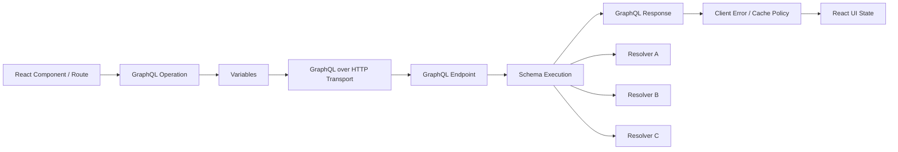
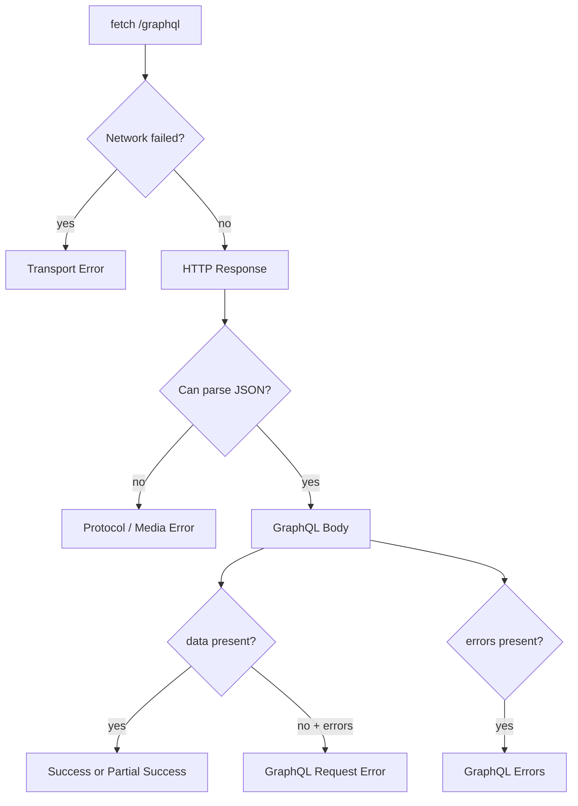

# Part 049 — GraphQL Client-Server Communication

GraphQL is not "REST but one endpoint".

That framing is too shallow and leads to weak client design.

GraphQL changes the communication contract in three ways:

1. The client sends a **document** that describes the shape of data it wants.
2. The server executes that document against a **schema**, not against a URL resource model.
3. The response can contain **data and errors at the same time**.

A React engineer who treats GraphQL like `POST /graphql` with JSON will miss the real boundary.

The practical boundary is this:



The endpoint is boring.

The operation, variables, schema, result shape, partial error behavior, and cache policy are where most production complexity lives.

## 1. The Minimum Mental Model

REST usually makes the URL the primary resource identity:

```txt
GET /users/42
GET /users/42/orders?status=open
PATCH /orders/99
```

GraphQL makes the operation document the primary data requirement:

```graphql
query UserProfilePage($userId: ID!) {
  user(id: $userId) {
    id
    name
    avatarUrl
    openOrders {
      id
      total
      status
    }
  }
}
```

A GraphQL operation is not merely "a query string".

It is a compact protocol unit containing:

| Piece | Meaning | React-side consequence |
|---|---|---|
| Operation type | `query`, `mutation`, `subscription` | Determines safety, caching, retry, and UI lifecycle. |
| Operation name | Stable identity for logs, persisted operations, metrics, and generated types. | Anonymous operations are a production smell. |
| Selection set | Exact requested fields. | Component data shape is visible and reviewable. |
| Variables | Runtime inputs. | Must be serialized, validated, and included in cache identity. |
| Fragments | Reusable/co-located field selections. | Component data dependencies can live near components. |
| Directives | Conditional or transformed selection behavior. | Can affect result shape and cache behavior. |

GraphQL gives the client expressive power.

That power is useful only if constrained by engineering discipline.

Bad GraphQL clients become dynamic string builders. Good GraphQL clients are generated, typed, observable, and policy-driven.

## 2. GraphQL over HTTP: The Wire Contract

The current standardization work for GraphQL over HTTP defines how GraphQL should be served and consumed over HTTP. The key point for React engineers is that GraphQL has its own response semantics layered on top of HTTP.

A standard JSON POST request looks like this:

```http
POST /graphql HTTP/1.1
Content-Type: application/json
Accept: application/graphql-response+json, application/json;q=0.9

{
  "query": "query UserProfilePage($userId: ID!) { user(id: $userId) { id name } }",
  "operationName": "UserProfilePage",
  "variables": {
    "userId": "u_123"
  },
  "extensions": {
    "clientName": "case-management-web",
    "clientVersion": "2026.07.07"
  }
}
```

The request envelope has four conventional fields:

```ts
type GraphQLRequestBody<TVariables extends Record<string, unknown>> = {
  query: string
  operationName?: string
  variables?: TVariables
  extensions?: Record<string, unknown>
}
```

`query` is historically named badly. It contains a GraphQL document, which may include a query, mutation, and fragments.

### POST vs GET

For React applications, a safe default is:

| Operation | HTTP method | Reason |
|---|---:|---|
| Query | `POST` by default | Works for all query sizes and avoids URL length issues. |
| Query with persisted operation ID | `GET` can be useful | Enables HTTP/CDN caching if the server supports it. |
| Mutation | `POST` | Mutations are not safe operations. |
| Subscription | Not covered by GraphQL over HTTP request/response | Usually handled over WebSocket, SSE, or multipart/streaming protocols depending on stack. |

GET must not be used to execute mutations because GET inherits safe-method semantics from HTTP.

If your frontend GraphQL client does not know whether an operation is a query or mutation, the build pipeline is too dynamic.

## 3. The Response Shape Is Not REST

A GraphQL response commonly has this envelope:

```json
{
  "data": {
    "user": {
      "id": "u_123",
      "name": "Ari"
    }
  },
  "errors": [
    {
      "message": "Cannot resolve field avatarUrl",
      "path": ["user", "avatarUrl"],
      "extensions": {
        "code": "AVATAR_SERVICE_UNAVAILABLE"
      }
    }
  ],
  "extensions": {
    "traceId": "trc_01J..."
  }
}
```

The critical invariant:

> A GraphQL response may contain useful `data` and `errors` at the same time.

This breaks the simplistic REST pattern:

```ts
if (!response.ok) throw new Error('Request failed')
return response.json()
```

In GraphQL, HTTP status can tell you about transport/request failure, but the body tells you about GraphQL execution.

A React client must classify both.



## 4. GraphQL Error Taxonomy for React

GraphQL has multiple failure classes. Mixing them creates bad UI behavior.

| Failure | Example | Retry? | UI treatment |
|---|---|---:|---|
| Network error | Offline, DNS, CORS, aborted fetch | Sometimes | Transport error, retry affordance. |
| HTTP negotiation error | Unsupported media type, unacceptable response type | No | Developer/configuration error. |
| JSON parse error | Invalid body from gateway/proxy | Maybe | Protocol error, incident telemetry. |
| GraphQL parse error | Invalid GraphQL document | No | Build/deployment bug. |
| GraphQL validation error | Unknown field, wrong variable type | No | Contract drift or stale client. |
| Variable coercion error | `ID!` received `null` | No | Client input bug or validation mismatch. |
| Field execution error | Resolver failed for selected field | Depends | Partial UI or section-level error. |
| Domain error as data | Mutation returns `ValidationError` union | No | Product-level form/flow handling. |
| Authorization null/error | Field hidden or forbidden | Usually no | Permission-aware UI boundary. |

A mature GraphQL app does not throw every `errors[]` item as a page-level exception.

Field errors often have a `path`. That path tells the UI where the failure occurred.

```json
{
  "message": "Payment service unavailable",
  "path": ["case", "latestInvoice", "amount"],
  "extensions": {
    "code": "UPSTREAM_UNAVAILABLE"
  }
}
```

A page might still render the case detail while showing an inline invoice error.

That is a feature, not a bug.

## 5. A Production GraphQL Transport

A minimal transport should do these things:

1. Set explicit `Accept` and `Content-Type` headers.
2. Attach auth/tenant/correlation metadata through a controlled policy.
3. Support `AbortSignal`.
4. Parse body once.
5. Classify transport, protocol, request, and execution errors.
6. Preserve partial data when the caller opts into it.
7. Emit observability events keyed by `operationName`.

Start with the types.

```ts
export type GraphQLErrorLike = {
  message: string
  locations?: Array<{ line: number; column: number }>
  path?: Array<string | number>
  extensions?: Record<string, unknown>
}

export type GraphQLResponse<TData> = {
  data?: TData | null
  errors?: GraphQLErrorLike[]
  extensions?: Record<string, unknown>
}

export type GraphQLErrorPolicy = 'none' | 'all' | 'ignore'

export type GraphQLRequest<TVariables> = {
  document: string
  operationName: string
  variables?: TVariables
  signal?: AbortSignal
  errorPolicy?: GraphQLErrorPolicy
  headers?: HeadersInit
}
```

Now the result model.

```ts
export type GraphQLSuccess<TData> = {
  ok: true
  data: TData
  errors: GraphQLErrorLike[]
  extensions?: Record<string, unknown>
  partial: boolean
}

export type GraphQLFailure = {
  ok: false
  kind:
    | 'network'
    | 'aborted'
    | 'http'
    | 'protocol'
    | 'graphql-request'
    | 'graphql-execution'
  status?: number
  operationName?: string
  message: string
  errors?: GraphQLErrorLike[]
  cause?: unknown
}

export type GraphQLResult<TData> = GraphQLSuccess<TData> | GraphQLFailure
```

Then the transport.

```ts
type GraphQLClientOptions = {
  endpoint: string
  getHeaders?: () => HeadersInit | Promise<HeadersInit>
  fetchImpl?: typeof fetch
  onEvent?: (event: GraphQLClientEvent) => void
}

type GraphQLClientEvent =
  | { type: 'start'; operationName: string }
  | { type: 'success'; operationName: string; partial: boolean; durationMs: number }
  | { type: 'failure'; operationName: string; kind: GraphQLFailure['kind']; durationMs: number }

export function createGraphQLClient(options: GraphQLClientOptions) {
  const fetchImpl = options.fetchImpl ?? fetch

  return async function execute<TData, TVariables extends Record<string, unknown> = Record<string, never>>(
    request: GraphQLRequest<TVariables>,
  ): Promise<GraphQLResult<TData>> {
    const startedAt = performance.now()
    options.onEvent?.({ type: 'start', operationName: request.operationName })

    const headers = new Headers({
      Accept: 'application/graphql-response+json, application/json;q=0.9',
      'Content-Type': 'application/json',
    })

    const baseHeaders = await options.getHeaders?.()
    new Headers(baseHeaders).forEach((value, key) => headers.set(key, value))
    new Headers(request.headers).forEach((value, key) => headers.set(key, value))

    let response: Response

    try {
      response = await fetchImpl(options.endpoint, {
        method: 'POST',
        headers,
        signal: request.signal,
        body: JSON.stringify({
          query: request.document,
          operationName: request.operationName,
          variables: request.variables ?? {},
        }),
      })
    } catch (cause) {
      const kind = isAbortError(cause) ? 'aborted' : 'network'
      options.onEvent?.({
        type: 'failure',
        operationName: request.operationName,
        kind,
        durationMs: performance.now() - startedAt,
      })
      return {
        ok: false,
        kind,
        operationName: request.operationName,
        message: kind === 'aborted' ? 'GraphQL request was aborted.' : 'Network request failed.',
        cause,
      }
    }

    const contentType = response.headers.get('content-type') ?? ''
    const isGraphQLJson =
      contentType.includes('application/graphql-response+json') ||
      contentType.includes('application/json')

    if (!isGraphQLJson) {
      options.onEvent?.({
        type: 'failure',
        operationName: request.operationName,
        kind: 'protocol',
        durationMs: performance.now() - startedAt,
      })
      return {
        ok: false,
        kind: 'protocol',
        status: response.status,
        operationName: request.operationName,
        message: `Unsupported GraphQL response content-type: ${contentType || '<missing>'}`,
      }
    }

    let body: GraphQLResponse<TData>

    try {
      body = (await response.json()) as GraphQLResponse<TData>
    } catch (cause) {
      options.onEvent?.({
        type: 'failure',
        operationName: request.operationName,
        kind: 'protocol',
        durationMs: performance.now() - startedAt,
      })
      return {
        ok: false,
        kind: 'protocol',
        status: response.status,
        operationName: request.operationName,
        message: 'GraphQL response body was not valid JSON.',
        cause,
      }
    }

    const errors = body.errors ?? []
    const hasData = Object.prototype.hasOwnProperty.call(body, 'data') && body.data != null
    const hasErrors = errors.length > 0

    if (!response.ok && !hasData) {
      options.onEvent?.({
        type: 'failure',
        operationName: request.operationName,
        kind: 'http',
        durationMs: performance.now() - startedAt,
      })
      return {
        ok: false,
        kind: 'http',
        status: response.status,
        operationName: request.operationName,
        message: `GraphQL HTTP request failed with status ${response.status}.`,
        errors,
      }
    }

    if (!hasData && hasErrors) {
      options.onEvent?.({
        type: 'failure',
        operationName: request.operationName,
        kind: 'graphql-request',
        durationMs: performance.now() - startedAt,
      })
      return {
        ok: false,
        kind: 'graphql-request',
        status: response.status,
        operationName: request.operationName,
        message: 'GraphQL request failed before producing data.',
        errors,
      }
    }

    if (hasErrors && request.errorPolicy !== 'all' && request.errorPolicy !== 'ignore') {
      options.onEvent?.({
        type: 'failure',
        operationName: request.operationName,
        kind: 'graphql-execution',
        durationMs: performance.now() - startedAt,
      })
      return {
        ok: false,
        kind: 'graphql-execution',
        status: response.status,
        operationName: request.operationName,
        message: 'GraphQL operation returned execution errors.',
        errors,
      }
    }

    options.onEvent?.({
      type: 'success',
      operationName: request.operationName,
      partial: hasErrors,
      durationMs: performance.now() - startedAt,
    })

    return {
      ok: true,
      data: body.data as TData,
      errors: request.errorPolicy === 'ignore' ? [] : errors,
      extensions: body.extensions,
      partial: hasErrors,
    }
  }
}

function isAbortError(error: unknown): boolean {
  return error instanceof DOMException && error.name === 'AbortError'
}
```

This is still not a complete enterprise GraphQL client. It is a transport foundation.

Production clients often add:

- persisted operation IDs,
- file upload protocol support,
- response normalization,
- incremental delivery support,
- retry policy,
- auth refresh control,
- operation allowlisting,
- query cost telemetry,
- generated operation types,
- tracing headers,
- feature flag headers,
- tenant and locale headers.

But the invariant remains the same: do not collapse GraphQL response semantics into `response.ok`.

## 6. Generated Operations, Not Runtime Strings

Avoid this:

```ts
const fields = ['id', 'name', 'email']
const query = `query User { user(id: "${id}") { ${fields.join(' ')} } }`
```

Dynamic query construction in product code creates problems:

| Problem | Consequence |
|---|---|
| No stable operation identity | Bad logs, bad persisted operation mapping, weak metrics. |
| Weak type generation | Runtime shape not known at build time. |
| Harder security controls | Operation allowlisting becomes difficult. |
| Harder cache behavior | Client cannot reason about entity/field selection. |
| Higher injection risk | Variables should carry values, not string interpolation. |

Prefer static documents with generated types.

```graphql
query UserProfilePage($userId: ID!) {
  user(id: $userId) {
    id
    name
    email
  }
}
```

Generated output might give you:

```ts
export type UserProfilePageQuery = {
  user: {
    id: string
    name: string
    email: string | null
  } | null
}

export type UserProfilePageQueryVariables = {
  userId: string
}
```

Then your API layer can be typed without lying:

```ts
export async function getUserProfile(
  client: ExecuteGraphQL,
  variables: UserProfilePageQueryVariables,
  signal?: AbortSignal,
) {
  const result = await client<UserProfilePageQuery, UserProfilePageQueryVariables>({
    operationName: 'UserProfilePage',
    document: UserProfilePageDocument,
    variables,
    signal,
    errorPolicy: 'all',
  })

  if (!result.ok) return result

  return result
}
```

The document is the contract. The generated types are a projection of the contract. The transport is just the execution mechanism.

## 7. React Query Integration

GraphQL and React Query can work together well when you are explicit about ownership:

- React Query owns request lifecycle, freshness, retries, cancellation, and cache by query key.
- GraphQL owns operation shape and server schema execution.
- Your API module owns GraphQL transport and error classification.

```ts
const userProfileKey = (userId: string) => ['graphql', 'UserProfilePage', { userId }] as const

export function useUserProfile(userId: string) {
  const graphql = useGraphQLClient()

  return useQuery({
    queryKey: userProfileKey(userId),
    queryFn: async ({ signal }) => {
      const result = await graphql<UserProfilePageQuery, UserProfilePageQueryVariables>({
        operationName: 'UserProfilePage',
        document: UserProfilePageDocument,
        variables: { userId },
        signal,
        errorPolicy: 'all',
      })

      if (!result.ok) throw result

      return result
    },
    select: (result) => result.data.user,
  })
}
```

Do not put the entire GraphQL document in the query key.

Use:

```ts
['graphql', operationName, variables, authScope]
```

Do not use:

```ts
['graphql', documentString, variables]
```

The document string is noisy and unstable. The operation name plus versioned generated document is usually enough for application-level cache identity.

For normalized GraphQL clients like Apollo Client or Relay, the client cache has deeper entity semantics. That is Part 050.

## 8. Cache Identity in GraphQL over HTTP

GraphQL's default single endpoint weakens ordinary HTTP caching because many different operations hit the same URL.

A plain POST body is usually not cacheable by browser/CDN in the way REST GET URLs are.

There are three common options:

### Option A — App-level cache

Use a client cache keyed by operation name and variables.

```ts
['graphql', 'CaseTimeline', { caseId, cursor }]
```

This is simple and works with POST.

### Option B — GET for queries

Encode query parameters in the URL for query operations.

```txt
/graphql?query=query%20Case($id:ID!){case(id:$id){id}}&variables={"id":"c_1"}
```

This can enable HTTP caching, but long URLs and privacy leakage become real risks.

### Option C — Persisted operations

Register a document hash or operation ID with the server. The client sends the identifier plus variables.

```json
{
  "extensions": {
    "persistedQuery": {
      "version": 1,
      "sha256Hash": "..."
    }
  },
  "variables": {
    "caseId": "c_123"
  }
}
```

Persisted operations improve:

- payload size,
- allowlisting,
- CDN cacheability,
- observability,
- attack surface reduction.

They add deployment coupling. The server must know the operation before the client uses it.

## 9. Authorization and GraphQL Partial Data

GraphQL authorization often appears at field level.

Example:

```graphql
query CaseDetail($caseId: ID!) {
  case(id: $caseId) {
    id
    title
    enforcementStatus
    confidentialNotes {
      id
      body
    }
  }
}
```

A user may be allowed to read the case but not `confidentialNotes`.

Possible server behaviors:

1. Return `confidentialNotes: null` with no error.
2. Return partial data plus an error path.
3. Return a domain-specific permission object.
4. Fail the whole operation.

From a React communication standpoint, you must know which policy your graph uses.

Do not assume null means absent.

For GraphQL clients, null can mean:

- truly missing data,
- not found,
- redacted by authorization,
- resolver failure propagated through nullability,
- upstream timeout,
- field deliberately nullable in schema.

If the distinction matters to the product, model it explicitly.

```graphql
type ConfidentialNotesAccessDenied {
  reason: String!
}

type ConfidentialNotesResult {
  notes: [ConfidentialNote!]!
}

union ConfidentialNotesPayload = ConfidentialNotesResult | ConfidentialNotesAccessDenied
```

Then the UI can branch on `__typename` instead of guessing from `null`.

## 10. Mutations Are Commands with Selection Sets

A GraphQL mutation both performs a write and selects the response shape.

```graphql
mutation UpdateCaseTitle($input: UpdateCaseTitleInput!) {
  updateCaseTitle(input: $input) {
    __typename
    ... on UpdateCaseTitleSuccess {
      case {
        id
        title
        version
        updatedAt
      }
    }
    ... on ValidationError {
      fieldErrors {
        field
        message
      }
    }
    ... on VersionConflict {
      currentCase {
        id
        title
        version
      }
    }
  }
}
```

This is usually better than returning `true`.

A mutation response should provide enough data for the client to reconcile UI state:

| Mutation result need | Why it matters |
|---|---|
| Updated entity ID | Cache identity. |
| New version/ETag equivalent | Conflict handling. |
| Updated fields | Immediate UI reconciliation. |
| Domain errors | Form mapping. |
| Correlation/audit ID | Support and incident traceability. |
| Server-normalized values | Avoid client showing stale local assumptions. |

GraphQL does not magically solve idempotency.

If a mutation can be retried after timeout or network failure, you still need a command idempotency strategy.

```graphql
mutation SubmitCaseDecision($input: SubmitCaseDecisionInput!) {
  submitCaseDecision(input: $input) {
    __typename
    ... on SubmitCaseDecisionSuccess {
      decision { id status submittedAt }
    }
    ... on DuplicateCommand {
      existingDecision { id status submittedAt }
    }
  }
}
```

With variables:

```json
{
  "input": {
    "commandId": "cmd_01J...",
    "caseId": "case_123",
    "decision": "ESCALATE"
  }
}
```

The command ID is the idempotency key. The GraphQL operation is just the envelope.

## 11. Batching and the Trap of Hidden Coupling

Some clients support batching multiple GraphQL operations into one HTTP request.

This can reduce connection overhead, but it changes failure and scheduling semantics.

```mermaid
flowchart TD
  OpA[Operation A] --> Batch[HTTP Batch]
  OpB[Operation B] --> Batch
  OpC[Operation C] --> Batch
  Batch --> Endpoint[/graphql]
  Endpoint --> ResultA[Result A]
  Endpoint --> ResultB[Result B]
  Endpoint --> ResultC[Result C]
```

Ask before enabling batching globally:

| Question | Why it matters |
|---|---|
| Can one operation be cancelled independently? | A route change may only obsolete one request. |
| Does one slow resolver delay all results? | Batching can create artificial head-of-line blocking. |
| Are auth/tenant headers identical? | Mixed scopes must never share a batch. |
| Does retry replay safe and unsafe operations together? | Retrying mutation with query is dangerous. |
| Does observability preserve operation-level timing? | Aggregate timing hides bottlenecks. |

Batching is a scheduling optimization, not an architecture default.

## 12. GraphQL Security from the Client Perspective

The client cannot enforce server security, but client behavior can increase or reduce risk.

React-side rules:

1. Never build documents with interpolated user input.
2. Send values through variables.
3. Prefer persisted/allowlisted operations for production surfaces.
4. Avoid introspection-dependent runtime behavior in production UI.
5. Bound pagination and search inputs.
6. Do not log variables blindly; they may contain PII.
7. Treat `extensions` as an observability channel, not a dumping ground.
8. Do not expose secrets through headers, variables, or client-side documents.
9. Include operation name in telemetry.
10. Handle partial authorization results intentionally.

The server still must enforce:

- authentication,
- authorization,
- query depth/complexity limits,
- rate limits,
- resolver timeouts,
- input validation,
- introspection policy,
- persisted operation allowlist,
- audit logging.

The client should not pretend these are frontend concerns. It should avoid making them worse.

## 13. Pagination and Connections

GraphQL pagination often uses a connection shape:

```graphql
query CaseTimeline($caseId: ID!, $after: String) {
  case(id: $caseId) {
    id
    timeline(first: 25, after: $after) {
      edges {
        cursor
        node {
          id
          type
          occurredAt
        }
      }
      pageInfo {
        hasNextPage
        endCursor
      }
    }
  }
}
```

React client rules:

| Rule | Reason |
|---|---|
| Treat cursor as opaque. | Server owns ordering implementation. |
| Include filter/sort inputs in cache identity. | Different filters are different lists. |
| Do not derive cursor from array index. | Inserts/deletes break index pagination. |
| Model empty page separately from end-of-list. | A page can be empty under race/filter conditions. |
| Merge pages through explicit policy. | Normalized caches need field merge behavior. |

Cursor pagination is a contract. It is not just a UI infinite-scroll helper.

## 14. GraphQL and Observability

Every production GraphQL request should emit at least:

| Field | Example |
|---|---|
| `operationName` | `CaseTimeline` |
| `operationType` | `query` |
| `durationMs` | `187` |
| `status` | `200` |
| `hasErrors` | `true` |
| `errorCodes` | `UPSTREAM_TIMEOUT` |
| `partial` | `true` |
| `cacheOutcome` | `miss`, `hit`, `partial-hit` |
| `requestId` / `traceId` | `trc_...` |
| `variablesShape` | names only, not raw PII values |

Avoid logging raw documents and raw variables by default.

A query can contain sensitive field names. Variables can contain sensitive values.

Prefer safe summaries:

```ts
function summarizeGraphQLEvent(request: GraphQLRequest<unknown>, result: GraphQLResult<unknown>) {
  return {
    operationName: request.operationName,
    ok: result.ok,
    kind: result.ok ? 'success' : result.kind,
    partial: result.ok ? result.partial : false,
    variableNames:
      request.variables && typeof request.variables === 'object'
        ? Object.keys(request.variables as Record<string, unknown>)
        : [],
  }
}
```

## 15. Decision Framework: When GraphQL Is a Good Fit

GraphQL is usually strong when:

- screens need nested data from many backend domains,
- clients vary in data requirements,
- product teams benefit from schema-driven collaboration,
- generated operation types are part of the workflow,
- partial data is acceptable and useful,
- field-level evolution is frequent,
- a BFF/gateway layer can absorb resolver complexity.

GraphQL is often a poor fit when:

- operations are mostly simple CRUD resources,
- HTTP caching is a primary requirement and persisted query infra is absent,
- backend cannot support schema governance,
- authorization rules are poorly modeled,
- teams will build ad-hoc dynamic query strings,
- N+1 resolver risks are not owned server-side,
- upload/download streaming is central to the product,
- operational tooling is weaker than existing REST tooling.

The question is not "REST or GraphQL?".

The better question is:

> Which side should own composition: URL resources, backend aggregate endpoint, GraphQL schema, or React route?

## 16. Production Smells

Watch for these smells in code review:

```ts
// Smell: anonymous operation
const query = gql`
  query {
    viewer { id name }
  }
`

// Smell: dynamic selection string
const query = `query Case { case(id: "${id}") { ${fields} } }`

// Smell: only checking HTTP status
if (!response.ok) throw new Error('failed')

// Smell: ignoring GraphQL errors
const { data } = await response.json()
return data

// Smell: variables not in cache key
useQuery({ queryKey: ['CaseDetail'], queryFn: () => getCase(caseId) })

// Smell: mutation returns boolean only
mutation CloseCase { closeCase(id: "c1") }
```

Better:

```graphql
mutation CloseCase($input: CloseCaseInput!) {
  closeCase(input: $input) {
    __typename
    ... on CloseCaseSuccess {
      case {
        id
        status
        version
        closedAt
      }
    }
    ... on VersionConflict {
      currentCase {
        id
        status
        version
      }
    }
    ... on ValidationError {
      fieldErrors { field message }
    }
  }
}
```

## 17. Testing Strategy

A GraphQL communication layer needs tests at multiple levels.

### Transport tests

Test:

- sends `Accept`, `Content-Type`, document, operation name, variables,
- supports abort,
- handles invalid JSON,
- handles non-GraphQL content type,
- handles HTTP 500 with GraphQL body,
- handles `data + errors`,
- handles `errors` without `data`,
- redacts variables in telemetry.

### Operation tests

Test generated operations:

- variables are required where schema says required,
- query includes fields needed by UI,
- fragment changes regenerate types,
- stale generated artifacts fail CI.

### UI tests

Test:

- full success,
- partial success,
- field error path,
- validation/domain union result,
- auth-forbidden branch,
- retryable network failure,
- aborted route change,
- optimistic mutation rollback.

Use MSW or a similar boundary mock to return GraphQL-like envelopes, not just raw domain objects.

```ts
return HttpResponse.json({
  data: {
    case: {
      id: 'case_123',
      title: 'Permit violation',
      latestInvoice: null,
    },
  },
  errors: [
    {
      message: 'Invoice service unavailable',
      path: ['case', 'latestInvoice'],
      extensions: { code: 'UPSTREAM_UNAVAILABLE' },
    },
  ],
})
```

## 18. Review Checklist

Before approving GraphQL client-server communication code, check:

- Is every operation named?
- Are documents static and generated?
- Are values sent via variables, not interpolation?
- Does the transport send explicit `Accept` and `Content-Type` headers?
- Does the client distinguish network, HTTP, protocol, request, execution, and domain errors?
- Does UI handle `data + errors` intentionally?
- Are variables included in cache identity?
- Are auth/tenant scopes included in cache boundary where needed?
- Does mutation response include enough data to reconcile UI?
- Are command IDs/idempotency keys used for retryable critical mutations?
- Is logging safe for PII?
- Are operation names visible in telemetry?
- Does server enforce depth/complexity/rate limits?
- Are generated artifacts validated in CI?

## 19. Key Takeaways

GraphQL client-server communication is not just a POST wrapper.

The important production invariants are:

1. The operation document is a data requirement contract.
2. Variables are part of request identity and cache identity.
3. HTTP status alone is insufficient for GraphQL result handling.
4. `data + errors` is a normal and important response state.
5. Mutations are commands and need reconciliation payloads.
6. Persisted operations turn GraphQL from dynamic text into deployable protocol artifacts.
7. Generated types are necessary but not enough; runtime response policy still matters.
8. Observability must be operation-aware.

Part 050 goes deeper into what happens after the response arrives: normalized cache, fragments, object identity, and consistency.

## References

- GraphQL Specification: https://spec.graphql.org/
- GraphQL over HTTP draft: https://graphql.github.io/graphql-over-http/draft/
- Serving GraphQL over HTTP: https://graphql.org/learn/serving-over-http/
- Apollo Client caching: https://www.apollographql.com/docs/react/caching/overview
- Relay fragments: https://relay.dev/docs/tutorial/fragments-1/
