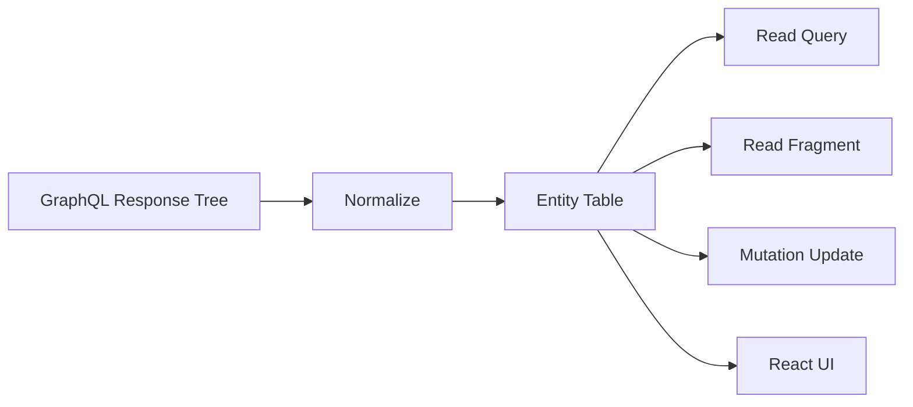
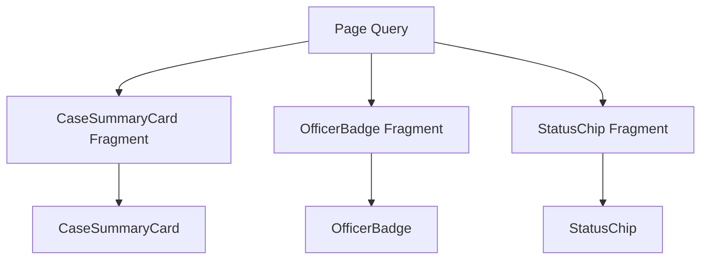
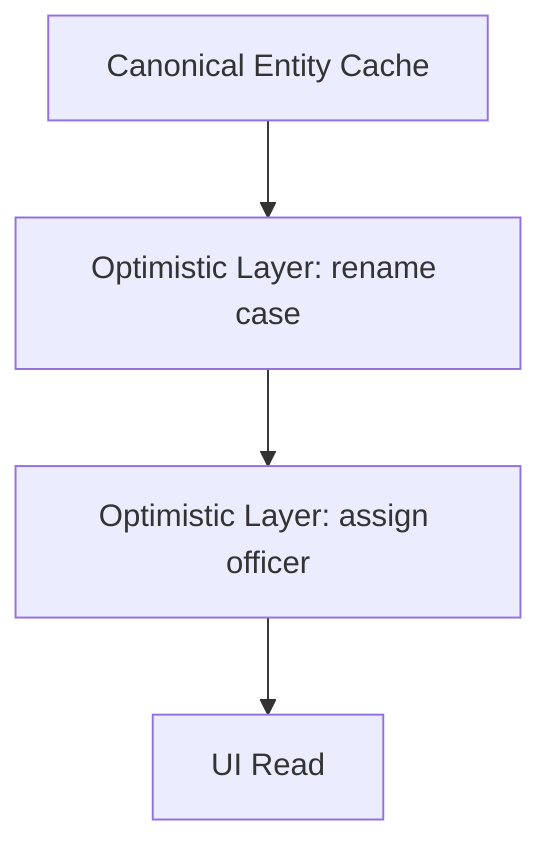

# Part 050 — GraphQL Normalized Cache and Fragments

A GraphQL response is a tree.

Your product data is usually a graph.

A normalized GraphQL cache is the bridge between those two facts.



Without normalization, every query result is just an isolated JSON blob.

With normalization, multiple query results that mention the same object can converge on one entity record.

That is powerful. It is also easy to break.

This part focuses on the mental model, not just Apollo or Relay syntax.

## 1. Request Cache vs Normalized Entity Cache

A request cache stores results by request identity.

```txt
['graphql', 'CaseDetail', { caseId: 'case_123' }] -> { case: {...} }
['graphql', 'CaseList', { status: 'open' }] -> { cases: [...] }
```

A normalized cache stores objects by entity identity.

```txt
Case:case_123 -> { id, title, status, assignedOfficer }
User:user_9   -> { id, name, avatarUrl }
```

Those are different models.

| Model | Primary key | Good at | Weak at |
|---|---|---|---|
| Request cache | Operation/query key + variables | Freshness lifecycle, retry, background refetch, generic HTTP APIs | Cross-query entity consistency |
| Normalized cache | Entity key + field args | Shared object consistency, fragment reads, mutation reconciliation | Complex policies, schema coupling, partial data rules |

React Query is mostly request-cache oriented.

Apollo Client and Relay are normalized-cache oriented.

Both can be correct. The important part is knowing which consistency model you are buying.

## 2. The Normalization Algorithm

A simplified normalization algorithm looks like this:

```txt
for every object in response tree:
  if object has stable identity:
    compute entity key
    store fields under entity key
    replace nested object position with reference to entity key
  else:
    keep object embedded under parent field
```

Example response:

```json
{
  "data": {
    "case": {
      "__typename": "Case",
      "id": "case_123",
      "title": "Permit violation",
      "assignedOfficer": {
        "__typename": "User",
        "id": "user_9",
        "name": "Maya"
      }
    }
  }
}
```

Normalized representation:

```txt
ROOT_QUERY:
  case({"id":"case_123"}) -> Reference(Case:case_123)

Case:case_123:
  __typename -> Case
  id -> case_123
  title -> Permit violation
  assignedOfficer -> Reference(User:user_9)

User:user_9:
  __typename -> User
  id -> user_9
  name -> Maya
```

This gives the cache a way to answer future reads of the same user even if the user was fetched through a different query.

The default identity pattern in many GraphQL caches is:

```txt
__typename + id
```

For example:

```txt
Case:case_123
User:user_9
Invoice:inv_77
```

If your schema does not expose stable IDs and `__typename`, normalized caching becomes fragile.

## 3. Why `__typename` Matters

GraphQL object IDs are often unique only within a type.

```txt
User id = 123
Case id = 123
```

If the cache used only `id`, these would collide.

`__typename` creates a typed namespace.

```txt
User:123
Case:123
```

It is also essential for unions and interfaces.

```graphql
query Search($q: String!) {
  search(q: $q) {
    __typename
    ... on Case {
      id
      title
    }
    ... on User {
      id
      name
    }
  }
}
```

Without `__typename`, the client cannot safely know which fragment applies.

For production GraphQL React apps, selecting `__typename` is not noise. It is part of cache correctness.

## 4. Fragment Mental Model

Fragments are not merely reuse helpers.

Fragments are **component data contracts**.

```graphql
fragment CaseSummaryCard_case on Case {
  id
  title
  status
  assignedOfficer {
    id
    name
  }
}
```

A component can then declare:

```tsx
type Props = {
  caseRef: FragmentType<typeof CaseSummaryCard_case>
}

export function CaseSummaryCard({ caseRef }: Props) {
  const item = useFragment(CaseSummaryCard_case, caseRef)

  return (
    <article>
      <h2>{item.title}</h2>
      <p>{item.status}</p>
      <span>{item.assignedOfficer.name}</span>
    </article>
  )
}
```

The parent query composes fragments:

```graphql
query CaseListPage($status: CaseStatus!) {
  cases(status: $status) {
    nodes {
      id
      ...CaseSummaryCard_case
    }
  }
}
```

This gives you two invariants:

1. Components declare their own data needs.
2. The network still fetches one composed operation.



This is the clean version of component-level data ownership.

The component owns its data requirement, but the route/page owns operation execution.

## 5. Fragment Colocation vs Hidden Parent Coupling

Without fragments, parent queries tend to grow implicit child knowledge.

```graphql
query CaseListPage {
  cases {
    nodes {
      id
      title
      status
      assignedOfficer {
        id
        name
        avatarUrl
      }
      SLAClockOnlyNeededByDeepChild: slaDeadline
    }
  }
}
```

The parent now knows too much.

When a deep child changes, the parent query changes. In a large app, this creates brittle coupling.

With fragments:

```graphql
fragment SLAClock_case on Case {
  slaDeadline
}

fragment OfficerBadge_user on User {
  id
  name
  avatarUrl
}

fragment CaseSummaryCard_case on Case {
  id
  title
  status
  assignedOfficer {
    ...OfficerBadge_user
  }
  ...SLAClock_case
}
```

Now the coupling is explicit and local.

Fragments are how GraphQL restores modularity that would otherwise be lost because network requests are usually route-level.

## 6. Data Masking

A stronger fragment system does not let a component read fields it did not declare.

This is often called data masking.

The idea:

```txt
Parent fetched fields: id, title, status, confidentialNotes
Child fragment declared: id, title
Child can read: id, title
Child cannot accidentally read: confidentialNotes
```

This matters because without masking, fields leak through props and create undeclared dependencies.

```tsx
// Smell: component reads a field not declared by its fragment.
function CaseCard({ caseData }: { caseData: AnyCaseObject }) {
  return <div>{caseData.confidentialNotes?.[0]?.body}</div>
}
```

That component is now permission-sensitive without the query/fragments making it obvious.

Data masking is not ceremony. It is dependency control.

## 7. Normalized Cache Write: Mutation Reconciliation

Suppose this query is already cached:

```graphql
query CaseDetail($id: ID!) {
  case(id: $id) {
    id
    title
    status
    version
  }
}
```

Then this mutation returns the updated case:

```graphql
mutation RenameCase($input: RenameCaseInput!) {
  renameCase(input: $input) {
    __typename
    ... on RenameCaseSuccess {
      case {
        id
        title
        status
        version
      }
    }
  }
}
```

When the cache sees:

```json
{
  "__typename": "Case",
  "id": "case_123",
  "title": "Updated title",
  "status": "OPEN",
  "version": 8
}
```

It can update:

```txt
Case:case_123.title = Updated title
Case:case_123.version = 8
```

Any query or fragment reading `Case:case_123.title` can now reflect the update.

This is the core value of normalized caching.

But it only works if mutation responses return identifiable updated objects.

Returning this is weak:

```graphql
mutation RenameCase($input: RenameCaseInput!) {
  renameCase(input: $input)
}
```

The client now knows the command succeeded but does not know how to reconcile the graph.

## 8. The Hard Part: Lists

Entity fields are easy.

Lists are hard.

Example cache field:

```txt
ROOT_QUERY.cases({"status":"OPEN"}) -> [Case:case_1, Case:case_2]
```

After creating a new case, should the new case appear in that list?

It depends on:

- status filter,
- sort order,
- pagination cursor,
- authorization visibility,
- search query,
- tenant scope,
- server-side ranking,
- whether the list is complete or partial.

A normalized cache can update `Case:case_3`, but it cannot magically know every list that should include it.

You need a list policy.

| Mutation | Entity write | List policy |
|---|---|---|
| Rename case | Update `Case:case_123.title` | Usually no list membership change. |
| Close case | Update status | Remove from `OPEN` list, add/invalidate `CLOSED` list. |
| Create case | Add entity | Insert into relevant lists or invalidate lists. |
| Delete case | Evict entity | Remove references from lists. |
| Reassign case | Update assignment | Invalidate officer-specific lists. |

For complex filtered lists, invalidation is often safer than manual surgery.

## 9. Field Arguments Are Part of Field Identity

This query:

```graphql
query OpenCases {
  cases(status: OPEN) {
    nodes { id title }
  }
}
```

and this query:

```graphql
query ClosedCases {
  cases(status: CLOSED) {
    nodes { id title }
  }
}
```

must not share the same field storage.

A normalized cache needs field identity that includes arguments:

```txt
ROOT_QUERY.cases({"status":"OPEN"})
ROOT_QUERY.cases({"status":"CLOSED"})
```

If argument identity is incomplete, data bleeds across filters.

Common bug:

```ts
// Smell: keyArgs ignores search text.
keyArgs: ['status']
```

Then:

```txt
cases(status: OPEN, search: "permit")
cases(status: OPEN, search: "inspection")
```

can collide.

Field policy is a correctness mechanism, not a performance tweak.

## 10. Pagination Merge Policy

Cursor pagination requires explicit merge behavior.

Existing cache:

```txt
cases(status: OPEN):
  edges: [edge(cursor:a, node:Case:1), edge(cursor:b, node:Case:2)]
  pageInfo: { endCursor: b, hasNextPage: true }
```

Next page response:

```txt
edges: [edge(cursor:c, node:Case:3), edge(cursor:d, node:Case:4)]
pageInfo: { endCursor: d, hasNextPage: false }
```

Merged cache:

```txt
edges: [a, b, c, d]
pageInfo: { endCursor: d, hasNextPage: false }
```

But real systems have edge cases:

| Edge case | Required behavior |
|---|---|
| Duplicate edge | De-duplicate by cursor or node ID. |
| Item deleted between pages | Avoid index assumptions. |
| Sort changed | Reset list, do not append. |
| Filter changed | Different field identity. |
| Previous page refetch | Merge or replace intentionally. |
| Auth visibility changed | Invalidate scoped lists. |

A naive `existing.concat(incoming)` is not a pagination strategy.

## 11. Nullability and Error Propagation

GraphQL nullability directly affects cache and UI semantics.

```graphql
type Case {
  id: ID!
  title: String!
  latestInvoice: Invoice
}
```

`latestInvoice` can be null.

Reasons may include:

- no invoice exists,
- invoice is hidden by authorization,
- invoice resolver failed and returned null,
- upstream invoice system timed out,
- data was redacted,
- field is not selected in this operation.

A normalized cache cannot infer the meaning of null.

If the distinction matters, encode it in the schema.

```graphql
union LatestInvoiceResult = Invoice | InvoiceUnavailable | InvoiceAccessDenied
```

Then the client can branch on `__typename`.

This improves both UI clarity and cache correctness.

## 12. Partial Reads

A normalized cache can know that an entity exists but a requested field is missing.

Example cached entity:

```txt
Case:case_123:
  id -> case_123
  title -> Permit violation
```

Fragment read:

```graphql
fragment CaseDetail_case on Case {
  id
  title
  status
  assignedOfficer { id name }
}
```

The cache has `id` and `title`, but not `status` or `assignedOfficer`.

Possible client policies:

| Policy | Behavior |
|---|---|
| Strict | Treat as cache miss and fetch. |
| Partial | Return available fields and mark incomplete. |
| Suspense | Suspend until missing data is fetched. |
| Error | Throw missing field error in development. |

A mature cache makes incompleteness explicit.

Silent partial reads create UI bugs that look like authorization or backend problems.

## 13. Optimistic Layers

Optimistic UI in a normalized cache is usually implemented as a temporary layer above canonical cache state.



When a mutation starts:

```txt
Layer +1:
  Case:case_123.title = Proposed title
```

When the server confirms:

```txt
Canonical:
  Case:case_123.title = Server-normalized title
Remove optimistic layer
```

When the server rejects:

```txt
Remove optimistic layer
Show validation/conflict state
```

Problems appear when optimistic layers overlap:

| Problem | Example |
|---|---|
| Out-of-order mutation result | Rename A then Rename B; result A returns last. |
| Temporary ID replacement | `Case:temp_1` becomes `Case:case_999`. |
| List optimistic insertion | Item appears in list before server decides visibility. |
| Conflict result | Server rejects due to stale version. |
| Partial mutation response | Server does not return enough fields to reconcile. |

Optimism needs a rollback plan and a server reconciliation plan.

## 14. Entity Eviction and Garbage Collection

Normalized caches can accumulate entities that are no longer reachable from active queries.

Eviction is not just memory management.

It is also privacy and correctness.

Examples:

- user logs out,
- tenant changes,
- role changes,
- case access is revoked,
- PII screen is closed,
- persisted cache expires.

Rules:

1. Clear cache on identity boundary change unless you have proven scoped isolation.
2. Evict sensitive entity types aggressively.
3. Do not persist normalized cache blindly across users.
4. Include schema/client version in persisted cache metadata.
5. Run garbage collection after evicting root references.
6. Treat permission change as cache invalidation event.

A normalized cache can otherwise become a local data leak.

## 15. Fragment Versioning and Schema Evolution

Fragments create local contracts.

Schema evolution still matters.

Safe-ish changes:

- adding optional fields,
- adding enum values if clients handle unknowns,
- adding object types to unions if clients have fallback,
- adding new mutations/queries,
- adding nullable fields.

Breaking changes:

- removing fields used by fragments,
- changing field type,
- tightening nullability from nullable to non-null when data is not guaranteed,
- removing enum values that clients still receive,
- changing ID stability,
- changing pagination semantics,
- changing authorization null/error behavior.

Generated artifacts should fail CI when fragments no longer validate against schema.

Relay compiler explicitly supports ahead-of-time compilation of GraphQL queries/fragments and can validate generated artifacts. Apollo/codegen setups should enforce a similar gate.

## 16. Apollo-Style Runtime Normalized Cache

Apollo Client's `InMemoryCache` stores normalized data in a flat lookup table and can combine fields for the same object across multiple query results.

A simplified Apollo-style setup:

```ts
import { ApolloClient, InMemoryCache, HttpLink } from '@apollo/client'

export const client = new ApolloClient({
  link: new HttpLink({
    uri: '/graphql',
    headers: {
      Accept: 'application/graphql-response+json, application/json;q=0.9',
    },
  }),
  cache: new InMemoryCache({
    typePolicies: {
      Case: {
        keyFields: ['id'],
      },
      Query: {
        fields: {
          cases: {
            keyArgs: ['status', 'search', 'assigneeId'],
            merge(existing, incoming, { args }) {
              if (!args?.after) return incoming

              return {
                ...incoming,
                edges: [...(existing?.edges ?? []), ...incoming.edges],
              }
            },
          },
        },
      },
    },
  }),
})
```

This code looks simple. The correctness is in the policy choices:

- Are `keyFields` stable?
- Are all list filter arguments included in `keyArgs`?
- Does `merge` de-duplicate?
- Does it reset when sort/filter changes?
- Does it handle deletions?
- Does it handle authorization changes?

The cache config is application logic.

Review it like application logic.

## 17. Relay-Style Compiled Data Dependencies

Relay takes a more compiler-driven approach.

The important concepts:

- components declare fragments,
- compiler composes operations,
- generated artifacts drive runtime behavior,
- fragment refs limit what components can read,
- store normalization is deeply tied to the compiler and schema conventions.

Example fragment:

```graphql
fragment OfficerBadge_user on User {
  id
  name
  avatarUrl
}
```

Example query:

```graphql
query CaseDetailPageQuery($caseId: ID!) {
  case(id: $caseId) {
    id
    title
    assignedOfficer {
      ...OfficerBadge_user
    }
  }
}
```

The Relay mental model is strict:

> Components declare data dependencies; the compiler and runtime ensure those dependencies are fetched and read correctly.

This can feel heavier than runtime GraphQL clients, but it provides strong large-codebase guardrails.

## 18. GraphQL Normalized Cache vs Backend Truth

A normalized cache is still a replica.

It is not the source of truth.

The server owns:

- authorization,
- validation,
- transactions,
- concurrency control,
- canonical computed fields,
- lifecycle rules,
- auditability,
- cross-entity invariants.

The client cache owns:

- local read performance,
- UI consistency between known entities,
- optimistic branch,
- partial data state,
- local invalidation scheduling,
- offline-ish display if allowed.

Do not move regulatory or domain invariants into the normalized cache.

The cache can make the UI coherent. It cannot make the business state correct.

## 19. Common Failure Modes

### 19.1 Entity collision

Two different objects produce the same cache key.

```txt
Document:123 used for CaseDocument and EvidenceDocument
```

Fix with correct `__typename`, stable ID design, or custom key fields.

### 19.2 Entity fragmentation

The same logical object gets multiple cache keys.

```txt
Case:123
Case:case_123
RegulatoryCase:123
```

The UI shows inconsistent versions.

Fix schema identity and client key policy.

### 19.3 Missing `__typename`

Unions/interfaces cannot normalize or discriminate correctly.

Fix operation documents/codegen config.

### 19.4 Bad list merge

Pagination duplicates or drops items.

Fix cursor merge with de-duplication and reset rules.

### 19.5 Hidden auth leak

Cache retains data after logout or role change.

Fix identity-scoped cache clearing and sensitive entity eviction.

### 19.6 Fragment overreach

A component reads fields not declared by its fragment.

Fix data masking or stricter generated fragment types.

### 19.7 Mutation returns too little

Mutation succeeds but cache cannot reconcile.

Fix mutation payload design.

### 19.8 Null ambiguity

UI cannot distinguish absent, forbidden, failed, and not selected.

Fix schema result modeling.

### 19.9 Persisted cache drift

Old cache shape survives schema/client upgrade.

Fix persisted cache versioning and migrations/clear policy.

### 19.10 Normalized cache used for everything

Local UI state, form drafts, wizard state, and server entities all get mixed.

Fix ownership boundaries.

## 20. Testing Normalized Cache Behavior

Do not test only rendered HTML.

Test cache behavior directly for critical policies.

### Entity update test

```ts
cache.writeQuery({
  query: CaseDetailDocument,
  variables: { id: 'case_123' },
  data: {
    case: {
      __typename: 'Case',
      id: 'case_123',
      title: 'Old',
      status: 'OPEN',
    },
  },
})

cache.writeFragment({
  id: cache.identify({ __typename: 'Case', id: 'case_123' }),
  fragment: gql`
    fragment RenameCaseResult on Case {
      title
    }
  `,
  data: { title: 'New' },
})

expect(
  cache.readQuery({ query: CaseDetailDocument, variables: { id: 'case_123' } })?.case.title,
).toBe('New')
```

### Pagination merge test

Test:

- first page,
- second page,
- duplicate edge,
- changed filter,
- deleted entity,
- refetch from start.

### Auth boundary test

Test:

- user A sees sensitive data,
- logout clears cache,
- user B cannot read cached data,
- role downgrade evicts restricted fields/entities.

### Fragment dependency test

Test:

- component fails compile/typecheck if reading undeclared field,
- fragment artifact updates when fields change,
- parent query composes child fragments.

## 21. Operational Checklist

Before adopting or reviewing normalized GraphQL caching, answer:

- Do all entity types expose stable IDs?
- Are IDs globally unique or type-scoped?
- Does every operation include `__typename` where needed?
- Are union/interface fragments exhaustive enough?
- Are list field arguments fully represented in cache identity?
- Are pagination merge policies tested?
- Do mutations return enough data to update the cache?
- Is cache cleared on logout, tenant change, and role change?
- Is persisted cache versioned by schema/client version?
- Are sensitive entities evicted aggressively?
- Are fragments colocated with components?
- Does the team enforce generated artifacts in CI?
- Are partial reads surfaced intentionally?
- Are domain errors modeled as schema data where the UI needs branching?
- Does observability include cache hit/miss/partial-hit and operation name?

## 22. Choosing Between React Query and Normalized GraphQL Cache

Use a request-cache approach when:

- API style is mixed REST/GraphQL,
- screens are route-centric,
- entity sharing across queries is limited,
- invalidation rules are simpler than normalization policies,
- team already has strong query-key discipline,
- you want fewer GraphQL-specific runtime assumptions.

Use a normalized GraphQL cache when:

- many screens share the same entities,
- fragments are central to component ownership,
- mutations frequently update entities shown in many places,
- schema conventions are strong,
- generated operations are mandatory,
- team can own cache policies as real application logic.

Use Relay-style compiled GraphQL when:

- codebase is large,
- fragment colocation and data masking matter deeply,
- schema governance is mature,
- compile-time guarantees are worth the workflow cost,
- product surfaces are heavily graph-shaped.

There is no free option.

Request caches move consistency work to invalidation. Normalized caches move consistency work to identity and merge policies. Relay moves much of the work to compiler discipline.

## 23. Key Takeaways

A normalized GraphQL cache is an entity replica, not a request memoizer.

The core invariants are:

1. Entity identity must be stable.
2. `__typename` is part of correctness.
3. Field arguments are part of cache field identity.
4. Fragments are component data contracts.
5. Data masking prevents hidden dependencies.
6. Mutations must return enough data for reconciliation.
7. Lists require explicit policy.
8. Nullability must be modeled carefully.
9. Cache scope is a security boundary.
10. Generated artifacts and CI validation are not optional at scale.

Part 051 moves from GraphQL to RPC-style APIs: tRPC, gRPC-Web, Connect-style protocols, and how React clients should reason about remote procedure calls without losing HTTP and product semantics.

## References

- Apollo Client caching overview: https://www.apollographql.com/docs/react/caching/overview
- Relay fragments tutorial: https://relay.dev/docs/tutorial/fragments-1/
- Relay compiler guide: https://relay.dev/docs/guides/compiler/
- GraphQL specification: https://spec.graphql.org/
- GraphQL over HTTP draft: https://graphql.github.io/graphql-over-http/draft/
