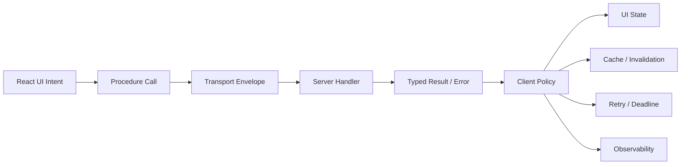
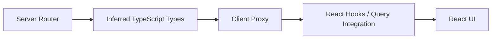
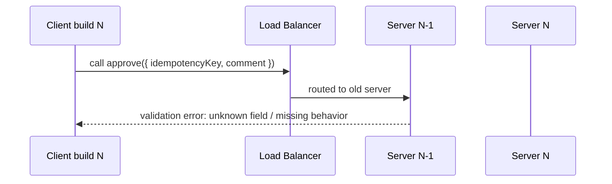
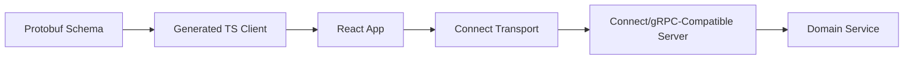
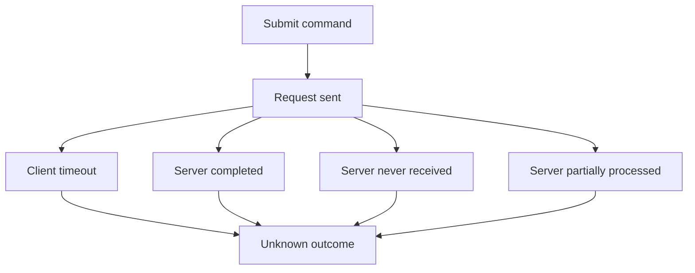
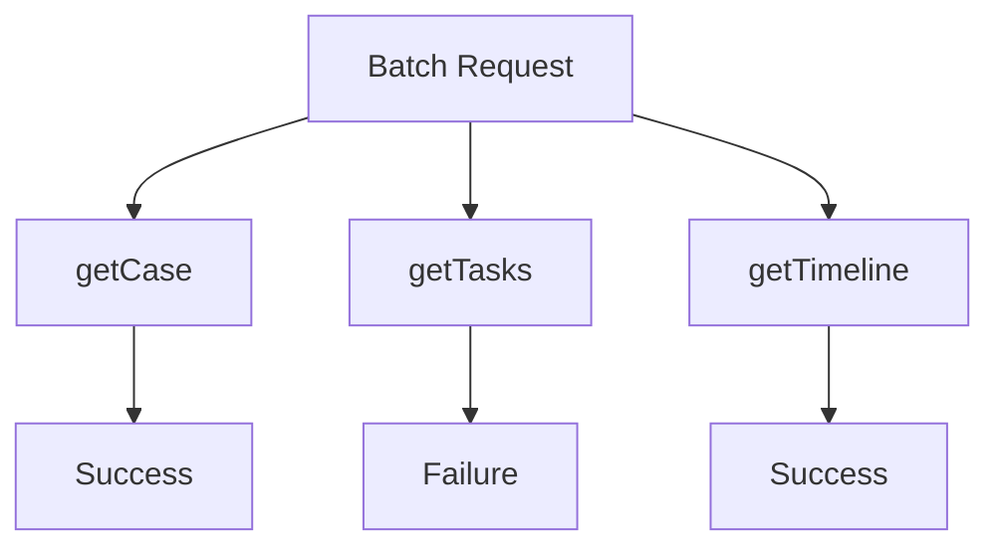
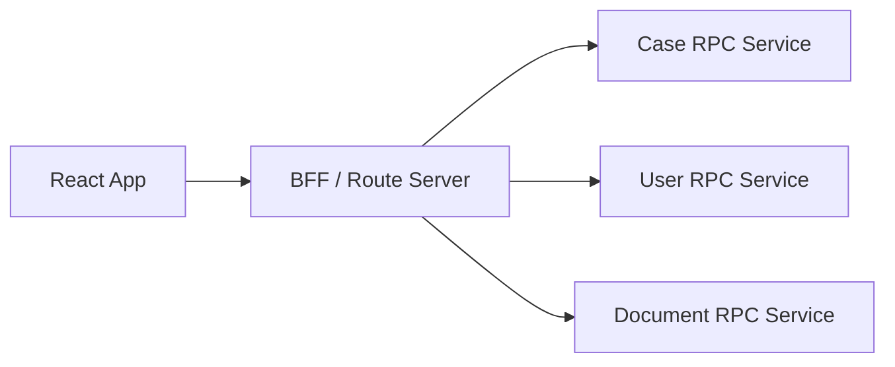

# Part 051 — RPC, tRPC, gRPC-Web, and Connect-Style APIs

REST exposes resources.

GraphQL exposes a graph.

RPC exposes operations.

That sentence is useful, but dangerous. It makes RPC sound like “just call a backend function from React”. That mental model is exactly where many React client-server systems become tightly coupled, hard to cache, hard to observe, hard to evolve, and easy to break.

RPC can be excellent. It can also become distributed spaghetti.

The difference is whether you treat RPC as a **remote protocol contract**, not a local function call.



The API may look like:

```ts
await client.case.assign.mutate({ caseId, assigneeId });
```

But semantically it is still:

- a network request,
- with latency,
- partial failure,
- authentication and authorization,
- validation,
- compatibility constraints,
- retry rules,
- observability obligations,
- and a product-visible outcome.

The top 1% skill is not knowing the RPC library syntax. It is preserving distributed-system discipline even when the library makes remote calls feel local.

---

## 1. What RPC Means in Frontend Architecture

RPC stands for **Remote Procedure Call**.

In frontend terms, RPC means the client invokes a named backend operation:

```ts
const result = await api.getCase({ id: 'case_123' });
await api.approveCase({ id: 'case_123', comment: 'Looks good' });
```

Instead of modeling every interaction as a URL resource, RPC models interactions as operations.

```mermaid
flowchart TD
  REST[REST-style]
  RPC[RPC-style]
  GQL[GraphQL-style]

  REST --> RESTShape[GET /cases/123<br/>PATCH /cases/123<br/>POST /cases/123/assignments]
  RPC --> RPCShape[getCase(input)<br/>updateCase(input)<br/>assignCase(input)]
  GQL --> GQLShape[query Case($id)<br/>mutation AssignCase]
```

RPC is not inherently worse or better than REST. It optimizes for different forces.

RPC tends to be strong when:

- operations are command-like,
- contract is shared strongly between client and server,
- generated clients are desired,
- backend service boundaries already expose RPC,
- requests are not naturally cacheable resources,
- strict schema evolution is valuable,
- low-boilerplate full-stack DX matters.

RPC tends to be weak when:

- resource cacheability is central,
- public API discoverability matters,
- clients are heterogeneous and loosely coupled,
- HTTP semantics should remain visible,
- operations become tiny backend method leaks,
- the team treats remote calls like local functions.

The problem is not RPC. The problem is **location transparency**.

A local function call and a remote procedure call have similar syntax but radically different failure models.

---

## 2. The Location-Transparency Trap

This is safe:

```ts
const total = calculateTotal(items);
```

This is not equivalent:

```ts
const total = await billing.calculateTotal({ items });
```

The second operation can fail because:

- the user went offline,
- request timed out,
- server deployed an incompatible contract,
- auth token expired,
- request was accepted but response was lost,
- the server partially completed side effects,
- rate limit was exceeded,
- validation changed,
- observability correlation was missing,
- backend version routed differently by region.

RPC frameworks often make the callsite elegant. Elegant callsites are useful. But the system still needs explicit policy.

A production RPC client must answer:

- Is this operation read or write?
- Is it idempotent?
- Is retry allowed?
- What is the deadline?
- What is the error shape?
- What cache entries become invalid?
- What trace/span names are emitted?
- What user-visible state appears during pending/failure?
- What happens if the tab closes mid-call?
- What happens if the server completes but response never arrives?

If the callsite hides all of this, you did not remove complexity. You moved it somewhere nobody reviews.

---

## 3. RPC Shape Taxonomy

In React client-server communication, most RPC calls fall into five categories.

| Category | Example | Cacheable? | Retry? | UI Semantics |
|---|---|---:|---:|---|
| Query-like RPC | `getCase({ id })` | Usually yes via app cache | Usually yes | Read model |
| Command RPC | `approveCase({ id })` | No | Only with idempotency | Mutation outcome |
| Workflow RPC | `submitForReview({ id })` | No | Carefully | State transition |
| Computation RPC | `quotePremium(input)` | Sometimes | Often yes | Derived calculation |
| Stream RPC | `subscribeCaseEvents(input)` | Not as snapshot | Reconnect policy | Realtime state |

The client must not treat these equally.

A read-like RPC can often be wrapped in `useQuery`.

A command RPC belongs in `useMutation`, route action, server action, or explicit command handler.

A workflow RPC requires domain-level outcome modeling.

A streaming RPC requires lifecycle, cleanup, reconnect, ordering, and backpressure decisions.

---

## 4. tRPC Mental Model

`tRPC` is popular because it gives TypeScript full-stack teams end-to-end type inference without writing OpenAPI or GraphQL schemas manually.

The attractive property:

```ts
// Server router type drives client call types.
const user = await trpc.user.byId.query({ id: 'u_123' });
```

The client knows input and output types inferred from server definitions.



This is excellent for monorepos and full-stack TypeScript systems.

But there is a key architectural constraint:

> tRPC couples the client contract to the server TypeScript router shape.

That may be fine. It may even be the right choice. But it is not the same governance model as OpenAPI, GraphQL SDL, or Protobuf.

Use tRPC when:

- frontend and backend are in the same TypeScript product boundary,
- deployment cadence is coordinated,
- public external client support is not the primary concern,
- schema generation overhead would be wasteful,
- product iteration speed matters more than long-term multi-language contracts,
- the team can enforce version compatibility at build/deploy time.

Be cautious when:

- third-party clients depend on the API,
- backend is not TypeScript,
- mobile clients need independent versioning,
- API compatibility must be negotiated across many versions,
- regulatory/audit process requires explicit contract artifacts,
- teams deploy frontend/backend independently with long skew windows.

---

## 5. tRPC Procedure Kinds

Conceptually, tRPC exposes procedures such as:

- queries,
- mutations,
- subscriptions.

Even if the framework names them that way, your architecture still needs domain semantics.

```ts
export const caseRouter = router({
  byId: publicProcedure
    .input(z.object({ caseId: z.string() }))
    .query(async ({ input, ctx }) => {
      return ctx.caseService.getCase(input.caseId);
    }),

  approve: protectedProcedure
    .input(z.object({
      caseId: z.string(),
      comment: z.string().max(1000),
      idempotencyKey: z.string(),
    }))
    .mutation(async ({ input, ctx }) => {
      return ctx.caseWorkflow.approve(input);
    }),
});
```

The important distinction is not syntax. It is policy:

```ts
const caseQuery = trpc.case.byId.useQuery(
  { caseId },
  {
    staleTime: 30_000,
    retry: 2,
  }
);

const approveMutation = trpc.case.approve.useMutation({
  onSuccess: () => {
    utils.case.byId.invalidate({ caseId });
    utils.case.timeline.invalidate({ caseId });
  },
});
```

The query has freshness policy. The mutation has invalidation policy. Both need error policy.

---

## 6. tRPC Strengths

### 6.1 Type Inference Without Code Generation

The biggest ergonomic win is that client types are inferred from server router types.

That eliminates many duplicated DTO definitions.

But inference is not runtime validation on the wire. Server input validation still matters, commonly with a schema library.

### 6.2 Excellent Full-Stack Refactorability

Renaming a server procedure or changing input shape can break the client at compile time.

This is powerful in a monorepo.

### 6.3 Good Fit with React Query

Many tRPC React integrations sit naturally on top of query/mutation semantics.

This gives you:

- cache keys,
- invalidation,
- optimistic updates,
- retries,
- background refetch,
- error boundaries,
- SSR hydration patterns.

### 6.4 Low Contract Ceremony

For internal product surfaces, avoiding OpenAPI/GraphQL/Protobuf boilerplate can be a net win.

A small team shipping a full-stack TypeScript admin app can move very fast.

---

## 7. tRPC Weaknesses and Failure Modes

### 7.1 Contract Artifact Weakness

A TypeScript router type is not always a stable standalone contract.

If another platform wants to consume the API, tRPC may be less convenient than OpenAPI, GraphQL, or Protobuf.

### 7.2 Tight Version Coupling

If frontend and backend are deployed independently, a client built against router version N may call server version N-1 or N+1.

You still need compatibility discipline.



### 7.3 HTTP Semantics Can Become Invisible

If every operation is just a procedure, engineers may forget:

- cacheability,
- idempotency,
- status mapping,
- `Retry-After`,
- browser policy,
- CDN behavior,
- tracing conventions.

### 7.4 Procedure Explosion

RPC APIs often drift into one procedure per button:

```ts
approveFromDashboard()
approveFromDetailPage()
approveFromBulkPage()
approveFromEscalationQueue()
```

That is usually a smell.

The product action is one domain command with multiple UI entry points.

### 7.5 Hidden Authorization Coupling

Because the call looks like a server method, teams sometimes put authorization too close to handler implementation and too far from contract review.

Every RPC method is still an externally callable boundary.

---

## 8. Production tRPC Design Rules

Use these rules if adopting tRPC at scale.

### Rule 1 — Treat Routers as Public Boundaries

Even if only your React app calls them, router procedures are still network-accessible contracts.

Name them as domain operations, not component operations.

Good:

```ts
case.approve
case.assign
case.requestMoreInformation
case.timeline
```

Bad:

```ts
case.detailPageApproveButton
case.modalSave
case.rightPanelData
```

### Rule 2 — Keep Input DTOs Stable and Explicit

Avoid passing arbitrary component state.

Good:

```ts
type ApproveCaseInput = {
  caseId: CaseId;
  decisionVersion: number;
  comment?: string;
  idempotencyKey: string;
};
```

Bad:

```ts
type ApproveInput = typeof formState;
```

### Rule 3 — Model Domain Errors

Do not make every failure a generic thrown exception.

```ts
type ApproveCaseErrorCode =
  | 'CASE_NOT_FOUND'
  | 'CASE_ALREADY_CLOSED'
  | 'VERSION_CONFLICT'
  | 'MISSING_PERMISSION'
  | 'VALIDATION_FAILED';
```

### Rule 4 — Separate Read Procedures from Command Procedures

A read procedure can be cached. A command procedure changes server state.

Do not put side effects in query procedures.

### Rule 5 — Use Idempotency Keys for Risky Mutations

Especially for:

- payments,
- approvals,
- submissions,
- escalation transitions,
- task assignment,
- document generation,
- workflow state transitions.

### Rule 6 — Define Invalidation Per Mutation

Every command should declare its cache impact.

```ts
const mutationImpact = {
  'case.approve': [
    ['case.byId'],
    ['case.timeline'],
    ['case.queue'],
    ['case.metrics'],
  ],
};
```

### Rule 7 — Observe Procedure Names

Emit operation name, duration, result category, retry count, and correlation ID.

A production incident should not require guessing which remote procedure failed.

---

## 9. gRPC-Web Mental Model

Standard gRPC is widely used for backend-to-backend communication. It uses Protocol Buffers and HTTP/2 semantics.

Browsers cannot use native gRPC directly in the same way backend services do, because browser networking APIs do not expose the full HTTP/2 feature set needed by standard gRPC.

`gRPC-Web` adapts gRPC-like clients for browser environments.


The usual model:

- define `.proto` service,
- generate JavaScript/TypeScript client code,
- React app calls generated methods,
- proxy translates gRPC-Web to backend gRPC when needed,
- errors use gRPC status model,
- messages use Protobuf binary or text format depending on setup.

Example `.proto`:

```proto
syntax = "proto3";

package enforcement.v1;

service CaseService {
  rpc GetCase(GetCaseRequest) returns (Case) {}
  rpc ApproveCase(ApproveCaseRequest) returns (ApproveCaseResponse) {}
}

message GetCaseRequest {
  string case_id = 1;
}

message ApproveCaseRequest {
  string case_id = 1;
  int64 expected_version = 2;
  string comment = 3;
  string idempotency_key = 4;
}
```

The contract is schema-first.

---

## 10. Protobuf Contract Discipline

Protobuf has different evolution rules than JSON.

Field numbers matter.

```proto
message Case {
  string id = 1;
  string title = 2;
  CaseStatus status = 3;
  int64 version = 4;
}
```

Changing a field name may be less dangerous than changing a field number or type.

Production rules:

- never reuse field numbers,
- reserve removed field numbers,
- prefer additive changes,
- model unknown enum values safely,
- avoid required-style assumptions in proto3 clients,
- document default value semantics,
- version packages when compatibility breaks.

```proto
message Case {
  reserved 5, 8;
  reserved "old_owner_id";

  string id = 1;
  string title = 2;
  CaseStatus status = 3;
  int64 version = 4;
  string assignee_id = 6;
}
```

In React, Protobuf-generated objects should often be mapped into view models.

Do not let wire models leak everywhere.

---

## 11. gRPC Status vs HTTP Status

gRPC has its own status code model:

- `OK`,
- `INVALID_ARGUMENT`,
- `NOT_FOUND`,
- `PERMISSION_DENIED`,
- `UNAUTHENTICATED`,
- `ABORTED`,
- `FAILED_PRECONDITION`,
- `UNAVAILABLE`,
- `DEADLINE_EXCEEDED`,
- etc.

React UI needs domain mapping.

| gRPC Status | Typical Meaning | UI Mapping |
|---|---|---|
| `UNAUTHENTICATED` | Session missing/expired | Sign-in recovery |
| `PERMISSION_DENIED` | Authenticated but forbidden | Access denied surface |
| `INVALID_ARGUMENT` | Input validation failed | Field/form error |
| `NOT_FOUND` | Resource missing or hidden | Not found or access-safe not found |
| `FAILED_PRECONDITION` | State does not allow operation | Domain message |
| `ABORTED` | Concurrency conflict | Refresh/retry workflow |
| `UNAVAILABLE` | Service temporarily unavailable | Retry/backoff or degraded state |
| `DEADLINE_EXCEEDED` | Timeout | Retry or tell user operation is slow |

Do not show raw gRPC statuses directly to users.

The status is a transport/protocol fact. The user needs a product fact.

---

## 12. gRPC-Web Strengths

### 12.1 Strong Multi-Language Contract

Protobuf works across languages and platforms.

This matters when:

- backend services are polyglot,
- mobile apps share the same contract,
- generated clients are desired,
- schema evolution is tightly governed,
- backend already uses gRPC internally.

### 12.2 Efficient Binary Encoding

Protobuf can be compact and fast.

For browser apps, this matters most when:

- payloads are large,
- mobile network cost matters,
- high-frequency calls exist,
- CPU parsing cost is acceptable relative to payload reduction.

Do not assume Protobuf automatically improves user experience. Bundle size, generated client size, tooling complexity, and debuggability also matter.

### 12.3 Strong Service Boundaries

A service method in `.proto` is an explicit contract.

That can be valuable in regulated or multi-team environments.

---

## 13. gRPC-Web Weaknesses

### 13.1 Browser Fit Is Not Native gRPC

gRPC-Web exists because browser networking is constrained.

This adds operational concerns:

- proxy configuration,
- CORS,
- headers/trailers behavior,
- streaming limitations,
- error translation,
- debugging difficulty.

### 13.2 DevTools Inspectability

Binary Protobuf payloads are less immediately inspectable than JSON.

This matters during incident debugging and onboarding.

Mitigations:

- enable structured client logging with redaction,
- expose operation names,
- include trace IDs,
- use tooling that decodes messages,
- keep domain error objects clear.

### 13.3 Generated Client Weight

Generated clients can increase bundle size.

You must measure:

- generated code size,
- tree-shaking quality,
- polyfills,
- Protobuf runtime cost,
- code-splitting boundaries.

### 13.4 Method-Centric Modeling

Like all RPC, gRPC can drift into backend implementation leakage.

A method should represent a stable product operation or service capability, not an internal function.

---

## 14. Connect-Style APIs Mental Model

Connect-style APIs attempt to keep Protobuf/RPC benefits while making browser and HTTP usage simpler.

The important architectural idea:

> Use schema-first Protobuf service definitions, but expose a protocol that remains friendly to ordinary HTTP clients and browser fetch-style primitives.



Connect-style systems often support:

- Protobuf schemas,
- generated TypeScript clients,
- browser-compatible transports,
- JSON and binary encodings depending on protocol/client,
- gRPC/gRPC-Web interoperability in supported stacks,
- more direct HTTP debugging than traditional gRPC-Web setups.

This is attractive for teams that want Protobuf contracts without making the browser experience miserable.

---

## 15. Connect-Style Client Example

A typical React integration still needs query/mutation ownership.

```ts
import { createPromiseClient } from '@connectrpc/connect';
import { createConnectTransport } from '@connectrpc/connect-web';
import { CaseService } from './gen/enforcement/v1/case_connect';

const transport = createConnectTransport({
  baseUrl: '/api',
});

export const caseClient = createPromiseClient(CaseService, transport);
```

Read procedure:

```ts
export function useCase(caseId: string) {
  return useQuery({
    queryKey: ['case', 'byId', { caseId }],
    queryFn: ({ signal }) =>
      caseClient.getCase({ caseId }, { signal }),
    staleTime: 30_000,
  });
}
```

Command procedure:

```ts
export function useApproveCase() {
  const queryClient = useQueryClient();

  return useMutation({
    mutationFn: (input: {
      caseId: string;
      expectedVersion: bigint;
      comment?: string;
      idempotencyKey: string;
    }) => caseClient.approveCase(input),

    onSuccess: (_result, input) => {
      queryClient.invalidateQueries({
        queryKey: ['case', 'byId', { caseId: input.caseId }],
      });
      queryClient.invalidateQueries({
        queryKey: ['case', 'timeline', { caseId: input.caseId }],
      });
    },
  });
}
```

The client syntax is generated. The architectural responsibilities remain yours.

---

## 16. RPC and React Query

For read-style RPC, React Query is often the right cache engine.

```ts
function useCaseSummary(caseId: string) {
  return useQuery({
    queryKey: ['rpc', 'caseService.getSummary', { caseId }],
    queryFn: ({ signal }) => rpc.caseService.getSummary({ caseId }, { signal }),
    staleTime: 60_000,
    retry: (failureCount, error) => isRetryableRpcError(error) && failureCount < 2,
  });
}
```

For mutation-style RPC:

```ts
function useEscalateCase() {
  const queryClient = useQueryClient();

  return useMutation({
    mutationFn: (command: EscalateCaseCommand) =>
      rpc.caseWorkflow.escalate(command),

    onSuccess: (_, command) => {
      invalidateCaseImpact(queryClient, command.caseId);
    },
  });
}
```

Do not let the RPC framework bypass your server-state architecture.

You still need:

- query keys,
- cache scope,
- stale policy,
- invalidation,
- optimistic update policy,
- retry policy,
- cancellation,
- error mapping.

---

## 17. RPC and Route Actions

RPC can also sit behind route actions.

```ts
export async function action({ request, params }: Route.ActionArgs) {
  const formData = await request.formData();

  const command = parseApproveCaseForm(formData, params.caseId);

  const result = await caseRpc.approveCase(command);

  return redirect(`/cases/${result.caseId}`);
}
```

This keeps the form workflow progressive and route-owned while using RPC underneath.

Good fit:

- form submissions,
- workflow commands,
- redirect-after-POST,
- server-side validation,
- route-level revalidation.

Poor fit:

- highly interactive local optimistic widgets,
- background polling,
- realtime stream lifecycle,
- client-only previews.

The API style does not dictate the React integration style.

---

## 18. RPC Error Envelope Design

A production RPC client should normalize protocol errors into a frontend error model.

```ts
type RpcClientError = {
  kind: 'rpc_error';
  protocol: 'trpc' | 'grpc-web' | 'connect';
  operation: string;
  status: string;
  domainCode?: string;
  message: string;
  fieldErrors?: Record<string, string[]>;
  retryable: boolean;
  correlationId?: string;
  cause?: unknown;
};
```

Then UI code branches on stable categories:

```ts
function renderMutationError(error: RpcClientError) {
  switch (error.domainCode) {
    case 'VERSION_CONFLICT':
      return 'This case changed while you were editing. Refresh and try again.';
    case 'MISSING_PERMISSION':
      return 'You do not have permission to perform this action.';
    case 'VALIDATION_FAILED':
      return 'Please fix the highlighted fields.';
    default:
      return 'The operation could not be completed.';
  }
}
```

Do not spread library-specific errors throughout components.

Contain them at the API boundary.

---

## 19. Deadline and Cancellation for RPC

RPC calls need deadlines.

A timeout is a local client choice. A deadline is a contract for how long the operation is useful.

```ts
async function withDeadline<T>(
  operation: string,
  timeoutMs: number,
  call: (signal: AbortSignal) => Promise<T>
): Promise<T> {
  const controller = new AbortController();
  const timer = setTimeout(() => {
    controller.abort(new DOMException(`${operation} timed out`, 'TimeoutError'));
  }, timeoutMs);

  try {
    return await call(controller.signal);
  } finally {
    clearTimeout(timer);
  }
}
```

For read-like RPC:

- cancellation usually means the result is no longer needed.

For command RPC:

- cancellation does not prove the server did not execute the command.

This difference is critical.

If a mutation times out, the state is ambiguous:



Use idempotency keys and reconciliation queries for risky commands.

---

## 20. Retry Policy for RPC

Never retry just because a call failed.

Retry depends on:

- operation type,
- idempotency,
- error status,
- request replayability,
- deadline remaining,
- server `Retry-After` equivalent,
- user intent.

Read-like RPC retry policy:

```ts
function shouldRetryRead(error: RpcClientError, attempt: number): boolean {
  if (attempt >= 2) return false;
  return error.retryable && ['UNAVAILABLE', 'DEADLINE_EXCEEDED'].includes(error.status);
}
```

Command RPC retry policy:

```ts
function shouldRetryCommand(
  error: RpcClientError,
  command: { idempotencyKey?: string },
  attempt: number
): boolean {
  if (!command.idempotencyKey) return false;
  if (attempt >= 1) return false;
  return error.retryable && error.status === 'UNAVAILABLE';
}
```

For workflow systems, automatic retry may be less safe than surfacing “checking status” and reconciling from server.

---

## 21. Idempotency for Command RPC

RPC makes commands feel natural. That increases the risk of duplicate side effects.

Every high-value command should carry an idempotency key.

```ts
type ApproveCaseCommand = {
  caseId: string;
  expectedVersion: number;
  comment?: string;
  idempotencyKey: string;
};
```

Server-side invariant:

```text
same actor + same command type + same idempotency key
  => same persisted outcome or same terminal error
```

Client-side rule:

- generate idempotency key before sending,
- keep it stable across retry,
- do not regenerate on timeout retry,
- store it in pending local command state if needed,
- reconcile final state from server.

This is not specific to REST or RPC. It is distributed mutation hygiene.

---

## 22. Streaming RPC in React

Some RPC systems support streaming.

Streaming changes the lifecycle.

A unary call:

```text
request -> response -> done
```

A stream:

```text
request -> message -> message -> message -> error/done/reconnect
```

React integration needs:

- subscription lifetime,
- cleanup on unmount,
- reconnect policy,
- message ordering,
- deduplication,
- resume cursor,
- backpressure strategy,
- visibility/offline behavior,
- cache reconciliation.

Example adapter:

```ts
type CaseEvent =
  | { type: 'case.updated'; caseId: string; version: number }
  | { type: 'comment.added'; caseId: string; commentId: string }
  | { type: 'task.assigned'; caseId: string; taskId: string };

function useCaseEventStream(caseId: string) {
  const queryClient = useQueryClient();

  useEffect(() => {
    const controller = new AbortController();

    async function run() {
      for await (const event of rpc.caseEvents.subscribe({ caseId }, { signal: controller.signal })) {
        applyCaseEvent(queryClient, event as CaseEvent);
      }
    }

    run().catch((error) => {
      if (!controller.signal.aborted) {
        reportStreamError(error);
      }
    });

    return () => controller.abort();
  }, [caseId, queryClient]);
}
```

Important: a stream message is not automatically the source of truth. It may be a hint that tells the client to patch or invalidate.

---

## 23. RPC Cache Strategy

RPC has no built-in resource cache model unless the framework/protocol exposes one.

So application cache identity must be explicit.

Good query key:

```ts
['caseService.getCase', { tenantId, caseId, projection: 'detail' }]
```

Bad query key:

```ts
['getCase', caseId]
```

Why bad?

- missing tenant,
- missing projection,
- ambiguous service boundary,
- may collide with other APIs,
- hard to invalidate by domain.

For RPC, use query keys that include:

- service or domain,
- operation,
- stable input identity,
- auth/tenant scope if relevant,
- representation/projection if relevant,
- version if contract changes persisted cache shape.

---

## 24. RPC Observability

Every RPC client wrapper should emit structured events.

```ts
type RpcTelemetryEvent = {
  operation: string;
  protocol: 'trpc' | 'grpc-web' | 'connect';
  attempt: number;
  durationMs: number;
  outcome: 'success' | 'error' | 'timeout' | 'abort';
  status?: string;
  retryable?: boolean;
  correlationId?: string;
};
```

Do not log raw payloads by default.

Log:

- operation name,
- result category,
- duration,
- payload size bucket,
- retry count,
- cache hit/miss if applicable,
- trace ID,
- app version,
- route/screen,
- tenant/user hash if allowed,
- error code.

For regulated systems, observable operation names are useful for auditability.

But avoid exposing sensitive details in client logs.

---

## 25. Security Boundary

RPC endpoints are not private because the UI “only calls them internally”.

Every procedure is an HTTP-reachable boundary.

Security checklist:

- authenticate every protected procedure,
- authorize every object access,
- validate every input server-side,
- enforce tenant scope on server,
- avoid trusting client-generated role/permission flags,
- use CSRF protection when cookie credentials are used,
- constrain batch endpoints,
- rate-limit high-cost operations,
- prevent procedure enumeration leaks where relevant,
- redact errors,
- avoid returning internal stack traces,
- audit high-risk commands.

In tRPC especially, do not confuse TypeScript type safety with trust.

Types do not stop malicious clients from sending arbitrary HTTP requests.

---

## 26. RPC and Batching

Some RPC systems support batching multiple calls into one HTTP request.

Batching can reduce overhead but creates new failure semantics.



Questions:

- Can one operation fail independently?
- Does the batch have one auth context?
- Does retry retry all calls or only failed calls?
- Does batching hide waterfall or create head-of-line blocking?
- Are observability spans per operation or per batch?
- Can a heavy operation delay small operations?

Do not batch blindly.

Batch when:

- requests are small and independent,
- server supports partial results clearly,
- latency overhead dominates,
- observability remains per operation,
- retry semantics are explicit.

Avoid batch when:

- operations have different deadlines,
- one operation is high-cost,
- authorization differs,
- partial failure UX is complex,
- it hides bad data modeling.

---

## 27. RPC and API Gateway/BFF

RPC can be exposed directly to the browser, or hidden behind a Backend-for-Frontend.



Use BFF when:

- browser should not know internal service topology,
- multiple backend calls must be composed,
- secrets must remain server-side,
- payloads need UI-specific shaping,
- authorization requires server-side policy composition,
- backend RPC services are too chatty for frontend use.

Direct browser-to-RPC can work when:

- the RPC API is specifically designed as frontend API,
- auth/browser policy is handled well,
- client generation and versioning are governed,
- latency benefit matters,
- backend service boundary matches product boundary.

Most large systems eventually distinguish internal RPC from frontend RPC.

---

## 28. RPC Versioning

Versioning depends on contract style.

### tRPC

Common options:

- deploy frontend/backend together,
- keep backward-compatible procedures during rollout,
- add optional input fields,
- avoid removing procedures until all clients updated,
- version routers for long-lived clients.

### gRPC/Connect with Protobuf

Common options:

- additive fields,
- reserved removed fields,
- package versioning (`enforcement.v1`, `enforcement.v2`),
- enum evolution rules,
- generated client version pins,
- schema compatibility checks in CI.

### All RPC

Always handle client/server skew.

A browser tab can remain open across deployments. A mobile WebView may cache assets. A CDN may serve old JS. A service worker may serve stale bundles.

Your API must tolerate skew.

---

## 29. RPC Testing Strategy

You need multiple test layers.

### Contract Tests

Verify client expectations match server contract.

For Protobuf:

- schema compatibility checks,
- generated code compilation,
- golden serialization tests.

For tRPC:

- router type compile checks,
- input validation tests,
- integration tests against handler.

### Client Boundary Tests

Test the RPC wrapper:

- success mapping,
- error mapping,
- retry policy,
- timeout,
- abort,
- correlation ID propagation,
- redaction.

### Component Tests

Use mocks at the API boundary, not random fetch stubs buried inside components.

```ts
const rpcMock = createMockCaseRpc({
  getCase: async () => caseFixture,
  approveCase: async () => ({ caseId, version: 3 }),
});
```

### Failure Tests

Test:

- timeout after server accepted command,
- version conflict,
- permission denied,
- validation error,
- transient unavailable,
- duplicated idempotency key,
- old client/new server skew,
- new client/old server skew.

---

## 30. RPC Decision Matrix

| Criterion | tRPC | gRPC-Web | Connect-style |
|---|---|---|---|
| Best language fit | TypeScript full-stack | Polyglot Protobuf | Polyglot Protobuf + web-friendly TS |
| Contract artifact | Server router/types | `.proto` | `.proto` |
| Browser friendliness | High | Medium | High |
| Public API fit | Usually lower | Medium/high with tooling | Medium/high |
| Multi-language clients | Low | High | High |
| DX speed | Very high in TS monorepo | Medium | Medium/high |
| Debuggability | High-ish JSON/RPC depending config | Lower with binary/proxy | Higher if JSON protocol used |
| Schema governance | TypeScript/router discipline | Strong Protobuf discipline | Strong Protobuf discipline |
| Infra complexity | Low/medium | Medium/high | Medium |
| Cacheability | App-level | App-level | App-level |

This table is not a universal ranking.

It is a pressure map.

---

## 31. Anti-Patterns

### Anti-Pattern 1 — Component-Named Procedures

```ts
getDashboardLeftPanelData()
submitModalStepTwo()
```

This couples API contract to UI layout.

Prefer domain operations and view-model aggregations with explicit ownership.

### Anti-Pattern 2 — “Types Mean Safe”

Compile-time types do not validate malicious runtime input.

Server validation remains mandatory.

### Anti-Pattern 3 — Retrying Mutations Without Idempotency

This creates duplicate side effects.

### Anti-Pattern 4 — No Error Contract

Raw exceptions leak implementation details and make UI branching brittle.

### Anti-Pattern 5 — Hidden Cache Impact

Every command should have an explicit invalidation or reconciliation policy.

### Anti-Pattern 6 — One RPC per Backend Method

Frontend APIs should serve product workflows, not expose internal service internals.

### Anti-Pattern 7 — Ignoring Deployment Skew

Generated clients do not remove the old-client/new-server problem.

---

## 32. Build a Thin RPC Boundary

Avoid importing generated clients everywhere.

Create a product API boundary.

```ts
// infrastructure/rpc/caseRpc.ts
export type CaseApi = {
  getCase(input: GetCaseInput, options?: RequestOptions): Promise<CaseView>;
  approveCase(input: ApproveCaseCommand): Promise<ApproveCaseResult>;
};
```

Then implement with tRPC/gRPC/Connect underneath.

```ts
export const caseApi: CaseApi = {
  async getCase(input, options) {
    const response = await generatedCaseClient.getCase(input, options);
    return mapCaseToView(response);
  },

  async approveCase(input) {
    try {
      return await generatedCaseClient.approveCase(input);
    } catch (error) {
      throw normalizeRpcError('case.approveCase', error);
    }
  },
};
```

React components depend on `CaseApi` semantics, not transport mechanics.

Benefits:

- easier tests,
- easier migration,
- consistent errors,
- DTO mapping,
- observability injection,
- security redaction,
- query key factories,
- generated-client churn containment.

---

## 33. Practical Architecture Template

```text
src/
  api/
    case/
      caseApi.ts              # product API interface
      caseApi.connect.ts      # generated-client adapter
      caseApi.trpc.ts         # alternative adapter
      caseErrors.ts           # normalized error model
      caseKeys.ts             # query key factory
      caseInvalidation.ts     # mutation impact policy
      caseMappers.ts          # wire -> view model
  features/
    case-detail/
      useCaseDetail.ts
      ApproveCaseForm.tsx
  infrastructure/
    rpc/
      transport.ts
      telemetryInterceptor.ts
      deadlineInterceptor.ts
      authInterceptor.ts
      errorNormalizer.ts
```

This structure prevents transport-specific code from spreading through product UI.

---

## 34. Production Checklist

Before choosing or shipping RPC from React, answer:

- Is the API internal product API or external/public API?
- Are clients and servers deployed together?
- What is the skew window?
- Is the backend TypeScript, polyglot, or Protobuf-first?
- Is the contract artifact reviewable outside code?
- Are operation names stable and domain-oriented?
- Are reads and commands clearly separated?
- Are risky commands idempotent?
- Are errors normalized into product categories?
- Is retry policy per operation type?
- Are deadlines explicit?
- Is cancellation wired from React/Query/Router?
- Is cache impact declared for every command?
- Are generated clients wrapped behind product API modules?
- Is bundle size measured?
- Are auth, tenant scope, and CSRF handled?
- Is observability per procedure available?
- Are old-client/new-server and new-client/old-server cases tested?

---

## 35. Key Takeaways

RPC is an operation-oriented API style.

It is powerful when the contract and deployment model fit.

The invariants:

1. Remote procedure calls are not local function calls.
2. Read RPC and command RPC need different policies.
3. Type safety does not remove runtime validation.
4. Generated clients should be wrapped behind product API boundaries.
5. Mutation RPC needs idempotency and reconciliation.
6. Cache identity is application-defined.
7. Error normalization is mandatory for sane UI behavior.
8. Streaming RPC requires lifecycle and ordering discipline.
9. Version skew still exists even with generated clients.
10. API style must match organizational and operational constraints.

Part 052 turns REST, OpenAPI, GraphQL, tRPC, gRPC-Web, and Connect into a decision framework: how to choose an API style based on product shape, team topology, compatibility needs, performance, governance, and failure modes.

## References

- tRPC documentation: https://trpc.io/docs/
- gRPC-Web basics: https://grpc.io/docs/platforms/web/basics/
- gRPC-Web repository: https://github.com/grpc/grpc-web
- Connect RPC documentation: https://connectrpc.com/
- Connect for ECMAScript: https://github.com/connectrpc/connect-es
- Protocol Buffers language guide: https://protobuf.dev/programming-guides/proto3/
- TanStack Query mutations: https://tanstack.com/query/v5/docs/react/guides/mutations
- TanStack Query query cancellation: https://tanstack.com/query/v5/docs/react/guides/query-cancellation
