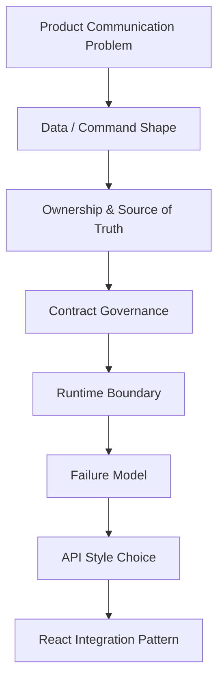
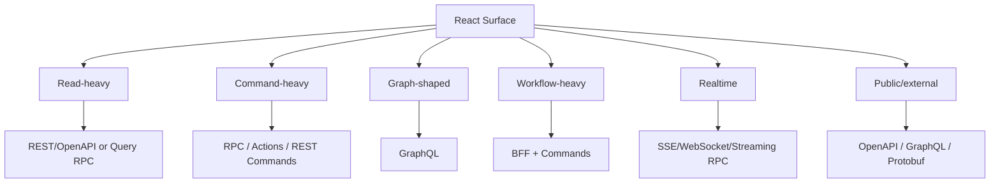
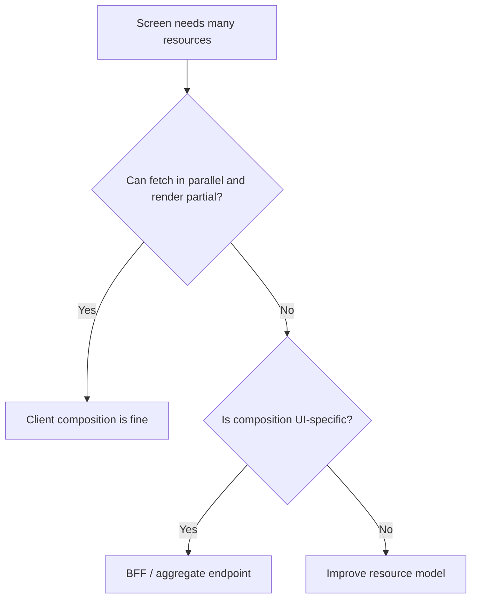
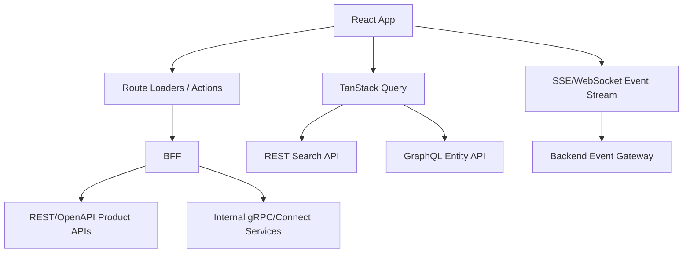
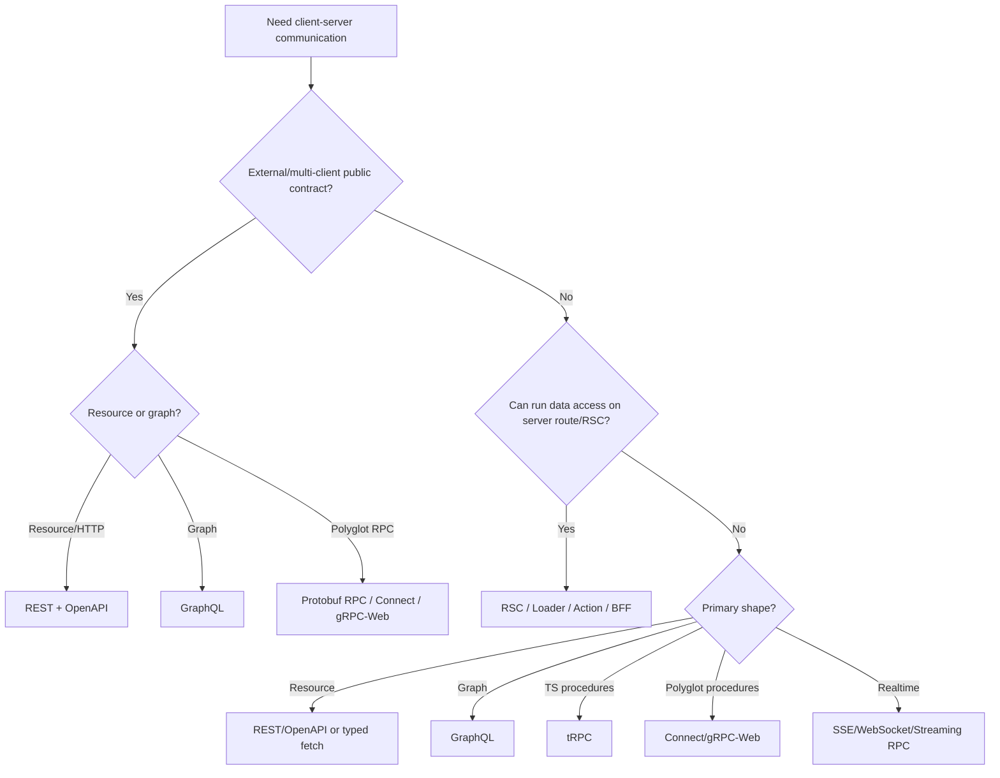
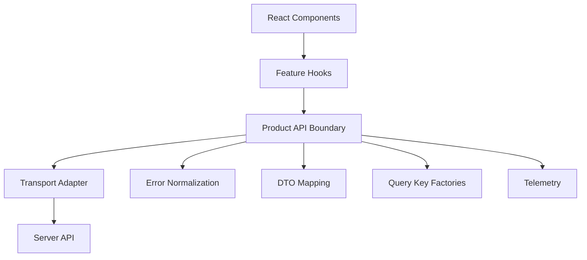
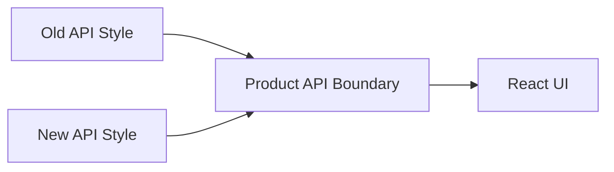

# Part 052 — API Style Decision Framework

API style debates often fail because they start with tools.

- “Should we use GraphQL?”
- “Should we generate OpenAPI clients?”
- “Should we use tRPC?”
- “Should we expose gRPC-Web?”
- “Should this be a Server Action?”

Those are not first questions.

The first question is:

> What communication problem does this product surface actually have?

A React app does not need an API style. It needs a reliable way to move intent, data, identity, errors, and state transitions across a runtime boundary.



This part gives you a decision framework.

Not a religion.

---

## 1. The Core Decision Axes

Every API style choice should be evaluated across these axes:

1. **Data shape** — resources, graph, procedures, commands, streams.
2. **Consumer shape** — one React app, many web apps, mobile, third-party, internal services.
3. **Contract governance** — informal TypeScript, OpenAPI, GraphQL SDL, Protobuf, versioned public API.
4. **Deployment coupling** — same repo/deploy vs independent release trains.
5. **Runtime boundary** — browser, BFF, server component, edge, internal service.
6. **Cache model** — HTTP cache, request cache, normalized entity cache, no cache.
7. **Mutation semantics** — CRUD, workflow command, long-running operation, event stream.
8. **Error model** — HTTP status, Problem Details, GraphQL errors, RPC status, domain result.
9. **Performance bottleneck** — latency, payload size, overfetching, waterfall, CPU, bundle size.
10. **Team topology** — frontend/backend ownership, platform team, product squads, external developers.

Most teams choose based on axis 1 and ignore the rest.

That is why API choices age badly.

---

## 2. First Classify the Surface

Before choosing a style, classify the surface.



A single product may have multiple surfaces.

Example regulatory case management platform:

| Surface | Shape | Likely Style |
|---|---|---|
| Case detail page | resource + graph | REST aggregate, GraphQL, or BFF |
| Case queue | list/search | REST/OpenAPI or query RPC |
| Approve/enforce/escalate | workflow command | RPC, Server Action, or REST command resource |
| Audit timeline | append-only events | REST list, GraphQL connection, or stream hint |
| Live collaboration | realtime | WebSocket/SSE/streaming RPC |
| External partner API | public contract | OpenAPI or GraphQL, sometimes Protobuf |
| Internal service mesh | backend-to-backend | gRPC/Connect |

There is no law that all surfaces need one style.

The dangerous architecture is not mixed style. The dangerous architecture is **unowned style**.

---

## 3. The API Style Map

| Style | Primary Abstraction | Strong At | Weak At |
|---|---|---|---|
| REST | Resource + representation | HTTP semantics, cacheability, broad compatibility | Complex graph composition, command-heavy workflows |
| OpenAPI | Contract description for HTTP APIs | Governance, generation, docs, external clients | Does not itself solve API modeling quality |
| GraphQL | Typed graph query/mutation/subscription | Client-shaped data, fragments, schema graph, normalized cache | Caching complexity, server cost, schema governance |
| tRPC | TypeScript procedures | Full-stack TS velocity, low ceremony | Multi-language/public contracts, independent skew |
| gRPC-Web | Protobuf RPC in browser | Strong polyglot contracts, backend gRPC alignment | Browser/proxy complexity, debuggability |
| Connect-style RPC | Protobuf RPC with web-friendly transport | Protobuf governance + browser ergonomics | Still RPC/cache/idempotency discipline required |
| BFF | Frontend-specific server composition | UI-shaped aggregation, security, orchestration | Extra server layer and ownership burden |
| Server Components | Server-side UI/data execution | Reducing client bundle and client fetch waterfalls | Framework coupling, serialization boundary |
| Server Functions/Actions | Client-triggered server functions | Form/workflow mutations | Compatibility, progressive enhancement, error contract |

This is not a ranking.

It is a topology map.

---

## 4. REST / OpenAPI Decision Heuristics

Choose REST/OpenAPI when:

- domain resources are clear,
- broad compatibility matters,
- HTTP caching matters,
- external consumers exist,
- generated clients/docs are required,
- API governance needs explicit review artifacts,
- consumers use multiple languages,
- browser/CDN/proxy semantics should remain transparent.

Example:

```http
GET /cases/CASE-123
GET /cases?status=open&assigneeId=U123
PATCH /cases/CASE-123
POST /cases/CASE-123/assignments
GET /cases/CASE-123/timeline
```

Pair with OpenAPI when:

- contract drift is expensive,
- mock servers are useful,
- API docs are part of delivery,
- clients are generated,
- CI can diff breaking changes,
- API review must be formal.

REST/OpenAPI is especially strong for:

- case detail,
- queues,
- CRUD-ish back office features,
- search endpoints,
- file metadata,
- external APIs,
- partner integrations.

Avoid naive REST when:

- every endpoint becomes `/doThing`,
- resource model is fake,
- frontend needs many resources per screen and creates waterfall,
- backend teams expose raw database tables,
- command workflows are forced into misleading CRUD semantics.

The point of REST is not pretty URLs. It is resource semantics, representation, constraints, and evolvable HTTP behavior.

---

## 5. REST Aggregate vs BFF

A common React performance problem:

```text
GET /cases/123
GET /cases/123/tasks
GET /cases/123/timeline
GET /users/u1
GET /documents?caseId=123
```

This may be fine if parallel and cached.

It may be terrible if:

- requests are sequential,
- each endpoint requires auth policy checks,
- payloads are fragmented,
- UI cannot render until all return,
- mobile latency is high,
- every screen repeats the same fan-out.

Decision:



Use a BFF/aggregate endpoint when the composition is genuinely UI-specific:

```http
GET /bff/case-detail/CASE-123
```

But do not create one BFF endpoint per component. Create stable screen/product read models.

---

## 6. GraphQL Decision Heuristics

Choose GraphQL when:

- data is graph-shaped,
- many components need overlapping entities,
- clients need to select fields,
- frontend teams own data requirements strongly,
- fragment colocation improves maintainability,
- normalized cache can pay off,
- schema governance is mature,
- overfetch/underfetch from REST is a persistent problem.

Example:

```graphql
query CaseDetail($id: ID!) {
  case(id: $id) {
    id
    status
    assignee { id name }
    tasks { id title status }
    timeline(first: 20) {
      edges {
        node { id type createdAt actor { id name } }
      }
    }
  }
}
```

GraphQL is strong when UI composition mirrors graph traversal.

It is weak when:

- domain is mostly simple resources,
- backend cannot control query cost,
- auth rules are object/field complex but not well-modeled,
- cache normalization policy is not owned,
- schema becomes a dumping ground,
- every mutation is just an RPC with vague payloads,
- team lacks tooling for persisted operations, codegen, and complexity limits.

GraphQL does not eliminate backend design. It moves the design into schema, resolvers, directives/policies, cost controls, and cache conventions.

---

## 7. GraphQL vs REST Aggregate

For a case detail page, both are plausible.

### GraphQL Approach

```graphql
query CaseDetail($id: ID!) {
  case(id: $id) {
    id
    title
    status
    assignee { id name }
    tasks { id title }
    timeline(first: 20) { edges { node { id type } } }
  }
}
```

### REST/BFF Approach

```http
GET /case-detail/CASE-123
```

Both can return nearly identical JSON.

The difference is governance and flexibility.

Use GraphQL when:

- many surfaces reuse overlapping graph pieces,
- fragments/components drive data requirements,
- schema is long-lived and shared,
- client variability matters.

Use BFF aggregate when:

- one product surface needs a stable read model,
- backend wants tight control over payload and cost,
- schema flexibility is not worth runtime complexity,
- app is server-rendered or route-centric,
- regulatory/audit concerns favor explicit read models.

A BFF read model is often better for complex enterprise workflows where the screen itself is a defensible product artifact.

GraphQL is often better for large consumer/product surfaces with many reusable entity relationships and independently evolving clients.

---

## 8. tRPC Decision Heuristics

Choose tRPC when:

- frontend and backend are TypeScript,
- same organization owns both ends,
- monorepo or tightly coordinated builds exist,
- speed and refactorability matter,
- external public API is not primary,
- API surface is product-internal,
- team wants minimal contract ceremony,
- runtime validation remains enforced.

Good fit:

```ts
const result = await trpc.case.approve.mutate({
  caseId,
  expectedVersion,
  idempotencyKey,
});
```

Bad fit:

- third-party API ecosystem,
- non-TypeScript backend/client mix,
- independent mobile releases,
- long-lived clients with compatibility guarantees,
- public regulatory integrations requiring contract artifacts.

tRPC is not “less architectural”. It trades formal contract artifacts for TypeScript inference and repo coupling.

That trade is excellent in the right boundary and risky in the wrong one.

---

## 9. gRPC-Web / Connect Decision Heuristics

Choose gRPC-Web or Connect-style RPC when:

- organization is already Protobuf/gRPC-oriented,
- multiple languages consume the same API,
- generated clients are valuable,
- schema governance is strong,
- backend service contract alignment matters,
- binary encoding or streaming matters,
- browser-facing RPC is intentionally designed.

Prefer Connect-style APIs when:

- browser ergonomics matter,
- ordinary HTTP/debuggability matters,
- TypeScript generated clients should be idiomatic,
- you want Protobuf contracts without full gRPC-Web friction,
- server stack supports Connect well.

Prefer gRPC-Web when:

- existing backend is native gRPC,
- Envoy/proxy infrastructure is already standard,
- tooling and generated clients are accepted,
- frontend is one of many clients consuming Protobuf services.

Be cautious when:

- frontend team lacks Protobuf tooling experience,
- DevTools inspectability is critical,
- bundle size is tight,
- API is mostly public/simple HTTP resources,
- browser streaming requirements do not match protocol limits.

---

## 10. Server Components Decision Heuristics

React Server Components are not an API style in the REST/GraphQL/RPC sense.

They are a runtime placement model.

Choose Server Components when:

- data is needed to render mostly non-interactive UI,
- secrets/data access should remain server-side,
- reducing client JS matters,
- server can access data source efficiently,
- serialization boundary is manageable,
- framework supports RSC well,
- UI can be split into server and client islands.

Do not choose RSC just to avoid designing APIs.

RSC still requires:

- authorization,
- data ownership,
- serialization discipline,
- caching policy,
- error boundaries,
- streaming strategy,
- mutation/revalidation story.

RSC is powerful for eliminating client fetch waterfalls in server-rendered routes.

It is not a replacement for all client-server communication.

---

## 11. Server Functions / Actions Decision Heuristics

Use Server Functions/Actions for:

- form submissions,
- workflow commands,
- server-only mutations,
- route-local commands,
- progressive enhancement paths,
- cases where client should not own transport details.

Be cautious for:

- public external APIs,
- long-lived multi-client compatibility,
- highly interactive offline-first mutation queues,
- complex API governance across teams,
- mutations requiring explicit idempotency/reconciliation across independent clients.

Treat every Server Function as an RPC boundary.

It still needs:

- input validation,
- auth/authz,
- idempotency for risky commands,
- stable error result,
- audit trail,
- revalidation policy,
- deployment skew awareness.

---

## 12. The “One API Style” Fallacy

Large React systems usually need more than one communication style.

Example architecture:



This is not necessarily messy.

It becomes messy when:

- ownership is unclear,
- every team invents wrappers,
- error models differ randomly,
- auth behavior differs randomly,
- cache invalidation has no policy,
- observability cannot correlate operations,
- no one owns compatibility rules.

The goal is not one style.

The goal is one **communication architecture**.

---

## 13. Decision Tree

Use this tree as a first pass.



Then refine by deployment, cache, security, and team topology.

---

## 14. Contract Governance Matrix

| Requirement | Best Fit |
|---|---|
| Third-party developers need docs | OpenAPI or GraphQL |
| Polyglot generated clients | OpenAPI, GraphQL codegen, Protobuf |
| Strong backend service contract | Protobuf / gRPC / Connect |
| Fast full-stack TS refactor | tRPC |
| Client field selection | GraphQL |
| CDN/HTTP cache leverage | REST/OpenAPI |
| UI-specific aggregation | BFF / route loader / RSC |
| Form mutations | Route actions / Server Actions / RPC command |
| Streaming event feed | SSE/WebSocket/streaming RPC |
| Audit-heavy workflow command | Explicit command API with idempotency |

No framework removes governance.

It only changes where governance lives.

---

## 15. Cache Model Matrix

| Cache Need | Good Fit | Notes |
|---|---|---|
| Browser/CDN HTTP cache | REST/OpenAPI | Requires good URL, headers, validators |
| Request-level server-state cache | REST, RPC, GraphQL | TanStack Query works well |
| Entity-level normalized cache | GraphQL | Needs stable identity and cache policies |
| Route-level data cache | React Router/framework | Good for URL-driven screens |
| Server-side render cache | RSC/SSR/BFF | Must isolate by user/tenant |
| No cache, command only | RPC/action/POST | Needs idempotency and reconciliation |
| Event-driven freshness | Any + SSE/WebSocket | Events patch or invalidate app cache |

When choosing API style, ask what cache model you actually need.

A cache strategy mismatch is more damaging than an API syntax mismatch.

---

## 16. Mutation Model Matrix

| Mutation Type | Good Fit | Required Discipline |
|---|---|---|
| Simple CRUD update | REST PATCH/PUT, RPC mutation | Validation, conflict, invalidation |
| Workflow transition | RPC command, REST command resource, Server Action | Idempotency, version check, audit |
| Form submit with redirect | Route action, Server Action | Progressive enhancement, field errors |
| Bulk operation | Command API/BFF | Partial success model, job tracking |
| Long-running operation | Command + job resource | Polling/streaming status |
| Offline mutation | Client queue + idempotent command | Replay, conflict resolution |
| Realtime collaborative edit | WebSocket/CRDT/OT-specific protocol | Ordering, merge, conflict semantics |

Do not force all mutations into `PATCH` just because you chose REST.

Do not force all commands into arbitrary procedures without command semantics just because you chose RPC.

The mutation model is more important than the style label.

---

## 17. Error Model Matrix

| Style | Native Error Shape | Frontend Need |
|---|---|---|
| REST | HTTP status + body | Problem Details/domain error mapping |
| OpenAPI | Declared response schemas | Generated typed error parsing |
| GraphQL | `data` plus `errors` | Partial data + path-aware error mapping |
| tRPC | Framework error shape | Normalize to domain/UI categories |
| gRPC-Web | gRPC status/details | Map status + details to UI |
| Connect | Connect/gRPC-style errors | Normalize status/details |
| Server Actions | thrown error or returned state | Stable action result shape |

Design target:

```ts
type UiError =
  | { kind: 'validation'; fieldErrors: Record<string, string[]> }
  | { kind: 'unauthenticated' }
  | { kind: 'forbidden' }
  | { kind: 'not_found' }
  | { kind: 'conflict'; refreshRequired: boolean }
  | { kind: 'rate_limited'; retryAfter?: Date }
  | { kind: 'unavailable'; retryable: boolean }
  | { kind: 'unknown'; correlationId?: string };
```

Do not let protocol-native errors leak into every component.

---

## 18. Performance Decision Framework

API style performance is not one-dimensional.

| Bottleneck | Better Levers |
|---|---|
| Too many sequential requests | route loader, BFF, GraphQL, prefetch, parallelization |
| Too much unused data | GraphQL, sparse fieldsets, projection endpoints |
| Too much client JS | RSC, SSR, code splitting, generated client audit |
| Too much payload | compression, pagination, Protobuf, projections |
| Slow global latency | edge read model, CDN cache, regional BFF |
| Backend resolver fanout | aggregate endpoints, dataloaders, server-side batching |
| Cache miss rate | better keys, HTTP validators, stale policy |
| Slow mutation feedback | optimistic UI, action pending state, idempotent command |

GraphQL can reduce overfetch but increase server computation.

Protobuf can reduce payload but increase tooling and bundle considerations.

BFF can reduce client waterfall but add server latency and ownership.

RSC can reduce client fetches but introduce framework/runtime constraints.

Measure the bottleneck before choosing the cure.

---

## 19. Team Topology Decision Framework

Conway’s Law shows up in API design.

### One Full-Stack Product Team

Good fits:

- tRPC,
- route loaders/actions,
- Server Actions,
- lightweight typed REST,
- BFF.

Why:

- coordination is cheap,
- contract ceremony can be lower,
- refactor speed matters.

### Separate Frontend and Backend Teams

Good fits:

- OpenAPI,
- GraphQL schema with codegen,
- Protobuf/Connect,
- explicit BFF ownership.

Why:

- contract review matters,
- independent deployment matters,
- compatibility must be explicit.

### Platform API Team + Many Consumers

Good fits:

- OpenAPI for HTTP resources,
- GraphQL for graph platform,
- Protobuf for internal services,
- generated SDKs,
- versioned docs.

Why:

- governance and compatibility dominate.

### Regulated Enterprise Workflow Team

Good fits:

- explicit command APIs,
- OpenAPI contracts,
- BFF read models,
- audit-oriented domain errors,
- idempotency and versioning.

Why:

- defensibility, traceability, and workflow correctness matter more than minimal boilerplate.

---

## 20. Regulatory / Auditability Considerations

For enforcement lifecycle, compliance, finance, insurance, health, legal, or government systems, API style must support defensibility.

Important properties:

- every state transition has a named command,
- command input is audit-safe,
- command result has stable domain codes,
- idempotency prevents duplicate enforcement actions,
- expected version prevents stale decisions,
- actor and authority are server-derived,
- server stores decision rationale,
- client logs include correlation ID but not sensitive payload,
- API contracts are reviewable,
- access-denied and not-found behavior is deliberate.

Example command:

```ts
type EscalateCaseCommand = {
  caseId: string;
  expectedVersion: number;
  reasonCode: 'RISK_THRESHOLD' | 'NON_RESPONSE' | 'MANUAL_REVIEW';
  comment?: string;
  idempotencyKey: string;
};
```

This can be REST, RPC, GraphQL mutation, or Server Action.

The important part is not the style. It is the invariant.

---

## 21. The Boundary Layer Pattern

Regardless of API style, build a boundary layer.



This prevents API style decisions from infecting all components.

Example:

```ts
export type CaseBoundary = {
  getCaseDetail(input: GetCaseDetailInput, options?: RequestOptions): Promise<CaseDetailView>;
  approveCase(command: ApproveCaseCommand): Promise<ApproveCaseResult>;
  searchCases(input: SearchCasesInput, options?: RequestOptions): Promise<CaseSearchPage>;
};
```

Implementation may use:

- REST/OpenAPI today,
- GraphQL tomorrow,
- BFF route later,
- Connect RPC internally.

The UI should care about product operations, not transport mechanics.

---

## 22. Decision Records

For serious systems, document API style decisions.

Template:

```md
# ADR: Case Detail Data Access

## Context
The case detail page requires case metadata, assignee, tasks, timeline, documents, and permission-derived actions.

## Decision
Use a BFF route-level loader backed by internal REST/OpenAPI services.

## Rationale
- Avoids frontend fanout waterfall.
- Keeps permission shaping server-side.
- Provides stable screen read model for audit-sensitive workflow.
- Allows route-level error/redirect handling.

## Alternatives Considered
- GraphQL: rejected because schema ownership is immature and query cost controls are not ready.
- Client-side REST composition: rejected due to waterfall and duplicated authorization logic.
- tRPC direct browser calls: rejected because backend is not TypeScript.

## Consequences
- BFF team owns screen read model.
- Internal service changes require BFF adapter updates.
- Contract test required for BFF response.
```

This is more valuable than endless Slack debates.

---

## 23. Migration Framework

You rarely switch API style all at once.

Use strangler migration.



Steps:

1. Introduce product boundary interface.
2. Move components to hooks using the boundary.
3. Normalize errors and DTOs.
4. Add contract tests around current behavior.
5. Implement new adapter behind same boundary.
6. Migrate surface by surface.
7. Remove old transport only when telemetry confirms no use.

Do not migrate by replacing every `fetch` call with a generated client directly inside components.

That only swaps one coupling for another.

---

## 24. Example: Choosing for Case Detail

Problem:

- page needs case, tasks, timeline, documents, available actions,
- permissions affect visible actions,
- audit defensibility matters,
- screen must SSR reasonably,
- backend services are split,
- React app is route-centric.

Decision leaning:

- BFF route loader or RSC server-side read model,
- internal services can remain REST/gRPC/Connect,
- client sees `CaseDetailView`,
- commands exposed as explicit actions/RPC with idempotency.

Why not pure client-side REST fanout?

- too many permission and composition rules in browser.

Why not GraphQL immediately?

- may be good later, but only if schema governance and cost controls exist.

Why not tRPC?

- only if backend and frontend are both TypeScript and deployment coupling is acceptable.

---

## 25. Example: Choosing for Search/Queue

Problem:

- filters, sorting, pagination,
- URL-driven state,
- shareable links,
- cacheable-ish responses,
- table rows with limited projection,
- high query volume.

Good fit:

- REST/OpenAPI search endpoint,
- query params canonicalized,
- TanStack Query cache,
- HTTP validators where useful,
- route search params as state.

Example:

```http
GET /cases?status=open&assigneeId=U123&sort=priority&pageSize=50&cursor=abc
```

Alternative:

- GraphQL connection if queue rows are part of a broader graph and fragments matter.

Avoid:

- one RPC method per filter combination,
- unbounded GraphQL queries without cost limits,
- storing filter state only in React local state.

---

## 26. Example: Choosing for Workflow Commands

Problem:

- approve, reject, escalate, assign,
- strong authorization,
- version conflict risk,
- duplicate-submit risk,
- audit trail required,
- user needs clear outcome.

Good fit:

- explicit command endpoint/procedure/action,
- idempotency key,
- expected version,
- stable domain error codes,
- audit event,
- invalidation/revalidation plan.

REST command resource:

```http
POST /cases/CASE-123/approval-decisions
```

RPC command:

```ts
await caseWorkflow.approveCase({
  caseId,
  expectedVersion,
  comment,
  idempotencyKey,
});
```

Server Action:

```ts
await approveCaseAction(formData);
```

All three can be correct.

The invariant is:

```text
command + actor + authority + expected version + idempotency key
  => auditable transition or stable domain rejection
```

---

## 27. Example: Choosing for Realtime Notifications

Problem:

- case status changes elsewhere,
- assignment changes,
- comments added,
- queue count changes,
- user should see updates quickly.

Good fit:

- SSE for server-to-client event stream,
- WebSocket for bidirectional collaboration,
- streaming RPC if Protobuf/RPC stack already owns event contract,
- events invalidate or patch query cache.

Do not replace your canonical read model with event messages.

Events are usually hints:

```ts
type CaseChangedEvent = {
  type: 'case.changed';
  caseId: string;
  version: number;
};
```

Client action:

```ts
queryClient.invalidateQueries({ queryKey: ['case', 'byId', { caseId }] });
```

For collaboration editing, you need a dedicated sync protocol, not generic API style debate.

---

## 28. API Style Smells

### Smell 1 — “GraphQL Because Frontend Wants Flexibility”

Flexibility without schema governance becomes unbounded backend cost and inconsistent authorization.

### Smell 2 — “REST Because That Is Standard”

Bad REST with command-ish endpoints and no cache semantics is just RPC with worse typing.

### Smell 3 — “tRPC Because Types”

Types are valuable, but they do not solve runtime compatibility, public clients, or server validation.

### Smell 4 — “gRPC-Web Because Backend Uses gRPC”

Internal backend protocols are not automatically good browser protocols.

### Smell 5 — “BFF Because Frontend Needs Everything”

A BFF without ownership becomes a dumping ground.

### Smell 6 — “Server Actions Because No API Needed”

A server action is still a remote command boundary.

### Smell 7 — “One API to Rule Them All”

Different surfaces may deserve different communication shapes.

---

## 29. Review Checklist for New API Surface

Before approving a new React client-server surface, ask:

### Product Shape

- Is this read, command, stream, or composition?
- Is the state canonical on server or local/client?
- Is the UI route-driven, component-driven, or event-driven?

### Contract

- What is the explicit input schema?
- What is the explicit output schema?
- What are stable domain error codes?
- Is the contract reviewed and versioned?
- How does it evolve without breaking old clients?

### Runtime

- Does this run from browser, route server, edge, Node, or RSC?
- Are secrets kept out of the client?
- Are browser policies like CORS/credentials relevant?
- Is cancellation wired?

### Cache

- What is the cache identity?
- What is freshness policy?
- What invalidates it?
- Is data scoped by user/tenant/role?
- Can persisted cache leak sensitive data?

### Mutation

- Is it idempotent?
- Is there an idempotency key?
- Is there an expected version?
- What happens on timeout/unknown outcome?
- What is the reconciliation query?

### Observability

- What operation name appears in logs/traces?
- Is correlation ID propagated?
- Are payloads redacted?
- Can frontend and backend failures be joined?
- Are latency and error SLOs defined?

### Security

- Is authn enforced server-side?
- Is authz checked per object/action?
- Are validation and rate limits server-side?
- Is CSRF relevant?
- Are errors safe to expose?

---

## 30. A Practical Selection Algorithm

Use this algorithm when designing a new feature.

```text
1. Classify the surface:
   read / command / stream / composition / external API

2. Decide runtime placement:
   browser / route loader / BFF / RSC / server action / edge

3. Define the contract:
   DTO, schema, error model, compatibility rule

4. Pick cache model:
   none / HTTP / query cache / normalized cache / route cache

5. Pick mutation model:
   CRUD / command / job / offline queue / collaborative sync

6. Pick style:
   REST/OpenAPI / GraphQL / tRPC / Connect/gRPC-Web / Server Action / stream

7. Add production policy:
   timeout, retry, idempotency, cancellation, observability, security

8. Document decision:
   ADR + tests + ownership
```

This prevents tool-first architecture.

---

## 31. Comparison by Failure Mode

| Failure Mode | REST/OpenAPI | GraphQL | tRPC | gRPC-Web/Connect | BFF/RSC/Action |
|---|---|---|---|---|---|
| Contract drift | OpenAPI diff helps | Schema/codegen helps | Compile helps in TS boundary | Proto checks help | Framework boundary varies |
| Overfetch | Can happen | Strong field selection | Procedure-specific | Procedure-specific | Server-shaped |
| Underfetch/waterfall | Can happen | Often reduced | Depends on procedure design | Depends on procedure design | Often reduced |
| Cache inconsistency | HTTP/query policy | Normalized policy | Query policy | Query policy | Route/server policy |
| Error inconsistency | Problem Details helps | Partial errors complex | Normalize framework errors | Normalize status/details | Stable action result needed |
| Public compatibility | Strong | Strong | Weaker | Strong | Usually weak |
| Browser debuggability | Strong | Medium | Medium/high | Medium/low | Depends |
| Team coupling | Medium | Medium | High | Medium | Medium/high |

Use failure modes as selection input.

Do not only compare happy-path DX.

---

## 32. Architecture Patterns That Combine Styles Well

### Pattern A — REST/OpenAPI + TanStack Query

Best for route-heavy enterprise apps with resource/list/search APIs.

```text
React -> typed API client -> REST/OpenAPI -> server
React Query owns server-state cache
```

### Pattern B — BFF + Internal gRPC/Connect

Best when browser needs UI-shaped data but backend is service-oriented.

```text
React -> BFF route loader -> internal RPC services
```

### Pattern C — GraphQL + Fragments + Normalized Cache

Best when UI is entity graph-heavy and fragments improve ownership.

```text
React components -> fragments -> GraphQL operation -> normalized cache
```

### Pattern D — tRPC Product App

Best for full-stack TypeScript apps with coordinated deployment.

```text
React -> tRPC hooks -> TS server router
```

### Pattern E — RSC for Read, Actions/RPC for Commands

Best for server-rendered React apps.

```text
Server Component reads data
Client Component handles interaction
Server Action / RPC command mutates
Revalidate route/cache
```

### Pattern F — Any Read API + Event Stream Freshness

Best for near-realtime dashboards.

```text
Initial read via REST/GraphQL/RPC
SSE/WebSocket events invalidate/patch cache
```

---

## 33. Key Takeaways

API style is a consequence of product communication shape, not a starting preference.

The durable principles:

1. Classify the surface before choosing a tool.
2. Separate read, command, stream, and composition problems.
3. Match contract governance to consumer and deployment reality.
4. Match cache model to data shape.
5. Match mutation protocol to risk and auditability.
6. Normalize errors at the boundary.
7. Use BFF/RSC/server placement intentionally, not as an escape from API design.
8. Mixed styles are fine when ownership is explicit.
9. Every style still needs timeout, retry, cancellation, security, observability, and compatibility rules.
10. The best API style is the one whose failure modes your team can actually operate.

Phase 7 is now complete. Part 053 begins Phase 8: polling, long polling, and refresh loops as realtime-adjacent synchronization strategies.

## References

- OpenAPI Specification: https://spec.openapis.org/oas/v3.2.0.html
- HTTP Semantics RFC 9110: https://www.rfc-editor.org/rfc/rfc9110.html
- HTTP Caching RFC 9111: https://www.rfc-editor.org/rfc/rfc9111.html
- GraphQL Specification: https://spec.graphql.org/
- GraphQL over HTTP draft: https://graphql.github.io/graphql-over-http/draft/
- tRPC documentation: https://trpc.io/docs/
- gRPC-Web basics: https://grpc.io/docs/platforms/web/basics/
- Connect RPC documentation: https://connectrpc.com/
- React Server Components documentation: https://react.dev/reference/rsc/server-components
- React Server Functions documentation: https://react.dev/reference/rsc/server-functions
- React Router data loading: https://reactrouter.com/start/framework/data-loading
- TanStack Query documentation: https://tanstack.com/query/latest
