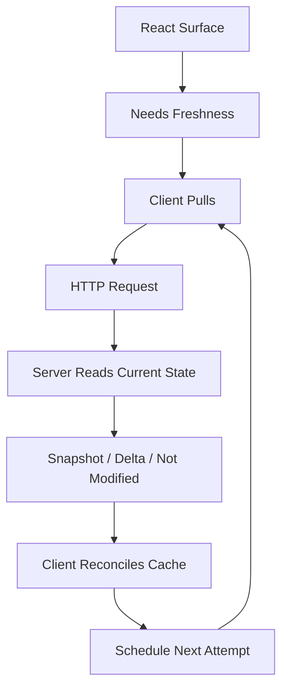
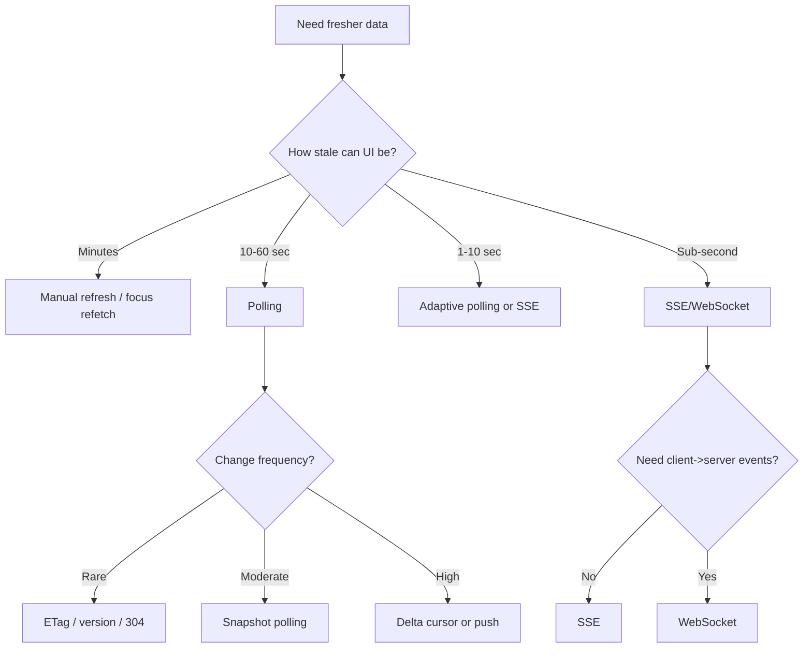
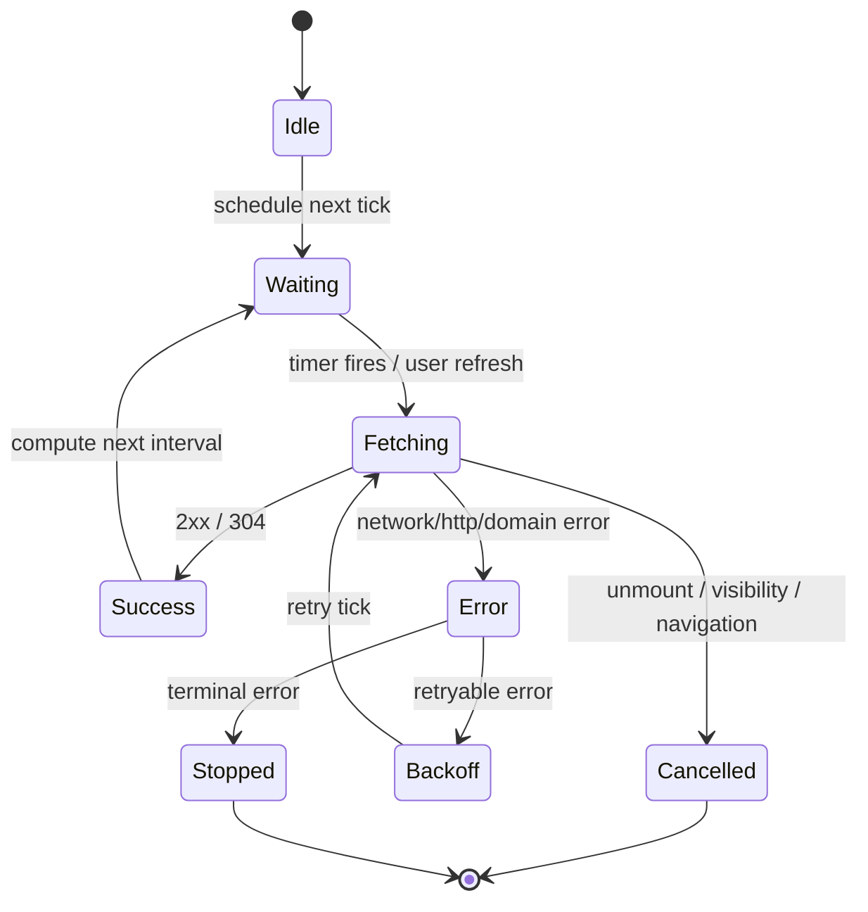
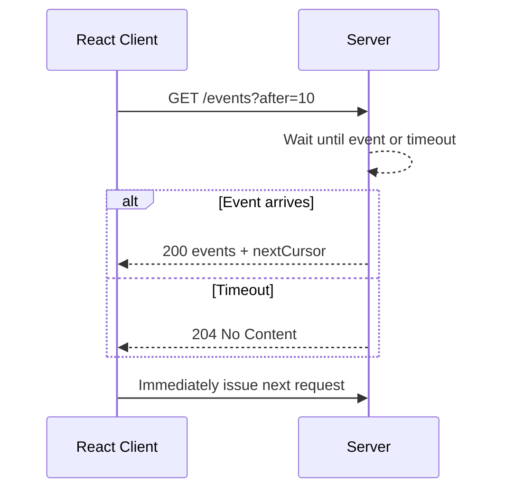
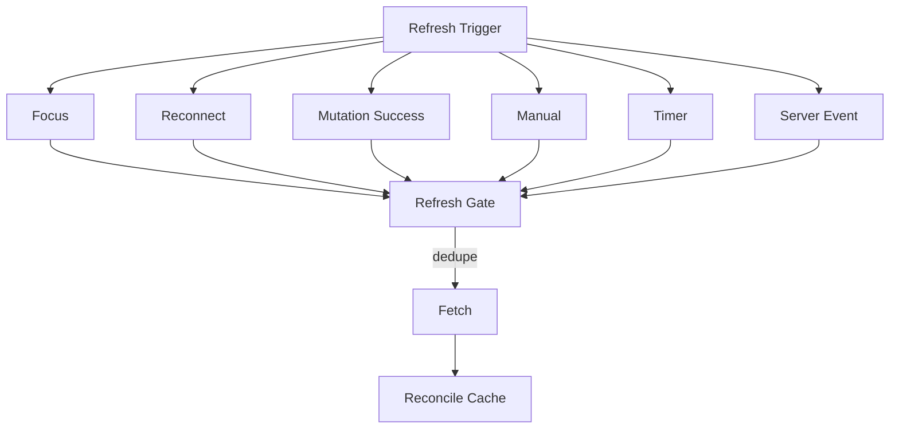
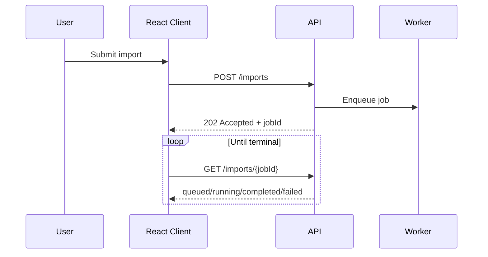
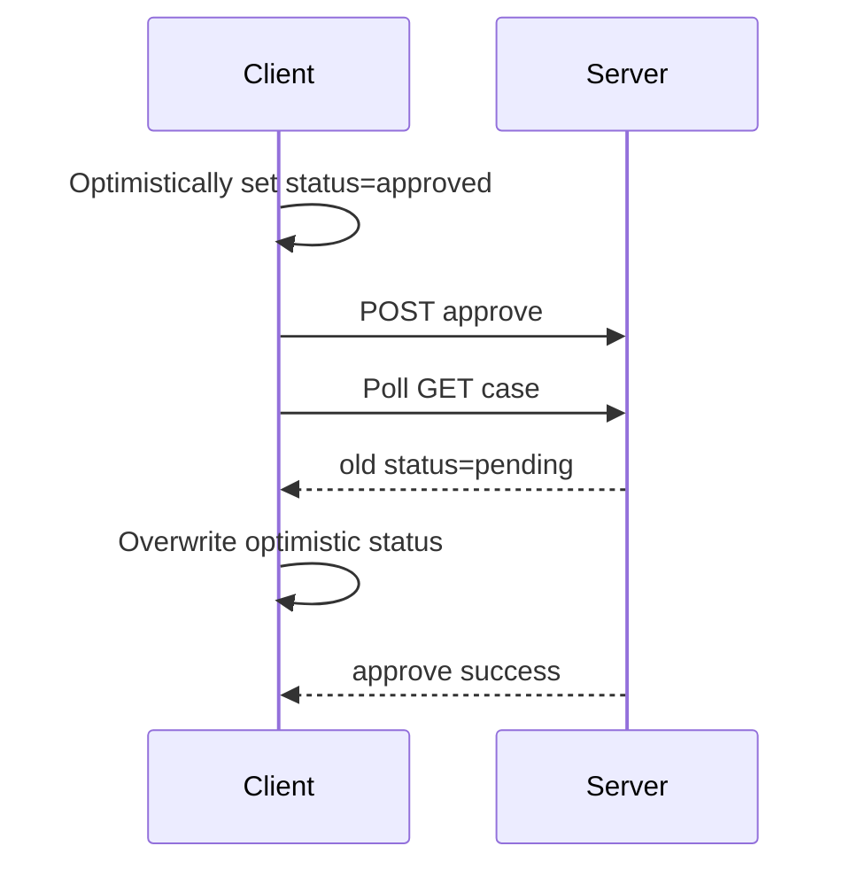

# Part 053 — Polling, Long Polling, and Refresh Loops

Polling is the simplest realtime-adjacent technique.

It is also one of the easiest techniques to abuse.

A polling loop is not just:

```ts
setInterval(fetchSomething, 5000);
```

A production polling loop is a synchronization protocol with:

- resource identity,
- freshness intent,
- cancellation,
- overlap control,
- adaptive cadence,
- visibility awareness,
- server load budget,
- error policy,
- version cursor,
- authorization handling,
- and observability.

Polling is not “bad”.

Blind polling is bad.

This part builds the mental model and implementation patterns for polling, long polling, and refresh loops in React applications.



The key idea:

> Polling is a client-owned freshness loop.

Because the client owns the loop, the client must also own the damage control.

---

## 1. What Polling Actually Is

Polling means the client periodically asks the server:

> “Has the state I care about changed?”

The response may be:

1. a full snapshot,
2. a delta since a version,
3. a status transition,
4. a `304 Not Modified`,
5. an empty response,
6. or an error.

The naive model is:

```text
Every 5 seconds -> GET /thing -> replace UI
```

The production model is:

```text
Given resource identity + freshness policy + runtime conditions,
issue a safe read request,
prevent overlap,
interpret result,
reconcile cache,
record telemetry,
then decide the next interval.
```

That last step matters.

A polling loop is not a timer.

It is a state machine.

---

## 2. Polling vs Long Polling vs Push

| Technique | Direction | Connection Shape | Best For | Main Risk |
|---|---|---|---|---|
| Polling | Client pull | Many short requests | Simple freshness, job progress, dashboards | Load amplification |
| Long polling | Client pull with server wait | Repeated held requests | Low-frequency event notification without SSE/WebSocket | Tied-up server/proxy resources |
| SSE | Server push | One long-lived HTTP response | One-way event streams, invalidation, notifications | Reconnect/resume correctness |
| WebSocket | Bidirectional | One long-lived socket | Collaboration, chat, high-frequency bidirectional protocol | Stateful connection complexity |

Polling is often enough when:

- freshness target is seconds, not milliseconds,
- updates are not extremely frequent,
- server state can be represented as snapshots,
- the UI can tolerate stale data,
- and backend simplicity matters more than low-latency push.

Polling is usually the wrong default when:

- thousands of clients ask every few seconds for rarely changing data,
- you need instant user-to-user collaboration,
- the update stream has strong ordering semantics,
- the UI needs to receive many small changes,
- or infrastructure already supports push safely.

---

## 3. The Polling Decision Ladder

Do not ask “should we use polling?” first.

Ask what freshness contract the surface needs.



The ladder protects you from two opposite mistakes:

1. using WebSocket for every changing page,
2. using polling for every realtime page.

Both are weak architecture.

---

## 4. Polling as a State Machine

A refresh loop has states.



A serious loop answers these questions:

- Is a request already in flight?
- Should the next tick wait for the previous response?
- Should an error slow the loop down?
- Should success speed it up?
- Should visibility or offline status pause it?
- Does the user still have permission to see this resource?
- Is the response older than local optimistic state?
- Did the server say nothing changed?

If these questions are not explicit, they become bugs.

---

## 5. The Simplest Safe Polling Rule

The safest baseline rule:

> Never start a new polling request while the previous one is still in flight.

Bad:

```ts
setInterval(async () => {
  await fetch('/api/jobs/123');
}, 1000);
```

If the request sometimes takes 4 seconds, this creates overlap.

Better:

```ts
async function loop(signal: AbortSignal) {
  while (!signal.aborted) {
    const startedAt = Date.now();

    await fetch('/api/jobs/123', { signal });

    const elapsed = Date.now() - startedAt;
    const interval = Math.max(0, 3000 - elapsed);

    await sleep(interval, signal);
  }
}
```

The loop waits after completion.

This gives you:

- no overlap,
- natural backpressure,
- simple cancellation,
- and more predictable load.

---

## 6. Polling with TanStack Query

For many React apps, TanStack Query is the right polling host.

```ts
import { useQuery } from '@tanstack/react-query';

function useJobStatus(jobId: string) {
  return useQuery({
    queryKey: ['jobs', jobId, 'status'],
    queryFn: ({ signal }) => api.jobs.getStatus(jobId, { signal }),
    refetchInterval: (query) => {
      const status = query.state.data?.status;

      if (status === 'completed' || status === 'failed') {
        return false;
      }

      if (query.state.error) {
        return 10_000;
      }

      return 2_000;
    },
    refetchIntervalInBackground: false,
    staleTime: 1_000,
  });
}
```

Important details:

- the interval is not the same as `staleTime`,
- the query function should consume `signal`,
- terminal states should stop polling,
- background polling should be intentional,
- and query key identity must include every parameter that changes the result.

Polling without correct query keys is cache corruption with a timer.

---

## 7. Interval Is a Product Contract

Do not pick intervals randomly.

An interval encodes product tolerance.

| Surface | Example Interval | Reason |
|---|---:|---|
| Job progress | 1-3s while active | User is waiting for completion |
| Admin dashboard | 10-30s | Fresh but not instant |
| Notification badge | 30-60s | Low urgency, low payload |
| Case queue | 15-60s plus focus refetch | Avoid disrupting user decisions |
| Payment status | 2-5s with terminal stop | User is blocked |
| Audit timeline | Manual/focus or event-driven | Must avoid misleading history |
| Search results | No polling | Query is user-driven |

The right question is not “how often can we poll?”

The right question is:

> How stale can this UI be before it causes bad decisions?

---

## 8. Server Load Math

Polling cost is multiplicative.

```text
requests per second = active clients / interval seconds
```

If 20,000 active browser sessions poll every 5 seconds:

```text
20,000 / 5 = 4,000 requests/second
```

That is before retries.

Before reconnect storms.

Before multiple tabs.

Before multiple widgets per page.

A page with five polling widgets at 5 seconds can turn one user into one request per second.

```text
5 widgets / 5 seconds = 1 request/sec/user
```

At scale, frontend polling is backend traffic design.

---

## 9. Polling Load Budget

Every polling surface should define a budget.

```ts
type PollingPolicy = {
  name: string;
  minIntervalMs: number;
  defaultIntervalMs: number;
  maxIntervalMs: number;
  background: 'pause' | 'slow' | 'continue';
  maxConcurrentPerTab: number;
  maxWidgetsPerPage: number;
  terminalStates?: string[];
};
```

Example:

```ts
export const jobProgressPolling: PollingPolicy = {
  name: 'job-progress',
  minIntervalMs: 1_500,
  defaultIntervalMs: 2_500,
  maxIntervalMs: 30_000,
  background: 'slow',
  maxConcurrentPerTab: 3,
  maxWidgetsPerPage: 5,
  terminalStates: ['completed', 'failed', 'cancelled'],
};
```

This turns polling from hidden behavior into reviewable architecture.

---

## 10. Adaptive Polling

Static interval is simple.

Adaptive polling is usually better.

```ts
function nextJobInterval(status: JobStatus): number | false {
  switch (status.phase) {
    case 'queued':
      return 5_000;
    case 'running':
      return 2_000;
    case 'finalizing':
      return 1_000;
    case 'completed':
    case 'failed':
    case 'cancelled':
      return false;
  }
}
```

Use faster polling when:

- user is actively waiting,
- job is near completion,
- data is small,
- backend work is already running,
- the result changes often.

Use slower polling when:

- document is hidden,
- user is idle,
- error rate rises,
- server says `Retry-After`,
- data rarely changes,
- response payload is large.

Adaptive polling is a load-shedding mechanism.

---

## 11. Visibility-Aware Polling

A hidden tab should not behave like an active surface unless the product requires it.

```ts
function getVisibilityMultiplier() {
  return document.visibilityState === 'hidden' ? 6 : 1;
}
```

But do not blindly pause everything.

Examples:

| Surface | Hidden Tab Behavior |
|---|---|
| Job completion | Slow down or continue at lower cadence |
| Collaboration lock | Maybe continue or switch to push |
| Dashboard chart | Pause |
| Notification badge | Slow down |
| Payment status | Continue carefully |
| Autosave status | Must complete in-flight, then stop |

When the tab becomes visible again, perform a focus revalidation rather than instantly resuming every timer at once.

---

## 12. Avoid Timer Herds

If every client starts polling exactly every 10 seconds after page load, your backend receives waves.

Add jitter.

```ts
function jitter(ms: number, ratio = 0.2) {
  const delta = ms * ratio;
  return Math.round(ms - delta + Math.random() * delta * 2);
}
```

Instead of:

```text
10s, 20s, 30s, 40s
```

Use:

```text
9.2s, 20.8s, 29.4s, 41.1s
```

Jitter is not just for retries.

It also matters for periodic polling.

---

## 13. Conditional Polling with ETag

Polling does not always need a full response body.

If the server provides `ETag`, the client can revalidate conditionally.

```http
GET /api/cases/CASE-123/summary HTTP/1.1
If-None-Match: "case-summary-v17"
```

Server response when unchanged:

```http
HTTP/1.1 304 Not Modified
ETag: "case-summary-v17"
```

Client behavior:

```ts
type CachedResource<T> = {
  etag?: string;
  data?: T;
};

async function getCaseSummary(id: string, cache: CachedResource<CaseSummary>) {
  const res = await fetch(`/api/cases/${id}/summary`, {
    headers: cache.etag ? { 'If-None-Match': cache.etag } : {},
  });

  if (res.status === 304) {
    return cache.data;
  }

  const data = await res.json();
  cache.etag = res.headers.get('ETag') ?? undefined;
  cache.data = data;
  return data;
}
```

This reduces payload cost.

It does not remove request cost.

---

## 14. Version Cursor Polling

For append-only or event-like resources, polling a full snapshot is wasteful.

Use a cursor.

```http
GET /api/cases/CASE-123/events?after=1842
```

Response:

```json
{
  "events": [
    { "id": 1843, "type": "comment.added" },
    { "id": 1844, "type": "assignee.changed" }
  ],
  "nextCursor": 1844
}
```

Client invariant:

> Apply events only if their sequence is newer than the local cursor.

```ts
function applyEvents(state: TimelineState, result: EventPage): TimelineState {
  const newEvents = result.events.filter((event) => event.id > state.cursor);

  return {
    cursor: Math.max(state.cursor, result.nextCursor),
    events: [...state.events, ...newEvents],
  };
}
```

Cursor polling gives you:

- smaller payloads,
- deduplication,
- resumability,
- ordering checks,
- and safer migration to SSE later.

---

## 15. Snapshot Polling vs Delta Polling

| Model | Request | Response | Client Complexity | Server Complexity |
|---|---|---|---|---|
| Snapshot | “Give me current state” | Full representation | Low | Low/medium |
| Conditional snapshot | “Give me current state if changed” | `200` or `304` | Medium | Medium |
| Delta cursor | “Give me changes after X” | Event/change list | High | High |
| Status polling | “Give me job state” | Small status object | Low | Low |

Default to snapshot when:

- payload is small,
- state shape is simple,
- change rate is low,
- UI replacement is safe.

Use delta when:

- payload is large,
- history matters,
- ordering matters,
- incremental UI update matters,
- event stream may later replace polling.

---

## 16. Long Polling

Long polling is still client pull, but the server waits before responding.



Long polling reduces empty responses when changes are rare.

It does not eliminate request lifecycle complexity.

You still need:

- timeout,
- reconnect,
- cursor,
- cancellation,
- auth handling,
- load limits,
- and proxy compatibility.

---

## 17. Long Polling Contract

A good long-poll endpoint needs explicit behavior.

```http
GET /api/notifications/long-poll?after=935&timeoutMs=25000
Accept: application/json
```

Possible responses:

```http
HTTP/1.1 200 OK
Content-Type: application/json

{
  "events": [
    { "id": 936, "type": "notification.created" }
  ],
  "nextCursor": 936
}
```

```http
HTTP/1.1 204 No Content
```

```http
HTTP/1.1 409 Conflict
Content-Type: application/problem+json

{
  "type": "https://api.example.com/problems/cursor-too-old",
  "title": "Cursor is too old",
  "status": 409,
  "detail": "Client must resync from a snapshot."
}
```

The client must know whether to:

- continue immediately,
- back off,
- resync,
- ask the user to reload,
- or stop.

---

## 18. Long Polling Client Loop

```ts
type LongPollOptions<TEvent> = {
  signal: AbortSignal;
  initialCursor: string;
  request: (cursor: string, signal: AbortSignal) => Promise<{
    events: TEvent[];
    nextCursor: string;
  } | null>;
  onEvents: (events: TEvent[]) => void;
  onCursor: (cursor: string) => void;
};

export async function runLongPoll<TEvent>({
  signal,
  initialCursor,
  request,
  onEvents,
  onCursor,
}: LongPollOptions<TEvent>) {
  let cursor = initialCursor;
  let failures = 0;

  while (!signal.aborted) {
    try {
      const result = await request(cursor, signal);
      failures = 0;

      if (result) {
        cursor = result.nextCursor;
        onCursor(cursor);
        onEvents(result.events);
      }
    } catch (error) {
      if (signal.aborted) return;

      failures += 1;
      await sleep(Math.min(30_000, 1_000 * 2 ** failures), signal);
    }
  }
}
```

The loop issues the next request after each response.

Do not use a fixed interval on top of long polling.

That defeats the point.

---

## 19. Refresh Loop vs Polling Loop

Not every repeated refresh is polling.

A refresh loop may be triggered by:

- window focus,
- network reconnect,
- route navigation,
- mutation success,
- manual refresh,
- server event,
- tab visibility change,
- or timer.



A robust app centralizes refresh policy.

Otherwise every component invents its own timer.

---

## 20. Refresh Gate

A refresh gate decides whether a refresh should happen now.

```ts
type RefreshReason =
  | 'mount'
  | 'focus'
  | 'reconnect'
  | 'timer'
  | 'manual'
  | 'mutation-success'
  | 'server-event';

type RefreshDecision =
  | { type: 'run' }
  | { type: 'skip'; reason: string }
  | { type: 'delay'; ms: number; reason: string };

function shouldRefresh(input: {
  reason: RefreshReason;
  isFetching: boolean;
  isVisible: boolean;
  lastUpdatedAt?: number;
  minGapMs: number;
}): RefreshDecision {
  if (input.isFetching) return { type: 'skip', reason: 'already-fetching' };

  if (!input.isVisible && input.reason === 'timer') {
    return { type: 'delay', ms: 30_000, reason: 'hidden-tab' };
  }

  if (input.lastUpdatedAt && Date.now() - input.lastUpdatedAt < input.minGapMs) {
    return { type: 'skip', reason: 'too-recent' };
  }

  return { type: 'run' };
}
```

This is boring code.

Boring code prevents expensive incidents.

---

## 21. Job Progress Polling

Job progress is the canonical good use of polling.

The user starts work.

The server processes asynchronously.

The client asks until terminal state.



Server response:

```json
{
  "id": "job_123",
  "status": "running",
  "progress": {
    "completed": 420,
    "total": 1000
  },
  "message": "Validating rows"
}
```

Client policy:

- poll while `queued`, `running`, `finalizing`,
- stop on `completed`, `failed`, `cancelled`,
- invalidate related resources on completion,
- show recovery action on failure,
- do not retry failed job automatically unless the server creates a new command.

---

## 22. `202 Accepted` and Operation Resources

For long-running commands, prefer an operation resource.

```http
POST /api/reports/monthly
Idempotency-Key: 8c7e...
```

```http
HTTP/1.1 202 Accepted
Location: /api/operations/op_123
Content-Type: application/json

{
  "operationId": "op_123",
  "statusUrl": "/api/operations/op_123"
}
```

The client polls:

```http
GET /api/operations/op_123
```

This is cleaner than keeping the original mutation request open for minutes.

It also gives you:

- reload recovery,
- shareable diagnostics,
- auditability,
- timeout separation,
- and idempotency.

---

## 23. Dashboard Polling

Dashboards need freshness, but not all widgets need the same cadence.

Bad dashboard:

```text
12 widgets, each useQuery(refetchInterval: 5000)
```

Better dashboard:

```text
Critical counters: 5-10s
Charts: 30-60s
Expensive tables: manual/focus
Static metadata: no polling
```

Best dashboard if backend supports it:

```text
GET /dashboard/summary -> aggregate view model
poll one endpoint with conditional headers
```

Frontend polling architecture should consider backend read model design.

A React app can easily reveal missing backend aggregation.

---

## 24. Polling and Cache Invalidation

Polling can update cache in two ways.

### Replacement

```ts
queryClient.setQueryData(['cases', caseId], response.case);
```

Good for canonical snapshots.

### Invalidation

```ts
queryClient.invalidateQueries({ queryKey: ['cases', caseId] });
```

Good when the polling endpoint only tells you something changed.

For example:

```json
{
  "changed": true,
  "version": 18
}
```

Then invalidate the heavy detail query.

This pattern is useful when a lightweight polling endpoint monitors a heavy resource.

---

## 25. Polling and Mutation Races

Polling can overwrite optimistic mutations.

Sequence:



Guardrails:

1. pause polling for affected resource while mutation is pending,
2. include version numbers in representations,
3. ignore snapshots older than optimistic branch,
4. reconcile after mutation success,
5. invalidate instead of blindly replacing.

Example version guard:

```ts
function applySnapshot(current: CaseView, incoming: CaseView) {
  if (incoming.version < current.version) {
    return current;
  }

  return incoming;
}
```

Without versioning, polling loops become accidental time machines.

---

## 26. Polling and Authorization

Polling is repeated access.

That means auth changes must be handled cleanly.

| Response | Client Behavior |
|---|---|
| `401 Unauthorized` | stop protected polling, trigger auth refresh/login flow |
| `403 Forbidden` | remove resource from view or show no-access state |
| `404 Not Found` | if resource may be deleted, stop and show gone state |
| `410 Gone` | stop permanently; resource lifecycle ended |
| `429 Too Many Requests` | respect `Retry-After` and slow down |

Do not keep polling a resource after access is denied.

That is both wasteful and noisy.

---

## 27. Polling and Multi-Tab Amplification

One user can open many tabs.

If each tab polls independently, traffic multiplies.

Mitigation options:

1. accept it for low-cost surfaces,
2. slow hidden tabs,
3. use `BroadcastChannel` to share freshness notifications,
4. use one leader tab,
5. use a `SharedWorker` for one connection where supported,
6. replace with SSE/WebSocket plus fan-out.

Simple broadcast pattern:

```ts
const channel = new BroadcastChannel('case-refresh');

function publishCaseRefresh(caseId: string, version: number) {
  channel.postMessage({ type: 'case.updated', caseId, version });
}

channel.onmessage = (event) => {
  if (event.data.type === 'case.updated') {
    queryClient.invalidateQueries({ queryKey: ['cases', event.data.caseId] });
  }
};
```

This does not fully eliminate polling.

But it can reduce redundant refresh after one tab already fetched newer data.

---

## 28. Polling and Offline Behavior

When offline:

- stop active polling,
- keep last-known-good data,
- mark UI as stale/offline,
- do not show repeated errors,
- resume with jitter after reconnect,
- revalidate before accepting user decisions on stale data.

```ts
window.addEventListener('online', () => {
  queryClient.invalidateQueries({ queryKey: ['cases'] });
});
```

Offline polling should not become an error notification generator.

Users already know the app is offline.

---

## 29. Manual Refresh Is Still a First-Class Pattern

Not every surface needs automatic refresh.

For high-risk regulatory decisions, automatic refresh can be harmful if it changes the screen while the user is reasoning.

A manual refresh affordance may be better:

```text
Data last updated 10:42:18. Refresh
```

Better still:

```text
Newer data may be available. Review updates before final decision.
```

This is not less advanced.

It is more honest about human workflow.

---

## 30. Refresh Conflict UX

When new data arrives while the user is editing, do not silently replace the form.

Use a conflict-aware state:

```ts
type EditFreshness =
  | { type: 'clean'; serverVersion: number }
  | { type: 'dirty'; baseVersion: number }
  | { type: 'remote-changed'; baseVersion: number; latestVersion: number };
```

UX options:

- “Newer version available. Review changes.”
- “Your draft is based on an older version.”
- “Reload latest and discard draft.”
- “Compare changes.”

Polling is not allowed to destroy user work.

---

## 31. Backoff Policy for Polling Errors

Polling retries should not behave like command retries.

For read polling:

```ts
function nextIntervalAfterError(failureCount: number) {
  const base = Math.min(60_000, 2_000 * 2 ** failureCount);
  return jitter(base, 0.25);
}
```

Rules:

- slow down after repeated failure,
- respect `Retry-After`,
- stop on terminal auth errors,
- keep last-known-good data,
- avoid user-facing toast spam,
- record telemetry.

A polling loop that keeps failing every second is an outage amplifier.

---

## 32. Server Hints

The server can help the client schedule.

Possible hints:

```http
Retry-After: 30
```

```json
{
  "status": "running",
  "nextPollAfterMs": 5000
}
```

```json
{
  "status": "queued",
  "queuePosition": 837,
  "recommendedPollIntervalMs": 15000
}
```

Client rule:

> Server hints may slow the client down; client policy should still enforce minimum and maximum bounds.

Never let arbitrary server data force 10ms polling.

---

## 33. A Production Polling Hook

```ts
import { useEffect, useRef, useState } from 'react';

type PollState<T> =
  | { status: 'idle' }
  | { status: 'loading' }
  | { status: 'success'; data: T; updatedAt: number }
  | { status: 'error'; error: unknown; lastData?: T; updatedAt?: number };

type PollOptions<T> = {
  enabled: boolean;
  request: (signal: AbortSignal) => Promise<T>;
  getInterval: (state: PollState<T>) => number | false;
  immediate?: boolean;
};

export function usePolling<T>({
  enabled,
  request,
  getInterval,
  immediate = true,
}: PollOptions<T>) {
  const [state, setState] = useState<PollState<T>>({ status: 'idle' });
  const stateRef = useRef(state);
  stateRef.current = state;

  useEffect(() => {
    if (!enabled) return;

    const controller = new AbortController();
    let timeoutId: number | undefined;

    const tick = async () => {
      if (controller.signal.aborted) return;

      const previous = stateRef.current;

      if (previous.status === 'idle') {
        setState({ status: 'loading' });
      }

      try {
        const data = await request(controller.signal);
        setState({ status: 'success', data, updatedAt: Date.now() });
      } catch (error) {
        if (controller.signal.aborted) return;
        setState({
          status: 'error',
          error,
          lastData: previous.status === 'success' ? previous.data : undefined,
          updatedAt: previous.status === 'success' ? previous.updatedAt : undefined,
        });
      }

      const nextInterval = getInterval(stateRef.current);
      if (nextInterval !== false && !controller.signal.aborted) {
        timeoutId = window.setTimeout(tick, jitter(nextInterval));
      }
    };

    if (immediate) {
      void tick();
    } else {
      const nextInterval = getInterval(stateRef.current);
      if (nextInterval !== false) {
        timeoutId = window.setTimeout(tick, nextInterval);
      }
    }

    return () => {
      controller.abort();
      if (timeoutId) window.clearTimeout(timeoutId);
    };
  }, [enabled, request, getInterval, immediate]);

  return state;
}
```

This hook is intentionally generic.

In a real app, prefer TanStack Query for common read polling because it already handles cache, dedupe, cancellation integration, focus/reconnect behavior, and observer lifecycles.

But understanding the loop makes you better at reviewing production behavior.

---

## 34. Avoid `setInterval` for Async Polling

`setInterval` does not care whether your async work finished.

```ts
setInterval(async () => {
  await expensiveFetch();
}, 1000);
```

This can create:

- overlapping requests,
- out-of-order responses,
- memory pressure,
- duplicate state updates,
- and backend load spikes.

Prefer recursive `setTimeout` after completion:

```ts
async function tick() {
  await expensiveFetch();
  setTimeout(tick, nextInterval());
}
```

Even better, host the policy in a server-state engine.

---

## 35. Polling with Route Loaders

Route loaders are not usually interval hosts.

But they can participate in refresh loops.

Examples:

- revalidate route on focus,
- revalidate after action success,
- revalidate after server event,
- expose manual refresh button.

```tsx
import { useRevalidator } from 'react-router';

function RefreshButton() {
  const revalidator = useRevalidator();

  return (
    <button
      type="button"
      disabled={revalidator.state === 'loading'}
      onClick={() => revalidator.revalidate()}
    >
      Refresh
    </button>
  );
}
```

Do not hide uncontrolled intervals inside every route component.

If a route needs periodic refresh, make it a route-level policy.

---

## 36. Polling with BFF Aggregates

A BFF can reduce frontend polling fan-out.

Bad:

```text
React widget A -> service A
React widget B -> service B
React widget C -> service C
React widget D -> service D
```

Better:

```text
React dashboard -> BFF /dashboard-summary -> backend services
```

The BFF can:

- aggregate reads,
- cache internally,
- apply auth once,
- shape data for UI,
- return ETag/version,
- and hide backend topology.

Polling often reveals whether your backend read model is shaped for the UI.

---

## 37. Polling Response Design

Design polling responses for repeated reads.

Good job response:

```json
{
  "id": "job_123",
  "status": "running",
  "phase": "validating",
  "progress": {
    "current": 421,
    "total": 1000
  },
  "version": 17,
  "nextPollAfterMs": 2500,
  "links": {
    "self": "/api/jobs/job_123",
    "result": null,
    "cancel": "/api/jobs/job_123/cancel"
  }
}
```

Bad job response:

```json
{
  "done": false
}
```

A good response helps the client decide:

- what to render,
- whether to continue,
- when to poll next,
- whether a result is available,
- and what actions are allowed.

---

## 38. Long Polling Backend Constraints

Long polling holds requests open.

That has consequences:

- request timeout configuration,
- server worker/thread model,
- load balancer idle timeout,
- proxy buffering,
- memory per connection,
- auth expiry during wait,
- deploy draining,
- and client reconnect storms.

Long polling is simpler than WebSocket, but not free.

If your platform is serverless, check whether held requests are economically and technically appropriate.

A 25-second long-poll repeated by 50,000 users is a lot of concurrent open requests.

---

## 39. Polling and HTTP Caching

HTTP caching can help polling when the representation is cacheable.

Useful headers:

```http
Cache-Control: private, max-age=5, stale-while-revalidate=30
ETag: "queue-v44"
Vary: Authorization
```

For user-specific data, be careful:

- use `private`,
- vary by authorization context where needed,
- avoid shared CDN cache unless explicitly safe,
- do not cache sensitive PII accidentally,
- and understand app cache vs HTTP cache layering.

Do not assume app-level query cache and HTTP cache are the same thing.

They solve different layers.

---

## 40. Polling and `Retry-After`

`Retry-After` may appear with `429` or `503`.

Client policy should respect it.

```ts
function parseRetryAfter(value: string | null): number | undefined {
  if (!value) return undefined;

  const seconds = Number(value);
  if (Number.isFinite(seconds)) return seconds * 1000;

  const date = Date.parse(value);
  if (Number.isFinite(date)) return Math.max(0, date - Date.now());

  return undefined;
}
```

Then clamp it:

```ts
const hintedDelay = parseRetryAfter(response.headers.get('Retry-After'));
const delay = clamp(hintedDelay ?? defaultBackoff, 1_000, 120_000);
```

The server may ask you to slow down.

A good client listens.

---

## 41. Polling Observability

You need telemetry at the loop level, not only request level.

Track:

- polling surface name,
- interval policy,
- active polling count,
- hidden-tab polling count,
- requests per minute,
- average response size,
- `304` ratio,
- unchanged snapshot ratio,
- error ratio,
- retry/backoff count,
- terminal stop reason,
- overlap prevention count,
- server `Retry-After` usage,
- and time to terminal state for jobs.

Example event:

```json
{
  "event": "poll.tick.completed",
  "surface": "import-job-progress",
  "resource": "job",
  "intervalMs": 2500,
  "durationMs": 184,
  "status": 200,
  "changed": true,
  "visibility": "visible"
}
```

If you cannot observe polling, you cannot control its blast radius.

---

## 42. Testing Polling

Polling tests need control over time and response order.

Test cases:

1. starts immediately when enabled,
2. stops on unmount,
3. aborts in-flight request on unmount,
4. does not overlap requests,
5. slows down after error,
6. stops on terminal state,
7. respects hidden tab policy,
8. respects `Retry-After`,
9. does not overwrite newer optimistic state,
10. handles offline/reconnect.

Pseudo-test shape:

```ts
it('does not start overlapping polling requests', async () => {
  const first = defer<JobStatus>();
  const request = vi.fn(() => first.promise);

  renderHook(() => usePolling({
    enabled: true,
    request,
    getInterval: () => 1000,
  }));

  expect(request).toHaveBeenCalledTimes(1);

  vi.advanceTimersByTime(5000);
  expect(request).toHaveBeenCalledTimes(1);

  first.resolve({ status: 'running' });
  await flushPromises();

  vi.advanceTimersByTime(1000);
  expect(request).toHaveBeenCalledTimes(2);
});
```

Timer control is mandatory.

Without it, polling tests become flaky sleep-based tests.

---

## 43. Common Failure Modes

| Failure Mode | Symptom | Root Cause | Fix |
|---|---|---|---|
| Overlap storm | Many concurrent requests | `setInterval` with slow API | completion-based loop |
| Refetch storm | backend spike after deploy/focus | synchronized timers | jitter + focus gate |
| Stale overwrite | optimistic UI reverts | old snapshot applied | version guard / pause polling |
| Hidden tab waste | high traffic from inactive users | no visibility policy | pause/slow hidden tabs |
| Terminal polling | job completed but keeps polling | no stop condition | terminal state mapping |
| Auth loop | repeated `401` | retrying auth failure | stop + auth flow |
| Toast spam | repeated error notifications | treating polling error like user action | last-known-good + quiet error |
| Cursor gap | missing events | cursor too old / non-monotonic stream | resync protocol |
| Payload waste | repeated unchanged large responses | no ETag/version | conditional requests |
| Multi-tab amplification | traffic scales per tab | no tab coordination | visibility + broadcast/leader |

---

## 44. Production Checklist

Before approving a polling surface, answer:

- What is the freshness contract?
- What is the interval and why?
- Does the interval adapt to state, visibility, and errors?
- Is overlap impossible?
- Is cancellation wired?
- Does the query key include all resource identity?
- Does polling stop on terminal states?
- Are `401`, `403`, `404`, `410`, `429`, and `503` handled correctly?
- Does the server support ETag, version, cursor, or lightweight status?
- What is the expected requests-per-second at peak active sessions?
- What happens across multiple tabs?
- Can polling overwrite optimistic mutation state?
- Is the loop observable?
- Are timers tested with fake time?
- Is there a migration path to SSE/WebSocket if freshness requirements change?

If these are unknown, the polling design is not complete.

---

## 45. Key Takeaways

Polling is a legitimate synchronization strategy when the freshness requirement and load budget match.

The durable rules:

1. Polling is a protocol, not a timer.
2. Avoid overlap by scheduling after completion.
3. Use adaptive intervals and jitter.
4. Pause or slow hidden tabs intentionally.
5. Stop on terminal states.
6. Use ETag, version, or cursor to reduce waste and prevent stale overwrite.
7. Respect authorization and rate-limit responses.
8. Do not let polling destroy user drafts or optimistic state.
9. Observe loop behavior, not only request latency.
10. Use polling until push is justified; do not use polling when push semantics are required.

Part 054 continues Phase 8 with Server-Sent Events in React: one-way server push, event streams, reconnect/resume, cache invalidation, and production infrastructure traps.

## References

- TanStack Query polling guide: https://tanstack.com/query/latest/docs/framework/react/guides/polling
- TanStack Query important defaults: https://tanstack.com/query/v5/docs/framework/react/guides/important-defaults
- TanStack Query query cancellation: https://tanstack.com/query/v5/docs/react/guides/query-cancellation
- MDN `setInterval`: https://developer.mozilla.org/en-US/docs/Web/API/Window/setInterval
- MDN Page Visibility API: https://developer.mozilla.org/en-US/docs/Web/API/Page_Visibility_API
- MDN `Navigator.onLine`: https://developer.mozilla.org/en-US/docs/Web/API/Navigator/onLine
- HTTP Semantics RFC 9110: https://www.rfc-editor.org/rfc/rfc9110.html
- HTTP Caching RFC 9111: https://www.rfc-editor.org/rfc/rfc9111.html
- React Router `useRevalidator`: https://reactrouter.com/api/hooks/useRevalidator
