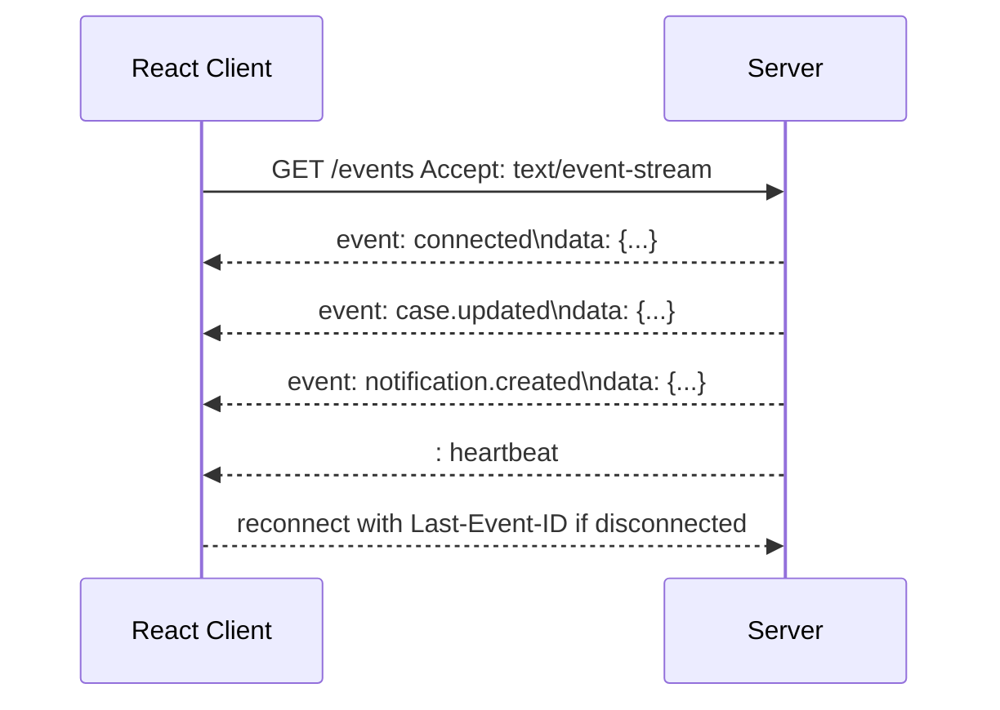
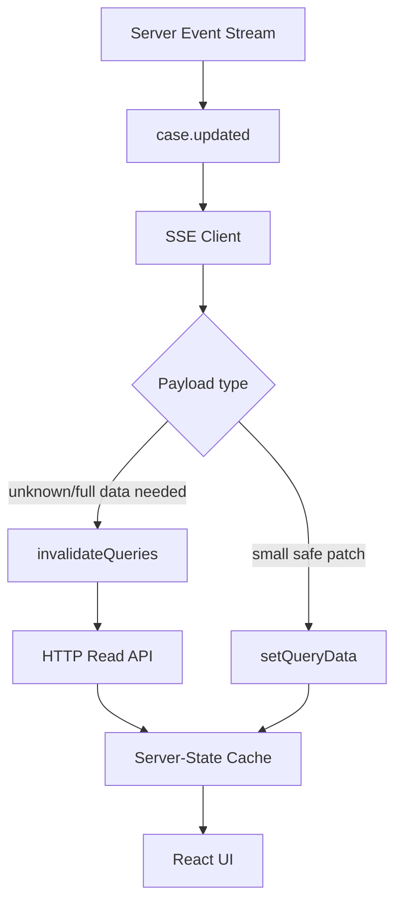
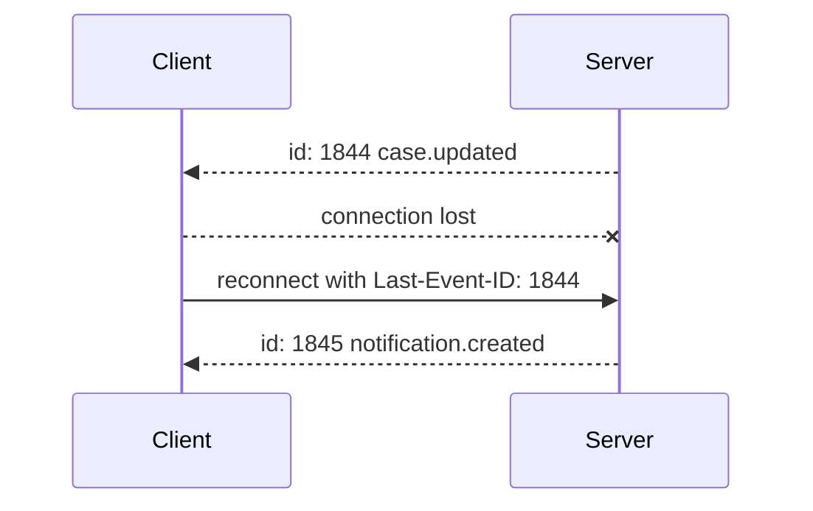
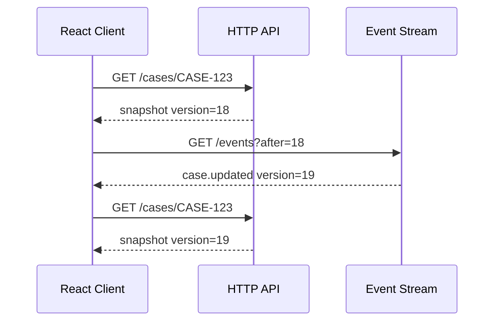
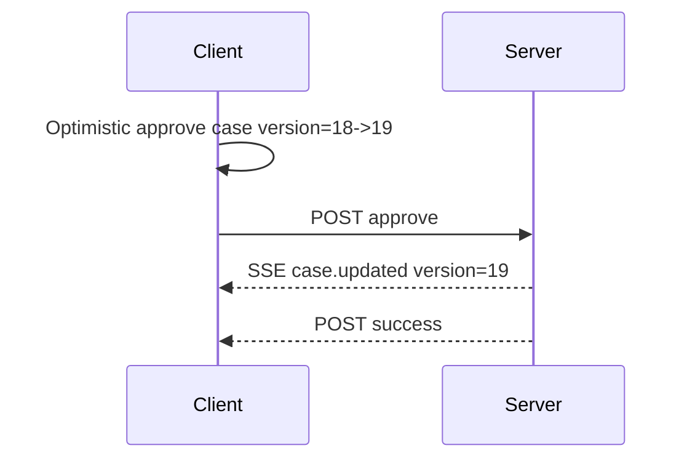

# Part 054 — Server-Sent Events in React

Server-Sent Events, usually called SSE, are a browser-native way for the server to push events to the client over a long-lived HTTP response.

SSE is not WebSocket.

SSE is not polling.

SSE is:

> one-way server-to-client event delivery over an HTTP stream.



In React architecture, SSE is usually best treated as a **freshness signal stream**.

It tells the client that something changed.

The client then patches or invalidates the relevant server-state cache.

This part builds the practical model.

---

## 1. When SSE Fits

SSE fits when the server needs to push events and the client mostly listens.

Examples:

- notification feed,
- case timeline updates,
- audit event arrival,
- job progress updates,
- dashboard invalidation,
- queue count changes,
- feature flag updates,
- read-model freshness hints,
- deployment or maintenance banners.

SSE is a poor fit when:

- the client must send many realtime messages back,
- binary messages matter,
- low-latency bidirectional collaboration is required,
- application-level backpressure must be negotiated,
- or the protocol is naturally session-like and stateful.

Then WebSocket or a dedicated realtime transport may be more appropriate.

---

## 2. SSE vs Polling vs WebSocket

| Capability | Polling | SSE | WebSocket |
|---|---|---|---|
| Direction | client pull | server → client | both directions |
| Browser primitive | `fetch` / timers | `EventSource` | `WebSocket` |
| Transport shape | repeated requests | one long HTTP response | upgraded socket |
| Server can push instantly | no | yes | yes |
| Client can send over same channel | no | no | yes |
| Automatic reconnect | app-owned | built into `EventSource` | app-owned |
| HTTP semantics compatibility | strong | strong-ish | lower after upgrade |
| Best default use | simple freshness | one-way event stream | collaboration/session protocol |

A useful rule:

> Use SSE when polling feels wasteful but WebSocket feels too stateful.

---

## 3. The Event Stream Format

SSE responses use `text/event-stream`.

A stream is a sequence of UTF-8 text records separated by blank lines.

Example:

```text
event: case.updated
id: 1844
data: {"caseId":"CASE-123","version":18}

```

Important fields:

| Field | Meaning |
|---|---|
| `event` | event type/name |
| `data` | message payload; multiple `data:` lines are joined with newline |
| `id` | event id stored by browser for resume |
| `retry` | suggested reconnect delay in milliseconds |
| `:` | comment line, often used as heartbeat |

Minimal event:

```text
data: hello

```

Typed event:

```text
event: notification.created
data: {"id":"notif_123","severity":"info"}

```

Heartbeat:

```text
: keep-alive

```

The blank line matters.

Without it, the browser will not dispatch the event.

---

## 4. Native `EventSource`

The browser API is simple.

```ts
const source = new EventSource('/api/events');

source.onmessage = (event) => {
  console.log(event.data);
};

source.addEventListener('case.updated', (event) => {
  const payload = JSON.parse(event.data);
  console.log(payload.caseId);
});

source.onerror = () => {
  console.log('SSE error or reconnecting');
};

// Later
source.close();
```

`EventSource` opens a persistent connection.

The browser parses the stream and dispatches DOM events.

This simplicity is the main advantage.

It is also the main constraint.

---

## 5. Native `EventSource` Constraints

Native `EventSource` is intentionally small.

Important constraints:

1. It performs a `GET` request.
2. It does not let you set arbitrary request headers.
3. It has built-in reconnect behavior.
4. It supports `withCredentials` for cookies on cross-origin requests.
5. It exposes `readyState`, `onopen`, `onmessage`, `onerror`, and `close()`.
6. It is one-way; client messages require separate HTTP requests.

The header limitation is a major architectural detail.

If your app uses `Authorization: Bearer ...` headers for every API call, native `EventSource` will not fit directly.

Options:

- use cookie-based auth for the SSE endpoint,
- use a short-lived signed URL token,
- use a BFF that converts cookie/session to backend auth,
- or use `fetch` streaming with a custom parser instead of native `EventSource`.

Do not put long-lived bearer tokens in URLs.

URLs leak into logs, browser history, proxy logs, and analytics more easily than headers.

---

## 6. SSE as Invalidation Stream

The strongest React pattern is not “push all data through SSE”.

It is:

> Use SSE for change notification; use normal query clients for canonical reads.



This separates concerns:

- SSE delivers freshness signals,
- HTTP APIs deliver canonical resources,
- query cache handles dedupe, retries, and observers,
- UI reads from cache.

That model is usually easier to operate than streaming complete domain objects forever.

---

## 7. Event Design

Good SSE events are small, typed, versioned, and idempotent.

Example:

```text
event: case.updated
id: 1844
data: {"caseId":"CASE-123","version":18,"changed":["status","assignee"]}

```

Better than:

```text
data: something changed

```

A good event tells the client:

- what changed,
- which resource is affected,
- what version/cursor it represents,
- whether the payload is complete enough to patch,
- and whether the client should refetch.

Event names are part of your API contract.

Treat them like public schema.

---

## 8. Event Taxonomy

A useful taxonomy:

| Event Type | Purpose | Client Action |
|---|---|---|
| `resource.updated` | resource changed | invalidate or patch detail/list queries |
| `resource.deleted` | resource removed | remove from cache or redirect |
| `operation.progress` | long job progress | update job query cache |
| `operation.completed` | long job terminal state | stop progress UI and invalidate result |
| `notification.created` | new notification | prepend notification or invalidate count |
| `permission.changed` | current access changed | clear/refresh protected caches |
| `heartbeat` / comment | keep connection alive | no state change |
| `resync.required` | cursor gap or server cannot replay | reload snapshot / reconnect from current state |

Do not make the client infer domain meaning from generic strings.

---

## 9. Building an SSE Client Boundary

Do not create `EventSource` directly inside many components.

Create a boundary.

```ts
type SseEventMap = {
  'case.updated': { caseId: string; version: number };
  'case.deleted': { caseId: string; version: number };
  'notification.created': { id: string };
  'permission.changed': { scope: string };
};

type SseEventName = keyof SseEventMap;

type SseHandler<K extends SseEventName> = (payload: SseEventMap[K]) => void;

export class SseClient {
  private source?: EventSource;
  private handlers = new Map<string, Set<(payload: unknown) => void>>();

  constructor(private readonly url: string) {}

  connect() {
    if (this.source) return;

    const source = new EventSource(this.url, { withCredentials: true });
    this.source = source;

    for (const eventName of this.handlers.keys()) {
      source.addEventListener(eventName, (event) => {
        this.dispatch(eventName, JSON.parse((event as MessageEvent).data));
      });
    }

    source.onerror = () => {
      // Native EventSource will reconnect automatically unless closed.
      // Record telemetry here, but do not spam the UI.
    };
  }

  on<K extends SseEventName>(eventName: K, handler: SseHandler<K>) {
    const set = this.handlers.get(eventName) ?? new Set();
    set.add(handler as (payload: unknown) => void);
    this.handlers.set(eventName, set);

    this.source?.addEventListener(eventName, (event) => {
      this.dispatch(eventName, JSON.parse((event as MessageEvent).data));
    });

    return () => {
      set.delete(handler as (payload: unknown) => void);
    };
  }

  close() {
    this.source?.close();
    this.source = undefined;
  }

  private dispatch(eventName: string, payload: unknown) {
    this.handlers.get(eventName)?.forEach((handler) => handler(payload));
  }
}
```

This example shows the shape, not a perfect library.

A production client also needs:

- runtime validation,
- duplicate listener prevention,
- reconnect metrics,
- auth handling,
- event id tracking,
- and lifecycle ownership.

---

## 10. React Provider Pattern

Usually one stream per application/session is enough.

```tsx
import { createContext, useContext, useEffect, useMemo } from 'react';
import { useQueryClient } from '@tanstack/react-query';

const SseContext = createContext<SseClient | null>(null);

export function SseProvider({ children }: { children: React.ReactNode }) {
  const queryClient = useQueryClient();

  const client = useMemo(() => {
    return new SseClient('/api/events');
  }, []);

  useEffect(() => {
    const offCaseUpdated = client.on('case.updated', ({ caseId }) => {
      queryClient.invalidateQueries({ queryKey: ['cases', caseId] });
      queryClient.invalidateQueries({ queryKey: ['cases', 'list'] });
    });

    const offDeleted = client.on('case.deleted', ({ caseId }) => {
      queryClient.removeQueries({ queryKey: ['cases', caseId] });
      queryClient.invalidateQueries({ queryKey: ['cases', 'list'] });
    });

    client.connect();

    return () => {
      offCaseUpdated();
      offDeleted();
      client.close();
    };
  }, [client, queryClient]);

  return <SseContext.Provider value={client}>{children}</SseContext.Provider>;
}

export function useSseClient() {
  const client = useContext(SseContext);
  if (!client) throw new Error('SseProvider is missing');
  return client;
}
```

Centralize stream ownership.

Components should usually respond to cache updates, not raw stream messages.

---

## 11. Resume with `Last-Event-ID`

SSE supports resumability through event IDs.

Server sends:

```text
id: 1844
event: case.updated
data: {"caseId":"CASE-123","version":18}

```

When the connection drops, the browser can reconnect and include the last event id.

The server can resume from that point if it keeps an event log.



The important word is **if**.

Resume only works correctly when the server has a replay buffer or event log.

Without replay, reconnect is just “start from now”.

That may be acceptable for invalidation streams if the client performs a full resync after reconnect.

---

## 12. Replay Contract

Define your replay contract explicitly.

| Contract | Meaning | Client Behavior |
|---|---|---|
| No replay | events are best-effort live hints | invalidate broad queries after reconnect |
| Short replay | server replays recent events by id | resume with `Last-Event-ID`; resync on gap |
| Durable event log | server can replay from cursor | maintain cursor and apply events idempotently |
| Snapshot + stream | initial snapshot plus live events | snapshot first, stream after known version |

For business-critical state, “best effort live hints” are not enough.

For notification badges, they may be fine.

---

## 13. Gap Detection

If event IDs are sequential, the client can detect gaps.

```ts
type EventEnvelope<T> = {
  id: number;
  type: string;
  data: T;
};

function applyEnvelope<T>(state: { lastId: number }, event: EventEnvelope<T>) {
  if (event.id <= state.lastId) {
    return { action: 'ignore-duplicate' as const };
  }

  if (event.id !== state.lastId + 1) {
    return { action: 'resync-required' as const, expected: state.lastId + 1, actual: event.id };
  }

  state.lastId = event.id;
  return { action: 'apply' as const };
}
```

For invalidation streams, gap response can be simple:

```ts
queryClient.invalidateQueries();
```

For event-sourced UI, gap response must be stronger.

You may need to reload a snapshot.

---

## 14. Initial Snapshot + Stream

A common safe pattern:

1. fetch initial snapshot,
2. record snapshot version/cursor,
3. open SSE from that cursor,
4. apply or invalidate on newer events.



This avoids missing changes between page load and stream connection.

The backend must make snapshot version and event cursor compatible.

---

## 15. Patch vs Invalidate

When an event arrives, choose patch or invalidate.

### Patch

```ts
queryClient.setQueryData(['jobs', jobId], (old: JobStatus | undefined) => {
  if (!old) return old;
  if (event.version <= old.version) return old;

  return {
    ...old,
    status: event.status,
    progress: event.progress,
    version: event.version,
  };
});
```

Patch when:

- event payload is complete for the cached view,
- event is versioned,
- transformation is simple,
- and stale overwrite can be prevented.

### Invalidate

```ts
queryClient.invalidateQueries({ queryKey: ['cases', event.caseId] });
```

Invalidate when:

- event only says something changed,
- payload is partial,
- authorization affects fields,
- list membership may change,
- or domain logic is too complex for client patching.

When in doubt, invalidate.

---

## 16. EventSource Lifecycle in React

A stream should open when there is a meaningful subscriber and close when no longer needed.

For app-wide streams, that usually means:

- open after authenticated app shell mounts,
- close on logout,
- close on tenant switch,
- reconnect after session refresh if needed,
- and close on full app teardown.

For page-specific streams:

- open on route mount,
- include resource identity in URL,
- close on route unmount,
- and avoid multiple streams for nested components.

Bad:

```tsx
function CaseTitle({ caseId }: { caseId: string }) {
  useEffect(() => {
    const source = new EventSource(`/api/cases/${caseId}/events`);
    return () => source.close();
  }, [caseId]);

  return null;
}
```

If many child components do this, one page creates many connections.

Better:

```text
Route owns stream; components consume cache.
```

---

## 17. Authentication Patterns

Native EventSource auth choices:

| Pattern | Works with Native EventSource | Notes |
|---|---:|---|
| Same-origin session cookie | Yes | simplest with BFF/session apps |
| Cross-origin cookie + `withCredentials` | Yes | needs CORS credentials policy |
| Bearer header | No | native API cannot set arbitrary headers |
| Query token | Technically yes | risky unless short-lived and scoped |
| Signed URL | Yes | keep very short-lived and non-privileged |
| Custom fetch stream | Yes | can set headers but must parse stream yourself |

Security rules:

- never expose broad long-lived tokens in URL,
- treat event data as user-visible data,
- enforce authorization server-side per event,
- close stream on logout,
- avoid shared caching of event streams,
- and validate tenant/user scope.

---

## 18. CORS and Credentials

Cross-origin SSE with cookies requires both sides to agree.

Client:

```ts
const source = new EventSource('https://api.example.com/events', {
  withCredentials: true,
});
```

Server headers must be compatible with credentialed CORS:

```http
Access-Control-Allow-Origin: https://app.example.com
Access-Control-Allow-Credentials: true
Content-Type: text/event-stream
Cache-Control: no-cache
```

Do not use wildcard origin with credentials.

Also remember that `EventSource` is a long-lived read endpoint.

CORS is not authorization.

It only controls browser access across origins.

---

## 19. Server Implementation Shape

A minimal Node-style handler:

```ts
app.get('/api/events', requireUser, async (req, res) => {
  res.writeHead(200, {
    'Content-Type': 'text/event-stream; charset=utf-8',
    'Cache-Control': 'no-cache, no-transform',
    'Connection': 'keep-alive',
    'X-Accel-Buffering': 'no',
  });

  const send = (event: string, id: string, data: unknown) => {
    res.write(`id: ${id}\n`);
    res.write(`event: ${event}\n`);
    res.write(`data: ${JSON.stringify(data)}\n\n`);
  };

  const heartbeat = setInterval(() => {
    res.write(': heartbeat\n\n');
  }, 25_000);

  const unsubscribe = eventBus.subscribe(req.user.id, (event) => {
    send(event.type, event.id, event.data);
  });

  req.on('close', () => {
    clearInterval(heartbeat);
    unsubscribe();
  });
});
```

The details vary by framework.

The invariants do not:

- set correct content type,
- flush events,
- send heartbeats,
- disable buffering where needed,
- clean up subscriptions on disconnect,
- enforce auth per connection and per event.

---

## 20. Proxy Buffering Trap

SSE fails silently when proxies buffer responses.

Symptoms:

- events arrive in batches,
- events arrive only when connection closes,
- heartbeat seems ignored,
- local dev works but production does not.

Common causes:

- reverse proxy response buffering,
- CDN not supporting streaming path,
- gzip/compression buffering,
- server framework buffering,
- load balancer idle timeout,
- serverless platform constraints.

For SSE routes, you usually want:

```http
Content-Type: text/event-stream
Cache-Control: no-cache, no-transform
X-Accel-Buffering: no
```

Infrastructure configuration is part of the SSE implementation.

Not an afterthought.

---

## 21. Heartbeats

Heartbeat comments keep the connection active across idle periods.

```text
: heartbeat

```

Heartbeats help:

- detect broken connections,
- keep proxies/load balancers from closing idle streams,
- reassure observability that stream is alive,
- and reduce time to reconnect.

But heartbeat frequency is a trade-off.

Too frequent wastes bandwidth.

Too infrequent hits idle timeouts.

Choose based on infrastructure timeout values.

Common starting point:

```text
15-30 seconds
```

Then test in production-like infrastructure.

---

## 22. Browser Connection Limits

SSE uses browser network connections.

Under HTTP/1.1, multiple open event streams to the same origin can hit per-origin connection limits.

Under HTTP/2 or HTTP/3, streams are multiplexed differently, but infrastructure and server limits still matter.

Practical rule:

> Prefer one app-wide SSE connection per user/session, then route events internally.

Do not create one EventSource per widget.

If you need per-resource filtering, consider:

- server-side subscription parameters,
- app-wide stream with typed events,
- route-level stream only for heavy detail screens,
- or a shared worker/leader tab pattern.

---

## 23. Event Filtering

Filtering options:

### App-wide stream

```http
GET /api/events
```

Pros:

- one connection,
- simple lifecycle,
- central auth,
- good for notifications and broad invalidation.

Cons:

- more irrelevant events may reach the client,
- client must route events,
- server must avoid leaking unauthorized data.

### Resource-specific stream

```http
GET /api/cases/CASE-123/events
```

Pros:

- fewer irrelevant events,
- easier domain reasoning,
- better for high-volume resource screens.

Cons:

- more connections,
- route lifecycle complexity,
- harder multi-tab control.

Choose based on event volume and connection budget.

---

## 24. Runtime Validation

SSE payloads are network data.

TypeScript does not validate them at runtime.

Use runtime validation at the stream boundary.

```ts
import { z } from 'zod';

const CaseUpdatedEvent = z.object({
  caseId: z.string(),
  version: z.number().int().nonnegative(),
  changed: z.array(z.string()).default([]),
});

function parseCaseUpdated(raw: string) {
  return CaseUpdatedEvent.parse(JSON.parse(raw));
}
```

Invalid event payloads should:

- be logged,
- be dropped or trigger resync,
- not crash the entire app shell,
- and increment contract-drift metrics.

---

## 25. Event Ordering and Idempotency

SSE gives ordered bytes on a single connection.

That does not automatically solve domain ordering.

Your system may still produce:

- duplicate events after reconnect,
- missed events if replay is not durable,
- events from different partitions out of order,
- older snapshots after newer events,
- and cross-resource causal ambiguity.

Design events to be idempotent:

```ts
if (event.version <= current.version) {
  return current;
}
```

Design client actions to tolerate duplicates.

At-least-once delivery is much easier to operate than exactly-once fantasies.

---

## 26. Reconnect Behavior

Native `EventSource` reconnects automatically after errors.

That is convenient, but not enough.

You still need to decide:

- when to show offline/reconnecting state,
- when to invalidate all cached data after reconnect,
- when to stop reconnecting after auth failure,
- how to handle `resync.required`,
- how to observe reconnect loops,
- and how to avoid reconnect storms.

Minimal UI state:

```ts
type StreamState =
  | { status: 'connecting' }
  | { status: 'open'; openedAt: number }
  | { status: 'reconnecting'; lastOpenAt?: number }
  | { status: 'closed'; reason: 'logout' | 'unsupported' | 'fatal' };
```

Do not show a toast on every `error` event.

SSE errors can be part of normal reconnect behavior.

---

## 27. Handling Auth Expiry

Native `EventSource` does not expose HTTP status cleanly in the same way `fetch` does.

A common pattern is to send an application-level auth event before closing.

```text
event: auth.expired
data: {"reason":"session-expired"}

```

Client:

```ts
source.addEventListener('auth.expired', () => {
  source.close();
  authController.startRefreshOrLogin();
});
```

Backend still must return correct HTTP statuses for initial connection attempts.

But once a stream is open, application-level terminal events can make behavior clearer.

---

## 28. SSE and React Query

Typical integration:

```ts
source.addEventListener('case.updated', (message) => {
  const event = CaseUpdatedEvent.parse(JSON.parse(message.data));

  queryClient.invalidateQueries({ queryKey: ['cases', event.caseId] });
  queryClient.invalidateQueries({ queryKey: ['cases', 'list'] });
});
```

For small patches:

```ts
source.addEventListener('job.progress', (message) => {
  const event = JobProgressEvent.parse(JSON.parse(message.data));

  queryClient.setQueryData(['jobs', event.jobId], (old: JobStatus | undefined) => {
    if (!old || event.version <= old.version) return old;

    return {
      ...old,
      status: event.status,
      progress: event.progress,
      version: event.version,
    };
  });
});
```

Use invalidation for domain-heavy resources.

Use patching for small, clearly versioned state.

---

## 29. SSE and Optimistic Mutations

SSE can confirm or conflict with optimistic mutations.

Sequence:



This is good when version matches.

But if SSE sends older data:

```text
case.updated version=18
```

The client should ignore it.

Version checks are not optional.

SSE increases the number of paths that can update cache.

That makes stale-write prevention more important.

---

## 30. SSE for Job Progress

SSE is often better than polling for long-running jobs when backend can push progress.

Event stream:

```text
event: operation.progress
id: 912
data: {"operationId":"op_123","status":"running","progress":{"current":420,"total":1000},"version":7}

```

Terminal event:

```text
event: operation.completed
id: 913
data: {"operationId":"op_123","resultUrl":"/api/reports/r_123","version":8}

```

Client:

```ts
source.addEventListener('operation.completed', (message) => {
  const event = OperationCompleted.parse(JSON.parse(message.data));

  queryClient.setQueryData(['operations', event.operationId], (old) => ({
    ...old,
    status: 'completed',
    version: event.version,
  }));

  queryClient.invalidateQueries({ queryKey: ['reports'] });
});
```

Still provide a status URL.

Users may reload the page after job creation.

Streams complement durable HTTP resources; they do not replace them.

---

## 31. SSE for Regulatory Case Management

Example event model:

```ts
type CaseEvent =
  | {
      type: 'case.updated';
      id: string;
      caseId: string;
      version: number;
      changedFields: string[];
    }
  | {
      type: 'case.assignment.changed';
      id: string;
      caseId: string;
      version: number;
      assigneeId: string | null;
    }
  | {
      type: 'case.permission.changed';
      id: string;
      caseId: string;
      version: number;
      visibility: 'visible' | 'restricted';
    }
  | {
      type: 'case.deleted';
      id: string;
      caseId: string;
      version: number;
    };
```

Client handling:

| Event | Client Action |
|---|---|
| `case.updated` | invalidate detail and affected queue queries |
| `case.assignment.changed` | patch assignee chip or invalidate list membership |
| `case.permission.changed` | clear protected cache and refetch accessible view |
| `case.deleted` | remove detail cache; redirect if currently viewing |

For enforcement workflows, never rely only on event stream data for final decisions.

Revalidate before committing high-risk commands.

---

## 32. Custom Fetch-Based SSE Parser

Sometimes native `EventSource` is not enough because you need custom headers.

You can stream with `fetch` and parse `text/event-stream` yourself.

```ts
async function connectSseWithFetch(input: RequestInfo, init: RequestInit, onEvent: (event: {
  event?: string;
  id?: string;
  data: string;
}) => void) {
  const response = await fetch(input, {
    ...init,
    headers: {
      ...init.headers,
      Accept: 'text/event-stream',
    },
  });

  if (!response.ok || !response.body) {
    throw new Error(`SSE connection failed: ${response.status}`);
  }

  const reader = response.body
    .pipeThrough(new TextDecoderStream())
    .getReader();

  let buffer = '';

  while (true) {
    const { value, done } = await reader.read();
    if (done) break;

    buffer += value;

    let boundary: number;
    while ((boundary = buffer.indexOf('\n\n')) >= 0) {
      const rawEvent = buffer.slice(0, boundary);
      buffer = buffer.slice(boundary + 2);

      const parsed = parseSseRecord(rawEvent);
      if (parsed) onEvent(parsed);
    }
  }
}
```

Parser sketch:

```ts
function parseSseRecord(raw: string) {
  const lines = raw.split(/\r?\n/);
  const data: string[] = [];
  let event: string | undefined;
  let id: string | undefined;

  for (const line of lines) {
    if (!line || line.startsWith(':')) continue;

    const index = line.indexOf(':');
    const field = index === -1 ? line : line.slice(0, index);
    const value = index === -1 ? '' : line.slice(index + 1).replace(/^ /, '');

    if (field === 'event') event = value;
    if (field === 'id') id = value;
    if (field === 'data') data.push(value);
  }

  if (data.length === 0) return null;

  return { event, id, data: data.join('\n') };
}
```

This gives you header control.

But now you own reconnect, resume, retry delay, parser correctness, and browser edge cases.

Use native `EventSource` unless you have a clear reason not to.

---

## 33. Backpressure and Flow Control

SSE has limited client-driven backpressure at the application protocol level.

If the server sends events faster than the client can process them, the app can become sluggish or memory-heavy.

Mitigations:

- send invalidation summaries instead of full event firehose,
- aggregate high-frequency events server-side,
- use version checkpoints,
- drop redundant events where safe,
- debounce invalidations,
- batch cache updates,
- switch to a more suitable streaming protocol if needed.

Example debounce:

```ts
const pendingCaseIds = new Set<string>();

const flush = debounce(() => {
  for (const caseId of pendingCaseIds) {
    queryClient.invalidateQueries({ queryKey: ['cases', caseId] });
  }
  pendingCaseIds.clear();
}, 250);

source.addEventListener('case.updated', (message) => {
  const event = CaseUpdatedEvent.parse(JSON.parse(message.data));
  pendingCaseIds.add(event.caseId);
  flush();
});
```

Do not invalidate the whole app on every event unless the event volume is tiny.

---

## 34. Event Batching

Server-side batching can reduce client churn.

```text
event: batch
id: 1900
data: {"events":[{"type":"case.updated","caseId":"A"},{"type":"case.updated","caseId":"B"}]}

```

Batching is useful when:

- many events arrive close together,
- each event only triggers invalidation,
- strict per-event display is not required,
- and UI should avoid excessive re-rendering.

But batching weakens fine-grained ordering.

Do not batch events with different causality requirements unless the client can handle it.

---

## 35. Multi-Tab Strategy

Multiple tabs can open multiple SSE connections.

Options:

1. allow it if user count and event volume are low,
2. one stream per visible tab only,
3. leader election via `BroadcastChannel`,
4. `SharedWorker` fan-out,
5. service worker push for specific notification use cases.

Simple leader strategy is harder than it looks because:

- tabs can crash,
- visibility changes,
- leadership must expire,
- background throttling affects timers,
- and auth/session changes must propagate.

Do not build leader election casually.

Start with one app-wide stream per tab plus visibility policy, then optimize if telemetry proves the need.

---

## 36. SSE and Service Workers

SSE is generally not a service worker replacement.

A service worker can intercept requests, but long-lived streams and lifecycle constraints make it a poor universal owner for app event streams.

Use SSE in the page/app runtime when:

- the user is actively using the app,
- UI cache needs live invalidation,
- and events are session-scoped.

Use Web Push or platform notification mechanisms when:

- the page is closed,
- OS notification delivery matters,
- and user permission/notification UX is explicit.

Do not confuse “server push to open page” with “push notification to device”.

---

## 37. SSE Error UI

Most SSE errors should not become visible user errors immediately.

A better UI model:

```text
Connected
Reconnecting...
Live updates paused. Refresh
```

Use visible UI when:

- reconnect has failed for a meaningful duration,
- the surface depends on live updates for correctness,
- auth expired,
- user is viewing high-risk changing data,
- or manual refresh is required.

Quietly handle transient disconnects.

But never hide stale-critical state.

---

## 38. Testing SSE

Test at three layers.

### Parser/unit tests

- parses `event`, `data`, `id`, `retry`, comments,
- joins multi-line `data`,
- ignores comments,
- handles CRLF,
- rejects invalid JSON payloads.

### Client lifecycle tests

- opens stream once,
- registers handlers once,
- closes on unmount/logout,
- invalidates correct query keys,
- ignores duplicate/old events,
- handles reconnect/resync.

### Integration tests

- stream route sets correct headers,
- events flush immediately,
- heartbeat is sent,
- disconnect cleans server subscription,
- proxy/CDN does not buffer.

For browser tests, you may need to mock `EventSource`.

```ts
class MockEventSource {
  listeners = new Map<string, Set<EventListener>>();

  addEventListener(type: string, listener: EventListener) {
    const set = this.listeners.get(type) ?? new Set();
    set.add(listener);
    this.listeners.set(type, set);
  }

  emit(type: string, data: unknown) {
    const event = new MessageEvent(type, { data: JSON.stringify(data) });
    this.listeners.get(type)?.forEach((listener) => listener(event));
  }

  close() {}
}
```

Do not rely only on manual browser testing.

SSE failures are often environment-specific.

---

## 39. Observability

Track connection-level metrics:

- active SSE connections,
- connection open rate,
- connection duration,
- disconnect reason if known,
- reconnect rate,
- events sent per connection,
- bytes sent per connection,
- heartbeat failures,
- auth failures,
- cursor gaps,
- replay success/failure,
- client invalidations triggered,
- event processing errors,
- and proxy buffering symptoms.

Client event example:

```json
{
  "event": "sse.message.processed",
  "stream": "app-events",
  "type": "case.updated",
  "id": "1844",
  "durationMs": 3,
  "action": "invalidate",
  "queryKeys": [["cases", "CASE-123"]]
}
```

Server event example:

```json
{
  "event": "sse.connection.closed",
  "stream": "app-events",
  "userIdHash": "u_91f",
  "durationMs": 482000,
  "eventsSent": 37,
  "reason": "client_disconnect"
}
```

SSE is long-lived infrastructure.

Observe it like infrastructure.

---

## 40. Infrastructure Checklist

Before shipping SSE, verify:

- response content type is `text/event-stream`,
- events flush immediately,
- compression does not buffer unexpectedly,
- reverse proxy buffering is disabled for stream route,
- CDN supports streaming or bypasses the route,
- load balancer idle timeout is greater than heartbeat interval,
- server cleans subscriptions on disconnect,
- deploy shutdown drains connections,
- auth expiry behavior is defined,
- replay/resync behavior is defined,
- connection count is within budget,
- observability exists for disconnect/reconnect loops.

Local success is not production readiness.

---

## 41. Common Failure Modes

| Failure Mode | Symptom | Root Cause | Fix |
|---|---|---|---|
| Batched events | messages arrive late together | proxy/framework buffering | disable buffering, flush, no-transform |
| Infinite reconnect | repeated error events | auth failure or blocked endpoint | terminal auth event/status handling |
| Missed updates | UI stale after disconnect | no replay/resync contract | Last-Event-ID + resync |
| Duplicate updates | repeated notifications | replay after reconnect | idempotent event/version checks |
| Cache stampede | many events invalidate broad queries | coarse invalidation | batch/debounce/fine-grained keys |
| Connection explosion | one stream per widget/tab | unowned lifecycle | app-wide stream, route ownership |
| Token leak | auth token appears in logs | URL bearer token | cookie/BFF/short-lived signed token |
| Idle disconnects | stream closes every N seconds | load balancer timeout | heartbeat below timeout |
| Hidden stale-critical UI | user assumes live data while disconnected | no stream state UI | connection status + manual refresh |
| CPU churn | event firehose re-renders app | unbatched cache updates | aggregation/debounce/patch carefully |

---

## 42. SSE Design Review Template

Use this before approving an SSE endpoint.

```md
## Stream Purpose
- What product surface needs server push?
- Is the stream a freshness signal, data stream, or command result stream?

## Event Contract
- Event types:
- Payload schema:
- Event id format:
- Version/cursor semantics:
- Replay/resync behavior:

## Client Behavior
- Patch or invalidate?
- Query keys affected:
- Duplicate/old event handling:
- Gap handling:
- Stream lifecycle owner:
- Logout/tenant-switch behavior:

## Infrastructure
- Heartbeat interval:
- Proxy/CDN buffering behavior:
- Idle timeout:
- Max expected connections:
- Deploy drain behavior:

## Security
- Auth mechanism:
- Tenant/user filtering:
- Sensitive fields excluded:
- URL token policy:

## Observability
- Connection metrics:
- Event metrics:
- Processing errors:
- Reconnect metrics:
```

A stream without this review is usually a hidden distributed system.

---

## 43. Key Takeaways

SSE is a strong middle ground between polling and WebSocket.

The durable rules:

1. Use SSE for one-way server-to-client event delivery.
2. Prefer using SSE as a freshness/invalidation stream for React caches.
3. Keep events small, typed, versioned, and idempotent.
4. Define replay/resume behavior explicitly.
5. Use `Last-Event-ID` only when the server can actually replay.
6. Do not create one stream per component/widget.
7. Understand native `EventSource` auth/header limitations.
8. Heartbeats and proxy buffering are production concerns, not details.
9. Validate event payloads at runtime.
10. Treat SSE as infrastructure with metrics, lifecycle ownership, and failure-mode tests.

Part 055 continues Phase 8 with WebSocket client architecture: bidirectional realtime protocol design, connection lifecycle, message envelopes, backpressure, subscriptions, and production reliability.

## References

- MDN Server-Sent Events: https://developer.mozilla.org/en-US/docs/Web/API/Server-sent_events
- MDN Using server-sent events: https://developer.mozilla.org/en-US/docs/Web/API/Server-sent_events/Using_server-sent_events
- MDN EventSource: https://developer.mozilla.org/en-US/docs/Web/API/EventSource
- HTML Living Standard — Server-sent events: https://html.spec.whatwg.org/multipage/server-sent-events.html
- MDN CORS: https://developer.mozilla.org/en-US/docs/Web/HTTP/Guides/CORS
- TanStack Query invalidation: https://tanstack.com/query/latest/docs/framework/react/guides/query-invalidation
- HTTP Semantics RFC 9110: https://www.rfc-editor.org/rfc/rfc9110.html
- HTTP Caching RFC 9111: https://www.rfc-editor.org/rfc/rfc9111.html
