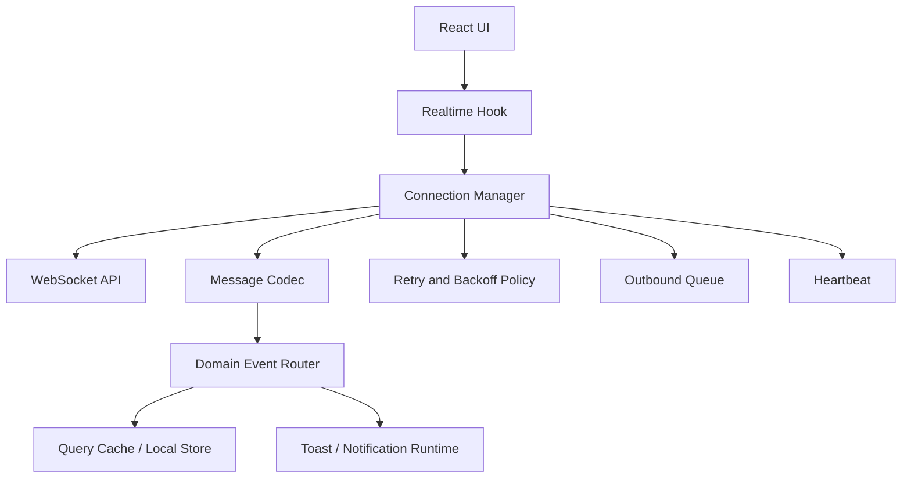
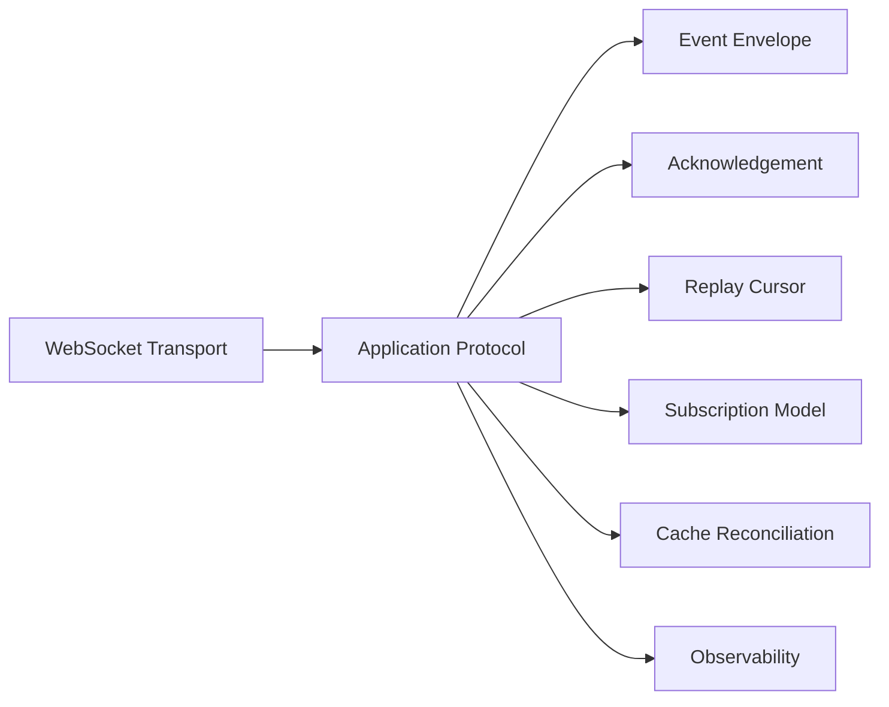
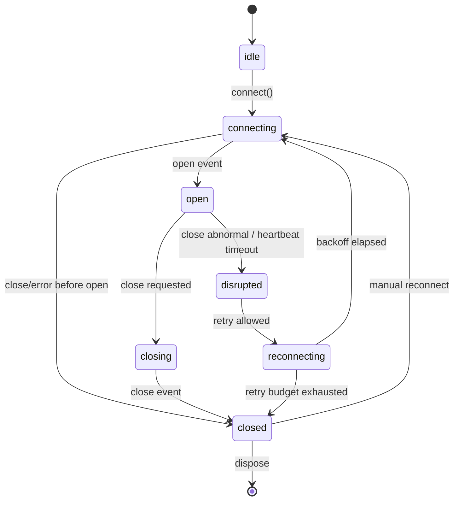
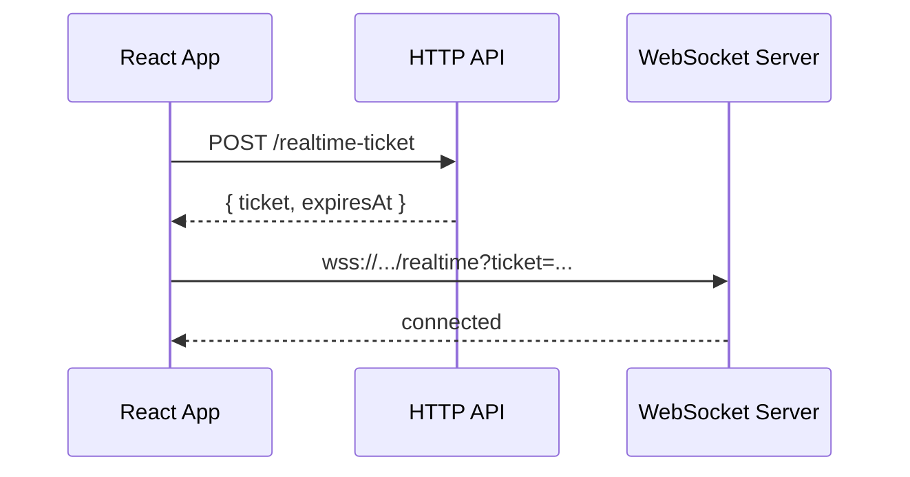
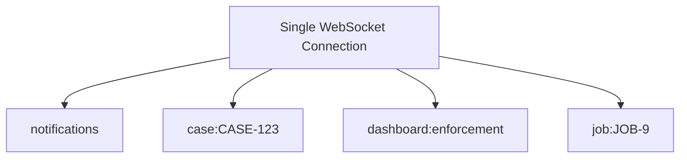
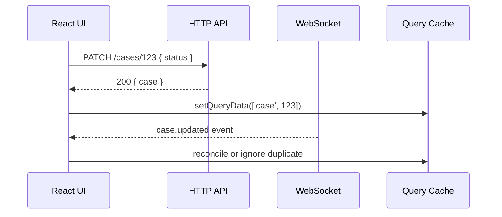

# Part 055 — WebSocket Client Architecture

WebSocket is not “fetch, but realtime”.

It is a long-lived bidirectional connection with a different failure model:

- the request is not the unit of work,
- the connection is the unit of liveness,
- messages are the unit of application meaning,
- ordering and delivery must be designed above the browser API,
- reconnection is a protocol decision, not a UI afterthought.

The first senior-level mistake is to put this inside a component:

```tsx
useEffect(() => {
  const socket = new WebSocket(url)
  socket.onmessage = (event) => setData(JSON.parse(event.data))
  return () => socket.close()
}, [url])
```

This works for a demo.

It is not architecture.

A production WebSocket client needs a **connection manager** with explicit state, message validation, reconnection policy, heartbeat, outbound queueing, cache integration, and observability.



This part builds that model.

---

## 1. Where WebSocket Fits

Use WebSocket when the client and server need bidirectional, low-latency communication over a persistent session.

Good fits:

- collaborative editing,
- chat,
- multiplayer interaction,
- live operational dashboards with client commands,
- trading/order-entry sessions,
- notification systems that also require client acknowledgements,
- job control channels,
- remote device control,
- support agent consoles,
- case-management screens where operators and backend workers coordinate in near realtime.

Poor fits:

- ordinary CRUD,
- read-mostly dashboards that can use SSE,
- occasional status updates that can use polling,
- fire-and-forget mutations that should be ordinary HTTP commands,
- data fetching where cacheability, retries, and observability are better served by HTTP.

Decision rule:

> If the client only needs to be told that data changed, prefer SSE or polling. If the client and server are in an interactive session, consider WebSocket.

---

## 2. WebSocket Is a Transport, Not a Domain Protocol

The browser WebSocket API gives you:

- connect,
- send,
- receive message event,
- close,
- observe error/close/open events.

It does not give you:

- typed messages,
- authentication lifecycle,
- replay,
- resubscription,
- message acknowledgement,
- authorization semantics,
- idempotency,
- conflict resolution,
- cache updates,
- backpressure handling,
- domain consistency.

Those are application protocol responsibilities.



A React application should not scatter those responsibilities across components.

Centralize them.

---

## 3. The Browser API Surface

The native API is event-driven:

```ts
const socket = new WebSocket('wss://api.example.com/realtime')

socket.addEventListener('open', () => {
  socket.send(JSON.stringify({ type: 'subscribe', topic: 'cases' }))
})

socket.addEventListener('message', (event) => {
  console.log(event.data)
})

socket.addEventListener('close', (event) => {
  console.log(event.code, event.reason, event.wasClean)
})

socket.addEventListener('error', () => {
  console.log('socket error')
})
```

Important constraints:

- `send()` is synchronous from your JavaScript point of view, but delivery is asynchronous.
- `send()` does not mean the server processed the message.
- `error` does not expose rich network details.
- `close` is the useful event for reconnection decisions.
- `readyState` is coarse: connecting, open, closing, closed.
- the classic WebSocket API does not provide application-level backpressure.

So the client must avoid treating `socket.send()` as a successful mutation.

---

## 4. Connection Lifecycle State Machine

The first design artifact is the lifecycle.



Represent this state explicitly:

```ts
type SocketStatus =
  | { tag: 'idle' }
  | { tag: 'connecting'; attempt: number }
  | { tag: 'open'; connectedAt: number }
  | { tag: 'closing'; reason: string }
  | { tag: 'reconnecting'; attempt: number; nextAttemptAt: number }
  | { tag: 'closed'; reason: string; code?: number }
```

This gives UI and observability a stable vocabulary:

- “connecting” is not “error”,
- “reconnecting” is degraded but potentially recoverable,
- “closed due to unauthorized” is not recoverable by retry,
- “closed due to app navigation” should not show a scary toast.

---

## 5. Define an Application Envelope

Never let random JSON strings flow through the app.

Define a message envelope.

```ts
type ClientMessage =
  | {
      kind: 'subscribe'
      requestId: string
      topic: string
      params?: Record<string, unknown>
    }
  | {
      kind: 'unsubscribe'
      requestId: string
      topic: string
    }
  | {
      kind: 'command'
      requestId: string
      idempotencyKey: string
      command: string
      payload: unknown
    }
  | {
      kind: 'ack'
      eventId: string
    }

type ServerMessage =
  | {
      kind: 'connected'
      connectionId: string
      serverTime: string
      resumeFrom?: string
    }
  | {
      kind: 'subscribed'
      requestId: string
      topic: string
    }
  | {
      kind: 'event'
      eventId: string
      topic: string
      sequence?: number
      type: string
      payload: unknown
      occurredAt: string
    }
  | {
      kind: 'command_result'
      requestId: string
      idempotencyKey?: string
      ok: boolean
      payload?: unknown
      error?: ProblemLike
    }
  | {
      kind: 'error'
      requestId?: string
      code: string
      message: string
      retryable?: boolean
    }
  | {
      kind: 'pong'
      serverTime: string
    }
```

The envelope exists to answer operational questions:

- Can this message be correlated to a user action?
- Can this message be replayed?
- Can duplicates be ignored?
- Can the client resume after reconnect?
- Can failures be mapped to UI states?
- Can logs be joined across client and server?

Without an envelope, realtime becomes a pile of callbacks.

---

## 6. Validate Incoming Messages

The socket is a network boundary.

Network data is `unknown`.

```ts
function parseServerMessage(raw: MessageEvent): ServerMessage {
  const text = typeof raw.data === 'string' ? raw.data : undefined

  if (!text) {
    throw new Error('Unsupported websocket payload type')
  }

  const json: unknown = JSON.parse(text)

  return ServerMessageSchema.parse(json)
}
```

Use runtime validation at this boundary.

Do not trust TypeScript types generated from your own code if the data crossed the network.

A malformed message should not crash the React tree.

Recommended handling:

```ts
try {
  const message = parseServerMessage(event)
  router.handle(message)
} catch (error) {
  telemetry.realtimeMalformedMessage({ error })
  manager.close({ code: 1003, reason: 'Unsupported message format' })
}
```

Close with an appropriate policy if the stream becomes unsafe.

---

## 7. Connection Manager Skeleton

A minimal manager separates transport from React.

```ts
type RealtimeObserver = (status: SocketStatus) => void

type RealtimeManagerOptions = {
  url: () => Promise<string> | string
  protocols?: string[]
  reconnect: ReconnectPolicy
  heartbeat: HeartbeatPolicy
  onMessage: (message: ServerMessage) => void
  onStatus?: (status: SocketStatus) => void
  onTelemetry?: (event: RealtimeTelemetryEvent) => void
}

class RealtimeManager {
  private socket: WebSocket | null = null
  private status: SocketStatus = { tag: 'idle' }
  private disposed = false
  private attempt = 0
  private reconnectTimer: ReturnType<typeof setTimeout> | null = null
  private heartbeatTimer: ReturnType<typeof setInterval> | null = null
  private lastMessageAt = 0
  private observers = new Set<RealtimeObserver>()

  constructor(private readonly options: RealtimeManagerOptions) {}

  subscribe(observer: RealtimeObserver): () => void {
    this.observers.add(observer)
    observer(this.status)
    return () => this.observers.delete(observer)
  }

  async connect(): Promise<void> {
    if (this.disposed) return
    if (this.socket && this.socket.readyState <= WebSocket.OPEN) return

    this.setStatus({ tag: 'connecting', attempt: this.attempt })

    const url = await this.options.url()
    const socket = new WebSocket(url, this.options.protocols)
    this.socket = socket

    socket.addEventListener('open', () => this.handleOpen())
    socket.addEventListener('message', (event) => this.handleMessage(event))
    socket.addEventListener('close', (event) => this.handleClose(event))
    socket.addEventListener('error', () => this.handleError())
  }

  send(message: ClientMessage): boolean {
    const socket = this.socket
    if (!socket || socket.readyState !== WebSocket.OPEN) return false
    socket.send(JSON.stringify(message))
    return true
  }

  close(reason = 'client close'): void {
    this.disposed = true
    this.clearTimers()
    this.setStatus({ tag: 'closing', reason })
    this.socket?.close(1000, reason)
    this.socket = null
  }

  private handleOpen(): void {
    this.attempt = 0
    this.lastMessageAt = Date.now()
    this.setStatus({ tag: 'open', connectedAt: Date.now() })
    this.startHeartbeat()
  }

  private handleMessage(event: MessageEvent): void {
    this.lastMessageAt = Date.now()

    try {
      const message = parseServerMessage(event)
      this.options.onMessage(message)
    } catch (error) {
      this.options.onTelemetry?.({ type: 'malformed_message', error })
      this.socket?.close(1003, 'Malformed message')
    }
  }

  private handleError(): void {
    this.options.onTelemetry?.({ type: 'socket_error' })
  }

  private handleClose(event: CloseEvent): void {
    this.clearHeartbeat()
    this.socket = null

    if (this.disposed) {
      this.setStatus({ tag: 'closed', reason: 'disposed', code: event.code })
      return
    }

    if (!this.shouldReconnect(event)) {
      this.setStatus({ tag: 'closed', reason: event.reason || 'closed', code: event.code })
      return
    }

    this.scheduleReconnect(event)
  }

  private setStatus(status: SocketStatus): void {
    this.status = status
    this.options.onStatus?.(status)
    for (const observer of this.observers) observer(status)
  }

  private shouldReconnect(event: CloseEvent): boolean {
    if (event.code === 1000) return false
    if (event.code === 1008) return false
    if (event.code === 4401) return false
    if (event.code === 4403) return false
    return this.attempt < this.options.reconnect.maxAttempts
  }

  private scheduleReconnect(event: CloseEvent): void {
    this.attempt += 1
    const delayMs = this.options.reconnect.delayMs(this.attempt, event)
    const nextAttemptAt = Date.now() + delayMs

    this.setStatus({ tag: 'reconnecting', attempt: this.attempt, nextAttemptAt })

    this.reconnectTimer = setTimeout(() => {
      void this.connect()
    }, delayMs)
  }

  private startHeartbeat(): void {
    this.clearHeartbeat()

    this.heartbeatTimer = setInterval(() => {
      const ageMs = Date.now() - this.lastMessageAt

      if (ageMs > this.options.heartbeat.timeoutMs) {
        this.options.onTelemetry?.({ type: 'heartbeat_timeout', ageMs })
        this.socket?.close(4000, 'Heartbeat timeout')
        return
      }

      this.send({ kind: 'ack', eventId: 'heartbeat-probe' })
    }, this.options.heartbeat.intervalMs)
  }

  private clearHeartbeat(): void {
    if (this.heartbeatTimer) clearInterval(this.heartbeatTimer)
    this.heartbeatTimer = null
  }

  private clearTimers(): void {
    if (this.reconnectTimer) clearTimeout(this.reconnectTimer)
    this.reconnectTimer = null
    this.clearHeartbeat()
  }
}
```

This is still incomplete, but it is already better than embedding sockets in components.

---

## 8. Reconnection Policy

Reconnection is not just “try again”.

It must classify close reasons.

```ts
type ReconnectPolicy = {
  maxAttempts: number
  delayMs: (attempt: number, event: CloseEvent) => number
}

function fullJitterDelay(baseMs: number, maxMs: number) {
  return (attempt: number) => {
    const cap = Math.min(maxMs, baseMs * 2 ** attempt)
    return Math.floor(Math.random() * cap)
  }
}

const reconnectPolicy: ReconnectPolicy = {
  maxAttempts: 12,
  delayMs: (attempt) => fullJitterDelay(500, 30_000)(attempt),
}
```

Retry rules:

| Close condition | Reconnect? | Reason |
|---|---:|---|
| normal app close | no | user/session intentionally ended |
| network drop | yes | transient |
| server deploy restart | yes | transient |
| token expired | maybe | refresh token first, then reconnect |
| unauthorized | no | user cannot access channel |
| forbidden | no | retry cannot fix permission |
| protocol violation | no | client/server incompatible |
| overloaded | yes, slow | avoid reconnection storm |

The server and client should agree on close-code semantics.

Many teams use application-specific codes in the 4000-4999 range.

Example:

| Code | Meaning | Client action |
|---:|---|---|
| 4000 | heartbeat timeout | reconnect |
| 4001 | session expired | refresh credential and reconnect |
| 4003 | forbidden subscription | do not retry same subscription |
| 4008 | rate limited | wait before reconnect |
| 4010 | protocol version unsupported | hard fail and report |

Document this like an API contract.

---

## 9. Heartbeat and Liveness

A WebSocket can appear open while the network path is dead.

The client needs liveness detection.

Browser JavaScript cannot send WebSocket protocol ping frames directly.

So define an application heartbeat:

```ts
type HeartbeatPolicy = {
  intervalMs: number
  timeoutMs: number
}

type PingMessage = {
  kind: 'ping'
  sentAt: string
}

type PongMessage = {
  kind: 'pong'
  serverTime: string
}
```

Client behavior:

1. When connected, record `lastMessageAt`.
2. Periodically send `ping`.
3. Accept any inbound message as proof of life, or require explicit `pong` if stricter.
4. If no message arrives before timeout, close the socket.
5. Let reconnect policy decide the next step.

```ts
private startHeartbeat(): void {
  this.heartbeatTimer = setInterval(() => {
    const silenceMs = Date.now() - this.lastMessageAt

    if (silenceMs > this.options.heartbeat.timeoutMs) {
      this.socket?.close(4000, 'Heartbeat timeout')
      return
    }

    this.send({
      kind: 'ping',
      sentAt: new Date().toISOString(),
    } as ClientMessage)
  }, this.options.heartbeat.intervalMs)
}
```

Keep heartbeat intervals conservative.

Too aggressive heartbeat policies waste battery, mobile data, and server capacity.

---

## 10. Authentication and Authorization

A WebSocket connection begins with an HTTP upgrade handshake, but after that you are inside a persistent session.

Auth design choices:

| Strategy | Pros | Cons |
|---|---|---|
| Cookie-based auth | natural for same-origin apps | CSRF/cross-site WebSocket concerns must be handled |
| Token in query param | easy with native API | can leak in logs if not controlled |
| Token in subprotocol | avoids query string | awkward, still needs server support |
| First-message auth | explicit app protocol | connection exists before auth completes |
| Short-lived ticket | strong boundary | requires ticket endpoint |

A strong pattern is a short-lived WebSocket ticket:



The ticket should be:

- short-lived,
- scoped to user/tenant/session,
- scoped to allowed channels if possible,
- single-use if operationally feasible,
- safe to invalidate.

Authorization must be checked server-side per subscription and per command.

Do not assume that an authenticated socket is authorized for all topics.

```ts
type SubscribeMessage = {
  kind: 'subscribe'
  requestId: string
  topic: 'case' | 'dashboard' | 'notifications'
  resourceId?: string
}
```

The server response must say whether the subscription succeeded:

```ts
type SubscribedMessage = {
  kind: 'subscribed'
  requestId: string
  topic: string
}

type RejectedMessage = {
  kind: 'error'
  requestId: string
  code: 'FORBIDDEN' | 'NOT_FOUND' | 'INVALID_TOPIC'
  message: string
}
```

A silent failed subscription is an incident waiting to happen.

---

## 11. Subscription Model

Do not connect one socket per component.

Open one connection per app/session, then multiplex logical subscriptions.



The manager tracks subscription reference counts:

```ts
type Topic = string

type SubscriptionRecord = {
  count: number
  params?: Record<string, unknown>
}

class SubscriptionRegistry {
  private records = new Map<Topic, SubscriptionRecord>()

  add(topic: Topic, params?: Record<string, unknown>): boolean {
    const existing = this.records.get(topic)
    if (existing) {
      existing.count += 1
      return false
    }

    this.records.set(topic, { count: 1, params })
    return true
  }

  remove(topic: Topic): boolean {
    const existing = this.records.get(topic)
    if (!existing) return false

    existing.count -= 1
    if (existing.count > 0) return false

    this.records.delete(topic)
    return true
  }

  list(): Array<[Topic, SubscriptionRecord]> {
    return [...this.records.entries()]
  }
}
```

On reconnect, the client resubscribes:

```ts
private resubscribeAll(): void {
  for (const [topic, record] of this.subscriptions.list()) {
    this.send({
      kind: 'subscribe',
      requestId: crypto.randomUUID(),
      topic,
      params: record.params,
    })
  }
}
```

This makes route/component mounting independent from socket connection churn.

---

## 12. React Integration

React should subscribe to the manager, not own the socket.

```tsx
const RealtimeContext = createContext<RealtimeManager | null>(null)

export function RealtimeProvider({ children }: { children: React.ReactNode }) {
  const queryClient = useQueryClient()

  const manager = useMemo(() => {
    return new RealtimeManager({
      url: async () => {
        const ticket = await createRealtimeTicket()
        return `wss://api.example.com/realtime?ticket=${encodeURIComponent(ticket.value)}`
      },
      reconnect: reconnectPolicy,
      heartbeat: { intervalMs: 25_000, timeoutMs: 75_000 },
      onMessage: (message) => routeRealtimeMessage(queryClient, message),
      onTelemetry: emitRealtimeTelemetry,
    })
  }, [queryClient])

  useEffect(() => {
    void manager.connect()
    return () => manager.close('provider unmounted')
  }, [manager])

  return <RealtimeContext.Provider value={manager}>{children}</RealtimeContext.Provider>
}
```

Expose narrow hooks:

```tsx
export function useRealtimeStatus(): SocketStatus {
  const manager = useRequiredRealtimeManager()

  return useSyncExternalStore(
    (onStoreChange) => manager.subscribe(onStoreChange),
    () => manager.getStatus(),
    () => ({ tag: 'idle' })
  )
}
```

For topic subscriptions:

```tsx
export function useRealtimeTopic(topic: string, params?: Record<string, unknown>) {
  const manager = useRequiredRealtimeManager()

  useEffect(() => {
    return manager.subscribeTopic(topic, params)
  }, [manager, topic, stableStringify(params)])
}
```

Components say what they need.

The manager decides how to maintain the connection.

---

## 13. Outbound Queue and Command Acknowledgement

If the client sends commands over WebSocket, it needs acknowledgements.

`socket.send()` is not a successful command.

```ts
type PendingCommand = {
  requestId: string
  idempotencyKey: string
  sentAt: number
  resolve: (value: unknown) => void
  reject: (error: unknown) => void
  timeoutId: ReturnType<typeof setTimeout>
}
```

```ts
sendCommand(command: string, payload: unknown): Promise<unknown> {
  const requestId = crypto.randomUUID()
  const idempotencyKey = crypto.randomUUID()

  return new Promise((resolve, reject) => {
    const timeoutId = setTimeout(() => {
      this.pendingCommands.delete(requestId)
      reject(new Error('Command timed out'))
    }, 15_000)

    this.pendingCommands.set(requestId, {
      requestId,
      idempotencyKey,
      sentAt: Date.now(),
      resolve,
      reject,
      timeoutId,
    })

    const accepted = this.send({
      kind: 'command',
      requestId,
      idempotencyKey,
      command,
      payload,
    })

    if (!accepted) {
      clearTimeout(timeoutId)
      this.pendingCommands.delete(requestId)
      reject(new Error('Socket is not open'))
    }
  })
}
```

When the result arrives:

```ts
private handleCommandResult(message: Extract<ServerMessage, { kind: 'command_result' }>) {
  const pending = this.pendingCommands.get(message.requestId)
  if (!pending) return

  clearTimeout(pending.timeoutId)
  this.pendingCommands.delete(message.requestId)

  if (message.ok) {
    pending.resolve(message.payload)
  } else {
    pending.reject(message.error)
  }
}
```

If commands have side effects, add server-side idempotency.

The client can time out while the server still succeeds.

Idempotency is how retries avoid duplicate business effects.

---

## 14. Backpressure and Buffer Control

Classic browser WebSocket has no real backpressure mechanism for inbound messages.

This matters.

If the server emits 10,000 messages per second and the UI can process 200, the app will eventually burn CPU or memory.

Client-side mitigations:

- subscribe to narrower topics,
- aggregate server-side before sending,
- coalesce invalidation events,
- batch UI updates,
- cap local queues,
- drop low-priority signals,
- close the socket when the protocol is unsafe,
- prefer snapshot refetch over applying huge deltas.

Example inbound queue with cap:

```ts
class InboundEventBuffer<T> {
  private items: T[] = []
  private scheduled = false

  constructor(
    private readonly maxSize: number,
    private readonly flush: (items: T[]) => void
  ) {}

  push(item: T): void {
    if (this.items.length >= this.maxSize) {
      this.items.shift()
    }

    this.items.push(item)

    if (!this.scheduled) {
      this.scheduled = true
      queueMicrotask(() => this.drain())
    }
  }

  private drain(): void {
    this.scheduled = false
    const batch = this.items
    this.items = []
    this.flush(batch)
  }
}
```

For high-volume systems, design the server protocol around coalesced signals:

```ts
type InvalidationEvent = {
  kind: 'event'
  type: 'resource.invalidated'
  topic: 'cases'
  payload: {
    resource: 'case'
    ids: string[]
    reason: 'bulk_update' | 'permission_change' | 'workflow_transition'
  }
}
```

Do not stream every row-level change to every browser if the UI only needs “refresh this list”.

---

## 15. Ordering, Duplicates, and Resume

WebSocket preserves message order on a single connection.

That does not solve distributed ordering.

Problems still happen:

- reconnect creates a gap,
- server shards may produce events from different partitions,
- the same event may be delivered twice,
- optimistic client state may already include a change,
- refetch may return a newer snapshot than an older event.

Add event identity and sequence metadata:

```ts
type DomainEvent = {
  kind: 'event'
  eventId: string
  stream: string
  sequence: number
  type: string
  payload: unknown
  occurredAt: string
}
```

Track the last sequence per stream:

```ts
class EventCursorStore {
  private cursors = new Map<string, number>()
  private seen = new Set<string>()

  shouldApply(event: DomainEvent): 'apply' | 'duplicate' | 'gap' | 'old' {
    if (this.seen.has(event.eventId)) return 'duplicate'

    const previous = this.cursors.get(event.stream) ?? 0

    if (event.sequence === previous + 1) return 'apply'
    if (event.sequence <= previous) return 'old'
    return 'gap'
  }

  commit(event: DomainEvent): void {
    this.seen.add(event.eventId)
    this.cursors.set(event.stream, event.sequence)
  }
}
```

On gap:

```ts
function handleGap(event: DomainEvent, queryClient: QueryClient) {
  telemetry.realtimeGapDetected({ stream: event.stream, sequence: event.sequence })

  queryClient.invalidateQueries({ queryKey: ['cases'] })
  queryClient.invalidateQueries({ queryKey: ['notifications'] })
}
```

A gap should trigger resync, not blind patching.

---

## 16. Cache Integration

Most WebSocket events should not directly mutate component state.

Route them into server-state infrastructure.

```ts
function routeRealtimeMessage(queryClient: QueryClient, message: ServerMessage): void {
  if (message.kind !== 'event') return

  switch (message.type) {
    case 'case.updated': {
      const payload = CaseUpdatedSchema.parse(message.payload)

      queryClient.setQueryData(['case', payload.caseId], (old: CaseDetail | undefined) => {
        if (!old) return old
        return {
          ...old,
          status: payload.status,
          version: payload.version,
          updatedAt: payload.updatedAt,
        }
      })

      queryClient.invalidateQueries({ queryKey: ['cases', 'list'] })
      return
    }

    case 'case.deleted': {
      const payload = CaseDeletedSchema.parse(message.payload)
      queryClient.removeQueries({ queryKey: ['case', payload.caseId] })
      queryClient.invalidateQueries({ queryKey: ['cases', 'list'] })
      return
    }

    case 'permissions.changed': {
      queryClient.invalidateQueries()
      return
    }
  }
}
```

Patch when:

- the event payload is complete enough,
- the target cache entry identity is clear,
- versioning prevents old events from overwriting new data,
- the update is small and deterministic.

Invalidate when:

- list membership may change,
- permissions may change,
- derived summaries may change,
- payload is partial,
- event ordering is uncertain,
- a gap was detected.

---

## 17. WebSocket Commands vs HTTP Mutations

Should mutations go over WebSocket?

Use HTTP when:

- the command is ordinary CRUD,
- audit/trace semantics are already HTTP-based,
- idempotency keys and retries are easier over HTTP,
- the result is request-response shaped,
- you want standard tooling, gateways, rate limits, and observability.

Use WebSocket command messages when:

- command and response are part of an interactive realtime session,
- the server needs to push multiple intermediate results,
- low-latency session affinity matters,
- the operation is naturally channel-based,
- you need command acknowledgements tied to the same stream.

A common hybrid:

- HTTP for durable writes,
- WebSocket for event notification and collaboration signals.



This avoids turning every business operation into a custom realtime RPC protocol.

---

## 18. Multi-Tab Connection Strategy

If the user opens five tabs, should you open five sockets?

Sometimes yes.

Often no.

Risks of one socket per tab:

- server connection fan-out,
- duplicate notifications,
- subscription amplification,
- reconnect storm after network recovery,
- inconsistent per-tab cursors.

Options:

| Strategy | When to use |
|---|---|
| one socket per tab | simple, low scale, independent tabs |
| leader tab owns socket | high scale, duplicate events are expensive |
| SharedWorker owns socket | supported environments where worker lifecycle fits |
| server limits per user | defensive fallback |

Do not over-engineer this early, but make the protocol idempotent so duplicate events do not corrupt state.

At minimum:

- event IDs must be stable,
- notifications must dedupe,
- commands must use idempotency keys,
- server should enforce connection limits.

---

## 19. UI Status Design

Realtime status should be visible enough to explain degraded behavior but not noisy.

Example mapping:

| State | UI behavior |
|---|---|
| connecting | optional subtle indicator |
| open | no indicator unless relevant |
| reconnecting | “Live updates temporarily disconnected” |
| closed unauthorized | show auth/session action |
| closed forbidden | hide realtime feature or show permission message |
| degraded due to gaps | show stale badge while refetching |

Do not toast every reconnect.

Users do not need to know every network flap.

They need to know whether the screen is trustworthy.

---

## 20. Security Failure Modes

WebSocket security is frequently under-designed.

Key risks:

- authenticated socket subscribed to unauthorized topics,
- tokens exposed in URLs/logs,
- cross-site WebSocket hijacking with cookie auth,
- missing origin checks,
- long-lived session after logout,
- server trusts client-declared user/tenant,
- command messages bypass HTTP validation/audit middleware,
- rate limit absent because “it is one connection”.

Minimum guardrails:

- use `wss://`,
- validate `Origin` on the server,
- authenticate handshake or first auth message,
- authorize each subscription and command,
- close sockets on session revocation when possible,
- use scoped short-lived tickets for sensitive systems,
- treat command payloads like HTTP request bodies,
- rate limit per user/session/topic/command,
- log connection ID, user ID, tenant ID, topic, and request ID.

---

## 21. Observability

Realtime bugs are painful because they are temporal.

Instrument lifecycle events:

```ts
type RealtimeTelemetryEvent =
  | { type: 'connect_start'; attempt: number }
  | { type: 'connect_open'; connectionId?: string; durationMs: number }
  | { type: 'connect_close'; code: number; reason: string; wasClean: boolean }
  | { type: 'reconnect_scheduled'; attempt: number; delayMs: number }
  | { type: 'message_received'; messageType: string; topic?: string; bytes: number }
  | { type: 'message_malformed'; reason: string }
  | { type: 'heartbeat_timeout'; silenceMs: number }
  | { type: 'subscription_rejected'; topic: string; code: string }
  | { type: 'event_gap'; stream: string; expected?: number; actual: number }
  | { type: 'outbound_command_timeout'; command: string }
```

Track metrics:

- connection success rate,
- average connection duration,
- reconnect rate,
- close codes,
- malformed message count,
- subscription rejection count,
- message rate per topic,
- dropped/coalesced message count,
- command acknowledgement latency,
- event-to-cache-apply latency,
- gap detection count.

Correlate with server logs using:

- connection ID,
- session ID,
- request ID,
- command idempotency key,
- event ID.

---

## 22. Testing Strategy

Test the manager without React first.

Useful test cases:

1. connect success moves `connecting -> open`,
2. normal close does not reconnect,
3. abnormal close schedules reconnect,
4. unauthorized close does not reconnect,
5. malformed message closes connection or reports error,
6. subscription is resent after reconnect,
7. duplicate subscription increments reference count but sends once,
8. unsubscribe sends only when reference count reaches zero,
9. command resolves on `command_result`,
10. command rejects on timeout,
11. heartbeat timeout closes socket,
12. event gap triggers cache invalidation,
13. events patch cache immutably,
14. dispose clears timers.

Mock WebSocket explicitly:

```ts
class FakeWebSocket extends EventTarget {
  static CONNECTING = 0
  static OPEN = 1
  static CLOSING = 2
  static CLOSED = 3

  readyState = FakeWebSocket.CONNECTING
  sent: string[] = []

  constructor(public readonly url: string) {
    super()
  }

  open() {
    this.readyState = FakeWebSocket.OPEN
    this.dispatchEvent(new Event('open'))
  }

  send(data: string) {
    this.sent.push(data)
  }

  receive(data: unknown) {
    this.dispatchEvent(new MessageEvent('message', { data: JSON.stringify(data) }))
  }

  close(code = 1000, reason = '') {
    this.readyState = FakeWebSocket.CLOSED
    this.dispatchEvent(new CloseEvent('close', { code, reason, wasClean: code === 1000 }))
  }
}
```

Then test React hooks as thin wrappers around manager behavior.

---

## 23. Production Checklist

Before shipping WebSocket in a React app, verify:

- [ ] there is one clear connection owner,
- [ ] messages use a versioned envelope,
- [ ] incoming payloads are runtime-validated,
- [ ] reconnect policy distinguishes recoverable and non-recoverable close codes,
- [ ] heartbeat detects half-open connections,
- [ ] subscriptions are reference-counted and restored after reconnect,
- [ ] commands use request IDs and idempotency keys,
- [ ] command success is based on server acknowledgement, not `send()`,
- [ ] event IDs prevent duplicate application,
- [ ] sequence/cursor metadata supports gap detection,
- [ ] cache reconciliation is centralized,
- [ ] high-volume topics are coalesced or narrowed,
- [ ] auth tickets/tokens are scoped and short-lived,
- [ ] server validates origin, auth, and authorization,
- [ ] metrics cover close codes, reconnects, gaps, and malformed messages,
- [ ] tests simulate reconnect, malformed messages, timeout, duplicates, and out-of-order events.

---

## 24. Mental Model

A WebSocket client is not a hook.

It is a small distributed system endpoint running inside the browser.

It has:

- lifecycle,
- protocol,
- identity,
- retry,
- ordering,
- authorization,
- queues,
- observability,
- reconciliation.

React is only one consumer of that endpoint.

Build the endpoint first.

Then expose it to React through narrow, boring hooks.

---

## Sources

- MDN Web Docs — WebSocket API: https://developer.mozilla.org/en-US/docs/Web/API/WebSocket
- MDN Web Docs — WebSocket API overview and backpressure note: https://developer.mozilla.org/en-US/docs/Web/API/WebSockets_API
- MDN Web Docs — WebSocketStream: https://developer.mozilla.org/en-US/docs/Web/API/WebSocketStream
- RFC 6455 — The WebSocket Protocol: https://datatracker.ietf.org/doc/html/rfc6455
- WHATWG WebSockets Standard: https://websockets.spec.whatwg.org/
- TanStack Query — Query Invalidation: https://tanstack.com/query/latest/docs/framework/react/guides/query-invalidation
- TanStack Query — QueryClient reference: https://tanstack.com/query/latest/docs/reference/QueryClient
