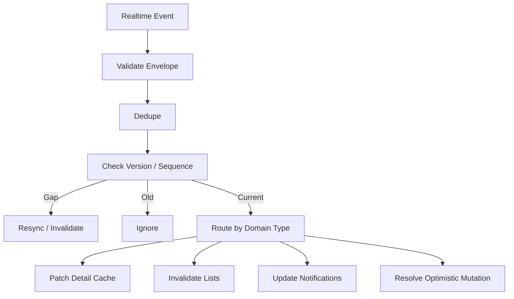
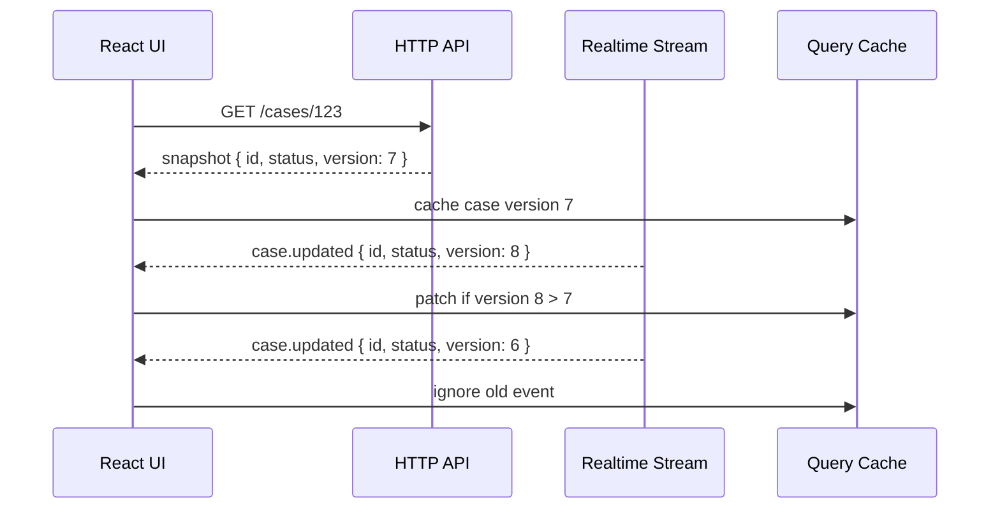
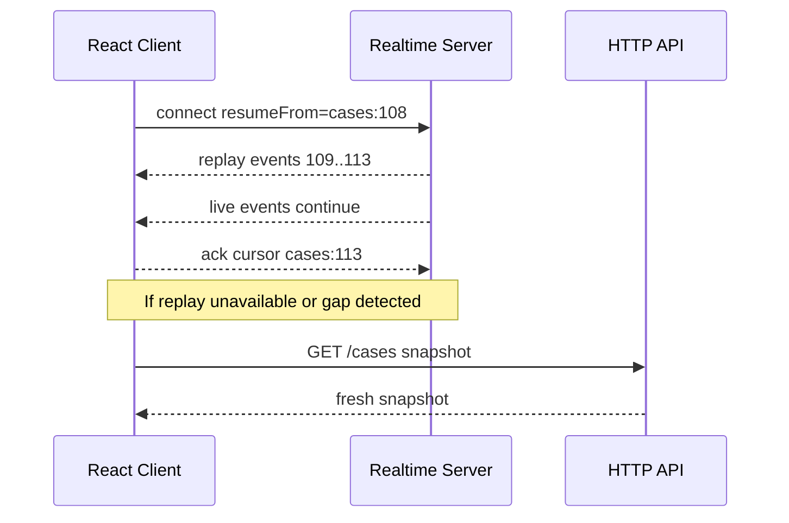
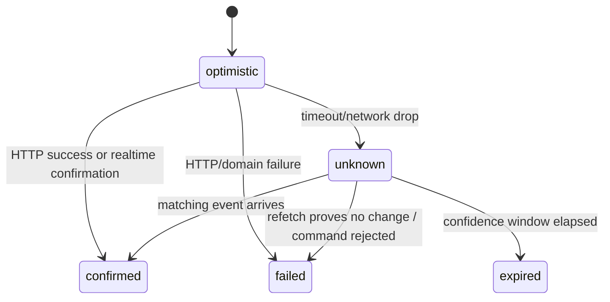

# Part 056 — Realtime State Reconciliation

Realtime transport is easy to overestimate.

Receiving events is not the same as having correct UI state.

A React app must answer harder questions:

- Is this event new or duplicate?
- Is this event older than the cache entry?
- Did we miss earlier events while disconnected?
- Does this event contain enough data to patch the cache?
- Should this event invalidate a query instead?
- Does this event conflict with an optimistic mutation?
- Does the user still have permission to see the affected data?
- Does this event change list membership, counts, badges, aggregates, or derived views?

Realtime state reconciliation is the discipline of turning an event stream into trustworthy UI state.



This part is about correctness under time.

---

## 1. Events Are Not State

A common mistake:

> “The server sent an event, so I will just merge it into my React state.”

That is only safe when the event is complete, ordered, authorized, current, and semantically sufficient.

Most production events are not.

A better model:

> snapshots give truth; events give freshness and change hints.



The snapshot is the full representation returned by the API.

The event is a signal that can update, invalidate, or trigger resync.

---

## 2. Reconciliation Strategies

There are five useful strategies.

| Strategy | What it does | Use when |
|---|---|---|
| ignore | do nothing | duplicate, old, irrelevant event |
| invalidate | mark cache stale and refetch | payload is partial or derived state may change |
| patch | update existing cache entry | event has sufficient data and versioning |
| append/prepend | update feed/list locally | event naturally belongs to timeline or notification stream |
| resync | discard confidence and fetch snapshot | gap, permission change, protocol mismatch |

Most realtime systems use a mix.

Do not force every event to be a patch.

Invalidation is often more correct and cheaper to reason about.

---

## 3. Event Envelope

A production event envelope needs more than `type` and `payload`.

```ts
type RealtimeEventEnvelope<TPayload = unknown> = {
  eventId: string
  eventType: string
  stream: string
  sequence?: number
  aggregateType?: string
  aggregateId?: string
  version?: number
  tenantId: string
  actorId?: string
  correlationId?: string
  causationId?: string
  occurredAt: string
  payload: TPayload
}
```

Field purpose:

| Field | Why it exists |
|---|---|
| `eventId` | dedupe |
| `eventType` | routing |
| `stream` | sequence/cursor scope |
| `sequence` | gap detection |
| `aggregateId` | cache entry targeting |
| `version` | stale event prevention |
| `tenantId` | isolation and audit |
| `correlationId` | link to user action/request |
| `causationId` | link event to command or prior event |
| `occurredAt` | telemetry and display, not ordering alone |

Do not rely on timestamps for correctness ordering.

Use version or sequence where correctness matters.

---

## 4. Dedupe First

Event delivery can be at-least-once.

The same event may arrive twice due to reconnect, replay, broker redelivery, or multi-tab fan-out.

Dedupe before applying anything.

```ts
class SeenEventStore {
  private seen = new Map<string, number>()

  constructor(private readonly ttlMs: number) {}

  has(eventId: string): boolean {
    this.evictExpired()
    return this.seen.has(eventId)
  }

  mark(eventId: string): void {
    this.seen.set(eventId, Date.now() + this.ttlMs)
  }

  private evictExpired(): void {
    const now = Date.now()
    for (const [eventId, expiresAt] of this.seen) {
      if (expiresAt <= now) this.seen.delete(eventId)
    }
  }
}
```

Keep TTL bounded.

A browser is not an infinite event log.

---

## 5. Version-Aware Patch

For detail resources, version checks prevent old events from overwriting newer snapshots.

```ts
type CaseDetail = {
  id: string
  status: string
  assigneeId: string | null
  version: number
  updatedAt: string
}

type CaseUpdatedPayload = {
  caseId: string
  status?: string
  assigneeId?: string | null
  version: number
  updatedAt: string
}

function applyCaseUpdated(old: CaseDetail | undefined, event: CaseUpdatedPayload) {
  if (!old) return old

  if (event.version <= old.version) {
    return old
  }

  return {
    ...old,
    status: event.status ?? old.status,
    assigneeId: event.assigneeId ?? old.assigneeId,
    version: event.version,
    updatedAt: event.updatedAt,
  }
}
```

Use it with the query cache:

```ts
queryClient.setQueryData(['case', payload.caseId], (old: CaseDetail | undefined) => {
  return applyCaseUpdated(old, payload)
})
```

This is safe only for the detail cache.

The list cache may still need invalidation because sort order, filters, counts, and membership can change.

```ts
queryClient.invalidateQueries({ queryKey: ['cases', 'list'] })
```

---

## 6. Why Lists Are Harder Than Details

Detail cache identity is simple:

```ts
['case', caseId]
```

List identity includes parameters:

```ts
['cases', 'list', { status: 'open', assigneeId: 'me', sort: 'updatedAt.desc' }]
```

A single event may affect many lists:

- open cases,
- assigned-to-me cases,
- overdue cases,
- escalation queue,
- dashboard counts,
- search results,
- recently updated cases.

Patching all lists correctly requires knowing each list predicate and sort rule.

That is fragile.

Prefer invalidation unless the list is naturally append-only.

```ts
function handleCaseUpdatedForLists(queryClient: QueryClient, payload: CaseUpdatedPayload) {
  queryClient.invalidateQueries({ queryKey: ['cases', 'list'] })
  queryClient.invalidateQueries({ queryKey: ['dashboard', 'case-counts'] })
}
```

Patch lists only when:

- the list predicate is trivial,
- event payload contains enough fields,
- sort position can be recomputed,
- the cost of refetch is unacceptable,
- tests cover membership transitions.

---

## 7. Infinite Query Reconciliation

Infinite queries are especially easy to corrupt.

A page cache is not a global ordered list.

Example shape:

```ts
type InfiniteCases = {
  pages: Array<{
    items: CaseSummary[]
    nextCursor?: string
  }>
  pageParams: unknown[]
}
```

A safe update for a known item:

```ts
function patchCaseInInfiniteCache(old: InfiniteCases | undefined, update: CaseUpdatedPayload) {
  if (!old) return old

  return {
    ...old,
    pages: old.pages.map((page) => ({
      ...page,
      items: page.items.map((item) => {
        if (item.id !== update.caseId) return item
        if (update.version <= item.version) return item

        return {
          ...item,
          status: update.status ?? item.status,
          assigneeId: update.assigneeId ?? item.assigneeId,
          version: update.version,
          updatedAt: update.updatedAt,
        }
      }),
    })),
  }
}
```

But if the event changes list membership or sort order, invalidate instead.

```ts
queryClient.invalidateQueries({ queryKey: ['cases', 'infinite'] })
```

Never insert into an infinite query unless you are certain about position, dedupe, cursor semantics, and max page policy.

---

## 8. Gap Detection

A gap means the client cannot trust patch-based reconciliation.

```ts
class StreamCursorTracker {
  private cursors = new Map<string, number>()

  inspect(event: RealtimeEventEnvelope): 'ok' | 'gap' | 'old' | 'unknown' {
    if (event.sequence == null) return 'unknown'

    const current = this.cursors.get(event.stream)
    if (current == null) return 'ok'

    if (event.sequence === current + 1) return 'ok'
    if (event.sequence <= current) return 'old'
    return 'gap'
  }

  commit(event: RealtimeEventEnvelope): void {
    if (event.sequence == null) return
    this.cursors.set(event.stream, event.sequence)
  }
}
```

On gap:

```ts
function handleRealtimeGap(queryClient: QueryClient, event: RealtimeEventEnvelope) {
  telemetry.realtimeGap({ stream: event.stream, sequence: event.sequence })

  switch (event.aggregateType) {
    case 'case':
      queryClient.invalidateQueries({ queryKey: ['case', event.aggregateId] })
      queryClient.invalidateQueries({ queryKey: ['cases'] })
      break
    default:
      queryClient.invalidateQueries()
  }
}
```

A gap is not a fatal UI error.

It is a confidence downgrade.

The app should resync through snapshots.

---

## 9. Snapshot Plus Cursor

For robust reconnect, the server should support resume.



The server may not retain replay forever.

So the client must support:

- resume if possible,
- invalidate and refetch if not,
- reset cursor after full snapshot if agreed by protocol.

```ts
type ConnectedMessage = {
  kind: 'connected'
  connectionId: string
  resumed: boolean
  replayAvailable: boolean
}
```

If `replayAvailable` is false, the client should not assume it has all changes.

---

## 10. Optimistic Mutation Interaction

Realtime events often echo the user’s own mutation.

Problem:

1. User updates case status optimistically.
2. HTTP mutation succeeds and patches detail cache.
3. WebSocket event arrives for the same update.
4. Client patches again or invalidates unnecessarily.

Solution: correlate events to mutations.

Use `clientMutationId`, `idempotencyKey`, or `correlationId`.

```ts
type OptimisticRegistryEntry = {
  idempotencyKey: string
  resourceKey: unknown[]
  submittedAt: number
  expectedEventTypes: string[]
}

class OptimisticRegistry {
  private entries = new Map<string, OptimisticRegistryEntry>()

  add(entry: OptimisticRegistryEntry): void {
    this.entries.set(entry.idempotencyKey, entry)
  }

  consumeByCorrelation(correlationId: string): OptimisticRegistryEntry | undefined {
    const entry = this.entries.get(correlationId)
    if (entry) this.entries.delete(correlationId)
    return entry
  }
}
```

When event arrives:

```ts
function handleCaseUpdated(event: RealtimeEventEnvelope<CaseUpdatedPayload>) {
  const matchedOptimistic = event.causationId
    ? optimisticRegistry.consumeByCorrelation(event.causationId)
    : undefined

  if (matchedOptimistic) {
    telemetry.optimisticConfirmed({ eventId: event.eventId })
  }

  queryClient.setQueryData(['case', event.payload.caseId], (old: CaseDetail | undefined) => {
    return applyCaseUpdated(old, event.payload)
  })

  if (!matchedOptimistic) {
    queryClient.invalidateQueries({ queryKey: ['cases', 'list'] })
  }
}
```

Do not assume every event from the current user is safe to ignore.

The server may enrich, normalize, reject, or transform the command.

The authoritative version still comes from the server.

---

## 11. Unknown Mutation Outcome

A mutation can time out while the server later emits a success event.

State machine:



For high-stakes commands, avoid pretending timeout means failure.

Represent unknown explicitly:

```ts
type MutationOutcome =
  | { tag: 'confirmed'; resourceVersion: number }
  | { tag: 'failed'; reason: ProblemLike }
  | { tag: 'unknown'; idempotencyKey: string; submittedAt: number }
```

UI copy should be honest:

- “Saving…”
- “Saved”
- “Could not save”
- “Save status unknown. Checking latest state…”

Then refetch or wait for confirmation event.

---

## 12. Permission and Visibility Changes

Permission changes are reconciliation hazards.

Example:

- user is viewing Case 123,
- admin revokes access,
- realtime event `permissions.changed` arrives,
- existing cache still contains sensitive data.

Do not simply invalidate later.

For sensitive systems, remove first, then refetch allowed data.

```ts
function handlePermissionChanged(queryClient: QueryClient) {
  queryClient.removeQueries({ queryKey: ['case'] })
  queryClient.removeQueries({ queryKey: ['cases'] })
  queryClient.invalidateQueries({ queryKey: ['me', 'permissions'] })
}
```

For tenant/user changes:

```ts
function clearUserScopedRealtimeState(queryClient: QueryClient) {
  queryClient.clear()
  seenEventStore.clear()
  cursorStore.clear()
  optimisticRegistry.clear()
}
```

A cache that is technically stale can also be a security leak.

---

## 13. Cross-Entity Impact

One domain event may affect many UI resources.

Example:

```ts
type CaseEscalatedPayload = {
  caseId: string
  previousSeverity: string
  severity: string
  assignedTeamId: string
  version: number
}
```

Impacted queries:

- case detail,
- case list,
- escalation queue,
- team workload count,
- SLA dashboard,
- notification feed,
- audit timeline.

Encode this as an impact map:

```ts
type RealtimeImpactHandler<TPayload> = {
  patch?: (queryClient: QueryClient, payload: TPayload) => void
  invalidate?: (queryClient: QueryClient, payload: TPayload) => void
  notify?: (payload: TPayload) => void
}

const realtimeImpactMap = {
  'case.escalated': {
    patch(queryClient, payload: CaseEscalatedPayload) {
      queryClient.setQueryData(['case', payload.caseId], (old: CaseDetail | undefined) => {
        if (!old || payload.version <= old.version) return old
        return { ...old, severity: payload.severity, version: payload.version }
      })
    },
    invalidate(queryClient) {
      queryClient.invalidateQueries({ queryKey: ['cases'] })
      queryClient.invalidateQueries({ queryKey: ['escalation-queue'] })
      queryClient.invalidateQueries({ queryKey: ['dashboard', 'sla'] })
    },
    notify(payload) {
      showToast(`Case ${payload.caseId} escalated`)
    },
  },
} satisfies Record<string, RealtimeImpactHandler<any>>
```

This prevents impact logic from being scattered across components.

---

## 14. Realtime Notifications vs Data State

Notifications are not the same as resource data.

A notification feed may intentionally show historic events that do not match current resource state.

Example:

- “Case 123 was assigned to you” arrives.
- A second later, it is reassigned away.
- The notification may remain in the feed, but the case list should remove it.

Keep separate models:

```ts
type NotificationItem = {
  notificationId: string
  eventId: string
  title: string
  body: string
  read: boolean
  createdAt: string
  resource?: {
    type: string
    id: string
  }
}
```

A realtime event can update both:

```ts
function handleNotificationCreated(queryClient: QueryClient, payload: NotificationItem) {
  queryClient.setQueryData(['notifications'], (old: NotificationItem[] | undefined) => {
    const list = old ?? []
    if (list.some((item) => item.notificationId === payload.notificationId)) return list
    return [payload, ...list]
  })

  queryClient.invalidateQueries({ queryKey: ['notification-counts'] })
}
```

Do not let notification state become the source of truth for domain state.

---

## 15. Realtime Search Results

Search result caches are derived views.

Most realtime events should invalidate them, not patch them.

Why?

Search ranking can depend on:

- full-text indexes,
- permissions,
- synonyms,
- scoring,
- recency boosts,
- backend-specific filters,
- eventual index propagation.

The frontend cannot reliably recompute that.

Use coarse invalidation:

```ts
queryClient.invalidateQueries({ queryKey: ['search'] })
```

Or delay/coalesce:

```ts
const invalidateSearch = debounce(() => {
  queryClient.invalidateQueries({ queryKey: ['search'] })
}, 1_000)
```

Realtime should not cause a refetch storm while the user types.

---

## 16. Consistency Guarantees Vocabulary

Be precise about what your UI promises.

| Guarantee | Meaning |
|---|---|
| eventual consistency | UI will converge after events/refetch |
| read-your-writes | user sees their own successful write immediately |
| monotonic reads | UI should not move backward to older versions |
| causal consistency | related changes are observed in causal order |
| strong consistency | UI reflects latest committed server state immediately |

Most React realtime systems are **eventually consistent with read-your-writes**.

That is fine if the UX communicates it and the app prevents dangerous stale actions.

For high-risk workflows, add version preconditions to commands:

```http
PATCH /cases/123
If-Match: "case-version-8"
```

If the server returns conflict, refetch and ask the user to resolve.

Realtime is not a substitute for server-side concurrency control.

---

## 17. Reconciliation Router

A central router makes behavior inspectable.

```ts
type ReconciliationContext = {
  queryClient: QueryClient
  seen: SeenEventStore
  cursors: StreamCursorTracker
  optimistic: OptimisticRegistry
  telemetry: RealtimeTelemetry
}

function reconcileRealtimeEvent(event: RealtimeEventEnvelope, context: ReconciliationContext): void {
  if (context.seen.has(event.eventId)) {
    context.telemetry.duplicate(event)
    return
  }

  const cursorStatus = context.cursors.inspect(event)

  if (cursorStatus === 'old') {
    context.seen.mark(event.eventId)
    context.telemetry.oldEvent(event)
    return
  }

  if (cursorStatus === 'gap') {
    context.seen.mark(event.eventId)
    handleRealtimeGap(context.queryClient, event)
    return
  }

  const handler = handlers[event.eventType]

  if (!handler) {
    context.telemetry.unhandled(event)
    context.queryClient.invalidateQueries()
    return
  }

  try {
    handler(event, context)
    context.seen.mark(event.eventId)
    context.cursors.commit(event)
  } catch (error) {
    context.telemetry.handlerFailed(event, error)
    handleRealtimeGap(context.queryClient, event)
  }
}
```

Handler failure should not leave the app silently divergent.

Fail closed into invalidation/resync.

---

## 18. Example Handler Set

```ts
const handlers: Record<
  string,
  (event: RealtimeEventEnvelope, context: ReconciliationContext) => void
> = {
  'case.updated': (event, { queryClient }) => {
    const payload = CaseUpdatedSchema.parse(event.payload)

    queryClient.setQueryData(['case', payload.caseId], (old: CaseDetail | undefined) => {
      return applyCaseUpdated(old, payload)
    })

    queryClient.invalidateQueries({ queryKey: ['cases', 'list'] })
  },

  'case.comment.added': (event, { queryClient }) => {
    const payload = CommentAddedSchema.parse(event.payload)

    queryClient.setQueryData(['case-comments', payload.caseId], (old: Comment[] | undefined) => {
      const comments = old ?? []
      if (comments.some((comment) => comment.id === payload.comment.id)) return comments
      return [...comments, payload.comment]
    })

    queryClient.invalidateQueries({ queryKey: ['case', payload.caseId] })
  },

  'case.deleted': (event, { queryClient }) => {
    const payload = CaseDeletedSchema.parse(event.payload)
    queryClient.removeQueries({ queryKey: ['case', payload.caseId] })
    queryClient.invalidateQueries({ queryKey: ['cases'] })
  },

  'permissions.changed': (_event, { queryClient }) => {
    queryClient.removeQueries({ queryKey: ['case'] })
    queryClient.removeQueries({ queryKey: ['cases'] })
    queryClient.invalidateQueries({ queryKey: ['me'] })
  },
}
```

This handler set makes trade-offs visible.

Each event says whether it patches, invalidates, removes, notifies, or resyncs.

---

## 19. Batch and Coalesce

Realtime event bursts can cause refetch storms.

Instead of invalidating immediately for every event, coalesce by query key.

```ts
class InvalidationBatcher {
  private keys = new Set<string>()
  private scheduled = false

  constructor(private readonly queryClient: QueryClient) {}

  add(queryKey: unknown[]): void {
    this.keys.add(JSON.stringify(queryKey))

    if (!this.scheduled) {
      this.scheduled = true
      setTimeout(() => this.flush(), 250)
    }
  }

  private flush(): void {
    this.scheduled = false

    const keys = [...this.keys].map((key) => JSON.parse(key))
    this.keys.clear()

    for (const queryKey of keys) {
      this.queryClient.invalidateQueries({ queryKey })
    }
  }
}
```

A 100-500ms coalescing window can collapse many domain events into one refetch without users noticing delay.

Do not coalesce critical safety actions like permission revocation cache removal.

---

## 20. Offline and Reconnect Recovery

During disconnection, the client loses realtime confidence.

Represent that:

```ts
type RealtimeConfidence =
  | { tag: 'live'; since: number }
  | { tag: 'degraded'; reason: 'disconnected' | 'gap' | 'handler_failed'; since: number }
  | { tag: 'resyncing'; since: number }
```

On reconnect:

1. ask server to resume from cursors,
2. if replay succeeds, apply replayed events,
3. if replay fails, invalidate affected snapshots,
4. clear degraded state after refetch completes.

```ts
function handleReconnectWithoutReplay(queryClient: QueryClient) {
  queryClient.invalidateQueries({ queryKey: ['cases'] })
  queryClient.invalidateQueries({ queryKey: ['notifications'] })
  queryClient.invalidateQueries({ queryKey: ['dashboard'] })
}
```

Do not keep showing “live” UI while disconnected.

---

## 21. Testing Reconciliation

Test event application as pure functions where possible.

Core tests:

1. duplicate event is ignored,
2. older version does not overwrite newer cache,
3. newer version patches detail cache,
4. list cache invalidates on membership-changing event,
5. delete removes detail cache and invalidates lists,
6. permission change removes sensitive queries,
7. gap triggers resync,
8. unknown event fails closed to invalidation,
9. optimistic confirmation does not double-apply,
10. infinite query patch does not mutate old objects,
11. burst invalidation is coalesced,
12. handler exception emits telemetry and resyncs.

Example:

```ts
it('does not apply older case update', () => {
  const old: CaseDetail = {
    id: 'CASE-1',
    status: 'closed',
    assigneeId: 'u1',
    version: 10,
    updatedAt: '2026-07-08T10:00:00Z',
  }

  const event: CaseUpdatedPayload = {
    caseId: 'CASE-1',
    status: 'open',
    version: 9,
    updatedAt: '2026-07-08T09:00:00Z',
  }

  expect(applyCaseUpdated(old, event)).toEqual(old)
})
```

Correctness tests matter more than transport tests.

Transport only delivers messages.

Reconciliation decides whether state is true.

---

## 22. Observability

Track event handling metrics:

- events received by type,
- events applied,
- events ignored as duplicate,
- events ignored as old,
- gaps detected,
- handler errors,
- invalidations triggered,
- direct patches applied,
- queries removed due to permission change,
- optimistic confirmations,
- unknown mutation outcomes resolved,
- refetches caused by realtime,
- event lag: `receivedAt - occurredAt`,
- cache apply latency: `appliedAt - receivedAt`.

Log structured events:

```ts
telemetry.realtimeReconciliation({
  eventId: event.eventId,
  eventType: event.eventType,
  stream: event.stream,
  sequence: event.sequence,
  aggregateType: event.aggregateType,
  aggregateId: event.aggregateId,
  action: 'patch_detail_and_invalidate_lists',
  correlationId: event.correlationId,
})
```

When a user reports “the dashboard was wrong”, you need to reconstruct:

- what snapshot they loaded,
- what realtime events arrived,
- what was ignored,
- what was patched,
- what was invalidated,
- whether refetch succeeded.

---

## 23. Production Failure Modes

### Failure Mode: Event Payload Is Too Small

The frontend patches partial data and accidentally erases fields.

Fix:

- patch immutably,
- preserve old fields,
- version-check,
- invalidate when payload is insufficient.

### Failure Mode: Lists Drift

Detail cache updates correctly, but list membership/counts become wrong.

Fix:

- invalidate derived lists and counts,
- use impact map,
- test predicate transitions.

### Failure Mode: Duplicate Events Create Duplicate Notifications

At-least-once delivery inserts the same item twice.

Fix:

- dedupe by event ID or notification ID,
- make inserts idempotent.

### Failure Mode: Reconnect Gap Is Ignored

Client misses events during disconnect and keeps stale UI.

Fix:

- use sequence/cursor,
- detect gaps,
- resync snapshots.

### Failure Mode: Optimistic Update Double-Applies

The event confirming a mutation is applied on top of already-applied optimistic state incorrectly.

Fix:

- correlate event to idempotency key,
- use versioned authoritative payload,
- never apply additive effects twice.

### Failure Mode: Permission Revocation Leaks Data

Realtime tells the app access changed, but sensitive cache remains visible.

Fix:

- remove user-scoped protected queries immediately,
- refetch allowed state after removal.

### Failure Mode: Refetch Storm

Burst of events invalidates the same query hundreds of times.

Fix:

- coalesce invalidations,
- aggregate server events,
- use topic-level invalidation.

---

## 24. Production Checklist

Before shipping realtime reconciliation:

- [ ] event envelope includes `eventId`, `eventType`, and enough identity metadata,
- [ ] detail resources have version checks,
- [ ] stream sequence or resume cursor exists for gap detection where needed,
- [ ] duplicates are ignored,
- [ ] old events cannot overwrite newer snapshots,
- [ ] unknown events fail closed to invalidation/resync,
- [ ] list/search/dashboard caches have impact rules,
- [ ] permission events remove sensitive cache immediately,
- [ ] optimistic mutations correlate with server events,
- [ ] unknown mutation outcomes are represented explicitly,
- [ ] high-volume invalidations are coalesced,
- [ ] reconnection performs replay or snapshot resync,
- [ ] reconciliation behavior is unit-tested without WebSocket,
- [ ] telemetry records apply/ignore/gap/invalidate decisions.

---

## 25. Mental Model

Realtime state is not “live data”.

It is a negotiated relationship between:

- snapshots,
- events,
- cache entries,
- versions,
- permissions,
- optimistic branches,
- invalidation rules,
- resync paths.

The best realtime React systems are boring in the right places.

They patch only when safe.

They invalidate when uncertain.

They resync when confidence is lost.

They never let transport enthusiasm override state correctness.

---

## Sources

- MDN Web Docs — WebSocket API: https://developer.mozilla.org/en-US/docs/Web/API/WebSocket
- MDN Web Docs — WebSocket API overview: https://developer.mozilla.org/en-US/docs/Web/API/WebSockets_API
- RFC 6455 — The WebSocket Protocol: https://datatracker.ietf.org/doc/html/rfc6455
- TanStack Query — Query Invalidation: https://tanstack.com/query/latest/docs/framework/react/guides/query-invalidation
- TanStack Query — QueryClient reference: https://tanstack.com/query/latest/docs/reference/QueryClient
- TanStack Query — Updates from Mutation Responses: https://tanstack.com/query/v5/docs/framework/react/guides/updates-from-mutation-responses
- TanStack Query — Optimistic Updates: https://tanstack.com/query/v5/docs/framework/react/guides/optimistic-updates
