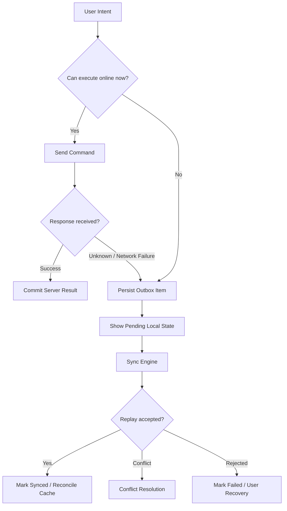
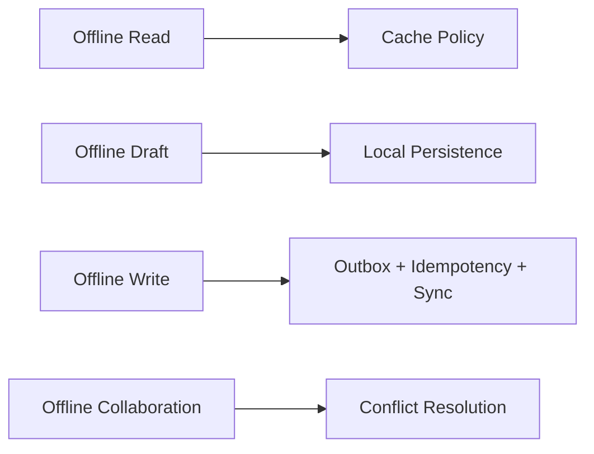
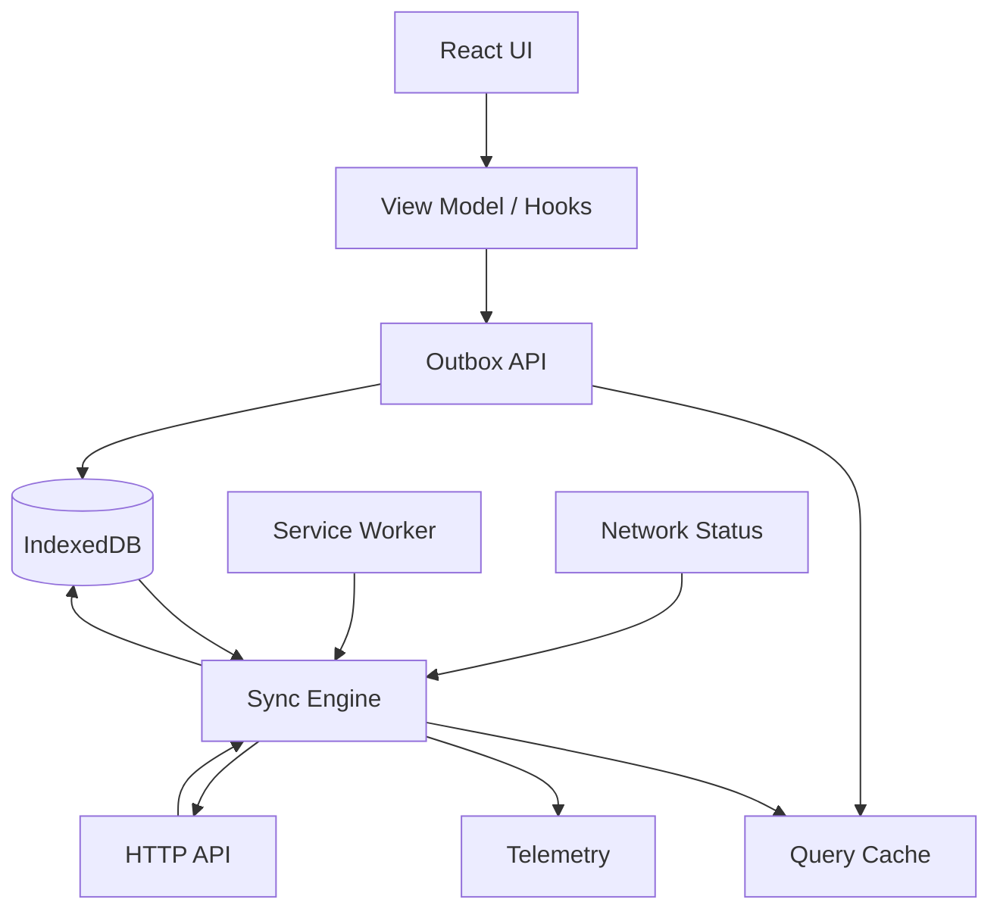
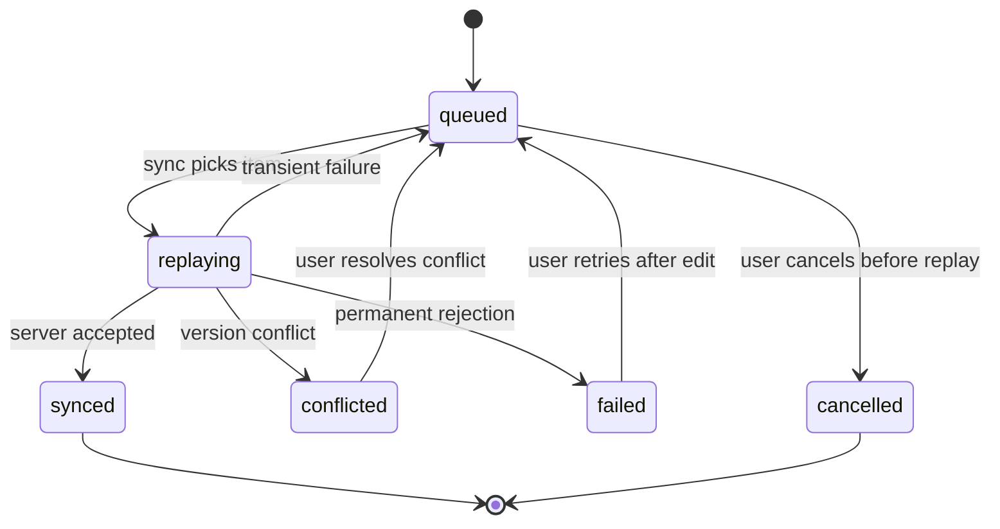
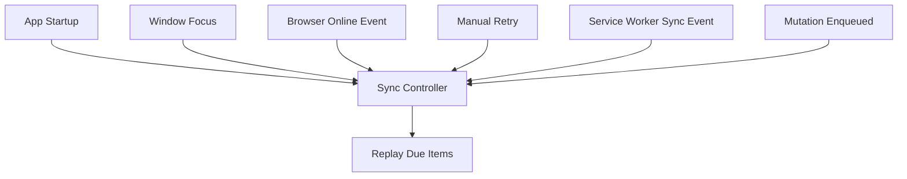
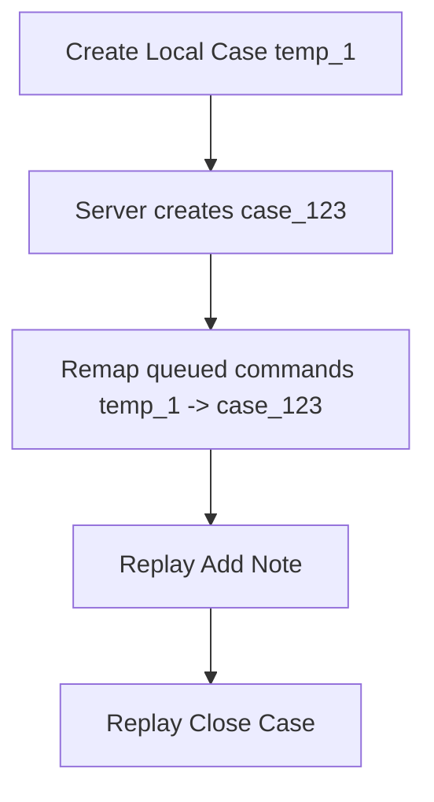
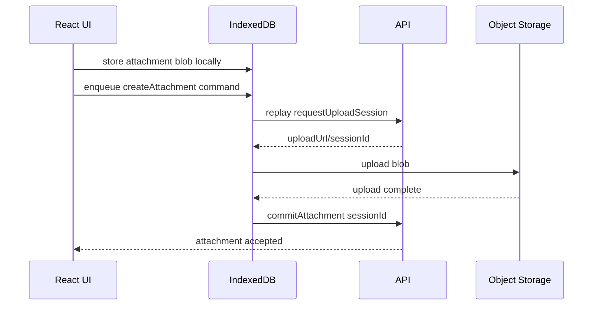
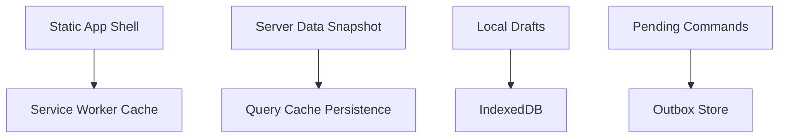
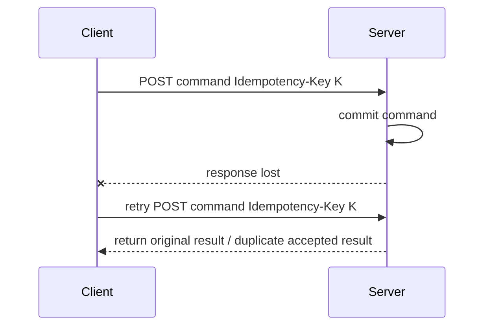

# Part 057 — Offline-First Queues and Sync

Offline-first is not a loading spinner that says “you are offline”.

Offline-first means the application has an explicit protocol for what may happen while the server is unreachable, what must wait, how local intent is stored, how replay happens, and how the UI explains uncertain outcomes.

The hard part is not detecting offline.

The hard part is preserving user intent without lying about server truth.



This part treats offline support as a reliability system.

It is about queues, durable storage, replay, idempotency, visibility, and recovery.

---

## 1. The Core Mental Model

A normal online mutation looks like this:

```txt
intent -> HTTP mutation -> server transaction -> response -> UI state
```

An offline-capable mutation looks like this:

```txt
intent -> durable local command -> optimistic/pending UI -> replay -> server transaction -> reconciliation
```

That extra durable local command changes everything.

Once you store user intent locally, the frontend becomes a small distributed system participant. It must handle:

- duplicate submission;
- replay after process restart;
- stale authentication;
- schema changes while queued commands exist;
- operation ordering;
- partial replay success;
- server conflicts;
- user cancellation;
- browser storage eviction;
- multi-tab coordination;
- observability across offline and online phases.

A senior-level React system does not hide these risks behind a single `isOffline` flag.

It creates a small sync protocol.

---

## 2. Offline-First Is Not One Feature

There are at least four different offline capabilities.

| Capability | Meaning | Example | Risk |
|---|---|---|---|
| Offline read shell | App loads without network | Open dashboard shell offline | stale or empty data |
| Offline cached reads | Previously fetched data is visible | View case detail from cache | permissions may have changed |
| Offline local drafts | Unsaved work survives reload | Continue editing a report | draft/server divergence |
| Offline write queue | User commands are replayed later | Submit inspection notes offline | conflicts, duplicate effects |

Do not promise offline write support unless you have a replay and reconciliation design.

A route that can show stale cached data is not the same as a route that can safely accept offline mutation.



This part focuses mostly on offline writes and sync, because that is where correctness breaks.

---

## 3. The Outbox Pattern

The outbox is a durable local queue of commands that the user intended to send to the server.

It is not just a list of failed HTTP requests.

A good outbox item stores semantic intent.

```ts
export type OutboxStatus =
  | 'queued'
  | 'replaying'
  | 'synced'
  | 'failed'
  | 'conflicted'
  | 'cancelled';

export type OutboxCommand<TPayload = unknown> = {
  id: string;                  // local outbox id
  idempotencyKey: string;      // server dedupe key
  type: string;                // domain command name
  resourceType: string;
  resourceId?: string;
  payload: TPayload;
  payloadSchemaVersion: number;
  createdAt: string;
  updatedAt: string;
  status: OutboxStatus;
  attempt: number;
  nextAttemptAt?: string;
  lastError?: SerializedSyncError;
  authContext: {
    tenantId: string;
    userId: string;
  };
  precondition?: {
    version?: number;
    etag?: string;
  };
  correlationId: string;
};
```

The key design decision:

> Persist commands, not component state.

Component state is accidental and shape-shifts with the UI.

A command is durable business intent.

Bad outbox item:

```ts
{
  url: '/api/cases/123',
  method: 'PATCH',
  body: '{"status":"closed"}'
}
```

Better outbox item:

```ts
{
  type: 'case.close',
  resourceType: 'case',
  resourceId: 'case_123',
  payload: {
    resolutionCode: 'resolved',
    note: 'All evidence verified.'
  },
  precondition: {
    version: 12
  },
  idempotencyKey: 'cmd_01J...'
}
```

Why semantic commands are better:

- they can be migrated if API routes change;
- they can be displayed to the user;
- they can be audited;
- they can be retried through a new endpoint;
- they can be rejected with domain-specific messages;
- they support conflict handling better than raw HTTP bodies.

---

## 4. Architecture

A production offline sync layer has these components:



Responsibilities:

| Component | Responsibility | Must not do |
|---|---|---|
| React UI | collect intent, show pending/synced/failed state | own durable sync logic |
| Outbox API | persist commands and expose queue state | directly mutate server truth |
| IndexedDB | durable local queue and metadata | become an unbounded database |
| Sync engine | replay, retry, classify errors, reconcile | rely only on `navigator.onLine` |
| API client | transport, timeout, parsing, error mapping | hide idempotency/conflict details |
| Query cache | show server replicas and pending overlays | pretend queued commands already committed |
| Service Worker | optional background trigger/network proxy | hold critical state only in memory |
| Telemetry | explain sync behavior in production | log PII payloads |

The sync engine is the core.

It converts queued commands into server-observed mutations.

---

## 5. State Machine of an Outbox Item

An outbox item needs a precise lifecycle.



Never store only `pending: true`.

You need enough status to answer:

- is this waiting for a first attempt?
- is this currently being sent?
- did it fail transiently?
- did the server reject it permanently?
- does it require user conflict resolution?
- can the user cancel it?
- did it already sync successfully?

A state machine prevents UI ambiguity.

---

## 6. What Should Be Queueable?

Not every mutation should be allowed offline.

Use this decision table.

| Mutation | Queueable? | Why |
|---|---:|---|
| Save local note/draft | Usually yes | user intent is durable and mergeable |
| Submit form with server validation | maybe | depends on validation/conflict contract |
| Upload photo evidence | maybe | requires blob persistence and resumability constraints |
| Send payment | rarely | high duplicate/unknown-outcome risk |
| Delete resource | dangerous | conflicts with visibility/authorization changes |
| Change permission/role | usually no | security-sensitive and must be immediate |
| Accept legal terms | maybe | must preserve timestamp/device/audit constraints |
| Escalate regulatory case | maybe/no | domain risk, sequencing, and audit rules matter |

Rule:

> Queue low-risk, user-owned, idempotent, reversible, or mergeable commands first.

High-risk commands need stronger server protocols.

---

## 7. IndexedDB as the Durable Queue Store

`localStorage` is not enough for serious outbox work.

Problems with `localStorage`:

- synchronous API blocks the main thread;
- weak model for transactions/indexes;
- bad fit for large payloads;
- awkward binary/blob handling;
- no structured query model.

IndexedDB is a better browser-native durable store for queues.

A minimal schema:

```ts
export type OutboxRecord = OutboxCommand & {
  sortKey: string;      // e.g. `${tenantId}:${createdAt}:${id}`
  lockOwner?: string;
  lockExpiresAt?: string;
};

export type SyncMetaRecord = {
  key: string;
  value: unknown;
};
```

Suggested object stores:

| Store | Key | Indexes |
|---|---|---|
| `outbox` | `id` | `status`, `tenantId`, `nextAttemptAt`, `resourceId` |
| `sync_meta` | `key` | none |
| `drafts` | `id` | `resourceId`, `updatedAt` |
| `attachments` | `id` | `commandId`, `createdAt` |

A simplified IndexedDB wrapper:

```ts
const DB_NAME = 'app-sync-v1';
const DB_VERSION = 1;

export async function openSyncDb(): Promise<IDBDatabase> {
  return await new Promise((resolve, reject) => {
    const request = indexedDB.open(DB_NAME, DB_VERSION);

    request.onupgradeneeded = () => {
      const db = request.result;

      if (!db.objectStoreNames.contains('outbox')) {
        const outbox = db.createObjectStore('outbox', { keyPath: 'id' });
        outbox.createIndex('status', 'status');
        outbox.createIndex('tenantId', 'authContext.tenantId');
        outbox.createIndex('nextAttemptAt', 'nextAttemptAt');
        outbox.createIndex('resourceId', 'resourceId');
      }

      if (!db.objectStoreNames.contains('sync_meta')) {
        db.createObjectStore('sync_meta', { keyPath: 'key' });
      }
    };

    request.onsuccess = () => resolve(request.result);
    request.onerror = () => reject(request.error);
  });
}
```

For real applications, use a small library like Dexie or idb to avoid raw IndexedDB ceremony.

The architectural point remains the same:

> The queue must survive reload, tab close, and temporary browser process loss.

---

## 8. Command Envelope

A queue item needs two payload layers.

```ts
export type CommandEnvelope<T> = {
  commandId: string;
  idempotencyKey: string;
  commandType: string;
  issuedAt: string;
  client: {
    appVersion: string;
    deviceId: string;
    tabId: string;
  };
  actor: {
    tenantId: string;
    userId: string;
  };
  precondition?: {
    version?: number;
    etag?: string;
  };
  payload: T;
};
```

Transport request:

```ts
await fetch('/api/commands/case.close', {
  method: 'POST',
  headers: {
    'content-type': 'application/json',
    'idempotency-key': command.idempotencyKey,
    'x-correlation-id': command.correlationId
  },
  body: JSON.stringify(command.envelope),
  signal
});
```

The command envelope allows the server to:

- deduplicate retries;
- audit original user intent;
- reject stale preconditions;
- associate logs/traces;
- reject wrong tenant/user context;
- detect unsupported app/schema versions;
- return conflict information.

---

## 9. UI Model: Pending Is Not Synced

Offline UI must be honest.

A dangerous UI says:

> “Saved.”

when the command is only queued locally.

A better UI says:

- “Saved locally. Syncing when online.”
- “Pending upload.”
- “Waiting to sync.”
- “Could not sync. Review required.”
- “Conflict detected. Choose how to proceed.”

Design local overlay state explicitly.

```ts
export type ServerCase = {
  id: string;
  status: 'open' | 'closed';
  version: number;
};

export type PendingOverlay = {
  resourceId: string;
  commandId: string;
  label: string;
  kind: 'pending' | 'failed' | 'conflicted';
};

export function applyPendingOverlay(
  serverCase: ServerCase,
  overlays: PendingOverlay[]
) {
  const pendingClose = overlays.find(
    overlay => overlay.resourceId === serverCase.id && overlay.label === 'close-case'
  );

  if (!pendingClose) return serverCase;

  return {
    ...serverCase,
    status: 'closed' as const,
    _sync: {
      state: pendingClose.kind,
      commandId: pendingClose.commandId
    }
  };
}
```

The overlay says:

> “This is what the user intends, but server truth has not confirmed it yet.”

That distinction matters in regulated, financial, operational, and collaborative systems.

---

## 10. Enqueue Flow

A command enqueue function should be boring and deterministic.

```ts
export async function enqueueCommand<TPayload>(input: {
  type: string;
  resourceType: string;
  resourceId?: string;
  payload: TPayload;
  precondition?: OutboxCommand['precondition'];
  authContext: OutboxCommand['authContext'];
}): Promise<OutboxCommand<TPayload>> {
  const now = new Date().toISOString();

  const command: OutboxCommand<TPayload> = {
    id: crypto.randomUUID(),
    idempotencyKey: crypto.randomUUID(),
    type: input.type,
    resourceType: input.resourceType,
    resourceId: input.resourceId,
    payload: input.payload,
    payloadSchemaVersion: 1,
    createdAt: now,
    updatedAt: now,
    status: 'queued',
    attempt: 0,
    authContext: input.authContext,
    precondition: input.precondition,
    correlationId: crypto.randomUUID()
  };

  await outboxStore.put(command);
  outboxEvents.emit({ type: 'outbox.enqueued', commandId: command.id });

  return command;
}
```

Important invariants:

- generate the idempotency key before first attempt;
- reuse the same idempotency key for every retry of the same command;
- never mutate the command payload silently after enqueue;
- record payload schema version;
- record tenant/user scope;
- record resource precondition when available;
- emit an event so UI can update pending state.

---

## 11. Replay Loop

A naive replay loop:

```ts
for (const item of queuedItems) {
  await send(item);
}
```

A production replay loop needs locks, retry classification, deadlines, auth handling, and reconciliation.

```ts
export async function replayOutbox(options: {
  signal: AbortSignal;
  maxItems: number;
  now: Date;
}) {
  const items = await outboxStore.claimDueItems({
    limit: options.maxItems,
    now: options.now,
    lockTtlMs: 30_000
  });

  for (const item of items) {
    if (options.signal.aborted) return;

    await replayOne(item, options.signal);
  }
}

async function replayOne(item: OutboxCommand, outerSignal: AbortSignal) {
  const startedAt = performance.now();

  await outboxStore.update(item.id, {
    status: 'replaying',
    attempt: item.attempt + 1,
    updatedAt: new Date().toISOString()
  });

  try {
    const result = await commandTransport.send(item, {
      signal: AbortSignal.any([
        outerSignal,
        AbortSignal.timeout(15_000)
      ])
    });

    await outboxStore.update(item.id, {
      status: 'synced',
      updatedAt: new Date().toISOString()
    });

    await reconcileAfterSync(item, result);

    syncTelemetry.emit('outbox.replay.success', {
      commandType: item.type,
      attempt: item.attempt + 1,
      durationMs: performance.now() - startedAt
    });
  } catch (error) {
    await handleReplayError(item, error);
  } finally {
    await outboxStore.releaseLock(item.id);
  }
}
```

The replay loop is a worker.

It should not depend on a mounted component.

A user leaving the route should not destroy the durable sync protocol.

---

## 12. Error Classification During Replay

Different errors produce different queue decisions.

| Error | Queue decision | UI decision |
|---|---|---|
| offline/network failure | keep queued with backoff | “waiting for connection” |
| timeout | retry with backoff unless deadline exceeded | “sync delayed” |
| 401 | pause queue until re-auth | “sign in to continue syncing” |
| 403 | fail command or mark review | “no longer allowed” |
| 404 resource missing | fail/conflict depending domain | “resource no longer exists” |
| 409 conflict | mark conflicted | show resolution flow |
| 412 precondition failed | mark conflicted | compare versions |
| 422 validation | permanent failed | show correction |
| 429 rate limit | retry after server hint | “sync paused” |
| 5xx | retry with budget | “server unavailable” |
| parse/contract error | pause/fail depending release state | “app update may be required” |

Code shape:

```ts
async function handleReplayError(item: OutboxCommand, error: unknown) {
  const classified = classifySyncError(error);

  switch (classified.kind) {
    case 'transient': {
      await outboxStore.update(item.id, {
        status: 'queued',
        nextAttemptAt: computeNextAttempt(item.attempt, classified.retryAfter),
        lastError: serializeSyncError(classified)
      });
      return;
    }

    case 'auth-required': {
      await outboxStore.update(item.id, {
        status: 'queued',
        nextAttemptAt: undefined,
        lastError: serializeSyncError(classified)
      });
      syncController.pause('auth-required');
      return;
    }

    case 'conflict': {
      await outboxStore.update(item.id, {
        status: 'conflicted',
        lastError: serializeSyncError(classified)
      });
      return;
    }

    case 'permanent': {
      await outboxStore.update(item.id, {
        status: 'failed',
        lastError: serializeSyncError(classified)
      });
      return;
    }
  }
}
```

The classifier is one of the most important parts of offline sync.

Wrong classification either loses user intent or hammers the server.

---

## 13. Backoff and Retry Budget

Offline replay must be patient.

A bad sync engine does this:

```txt
network returns -> replay 500 commands immediately -> server overloaded -> more failures -> more retries
```

A better engine uses:

- exponential backoff;
- jitter;
- per-command attempt limits;
- global retry budget;
- rate-limit respect;
- foreground priority rules;
- queue draining caps.

```ts
function computeNextAttempt(attempt: number, retryAfter?: Date): string {
  if (retryAfter) return retryAfter.toISOString();

  const baseMs = Math.min(60_000, 1_000 * 2 ** Math.min(attempt, 6));
  const jitterMs = Math.random() * baseMs;

  return new Date(Date.now() + jitterMs).toISOString();
}
```

For high-risk commands, prefer manual user retry after repeated failure.

A sync queue should not retry forever without visibility.

---

## 14. Online Detection Is a Hint, Not Truth

`navigator.onLine` and `online`/`offline` events are useful hints.

They are not correctness guarantees.

The browser may be “online” while:

- captive portal blocks API access;
- DNS fails;
- VPN blocks backend;
- API region is down;
- credentials expired;
- CORS preflight fails;
- mobile radio is unstable.

Use active probes or natural request results.

```ts
window.addEventListener('online', () => {
  syncController.requestWakeup('browser-online-event');
});

window.addEventListener('offline', () => {
  syncController.markNetworkHint('offline');
});
```

A sync engine should wake up on online hints, but still treat the first real request as the source of truth.

---

## 15. Foreground Sync vs Background Sync

There are two broad modes.

| Mode | Trigger | Pros | Cons |
|---|---|---|---|
| Foreground sync | app tab open | easy telemetry, direct UI feedback | stops when app closed |
| Background sync | service worker/browser event | can replay later | browser support and scheduling vary |

A robust application does not rely exclusively on background sync.

Instead:

- foreground sync when app is active;
- service worker background sync where supported;
- sync on app startup;
- sync on regain focus;
- sync after re-auth;
- manual “retry now” action.



That gives you layered reliability.

---

## 16. Service Worker Role

A service worker can improve offline support, but it should not become a hidden second application.

Good service worker responsibilities:

- cache app shell/assets;
- provide offline fallback page;
- intercept selected network requests;
- enqueue failed requests if you intentionally use request-level queueing;
- wake up background sync;
- coordinate push/event refresh.

Risky service worker responsibilities:

- storing critical sync state only in memory;
- duplicating domain validation logic;
- silently replaying sensitive commands with no UI visibility;
- transforming business payloads without versioning;
- caching user-private API responses with wrong scope;
- swallowing server errors.

A clean approach:

> Domain outbox lives in IndexedDB. Service worker is a wakeup/replay participant, not the only owner.

---

## 17. Background Sync Integration

A conceptual service worker sync handler:

```ts
// service-worker.ts
self.addEventListener('sync', event => {
  if (event.tag === 'outbox-sync') {
    event.waitUntil(replayOutboxFromServiceWorker());
  }
});
```

App-side registration:

```ts
export async function requestBackgroundSync() {
  const registration = await navigator.serviceWorker.ready;

  if ('sync' in registration) {
    await registration.sync.register('outbox-sync');
  }
}
```

Design constraints:

- not every browser/environment supports Background Sync;
- browser may delay execution;
- user may revoke permissions or clear storage;
- service worker lifecycle can terminate anytime;
- auth tokens may be unavailable/expired;
- large uploads may not be reliable through background sync;
- telemetry may arrive later or not at all.

Therefore, background sync is an optimization.

The correctness model must still work without it.

---

## 18. Request-Level Queue vs Domain Command Queue

Workbox-style background sync often queues failed `Request` objects.

That is useful for simple cases.

Example: “retry this POST later”.

But for complex business systems, raw request queues have limitations.

| Concern | Raw request queue | Domain command queue |
|---|---|---|
| API route migration | hard | command adapter can migrate |
| UI display | poor | command label/status available |
| conflict handling | poor | semantic conflict model |
| auditability | weak | explicit command envelope |
| schema migration | hard | payload versioning |
| idempotency | possible but easy to forget | first-class |
| authorization change | opaque | command can be revalidated |

Use raw request queues for narrow technical retries.

Use domain command queues for product-critical offline writes.

---

## 19. Multi-Tab Coordination

If three tabs are open, you do not want three sync engines replaying the same queue.

Problems:

- duplicate attempts;
- lock contention;
- confusing UI status;
- server amplification;
- race between queue updates;
- different tabs with different auth state.

Options:

| Technique | Use |
|---|---|
| IndexedDB lock with expiry | durable best-effort ownership |
| BroadcastChannel | notify other tabs of queue changes |
| Web Locks API | coordinate active worker where supported |
| single leader tab | one foreground sync owner |
| service worker replay | central-ish background participant |

A simple lock pattern:

```ts
export async function claimOutboxItem(itemId: string, ownerId: string) {
  const now = Date.now();
  const lockExpiresAt = new Date(now + 30_000).toISOString();

  return await outboxStore.transaction(async tx => {
    const item = await tx.get(itemId);
    if (!item) return null;

    const lockExpired =
      !item.lockExpiresAt || new Date(item.lockExpiresAt).getTime() < now;

    if (item.lockOwner && !lockExpired) return null;

    const claimed = {
      ...item,
      lockOwner: ownerId,
      lockExpiresAt
    };

    await tx.put(claimed);
    return claimed;
  });
}
```

Locks must expire.

Browsers crash. Tabs close. Service workers terminate.

No lock is permanent.

---

## 20. Ordering

Queued commands may be independent or dependent.

Example independent commands:

- mark notification read;
- save local feedback;
- upload unrelated file metadata.

Example dependent commands:

- create case;
- add note to that case;
- close that case.

If the first command creates a server ID, later commands may need ID remapping.



Command metadata should support dependencies.

```ts
export type OutboxCommand = {
  id: string;
  dependsOn?: string[];
  localToServerIds?: Record<string, string>;
  // ...
};
```

Replay planner:

```ts
function canReplay(command: OutboxCommand, syncedIds: Set<string>) {
  return (command.dependsOn ?? []).every(id => syncedIds.has(id));
}
```

Do not force a single global queue order unless required.

Global ordering reduces concurrency and creates unnecessary blockage.

Use resource-level or dependency-level ordering.

---

## 21. Temporary IDs

Offline creation needs temporary IDs.

```ts
const localId = `local_${crypto.randomUUID()}`;
```

UI can render the local resource immediately.

When the server accepts the create command, it returns the canonical server ID.

```ts
export type CreateCaseResult = {
  localId: string;
  serverId: string;
  version: number;
  createdAt: string;
};
```

Reconciliation must update:

- detail cache;
- list cache;
- queued dependent commands;
- route/navigation state if URL used the temp ID;
- UI selection state;
- attachments linked to the temp ID;
- telemetry correlation.

A temp ID is not just a React key.

It is part of the offline identity protocol.

---

## 22. Attachments and Large Payloads

Offline file upload is much harder than JSON commands.

Questions:

- where is the blob stored?
- how large can it be?
- will the browser evict it?
- can upload resume from offset?
- is the file encrypted at rest?
- is the user allowed to sync it later?
- does the signed upload URL expire?
- does the server require virus scan before mutation commits?

A safer architecture splits metadata command from binary upload.



For large files, prefer explicit upload sessions over “queue this multipart request and hope”.

---

## 23. Authentication and Queue Scope

Offline queues are user/tenant scoped.

Never replay a queue created by one authenticated context under another.

Store queue metadata:

```ts
{
  authContext: {
    tenantId: 'tenant_a',
    userId: 'user_1'
  }
}
```

On app startup:

```ts
const current = getCurrentAuthContext();
const pending = await outboxStore.findPending();

const replayable = pending.filter(item =>
  item.authContext.tenantId === current.tenantId &&
  item.authContext.userId === current.userId
);
```

If user switches tenant/account:

- hide other queues;
- do not replay them;
- display account-specific pending sync if appropriate;
- delete queues on logout only if product/security policy says so;
- clear queues for public/shared devices if required.

Security-sensitive applications may require encrypted local storage or may disallow offline writes entirely.

Be honest about the threat model.

---

## 24. Queue Migration

Queued commands can outlive the deployed frontend version.

Example:

- user queues command on app version 1;
- app deploys version 2 with different payload shape;
- user comes online tomorrow;
- sync engine must replay the old command.

Payload schema version exists for this reason.

```ts
function migrateCommand(command: OutboxCommand): OutboxCommand {
  if (command.payloadSchemaVersion === 1 && command.type === 'case.close') {
    return {
      ...command,
      payloadSchemaVersion: 2,
      payload: {
        ...command.payload,
        closureSource: 'user'
      }
    };
  }

  return command;
}
```

Migration must be:

- deterministic;
- tested;
- safe for partial deployment;
- observable;
- backwards compatible where possible.

Do not assume offline queues are short-lived.

---

## 25. React Integration Pattern

A React hook should expose intent and status, not hide the queue.

```ts
export function useCloseCase(caseId: string, version: number) {
  const queryClient = useQueryClient();
  const outbox = useOutbox();

  return async function closeCase(input: { note: string }) {
    const command = await outbox.enqueue({
      type: 'case.close',
      resourceType: 'case',
      resourceId: caseId,
      payload: input,
      precondition: { version },
      authContext: getAuthContext()
    });

    queryClient.setQueryData(['case', caseId], old => {
      if (!old) return old;
      return {
        ...old,
        status: 'closed',
        syncState: {
          kind: 'pending',
          commandId: command.id
        }
      };
    });

    syncController.requestWakeup('case.close.enqueued');
  };
}
```

The hook does three things:

1. persists command;
2. updates local pending overlay;
3. wakes sync engine.

It does not pretend server accepted the mutation.

---

## 26. TanStack Query Integration

There are two integration styles.

### Style A — Query Cache Overlay

Keep outbox separate and project pending state into query results.

Pros:

- durable queue independent from query cache;
- better conflict handling;
- easier audit/debug;
- explicit pending state.

Cons:

- more code;
- need overlay composition.

### Style B — Offline Mutation Persistence

TanStack Query supports mutation persistence patterns, but the mutation function itself is not persisted as executable code. You need stable defaults and hydration discipline.

Pros:

- integrates with mutation lifecycle;
- useful for app-level offline mutations.

Cons:

- can become opaque;
- domain queue semantics may still be needed;
- conflict resolution still remains your job.

For serious business workflows, prefer a domain outbox and integrate with Query Cache deliberately.

Query cache is a server-state replica.

The outbox is a durable command log.

Do not collapse them accidentally.

---

## 27. Read Cache and Offline Shell

Offline write queues usually sit beside offline read caches.

A common layering:



Different data needs different policy.

| Data | Storage | Expiration | Security |
|---|---|---|---|
| static JS/CSS | Cache API | app version | public-ish |
| route shell | Cache API | app version | avoid user data |
| server query data | persisted query cache/IndexedDB | short/domain-specific | user scoped |
| drafts | IndexedDB | explicit/user policy | sensitive |
| outbox commands | IndexedDB | until synced/resolved | very sensitive |

Never blindly cache all API responses in a service worker.

Private server data has authorization and freshness constraints.

---

## 28. Data Minimization

Offline queues store sensitive user intent locally.

Minimize payloads.

Bad:

```json
{
  "fullCaseRecord": { "...": "entire server object" },
  "allParticipants": [],
  "allDocuments": []
}
```

Better:

```json
{
  "caseId": "case_123",
  "resolutionCode": "resolved",
  "note": "Evidence verified"
}
```

Store only what is needed to replay the command and explain it to the user.

Consider:

- retention policy;
- logout behavior;
- shared devices;
- browser profile backups;
- PII redaction in logs;
- encryption if available and meaningful;
- enterprise device policy.

Offline-first increases local data exposure.

Treat it as a product/security decision, not just an engineering feature.

---

## 29. Sync Visibility UI

Users need a way to understand sync status.

For simple apps:

- small “offline” badge;
- per-item pending indicator;
- retry button for failed items.

For serious workflow apps:

- sync center/outbox panel;
- command descriptions;
- retry/cancel actions;
- conflict resolution entry point;
- last sync time;
- account/tenant scope;
- export diagnostic package if support needs it.

Example command label:

```ts
function describeCommand(command: OutboxCommand) {
  switch (command.type) {
    case 'case.close':
      return 'Close case';
    case 'case.addNote':
      return 'Add case note';
    case 'inspection.attachPhoto':
      return 'Upload inspection photo';
    default:
      return 'Pending change';
  }
}
```

A queue you cannot explain to the user is a queue you cannot support in production.

---

## 30. Cancellation

Can the user cancel a queued command?

It depends.

| State | Can cancel? | Notes |
|---|---:|---|
| queued, never replayed | usually yes | remove local command |
| replaying | maybe | server may already receive it |
| synced | no | must submit compensating command |
| conflicted | yes/maybe | cancel local intent or resolve |
| failed permanent | yes | discard local intent |

Cancellation of an outbox command is not the same as aborting fetch.

If the server may have observed the command, cancellation becomes a new domain command.

Example:

```txt
queued close-case -> user cancels -> remove local command
replaying close-case -> unknown outcome -> cannot simply remove; must check server state
synced close-case -> user wants undo -> send reopen-case if domain allows
```

Model cancellation explicitly.

---

## 31. Sync After Unknown Outcome

The hardest replay state is “request sent, response lost”.

The server may have committed.

The client does not know.

Idempotency key solves this by letting the client safely retry the same command.



Without idempotency, retries can duplicate side effects.

Offline queues require idempotency for non-idempotent operations.

---

## 32. Queue Drain Policy

When back online, should the client replay everything immediately?

Usually no.

A drain policy defines:

- max concurrent replays;
- max commands per wakeup;
- priority by command type;
- rate limit handling;
- pause conditions;
- auth refresh behavior;
- battery/network constraints if available;
- user-visible retry control.

Example:

```ts
const SYNC_POLICY = {
  maxConcurrent: 2,
  maxItemsPerWakeup: 20,
  maxAttemptsBeforeManual: 8,
  defaultTimeoutMs: 15_000,
  lowPriorityDelayMs: 5_000
};
```

Use priority carefully.

If a later high-priority command depends on an earlier low-priority command, dependency ordering wins.

---

## 33. Server Contract for Offline Sync

Offline sync cannot be solved purely in React.

The server must support the protocol.

Minimum server features:

- idempotency key support;
- stable command endpoint or operation contract;
- conflict detection;
- clear 409/412/422 distinction;
- replay-safe result retrieval;
- server-generated canonical IDs;
- schema version compatibility;
- audit record of original command;
- authorization re-check at replay time;
- rate limit feedback;
- correlation IDs in logs.

Example response contract:

```ts
export type CommandAccepted<TResult> = {
  status: 'accepted';
  commandId: string;
  idempotencyKey: string;
  result: TResult;
  serverVersion?: number;
};

export type CommandConflict = {
  status: 'conflict';
  commandId: string;
  reason: 'version_mismatch' | 'resource_deleted' | 'permission_changed';
  serverSnapshot?: unknown;
};

export type CommandRejected = {
  status: 'rejected';
  commandId: string;
  reason: string;
  fieldErrors?: Record<string, string[]>;
};
```

If the backend cannot dedupe or detect conflicts, offline write support will be fragile.

---

## 34. Conflict Handoff

Part 058 goes deeper into conflict resolution.

For this part, the sync engine only needs a handoff point.

When conflict occurs:

1. stop replaying that command;
2. mark status as `conflicted`;
3. store server conflict metadata;
4. update UI overlays;
5. notify user if needed;
6. block dependent commands;
7. wait for resolution.

```ts
await outboxStore.update(command.id, {
  status: 'conflicted',
  lastError: {
    kind: 'conflict',
    serverSnapshot: conflict.serverSnapshot,
    reason: conflict.reason
  }
});
```

Do not auto-merge high-risk domain data without product-level rules.

---

## 35. Observability

Offline bugs are painful because they happen away from the server.

Emit client telemetry events.

| Event | Fields |
|---|---|
| `outbox.enqueued` | command type, resource type, queue depth |
| `outbox.replay.started` | command type, attempt, age |
| `outbox.replay.success` | attempt, duration, result kind |
| `outbox.replay.transient_failure` | status, attempt, next attempt |
| `outbox.replay.conflict` | reason, age, command type |
| `outbox.replay.permanent_failure` | reason, status |
| `outbox.queue.depth_changed` | depth by status |
| `outbox.sync.paused` | reason |

Do not log raw payloads by default.

Metrics to watch:

- queue depth;
- oldest queued command age;
- sync success rate;
- conflict rate;
- permanent failure rate;
- retry attempts per command;
- time-to-sync;
- commands stuck by auth;
- storage quota failures;
- multi-tab duplicate attempts.

An offline queue without observability becomes a support black hole.

---

## 36. Testing Strategy

Test offline sync with controlled failure.

### Unit tests

- enqueue creates durable command;
- idempotency key remains stable;
- retry delay computed correctly;
- permanent errors mark failed;
- conflict errors mark conflicted;
- auth errors pause queue;
- lock expiry releases stuck commands;
- migration transforms old payload.

### Integration tests

- app queues command offline;
- reload preserves queue;
- regain online replays queue;
- response lost then retry dedupes;
- 409 conflict opens resolution UI;
- multi-tab only one tab replays;
- logout prevents replay under wrong user;
- queued temp ID remaps after create.

### E2E tests

- simulate network offline/online;
- submit form offline;
- verify pending UI;
- reload page;
- restore network;
- verify server received one command;
- verify UI reconciled.

Use deterministic fake clocks for backoff.

Use controlled server responses for unknown outcome and conflict cases.

---

## 37. Common Failure Modes

### Failure Mode 1 — Duplicate Side Effects

Cause:

- retrying POST without idempotency;
- user double-submit;
- multi-tab replay.

Fix:

- idempotency keys;
- local command dedupe;
- server dedupe table;
- one replay owner.

### Failure Mode 2 — Silent Data Loss

Cause:

- keep queue in memory;
- clear queue on reload/logout without warning;
- treat network error as permanent failure.

Fix:

- durable store;
- explicit retention policy;
- error classification;
- user-visible queue.

### Failure Mode 3 — Stale Permission Replay

Cause:

- command queued while user had permission;
- permission revoked before replay;
- client assumes old permission is enough.

Fix:

- server authorization at replay time;
- mark 403 as permanent/review;
- explain to user.

### Failure Mode 4 — Infinite Retry Storm

Cause:

- retry all commands instantly when online event fires;
- no backoff/jitter;
- no rate limit handling.

Fix:

- backoff;
- drain policy;
- attempt budgets;
- respect 429/Retry-After.

### Failure Mode 5 — Queue Schema Drift

Cause:

- queued command payload shape changes after deployment.

Fix:

- payload schema version;
- migration;
- backward-compatible server contract.

### Failure Mode 6 — Query Cache Lies

Cause:

- optimistic patch looks identical to committed server result;
- UI says saved when queued only.

Fix:

- pending overlay;
- sync status markers;
- reconciliation on accept/reject.

---

## 38. Production Checklist

Before enabling offline writes, verify:

- [ ] every queueable command has idempotency key;
- [ ] server dedupes by idempotency key and actor scope;
- [ ] outbox persists in IndexedDB or equivalent durable storage;
- [ ] queue is scoped by tenant/user;
- [ ] command payloads have schema versions;
- [ ] old queued commands can migrate or fail safely;
- [ ] transient/permanent/conflict/auth errors are classified;
- [ ] retry uses backoff and jitter;
- [ ] replay has deadlines and cancellation;
- [ ] multi-tab replay is controlled;
- [ ] UI distinguishes pending local state from synced state;
- [ ] conflicts have a resolution path;
- [ ] logout/account switch behavior is explicit;
- [ ] sensitive data is minimized;
- [ ] storage quota failures are handled;
- [ ] queue metrics are emitted;
- [ ] E2E tests simulate offline/reload/replay/conflict.

---

## 39. The Top 1% Mental Model

Offline-first is not “cache more”.

It is a client-server protocol for disconnected intent.

The key invariants:

1. user intent must be durable before you show durable UI;
2. server truth must remain authoritative;
3. queued commands must be idempotent;
4. replay must be observable and bounded;
5. authentication and tenant scope must be preserved;
6. conflicts must be explicit;
7. pending state must not be confused with committed state.

The mature pattern is simple to describe:

```txt
local durable command log + idempotent server command endpoint + replay engine + reconciliation UI
```

But implementing it well requires discipline.

You are no longer writing a fetch wrapper.

You are designing a small replicated workflow system.

---

## 40. What Comes Next

This part built the offline queue and sync substrate.

The next part handles the hardest question that remains:

> What happens when the queued command is valid locally but no longer valid against current server state?

That is conflict resolution, versioning, and idempotency.
