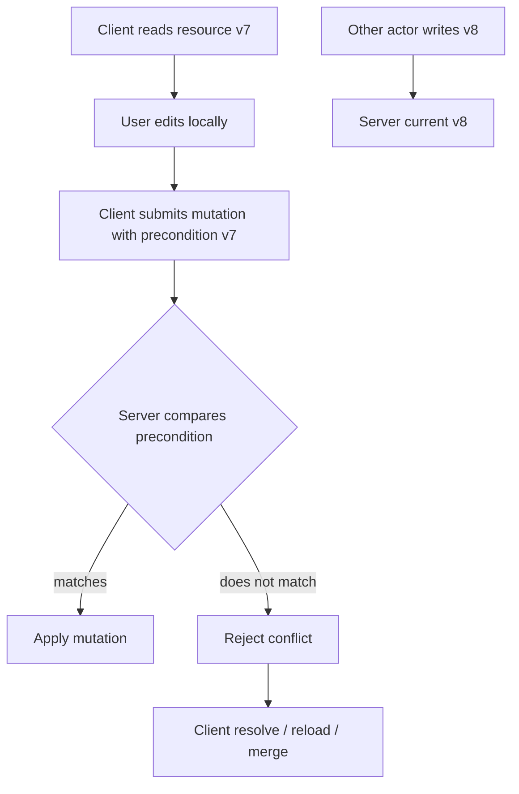
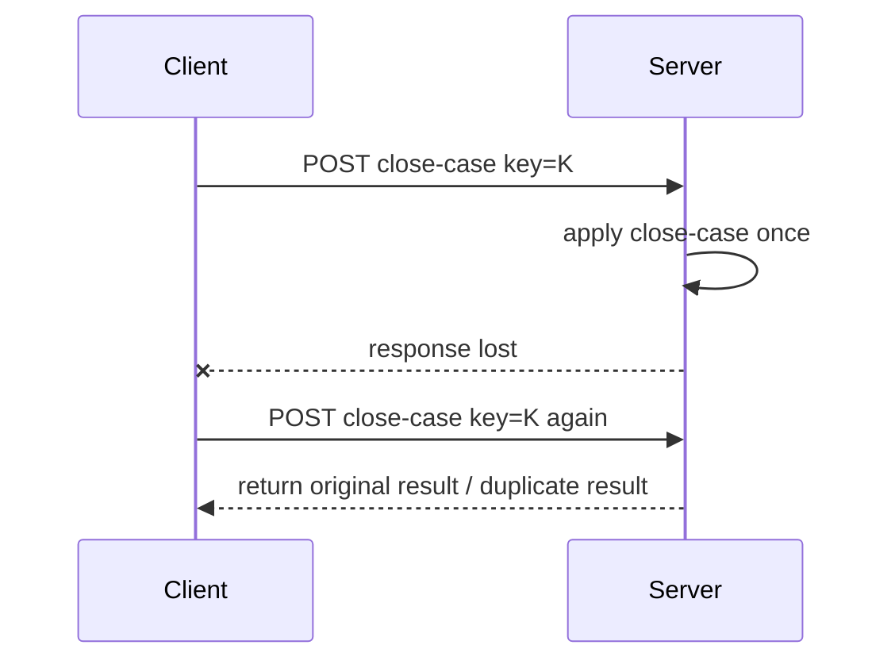
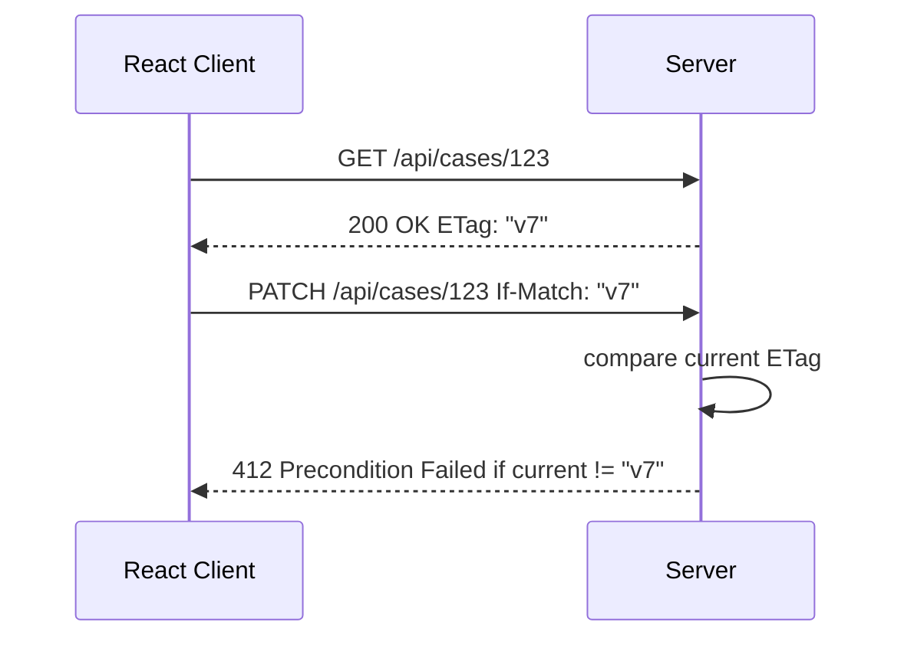
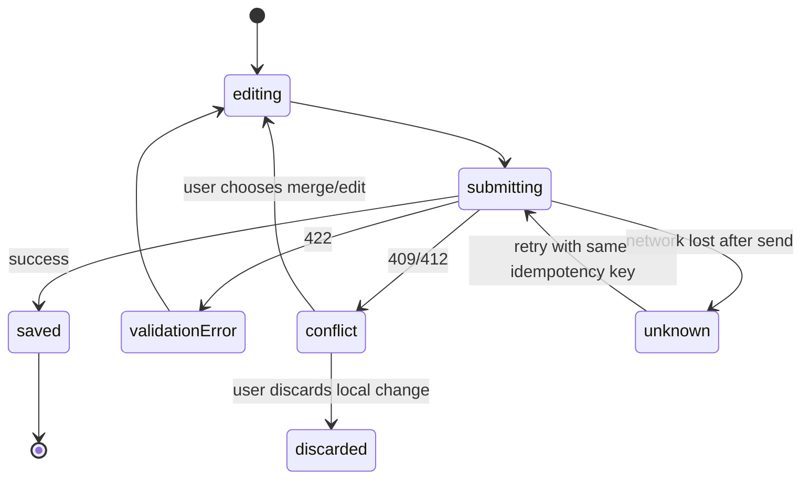
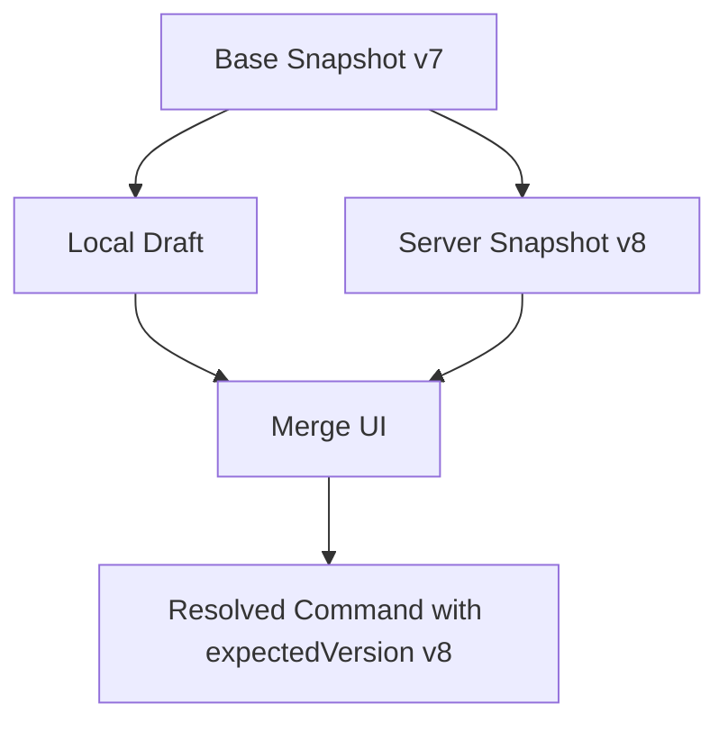
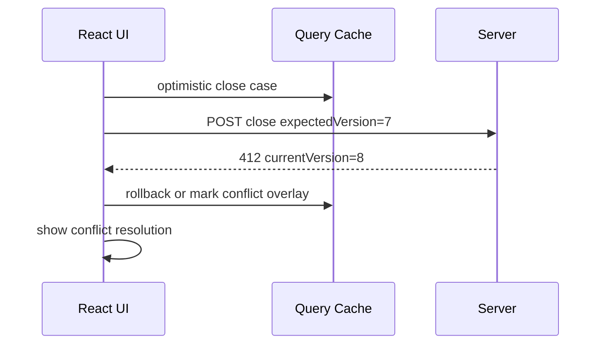

# Part 058 — Conflict Resolution, Versioning, and Idempotency

A React client does not conflict with the server because React is bad.

It conflicts because time passed.

Between reading data and submitting a mutation:

- another user may update the same resource;
- the server may run an automation;
- a policy may change;
- permissions may be revoked;
- an offline command may replay late;
- a previous request may have succeeded but its response was lost;
- the UI may still be holding an old representation.

Conflict resolution is the discipline of making those time gaps explicit.

Versioning tells us what the client believed.

Idempotency tells us whether retry is safe.

Conflict resolution tells us what to do when belief and server truth diverge.



This part is about correctness under concurrency.

---

## 1. The Basic Race

The basic stale-write race:

```txt
T1: Client A reads case status=open version=7
T2: Client B changes case status=under_review version=8
T3: Client A submits close-case based on version=7
```

What should happen?

Bad system:

```txt
Server accepts A's write and overwrites B's update.
```

Better system:

```txt
Server rejects A's write because A's precondition is stale.
```

The client cannot fix this alone.

The server must expose a concurrency contract.

The React app must carry that contract through the UI and mutation path.

---

## 2. Three Different Problems Often Confused

People use “conflict” for several different situations.

Separate them.

| Problem | Question | Example | Needed tool |
|---|---|---|---|
| Duplicate command | Did we already execute this same intent? | retry POST after lost response | idempotency key |
| Stale write | Is client editing an old version? | save case v7 when server is v8 | version/precondition |
| Semantic conflict | Are two changes incompatible? | close case while appeal opened | domain rule |

These are different.

Do not solve stale writes with idempotency.

Do not solve duplicate commands with version numbers.

Do not solve domain conflicts with blind last-write-wins.

---

## 3. Idempotency

Idempotency answers:

> If the client sends the same command more than once, does the server perform the effect once?

HTTP already defines some methods as idempotent by semantics, such as `PUT` and `DELETE`, but business APIs frequently use `POST` or `PATCH` for non-idempotent commands.

For those, the client and server need an explicit idempotency key.

```ts
const idempotencyKey = crypto.randomUUID();

await fetch('/api/cases/case_123/close', {
  method: 'POST',
  headers: {
    'content-type': 'application/json',
    'idempotency-key': idempotencyKey
  },
  body: JSON.stringify({ note: 'All evidence verified.' })
});
```

The key must be generated once per user intent.

Not once per network attempt.



If the second request uses a new key, the server sees a new command.

That can duplicate side effects.

---

## 4. Idempotency Key Scope

An idempotency key is not globally meaningful by itself.

Server-side dedupe scope usually includes:

- tenant/account;
- actor/user;
- operation name;
- idempotency key;
- optionally target resource.

Example server table concept:

| Column | Purpose |
|---|---|
| tenant_id | prevents cross-tenant collision |
| user_id | actor scope |
| operation | command type |
| idempotency_key | client-generated key |
| request_hash | detects key reuse with different payload |
| status | processing/succeeded/failed |
| response_snapshot | replay response for duplicate request |
| created_at | retention/audit |

If the same key is reused with a different payload, the server should reject it.

```ts
export type IdempotencyRecord = {
  scope: {
    tenantId: string;
    userId: string;
    operation: string;
  };
  key: string;
  requestHash: string;
  status: 'processing' | 'succeeded' | 'failed';
  responseSnapshot?: unknown;
  createdAt: string;
  expiresAt: string;
};
```

Idempotency is a server feature that the client must participate in.

The header alone does nothing if the server ignores it.

---

## 5. Unknown Outcome

Unknown outcome is the reason idempotency matters.

Known failure:

```txt
Server says 422 validation failed.
```

Known success:

```txt
Server says 200 accepted.
```

Unknown outcome:

```txt
Client sent request, connection dropped before response.
```

The mutation may or may not have committed.

A mature client does not show “failed” immediately.

It says:

- “Sync status unknown. Checking...”
- “Retrying safely...”
- “Waiting for confirmation...”

With idempotency, the client can retry the same command.

Without idempotency, the client must query server state or ask the user before retrying risky operations.

---

## 6. Versioning

Versioning answers:

> What server state did the client base this mutation on?

Common version tokens:

| Token | Example | Pros | Cons |
|---|---|---|---|
| integer revision | `version: 7` | simple, domain-friendly | custom HTTP contract |
| ETag | `ETag: "abc"` | standard HTTP validator | representation-specific semantics |
| updated timestamp | `updatedAt` | easy to display | weak for concurrency if clocks/precision bad |
| vector clock | per replica counters | handles distributed causality | complex for UI/business apps |
| event sequence | `sequence: 9821` | good for streams | may not map to resource edit version |

Most React business apps work well with one of these:

- numeric resource version;
- strong ETag;
- command-specific precondition token.

Do not rely on frontend timestamps for conflict correctness.

---

## 7. HTTP Conditional Requests

HTTP gives us standard conditional request headers.

The most relevant for stale-write protection is `If-Match`.

Flow:

1. client fetches resource;
2. server returns `ETag`;
3. client submits update with `If-Match: <etag>`;
4. server applies update only if current resource still matches;
5. otherwise server returns `412 Precondition Failed`.



Client code:

```ts
await fetch('/api/cases/123', {
  method: 'PATCH',
  headers: {
    'content-type': 'application/json',
    'if-match': caseSnapshot.etag
  },
  body: JSON.stringify({ status: 'closed' })
});
```

This makes stale writes explicit.

---

## 8. Numeric Version Preconditions

Many APIs use domain versions instead of ETags.

Request:

```json
{
  "expectedVersion": 7,
  "patch": {
    "status": "closed"
  }
}
```

Server behavior:

```txt
if current.version !== expectedVersion:
  return 409 Conflict or 412 Precondition Failed
else:
  apply mutation and increment version
```

Response:

```json
{
  "id": "case_123",
  "status": "closed",
  "version": 8
}
```

Advantages:

- easy to reason about in domain UI;
- easy to persist in command outbox;
- independent from representation hashing;
- works across command endpoints.

Disadvantages:

- custom convention;
- must be enforced consistently;
- less compatible with HTTP caching validators.

The important invariant is not the token type.

The important invariant is:

> every write that depends on previous state must carry the previous-state token.

---

## 9. 409 vs 412 vs 422

Be precise with status codes.

| Status | Meaning in this context | Client action |
|---|---|---|
| 409 Conflict | domain/resource conflict with current state | show conflict/resolution |
| 412 Precondition Failed | supplied precondition did not match | reload/merge/retry after user review |
| 422 Unprocessable Content | payload understood but invalid | show validation errors |
| 403 Forbidden | actor not allowed | stop/re-auth/escalate depending product |
| 404 Not Found | resource no longer visible or deleted | show missing/deleted state |

Do not return 500 for stale writes.

Do not return 200 with “warning: conflict ignored”.

Do not return generic 400 when the client needs a specific recovery path.

A conflict response should contain enough information to recover.

```ts
export type VersionConflictProblem = {
  type: 'https://api.example.com/problems/version-conflict';
  title: 'Resource has changed';
  status: 412;
  detail: string;
  resourceId: string;
  clientVersion: number;
  serverVersion: number;
  serverSnapshot?: unknown;
};
```

---

## 10. Client Conflict State Machine

A mutation state machine should include conflict.



A boolean state model cannot express this.

```ts
type SaveState =
  | { kind: 'idle' }
  | { kind: 'submitting'; idempotencyKey: string }
  | { kind: 'saved'; version: number }
  | { kind: 'validation-error'; fieldErrors: Record<string, string[]> }
  | { kind: 'conflict'; conflict: VersionConflictProblem }
  | { kind: 'unknown-outcome'; idempotencyKey: string };
```

Conflict is not an error toast.

It is an alternate workflow.

---

## 11. Merge Strategies

There is no universal merge strategy.

Choose by domain risk.

| Strategy | Meaning | Best for | Risk |
|---|---|---|---|
| Reject and reload | discard local change or ask user to reapply | high-risk workflows | user friction |
| Last write wins | latest write overwrites previous | low-value preferences | data loss |
| Field-level merge | merge non-overlapping fields | forms with independent fields | semantic conflicts hidden |
| Operation merge | replay domain operations | counters, tags, append-only notes | needs operation model |
| Human merge | user compares versions | documents/case notes | UI complexity |
| Server policy merge | backend decides | well-defined domain rules | must be transparent |

Top-level rule:

> Use the weakest automatic merge that still preserves domain invariants.

For regulatory/case-management systems, “last write wins” is often indefensible.

---

## 12. Field-Level Merge

Field-level merge works when fields are independent.

Example:

- Client A edits `title`.
- Client B edits `priority`.
- Both can merge safely.

But field-level merge fails when fields interact.

Example:

- Client A closes a case.
- Client B changes assigned investigator.
- Can these both apply?

Maybe.

But the domain must decide.

A simple field-level conflict representation:

```ts
type FieldConflict<T> = {
  field: keyof T;
  baseValue: unknown;
  localValue: unknown;
  serverValue: unknown;
};

function detectFieldConflicts<T extends Record<string, unknown>>(input: {
  base: T;
  local: T;
  server: T;
}): FieldConflict<T>[] {
  const conflicts: FieldConflict<T>[] = [];

  for (const key of Object.keys(input.local) as Array<keyof T>) {
    const localChanged = input.local[key] !== input.base[key];
    const serverChanged = input.server[key] !== input.base[key];
    const different = input.local[key] !== input.server[key];

    if (localChanged && serverChanged && different) {
      conflicts.push({
        field: key,
        baseValue: input.base[key],
        localValue: input.local[key],
        serverValue: input.server[key]
      });
    }
  }

  return conflicts;
}
```

This is useful for UI.

It is not a substitute for server-side invariant enforcement.

---

## 13. Operation-Based Merge

Some changes merge better as operations than final state.

State patch:

```json
{ "tags": ["urgent"] }
```

Operation:

```json
{ "op": "addTag", "tag": "urgent" }
```

If two users add different tags, operations can both apply.

If both submit full array replacement, one can overwrite the other.

Examples of mergeable operations:

- append note;
- add tag;
- remove tag;
- increment counter;
- mark notification read;
- upload attachment;
- add comment.

Examples of less mergeable operations:

- set status;
- assign owner;
- approve/reject decision;
- delete resource;
- change permission;
- replace document body.

Design APIs around domain operations when offline/concurrency matters.

---

## 14. Base/Local/Server Three-Way Merge

A user-friendly merge needs three values.

| Value | Meaning |
|---|---|
| base | server state when user started editing |
| local | user's edited version |
| server | current server state after conflict |



Without base snapshot, you cannot tell who changed what.

Store base snapshots for long-lived drafts or offline edits.

But minimize sensitive data.

You may store:

- base version;
- subset of fields edited;
- field hashes;
- display-safe conflict excerpt;
- server snapshot fetched at conflict time.

The right design depends on privacy and domain needs.

---

## 15. Conflict UI Patterns

Good conflict UI is specific.

Bad:

> “Something went wrong.”

Better:

> “This case changed while you were editing. Review the latest status before saving.”

Patterns:

### Pattern A — Reload and Reapply

Use when conflict risk is high.

Steps:

1. show server changed;
2. keep local unsaved changes;
3. reload latest server state;
4. ask user to reapply.

### Pattern B — Side-by-Side Field Review

Use for editable forms/documents.

Show:

- field name;
- your value;
- current server value;
- choose local/server/manual.

### Pattern C — Domain-Specific Resolution

Use for workflows.

Example:

- “Case was escalated while you were closing it.”
- Options: “Cancel close”, “Close after escalation review”, “Open escalation details”.

### Pattern D — Silent Safe Merge

Use only when server/domain guarantees it is safe.

Example:

- append note to case;
- add tag;
- mark local read receipt.

Conflict UI is part of the protocol.

---

## 16. Idempotency + Versioning Together

A robust mutation often needs both.

```ts
await fetch('/api/cases/case_123/close', {
  method: 'POST',
  headers: {
    'content-type': 'application/json',
    'idempotency-key': command.idempotencyKey,
    'if-match': command.precondition.etag
  },
  body: JSON.stringify({ note: command.payload.note })
});
```

They answer different questions.

| Mechanism | Protects against |
|---|---|
| Idempotency key | duplicate execution of same command |
| Version/ETag precondition | stale write over newer server state |

Scenario:

```txt
Client reads v7.
Client sends close command with key K and If-Match v7.
Server receives and applies command, producing v8.
Response lost.
Client retries key K with If-Match v7.
Server detects duplicate key K and returns original success.
```

Important:

The server must check idempotency record before treating the old precondition as a new stale write.

Otherwise, a successful command with lost response can come back as a fake conflict.

Server order of operations matters.

---

## 17. Server Algorithm Sketch

A server-side command handler might work like this:

```txt
begin transaction
  find idempotency record by scope + key
  if record exists:
    if request hash differs: reject key reuse
    if succeeded: return stored response
    if processing: return 409/202 depending policy

  create idempotency record status=processing

  load resource for update
  check authorization
  check precondition/version
  validate domain invariants
  apply command
  write audit event
  store response snapshot in idempotency record status=succeeded
commit
return response
```

This sequence avoids duplicate side effects and stale overwrites.

The client benefits only if the server does this correctly.

---

## 18. Client API Wrapper for Mutations

A mutation client should preserve idempotency and precondition metadata.

```ts
export type CommandOptions = {
  idempotencyKey?: string;
  expectedVersion?: number;
  etag?: string;
  signal?: AbortSignal;
};

export async function sendCommand<TResponse>(input: {
  url: string;
  commandType: string;
  body: unknown;
  options?: CommandOptions;
}): Promise<TResponse> {
  const idempotencyKey = input.options?.idempotencyKey ?? crypto.randomUUID();

  const headers: Record<string, string> = {
    'content-type': 'application/json',
    'idempotency-key': idempotencyKey,
    'x-command-type': input.commandType
  };

  if (input.options?.etag) {
    headers['if-match'] = input.options.etag;
  }

  if (input.options?.expectedVersion !== undefined) {
    headers['x-expected-version'] = String(input.options.expectedVersion);
  }

  const response = await fetch(input.url, {
    method: 'POST',
    headers,
    body: JSON.stringify(input.body),
    signal: input.options?.signal
  });

  if (response.status === 409 || response.status === 412) {
    throw await parseConflict(response);
  }

  if (!response.ok) {
    throw await parseApiError(response);
  }

  return await response.json() as TResponse;
}
```

The wrapper should not generate a new idempotency key on retry of the same command.

For offline queued commands, the key comes from the outbox item.

---

## 19. React Query Mutation Pattern

Online mutation with conflict handling:

```tsx
function useCloseCase(caseId: string) {
  const queryClient = useQueryClient();

  return useMutation({
    mutationFn: async (input: {
      note: string;
      version: number;
      idempotencyKey: string;
    }) => {
      return sendCommand({
        url: `/api/cases/${caseId}/close`,
        commandType: 'case.close',
        body: { note: input.note },
        options: {
          expectedVersion: input.version,
          idempotencyKey: input.idempotencyKey
        }
      });
    },
    onSuccess: result => {
      queryClient.setQueryData(['case', caseId], result.case);
      queryClient.invalidateQueries({ queryKey: ['cases'] });
    },
    onError: error => {
      if (isConflictError(error)) {
        conflictStore.open({
          resourceType: 'case',
          resourceId: caseId,
          conflict: error
        });
        return;
      }

      notifyMutationError(error);
    }
  });
}
```

Note the idempotency key is part of the mutation variables.

That allows retries to preserve intent identity.

---

## 20. Offline Replay Conflict Pattern

Offline replay must mark conflict durably.

```ts
async function replayQueuedCommand(command: OutboxCommand) {
  try {
    const result = await sendCommand({
      url: resolveCommandUrl(command),
      commandType: command.type,
      body: command.payload,
      options: {
        idempotencyKey: command.idempotencyKey,
        expectedVersion: command.precondition?.version,
        etag: command.precondition?.etag
      }
    });

    await outboxStore.markSynced(command.id, result);
  } catch (error) {
    if (isConflictError(error)) {
      await outboxStore.markConflicted(command.id, {
        conflict: error,
        conflictedAt: new Date().toISOString()
      });
      return;
    }

    throw error;
  }
}
```

Conflict status blocks dependent commands.

Example:

```txt
1. create inspection note -> synced
2. close case -> conflicted
3. notify supervisor -> blocked because close did not complete
```

The replay planner must understand dependency failure.

---

## 21. Optimistic UI and Conflict

Optimistic UI assumes success temporarily.

Conflict disproves that assumption.

Flow:



There are two rollback styles.

### Style A — Immediate rollback

Use when optimistic result must not remain visible.

Example:

- permission change;
- financial transaction;
- regulatory escalation.

### Style B — Conflict overlay

Use when preserving user intent helps resolution.

Example:

- draft edit;
- document note;
- field update.

```ts
queryClient.setQueryData(['case', caseId], old => {
  if (!old) return old;

  return {
    ...old,
    syncState: {
      kind: 'conflicted',
      localIntent: command.payload,
      serverVersion: conflict.serverVersion
    }
  };
});
```

Do not silently keep optimistic state after conflict.

---

## 22. Autosave Conflicts

Autosave creates many small mutations.

Risks:

- out-of-order responses;
- stale autosave overwrites newer local input;
- repeated idempotency key misuse;
- conflict storm;
- user cannot understand what saved.

Better autosave design:

- debounce local edits;
- use monotonic local revision;
- cancel obsolete requests;
- include server version;
- preserve drafts locally;
- show “saved”, “saving”, “conflict”, “offline” separately;
- do not autosave over unresolved conflict.

```ts
type DraftSaveCommand = {
  draftId: string;
  localRevision: number;
  baseServerVersion: number;
  patch: unknown;
};
```

Response handling:

```ts
function shouldApplyAutosaveResult(result: {
  localRevision: number;
}, currentLocalRevision: number) {
  return result.localRevision === currentLocalRevision;
}
```

This protects UI from older save responses.

It does not replace server-side concurrency checks.

---

## 23. List Conflicts

Conflicts are not only detail-page problems.

List membership can change too.

Example:

- user has list filtered by `status=open`;
- local optimistic mutation closes case;
- server rejects close due conflict;
- item should reappear in open list or show conflict marker.

List cache reconciliation must handle:

- item removed optimistically but server rejected;
- item added optimistically but server rejected;
- item moved between filtered lists;
- counts/badges changed;
- pagination cursor invalidated;
- sorted order changed.

A safer strategy after conflict:

```ts
queryClient.invalidateQueries({ queryKey: ['cases'] });
queryClient.invalidateQueries({ queryKey: ['case', caseId] });
```

Patch detail cache only when you are sure.

Invalidate aggregate/list views when membership can change.

---

## 24. Realtime Event Interaction

Realtime streams can confirm or conflict with local mutations.

Scenario:

```txt
Client queues close-case command.
Before replay result arrives, WebSocket event says case changed to escalated.
```

What now?

Possible policies:

- pause command and refetch detail;
- replay with original precondition and let server reject;
- cancel command if domain says escalation supersedes close;
- show pending command at risk.

Event handlers should not blindly overwrite local pending state.

```ts
function handleCaseEvent(event: CaseUpdatedEvent) {
  const pendingCommands = outboxStore.findByResource(event.caseId);

  if (pendingCommands.some(command => command.status === 'queued')) {
    queryClient.setQueryData(['case', event.caseId], old => ({
      ...old,
      serverSnapshot: event.case,
      syncWarning: 'server-changed-while-local-command-pending'
    }));
    return;
  }

  queryClient.setQueryData(['case', event.caseId], event.case);
}
```

Realtime does not remove the need for version checks.

It just helps the client discover changes earlier.

---

## 25. Permissions and Conflicts

A permission change can invalidate local intent.

Example:

- user opens case with edit permission;
- user goes offline;
- permission is revoked;
- user submits offline command;
- command replays later.

The server must reject based on current authorization.

Client handling:

| Status | Meaning | UI |
|---|---|---|
| 403 | no longer allowed | mark failed, explain permission changed |
| 404 | resource no longer visible | mark failed or hidden depending policy |
| 409 permission-related conflict | workflow state changed | show conflict/review |

Never assume permission at read time grants permission at replay time.

Authorization is checked at mutation execution time.

---

## 26. Version Token Placement

Where should version token live?

Options:

### Option A — Body field

```json
{
  "expectedVersion": 7,
  "changes": { "priority": "high" }
}
```

Good for command-style APIs.

### Option B — Header

```http
If-Match: "etag-v7"
```

Good for HTTP resource APIs.

### Option C — URL segment

```http
POST /api/cases/123/versions/7/close
```

Usually less flexible.

### Option D — Hidden form field

```html
<input type="hidden" name="version" value="7" />
```

Good for progressive form actions.

Pick one and make it consistent.

Do not hide version in global state where form submission can forget it.

---

## 27. Version Scope

Version can be scoped at different granularity.

| Scope | Example | Conflict behavior |
|---|---|---|
| whole resource | case version | any case change conflicts |
| field group | assignment version, status version | independent groups can change separately |
| subresource | note version | only note edits conflict |
| aggregate | case file version | any child change conflicts |
| event stream | sequence number | detects missed events |

Whole-resource versioning is simpler but can produce false conflicts.

Field/subresource versioning reduces false conflicts but increases complexity.

For workflow state machines, whole-resource or transition-token versioning is often safer.

For collaborative documents, field/operation/subdocument versions may be necessary.

---

## 28. Command Tokens for Workflow Transitions

In workflow systems, a version number may not be enough.

A transition might require a token representing the allowed transition from a specific state.

Example response:

```json
{
  "id": "case_123",
  "status": "under_review",
  "version": 12,
  "allowedTransitions": [
    {
      "name": "close",
      "token": "transition_abc"
    }
  ]
}
```

Mutation:

```json
{
  "transitionToken": "transition_abc",
  "resolutionCode": "resolved"
}
```

Server behavior:

```txt
if token no longer valid:
  reject conflict
```

This is useful when authorization, workflow state, and policy rules are all part of the mutation precondition.

A transition token says:

> The user is executing this specific transition that was valid under this specific observed state.

---

## 29. Conflict Contract Shape

A conflict response should be structured.

```ts
export type ConflictResponse = {
  type: 'conflict';
  conflictId: string;
  resource: {
    type: string;
    id: string;
  };
  reason:
    | 'version_mismatch'
    | 'resource_deleted'
    | 'permission_changed'
    | 'workflow_state_changed'
    | 'semantic_conflict';
  client: {
    version?: number;
    commandType: string;
    submittedAt: string;
  };
  server: {
    version?: number;
    snapshot?: unknown;
    changedFields?: string[];
  };
  resolution?: {
    allowedActions: Array<'reload' | 'merge' | 'discard' | 'retry'>;
  };
};
```

Avoid only returning a string.

The UI needs structured data to decide:

- can the user retry?
- must they reload?
- can we show field diff?
- should dependent queued commands remain blocked?
- should pending overlay be removed?

---

## 30. Client Conflict Registry

Centralize conflict handling.

```ts
type ConflictRecord = {
  id: string;
  resourceType: string;
  resourceId: string;
  commandId?: string;
  conflict: ConflictResponse;
  createdAt: string;
  status: 'open' | 'resolved' | 'discarded';
};
```

A conflict registry lets you:

- show conflict badges in lists;
- block dangerous dependent actions;
- open conflict resolver modal/page;
- persist conflict across reload;
- attach support diagnostics;
- resolve offline queue items later.

```ts
conflictStore.add({
  id: conflict.conflictId,
  resourceType: conflict.resource.type,
  resourceId: conflict.resource.id,
  commandId: command.id,
  conflict,
  createdAt: new Date().toISOString(),
  status: 'open'
});
```

Conflict is not just a thrown exception.

It is state.

---

## 31. Manual Resolution Flow

A typical manual resolution flow:

```mermaid
flowchart TD
  A[Conflict Detected] --> B[Persist Conflict Record]
  B --> C[Fetch Latest Server Snapshot]
  C --> D[Show Base / Local / Server]
  D --> E{User Choice}
  E -->|Discard Local| F[Cancel Command]
  E -->|Keep Server| G[Mark Resolved]
  E -->|Merge| H[Create New Command with New Version]
  H --> I[Submit with New Idempotency Key]
  I --> J[Resolve Conflict]
```



Important detail:

A resolved conflict usually creates a new command with a new idempotency key.

Why?

Because the user's resolved intent is not the same as the original stale command.

Original command:

```txt
close case based on v7
```

Resolved command:

```txt
close case after reviewing v8 and changing resolution note
```

That is a new intent.

---

## 32. When to Reuse Idempotency Key

Reuse the same idempotency key only for retrying the same intent.

| Situation | Same key? | Why |
|---|---:|---|
| network timeout after send | yes | same command, unknown outcome |
| response parse failed after 200 | yes/check result | same command may have committed |
| offline replay attempt 2 | yes | same queued command |
| user edits payload after validation error | usually new key | new intent/payload |
| user resolves conflict with new values | new key | new semantic command |
| user clicks retry after transient 503 | same key | same command |
| user submits another payment | new key | separate business event |

If payload changes under the same idempotency key, server should reject.

This prevents accidental key reuse from corrupting dedupe semantics.

---

## 33. Idempotency Retention

Server dedupe records cannot live forever for every command.

Retention policy depends on domain.

| Domain | Possible retention |
|---|---|
| low-risk UI preference | hours/days |
| order/payment | days/months depending rules |
| case workflow/audit | long enough for offline windows and audit review |
| file upload session | until session expires plus grace period |

The client should understand server retention limits.

If a queued command is older than retention, server may not dedupe unknown old attempts.

Client policy:

- expire very old queued commands;
- require user review after age threshold;
- do not replay high-risk stale commands automatically;
- surface “too old to sync safely”.

---

## 34. Delete Conflicts

Deletion is tricky.

Cases:

| Local action | Server state | Result |
|---|---|---|
| delete resource | already deleted | idempotent success may be okay |
| edit resource | server deleted | conflict/fail |
| delete resource | server changed | maybe conflict before delete |
| recreate same logical entity | old ID deleted | new identity required |

DELETE is semantically idempotent at HTTP method level, but business delete commands can still have conflict rules.

Example:

> “Delete case attachment only if no review has started.”

That is not just HTTP DELETE.

It needs a precondition.

---

## 35. Create Conflicts

Create commands can conflict too.

Examples:

- unique name already exists;
- duplicate natural key;
- local temp entity duplicates server entity created elsewhere;
- user no longer allowed to create in target workspace;
- parent resource no longer exists.

Idempotency handles duplicate retries of the same create.

It does not handle semantic duplicate creation by different users.

For natural-key resources, the server should return structured conflict.

```json
{
  "type": "conflict",
  "reason": "duplicate_external_reference",
  "existingResource": {
    "id": "case_999",
    "externalReference": "ABC-123"
  }
}
```

The UI can offer:

- open existing resource;
- change reference;
- merge drafts;
- cancel local create.

---

## 36. Conflict Resolution and Auditability

In high-stakes systems, conflict resolution must be auditable.

Audit events should capture:

- original client command;
- base version;
- server version at conflict;
- user who resolved;
- chosen resolution;
- final command;
- timestamps;
- correlation IDs.

Client-side UX should not hide this.

For example:

> “Your close-case action was based on version 7. The case changed to version 8 before sync. You reviewed the new version and submitted a new close-case action.”

That story matters when someone asks why the system made a decision.

---

## 37. Testing Idempotency

Test these cases explicitly.

### Duplicate retry

```txt
Given command key K
When server receives the same request twice
Then side effect happens once
And second response is equivalent to first response
```

### Same key different payload

```txt
Given key K used with payload A
When key K is reused with payload B
Then server rejects key reuse
```

### Lost response

```txt
Given server commits command
And response is dropped
When client retries key K
Then server returns committed result
```

### In-flight duplicate

```txt
Given key K is currently processing
When duplicate key K arrives
Then server returns processing/duplicate policy without double execution
```

Client tests should verify idempotency key stability across retries.

---

## 38. Testing Conflict Resolution

Test conflict as a first-class path.

### Stale update

```txt
Client reads v1
Server changes to v2
Client submits expected v1
Server returns 412
UI shows conflict state
```

### Field merge

```txt
Base: title=A priority=low
Local: title=B priority=low
Server: title=A priority=high
Client offers safe merge title=B priority=high
```

### Same-field conflict

```txt
Base title=A
Local title=B
Server title=C
Client requires human choice
```

### Offline conflict

```txt
Command queued with version v1
Server changes to v2 while offline
Replay returns conflict
Outbox item becomes conflicted
Dependent commands remain blocked
```

### Permission conflict

```txt
User queues command while allowed
Permission revoked
Replay returns 403/permission conflict
Client marks command failed/review
```

Do not only test happy-path mutation success.

---

## 39. Observability

Conflict and idempotency need telemetry.

Events:

| Event | Meaning |
|---|---|
| `mutation.idempotency_key.generated` | new command identity created |
| `mutation.retry.same_key` | retry preserving intent identity |
| `mutation.duplicate_acknowledged` | server returned existing result |
| `mutation.conflict.detected` | server rejected due conflict/precondition |
| `mutation.conflict.resolved` | user/system resolved conflict |
| `mutation.conflict.discarded` | local intent discarded |
| `mutation.unknown_outcome` | response lost after send |
| `mutation.precondition.missing` | dangerous mutation without version token |

Metrics:

- conflict rate by operation;
- average conflict age;
- conflict resolution time;
- retry dedupe hit rate;
- idempotency key reuse rejection;
- stale-write rejection rate;
- unknown outcome rate;
- operations missing preconditions.

High conflict rate may indicate bad UX, stale screens, insufficient realtime updates, or too coarse version scope.

---

## 40. Production Review Checklist

For every mutation, ask:

- [ ] Is this mutation safe to retry?
- [ ] Does it need an idempotency key?
- [ ] Does the server dedupe by key and request hash?
- [ ] Does the client reuse the same key for the same intent?
- [ ] Does the mutation depend on previous server state?
- [ ] If yes, does it carry a version/ETag/precondition?
- [ ] What happens on 409?
- [ ] What happens on 412?
- [ ] What happens on lost response?
- [ ] What happens if permission changes?
- [ ] What happens if the resource is deleted?
- [ ] Can the UI show conflict state without losing local input?
- [ ] Can offline queued commands become conflicted durably?
- [ ] Are conflicts observable?
- [ ] Are resolution decisions auditable?
- [ ] Are dangerous automatic merges forbidden?

A mutation is not production-ready until these questions have answers.

---

## 41. Common Failure Modes

### Failure Mode 1 — New Idempotency Key on Every Retry

Symptom:

- user retries after timeout;
- server performs side effect multiple times.

Fix:

- generate key per intent;
- store it with mutation/outbox item;
- pass same key through retries.

### Failure Mode 2 — Version Stored Only in Component State

Symptom:

- form submission forgets version after reload/offline queue;
- server accepts stale write.

Fix:

- version is part of form/command payload;
- server enforces precondition.

### Failure Mode 3 — Conflict Treated as Generic Error

Symptom:

- toast says “save failed”;
- local input lost;
- user cannot recover.

Fix:

- conflict-specific response type;
- conflict UI state;
- preserve local draft/intent.

### Failure Mode 4 — Last Write Wins Everywhere

Symptom:

- users overwrite each other;
- audit trail cannot explain why;
- data appears to disappear.

Fix:

- optimistic concurrency;
- domain merge policy;
- audit resolution.

### Failure Mode 5 — Duplicate Key Accepted with Different Payload

Symptom:

- accidental key reuse returns wrong prior result;
- client thinks new command succeeded.

Fix:

- server stores request hash;
- reject same key with different payload.

### Failure Mode 6 — Offline Conflict Blocks Queue Forever

Symptom:

- dependent commands never replay;
- user has no idea queue is stuck.

Fix:

- durable conflict state;
- sync center;
- dependency status;
- manual resolution flow.

---

## 42. Decision Matrix

Use this as a default.

| Mutation type | Idempotency | Version/precondition | Merge strategy |
|---|---|---|---|
| create with generated ID | yes | maybe parent version | duplicate detection |
| create with natural key | yes | maybe parent version | duplicate conflict UI |
| update independent field | yes/recommended | yes | field merge possible |
| workflow transition | yes | yes/transition token | domain-specific |
| append note/comment | yes | maybe | operation merge |
| delete | yes | yes for risky domains | conflict/review |
| permission change | yes | yes | reject/reload |
| payment/order | yes mandatory | domain-specific | never blind merge |
| autosave draft | yes per save/revision | yes | draft merge |
| offline queued command | yes mandatory | yes if state-dependent | durable conflict flow |

Do not treat all mutations equally.

The protocol depends on business risk.

---

## 43. The Top 1% Mental Model

Conflict resolution, versioning, and idempotency are three separate layers.

```txt
idempotency = same intent should not execute twice
versioning = intent was based on a known server state
conflict resolution = what to do when known state is no longer current
```

A reliable React client carries these through every layer:

- form state;
- mutation variables;
- fetch headers/body;
- offline outbox;
- query cache reconciliation;
- optimistic UI;
- route actions;
- error boundaries;
- user-facing recovery;
- telemetry.

The server remains the authority.

The client is responsible for preserving intent, presenting uncertainty honestly, and using the server's concurrency contract correctly.

The mature design principle:

> Every mutation that can be retried needs identity. Every mutation that depends on prior state needs a precondition. Every rejected precondition needs a recovery path.

That is the difference between a demo app and a production workflow platform.

---

## 44. Phase 8 Completion

Phase 8 covered pull sync, SSE, WebSocket architecture, realtime reconciliation, offline queues, and conflict resolution.

The next phase moves into the security boundary:

- CORS;
- credentials;
- cookies;
- browser policy;
- CSRF;
- token transport;
- signed URLs;
- PII minimization;
- rate limits;
- secure failure modes.
