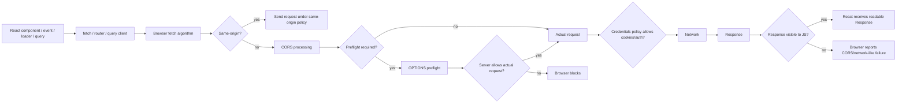
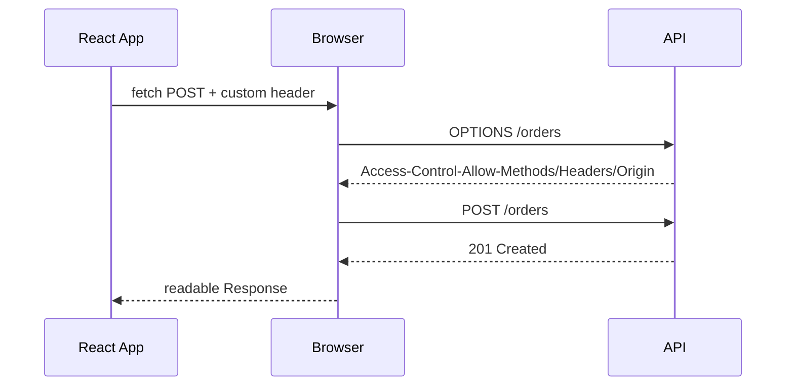
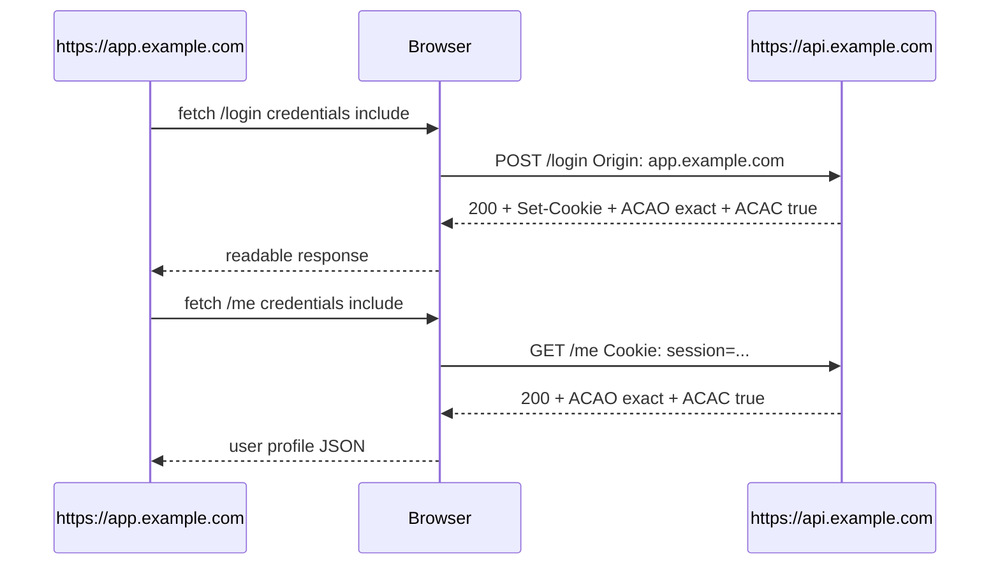

# Part 059 — CORS, Credentials, Cookies, and Browser Policy

> Target: setelah bagian ini, kamu tidak lagi melihat CORS sebagai "error frontend", cookie sebagai "storage kecil", atau `credentials: 'include'` sebagai magic flag. Kamu akan melihatnya sebagai **browser-enforced policy layer** yang menentukan apakah request boleh dikirim, response boleh dibaca, cookie boleh disertakan, dan header tertentu boleh terlihat oleh JavaScript.

Di aplikasi React production, sebagian besar bug client-server yang terlihat seperti masalah API sebenarnya adalah salah satu dari ini:

1. browser menolak response karena policy,
2. browser mengirim request tanpa credential yang kamu kira ikut,
3. server mengirim cookie yang tidak pernah disimpan browser,
4. JavaScript tidak bisa melihat header yang sebenarnya ada,
5. konfigurasi CORS dibuat terlalu longgar sehingga menjadi celah keamanan,
6. domain/subdomain/topology deployment tidak cocok dengan model credential.

Kita akan membedahnya dari layer paling bawah: **origin, site, request mode, credentials, preflight, exposed response, cookie attributes, dan deployment topology**.

---

## 1. Core Mental Model

React tidak berkomunikasi langsung dengan server. React memanggil API browser seperti `fetch()`. Browser lalu mengeksekusi request dengan policy:



The key invariant:

> **CORS is not an application authorization system. CORS is a browser read/send policy.**

A server still receives many HTTP requests outside browsers: curl, backend services, Postman, bots, mobile apps, malicious scripts, compromised browsers, and other servers. CORS does not protect the server from those clients. It controls what a compliant browser allows a frontend origin to do.

---

## 2. Origin vs Site: The First Boundary

A lot of security confusion starts because people use "domain", "origin", and "site" interchangeably.

### 2.1 Origin

An **origin** is:

```txt
scheme + host + port
```

Examples:

| URL | Origin |
|---|---|
| `https://app.example.com/dashboard` | `https://app.example.com:443` |
| `https://api.example.com/users` | `https://api.example.com:443` |
| `http://app.example.com` | `http://app.example.com:80` |
| `https://app.example.com:8443` | `https://app.example.com:8443` |

These are **different origins**:

```txt
https://app.example.com
https://api.example.com
http://app.example.com
https://app.example.com:8443
```

Same-origin policy cares about this boundary.

### 2.2 Site

A **site** is broader. Browser cookie `SameSite` logic is based on site, not exact origin. Conceptually:

```txt
scheme + registrable domain
```

So:

```txt
https://app.example.com
https://api.example.com
```

are usually same-site, but not same-origin.

This matters because:

- CORS is origin-based.
- Cookies `SameSite` are site-based.
- CSRF threat modeling is site/cookie/credential based.
- Subdomain API topologies are often same-site but cross-origin.

### 2.3 Practical consequence

If your React app is at:

```txt
https://app.company.com
```

and API is at:

```txt
https://api.company.com
```

then:

- request is cross-origin,
- browser may require CORS,
- cookies may still be same-site depending on attributes,
- `fetch()` will not automatically behave like a same-origin request unless configured and allowed.

---

## 3. Same-Origin Policy: The Default Deny Boundary

The browser default is conservative:

> A document from one origin should not freely read resources from another origin.

Without same-origin policy, any malicious page could read authenticated data from another site if the user was logged in.

Imagine this page:

```html
<script>
  fetch('https://bank.example.com/api/balance', { credentials: 'include' })
    .then(r => r.text())
    .then(sendToAttacker)
</script>
```

If browsers allowed arbitrary reads, the attacker could read the user's bank data because the browser might attach bank cookies. Same-origin policy blocks this class of attack by default.

But modern apps need cross-origin APIs. That is why CORS exists.

---

## 4. CORS: Server-Granted Browser Permission

CORS lets a server say:

> "Browser, I allow scripts from this origin to read this response, maybe with these methods, headers, and credentials."

The relevant response headers include:

```http
Access-Control-Allow-Origin: https://app.example.com
Access-Control-Allow-Credentials: true
Access-Control-Allow-Methods: GET, POST, PATCH, DELETE
Access-Control-Allow-Headers: Content-Type, X-CSRF-Token, Idempotency-Key
Access-Control-Expose-Headers: ETag, Location, Retry-After, X-Request-Id
Access-Control-Max-Age: 600
```

### 4.1 CORS is evaluated by the browser

If a backend returns a valid JSON response but missing CORS headers, the browser may block JavaScript from reading it.

Your server logs may show:

```txt
200 OK /api/orders
```

But the React app sees:

```txt
TypeError: Failed to fetch
```

That is normal: the request may have reached the server, but the browser refuses to expose the response.

### 4.2 CORS is not server protection

This is not protection:

```http
Access-Control-Allow-Origin: https://app.example.com
```

against:

```bash
curl https://api.example.com/private-data
```

CORS is not an authentication layer, not an authorization layer, and not an anti-bot layer. Server-side authz must still exist.

---

## 5. Fetch `mode`: How Browser Treats Cross-Origin Requests

`fetch()` accepts `mode` through `RequestInit`.

```ts
await fetch('https://api.example.com/orders', {
  mode: 'cors',
});
```

Common values:

| Mode | Meaning | Production use |
|---|---|---|
| `same-origin` | Only allow same-origin requests | Good default for app-internal clients that should never call cross-origin endpoints |
| `cors` | Allow cross-origin request using CORS | Default for many `fetch()` cross-origin cases |
| `no-cors` | Make restricted opaque request | Rarely useful for API clients; response is unreadable |

### 5.1 The `no-cors` trap

Many engineers try this after seeing a CORS error:

```ts
fetch('https://api.example.com/orders', {
  mode: 'no-cors',
});
```

This does **not** disable CORS in a useful API sense. It makes the response **opaque**. You cannot read status, headers, or body.

Bad:

```ts
const response = await fetch(url, { mode: 'no-cors' });
console.log(response.status); // often 0
await response.json();        // not useful
```

Correct response to CORS errors:

- fix server CORS policy,
- fix origin allowlist,
- fix credentials policy,
- fix request headers/methods,
- fix deployment topology.

Do not use `no-cors` to call JSON APIs.

---

## 6. Fetch `credentials`: Whether Browser Sends Ambient Credentials

`credentials` controls whether browser includes credentials such as cookies, TLS client certificates, and HTTP auth credentials.

```ts
await fetch('/api/me', {
  credentials: 'same-origin',
});
```

Common values:

| Value | Meaning |
|---|---|
| `omit` | Never send credentials |
| `same-origin` | Send credentials only for same-origin requests |
| `include` | Send credentials for same-origin and cross-origin requests, subject to cookie/CORS policy |

Important invariant:

> `credentials: 'include'` is necessary for cross-origin cookie-based APIs, but not sufficient.

The browser also needs:

1. cookie attributes that allow sending,
2. server CORS response with exact `Access-Control-Allow-Origin`,
3. `Access-Control-Allow-Credentials: true`,
4. no wildcard origin when credentials are used,
5. valid HTTPS/SameSite/Secure behavior.

### 6.1 Same-origin BFF example

If React and API are same origin:

```txt
https://app.example.com
https://app.example.com/api/orders
```

then a conservative client can use:

```ts
export async function apiFetch(path: string, init: RequestInit = {}) {
  return fetch(`/api${path}`, {
    ...init,
    credentials: 'same-origin',
  });
}
```

This avoids accidentally sending cookies to cross-origin endpoints.

### 6.2 Cross-origin subdomain API example

If React and API are different origins:

```txt
https://app.example.com
https://api.example.com
```

then cookie-based requests often require:

```ts
await fetch('https://api.example.com/orders', {
  method: 'GET',
  mode: 'cors',
  credentials: 'include',
});
```

Server must respond:

```http
Access-Control-Allow-Origin: https://app.example.com
Access-Control-Allow-Credentials: true
```

Not:

```http
Access-Control-Allow-Origin: *
Access-Control-Allow-Credentials: true
```

That combination is invalid for credentialed CORS.

---

## 7. Simple Request vs Preflighted Request

A cross-origin request may be sent directly, or it may need a **preflight**.

A preflight is an `OPTIONS` request sent by the browser before the actual request.



### 7.1 Why preflight exists

Preflight gives the server a chance to allow or reject potentially unsafe cross-origin requests before the real mutation or custom-header request is sent.

Typical triggers:

- non-simple method like `PUT`, `PATCH`, `DELETE`,
- custom request headers like `X-CSRF-Token`, `Authorization`, `Idempotency-Key`,
- non-safelisted `Content-Type` such as `application/json` in many CORS contexts,
- upload listeners in XHR, some stream/body cases depending on platform rules.

### 7.2 What server must answer

Example preflight:

```http
OPTIONS /api/orders HTTP/1.1
Origin: https://app.example.com
Access-Control-Request-Method: POST
Access-Control-Request-Headers: content-type, x-csrf-token, idempotency-key
```

Valid response:

```http
HTTP/1.1 204 No Content
Access-Control-Allow-Origin: https://app.example.com
Access-Control-Allow-Credentials: true
Access-Control-Allow-Methods: GET, POST, PATCH, DELETE
Access-Control-Allow-Headers: Content-Type, X-CSRF-Token, Idempotency-Key
Access-Control-Max-Age: 600
Vary: Origin
```

### 7.3 Preflight failure looks like network failure

From JavaScript, a preflight failure usually does not expose detailed server response.

Your client code should not depend on reading a JSON error body from failed CORS preflight. The browser blocks it before your app has a useful response.

---

## 8. CORS Response Header Semantics

### 8.1 `Access-Control-Allow-Origin`

Options:

```http
Access-Control-Allow-Origin: https://app.example.com
```

or for public non-credentialed resources:

```http
Access-Control-Allow-Origin: *
```

Use exact origin for credentialed APIs.

Bad for private API:

```http
Access-Control-Allow-Origin: *
```

Worse with dynamic reflection:

```ts
res.setHeader('Access-Control-Allow-Origin', req.headers.origin ?? '*');
```

This is dangerous unless the origin is validated against an allowlist.

Correct pattern:

```ts
const allowedOrigins = new Set([
  'https://app.example.com',
  'https://admin.example.com',
]);

function resolveCorsOrigin(origin: string | undefined): string | undefined {
  if (!origin) return undefined;
  return allowedOrigins.has(origin) ? origin : undefined;
}
```

### 8.2 `Vary: Origin`

If the server dynamically returns different CORS headers by origin, include:

```http
Vary: Origin
```

Without it, caches/CDNs may serve a response authorized for one origin to another origin.

### 8.3 `Access-Control-Allow-Credentials`

For cookie-based cross-origin APIs:

```http
Access-Control-Allow-Credentials: true
```

But this does not mean "authenticated". It only tells the browser it may expose credentialed cross-origin responses when the rest of the policy matches.

### 8.4 `Access-Control-Allow-Headers`

If client sends custom headers:

```ts
fetch(url, {
  method: 'POST',
  headers: {
    'Content-Type': 'application/json',
    'X-CSRF-Token': token,
    'Idempotency-Key': key,
  },
});
```

preflight must allow them:

```http
Access-Control-Allow-Headers: Content-Type, X-CSRF-Token, Idempotency-Key
```

### 8.5 `Access-Control-Expose-Headers`

By default, JavaScript can only read a limited set of response headers.

If React needs these:

```ts
const etag = response.headers.get('ETag');
const location = response.headers.get('Location');
const requestId = response.headers.get('X-Request-Id');
const retryAfter = response.headers.get('Retry-After');
```

server must expose them:

```http
Access-Control-Expose-Headers: ETag, Location, X-Request-Id, Retry-After
```

Without this, the headers may exist on the wire but be invisible to JavaScript.

---

## 9. Cookies Are Transported by Browser Policy

Cookies are not just storage. For authenticated browser apps, cookies are often **ambient credentials**:

- browser stores them,
- browser attaches them to matching requests,
- JavaScript may or may not be able to read them,
- server receives them as `Cookie` header.

A cookie is set by server:

```http
Set-Cookie: session=abc; Path=/; Secure; HttpOnly; SameSite=Lax
```

Browser later sends:

```http
Cookie: session=abc
```

if policy allows.

### 9.1 Cookie attributes that matter

| Attribute | Meaning | Security relevance |
|---|---|---|
| `Secure` | Send only over HTTPS, except localhost handling | Required for sensitive cookies |
| `HttpOnly` | Not readable by JavaScript | Reduces token theft via XSS |
| `SameSite` | Controls cross-site sending | Major CSRF mitigation layer |
| `Domain` | Which hosts receive cookie | Too broad can leak across subdomains |
| `Path` | URL path scope | Routing convenience, not strong security isolation |
| `Max-Age` / `Expires` | Lifetime | Session vs persistent behavior |
| `Partitioned` | Partitioned third-party cookie storage | Relevant for embedded/cross-site contexts |

### 9.2 `HttpOnly` and React

If a cookie is `HttpOnly`, React cannot read it:

```ts
console.log(document.cookie); // session not visible
```

That is the point. The browser can send the cookie, but JavaScript cannot steal it directly.

This means:

- React should not parse the session cookie.
- React should call `/api/me` or equivalent session endpoint.
- Auth state in React is a server-confirmed projection, not the credential itself.

### 9.3 `Secure`

Sensitive cookies should use:

```http
Secure
```

Otherwise, they may be sent over plaintext HTTP.

In local development, use:

- localhost exceptions where available,
- HTTPS local dev proxy,
- dev-only cookie policy isolated from production.

Do not weaken production cookie policy to simplify local dev.

### 9.4 `SameSite`

Typical options:

| Value | Behavior |
|---|---|
| `Strict` | Send only in same-site contexts |
| `Lax` | Send for same-site and some top-level navigations |
| `None` | Send in cross-site contexts; requires `Secure` |

A common session cookie:

```http
Set-Cookie: session=...; Path=/; Secure; HttpOnly; SameSite=Lax
```

For embedded third-party or truly cross-site flows, you may need:

```http
Set-Cookie: session=...; Path=/; Secure; HttpOnly; SameSite=None
```

But this has stronger CSRF/privacy implications and browser compatibility constraints.

### 9.5 `Domain`

Host-only cookie:

```http
Set-Cookie: session=abc; Path=/; Secure; HttpOnly; SameSite=Lax
```

Domain cookie:

```http
Set-Cookie: session=abc; Domain=.example.com; Path=/; Secure; HttpOnly; SameSite=Lax
```

Host-only is usually safer. Domain-wide cookies are sent to subdomains and can create cross-subdomain risk.

For high-value session cookies, consider the `__Host-` prefix:

```http
Set-Cookie: __Host-session=abc; Path=/; Secure; HttpOnly; SameSite=Lax
```

A `__Host-` cookie must be `Secure`, have `Path=/`, and omit `Domain` in supporting browsers. This prevents subdomain cookie injection for that cookie name.

---

## 10. Credentialed Cross-Origin Cookie Flow

A typical cookie-based cross-origin flow:



Requirements:

Client:

```ts
await fetch('https://api.example.com/me', {
  mode: 'cors',
  credentials: 'include',
});
```

Server:

```http
Access-Control-Allow-Origin: https://app.example.com
Access-Control-Allow-Credentials: true
Vary: Origin
```

Cookie:

```http
Set-Cookie: __Host-session=...; Path=/; Secure; HttpOnly; SameSite=Lax
```

or, for cross-site context when unavoidable:

```http
Set-Cookie: session=...; Path=/; Secure; HttpOnly; SameSite=None
```

---

## 11. Common Deployment Topologies

### 11.1 Same-origin BFF

```txt
https://app.example.com
https://app.example.com/api
```


Pros:

- avoids most CORS complexity,
- `credentials: 'same-origin'` is enough,
- easier CSRF strategy,
- easier cookie scope,
- hides internal service topology.

Cons:

- BFF must be operated,
- may add hop/latency,
- can become frontend-specific backend monolith if unmanaged.

Best for:

- enterprise apps,
- dashboards,
- cookie-based auth,
- sensitive workflows,
- complex backend orchestration.

### 11.2 Cross-origin API subdomain

```txt
https://app.example.com
https://api.example.com
```

Pros:

- clean API domain,
- easier backend separation,
- common SaaS topology.

Cons:

- needs CORS,
- credential semantics are easy to misconfigure,
- more complex local/dev/staging setup,
- subdomain cookie scope must be deliberate.

### 11.3 Third-party API directly from browser

```txt
https://app.example.com -> https://thirdparty.example
```

This is usually bad for secret-bearing APIs because browser code cannot keep secrets.

Use backend proxy/BFF when:

- API key must stay secret,
- response needs normalization,
- request must be signed,
- rate limiting must be controlled by your backend,
- auditability matters.

---

## 12. CORS Does Not Replace Authorization

Bad assumption:

> "Only our frontend origin is allowed by CORS, so the API is safe."

No.

Attackers can call the API outside browser CORS:

```bash
curl -H 'Authorization: Bearer stolen-token' https://api.example.com/admin/users
```

Server must still enforce:

- authentication,
- authorization,
- tenant isolation,
- object-level permission checks,
- rate limits,
- input validation,
- audit logs.

CORS should be treated as:

```txt
browser exposure policy
```

not:

```txt
business access control
```

---

## 13. Authorization Header vs Cookie Credentials

### 13.1 Bearer token in `Authorization`

```ts
await fetch('/api/orders', {
  headers: {
    Authorization: `Bearer ${accessToken}`,
  },
});
```

Pros:

- explicit credential transport,
- not automatically sent cross-site,
- easier for non-browser clients,
- often avoids CSRF because credential is not ambient.

Cons:

- token storage problem in browser,
- vulnerable to XSS exfiltration if stored/readable by JS,
- refresh flow complexity,
- header triggers CORS preflight cross-origin.

### 13.2 HttpOnly session cookie

```http
Set-Cookie: __Host-session=...; Path=/; Secure; HttpOnly; SameSite=Lax
```

Pros:

- not readable by JavaScript,
- natural browser session model,
- good with same-origin BFF,
- server can rotate/session-invalidate centrally.

Cons:

- ambient credentials create CSRF risk,
- cross-origin credentialed CORS is tricky,
- cookie attributes/topology must be correct,
- frontend must not assume auth state without server confirmation.

### 13.3 Practical recommendation

For sensitive enterprise React apps:

- prefer **same-origin BFF + HttpOnly Secure SameSite cookie** when possible,
- use CSRF protections for unsafe methods,
- use explicit API clients and route/action boundaries,
- avoid long-lived tokens in `localStorage`,
- never put backend secrets in frontend code.

---

## 14. Frontend API Client Policy

Build credential policy into your API client, not into random call sites.

```ts
export type ApiOrigin = 'same-origin' | 'company-api' | 'public';

export type ApiRequestOptions = {
  method?: string;
  body?: unknown;
  headers?: Record<string, string>;
  origin?: ApiOrigin;
  signal?: AbortSignal;
};

const API_ORIGINS: Record<ApiOrigin, string> = {
  'same-origin': '',
  'company-api': 'https://api.example.com',
  public: 'https://public.example.net',
};

function credentialsFor(origin: ApiOrigin): RequestCredentials {
  switch (origin) {
    case 'same-origin':
      return 'same-origin';
    case 'company-api':
      return 'include';
    case 'public':
      return 'omit';
  }
}

export async function apiFetch<T>(
  path: string,
  options: ApiRequestOptions = {},
): Promise<T> {
  const origin = options.origin ?? 'same-origin';
  const baseUrl = API_ORIGINS[origin];
  const url = `${baseUrl}${path}`;

  const response = await fetch(url, {
    method: options.method ?? 'GET',
    mode: origin === 'same-origin' ? 'same-origin' : 'cors',
    credentials: credentialsFor(origin),
    signal: options.signal,
    headers: {
      Accept: 'application/json',
      ...(options.body === undefined ? {} : { 'Content-Type': 'application/json' }),
      ...options.headers,
    },
    body: options.body === undefined ? undefined : JSON.stringify(options.body),
  });

  if (!response.ok) {
    throw await parseApiError(response);
  }

  if (response.status === 204) {
    return undefined as T;
  }

  return (await response.json()) as T;
}
```

This design forces each API origin to have an explicit credential posture.

---

## 15. Server CORS Policy as Code

Do not scatter CORS strings across services.

Model CORS as policy:

```ts
type CorsPolicy = {
  allowedOrigins: Set<string>;
  allowedMethods: string[];
  allowedHeaders: string[];
  exposedHeaders: string[];
  allowCredentials: boolean;
  maxAgeSeconds: number;
};

const browserApiCors: CorsPolicy = {
  allowedOrigins: new Set([
    'https://app.example.com',
    'https://admin.example.com',
  ]),
  allowedMethods: ['GET', 'POST', 'PATCH', 'DELETE'],
  allowedHeaders: ['Content-Type', 'X-CSRF-Token', 'Idempotency-Key'],
  exposedHeaders: ['ETag', 'Location', 'Retry-After', 'X-Request-Id'],
  allowCredentials: true,
  maxAgeSeconds: 600,
};
```

Then implementation:

```ts
function applyCors(req: Request, res: Response, policy: CorsPolicy): boolean {
  const origin = req.headers.origin;

  if (!origin || !policy.allowedOrigins.has(origin)) {
    return false;
  }

  res.setHeader('Access-Control-Allow-Origin', origin);
  res.setHeader('Vary', 'Origin');

  if (policy.allowCredentials) {
    res.setHeader('Access-Control-Allow-Credentials', 'true');
  }

  res.setHeader('Access-Control-Allow-Methods', policy.allowedMethods.join(', '));
  res.setHeader('Access-Control-Allow-Headers', policy.allowedHeaders.join(', '));
  res.setHeader('Access-Control-Expose-Headers', policy.exposedHeaders.join(', '));
  res.setHeader('Access-Control-Max-Age', String(policy.maxAgeSeconds));

  return true;
}
```

Review CORS changes as security-sensitive changes.

---

## 16. Local Development Without Corrupting Production Policy

Common mistake:

```http
Access-Control-Allow-Origin: *
```

because local dev failed.

Better:

```ts
const allowedOrigins = new Set([
  'https://app.example.com',
  'https://admin.example.com',
  'http://localhost:5173',
  'http://localhost:3000',
]);
```

But only for non-production environments, or explicitly controlled via config.

Recommended local patterns:

1. same-origin dev proxy:

```txt
localhost:5173/api -> localhost:8080
```

2. HTTPS local domain:

```txt
https://app.local.example.test
https://api.local.example.test
```

3. explicit dev CORS allowlist, never wildcard for credentialed APIs.

---

## 17. CORS Error Diagnosis Playbook

When the browser says CORS failed, do not guess. Classify.

### 17.1 Check origin

In DevTools Network request headers:

```http
Origin: https://app.example.com
```

Is that exact origin in server allowlist?

### 17.2 Check actual response CORS headers

Response should include:

```http
Access-Control-Allow-Origin: https://app.example.com
Vary: Origin
```

For cookies:

```http
Access-Control-Allow-Credentials: true
```

### 17.3 Check preflight

Look for `OPTIONS` request.

Does it return:

```http
2xx
Access-Control-Allow-Methods: ...
Access-Control-Allow-Headers: ...
```

Does it include the requested custom headers?

### 17.4 Check credentials

Client:

```ts
credentials: 'include'
```

Server:

```http
Access-Control-Allow-Credentials: true
Access-Control-Allow-Origin: exact origin
```

Cookie:

```http
Secure; HttpOnly; SameSite=...
```

### 17.5 Check exposed response headers

If JavaScript cannot read `ETag`, `Location`, `Retry-After`, or `X-Request-Id`, add:

```http
Access-Control-Expose-Headers: ETag, Location, Retry-After, X-Request-Id
```

### 17.6 Check CDN/proxy

Common proxy/CDN bugs:

- strips `Access-Control-*` headers,
- handles `OPTIONS` incorrectly,
- fails to forward `Origin`,
- caches response without `Vary: Origin`,
- redirects preflight,
- returns HTML error page for `OPTIONS`.

---

## 18. Browser Policy Failure Modes

### 18.1 Server works in curl but fails in browser

Likely:

- missing CORS headers,
- preflight rejected,
- response redirect blocked,
- credentialed wildcard origin,
- cookie not allowed.

### 18.2 Cookie set in response but not stored

Likely:

- missing `Secure` for `SameSite=None`,
- third-party cookie restrictions,
- invalid domain,
- public suffix issue,
- response blocked by CORS credential policy,
- HTTPS requirement not met,
- local environment mismatch.

### 18.3 Request sent but no cookie attached

Likely:

- `credentials` not `include` for cross-origin,
- `SameSite` prevents cross-site send,
- cookie domain/path mismatch,
- cookie expired,
- secure cookie over HTTP,
- partitioned cookie context mismatch.

### 18.4 Header exists but JavaScript sees `null`

Likely:

- response header not CORS-exposed,
- header stripped by proxy,
- looking at preflight response not actual response.

### 18.5 CORS works in staging but not production

Likely:

- production origin missing from allowlist,
- CDN caches wrong CORS response,
- production HTTPS/domain changes cookie behavior,
- multiple app origins not modeled,
- canary domain not added.

---

## 19. CORS and Multi-Tenant SaaS

Dynamic tenant subdomains:

```txt
tenant-a.app.example.com
tenant-b.app.example.com
```

Do not blindly allow:

```txt
*.example.com
```

without understanding subdomain takeover risk and tenant isolation.

Safer policy model:

```ts
async function isAllowedOrigin(origin: string): Promise<boolean> {
  const parsed = new URL(origin);

  if (parsed.protocol !== 'https:') return false;
  if (!parsed.hostname.endsWith('.app.example.com')) return false;

  const tenantSlug = parsed.hostname.replace('.app.example.com', '');
  return await tenantOriginRegistry.contains(tenantSlug, origin);
}
```

For admin surfaces, use a separate allowlist:

```txt
https://admin.example.com
```

not tenant wildcard.

---

## 20. Cookies and Tenant/User Isolation

Cookie scope must match isolation requirements.

Bad for strict tenant isolation:

```http
Set-Cookie: session=...; Domain=.example.com; Path=/; Secure; HttpOnly; SameSite=Lax
```

This may cause one session cookie to be sent across many subdomains.

Better for host-scoped app:

```http
Set-Cookie: __Host-session=...; Path=/; Secure; HttpOnly; SameSite=Lax
```

But host-only cookie works only for the exact host that set it. For `app.example.com` calling `api.example.com`, you need to design where the session lives:

- same-origin BFF at `app.example.com/api`, or
- API sets domain cookie intentionally, or
- API issues token via secure BFF flow, or
- session endpoint is same-origin proxied.

There is no free topology.

---

## 21. React-Side Auth State Under Cookie Sessions

Do not model cookie existence as auth state. React cannot reliably know it.

Use server-confirmed session projection:

```ts
type SessionView =
  | { status: 'anonymous' }
  | { status: 'authenticated'; user: { id: string; name: string; roles: string[] } };

async function getSession(): Promise<SessionView> {
  return apiFetch<SessionView>('/session', {
    origin: 'same-origin',
  });
}
```

Then query:

```ts
function useSession() {
  return useQuery({
    queryKey: ['session'],
    queryFn: getSession,
    staleTime: 30_000,
  });
}
```

On logout:

```ts
await apiFetch('/logout', { method: 'POST' });
queryClient.clear();
```

Clearing cache matters because cookie invalidation alone does not remove sensitive cached data from memory.

---

## 22. CORS with React Query and Route Loaders

Centralize credentials in the API client:

```ts
const queryClient = new QueryClient({
  defaultOptions: {
    queries: {
      queryFn: async ({ queryKey, signal }) => {
        const [resource, params] = queryKey as [string, unknown];
        return apiFetch(`/api/${resource}`, { signal });
      },
    },
  },
});
```

Avoid per-component mistakes:

```ts
// Bad: every component invents credential policy.
fetch('https://api.example.com/orders');
fetch('https://api.example.com/orders', { credentials: 'include' });
fetch('/api/orders', { mode: 'no-cors' });
```

Route loader example:

```ts
export async function loader({ request }: LoaderFunctionArgs) {
  const url = new URL(request.url);
  const page = url.searchParams.get('page') ?? '1';

  return apiFetch(`/orders?page=${encodeURIComponent(page)}`, {
    origin: 'same-origin',
  });
}
```

The loader should not need to know low-level CORS details if topology/API client is stable.

---

## 23. Observability for Browser Policy Problems

CORS failures are hard because browser hides details from JavaScript.

Still capture:

```ts
type NetworkFailureEvent = {
  kind: 'network_or_cors_failure';
  urlOrigin: string;
  appOrigin: string;
  method: string;
  credentials: RequestCredentials;
  mode: RequestMode;
  hasCustomHeaders: boolean;
  elapsedMs: number;
  requestId?: string;
};
```

Log classification:

```ts
function classifyFetchFailure(error: unknown): 'abort' | 'network_or_cors' | 'unknown' {
  if (error instanceof DOMException && error.name === 'AbortError') return 'abort';
  if (error instanceof TypeError) return 'network_or_cors';
  return 'unknown';
}
```

Server-side, log preflight separately:

```txt
cors.preflight.allowed
cors.preflight.denied_origin
cors.preflight.denied_header
cors.preflight.denied_method
cors.actual.denied_origin
```

This avoids endless frontend/backend blame loops.

---

## 24. Security Review Checklist

For every browser-facing API origin:

- Is the origin topology documented?
- Is CORS allowlist exact, not wildcard for credentialed APIs?
- Is `Vary: Origin` present when origin is reflected?
- Are allowed methods minimal?
- Are allowed headers minimal?
- Are exposed response headers intentional?
- Are cookies `Secure`, `HttpOnly`, and `SameSite` appropriate?
- Is `Domain` avoided unless explicitly needed?
- Are high-value cookies using `__Host-` where possible?
- Does frontend API client centralize `mode` and `credentials`?
- Are CSRF protections present for cookie-auth unsafe mutations?
- Does logout clear app caches and not only server session?
- Are staging/preview domains modeled safely?
- Are preflight failures observable server-side?
- Are third-party APIs proxied when secrets/signing are required?

---

## 25. Engineering Heuristics

Use these defaults unless you have a concrete reason not to:

1. **Same-origin BFF** for sensitive enterprise apps.
2. **HttpOnly + Secure + SameSite** cookies for browser sessions.
3. **`credentials: 'same-origin'`** for same-origin BFF calls.
4. **`credentials: 'include'` only for known cross-origin APIs**.
5. **Exact CORS origins**, never wildcard for credentialed APIs.
6. **No direct browser calls to secret-bearing third-party APIs**.
7. **Expose only headers the frontend must read**.
8. **Treat CORS config as security policy**, not middleware boilerplate.
9. **Do not use `no-cors` for application JSON APIs**.
10. **Do not rely on CORS as authorization**.

---

## 26. References

- MDN — Cross-Origin Resource Sharing: https://developer.mozilla.org/en-US/docs/Web/HTTP/Guides/CORS
- MDN — Using the Fetch API: https://developer.mozilla.org/en-US/docs/Web/API/Fetch_API/Using_Fetch
- MDN — RequestInit: https://developer.mozilla.org/en-US/docs/Web/API/RequestInit
- MDN — Set-Cookie: https://developer.mozilla.org/en-US/docs/Web/HTTP/Reference/Headers/Set-Cookie
- MDN — Using HTTP cookies: https://developer.mozilla.org/en-US/docs/Web/HTTP/Guides/Cookies
- OWASP — Cross-Site Request Forgery Prevention Cheat Sheet: https://cheatsheetseries.owasp.org/cheatsheets/Cross-Site_Request_Forgery_Prevention_Cheat_Sheet.html

---

## Closing

CORS, credentials, and cookies are not separate topics. In a React application, they form one boundary:

```txt
Can the browser send the request?
Can credentials ride with it?
Can the browser store or attach cookies?
Can JavaScript read the response?
Can JavaScript see the headers it needs?
```

Once you model that boundary explicitly, many "random CORS bugs" become deterministic policy mismatches.

Next: we use this model to design **CSRF-safe mutations**.
