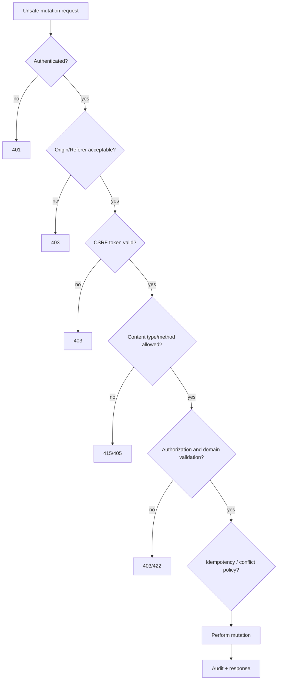
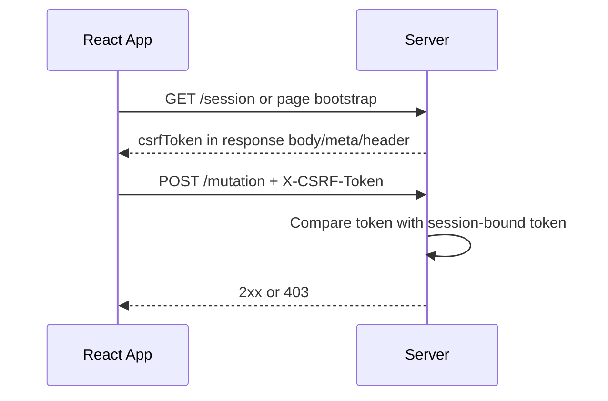
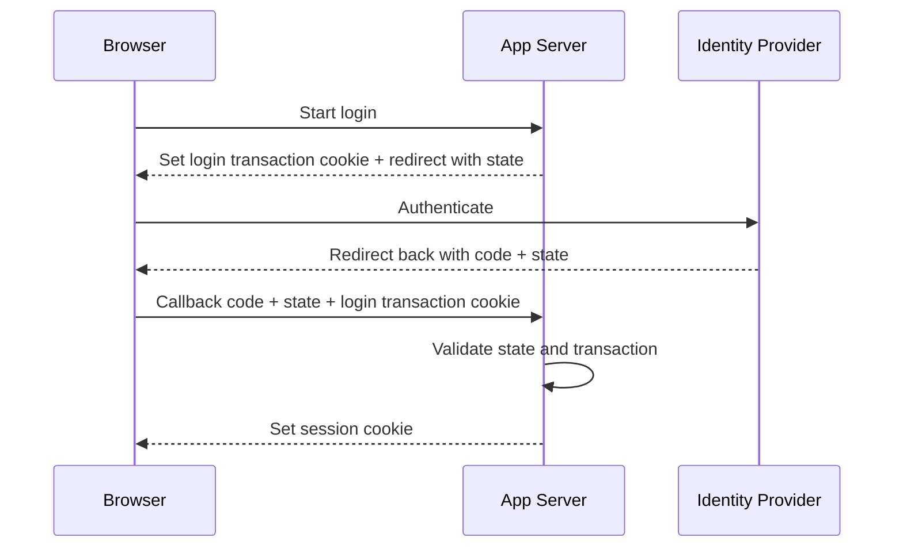
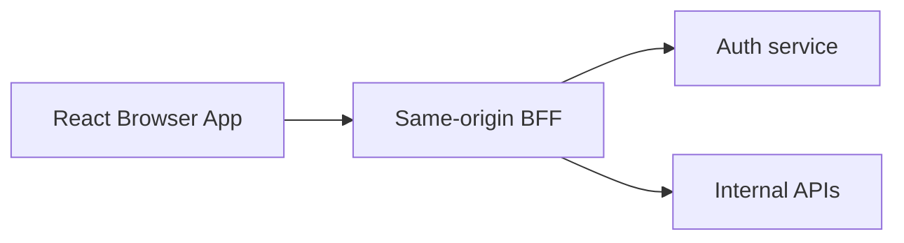

# Part 060 — CSRF, Token Transport, and Safe Mutations

> Target: setelah bagian ini, kamu bisa mendesain mutation flow React yang aman terhadap CSRF, jelas secara HTTP semantics, kompatibel dengan route actions/forms, tidak bergantung pada mitos CORS, dan punya failure behavior yang bisa diaudit.

CSRF adalah salah satu area yang sering salah dipahami oleh frontend engineer karena bug-nya tidak selalu terlihat di UI. Aplikasi bisa terlihat berjalan normal, tetapi mutation endpoint diam-diam bisa dipicu dari origin lain oleh browser korban yang sedang login.

Kita akan membahas:

- apa threat model CSRF,
- kapan React app rentan,
- kenapa CORS bukan pengganti CSRF defense,
- bagaimana cookie/session/token berinteraksi,
- bagaimana mendesain safe mutation contract,
- bagaimana menerapkan CSRF token di React, loaders/actions, Server Functions, dan API client,
- bagaimana testing dan observability-nya.

---

## 1. Mental Model: CSRF Is Ambient Credential Abuse

CSRF adalah serangan ketika situs berbahaya memaksa browser korban mengirim request ke aplikasi terpercaya, dan browser otomatis melampirkan credential yang sudah ada.

```mermaid
sequenceDiagram
  participant U as User Browser
  participant Evil as evil.example
  participant App as app.example.com

  U->>App: User login, receives session cookie
  App-->>U: Set-Cookie: session=...; HttpOnly
  U->>Evil: User visits evil.example
  Evil-->>U: HTML/JS causing request to app.example.com
  U->>App: POST /transfer Cookie: session=...
  App-->>U: Mutation accepted if no CSRF defense
```

Core invariant:

> **CSRF matters when authentication is ambient.**

Ambient means browser sends credentials automatically, especially cookies.

If the frontend uses `Authorization: Bearer <token>` stored only in memory and not automatically attached by browser to cross-site requests, classic CSRF risk is reduced. But that may increase XSS/token exfiltration risk. Security is a trade-off, not a slogan.

---

## 2. CSRF vs XSS

Do not merge these threats.

| Threat | Attacker capability | Primary abuse |
|---|---|---|
| CSRF | Attacker can cause victim browser to send request | Uses victim's ambient credentials |
| XSS | Attacker runs script inside your origin | Can read/modify app state, call APIs as app |

CSRF defense does not solve XSS.

If attacker has XSS inside your origin, they can often read CSRF tokens from DOM/JS and call APIs legitimately. That is why XSS prevention, CSP, output encoding, dependency hygiene, and token scoping still matter.

But CSRF defense is still required for cookie-authenticated apps because not every attacker has XSS.

---

## 3. When Is a React App CSRF-Relevant?

High CSRF relevance:

- session stored in cookie,
- cookie is sent automatically by browser,
- unsafe mutation endpoints exist,
- app accepts form-compatible requests,
- `SameSite=None` or cross-site contexts are needed,
- API supports cross-origin credentialed CORS,
- BFF uses cookies for authentication.

Lower CSRF relevance:

- API requires explicit `Authorization` header unavailable to attacker origin,
- no ambient credential transport,
- all mutations require non-cookie proof-of-possession,
- strong Origin checks and token validation exist.

Still, do not casually dismiss CSRF. Many real React apps use HttpOnly session cookies by design.

---

## 4. Safe Methods Must Be Safe

HTTP semantics matter.

These methods are conventionally safe/read-only:

```txt
GET, HEAD, OPTIONS
```

These are unsafe/mutating:

```txt
POST, PUT, PATCH, DELETE
```

Critical invariant:

> **Never perform state-changing operations through GET.**

Bad:

```http
GET /api/delete-account?id=123
```

Why bad?

- links can trigger it,
- crawlers can trigger it,
- prefetchers can trigger it,
- image/script tags can trigger it,
- malicious pages can embed it easily,
- caches may treat it incorrectly.

Correct:

```http
POST /api/account/deletion-request
```

with:

- authentication,
- authorization,
- CSRF defense,
- idempotency when needed,
- confirmation/re-auth for high-risk actions,
- audit log.

---

## 5. Defense-in-Depth Model

CSRF protection should not be one mechanism. Use layered controls.



Practical layers:

1. correct HTTP method semantics,
2. SameSite cookies,
3. CSRF token,
4. Origin/Referer validation,
5. content-type/header constraints,
6. CORS allowlist,
7. authorization and tenant checks,
8. idempotency for retryable mutation,
9. audit logging.

---

## 6. SameSite Is Helpful, Not Sufficient Alone

Cookie:

```http
Set-Cookie: __Host-session=...; Path=/; Secure; HttpOnly; SameSite=Lax
```

`SameSite=Lax` blocks many cross-site subresource/form CSRF cases while still allowing some top-level navigation scenarios.

`SameSite=Strict` is stronger but may break legitimate flows such as external links back into an app.

`SameSite=None` allows cross-site sending and requires `Secure`. It should be treated as high-sensitivity and paired with robust CSRF defenses.

Important:

> SameSite is a browser behavior layer. It is not a complete authorization system and may not cover every app-specific flow.

Use SameSite as a baseline, not the whole strategy.

---

## 7. Token Patterns

### 7.1 Synchronizer token pattern

Server stores CSRF token in the session or server-side state.

Flow:



Server state:

```txt
session_id -> csrf_token
```

Client sends token:

```http
X-CSRF-Token: token-value
```

Pros:

- strong session binding,
- straightforward validation,
- good for server-rendered/bootstrap apps.

Cons:

- requires server-side state or session store,
- token rotation/tab behavior must be managed,
- SSR/cache must avoid leaking tokens.

### 7.2 Signed double-submit cookie

Server sends a readable CSRF cookie and validates a matching header/field value that is signed and bound to the session.

Cookie:

```http
Set-Cookie: csrf=token.signature; Path=/; Secure; SameSite=Lax
```

Request:

```http
Cookie: csrf=token.signature; session=...
X-CSRF-Token: token.signature
```

Server validates:

- header exists,
- cookie exists,
- values match or correspond,
- signature valid,
- token bound to authenticated session/session ID,
- not expired if expiry is encoded.

Important:

> A naive double-submit cookie that is not signed and session-bound can be vulnerable to cookie injection in some scenarios.

Use a signed/session-bound variant.

### 7.3 Custom header as preflight trigger

Using a custom header:

```http
X-CSRF-Token: ...
```

has two properties:

1. server can validate the token,
2. cross-origin browser requests with that header generally require CORS preflight.

But do not rely only on "preflight happens". Validate the token server-side.

---

## 8. Token Transport in React

### 8.1 Bootstrap through session endpoint

Common SPA/BFF design:

```ts
type SessionBootstrap = {
  user: {
    id: string;
    name: string;
  } | null;
  csrfToken: string;
};

export async function getSessionBootstrap(): Promise<SessionBootstrap> {
  return apiFetch<SessionBootstrap>('/session/bootstrap', {
    method: 'GET',
  });
}
```

Then hold token in memory:

```ts
let csrfToken: string | null = null;

export function setCsrfToken(next: string | null) {
  csrfToken = next;
}

export function getCsrfToken() {
  return csrfToken;
}
```

Add it only for unsafe methods:

```ts
const unsafeMethods = new Set(['POST', 'PUT', 'PATCH', 'DELETE']);

function csrfHeaderFor(method: string): Record<string, string> {
  if (!unsafeMethods.has(method.toUpperCase())) return {};

  const token = getCsrfToken();
  if (!token) {
    throw new Error('Missing CSRF token for unsafe request');
  }

  return { 'X-CSRF-Token': token };
}
```

### 8.2 API client integration

```ts
export async function apiFetch<T>(
  path: string,
  init: RequestInit = {},
): Promise<T> {
  const method = (init.method ?? 'GET').toUpperCase();

  const response = await fetch(`/api${path}`, {
    ...init,
    method,
    mode: 'same-origin',
    credentials: 'same-origin',
    headers: {
      Accept: 'application/json',
      ...(init.body ? { 'Content-Type': 'application/json' } : {}),
      ...csrfHeaderFor(method),
      ...(init.headers as Record<string, string> | undefined),
    },
  });

  if (response.status === 403) {
    const problem = await parseProblem(response);
    if (problem.code === 'csrf.invalid' || problem.code === 'csrf.missing') {
      throw new CsrfError(problem);
    }
    throw new ApiForbiddenError(problem);
  }

  if (!response.ok) throw await parseApiError(response);
  if (response.status === 204) return undefined as T;
  return (await response.json()) as T;
}
```

### 8.3 Do not attach CSRF to every request blindly

Attaching tokens to every request can:

- leak token to logs/proxies on read endpoints,
- trigger unnecessary preflights cross-origin,
- hide unsafe method misuse,
- make review harder.

Attach only to unsafe same-origin or approved API-origin mutation requests.

---

## 9. Token Storage: Where Should It Live?

### 9.1 In memory

Good default for SPA:

```txt
GET bootstrap -> memory variable/context -> mutation header
```

Pros:

- not persistent after full reload,
- avoids `localStorage` leakage,
- simple invalidation on logout.

Cons:

- requires bootstrap on reload,
- multiple tabs need coordination or each tab bootstraps,
- token expiry must be handled.

### 9.2 Meta tag in server-rendered HTML

```html
<meta name="csrf-token" content="..." />
```

Read once:

```ts
const token = document
  .querySelector<HTMLMetaElement>('meta[name="csrf-token"]')
  ?.content;
```

Good for SSR/BFF apps. Be careful with HTML caching. CSRF-bearing HTML must not be cached publicly.

### 9.3 Readable CSRF cookie

For signed double-submit cookie, JavaScript may read CSRF cookie:

```ts
function readCookie(name: string): string | null {
  return document.cookie
    .split('; ')
    .find(row => row.startsWith(`${name}=`))
    ?.split('=')[1] ?? null;
}
```

This is acceptable because CSRF token is not a session secret in the same way the session cookie is. But it must be signed/session-bound server-side.

### 9.4 Avoid `localStorage` for CSRF/session material

CSRF tokens are less sensitive than session tokens, but `localStorage` still has poor XSS properties and long persistence. Prefer memory/bootstrap/cookie patterns.

Never store long-lived session tokens in `localStorage` for convenience without a deliberate threat model.

---

## 10. Server Validation Contract

A mutation endpoint should validate CSRF before domain mutation.

Pseudo-code:

```ts
async function requireCsrf(req: Request, session: Session): Promise<void> {
  if (!isUnsafeMethod(req.method)) return;

  const origin = req.headers.get('Origin');
  if (!isAllowedOrigin(origin)) {
    throw forbiddenProblem('csrf.bad_origin');
  }

  const token = req.headers.get('X-CSRF-Token');
  if (!token) {
    throw forbiddenProblem('csrf.missing');
  }

  const valid = await csrfTokenStore.verify({
    sessionId: session.id,
    token,
  });

  if (!valid) {
    throw forbiddenProblem('csrf.invalid');
  }
}
```

Error response:

```json
{
  "type": "https://docs.example.com/problems/csrf-invalid",
  "title": "Invalid CSRF token",
  "status": 403,
  "code": "csrf.invalid",
  "requestId": "req_123"
}
```

Do not expose token internals in error response.

---

## 11. Origin and Referer Validation

Browsers commonly send `Origin` on CORS and unsafe requests. `Referer` may be affected by privacy/referrer policy, but can be useful as fallback in some environments.

Validation:

```ts
function isAllowedOrigin(origin: string | null): boolean {
  if (!origin) return false;

  return origin === 'https://app.example.com' ||
         origin === 'https://admin.example.com';
}
```

Rules:

- validate scheme + host + port,
- do not use substring matching,
- do not allow arbitrary subdomains without registry,
- fail closed for high-risk mutations,
- log rejected origins without logging secrets.

Bad:

```ts
origin?.includes('example.com')
```

Good:

```ts
new URL(origin).origin === 'https://app.example.com'
```

---

## 12. Content-Type and Header Constraints

You can reduce CSRF attack surface by requiring JSON and custom headers for unsafe mutations.

Server:

```ts
function requireJson(req: Request) {
  const contentType = req.headers.get('Content-Type') ?? '';
  if (!contentType.startsWith('application/json')) {
    throw unsupportedMediaTypeProblem('content_type.unsupported');
  }
}
```

Client:

```ts
await apiFetch('/orders', {
  method: 'POST',
  headers: { 'Content-Type': 'application/json' },
  body: JSON.stringify(command),
});
```

HTML forms can submit `application/x-www-form-urlencoded`, `multipart/form-data`, or `text/plain`. If your API rejects those for JSON mutation endpoints, you reduce simple cross-site form attack surface.

But do not rely only on content type. Use token/origin validation too.

---

## 13. CORS and CSRF Relationship

CORS and CSRF overlap but are not substitutes.

| Mechanism | Protects what? | Does not protect what? |
|---|---|---|
| CORS | Whether browser lets origin read/send certain cross-origin requests | Non-browser clients, same-site CSRF, server authz |
| SameSite | Whether cookies are sent in cross-site contexts | Same-site attacks, XSS, some top-level flows |
| CSRF token | Whether request came from page that obtained session-bound token | XSS inside your origin |
| Origin validation | Whether browser claims request originated from approved origin | Non-browser spoofing unless paired with auth/token; missing headers in edge cases |

Strong design uses several.

For cookie-auth API:

```txt
CORS allowlist + SameSite cookie + CSRF token + Origin validation + server authz
```

---

## 14. React Router Actions and CSRF

React Router actions are mutation boundaries. Treat them as CSRF-relevant.

Form:

```tsx
import { Form, useActionData, useNavigation } from 'react-router';

export function UpdateProfileForm({ csrfToken }: { csrfToken: string }) {
  const actionData = useActionData() as { error?: string } | undefined;
  const navigation = useNavigation();
  const submitting = navigation.state === 'submitting';

  return (
    <Form method="post">
      <input type="hidden" name="csrfToken" value={csrfToken} />
      <input name="displayName" />
      {actionData?.error ? <p role="alert">{actionData.error}</p> : null}
      <button disabled={submitting}>Save</button>
    </Form>
  );
}
```

Action:

```ts
export async function action({ request }: ActionFunctionArgs) {
  const formData = await request.formData();
  const csrfToken = String(formData.get('csrfToken') ?? '');

  await apiFetch('/profile', {
    method: 'POST',
    headers: {
      'X-CSRF-Token': csrfToken,
      'Content-Type': 'application/json',
    },
    body: JSON.stringify({
      displayName: String(formData.get('displayName') ?? ''),
    }),
  });

  return redirect('/profile');
}
```

For same-origin server-side actions, validation may happen in the action endpoint itself. The key is: the mutation boundary must enforce CSRF somewhere before state changes.

---

## 15. Server Functions / Server Actions and CSRF

Server Functions do not eliminate CSRF by magic. They create a framework-mediated remote call, but the browser still sends requests and credentials.

Design questions:

- Does the framework validate origin?
- Does it require action-specific token/nonces?
- Are actions callable only from same-origin pages?
- Are cookies SameSite/HttpOnly/Secure?
- Are high-risk actions re-authenticated?
- Is authorization done inside the server function?
- Is the action id guessable or stable?
- Are errors sanitized?

Server-side function:

```ts
'use server';

export async function updateBillingAddress(input: unknown) {
  const session = await requireSession();
  await requirePermission(session.userId, 'billing:update');
  const command = parseUpdateBillingAddress(input);
  await updateBillingAddressUseCase(session.tenantId, command);
}
```

Do not assume because a function is "server" it is automatically safe. Treat it as a networked mutation endpoint.

---

## 16. Idempotency Is Not CSRF, But Belongs in Safe Mutation Design

CSRF answers:

```txt
Was this mutation request intentionally initiated by our app/user context?
```

Idempotency answers:

```txt
If this mutation is retried, will it create duplicate side effects?
```

They solve different problems.

For payment/order creation:

```ts
await apiFetch('/orders', {
  method: 'POST',
  headers: {
    'X-CSRF-Token': csrfToken,
    'Idempotency-Key': crypto.randomUUID(),
  },
  body: JSON.stringify(command),
});
```

Server stores:

```txt
tenant_id + user_id + idempotency_key -> result/final status
```

A robust mutation contract often needs both:

- CSRF token to prove app-origin intent,
- idempotency key to handle retry/unknown outcome.

---

## 17. Token Rotation and Multi-Tab Behavior

Token rotation can improve security but creates UX and synchronization complexity.

Options:

### 17.1 Stable per-session token

```txt
session -> csrf token
```

Pros:

- simple,
- works across tabs,
- fewer false failures.

Cons:

- token remains valid for session lifetime.

### 17.2 Rotating token after mutation

```txt
request token A -> response token B
```

Pros:

- narrows replay window.

Cons:

- multi-tab forms may fail,
- pending requests may race,
- back button/resubmit can fail,
- requires token broadcast.

### 17.3 Token with expiry

```txt
token valid for N minutes
```

Pros:

- bounded lifetime,
- easier than every-request rotation.

Cons:

- requires refresh path,
- idle tabs need recovery.

Practical enterprise default:

- stable session-bound token or moderate expiry,
- rotate on login/logout/session renewal,
- return structured 403 `csrf.expired`,
- refresh bootstrap and ask user to retry for non-destructive forms.

### 17.4 BroadcastChannel for token update

```ts
const channel = new BroadcastChannel('security');

export function publishCsrfToken(token: string) {
  channel.postMessage({ type: 'csrf.updated', token });
}

channel.onmessage = event => {
  if (event.data?.type === 'csrf.updated') {
    setCsrfToken(event.data.token);
  }
};
```

Do not broadcast session secrets. CSRF token broadcast is acceptable only if your threat model permits JS access to it.

---

## 18. Handling CSRF Failure in UI

A CSRF failure is usually not a field validation error. It means the mutation was rejected by security policy.

UI policy:

| Error code | UI behavior |
|---|---|
| `csrf.missing` | Refresh security context; ask retry if safe |
| `csrf.invalid` | Refresh session/bootstrap; ask retry; log telemetry |
| `csrf.expired` | Refresh token; preserve draft; ask retry |
| `csrf.bad_origin` | Generic security error; do not auto-retry |

Example:

```ts
async function submitProfile(command: UpdateProfileCommand) {
  try {
    await updateProfile(command);
  } catch (error) {
    if (error instanceof CsrfError && error.code === 'csrf.expired') {
      await refreshSecurityContext();
      throw new RecoverableSubmitError('Your session security token expired. Please review and submit again.');
    }

    throw error;
  }
}
```

Do not auto-replay high-risk mutation after CSRF failure without user confirmation. The original security check failed for a reason.

---

## 19. Autosave and CSRF

Autosave is a mutation loop. It needs CSRF too.

```ts
async function autosaveDraft(draft: Draft, signal: AbortSignal) {
  return apiFetch('/drafts/current', {
    method: 'PATCH',
    signal,
    headers: {
      'Idempotency-Key': draft.revisionId,
    },
    body: JSON.stringify({
      content: draft.content,
      version: draft.baseVersion,
    }),
  });
}
```

Guardrails:

- attach CSRF token automatically through client,
- use idempotency or revision ID,
- handle 409/412 conflicts separately,
- do not swallow 403 security errors,
- pause autosave if security context invalid,
- preserve local draft.

---

## 20. File Upload Mutations

File uploads often use `multipart/form-data`.

That can interact with CSRF because browser forms can also submit multipart data.

Defense:

- require CSRF token in hidden form field or header,
- validate Origin,
- authenticate and authorize upload target,
- use signed upload URL with constrained scope,
- validate content type/size server-side,
- bind upload to tenant/user/entity,
- make finalization endpoint CSRF-protected.

Example form upload:

```tsx
<Form method="post" encType="multipart/form-data">
  <input type="hidden" name="csrfToken" value={csrfToken} />
  <input type="file" name="evidence" />
  <button>Upload</button>
</Form>
```

Server action must validate token before accepting or finalizing upload.

---

## 21. Logout Is a Mutation

Logout changes server session state. Protect it.

Bad:

```http
GET /logout
```

Good:

```http
POST /logout
X-CSRF-Token: ...
```

Client:

```ts
export async function logout() {
  await apiFetch('/logout', { method: 'POST' });
  queryClient.clear();
  setCsrfToken(null);
  navigate('/login');
}
```

Why protect logout? Login CSRF/logout CSRF can be used for account confusion, session fixation-like flows, forced logout, and workflow disruption.

---

## 22. Login, OAuth, and State Parameters

Login endpoints also need CSRF thinking.

For OAuth/OIDC flows, the `state` parameter exists to bind authorization response to the initiating browser session.

High-level flow:



Do not confuse OAuth `state` with app mutation CSRF token. Both bind intent, but they operate in different flows.

---

## 23. Backend-for-Frontend Pattern

Same-origin BFF simplifies CSRF and CORS.



Browser:

```ts
fetch('/api/orders', {
  method: 'POST',
  credentials: 'same-origin',
  headers: { 'X-CSRF-Token': token },
  body: JSON.stringify(command),
});
```

BFF:

- validates session cookie,
- validates CSRF token,
- validates Origin,
- applies authorization,
- forwards internal service call with service credentials,
- removes browser-specific security concerns from internal APIs.

This is often cleaner than exposing every internal API with credentialed CORS.

---

## 24. Common Anti-Patterns

### 24.1 Relying only on CORS

Bad:

```txt
CORS allowlist = CSRF protection
```

No. CORS helps, but a robust cookie-auth mutation still needs CSRF-specific controls.

### 24.2 Mutating through GET

Bad:

```html

```

If that endpoint mutates, it is broken.

### 24.3 Storing session token in localStorage to avoid CSRF

This trades CSRF risk for XSS/token theft risk. It may be appropriate in some architectures, but not as a reflex.

### 24.4 Reading HttpOnly session cookie in React

Impossible by design. Use `/session` endpoint.

### 24.5 CSRF token not bound to session

Bad double-submit pattern:

```txt
cookie token == header token
```

without signing/session binding. Use signed/session-bound tokens.

### 24.6 Publicly cached HTML with embedded CSRF token

Bad:

```http
Cache-Control: public, max-age=3600
```

on personalized HTML containing CSRF token.

Use:

```http
Cache-Control: private, no-store
```

or avoid embedding per-user tokens in cacheable documents.

### 24.7 Auto-retrying failed CSRF mutations

A 403 CSRF failure is not the same as transient 503. Do not blindly retry.

---

## 25. Testing CSRF Defenses

### 25.1 Unit test server validator

```ts
describe('requireCsrf', () => {
  it('rejects missing token for POST', async () => {
    const req = new Request('https://app.example.com/api/orders', {
      method: 'POST',
      headers: { Origin: 'https://app.example.com' },
    });

    await expect(requireCsrf(req, session)).rejects.toMatchObject({
      code: 'csrf.missing',
    });
  });

  it('allows safe GET without token', async () => {
    const req = new Request('https://app.example.com/api/orders', {
      method: 'GET',
    });

    await expect(requireCsrf(req, session)).resolves.toBeUndefined();
  });
});
```

### 25.2 Integration test browser-like request

Test a malicious-origin style request:

```ts
await request(app)
  .post('/api/orders')
  .set('Origin', 'https://evil.example')
  .set('Cookie', [`session=${validSession}`])
  .send({ sku: 'A' })
  .expect(403);
```

Test valid app request:

```ts
await request(app)
  .post('/api/orders')
  .set('Origin', 'https://app.example.com')
  .set('Cookie', [`session=${validSession}`])
  .set('X-CSRF-Token', validCsrfToken)
  .send({ sku: 'A' })
  .expect(201);
```

### 25.3 E2E test draft preservation

When token expires:

- user fills form,
- server returns `csrf.expired`,
- app refreshes security context,
- draft remains visible,
- user can resubmit deliberately.

This is a product requirement, not only a security requirement.

---

## 26. Observability

Log security rejection with enough context, never with token value.

```ts
type CsrfRejectionLog = {
  event: 'csrf.rejected';
  reason: 'missing' | 'invalid' | 'expired' | 'bad_origin';
  method: string;
  path: string;
  origin?: string;
  refererPresent: boolean;
  sessionPresent: boolean;
  userId?: string;
  tenantId?: string;
  requestId: string;
};
```

Metrics:

```txt
csrf.rejected.count by reason, route, environment
csrf.token.refresh.count
csrf.expired.recovered.count
csrf.bad_origin.count
```

Alert on:

- sudden spike of `bad_origin`,
- invalid token bursts on one route,
- missing-token after deployment,
- CSRF failures correlated with new frontend release.

Frontend event:

```ts
trackSecurityEvent({
  type: 'csrf_failure_seen_by_client',
  code: problem.code,
  route: window.location.pathname,
  requestId: problem.requestId,
});
```

---

## 27. Safe Mutation Contract Template

For every mutation endpoint, define:

```yaml
endpoint: POST /api/orders
credential_model: HttpOnly session cookie
csrf:
  required: true
  transport: X-CSRF-Token header
  validation: session-bound synchronizer token
origin_validation:
  required: true
  allowed_origins:
    - https://app.example.com
content_type:
  required: application/json
idempotency:
  required: true
  key_header: Idempotency-Key
authorization:
  permission: orders:create
concurrency:
  policy: none
response:
  success: 201 Created
  duplicate_replay: 201 Created same result
  validation_error: 422 Problem Details
  csrf_failure: 403 Problem Details code csrf.*
  auth_failure: 401/403 Problem Details
observability:
  expose_headers:
    - X-Request-Id
    - Location
```

This makes security review mechanical.

---

## 28. Production Checklist

For every unsafe mutation:

- Is method unsafe and explicit? No GET mutation?
- Is authentication required?
- Is authorization enforced server-side?
- Is CSRF token required for cookie-auth flows?
- Is token bound to session/user?
- Is Origin/Referer checked where appropriate?
- Is `SameSite` cookie policy documented?
- Is `Secure` and `HttpOnly` used for session cookie?
- Is content type constrained?
- Are CORS origins exact?
- Are custom headers allowed only where needed?
- Is idempotency required for creation/payment/external side effects?
- Is conflict/versioning defined for updates?
- Does UI preserve user draft on token expiry?
- Does frontend avoid blind retry on CSRF 403?
- Are security failures logged without token leakage?
- Are tests covering malicious origin, missing token, invalid token, expired token?

---

## 29. Engineering Heuristics

1. Treat every cookie-authenticated mutation as CSRF-relevant.
2. Never mutate through GET.
3. Use SameSite cookies, but do not rely on SameSite alone.
4. Prefer session-bound synchronizer token or signed double-submit token.
5. Send CSRF token through a custom header for API mutations when possible.
6. Validate Origin for unsafe methods.
7. Pair CSRF with idempotency for retryable command endpoints.
8. Preserve user drafts on recoverable CSRF expiry.
9. Do not solve CSRF by moving long-lived tokens into `localStorage` without a threat model.
10. Review mutation security as part of API contract, not after frontend integration.

---

## 30. References

- OWASP — Cross-Site Request Forgery Prevention Cheat Sheet: https://cheatsheetseries.owasp.org/cheatsheets/Cross-Site_Request_Forgery_Prevention_Cheat_Sheet.html
- MDN — Cross-Origin Resource Sharing: https://developer.mozilla.org/en-US/docs/Web/HTTP/Guides/CORS
- MDN — Set-Cookie: https://developer.mozilla.org/en-US/docs/Web/HTTP/Reference/Headers/Set-Cookie
- MDN — Using HTTP cookies: https://developer.mozilla.org/en-US/docs/Web/HTTP/Guides/Cookies
- MDN — SameSite cookies: https://developer.mozilla.org/en-US/docs/Web/HTTP/Reference/Headers/Set-Cookie#samesitesamesite-value
- RFC 9110 — HTTP Semantics: https://www.rfc-editor.org/rfc/rfc9110.html
- RFC 9457 — Problem Details for HTTP APIs: https://www.rfc-editor.org/rfc/rfc9457.html

---

## Closing

CSRF-safe mutation design is not one hidden input and not one middleware. It is a contract:

```txt
unsafe method + authenticated session + origin check + session-bound token + content constraints + authorization + idempotency + auditability
```

React's job is to carry intent correctly: attach the right token, preserve user state on recoverable security failures, avoid unsafe retries, and keep credentials out of component-level improvisation.

Next: we continue with client-server security boundary beyond CSRF: secrets, signed URLs, and what must never be exposed to the client.
