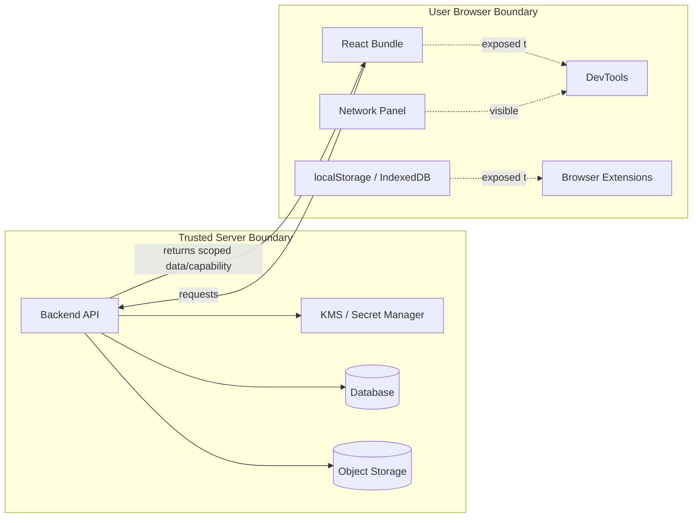
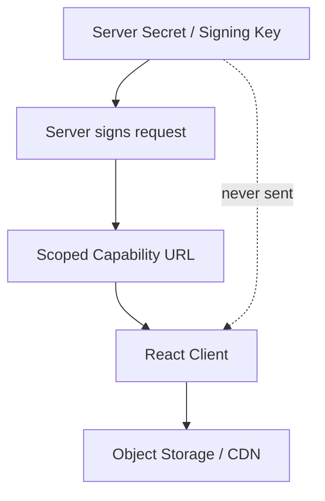
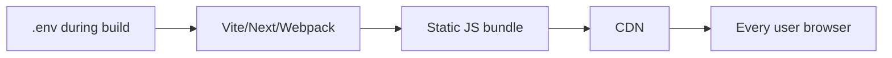
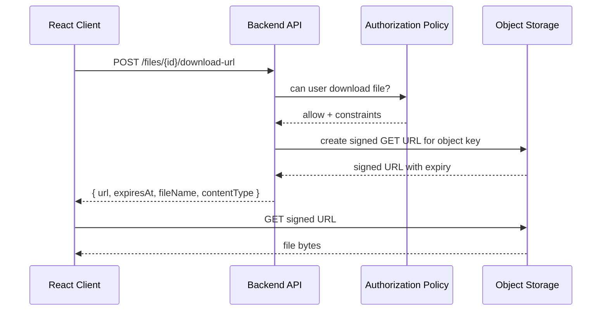
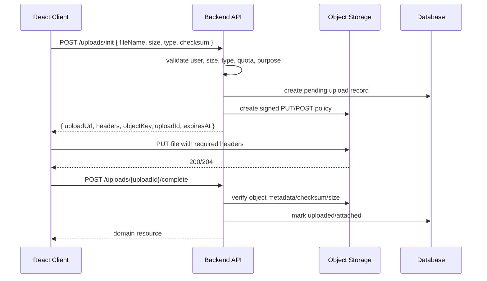
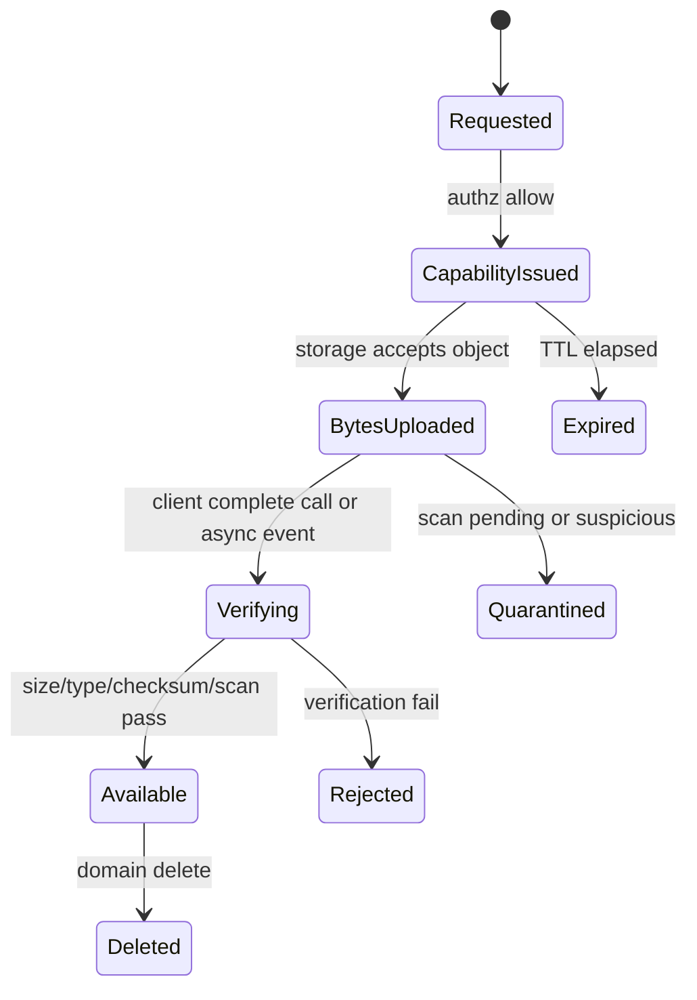
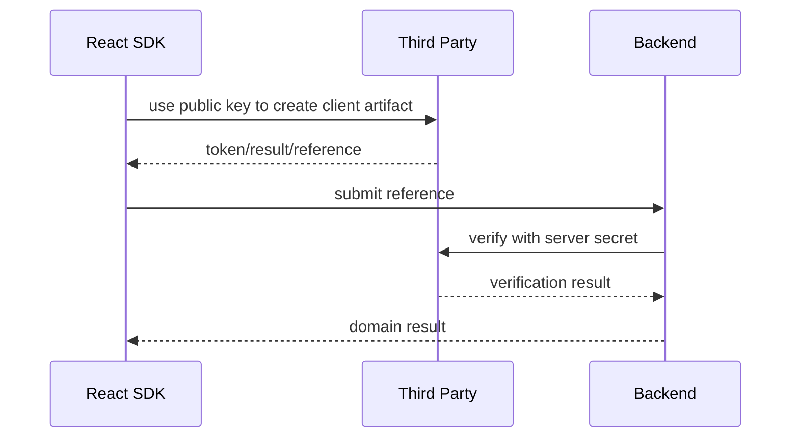
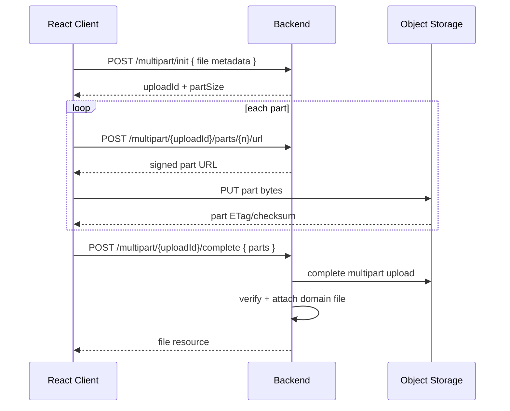
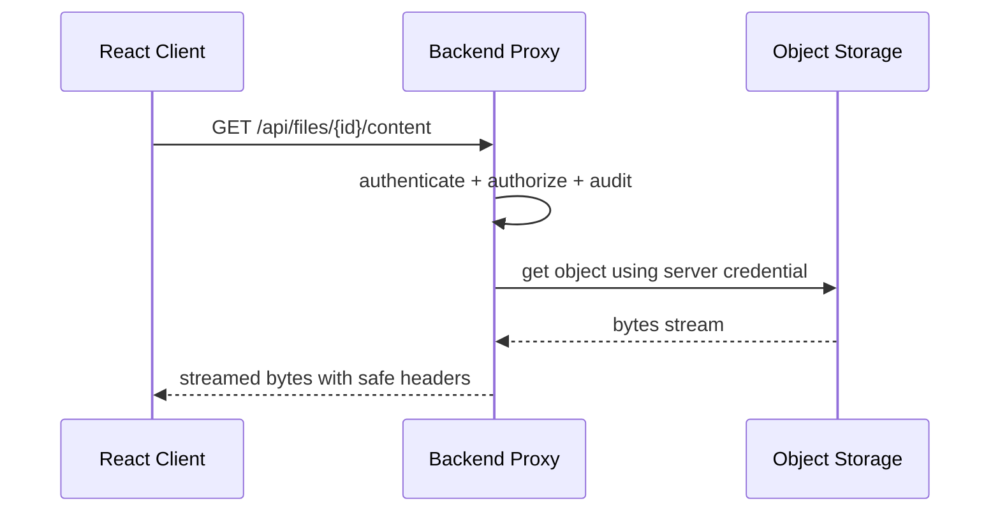

# Part 061 — Secrets, Signed URLs, and Client Exposure

> Target: setelah bagian ini, kamu bisa mendesain boundary antara React client, backend, object storage, CDN, dan third-party service tanpa membocorkan secret; kamu juga bisa membedakan public identifier, credential, capability URL, signed URL, token, dan konfigurasi build-time yang aman untuk dikirim ke browser.

Bagian sebelumnya membahas CSRF dan safe mutations. Sekarang kita masuk ke area yang lebih sering terlihat sederhana tetapi sering merusak security posture aplikasi: **apa yang boleh sampai ke client**.

Banyak bug production lahir dari kalimat seperti ini:

> “Taruh saja API key di env React, nanti kan sudah di-build.”

Itu salah framing. Build step tidak membuat secret menjadi rahasia. Bundle frontend adalah artefak publik. Siapa pun yang bisa membuka aplikasi bisa mengunduh JavaScript, melihat network request, membaca source map jika tersedia, mengecek local storage, dan menyalin URL/token yang dikirim ke browser.

Core invariant:

> **Everything delivered to the browser is exposed to the user, browser extensions, DevTools, compromised dependencies, logs, screenshots, and sometimes third-party scripts.**

Karena itu, komunikasi React client-server harus dirancang dengan prinsip:

1. secret tetap di server,
2. client hanya menerima capability yang sempit,
3. capability punya scope, expiry, dan audit trail,
4. server tetap menjadi policy decision point,
5. URL, header, cache, log, telemetry, dan storage diperlakukan sebagai exposure surface.

---

## 1. Mental Model: Browser Is Not a Trusted Vault

React app berjalan di browser user. Browser adalah runtime yang kuat, tetapi bukan vault.



Server boundary bisa menyimpan secrets karena server dikontrol oleh organisasi: environment, IAM role, KMS, secret manager, network policy, runtime identity, audit logging.

Browser boundary tidak punya properti itu. Di browser:

- JavaScript bisa dibaca,
- runtime bisa di-debug,
- request bisa diinspeksi,
- storage bisa dibaca oleh script yang berjalan di origin,
- browser extension bisa memperluas exposure,
- source map bisa membuka source asli,
- URL bisa masuk history, referer, log proxy, screenshot, dan analytics.

Jadi pertanyaan yang benar bukan:

> “Bagaimana menyembunyikan secret di React?”

Pertanyaan yang benar:

> “Bagaimana mendesain server capability sehingga React tidak perlu menerima secret?”

---

## 2. Vocabulary: Jangan Samakan Semua “Key”

Kata “key” sering dipakai untuk banyak hal. Ini berbahaya karena beberapa key memang public, sementara yang lain secret.

| Istilah | Boleh di browser? | Contoh | Catatan |
|---|---:|---|---|
| Public identifier | Ya | project id, tenant slug, public map style id | Bukan credential |
| Publishable key | Biasanya ya | payment publishable key | Dirancang untuk client, harus dibatasi server-side |
| API key unrestricted | Tidak | third-party backend API key | Biasanya credential aplikasi |
| API secret | Tidak | signing secret, private token | Harus server-only |
| OAuth client secret | Tidak untuk SPA | confidential client secret | SPA adalah public client |
| Session cookie HttpOnly | Browser menerima, JS tidak membaca | session id | Credential ambient; perlu CSRF defense |
| Access token in memory | Bisa, dengan risiko | short-lived bearer token | Rentan jika XSS; jangan persist sembarangan |
| Signed URL | Bisa, sementara | S3 presigned upload URL | Capability scoped + expiring |
| Signed cookie | Bisa, via browser | CDN signed cookie | Harus terbatas domain/path/expiry |
| CSRF token | Bisa | hidden field/header token | Bukan auth secret; anti-CSRF proof |
| Feature flag config | Ya jika tidak sensitif | UI flag | Jangan bocorkan business-sensitive rollout |

Rule of thumb:

> **Jika value memberi akses ke resource tanpa check server tambahan, treat it as a credential atau capability.**

---

## 3. Secret vs Capability

Secret adalah nilai yang harus tetap tidak diketahui pihak tidak berwenang.

Capability adalah izin konkret yang bisa digunakan untuk tindakan tertentu. Signed URL adalah capability: siapa pun yang punya URL bisa melakukan tindakan yang URL itu izinkan sampai expiry atau policy-nya tidak berlaku.



Perbedaan penting:

| Properti | Secret | Capability |
|---|---|---|
| Harus diketahui client? | Tidak | Bisa, jika memang capability untuk client |
| Scope | Luas jika bocor | Harus sempit |
| Expiry | Bisa panjang, tapi sebaiknya rotatable | Harus pendek |
| Revocation | Via rotation/secret manager | Via TTL, policy, object state, blocklist, key rotation |
| Audit | Access to secret sangat sensitif | Issuance dan usage harus diaudit |
| Contoh | AWS secret key, signing key | presigned upload URL |

Invariant:

> **React client boleh memegang capability sementara, bukan root secret.**

---

## 4. React Environment Variables Are Build-Time Substitution

Dalam banyak React stack, environment variables yang diprefix sebagai public akan di-inline ke bundle.

Contoh:

```ts
const apiBaseUrl = import.meta.env.VITE_API_BASE_URL;
const publicStripeKey = import.meta.env.VITE_STRIPE_PUBLISHABLE_KEY;
```

Ini aman hanya jika nilai tersebut memang public.

Anti-pattern:

```ts
// ❌ Salah: ini akan masuk bundle jika memakai prefix public.
const s3Secret = import.meta.env.VITE_AWS_SECRET_ACCESS_KEY;
const adminApiToken = import.meta.env.VITE_INTERNAL_ADMIN_API_TOKEN;
```

Masalahnya bukan nama variabel. Masalahnya adalah runtime target.



Jika value masuk bundle, value itu sudah public.

Checklist public env:

- Apakah value boleh dilihat semua user?
- Apakah value bisa dipakai dari luar domain aplikasi?
- Apakah value memberi akses write/read ke resource sensitif?
- Apakah value bisa menimbulkan biaya jika disalahgunakan?
- Apakah value bisa dipakai untuk impersonasi aplikasi?
- Apakah value perlu rotasi jika bocor?

Jika jawaban “ya” untuk tiga terakhir, value itu bukan public config.

---

## 5. Exposure Surfaces di React App

Client exposure bukan hanya bundle.

| Surface | Risiko | Contoh |
|---|---|---|
| JS bundle | secret hardcoded | API secret masuk source |
| Source map | source asli terbuka | internal endpoint, comments, flag names |
| Network request | header/body terlihat user | bearer token, signed URL |
| URL query | tersimpan di history/log/referrer | `?token=...` |
| localStorage | terbaca JS di origin | long-lived access token |
| IndexedDB | durable cache leak | PII/query cache persisted |
| Cache API | offline response leak | sensitive API response cached |
| Console log | telemetry/log collection leak | full response body logged |
| Error reporting | exception context leak | token/PII in breadcrumb |
| RUM analytics | attribute leak | email, account id, signed URL |
| Browser extensions | storage/request visibility | extension reads page data |
| Service worker | intercept/cache misuse | caches signed response |
| Referrer header | URL token leakage | third-party image loads after token URL |

Design rule:

> **Do not send data to client unless the product needs the user to see or use that data.**

---

## 6. The Signed URL Pattern

Signed URL adalah cara memberi client akses langsung ke object storage/CDN tanpa memberi credential storage.

Flow umum download:



Flow umum upload:



Notice the invariant:

> **Upload is not complete when object storage accepts bytes; upload is complete when domain server verifies and attaches the object.**

Object storage is byte storage. Domain ownership remains in backend.

---

## 7. Signed URL Contract

A signed URL response should not be “just a URL”. Treat it as a capability contract.

Example response:

```json
{
  "uploadId": "upl_01JZK4X9HZF3W1EGT3AP4MQXGM",
  "method": "PUT",
  "url": "https://storage.example.com/...signature...",
  "headers": {
    "content-type": "application/pdf",
    "x-amz-checksum-sha256": "base64-checksum"
  },
  "expiresAt": "2026-07-08T09:15:00Z",
  "maxBytes": 10485760,
  "contentType": "application/pdf",
  "objectKey": "tenant/t_123/case/c_456/uploads/upl_.../original.pdf",
  "completeUrl": "/api/uploads/upl_01JZK4X9HZF3W1EGT3AP4MQXGM/complete",
  "auditId": "aud_01JZK4X9K3BV7V0T8K5H9QK2QN"
}
```

Important fields:

| Field | Why it matters |
|---|---|
| `method` | Signed URLs are often method-bound |
| `headers` | Some signatures bind required headers |
| `expiresAt` | Client can avoid starting impossible upload |
| `maxBytes` | UI and server enforce same policy |
| `contentType` | Prevents type drift |
| `objectKey` | Usually not shown to user, useful for complete step |
| `completeUrl` | Domain confirmation endpoint |
| `auditId` | Correlates capability issuance with usage |

Do not let the client choose final object key freely.

Bad:

```json
{
  "objectKey": "../../other-tenant/private.pdf"
}
```

Better:

```ts
function allocateObjectKey(input: {
  tenantId: TenantId;
  actorId: UserId;
  uploadId: UploadId;
  originalName: string;
}) {
  const ext = safeExtension(input.originalName);
  return `tenant/${input.tenantId}/uploads/${input.uploadId}/original.${ext}`;
}
```

The server owns namespace construction.

---

## 8. Implementation: Direct Upload Client

A minimal but production-shaped upload flow:

```ts
type InitUploadRequest = {
  fileName: string;
  sizeBytes: number;
  contentType: string;
  checksumSha256?: string;
  purpose: 'case-attachment' | 'profile-avatar' | 'evidence-file';
  parentId?: string;
};

type InitUploadResponse = {
  uploadId: string;
  method: 'PUT' | 'POST';
  url: string;
  headers: Record<string, string>;
  expiresAt: string;
  maxBytes: number;
  contentType: string;
  completeUrl: string;
};

type CompleteUploadResponse = {
  fileId: string;
  fileName: string;
  sizeBytes: number;
  contentType: string;
  status: 'available' | 'processing';
};

async function initUpload(file: File, purpose: InitUploadRequest['purpose']) {
  const payload: InitUploadRequest = {
    fileName: file.name,
    sizeBytes: file.size,
    contentType: file.type || 'application/octet-stream',
    purpose,
  };

  return api.post<InitUploadResponse>('/api/uploads/init', payload);
}

async function uploadToSignedUrl(file: File, signed: InitUploadResponse, signal?: AbortSignal) {
  if (new Date(signed.expiresAt).getTime() <= Date.now()) {
    throw new Error('Upload URL expired before upload started');
  }

  if (file.size > signed.maxBytes) {
    throw new Error('File exceeds upload capability limit');
  }

  const response = await fetch(signed.url, {
    method: signed.method,
    headers: signed.headers,
    body: file,
    signal,
  });

  if (!response.ok) {
    throw new Error(`Storage upload failed: ${response.status}`);
  }
}

async function completeUpload(signed: InitUploadResponse, signal?: AbortSignal) {
  return api.post<CompleteUploadResponse>(signed.completeUrl, {}, { signal });
}

export async function uploadFile(file: File, purpose: InitUploadRequest['purpose'], signal?: AbortSignal) {
  const signed = await initUpload(file, purpose);
  await uploadToSignedUrl(file, signed, signal);
  return completeUpload(signed, signal);
}
```

Important nuance: browser `fetch` does not give standardized upload progress events the same way `XMLHttpRequest` does. If product requires upload progress, use XHR or platform/framework APIs that expose progress.

```ts
function uploadWithProgress(
  file: File,
  signed: InitUploadResponse,
  onProgress: (progress: { loaded: number; total: number; ratio: number }) => void,
  signal?: AbortSignal,
): Promise<void> {
  return new Promise((resolve, reject) => {
    const xhr = new XMLHttpRequest();
    xhr.open(signed.method, signed.url);

    for (const [name, value] of Object.entries(signed.headers)) {
      xhr.setRequestHeader(name, value);
    }

    xhr.upload.onprogress = (event) => {
      if (!event.lengthComputable) return;
      onProgress({
        loaded: event.loaded,
        total: event.total,
        ratio: event.loaded / event.total,
      });
    };

    xhr.onload = () => {
      if (xhr.status >= 200 && xhr.status < 300) resolve();
      else reject(new Error(`Upload failed: ${xhr.status}`));
    };

    xhr.onerror = () => reject(new Error('Upload network error'));
    xhr.onabort = () => reject(new DOMException('Upload aborted', 'AbortError'));

    if (signal) {
      if (signal.aborted) {
        xhr.abort();
        return;
      }
      signal.addEventListener('abort', () => xhr.abort(), { once: true });
    }

    xhr.send(file);
  });
}
```

---

## 9. Server Responsibilities for Signed Uploads

Frontend cannot secure upload policy alone.

Server must enforce:

- actor authentication,
- actor authorization,
- tenant boundary,
- parent resource access,
- allowed file type,
- maximum file size,
- quota,
- object key namespace,
- expiry,
- checksum if required,
- malware scanning lifecycle,
- domain completion step,
- audit logging.

A good upload state machine:



React UI should represent this honestly:

| Upload state | UI behavior |
|---|---|
| `requested` | disable duplicate submit |
| `capabilityIssued` | show upload progress |
| `bytesUploaded` | show “processing/verifying” |
| `available` | show file |
| `quarantined` | show limited access / admin review |
| `rejected` | show reason and retry path |
| `expired` | re-init upload capability |

Do not show “uploaded successfully” just because object storage returned `204`.

---

## 10. Download URLs: Safer Than Public URLs, Still Sensitive

Download signed URLs are often copied into logs, chat, screenshots, browser history, referrer headers, and analytics. Treat them as sensitive short-lived capabilities.

Bad design:

```tsx
<a href={signedUrl}>Download</a>
```

This is not always wrong, but it has risks:

- URL may appear in DOM snapshots,
- URL may be copied by support tooling,
- user may share it,
- third-party navigation after clicking may leak referrer depending policy,
- stale signed URL may break after expiry,
- link prefetchers/security scanners may consume it unexpectedly.

Better design:

```tsx
async function downloadFile(fileId: string) {
  const capability = await api.post<{
    url: string;
    expiresAt: string;
    suggestedFileName: string;
  }>(`/api/files/${fileId}/download-url`, {});

  const a = document.createElement('a');
  a.href = capability.url;
  a.download = capability.suggestedFileName;
  a.rel = 'noreferrer';
  document.body.appendChild(a);
  a.click();
  a.remove();
}
```

For highly sensitive files, consider proxy download through backend instead of direct signed URL.

Decision matrix:

| Requirement | Direct signed URL | Backend proxy |
|---|---:|---:|
| Large files | Strong | Expensive |
| Simple object storage offload | Strong | Weak |
| Fine-grained per-byte audit | Weak | Strong |
| Dynamic redaction/watermark | Weak | Strong |
| Short-lived access | Strong | Strong |
| Need malware gate before access | Strong if state checked before issuance | Strong |
| Strict no URL sharing risk | Medium | Stronger |
| CDN acceleration | Strong | Depends |

---

## 11. Signed URL Expiry Is Not Authorization

Expiry limits time. Authorization decides whether the actor may receive a capability at all.

Bad:

```ts
// ❌ Anyone who knows fileId receives a signed URL.
app.post('/files/:fileId/download-url', async (req, res) => {
  const url = await storage.signGet(req.params.fileId, { expiresIn: 3600 });
  res.json({ url });
});
```

Better:

```ts
app.post('/files/:fileId/download-url', async (req, res) => {
  const actor = requireActor(req);
  const file = await files.getById(req.params.fileId);

  if (!file) throw notFound();

  await authorize(actor, 'file.download', {
    tenantId: file.tenantId,
    caseId: file.caseId,
    classification: file.classification,
  });

  const auditId = await audit.record({
    actorId: actor.id,
    action: 'file.download.capability_issued',
    resourceId: file.id,
    tenantId: file.tenantId,
  });

  const url = await storage.signGet(file.objectKey, {
    expiresInSeconds: 300,
    responseContentDisposition: `attachment; filename="${safeFileName(file.name)}"`,
  });

  res.json({
    url,
    expiresAt: new Date(Date.now() + 300_000).toISOString(),
    auditId,
  });
});
```

Authorization must happen at capability issuance time. For very sensitive resources, also enforce object-layer controls, short TTL, and backend proxy.

---

## 12. Binding Capability to Intent

A robust signed capability is bound to:

| Dimension | Example |
|---|---|
| Actor | user/session that requested capability |
| Tenant | tenant/account boundary |
| Resource | file/object/case id |
| Operation | read/upload/delete? |
| Method | `GET`, `PUT`, `POST` |
| Content type | `application/pdf` |
| Content length | `<= 10MB` |
| Checksum | expected digest |
| Expiry | 5 minutes |
| State | upload record must be pending |
| Audit | capability issuance event |

Some storage providers cannot bind every dimension directly into the URL. Then enforce missing dimensions in backend before issuing and after completion.

For upload, complete step is where backend verifies:

```ts
type VerifyUploadResult =
  | { ok: true; fileId: string }
  | { ok: false; reason: 'missing-object' | 'too-large' | 'content-type-mismatch' | 'checksum-mismatch' | 'scan-failed' };

async function verifyUpload(uploadId: UploadId): Promise<VerifyUploadResult> {
  const upload = await uploads.get(uploadId);
  if (!upload || upload.status !== 'capability-issued') {
    return { ok: false, reason: 'missing-object' };
  }

  const metadata = await storage.headObject(upload.objectKey);
  if (!metadata) return { ok: false, reason: 'missing-object' };
  if (metadata.sizeBytes > upload.maxBytes) return { ok: false, reason: 'too-large' };
  if (metadata.contentType !== upload.expectedContentType) return { ok: false, reason: 'content-type-mismatch' };
  if (upload.expectedChecksum && metadata.checksum !== upload.expectedChecksum) {
    return { ok: false, reason: 'checksum-mismatch' };
  }

  return { ok: true, fileId: await attachFile(upload) };
}
```

---

## 13. Revocation Reality

Signed URLs are hard to revoke once issued unless the storage/CDN layer supports revocation or the signing key/policy changes.

Practical revocation tools:

- very short TTL,
- server-side authorization check before issuance,
- object key not guessable,
- object state gating before issuance,
- storage policy condition,
- CDN signed cookies with short TTL,
- object deletion/quarantine,
- key rotation for broad incident,
- backend proxy for resources requiring real-time revocation.

Do not promise instant revocation if architecture cannot provide it.

Product copy should reflect reality:

- “This link expires soon.”
- “Access may continue briefly after permission changes.”
- “For highly sensitive files, use controlled viewer/proxy.”

Engineering truth beats comforting fiction.

---

## 14. URLs Leak More Than Headers

Putting sensitive data in URLs is usually worse than headers/body because URLs are stored and propagated more widely.

URL exposure paths:

- browser history,
- server access logs,
- CDN logs,
- reverse proxy logs,
- analytics page URL capture,
- referrer header,
- screenshots,
- support session replay,
- bookmarks,
- chat copy/paste.

Bad:

```txt
https://app.example.com/reset-password?token=eyJhbGciOi...
```

Sometimes unavoidable for email links, but treat it carefully:

- one-time token,
- short TTL,
- token hash stored server-side,
- no sensitive data embedded,
- `Referrer-Policy: no-referrer` or strict policy,
- immediately exchange token for server-side state,
- remove token from URL after validation.

Example:

```tsx
function ConsumeResetTokenPage() {
  const [params] = useSearchParams();
  const token = params.get('token');
  const navigate = useNavigate();

  useEffect(() => {
    if (!token) return;

    let cancelled = false;

    api.post('/api/password-reset/consume', { token })
      .then(() => {
        if (!cancelled) {
          navigate('/reset-password/new', { replace: true });
        }
      });

    return () => {
      cancelled = true;
    };
  }, [token, navigate]);

  return <p>Preparing reset flow...</p>;
}
```

---

## 15. Storage Choices for Client Credentials

There is no perfect browser storage for sensitive credentials.

| Storage | Strength | Weakness |
|---|---|---|
| In-memory JS variable | Gone on reload; not persisted | XSS can still use it during session |
| HttpOnly cookie | JS cannot read cookie | Browser sends automatically; CSRF risk |
| localStorage | Easy persistence | XSS reads it; long-lived leak |
| sessionStorage | Tab-scoped persistence | XSS reads it |
| IndexedDB | structured durable storage | XSS can read via origin JS |
| Cache API | good for offline | can cache sensitive responses accidentally |

For sensitive auth:

- prefer server-managed sessions with `HttpOnly`, `Secure`, `SameSite` cookies for many web apps,
- use CSRF protection when cookies are ambient,
- keep bearer tokens short-lived,
- avoid long-lived refresh tokens in JavaScript-accessible storage,
- do not persist tokens unless product constraints force it,
- use BFF pattern when SPA needs third-party confidential OAuth flows.

Do not frame this as “cookies vs localStorage” in isolation. Frame it as:

> XSS risk, CSRF risk, persistence requirement, refresh model, revocation model, and operational constraints.

---

## 16. Third-Party SDK Keys

Many frontend SDKs require “keys”. Some are intentionally public.

Examples:

- payment publishable key,
- map tile public token,
- analytics write key,
- captcha site key,
- feature flag client key.

Public does not mean harmless.

Risk dimensions:

| Dimension | Question |
|---|---|
| Cost abuse | Can attacker burn quota? |
| Data exposure | Can key read private data? |
| Write capability | Can attacker send fake events? |
| Domain restriction | Is usage limited to allowed origins? |
| Environment isolation | Are dev/staging/prod keys separated? |
| Rotation | Can key be rotated without redeploy pain? |
| Server validation | Does backend verify final result? |

Example: captcha site key is public; server must verify captcha response with secret server-side. Payment publishable key is public; server must create payment intent and verify webhook/event server-side.

General pattern:



Client public key starts the flow. Server secret finalizes trust.

---

## 17. Source Maps and Debug Builds

Source maps are not automatically bad. They are operationally useful. But they change exposure.

Risks:

- source code readability,
- internal comments,
- endpoint discovery,
- feature flag names,
- stack traces with sensitive paths,
- accidental secret in source becomes easier to find.

Safer approaches:

- upload source maps privately to error monitoring provider,
- do not serve production source maps publicly unless policy allows,
- strip comments if needed,
- scan bundles for secret patterns,
- scan source and built artifacts in CI,
- ensure maps do not contain `.env` values or generated credentials,
- separate debug builds from public production builds.

CI guard example:

```bash
# Example only. Use real secret scanner in production.
grep -R "AWS_SECRET_ACCESS_KEY\|PRIVATE_KEY\|BEGIN RSA" dist/ && exit 1
```

A real organization should use dedicated secret scanning in repository, CI, build artifacts, and container images.

---

## 18. React Query and Capability Data

Do not casually cache signed URLs like normal resource data.

Bad:

```ts
useQuery({
  queryKey: ['file', fileId, 'download-url'],
  queryFn: () => api.post(`/files/${fileId}/download-url`, {}),
  staleTime: 10 * 60 * 1000,
});
```

Problem: signed URL may expire sooner, be copied to DevTools, be persisted if query cache persistence is enabled, and be reused after permission changes.

Better:

```ts
function useDownloadFile() {
  return useMutation({
    mutationFn: async (fileId: string) => {
      const capability = await api.post<{
        url: string;
        expiresAt: string;
        suggestedFileName: string;
      }>(`/api/files/${fileId}/download-url`, {});

      startBrowserDownload(capability.url, capability.suggestedFileName);
    },
  });
}
```

Treat capability generation as mutation-like even if it does not mutate domain data. It creates a sensitive one-time-ish artifact.

If you must cache capability:

- `staleTime` must not exceed expiry,
- disable persistence,
- clear on logout/permission change,
- do not expose in logs/devtools snapshots,
- prefer memory-only short lifetime.

---

## 19. Redacting Capabilities from Logs and Telemetry

Never log full signed URLs.

Bad:

```ts
logger.info('download_url_generated', { url });
```

Better:

```ts
function redactUrl(value: string) {
  try {
    const url = new URL(value);
    return `${url.origin}${url.pathname}?<redacted>`;
  } catch {
    return '<invalid-url-redacted>';
  }
}

logger.info('download_url_generated', {
  resourceId: file.id,
  actorId: actor.id,
  expiresAt,
  url: redactUrl(url),
});
```

Frontend telemetry should do the same:

```ts
function sanitizeNetworkEvent(event: {
  url: string;
  method: string;
  status?: number;
  headers?: Record<string, string>;
}) {
  const sensitiveHeaders = new Set(['authorization', 'cookie', 'set-cookie', 'x-csrf-token']);

  return {
    ...event,
    url: redactSignedQuery(event.url),
    headers: Object.fromEntries(
      Object.entries(event.headers ?? {}).map(([k, v]) => [
        k,
        sensitiveHeaders.has(k.toLowerCase()) ? '<redacted>' : v,
      ]),
    ),
  };
}
```

Observability without redaction becomes exfiltration.

---

## 20. Service Workers and Sensitive Responses

Service Worker can intercept and cache requests. That is powerful and dangerous.

Do not cache:

- signed URL responses,
- PII-heavy API responses,
- authenticated `GET` responses unless explicitly safe,
- file downloads with confidential content,
- token exchange responses,
- CSRF token endpoints if token rotation matters.

Example service worker guard:

```ts
self.addEventListener('fetch', (event) => {
  const request = event.request;
  const url = new URL(request.url);

  if (url.pathname.includes('/download-url')) return;
  if (url.pathname.includes('/auth/')) return;
  if (request.headers.get('authorization')) return;

  // Only cache explicitly public static assets.
  if (url.origin === self.location.origin && url.pathname.startsWith('/assets/')) {
    event.respondWith(cacheFirst(request));
  }
});
```

Cache policy should be explicit, not accidental.

---

## 21. Capability UI Failure Modes

| Failure | Cause | Better behavior |
|---|---|---|
| Signed URL expired before click | User waited too long | Request fresh URL on click |
| Upload expires mid-flight | TTL too short for file/network | Use longer TTL or multipart upload |
| 403 from storage | Signature/header mismatch | Surface retry, log capability id |
| Object uploaded but complete fails | API timeout/network | Allow resume complete by upload id |
| Duplicate upload | Double submit/retry | Idempotent upload init key |
| Wrong content type | Client/browser type unreliable | Server verify and reject safely |
| Permission revoked after URL issued | TTL window | Short TTL/proxy for sensitive data |
| Signed URL leaked in telemetry | poor sanitizer | Redact URL query/string |
| Query cache persists URL | treating capability as normal data | mutation-like memory-only flow |
| Browser prefetch consumes link | link in DOM with capability | generate only on user click |

---

## 22. Multipart and Large Uploads

Large uploads require additional design.

Problems:

- one signed PUT may expire,
- retrying entire large file is expensive,
- progress must survive network interruption,
- partial object state must be cleaned up,
- concurrency can overwhelm network,
- object assembly must be verified.

High-level multipart flow:



Client concerns:

- part queue concurrency,
- retry per part,
- abort upload,
- resume metadata,
- progress aggregation,
- checksum calculation cost,
- cleanup abandoned uploads.

Do not start with multipart unless file size/UX needs it. But once files are large, single PUT is often too fragile.

---

## 23. Backend Proxy Pattern

Sometimes direct signed URL is the wrong abstraction.

Use backend proxy when:

- resource needs dynamic watermarking,
- every view/download must be audited precisely,
- permission revocation must be near-instant,
- content must be redacted per actor,
- malware scanning/DRM/inspection is required,
- legal hold or regulatory workflow requires server mediation,
- object storage URL leakage is unacceptable,
- content should never be exposed as reusable capability.

Proxy flow:



Cost:

- server bandwidth,
- server scaling,
- latency,
- streaming complexity,
- range request support,
- CDN integration complexity.

Benefit:

- stronger control,
- easier audit,
- dynamic policy,
- safer revocation,
- redaction/watermarking.

---

## 24. Headers for File Responses

File download security is not just URL signing.

Useful response headers:

```http
Content-Type: application/pdf
Content-Disposition: attachment; filename="case-evidence.pdf"
Cache-Control: private, no-store
X-Content-Type-Options: nosniff
Referrer-Policy: no-referrer
```

Considerations:

- `Content-Disposition: attachment` reduces inline execution risk for some content,
- `nosniff` prevents MIME sniffing surprises,
- `no-store` avoids browser/proxy storage for sensitive files,
- strict referrer policy reduces URL leakage,
- safe filename prevents header injection and path weirdness,
- previews need tighter CSP/sandboxing when rendering untrusted files.

For user-uploaded HTML/SVG, never render directly in same origin without sandboxing. Treat uploaded active content as hostile.

---

## 25. “Secret” in Frontend Source Is Already Incident Material

If a secret was committed or shipped to frontend bundle:

1. revoke/rotate it,
2. remove it from code,
3. invalidate build artifacts/CDN cache,
4. check logs and telemetry for propagation,
5. review access/usage during exposure window,
6. add scanning guardrail,
7. document incident and blast radius.

Do not merely delete it in the next commit. Git history, package registries, build cache, CDN edge cache, browser cache, and user machines may still have it.

---

## 26. Decision Framework

Use this when reviewing any client-server flow involving keys, files, tokens, or third-party services.

| Question | If yes | Design implication |
|---|---|---|
| Does client need direct byte transfer? | yes | signed URL or multipart may fit |
| Does server need inspect/redact every byte? | yes | backend proxy |
| Can capability be safely valid for minutes? | yes | signed URL possible |
| Must revocation be instant? | yes | avoid reusable signed URL |
| Is object public? | yes | public CDN URL may be fine |
| Is object tenant/user sensitive? | yes | authz before capability issuance |
| Can client choose resource key? | no | server allocates key |
| Is upload large? | yes | multipart/resumable design |
| Is URL going into DOM/history/log? | yes | avoid or redact |
| Is token needed after reload? | maybe | prefer HttpOnly cookie/session or BFF |
| Is value build-time config? | yes | ensure it is public by design |

---

## 27. Production Review Checklist

Before shipping:

- [ ] No server secrets in React env variables.
- [ ] Build artifacts scanned for secret patterns.
- [ ] Public env values classified and documented.
- [ ] Signed URL issuance requires authn/authz.
- [ ] Signed URLs have short TTL.
- [ ] Upload object key is server-generated.
- [ ] Upload completion verifies object metadata.
- [ ] Sensitive URLs are not cached in persisted query cache.
- [ ] Telemetry redacts query strings, tokens, and signed headers.
- [ ] Service Worker does not cache signed URLs or sensitive responses.
- [ ] Download URLs are generated on click, not pre-rendered broadly.
- [ ] Large upload has retry/resume/abort strategy.
- [ ] Source maps are private or intentionally public.
- [ ] Incident playbook exists for leaked key/capability.
- [ ] Backend proxy considered for highly sensitive content.

---

## 28. Key Takeaways

1. Browser is not a secret vault.
2. Build-time env substitution does not protect secrets.
3. Public keys must be intentionally public and constrained.
4. Signed URLs are capabilities, not secrets, but still sensitive.
5. Expiry is not authorization.
6. Server owns namespace, policy, verification, and audit.
7. Do not cache signed URLs like ordinary data.
8. URLs leak through more channels than headers/body.
9. For sensitive resources, backend proxy may be the correct trade-off.
10. Observability must redact, or it becomes an exfiltration path.

---

## References

- MDN — Using HTTP cookies: https://developer.mozilla.org/en-US/docs/Web/HTTP/Guides/Cookies
- MDN — Web Storage API: https://developer.mozilla.org/en-US/docs/Web/API/Web_Storage_API
- MDN — Authorization header: https://developer.mozilla.org/en-US/docs/Web/HTTP/Reference/Headers/Authorization
- AWS S3 — Download and upload objects with presigned URLs: https://docs.aws.amazon.com/AmazonS3/latest/userguide/using-presigned-url.html
- OWASP — Secrets Management Cheat Sheet: https://cheatsheetseries.owasp.org/cheatsheets/Secrets_Management_Cheat_Sheet.html
- OWASP — Logging Cheat Sheet: https://cheatsheetseries.owasp.org/cheatsheets/Logging_Cheat_Sheet.html
