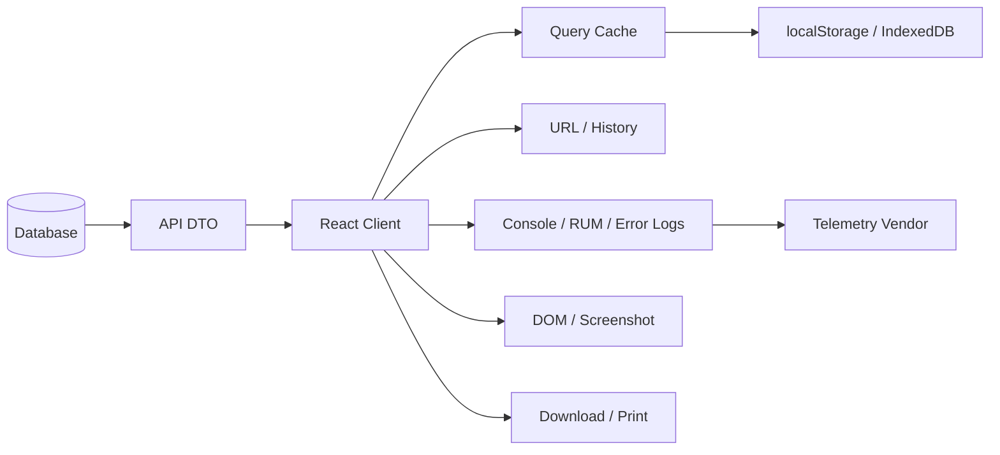
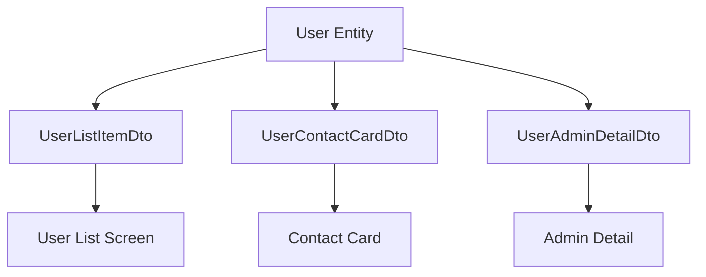
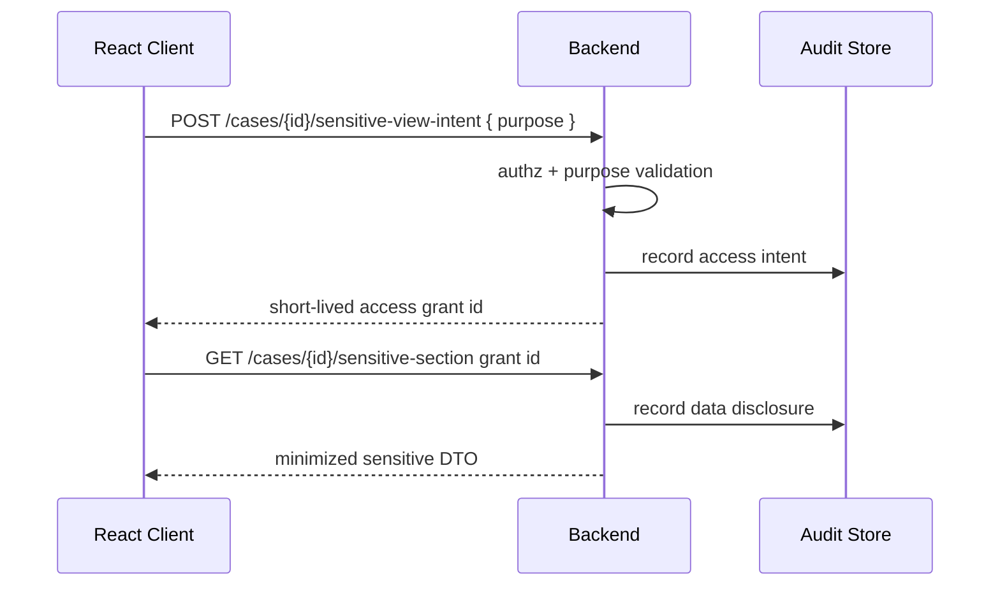

# Part 062 — PII Minimization, Redaction, and Auditability

> Target: setelah bagian ini, kamu bisa mendesain React client-server communication yang tidak mengirim PII berlebihan, tidak membocorkan data sensitif lewat cache/log/telemetry/URL, dan tetap punya audit trail yang cukup untuk investigasi, compliance, serta defensibility.

Security tidak berhenti pada “request authenticated” dan “CORS benar”. Banyak sistem lolos security review teknis tetapi gagal secara privacy dan auditability karena frontend menerima terlalu banyak data, menyimpannya terlalu lama, mencatatnya ke telemetry, atau menampilkannya di permukaan yang salah.

PII problem bukan hanya masalah field. Ini masalah **data lineage**.



Jika PII masuk ke client, PII bisa mengalir ke banyak permukaan yang bukan bagian dari domain model asli.

Core invariant:

> **The safest PII is the PII never sent to the browser.**

---

## 1. Vocabulary: PII, Sensitive PII, Secret, and Audit Data

Jangan samakan semua data sensitif.

| Category | Example | Main risk | Typical handling |
|---|---|---|---|
| Public data | public profile name | integrity/reputation | cacheable, shareable |
| Internal data | internal case status | business leakage | authz + limited cache |
| PII | name, email, phone, address | privacy exposure | minimize, redact, purpose-limit |
| Sensitive PII | national id, health, biometrics, financial details | high harm/regulatory | strong minimization + masking + audit |
| Secret | API key, token, signing key | system compromise | never expose to client |
| Audit data | who accessed what/when/why | accountability/privacy | immutable-ish, protected, queryable |
| Derived sensitive data | risk score, eligibility flag | discrimination/business harm | explainability + access control |

PII and secrets are different.

- Secret leakage compromises systems.
- PII leakage harms people and creates compliance/regulatory risk.
- Audit data protects accountability but can itself contain sensitive metadata.

---

## 2. Minimization Comes Before Redaction

Redaction is useful, but it is not a substitute for minimization.

Bad pattern:

```json
{
  "id": "case_123",
  "applicant": {
    "fullName": "Rani Wijaya",
    "email": "rani@example.com",
    "phone": "+62...",
    "nationalId": "3174...",
    "dateOfBirth": "1991-03-02",
    "address": "...",
    "income": 18000000
  },
  "uiNeedsOnly": "fullName"
}
```

Then hiding fields in React is not enough:

```tsx
// ❌ UI hides nationalId, but data is already in browser memory/network/devtools.
return <span>{case.applicant.fullName}</span>;
```

Better:

```json
{
  "id": "case_123",
  "applicant": {
    "displayName": "Rani Wijaya"
  }
}
```

The server should shape response for the screen/use case.

> **Frontend conditional rendering is not data protection.**

---

## 3. Data Minimization at API Contract Level

Design DTOs by use case, not by database entity.

Bad:

```ts
type UserEntityDto = {
  id: string;
  name: string;
  email: string;
  phone: string;
  address: string;
  nationalId: string;
  roles: string[];
  salary: number;
  lastLoginIp: string;
};
```

Better:

```ts
type UserListItemDto = {
  id: string;
  displayName: string;
  status: 'active' | 'inactive' | 'locked';
};

type UserContactCardDto = {
  id: string;
  displayName: string;
  emailMasked: string;
  phoneMasked?: string;
};

type UserAdminDetailDto = {
  id: string;
  displayName: string;
  email: string;
  phone?: string;
  roles: string[];
  audit: {
    lastLoginAt?: string;
    lastUpdatedAt: string;
  };
};
```

Same resource, different representations.



React should not receive entity DTOs by default.

---

## 4. Field Classification

Add classification to schema thinking.

Example internal classification:

```ts
type DataClassification =
  | 'public'
  | 'internal'
  | 'pii'
  | 'sensitive-pii'
  | 'secret'
  | 'audit';

type FieldPolicy = {
  classification: DataClassification;
  allowedInClient: boolean;
  allowedInUrl: boolean;
  allowedInLogs: boolean;
  allowedInTelemetry: boolean;
  allowedInPersistentCache: boolean;
  maskByDefault: boolean;
};
```

Policy table example:

| Field | Classification | Client? | URL? | Logs? | Persistent cache? |
|---|---|---:|---:|---:|---:|
| `caseId` | internal | yes | yes, if non-sensitive | yes | yes |
| `displayName` | PII | yes, if needed | no | masked/hash | maybe no |
| `email` | PII | only if needed | no | no | no |
| `nationalId` | sensitive PII | rarely | no | no | no |
| `accessToken` | secret | no logs | no | no | no |
| `auditId` | audit | yes | yes | yes | yes |

This policy should influence API design, telemetry, cache persistence, and UI.

---

## 5. Redaction, Masking, Tokenization, Pseudonymization

These terms are often mixed.

| Technique | Meaning | Example | Reversible? |
|---|---|---|---:|
| Redaction | remove value | `<redacted>` | no from output |
| Masking | partially show | `ra***@example.com` | original known elsewhere |
| Hashing | deterministic digest | `sha256(email)` | not directly, but can be brute-forced for low entropy |
| Tokenization | replace with token mapped elsewhere | `tok_abc123` | yes via token vault |
| Pseudonymization | replace direct identifier with pseudonym | user surrogate id | yes with mapping |
| Anonymization | cannot identify person reasonably | aggregate counts | intended no |

For frontend:

- use redaction for logs,
- use masking for UI when user needs recognition but not full value,
- use tokenization for workflows where client needs reference not raw value,
- do not pretend hashed email is anonymous,
- avoid URL/query param PII even if masked.

---

## 6. Response Shaping Pattern

A good API does not expose raw data then ask React to hide it. It exposes view-appropriate shape.

```ts
type Actor = {
  id: string;
  tenantId: string;
  roles: string[];
  permissions: string[];
};

type CaseEntity = {
  id: string;
  tenantId: string;
  status: string;
  applicantName: string;
  applicantEmail: string;
  applicantNationalId: string;
  riskScore: number;
};

type CaseSummaryDto = {
  id: string;
  status: string;
  applicantDisplayName: string;
  riskBand?: 'low' | 'medium' | 'high';
};

function toCaseSummaryDto(actor: Actor, entity: CaseEntity): CaseSummaryDto {
  return {
    id: entity.id,
    status: entity.status,
    applicantDisplayName: entity.applicantName,
    riskBand: canViewRisk(actor, entity) ? toRiskBand(entity.riskScore) : undefined,
  };
}
```

Important:

- full risk score is not sent if UI only needs band,
- national ID is not sent at all,
- email is not sent to summary view,
- permission affects shape before response leaves server.

---

## 7. React Query Cache and PII

Query cache is memory, but memory still matters. Persisted query cache matters more.

Risk categories:

| Cache type | Risk |
|---|---|
| in-memory query cache | visible in DevTools, reachable by scripts in origin |
| persisted query cache | survives logout/reload if not cleared |
| shared device browser | next user could see stale data |
| service worker cache | can outlive app session |
| browser HTTP cache | can store authenticated responses if headers wrong |

Policy examples:

```ts
const piiUnsafePersistenceKeys = [
  ['case', 'detail'],
  ['user', 'profile'],
  ['customer', 'contact'],
];

function shouldPersistQuery(queryKey: readonly unknown[]) {
  const [resource, view] = queryKey;

  if (resource === 'case' && view === 'detail') return false;
  if (resource === 'user' && view === 'profile') return false;
  if (resource === 'lookup' || resource === 'publicConfig') return true;

  return false;
}
```

If using persisted query cache:

- persist only allowlisted keys,
- clear on logout,
- scope by user/session/tenant,
- use short max age,
- never persist signed URLs or tokens,
- avoid persisting PII-heavy detail screens.

---

## 8. URL Is a Bad Place for PII

URLs are protocols, identifiers, and shareable state. They are also leaky.

Avoid:

```txt
/users?email=rani@example.com
/cases?applicantNationalId=3174...
/search?q=phone:%2B628...
```

Prefer:

```txt
/users?query=usrch_01JZ...
/cases?filterId=flt_01JZ...
/search?savedSearchId=ss_01JZ...
```

Or use POST for sensitive search criteria:

```ts
const result = await api.post<SearchResult>('/api/cases/search', {
  applicantNationalId,
  dateRange,
});
```

Then store a server-side search token if the result needs shareable navigation.

Trade-off:

| Approach | Shareable | PII exposure | Complexity |
|---|---:|---:|---:|
| raw query params | strong | high | low |
| opaque server filter id | strong | low | medium |
| POST body only | weak | lower | low-medium |
| saved search resource | strong | lower | higher |

---

## 9. Logs: Data to Exclude by Default

Frontend logs and telemetry should default-deny sensitive fields.

Never log by default:

- passwords,
- access/refresh tokens,
- session identifiers,
- cookies,
- CSRF tokens,
- full Authorization headers,
- signed URLs,
- national IDs,
- full payment details,
- sensitive health/biometric data,
- full request/response bodies from sensitive endpoints,
- raw file contents,
- private keys or API secrets.

Bad:

```ts
console.error('API failed', { request, responseBody });
```

Better:

```ts
type SafeApiErrorLog = {
  traceId: string;
  operation: string;
  method: string;
  status?: number;
  errorCode?: string;
  problemType?: string;
  retryable?: boolean;
  requestId?: string;
};

logger.error('api_failed', {
  traceId: error.traceId,
  operation: error.operation,
  method: error.method,
  status: error.status,
  errorCode: error.code,
  problemType: error.problemType,
  retryable: error.retryable,
  requestId: error.requestId,
} satisfies SafeApiErrorLog);
```

Log metadata, not payload.

---

## 10. Redaction Utility

Use structured redaction, not ad-hoc string replacement.

```ts
type Json = null | boolean | number | string | Json[] | { [key: string]: Json };

const sensitiveKeyPattern = /password|token|secret|authorization|cookie|nationalId|ssn|email|phone|signedUrl/i;

function redactJson(value: Json, depth = 0): Json {
  if (depth > 8) return '<max-depth-redacted>';

  if (value === null) return null;
  if (typeof value !== 'object') return value;

  if (Array.isArray(value)) {
    return value.slice(0, 20).map((item) => redactJson(item, depth + 1));
  }

  const out: Record<string, Json> = {};

  for (const [key, child] of Object.entries(value)) {
    if (sensitiveKeyPattern.test(key)) {
      out[key] = '<redacted>';
    } else {
      out[key] = redactJson(child, depth + 1);
    }
  }

  return out;
}
```

Limitations:

- key-name redaction misses values under innocent keys,
- pattern matching can over-redact,
- nested payloads can be huge,
- arrays can leak many records,
- custom serializers may bypass redaction.

Best solution is still: do not pass sensitive payloads to logger.

---

## 11. Safe Error Envelope for UI

Server should not return stack traces or raw internal messages to React.

Good Problem Details-like shape:

```json
{
  "type": "https://api.example.com/problems/permission-denied",
  "title": "Permission denied",
  "status": 403,
  "detail": "You do not have access to this case.",
  "code": "CASE_ACCESS_DENIED",
  "traceId": "trc_01JZK6...",
  "safeToDisplay": true
}
```

Bad:

```json
{
  "error": "SQL error: duplicate key value violates unique constraint users_email_key for rani@example.com"
}
```

UI mapping:

```ts
type ApiProblem = {
  type: string;
  title: string;
  status: number;
  detail?: string;
  code?: string;
  traceId?: string;
  safeToDisplay?: boolean;
};

function messageForUser(problem: ApiProblem) {
  if (problem.safeToDisplay && problem.detail) return problem.detail;

  switch (problem.status) {
    case 403:
      return 'You do not have permission to perform this action.';
    case 404:
      return 'The requested resource was not found or is no longer available.';
    default:
      return 'Something went wrong. Please try again.';
  }
}
```

Server owns safety of displayable error text.

---

## 12. Auditability: Different From Logging

Application logs answer:

> “What happened technically?”

Audit logs answer:

> “Who did what to which protected resource, when, under what authority, and why?”

Do not use generic app logs as audit logs.

Audit event example:

```json
{
  "auditId": "aud_01JZK7FCTCYB0F7JXNG46EQ9HD",
  "timestamp": "2026-07-08T09:30:00Z",
  "actor": {
    "id": "usr_123",
    "type": "human-user",
    "tenantId": "tnt_456"
  },
  "action": "case.view_sensitive_section",
  "resource": {
    "type": "case",
    "id": "case_789",
    "tenantId": "tnt_456",
    "classification": "sensitive-pii"
  },
  "decision": {
    "result": "allow",
    "policyVersion": "pol_2026_07_01",
    "reason": "assigned-investigator"
  },
  "request": {
    "traceId": "trc_abc",
    "ipHash": "iphash_...",
    "userAgentHash": "uahash_..."
  }
}
```

Audit logs should avoid unnecessary raw PII too. Use stable identifiers and protected lookups.

---

## 13. Client Role in Auditability

React client should not be the source of truth for audit, but it can provide useful context.

Client can supply:

- correlation ID,
- route/screen id,
- user intent id,
- idempotency key,
- reason code selected by user,
- UI workflow step,
- feature version/build version,
- client timestamp as non-authoritative context.

Client must not be trusted for:

- actor identity,
- permission decision,
- final timestamp,
- tenant boundary,
- resource classification,
- audit result.

Example request headers:

```http
X-Trace-Id: trc_01JZ...
X-Intent-Id: intent_01JZ...
X-Client-Build: web-2026.07.08.4
Idempotency-Key: idem_01JZ...
```

Example body field for auditable reason:

```json
{
  "decision": "escalate",
  "reasonCode": "requires-supervisor-review",
  "note": "The submitted document conflicts with the prior declaration."
}
```

User-provided notes can contain PII. Treat them as sensitive content.

---

## 14. Purpose-Based Access UI

For sensitive access, product may require user to declare purpose before viewing data.

Flow:



This pattern is useful when:

- viewing data is itself auditable,
- policy requires reason-for-access,
- sensitive data should not load by default,
- accidental exposure should be reduced,
- support/admin access must be defensible.

React UI should make the boundary visible:

```tsx
function SensitiveSectionGate({ caseId }: { caseId: string }) {
  const [purpose, setPurpose] = useState('');
  const requestAccess = useMutation({
    mutationFn: () => api.post<{ grantId: string }>(`/api/cases/${caseId}/sensitive-view-intent`, { purpose }),
  });

  if (requestAccess.data) {
    return <SensitiveSection caseId={caseId} grantId={requestAccess.data.grantId} />;
  }

  return (
    <form onSubmit={(event) => {
      event.preventDefault();
      requestAccess.mutate();
    }}>
      <label>
        Reason for access
        <select value={purpose} onChange={(event) => setPurpose(event.target.value)} required>
          <option value="">Select reason</option>
          <option value="assigned-case-review">Assigned case review</option>
          <option value="quality-audit">Quality audit</option>
          <option value="supervisor-escalation">Supervisor escalation</option>
        </select>
      </label>
      <button disabled={!purpose || requestAccess.isPending}>View sensitive section</button>
    </form>
  );
}
```

Server still verifies whether purpose is allowed for actor/resource.

---

## 15. PII in Search and Autocomplete

Autocomplete often leaks more than detail pages.

Risks:

- broad search returns too many identities,
- keystrokes sent as PII,
- query captured by logs,
- result cache stores sensitive names/emails,
- unauthorized enumeration,
- timing reveals existence.

Better contract:

```ts
type PersonSearchRequest = {
  query: string;
  purpose: 'assign-case' | 'merge-duplicate' | 'contact-owner';
  limit: number;
};

type PersonSearchResult = {
  id: string;
  displayName: string;
  secondaryLabelMasked?: string;
};
```

Controls:

- minimum query length,
- rate limit,
- purpose-specific endpoint,
- permission-aware results,
- masked secondary labels,
- no raw national ID search in URL,
- no broad wildcard search,
- result limit,
- no persistent cache,
- audit sensitive searches if required.

React implementation:

```ts
const searchPeople = useQuery({
  queryKey: ['person-search', { query, purpose }],
  queryFn: ({ signal }) => api.post<PersonSearchResult[]>('/api/people/search', {
    query,
    purpose,
    limit: 10,
  }, { signal }),
  enabled: query.trim().length >= 3,
  staleTime: 0,
  gcTime: 60_000,
});
```

Do not persist this query.

---

## 16. PII in Analytics and RUM

Analytics systems often capture:

- page URL,
- user id,
- route params,
- custom event properties,
- error breadcrumbs,
- click text,
- form labels/values if session replay is enabled,
- network metadata.

Rules:

- never send raw email/phone/national ID as analytics id,
- use opaque internal id or hashed id only if approved,
- disable text capture on sensitive pages,
- mask form inputs,
- scrub URL query params,
- avoid sending resource names if names contain PII,
- sample carefully,
- isolate vendors/environments.

Example sanitizer:

```ts
function sanitizeRouteForAnalytics(pathname: string, search: string) {
  const safePath = pathname
    .replace(/\/users\/[^/]+/g, '/users/:id')
    .replace(/\/cases\/[^/]+/g, '/cases/:id');

  const params = new URLSearchParams(search);
  for (const key of [...params.keys()]) {
    if (/email|phone|name|token|national|q/i.test(key)) {
      params.set(key, '<redacted>');
    }
  }

  const safeSearch = params.toString();
  return safeSearch ? `${safePath}?${safeSearch}` : safePath;
}
```

Prefer allowlist over blocklist for analytics properties.

---

## 17. DOM, Screenshots, and Session Replay

Once PII is rendered, it can be captured by:

- browser screenshot,
- support tooling,
- session replay,
- OS-level screen sharing,
- copy/paste,
- extensions,
- shoulder surfing.

UI strategies:

- reveal-on-demand for sensitive fields,
- mask by default,
- show last 4 characters only,
- time-limited reveal,
- require reason for reveal,
- watermark sensitive views,
- disable session replay capture or mask DOM nodes,
- avoid placing PII in `title`, `aria-label`, `data-*`, hidden inputs, or DOM attributes unnecessarily.

Bad:

```tsx
<span data-email={user.email}>{maskEmail(user.email)}</span>
```

The raw email is still in the DOM.

Better:

```tsx
<span>{user.emailMasked}</span>
```

If reveal is needed, request it intentionally:

```tsx
async function revealEmail(userId: string, reasonCode: string) {
  return api.post<{ email: string; revealExpiresAt: string }>(`/api/users/${userId}/reveal-email`, {
    reasonCode,
  });
}
```

---

## 18. Role/Permission Changes and Data Already in Client

Revoking permission does not erase data already delivered to browser memory.

Mitigations:

- short-lived grants,
- refetch on permission change,
- clear query cache on tenant/user/role change,
- invalidate sensitive queries on realtime permission event,
- avoid overfetching sensitive data,
- do not persist sensitive cache,
- use server-mediated views for highly sensitive content,
- show stale sensitive data with caution or force reload.

Example cache cleanup:

```ts
function onPermissionRevoked(event: { tenantId: string; resourceIds?: string[] }) {
  queryClient.removeQueries({ queryKey: ['sensitive'], exact: false });

  for (const resourceId of event.resourceIds ?? []) {
    queryClient.removeQueries({ queryKey: ['case', resourceId], exact: false });
  }

  navigate('/access-changed', { replace: true });
}
```

Do not rely on UI hiding alone after permission change.

---

## 19. Exports, Downloads, and Print

Export features are high-risk because they transform controlled UI data into portable files.

Checklist:

- export endpoint has separate permission,
- export is purpose-bound,
- export is audited,
- fields are minimized for export type,
- file has classification label,
- export has retention policy,
- generated file is not public by default,
- download URL is short-lived,
- export jobs can be revoked/cancelled,
- large exports are rate-limited,
- CSV injection is mitigated,
- PII is masked unless full data explicitly required.

CSV injection example mitigation:

```ts
function safeCsvCell(value: string) {
  if (/^[=+\-@]/.test(value)) return `'${value}`;
  return value;
}
```

Do not build sensitive exports entirely from client-side cached data unless policy explicitly allows it. Prefer server-generated exports because server can enforce field policy and audit.

---

## 20. API Client-Level Redaction Boundary

Central API client can enforce telemetry safety.

```ts
type ApiTelemetryEvent = {
  operation: string;
  method: string;
  urlTemplate: string;
  status?: number;
  durationMs: number;
  traceId: string;
  errorCode?: string;
};

async function request<T>(config: {
  operation: string;
  method: string;
  url: string;
  urlTemplate: string;
  body?: unknown;
  signal?: AbortSignal;
}): Promise<T> {
  const started = performance.now();
  const traceId = crypto.randomUUID();

  try {
    const response = await fetch(config.url, {
      method: config.method,
      headers: {
        'content-type': 'application/json',
        'x-trace-id': traceId,
      },
      body: config.body === undefined ? undefined : JSON.stringify(config.body),
      signal: config.signal,
    });

    telemetry.emit('api_request_finished', {
      operation: config.operation,
      method: config.method,
      urlTemplate: config.urlTemplate,
      status: response.status,
      durationMs: performance.now() - started,
      traceId,
    } satisfies ApiTelemetryEvent);

    return parseResponse<T>(response);
  } catch (error) {
    telemetry.emit('api_request_failed', {
      operation: config.operation,
      method: config.method,
      urlTemplate: config.urlTemplate,
      durationMs: performance.now() - started,
      traceId,
      errorCode: classifyError(error),
    } satisfies ApiTelemetryEvent);

    throw error;
  }
}
```

Notice what is not emitted:

- raw URL with query params,
- request body,
- response body,
- Authorization header,
- cookies,
- user email,
- signed URL.

---

## 21. Data Retention in Client

Data retention is not only backend retention.

Client retention surfaces:

- query cache `gcTime`,
- persisted query cache max age,
- localStorage flags,
- IndexedDB offline queue,
- service worker cache,
- browser HTTP cache,
- file blobs/object URLs,
- in-memory singleton stores,
- error reporting breadcrumbs.

Rules:

- sensitive detail data should have short memory lifetime,
- clear caches on logout and tenant switch,
- revoke object URLs after use,
- avoid storing raw Blob longer than needed,
- set HTTP `Cache-Control` correctly for sensitive API responses,
- classify offline data explicitly,
- provide user-visible “clear local data” if needed.

Object URL cleanup:

```tsx
function FilePreview({ blob }: { blob: Blob }) {
  const [url, setUrl] = useState<string>();

  useEffect(() => {
    const objectUrl = URL.createObjectURL(blob);
    setUrl(objectUrl);
    return () => URL.revokeObjectURL(objectUrl);
  }, [blob]);

  if (!url) return null;
  return <iframe src={url} title="File preview" />;
}
```

---

## 22. Multi-Tenant PII Isolation

In multi-tenant systems, PII bugs often appear as cache scoping bugs.

Bad query key:

```ts
['customer', customerId]
```

Better:

```ts
['tenant', tenantId, 'customer', customerId]
```

But key scoping is not enough. Also:

- clear cache on tenant switch,
- ensure backend checks tenant boundary,
- avoid using globally guessable IDs as authz,
- scope persisted cache by tenant+user+session,
- include tenant in audit event,
- do not render previous tenant data during transition.

Tenant switch should be treated as security boundary transition:

```ts
async function switchTenant(nextTenantId: string) {
  await api.post('/api/session/switch-tenant', { tenantId: nextTenantId });
  queryClient.clear();
  router.navigate('/');
}
```

---

## 23. Testing PII and Redaction

Test privacy behavior directly.

Contract tests:

```ts
it('case summary does not include sensitive applicant fields', async () => {
  const response = await request(app)
    .get('/api/cases/case_123/summary')
    .set('Authorization', `Bearer ${token}`)
    .expect(200);

  expect(response.body).not.toHaveProperty('applicantNationalId');
  expect(response.body).not.toHaveProperty('applicantEmail');
  expect(JSON.stringify(response.body)).not.toContain('3174');
});
```

Telemetry tests:

```ts
it('does not emit request body to telemetry', async () => {
  await expect(api.post('/api/cases/search', {
    applicantNationalId: '3174...',
  })).rejects.toBeDefined();

  expect(telemetry.events).toEqual(expect.arrayContaining([
    expect.objectContaining({
      name: 'api_request_failed',
      properties: expect.not.objectContaining({
        body: expect.anything(),
      }),
    }),
  ]));

  expect(JSON.stringify(telemetry.events)).not.toContain('3174');
});
```

Cache tests:

```ts
it('does not persist sensitive queries', () => {
  expect(shouldPersistQuery(['case', 'detail', 'case_123'])).toBe(false);
  expect(shouldPersistQuery(['lookup', 'countries'])).toBe(true);
});
```

---

## 24. Observability Without Payload Leakage

Good observability dimensions:

| Dimension | Safe example |
|---|---|
| operation | `case.search` |
| URL | `/api/cases/search` template |
| status | `403` |
| latency | `230ms` |
| error code | `CASE_ACCESS_DENIED` |
| retryable | `false` |
| trace id | opaque id |
| tenant id | opaque id, if allowed |
| resource type | `case` |
| resource id | maybe opaque id, policy-dependent |
| payload size | bytes, not content |

Avoid:

- full body,
- full query string,
- raw search term,
- email/name/phone,
- signed URL,
- token/header values,
- unbounded breadcrumbs,
- screenshots on sensitive views.

---

## 25. Failure Modes

| Failure | Root cause | Prevention |
|---|---|---|
| Hidden field leak | API overfetches | DTO minimization |
| PII in URL | using URL as raw search state | opaque filter id / POST search |
| PII in logs | body logging | structured allowlist telemetry |
| Tenant bleed | query key missing tenant | scoped keys + cache clear |
| Stale sensitive data after logout | persisted cache | clear + allowlist persistence |
| Error message leaks data | raw exception returned | safe error envelope |
| Session replay captures forms | vendor default capture | mask/disable replay |
| Export leaks hidden columns | client-side export from entity data | server export policy |
| Permission revocation not reflected | data already in cache | realtime invalidation + remove queries |
| Audit log contains too much PII | logging payload as audit | audit schema with identifiers |
| Search enumerates users | broad autocomplete | purpose, min length, rate limit |
| Signed URL in telemetry | raw URL capture | URL redaction |

---

## 26. Design Review Questions

Ask these before exposing new API data to React:

1. What screen needs this field?
2. What user action justifies receiving it?
3. Can the field be derived, masked, or replaced by a token?
4. Does it need to be in URL?
5. Does it need to be cached?
6. Can it be persisted offline?
7. Can it appear in telemetry, logs, or session replay?
8. What happens on logout, tenant switch, or permission revocation?
9. Is viewing this field auditable?
10. What is the retention period in client surfaces?
11. Is the API returning entity data instead of view data?
12. What test proves the field is not accidentally included?

---

## 27. Production Checklist

- [ ] DTOs are use-case-specific, not raw entity mirrors.
- [ ] Sensitive fields are excluded server-side by default.
- [ ] PII classification exists for important fields.
- [ ] Query keys include tenant/user/session scope where needed.
- [ ] Persisted cache uses allowlist, not denylist.
- [ ] Logout and tenant switch clear sensitive caches.
- [ ] URLs do not contain raw PII or tokens.
- [ ] Error envelopes are safe to display.
- [ ] Frontend telemetry emits metadata, not payload.
- [ ] Logs redact tokens, cookies, signed URLs, and PII.
- [ ] Session replay is disabled or masked on sensitive screens.
- [ ] Sensitive reveal/access is audited server-side.
- [ ] Exports are server-generated or policy-controlled.
- [ ] Service Worker does not cache sensitive API responses.
- [ ] Tests assert absence of sensitive fields in key responses.
- [ ] Audit events use stable IDs and policy metadata, not raw payload dumps.

---

## 28. Key Takeaways

1. PII minimization must happen before data leaves the server.
2. Hiding data in React does not protect data already delivered to browser.
3. DTOs should model use cases, not database entities.
4. URLs, logs, telemetry, cache, DOM, and session replay are exposure surfaces.
5. Redaction is necessary but weaker than not collecting/sending the data.
6. Query cache needs privacy policy, especially when persisted.
7. Audit logs are not generic app logs; they need purpose-built schema.
8. Client can provide correlation context, but server owns audit truth.
9. Permission revocation cannot erase already-exposed browser data.
10. Production readiness requires tests that prove sensitive fields are absent.

---

## References

- OWASP — Logging Cheat Sheet: https://cheatsheetseries.owasp.org/cheatsheets/Logging_Cheat_Sheet.html
- OWASP — Secrets Management Cheat Sheet: https://cheatsheetseries.owasp.org/cheatsheets/Secrets_Management_Cheat_Sheet.html
- MDN — Using HTTP cookies: https://developer.mozilla.org/en-US/docs/Web/HTTP/Guides/Cookies
- MDN — Web Storage API: https://developer.mozilla.org/en-US/docs/Web/API/Web_Storage_API
- MDN — Referrer-Policy: https://developer.mozilla.org/en-US/docs/Web/HTTP/Reference/Headers/Referrer-Policy
- RFC 9457 — Problem Details for HTTP APIs: https://www.rfc-editor.org/rfc/rfc9457.html
