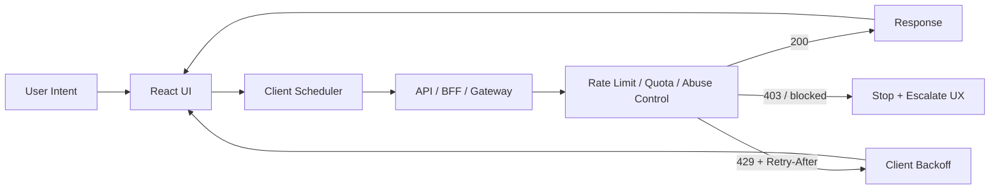
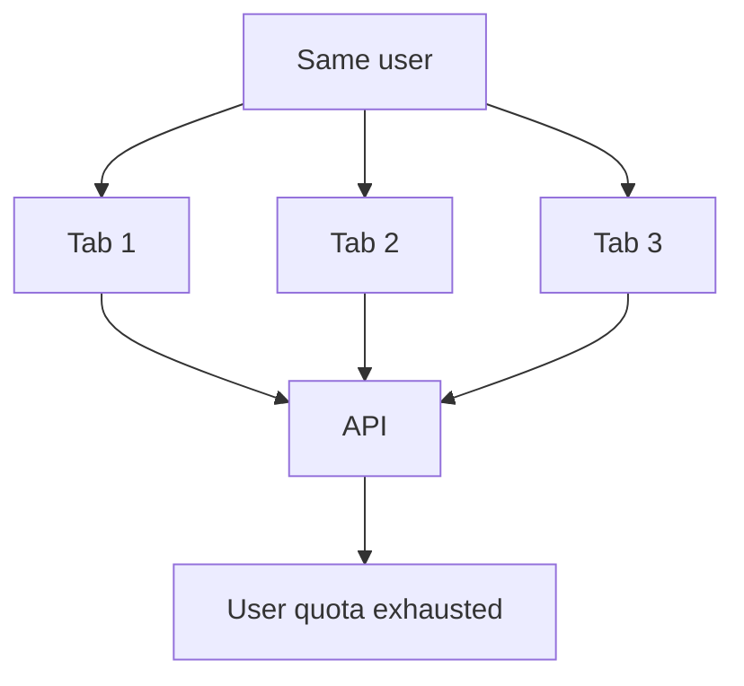
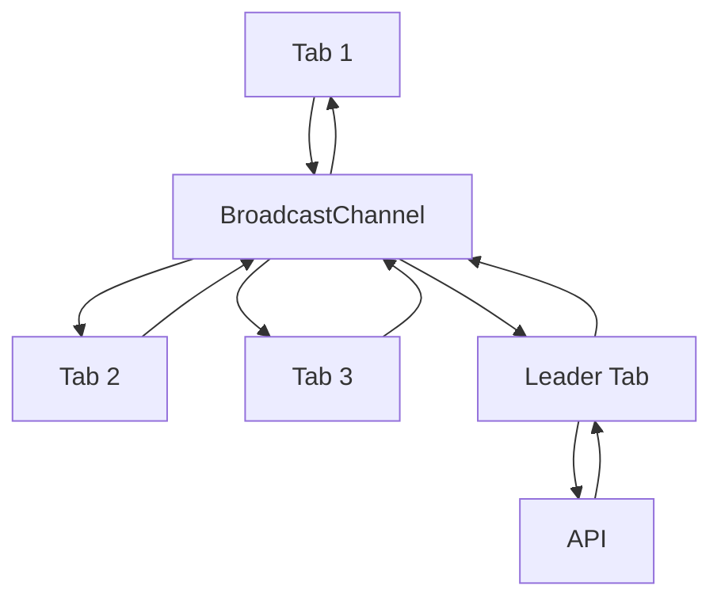
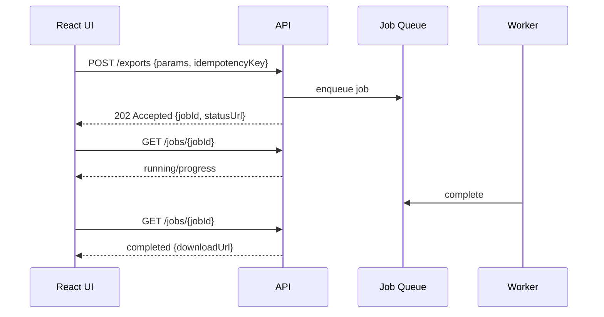
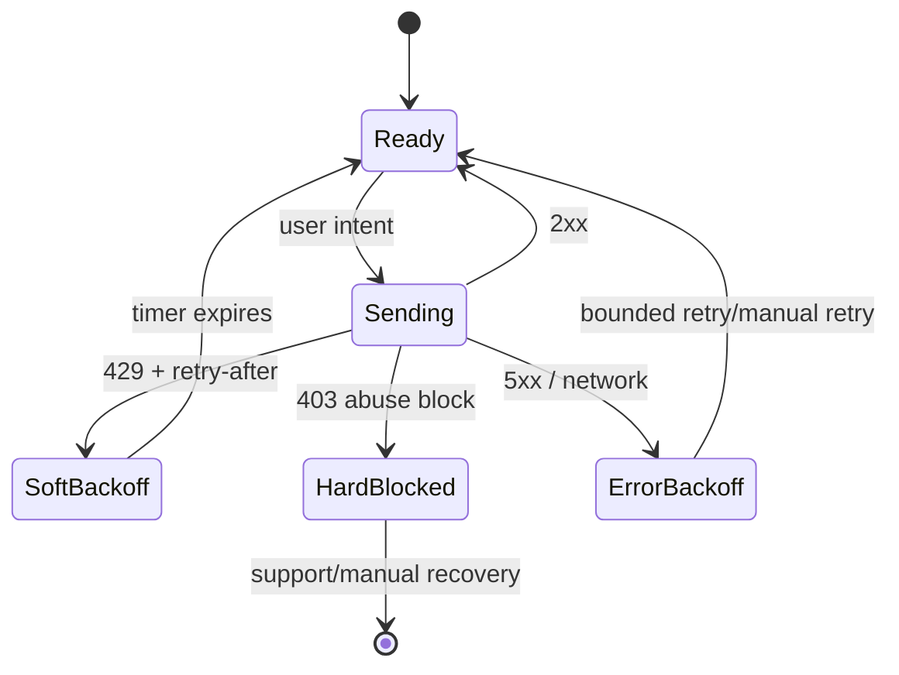

# Part 063 — Rate Limits, Abuse Controls, and Client Behavior

> Target: setelah bagian ini, kamu bisa mendesain React client-server communication yang tidak berubah menjadi traffic amplifier, tidak memperparah incident saat API mulai menolak request, dan tetap memberikan UX yang jujur ketika user, device, browser tab, atau automation mencapai batas pemakaian.

Rate limiting sering dianggap urusan backend atau gateway. Itu salah framing.

Server memang wajib menegakkan limit. Tetapi React client menentukan banyak hal yang membuat limit sehat atau hancur:

- apakah UI mengirim request setiap keypress;
- apakah retry menghormati `Retry-After`;
- apakah 10 tab user melakukan polling bersamaan;
- apakah infinite scroll bisa memicu 100 request dalam 3 detik;
- apakah mutation double-click menghasilkan command ganda;
- apakah GraphQL batching membuat satu HTTP request berisi 100 expensive operations;
- apakah client membedakan “temporary throttled” dari “permanently forbidden”.

Rate limit bukan sekadar angka. Ini adalah **backpressure contract** antara client dan server.



Core invariant:

> **A production React client must treat rate-limit responses as control signals, not as ordinary errors.**

---

## 1. What Rate Limiting Is Actually Protecting

Rate limits protect more than CPU.

| Protected thing | Example | Why it matters to React client |
|---|---|---|
| Availability | search API, feed API, dashboard API | client retry storms can hurt everyone |
| Cost | PDF generation, AI call, export, geocoding | one user action may trigger expensive backend work |
| Abuse surface | OTP, password reset, login | UI should not make brute-force attempts convenient |
| Fairness | tenant quota, user quota, API key quota | one tab/user should not consume shared budget unfairly |
| Data scraping risk | paginated resources, search endpoints | aggressive prefetch/infinite scroll can look like scraping |
| Side-effect safety | payment, submission, approval | duplicate mutation must not become duplicate business action |
| Downstream stability | third-party API, database, queue | backend may throttle because dependency is degraded |

A frontend engineer cannot implement server-side quota enforcement from React. But a frontend engineer can prevent the client from behaving like an attack tool.

Bad mental model:

> “If server rejects, just retry.”

Better mental model:

> “If server rejects with throttling semantics, the server is asking this client to slow down or stop.”

---

## 2. The Signals: 429, `Retry-After`, and RateLimit Headers

### 2.1 `429 Too Many Requests`

`429` means the client has sent too many requests in a period of time.

Important consequences:

- It is not the same as `500`.
- It is not the same as `403`.
- It can be temporary.
- It may include `Retry-After`.
- It should usually not trigger unlimited exponential retry.
- It should often update UI state into a throttled state.

```http
HTTP/1.1 429 Too Many Requests
Content-Type: application/problem+json
Retry-After: 30

{
  "type": "https://api.example.com/problems/rate-limit-exceeded",
  "title": "Rate limit exceeded",
  "status": 429,
  "detail": "Too many search requests. Try again in 30 seconds.",
  "limitScope": "user",
  "retryAfterSeconds": 30
}
```

### 2.2 `Retry-After`

`Retry-After` can be either:

```http
Retry-After: 120
```

or an HTTP date:

```http
Retry-After: Wed, 08 Jul 2026 10:00:00 GMT
```

A robust client must parse both.

```ts
export function parseRetryAfterMs(value: string | null, now = Date.now()): number | null {
  if (!value) return null;

  const seconds = Number(value);
  if (Number.isFinite(seconds) && seconds >= 0) {
    return seconds * 1000;
  }

  const dateMs = Date.parse(value);
  if (Number.isFinite(dateMs)) {
    return Math.max(0, dateMs - now);
  }

  return null;
}
```

Never treat missing `Retry-After` as permission to hammer the API.

Reasonable fallback:

```ts
const fallback429BackoffMs = 30_000;
```

### 2.3 RateLimit headers

You may see headers like:

```http
RateLimit: limit=100, remaining=0, reset=30
RateLimit-Policy: 100;w=60
```

or older/de-facto variants:

```http
X-RateLimit-Limit: 100
X-RateLimit-Remaining: 0
X-RateLimit-Reset: 1720425600
```

Treat these as advisory unless your organization standardizes their exact format.

Client principle:

> `Retry-After` is a stronger immediate behavior signal than quota display headers.

---

## 3. Rate Limit Is Not One Thing

Different limits require different client behavior.

| Limit type | Example | Client behavior |
|---|---|---|
| Per IP | unauthenticated public API | slow down globally for this page/session |
| Per user | `/me/notifications` | show per-user throttled state |
| Per tenant | shared business workspace quota | avoid per-tab amplification; explain shared quota |
| Per endpoint | `/search`, `/export` | throttle only that feature |
| Per operation cost | GraphQL query complexity, AI request | reduce request cost, not just frequency |
| Per concurrent request | max 3 exports | queue or disable additional actions |
| Per mutation command | OTP resend, password reset | countdown, disable button, idempotency key |
| Per time window quota | 1,000/day | show durable quota exhaustion, not spinner |
| Dynamic abuse score | suspicious behavior | stop automation-like behavior and surface safe UX |

The React client must know whether the limit is feature-local, user-wide, tenant-wide, or session-wide.

A generic `toast.error("Something went wrong")` is not enough.

---

## 4. Abuse Controls Are Product Behavior, Not Just Security Middleware

Abuse control is any mechanism that prevents misuse, automation, exploitation, or unfair resource consumption.

Frontend touchpoints:

- login attempt throttling;
- OTP resend cooldown;
- password reset request cooldown;
- invite creation limits;
- export/download quota;
- file upload size and frequency;
- expensive report generation;
- AI assistant prompt budget;
- search/autocomplete request shaping;
- bulk actions;
- scraping-sensitive pagination;
- comment/message spam prevention;
- payment or order submission duplicate control.

A secure UI does not merely hide buttons. It makes unsafe repetition hard, visible, and recoverable.

Example OTP resend:

```tsx
function ResendOtpButton({ resendOtp }: { resendOtp: () => Promise<void> }) {
  const [retryAt, setRetryAt] = React.useState<number | null>(null);
  const now = useNow(1000);
  const disabled = retryAt !== null && now < retryAt;
  const remaining = retryAt ? Math.ceil((retryAt - now) / 1000) : 0;

  async function onClick() {
    try {
      await resendOtp();
      setRetryAt(Date.now() + 60_000);
    } catch (error) {
      if (isRateLimitError(error)) {
        setRetryAt(Date.now() + error.retryAfterMs);
        return;
      }
      throw error;
    }
  }

  return (
    <button disabled={disabled} onClick={onClick}>
      {disabled ? `Resend available in ${remaining}s` : "Resend code"}
    </button>
  );
}
```

The server remains the source of truth. The client cooldown is UX + damage reduction, not security enforcement.

---

## 5. Client Behavior That Accidentally Looks Like Abuse

A React app can generate abusive traffic without malicious users.

| Pattern | How it becomes abusive | Fix |
|---|---|---|
| Fetch on every render | unstable dependency causes repeated requests | stable query key, effect cleanup, query library |
| Search on every keypress | 30 keystrokes = 30 API calls | debounce + abort + min length |
| Polling in every tab | 8 tabs = 8x traffic | leader election / BroadcastChannel / service worker |
| Infinite scroll prefetch | user scrolls fast; client fetches many pages | max in-flight, viewport threshold, stop at limit |
| Retry every error | 429/503 becomes retry storm | classify + respect server signal |
| Refetch on focus | switching tabs triggers bursts | staleTime + refetch throttling |
| Route prefetch too aggressive | prefetches private/expensive routes | budget + intent-based prefetch |
| Mutation double-click | duplicate command | disable, idempotency key, server dedupe |
| Autosave too eager | saves every input event | debounce, merge, version check |
| GraphQL batching abuse | one HTTP request hides many operations | operation cost budget |

The goal is not to make the frontend timid. The goal is to make it **well-behaved under pressure**.

---

## 6. Search and Autocomplete: The Classic Rate-Limit Trap

Naive implementation:

```tsx
React.useEffect(() => {
  fetch(`/api/search?q=${query}`)
    .then((r) => r.json())
    .then(setResults);
}, [query]);
```

Problems:

- sends request for every keystroke;
- no minimum query length;
- no cancellation;
- responses can arrive out of order;
- no throttling after 429;
- no distinction between stale result and current query;
- easy to amplify under poor network.

Better implementation:

```tsx
function useSearch(query: string) {
  const normalized = query.trim();
  const debounced = useDebouncedValue(normalized, 250);

  return useQuery({
    queryKey: ["search", { q: debounced }],
    enabled: debounced.length >= 2,
    staleTime: 15_000,
    gcTime: 5 * 60_000,
    retry(failureCount, error) {
      if (isRateLimitError(error)) return false;
      if (isClientError(error)) return false;
      return failureCount < 2;
    },
    queryFn: ({ signal }) => api.search({ q: debounced }, { signal }),
  });
}
```

But even this is incomplete if the API returns `429`. The UI needs a throttled state.

```tsx
function SearchBox() {
  const [query, setQuery] = React.useState("");
  const result = useSearch(query);

  if (isRateLimitError(result.error)) {
    return (
      <div role="status">
        Search is temporarily limited. Try again in {Math.ceil(result.error.retryAfterMs / 1000)} seconds.
      </div>
    );
  }

  // render normal search state
}
```

---

## 7. Polling Without Becoming a Distributed Denial of Service

Polling is useful. Bad polling is a DDoS generator.

Naive polling:

```ts
setInterval(() => {
  fetch("/api/notifications");
}, 1000);
```

Problems:

- overlaps slow requests;
- keeps running in hidden tabs;
- ignores network offline;
- ignores 429/503;
- multiplies by number of tabs;
- no jitter, so many clients synchronize bursts.

Better polling loop invariant:

> **At most one in-flight request per resource per tab group, with adaptive delay and server-signal awareness.**

```ts
type PollDecision = {
  nextDelayMs: number;
  reason: "normal" | "hidden" | "offline" | "rate-limited" | "error";
};

function decideNextPoll(input: {
  visible: boolean;
  online: boolean;
  lastError?: unknown;
  baseDelayMs: number;
}): PollDecision {
  if (!input.online) return { nextDelayMs: 30_000, reason: "offline" };
  if (!input.visible) return { nextDelayMs: input.baseDelayMs * 6, reason: "hidden" };

  if (isRateLimitError(input.lastError)) {
    return { nextDelayMs: input.lastError.retryAfterMs, reason: "rate-limited" };
  }

  if (input.lastError) {
    return { nextDelayMs: jitter(input.baseDelayMs * 2), reason: "error" };
  }

  return { nextDelayMs: jitter(input.baseDelayMs), reason: "normal" };
}
```

Do not rely on browser timer throttling as your rate-limit strategy. Browser throttling is implementation behavior, not your application protocol.

---

## 8. Multi-Tab Amplification

A single user can open many tabs. Without coordination, every tab may:

- open its own WebSocket;
- run its own polling loop;
- refetch on focus;
- refresh tokens;
- replay offline queue;
- prefetch route resources;
- upload telemetry.

This is especially dangerous for dashboards and admin tools.



Better architecture:



A simple tab leader election:

```ts
const CHANNEL = "app-sync";
const channel = new BroadcastChannel(CHANNEL);

const tabId = crypto.randomUUID();
let leaderId = tabId;
let lastLeaderHeartbeat = Date.now();

channel.onmessage = (event) => {
  const msg = event.data;
  if (msg.type === "leader-heartbeat") {
    leaderId = msg.tabId;
    lastLeaderHeartbeat = Date.now();
  }
};

setInterval(() => {
  const leaderMissing = Date.now() - lastLeaderHeartbeat > 5_000;

  if (leaderMissing || leaderId === tabId) {
    leaderId = tabId;
    channel.postMessage({ type: "leader-heartbeat", tabId, at: Date.now() });
  }
}, 2_000);

export function isLeaderTab() {
  return leaderId === tabId;
}
```

This is not perfect distributed consensus. It is usually enough to reduce accidental amplification.

For high-value systems, prefer a shared worker/service worker architecture or server-side connection/session coordination.

---

## 9. Concurrency Limits vs Rate Limits

Rate limit controls frequency over time.

Concurrency limit controls simultaneous work.

They solve different problems.

| Problem | Control |
|---|---|
| 100 requests/minute | rate limit |
| 10 exports running at once | concurrency limit |
| 3 uploads in parallel | concurrency limit |
| 5 login attempts/minute | rate limit + abuse detection |
| 1 active checkout per cart | concurrency + idempotency + lock |

Client-side concurrency limiter:

```ts
class Semaphore {
  private available: number;
  private queue: Array<() => void> = [];

  constructor(max: number) {
    this.available = max;
  }

  async acquire(): Promise<() => void> {
    if (this.available > 0) {
      this.available -= 1;
      return () => this.release();
    }

    await new Promise<void>((resolve) => this.queue.push(resolve));
    this.available -= 1;
    return () => this.release();
  }

  private release() {
    this.available += 1;
    const next = this.queue.shift();
    if (next) next();
  }
}

const uploadSlots = new Semaphore(3);

async function uploadFile(file: File) {
  const release = await uploadSlots.acquire();
  try {
    return await api.uploadFile(file);
  } finally {
    release();
  }
}
```

This improves UX and protects browser/server resources, but it is not a replacement for backend concurrency enforcement.

---

## 10. Retry Policy Must Respect Throttling

Bad retry policy:

```ts
retry: 3
```

This treats all errors similarly.

Better policy:

```ts
function shouldRetry(failureCount: number, error: unknown): boolean {
  if (isAbortError(error)) return false;
  if (isValidationError(error)) return false;
  if (isAuthzError(error)) return false;
  if (isRateLimitError(error)) return false;
  if (isConflictError(error)) return false;

  if (isHttpError(error) && error.status >= 500) {
    return failureCount < 2;
  }

  if (isNetworkError(error)) {
    return failureCount < 2;
  }

  return false;
}

function retryDelay(failureCount: number, error: unknown): number {
  if (isRateLimitError(error)) {
    return error.retryAfterMs;
  }

  return Math.min(30_000, jitter(1_000 * 2 ** failureCount));
}
```

Important subtlety:

- Query retry can be safe if read-only and bounded.
- Mutation retry can be dangerous without idempotency.
- 429 retry should generally be scheduled by a quota-aware controller, not blind per-request retry.

---

## 11. A Client-Side Rate-Limit Controller

A useful pattern is a small runtime controller that remembers throttling by scope.

```ts
type RateLimitScope =
  | `endpoint:${string}`
  | `user:${string}`
  | `tenant:${string}`
  | `operation:${string}`;

type ThrottleRecord = {
  until: number;
  reason: string;
};

export class ClientRateLimitController {
  private throttles = new Map<RateLimitScope, ThrottleRecord>();

  getWaitMs(scope: RateLimitScope, now = Date.now()) {
    const record = this.throttles.get(scope);
    if (!record) return 0;
    return Math.max(0, record.until - now);
  }

  isThrottled(scope: RateLimitScope) {
    return this.getWaitMs(scope) > 0;
  }

  markThrottled(scope: RateLimitScope, durationMs: number, reason = "rate_limit") {
    const until = Date.now() + durationMs;
    const current = this.throttles.get(scope);

    if (!current || current.until < until) {
      this.throttles.set(scope, { until, reason });
    }
  }

  clear(scope: RateLimitScope) {
    this.throttles.delete(scope);
  }
}
```

Usage in an API client:

```ts
const limiter = new ClientRateLimitController();

async function limitedRequest<T>(input: {
  scope: RateLimitScope;
  request: () => Promise<T>;
}): Promise<T> {
  const waitMs = limiter.getWaitMs(input.scope);

  if (waitMs > 0) {
    throw new ClientThrottledError({ scope: input.scope, retryAfterMs: waitMs });
  }

  try {
    return await input.request();
  } catch (error) {
    if (isRateLimitError(error)) {
      limiter.markThrottled(input.scope, error.retryAfterMs, error.problem?.type);
    }
    throw error;
  }
}
```

This prevents the UI from sending requests already known to be rejected.

Do not use this to hide server policy from users. Use it to shape behavior and reduce waste.

---

## 12. UI States for Rate-Limited Features

Rate limit should be visible and actionable.

| Scenario | Bad UI | Better UI |
|---|---|---|
| Temporary search throttle | red generic toast | inline “Search paused for 30s” |
| OTP resend cooldown | clickable button keeps failing | disabled button with countdown |
| Daily export quota exhausted | spinner forever | quota exhausted state + reset time |
| Tenant-wide quota | individual error only | explain shared workspace limit |
| Suspicious activity block | “unknown error” | safe message + support path |
| Background polling throttled | noisy errors | silent backoff + stale indicator |

Example discriminated union:

```ts
type RemoteState<T> =
  | { tag: "idle" }
  | { tag: "loading" }
  | { tag: "success"; data: T; stale?: boolean }
  | { tag: "error"; message: string }
  | { tag: "throttled"; retryAt: number; scope: string; message: string };
```

A throttled state is not the same as error state. It has a timer and a contract.

---

## 13. Mutation-Specific Abuse Controls

Mutations create side effects. Abuse controls matter more.

Common controls:

- disable while pending;
- idempotency key per command intent;
- server-side duplicate suppression;
- confirmation for expensive/destructive commands;
- debounce for autosave;
- queue with explicit ordering;
- per-resource lock status;
- command status endpoint for long-running work;
- cooldown UI from server response.

Example command envelope:

```ts
type CommandEnvelope<TPayload> = {
  commandId: string;
  idempotencyKey: string;
  commandType: string;
  payload: TPayload;
  submittedAt: string;
};

function createCommand<TPayload>(commandType: string, payload: TPayload): CommandEnvelope<TPayload> {
  const id = crypto.randomUUID();
  return {
    commandId: id,
    idempotencyKey: id,
    commandType,
    payload,
    submittedAt: new Date().toISOString(),
  };
}
```

Mutation retry rule:

> **No idempotency key, no automatic retry for side-effecting commands.**

---

## 14. GraphQL and Batched Request Abuse

GraphQL complicates rate limiting because one HTTP request can represent many operations or an expensive nested selection.

Frontend risk patterns:

- unbounded query depth;
- accidental huge fragment composition;
- batching many login attempts;
- repeated pagination queries;
- expensive search with broad filters;
- variable-driven fan-out;
- introspection in environments where it is not expected.

Client controls:

- persisted operations for sensitive/high-volume clients;
- generated queries rather than arbitrary query strings;
- operation name required;
- query cost exposed in response extensions if available;
- batch size limit;
- disable login/auth operation batching;
- map GraphQL rate-limit errors to throttled UI state.

Example response extension:

```json
{
  "data": { "searchCases": [] },
  "extensions": {
    "cost": {
      "requested": 42,
      "remaining": 58,
      "resetInSeconds": 60
    }
  }
}
```

If the API exposes cost hints, React can use them to reduce prefetching or disable expensive interactions temporarily.

---

## 15. File Uploads, Exports, and Expensive Jobs

Uploads and exports are not ordinary requests.

They consume:

- bandwidth;
- storage;
- CPU;
- virus scanning capacity;
- report generation worker capacity;
- third-party API quota;
- user patience.

Better pattern for expensive jobs:



Do not keep re-submitting the export command because progress is slow.

Client behavior:

- submit once;
- use idempotency key;
- poll status with adaptive interval;
- stop polling on terminal state;
- respect `Retry-After` from job status endpoint;
- show progress and queue position if available;
- avoid multiple tabs generating same report.

---

## 16. Handling `403`, `429`, and Abuse Blocks Correctly

`429` says “too many for now”.

`403` says “not allowed”.

But abuse systems may return either depending on policy.

| Status | Meaning | Client action |
|---|---|---|
| 400 | malformed request | fix client/validation |
| 401 | not authenticated | auth flow, not retry storm |
| 403 | authenticated but forbidden/blocked | stop and show safe message |
| 409 | conflict | refresh/merge/resolve |
| 412 | precondition failed | refresh version, retry manually |
| 422 | domain validation failed | field/form errors |
| 429 | too many requests | backoff/cooldown |
| 503 | service unavailable | bounded retry, maybe `Retry-After` |

Do not reinterpret every failure as “retry later”.

Abuse block example:

```json
{
  "type": "https://api.example.com/problems/account-temporarily-blocked",
  "title": "Action temporarily unavailable",
  "status": 403,
  "detail": "This action is temporarily unavailable. Contact support if you think this is a mistake.",
  "supportCode": "ABUSE-7F19"
}
```

The client should not expose internals like risk score, rule names, IP reputation, or exact bypass hints.

---

## 17. Rate Limits and React Query

React Query gives hooks for retry, refetch, cache, focus revalidation, polling, and invalidation. Those are powerful traffic generators.

A safe default:

```ts
const queryClient = new QueryClient({
  defaultOptions: {
    queries: {
      staleTime: 30_000,
      gcTime: 5 * 60_000,
      refetchOnWindowFocus: true,
      retry(failureCount, error) {
        if (isRateLimitError(error)) return false;
        if (isAuthError(error)) return false;
        if (isValidationError(error)) return false;
        return failureCount < 2;
      },
      retryDelay(attempt, error) {
        if (isRateLimitError(error)) return error.retryAfterMs;
        return Math.min(30_000, jitter(1000 * 2 ** attempt));
      },
    },
    mutations: {
      retry(failureCount, error) {
        if (isRateLimitError(error)) return false;
        return false;
      },
    },
  },
});
```

Then define per-query policies for polling dashboards, search, and expensive resources.

Avoid this:

```ts
refetchInterval: 1000
```

unless you have explicitly answered:

- how many users?
- how many tabs per user?
- what happens when tab is hidden?
- what happens on 429?
- what happens on 503?
- is the endpoint cacheable?
- is the data truly worth 1-second freshness?

---

## 18. Route Prefetch and Abuse

Prefetching can become a quota leak.

Risk examples:

- prefetching routes user never opens;
- prefetching sensitive data into cache/history;
- prefetching expensive reports;
- prefetching across permission boundary;
- prefetching for every row in a table;
- prefetching on mobile data;
- prefetching while API is degraded.

Safe prefetch rules:

```ts
type PrefetchPolicy = {
  allowed: boolean;
  reason?: string;
};

function canPrefetch(input: {
  route: string;
  isExpensive: boolean;
  isSensitive: boolean;
  networkSaveData: boolean;
  recentlyRateLimited: boolean;
}): PrefetchPolicy {
  if (input.networkSaveData) return { allowed: false, reason: "save-data" };
  if (input.recentlyRateLimited) return { allowed: false, reason: "rate-limited" };
  if (input.isSensitive) return { allowed: false, reason: "sensitive" };
  if (input.isExpensive) return { allowed: false, reason: "expensive" };
  return { allowed: true };
}
```

Prefetch is a performance optimization. It must not bypass access intent or quota policy.

---

## 19. Client-Side Backpressure State Machine



Rules:

- `SoftBackoff` is temporary and timer-driven.
- `HardBlocked` is not automatically retried.
- `ErrorBackoff` is reliability retry, not quota retry.
- Manual retry may be allowed only after cooldown or explicit user action.

---

## 20. Observability for Rate Limits

You cannot improve what you cannot see.

Track:

- request endpoint/operation;
- rate-limit scope if provided;
- status `429` count;
- `Retry-After` value;
- whether request was user-initiated or background;
- retry attempt count;
- query key hash/category;
- tab visibility;
- online/offline state;
- feature name;
- tenant/user anonymized identifiers;
- whether client suppressed request due to known throttle;
- quota reset time if safe;
- operation cost if provided.

Do not log PII or secrets.

Example event:

```ts
type RateLimitTelemetryEvent = {
  event: "client.rate_limited";
  feature: string;
  operation: string;
  status: 429;
  retryAfterMs?: number;
  scope?: "user" | "tenant" | "ip" | "endpoint" | "unknown";
  requestInitiator: "user" | "polling" | "prefetch" | "retry" | "background";
  visible: boolean;
  online: boolean;
};
```

The most important dimension is initiator. A rate limit caused by user clicking export 20 times is a different problem from background polling causing it.

---

## 21. Testing Rate-Limit Behavior

Test behavior, not just status handling.

### 21.1 Unit tests

```ts
it("parses Retry-After seconds", () => {
  expect(parseRetryAfterMs("30", 0)).toBe(30_000);
});

it("parses Retry-After date", () => {
  expect(parseRetryAfterMs("Wed, 08 Jul 2026 00:00:30 GMT", Date.parse("Wed, 08 Jul 2026 00:00:00 GMT")))
    .toBe(30_000);
});
```

### 21.2 Integration tests with MSW

```ts
http.get("/api/search", () => {
  return HttpResponse.json(
    {
      type: "https://api.example.com/problems/rate-limit-exceeded",
      title: "Rate limit exceeded",
      status: 429,
      retryAfterSeconds: 30,
    },
    {
      status: 429,
      headers: { "Retry-After": "30" },
    },
  );
});
```

Assert:

- UI shows throttled state;
- request is not retried immediately;
- button is disabled during cooldown;
- manual retry becomes available after timer;
- telemetry event is emitted without sensitive payload.

### 21.3 Load-shaping tests

For search/autocomplete:

- type 20 characters fast;
- assert request count is bounded;
- assert stale responses do not overwrite latest result;
- assert abort is called for obsolete requests;
- assert 429 stops further requests for cooldown.

### 21.4 Multi-tab tests

Simulate multiple tabs with multiple app instances if possible.

Assert:

- only leader tab polls;
- non-leader tabs receive updates through channel;
- leader failover does not create many leaders permanently;
- logout clears leader state and queues.

---

## 22. Red-Team Questions for Client Behavior

Ask these during review:

1. Can a user action trigger unbounded request fan-out?
2. Can background polling continue after user logs out?
3. Can multiple tabs multiply traffic linearly?
4. Can prefetch load sensitive or expensive resources without intent?
5. Can retry ignore `Retry-After`?
6. Can mutation be double-submitted?
7. Can offline queue replay commands after tenant/user changes?
8. Can GraphQL batching bypass endpoint-level throttling?
9. Can autocomplete produce request per keystroke for empty/short input?
10. Can the UI reveal abuse-control internals?
11. Can telemetry leak payloads from rejected requests?
12. Can error boundaries repeatedly refetch and loop?
13. Can a service worker replay stale requests after deploy?
14. Can hidden tabs keep high-frequency intervals alive?
15. Can every row hover trigger detail prefetch?

If the answer is “yes”, the client is part of the abuse surface.

---

## 23. Production Design Checklist

Before shipping a high-traffic React feature:

- [ ] classify endpoint as cheap, normal, expensive, abuse-sensitive, or side-effecting;
- [ ] define retry policy by status/error type;
- [ ] parse and respect `Retry-After`;
- [ ] avoid automatic retry for 429 unless explicitly scheduled and bounded;
- [ ] disable duplicate mutation while pending;
- [ ] use idempotency keys for side-effecting commands;
- [ ] debounce/abort search requests;
- [ ] cap infinite scroll in-flight pages;
- [ ] avoid prefetching expensive/sensitive endpoints;
- [ ] coordinate polling across tabs;
- [ ] slow down polling when hidden/offline/rate-limited;
- [ ] expose throttled UI state where user action is blocked;
- [ ] preserve accessibility for countdown and disabled state;
- [ ] emit telemetry for suppressed and rejected requests;
- [ ] test 429, 403 block, 503 with `Retry-After`, offline, hidden tab, and multi-tab;
- [ ] document server/client contract for quota and cooldown.

---

## 24. Decision Matrix

| Feature | Default communication pattern | Rate/abuse control |
|---|---|---|
| Search box | debounced query + abort | min length, no retry on 429, cooldown UI |
| Notifications | polling or SSE | leader tab, adaptive interval, stale indicator |
| OTP resend | mutation command | server cooldown, disabled countdown, strict rate limit |
| File upload | signed URL / upload API | size/type validation, concurrency cap, progress, retry chunks carefully |
| Export/report | job API | idempotency key, status polling, queue position, per-user quota |
| Infinite feed | cursor pagination | max in-flight, backpressure, no auto-fetch loops |
| Autosave | debounced mutation | version check, merge, conflict UI, no unbounded retry |
| GraphQL dashboard | typed query/batch | query cost, persisted ops, batch size limit |
| Route prefetch | intent-based prefetch | budget, skip sensitive/expensive/private resources |
| Realtime sync | SSE/WebSocket | subscription scope, heartbeat, reconnection backoff |

---

## 25. Key Takeaways

Rate limits are not just backend configuration. They are a distributed protocol.

A strong React client:

- understands `429` as a control signal;
- parses and respects `Retry-After`;
- avoids accidental request amplification;
- coordinates tabs where needed;
- separates user action, background refetch, prefetch, polling, and retry in telemetry;
- uses idempotency for side-effecting commands;
- treats abuse controls as product states, not hidden middleware;
- prevents the client from turning partial failure into full incident.

The mature posture is simple:

> **Be fast when the system is healthy, polite when the system is constrained, and silent when retry would cause harm.**

---

## References

- OWASP API Security Top 10 2023 — API4:2023 Unrestricted Resource Consumption
- OWASP API Security Top 10 2023 — API2:2023 Broken Authentication
- OWASP Authentication Cheat Sheet — Login Throttling
- MDN — 429 Too Many Requests
- RFC 6585 — Additional HTTP Status Codes
- RFC 9457 — Problem Details for HTTP APIs
- IETF HTTPAPI Draft — RateLimit Header Fields for HTTP
- TanStack Query Documentation — Retry, Refetching, Polling, Query Defaults
