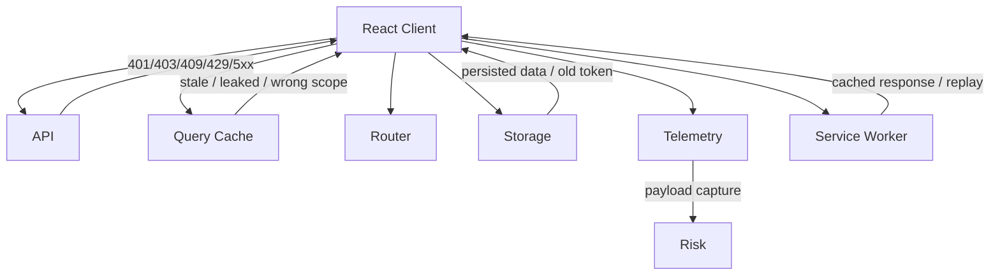
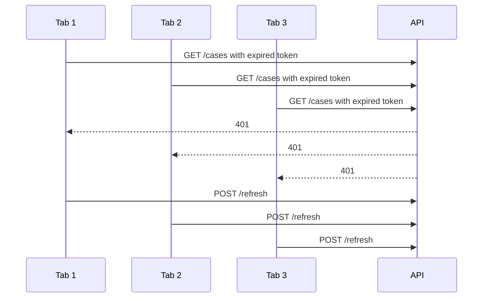
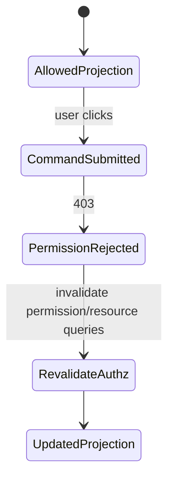
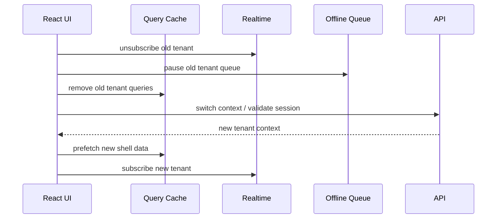
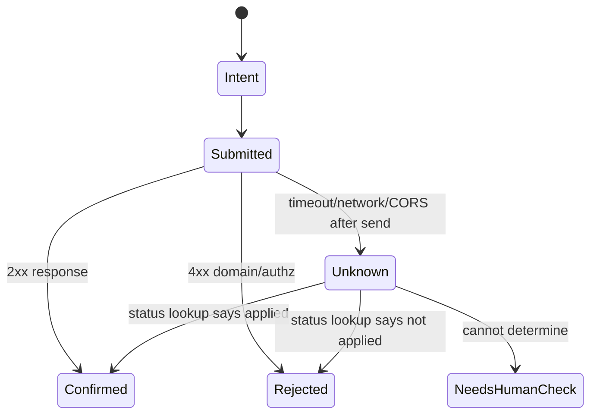
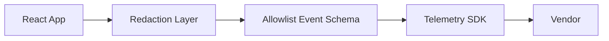
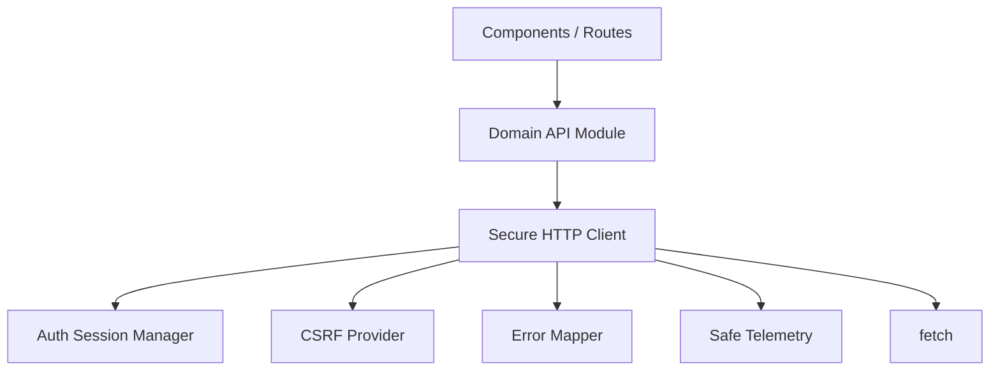

# Part 064 — Secure Client-Server Failure Modes

> Target: setelah bagian ini, kamu bisa melakukan threat-oriented review terhadap React client-server communication: bukan hanya “apakah happy path aman”, tetapi “apa yang terjadi saat auth expired, cache stale, CORS salah, CSRF gagal, server error, telemetry bocor, tab lama hidup, service worker menyimpan data, atau user berpindah tenant”.

Security sering diuji pada happy path:

- login berhasil;
- token valid;
- endpoint mengembalikan data benar;
- UI menyembunyikan tombol yang tidak boleh;
- CORS bekerja di environment dev;
- error menampilkan pesan yang terlihat sopan.

Production incident biasanya terjadi di failure path.

A secure React app is not one that merely calls secure APIs. It is one that **fails safely** when client-server assumptions collapse.



Core invariant:

> **Every client-server failure path must preserve confidentiality, integrity, and recoverability.**

---

## 1. The Failure-Mode Lens

Do not start security review with “what library are we using?”

Start with failure questions:

1. What if the user is authenticated but no longer authorized?
2. What if cache has data from the previous user?
3. What if mutation succeeded but response failed?
4. What if token refresh races in 10 tabs?
5. What if CORS blocks the response after the server processed the request?
6. What if CSRF token is stale?
7. What if the API returns too much detail in error response?
8. What if the telemetry SDK records request body?
9. What if a service worker serves old private data?
10. What if a user changes tenant while requests are in flight?

Security is not a feature. It is an invariant across state transitions.

---

## 2. Failure Mode Taxonomy

| Area | Failure mode | Primary risk |
|---|---|---|
| Authentication | expired session, refresh race, token replay | unauthorized request, logout loop |
| Authorization | stale permission, tenant switch, BOLA | data leak / illegal mutation |
| CORS/browser policy | response hidden, credential mismatch | false debugging, unsafe workaround |
| CSRF | stale/missing token, unsafe mutation | forged command |
| Cache | tenant/user bleed, persisted stale data | confidentiality breach |
| Retry | duplicate mutation, replay after logout | integrity breach |
| Realtime | event for revoked object, wrong subscription | data leak / stale UI |
| Offline queue | replay under wrong identity | unauthorized mutation |
| Error handling | verbose server error | information disclosure |
| Telemetry | payload/URL/header capture | PII/secret leak |
| Service worker | old asset/API cache | stale security policy |
| Routing | open redirect, deep link bypass | phishing/access confusion |
| RSC/SSR | serialization leak | server-only data exposure |
| Signed URLs | leaked capability URL | unauthorized file access |

A top-tier frontend engineer models these before incidents happen.

---

## 3. Auth Expiry and Refresh Storms

Naive behavior:



Problems:

- refresh endpoint gets stormed;
- tokens can race and overwrite;
- failed refresh can produce logout loop;
- stale requests may retry with wrong session;
- multiple tabs may diverge.

Better invariant:

> **Only one refresh attempt per browser session group should be active at a time.**

Basic single-tab refresh gate:

```ts
let refreshPromise: Promise<void> | null = null;

async function ensureFreshSession() {
  if (!refreshPromise) {
    refreshPromise = authApi.refreshSession().finally(() => {
      refreshPromise = null;
    });
  }

  return refreshPromise;
}
```

Request wrapper:

```ts
async function requestWithAuth<T>(operation: () => Promise<T>): Promise<T> {
  try {
    return await operation();
  } catch (error) {
    if (!isUnauthorized(error)) throw error;

    await ensureFreshSession();
    return operation();
  }
}
```

But this is insufficient in multi-tab. For high-value apps, coordinate refresh through BroadcastChannel, a shared worker, or server session design that does not require frontend token refresh orchestration.

Security rules:

- never retry 401 indefinitely;
- clear auth-scoped caches after refresh failure;
- cancel in-flight protected requests on logout;
- avoid exposing refresh token to JavaScript;
- do not use localStorage for highly sensitive bearer tokens;
- include tenant/user scope in cache keys;
- treat refresh failure as a terminal session state.

---

## 4. 401 vs 403 vs 404: Secure Meaning Matters

A client must not flatten these into one “permission error”.

| Status | Meaning | Secure client behavior |
|---|---|---|
| 401 | not authenticated or session invalid | auth recovery once, then logout/session expired |
| 403 | authenticated but not allowed | stop; clear affected cache if permission changed |
| 404 | resource not found or intentionally hidden | do not reveal existence unless product permits |
| 409 | conflict | refresh/resolve, do not override silently |
| 412 | precondition failed | stale version; require rebase/refetch |

Example secure mapper:

```ts
type SecureRemoteError =
  | { tag: "session_expired" }
  | { tag: "forbidden"; safeMessage: string }
  | { tag: "not_found"; safeMessage: string }
  | { tag: "conflict"; safeMessage: string; canRefresh: boolean }
  | { tag: "rate_limited"; retryAfterMs: number }
  | { tag: "unknown"; safeMessage: string; supportCode?: string };

function mapHttpError(error: HttpError): SecureRemoteError {
  switch (error.status) {
    case 401:
      return { tag: "session_expired" };
    case 403:
      return { tag: "forbidden", safeMessage: "You do not have access to this action." };
    case 404:
      return { tag: "not_found", safeMessage: "The item is not available." };
    case 409:
    case 412:
      return { tag: "conflict", safeMessage: "This item changed. Refresh before continuing.", canRefresh: true };
    case 429:
      return { tag: "rate_limited", retryAfterMs: error.retryAfterMs ?? 30_000 };
    default:
      return { tag: "unknown", safeMessage: "Something went wrong.", supportCode: error.supportCode };
  }
}
```

Do not show internal policy details, SQL errors, stack traces, object existence clues, risk scores, or rule IDs.

---

## 5. Authorization Drift and Stale Permission UI

Frontend permissions are not enforcement. They are a UX projection.

Failure scenario:

1. User opens case detail with `canApprove = true`.
2. Admin revokes approval permission in another session.
3. UI still shows Approve button from stale cache.
4. User clicks Approve.
5. API returns 403.
6. UI shows generic error but leaves button active.

Better behavior:



Client rule:

> When an authz-sensitive mutation returns 403, invalidate resource and permission projections related to that action.

```ts
async function onApproveCase(caseId: string) {
  try {
    await api.approveCase(caseId);
    await queryClient.invalidateQueries({ queryKey: ["case", caseId] });
  } catch (error) {
    if (isForbidden(error)) {
      queryClient.invalidateQueries({ queryKey: ["case", caseId] });
      queryClient.invalidateQueries({ queryKey: ["permissions"] });
    }
    throw error;
  }
}
```

Never assume UI hidden state is security. Server authorization must decide every access and mutation.

---

## 6. Broken Object Level Authorization From the Client Perspective

BOLA/IDOR is server-side failure, but frontend design can increase or reduce risk.

Risky client patterns:

- trusting object IDs from URL without server-side authz;
- using predictable IDs in path and assuming obscurity;
- prefetching adjacent IDs;
- rendering links to objects outside current tenant scope;
- caching detail data under `['case', id]` without tenant/user scope;
- optimistic updates across resources without authz revalidation;
- GraphQL global IDs reused across tenants without context.

Safe query key:

```ts
const caseKey = (tenantId: string, caseId: string) => ["tenant", tenantId, "case", caseId] as const;
```

Unsafe query key:

```ts
const caseKey = (caseId: string) => ["case", caseId] as const;
```

Client cannot fix server BOLA. But client can avoid hiding context and amplifying the blast radius.

---

## 7. Tenant/User Switch Is a Security Boundary

A tenant switch is not just navigation.

It invalidates:

- query cache;
- mutation queue;
- subscriptions;
- open WebSocket topics;
- prefetch cache;
- persisted storage namespace;
- selected resource IDs;
- form drafts;
- upload sessions;
- service worker cache assumptions.

Tenant switch protocol:



Implementation sketch:

```ts
async function switchTenant(nextTenantId: string) {
  realtime.disconnect({ reason: "tenant_switch" });
  offlineQueue.pauseAndClearNonDurable({ scope: "tenant" });

  await queryClient.cancelQueries();
  queryClient.removeQueries({ predicate: (query) => isTenantScoped(query.queryKey) });

  await authApi.switchTenant(nextTenantId);

  await queryClient.prefetchQuery({
    queryKey: ["tenant", nextTenantId, "me"],
    queryFn: ({ signal }) => api.getTenantMe(nextTenantId, { signal }),
  });

  realtime.connect({ tenantId: nextTenantId });
}
```

Do not merely update `currentTenantId` in a global store.

---

## 8. Query Cache Leakage

Query cache is a local replica. Local replicas can leak.

Leak patterns:

| Pattern | Example |
|---|---|
| Missing tenant scope | `['case', caseId]` reused across tenants |
| Missing user scope | admin user logs out, normal user sees cached admin data |
| Persisted cache too broad | private data stored in localStorage/IndexedDB |
| SSR cache shared across requests | one user receives another user's data |
| Hydration data over-included | HTML contains private payload not needed by client |
| Invalidation under-scoped | permission revocation does not clear cached resource |

Safe policy:

```ts
type CacheSensitivity = "public" | "tenant" | "user" | "session" | "ephemeral";

type QueryPolicy = {
  sensitivity: CacheSensitivity;
  persist: boolean;
  gcTimeMs: number;
  includeAuthScope: boolean;
};
```

Example:

| Data | Sensitivity | Persist? | Scope key |
|---|---:|---:|---|
| public product catalog | public | yes | `['catalog']` |
| tenant case list | tenant | maybe | `['tenant', tenantId, 'cases']` |
| current user profile | user | maybe | `['user', userId, 'me']` |
| permission matrix | session | no | `['session', sessionId, 'permissions']` |
| signed download URL | ephemeral | no | never cache long-lived |
| CSRF token | session | no | not query cache |

---

## 9. Persisted Cache and Browser Storage

Persisting server state improves UX but expands exposure.

Browser storage is not a vault.

Risks:

- XSS can read many client-side stores;
- shared device retains data;
- user logout may not clear storage;
- stale data remains after permission revocation;
- service worker can serve cached private responses;
- telemetry/session replay can capture rendered data;
- browser extensions may inspect pages/storage.

Persist only data you are willing to defend.

A conservative rule:

> Persist public and low-risk convenience data. Do not persist sensitive PII, permission projections, signed URLs, tokens, or case documents unless product/security explicitly approves the threat model.

Logout cleanup:

```ts
async function secureLogout() {
  await queryClient.cancelQueries();
  queryClient.clear();

  offlineQueue.clearSensitive();
  realtime.disconnect({ reason: "logout" });

  sessionStorage.clear();
  await clearAppIndexedDb();
  await unregisterOrResetSensitiveServiceWorkerCaches();

  await authApi.logout().catch(() => undefined);
  window.location.assign("/login");
}
```

Do not wait for logout API success before clearing local sensitive data.

---

## 10. CSRF Failure Modes

CSRF protection can fail in several ways:

- missing token;
- stale token after session rotation;
- token scoped to old tenant;
- token not sent due to CORS/credentials misconfiguration;
- token leaked into logs/URL;
- mutation endpoint accepts GET;
- server accepts JSON without origin/token validation;
- client retries unsafe mutation after CSRF failure.

Client behavior:

- never put CSRF token in URL;
- do not log token;
- refresh token only through safe bootstrap path;
- on 403 CSRF-specific problem, refresh session/token once;
- if still failing, stop and require reload/login;
- do not retry mutation blindly.

```ts
async function submitWithCsrf<T>(command: () => Promise<T>): Promise<T> {
  try {
    return await command();
  } catch (error) {
    if (!isCsrfError(error)) throw error;

    await csrfStore.refreshOnce();

    try {
      return await command();
    } catch (again) {
      if (isCsrfError(again)) {
        throw new SafeUserError("Your session changed. Reload the page before continuing.");
      }
      throw again;
    }
  }
}
```

---

## 11. CORS Failure Modes

CORS errors are browser-enforced visibility failures.

A dangerous misunderstanding:

> “The request failed, so the server did nothing.”

Not always. For some cross-origin requests, the server may have processed the request, but the browser hides the response because policy failed.

Failure examples:

- `Access-Control-Allow-Origin: *` with credentials;
- missing `Access-Control-Allow-Credentials`;
- custom header triggers preflight not allowed;
- `Authorization` header not allowed;
- method not included in allowed methods;
- response header not exposed to JS;
- cookies not sent because `credentials` or `SameSite` policy;
- redirect changes origin and policy fails.

Client rules:

- do not “fix” CORS by using `mode: 'no-cors'`;
- do not assume CORS failure means mutation did not happen;
- use idempotency keys for unsafe cross-origin commands;
- expose only needed headers, such as `ETag`, `Retry-After`, request IDs;
- keep local/dev/prod origin policies aligned enough to catch failures.

`mode: 'no-cors'` returns an opaque response. It is not a solution for API calls.

---

## 12. Mutation Unknown Outcome

A mutation can succeed on the server while the client sees failure.

Causes:

- network dropped after server commit;
- CORS blocked response;
- timeout too short;
- tab closed after submit;
- server returned invalid JSON after commit;
- service worker crashed;
- user went offline during response;
- proxy returned error after backend success.

State machine:



Secure client behavior:

- use idempotency key;
- provide command status endpoint if command is important;
- avoid automatic duplicate submit;
- show “checking status” instead of “failed” when outcome unknown;
- do not rollback irreversible UI optimistically without confirmation;
- record client command ID for support/audit.

---

## 13. Offline Queue Replay Under Wrong Identity

Offline queue is a security boundary.

Danger scenario:

1. User A creates offline commands.
2. User logs out.
3. User B logs in on same browser.
4. Queue replays User A commands under User B session.

Every queued command must include:

```ts
type QueuedCommand<T> = {
  commandId: string;
  idempotencyKey: string;
  userId: string;
  tenantId: string;
  sessionGeneration: string;
  commandType: string;
  payload: T;
  createdAt: string;
};
```

Replay gate:

```ts
function canReplay(command: QueuedCommand<unknown>, context: AuthContext) {
  return (
    command.userId === context.userId &&
    command.tenantId === context.tenantId &&
    command.sessionGeneration === context.sessionGeneration
  );
}
```

If identity/context does not match, do not replay. Require user review or discard safely depending on product requirement.

---

## 14. Realtime Subscription Failure Modes

Realtime creates data paths outside ordinary HTTP navigation.

Risks:

- subscription remains active after logout;
- tenant switch does not unsubscribe old topic;
- server sends event after permission revoked;
- client applies event to cache without scope check;
- event payload contains fields current user cannot see;
- resume cursor replays old tenant events;
- connection reconnects with stale auth.

Secure event envelope:

```ts
type ServerEvent<T> = {
  eventId: string;
  tenantId: string;
  resourceType: string;
  resourceId: string;
  version: number;
  type: string;
  payload: T;
};

function applyEvent(event: ServerEvent<unknown>, context: AuthContext) {
  if (event.tenantId !== context.tenantId) return;
  if (!canApplyEventType(event.type, context.permissions)) {
    queryClient.invalidateQueries({ queryKey: ["tenant", context.tenantId] });
    return;
  }

  // apply scoped patch or invalidate
}
```

Client-side filtering is not security enforcement. It is last-mile defense against accidental contamination and stale subscriptions.

---

## 15. Error Response Information Disclosure

Errors are part of the API contract.

Bad error response:

```json
{
  "error": "SQLSTATE 23503: insert or update on table case_notes violates foreign key constraint cases_tenant_id_fkey",
  "stack": "...",
  "query": "select * from cases where tenant_id='t_123'"
}
```

Better error response:

```json
{
  "type": "https://api.example.com/problems/invalid-case-note",
  "title": "Invalid case note",
  "status": 422,
  "detail": "The note cannot be saved for this case.",
  "requestId": "req_7f19b8"
}
```

Client responsibilities:

- render safe message;
- log request ID/support code;
- do not show stack traces;
- do not dump entire error object into UI;
- do not send full error object to telemetry if it may contain payload/header;
- map domain errors to safe UX states.

---

## 16. Telemetry and Session Replay Leakage

Telemetry is a second network path.

It can leak:

- URLs with query params;
- request bodies;
- response bodies;
- headers;
- user IDs/emails;
- DOM text;
- screenshots;
- console logs;
- stack traces containing inline data;
- GraphQL variables;
- signed URLs;
- tokens accidentally printed by debug code.

Safe telemetry pipeline:



Never let arbitrary error objects flow directly to telemetry.

```ts
function reportApiError(error: unknown, context: { operation: string }) {
  const safe = toSafeTelemetryError(error);

  telemetry.capture("api.error", {
    operation: context.operation,
    status: safe.status,
    problemType: safe.problemType,
    requestId: safe.requestId,
    retryable: safe.retryable,
  });
}
```

Not included:

- request body;
- response body;
- authorization header;
- cookies;
- signed URLs;
- raw URL query containing PII;
- stack traces in production unless scrubbed.

---

## 17. CSP and XSS as Client-Server Failure Amplifiers

XSS changes the threat model.

If attacker code runs in the page, it can often:

- make same-origin requests with user credentials;
- read accessible JavaScript memory;
- read localStorage/sessionStorage;
- inspect DOM;
- trigger mutations;
- exfiltrate data through network requests depending on CSP;
- abuse APIs from the user context.

CSP is not a substitute for fixing XSS, but it reduces exploitability when deployed well.

Security headers relevant to client-server communication:

```http
Content-Security-Policy: default-src 'self'; script-src 'self' 'nonce-...'; object-src 'none'; base-uri 'none'; frame-ancestors 'none'
Referrer-Policy: strict-origin-when-cross-origin
Permissions-Policy: geolocation=(), camera=(), microphone=()
X-Content-Type-Options: nosniff
```

Client design implications:

- avoid inline scripts unless nonced/hardened;
- avoid putting secrets in JS-readable storage;
- avoid sensitive data in URLs because referrers/history/logs;
- avoid dynamic script injection from untrusted data;
- sanitize or avoid rendering untrusted HTML;
- avoid source maps exposing sensitive code paths unless access-controlled.

---

## 18. Service Worker Failure Modes

Service workers sit between page and network.

Risks:

- caching authenticated API responses unintentionally;
- serving old app shell with old security assumptions;
- replaying requests after logout;
- keeping old code active after deploy;
- returning cached private data to different user;
- hiding network failures behind stale cache;
- intercepting requests during incident response.

Rules:

- never cache private API responses unless explicitly designed;
- namespace caches by app version and sensitivity;
- clear sensitive caches on logout;
- use `Cache-Control` correctly server-side;
- avoid cache-first for authenticated APIs;
- implement update/activation strategy deliberately;
- have an emergency kill switch if service worker behavior breaks security.

Example guard:

```ts
function shouldCacheApiResponse(request: Request, response: Response): boolean {
  const url = new URL(request.url);

  if (!url.pathname.startsWith("/api/")) return false;
  if (request.headers.has("Authorization")) return false;
  if (response.headers.get("Cache-Control")?.includes("private")) return false;
  if (response.headers.get("Set-Cookie")) return false;

  return response.headers.get("X-App-Cacheable") === "public";
}
```

Default-deny is safer than clever cache heuristics.

---

## 19. SSR/RSC Serialization Leaks

Server-side rendering and Server Components can leak data through the initial HTML/RSC payload.

Leak examples:

- server component fetches full user object but passes it to client component;
- hidden admin-only field serialized into hydration payload;
- debug bootstrap object includes feature flags/user profile/secrets;
- query dehydration includes private query not needed immediately;
- error boundary serializes stack trace;
- `process.env` value accidentally exposed in client bundle.

Safe rule:

> **The serialized payload is client-visible even if the UI does not render it.**

Review every server-to-client prop as if it is a public API response.

```ts
type InternalUser = {
  id: string;
  email: string;
  fullName: string;
  internalRiskScore: number;
  supportNotes: string[];
};

type UserViewModel = {
  id: string;
  displayName: string;
};

function toUserViewModel(user: InternalUser): UserViewModel {
  return {
    id: user.id,
    displayName: user.fullName,
  };
}
```

Do not pass `InternalUser` to a Client Component.

---

## 20. Signed URL Failure Modes

Signed URLs are bearer capabilities.

If someone has the URL, they can usually use it until it expires or is revoked by server-side policy.

Risks:

- URL logged by browser/telemetry/proxy;
- URL stored in query cache;
- URL appears in referrer;
- URL copied to clipboard/history;
- URL expiry too long;
- URL grants broader object/method than needed;
- download URL cached by service worker;
- upload URL reused for wrong file.

Client rules:

- request signed URL just-in-time;
- do not persist signed URL;
- avoid putting signed URL in route params/search params;
- avoid logging full URL;
- clear object URL/download state after use;
- treat expired signed URL as refreshable capability, not fatal data error;
- validate upload metadata server-side after direct upload.

---

## 21. Redirect and Deep Link Failure Modes

Redirects are part of client-server communication.

Risks:

- open redirect after login;
- redirect to external phishing site;
- preserving sensitive query params across redirects;
- redirect loop after auth expiry;
- deep link bypasses client-only route guard;
- stale `returnTo` from previous user/session;
- OAuth callback state mismatch.

Safe redirect validation:

```ts
function safeReturnTo(value: string | null): string {
  if (!value) return "/";

  try {
    const url = new URL(value, window.location.origin);
    if (url.origin !== window.location.origin) return "/";
    if (!url.pathname.startsWith("/")) return "/";
    return `${url.pathname}${url.search}${url.hash}`;
  } catch {
    return "/";
  }
}
```

Server should also validate redirects. Client validation improves UX but is not enough.

---

## 22. Browser Back/Forward Cache and Stale Sensitive Screens

The browser may preserve a page in bfcache. When user presses Back, old DOM/state may reappear quickly.

Risks:

- user logs out, then back button shows sensitive page;
- permissions change, old screen appears;
- tenant switch, old tenant page resumes;
- stale in-memory state appears before revalidation.

Client mitigations:

- clear sensitive local state on logout;
- revalidate auth/session on `pageshow` when `event.persisted`;
- use server cache headers for sensitive pages;
- avoid storing sensitive data in long-lived singleton state;
- render session-check boundary around protected app.

```ts
window.addEventListener("pageshow", (event) => {
  if (event.persisted) {
    authSession.revalidate().catch(() => secureLogout());
  }
});
```

---

## 23. Safe Failure UI

Failure UI can leak.

Bad messages:

- “Case 123 exists but you lack tenant membership.”
- “User rani@example.com is blocked by rule ABUSE_HIGH_RISK_IP.”
- “SQL unique constraint user_email_key failed.”
- “Token expired because refresh token reused.”

Better messages:

- “This item is not available.”
- “You do not have access to this action.”
- “Your session changed. Sign in again.”
- “This action is temporarily unavailable.”
- “The item changed. Refresh before continuing.”

Use support codes for investigation.

```tsx
function SecureErrorView({ error }: { error: SecureRemoteError }) {
  switch (error.tag) {
    case "session_expired":
      return <SessionExpired />;
    case "forbidden":
      return <Notice>{error.safeMessage}</Notice>;
    case "not_found":
      return <Notice>{error.safeMessage}</Notice>;
    case "conflict":
      return <ConflictNotice canRefresh={error.canRefresh} />;
    case "rate_limited":
      return <CooldownNotice retryAfterMs={error.retryAfterMs} />;
    default:
      return <Notice>{error.safeMessage}</Notice>;
  }
}
```

---

## 24. Secure API Client Boundary

A secure React app centralizes risky decisions.



The HTTP client should own:

- credentials mode;
- CSRF header injection;
- request ID correlation;
- timeout/deadline;
- safe body parsing;
- Problem Details mapping;
- retry policy;
- rate-limit handling;
- auth refresh gate;
- redacted telemetry;
- cancellation;
- JSON validation boundary.

Components should not know about raw headers, tokens, cookies, or retry internals.

---

## 25. Security Failure Mode Test Matrix

| Test | Expected behavior |
|---|---|
| 401 on query | refresh once or session expired, no infinite loop |
| 401 on mutation after send | no blind duplicate unless idempotent |
| 403 on stale permission | stop action, invalidate permission/resource data |
| 404 hidden resource | do not reveal existence |
| CSRF stale | refresh token once, then safe failure |
| CORS response blocked | do not assume mutation failed; use idempotency/status where needed |
| 429 with Retry-After | throttled state; no immediate retry |
| tenant switch during request | cancel old request; ignore old response |
| logout with pending queries | cancel and clear sensitive cache |
| persisted cache from previous user | must not render after login as different user |
| offline queue after user switch | must not replay |
| WebSocket event old tenant | ignored/invalidate, not applied |
| service worker cached API | private data not served from cache |
| telemetry capture | no body/header/token/PII |
| SSR hydration payload | no server-only fields serialized |
| signed URL expired | refresh capability, do not persist old URL |

---

## 26. Incident Playbooks

### 26.1 Suspected client cache data leak

Immediate actions:

1. disable persisted cache via remote config if possible;
2. force logout/session reset for affected users;
3. invalidate service worker/cache version;
4. deploy query key scope fix;
5. inspect telemetry/session replay for leaked data;
6. rotate exposed signed URLs/tokens if relevant;
7. add regression tests for user/tenant switch.

### 26.2 Auth refresh loop incident

Immediate actions:

1. disable automatic retry/refresh via config if possible;
2. reduce concurrent refresh calls with gate;
3. clear caches on refresh failure;
4. add max refresh attempts per page lifetime;
5. inspect API load and 401/refresh ratio;
6. test multi-tab behavior.

### 26.3 CORS production outage

Immediate actions:

1. identify failing origin/method/header/credentials mode;
2. check whether unsafe mutations were processed despite hidden responses;
3. stop client retry if it may duplicate commands;
4. add idempotency or command status check where needed;
5. align preflight headers and exposed response headers;
6. add browser-based integration test.

### 26.4 Telemetry leakage

Immediate actions:

1. disable offending telemetry capture;
2. purge vendor data if possible/required;
3. rotate leaked credentials/capabilities;
4. add redaction allowlist layer;
5. ban raw error/request object capture;
6. audit session replay masks.

---

## 27. Secure Client-Server Review Checklist

Before shipping:

- [ ] all protected query keys include user/tenant/session scope where required;
- [ ] logout clears query cache, sensitive storage, queues, and realtime subscriptions;
- [ ] tenant switch cancels old requests and removes old scoped queries;
- [ ] 401 handling has bounded refresh and no infinite retry loop;
- [ ] 403 handling invalidates stale permission/resource projections;
- [ ] 429 handling respects `Retry-After`;
- [ ] unsafe mutations use idempotency keys or explicit non-retry policy;
- [ ] CSRF token is not logged, persisted broadly, or placed in URL;
- [ ] CORS config exposes required safe headers only;
- [ ] error UI uses safe messages and support codes;
- [ ] telemetry uses allowlisted schema and redaction;
- [ ] service worker does not cache private API responses by default;
- [ ] SSR/RSC serialization excludes server-only fields;
- [ ] signed URLs are just-in-time and not persisted;
- [ ] offline queue checks user/tenant/session before replay;
- [ ] realtime events are scoped and invalidated on permission changes;
- [ ] bfcache resume revalidates protected sessions;
- [ ] source maps and debug payloads are controlled in production;
- [ ] tests cover failure paths, not only happy paths.

---

## 28. Key Takeaways

Security maturity is visible in failure paths.

A secure React client-server system:

- treats auth, tenant, permission, cache, queue, and realtime subscriptions as scoped runtime state;
- clears or invalidates local replicas when identity or authorization changes;
- maps server errors to safe, non-leaky UI states;
- avoids blind mutation retry;
- handles CORS/CSRF/auth failures without unsafe workaround;
- treats telemetry and service workers as additional data exposure surfaces;
- assumes serialized SSR/RSC payload is visible to the browser;
- tests failure paths deliberately.

The final invariant:

> **Never let a communication failure become a confidentiality failure, an integrity failure, or an unrecoverable user state.**

---

## References

- OWASP API Security Top 10 2023 — Broken Object Level Authorization, Broken Authentication, Unrestricted Resource Consumption
- OWASP CSRF Prevention Cheat Sheet
- OWASP Content Security Policy Cheat Sheet
- OWASP Logging Cheat Sheet
- MDN — CORS, Fetch, Content Security Policy, Cookies, Service Workers
- RFC 9457 — Problem Details for HTTP APIs
- RFC 6585 — 429 Too Many Requests
- React Documentation — Server Components, Server Functions, Hydration
- TanStack Query Documentation — Query Keys, Query Cancellation, Invalidation, Persisted Cache
