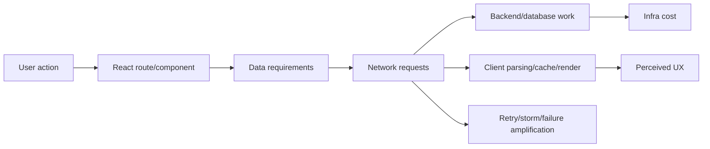
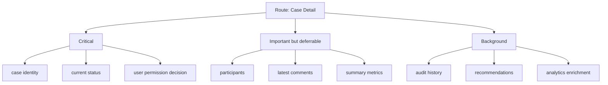
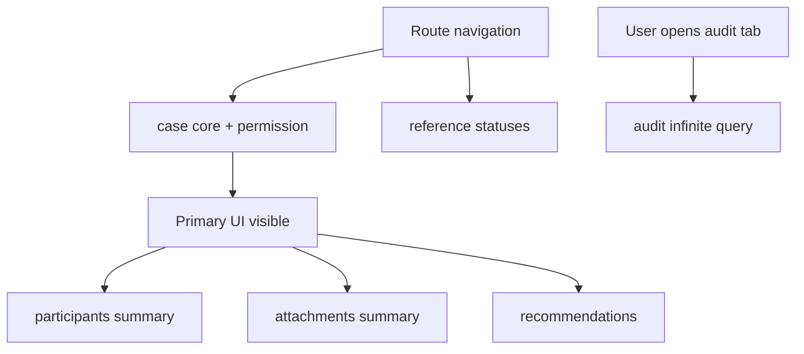

# Performance Budget for Networked React

React app yang network-heavy tidak gagal karena `fetch()` lambat saja. Ia gagal karena tidak punya **budget**.

Budget adalah kontrak engineering yang menjawab:

> Untuk satu user journey, berapa banyak network work yang boleh kita lakukan sebelum experience, cost, reliability, atau fairness sistem rusak?

Tanpa budget, semua feature kecil terlihat masuk akal:

- satu endpoint tambahan untuk badge count,
- satu lookup tambahan untuk display name,
- satu analytics call tambahan,
- satu refetch saat focus,
- satu retry otomatis,
- satu GraphQL fragment baru,
- satu prefetch “biar cepat”,
- satu websocket subscription “biar realtime”.

Secara lokal semuanya benar. Secara sistem, semuanya bisa menjadi waterfall, storm, overfetching, cache churn, dan tail latency.

Bagian ini membangun performance budget untuk React client-server communication sebagai **control system**, bukan sekadar daftar tips optimasi.

---

## 1. Core Mental Model

Remote data punya empat harga utama:

```txt
user-perceived latency
+ network bytes
+ backend work
+ client memory/CPU
+ operational risk
```

React engineer sering hanya melihat loading spinner. Production system melihat semua ini:



Performance budget adalah cara membatasi dan mengarahkan semua biaya itu.

---

## 2. Budget Bukan Hanya “Harus Cepat”

Kalimat seperti “page harus cepat” tidak bisa direview. Budget harus operasional.

Contoh budget yang bisa direview:

```txt
Case detail page:
- p75 interactive data ready <= 1200 ms on target network
- p95 <= 2500 ms
- initial route critical API requests <= 3
- total critical JSON payload <= 180 KB compressed
- no sequential user-blocking request deeper than 2 levels
- no automatic retry for non-idempotent mutation
- background refetch must not block primary content
- stale read allowed for summary cards up to 60 seconds
- PII payload excluded unless visible in current viewport
```

Budget yang baik punya sifat:

| Property | Meaning |
|---|---|
| measurable | bisa diukur di CI, RUM, logs, atau synthetic test |
| user-journey based | mengikuti flow nyata, bukan endpoint random |
| tiered | beda budget untuk initial load, interaction, background sync |
| explicit trade-off | tahu mana yang stale boleh, mana yang harus fresh |
| enforceable | ada review, alert, test, atau lint rule |

---

## 3. Jenis Budget dalam Networked React

### 3.1 Latency Budget

Latency budget menjawab: “berapa lama user boleh menunggu?”

Jangan hanya ukur total page load. Pecah menjadi milestones:

```txt
navigation start
→ shell visible
→ primary data visible
→ above-the-fold complete
→ interaction ready
→ background data complete
```

Contoh:

| Milestone | Budget | Notes |
|---|---:|---|
| route shell visible | 300 ms | skeleton/layout sudah muncul |
| primary entity loaded | 1000 ms | data inti terlihat |
| secondary panels loaded | 2000 ms | boleh lazy/progressive |
| background enrichment | 5000 ms | tidak boleh block interaction |

React consequence:

- data utama jangan tenggelam di bawah request sekunder,
- Suspense boundary harus mengikuti prioritas user,
- route loader harus memuat minimum viable data,
- query cache harus memisahkan critical vs non-critical query.

---

### 3.2 Request Count Budget

Request count budget menjawab: “berapa banyak round trip yang boleh terjadi?”

Masalahnya bukan request count absolut saja, tetapi **dependency depth**.

```mermaid
flowchart TD
  A[Route load] --> B[/api/cases/123]
  B --> C[/api/users/u1]
  C --> D[/api/orgs/o9]
  D --> E[/api/permissions?org=o9]
```

Empat request paralel bisa lebih murah daripada empat request serial.

Budget yang lebih akurat:

```txt
critical request depth <= 2
critical parallel request count <= 4
non-critical request count <= 8 after primary data visible
```

Smell:

```txt
component render → fetch entity → render child → fetch relation → render grandchild → fetch metadata
```

Ini bukan component composition. Ini hidden distributed transaction.

---

### 3.3 Payload Budget

Payload budget menjawab: “berapa byte dan berapa shape data yang boleh dikirim?”

Ukuran payload punya tiga biaya:

1. transfer time,
2. parse/decode time,
3. memory/cache/render pressure.

Contoh policy:

```txt
Initial route JSON compressed <= 180 KB
Single list page compressed <= 120 KB
Single item detail compressed <= 80 KB
No unbounded arrays in initial payload
No hidden PII fields outside visible UI need
```

Jangan hanya ukur compressed bytes. JSON besar bisa murah di network tetapi mahal di parsing dan rendering.

Bad response:

```json
{
  "cases": [
    {
      "id": "case_1",
      "title": "...",
      "attachments": [/* 500 items */],
      "auditTrail": [/* 2000 events */],
      "participants": [/* full profile */]
    }
  ]
}
```

Better shape:

```json
{
  "cases": [
    {
      "id": "case_1",
      "title": "...",
      "attachmentCount": 500,
      "latestAuditEvent": {
        "id": "evt_9",
        "type": "STATUS_CHANGED"
      }
    }
  ]
}
```

Payload budget is also privacy budget.

---

### 3.4 Cache Budget

Cache bukan gratis. Cache menyimpan:

- memory,
- stale risk,
- security exposure,
- invalidation complexity,
- persisted data risk.

Budget cache harus menjawab:

```txt
Which data may be cached?
For how long may it remain fresh?
For how long may it remain resident?
Is it scoped by user, tenant, role, locale, feature flag?
Can it survive logout?
Can it be persisted?
```

Example policy:

```ts
export const queryPolicy = {
  caseDetail: {
    staleTimeMs: 30_000,
    gcTimeMs: 10 * 60_000,
    persisted: false,
    scope: ['tenantId', 'userId', 'roleVersion'],
  },
  publicReferenceData: {
    staleTimeMs: 24 * 60 * 60_000,
    gcTimeMs: 7 * 24 * 60 * 60_000,
    persisted: true,
    scope: ['locale'],
  },
  piiProfile: {
    staleTimeMs: 0,
    gcTimeMs: 60_000,
    persisted: false,
    scope: ['tenantId', 'userId'],
  },
} as const;
```

---

### 3.5 Retry Budget

Retry memperbaiki transient failure, tetapi juga bisa memperburuk incident.

Retry budget menjawab:

```txt
How many extra requests may this client create when the system is degraded?
```

Bad:

```txt
1000 clients × 5 queries × 3 retries = 15000 extra requests
```

Better:

```txt
- Retry only idempotent reads by default
- No retry for 400/401/403/404/409/422
- Respect Retry-After for 429/503
- Exponential backoff with jitter
- Global retry budget per route/session
- Mutation retry requires idempotency key
```

Retry is not just an API client concern. It is a production traffic amplifier.

---

### 3.6 Prefetch Budget

Prefetch can reduce perceived latency. It can also waste bandwidth, leak intent, warm the wrong cache, and overload backend.

Budget prefetch by signal quality:

| Signal | Confidence | Example policy |
|---|---:|---|
| current route requires it | high | load now |
| next route from hover/focus | medium | prefetch small metadata |
| viewport link visible | medium-low | prefetch only static/code or cheap data |
| speculative ML guess | low | disable unless measured |

Rule:

> Never prefetch data that you cannot afford to throw away.

---

## 4. Critical vs Non-Critical Data

Tidak semua data punya prioritas sama.



Mapping to React:

| Data priority | Loading strategy |
|---|---|
| critical | route loader / RSC / blocking query |
| important | Suspense child boundary / parallel query |
| background | lazy query / idle prefetch / after-visible fetch |
| optional | user-triggered fetch |

Bad design:

```tsx
<CasePage>
  <CaseHeader />
  <AuditTrail />
  <RecommendationPanel />
  <AttachmentPreview />
</CasePage>
```

If all children fetch independently on mount, everything competes as if equally important.

Better:

```tsx
function CasePage() {
  const caseQuery = useCaseCriticalQuery();

  return (
    <CaseLayout>
      <CaseHeader case={caseQuery.data} />

      <Suspense fallback={<PanelSkeleton />}>
        <ImportantPanels caseId={caseQuery.data.id} />
      </Suspense>

      <DeferredBackgroundPanels caseId={caseQuery.data.id} />
    </CaseLayout>
  );
}
```

---

## 5. Building a Budget Document

For every major route, create a route budget.

```ts
export type RouteNetworkBudget = {
  routeId: string;
  userJourney: string;
  targetNetwork: 'fast-4g' | 'slow-4g' | 'enterprise-vpn' | 'mobile-3g';
  latency: {
    shellVisibleP75Ms: number;
    primaryDataP75Ms: number;
    interactiveP75Ms: number;
    primaryDataP95Ms: number;
  };
  requests: {
    criticalMaxCount: number;
    criticalMaxDepth: number;
    nonCriticalMaxCount: number;
  };
  payload: {
    criticalCompressedKb: number;
    totalInitialCompressedKb: number;
  };
  cache: {
    allowsPersistedServerState: boolean;
    maxFreshnessMsByDataClass: Record<string, number>;
  };
  retry: {
    maxAttemptsForReads: number;
    maxAttemptsForMutations: number;
  };
};
```

Example:

```ts
export const caseDetailBudget: RouteNetworkBudget = {
  routeId: 'case-detail',
  userJourney: 'Investigator opens case detail from work queue',
  targetNetwork: 'enterprise-vpn',
  latency: {
    shellVisibleP75Ms: 300,
    primaryDataP75Ms: 1200,
    interactiveP75Ms: 1500,
    primaryDataP95Ms: 2800,
  },
  requests: {
    criticalMaxCount: 3,
    criticalMaxDepth: 2,
    nonCriticalMaxCount: 8,
  },
  payload: {
    criticalCompressedKb: 180,
    totalInitialCompressedKb: 350,
  },
  cache: {
    allowsPersistedServerState: false,
    maxFreshnessMsByDataClass: {
      caseCore: 30_000,
      permissions: 0,
      referenceData: 86_400_000,
    },
  },
  retry: {
    maxAttemptsForReads: 2,
    maxAttemptsForMutations: 0,
  },
};
```

---

## 6. Measuring the Budget in the Browser

Use browser timing APIs to measure resource behavior.

Minimal collector:

```ts
export type ResourceTimingSummary = {
  name: string;
  initiatorType: string;
  transferSize: number;
  encodedBodySize: number;
  decodedBodySize: number;
  durationMs: number;
  ttfbMs: number;
};

export function getResourceTimings(): ResourceTimingSummary[] {
  return performance
    .getEntriesByType('resource')
    .filter((entry): entry is PerformanceResourceTiming =>
      entry instanceof PerformanceResourceTiming,
    )
    .map((entry) => ({
      name: entry.name,
      initiatorType: entry.initiatorType,
      transferSize: entry.transferSize,
      encodedBodySize: entry.encodedBodySize,
      decodedBodySize: entry.decodedBodySize,
      durationMs: entry.duration,
      ttfbMs: entry.responseStart - entry.requestStart,
    }));
}
```

Route-scoped measurement:

```ts
export function markRouteStart(routeId: string) {
  performance.mark(`${routeId}:start`);
}

export function markPrimaryDataReady(routeId: string) {
  performance.mark(`${routeId}:primary-data-ready`);
  performance.measure(
    `${routeId}:primary-data-latency`,
    `${routeId}:start`,
    `${routeId}:primary-data-ready`,
  );
}
```

Send only summarized telemetry. Do not send raw URLs containing PII.

```ts
function sanitizeResourceName(url: string): string {
  const parsed = new URL(url);
  return `${parsed.origin}${parsed.pathname.replace(/[a-zA-Z0-9_-]{16,}/g, ':id')}`;
}
```

---

## 7. Measuring Query-Level Performance

Network budget should connect to query keys and route ownership.

```ts
type QueryPerformanceEvent = {
  routeId: string;
  queryKeyHash: string;
  queryFamily: string;
  phase: 'start' | 'success' | 'error' | 'cancel';
  durationMs?: number;
  payloadKb?: number;
  cacheHit?: boolean;
  stale?: boolean;
};
```

Do not log full query keys if they contain IDs or PII. Log query family and route context.

Example wrapper:

```ts
export async function measuredQuery<T>(input: {
  routeId: string;
  queryFamily: string;
  run: () => Promise<T>;
}): Promise<T> {
  const startedAt = performance.now();

  try {
    const result = await input.run();

    emitQueryPerf({
      routeId: input.routeId,
      queryFamily: input.queryFamily,
      phase: 'success',
      durationMs: performance.now() - startedAt,
    });

    return result;
  } catch (error) {
    emitQueryPerf({
      routeId: input.routeId,
      queryFamily: input.queryFamily,
      phase: 'error',
      durationMs: performance.now() - startedAt,
    });

    throw error;
  }
}
```

---

## 8. Budget Enforcement in Code Review

Every PR that changes client-server communication should answer:

```txt
1. Does this add a new request to initial route load?
2. Is the request critical, important, background, or optional?
3. Can it run in parallel with existing requests?
4. Is the payload bounded?
5. Does it include hidden fields not used by current UI?
6. What is the staleTime/gcTime policy?
7. What happens on 401/403/404/409/422/429/5xx?
8. Is retry allowed?
9. Is cancellation wired?
10. Is telemetry redacted?
```

PR template:

```md
## Network Impact

- [ ] Adds no new initial critical request
- [ ] Adds request but within route budget
- [ ] Adds background-only request
- [ ] Adds mutation
- [ ] Adds prefetch

Route budget affected:

Measured locally:

Failure behavior:

Cache/invalidation behavior:
```

---

## 9. Budget Enforcement in Tests

A Playwright-style budget check can fail if route request behavior regresses.

```ts
test('case detail stays within critical network budget', async ({ page }) => {
  const apiRequests: string[] = [];

  page.on('request', (request) => {
    const url = new URL(request.url());
    if (url.pathname.startsWith('/api/')) {
      apiRequests.push(url.pathname);
    }
  });

  await page.goto('/cases/case_123');
  await page.getByRole('heading', { name: /case/i }).waitFor();

  const initialApiRequests = apiRequests.filter((path) =>
    ['/api/cases/case_123', '/api/me/permissions', '/api/reference/statuses'].includes(path),
  );

  expect(initialApiRequests.length).toBeLessThanOrEqual(3);
});
```

Payload budget test:

```ts
test('case detail payload remains bounded', async ({ page }) => {
  const responses: Array<{ url: string; size: number }> = [];

  page.on('response', async (response) => {
    const url = response.url();
    if (!new URL(url).pathname.startsWith('/api/')) return;

    const body = await response.body().catch(() => Buffer.alloc(0));
    responses.push({ url, size: body.length });
  });

  await page.goto('/cases/case_123');
  await page.getByText('Current Status').waitFor();

  const totalApiBytes = responses.reduce((sum, item) => sum + item.size, 0);
  expect(totalApiBytes).toBeLessThan(350 * 1024);
});
```

Use this carefully. Test environments may not represent compression and CDN behavior. Budget tests are guardrails, not absolute truth.

---

## 10. Budget Enforcement in Runtime

Runtime budget is useful for development warnings and production telemetry.

```ts
export function warnIfRouteBudgetExceeded(input: {
  routeId: string;
  requestCount: number;
  totalDecodedKb: number;
  primaryDataMs: number;
}) {
  if (process.env.NODE_ENV === 'production') return;

  const budget = routeBudgets[input.routeId];
  if (!budget) return;

  if (input.requestCount > budget.requests.criticalMaxCount) {
    console.warn(
      `[network-budget] ${input.routeId}: request count exceeded`,
      input,
    );
  }

  if (input.totalDecodedKb > budget.payload.totalInitialCompressedKb) {
    console.warn(
      `[network-budget] ${input.routeId}: payload budget exceeded`,
      input,
    );
  }

  if (input.primaryDataMs > budget.latency.primaryDataP75Ms) {
    console.warn(
      `[network-budget] ${input.routeId}: primary data latency exceeded`,
      input,
    );
  }
}
```

---

## 11. Common Performance Budget Smells

### Smell 1: “It is only one more request”

One more request might be cheap. One more **serial dependency** is not.

Ask:

```txt
Can the route render without it?
Can it be included in an existing aggregate response?
Can it be prefetched?
Can it be cached as reference data?
Can it load after the primary action is possible?
```

---

### Smell 2: “GraphQL solves overfetching”

GraphQL can reduce overfetching, but it can also hide expensive joins and make frontend fragments grow without route-level budget.

Budget still needs:

- operation complexity,
- response size,
- field-level authorization,
- fragment ownership,
- cache normalization pressure,
- persisted operation governance.

---

### Smell 3: “React Query dedupes it”

Deduplication prevents identical concurrent requests. It does not solve:

- wrong query keys,
- fragmented representations,
- large payloads,
- query waterfalls,
- over-invalidation,
- stale policy mistakes.

---

### Smell 4: “We can just prefetch”

Prefetching shifts latency earlier. It does not remove cost.

Bad prefetch:

```txt
hover over table row → prefetch full case detail including PII + audit history
```

Better prefetch:

```txt
hover over table row → prefetch small case summary or route code only
open row → fetch full authorized detail
```

---

### Smell 5: “The backend is fast locally”

Production latency includes:

- network RTT,
- TLS/session setup,
- CDN/proxy behavior,
- auth middleware,
- cold cache,
- database contention,
- user geography,
- browser connection limits,
- corporate VPN/proxy,
- mobile radio state.

Local endpoint latency is not user-perceived latency.

---

## 12. Route Budget Example: Regulatory Case Detail

```txt
Route: /cases/:caseId
Persona: investigator
Primary job: understand case status and take next action
```

### Data classes

| Data | Priority | Freshness | Strategy |
|---|---|---:|---|
| case core | critical | 30s | route loader/query |
| permission decision | critical | 0s | server-owned, no persisted cache |
| parties summary | important | 60s | parallel query |
| attachments summary | important | 60s | deferred query |
| full audit trail | optional/background | 15s | tab-triggered infinite query |
| recommendations | background | 5m | after-visible lazy query |

### Request plan



### Budget

```txt
Critical depth: 1
Critical requests: 2
Primary payload: <= 180 KB compressed
Primary data p75: <= 1200 ms
Audit history: not loaded until requested
Recommendations: never block case action
```

This design is not just faster. It is easier to reason about.

---

## 13. Performance Budget Decision Table

| Problem | Prefer | Avoid |
|---|---|---|
| critical data split across many endpoints | aggregate/BFF/route loader | component-level waterfall |
| slow secondary panel | defer/Suspense/lazy query | block whole route |
| repeated reference data | long staleTime/persisted cache if non-sensitive | refetch on every route |
| expensive detail hover | prefetch minimal summary | prefetch full PII detail |
| transient read failure | bounded retry + jitter | infinite retry loops |
| mutation unknown outcome | idempotency key + status lookup | blind retry POST |
| list item needs detail-only fields | redesign list projection | fetch detail per row |
| high-cardinality search | bounded cache/gc + debounce | cache every keystroke forever |

---

## 14. Production Metrics to Track

Track per route, not only global averages:

```txt
route.primary_data_latency.p50/p75/p95
route.api_request_count.initial
route.api_request_depth.critical
route.api_payload_kb.critical
route.query_cache_hit_rate
route.background_refetch_count
route.retry_attempt_count
route.prefetch_use_rate
route.prefetch_waste_rate
route.error_rate.by_status_family
route.abort_rate
route.duplicate_mutation_prevented_count
```

Important derived metric:

```txt
prefetch usefulness = prefetched resource used within N minutes / total prefetched resource
```

If prefetch usefulness is low, prefetch is waste.

---

## 15. Invariants

For top-tier React client-server engineering, keep these invariants:

1. Every route has a known critical data path.
2. Critical path request depth is visible and reviewed.
3. Every automatic request has a reason, owner, and budget.
4. Payloads are bounded and shaped for the current user task.
5. Cache freshness is domain policy, not library default.
6. Retry is bounded, classified, and idempotency-aware.
7. Prefetch is measured by usefulness, not intention.
8. PII is minimized before it reaches the browser.
9. Background work must not starve foreground interaction.
10. Performance regressions are detected before users report them.

---

## 16. Review Checklist

Before shipping a networked React route:

- [ ] Critical data is identified.
- [ ] Critical request depth is documented.
- [ ] Initial request count is within budget.
- [ ] Payload is bounded and compressed size is measured.
- [ ] Non-critical data is deferred.
- [ ] Query keys include correct scope.
- [ ] `staleTime` and `gcTime` are explicit.
- [ ] Retry policy is status-aware and idempotency-aware.
- [ ] Cancellation is wired for route changes/search.
- [ ] Prefetch has a measured usefulness hypothesis.
- [ ] Telemetry redacts URL/path/query IDs where needed.
- [ ] No hidden PII is fetched for invisible UI.
- [ ] Performance behavior is tested or observed in RUM.

---

## Sources

- MDN Web Docs, `PerformanceResourceTiming` and Resource Timing API.
- W3C, Resource Timing specification.
- web.dev, resource hints and performance learning material.
- MDN Web Docs, `rel="preload"` and `fetchpriority`.
- TanStack Query documentation, prefetching, caching, and server-state lifecycle.
