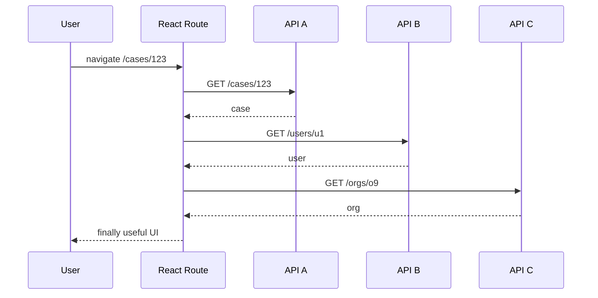
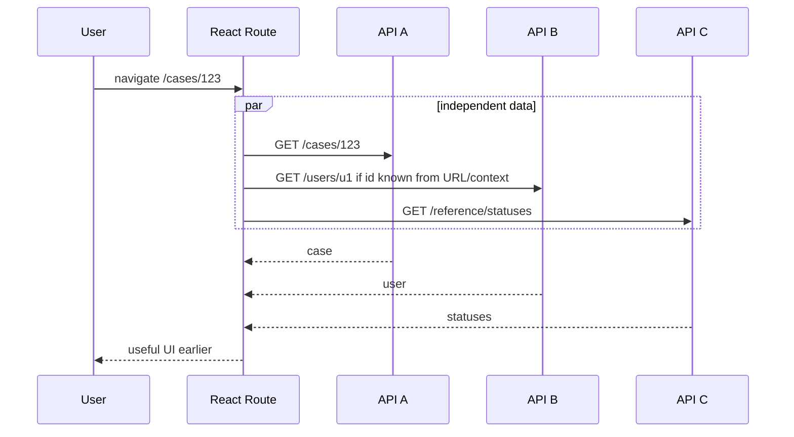
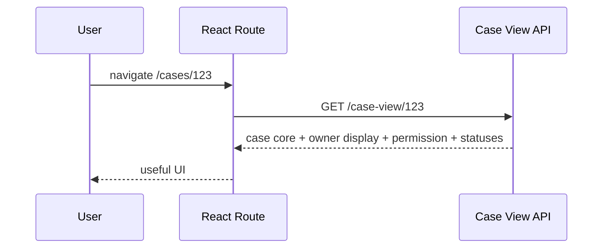
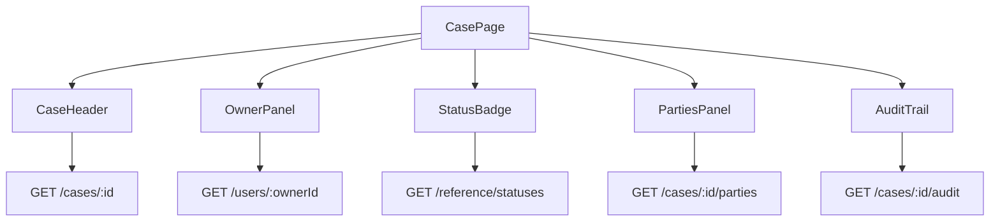
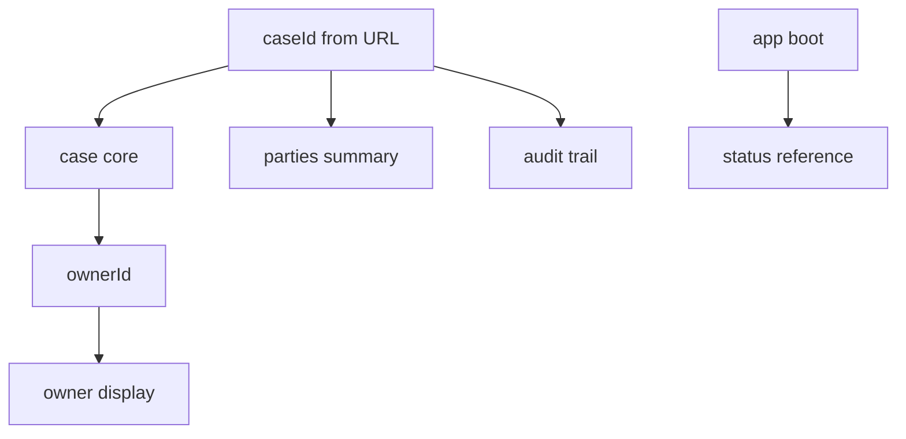

# Waterfall Elimination and Request Coalescing

Waterfall adalah bentuk paling umum dari latency waste di React client-server communication.

Biasanya tidak muncul sebagai satu bug besar. Ia muncul sebagai rangkaian keputusan kecil:

```txt
Parent fetches entity.
Child fetches related data.
Grandchild fetches display metadata.
Each component looks independent.
The user waits for all of them sequentially.
```

Request coalescing adalah kebalikannya:

> kumpulkan kebutuhan data yang secara semantik berdekatan, jadwalkan dengan benar, dan kurangi round trip tanpa membuat kontrak API menjadi terlalu gemuk.

Bagian ini membahas dua skill yang saling melengkapi:

1. **waterfall elimination** — menghapus dependency serial yang tidak perlu,
2. **request coalescing** — menggabungkan atau mengelompokkan request yang seharusnya dieksekusi sebagai unit.

---

## 1. Waterfall Mental Model

Waterfall terjadi ketika request berikutnya baru bisa dimulai setelah request sebelumnya selesai, padahal dependency itu sering tidak benar-benar diperlukan.



Total latency roughly becomes:

```txt
T_total = T_case + T_user + T_org + render gaps
```

Parallel version:



But the best version might not be parallel. It might be a different contract.



The goal is not “fewer requests at all costs.”

The goal is:

```txt
minimize user-blocking dependency depth
while preserving bounded payloads, ownership, cacheability, and security
```

---

## 2. Identify the Data Dependency Graph

Before optimizing, draw the graph.

Example route:

```txt
/cases/:caseId
```

Naive component graph:



Real dependency graph:



Now ask:

| Node | Does it block primary UI? | Can it run from URL? | Can it be cached? | Can it be aggregated? |
|---|---:|---:|---:|---:|
| case core | yes | yes | short | yes |
| permission | yes | yes | no/very short | yes |
| status reference | yes-ish | yes | long | maybe global |
| owner display | maybe | maybe no | medium | yes |
| parties | no | yes | short | maybe |
| audit | no | yes | short | no, paginate |

This table is where waterfall elimination starts.

---

## 3. Waterfall Sources in React Apps

### 3.1 Fetching in Child Components

```tsx
function CasePage({ caseId }: { caseId: string }) {
  const caseQuery = useCaseQuery(caseId);

  if (!caseQuery.data) return <Spinner />;

  return <OwnerPanel ownerId={caseQuery.data.ownerId} />;
}

function OwnerPanel({ ownerId }: { ownerId: string }) {
  const ownerQuery = useUserQuery(ownerId);
  return <span>{ownerQuery.data?.name}</span>;
}
```

This is sometimes valid. But if owner display is required for first paint, the route should know it.

Better:

```tsx
function CasePage({ caseId }: { caseId: string }) {
  const caseViewQuery = useCaseViewQuery(caseId);
  return <CaseView data={caseViewQuery.data} />;
}
```

---

### 3.2 `useEffect` Fetch after Render

```tsx
function Widget() {
  const [data, setData] = useState<Data | null>(null);

  useEffect(() => {
    fetch('/api/widget').then((r) => r.json()).then(setData);
  }, []);

  return data ? <WidgetView data={data} /> : <Spinner />;
}
```

This guarantees:

```txt
render empty → commit → effect runs → request starts
```

If the data was known at route time, this creates avoidable delay.

Prefer route loader, RSC, query prefetch, or parent-level orchestration for critical data.

---

### 3.3 Dependent Query Used as Default

```tsx
const caseQuery = useQuery({
  queryKey: ['case', caseId],
  queryFn: () => getCase(caseId),
});

const ownerQuery = useQuery({
  queryKey: ['user', caseQuery.data?.ownerId],
  queryFn: () => getUser(caseQuery.data!.ownerId),
  enabled: Boolean(caseQuery.data?.ownerId),
});
```

Dependent query is correct only when the second input is truly unknown.

If the backend can return owner display in case projection, or route can use an aggregate endpoint, dependent query becomes avoidable latency.

---

### 3.4 Authorization Waterfall

Bad:

```txt
GET /case/123
→ GET /permissions?resource=case_123
→ render allowed actions
```

Better for critical action visibility:

```json
{
  "case": {
    "id": "case_123",
    "status": "OPEN"
  },
  "permissions": {
    "canAssign": true,
    "canClose": false
  }
}
```

Permission is not decorative. It often controls safe UI behavior and should be part of the route view model.

---

### 3.5 Reference Data Waterfall

Bad:

```txt
Every screen fetches /reference/statuses after entity loads.
```

Better:

- long-lived query cache,
- boot-time reference data if small,
- route-level parallel fetch,
- static bundle if truly stable,
- CDN-cached endpoint if public/non-sensitive.

---

## 4. Waterfall Elimination Strategies

### Strategy A: Move Data Requirement Up

If multiple children require data to render the first meaningful screen, move data orchestration to the route boundary.

```tsx
function caseDetailQueries(caseId: string) {
  return {
    caseCore: queryOptions({
      queryKey: ['case', 'core', caseId],
      queryFn: () => api.getCaseCore(caseId),
    }),
    parties: queryOptions({
      queryKey: ['case', 'parties-summary', caseId],
      queryFn: () => api.getCasePartiesSummary(caseId),
    }),
    statuses: queryOptions({
      queryKey: ['reference', 'statuses'],
      queryFn: () => api.getStatuses(),
      staleTime: 24 * 60 * 60_000,
    }),
  };
}
```

Route orchestration:

```tsx
async function loadCaseDetail(queryClient: QueryClient, caseId: string) {
  const q = caseDetailQueries(caseId);

  await Promise.all([
    queryClient.ensureQueryData(q.caseCore),
    queryClient.ensureQueryData(q.statuses),
  ]);

  queryClient.prefetchQuery(q.parties);
}
```

---

### Strategy B: Use Parallel Queries Deliberately

```tsx
function CaseDetail({ caseId }: { caseId: string }) {
  const [caseQuery, statusesQuery, partiesQuery] = useQueries({
    queries: [
      {
        queryKey: ['case', 'core', caseId],
        queryFn: () => api.getCaseCore(caseId),
      },
      {
        queryKey: ['reference', 'statuses'],
        queryFn: () => api.getStatuses(),
        staleTime: 24 * 60 * 60_000,
      },
      {
        queryKey: ['case', 'parties-summary', caseId],
        queryFn: () => api.getPartiesSummary(caseId),
      },
    ],
  });

  return (
    <CaseDetailView
      caseResult={caseQuery}
      statusesResult={statusesQuery}
      partiesResult={partiesQuery}
    />
  );
}
```

Parallelization is not a substitute for product priority. Critical and background queries should still render differently.

---

### Strategy C: Aggregate at BFF/View API

Use aggregation when the UI needs a cohesive view model and individual resource endpoints create unavoidable fan-out.

```http
GET /api/case-detail-view/case_123
```

Response:

```json
{
  "case": {
    "id": "case_123",
    "title": "Suspicious activity review",
    "status": "OPEN"
  },
  "owner": {
    "id": "user_7",
    "displayName": "Maya S."
  },
  "permissions": {
    "canAssign": true,
    "canClose": false
  },
  "partiesSummary": {
    "count": 4,
    "topParties": [
      { "id": "party_1", "displayName": "Acme Ltd" }
    ]
  }
}
```

Use BFF aggregation when:

- data is route-specific,
- permission decisions are needed at first paint,
- backend can batch internal calls efficiently,
- client would otherwise create N+1 requests,
- payload remains bounded.

Avoid aggregation when:

- response becomes unbounded,
- endpoint mixes unrelated lifecycle ownership,
- cacheability becomes worse for all included data,
- every consumer needs different shape and contract churn explodes.

---

### Strategy D: Split Critical and Deferred Projections

Bad aggregation:

```http
GET /api/case-detail-view/case_123
```

returns everything: case, parties, full audit, comments, attachments, recommendations, history.

Better:

```http
GET /api/case-detail-primary/case_123
GET /api/case-detail-secondary/case_123
GET /api/cases/case_123/audit?cursor=...
```

Primary endpoint should answer:

> What is the minimum data needed for the user to understand and act?

---

### Strategy E: Prefetch Before Navigation

```tsx
function CaseLink({ caseId, children }: { caseId: string; children: React.ReactNode }) {
  const queryClient = useQueryClient();

  return (
    <Link
      to={`/cases/${caseId}`}
      onMouseEnter={() => {
        queryClient.prefetchQuery({
          queryKey: ['case', 'primary', caseId],
          queryFn: () => api.getCasePrimary(caseId),
          staleTime: 30_000,
        });
      }}
      onFocus={() => {
        queryClient.prefetchQuery({
          queryKey: ['case', 'primary', caseId],
          queryFn: () => api.getCasePrimary(caseId),
          staleTime: 30_000,
        });
      }}
    >
      {children}
    </Link>
  );
}
```

Do not prefetch full sensitive detail from weak signals. Prefetch should follow budget and privacy policy.

---

### Strategy F: Use Resource Hints for Non-Data Dependencies

Data request waterfall is often mixed with asset waterfall:

```txt
HTML → JS → route chunk → CSS → font → API → image
```

Use hints carefully:

```html
<link rel="preconnect" href="https://api.example.com" />
<link rel="preload" href="/fonts/inter.woff2" as="font" type="font/woff2" crossorigin />
```

Resource hints are scheduling hints, not correctness mechanisms.

---

## 5. Request Coalescing

Request coalescing means many logical needs share fewer physical requests.

There are multiple kinds.

| Kind | Example |
|---|---|
| in-flight dedupe | two components ask for same query at same time |
| batching | many IDs fetched in one request |
| aggregation | one route view endpoint returns cohesive projection |
| server-side fan-in | BFF calls many services internally |
| GraphQL operation | selected fields in one operation |
| persisted query | operation identity instead of full query text |
| websocket subscription multiplexing | many subscriptions over one connection |

---

## 6. In-Flight Dedupe vs Coalescing

Dedupe:

```txt
GET /api/users/u1
GET /api/users/u1
→ share one promise
```

Batching/coalescing:

```txt
GET /api/users/u1
GET /api/users/u2
GET /api/users/u3
→ GET /api/users?ids=u1,u2,u3
```

Aggregation:

```txt
GET /case/123
GET /users/u1
GET /permissions/case_123
→ GET /case-detail-view/123
```

They solve different problems.

---

## 7. Client-Side Micro-Batching by ID

Sometimes the UI legitimately discovers IDs from multiple components in a short window.

Example: user display names in a virtualized table.

A small batch loader can coalesce them.

```ts
type BatchResult<K extends string, V> = Map<K, V>;

type BatchFetch<K extends string, V> = (keys: K[]) => Promise<BatchResult<K, V>>;

export function createMicroBatcher<K extends string, V>(input: {
  delayMs: number;
  maxBatchSize: number;
  fetchBatch: BatchFetch<K, V>;
}) {
  let queue = new Map<K, Array<{ resolve: (value: V) => void; reject: (error: unknown) => void }>>();
  let timer: ReturnType<typeof setTimeout> | undefined;

  async function flush() {
    const current = queue;
    queue = new Map();
    timer = undefined;

    const keys = [...current.keys()].slice(0, input.maxBatchSize);

    try {
      const result = await input.fetchBatch(keys);

      for (const key of keys) {
        const waiters = current.get(key) ?? [];
        const value = result.get(key);

        if (value === undefined) {
          waiters.forEach((w) => w.reject(new Error(`Missing batch value for ${key}`)));
        } else {
          waiters.forEach((w) => w.resolve(value));
        }
      }
    } catch (error) {
      for (const waiters of current.values()) {
        waiters.forEach((w) => w.reject(error));
      }
    }
  }

  return function load(key: K): Promise<V> {
    return new Promise((resolve, reject) => {
      const waiters = queue.get(key) ?? [];
      waiters.push({ resolve, reject });
      queue.set(key, waiters);

      if (!timer) {
        timer = setTimeout(flush, input.delayMs);
      }
    });
  };
}
```

Usage:

```ts
const loadUsersById = createMicroBatcher<string, UserSummary>({
  delayMs: 5,
  maxBatchSize: 50,
  fetchBatch: async (ids) => {
    const users = await api.getUsersByIds(ids);
    return new Map(users.map((user) => [user.id, user]));
  },
});
```

This is useful but dangerous. It adds hidden scheduling.

Use it only when:

- batching endpoint exists,
- ordering does not matter,
- partial misses are handled,
- errors are mapped per key when possible,
- observability records batch size and wait time,
- max batch size is bounded.

---

## 8. Batch Endpoint Contract

Bad batch endpoint:

```http
GET /api/users?ids=u1,u2,u3
```

with response:

```json
[
  { "id": "u1", "name": "A" },
  { "id": "u3", "name": "C" }
]
```

Problem: missing `u2` is ambiguous.

Better:

```json
{
  "results": {
    "u1": { "id": "u1", "displayName": "A" },
    "u3": { "id": "u3", "displayName": "C" }
  },
  "errors": {
    "u2": {
      "code": "NOT_FOUND",
      "message": "User not found"
    }
  }
}
```

Batch contract must define:

| Concern | Required decision |
|---|---|
| max size | reject or split above limit |
| ordering | map by ID instead of relying on array order |
| partial failure | per-key error map |
| authz | invisible vs forbidden semantics |
| caching | cache individual entities or whole batch? |
| observability | batch size, hit/miss, per-key failure |

---

## 9. Coalescing with TanStack Query

Query cache already dedupes identical query keys. For batching multiple IDs, design query keys carefully.

Option 1: batch query as one representation.

```ts
function useUsersByIds(ids: string[]) {
  const sortedIds = [...new Set(ids)].sort();

  return useQuery({
    queryKey: ['users', 'by-ids', sortedIds],
    queryFn: () => api.getUsersByIds(sortedIds),
    enabled: sortedIds.length > 0,
  });
}
```

Pros:

- simple,
- one request,
- fits route-level table.

Cons:

- cache fragmentation for different ID sets,
- invalidating one user is harder,
- large ID arrays create high-cardinality keys.

Option 2: normalized entity cache outside Query.

```ts
const userStore = new Map<string, UserSummary>();
```

Pros:

- individual entity reuse,
- better for repeated display names.

Cons:

- you now own invalidation and memory lifecycle.

Option 3: route aggregate projection.

```http
GET /api/case-list-view?queue=open
```

returns row data already shaped for the table.

Pros:

- best for bounded screens,
- avoids frontend N+1,
- backend can enforce authz consistently.

Cons:

- less reusable,
- needs contract discipline.

---

## 10. Coalescing Mutation Side Effects

Reads are not the only source of request explosion.

Bad:

```txt
User selects 100 rows
Client sends 100 PATCH requests
Each invalidates the same list query
```

Better:

```http
POST /api/cases/bulk-assign
```

Request:

```json
{
  "idempotencyKey": "cmd_01J...",
  "caseIds": ["case_1", "case_2", "case_3"],
  "assigneeId": "user_9"
}
```

Response:

```json
{
  "commandId": "cmd_01J...",
  "summary": {
    "succeeded": 98,
    "failed": 2
  },
  "results": {
    "case_1": { "status": "ASSIGNED" },
    "case_2": { "status": "ASSIGNED" }
  },
  "errors": {
    "case_77": { "code": "CONFLICT", "message": "Case already closed" },
    "case_88": { "code": "FORBIDDEN", "message": "No permission" }
  }
}
```

Bulk mutation must include partial result semantics.

---

## 11. Avoiding Refetch Storm After Coalesced Mutation

Bad:

```ts
onSuccess: () => {
  selectedIds.forEach((id) => {
    queryClient.invalidateQueries({ queryKey: ['case', id] });
  });
  queryClient.invalidateQueries({ queryKey: ['case-list'] });
  queryClient.invalidateQueries({ queryKey: ['dashboard'] });
}
```

Better: impact matrix.

```ts
type MutationImpact = {
  patchCaseIds: string[];
  invalidateFamilies: Array<'case-list' | 'dashboard'>;
};

function applyBulkAssignImpact(queryClient: QueryClient, impact: MutationImpact) {
  for (const caseId of impact.patchCaseIds) {
    queryClient.setQueriesData(
      { queryKey: ['case', 'detail', caseId] },
      (old: CaseDetail | undefined) =>
        old ? { ...old, assigneeChanged: true } : old,
    );
  }

  queryClient.invalidateQueries({ queryKey: ['case-list'] });
  queryClient.invalidateQueries({ queryKey: ['dashboard'] });
}
```

The goal is not zero invalidation. The goal is controlled invalidation.

---

## 12. Route-Level Coalescing vs Component Reuse

A common objection:

> “If we make route-specific view endpoints, components become less reusable.”

Better framing:

```txt
Components should be reusable at presentation boundary.
Data orchestration should be route-specific when the user journey is route-specific.
```

Presentation component:

```tsx
function CaseHeader({ view }: { view: CaseHeaderView }) {
  return (
    <header>
      <h1>{view.title}</h1>
      <StatusBadge status={view.status} />
      <span>{view.ownerDisplayName}</span>
    </header>
  );
}
```

Route adapter:

```ts
function toCaseHeaderView(data: CaseDetailPrimary): CaseHeaderView {
  return {
    title: data.case.title,
    status: data.case.status,
    ownerDisplayName: data.owner.displayName,
  };
}
```

Do not make every component a data client just to preserve theoretical reuse.

---

## 13. Coalescing Decision Framework

Use this table before changing API shape.

| Situation | Preferred strategy |
|---|---|
| same exact query requested multiple times | query cache/in-flight dedupe |
| many known IDs needed together | batch endpoint |
| route needs cohesive view model | BFF/view API aggregation |
| user may navigate soon | budgeted prefetch |
| heavy secondary data | deferred query/Suspense boundary |
| infinite relation | paginated endpoint, not aggregate blob |
| stable reference data | long-lived cache/CDN |
| mutation across many items | bulk command endpoint |
| realtime update affects many queries | event impact map + targeted invalidation |

---

## 14. Observability for Waterfall and Coalescing

Track:

```txt
route.request_depth.critical
route.request_count.initial
route.query_start_offset_ms
route.query_duration_ms
route.batch_size
route.batch_wait_ms
route.batch_partial_failure_count
route.aggregate_payload_kb
route.prefetch_hit_rate
route.waterfall_detected_count
```

Waterfall detection idea:

```ts
type QuerySpan = {
  queryFamily: string;
  startedAt: number;
  endedAt: number;
};

export function findLikelyWaterfalls(spans: QuerySpan[]) {
  const sorted = [...spans].sort((a, b) => a.startedAt - b.startedAt);
  const waterfalls: Array<{ previous: QuerySpan; next: QuerySpan; gapMs: number }> = [];

  for (let i = 1; i < sorted.length; i++) {
    const previous = sorted[i - 1];
    const next = sorted[i];
    const gapMs = next.startedAt - previous.endedAt;

    if (gapMs >= 0 && gapMs < 50) {
      waterfalls.push({ previous, next, gapMs });
    }
  }

  return waterfalls;
}
```

This is heuristic. Use it to highlight suspicious patterns, not to make final judgments.

---

## 15. Testing Waterfall Elimination

Test that critical requests start together.

```ts
test('case detail starts critical requests without waterfall', async ({ page }) => {
  const starts: Array<{ path: string; time: number }> = [];

  page.on('request', (request) => {
    const url = new URL(request.url());
    if (url.pathname.startsWith('/api/')) {
      starts.push({ path: url.pathname, time: Date.now() });
    }
  });

  await page.goto('/cases/case_123');
  await page.getByRole('heading', { name: /case/i }).waitFor();

  const critical = starts.filter((item) =>
    ['/api/case-detail-primary/case_123', '/api/reference/statuses'].includes(item.path),
  );

  const maxStart = Math.max(...critical.map((item) => item.time));
  const minStart = Math.min(...critical.map((item) => item.time));

  expect(maxStart - minStart).toBeLessThan(100);
});
```

Test batch contract partial failures:

```ts
test('user batch endpoint returns per-key errors', async ({ request }) => {
  const response = await request.post('/api/users/batch', {
    data: { ids: ['user_1', 'missing_user'] },
  });

  expect(response.ok()).toBeTruthy();

  const body = await response.json();
  expect(body.results.user_1).toBeDefined();
  expect(body.errors.missing_user.code).toBe('NOT_FOUND');
});
```

---

## 16. Failure Modes

### 16.1 Over-Coalescing

One endpoint returns everything.

Symptoms:

- huge payload,
- low cacheability,
- unrelated data invalidates together,
- slowest subdependency delays all data,
- authorization becomes harder to reason about.

Fix:

- split primary and secondary projection,
- paginate unbounded relations,
- use partial rendering,
- keep high-volatility data separate.

---

### 16.2 Batch Endpoint as Hidden N+1

Client sends one batch request, but backend loops one database query per ID.

From frontend, it looks optimized. From system view, it is worse.

Require backend observability:

```txt
batch_size
backend_subquery_count
db_query_count
cache_hit_rate
partial_failure_count
```

---

### 16.3 Cache Fragmentation by ID Set

```ts
['users', 'by-ids', ['u1', 'u2']]
['users', 'by-ids', ['u2', 'u1']]
['users', 'by-ids', ['u1', 'u2', 'u3']]
```

Normalize IDs:

```ts
function stableIds(ids: string[]) {
  return [...new Set(ids)].sort();
}
```

But stable ID arrays still fragment across different sets. For high reuse, prefer entity cache or route projection.

---

### 16.4 Coalescing Breaks Authorization Semantics

Batch request:

```http
POST /api/cases/batch
```

with mixed accessible and inaccessible IDs.

Do not leak which IDs exist if caller lacks permission. Define response semantics carefully:

```json
{
  "results": {
    "case_1": { "id": "case_1", "title": "Allowed" }
  },
  "errors": {
    "case_2": { "code": "NOT_FOUND_OR_FORBIDDEN" }
  }
}
```

This may be preferable in sensitive systems.

---

### 16.5 Prefetch Creates Backend Load Spike

Hovering over a dense table can trigger hundreds of prefetches.

Guardrails:

```ts
const prefetchLimiter = createLimiter({ concurrency: 2 });

function prefetchCase(caseId: string) {
  return prefetchLimiter.run(() =>
    queryClient.prefetchQuery({
      queryKey: ['case', 'primary', caseId],
      queryFn: () => api.getCasePrimary(caseId),
      staleTime: 30_000,
    }),
  );
}
```

Also add dedupe and minimum hover delay.

---

## 17. Practical Refactoring Sequence

When you inherit a waterfall-heavy app, do not rewrite everything.

Follow this sequence:

```txt
1. Capture route waterfall in DevTools/RUM.
2. Identify critical path and request depth.
3. Classify data: critical, important, background, optional.
4. Move critical orchestration to route boundary.
5. Parallelize independent reads.
6. Add long-lived cache for stable reference data.
7. Replace frontend N+1 with batch endpoint.
8. Replace route fan-out with bounded view endpoint.
9. Defer/paginate heavy secondary data.
10. Add observability and regression tests.
```

---

## 18. Design Invariants

Keep these invariants:

1. Component hierarchy is not the same as data dependency hierarchy.
2. Critical route data should be discoverable before render when possible.
3. A request that can run from URL/context should not wait for component mount.
4. Dependent query is for true dependency, not convenience.
5. Batching must define partial failure semantics.
6. Aggregation must preserve bounded payloads.
7. Coalescing must not blur authorization boundaries.
8. Prefetch must have a budget and usefulness measurement.
9. Bulk mutation must have idempotency and per-item result semantics.
10. Waterfall regressions should be observable and testable.

---

## 19. Review Checklist

Before approving a data-loading change:

- [ ] Is this request on the critical path?
- [ ] Does it start as early as it can?
- [ ] Is the dependency serial because of true data dependency or component structure?
- [ ] Can this data come from route loader/RSC/BFF projection?
- [ ] Can stable data be cached longer?
- [ ] Can repeated entity lookups be batched?
- [ ] Does the batch endpoint handle partial failure?
- [ ] Does coalescing preserve authorization semantics?
- [ ] Is payload still bounded?
- [ ] Is cache invalidation still targeted?
- [ ] Is prefetch controlled by signal quality and budget?
- [ ] Are request depth and batch size observable?

---

## Sources

- TanStack Query documentation, parallel queries, dependent queries, prefetching, and query invalidation.
- React Router documentation, route loaders/actions/fetchers and data loading.
- MDN Web Docs, resource hints, preload, preconnect, fetch priority, and PerformanceResourceTiming.
- web.dev, resource hints and network performance guidance.
