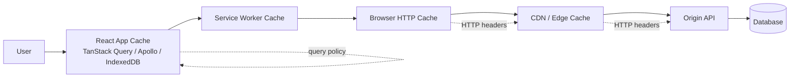
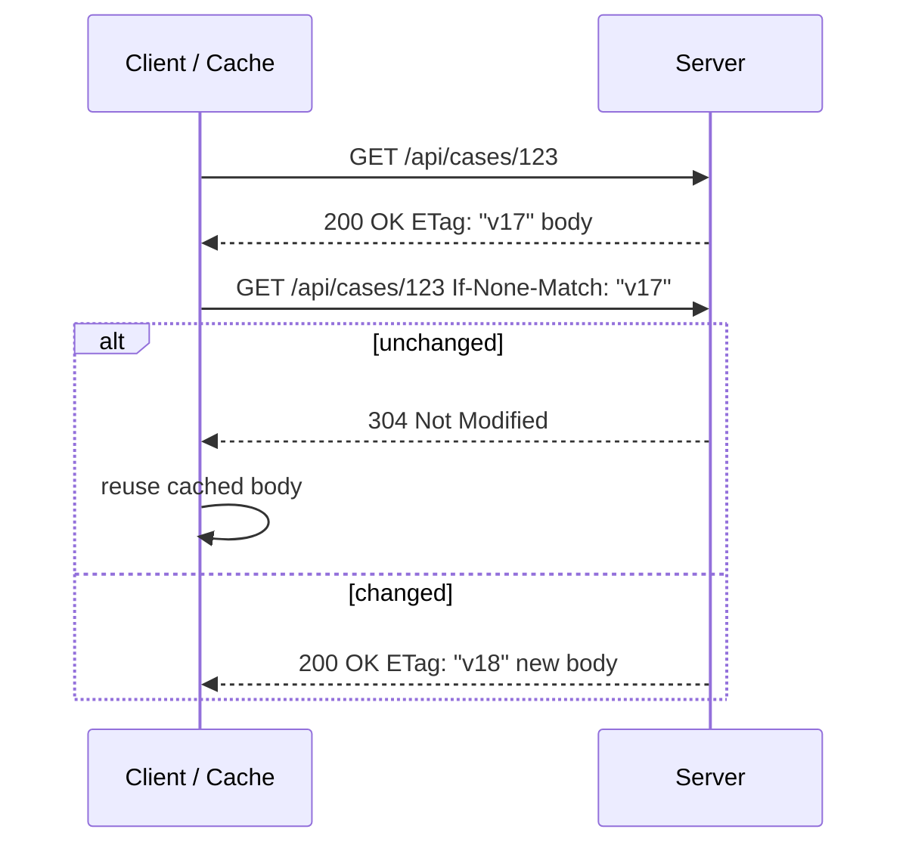
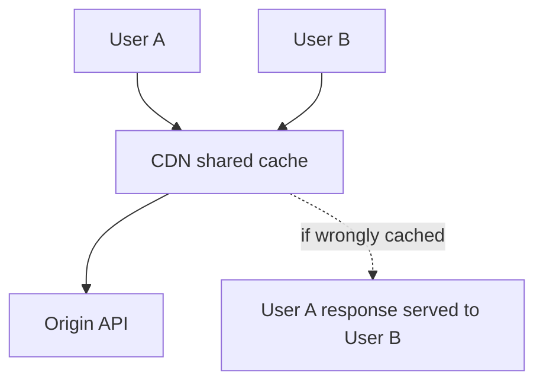
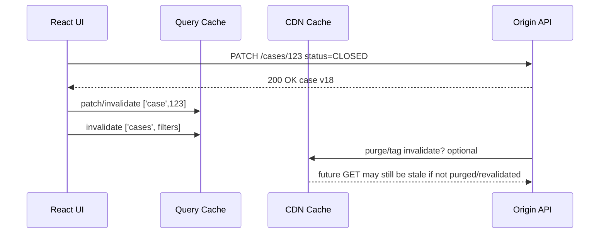

# HTTP Cache, CDN Cache, and App Cache

Caching adalah optimization yang mudah terlihat sederhana tetapi sulit dibuat benar.

Di React application, cache bukan satu benda. Minimal ada tiga layer yang harus dibedakan:

1. **HTTP cache** — cache yang mengikuti aturan protokol HTTP di browser/proxy/CDN.
2. **CDN cache** — shared cache dekat user, biasanya berada di edge dan dipakai lintas user.
3. **Application cache** — cache yang dikendalikan aplikasi, misalnya TanStack Query cache, Apollo cache, Zustand persisted state, IndexedDB, atau Service Worker Cache API.

Kesalahan paling mahal terjadi ketika tiga layer ini disamakan.

```txt
"Data sudah ada di cache" bukan jawaban yang cukup.
Pertanyaan yang benar:
- cache layer mana?
- key-nya apa?
- siapa boleh membaca?
- kapan dianggap fresh?
- siapa yang menginvalidasi?
- apa yang terjadi ketika user/tenant/permission berubah?
```

Part ini membahas cache sebagai bagian dari contract client-server, bukan hanya performance trick.

---

## 1. Cache Layer Map



Setiap layer punya aturan berbeda.

| Layer | Scope | Key | Freshness source | Good for | Dangerous for |
|---|---|---|---|---|---|
| Browser HTTP cache | per browser/profile | URL + method + selected headers | HTTP headers | static assets, public GET, conditional requests | tenant-sensitive responses jika header salah |
| CDN cache | shared, edge/global | URL + method + selected headers + CDN rules | HTTP headers + CDN config | public content, assets, anonymous catalog | personalized data, authz-sensitive responses |
| Service Worker Cache | origin + browser profile | developer-defined request keys | app code | offline shell, static resources, custom strategy | stale private data, auth switch leak |
| React Query cache | JS runtime/session unless persisted | query key | app policy | server-state replica, optimistic UI | source-of-truth confusion |
| Apollo/Relay cache | JS runtime/session unless persisted | normalized entity identity | GraphQL policy | entity graph consistency | field policy bugs, auth bleed |
| IndexedDB cache/outbox | browser profile durable | developer-defined | app policy | offline queue, large objects, drafts | PII retention, tenant bleed |

Invariant utama:

> HTTP cache menjawab pertanyaan “bolehkah representation ini dipakai ulang menurut protokol?”  
> App cache menjawab pertanyaan “bolehkah UI memakai replica ini menurut product semantics?”

Keduanya saling melengkapi, tetapi tidak saling menggantikan.

---

## 2. HTTP Cache Is Representation Cache

HTTP cache menyimpan **response representation**, bukan domain object.

```txt
GET /api/cases/123?include=summary
Accept: application/json
Authorization: Bearer ...

HTTP/1.1 200 OK
Cache-Control: private, no-cache
ETag: "case-123-v17"
Vary: Authorization, Accept
Content-Type: application/json

{"id":"123","status":"OPEN","version":17}
```

Response ini bukan “case object” dalam arti domain. Ia adalah representation untuk request tertentu.

Representation identity dipengaruhi oleh:

- URL,
- method,
- selected request headers,
- content negotiation,
- auth/tenant context,
- API version,
- projection/filter/sort/pagination,
- response headers such as `Vary`.

Karena itu, dua request berikut tidak otomatis cache-equivalent:

```txt
GET /api/cases/123
GET /api/cases/123?include=timeline
```

Atau:

```txt
GET /api/cases/123
Accept-Language: en

GET /api/cases/123
Accept-Language: id
```

Jika response berbeda berdasarkan header, server harus menyatakan dimensi variasinya lewat `Vary`.

---

## 3. `Cache-Control` as Contract

`Cache-Control` bukan dekorasi. Ia adalah contract antara origin, browser, proxy, dan CDN.

### 3.1 Static asset policy

Untuk hashed assets:

```http
Cache-Control: public, max-age=31536000, immutable
```

Cocok untuk:

```txt
/assets/app.8d91a31f.js
/assets/vendor.a771b2c4.css
/assets/logo.6c981.svg
```

Karena filename berubah ketika content berubah.

Jangan gunakan policy ini untuk URL tanpa fingerprint:

```txt
/app.js
/style.css
```

Jika content berubah tetapi URL tetap, browser bisa tetap memakai asset lama.

### 3.2 HTML shell policy

Untuk SSR/SPA HTML shell:

```http
Cache-Control: no-cache
```

Maknanya bukan “jangan cache sama sekali”. Maknanya: cache boleh menyimpan, tetapi harus revalidate sebelum reuse.

Untuk HTML yang sangat sensitif:

```http
Cache-Control: no-store
```

`no-store` mencegah cache menyimpan response. Ini cocok untuk halaman yang mengandung data sangat sensitif, tetapi terlalu agresif untuk semua halaman karena mengurangi performa dan bfcache/HTTP cache benefit.

### 3.3 User-specific API response

Untuk data authenticated user:

```http
Cache-Control: private, no-cache
ETag: "profile-v42"
Vary: Authorization
```

`private` berarti response hanya boleh disimpan oleh private cache, misalnya browser cache, bukan shared CDN cache.

`no-cache` berarti harus revalidate sebelum reuse.

### 3.4 Public API response

Untuk public catalog data:

```http
Cache-Control: public, max-age=60, stale-while-revalidate=300
ETag: "catalog-page-1-v183"
```

Ini menyatakan:

- response fresh selama 60 detik,
- cache boleh melayani stale response sambil revalidate hingga 300 detik,
- ETag dapat dipakai untuk conditional request.

---

## 4. `ETag`, `Last-Modified`, and Conditional Requests

Conditional request mengubah cache dari “reuse blind” menjadi “validate cheaply”.



`304 Not Modified` avoids transferring the body, but the request still happens. This is good when data may change but payload is large or freshness matters.

React client implication:

```ts
async function getCase(id: string) {
  // Browser/CDN may perform conditional request automatically
  // if HTTP cache has validators and request cache mode allows it.
  const response = await fetch(`/api/cases/${id}`);
  return response.json();
}
```

You do not usually implement ETag storage manually for normal browser HTTP cache. You implement it manually only when your app cache wants explicit conditional behavior, for example:

```ts
type Cached<T> = {
  etag: string;
  data: T;
};

async function getWithManualEtag<T>(url: string, cached?: Cached<T>): Promise<Cached<T>> {
  const response = await fetch(url, {
    headers: cached?.etag ? { 'If-None-Match': cached.etag } : {},
  });

  if (response.status === 304) {
    if (!cached) throw new Error('304 without cached body');
    return cached;
  }

  if (!response.ok) throw new Error(`HTTP ${response.status}`);

  return {
    etag: response.headers.get('ETag') ?? '',
    data: await response.json() as T,
  };
}
```

Manual ETag handling must be deliberate because it duplicates part of browser cache semantics in app code.

---

## 5. `Vary`: The Header That Prevents Cache Leaks

`Vary` says which request headers affect the selected response.

Example:

```http
Vary: Accept-Encoding, Accept-Language
```

If response differs by authentication token, tenant header, role context, or feature flag header, shared caches must not reuse one user's representation for another.

For authenticated responses, a conservative baseline is:

```http
Cache-Control: private, no-cache
Vary: Authorization
```

For CDN-cached API with explicit tenant dimension:

```http
Cache-Control: public, max-age=30
Vary: X-Tenant-Region, Accept-Encoding
```

But do not casually vary on high-cardinality headers at CDN level. It can destroy hit ratio.

```txt
Vary: User-Agent
```

Often creates massive cache fragmentation.

Better:

- vary only on dimensions that truly change representation,
- normalize values at the edge,
- encode stable dimensions into URL when appropriate,
- keep personalized data out of shared cache.

---

## 6. CDN Cache Is Shared Infrastructure, Not Browser Cache

A CDN cache can serve many users. That makes it powerful and dangerous.



Rule:

> A response that depends on user identity, permission, tenant membership, or private entitlement must not be stored in shared cache unless the cache key fully and safely includes those dimensions.

Most teams should start with:

```http
Cache-Control: private, no-store
```

for highly sensitive user data, or:

```http
Cache-Control: private, no-cache
```

for user-specific data that can be stored only by browser cache and must be revalidated.

For public content:

```http
Cache-Control: public, max-age=300, stale-while-revalidate=3600
```

CDN is excellent for:

- hashed static assets,
- product catalog readable by anyone,
- documentation/content pages,
- anonymous search facets,
- public configuration,
- feature manifests that are not user-secret.

CDN is risky for:

- case management dashboards,
- inbox counts,
- permission-filtered resources,
- user profile,
- tenant-specific documents,
- audit logs,
- regulatory enforcement details.

---

## 7. App Cache Is Semantic Cache

React app cache knows domain semantics that HTTP cache cannot know.

Example: TanStack Query cache.

```ts
const caseQuery = queryOptions({
  queryKey: ['tenant', tenantId, 'case', caseId],
  queryFn: ({ signal }) => api.cases.get(caseId, { signal }),
  staleTime: 30_000,
});
```

The query cache decision includes:

- tenant scope,
- route context,
- user intent,
- product freshness tolerance,
- invalidation after mutation,
- optimistic update,
- permission changes,
- offline behavior.

HTTP cache cannot infer those.

### App cache does not replace HTTP cache

Good setup:

```txt
HTTP cache:
  avoid unnecessary transfer and support revalidation

React Query cache:
  avoid unnecessary UI loading and coordinate server-state lifecycle

CDN cache:
  reduce origin load and latency for safe shared representations
```

These layers can cooperate:

```ts
const result = await queryClient.fetchQuery({
  queryKey: ['catalog', 'page', page],
  queryFn: () => fetch(`/api/catalog?page=${page}`).then(r => r.json()),
  staleTime: 60_000,
});
```

Even if React Query refetches after `staleTime`, the browser/CDN may answer with `304 Not Modified` or a cached response, reducing payload and origin cost.

---

## 8. Cache Policy by Resource Type

### 8.1 Static build assets

```http
Cache-Control: public, max-age=31536000, immutable
```

Requirements:

- content-hashed filenames,
- immutable deployment artifact,
- old assets remain available during rollout,
- HTML references correct asset manifest.

Failure mode:

```txt
new HTML references new JS
CDN still serves old JS chunk graph
runtime chunk load fails
```

Mitigation:

- keep older assets for a grace period,
- avoid deleting previous deployment chunks immediately,
- cache HTML differently from assets.

### 8.2 HTML document

```http
Cache-Control: no-cache
```

For sensitive app shell:

```http
Cache-Control: no-store
```

But do not use `no-store` reflexively everywhere. It can hurt navigation performance and back/forward behavior.

### 8.3 Public read model

```http
Cache-Control: public, max-age=60, stale-while-revalidate=300
ETag: "public-report-v912"
```

App cache:

```ts
staleTime: 60_000
```

### 8.4 Authenticated read model

```http
Cache-Control: private, no-cache
ETag: "case-123-v17"
Vary: Authorization
```

App cache key:

```ts
['tenant', tenantId, 'user', userId, 'case', caseId]
```

### 8.5 Highly sensitive data

```http
Cache-Control: no-store
```

App behavior:

- do not persist query cache,
- clear on logout/tenant switch,
- avoid URL leakage,
- redact telemetry,
- be careful with screenshots/export/download.

### 8.6 Mutation responses

Most mutation responses should not be cached by shared HTTP caches.

```http
Cache-Control: no-store
```

or:

```http
Cache-Control: private, no-store
```

Then use app cache reconciliation:

```ts
await queryClient.invalidateQueries({ queryKey: ['case', caseId] });
```

---

## 9. Cache Key Design Across Layers

Do not design app query keys independently from API representation identity.

Bad:

```ts
['cases']
```

This hides:

- tenant,
- filters,
- sort,
- page,
- projection,
- permission scope.

Better:

```ts
const casesKey = (input: {
  tenantId: string;
  status?: string;
  ownerId?: string;
  sort: 'updated-desc' | 'created-desc';
  page: number;
}) => [
  'tenant', input.tenantId,
  'cases',
  {
    status: input.status ?? null,
    ownerId: input.ownerId ?? null,
    sort: input.sort,
    page: input.page,
  },
] as const;
```

HTTP URL should match the same representation dimensions:

```ts
function casesUrl(input: {
  status?: string;
  ownerId?: string;
  sort: string;
  page: number;
}) {
  const params = new URLSearchParams();
  if (input.status) params.set('status', input.status);
  if (input.ownerId) params.set('ownerId', input.ownerId);
  params.set('sort', input.sort);
  params.set('page', String(input.page));
  params.sort();
  return `/api/cases?${params}`;
}
```

Invariant:

> If two requests can produce different representations, either the URL/cache key must differ, or the cache layer must include the varying dimension explicitly.

---

## 10. App Cache and HTTP Cache Freshness Mismatch

A common bug:

```txt
HTTP Cache-Control: max-age=300
React Query staleTime: 0
```

React Query marks data stale immediately and refetches often. But browser/CDN may serve a cached response for 5 minutes. The UI appears to “refetch” but never gets fresh origin data.

Another mismatch:

```txt
HTTP Cache-Control: no-store
React Query staleTime: 10 minutes
```

The network layer refuses storage, but app cache keeps user data in memory for 10 minutes. That may be fine or may violate privacy expectation depending on resource sensitivity.

The solution is not to make every number equal. The solution is to write cache policy intentionally.

Example policy table:

| Resource | HTTP policy | App policy | Reason |
|---|---|---|---|
| hashed JS | `public, max-age=31536000, immutable` | none | URL changes when content changes |
| HTML shell | `no-cache` | none | always revalidate app entry |
| public catalog | `public, max-age=60, stale-while-revalidate=300` | `staleTime: 60s` | tolerate short staleness |
| case detail | `private, no-cache, ETag` | `staleTime: 15s` | browser validates, UI avoids flicker |
| audit log | `no-store` | no persistence, short memory | sensitive and append-only |
| permissions | `private, no-cache` | low stale time, clear on role change | high correctness impact |

---

## 11. Service Worker Cache Strategy

Service Worker Cache API lets app code intercept request and return cached responses. This is powerful but easy to misuse.

Common strategies:

| Strategy | Flow | Good for | Risk |
|---|---|---|---|
| Cache first | cache → network fallback | immutable assets | stale app shell if versioning wrong |
| Network first | network → cache fallback | semi-dynamic content | slow offline fallback |
| Stale while revalidate | cache immediately + update in background | public content | stale sensitive data |
| Network only | always network | sensitive API | no offline support |
| Cache only | only cache | precached assets | broken if not precached |

Example network-first for safe public config:

```ts
self.addEventListener('fetch', (event) => {
  const url = new URL(event.request.url);

  if (url.pathname === '/public-config.json') {
    event.respondWith(networkFirst(event.request));
  }
});

async function networkFirst(request: Request) {
  const cache = await caches.open('public-config-v1');

  try {
    const response = await fetch(request);
    if (response.ok) await cache.put(request, response.clone());
    return response;
  } catch {
    const cached = await cache.match(request);
    if (cached) return cached;
    throw new Error('No network and no cached response');
  }
}
```

Do not cache authenticated API responses in Service Worker unless you have a very explicit threat model:

```txt
user A logs out
user B logs in on same browser profile
service worker returns cached response for user A
```

Mitigations:

- include user/tenant/cache version in cache namespace,
- delete caches on logout,
- do not cache sensitive endpoints,
- use `Cache-Control` and route allowlist,
- avoid broad `fetch` interception.

---

## 12. CDN + App Cache Invalidation After Mutation

A mutation has cross-layer impact.



App invalidation is immediate inside current browser runtime.

CDN invalidation is infrastructure-level and may be:

- tag-based,
- URL-based,
- TTL-based,
- stale-while-revalidate based,
- event-driven,
- unavailable for some responses.

Do not assume updating React Query cache invalidates CDN cache.

Do not assume purging CDN updates all open browser tabs.

You need a clear strategy per resource:

```txt
Public catalog mutation:
  - write succeeds at origin
  - CDN tag purge or short TTL
  - React Query invalidate affected list/detail
  - realtime event optional

Private case mutation:
  - no shared CDN cache
  - React Query patch/detail/list invalidation
  - realtime event for other tabs/users
  - ETag/version conflict handling
```

---

## 13. Cache and Authorization

Caching authorization-filtered data is dangerous because permission changes are not ordinary data changes.

Example:

```txt
User had access to case 123 at 10:00.
Query cache stores case 123.
Admin revokes access at 10:01.
User still sees cached case until 10:10.
```

Correctness depends on domain risk.

Options:

1. Short `staleTime` for auth-sensitive resources.
2. Clear cache on permission/role/tenant change.
3. Subscribe to permission revocation events.
4. Use `403` to remove cache entries.
5. Include permission version in query key.
6. Avoid persistence for restricted resources.

Example permission version key:

```ts
const key = [
  'tenant', tenantId,
  'permissionVersion', permissionVersion,
  'case', caseId,
] as const;
```

When permission version changes, old cache entries become unreachable by normal queries.

But this increases memory until GC. You may still need explicit removal.

```ts
queryClient.removeQueries({
  predicate: (q) => q.queryKey.includes('case'),
});
```

---

## 14. Cache and Multi-Tab Behavior

Multiple tabs can multiply cache and network behavior.

```txt
5 tabs open dashboard
each tab has query cache
each tab refetches on focus
each tab polls every 10 seconds
server sees 5x traffic from one browser profile
```

Mitigations:

- visibility-aware polling,
- BroadcastChannel coordination,
- shared worker/leader election,
- staleTime tuned for focus revalidation,
- server-side rate limits,
- app-level request coalescing,
- TanStack Query broadcast/persist plugins when appropriate.

A simple leader election sketch:

```ts
const channel = new BroadcastChannel('app-sync');
const tabId = crypto.randomUUID();
let leader = false;

channel.postMessage({ type: 'hello', tabId, at: Date.now() });

// Production code needs heartbeat, timeout, and deterministic election.
function canPoll() {
  return leader && document.visibilityState === 'visible';
}
```

Do not overbuild this until telemetry proves multi-tab amplification is material.

---

## 15. Debugging Cache Bugs

Cache bugs often feel random because different layers answer at different times.

Debug checklist:

### 15.1 Confirm which layer answered

In DevTools Network:

- status `200` vs `304`,
- size `from disk cache` / `from memory cache`,
- response headers,
- request headers,
- `Age` header from CDN,
- `x-cache`/vendor cache header,
- service worker indicator,
- timing panel,
- initiator.

### 15.2 Inspect app cache

For TanStack Query:

- query key,
- status,
- fetchStatus,
- stale/fresh state,
- dataUpdatedAt,
- observers,
- invalidation state,
- garbage collection timing.

### 15.3 Inspect identity dimensions

Ask:

```txt
Did URL include all filters?
Did query key include tenant/user/permission/projection?
Did Vary include headers that affect response?
Did CDN key include relevant dimensions?
Did persisted cache survive login switch?
```

### 15.4 Reproduce with cache disabled

Disable browser cache in DevTools for a controlled test. Then test again with cache enabled.

Do not treat “works with cache disabled” as fix. It only localizes the bug.

---

## 16. Failure Modes

### 16.1 CDN caches personalized response

Cause:

```http
Cache-Control: public, max-age=300
```

on authenticated endpoint.

Impact:

- data leak across users,
- severe incident,
- audit/regulatory exposure.

Mitigation:

- `private`/`no-store`,
- CDN bypass for auth endpoints,
- cache-key policy review,
- integration tests asserting headers.

### 16.2 Query cache leaks across tenant switch

Cause:

```ts
['case', caseId]
```

without tenant dimension.

Mitigation:

```ts
['tenant', tenantId, 'case', caseId]
```

and clear/remove sensitive queries on tenant switch.

### 16.3 HTTP cache fresh but app wants fresh origin

Cause:

```http
Cache-Control: max-age=300
```

on data that product expects to update immediately.

Mitigation:

- lower TTL,
- conditional revalidation,
- explicit `cache: 'no-cache'` where justified,
- realtime invalidation,
- mutation response patch.

### 16.4 App cache fresh but permission changed

Cause:

- long staleTime,
- no permission version,
- no revocation event,
- persisted cache.

Mitigation:

- permission version in key,
- remove restricted queries on auth event,
- 403 removes cached entity,
- no persistence for restricted data.

### 16.5 Service Worker serves old app shell

Cause:

- cache-first HTML,
- wrong version activation,
- old precache manifest.

Mitigation:

- network-first/no-cache HTML,
- versioned caches,
- clear old caches on activate,
- asset fingerprinting.

---

## 17. Production Cache Policy Template

For each API/resource, document:

```yaml
resource: case-detail
representation:
  url: /api/cases/:id
  variesBy:
    - tenant
    - user permission
    - projection
sensitivity: restricted
authority: origin database
httpCache:
  cacheControl: private, no-cache
  validators:
    - ETag
  sharedCache: forbidden
cdn:
  allowed: false
appCache:
  key: ['tenant', tenantId, 'case', caseId]
  staleTime: 15000
  persistence: forbidden
  clearOn:
    - logout
    - tenant-switch
    - permission-version-change
mutationImpact:
  update-case:
    - patch detail
    - invalidate lists
    - invalidate dashboard counts
observability:
  metrics:
    - cache_hit_layer
    - stale_age_ms
    - revalidation_status
    - query_key_hash
```

This converts caching from folklore into reviewable architecture.

---

## 18. Review Checklist

Use this during code review:

- Does the resource contain private, tenant-specific, permission-filtered, or regulated data?
- Does HTTP `Cache-Control` match sensitivity?
- Is CDN allowed for this response?
- Is `Vary` correct and not overbroad?
- Are app query keys aligned with representation identity?
- Are tenant/user/permission dimensions included where needed?
- Does mutation invalidation cover every impacted view?
- Is persisted cache allowed for this resource?
- Does logout/tenant switch clear sensitive cache?
- Are ETag/conditional requests used where freshness matters but payload is large?
- Are Service Worker routes allowlisted rather than broadly cached?
- Can observability tell which cache layer served the data?

---

## 19. Key Takeaways

Caching in React client-server communication is not one decision.

It is a stack of independently behaving layers:

```txt
HTTP cache optimizes protocol reuse.
CDN cache optimizes shared edge delivery.
App cache optimizes product-level server-state behavior.
Service Worker cache supports offline/custom strategies.
```

The top 1% skill is not “add cache”.

It is knowing:

- which layer owns which decision,
- how identity is represented,
- when stale data is acceptable,
- when cached data becomes a security issue,
- how mutation invalidates every affected projection,
- how to prove behavior through headers, telemetry, and tests.

When cache policy is undocumented, every cache becomes a hidden state machine.
When cache policy is explicit, cache becomes a performance multiplier without sacrificing correctness.

---

## References

- RFC 9111 — HTTP Caching
- RFC 9110 — HTTP Semantics
- MDN — HTTP caching
- MDN — Cache-Control
- MDN — ETag
- MDN — Vary
- MDN — Service Worker API
- TanStack Query — Caching, Query Invalidation, Important Defaults
