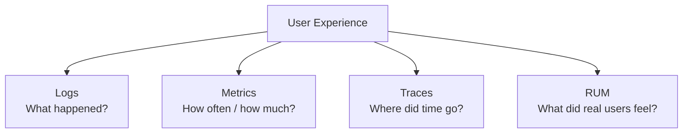
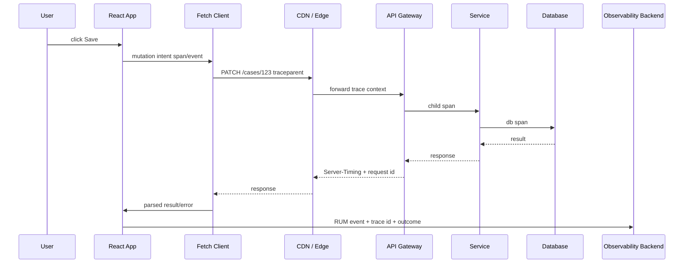

# Observability: Logs, Metrics, Traces, and RUM

Client-server communication fails in places that logs alone rarely expose.

The user sees:

```txt
The page is slow.
The save button spins forever.
The table shows old data.
The export sometimes fails.
The error message says "Something went wrong".
```

The system sees separate fragments:

```txt
browser fetch
CDN edge
API gateway
auth service
application service
database
queue
websocket gateway
query cache
React render
```

Observability is the ability to connect those fragments into a causal story.

For React client-server communication, observability must answer:

- What did the user try to do?
- Which request did the browser send?
- Was it blocked, aborted, cached, retried, redirected, or rate-limited?
- Which backend trace handled it?
- Which cache layer answered?
- What did React do with the result?
- Did the user recover?

This part builds that model.

---

## 1. Four Signals, Different Questions



| Signal | Answers | Example |
|---|---|---|
| Logs | discrete events with context | `case.save.failed` with error code and request ID |
| Metrics | aggregate behavior over time | p95 case-save latency, error rate, retry count |
| Traces | request path across services | browser span → API gateway → service → DB |
| RUM | real user experience in browser | route load time, resource timing, web vitals, JS error |

Do not use one signal as a substitute for all others.

Logs without metrics do not show scale.
Metrics without traces do not show causality.
Traces without RUM do not show user experience.
RUM without backend correlation does not show root cause.

---

## 2. Observability Boundary Map



The main design goal:

> every meaningful user intent should be connectable to network requests, backend traces, UI outcomes, and product impact without exposing sensitive data.

---

## 3. Event Taxonomy for React Client-Server Communication

A good event taxonomy is boring and stable.

Example event names:

```txt
route.load.started
route.load.succeeded
route.load.failed
query.fetch.started
query.fetch.succeeded
query.fetch.failed
mutation.submitted
mutation.succeeded
mutation.failed
mutation.unknown_outcome
realtime.connected
realtime.disconnected
realtime.message.received
cache.invalidation.executed
cache.stale_data_rendered
offline.queue.enqueued
offline.queue.replayed
```

Each event should have consistent fields.

```ts
type NetworkEvent = {
  event: string;
  timestamp: string;
  routeId?: string;
  operationName?: string;
  resourceType?: 'case' | 'user' | 'document' | 'report';
  method?: string;
  status?: number;
  errorKind?:
    | 'abort'
    | 'timeout'
    | 'network'
    | 'http'
    | 'contract'
    | 'domain'
    | 'authn'
    | 'authz'
    | 'rate_limit'
    | 'unknown';
  durationMs?: number;
  retryCount?: number;
  cacheLayer?: 'memory' | 'http' | 'cdn' | 'service-worker' | 'none' | 'unknown';
  requestId?: string;
  traceId?: string;
  tenantHash?: string;
  userHash?: string;
};
```

Notice the use of `tenantHash` and `userHash`, not raw identifiers. Observability must not become a data leak.

---

## 4. Correlation IDs and Trace Context

At minimum, every request should carry a correlation ID.

```ts
function createRequestId() {
  return crypto.randomUUID();
}

async function apiFetch(input: string, init: RequestInit = {}) {
  const requestId = createRequestId();

  const headers = new Headers(init.headers);
  headers.set('X-Request-ID', requestId);

  const startedAt = performance.now();

  try {
    const response = await fetch(input, { ...init, headers });
    const durationMs = performance.now() - startedAt;

    emitNetworkEvent({
      event: 'http.request.completed',
      method: init.method ?? 'GET',
      status: response.status,
      durationMs,
      requestId: response.headers.get('X-Request-ID') ?? requestId,
    });

    return response;
  } catch (error) {
    emitNetworkEvent({
      event: 'http.request.failed',
      method: init.method ?? 'GET',
      durationMs: performance.now() - startedAt,
      requestId,
      errorKind: classifyError(error),
    });
    throw error;
  }
}
```

For distributed tracing, use W3C Trace Context conventions instead of inventing incompatible headers.

Typical outbound headers:

```http
traceparent: 00-4bf92f3577b34da6a3ce929d0e0e4736-00f067aa0ba902b7-01
tracestate: vendor-specific-data
```

The frontend should not blindly attach trace headers to every third-party domain. Propagation should be allowlisted to your API origins.

---

## 5. Instrumenting the Fetch Client

Observability belongs inside the API client layer, not scattered around every component.

```ts
type ObservedFetchOptions = RequestInit & {
  operationName: string;
  resourceType?: string;
  deadlineMs?: number;
};

async function observedFetch(input: string, options: ObservedFetchOptions) {
  const startedAt = performance.now();
  const requestId = crypto.randomUUID();
  const headers = new Headers(options.headers);

  headers.set('X-Request-ID', requestId);

  emitNetworkEvent({
    event: 'http.request.started',
    operationName: options.operationName,
    method: options.method ?? 'GET',
    requestId,
  });

  try {
    const response = await fetch(input, { ...options, headers });
    const durationMs = performance.now() - startedAt;

    emitNetworkEvent({
      event: response.ok ? 'http.request.succeeded' : 'http.request.failed',
      operationName: options.operationName,
      method: options.method ?? 'GET',
      status: response.status,
      durationMs,
      requestId: response.headers.get('X-Request-ID') ?? requestId,
      cacheLayer: inferCacheLayer(response),
      retryCount: 0,
    });

    return response;
  } catch (error) {
    emitNetworkEvent({
      event: 'http.request.failed',
      operationName: options.operationName,
      method: options.method ?? 'GET',
      errorKind: classifyError(error),
      durationMs: performance.now() - startedAt,
      requestId,
    });
    throw error;
  }
}

function inferCacheLayer(response: Response): NetworkEvent['cacheLayer'] {
  const age = response.headers.get('Age');
  const cdn = response.headers.get('X-Cache') ?? response.headers.get('CF-Cache-Status');
  if (cdn || age) return 'cdn';
  return 'unknown';
}
```

Do not log full URLs with sensitive query params.

Bad:

```txt
/api/search?name=Alice&nationalId=123456789&caseId=ABC
```

Better:

```txt
operationName=caseSearch
routeId=case-search
queryShapeHash=...
resultCount=25
```

---

## 6. RUM: Real User Monitoring

RUM captures what real users experienced in their browsers.

Core browser signals:

- route transition time,
- fetch/resource duration,
- DNS/TCP/TLS/TTFB/transfer timing where available,
- JavaScript errors,
- unhandled promise rejections,
- long tasks,
- web vitals,
- user action latency,
- offline/online transitions,
- visibility state,
- device/network hints where privacy-safe.

Example route transition measurement:

```ts
function measureRoute<T>(routeId: string, run: () => Promise<T>): Promise<T> {
  const startedAt = performance.now();

  emitRumEvent({ event: 'route.load.started', routeId });

  return run()
    .then((result) => {
      emitRumEvent({
        event: 'route.load.succeeded',
        routeId,
        durationMs: performance.now() - startedAt,
      });
      return result;
    })
    .catch((error) => {
      emitRumEvent({
        event: 'route.load.failed',
        routeId,
        durationMs: performance.now() - startedAt,
        errorKind: classifyError(error),
      });
      throw error;
    });
}
```

For React Router loaders/actions, route instrumentation should wrap route-level data APIs, not just components.

For React Query, instrumentation can subscribe to cache changes or centralize query functions.

```ts
const queryClient = new QueryClient({
  defaultOptions: {
    queries: {
      queryFn: async ({ queryKey, signal }) => {
        // Prefer explicit queryFn per domain in real code.
        return observedFetch(String(queryKey[0]), {
          operationName: String(queryKey[0]),
          signal,
        }).then(r => r.json());
      },
    },
  },
});
```

Do not emit high-cardinality raw query keys directly. Normalize or hash.

---

## 7. Resource Timing

The browser Performance APIs expose useful request timing.

A `PerformanceResourceTiming` entry can help answer:

- Did the request wait in queue?
- Was DNS/TCP/TLS expensive?
- Was TTFB high?
- Was transfer slow?
- Was response size large?
- Was the resource fetched by `fetch`, `img`, `script`, `link`, etc.?

Example:

```ts
function readResourceTimings() {
  const entries = performance.getEntriesByType('resource') as PerformanceResourceTiming[];

  return entries
    .filter((entry) => entry.initiatorType === 'fetch')
    .map((entry) => ({
      name: sanitizeUrl(entry.name),
      durationMs: entry.duration,
      startTime: entry.startTime,
      ttfbMs: entry.responseStart - entry.requestStart,
      transferMs: entry.responseEnd - entry.responseStart,
      encodedBodySize: entry.encodedBodySize,
      decodedBodySize: entry.decodedBodySize,
      transferSize: entry.transferSize,
    }));
}
```

Caveats:

- cross-origin timing details require proper `Timing-Allow-Origin`,
- resource buffer has size limits,
- browser privacy protections can reduce precision,
- Service Worker/CDN/browser cache can change timing shape.

Do not rely on DevTools-only diagnosis. Ship production-safe timing telemetry.

---

## 8. Server-Timing: Backend Timing Visible to Browser

`Server-Timing` lets backend expose selected timing metrics to browser tools and JavaScript performance entries.

Example response:

```http
Server-Timing: db;dur=42, app;dur=17, authz;dur=6
```

Frontend can read server timing from navigation/resource performance entries.

```ts
function getServerTimingFor(urlPart: string) {
  const entries = performance.getEntriesByType('resource') as PerformanceResourceTiming[];
  const entry = entries.find((e) => e.name.includes(urlPart));

  return entry?.serverTiming.map((metric) => ({
    name: metric.name,
    duration: metric.duration,
    description: metric.description,
  })) ?? [];
}
```

Use it for coarse operational breakdown:

```txt
network total: 900ms
server timing:
  authz: 12ms
  db: 640ms
  render: 38ms
```

Do not expose sensitive internal names, tenant data, SQL details, or secrets in `Server-Timing` descriptions.

---

## 9. Metrics That Matter

### 9.1 Request metrics

Track by operation, not by raw URL.

```txt
http_client_request_duration_ms{operation="case.detail"}
http_client_request_error_total{operation="case.save", error_kind="timeout"}
http_client_request_retry_total{operation="case.search"}
http_client_request_aborted_total{operation="typeahead.search"}
```

Important dimensions:

- operation name,
- route ID,
- method,
- status class,
- error kind,
- retry count,
- cache layer,
- network type bucket if privacy-safe,
- release version,
- browser family,
- region.

Avoid high-cardinality dimensions:

- full URL,
- user ID,
- case ID,
- raw query text,
- email,
- tenant name,
- stack trace as label.

### 9.2 User intent metrics

Network success does not always mean user success.

Track:

```txt
case_save_attempt_total
case_save_success_total
case_save_user_visible_error_total
case_save_unknown_outcome_total
case_save_recovered_total
```

This captures product-level impact.

### 9.3 Cache metrics

Track:

```txt
query_cache_hit_total
query_cache_stale_render_total
query_invalidation_total
http_304_total
cdn_cache_hit_total
service_worker_response_total
```

A high cache hit ratio can be good or bad. If stale data complaints increase, high hit ratio may be hiding freshness bugs.

---

## 10. Logs: Structured, Redacted, Useful

Bad log:

```txt
Error: failed
```

Also bad:

```txt
Failed request /api/cases/123?nationalId=123456789 body={...full payload...}
```

Better:

```json
{
  "event": "mutation.failed",
  "operationName": "case.updateStatus",
  "routeId": "case-detail",
  "errorKind": "conflict",
  "status": 409,
  "requestId": "1f0b2a38-...",
  "traceId": "4bf92f...",
  "durationMs": 812,
  "retryCount": 0,
  "release": "2026.07.08.4"
}
```

Log design rules:

- never log secrets,
- avoid raw PII,
- hash identifiers if correlation is needed,
- log operation name, not full URL,
- log error kind, not just message,
- include release version,
- include request ID/trace ID,
- include user-visible outcome when relevant.

---

## 11. Error Observability

Reuse the error taxonomy from earlier parts.

```ts
type ClientServerErrorKind =
  | 'abort'
  | 'timeout'
  | 'network'
  | 'http'
  | 'problem_details'
  | 'contract'
  | 'domain'
  | 'authn'
  | 'authz'
  | 'conflict'
  | 'rate_limit'
  | 'unknown_outcome'
  | 'unknown';
```

A useful error event includes:

```ts
type ErrorEventPayload = {
  event: 'client_server.error';
  operationName: string;
  routeId?: string;
  errorKind: ClientServerErrorKind;
  status?: number;
  problemType?: string;
  retryable: boolean;
  userVisible: boolean;
  recovered: boolean;
  requestId?: string;
  traceId?: string;
};
```

Do not group all errors by JavaScript stack trace. Many client-server failures do not differ by stack trace.

Group by:

```txt
operationName + errorKind + status/problemType + release
```

---

## 12. Observing React Query

React Query already models server-state lifecycle. You can observe it carefully.

Potential signals:

- query started,
- query succeeded,
- query failed,
- query invalidated,
- stale data rendered,
- mutation started,
- mutation succeeded,
- mutation failed,
- optimistic update applied,
- rollback executed.

Domain-level wrapper example:

```ts
function useObservedMutation<TVars, TResult>(config: {
  operationName: string;
  mutationFn: (vars: TVars) => Promise<TResult>;
}) {
  return useMutation({
    mutationFn: async (vars: TVars) => {
      const startedAt = performance.now();
      emitNetworkEvent({ event: 'mutation.started', operationName: config.operationName });

      try {
        const result = await config.mutationFn(vars);
        emitNetworkEvent({
          event: 'mutation.succeeded',
          operationName: config.operationName,
          durationMs: performance.now() - startedAt,
        });
        return result;
      } catch (error) {
        emitNetworkEvent({
          event: 'mutation.failed',
          operationName: config.operationName,
          durationMs: performance.now() - startedAt,
          errorKind: classifyError(error),
        });
        throw error;
      }
    },
  });
}
```

Do not subscribe to every low-level cache event and emit unbounded telemetry. Sampling and normalization matter.

---

## 13. Observing Route Loaders and Actions

Route-level data APIs are a natural observability boundary.

```ts
export function observedLoader<T>(routeId: string, loader: LoaderFunction<T>): LoaderFunction<T> {
  return async (args) => {
    const startedAt = performance.now();
    emitRumEvent({ event: 'route.loader.started', routeId });

    try {
      const result = await loader(args);
      emitRumEvent({
        event: 'route.loader.succeeded',
        routeId,
        durationMs: performance.now() - startedAt,
      });
      return result;
    } catch (error) {
      emitRumEvent({
        event: 'route.loader.failed',
        routeId,
        durationMs: performance.now() - startedAt,
        errorKind: classifyError(error),
      });
      throw error;
    }
  };
}
```

For actions:

```txt
action.submitted
action.validation_failed
action.succeeded
action.conflict
action.unknown_outcome
action.redirected
action.revalidated
```

This is much more useful than logging `fetch failed` from inside component code.

---

## 14. Observing Realtime

Realtime protocols need their own observability.

For WebSocket:

```txt
ws.connect.started
ws.connect.succeeded
ws.connect.failed
ws.closed
ws.reconnect.scheduled
ws.heartbeat.missed
ws.message.received
ws.message.dropped
ws.resume.gap_detected
```

For SSE:

```txt
sse.connected
sse.disconnected
sse.reconnected
sse.last_event_id
sse.event.received
sse.event.parse_failed
```

Important metrics:

- connection success rate,
- reconnect rate,
- average session duration,
- heartbeat failure rate,
- message processing latency,
- event gap count,
- duplicate event count,
- invalidation fanout count.

Realtime is a common source of invisible failure:

```txt
WebSocket disconnected silently.
UI keeps showing old cache.
User assumes data is live.
```

Make connection health visible in telemetry and, when product requires it, in UI.

---

## 15. Observing Offline and Retry Behavior

Retries and offline queues can hide incidents.

Track:

```txt
request.retry.scheduled
request.retry.gave_up
mutation.offline_queued
mutation.offline_replayed
mutation.replay_failed
mutation.unknown_outcome
offline.queue.depth
offline.queue.oldest_age_ms
```

A healthy system might have retries.

An unhealthy system has:

- retry storms,
- old queued commands,
- repeated unknown outcomes,
- many replay conflicts,
- high queue depth after reconnect.

Retry metrics must include operation name and reason.

---

## 16. Sampling Strategy

Frontend telemetry can become expensive quickly.

Sample differently by signal:

| Signal | Suggested approach |
|---|---|
| Critical user-visible errors | near 100% |
| Security events | near 100%, carefully redacted |
| Successful high-volume requests | sampled |
| Route performance | sampled by session/page view |
| Long tasks/web vitals | sampled or aggregated |
| Debug breadcrumbs | session-based sampling |
| Realtime message events | aggregated, not every event |

Never sample away severe correctness/security failures blindly.

Use dynamic sampling for incident windows:

```txt
normal mode: 5% route RUM
incident mode: 50% case-save RUM for release 2026.07.08.4
```

---

## 17. Privacy and Security in Observability

Observability can leak more data than the application itself.

Sensitive surfaces:

- URLs with query params,
- request/response body,
- error messages from backend,
- stack traces containing values,
- breadcrumbs with form input,
- screenshot/session replay,
- local storage dumps,
- user IDs/tenant IDs,
- authorization headers,
- signed URLs.

Rules:

```txt
1. Default-deny fields.
2. Allowlist safe telemetry fields.
3. Hash identifiers when correlation is needed.
4. Never log tokens, cookies, signed URLs, raw PII, or full payloads.
5. Separate security/audit logs from product analytics.
6. Enforce redaction in SDK wrapper, not by convention.
```

Example sanitizer:

```ts
const SAFE_QUERY_PARAMS = new Set(['page', 'sort', 'status']);

function sanitizeUrl(raw: string) {
  const url = new URL(raw, window.location.origin);
  const safe = new URL(url.pathname, window.location.origin);

  for (const [key, value] of url.searchParams) {
    if (SAFE_QUERY_PARAMS.has(key)) safe.searchParams.set(key, value);
    else safe.searchParams.set(key, '[redacted]');
  }

  return safe.pathname + safe.search;
}
```

---

## 18. Synthetic Monitoring vs RUM

Synthetic monitoring answers:

```txt
Can our scripted flow work from selected locations right now?
```

RUM answers:

```txt
What are real users experiencing across browsers, networks, devices, regions, and releases?
```

Use both.

Synthetic checks are good for:

- login flow,
- critical read page,
- save mutation,
- export job,
- public page availability,
- CDN/regional routing,
- TLS/certificate issues.

RUM is good for:

- actual p95/p99 user latency,
- browser-specific failures,
- extension/network interference,
- cache behavior,
- release regression,
- long-tail geographies.

Synthetic passing does not prove users are fine.
RUM degraded does not always mean backend is down.

---

## 19. Incident Debugging Playbook

When a client-server issue appears, follow a disciplined path.

### Step 1: Define symptom

```txt
Who is affected?
Which route?
Which operation?
Which release?
Which region/browser/tenant segment?
What changed?
```

### Step 2: Check user-level metrics

```txt
route.load.failed increased?
mutation.failed increased?
unknown_outcome increased?
retry count increased?
stale data rendered increased?
```

### Step 3: Slice by operation

Do not inspect all API traffic. Find the operation.

```txt
case.detail
case.search
case.updateStatus
document.upload
report.export
```

### Step 4: Follow trace/correlation

Use:

- request ID,
- trace ID,
- release,
- route ID,
- operation name.

### Step 5: Distinguish failure class

```txt
network unavailable?
CORS/preflight blocked?
401 refresh storm?
403 permission drift?
409/412 conflict?
429 rate limit?
5xx server failure?
contract parse failure?
cache staleness?
frontend rendering error after success?
```

### Step 6: Validate cache layer

Check:

- browser cache,
- CDN hit/miss,
- service worker,
- query cache,
- persisted cache.

### Step 7: Confirm user recovery

A backend fix is not complete until users recover:

- queue drained,
- stale cache invalidated,
- bad release rolled back/forward,
- service worker updated,
- users with unknown mutation outcome reconciled.

---

## 20. Production Dashboard Design

A good dashboard for React client-server communication should show:

### User outcome

- route success/error rate,
- mutation success/error/unknown-outcome rate,
- user-visible error rate,
- recovery rate.

### Network behavior

- request latency p50/p95/p99 by operation,
- status code distribution,
- timeout/abort/network error rate,
- retry count,
- rate limit count,
- payload size.

### Cache behavior

- app cache hit/stale render,
- invalidation count,
- CDN hit/miss,
- 304 rate,
- service worker responses.

### Realtime/offline

- connection success,
- reconnect rate,
- event gap count,
- offline queue depth,
- replay failure rate.

### Release/regression

- metrics by release version,
- browser family,
- route ID,
- operation name,
- region.

The dashboard should answer “what broke?” before humans start reading logs.

---

## 21. Minimal Observability SDK Shape

A simple internal client-side observability layer:

```ts
type ObservabilityClient = {
  event(event: AppEvent): void;
  metric(name: string, value: number, tags?: Record<string, string>): void;
  error(error: unknown, context: ErrorContext): void;
  startSpan(name: string, attrs?: Record<string, string>): Span;
};

type Span = {
  setAttribute(key: string, value: string | number | boolean): void;
  recordException(error: unknown): void;
  end(status?: 'ok' | 'error' | 'cancelled'): void;
};
```

Your app code should depend on this narrow abstraction, not directly on vendor SDK calls everywhere.

Benefits:

- centralized redaction,
- consistent tags,
- vendor portability,
- testability,
- sampling control,
- privacy guardrails.

---

## 22. Testing Observability

Observability should be tested like any other behavior.

Examples:

```ts
it('emits timeout error event with operation name', async () => {
  const events: AppEvent[] = [];
  const obs = createTestObservabilityClient(events);

  await expect(
    api.cases.get('123', { timeoutMs: 1, observability: obs })
  ).rejects.toThrow();

  expect(events).toContainEqual(expect.objectContaining({
    event: 'http.request.failed',
    operationName: 'case.get',
    errorKind: 'timeout',
  }));
});
```

Also test redaction:

```ts
it('redacts unsafe query params', () => {
  expect(sanitizeUrl('/api/search?name=Alice&page=2')).toBe(
    '/api/search?name=%5Bredacted%5D&page=2'
  );
});
```

A telemetry event that leaks PII is a production bug.

---

## 23. Common Failure Modes

### 23.1 No operation name

Symptoms:

```txt
/api/cases/123, /api/cases/456, /api/cases/789 all appear as separate metrics
```

Fix:

```txt
operationName=case.detail
resourceId hashed or omitted
```

### 23.2 No backend correlation

Frontend sees timeout. Backend sees slow DB. Nobody can connect them.

Fix:

- request ID,
- trace context,
- response header echo,
- log correlation.

### 23.3 Too much telemetry

Every websocket message creates a log event. Cost explodes. Signal disappears.

Fix:

- aggregate,
- sample,
- emit summaries,
- keep critical errors unsampled.

### 23.4 Telemetry leaks sensitive data

Full URLs, request bodies, signed URLs, tokens, form values enter logs.

Fix:

- allowlist fields,
- sanitize at SDK boundary,
- test redaction,
- block unsafe keys.

### 23.5 Metrics hide user pain

API success rate is 99.9%, but users fail because contract parsing breaks in frontend.

Fix:

- client-side contract error metric,
- user-visible error metric,
- release slicing.

### 23.6 Cache hit looks good but data is stale

CDN/app cache hit ratio improves while complaints increase.

Fix:

- stale age metric,
- rendered stale data event,
- mutation-to-visible-update latency metric.

---

## 24. Review Checklist

Before shipping a networked feature:

- Does every API operation have a stable operation name?
- Are request ID and trace context propagated to allowed origins?
- Are errors classified using the shared taxonomy?
- Are user-visible failures tracked separately from raw network failures?
- Are route loaders/actions instrumented?
- Are mutations instrumented for success, failure, conflict, and unknown outcome?
- Are retries, aborts, and timeouts observable?
- Are cache hits/stale renders/invalidation observable?
- Are WebSocket/SSE connection health and resume gaps observable?
- Are offline queue depth and replay failures observable?
- Are URLs, payloads, tokens, signed URLs, and PII redacted?
- Can dashboard slice by release, browser, route, operation, and region?
- Can one frontend event be correlated to backend trace/logs?

---

## 25. Key Takeaways

Observability for React client-server communication is not “install monitoring SDK”.

It is an architecture decision:

```txt
user intent -> React route/action/query -> fetch client -> browser/CDN/API -> backend trace -> response -> cache/render outcome -> RUM event
```

The critical capabilities are:

- stable operation names,
- error taxonomy,
- request/trace correlation,
- privacy-safe structured events,
- user outcome metrics,
- cache/retry/realtime/offline visibility,
- release-aware debugging.

A mature frontend system does not merely report that something failed.
It can explain which communication boundary failed, who was affected, how bad it was, and whether users recovered.

---

## References

- W3C Trace Context
- W3C Server Timing
- MDN — Server-Timing header
- MDN — PerformanceResourceTiming
- OpenTelemetry JavaScript Browser docs
- OpenTelemetry Context Propagation
- OWASP Logging Cheat Sheet
- TanStack Query Devtools and Query lifecycle docs
