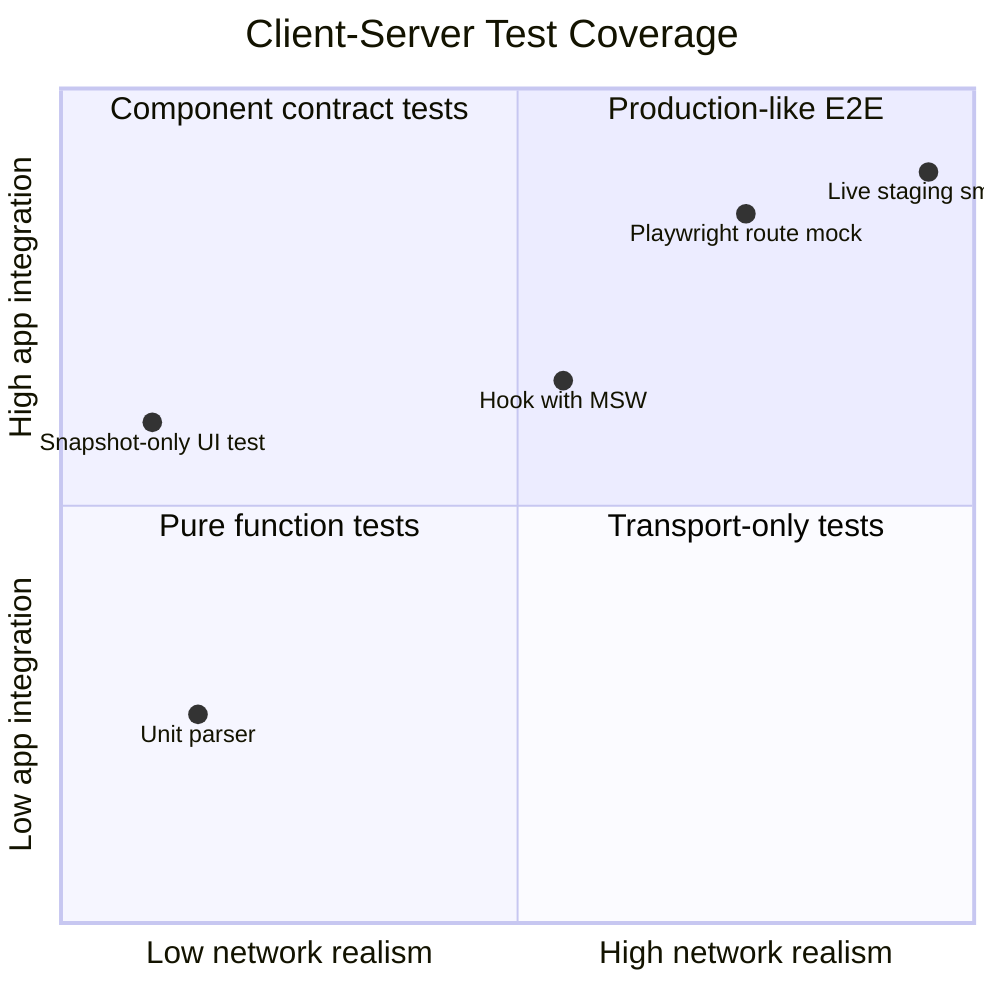
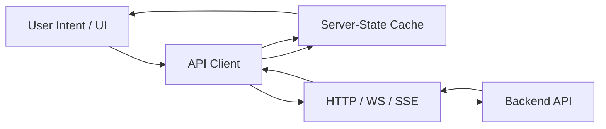
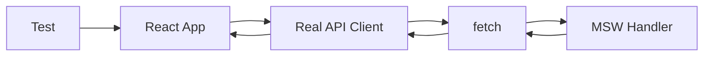

# Testing with MSW, Contracts, and Network Simulation

Testing client-server communication is not the same as testing UI.

UI tests ask:

```txt
Does the button render?
Does the modal open?
Does the table show rows?
```

Client-server communication tests ask a harder question:

```txt
When the network behaves like production, does the UI still make correct promises?
```

That means the test must exercise more than the happy path:

- slow response
- out-of-order response
- request abort
- HTTP error
- domain error
- malformed JSON
- schema drift
- partial data
- stale cache
- retry
- duplicate mutation
- unknown mutation outcome
- offline replay
- authorization change
- tenant switch
- rate limit
- realtime event ordering

A top-tier React engineer does not only test components. They test the **communication contract** between user intent, browser transport, API contract, server-state cache, and rendered UI.

This part gives you the testing model.

---

## 1. The Testing Pyramid Is Not Enough

Classic frontend testing advice often says:

```txt
unit tests > integration tests > e2e tests
```

That is useful, but incomplete for networked React.

The missing axis is **network realism**.



A snapshot test can pass while production fails because:

- the API returned `204 No Content`
- the backend changed `status` from string to object
- the browser blocked the response due to CORS
- the user double-clicked a mutation
- request B returned before request A
- a stale React Query cache showed data from the previous tenant
- retry created duplicate server-side effects
- the service worker served old data

So the real pyramid for this domain is:

```txt
pure units
  ↓
contract units
  ↓
network integration with MSW
  ↓
browser integration with Playwright/Cypress
  ↓
live smoke/synthetic monitoring
```

Each layer answers a different question.

---

## 2. What Must Be Tested

Client-server communication has five contracts.



| Contract | Example | Test question |
|---|---|---|
| UI contract | Save button disabled while pending | Does UI prevent duplicate unsafe commands? |
| client contract | `api.postJson()` parses Problem Details | Does transport normalize errors? |
| cache contract | mutation invalidates affected queries | Does stale data recover? |
| wire contract | `GET /cases?status=open` accepts query params | Does request match API shape? |
| backend contract | `CaseDto.status` remains compatible | Does payload satisfy schema? |

Do not test only one layer and assume the others are fine.

The most expensive bugs usually live at the seams.

---

## 3. Test What You Own, Mock What You Do Not

A React app usually owns:

- request construction
- parsing
- error mapping
- cache policy
- mutation lifecycle
- UI state transition
- retry/cancellation policy
- optimistic branch
- route navigation behavior
- telemetry envelope

It usually does not own:

- database transaction logic
- backend authorization algorithm
- queue processing
- third-party API uptime
- CDN routing

So local tests should not require a real backend for every scenario.

Use mocked network responses to create impossible-to-reliably-trigger states:

- timeout
- 429 with `Retry-After`
- 412 version conflict
- malformed JSON
- response delayed until after route change
- response arriving out of order
- partial GraphQL error
- SSE reconnect with missed event

That is where MSW and browser network interception are valuable.

---

## 4. Why MSW Is Different from Function Mocks

A common beginner test mocks the API module:

```ts
vi.mock("../api/cases", () => ({
  listCases: vi.fn().mockResolvedValue([{ id: "case_1" }]),
}));
```

That can be useful for pure component tests, but it skips the real communication path:

```txt
fetch client
headers
body encoding
status code
response parsing
Problem Details mapping
AbortSignal
React Query queryFn
```

MSW intercepts requests at the network boundary. Your app still calls `fetch()` or your real API client.



This is a stronger test because it catches:

- wrong URL
- missing header
- wrong HTTP method
- incorrect body encoding
- parser failure
- error-envelope mismatch
- cache invalidation failure

MSW's official positioning is exactly this: API mocking across browser and Node.js by intercepting outgoing requests.

---

## 5. Baseline Test Harness

Assume the app has this production client:

```ts
export async function requestJson<T>(input: RequestInfo, init?: RequestInit): Promise<T> {
  const response = await fetch(input, init);

  const contentType = response.headers.get("content-type") ?? "";
  const hasJson = contentType.includes("application/json") || contentType.includes("application/problem+json");
  const body = hasJson ? await response.json().catch(() => undefined) : undefined;

  if (!response.ok) {
    throw new ApiError({
      status: response.status,
      body,
      requestId: response.headers.get("x-request-id") ?? undefined,
    });
  }

  return body as T;
}
```

A good test should call this real client through the real hook.

```ts
import { QueryClient, QueryClientProvider } from "@tanstack/react-query";
import { render } from "@testing-library/react";

export function renderWithQuery(ui: React.ReactElement) {
  const queryClient = new QueryClient({
    defaultOptions: {
      queries: {
        retry: false,
        gcTime: Infinity,
      },
      mutations: {
        retry: false,
      },
    },
  });

  return {
    queryClient,
    ...render(
      <QueryClientProvider client={queryClient}>{ui}</QueryClientProvider>
    ),
  };
}
```

Disable retry in deterministic tests unless you are specifically testing retry. Otherwise one failed response may trigger hidden waits and flaky assertions.

---

## 6. MSW Setup for Node Test Runtime

Example with Vitest/Jest-style lifecycle:

```ts
// test/server.ts
import { setupServer } from "msw/node";
import { http, HttpResponse, delay } from "msw";

export const server = setupServer();
export { http, HttpResponse, delay };
```

```ts
// test/setup.ts
import { afterAll, afterEach, beforeAll } from "vitest";
import { server } from "./server";

beforeAll(() => {
  server.listen({ onUnhandledRequest: "error" });
});

afterEach(() => {
  server.resetHandlers();
});

afterAll(() => {
  server.close();
});
```

The important setting is:

```ts
onUnhandledRequest: "error"
```

Without it, tests can accidentally hit real network or silently miss a broken request path.

For production-grade tests, unhandled network is a bug.

---

## 7. Test Request Shape, Not Only Response Rendering

A weak test:

```ts
expect(await screen.findByText("Case A")).toBeInTheDocument();
```

A stronger test also verifies the request contract.

```ts
server.use(
  http.get("/api/cases", ({ request }) => {
    const url = new URL(request.url);

    expect(url.searchParams.get("status")).toBe("open");
    expect(request.headers.get("accept")).toContain("application/json");

    return HttpResponse.json({
      items: [{ id: "case_1", title: "Case A", status: "open" }],
    });
  })
);
```

This catches:

- missing filters
- string vs number parameter bugs
- wrong endpoint
- wrong `Accept` header
- accidental cache-busting params
- tenant/user scope omitted from query key or URL

Do not overassert incidental headers like browser-generated `sec-*` headers. Assert the contract your app owns.

---

## 8. Test Response Parsing Edge Cases

A robust fetch client must handle more than JSON success.

### 204 No Content

```ts
server.use(
  http.delete("/api/cases/:id", () => {
    return new HttpResponse(null, { status: 204 });
  })
);
```

The test should ensure the UI treats the mutation as success without trying to parse an empty JSON body.

### HTML error from gateway

```ts
server.use(
  http.get("/api/cases", () => {
    return new HttpResponse("<html>Bad Gateway</html>", {
      status: 502,
      headers: { "content-type": "text/html" },
    });
  })
);
```

The UI should show a generic retryable infrastructure error, not crash on `response.json()`.

### Malformed JSON

```ts
server.use(
  http.get("/api/cases", () => {
    return new HttpResponse("{ not-json", {
      status: 200,
      headers: { "content-type": "application/json" },
    });
  })
);
```

This should become a parse/contract error.

A parse error is not the same as a domain error.

---

## 9. Test Error Taxonomy

Your UI should not map all failures to one string.

```ts
const scenarios = [
  {
    name: "validation error",
    status: 422,
    body: {
      type: "https://example.com/problems/validation-error",
      title: "Invalid request",
      errors: { title: ["Title is required"] },
    },
    expected: "Title is required",
  },
  {
    name: "version conflict",
    status: 412,
    body: {
      type: "https://example.com/problems/version-conflict",
      title: "Record changed",
    },
    expected: "This record was changed by someone else",
  },
  {
    name: "rate limited",
    status: 429,
    headers: { "Retry-After": "30" },
    body: { title: "Too many requests" },
    expected: "Try again later",
  },
];
```

Test matrix:

| Status | Client behavior |
|---:|---|
| 400 | Show request problem or generic bad request |
| 401 | Trigger login/session recovery path |
| 403 | Show access denied, do not retry blindly |
| 404 | Show not found or removed resource |
| 409 | Show conflict workflow |
| 412 | Reload/merge conflict workflow |
| 422 | Show field/domain validation |
| 429 | Respect rate-limit signal |
| 500/502/503 | Retry if safe and budget allows |

This is not only UI polish. It prevents incorrect retry, data loss, and support noise.

---

## 10. Test Loading, Refreshing, Stale, and Error Separately

Bad state model:

```ts
if (isLoading) return <Spinner />;
if (error) return <Error />;
return <Table data={data} />;
```

This loses critical distinctions:

- initial load
- background refresh
- refresh failed but old data exists
- empty success
- stale success
- optimistic pending

Test each one.

```ts
it("keeps stale data visible when background refetch fails", async () => {
  let call = 0;

  server.use(
    http.get("/api/cases", () => {
      call += 1;

      if (call === 1) {
        return HttpResponse.json({ items: [{ id: "case_1", title: "Case A" }] });
      }

      return HttpResponse.json({ title: "Server unavailable" }, { status: 503 });
    })
  );

  const { queryClient } = renderWithQuery(<CaseList />);

  expect(await screen.findByText("Case A")).toBeInTheDocument();

  await queryClient.invalidateQueries({ queryKey: ["cases"] });

  expect(screen.getByText("Case A")).toBeInTheDocument();
  expect(await screen.findByText(/could not refresh/i)).toBeInTheDocument();
});
```

The invariant:

```txt
A refresh failure should not erase last-known-good data unless the data is unsafe to display.
```

---

## 11. Test Race Conditions Explicitly

Race bugs rarely appear with static mocks.

You need controlled promises.

```ts
function deferred<T>() {
  let resolve!: (value: T) => void;
  let reject!: (error: unknown) => void;

  const promise = new Promise<T>((res, rej) => {
    resolve = res;
    reject = rej;
  });

  return { promise, resolve, reject };
}
```

Example: search response order.

```ts
it("shows result from the latest search, not the slowest response", async () => {
  const a = deferred<Response>();
  const ab = deferred<Response>();

  server.use(
    http.get("/api/search", ({ request }) => {
      const q = new URL(request.url).searchParams.get("q");

      if (q === "a") return a.promise;
      if (q === "ab") return ab.promise;

      return HttpResponse.json({ items: [] });
    })
  );

  renderWithQuery(<SearchBox />);

  await user.type(screen.getByRole("textbox"), "a");
  await user.type(screen.getByRole("textbox"), "b");

  ab.resolve(HttpResponse.json({ items: [{ id: "2", label: "AB result" }] }));
  expect(await screen.findByText("AB result")).toBeInTheDocument();

  a.resolve(HttpResponse.json({ items: [{ id: "1", label: "A result" }] }));
  expect(screen.queryByText("A result")).not.toBeInTheDocument();
});
```

This test proves latest-wins behavior.

Without it, a slow old request can overwrite the UI.

---

## 12. Test Cancellation

Cancellation has two questions:

1. Does the client stop caring about the response?
2. Does the underlying request receive an `AbortSignal`?

```ts
it("aborts previous search request when query changes", async () => {
  const abortEvents: string[] = [];

  server.use(
    http.get("/api/search", async ({ request }) => {
      request.signal.addEventListener("abort", () => {
        abortEvents.push(new URL(request.url).searchParams.get("q") ?? "");
      });

      await new Promise((resolve) => setTimeout(resolve, 10_000));
      return HttpResponse.json({ items: [] });
    })
  );

  renderWithQuery(<SearchBox />);

  await user.type(screen.getByRole("textbox"), "a");
  await user.clear(screen.getByRole("textbox"));
  await user.type(screen.getByRole("textbox"), "b");

  await waitFor(() => {
    expect(abortEvents).toContain("a");
  });
});
```

Caveat:

```txt
Abort means the client canceled waiting. It does not guarantee the server never performed side effects.
```

For mutations, cancellation must not be treated as rollback proof.

---

## 13. Test Timeout and Deadline Behavior

Timeout tests should not wait real seconds.

Use fake timers where possible, but be careful: fetch, timers, React updates, and MSW may interact differently depending on runtime.

A simpler deterministic pattern is to inject a short timeout into the client.

```ts
it("maps timeout to retryable infrastructure error", async () => {
  server.use(
    http.get("/api/cases", async () => {
      await delay("infinite");
      return HttpResponse.json({ items: [] });
    })
  );

  renderWithQuery(<CaseList timeoutMs={20} />);

  expect(await screen.findByText(/request timed out/i)).toBeInTheDocument();
});
```

Timeout should be tested as policy:

- message shown to user
- telemetry event emitted
- retry policy applied or not
- stale data preserved or not
- duplicate mutation avoided

---

## 14. Test Retry Without Creating Flaky Tests

Retry is a state machine.

Test it with deterministic counters.

```ts
it("retries transient GET failure and eventually renders success", async () => {
  let calls = 0;

  server.use(
    http.get("/api/cases", () => {
      calls += 1;

      if (calls < 3) {
        return HttpResponse.json({ title: "Temporary failure" }, { status: 503 });
      }

      return HttpResponse.json({ items: [{ id: "case_1", title: "Recovered" }] });
    })
  );

  renderWithQuery(<CaseList retry />);

  expect(await screen.findByText("Recovered")).toBeInTheDocument();
  expect(calls).toBe(3);
});
```

Also test negative cases:

```ts
it("does not retry validation error", async () => {
  let calls = 0;

  server.use(
    http.post("/api/cases", () => {
      calls += 1;
      return HttpResponse.json(
        { type: "validation", errors: { title: ["Required"] } },
        { status: 422 }
      );
    })
  );

  renderWithQuery(<CreateCaseForm />);
  await user.click(screen.getByRole("button", { name: /save/i }));

  expect(await screen.findByText("Required")).toBeInTheDocument();
  expect(calls).toBe(1);
});
```

Retry must be status-aware, method-aware, and budget-aware.

---

## 15. Test Mutation Lifecycle

Mutation tests must validate more than success rendering.

Test the lifecycle:

```txt
idle
  -> pending
  -> optimistic update
  -> success confirmation
  -> invalidation/refetch
  -> final committed UI
```

Example:

```ts
it("optimistically adds a case and reconciles with server id", async () => {
  server.use(
    http.get("/api/cases", () => HttpResponse.json({ items: [] })),
    http.post("/api/cases", async ({ request }) => {
      const body = await request.json() as { title: string };

      expect(body.title).toBe("New case");

      return HttpResponse.json(
        { id: "case_server_1", title: body.title, status: "open" },
        { status: 201 }
      );
    })
  );

  renderWithQuery(<CaseManagementPage />);

  await user.type(screen.getByLabelText(/title/i), "New case");
  await user.click(screen.getByRole("button", { name: /create/i }));

  expect(screen.getByText("New case")).toBeInTheDocument();
  expect(await screen.findByTestId("case-case_server_1")).toBeInTheDocument();
});
```

Also test rollback:

```ts
it("rolls back optimistic insert on validation failure", async () => {
  server.use(
    http.get("/api/cases", () => HttpResponse.json({ items: [] })),
    http.post("/api/cases", () => {
      return HttpResponse.json(
        { type: "validation", errors: { title: ["Duplicate title"] } },
        { status: 422 }
      );
    })
  );

  renderWithQuery(<CaseManagementPage />);

  await user.type(screen.getByLabelText(/title/i), "Duplicate");
  await user.click(screen.getByRole("button", { name: /create/i }));

  expect(await screen.findByText("Duplicate title")).toBeInTheDocument();
  expect(screen.queryByText("Duplicate")).not.toBeInTheDocument();
});
```

The test proves the cache does not lie after failure.

---

## 16. Test Unknown Mutation Outcome

The nastiest mutation case is:

```txt
client sends mutation
server commits mutation
network fails before response arrives
client sees network error
```

The UI must not blindly say:

```txt
Save failed. Try again.
```

That can create duplicate effects.

Test the ambiguous path:

```ts
it("shows unknown outcome after mutation connection failure", async () => {
  server.use(
    http.post("/api/cases", () => {
      return HttpResponse.error();
    })
  );

  renderWithQuery(<CreateCaseForm />);

  await user.type(screen.getByLabelText(/title/i), "Possibly created");
  await user.click(screen.getByRole("button", { name: /save/i }));

  expect(await screen.findByText(/we could not confirm whether the save completed/i)).toBeInTheDocument();
});
```

The real mitigation is idempotency key + status lookup:

```txt
POST /cases
Idempotency-Key: command_123

GET /commands/command_123
```

Your tests should prove the UI can recover by checking command status.

---

## 17. Test Cache Invalidation

A mutation test that only checks success toast is weak.

A strong test proves affected queries update.

```ts
it("invalidates list after update detail mutation", async () => {
  let title = "Old title";

  server.use(
    http.get("/api/cases", () => {
      return HttpResponse.json({ items: [{ id: "case_1", title }] });
    }),
    http.patch("/api/cases/case_1", async ({ request }) => {
      const body = await request.json() as { title: string };
      title = body.title;
      return HttpResponse.json({ id: "case_1", title });
    })
  );

  renderWithQuery(<CasesWithEditDialog />);

  expect(await screen.findByText("Old title")).toBeInTheDocument();

  await user.click(screen.getByRole("button", { name: /edit/i }));
  await user.clear(screen.getByLabelText(/title/i));
  await user.type(screen.getByLabelText(/title/i), "New title");
  await user.click(screen.getByRole("button", { name: /save/i }));

  expect(await screen.findByText("New title")).toBeInTheDocument();
  expect(screen.queryByText("Old title")).not.toBeInTheDocument();
});
```

The invariant:

```txt
A successful mutation must either patch every affected cache entry or invalidate every affected query.
```

---

## 18. Contract Testing: Mock Data Is Not Enough

MSW can prove your UI handles a response shape. But if your mock shape drifts from backend reality, the test becomes a lie.

Contract testing asks:

```txt
Does the producer and consumer agree on the shape and semantics of the API?
```

There are several levels.

| Level | Checks | Cost | Catches |
|---|---|---:|---|
| Type-only | generated TypeScript compiles | low | client compile drift |
| Schema validation | response validates against OpenAPI/JSON Schema | medium | payload shape drift |
| Consumer contract | backend satisfies consumer examples | medium/high | breaking semantic changes |
| Live contract smoke | staging/prod response checked | high | deployment/config drift |

Do not confuse OpenAPI presence with contract safety. A spec can be stale.

The contract must be executable in CI.

---

## 19. Runtime Schema Validation in Tests

Use generated schemas or validators to verify mock data and live response data.

Example pseudo-pattern:

```ts
import { CaseListResponseSchema } from "../generated/schemas";

function jsonContract<T>(schema: Schema<T>, data: unknown): T {
  const result = schema.safeParse(data);

  if (!result.success) {
    throw new Error(`Mock response violates contract: ${result.error.message}`);
  }

  return result.data;
}
```

In MSW handler:

```ts
server.use(
  http.get("/api/cases", () => {
    const body = jsonContract(CaseListResponseSchema, {
      items: [{ id: "case_1", title: "Case A", status: "open" }],
    });

    return HttpResponse.json(body);
  })
);
```

Now your mocks cannot silently invent fields that backend will never send.

---

## 20. Contract Drift Examples

### Required field removed

Backend changes:

```diff
{
  "id": "case_1",
- "title": "Case A",
  "status": "open"
}
```

Client result:

```txt
render crash or empty label
```

### Nullability changed

Backend changes:

```diff
- assignee: User
+ assignee: User | null
```

Client result:

```txt
Cannot read properties of null
```

### Meaning changed without shape change

Backend changes:

```diff
status: "closed"
```

from:

```txt
case cannot be edited
```

to:

```txt
case can be reopened
```

Shape tests will not catch this. You need semantic examples.

---

## 21. Consumer-Driven Contract Thinking

Consumer contract is not just schema. It says:

```txt
For this consumer scenario, the provider must return data with these properties.
```

Example scenario:

```txt
Given an open case assigned to current user
When GET /cases/:id is called
Then response includes editable=true and allowedTransitions contains "close"
```

This is useful for:

- workflow platforms
- regulatory systems
- permission-heavy apps
- complex lifecycle state machines
- multi-tenant product surfaces

For simple CRUD apps, schema validation may be enough.

For complex case management, consumer scenarios matter more than field existence.

---

## 22. Test Network Simulation in Browser E2E

MSW in unit/integration tests is excellent, but browser automation adds another level:

- actual navigation
- actual focus/visibility
- actual service worker interaction
- actual browser cache behavior
- actual DevTools-like network stack
- actual file uploads/downloads

Playwright provides network APIs to monitor and modify browser network traffic, including requests initiated by `fetch` and XHR.

Example route mock:

```ts
await page.route("**/api/cases", async (route) => {
  await route.fulfill({
    status: 200,
    contentType: "application/json",
    body: JSON.stringify({ items: [{ id: "case_1", title: "Case A" }] }),
  });
});
```

Abort a request:

```ts
await page.route("**/api/export", async (route) => {
  await route.abort("failed");
});
```

Delay a request:

```ts
await page.route("**/api/cases", async (route) => {
  await new Promise((resolve) => setTimeout(resolve, 2_000));
  await route.continue();
});
```

Use this to test:

- skeletons
- loading buttons
- duplicate submit prevention
- navigation during pending request
- retry button
- offline banner
- file upload progress
- slow route transition

---

## 23. HAR-Based Tests

HAR replay can capture real backend responses and replay them in browser tests.

Useful when:

- backend is expensive or unstable
- response shape is large
- third-party API must not be called in CI
- you need realistic payloads

Risk:

- HAR files become stale
- sensitive data may leak into repository
- tests may validate yesterday's API instead of today's contract

Rule:

```txt
HAR replay is a fixture source, not a contract authority.
```

Scrub sensitive data and pair HAR tests with schema validation.

---

## 24. Test CORS and Credential Behavior Carefully

CORS behavior is enforced by browsers. Node test runners may not reproduce it faithfully.

Unit tests with MSW can verify your client sets:

```ts
credentials: "include"
```

But browser tests are better for:

- cookie sent or not sent
- preflight behavior
- exposed response headers
- blocked response visibility
- SameSite behavior across origins/sites

Where possible, run browser E2E against realistic origins:

```txt
app.local.test
api.local.test
```

Do not assume a Node test can prove browser policy.

---

## 25. Test Authorization and Tenant Isolation

A dangerous failure:

```txt
user A logs out
user B logs in
React Query cache still shows user A data
```

Test it.

```ts
it("clears scoped cache when active tenant changes", async () => {
  server.use(
    http.get("/api/tenant/current/cases", ({ request }) => {
      const tenant = request.headers.get("x-tenant-id");
      return HttpResponse.json({
        items: [{ id: `case_${tenant}`, title: `Case for ${tenant}` }],
      });
    })
  );

  const { queryClient } = renderWithQuery(<TenantShell />);

  await selectTenant("tenant_a");
  expect(await screen.findByText("Case for tenant_a")).toBeInTheDocument();

  await selectTenant("tenant_b");

  queryClient.removeQueries({ queryKey: ["tenant", "tenant_a"] });

  expect(await screen.findByText("Case for tenant_b")).toBeInTheDocument();
  expect(screen.queryByText("Case for tenant_a")).not.toBeInTheDocument();
});
```

Better: encode tenant/user scope in query keys and centralize cache cleanup on identity boundary changes.

---

## 26. Test Multi-Tab Amplification

Some bugs only appear with multiple tabs:

- each tab polls every 5 seconds
- all tabs refresh token at once
- all tabs replay offline queue
- one tab logs out but others keep cached data
- realtime socket opened per tab

Browser E2E can open multiple contexts/pages.

```ts
const pageA = await context.newPage();
const pageB = await context.newPage();
```

Test policy:

```txt
Only one tab owns polling/replay/socket, or all tabs coordinate through BroadcastChannel/storage lock.
```

This is especially important for internal admin systems left open all day.

---

## 27. Test Realtime and Streaming

Realtime tests need deterministic event control.

For SSE, abstract the event source factory:

```ts
export interface EventSourceLike {
  close(): void;
  addEventListener(type: string, listener: EventListener): void;
}

export type EventSourceFactory = (url: string) => EventSourceLike;
```

Then test reconciliation without real network:

```ts
const source = new FakeEventSource();
renderWithQuery(<CaseLiveUpdates eventSourceFactory={() => source} />);

source.emit("case.updated", {
  id: "case_1",
  version: 3,
  patch: { status: "closed" },
});

expect(await screen.findByText("Closed")).toBeInTheDocument();
```

Test:

- duplicate event ignored
- old version ignored
- gap detected triggers invalidate
- permission revoked removes data
- reconnect resumes from cursor
- malformed event discarded and logged

---

## 28. Test Offline and Outbox

Offline-first features need three layers of tests:

| Layer | Test |
|---|---|
| command encoding | outbox item is durable and idempotent |
| replay engine | commands replay in order with retry/backoff |
| UI integration | pending state survives reload and resolves after sync |

Example replay unit:

```ts
it("does not replay non-idempotent command without idempotency key", async () => {
  const command = {
    type: "CreateCase",
    idempotencyKey: undefined,
    payload: { title: "Unsafe" },
  };

  await expect(outbox.enqueue(command)).rejects.toThrow(/idempotency key/i);
});
```

Example UI invariant:

```txt
After reload, user can see that a command is pending, not silently lost.
```

---

## 29. Test Observability Contract

Client-server tests should also verify telemetry in critical paths.

Not every click needs a telemetry assertion. But these do:

- unknown mutation outcome
- repeated retry exhaustion
- contract parse failure
- auth refresh storm protection
- cache scope reset
- offline queue replay failure
- realtime gap detection

Example:

```ts
it("emits parse_error telemetry when response violates contract", async () => {
  const telemetry = createFakeTelemetry();

  server.use(
    http.get("/api/cases", () => {
      return HttpResponse.json({ wrong: true });
    })
  );

  renderWithQuery(<CaseList telemetry={telemetry} />);

  expect(await screen.findByText(/could not load cases/i)).toBeInTheDocument();

  expect(telemetry.events).toContainEqual(
    expect.objectContaining({
      type: "api.parse_error",
      operation: "CaseList.load",
    })
  );
});
```

Telemetry is part of the production contract.

If a failure matters enough to page someone, it matters enough to test.

---

## 30. Avoid Flaky Network Tests

Flaky tests usually come from hidden nondeterminism.

Common causes:

| Flake source | Fix |
|---|---|
| real timers | use controlled delays or fake timers carefully |
| retry enabled by default | disable except retry tests |
| cache shared between tests | new `QueryClient` per test |
| unhandled request ignored | `onUnhandledRequest: "error"` |
| assertions before UI settles | use `findBy*` / `waitFor` intentionally |
| relying on request order | explicitly control promises |
| real backend dependency | use MSW or isolated test env |
| stale service worker | unregister/clean per E2E run |
| persisted storage | clear localStorage/IndexedDB/sessionStorage |

The test harness must reset:

```txt
query cache
mutation cache
MSW handlers
local storage
session storage
IndexedDB if used
service worker if registered
fake timers
auth/session test fixtures
```

---

## 31. Testing Strategy by Risk

Do not test every endpoint equally. Test by risk.

High-risk paths:

- money movement
- enforcement/case lifecycle transition
- regulatory submission
- destructive mutation
- bulk operation
- permission-sensitive reads
- export/download of PII
- offline replay
- realtime operational dashboards
- long-running job control

For each high-risk path, require:

```txt
happy path
validation error
authorization error
conflict
rate limit
server error
network error
timeout
duplicate submit
navigation away during pending
observability event
```

For low-risk read-only pages, a smaller matrix is enough.

---

## 32. Example Test Matrix for a Case Transition

Suppose the user closes a regulatory case.

| Scenario | Expected behavior |
|---|---|
| 200 success | case becomes closed, list/detail invalidated |
| 422 invalid transition | show domain message, no optimistic commit |
| 403 forbidden | remove/disable action, show access message |
| 409 state conflict | reload current case and show conflict prompt |
| 412 version mismatch | merge/reload workflow |
| 429 rate limit | disable retry until allowed window |
| 503 | retry if idempotent or show retry button |
| network error after send | unknown outcome workflow |
| double click | one command only, same idempotency key |
| stale realtime event | ignored by version |
| permission revoked event | close editor/remove action |

That is what serious client-server testing looks like.

---

## 33. Testing Checklist

Before merging a client-server feature, ask:

- Is the API request shape tested?
- Is the response success shape validated?
- Are HTTP errors mapped correctly?
- Are domain errors mapped correctly?
- Is malformed response handled?
- Is timeout handled?
- Is abort handled?
- Is retry policy tested for both retryable and non-retryable cases?
- Are mutation duplicate submits prevented?
- Is unknown mutation outcome handled?
- Is cache invalidation or patching tested?
- Is tenant/user scope isolated?
- Is loading/empty/error/refresh/stale state covered?
- Is route navigation during pending request covered?
- Is observability emitted for critical failures?
- Are mocks contract-validated?
- Are E2E tests reserved for browser-policy-sensitive behavior?

---

## 34. Mental Model

A test suite for React client-server communication should not ask only:

```txt
Does the component render with mocked data?
```

It should ask:

```txt
When the browser, network, server contract, cache, and UI lifecycle interact under failure, does the app preserve correctness?
```

The invariant:

```txt
Every production network failure class that can cause user harm must be represented by at least one deterministic test.
```

That is how testing becomes engineering leverage, not ceremony.

---

## References

- MSW Documentation: https://mswjs.io/docs/
- Playwright Network Documentation: https://playwright.dev/docs/network
- OpenAPI Initiative: https://www.openapis.org/
- Chrome DevTools Network Panel: https://developer.chrome.com/docs/devtools/network
- TanStack Query Testing Guide: https://tanstack.com/query/latest/docs/framework/react/guides/testing
