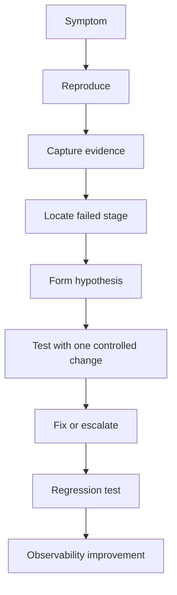
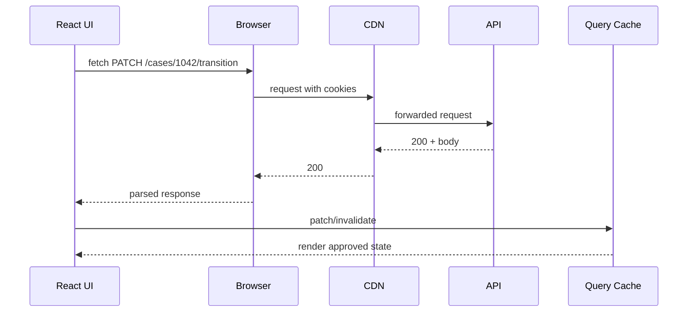
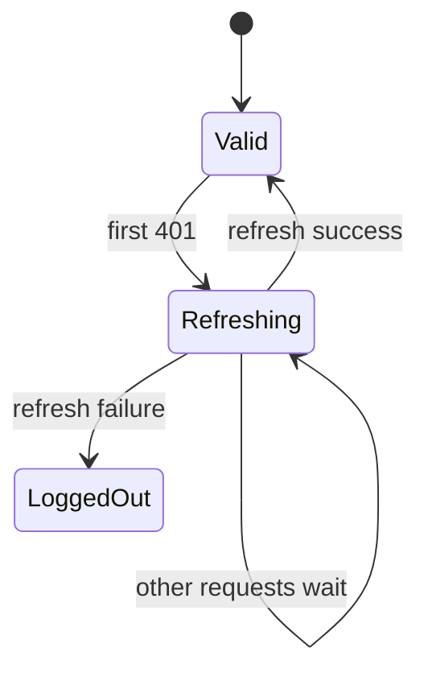
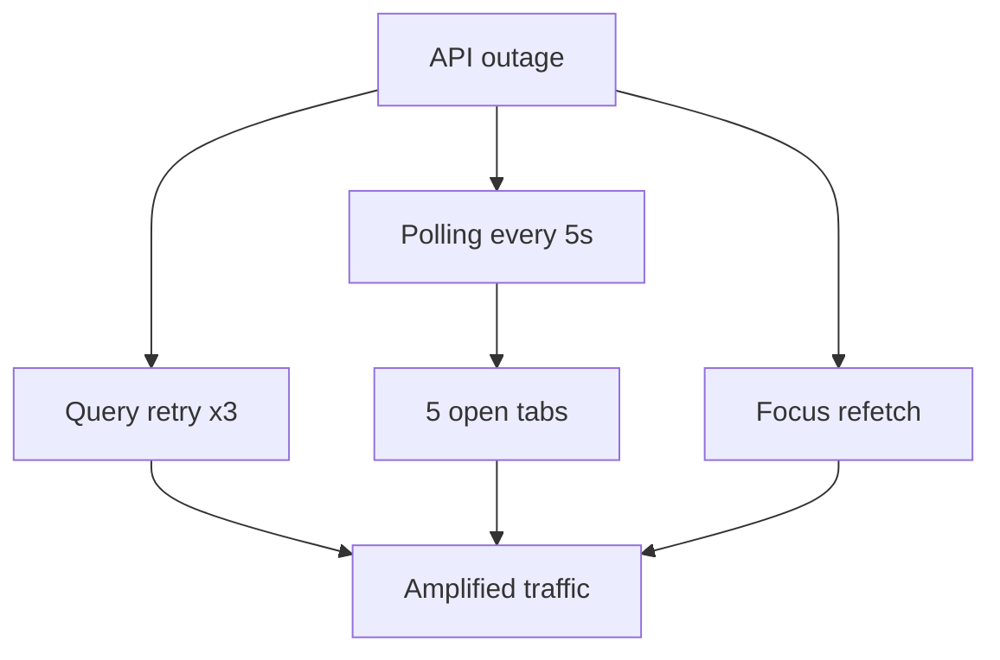

# Debugging Production Network Bugs

Production network bugs are rarely one-line bugs.

They appear as vague user reports:

```txt
The save button spins forever.
Sometimes the list shows old data.
It works in staging but not production.
Only one customer is affected.
It fails after lunch.
It works after refresh.
It only happens in Safari.
The export downloads a login page.
The dashboard stops updating after a while.
```

The mistake is to start by guessing.

A senior engineer starts by turning the symptom into a **communication trace**.

```txt
user intent
  -> UI state
  -> request created
  -> browser policy
  -> cache layer
  -> network transport
  -> edge/gateway
  -> backend trace
  -> response
  -> parser
  -> cache update
  -> rendered state
```

This part is a production debugging playbook.

---

## 1. The First Rule: Do Not Debug a Network Bug from the UI Alone

The UI is only the last visible state.

A spinner can mean:

- request never sent
- request sent but blocked by CORS
- request pending behind browser connection limit
- request aborted by route change
- request retried silently
- request succeeded but parser crashed
- response was cached stale
- mutation succeeded but invalidation failed
- React Query is waiting due to dependent query
- Suspense boundary is hiding the real error
- service worker intercepted incorrectly
- auth refresh is stuck
- websocket subscription never opened

So the initial debugging question is not:

```txt
Why is the spinner shown?
```

It is:

```txt
Which stage of the communication pipeline failed?
```

---

## 2. Debugging Pipeline



Do not skip evidence capture.

For client-server bugs, evidence usually includes:

- exact user/time/tenant/session
- browser and version
- route URL
- request URL/method/status
- request ID/correlation ID
- trace ID
- HAR file if possible
- console errors
- React Query Devtools/cache snapshot
- relevant backend logs
- CDN/gateway logs
- feature flags
- deployment version
- service worker version

Production debugging is mostly evidence alignment.

---

## 3. Symptom-to-Layer Map

| Symptom | Likely layers |
|---|---|
| spinner forever | request not settled, lost promise, retry loop, Suspense boundary, loader pending |
| stale data after save | cache invalidation, optimistic rollback, CDN/app cache, realtime event missing |
| 401 loop | auth refresh, cookie policy, clock skew, SameSite, token rotation |
| works after refresh | cache state, stale client bundle, service worker, hydration mismatch |
| only one tenant | tenant-specific data, permissions, CDN `Vary`, cache key, feature flag |
| only large accounts | payload size, N+1, timeout, pagination, gateway limits |
| only Safari | cookie policy, streaming support, CORS behavior, bfcache/resume |
| only mobile | network latency, memory pressure, slow CPU, offline transitions |
| duplicate creation | retry non-idempotent mutation, double submit, unknown outcome mishandled |
| export downloads HTML | auth redirect, wrong `Accept`, proxy error page, content-disposition hidden by CORS |
| realtime stops | socket close, heartbeat timeout, proxy idle timeout, resume cursor gap |

This table is not the answer. It gives you the search space.

---

## 4. Capture a Clean Reproduction

Before opening DevTools, write down:

```txt
User:
Tenant:
Role/permissions:
Browser:
Route:
Feature flags:
Time window:
Steps:
Expected:
Actual:
```

Example:

```txt
User: analyst@agency.example
Tenant: agency-42
Role: Senior Reviewer
Browser: Chrome 126 macOS
Route: /cases/CASE-1042/review
Feature flags: new-transition-dialog=true
Time: 2026-07-08 09:41 Asia/Jakarta
Steps:
  1. open case
  2. click Approve
  3. submit required note
Expected: case transitions to Approved
Actual: spinner remains, refresh shows case approved
```

That last line is a huge clue:

```txt
refresh shows case approved
```

It means the server likely committed the mutation, but the client did not receive, parse, or reconcile the response.

---

## 5. Use DevTools Network as a Timeline, Not a List

Chrome DevTools Network panel shows request timing, headers, response, initiator, cache state, and waterfall. Use it as a timeline.

Ask in order:

1. Was the request sent?
2. Was it the expected URL/method?
3. Were credentials included?
4. Was there a preflight?
5. Was the response blocked by browser policy?
6. Was it served from memory/disk/service worker cache?
7. What was the status code?
8. What response headers mattered?
9. What was the body?
10. Did a retry or duplicate request occur?
11. What JS initiated it?
12. How long did DNS/connect/TTFB/content download take?

A waterfall is a causal artifact.



Find which arrow is missing or wrong.

---

## 6. Read Request Headers Like a Contract

Important request headers:

| Header | Why it matters |
|---|---|
| `Accept` | server may negotiate JSON vs HTML |
| `Content-Type` | body parser selection |
| `Authorization` | bearer token present/rotated |
| `Cookie` | session/CSRF/tenant cookies |
| `Origin` | CORS/CSRF validation |
| `X-CSRF-Token` | CSRF defense |
| `Idempotency-Key` | duplicate mutation prevention |
| `If-Match` | optimistic concurrency |
| `X-Request-ID` | correlation |
| `traceparent` | trace propagation |
| tenant header | tenant scoping if used |

Common bugs:

```txt
Content-Type: application/json missing on POST
credentials omitted on cross-origin request
Idempotency-Key regenerated on retry instead of reused
If-Match stale after background refetch
Accept missing so gateway returns HTML error page
CSRF token from old session after login switch
```

Headers tell you what promise the client made to the server.

---

## 7. Read Response Headers Like a State Machine

Important response headers:

| Header | Debug use |
|---|---|
| `Content-Type` | parser selection |
| `Cache-Control` | browser/CDN cache behavior |
| `ETag` | concurrency/cache validation |
| `Vary` | CDN/browser cache key dimension |
| `Retry-After` | rate limit/backpressure |
| `Location` | redirect or created resource |
| `Set-Cookie` | session rotation, CSRF, SameSite |
| `Access-Control-Allow-Origin` | CORS visibility |
| `Access-Control-Allow-Credentials` | credentialed CORS |
| `Access-Control-Expose-Headers` | JS can read custom headers |
| `Content-Disposition` | downloads |
| `Server-Timing` | backend phase timing |
| `x-request-id` | log correlation |
| `traceparent`/trace response metadata | tracing correlation |

Example bug:

```txt
Backend sends x-request-id.
Frontend cannot read it.
```

Why?

```txt
Access-Control-Expose-Headers: x-request-id
```

is missing on cross-origin response.

The header exists in Network panel but `response.headers.get("x-request-id")` returns `null`.

That distinction matters.

---

## 8. Understand Browser Policy Failures

Browser policy failures often look like network failures to JavaScript.

Examples:

```txt
CORS blocked response
mixed content blocked
CSP blocked connection
cookie not sent due to SameSite/Secure/domain/path
preflight failed
redirect blocked
opaque response due to no-cors
```

In many cases, JavaScript gets only:

```txt
TypeError: Failed to fetch
```

The console and Network panel have the real clue.

Debug CORS in this order:

1. Is the request same-origin or cross-origin?
2. Is it a simple request or preflighted?
3. Did the OPTIONS preflight succeed?
4. Does `Access-Control-Allow-Origin` match the requesting origin exactly?
5. If credentials are used, is `Access-Control-Allow-Credentials: true` present?
6. Is wildcard origin incorrectly used with credentials?
7. Are required request headers allowed?
8. Are response headers exposed if frontend needs them?

Do not fix CORS by making everything public.

CORS is browser read-access policy, not API authorization.

---

## 9. Debug Cookie and Credential Bugs

A request can be correct except for one missing cookie.

Check:

- `fetch` uses `credentials: "include"` for cross-origin cookies
- cookie domain matches API host
- cookie path matches request path
- cookie has `Secure` if `SameSite=None`
- browser is using HTTPS
- `SameSite` allows the navigation/request context
- cookie not expired
- user is not in private/incognito with stricter storage behavior
- third-party cookie rules are not involved

A common topology bug:

```txt
app.example.com -> api.example.com
```

This is cross-origin but same-site.

CORS applies because origin differs. SameSite may still allow cookies because site matches, depending on request context and cookie settings.

Do not confuse origin and site.

---

## 10. Debug Auth Refresh Storms

Symptom:

```txt
many requests return 401
refresh endpoint called dozens of times
user is logged out randomly
```

Likely cause:

```txt
each failed request starts its own token refresh
```

Correct model:



Debug evidence:

- count refresh requests per session
- verify all failed requests await shared refresh promise
- verify retry uses updated token
- verify refresh failure clears cache/session once
- verify no infinite loop when refresh endpoint returns 401

Regression test:

```txt
10 concurrent 401 responses create exactly 1 refresh request.
```

---

## 11. Debug Stale Data After Mutation

Symptom:

```txt
Save succeeds, toast appears, but list still shows old value.
```

Possible causes:

| Cause | Evidence |
|---|---|
| mutation response correct but cache not updated | detail changes, list old |
| invalidated wrong query key | React Query Devtools shows stale target untouched |
| `staleTime: Infinity` without invalidation | query stays fresh |
| CDN/browser cache serves old GET | Network shows 200 from cache or old ETag |
| optimistic rollback after success | mutation lifecycle logs show `onError` after success race |
| background refetch overwrites optimistic patch with stale response | waterfall shows old GET after PATCH |
| query key missing filter/tenant | list cache collision |
| mutation result lacks updated projection | list uses fields not returned in mutation response |

Debug steps:

1. Inspect mutation response.
2. Inspect cache update/invalidation.
3. Inspect affected query keys.
4. Inspect follow-up GET response.
5. Inspect HTTP cache headers.
6. Check if another request overwrote data later.

Timeline matters.

---

## 12. Debug Race Conditions

Race bugs have this shape:

```txt
newer intent happens before older response arrives
older response wins incorrectly
```

Examples:

- search query `a` returns after `ab`
- route `/cases/1` response arrives after route `/cases/2`
- background refetch overwrites optimistic update
- realtime event version 3 arrives before version 2
- user switches tenant while previous request resolves

Debug with request identity:

```txt
operation: CaseSearch
inputHash: q=ab&page=1
requestSeq: 42
startedAt: 10:00:01.120
settledAt: 10:00:01.900
activeInputAtSettle: q=abc&page=1
ignored: true
```

If you do not log input identity, you cannot explain race behavior.

Fix patterns:

- Abort previous request.
- Ignore stale response by sequence/input check.
- Encode input in query key.
- Use version check before cache patch.
- Invalidate instead of patch when ordering is uncertain.

---

## 13. Debug Retry Storms

Symptom:

```txt
API under load gets more traffic from retries
users see slow failures
browser makes repeated duplicate requests
```

Check:

- retry count
- retry delay/jitter
- status/method retryability
- whether `Retry-After` is respected
- whether every tab retries independently
- whether polling continues during outage
- whether background refetch retry combines with manual retry
- whether non-idempotent mutations retry without idempotency key

A retry storm is often caused by individually reasonable policies composing badly.



Production fix:

- cap retries
- add jitter
- stop polling on repeated failure
- respect `Retry-After`
- coordinate multi-tab polling
- show degraded mode
- add circuit-breaker-like client suppression

---

## 14. Debug Rate Limit Handling

A good client treats `429` as a control signal.

Inspect:

- `Retry-After`
- rate-limit headers if available
- which operation is limited
- whether UI disables immediate retry
- whether background jobs continue anyway
- whether all tabs hit same limit
- whether GraphQL batch creates hidden expensive request

Bad behavior:

```txt
429 -> immediate retry -> 429 -> immediate retry
```

Correct behavior:

```txt
429 -> mark operation backpressured -> retry after allowed time or user action later
```

For mutations, keep the command state visible.

Do not silently drop user intent.

---

## 15. Debug Service Worker Bugs

Service workers can make production debugging strange.

Symptoms:

- works after hard refresh
- some users stuck on old UI
- API response served from unexpected cache
- offline page shown while online
- stale JS bundle calls new API incorrectly
- login/logout state inconsistent

Debug:

1. Check Application → Service Workers.
2. Check active service worker script URL/version.
3. Bypass for network and retest.
4. Inspect Cache Storage.
5. Inspect fetch handler strategy.
6. Confirm API routes are not cached accidentally.
7. Confirm app shell and API cache policies are separate.

Dangerous pattern:

```ts
caches.match(request).then((cached) => cached || fetch(request))
```

without excluding authenticated API calls.

For sensitive API responses, default to:

```txt
Cache-Control: no-store
```

unless you have a deliberate cache design.

---

## 16. Debug HTTP Cache and CDN Bugs

Symptoms:

- only one tenant sees another tenant's data
- response old even after backend update
- issue appears only in production behind CDN
- hard refresh fixes browser but not all users

Check:

- `Cache-Control`
- `ETag`
- `Vary`
- CDN cache key
- authorization/cookie behavior
- query params included in cache key
- tenant/user/permission dimensions
- `private` vs `public`
- `no-store` for sensitive data

Dangerous response:

```http
HTTP/1.1 200 OK
Cache-Control: public, max-age=300
```

for user-specific data.

Safer:

```http
Cache-Control: private, no-store
```

or, for deliberately cacheable public data:

```http
Cache-Control: public, max-age=60, stale-while-revalidate=300
Vary: Accept-Encoding
```

For permission-dependent data, be extremely careful with shared caches.

---

## 17. Debug GraphQL Bugs

GraphQL client-server bugs differ from REST bugs.

Check:

- operation name
- variables
- persisted query hash
- HTTP status
- `data` presence
- `errors` array
- partial data handling
- normalized cache entity IDs
- fragment fields
- mutation cache update policy
- pagination merge policy

Common bug:

```txt
HTTP 200 but GraphQL errors present
```

If the client treats HTTP 200 as total success, it may render partial unsafe data.

Another common bug:

```txt
Two entity types share same id without typename in cache key.
```

Fix normalized identity:

```txt
__typename:id
```

Debug with Apollo/Relay devtools where available.

---

## 18. Debug React Query Cache Issues

Use React Query Devtools or logging to inspect:

- query key
- query hash
- status
- fetch status
- data updated at
- stale/fresh state
- observers
- invalidation state
- retry count
- garbage collection

Common issues:

| Issue | Clue |
|---|---|
| query key collision | two screens show each other's data |
| query key fragmentation | many near-identical cache entries |
| missing `enabled` guard | request made with `undefined` id |
| staleTime too long | fresh cache despite backend change |
| gcTime too long | memory grows across navigation |
| cancellation ignored | old request still patches cache |
| optimistic patch mutated in-place | UI does not re-render or cache corrupts |

Log query keys during incidents. They are the address system of app cache.

---

## 19. Debug React Router Loader/Action Issues

Symptoms:

- navigation stuck
- form submits but page not updated
- redirect not followed
- action success but loader old
- fetcher state stuck pending

Check:

- route matched?
- loader/action called?
- request method/body correct?
- action returned redirect or data?
- loader revalidated after action?
- fetcher isolated from navigation?
- thrown response caught by route error boundary?
- stale deferred data boundary?

A subtle bug:

```txt
action mutates resource but affected parent loader does not revalidate as expected
```

Fix may require explicit revalidation, query invalidation, or moving ownership to the route that owns the data.

---

## 20. Debug SSR/RSC/Hydration Network Bugs

Symptoms:

- server-rendered HTML shows data, client changes it after hydration
- hydration warning appears only in production
- user-specific data leaked into HTML/cache
- RSC fetch works locally but fails on edge runtime
- client component receives non-serializable prop

Check:

- server request headers/cookies
- per-request cache isolation
- HTML cache headers
- serialized payload
- hydration data shape
- client duplicate fetch
- RSC/client boundary
- runtime environment: Node vs Edge
- deployment cache key

Hydration mismatch is often a data boundary bug, not just a React rendering bug.

---

## 21. Debug Streaming Bugs

Symptoms:

- initial shell appears, then page hangs
- partial UI never fills in
- error appears in wrong boundary
- status code says 200 despite later failure
- proxy buffers stream until complete

Check:

- response uses streaming-capable runtime
- CDN/proxy buffering settings
- Suspense boundary placement
- error boundary placement
- server logs after shell flush
- client receives chunks progressively
- browser compatibility
- abort when user navigates away

Important streaming invariant:

```txt
Once the shell is flushed with 200, later errors cannot become HTTP 500 for that response.
```

So streaming needs in-band error UI and server observability.

---

## 22. Debug SSE/WebSocket Bugs

### SSE

Check:

- `Content-Type: text/event-stream`
- no proxy buffering
- heartbeat interval
- reconnect behavior
- `Last-Event-ID`
- event IDs monotonic
- auth expiry behavior
- tab visibility behavior

### WebSocket

Check:

- handshake status
- close code
- heartbeat/pong
- proxy idle timeout
- reconnect jitter
- subscription ACK
- resume cursor
- duplicate event handling
- version/gap detection

Common bug:

```txt
connection reconnects successfully but subscriptions are not restored
```

Connection open is not the same as domain stream restored.

---

## 23. Debug File Upload and Download Bugs

### Upload symptoms

- progress stuck at 100%
- upload succeeds but processing fails
- signed URL expired
- wrong content type
- large file fails only in production

Check:

- file size limit at browser/API/gateway/object storage
- signed URL expiry
- `Content-Type`
- CORS for object storage
- multipart upload policy
- post-upload finalize request
- idempotency of finalize step

### Download symptoms

- downloads login page
- filename missing
- corrupt file
- CORS hides `Content-Disposition`

Check:

- status code
- `Content-Type`
- `Content-Disposition`
- `Access-Control-Expose-Headers`
- auth redirect
- blob parsing
- memory pressure for large files

A download API should never silently return HTML login page to a blob parser.

---

## 24. Use Request ID and Trace ID Correctly

A request ID connects frontend evidence to backend logs.

A trace ID connects distributed service spans.

Good client telemetry:

```json
{
  "event": "api.error",
  "operation": "CaseTransition.approve",
  "method": "POST",
  "pathTemplate": "/cases/{caseId}/transitions",
  "status": 503,
  "requestId": "req_abc",
  "traceId": "4bf92f3577b34da6a3ce929d0e0e4736",
  "durationMs": 1820,
  "retryCount": 2,
  "cacheState": "none",
  "outcome": "failed"
}
```

Do not log:

- full URL with PII query params
- request body with secrets/PII
- authorization header
- cookies
- full response body for sensitive endpoints

Use path templates:

```txt
/cases/{caseId}/transitions
```

not raw URLs when possible.

---

## 25. HAR Files: Useful but Dangerous

HAR files can capture:

- request/response headers
- timings
- status codes
- payloads
- cookies depending on settings

They are excellent for debugging one user's browser behavior.

But they may contain sensitive data.

Rules:

- ask user/admin to sanitize if needed
- store securely
- do not attach raw HAR to public tickets
- redact cookies/tokens/PII
- extract only the needed request timeline
- delete after incident retention period

A HAR is evidence, not a permanent artifact.

---

## 26. Production Debug Checklist

When a bug appears, fill this template.

```txt
Symptom:
User/tenant/role:
Route:
Browser/device:
App build/version:
Service worker version:
Feature flags:
Time window:
Request operation:
Request URL/template:
Method:
Status:
Request ID:
Trace ID:
Cache state:
Retry count:
Response content type:
Error body/problem type:
React Query key:
Mutation id/idempotency key:
Backend logs found:
CDN/gateway logs found:
Likely failed stage:
Next experiment:
```

This structure prevents random Slack debugging.

---

## 27. Case Study: Save Spinner Forever, But Refresh Shows Saved

Symptom:

```txt
User saves case note.
Button spins forever.
Refreshing page shows note saved.
```

Likely stages:

```txt
mutation sent -> server committed -> response lost or client failed after commit
```

Evidence to capture:

- POST status in Network
- response body and content type
- console parse error
- mutation state in React Query
- request ID backend logs
- idempotency key
- invalidation/refetch request

Possible root causes:

1. Server returns `204`, client always calls `response.json()`.
2. API gateway times out after backend commit.
3. Client aborts after route transition but mutation actually committed.
4. `onSuccess` throws during cache patch, mutation UI never settles.
5. Response shape changed, runtime validator throws.
6. Invalidation GET hangs, UI ties button pending to both mutation and refetch.

Fix may not be one line.

Correct UI behavior for unknown outcome:

```txt
We could not confirm whether the save completed. Refreshing status...
```

Then query by idempotency key or refetch canonical resource.

---

## 28. Case Study: User Sees Another Tenant's Data

Symptom:

```txt
After switching tenants, list briefly shows previous tenant's cases.
```

Severity:

```txt
security incident candidate
```

Evidence:

- tenant switch event time
- query keys before/after
- raw API response tenant
- cache contents
- persisted cache
- CDN headers
- `Vary`/cache key
- user/session transition

Root cause candidates:

- query key missing tenant ID
- cache not cleared on tenant switch
- server response cached publicly
- BFF used user session but CDN key ignored cookie
- React rendered old cache during transition without masking
- persisted query cache restored under wrong identity

Immediate mitigation:

- clear app cache on tenant switch
- disable persistence for sensitive data
- add tenant to query key
- force no-store on tenant data
- investigate backend/CDN logs
- add security regression tests

This is not a harmless stale-data bug.

---

## 29. Case Study: Export Downloads HTML

Symptom:

```txt
User clicks Export.
Browser downloads file named export.csv.
Opening shows HTML login page.
```

Likely causes:

- API returned 302/HTML due to expired session
- fetch followed redirect to login
- client treated response blob as success
- `Accept` header missing
- backend returned error HTML from gateway

Fix:

```ts
const response = await fetch(url, { credentials: "include" });
const contentType = response.headers.get("content-type") ?? "";

if (!response.ok) {
  throw await parseApiError(response);
}

if (!contentType.includes("text/csv")) {
  throw new ApiError({
    kind: "unexpected_content_type",
    contentType,
  });
}
```

Also ensure auth errors are not converted into fake files.

---

## 30. Case Study: Dashboard Stops Updating

Symptom:

```txt
Dashboard loads and updates for 10 minutes, then freezes.
```

Likely layers:

- SSE/WebSocket idle timeout
- proxy closes connection
- heartbeat absent
- reconnect succeeds but subscription lost
- tab hidden and timers throttled
- auth token expires but stream not refreshed
- gap detection missing

Evidence:

- connection open/close times
- close code
- heartbeat logs
- last event ID
- reconnect attempt count
- subscription ACK after reconnect
- cache invalidation logs

Fix model:

```txt
stream lifecycle != socket lifecycle
```

You need:

- heartbeat
- reconnect with jitter
- resume cursor
- subscription re-registration
- gap detection
- stale dashboard indicator
- fallback polling

---

## 31. Use Feature Flags Carefully During Debugging

Feature flags can create split-brain behavior:

```txt
client bundle A calls endpoint v1
client bundle B calls endpoint v2
backend flag changes response shape
```

Capture flag state in telemetry.

During rollout, include:

- operation name
- app build hash
- feature flag snapshot
- API version/header if used
- schema version if used

A bug that only affects 5% of users may be a rollout boundary bug, not random instability.

---

## 32. Debugging Anti-Patterns

Avoid these:

### 1. “It works on my machine”

Local usually lacks:

- CDN
- realistic latency
- real cookies
- CORS topology
- production data volume
- gateway timeout
- service worker state
- real auth policies

### 2. “Just add retry”

Retry can duplicate mutations, overload APIs, and hide root cause.

### 3. “Clear cache”

Clearing cache may unblock a user but does not explain why the cache became unsafe.

### 4. “CORS issue” as a generic label

CORS is specific. Identify the failing header/preflight/origin/credentials condition.

### 5. “Frontend bug” / “backend bug” too early

Client-server bugs are often contract bugs.

---

## 33. From Debugging to Fix Design

After identifying the failed stage, choose the fix type.

| Failed stage | Fix type |
|---|---|
| request not sent | UI event/lifecycle fix |
| wrong URL/body/header | API client/contract fix |
| browser blocks response | CORS/CSP/cookie policy fix |
| server rejects valid intent | backend/domain contract fix |
| response parses incorrectly | parser/schema/client fix |
| cache remains stale | invalidation/key/policy fix |
| retry duplicates effects | idempotency/retry policy fix |
| stale response wins | cancellation/sequence/version fix |
| observability missing | telemetry/header propagation fix |

Every fix should include:

```txt
code change
regression test
observability improvement if diagnosis was hard
runbook update if incident-class bug
```

---

## 34. Regression Test Selection

Bug found in production must map to a deterministic test.

| Production bug | Regression test |
|---|---|
| `204` parse crash | MSW returns 204, mutation succeeds |
| stale list after save | mutation invalidates/patches list |
| duplicate create | double click sends one idempotency key |
| CORS header hidden | browser E2E with cross-origin setup |
| old search response wins | controlled promise order test |
| tenant data leak | tenant switch cache isolation test |
| service worker caches API | E2E with SW cache inspection or unit strategy test |
| auth refresh storm | concurrent 401 test |
| rate limit ignored | 429 + Retry-After test |
| realtime gap missed | fake event stream gap test |

The goal is not to duplicate production. The goal is to capture the failed invariant.

---

## 35. Production Readiness Debug Tooling

A serious React app should have debug surfaces.

Internal-only debug panel:

```txt
app version
build hash
environment
current user/tenant id hash
feature flags
active route
recent API operations
last request id
last trace id
query cache summary
service worker version
network status
realtime connection status
```

Do not expose sensitive data.

This panel reduces mean time to diagnosis because support can capture evidence without asking users to inspect DevTools.

---

## 36. Final Mental Model

Production network debugging is not guesswork.

It is the process of converting:

```txt
user-visible symptom
```

into:

```txt
failed communication invariant
```

Example:

```txt
Spinner forever
```

becomes:

```txt
Mutation committed on server, but client attempted to parse 204 response as JSON and never settled success state.
```

Then the fix is obvious:

```txt
handle empty success responses
add regression test
add telemetry for parse failure
```

The invariant:

```txt
Every production client-server bug should leave behind a sharper boundary, a stronger test, and better evidence for the next incident.
```

That is how an application gets more reliable over time.

---

## References

- Chrome DevTools Network Panel: https://developer.chrome.com/docs/devtools/network
- Playwright Network Documentation: https://playwright.dev/docs/network
- MDN CORS Guide: https://developer.mozilla.org/en-US/docs/Web/HTTP/Guides/CORS
- MDN Fetch API: https://developer.mozilla.org/en-US/docs/Web/API/Fetch_API
- W3C Trace Context: https://www.w3.org/TR/trace-context/
- MDN Server-Timing Header: https://developer.mozilla.org/en-US/docs/Web/HTTP/Reference/Headers/Server-Timing
- TanStack Query Devtools: https://tanstack.com/query/latest/docs/framework/react/devtools
