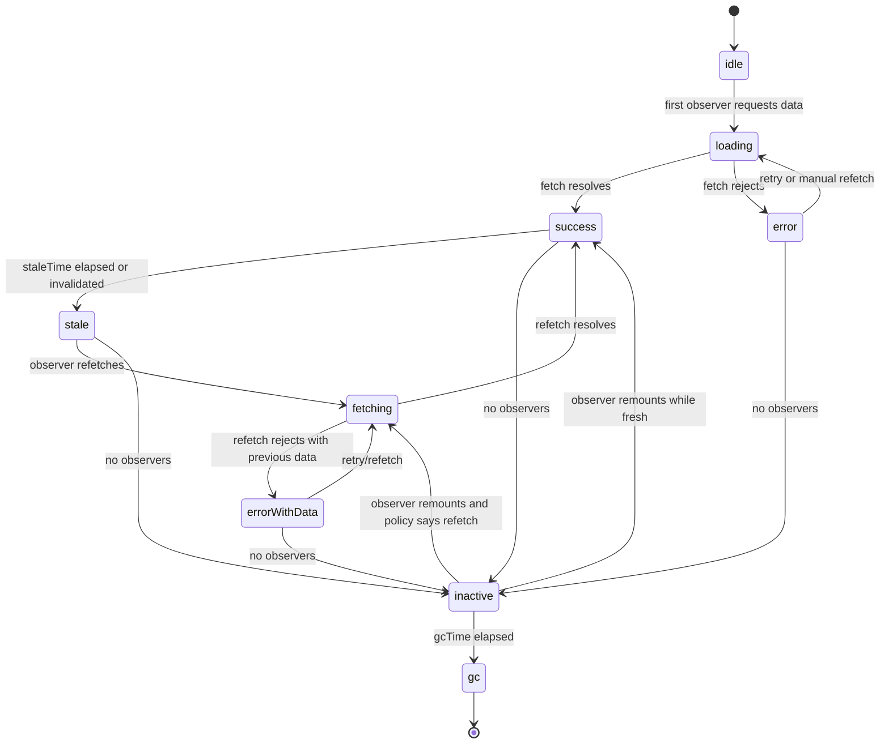
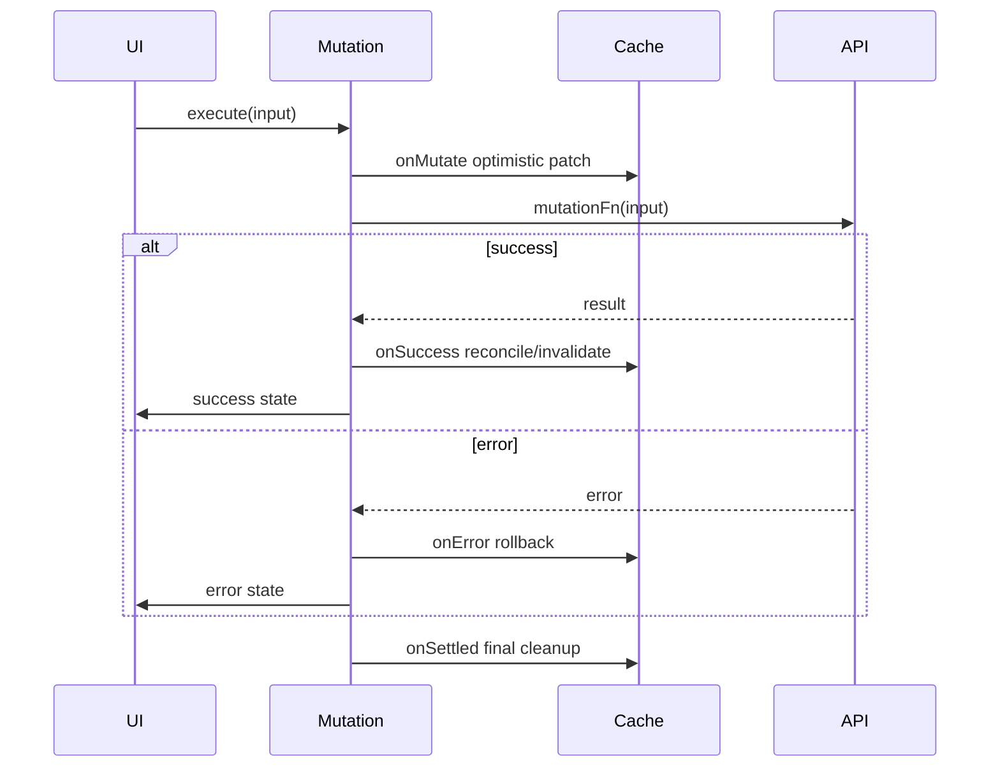

# Build From Scratch: React Query Cache Engine

A production React app does not need a query library because `fetch` is hard.

It needs a query engine because **server state is a replicated, asynchronous, stale-able, failure-prone copy of remote truth**.

That one sentence is the heart of this whole series.

A query cache engine is not just a map from URL to JSON. It is a small distributed-systems runtime inside the browser:

- it gives names to remote resources
- it deduplicates concurrent reads
- it tracks observers
- it distinguishes fresh, stale, fetching, paused, invalidated, and garbage-collectable data
- it propagates cancellation
- it remembers last-known-good data
- it coordinates mutation side effects
- it invalidates affected read models
- it prevents unnecessary network work
- it exposes a consistent snapshot to React
- it gives engineers evidence during incidents

This part builds a small server-state engine from scratch.

It is not meant to replace TanStack Query. It is meant to make the mechanism obvious enough that you can reason about real query engines, debug them under pressure, and design application-specific policies without superstition.

---

## 1. What We Are Building

We will build a minimal engine with these capabilities:

```txt
QueryClient
  QueryCache
    Query
      state
      observers
      promise
      abortController
      timers
  MutationExecutor
  React hook adapter
```

At the end, we want usage like this:

```tsx
const user = useMiniQuery({
  queryKey: ['tenant', tenantId, 'user', userId],
  queryFn: ({ signal }) => api.getUser(userId, { signal }),
  staleTime: 60_000,
  gcTime: 5 * 60_000,
});
```

And mutation usage like this:

```tsx
const renameUser = useMiniMutation({
  mutationFn: (input: RenameUserInput) => api.renameUser(input),
  onMutate: async (input, client) => {
    const key = ['tenant', input.tenantId, 'user', input.userId];
    const previous = client.getQueryData<User>(key);

    client.setQueryData<User>(key, old =>
      old ? { ...old, name: input.name } : old
    );

    return { previous, key };
  },
  onError: (_error, _input, context, client) => {
    if (context?.previous) {
      client.setQueryData(context.key, context.previous);
    }
  },
  onSuccess: (_result, input, _context, client) => {
    client.invalidateQueries({ queryKey: ['tenant', input.tenantId, 'user'] });
  },
});
```

The API is familiar on purpose. The lesson is the internals.

---

## 2. Query Engine as a State Machine

A query is not just data. It is a lifecycle.



The state machine reveals why a single `loading/error/data` tuple is weak.

A query can be:

- successful and fresh
- successful and stale
- successful and refreshing
- successful but background refetch failed
- empty but successful
- errored with no previous data
- inactive but still cached
- invalidated but not currently fetching
- paused because the app is offline
- garbage-collectable because no one observes it

A good query engine exposes this distinction without forcing every component to reinvent it.

---

## 3. Core Types

Start with the minimum set of types.

```ts
export type QueryKey = readonly unknown[];

export type QueryStatus = 'idle' | 'loading' | 'success' | 'error';
export type FetchStatus = 'idle' | 'fetching' | 'paused';

export interface QueryState<TData = unknown, TError = unknown> {
  data?: TData;
  error?: TError;
  status: QueryStatus;
  fetchStatus: FetchStatus;
  updatedAt: number;
  errorUpdatedAt: number;
  invalidated: boolean;
  failureCount: number;
}

export interface QueryFunctionContext {
  queryKey: QueryKey;
  signal: AbortSignal;
}

export type QueryFunction<TData> = (ctx: QueryFunctionContext) => Promise<TData>;

export interface QueryOptions<TData = unknown> {
  queryKey: QueryKey;
  queryFn: QueryFunction<TData>;
  staleTime?: number;
  gcTime?: number;
  retry?: number | false;
}

export interface QueryResult<TData = unknown, TError = unknown> {
  data?: TData;
  error?: TError;
  status: QueryStatus;
  fetchStatus: FetchStatus;
  isLoading: boolean;
  isSuccess: boolean;
  isError: boolean;
  isFetching: boolean;
  isStale: boolean;
  refetch: () => Promise<void>;
}
```

Important distinction:

```txt
status      = what data state do we have?
fetchStatus = is network work currently happening?
```

This split is why a UI can show stale data while a background refetch is running.

```txt
status: success
fetchStatus: fetching
```

That is different from the first load:

```txt
status: loading
fetchStatus: fetching
```

And different again from a background refetch error:

```txt
status: success
fetchStatus: idle
error: latest refetch error may be recorded separately depending on design
```

In a production engine, you may track more fields:

```ts
interface ExtendedQueryState<TData, TError> extends QueryState<TData, TError> {
  fetchMeta?: {
    requestId: string;
    startedAt: number;
    source: 'mount' | 'manual' | 'invalidation' | 'focus' | 'reconnect';
  };
  previousData?: TData;
  lastSuccessfulRequestId?: string;
  lastFailedRequestId?: string;
}
```

But do not start there. Start with the invariant.

```txt
A query state must tell React whether it has usable data and whether new network work is happening.
```

---

## 4. Query Identity: Hashing the Key

A cache needs an address.

For server state, the address is the query key.

```ts
export function hashQueryKey(queryKey: QueryKey): string {
  return stableStringify(queryKey);
}

function stableStringify(value: unknown): string {
  return JSON.stringify(normalize(value));
}

function normalize(value: unknown): unknown {
  if (Array.isArray(value)) {
    return value.map(normalize);
  }

  if (value && typeof value === 'object') {
    const obj = value as Record<string, unknown>;
    return Object.keys(obj)
      .sort()
      .reduce<Record<string, unknown>>((acc, key) => {
        const next = obj[key];
        if (next !== undefined) acc[key] = normalize(next);
        return acc;
      }, {});
  }

  return value;
}
```

This makes these equivalent:

```ts
['users', { page: 1, sort: 'name' }]
['users', { sort: 'name', page: 1 }]
```

But not these:

```ts
['users', '1']
['users', 1]
```

The engine cannot know whether those represent the same server resource.

That is an application-level key discipline.

A strong key has this shape:

```ts
const userKeys = {
  all: (tenantId: string) => ['tenant', tenantId, 'users'] as const,
  list: (tenantId: string, filters: UserFilters) =>
    [...userKeys.all(tenantId), 'list', normalizeUserFilters(filters)] as const,
  detail: (tenantId: string, userId: string) =>
    [...userKeys.all(tenantId), 'detail', userId] as const,
};
```

Bad key:

```ts
['users']
```

Better key:

```ts
['tenant', tenantId, 'users', 'list', { role, status, page }]
```

Best key:

```ts
userKeys.list(tenantId, { role, status, page })
```

The key is not naming. The key is isolation.

---

## 5. The Query Object

The query object owns a single cache entry.

```ts
type Listener = () => void;

export class Query<TData = unknown, TError = unknown> {
  readonly queryKey: QueryKey;
  readonly queryHash: string;

  private queryFn: QueryFunction<TData>;
  private staleTime: number;
  private gcTime: number;
  private retry: number | false;

  private state: QueryState<TData, TError>;
  private listeners = new Set<Listener>();
  private promise?: Promise<TData>;
  private abortController?: AbortController;
  private gcTimer?: ReturnType<typeof setTimeout>;
  private staleTimer?: ReturnType<typeof setTimeout>;

  constructor(options: QueryOptions<TData>) {
    this.queryKey = options.queryKey;
    this.queryHash = hashQueryKey(options.queryKey);
    this.queryFn = options.queryFn;
    this.staleTime = options.staleTime ?? 0;
    this.gcTime = options.gcTime ?? 5 * 60_000;
    this.retry = options.retry ?? 3;

    this.state = {
      status: 'idle',
      fetchStatus: 'idle',
      updatedAt: 0,
      errorUpdatedAt: 0,
      invalidated: false,
      failureCount: 0,
    };
  }

  getState(): QueryState<TData, TError> {
    return this.state;
  }

  setOptions(options: QueryOptions<TData>): void {
    this.queryFn = options.queryFn;
    this.staleTime = options.staleTime ?? this.staleTime;
    this.gcTime = options.gcTime ?? this.gcTime;
    this.retry = options.retry ?? this.retry;
  }

  subscribe(listener: Listener): () => void {
    this.listeners.add(listener);
    this.clearGcTimer();

    return () => {
      this.listeners.delete(listener);
      if (this.listeners.size === 0) {
        this.scheduleGc();
      }
    };
  }

  hasObservers(): boolean {
    return this.listeners.size > 0;
  }

  isStale(now = Date.now()): boolean {
    if (this.state.invalidated) return true;
    if (this.state.status !== 'success') return true;
    return now - this.state.updatedAt >= this.staleTime;
  }

  invalidate(): void {
    this.state = { ...this.state, invalidated: true };
    this.notify();
  }

  async fetch(): Promise<TData> {
    if (this.promise) return this.promise;

    this.abortController = new AbortController();

    this.state = {
      ...this.state,
      status: this.state.status === 'idle' ? 'loading' : this.state.status,
      fetchStatus: 'fetching',
    };
    this.notify();

    this.promise = this.fetchWithRetry(this.abortController.signal)
      .then(data => {
        this.state = {
          ...this.state,
          data,
          error: undefined,
          status: 'success',
          fetchStatus: 'idle',
          updatedAt: Date.now(),
          invalidated: false,
          failureCount: 0,
        };
        this.scheduleStaleTimer();
        this.notify();
        return data;
      })
      .catch(error => {
        this.state = {
          ...this.state,
          error: error as TError,
          status: this.state.data === undefined ? 'error' : this.state.status,
          fetchStatus: 'idle',
          errorUpdatedAt: Date.now(),
        };
        this.notify();
        throw error;
      })
      .finally(() => {
        this.promise = undefined;
        this.abortController = undefined;
      });

    return this.promise;
  }

  cancel(): void {
    this.abortController?.abort(new DOMException('Query cancelled', 'AbortError'));
  }

  setData(updater: TData | ((old: TData | undefined) => TData | undefined)): void {
    const old = this.state.data;
    const next = typeof updater === 'function'
      ? (updater as (old: TData | undefined) => TData | undefined)(old)
      : updater;

    this.state = {
      ...this.state,
      data: next,
      status: next === undefined ? this.state.status : 'success',
      updatedAt: Date.now(),
      invalidated: false,
    };
    this.notify();
  }

  private async fetchWithRetry(signal: AbortSignal): Promise<TData> {
    let attempt = 0;
    const maxRetries = this.retry === false ? 0 : this.retry;

    while (true) {
      try {
        return await this.queryFn({ queryKey: this.queryKey, signal });
      } catch (error) {
        if (signal.aborted) throw error;

        if (attempt >= maxRetries) {
          throw error;
        }

        attempt += 1;
        this.state = { ...this.state, failureCount: attempt };
        this.notify();

        await sleep(backoffWithJitter(attempt), signal);
      }
    }
  }

  private notify(): void {
    for (const listener of this.listeners) listener();
  }

  private scheduleGc(): void {
    if (this.gcTime === Infinity) return;
    this.clearGcTimer();
    this.gcTimer = setTimeout(() => {
      this.onGarbageCollect?.(this);
    }, this.gcTime);
  }

  private clearGcTimer(): void {
    if (this.gcTimer) clearTimeout(this.gcTimer);
    this.gcTimer = undefined;
  }

  private scheduleStaleTimer(): void {
    if (this.staleTime === Infinity) return;
    if (this.staleTimer) clearTimeout(this.staleTimer);

    this.staleTimer = setTimeout(() => {
      this.state = { ...this.state, invalidated: true };
      this.notify();
    }, this.staleTime);
  }

  onGarbageCollect?: (query: Query<TData, TError>) => void;
}

function sleep(ms: number, signal: AbortSignal): Promise<void> {
  return new Promise((resolve, reject) => {
    const timeout = setTimeout(resolve, ms);
    signal.addEventListener('abort', () => {
      clearTimeout(timeout);
      reject(signal.reason ?? new DOMException('Aborted', 'AbortError'));
    }, { once: true });
  });
}

function backoffWithJitter(attempt: number): number {
  const base = Math.min(1000 * 2 ** (attempt - 1), 30_000);
  return Math.floor(base * (0.5 + Math.random()));
}
```

This implementation has the important primitives:

- shared promise for deduplication
- abort controller for cancellation
- stale-time freshness
- GC after no observers
- retry with jitter
- listener notification
- manual cache writes

It is incomplete, but the skeleton is production-shaped.

---

## 6. Query Cache

The cache owns all query objects.

```ts
export class QueryCache {
  private queries = new Map<string, Query<any, any>>();

  build<TData>(options: QueryOptions<TData>): Query<TData> {
    const queryHash = hashQueryKey(options.queryKey);
    let query = this.queries.get(queryHash) as Query<TData> | undefined;

    if (!query) {
      query = new Query(options);
      query.onGarbageCollect = q => this.remove(q.queryHash);
      this.queries.set(queryHash, query);
    } else {
      query.setOptions(options);
    }

    return query;
  }

  find<TData = unknown>(queryKey: QueryKey): Query<TData> | undefined {
    return this.queries.get(hashQueryKey(queryKey)) as Query<TData> | undefined;
  }

  getAll(): Query[] {
    return [...this.queries.values()];
  }

  remove(queryHash: string): void {
    const query = this.queries.get(queryHash);
    query?.cancel();
    this.queries.delete(queryHash);
  }

  clear(): void {
    for (const query of this.queries.values()) query.cancel();
    this.queries.clear();
  }
}
```

Why not just `Map<string, unknown>`?

Because the cache entry is not only data. It also owns:

```txt
data
error
freshness
fetching state
promise
observers
cancellation
gc timer
retry state
invalidation flag
```

The resource representation is only one field inside the lifecycle.

---

## 7. Matching Query Keys

Invalidation usually targets a group, not one query.

```ts
export interface QueryFilters {
  queryKey?: QueryKey;
  exact?: boolean;
  predicate?: (query: Query) => boolean;
}

function matchesQuery(filters: QueryFilters, query: Query): boolean {
  if (filters.queryKey) {
    const expected = filters.queryKey;
    const actual = query.queryKey;

    if (filters.exact) {
      if (hashQueryKey(expected) !== query.queryHash) return false;
    } else {
      if (!partialDeepEqual(expected, actual)) return false;
    }
  }

  if (filters.predicate && !filters.predicate(query)) return false;

  return true;
}

function partialDeepEqual(expected: readonly unknown[], actual: readonly unknown[]): boolean {
  if (expected.length > actual.length) return false;

  for (let i = 0; i < expected.length; i += 1) {
    if (stableStringify(expected[i]) !== stableStringify(actual[i])) {
      return false;
    }
  }

  return true;
}
```

This lets us invalidate:

```ts
client.invalidateQueries({ queryKey: ['tenant', tenantId, 'users'] });
```

which can match:

```ts
['tenant', tenantId, 'users', 'list', { page: 1 }]
['tenant', tenantId, 'users', 'detail', userId]
['tenant', tenantId, 'users', 'search', { q: 'ann' }]
```

This is why query key hierarchy matters.

A sloppy key design makes invalidation either too broad or too weak.

---

## 8. Query Client

The query client is the public API over the cache.

```ts
export class QueryClient {
  readonly queryCache = new QueryCache();

  ensureQuery<TData>(options: QueryOptions<TData>): Query<TData> {
    return this.queryCache.build(options);
  }

  async fetchQuery<TData>(options: QueryOptions<TData>): Promise<TData> {
    const query = this.ensureQuery(options);

    if (!query.isStale()) {
      const data = query.getState().data;
      if (data !== undefined) return data as TData;
    }

    return query.fetch();
  }

  getQueryData<TData>(queryKey: QueryKey): TData | undefined {
    return this.queryCache.find<TData>(queryKey)?.getState().data;
  }

  setQueryData<TData>(
    queryKey: QueryKey,
    updater: TData | ((old: TData | undefined) => TData | undefined)
  ): void {
    const existing = this.queryCache.find<TData>(queryKey);

    if (existing) {
      existing.setData(updater);
      return;
    }

    const query = this.queryCache.build<TData>({
      queryKey,
      staleTime: 0,
      gcTime: 5 * 60_000,
      queryFn: async () => {
        throw new Error('No queryFn registered for manually created query');
      },
    });

    query.setData(updater);
  }

  invalidateQueries(filters: QueryFilters): void {
    const matches = this.queryCache.getAll().filter(q => matchesQuery(filters, q));

    for (const query of matches) {
      query.invalidate();
      if (query.hasObservers()) {
        void query.fetch().catch(() => {
          // Error is recorded inside query state.
        });
      }
    }
  }

  removeQueries(filters: QueryFilters): void {
    for (const query of this.queryCache.getAll()) {
      if (matchesQuery(filters, query)) {
        this.queryCache.remove(query.queryHash);
      }
    }
  }

  cancelQueries(filters: QueryFilters): void {
    for (const query of this.queryCache.getAll()) {
      if (matchesQuery(filters, query)) query.cancel();
    }
  }

  clear(): void {
    this.queryCache.clear();
  }
}
```

There are four different operations here, and they must not be confused:

| Operation | Meaning | Typical use |
|---|---|---|
| `setQueryData` | Write known data into cache | Optimistic update, mutation response reconciliation |
| `invalidateQueries` | Mark data stale and refetch active observers | After mutation affects read model |
| `removeQueries` | Delete cache entry | Logout, tenant switch, permission revocation |
| `cancelQueries` | Abort in-flight work | Route change, optimistic update preparation |

A common production bug is using invalidation when removal is required.

Example:

```txt
User switches tenant.
Old tenant data is invalidated.
But stale old tenant data remains visible until refetch completes.
```

Correct behavior for tenant switch is usually:

```ts
client.removeQueries({ queryKey: ['tenant', oldTenantId] });
```

or even:

```ts
client.clear();
```

if the authenticated scope changed completely.

---

## 9. React Integration with `useSyncExternalStore`

React needs a consistent way to subscribe to external state.

A query cache is an external store. It lives outside React.

The hook should:

1. get or create the query
2. subscribe to query changes
3. return a stable snapshot
4. trigger fetch when needed
5. clean up subscription on unmount

```tsx
import { useEffect, useMemo, useSyncExternalStore } from 'react';

const defaultClient = new QueryClient();

export function useMiniQuery<TData, TError = unknown>(
  options: QueryOptions<TData>,
  client = defaultClient
): QueryResult<TData, TError> {
  const query = useMemo(
    () => client.ensureQuery(options),
    [client, hashQueryKey(options.queryKey)]
  );

  // Keep latest query function and policy in sync.
  query.setOptions(options);

  const state = useSyncExternalStore(
    listener => query.subscribe(listener),
    () => query.getState(),
    () => query.getState()
  ) as QueryState<TData, TError>;

  useEffect(() => {
    if (query.isStale()) {
      void query.fetch().catch(() => {
        // Error already lives in query state.
      });
    }
  }, [query]);

  return {
    data: state.data,
    error: state.error,
    status: state.status,
    fetchStatus: state.fetchStatus,
    isLoading: state.status === 'loading',
    isSuccess: state.status === 'success',
    isError: state.status === 'error',
    isFetching: state.fetchStatus === 'fetching',
    isStale: query.isStale(),
    refetch: async () => {
      await query.fetch();
    },
  };
}
```

Why `useSyncExternalStore` instead of `useState + useEffect`?

Because React needs a way to read snapshots from external stores consistently during rendering.

A query cache is exactly that: a store outside React, mutated by network events, timers, focus events, mutation callbacks, and websocket events.

The invariant:

```txt
React components should subscribe to query snapshots, not own query lifecycle themselves.
```

---

## 10. First-Load vs Background-Refresh UI

The hook result lets UI distinguish first load from background refresh.

```tsx
function UserProfile({ userId }: { userId: string }) {
  const user = useMiniQuery({
    queryKey: ['user', userId],
    queryFn: ({ signal }) => api.getUser(userId, { signal }),
    staleTime: 60_000,
  });

  if (user.isLoading) return <ProfileSkeleton />;
  if (user.isError) return <ErrorPanel error={user.error} onRetry={user.refetch} />;

  return (
    <section aria-busy={user.isFetching}>
      {user.isFetching && <small>Refreshing...</small>}
      <h1>{user.data!.name}</h1>
    </section>
  );
}
```

Bad UI collapses all network work into a spinner.

Good UI preserves last-known-good data when the background refetch is not critical.

```txt
No data yet + fetching     -> skeleton
Data exists + fetching     -> stale data with subtle refresh indicator
Data exists + refetch fail -> stale data with non-blocking warning
No data + fail             -> blocking error
```

This is not cosmetic. It prevents unnecessary disruption during temporary network failure.

---

## 11. Focus and Reconnect Refetch

A real engine needs environmental triggers.

Create managers:

```ts
class FocusManager {
  private listeners = new Set<() => void>();

  constructor() {
    if (typeof window !== 'undefined') {
      window.addEventListener('visibilitychange', () => {
        if (document.visibilityState === 'visible') this.notify();
      });
      window.addEventListener('focus', () => this.notify());
    }
  }

  subscribe(listener: () => void): () => void {
    this.listeners.add(listener);
    return () => this.listeners.delete(listener);
  }

  private notify(): void {
    for (const listener of this.listeners) listener();
  }
}

class OnlineManager {
  private listeners = new Set<() => void>();

  constructor() {
    if (typeof window !== 'undefined') {
      window.addEventListener('online', () => this.notify());
    }
  }

  subscribe(listener: () => void): () => void {
    this.listeners.add(listener);
    return () => this.listeners.delete(listener);
  }

  private notify(): void {
    for (const listener of this.listeners) listener();
  }
}
```

Attach them to the client:

```ts
export class QueryClient {
  readonly queryCache = new QueryCache();
  private focusManager = new FocusManager();
  private onlineManager = new OnlineManager();

  constructor() {
    this.focusManager.subscribe(() => this.refetchStaleObservedQueries('focus'));
    this.onlineManager.subscribe(() => this.refetchStaleObservedQueries('reconnect'));
  }

  private refetchStaleObservedQueries(_source: 'focus' | 'reconnect'): void {
    for (const query of this.queryCache.getAll()) {
      if (query.hasObservers() && query.isStale()) {
        void query.fetch().catch(() => {});
      }
    }
  }

  // ...same methods as before
}
```

This is useful, but dangerous if policies are wrong.

Potential failure:

```txt
User focuses tab.
200 stale queries refetch.
API rate limit trips.
Page appears broken.
```

Production engines need:

- staleTime discipline
- query enable/disable controls
- refetch-on-focus policy per query
- jitter for mass refetch
- tenant/auth boundary checks
- telemetry for refetch source

---

## 12. Request Deduplication

Deduplication is already inside `Query.fetch()`:

```ts
if (this.promise) return this.promise;
```

That line prevents this:

```txt
Component A mounts user detail.
Component B mounts user sidebar.
Both need ['user', 42].
Only one request goes out.
Both observers receive the result.
```

But deduplication only works if the key is the same.

These will not dedupe:

```ts
['user', 42]
['user', '42']
['users', { id: 42 }]
['user', 42, { include: ['roles', 'profile'] }]
```

Deduplication is a design property of query identity.

It is not a library magic trick.

---

## 13. Cancellation Semantics

The query owns an `AbortController`, and the query function receives a signal.

```ts
queryFn: async ({ signal }) => {
  const response = await fetch('/api/users/42', { signal });
  return parseJson<User>(response);
}
```

But cancellation has limits.

Canceling a query means:

```txt
The client is no longer interested in this response.
```

It does not guarantee:

```txt
The server did not receive the request.
The server did not process the request.
A mutation had no side effect.
```

For reads, abort is mostly safe.

For mutations, abort is not correctness.

Mutation correctness needs:

- idempotency key
- operation ID
- conflict detection
- server-side transaction boundary
- status lookup for unknown outcome

The query engine should not pretend cancellation solves distributed side effects.

---

## 14. Mutation Executor

A mutation is not a query with `POST`.

A query asks:

```txt
What is the current representation of this resource?
```

A mutation commands:

```txt
Try to change the remote system.
```

Minimal mutation types:

```ts
export interface MutationOptions<TInput, TData, TContext = unknown> {
  mutationFn: (input: TInput) => Promise<TData>;
  onMutate?: (input: TInput, client: QueryClient) => Promise<TContext> | TContext;
  onSuccess?: (
    data: TData,
    input: TInput,
    context: TContext | undefined,
    client: QueryClient
  ) => void | Promise<void>;
  onError?: (
    error: unknown,
    input: TInput,
    context: TContext | undefined,
    client: QueryClient
  ) => void | Promise<void>;
  onSettled?: (
    data: TData | undefined,
    error: unknown | undefined,
    input: TInput,
    context: TContext | undefined,
    client: QueryClient
  ) => void | Promise<void>;
}

export class Mutation<TInput, TData, TContext = unknown> {
  private status: 'idle' | 'pending' | 'success' | 'error' = 'idle';
  private error?: unknown;
  private data?: TData;

  constructor(
    private options: MutationOptions<TInput, TData, TContext>,
    private client: QueryClient
  ) {}

  async execute(input: TInput): Promise<TData> {
    this.status = 'pending';
    let context: TContext | undefined;

    try {
      context = await this.options.onMutate?.(input, this.client);
      const data = await this.options.mutationFn(input);

      this.data = data;
      this.status = 'success';

      await this.options.onSuccess?.(data, input, context, this.client);
      await this.options.onSettled?.(data, undefined, input, context, this.client);

      return data;
    } catch (error) {
      this.error = error;
      this.status = 'error';

      await this.options.onError?.(error, input, context, this.client);
      await this.options.onSettled?.(undefined, error, input, context, this.client);

      throw error;
    }
  }

  getSnapshot() {
    return {
      status: this.status,
      error: this.error,
      data: this.data,
      isPending: this.status === 'pending',
      isSuccess: this.status === 'success',
      isError: this.status === 'error',
    };
  }
}
```

A mutation lifecycle gives us ordered hooks:



The hard part is not calling the server.

The hard part is preserving consistency between:

```txt
optimistic local branch
server committed state
cached read models
visible UI
user trust
```

---

## 15. React Mutation Hook

Minimal hook:

```tsx
import { useMemo, useSyncExternalStore } from 'react';

type StoreListener = () => void;

class ObservableMutation<TInput, TData, TContext> extends Mutation<TInput, TData, TContext> {
  private listeners = new Set<StoreListener>();

  subscribe(listener: StoreListener): () => void {
    this.listeners.add(listener);
    return () => this.listeners.delete(listener);
  }

  private emit(): void {
    for (const listener of this.listeners) listener();
  }

  override async execute(input: TInput): Promise<TData> {
    this.emit();
    try {
      return await super.execute(input);
    } finally {
      this.emit();
    }
  }
}

export function useMiniMutation<TInput, TData, TContext = unknown>(
  options: MutationOptions<TInput, TData, TContext>,
  client = defaultClient
) {
  const mutation = useMemo(
    () => new ObservableMutation(options, client),
    [client]
  );

  const snapshot = useSyncExternalStore(
    listener => mutation.subscribe(listener),
    () => mutation.getSnapshot(),
    () => mutation.getSnapshot()
  );

  return {
    ...snapshot,
    mutateAsync: (input: TInput) => mutation.execute(input),
    mutate: (input: TInput) => {
      void mutation.execute(input).catch(() => {});
    },
  };
}
```

This is simplified. A real mutation hook needs stable latest options, multiple calls, reset, variables, submittedAt, scope, retry, and paused/offline handling.

But the core model is enough:

```txt
mutation = command executor + lifecycle hooks + observable state
```

---

## 16. Optimistic Update Example

Assume a user detail query and a user list query.

```ts
const keys = {
  user: (tenantId: string, userId: string) =>
    ['tenant', tenantId, 'users', 'detail', userId] as const,
  users: (tenantId: string, filters: UserFilters) =>
    ['tenant', tenantId, 'users', 'list', normalizeUserFilters(filters)] as const,
};
```

Optimistic rename:

```tsx
const rename = useMiniMutation({
  mutationFn: (input: RenameUserInput) =>
    api.renameUser(input, {
      headers: {
        'Idempotency-Key': input.operationId,
      },
    }),

  onMutate: async (input, client) => {
    const detailKey = keys.user(input.tenantId, input.userId);
    const previousDetail = client.getQueryData<User>(detailKey);

    client.setQueryData<User>(detailKey, old =>
      old ? { ...old, name: input.name } : old
    );

    return { detailKey, previousDetail };
  },

  onError: (_error, _input, context, client) => {
    if (context?.previousDetail) {
      client.setQueryData(context.detailKey, context.previousDetail);
    }
  },

  onSuccess: (result, input, _context, client) => {
    client.setQueryData(keys.user(input.tenantId, input.userId), result.user);
    client.invalidateQueries({
      queryKey: ['tenant', input.tenantId, 'users', 'list'],
    });
  },
});
```

The sequence is defensible:

```txt
before mutation -> snapshot current detail
optimistic patch -> user sees immediate name
server success -> write canonical response
list impact -> invalidate list read models
server failure -> rollback detail snapshot
```

But watch the weak spot:

```txt
What if the request times out after server commit?
```

A naive rollback is wrong.

For high-risk commands, the server should support an operation status endpoint:

```txt
POST /commands/rename-user
Idempotency-Key: op_123

GET /commands/op_123
```

Then the client can resolve unknown outcome without lying to the user.

---

## 17. Structural Sharing

A cache update should avoid unnecessary re-renders.

Naive approach:

```ts
client.setQueryData(['users'], old => structuredClone(old));
```

Every object reference changes.

Every observer likely re-renders.

Better approach:

```ts
client.setQueryData<User[]>(['users'], old =>
  old?.map(user =>
    user.id === updated.id ? { ...user, ...updated } : user
  )
);
```

Unchanged user objects keep their identity.

This is structural sharing.

A real engine can do JSON-compatible structural sharing automatically:

```ts
function replaceEqualDeep<T>(oldValue: T, newValue: T): T {
  if (Object.is(oldValue, newValue)) return oldValue;

  if (Array.isArray(oldValue) && Array.isArray(newValue)) {
    let equalItems = 0;
    const result = newValue.map((item, index) => {
      const replaced = replaceEqualDeep(oldValue[index], item);
      if (replaced === oldValue[index]) equalItems += 1;
      return replaced;
    });

    return oldValue.length === newValue.length && equalItems === oldValue.length
      ? oldValue
      : (result as T);
  }

  if (isPlainObject(oldValue) && isPlainObject(newValue)) {
    const oldObj = oldValue as Record<string, unknown>;
    const newObj = newValue as Record<string, unknown>;
    const result: Record<string, unknown> = {};
    let equalItems = 0;
    const keys = Object.keys(newObj);

    for (const key of keys) {
      result[key] = replaceEqualDeep(oldObj[key], newObj[key]);
      if (result[key] === oldObj[key]) equalItems += 1;
    }

    return Object.keys(oldObj).length === keys.length && equalItems === keys.length
      ? oldValue
      : (result as T);
  }

  return newValue;
}

function isPlainObject(value: unknown): value is object {
  return Boolean(value) && Object.prototype.toString.call(value) === '[object Object]';
}
```

Then inside `Query.setData`:

```ts
const shared = replaceEqualDeep(old, next);
```

Structural sharing is a performance feature and a correctness aid. It prevents unnecessary UI churn after background refreshes that return the same data.

---

## 18. Selectors and Observer-Level Projection

Sometimes a component only needs part of the data.

```tsx
const userName = useMiniQuery({
  queryKey: ['user', userId],
  queryFn: getUser,
  select: user => user.name,
});
```

To support this cleanly, introduce observers.

The query owns raw state. The observer owns subscription-specific projection.

```txt
Query
  raw state: User
  observers:
    ProfileHeader -> select name
    Avatar -> select avatarUrl
    PermissionPanel -> select permissions
```

A basic observer:

```ts
class QueryObserver<TData, TSelected = TData> {
  private lastSelected?: TSelected;

  constructor(
    private query: Query<TData>,
    private select?: (data: TData) => TSelected
  ) {}

  getResult(): QueryResult<TSelected> {
    const state = this.query.getState();
    const selected = state.data === undefined
      ? undefined
      : this.select
        ? this.select(state.data)
        : (state.data as unknown as TSelected);

    this.lastSelected = selected;

    return {
      data: selected,
      error: state.error,
      status: state.status,
      fetchStatus: state.fetchStatus,
      isLoading: state.status === 'loading',
      isSuccess: state.status === 'success',
      isError: state.status === 'error',
      isFetching: state.fetchStatus === 'fetching',
      isStale: this.query.isStale(),
      refetch: async () => { await this.query.fetch(); },
    };
  }

  subscribe(listener: Listener): () => void {
    return this.query.subscribe(listener);
  }
}
```

In a full engine, the observer can avoid notifying React if selected output is referentially equal.

That is how large screens avoid re-rendering every component on every cache write.

---

## 19. Infinite Query Model

Infinite queries are not normal arrays.

They are pages with page parameters.

```ts
interface InfiniteData<TPage, TPageParam> {
  pages: TPage[];
  pageParams: TPageParam[];
}
```

A simple cache shape:

```ts
type UsersPage = {
  items: User[];
  nextCursor?: string;
};

type UsersInfinite = InfiniteData<UsersPage, string | undefined>;
```

Appending a page:

```ts
client.setQueryData<UsersInfinite>(usersFeedKey, old => {
  if (!old) {
    return {
      pages: [firstPage],
      pageParams: [undefined],
    };
  }

  return {
    pages: [...old.pages, nextPage],
    pageParams: [...old.pageParams, nextCursor],
  };
});
```

Mutation impact on infinite query is hard:

```ts
client.setQueryData<UsersInfinite>(usersFeedKey, old => {
  if (!old) return old;

  return {
    ...old,
    pages: old.pages.map(page => ({
      ...page,
      items: page.items.map(user =>
        user.id === updated.id ? { ...user, ...updated } : user
      ),
    })),
  };
});
```

Failure modes:

- duplicate item across pages
- item moves position due to sort order
- deleted item leaves count inconsistent
- filter-changing update keeps item in wrong page
- stale cursor after server-side data change
- memory grows without bound

Rule:

```txt
Patch infinite queries only when the mutation cannot change membership or order.
Otherwise invalidate.
```

---

## 20. Hydration and Dehydration

SSR and route loaders may prefetch queries on the server.

The client should not refetch immediately if the data is fresh.

Dehydrated shape:

```ts
interface DehydratedQuery {
  queryKey: QueryKey;
  state: QueryState<unknown, unknown>;
}

interface DehydratedState {
  queries: DehydratedQuery[];
}
```

Dehydrate:

```ts
function dehydrate(client: QueryClient): DehydratedState {
  return {
    queries: client.queryCache.getAll()
      .filter(query => query.getState().status === 'success')
      .map(query => ({
        queryKey: query.queryKey,
        state: query.getState(),
      })),
  };
}
```

Hydrate:

```ts
function hydrate(client: QueryClient, state: DehydratedState): void {
  for (const dehydrated of state.queries) {
    const query = client.ensureQuery({
      queryKey: dehydrated.queryKey,
      queryFn: async () => dehydrated.state.data,
      staleTime: 0,
    });

    query.setData(dehydrated.state.data);
  }
}
```

A real engine preserves `updatedAt`, error state rules, and query options separately.

Critical security rule:

```txt
Never dehydrate data that the browser should not see.
```

Server-side cache is not automatically safe to serialize.

Hydration is data transfer.

Data transfer is exposure.

---

## 21. Persistence

Persisting query cache can improve offline UX.

It can also leak data.

A persisted entry needs metadata:

```ts
interface PersistedQueryEntry {
  queryKey: QueryKey;
  state: QueryState<unknown, unknown>;
  persistedAt: number;
  userScope: string;
  tenantScope: string;
  schemaVersion: number;
}
```

On restore:

```ts
function shouldRestore(entry: PersistedQueryEntry, scope: Scope): boolean {
  if (entry.userScope !== scope.userId) return false;
  if (entry.tenantScope !== scope.tenantId) return false;
  if (entry.schemaVersion !== CURRENT_CACHE_SCHEMA_VERSION) return false;
  if (Date.now() - entry.persistedAt > MAX_PERSISTED_AGE) return false;
  return true;
}
```

Do not persist by default:

- PII
- permission-sensitive data
- financial records
- audit investigation records
- admin search results
- cross-tenant data
- signed URLs
- export contents
- raw error bodies

Persistence should be opt-in by data class.

---

## 22. Instrumentation

A query engine without telemetry is painful to debug.

Emit structured events:

```ts
type QueryEvent =
  | { type: 'query.fetch.start'; queryHash: string; queryKey: QueryKey; source: string; requestId: string }
  | { type: 'query.fetch.success'; queryHash: string; durationMs: number; requestId: string }
  | { type: 'query.fetch.error'; queryHash: string; durationMs: number; errorKind: string; requestId: string }
  | { type: 'query.invalidate'; queryHash: string; reason?: string }
  | { type: 'query.gc'; queryHash: string }
  | { type: 'mutation.start'; operationName: string; operationId?: string }
  | { type: 'mutation.success'; operationName: string; durationMs: number }
  | { type: 'mutation.error'; operationName: string; durationMs: number; errorKind: string };
```

Expose a listener:

```ts
class EventBus {
  private listeners = new Set<(event: QueryEvent) => void>();

  emit(event: QueryEvent): void {
    for (const listener of this.listeners) listener(event);
  }

  subscribe(listener: (event: QueryEvent) => void): () => void {
    this.listeners.add(listener);
    return () => this.listeners.delete(listener);
  }
}
```

Telemetry questions a query engine should answer:

- Which query keys refetch most often?
- Which invalidation rules cause refetch storms?
- Which queries have high failure count?
- Which queries are cached but never observed again?
- Which mutation causes the most rollback?
- Which cache entries are largest?
- Which user/tenant switch left stale data visible?
- Which endpoint causes timeout after focus refetch?

The point is not analytics vanity.

The point is operational control.

---

## 23. Devtools Mental Model

A useful internal devtool displays:

```txt
Query Hash
Query Key
Status
Fetch Status
Observer Count
Updated At
Stale?
Invalidated?
Failure Count
Data Size
Last Error
Last Fetch Source
```

Example table:

| Query Key | Status | Fetch | Observers | Stale | Age | Failure |
|---|---:|---:|---:|---:|---:|---:|
| `['tenant','t1','users','list']` | success | idle | 2 | false | 23s | 0 |
| `['tenant','t1','case','c9']` | success | fetching | 1 | true | 8m | 1 |
| `['tenant','t0','admin','stats']` | success | idle | 0 | true | 2h | 0 |

The last row is suspicious after tenant switch.

A devtool does not merely show state. It exposes broken invariants.

---

## 24. Production Hardening Checklist

A build-from-scratch engine becomes production-ready only if it covers these invariants.

### Identity

```txt
Every query key includes all representation-shaping inputs.
Every query key includes tenant/user/permission scope when the data depends on them.
Keys are generated through factories, not ad hoc arrays everywhere.
```

### Fetch

```txt
Query functions consume AbortSignal.
Fetch errors are classified.
HTTP errors are not treated as network errors.
Empty responses are parsed safely.
Retries have budget, backoff, and idempotency rules.
```

### Cache lifecycle

```txt
staleTime is explicit for important query families.
gcTime is bounded for high-cardinality queries.
Focus/reconnect refetch does not create storms.
Last-known-good data is preserved intentionally.
```

### Mutation

```txt
Optimistic updates snapshot before patching.
Rollback handles failure but not unknown outcome blindly.
Mutation response reconciles canonical data.
Invalidation targets all affected read models.
High-risk commands use idempotency keys.
```

### Security

```txt
Logout clears sensitive cache.
Tenant switch removes old-tenant data.
Permission change removes or invalidates affected data.
Persisted cache is scoped and versioned.
Dehydration never serializes server-only data.
```

### Observability

```txt
Query and mutation events include operation names.
Network traces include correlation/request ID.
Errors include taxonomy, not just message strings.
Refetch source is visible.
Invalidation reason is visible.
```

---

## 25. Failure Modes of Our Mini Engine

Our mini engine is intentionally incomplete.

Known weaknesses:

| Weakness | Consequence | Production fix |
|---|---|---|
| Options identity in hook is simplistic | queryFn updates may be stale or excessive | observer object with stable latest options |
| No enabled flag | dependent queries fetch too early | add `enabled` policy |
| No network mode | offline handling poor | add online manager + paused fetch state |
| No retry classifier | retries unsafe errors | classify by error kind/method/idempotency |
| No mutation concurrency policy | autosave may commit out of order | mutation scopes and version checks |
| No partial observer notification | extra re-renders | selector memoization and tracked props |
| No hydration timestamp preservation | immediate refetch or stale lie | preserve `updatedAt` during hydration |
| No cache size limit | memory bloat | LRU/size budget/high-cardinality policy |
| No broadcast channel | multi-tab amplification | cross-tab query coordination |
| No persistence policy | data leak risk | opt-in scoped persistence |

This is why mature query libraries are complex.

But complexity is not accidental. It is the accumulated shape of real client-server failure.

---

## 26. The Actual Lesson

A query cache engine is a consistency layer.

It translates this unstable world:

```txt
remote data
network failures
browser lifecycle
user navigation
mutation side effects
multiple observers
cache freshness
security boundaries
```

into a stable UI contract:

```txt
Here is the best known data.
Here is whether it is fresh.
Here is whether new work is happening.
Here is what failed.
Here is how to retry.
Here is how mutation affects replicas.
```

That is the value.

Do not reduce server-state tooling to convenience hooks.

The top-tier engineer sees it as a small, local replica-management runtime.

---

## References

- TanStack Query QueryClient: https://tanstack.com/query/latest/docs/reference/QueryClient
- TanStack Query Important Defaults: https://tanstack.com/query/v5/docs/framework/react/guides/important-defaults
- TanStack Query Query Invalidation: https://tanstack.com/query/latest/docs/framework/react/guides/query-invalidation
- TanStack Query Query Cancellation: https://tanstack.com/query/v5/docs/react/guides/query-cancellation
- React `useSyncExternalStore`: https://react.dev/reference/react/useSyncExternalStore
- MDN AbortController: https://developer.mozilla.org/en-US/docs/Web/API/AbortController
- MDN Fetch API: https://developer.mozilla.org/en-US/docs/Web/API/Fetch_API
