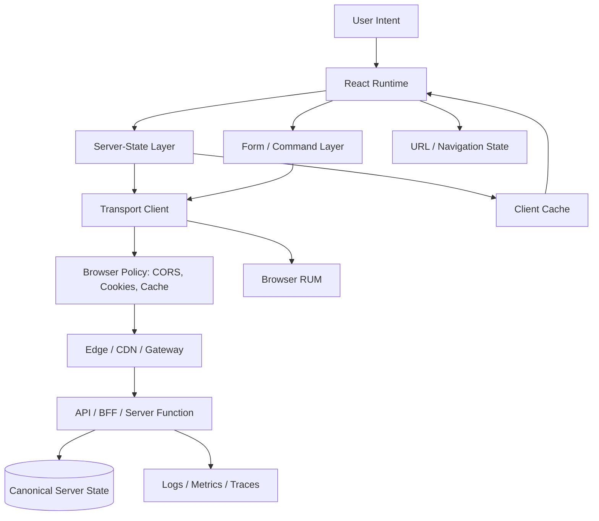
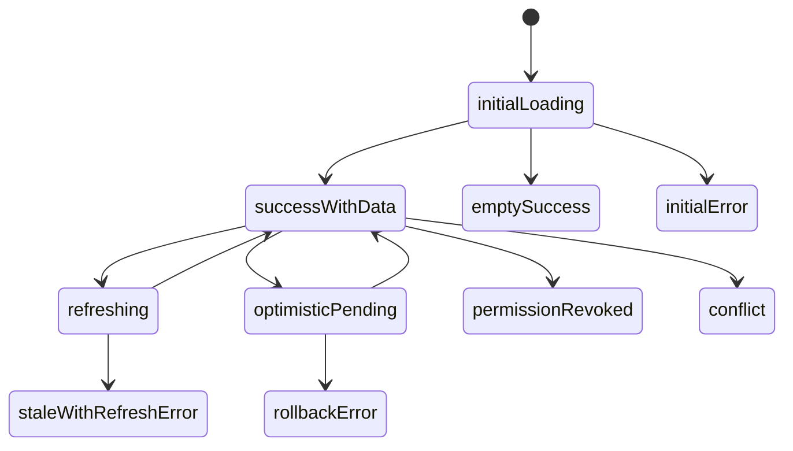
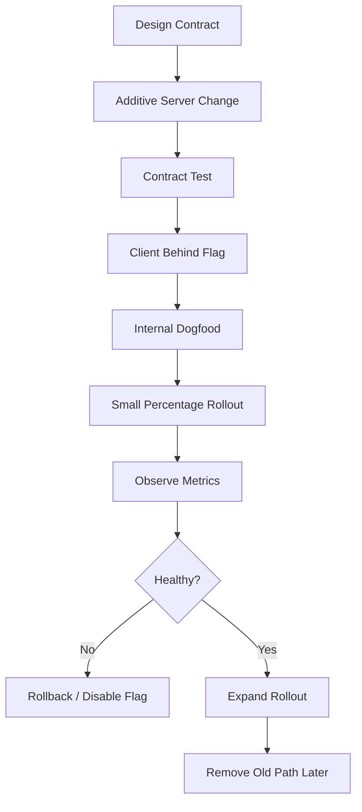
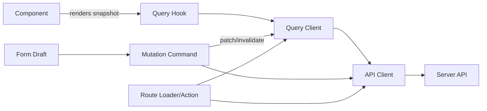

# Production Readiness Review and Final Playbook

This is the last part of the series.

By now, client-server communication should no longer look like this:

```tsx
useEffect(() => {
  fetch('/api/data').then(r => r.json()).then(setData);
}, []);
```

That code may work in a demo.

A production React system needs a stronger model:

```txt
User intent
  -> UI boundary
  -> route/query/form/server-function boundary
  -> typed request
  -> browser policy
  -> transport
  -> API contract
  -> response/error contract
  -> parsing/validation
  -> cache/update/invalidation
  -> rendering state
  -> telemetry
  -> recovery path
```

This final part is the review playbook.

Use it before launching a feature, reviewing a PR, designing a new API, debugging a production incident, or deciding whether a React screen is mature enough for enterprise-grade usage.

---

## 1. The Final Mental Model

A React app is not only a UI.

It is a distributed client replica.



The client holds a replica.

The server holds canonical state.

The network is unreliable.

The browser enforces policy.

The cache can be stale.

Mutations can have unknown outcomes.

A top-tier React engineer designs around those facts instead of hiding them behind a loading spinner.

---

## 2. The Ten Invariants

Everything in this series can be compressed into ten invariants.

### Invariant 1: Every remote representation has an identity

If a response can vary by tenant, user, permission, locale, filters, pagination, feature flag, or API version, the client-side cache identity must include that dimension.

Bad:

```ts
['cases']
```

Good:

```ts
['tenant', tenantId, 'cases', 'list', { status, ownerId, page, sort, locale }]
```

If the query key does not describe the representation, the cache will eventually lie.

### Invariant 2: Server state is not client state

Server state is:

```txt
remote
shared
async
cacheable
stale-able
invalidatable
permission-sensitive
```

Client state is:

```txt
local
immediate
usually private to UI interaction
owned by the browser session/component
```

Do not push server state into a generic store and pretend freshness does not exist.

### Invariant 3: A mutation is a command, not a write to local state

A mutation may:

- validate
- reject
- partially succeed
- timeout after commit
- be retried
- conflict with newer state
- trigger workflow transitions
- affect many read models
- require audit evidence

Treat mutation as command lifecycle.

### Invariant 4: Cache invalidation is a consistency protocol

Invalidation is not cleanup.

It is how the client says:

```txt
My replica may no longer represent the server truth.
```

Every mutation should have an impact map.

### Invariant 5: HTTP errors, network errors, domain errors, and contract errors are different

Do not collapse everything into:

```ts
throw new Error('Something went wrong');
```

A good client distinguishes:

- abort
- timeout
- DNS/TLS/network failure
- CORS/browser policy failure
- 400 validation
- 401 authentication
- 403 authorization
- 404 absence or concealment
- 409 conflict
- 412 precondition failed
- 422 domain validation
- 429 rate limit
- 5xx server failure
- malformed response
- incompatible contract

The UI and retry policy depend on the class of failure.

### Invariant 6: The browser is a security boundary, not a trusted runtime

Anything shipped to the browser is exposed:

- JS bundle
- source maps
- public config
- local storage
- IndexedDB
- service worker cache
- query cache
- dehydrated SSR payload
- telemetry payload
- URLs
- request headers visible in DevTools

Do not put secrets in the client.

Do not send PII just because the UI currently hides it.

### Invariant 7: Performance is shaped by dependency graph depth, not only payload size

A 10 KB response can be slow if it waits behind four dependent requests.

A 200 KB response can be acceptable if it removes a critical waterfall and is cacheable.

Review the graph:

```txt
route -> user -> permissions -> dashboard -> widgets -> each widget details
```

The critical path matters more than request count alone.

### Invariant 8: Realtime is reconciliation, not just sockets

WebSocket/SSE only delivers messages.

The client still needs:

- event IDs
- version checks
- deduplication
- ordering rules
- gap detection
- resume cursor
- snapshot refetch
- permission revocation handling
- cache patch/invalidation policy

A realtime stream without reconciliation is a corruption channel.

### Invariant 9: Offline support is a product and correctness decision

Offline-first is not simply retrying later.

It requires:

- durable outbox
- operation IDs
- idempotency keys
- conflict resolution
- user-visible pending state
- replay policy
- authorization refresh
- attachment handling
- audit semantics

Do not promise offline writes unless the domain can tolerate delayed, conflicting commands.

### Invariant 10: Every boundary must produce evidence

Production debugging requires evidence:

- operation name
- query key
- mutation ID
- request ID
- traceparent
- user/tenant scope, safely represented
- error taxonomy
- cache state
- retry count
- refetch source
- timing breakdown

No evidence means every incident becomes archaeology.

---

## 3. Architecture Review Template

Use this when designing a new screen.

```md
# Client-Server Communication Review

## Screen / Feature
- Name:
- Route:
- Owner:
- User roles:
- Tenant scope:

## Remote Data
| Data | Owner | Query Key | Freshness | Cache Scope | Sensitive? |
|---|---|---|---|---|---|
| | | | | | |

## Mutations
| Command | Endpoint / Action | Idempotent? | Affected Queries | Conflict Policy | Audit Event |
|---|---|---:|---|---|---|
| | | | | | |

## Failure States
| Failure | UI Behavior | Retry? | Recovery |
|---|---|---:|---|
| 401 | | | |
| 403 | | | |
| 409/412 | | | |
| 429 | | | |
| timeout | | | |
| malformed response | | | |

## Performance
- Critical route data:
- Deferred data:
- Waterfall depth:
- Expected request count:
- Largest response:
- Prefetch policy:
- Cache headers:

## Security / Privacy
- PII fields returned:
- Fields hidden by UI but still transported:
- Signed URL usage:
- Persisted cache:
- Telemetry redaction:
- Tenant/user isolation:

## Observability
- Operation names:
- Request IDs:
- Trace propagation:
- Client metrics:
- Server metrics:
- Dashboards:

## Testing
- MSW handlers:
- Contract tests:
- Race tests:
- Offline tests:
- Permission tests:
- Cache invalidation tests:
```

A design that cannot fill this template is not ready.

---

## 4. PR Review Checklist

Use this when reviewing React code that crosses the network.

### Request construction

```txt
[ ] URL is canonical and stable.
[ ] Query params are encoded through a serializer, not string concatenation.
[ ] Method semantics are correct.
[ ] Headers are explicit and minimal.
[ ] Credentials mode is intentional.
[ ] AbortSignal is passed through.
[ ] Timeout/deadline policy exists where needed.
[ ] Idempotency key exists for retry-sensitive mutation.
```

### Response handling

```txt
[ ] HTTP errors are handled separately from network errors.
[ ] Empty responses are parsed safely.
[ ] Content-Type is checked when needed.
[ ] Runtime validation exists at untrusted boundary.
[ ] Problem Details or equivalent error envelope is mapped.
[ ] Domain errors are displayed with actionable recovery.
```

### Cache identity

```txt
[ ] Query key includes all representation-shaping inputs.
[ ] Query key includes tenant/user/permission scope where relevant.
[ ] Key is generated by factory.
[ ] List/detail/search/infinite keys are organized hierarchically.
[ ] No cache key contains raw PII unless unavoidable and reviewed.
```

### Freshness and lifecycle

```txt
[ ] staleTime is chosen intentionally.
[ ] gcTime is bounded for high-cardinality data.
[ ] Refetch-on-focus/reconnect is appropriate.
[ ] Background refetch preserves last-known-good data.
[ ] Initial loading and refresh loading are different UI states.
```

### Mutation correctness

```txt
[ ] Duplicate submit is controlled.
[ ] Pending state is visible.
[ ] Optimistic update has snapshot and rollback.
[ ] Unknown outcome is handled for high-risk commands.
[ ] Conflict response has a recovery flow.
[ ] Mutation response is reconciled with cache.
[ ] Affected query invalidation is explicit.
```

### Security

```txt
[ ] No secret is sent to browser.
[ ] PII is minimized at response contract.
[ ] Sensitive data is not placed in URL.
[ ] Cache is cleared on logout/scope switch.
[ ] Persisted cache is scoped, versioned, and reviewed.
[ ] Signed URLs have narrow scope and short TTL.
[ ] Telemetry redacts sensitive fields.
```

### Observability

```txt
[ ] Operation name is emitted.
[ ] Request ID is included or captured.
[ ] Trace context is propagated where supported.
[ ] Error taxonomy is available to logs/RUM.
[ ] Cache hit/miss/refetch source is observable.
[ ] Retry count and final outcome are observable.
```

### Testing

```txt
[ ] Happy path test exists.
[ ] 400/401/403/404/409/412/422/429/5xx tests exist as relevant.
[ ] Timeout/abort test exists where relevant.
[ ] Race-order test exists for changing params/search/autosave.
[ ] Cache invalidation test proves stale UI does not survive mutation.
[ ] Contract drift test exists for generated/typed clients.
```

---

## 5. API Contract Review

A React app is only as reliable as its contract.

Review every API used by the frontend through these lenses.

### Resource and representation

Ask:

```txt
What resource does this endpoint represent?
What shape is returned?
What inputs change the representation?
Is the URL canonical?
Is this a read model or command result?
```

Bad endpoint:

```txt
GET /api/getStuff?id=123&type=full
```

Better:

```txt
GET /api/tenants/{tenantId}/cases/{caseId}?include=timeline,assignees
```

### Method and status semantics

Ask:

```txt
Does GET mutate anything?
Is PUT/PATCH/POST used intentionally?
Does DELETE return 204 or representation?
Does validation use 400, 422, or domain-specific Problem Details consistently?
Does conflict use 409 or 412?
Does rate limit use 429 with Retry-After?
```

### Error contract

A frontend-friendly error response has:

```json
{
  "type": "https://example.com/problems/validation-error",
  "title": "Validation failed",
  "status": 422,
  "detail": "One or more fields are invalid.",
  "instance": "/requests/req_123",
  "code": "CASE_VALIDATION_FAILED",
  "fieldErrors": {
    "dueDate": ["Due date must be in the future."]
  }
}
```

The exact format can vary.

The invariant cannot:

```txt
The client must be able to map errors to UI behavior without parsing prose.
```

### Versioning

Prefer additive evolution:

```txt
add optional response fields
add optional request fields
add enum values only with client fallback
add endpoints before replacing old ones
```

Breaking changes require:

```txt
contract diff
consumer impact analysis
dual-read or dual-write phase
feature flag
rollout metric
rollback plan
```

---

## 6. Cache Policy Decision Matrix

| Data class | Example | staleTime | Persist? | Refetch on focus? | Notes |
|---|---|---:|---:|---:|---|
| Static reference | country list, feature metadata | hours/days | maybe | no | Version by schema/content hash |
| User profile | current user summary | minutes | maybe | yes | Clear on logout/scope change |
| Permission set | role/capability matrix | short | no | yes | Invalidate on authz change |
| Case detail | regulatory case read model | short-medium | usually no | maybe | Use version/ETag/conflict policy |
| Dashboard metrics | counts, queues, SLA | seconds | no | yes/poll | Consider SSE/polling with budget |
| Search results | filtered list | short | no | no/maybe | Key must include filters; high cardinality |
| Signed URLs | upload/download URL | very short | no | no | Treat as capability token |
| Audit log | investigation history | medium | no | maybe | PII/security-sensitive |
| Draft form data | unsent UI input | local owner | maybe separately | no | Not server cache |
| Realtime feed | notifications/events | snapshot + stream | maybe cursor only | reconnect | Requires gap detection |

Do not use one global cache policy for everything.

That is how stale permission bugs and refetch storms happen.

---

## 7. Mutation Impact Matrix

Every mutation should document affected read models.

Example: `assignCase`

| Read model | Impact | Strategy |
|---|---|---|
| Case detail | assignee changes | patch from response |
| Case list by assignee | membership changes | invalidate lists under `cases/list` |
| Dashboard workload count | count changes | invalidate dashboard metrics |
| User workload summary | count changes | invalidate user summary |
| Timeline | new event | append if returned, else invalidate |
| Notification feed | maybe new event | realtime event or invalidate |
| Audit export | affected but not visible | no immediate client action |

The mutation handler then becomes policy implementation, not guesswork.

```ts
onSuccess: (result, input, _context, client) => {
  client.setQueryData(caseKeys.detail(input.tenantId, input.caseId), result.case);

  client.invalidateQueries({ queryKey: caseKeys.lists(input.tenantId) });
  client.invalidateQueries({ queryKey: dashboardKeys.workload(input.tenantId) });
  client.invalidateQueries({ queryKey: userKeys.workload(input.tenantId, result.assigneeId) });
}
```

For regulated or workflow-heavy systems, this matrix is not optional.

It is part of defensibility.

---

## 8. UI State Review

Remote data UI should be a state machine.



Checklist:

```txt
[ ] Is first loading different from background refresh?
[ ] Can empty success be distinguished from error?
[ ] Can stale data remain visible during refetch?
[ ] Does refresh failure destroy useful data unnecessarily?
[ ] Is optimistic state visually clear when needed?
[ ] Does conflict have a recovery path?
[ ] Does 403 after previously visible data remove sensitive content?
[ ] Are disabled controls explained?
[ ] Are loading/error states accessible?
```

Bad UI:

```tsx
if (isLoading) return <Spinner />;
if (error) return <Error />;
return <Data />;
```

Better UI:

```tsx
if (query.status === 'loading') return <Skeleton />;

if (query.status === 'error') {
  return <BlockingError error={query.error} onRetry={query.refetch} />;
}

return (
  <section aria-busy={query.isFetching}>
    {query.isFetching && <RefreshIndicator />}
    {query.refreshError && <NonBlockingWarning error={query.refreshError} />}
    {query.data.items.length === 0 ? <EmptyState /> : <ResultList items={query.data.items} />}
  </section>
);
```

The user should not pay a full-screen loading penalty for every background consistency check.

---

## 9. Performance Review

Measure performance as critical path.

```txt
Page useful at T = max(required data dependencies + render + hydration + main-thread work)
```

Review these numbers:

```txt
route waterfall depth
number of critical requests
number of non-critical requests
largest payload size
duplicated payload fields
cache hit rate
background refetch rate
retry amplification
prefetch hit rate
hydration duplicate fetch count
LCP impact
INP impact
```

### Route data classification

| Class | Meaning | Example | Strategy |
|---|---|---|---|
| Critical | needed to render useful shell | case title/status | loader/RSC/prefetch |
| Important | needed soon after shell | timeline preview | parallel query/defer |
| Secondary | below fold or interaction-based | full audit log | lazy query |
| Opportunistic | maybe needed | detail tabs | intent prefetch |

Do not block route usefulness on secondary data.

### Waterfall smell

```txt
GET /me
  -> GET /permissions
    -> GET /dashboard
      -> GET /widgets
        -> GET /widgets/1
        -> GET /widgets/2
        -> GET /widgets/3
```

Possible fixes:

- include permission summary in `/me`
- route loader performs parallel fetches
- BFF aggregates dashboard view model
- widgets endpoint returns enough summary
- detail queries load only on interaction
- prefetch predictable detail
- avoid component-level mount waterfalls

The best performance fix is often a better data boundary.

---

## 10. Security Review

Security review starts with one question:

```txt
What crosses into the browser?
```

Everything that crosses is exposed.

### Data minimization

For every response field, ask:

```txt
Does the current UI need this field?
Can this field be derived server-side?
Is this field sensitive for some roles?
Should this field be masked/redacted?
Will this field end up in logs, cache, URLs, telemetry, screenshots, or export?
```

Bad:

```json
{
  "id": "case_123",
  "title": "Case A",
  "internalRiskScore": 94,
  "investigatorNotes": "...",
  "citizenNationalId": "..."
}
```

when the UI only needs:

```json
{
  "id": "case_123",
  "title": "Case A"
}
```

### Browser storage

Avoid storing sensitive server data in:

- `localStorage`
- `sessionStorage`
- IndexedDB
- service worker cache
- persisted query cache
- URL query parameters
- source maps
- telemetry breadcrumbs

### Scope transitions

On these events, clear or remove sensitive cache:

- logout
- login as different user
- tenant switch
- role/permission change
- impersonation start/end
- admin mode exit
- token refresh failure
- account disabled

```ts
function onAuthScopeChanged(client: QueryClient) {
  client.clear();
  clearPersistedQueryCache();
  clearOfflineOutboxForPreviousScope();
}
```

Do not rely on invalidation alone for sensitive data.

---

## 11. Realtime Review

Realtime requires an explicit protocol.

Minimum event envelope:

```ts
type RealtimeEvent = {
  id: string;
  type: string;
  tenantId: string;
  resourceType: string;
  resourceId: string;
  version?: number;
  occurredAt: string;
  payload?: unknown;
};
```

Review:

```txt
[ ] Does each event have a stable ID?
[ ] Can the client dedupe events?
[ ] Is ordering defined per stream, resource, or tenant?
[ ] Is there a resume cursor?
[ ] What happens after a gap?
[ ] What happens after reconnect?
[ ] What happens after permission revocation?
[ ] Are events validated at runtime?
[ ] Does event payload patch cache or trigger invalidation?
[ ] Does optimistic mutation know how to reconcile confirmation event?
```

Simple rule:

```txt
Patch only when the event is complete, ordered, authorized, and version-safe.
Invalidate/refetch when unsure.
```

Realtime correctness is more important than realtime cleverness.

---

## 12. Offline Review

Offline write support must answer:

```txt
Can this command be safely delayed?
Can this command be safely replayed?
Can this command conflict?
Can the user understand pending state?
Can the server dedupe it?
Can audit history represent delayed intent vs delayed commit?
```

Minimum outbox command:

```ts
type OutboxCommand = {
  operationId: string;
  idempotencyKey: string;
  type: string;
  tenantId: string;
  userId: string;
  createdAt: string;
  payload: unknown;
  attempt: number;
  status: 'pending' | 'replaying' | 'succeeded' | 'failed' | 'conflict';
};
```

Do not offline-queue:

- destructive admin actions
- high-risk financial/regulatory decisions
- actions requiring fresh permission check
- commands depending on rapidly changing state
- commands whose user intent expires quickly

Unless the domain has explicitly designed for that behavior.

---

## 13. Observability Review

A production React communication layer should emit structured evidence.

### Client event fields

```ts
type ClientNetworkEvent = {
  eventType: 'request.start' | 'request.success' | 'request.error';
  operationName: string;
  requestId?: string;
  traceId?: string;
  routeId?: string;
  queryHash?: string;
  mutationId?: string;
  method?: string;
  status?: number;
  errorKind?: string;
  durationMs?: number;
  retryCount?: number;
  cacheState?: 'hit' | 'miss' | 'stale' | 'background-refetch';
  refetchSource?: 'mount' | 'focus' | 'reconnect' | 'poll' | 'invalidation' | 'manual';
};
```

### Dashboards

Minimum dashboards:

```txt
API error rate by operation
API latency by operation and route
Client parse/contract error rate
Mutation rollback rate
429/rate-limit events
Retry amplification
Focus/reconnect refetch volume
Cache hit/stale/refetch rate
Hydration duplicate fetch count
Realtime reconnect/gap count
Offline outbox backlog
Top query keys by memory/data size
```

### Incident correlation

Every serious bug report should be traceable from:

```txt
user action
  -> client event
  -> request ID
  -> backend trace
  -> server logs
  -> database/audit event
  -> response
  -> client cache update
```

If not, the system is under-instrumented.

---

## 14. Testing Strategy

Do not test only the happy path.

### Unit tests

Good for:

- parser behavior
- URL serializer
- query key factory
- error classifier
- invalidation impact map
- conflict resolver
- idempotency key generation

### Integration tests with request mocking

Good for:

- loading/error/success state
- mutation lifecycle
- optimistic rollback
- validation errors
- 401/403/404 behavior
- 429 retry behavior
- malformed payload
- delayed responses
- race-order changes

### Browser/e2e tests

Good for:

- cookies/credentials
- CORS-like deployment behavior
- file upload/download
- service worker cache
- navigation cancellation
- bfcache/back-forward behavior
- real browser performance timing

### Contract tests

Good for:

- OpenAPI schema compatibility
- generated client drift
- GraphQL operation compatibility
- error envelope stability
- enum fallback behavior

### Chaos/network simulation

Good for:

- timeout
- offline
- partial response
- duplicate response
- delayed response
- server 500
- rate limit
- websocket reconnect
- SSE gap
- background refetch failure

A feature is not production-ready until failure behavior has been tested.

---

## 15. Rollout Strategy

Client-server changes fail at boundaries.

Use safe rollout.



Checklist:

```txt
[ ] Is server change additive?
[ ] Can old client still work?
[ ] Can new client handle old server response during rollout?
[ ] Is feature behind a remotely disable-able flag?
[ ] Are metrics segmented by client version?
[ ] Is there a rollback path that does not require app store/browser cache purge?
[ ] Are cache keys versioned if representation changed incompatibly?
[ ] Are persisted caches migrated or cleared?
```

Most rollout incidents are caused by mixed-version reality.

Design for it.

---

## 16. Incident Playbook

When something breaks in production, do not guess.

### Step 1: Classify the symptom

```txt
No request sent
Request blocked by browser
Request sent but pending
Request failed network
Request returned HTTP error
Response malformed
Client parsed correctly but cache wrong
Cache correct but UI wrong
Mutation outcome unknown
Realtime stream stale/gapped
Service worker/CDN served old asset/data
```

### Step 2: Capture evidence

```txt
route
operation name
query key or mutation ID
request URL/method/status
request ID / trace ID
timing
headers relevant to cache/CORS/auth
response body or error envelope if safe
client version
tenant/user scope if safe
browser/version
network condition
```

### Step 3: Find boundary of failure

Use the boundary chain:

```txt
intent
UI handler
query/mutation/router/server action
API client
browser policy
transport
edge/CDN
backend
database/workflow
response parser
cache update
render
```

The bug lives at one boundary.

### Step 4: Apply containment

Containment options:

```txt
disable feature flag
increase staleTime temporarily to reduce load
turn off polling/realtime subscription
disable optimistic update
force cache clear on scope transition
route traffic away from bad edge region
rollback API response change
serve compatibility response
```

### Step 5: Add regression evidence

Every incident should produce:

```txt
one better invariant
one better test
one better telemetry signal
one documented failure mode
```

That is how systems become stronger instead of merely patched.

---

## 17. The Senior Engineer's Default Architecture

For most serious React apps, a reliable default looks like this:

```txt
1. Route owns navigation-critical data.
2. Query cache owns server-state replicas.
3. Forms own local drafts until submission.
4. Mutations are command lifecycles with explicit impact maps.
5. API client owns transport, parsing, error classification, timeout, and tracing.
6. Runtime validation exists at trust boundaries.
7. Cache keys include tenant/user/scope and representation inputs.
8. Server exposes structured errors and conflict information.
9. Realtime events patch only version-safe resources; otherwise invalidate.
10. Security-sensitive data is removed, not merely invalidated, on scope change.
```

This architecture scales because responsibilities are separated.



The component is not responsible for transport policy.

The API client is not responsible for rendering.

The query cache is not responsible for authorization decisions.

The mutation handler is not allowed to silently change read models without an impact map.

That separation is what makes complexity controllable.

---

## 18. Common Anti-Patterns and Replacements

| Anti-pattern | Why it fails | Replacement |
|---|---|---|
| `useEffect(fetch)` everywhere | Waterfalls, races, duplicated logic | route loaders/query hooks/server components |
| `fetch<T>()` generic | Compile-time lie over untrusted JSON | runtime validation + typed mapper |
| Global Redux store for server data | No freshness/invalidation lifecycle | server-state cache |
| One `isLoading` boolean | Cannot represent refresh/stale/error states | remote state machine |
| Invalidate everything after mutation | Refetch storm and bad UX | mutation impact matrix |
| Patch everything optimistically | Corruption under reorder/conflict | patch only safe cases, otherwise invalidate |
| Store token in localStorage | XSS exposure | secure cookie/BFF depending architecture |
| Send full entity to UI | PII and coupling | endpoint-specific DTO/view model |
| Retry all errors | Amplifies incidents, duplicates commands | classified retry policy |
| Use WebSocket as state | Ordering and gap bugs | snapshot + event reconciliation |
| Persist entire query cache | Sensitive stale leak | scoped opt-in persistence |
| Hide forbidden data in UI | Data still exposed | server-side field minimization |

---

## 19. Final Capstone Exercise

To test whether you have internalized this series, design this feature:

```txt
A regulatory case dashboard.

Users can:
- filter cases by status, priority, assignee, region
- open a case detail panel
- assign a case to another investigator
- add a timeline note
- receive realtime updates when case status changes
- continue drafting a note during temporary network loss
- download an evidence file using a signed URL
- switch tenant/account context
```

Your design should specify:

```txt
route data
query keys
API contracts
mutation impact matrix
optimistic update rules
conflict handling
realtime event envelope
offline behavior
signed URL flow
cache clearing rules
PII minimization
observability events
test plan
```

A weak answer says:

```txt
Use React Query and WebSocket.
```

A strong answer says:

```txt
These are the resource identities, freshness policies, command lifecycles, consistency boundaries, browser policy constraints, security surfaces, and evidence paths.
```

That difference is the difference between library usage and engineering architecture.

---

## 20. Closing: What Top 1% Means Here

Top-tier client-server React engineering is not about memorizing hooks.

It is the ability to reason through:

```txt
Where is the source of truth?
What exactly crossed the network?
What can be stale?
What can be retried?
What can be cached?
What can be exposed?
What can conflict?
What happens if the request succeeds but the response is lost?
What happens if the user changes tenant during refetch?
What happens if a realtime event arrives before mutation response?
What evidence will exist during production incident?
```

That is the level this series was designed to build.

The final invariant:

```txt
A React client-server boundary is production-ready only when correctness, performance, security, UX, and observability are designed together.
```

This series is complete.

---

## References

- React Server Components: https://react.dev/reference/rsc/server-components
- React Server Functions: https://react.dev/reference/rsc/server-functions
- React `useSyncExternalStore`: https://react.dev/reference/react/useSyncExternalStore
- TanStack Query QueryClient: https://tanstack.com/query/latest/docs/reference/QueryClient
- TanStack Query Important Defaults: https://tanstack.com/query/v5/docs/framework/react/guides/important-defaults
- TanStack Query Query Invalidation: https://tanstack.com/query/latest/docs/framework/react/guides/query-invalidation
- MDN Fetch API: https://developer.mozilla.org/en-US/docs/Web/API/Fetch_API
- MDN CORS Guide: https://developer.mozilla.org/en-US/docs/Web/HTTP/Guides/CORS
- MDN HTTP Caching: https://developer.mozilla.org/en-US/docs/Web/HTTP/Guides/Caching
- RFC 9110 HTTP Semantics: https://www.rfc-editor.org/rfc/rfc9110.html
- RFC 9111 HTTP Caching: https://www.rfc-editor.org/rfc/rfc9111.html
- RFC 9457 Problem Details: https://www.rfc-editor.org/rfc/rfc9457.html
- W3C Trace Context: https://www.w3.org/TR/trace-context/
- OpenTelemetry Context Propagation: https://opentelemetry.io/docs/concepts/context-propagation/
- web.dev Web Vitals: https://web.dev/articles/vitals
