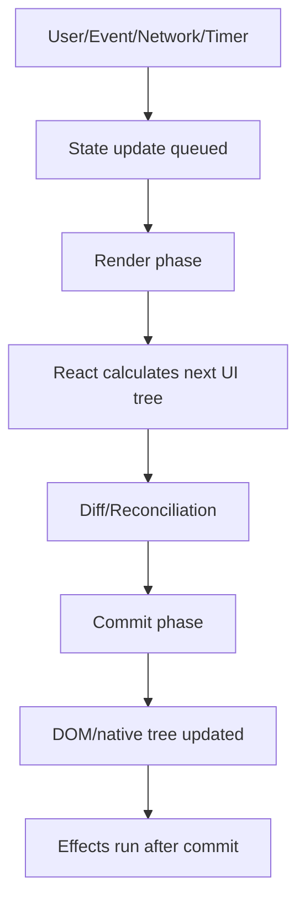
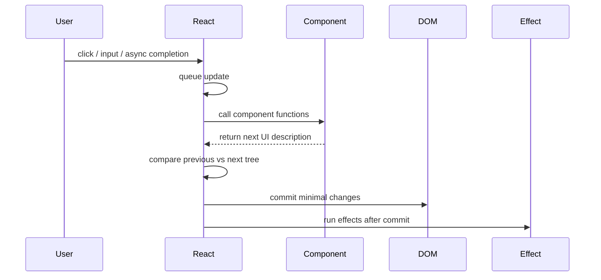
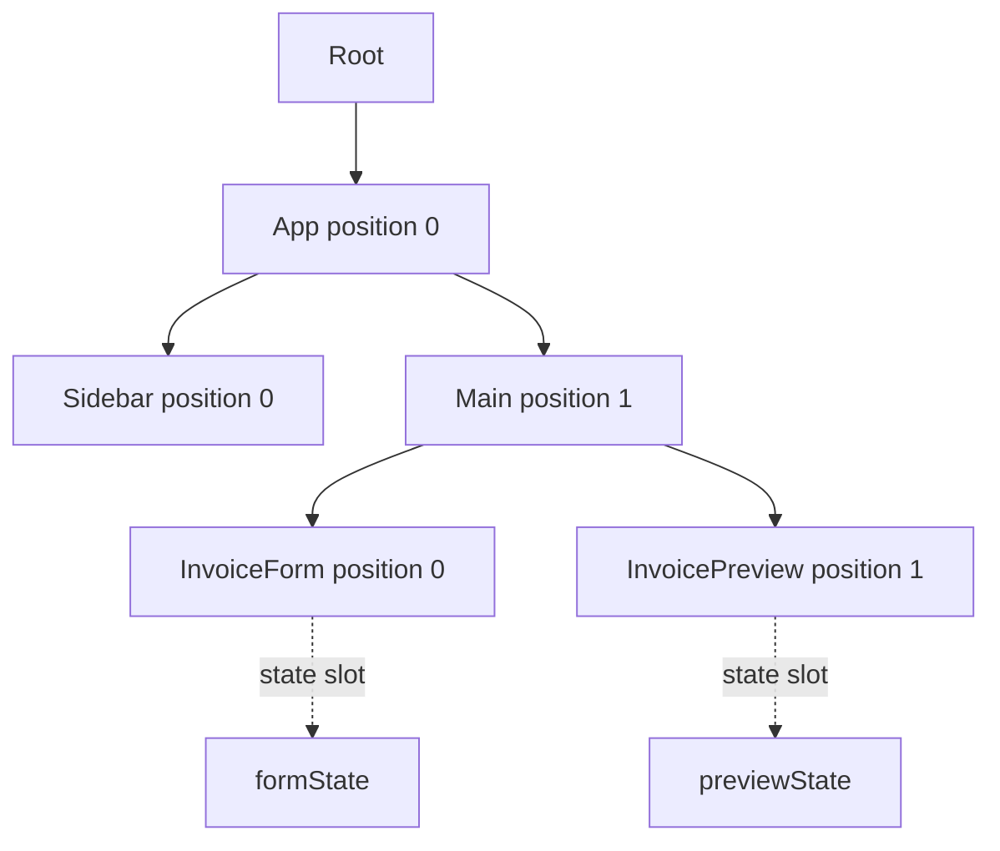
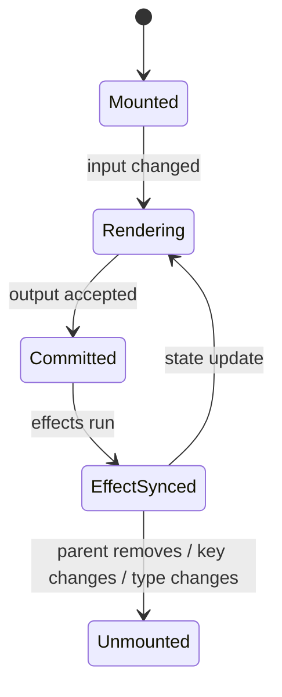
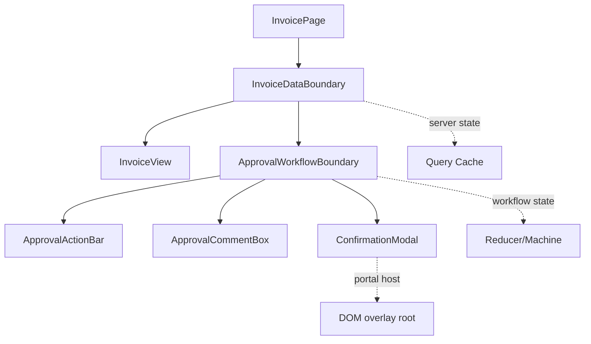

# Part 001 — React Runtime Mental Model

React advanced tidak dimulai dari `useState`, `useEffect`, Redux, Zustand, TanStack Query, atau XState.

React advanced dimulai dari kemampuan menjawab pertanyaan ini:

> Ketika sebuah nilai berubah, bagian mana dari UI yang dihitung ulang, bagian mana yang benar-benar menyentuh DOM, bagian mana yang mempertahankan state, bagian mana yang reset, dan bagian mana yang boleh melakukan side effect?

Kalau jawaban ini kabur, semua pattern di atasnya akan terasa seperti template. Kita bisa menulis custom hook, context provider, reducer, query cache, atau state machine, tetapi tetap mudah terjebak di bug klasik: stale closure, duplicated state, accidental remount, effect loop, cache mismatch, render mahal, dan component boundary yang bocor.

Part ini membangun mental model runtime React sebagai fondasi. Kita tidak akan menghafal API. Kita akan membangun model kerja yang bisa dipakai untuk mendesain, debug, dan mengaudit React application berskala besar.

---

## 1. Inti Model React

Model paling ringkas:

```txt
UI = f(props, state, context)
```

Komponen React adalah deskripsi UI dari input reaktifnya. Input reaktif utama adalah:

1. `props` dari parent.
2. `state` milik component/hook.
3. `context` dari provider di atasnya.

Jika salah satu input berubah, React dapat menghitung ulang output component. Output ini bukan “langsung DOM mutation”. Output component adalah deskripsi tree yang kemudian dibandingkan, direncanakan, dan di-commit.

Mental model yang lebih operasional:



Ada empat kata yang harus dipisahkan secara tegas:

| Istilah | Makna |
|---|---|
| **Trigger** | Sesuatu menyebabkan update: event, state setter, external store update, navigation, query cache update. |
| **Render** | React memanggil component untuk menghitung deskripsi UI berikutnya. |
| **Commit** | React menerapkan perubahan yang diperlukan ke host environment, misalnya DOM. |
| **Effect** | Sinkronisasi dengan sistem eksternal setelah commit, misalnya subscription, network imperative, analytics, DOM API non-render. |

Bug React sering muncul karena empat kata ini dicampur. Misalnya:

- Menganggap render sama dengan DOM update.
- Menganggap state setter langsung mengubah variable saat ini.
- Menganggap effect adalah lifecycle replacement umum.
- Menganggap setiap render berarti ada masalah performance.
- Menganggap memoization memperbaiki ownership yang salah.

---

## 2. Render Bukan Eksekusi Aplikasi

Render adalah kalkulasi UI. Render harus bisa dipanggil ulang, dibatalkan, diulang, atau dibandingkan tanpa membuat dunia luar berubah.

Kode seperti ini bermasalah:

```tsx
function InvoiceRow({ invoice }: { invoice: Invoice }) {
  auditLog.write('invoice_row_rendered', { invoiceId: invoice.id });

  return <tr>{invoice.number}</tr>;
}
```

Masalahnya bukan karena `auditLog.write` “jelek”. Masalahnya adalah lokasinya. Ia berada di render path. Jika React memanggil ulang render, log akan bertambah meskipun user tidak melihat perubahan bermakna. Dalam mode pengembangan, concurrent rendering, suspense, atau re-render parent, efek samping seperti ini bisa muncul lebih dari yang dibayangkan.

Versi yang lebih benar:

```tsx
function InvoiceRow({ invoice }: { invoice: Invoice }) {
  useEffect(() => {
    auditLog.write('invoice_row_visible', { invoiceId: invoice.id });
  }, [invoice.id]);

  return <tr>{invoice.number}</tr>;
}
```

Namun bahkan ini harus ditanya lagi: apakah benar visibility row perlu audit log per row? Atau seharusnya logging terjadi di interaction boundary, misalnya ketika user membuka invoice detail?

Prinsipnya:

```txt
Render menghitung UI.
Event handler merespons intent user.
Effect menyinkronkan React dengan sistem eksternal.
```

---

## 3. Purity Contract

React mengasumsikan component dan hook bersifat pure terhadap input reaktifnya. Artinya, untuk `props`, `state`, dan `context` yang sama, render harus menghasilkan output yang sama.

Contoh yang melanggar purity:

```tsx
function TicketBadge() {
  return <span>{Date.now()}</span>;
}
```

Atau:

```tsx
let nextId = 0;

function BadInput() {
  nextId += 1;
  return <input id={`field-${nextId}`} />;
}
```

Keduanya terlihat sederhana, tetapi output berubah bukan karena input reaktif berubah. Ini merusak prediktabilitas. Pada SSR/hydration, memoization, strict checks, atau compiler optimization, kode seperti ini mudah menjadi bug.

Lebih aman:

```tsx
function TicketBadge({ generatedAt }: { generatedAt: string }) {
  return <span>{generatedAt}</span>;
}
```

Atau jika nilai harus dibuat sekali untuk instance component:

```tsx
function StableDomId() {
  const id = useId();
  return <input id={id} />;
}
```

Purity bukan gaya functional programming yang abstrak. Purity adalah kontrak engineering:

| Kontrak | Dampak praktis |
|---|---|
| Render boleh diulang | React bisa debug, interrupt, re-render, dan optimize. |
| Render tidak mengubah dunia luar | Tidak ada duplicate network call, duplicate analytics, atau mutation misterius. |
| Output bergantung pada input | UI dapat diuji dan direasoning. |
| State tidak dimutasi langsung | React dapat mendeteksi perubahan melalui identity baru. |

---

## 4. Render Phase vs Commit Phase

React render phase menghitung “apa seharusnya UI berikutnya”. Commit phase menerapkan “perubahan apa yang perlu dibuat”.



Konsekuensi desain:

1. Kode render harus murah, pure, dan deterministic.
2. Mutation host environment terjadi saat commit, bukan saat render.
3. Effect berjalan setelah UI committed, bukan saat React masih menghitung UI.
4. Jika effect mengubah state tanpa guard, ia dapat membuat loop render → commit → effect → update → render.

Contoh loop:

```tsx
function BadCounter({ value }: { value: number }) {
  const [localValue, setLocalValue] = useState(value);

  useEffect(() => {
    setLocalValue(value);
  });

  return <span>{localValue}</span>;
}
```

Effect tanpa dependency berjalan setelah setiap commit. Jika ia selalu melakukan update, component dapat terus re-render.

Tetapi solusi bukan selalu “tambahkan dependency”. Solusi pertama adalah bertanya: apakah `localValue` memang perlu menjadi state?

```tsx
function GoodCounter({ value }: { value: number }) {
  return <span>{value}</span>;
}
```

Jika sebuah nilai dapat dihitung dari props/state saat render, biasanya ia bukan state baru. Ia derived value.

---

## 5. State Adalah Snapshot

State React sering tampak seperti variable biasa:

```tsx
const [count, setCount] = useState(0);
```

Tetapi `count` di dalam render tertentu adalah snapshot. Ketika `setCount` dipanggil, variable `count` dalam closure saat ini tidak berubah. React menjadwalkan render berikutnya dengan state baru.

Contoh klasik:

```tsx
function Counter() {
  const [count, setCount] = useState(0);

  function handleClick() {
    setCount(count + 1);
    setCount(count + 1);
    setCount(count + 1);
  }

  return <button onClick={handleClick}>{count}</button>;
}
```

Banyak engineer berharap klik akan menambah `3`. Tetapi dalam render saat ini, `count` tetap snapshot yang sama. Tiga update tersebut membaca nilai `count` yang sama.

Jika update berikutnya bergantung pada nilai sebelumnya, gunakan updater function:

```tsx
function Counter() {
  const [count, setCount] = useState(0);

  function handleClick() {
    setCount(c => c + 1);
    setCount(c => c + 1);
    setCount(c => c + 1);
  }

  return <button onClick={handleClick}>{count}</button>;
}
```

Mental model:

```txt
setState(value)      = antri penggantian nilai
setState(prev => x)  = antri transformasi terhadap nilai terbaru dalam queue
```

Ini penting untuk workflow production:

- multi-click button,
- optimistic updates,
- retry counter,
- batched form edits,
- selection state di table,
- collaborative UI,
- event stream yang masuk cepat.

---

## 6. Batching: React Mengumpulkan Update Sebelum Render Berikutnya

Ketika beberapa update terjadi dalam satu interaction, React dapat mengelompokkannya agar tidak merender terlalu sering.

Contoh:

```tsx
function SearchPanel() {
  const [query, setQuery] = useState('');
  const [page, setPage] = useState(1);
  const [selectedIds, setSelectedIds] = useState<string[]>([]);

  function handleSearchChange(nextQuery: string) {
    setQuery(nextQuery);
    setPage(1);
    setSelectedIds([]);
  }

  return <SearchBox value={query} onChange={handleSearchChange} />;
}
```

Secara mental, kita ingin tiga perubahan tersebut dianggap sebagai satu transisi user intent:

```txt
USER_CHANGED_SEARCH_QUERY
  -> query berubah
  -> page reset ke 1
  -> selection dikosongkan
```

Ini alasan mengapa pada state yang memiliki invariant lintas-field, reducer sering lebih baik daripada banyak setter terpisah. Banyak setter membuat transisi tersebar. Reducer memusatkan transisi.

```tsx
type SearchState = {
  query: string;
  page: number;
  selectedIds: string[];
};

type SearchEvent =
  | { type: 'queryChanged'; query: string }
  | { type: 'pageChanged'; page: number }
  | { type: 'selectionChanged'; selectedIds: string[] };

function reducer(state: SearchState, event: SearchEvent): SearchState {
  switch (event.type) {
    case 'queryChanged':
      return {
        ...state,
        query: event.query,
        page: 1,
        selectedIds: [],
      };
    case 'pageChanged':
      return { ...state, page: event.page };
    case 'selectionChanged':
      return { ...state, selectedIds: event.selectedIds };
  }
}
```

Bukan karena reducer lebih “enterprise”. Reducer lebih baik ketika perubahan state adalah domain transition, bukan assignment sederhana.

---

## 7. Identity: React Tidak Menyimpan State di Variable Component

React tidak menyimpan state “di function”. Function component hanya dipanggil untuk menghasilkan UI. State disimpan oleh React dan dihubungkan ke posisi component di tree.

Mental model:



React mempertahankan state jika ia melihat component dengan identity yang sama pada posisi yang sama. Identity biasanya dipengaruhi oleh:

1. Tipe component.
2. Posisi dalam tree.
3. `key` pada list atau explicit keyed branch.

Contoh accidental reset:

```tsx
function Page({ mode }: { mode: 'create' | 'edit' }) {
  if (mode === 'create') {
    return <InvoiceForm />;
  }

  return <InvoiceForm />;
}
```

Ini terlihat seperti dua branch berbeda, tetapi dari perspektif React, `InvoiceForm` berada pada posisi return yang sama. State dapat dipertahankan.

Jika kita ingin reset ketika mode berubah:

```tsx
function Page({ mode }: { mode: 'create' | 'edit' }) {
  return <InvoiceForm key={mode} mode={mode} />;
}
```

Sebaliknya, jika kita tidak ingin reset, jangan mengubah `key` secara tidak stabil.

Bug umum:

```tsx
function Rows({ rows }: { rows: Row[] }) {
  return rows.map(row => <RowEditor key={Math.random()} row={row} />);
}
```

Setiap render menghasilkan key baru. React menganggap semua row adalah instance baru. State reset, DOM remount, focus hilang, performance buruk.

Gunakan identity domain yang stabil:

```tsx
function Rows({ rows }: { rows: Row[] }) {
  return rows.map(row => <RowEditor key={row.id} row={row} />);
}
```

---

## 8. Reconciliation: React Mencari Perbedaan Antara Tree Lama dan Tree Baru

Reconciliation adalah proses React membandingkan output render sebelumnya dengan output render berikutnya.

Sederhananya:

```txt
previous tree + next tree -> minimal host changes
```

React tidak membandingkan “niat business”. React membandingkan tree UI.

Contoh:

```tsx
function Status({ state }: { state: 'draft' | 'approved' }) {
  if (state === 'approved') {
    return <ApprovedBadge />;
  }

  return <DraftBadge />;
}
```

Ketika `state` berubah dari `draft` ke `approved`, tipe component berubah dari `DraftBadge` ke `ApprovedBadge`. State internal `DraftBadge` tidak relevan lagi. Component lama di-unmount, component baru di-mount.

Jika sebenarnya kita ingin satu component yang mempertahankan state internal, desainnya harus berbeda:

```tsx
function StatusBadge({ state }: { state: 'draft' | 'approved' }) {
  return <span data-state={state}>{state}</span>;
}
```

Pola berpikirnya:

```txt
Jika component type berubah, identity berubah.
Jika key berubah, identity berubah.
Jika posisi berubah tanpa key stabil, identity bisa salah diasosiasikan.
```

---

## 9. Component Function Bukan Instance Object

Engineer dari OOP sering membawa asumsi bahwa component adalah object instance dengan lifecycle yang jelas. Function component bukan object instance yang kita pegang.

```tsx
function UserCard(props: UserCardProps) {
  const [expanded, setExpanded] = useState(false);
  return ...;
}
```

`UserCard` adalah fungsi render. State `expanded` bukan field object `UserCard`. State disimpan React dan diberikan kembali saat React memanggil fungsi itu pada posisi tree yang sama.

Implikasi:

- Jangan menyimpan mutable state di module variable untuk instance component.
- Jangan mendefinisikan component baru di dalam component jika ingin state preserved.
- Jangan menganggap closure selalu membaca state terbaru.
- Jangan membaca DOM saat render untuk mengambil keputusan layout.

Contoh buruk:

```tsx
function Dashboard() {
  function Widget() {
    const [open, setOpen] = useState(false);
    return <button onClick={() => setOpen(v => !v)}>{String(open)}</button>;
  }

  return <Widget />;
}
```

`Widget` didefinisikan ulang setiap render `Dashboard`. React dapat melihatnya sebagai component type baru. State dapat reset.

Lebih baik:

```tsx
function Widget() {
  const [open, setOpen] = useState(false);
  return <button onClick={() => setOpen(v => !v)}>{String(open)}</button>;
}

function Dashboard() {
  return <Widget />;
}
```

---

## 10. Event Handler Membaca Snapshot Render Saat Ia Dibuat

Perhatikan kode ini:

```tsx
function DelayedCounter() {
  const [count, setCount] = useState(0);

  function handleClick() {
    setTimeout(() => {
      alert(count);
    }, 3000);
  }

  return (
    <>
      <button onClick={() => setCount(c => c + 1)}>Increment</button>
      <button onClick={handleClick}>Show later</button>
    </>
  );
}
```

Jika user klik “Show later” saat count `2`, lalu increment sampai `10`, alert tetap menampilkan `2`. Bukan karena React lambat. Callback timeout menangkap snapshot render tempat ia dibuat.

Jika callback harus membaca nilai terbaru, ada beberapa pilihan tergantung intent:

### 10.1 Pakai updater function untuk update berbasis state terbaru

```tsx
setCount(c => c + 1);
```

### 10.2 Simpan latest value di ref untuk imperative callback

```tsx
function DelayedCounter() {
  const [count, setCount] = useState(0);
  const latestCountRef = useRef(count);

  useEffect(() => {
    latestCountRef.current = count;
  }, [count]);

  function handleClick() {
    setTimeout(() => {
      alert(latestCountRef.current);
    }, 3000);
  }

  return <button onClick={handleClick}>Show latest later</button>;
}
```

Ref adalah escape hatch. Jangan gunakan ref untuk menyembunyikan state yang seharusnya merender UI. Gunakan ref ketika kita butuh mutable cell yang tidak memicu render, terutama untuk interop imperative.

---

## 11. State, Derived Value, dan Effect Harus Dipisahkan

Banyak aplikasi React menjadi kompleks bukan karena butuh state management library, tetapi karena semua nilai diperlakukan sebagai state.

Contoh buruk:

```tsx
function CartSummary({ items }: { items: CartItem[] }) {
  const [total, setTotal] = useState(0);

  useEffect(() => {
    setTotal(items.reduce((sum, item) => sum + item.price * item.qty, 0));
  }, [items]);

  return <strong>{total}</strong>;
}
```

`total` adalah derived value dari `items`. Ia tidak perlu state dan tidak perlu effect.

Lebih baik:

```tsx
function CartSummary({ items }: { items: CartItem[] }) {
  const total = items.reduce((sum, item) => sum + item.price * item.qty, 0);
  return <strong>{total}</strong>;
}
```

Jika kalkulasi mahal, gunakan memoization sebagai optimization, bukan sebagai semantic requirement:

```tsx
function CartSummary({ items }: { items: CartItem[] }) {
  const total = useMemo(() => {
    return items.reduce((sum, item) => sum + item.price * item.qty, 0);
  }, [items]);

  return <strong>{total}</strong>;
}
```

Rule praktis:

```txt
Jika nilai bisa dihitung dari render input, jangan simpan sebagai state.
Jika nilai harus memicu UI berubah dan tidak bisa dihitung dari input lain, itu kandidat state.
Jika nilai hanya untuk sinkronisasi external system, itu kandidat effect/ref.
```

---

## 12. Host Tree Bukan Component Tree

React component tree dan DOM tree tidak selalu sama.

Satu component bisa menghasilkan banyak element. Banyak component bisa menghasilkan satu struktur DOM yang kecil. Fragment tidak membuat DOM node. Portal merender child ke lokasi DOM lain tetapi secara React tree masih berada di parent logical tree.

```tsx
function Field({ label, children }: PropsWithChildren<{ label: string }>) {
  return (
    <label>
      <span>{label}</span>
      {children}
    </label>
  );
}
```

`Field` adalah boundary component, tetapi DOM-nya hanya `label`, `span`, dan children.

Implikasi untuk architecture:

- Jangan menyamakan component boundary dengan DOM boundary.
- Jangan menyamakan component hierarchy dengan visual stacking, terutama dengan portal/modal.
- Jangan menyamakan provider hierarchy dengan DOM hierarchy.
- Jangan menganggap “component kecil” selalu berarti DOM kecil.

---

## 13. React Runtime sebagai State Machine Sederhana

Untuk keperluan reasoning, satu component dapat dibayangkan sebagai state machine kecil:



Tetapi jangan memaksakan lifecycle lama seperti `componentDidMount`/`componentDidUpdate` ke function component. Effect bukan lifecycle callback umum. Effect adalah sinkronisasi dengan external system.

Pertanyaan yang benar untuk effect:

```txt
External system apa yang perlu disinkronkan dengan state/props/context saat ini?
Apa dependency reaktifnya?
Bagaimana cleanup-nya?
Apakah sinkronisasi ini masih valid jika render diulang?
```

---

## 14. Strict Thinking: Apa yang Boleh Terjadi Saat Render Diulang?

Bayangkan React memanggil component Anda dua kali dengan input sama, lalu membuang hasil pertama. Apa yang boleh terjadi?

Boleh:

- Menghitung JSX.
- Menghitung derived value pure.
- Membuat object sementara yang tidak keluar dari render.
- Melakukan conditional rendering.

Tidak boleh:

- Mengirim request.
- Menulis analytics.
- Mutasi module-level state.
- Mengubah DOM.
- Mengubah object props.
- Menjadwalkan state update tanpa guard.

Checklist render safety:

```txt
[ ] Tidak ada write ke external system.
[ ] Tidak ada mutation terhadap props/state/context.
[ ] Tidak ada Date.now(), Math.random(), atau non-determinism untuk output penting.
[ ] Tidak ada setState unconditional di render.
[ ] Tidak ada component definition nested yang butuh preserve state.
[ ] Derived value dihitung langsung, bukan disalin ke state via effect.
```

---

## 15. Render Cost: Re-render Bukan Selalu Bug

Salah satu kesalahan performance React adalah panik saat component re-render. Re-render adalah cara React menghitung UI berikutnya. Yang harus dipantau:

1. Apakah render menghasilkan commit mahal?
2. Apakah render menghitung kalkulasi mahal?
3. Apakah render menyebabkan child tree besar ikut dihitung?
4. Apakah identity props berubah tanpa alasan?
5. Apakah state terlalu tinggi sehingga update kecil menyentuh subtree besar?
6. Apakah context value terlalu besar sehingga semua consumer rerender?

Jangan mulai dari `memo`. Mulai dari state topology dan boundary.

Contoh masalah state terlalu tinggi:

```tsx
function AppShell() {
  const [searchDraft, setSearchDraft] = useState('');

  return (
    <>
      <Header />
      <SearchInput value={searchDraft} onChange={setSearchDraft} />
      <LargeDashboard />
    </>
  );
}
```

Jika `searchDraft` hanya dibutuhkan `SearchInput`, jangan letakkan di `AppShell`.

```tsx
function AppShell() {
  return (
    <>
      <Header />
      <SearchInput />
      <LargeDashboard />
    </>
  );
}

function SearchInput() {
  const [draft, setDraft] = useState('');
  return <input value={draft} onChange={e => setDraft(e.target.value)} />;
}
```

State locality sering lebih efektif daripada memoization setelah arsitektur terlanjur bocor.

---

## 16. Mini Case Study: Invoice Approval Panel

Bayangkan UI approval invoice:

- Menampilkan detail invoice.
- User bisa memilih action: approve, reject, request changes.
- Ada comment draft.
- Ada permission gate.
- Ada optimistic pending state.
- Ada modal konfirmasi.

Desain buruk:

```tsx
function InvoicePage() {
  const [comment, setComment] = useState('');
  const [modalOpen, setModalOpen] = useState(false);
  const [selectedAction, setSelectedAction] = useState<string | null>(null);
  const [isSubmitting, setIsSubmitting] = useState(false);
  const [error, setError] = useState<string | null>(null);

  // many handlers mixed with rendering
}
```

Ini belum tentu salah untuk prototype. Tetapi untuk production, kita harus bertanya:

| State | Owner yang lebih masuk akal |
|---|---|
| `comment` | Form/comment component jika hanya lokal; workflow controller jika mempengaruhi submit transition. |
| `modalOpen` | Modal orchestrator atau action confirmation boundary. |
| `selectedAction` | Approval workflow state. |
| `isSubmitting` | Mutation/server-state layer atau action transition. |
| `error` | Mutation result boundary atau workflow state. |

Runtime mental model membantu memecah masalah:



Kita belum masuk implementasi lengkap. Untuk Part 001, poinnya adalah: runtime React tidak peduli domain Anda. React hanya melihat input, render, identity, commit, dan effects. Architecture kita harus membuat domain intent dipetakan dengan rapi ke mekanisme tersebut.

---

## 17. Common Failure Modes

### 17.1 Side effect saat render

Gejala:

- duplicate API call,
- duplicate analytics,
- inconsistent external state,
- hydration mismatch,
- bug hanya muncul di development/strict/concurrent scenario.

Akar:

```txt
Render dianggap sebagai tempat menjalankan aksi.
```

Perbaikan:

- Pindahkan user intent ke event handler.
- Pindahkan external synchronization ke effect.
- Pindahkan data fetching ke framework/server-state library jika cocok.

### 17.2 Duplicated derived state

Gejala:

- UI kadang stale,
- perlu effect untuk “sync props ke state”,
- banyak dependency sulit dijaga,
- ada dua nilai yang harus selalu sama.

Akar:

```txt
Nilai hasil kalkulasi disimpan sebagai source of truth baru.
```

Perbaikan:

- Hitung saat render.
- Gunakan selector.
- Gunakan reducer jika ada invariant lintas-field.

### 17.3 Accidental remount

Gejala:

- input kehilangan focus,
- form reset,
- animation restart,
- component mount/unmount berulang.

Akar:

```txt
Key tidak stabil, component type berubah, atau component didefinisikan di dalam render.
```

Perbaikan:

- Gunakan key domain yang stabil.
- Jangan pakai `Math.random()` atau index untuk list yang bisa reorder.
- Definisikan component di module scope.

### 17.4 Stale closure

Gejala:

- timeout membaca nilai lama,
- subscription callback memakai config lama,
- event handler async memakai state yang tidak terbaru.

Akar:

```txt
Closure membaca snapshot render tempat ia dibuat.
```

Perbaikan:

- Gunakan updater function.
- Perbaiki dependency effect.
- Gunakan ref untuk latest imperative value jika memang diperlukan.

### 17.5 Over-render karena state salah lokasi

Gejala:

- typing input terasa lambat,
- page besar re-render untuk state kecil,
- banyak memoization defensif.

Akar:

```txt
State ditempatkan terlalu tinggi atau context terlalu luas.
```

Perbaikan:

- Co-locate state.
- Split boundary.
- Gunakan selector/external store jika sharing granular diperlukan.

---

## 18. Runtime Decision Checklist

Saat menulis component, jalankan checklist ini:

```txt
1. Input reaktif component ini apa saja?
   - props?
   - state?
   - context?
   - external store?

2. Apakah render pure?
   - tidak mutate?
   - tidak side effect?
   - deterministic?

3. State ini benar-benar state atau derived value?

4. Identity component harus preserve atau reset kapan?
   - key stabil?
   - key sengaja dipakai untuk reset?

5. Update ini assignment sederhana atau transition domain?
   - useState cukup?
   - useReducer lebih aman?

6. Apakah ada external synchronization?
   - effect perlu?
   - cleanup jelas?
   - dependency benar?

7. Apakah state terlalu tinggi?
   - bisa co-locate?
   - perlu lifted?
   - perlu context/store?
```

---

## 19. Latihan Implementasi

### Exercise 1 — Hilangkan derived state yang tidak perlu

Refactor component ini:

```tsx
function ProductList({ products, query }: Props) {
  const [filtered, setFiltered] = useState<Product[]>([]);

  useEffect(() => {
    setFiltered(
      products.filter(product =>
        product.name.toLowerCase().includes(query.toLowerCase()),
      ),
    );
  }, [products, query]);

  return <List products={filtered} />;
}
```

Target:

- tidak ada effect,
- tidak ada duplicated state,
- optional memoization hanya jika filtering mahal.

### Exercise 2 — Perbaiki accidental remount

Cari bug:

```tsx
function DynamicPanel({ items }: { items: Item[] }) {
  return items.map(item => <ItemEditor key={`${item.id}-${Date.now()}`} item={item} />);
}
```

Target:

- state row editor tetap preserved saat parent re-render,
- state reset hanya jika domain identity berubah.

### Exercise 3 — Pisahkan event, render, dan effect

Refactor:

```tsx
function DownloadButton({ fileId }: { fileId: string }) {
  if (fileId) {
    analytics.track('download_button_seen', { fileId });
  }

  async function handleClick() {
    await api.download(fileId);
  }

  return <button onClick={handleClick}>Download</button>;
}
```

Target:

- render pure,
- tracking tidak double karena render ulang tanpa alasan,
- download tetap berada di user intent handler.

---

## 20. Kesimpulan Part 001

React runtime mental model dapat diringkas seperti ini:

```txt
Component render adalah kalkulasi UI dari props, state, dan context.
State adalah snapshot per render.
State setter menjadwalkan render berikutnya, bukan mengubah variable saat ini.
React mempertahankan state berdasarkan identity di tree.
Render harus pure; commit menyentuh host tree; effect menyinkronkan external system.
Performance dimulai dari state topology dan boundary, bukan memoization membabi buta.
```

Jika model ini kuat, Hooks dan state management akan terasa seperti konsekuensi alami. Jika model ini lemah, setiap library akan terlihat seperti solusi ajaib tetapi bug yang sama tetap muncul.

Part berikutnya membahas **Component Boundaries and State Ownership**: siapa pemilik state, kapan state harus lokal, kapan perlu diangkat, kapan harus menjadi context/store/server-state/workflow-state, dan bagaimana boundary yang salah membuat aplikasi React membusuk pelan-pelan.

---

## Referensi

- React Docs — Render and Commit: https://react.dev/learn/render-and-commit
- React Docs — State as a Snapshot: https://react.dev/learn/state-as-a-snapshot
- React Docs — Queueing a Series of State Updates: https://react.dev/learn/queueing-a-series-of-state-updates
- React Docs — Preserving and Resetting State: https://react.dev/learn/preserving-and-resetting-state
- React Docs — Components and Hooks must be pure: https://react.dev/reference/rules/components-and-hooks-must-be-pure
- React Docs — `useState`: https://react.dev/reference/react/useState
- React Docs — `useReducer`: https://react.dev/reference/react/useReducer
- React Docs — React 19 Release: https://react.dev/blog/2024/12/05/react-19
