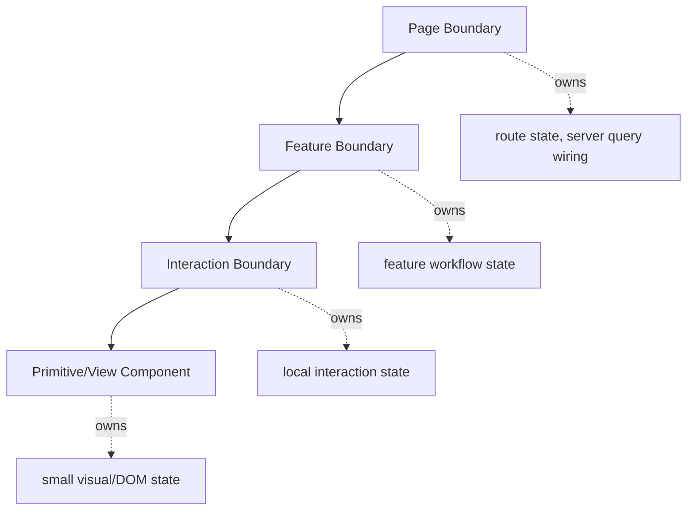
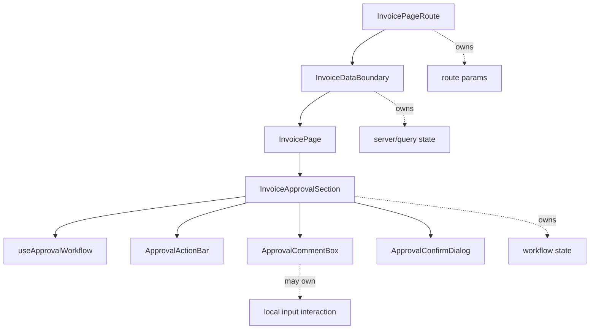
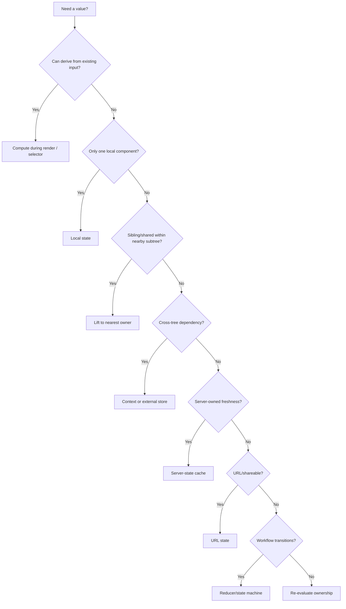

# Part 002 — Component Boundaries and State Ownership

Setelah memahami runtime mental model, pertanyaan berikutnya adalah:

> State ini milik siapa?

Pertanyaan ini terdengar sederhana, tetapi ia menentukan bentuk seluruh aplikasi React.

Banyak codebase React tidak rusak karena kurang library. Ia rusak karena ownership tidak jelas. State disimpan di tempat yang kebetulan mudah, bukan tempat yang semantically benar. Akibatnya:

- parent terlalu tahu detail child,
- child diam-diam menyalin props ke state,
- form memiliki dua source of truth,
- modal state tersebar di banyak page,
- query cache dicampur dengan UI draft,
- permission logic bocor ke component rendering,
- context menjadi global dumping ground,
- reducer berubah menjadi procedural script besar.

Part ini membahas component boundary dan state ownership sebagai skill arsitektur. Fokusnya bukan “pakai pattern apa”, tetapi “bagaimana menentukan batas tanggung jawab”.

---

## 1. Component Boundary Bukan Sekadar File Boundary

Membuat file `InvoiceForm.tsx` tidak otomatis menciptakan boundary yang baik. Boundary bukan soal folder. Boundary adalah kontrak.

Sebuah component boundary menjawab:

```txt
Apa yang component ini tahu?
Apa yang component ini miliki?
Apa yang component ini boleh ubah?
Apa yang component ini janjikan kepada parent?
Apa yang parent tidak perlu tahu?
```

Contoh boundary buruk:

```tsx
function InvoicePage() {
  const [lineItems, setLineItems] = useState<LineItem[]>([]);
  const [selectedLineItemId, setSelectedLineItemId] = useState<string | null>(null);
  const [lineItemDraftName, setLineItemDraftName] = useState('');
  const [lineItemDraftAmount, setLineItemDraftAmount] = useState('');
  const [lineItemError, setLineItemError] = useState<string | null>(null);

  return (
    <LineItemEditor
      items={lineItems}
      selectedId={selectedLineItemId}
      draftName={lineItemDraftName}
      draftAmount={lineItemDraftAmount}
      error={lineItemError}
      onSelect={setSelectedLineItemId}
      onDraftNameChange={setLineItemDraftName}
      onDraftAmountChange={setLineItemDraftAmount}
      onErrorChange={setLineItemError}
      onItemsChange={setLineItems}
    />
  );
}
```

Masalahnya bukan jumlah props semata. Masalahnya adalah parent memiliki detail internal editor. Parent tahu draft field, selection, error, dan mutation mechanics. `LineItemEditor` bukan boundary; ia hanya view dari state yang dipreteli di parent.

Versi boundary lebih sehat:

```tsx
function InvoicePage() {
  const [lineItems, setLineItems] = useState<LineItem[]>([]);

  return (
    <LineItemEditor
      value={lineItems}
      onChange={setLineItems}
    />
  );
}
```

Atau jika line item editing adalah workflow kompleks:

```tsx
function InvoicePage() {
  return <InvoiceLineItemSection invoiceId={invoiceId} />;
}
```

Parent cukup tahu ada section yang mengelola line items. Detail draft, selection, validation, modal, dan transition menjadi milik boundary tersebut.

---

## 2. Ownership: Definisi Operasional

State owner adalah boundary yang bertanggung jawab atas lima hal:

| Tanggung jawab | Pertanyaan |
|---|---|
| **Creation** | Siapa yang membuat nilai awal? |
| **Mutation** | Siapa yang boleh mengubah nilai? |
| **Validation** | Siapa yang menjamin invariant? |
| **Reset** | Siapa yang memutuskan kapan nilai kembali ke initial state? |
| **Persistence/Synchronization** | Siapa yang menyimpan atau menyinkronkan nilai ke luar React? |

Jika lima jawaban ini tersebar tanpa desain, ownership belum jelas.

Contoh state:

```tsx
const [selectedInvoiceIds, setSelectedInvoiceIds] = useState<string[]>([]);
```

Pertanyaan ownership:

```txt
Siapa membuat selectedInvoiceIds? Table? Page? BulkActionToolbar?
Siapa boleh menambah/menghapus item? Row? Header checkbox? Keyboard shortcut?
Siapa menjamin selected ids masih valid setelah filter berubah?
Siapa reset selection setelah bulk approve?
Apakah selection masuk URL, local storage, server, atau hanya ephemeral?
```

Jawaban berbeda menghasilkan arsitektur berbeda. Tidak ada pattern tunggal yang selalu benar.

---

## 3. State Locality: Default yang Benar

Default paling aman:

```txt
Letakkan state sedekat mungkin dengan tempat state itu digunakan.
Naikkan state hanya ketika ada alasan nyata.
```

State lokal mudah dipahami karena blast radius kecil.

```tsx
function ExpandableDescription({ text }: { text: string }) {
  const [expanded, setExpanded] = useState(false);

  return (
    <section>
      <p>{expanded ? text : `${text.slice(0, 120)}...`}</p>
      <button onClick={() => setExpanded(value => !value)}>
        {expanded ? 'Show less' : 'Show more'}
      </button>
    </section>
  );
}
```

`expanded` tidak perlu diketahui page, router, query cache, atau global store. Ia ephemeral UI state yang hanya mempengaruhi component ini.

Sinyal bahwa state perlu naik:

1. Dua sibling membutuhkan nilai yang sama.
2. Parent perlu mengkoordinasikan child berdasarkan state itu.
3. State harus survive unmount/remount tertentu.
4. State perlu masuk URL/shareable navigation.
5. State harus disinkronkan dengan server/cache/external system.
6. State adalah bagian dari workflow lintas component.
7. State harus diobservasi untuk audit/analytics/debugging.

Jangan angkat state karena “mungkin nanti dibutuhkan”. Premature lifting adalah sumber over-render, prop drilling, dan coupling.

---

## 4. Local, Lifted, Controlled, Uncontrolled

Empat istilah ini sering tercampur.

### 4.1 Local state

State dimiliki dan diubah component sendiri.

```tsx
function Toggle() {
  const [on, setOn] = useState(false);
  return <button onClick={() => setOn(v => !v)}>{String(on)}</button>;
}
```

### 4.2 Lifted state

State dipindahkan ke ancestor agar beberapa child dapat berbagi.

```tsx
function PreferencesPanel() {
  const [density, setDensity] = useState<'compact' | 'comfortable'>('comfortable');

  return (
    <>
      <DensitySelector value={density} onChange={setDensity} />
      <Preview density={density} />
    </>
  );
}
```

### 4.3 Controlled component

Parent menjadi source of truth. Child menerima `value` dan melaporkan intent perubahan via callback.

```tsx
function TextField({ value, onChange }: Props) {
  return <input value={value} onChange={event => onChange(event.target.value)} />;
}
```

### 4.4 Uncontrolled component

Component mengelola state internal sendiri. Parent mungkin hanya memberi initial/default value.

```tsx
function TextField({ defaultValue }: { defaultValue?: string }) {
  const [value, setValue] = useState(defaultValue ?? '');
  return <input value={value} onChange={event => setValue(event.target.value)} />;
}
```

Controlled bukan selalu lebih baik. Uncontrolled bukan selalu lebih sederhana. Pilih berdasarkan ownership.

| Kondisi | Pilihan biasanya lebih baik |
|---|---|
| Parent harus validate setiap perubahan | Controlled |
| Parent hanya butuh final value saat submit | Uncontrolled/local form state bisa cukup |
| Nilai harus sinkron dengan URL | Controlled di route/page boundary |
| Nilai hanya visual ephemeral | Local/uncontrolled |
| Nilai dipakai banyak component | Lifted/context/store tergantung granularitas |

---

## 5. Jangan Menyalin Props ke State Tanpa Alasan Kuat

Anti-pattern umum:

```tsx
function UserEditor({ user }: { user: User }) {
  const [name, setName] = useState(user.name);
  const [email, setEmail] = useState(user.email);

  return ...;
}
```

Ini tidak selalu salah. Tetapi ia membuat fork dari source of truth.

Pertanyaannya:

```txt
Apakah name/email adalah draft yang sengaja boleh berbeda dari user asli?
Atau developer hanya menyalin props karena input butuh state?
```

Jika memang draft form, beri nama dan boundary yang jelas:

```tsx
type UserDraft = {
  name: string;
  email: string;
};

function createDraft(user: User): UserDraft {
  return {
    name: user.name,
    email: user.email,
  };
}

function UserEditor({ user, onSubmit }: Props) {
  const [draft, setDraft] = useState(() => createDraft(user));

  function resetDraft() {
    setDraft(createDraft(user));
  }

  return ...;
}
```

Tetapi sekarang kita harus menjawab reset semantics:

- Jika `user` prop berubah, apakah draft harus reset?
- Jika user sedang mengetik lalu server data refetch, apakah draft harus overwrite?
- Jika form dirty, apakah navigasi harus confirm?

Untuk reset saat identity user berubah:

```tsx
function UserEditorScreen({ user }: { user: User }) {
  return <UserEditor key={user.id} user={user} />;
}
```

Menggunakan `key` di boundary bisa lebih bersih daripada effect “sync props to state”, selama reset memang diinginkan saat identity berubah.

---

## 6. Boundary Granularity

Boundary yang terlalu besar menjadi god component. Boundary yang terlalu kecil membuat orchestration tersebar.

Gunakan tiga level berpikir:



### 6.1 Page boundary

Menghubungkan route, query params, data fetching, permission, layout, dan feature composition.

```tsx
function InvoicePageRoute() {
  const invoiceId = useInvoiceIdFromRoute();
  const permissions = useInvoicePermissions(invoiceId);

  return (
    <InvoiceDataBoundary invoiceId={invoiceId}>
      <InvoicePage permissions={permissions} />
    </InvoiceDataBoundary>
  );
}
```

### 6.2 Feature boundary

Mewakili business capability.

```tsx
function InvoiceApprovalSection({ invoiceId }: { invoiceId: string }) {
  const workflow = useInvoiceApprovalWorkflow(invoiceId);

  return (
    <section>
      <ApprovalSummary state={workflow.state} />
      <ApprovalActions commands={workflow.commands} />
    </section>
  );
}
```

### 6.3 Interaction boundary

Mengelola interaction lokal: dropdown, tabs, accordion, inline editor, row selection.

```tsx
function InlineAmountEditor({ value, onCommit }: Props) {
  const [draft, setDraft] = useState(String(value));
  const [editing, setEditing] = useState(false);

  return ...;
}
```

### 6.4 Primitive/view component

Render-only atau hampir render-only.

```tsx
function StatusBadge({ status }: { status: InvoiceStatus }) {
  return <span data-status={status}>{status}</span>;
}
```

---

## 7. Ownership Matrix

Gunakan matrix ini saat mendesain state.

| State type | Example | Owner ideal | Reset trigger | Storage |
|---|---|---|---|---|
| Ephemeral visual | dropdown open, hover intent | component lokal | blur, close, unmount | memory |
| Input draft | unsaved form value | form boundary | submit, cancel, entity switch | memory/session optional |
| Selection | selected row ids | table/feature boundary | filter change, bulk action, entity switch | memory/URL optional |
| Route filter | search query, page, tab | route/page boundary | navigation | URL |
| Server data | invoice detail | query/cache boundary | invalidation/refetch | server/cache |
| Permission | canApprove | auth/capability boundary | user/session/resource change | server/cache/context |
| Workflow | approval step, pending action | workflow boundary/reducer/machine | completion/cancel/entity switch | memory/server optional |
| Global preference | theme, locale | app provider | user setting change | local/server persistence |
| External subscription | websocket status | external store/provider | disconnect/unmount | external system |

Matrix ini bukan dogma. Ia alat diskusi. Dalam code review, matrix ini membantu menghindari argumen subjektif seperti “menurut saya lebih enak di parent”.

---

## 8. Designing Props as Boundary Contract

Props bukan sekadar parameter. Props adalah public API component.

Bad API:

```tsx
<InvoiceApprovalButtons
  invoice={invoice}
  user={user}
  permissions={permissions}
  onSetPendingAction={setPendingAction}
  onOpenModal={setModalOpen}
  onSetComment={setComment}
  onSubmit={submitApproval}
/>
```

Component ini menerima terlalu banyak implementation detail. Sulit tahu siapa owner sebenarnya.

Better API:

```tsx
<InvoiceApprovalActions
  availableActions={availableActions}
  pendingAction={pendingAction}
  onActionRequested={requestAction}
/>
```

Atau lebih domain-oriented:

```tsx
<InvoiceApprovalActions
  state={approvalState}
  commands={approvalCommands}
/>
```

Tetapi hati-hati: `commands` object bisa menjadi tempat menyembunyikan coupling. Ia baik jika command adalah capability jelas, bukan kantong fungsi acak.

Contoh command interface:

```tsx
type ApprovalCommands = {
  requestApprove(): void;
  requestReject(): void;
  cancelPendingAction(): void;
  confirmPendingAction(comment: string): Promise<void>;
};
```

Command baik jika:

- namanya menyatakan intent domain,
- tidak memaparkan setter mentah,
- menjaga invariant di owner,
- mudah diuji.

---

## 9. Callback Contract: Event, Bukan Setter Bocor

Hindari meneruskan setter mentah jika child tidak seharusnya tahu struktur state parent.

Kurang baik:

```tsx
function Parent() {
  const [filters, setFilters] = useState({ query: '', page: 1 });

  return <SearchBox setFilters={setFilters} />;
}
```

Child sekarang bisa mengubah `page`, menghapus field, atau melanggar invariant.

Lebih baik:

```tsx
function Parent() {
  const [filters, setFilters] = useState({ query: '', page: 1 });

  function handleQueryChanged(query: string) {
    setFilters(current => ({
      ...current,
      query,
      page: 1,
    }));
  }

  return <SearchBox value={filters.query} onQueryChanged={handleQueryChanged} />;
}
```

Callback harus merepresentasikan intent, bukan implementation:

| Hindari | Lebih baik |
|---|---|
| `setOpen` | `onOpenChange` jika controlled, `onDismissRequested` jika intent close |
| `setUser` | `onUserDraftChanged`, `onUserSelected`, `onUserSaved` |
| `setFilters` | `onQueryChanged`, `onSortChanged`, `onPageRequested` |
| `setModal` | `onDeleteRequested`, `onCancelRequested` |

---

## 10. Component Ownership vs Domain Ownership

UI state owner tidak selalu sama dengan domain owner.

Contoh: invoice status dimiliki server/domain. UI boleh menampilkan optimistic status sementara, tetapi tidak boleh menganggap dirinya source of truth permanen.

```tsx
type Invoice = {
  id: string;
  status: 'draft' | 'submitted' | 'approved' | 'rejected';
};
```

`status` berasal dari server. Jika UI membuat local state:

```tsx
const [status, setStatus] = useState(invoice.status);
```

maka ada risiko fork. Kecuali kita sedang membuat optimistic layer yang jelas.

Lebih eksplisit:

```tsx
function useOptimisticInvoiceStatus(invoice: Invoice) {
  const [optimisticStatus, setOptimisticStatus] = useState<Invoice['status'] | null>(null);

  return {
    visibleStatus: optimisticStatus ?? invoice.status,
    setOptimisticStatus,
    clearOptimisticStatus: () => setOptimisticStatus(null),
  };
}
```

Ini menyatakan ada dua lapisan:

```txt
server truth     = invoice.status
optimistic layer = optimisticStatus
visible value    = optimisticStatus ?? invoice.status
```

Model eksplisit lebih mudah diuji dan debug daripada diam-diam menyalin server data ke state lokal.

---

## 11. State Boundary dan Invariant

State tidak boleh hanya didesain berdasarkan siapa yang render. Desain berdasarkan invariant.

Contoh invariant table selection:

```txt
selectedIds harus subset dari visible row ids jika selection hanya berlaku untuk halaman saat ini.
```

Jika `visibleRows` ada di parent, tetapi `selectedIds` dimiliki child table, siapa menjaga invariant ketika filter berubah?

Pilihan 1: parent owner untuk rows dan selection.

```tsx
function InvoiceSearchPage() {
  const [filters, setFilters] = useState(defaultFilters);
  const rows = useInvoiceRows(filters);
  const [selectedIds, setSelectedIds] = useState<string[]>([]);

  function handleFiltersChanged(next: Filters) {
    setFilters(next);
    setSelectedIds([]);
  }

  return (
    <InvoiceTable
      rows={rows}
      selectedIds={selectedIds}
      onSelectionChanged={setSelectedIds}
    />
  );
}
```

Pilihan 2: feature boundary owner.

```tsx
function InvoiceSearchSection() {
  const model = useInvoiceSearchModel();

  return (
    <>
      <InvoiceFilters value={model.filters} onChange={model.changeFilters} />
      <InvoiceTable
        rows={model.rows}
        selectedIds={model.selectedIds}
        onSelectionChanged={model.changeSelection}
      />
    </>
  );
}
```

Pilihan 2 lebih scalable ketika invariant bertambah: pagination, sorting, bulk action, refresh, URL sync.

Rule:

```txt
State yang harus menjaga invariant bersama sebaiknya dimiliki oleh boundary yang sama.
```

---

## 12. Controlled/Uncontrolled Hybrid: Hati-Hati

Banyak design system component mendukung controlled dan uncontrolled mode:

```tsx
type ToggleProps = {
  checked?: boolean;
  defaultChecked?: boolean;
  onCheckedChange?: (checked: boolean) => void;
};
```

Ini berguna, tetapi rawan bug jika mode berubah di tengah lifecycle.

Implementasi sederhana:

```tsx
function Toggle({ checked, defaultChecked = false, onCheckedChange }: ToggleProps) {
  const isControlled = checked !== undefined;
  const [internalChecked, setInternalChecked] = useState(defaultChecked);

  const currentChecked = isControlled ? checked : internalChecked;

  function update(next: boolean) {
    if (!isControlled) {
      setInternalChecked(next);
    }

    onCheckedChange?.(next);
  }

  return (
    <button
      aria-pressed={currentChecked}
      onClick={() => update(!currentChecked)}
    >
      {currentChecked ? 'On' : 'Off'}
    </button>
  );
}
```

Invariants:

- Jika `checked` disediakan, parent owner.
- Jika `checked` tidak disediakan, component owner.
- `defaultChecked` hanya initial value, bukan reactive update.
- Jangan diam-diam berpindah mode controlled ↔ uncontrolled.

Untuk production design system, biasanya perlu warning development jika mode berubah.

---

## 13. Boundary Smells

### 13.1 Prop explosion

Bukan setiap banyak props salah. Tetapi banyak props yang mewakili internal state child adalah smell.

Sinyal:

```txt
Parent punya 10 useState hanya untuk membuat satu child bekerja.
```

Solusi:

- pindahkan state ke child/feature boundary,
- bentuk object value yang jelas,
- gunakan reducer/model hook,
- desain callback berbasis intent.

### 13.2 Setter tunneling

Setter parent diteruskan melewati banyak layer.

```tsx
<App setFilters={setFilters}>
  <Layout setFilters={setFilters}>
    <Sidebar setFilters={setFilters}>
      <SearchBox setFilters={setFilters} />
    </Sidebar>
  </Layout>
</App>
```

Solusi mungkin:

- composition slot,
- context capability,
- route-level model hook,
- URL state,
- external store jika memang cross-tree.

### 13.3 Context as dumping ground

```tsx
const AppContext = createContext({
  user: null,
  theme: 'light',
  filters: {},
  selectedIds: [],
  modal: null,
  setUser() {},
  setTheme() {},
  setFilters() {},
  setSelectedIds() {},
  setModal() {},
});
```

Ini bukan architecture. Ini global object disguised as context.

Solusi:

- pisah context berdasarkan volatility dan ownership,
- context untuk dependency/capability yang memang cross-tree,
- external store untuk granular subscription,
- jangan campur unrelated state.

### 13.4 Parent orchestrates child internals

Gejala:

```tsx
<Form
  nameDraft={nameDraft}
  setNameDraft={setNameDraft}
  emailDraft={emailDraft}
  setEmailDraft={setEmailDraft}
  touched={touched}
  setTouched={setTouched}
  validationErrors={errors}
  setValidationErrors={setErrors}
/>
```

Jika parent tidak punya alasan domain untuk memegang semua itu, form boundary bocor.

### 13.5 Child owns state but parent owns reset condition

Contoh:

```tsx
function UserEditor({ user }: { user: User }) {
  const [draft, setDraft] = useState(() => createDraft(user));
  // what happens when user.id changes?
}
```

Solusi:

- parent memberi `key={user.id}` untuk reset by identity,
- atau child explicit effect untuk reset dengan dirty guard,
- atau draft owner dipindahkan ke parent/route boundary jika parent perlu kontrol reset.

---

## 14. Refactoring: Dari Boundary Bocor ke Boundary Sehat

### Step 1 — Tandai state berdasarkan owner saat ini

```tsx
function InvoicePage() {
  const [comment, setComment] = useState('');
  const [confirmOpen, setConfirmOpen] = useState(false);
  const [pendingAction, setPendingAction] = useState<ApprovalAction | null>(null);
  const [submitError, setSubmitError] = useState<string | null>(null);

  return ...;
}
```

### Step 2 — Kelompokkan berdasarkan invariant

```txt
Approval workflow:
- comment
- confirmOpen
- pendingAction
- submitError
```

Keempat state berubah bersama sebagai bagian dari workflow approval. Maka mereka kandidat satu boundary.

### Step 3 — Buat model hook

```tsx
type ApprovalState = {
  comment: string;
  confirmOpen: boolean;
  pendingAction: ApprovalAction | null;
  submitError: string | null;
};

function useApprovalWorkflow(invoiceId: string) {
  const [state, setState] = useState<ApprovalState>({
    comment: '',
    confirmOpen: false,
    pendingAction: null,
    submitError: null,
  });

  function requestAction(action: ApprovalAction) {
    setState(current => ({
      ...current,
      pendingAction: action,
      confirmOpen: true,
      submitError: null,
    }));
  }

  function cancelAction() {
    setState(current => ({
      ...current,
      pendingAction: null,
      confirmOpen: false,
      submitError: null,
    }));
  }

  function changeComment(comment: string) {
    setState(current => ({ ...current, comment }));
  }

  return {
    state,
    commands: {
      requestAction,
      cancelAction,
      changeComment,
    },
  };
}
```

### Step 4 — Expose intent, bukan setter

```tsx
function InvoiceApprovalSection({ invoiceId }: { invoiceId: string }) {
  const approval = useApprovalWorkflow(invoiceId);

  return (
    <>
      <ApprovalActionBar
        pendingAction={approval.state.pendingAction}
        onActionRequested={approval.commands.requestAction}
      />
      <ApprovalCommentBox
        value={approval.state.comment}
        onChange={approval.commands.changeComment}
      />
      <ApprovalConfirmDialog
        open={approval.state.confirmOpen}
        action={approval.state.pendingAction}
        onCancel={approval.commands.cancelAction}
      />
    </>
  );
}
```

Kita belum sempurna. Di part reducer/state machine nanti, workflow ini akan dibuat lebih ketat. Tetapi ownership sudah membaik: state terkait approval tidak lagi tercecer di page.

---

## 15. Diagram Ownership untuk Feature Boundary



Boundary sehat tidak berarti semua state berada di satu tempat. Boundary sehat berarti setiap state punya pemilik yang dapat dijelaskan.

---

## 16. Decision Framework: Di Mana State Diletakkan?

Gunakan pertanyaan berurutan ini:

```txt
1. Apakah nilai bisa dihitung dari props/state/context yang sudah ada?
   Ya -> derived value, jangan state.

2. Apakah nilai hanya dipakai satu component kecil?
   Ya -> local state.

3. Apakah beberapa sibling membutuhkan nilai yang sama?
   Ya -> lift ke ancestor terdekat yang masuk akal.

4. Apakah nilai harus dibaca cross-tree tanpa prop drilling?
   Ya -> context atau external store, tergantung volatility dan granularitas.

5. Apakah nilai berasal dari server dan butuh freshness/invalidation?
   Ya -> server-state cache/query layer.

6. Apakah nilai merepresentasikan URL/shareable navigation?
   Ya -> URL/route state.

7. Apakah nilai merepresentasikan multi-step process dengan invariant transisi?
   Ya -> reducer/state machine/workflow boundary.

8. Apakah nilai perlu survive reload/session?
   Ya -> persistence layer dengan hydration semantics jelas.
```

Decision tree:



---

## 17. Applying Ownership to Common React Problems

### 17.1 Search filters

| Question | Answer |
|---|---|
| Is query shareable/bookmarkable? | Put in URL. |
| Is query only draft before submit? | Local draft, commit to URL/query on submit. |
| Does changing query reset page? | Owner should manage query and page together. |
| Does selection reset after query change? | Selection owner must observe query transition. |

### 17.2 Modal state

| Situation | Owner |
|---|---|
| Simple local confirm inside button group | Local interaction boundary |
| Page-level modal controlled by route | Route/page boundary |
| Global command palette/modal stack | Overlay orchestrator/provider |
| Modal part of workflow transition | Workflow boundary |

### 17.3 Form state

| Situation | Owner |
|---|---|
| Small input display toggle | Local component |
| Full form draft | Form boundary |
| Parent needs live validation and submit orchestration | Controlled form/model hook |
| Multi-step form with guards | Reducer/state machine |
| Server validation | Mutation/server-state boundary plus form boundary |

### 17.4 Auth/permission

Permission is not just UI state. Permission is capability derived from user/session/resource policy.

Bad:

```tsx
if (user.role === 'admin') {
  return <ApproveButton />;
}
```

Better boundary:

```tsx
function ApprovalGate({ invoiceId, children }: PropsWithChildren<{ invoiceId: string }>) {
  const capability = useInvoiceCapability(invoiceId);

  if (!capability.canApprove) {
    return null;
  }

  return children;
}
```

Even better for auditable enterprise UI: expose reason and disabled state explicitly.

```tsx
<ApproveButton
  disabled={!capability.canApprove}
  disabledReason={capability.reason}
/>
```

Ownership rule:

```txt
UI boleh menampilkan permission result, tetapi policy source of truth harus berada di authorization/domain layer.
```

---

## 18. Testing Ownership

Boundary yang baik mudah dites.

### 18.1 Local interaction test

```tsx
it('toggles expanded state locally', async () => {
  render(<ExpandableDescription text="long text..." />);

  await user.click(screen.getByRole('button', { name: /show more/i }));

  expect(screen.getByText(/long text/i)).toBeVisible();
});
```

### 18.2 Controlled contract test

```tsx
it('reports value changes to parent', async () => {
  const onChange = vi.fn();

  render(<TextField value="" onChange={onChange} />);

  await user.type(screen.getByRole('textbox'), 'abc');

  expect(onChange).toHaveBeenCalled();
});
```

### 18.3 Model hook/reducer test

```tsx
it('resets selection when query changes', () => {
  const state = reducer(
    {
      query: 'old',
      page: 3,
      selectedIds: ['inv-1'],
    },
    { type: 'queryChanged', query: 'new' },
  );

  expect(state).toEqual({
    query: 'new',
    page: 1,
    selectedIds: [],
  });
});
```

Jika invariant sulit dites, kemungkinan ownership tersebar.

---

## 19. Code Review Checklist

Gunakan checklist ini saat review React component:

```txt
[ ] State punya owner yang jelas.
[ ] Parent tidak menyimpan detail internal child tanpa alasan.
[ ] Child tidak menyalin props ke state tanpa reset semantics jelas.
[ ] Callback merepresentasikan intent, bukan setter bocor.
[ ] State yang menjaga invariant bersama berada dalam boundary yang sama.
[ ] Derived value tidak disimpan sebagai state.
[ ] Controlled/uncontrolled mode jelas dan tidak berubah diam-diam.
[ ] Context tidak menjadi dumping ground untuk unrelated state.
[ ] State server tidak difork menjadi client state tanpa optimistic model eksplisit.
[ ] Reset behavior sengaja: key, command reset, atau transition reducer.
```

---

## 20. Latihan Implementasi

### Exercise 1 — Identifikasi owner

Untuk setiap state berikut, tentukan owner ideal:

```txt
- search input draft
- committed search query
- current page
- selected row ids
- invoice detail data
- approve modal open state
- approve comment draft
- mutation pending state
- user permission to approve
- table column visibility preference
```

Buat matrix:

```txt
state | owner | reset trigger | storage | reason
```

### Exercise 2 — Refactor setter tunneling

Refactor ini:

```tsx
function App() {
  const [filters, setFilters] = useState(defaultFilters);

  return <Layout filters={filters} setFilters={setFilters} />;
}

function Layout({ filters, setFilters }: Props) {
  return <Sidebar filters={filters} setFilters={setFilters} />;
}

function Sidebar({ filters, setFilters }: Props) {
  return <SearchBox filters={filters} setFilters={setFilters} />;
}
```

Target minimal:

- `SearchBox` menerima `value` dan `onQueryChanged`, bukan `setFilters`.
- Reset page saat query berubah tetap berada di owner.
- Pertimbangkan composition agar `Layout` tidak perlu tahu filters.

### Exercise 3 — Controlled/uncontrolled component

Buat `Disclosure` component yang mendukung:

```tsx
<Disclosure defaultOpen />
<Disclosure open={open} onOpenChange={setOpen} />
```

Invariants:

- controlled jika `open !== undefined`,
- uncontrolled jika tidak,
- `defaultOpen` hanya initial,
- callback tetap dipanggil di dua mode,
- tidak ada state fork ambigu.

---

## 21. Kesimpulan Part 002

Component boundary adalah kontrak ownership, bukan sekadar file atau folder.

Ringkasnya:

```txt
State owner adalah boundary yang membuat, mengubah, memvalidasi, mereset, dan menyinkronkan state.
Letakkan state sedekat mungkin dengan penggunaan, naikkan hanya jika ada alasan.
Controlled component berarti parent source of truth; uncontrolled berarti component source of truth.
Jangan menyalin props ke state kecuali sedang membuat draft/optimistic layer dengan reset semantics jelas.
Callback harus membawa intent, bukan membocorkan setter.
State yang menjaga invariant bersama sebaiknya dimiliki boundary yang sama.
```

Part berikutnya akan masuk ke **Thinking in State Topology**: klasifikasi state yang lebih formal—local, lifted, derived, context, external store, URL state, server state, persistent state, ephemeral state, dan workflow state—serta bagaimana memilih topology sebelum memilih library.

---

## Referensi

- React Docs — Sharing State Between Components: https://react.dev/learn/sharing-state-between-components
- React Docs — Choosing the State Structure: https://react.dev/learn/choosing-the-state-structure
- React Docs — Preserving and Resetting State: https://react.dev/learn/preserving-and-resetting-state
- React Docs — State as a Snapshot: https://react.dev/learn/state-as-a-snapshot
- React Docs — Components and Hooks must be pure: https://react.dev/reference/rules/components-and-hooks-must-be-pure
- React Docs — `useState`: https://react.dev/reference/react/useState
- React Docs — `useReducer`: https://react.dev/reference/react/useReducer
